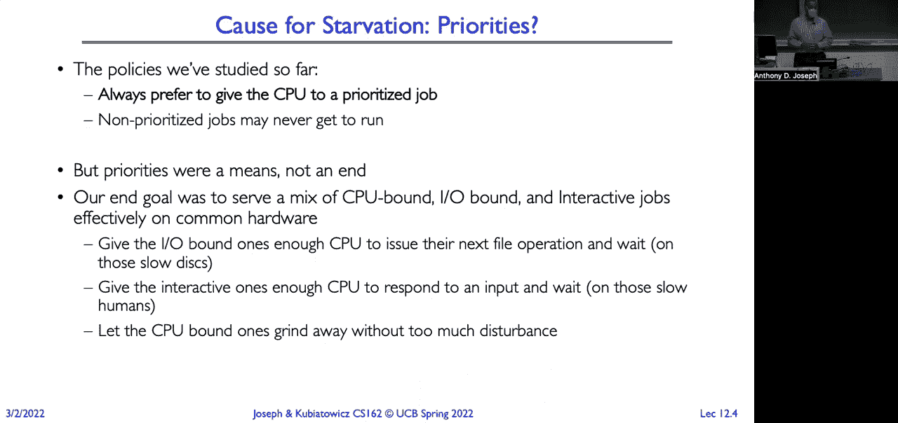
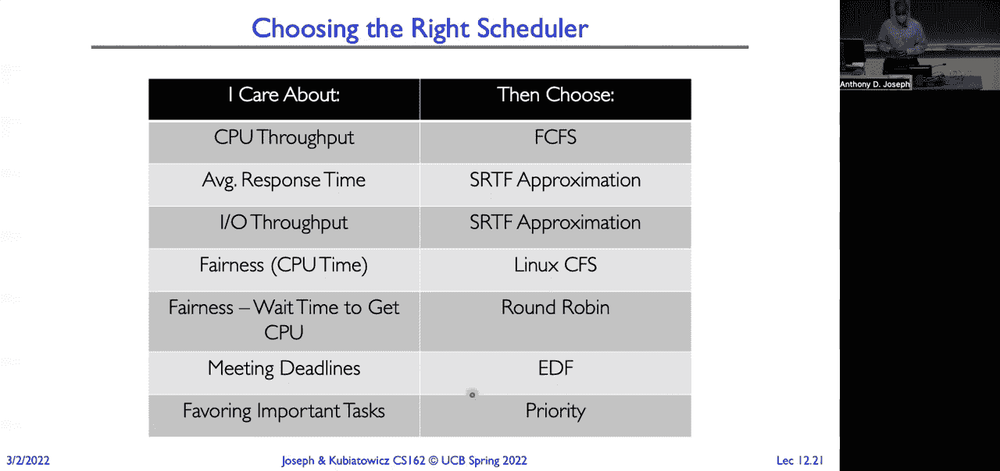
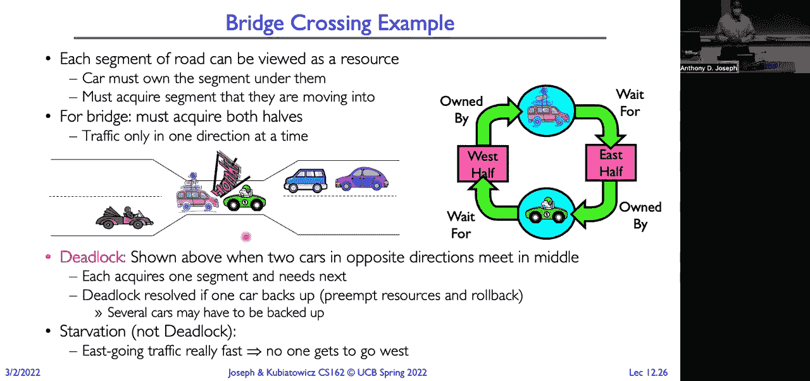
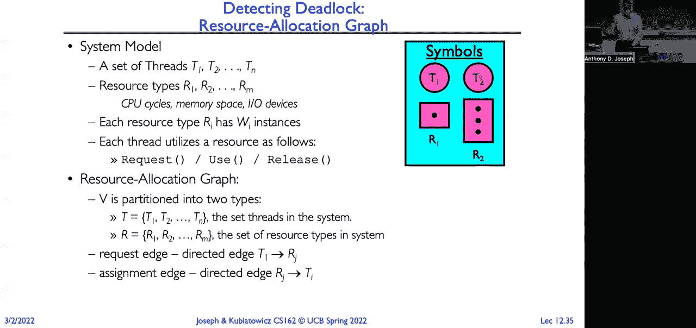
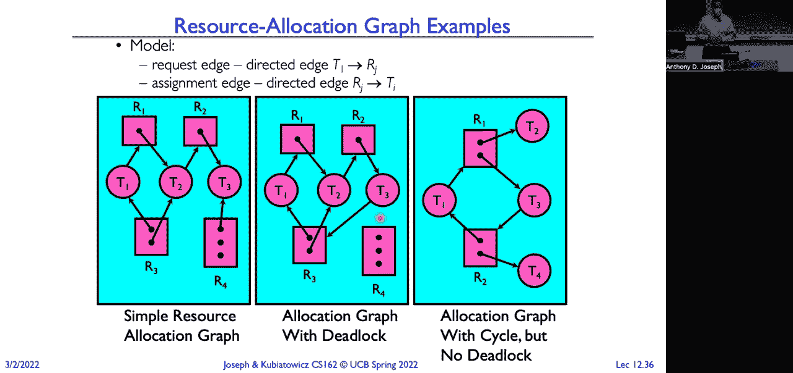

# 🧠 课程 P12：调度算法、饿死与死锁

在本节课中，我们将学习调度算法的其他方面，特别是如何避免任务“饿死”，并深入探讨计算机系统中一个经典且棘手的问题——死锁。我们将了解死锁的成因、如何检测它，以及有哪些策略可以预防或避免死锁的发生。

---

## 🔄 调度算法回顾与饿死问题



上一节我们介绍了多种实时调度算法，其核心目标是保证性能的可预测性。无论是硬实时系统（如防抱死制动系统）还是软实时系统（如多媒体流），我们都希望任务能在截止时间前完成。

然而，像**最短剩余时间优先**和**多级反馈队列**这类基于优先级的算法，存在一个共同问题：**低优先级或长时间运行的任务可能永远无法获得CPU时间，这种现象称为“饿死”**。

例如，在最短剩余时间优先算法中，系统总是优先运行剩余时间最短的任务，这可能导致长时间任务被无限期推迟。同样，在严格的优先级调度中，高优先级任务会持续占用CPU，导致低优先级任务无法执行。

### 解决饿死：公平分配CPU

为了避免饿死，我们需要确保所有任务都能获得一定的CPU份额，而不是单纯基于优先级。以下是两种旨在实现公平分配的调度策略：

#### 1. 彩票调度法
基本思想是为每个任务分配一定数量的“彩票”，其数量与任务应获得的CPU份额成正比。调度时，系统随机抽取一张彩票，并运行对应的任务。

**核心公式**：
*   总票数 = 所有任务票数之和
*   任务运行概率 = 该任务票数 / 总票数

这种方法在长期统计上是公平的，但在短期可能由于伪随机数生成器的偏差导致不公平。

#### 2. 步幅调度法
为了消除随机性带来的短期不公平，步幅调度采用了确定性的方法。

**核心计算**：
*   步长 = 一个大常数 / 任务持有的票数
*   每个任务维护一个“通行证”计数器。
*   调度器总是选择**通行证计数器最小**的任务运行。
*   任务运行后，将其步长值累加到自己的通行证计数器中。

**代码逻辑示意**：
```python
# 初始化
stride_A = LARGE_CONSTANT / tickets_A
stride_B = LARGE_CONSTANT / tickets_B
pass_A = 0
pass_B = 0

# 调度决策
if pass_A < pass_B:
    run_task(A)
    pass_A += stride_A
else:
    run_task(B)
    pass_B += stride_B
```
持有更多票数（即步长更小）的任务，其通行证计数器增长更慢，因此会被更频繁地调度，从而精确地按比例分配CPU时间。

---

## ⚖️ Linux 完全公平调度器

在实践中，一个著名的公平调度器实现是Linux的**完全公平调度器**。它的设计目标是让每个进程获得平等的CPU时间，同时保持良好的响应速度。

CFS的核心思想是维护每个任务的**虚拟运行时间**。系统跟踪每个任务实际获得的CPU时间，但通过一个与任务优先级（`nice`值）相关的权重将其转换为虚拟时间。调度器总是选择**虚拟运行时间最小**的任务来运行，这相当于在追赶进度最慢的任务。

**关键机制**：
*   **目标延迟**：保证每个可运行任务都能在该时间段内至少运行一次。
*   **最小粒度**：为防止过多的上下文切换开销，时间片有下限。
*   **虚拟运行时间**：实际CPU时间根据任务权重进行缩放。高权重任务（低`nice`值）的虚拟时间增长更慢，从而获得更多实际CPU时间。


**权重计算示例**：
两个任务`nice`值相差5，则低`nice`值（高优先级）任务的权重约为高`nice`值任务的3倍（`1.25^5 ≈ 3`），因此它获得的CPU时间也约为3倍。

---



## 📊 如何选择调度算法？

调度算法的选择取决于应用场景和性能目标：
*   **CPU吞吐量**：可能选择**先来先服务**。
*   **平均响应时间**：可能选择**最短剩余时间优先**或其近似算法。
*   **公平性**：可能选择**Linux CFS**或**步幅调度**。
*   **截止时间保证**：使用**最早截止时间优先**等实时调度算法。
*   **优先级处理**：使用**严格优先级调度**，但需警惕饿死。

一个重要的洞见是：**调度算法主要在系统资源利用率未饱和时效果显著**。当利用率接近100%时，响应时间会急剧上升，任何调度算法都难以维持良好性能，此时增加资源（如更快的CPU）才是根本解决方案。

---

## ☠️ 从饿死到死锁

饿死是指任务因持续无法获得所需资源而无法进展，但理论上这种状况可能结束（例如高优先级任务停止）。而死锁则是一种更严重的、无法自行解除的僵局。



**死锁的经典例子**：
两个线程，线程A持有锁X并申请锁Y，同时线程B持有锁Y并申请锁X。双方都等待对方释放资源，导致程序永久停滞。

**死锁发生的四个必要条件**（必须同时满足）：
1.  **互斥**：资源一次只能被一个线程使用。
2.  **占用并等待**：线程持有资源的同时，等待其他资源。
3.  **不可抢占**：资源只能由持有者自愿释放。
4.  **循环等待**：存在一个线程和资源的循环等待链（T1等T2的资源，T2等T3的资源，...，Tn等T1的资源）。

---

## 🔍 死锁的检测与表示

我们可以使用**资源分配图**来检测死锁。图中包含两类节点：**进程**和**资源**。边表示关系：
*   **请求边**：进程 -> 资源（进程申请该资源）
*   **分配边**：资源 -> 进程（该资源实例已分配给进程）

**死锁检测算法**：
1.  初始化一个“可用资源”向量。
2.  查找一个其所有资源请求都能被当前可用资源满足的进程。
3.  假设该进程运行完毕，释放其所有资源，将这些资源加入“可用资源”池。
4.  重复步骤2-3，直到没有进程可被标记为完成。
5.  如果最终仍有进程未完成，则这些进程处于死锁状态。

---

## 🛡️ 死锁的应对策略



主要有四种处理死锁的策略：

1.  **预防**：通过破坏死锁四个必要条件中的至少一个来设计系统。
    *   **破坏互斥**：让资源可共享（但很多资源如打印机无法共享）。
    *   **破坏占用并等待**：要求线程一次性申请所有所需资源（可能导致资源利用率低）。
    *   **破坏不可抢占**：允许从线程中抢占资源（实现复杂）。
    *   **破坏循环等待**：对所有资源类型进行全局排序，要求线程必须按序申请资源（例如，必须先申请锁A，才能申请锁B）。



2.  **避免**：系统在分配资源前进行**安全性检查**，仅当分配后系统仍处于安全状态（即所有进程仍能找到一个完成序列）时才进行分配。**银行家算法**是经典的死锁避免算法。

3.  **检测与恢复**：允许死锁发生，但定期运行检测算法。一旦发现死锁，则采取恢复措施，如：
    *   **终止进程**：强制终止一个或多个死锁进程。
    *   **资源抢占**：从一个进程剥夺资源给另一个进程，需处理被抢占进程的恢复。

4.  **忽略**：像“鸵鸟算法”一样，假设死锁永远不会发生或极少发生。这对于许多通用操作系统是常见做法，将避免死锁的责任交给了应用程序开发者。

---

## 🎯 本节总结

本节课我们一起深入探讨了调度中的公平性问题与死锁现象。
*   我们首先分析了基于优先级的调度可能导致的**任务饿死**问题，并介绍了**彩票调度**和**步幅调度**等旨在公平分配CPU的算法，以及Linux系统中著名的**完全公平调度器**的实现原理。
*   随后，我们将话题转向更严重的**死锁**问题，明确了死锁发生的四个必要条件，学习了如何使用**资源分配图**进行死锁检测。
*   最后，我们系统梳理了应对死锁的四大策略：**预防、避免、检测与恢复、以及忽略**，并了解了各种策略的典型方法与其优缺点。


理解这些概念对于设计和开发稳定、高效的并发系统至关重要。