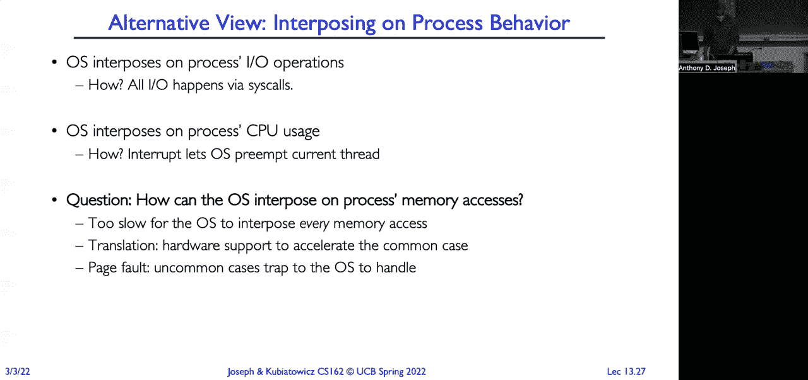
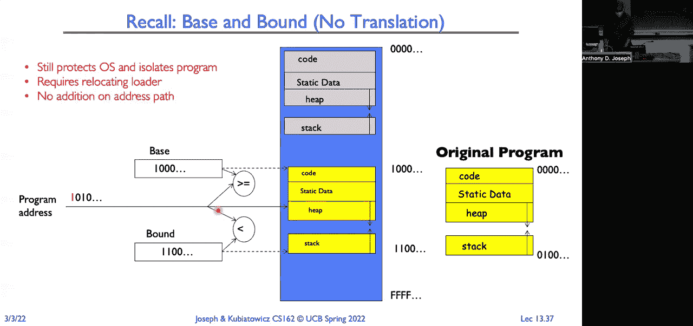
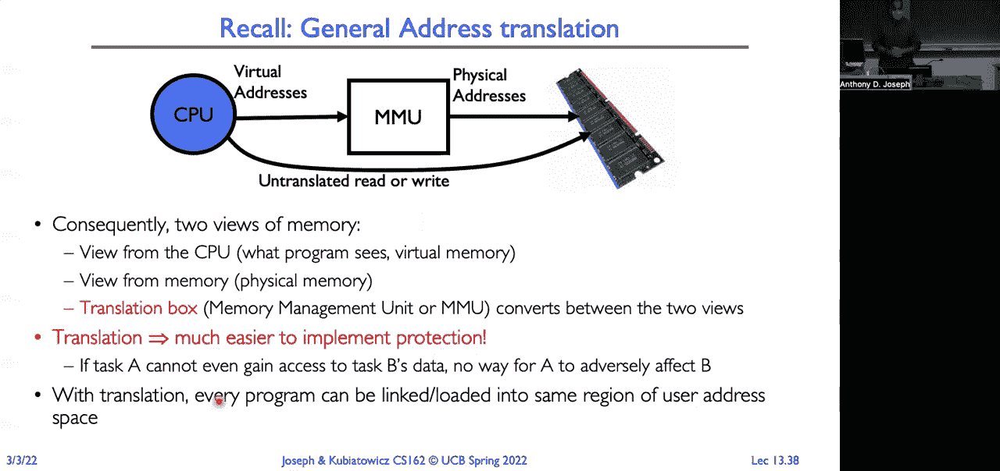
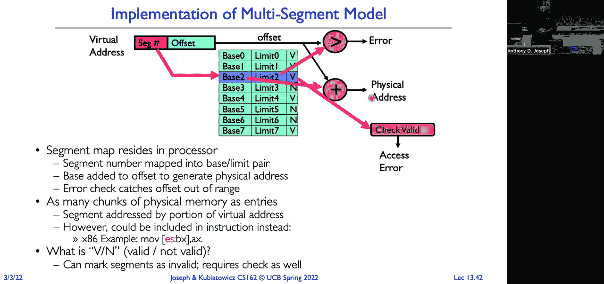
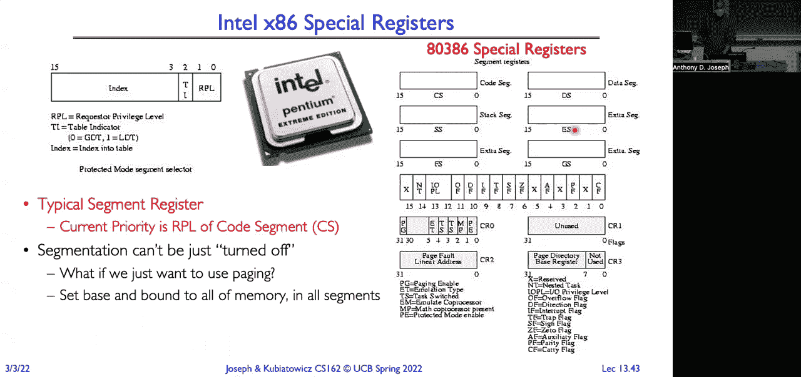

# P13：第13讲：内存1 地址转换与虚拟内存 - RubatoTheEmber - BV1L541117gr

好的，我们开始吧。

我们将结束死锁讨论，特别是看一下死锁避免和预防算法。然后我们将切换话题，开始讨论内存管理。这是我们将进行的几次关于地址转换和虚拟内存的讲座中的第一讲。好了，记住，死锁基本上是一种饥饿的形式。

与饥饿情况不同，我们有线程无限期地等待，比如低优先级线程等待高优先级线程。而死锁和饥饿的关键区别在于，死锁中我们有资源的循环等待。这里线程A等待资源2，而资源2被线程B持有，线程B又在等待资源1。

这是由线程A持有的。死锁和饥饿之间的第二个关键区别在于，尽管饥饿可以结束，对吧，阻塞低优先级线程的那些高优先级线程可以离开。而死锁则必须依赖外部干预才能停止。否则，它会永远停留在那个状态中。好了，现在记住。

死锁有四个必要条件。首先是互斥条件，其次是保持等待，其三是无抢占，第四是循环等待。去除其中任何一个条件，就不会发生死锁。好了，给你们一个提示。你们可能会在期中考试中看到一个关于这个的问题，假设给你一个情境。

如果有抢占，死锁会发生吗？不会，对吧。同样地，如果没有循环等待，就不会发生死锁。因此，另一种思考方式是，如果我们能确保系统始终具备抢占能力，那么我们可以确保系统不会发生死锁。

系统将是无死锁的。如果我们能保证没有循环等待资源，我们就可以确保不会发生死锁。好了。那么一些可以用来预防死锁的技术是让线程在一开始就请求它们所需的所有资源。对吧。但那不太实际。对吧。

如果你告诉程序员，要求他们请求他们可能需要的所有资源，而且如果你搞错了，运行三小时后我就杀掉你的进程。他们会高估所需的资源。这样会导致资源利用率低，效率差。另一种替代方案是强制所有线程按照某种顺序请求资源。对吧。

如果我们能保证每个人按某种顺序请求资源，那么我们就不会有循环等待。对吧？我们不会有资源的循环请求。我们已经去掉了那四个条件中的一个，所以我们不会有死锁。我们可能会因为其他原因导致系统饥饿，但那可以自我解决。一个例子是我们对锁的获取施加字典顺序（lexicographic ordering）。

所以我们说你先执行 X 点 acquire，再执行 Y 点 acquire，再执行 Z 点 acquire。这样就避免了这种情况：一个线程持有 X 并且想要 Y，而另一个线程持有 Y 并且想要 X。因为那样就不符合字典顺序。我们可以跨资源进行这种安排，要求你首先请求所有内存资源。

你需要的所有资源，先请求所有的磁盘资源，再请求所有打印机资源，然后是所有网络资源，等等。通过保证顺序。你不能回头重新请求之前的资源。这样我们就不会有资源的循环等待请求。因此，我们就不会有死锁。

有什么问题吗？好的。那么另一种方法是说，我一次请求所有资源。所以这里我做了修改，原本是线程 A 执行 X 点 acquire，Y 点 acquire，线程 B 执行 Y 点 acquire，X 点 acquire。我们改为调用这个原语 acquire both。这样，A 将同时获取 X 和 Y，而 B 将获取 Y 和 Z。

并且我们将保证这些操作是原子性的。也就是说，要么同时获取 X 和 Y，要么都不获取。对吧？

那么，如果我想再添加一个，比如说，嗯，我想添加 W，怎么办？

或者我可能需要获取三重锁（acquire triple）。然后我想添加，嗯，我不知道，U。现在我需要获取四重锁（acquire quad）。对吧？嗯，另一种思考方式是，为什么我们不在获取锁的过程中加一个保护机制呢？所以我们可以设定，Z 作为我们的保护锁。然后你先获取 Z，再获取你需要的所有锁，最后释放 Z。对吧？

现在在这个临界区内部，顺序就不再重要了，因为一次只能有一个线程获取锁。对吧？那么，另一种方式是，如我所说，采用一致的顺序。我们为锁的获取分配某种字典顺序（lexic），在这个例子中，就是从 A 到 Z。

这样就禁止了 B 执行这个操作。B 不能先获取 Y 再获取 X。所以，B 必须先获取 X，再获取 Y。那么释放的顺序呢？

我们释放 X 在先，释放 Y 在后，重要吗？是吗？不重要？好，我们来做个投票。认为释放顺序不重要的人请举手。好。认为释放顺序重要的人请举手。好，猜猜看？

你们两个都是对的。每个人都是对的。所以从语义角度来看，顺序并不重要。无论是先释放一个锁再释放另一个锁，还是其他顺序，都是一样的。但如果我们在线程 A 等待 Y 或者等待 X 的时候释放 X 会发生什么呢？然后再等待 Y？对吧？这时线程 A 会被唤醒，抓取 X，因为 X 现在是空闲的。

然后去抓取 Y，结果发现，哦，为什么被阻塞了？对吧？

然后它就会再次进入休眠状态，我们释放 Y 后再返回上下文，重新唤醒它。如果我们反过来，先释放 Y 再释放 X，那么当线程 A 唤醒时，它可以访问 X，就会抓取 X，然后继续获取 Y。所以从语义角度来看，顺序并不重要。

从性能和效率的角度来看，顺序确实很重要。因此，我们希望避免我们拥有的上下文数量，以及等待和排队的问题。有问题吗？

好的。明白了。所以，再次提醒，我们可以做排序的另一个例子是我们的火车网络，在那里，我们有这些试图右转的火车。我们可以简单地设置一个维度顺序规则，先往东西方向行驶，然后才能往南北方向行驶。这样就不允许那个从南北方向行驶，然后试图转向东西方向的火车。

这个北南方向行驶的火车，然后试图转向东西方向。这样就避免了死锁的发生。更棒的是，实际为此开发的多处理器网络是多维的，可能像超立方体一样。

所以，你有 XYZ 方向，然后你按顺序排列。所以你首先在 X 方向行驶，然后在 Y 方向行驶，再然后在 Y 方向行驶，最后在 Z 方向行驶。这样就避免了在这些网络中出现死锁。而且你可以无限扩展它们，它们会相互环绕等等。好的。

那么我们来看一些从死锁中恢复的技术。首先，我们可以终止线程，强迫它放弃资源。如果我们回到单车桥的例子，你会看到两辆车停在那里，僵持不下，没有车能前进，因为另一辆车挡住了路段。

它必须获得锁。而简单的解决方法是，哥斯拉从海洋中出来，抓起一辆车，扔进海里，现在其他车就能继续走了。死锁解决了。好吧，这对那些现在在海里的车里的乘客来说并不好，但你知道，我们解决了问题。其实并没有。更大的问题是，通常情况下，问题并没有得到根本解决。

我们需要互斥锁，因为我们要修改某些状态。而且我们希望以一种原子性的方式进行修改，因为我们可能正在进行某些操作，这会产生不一致性。例如，我们正在把钱从一个银行账户转到另一个账户，并且还需要更新分行的银行账户余额。

所以，如果我们只是拿掉锁并让其他人运行，我们将面临不一致的数据操作。因此，一般来说，这并不是一个好的方法。因此，我们可以采取的另一种方法是预先抢占资源，而不实际终止线程。我们之前已经见过这种情况，对吧？你知道，我们有一个CPU，我们抢占这个CPU。

从正在运行的线程中拿走资源，保存所有与线程相关的状态到内存中。然后加载新线程的状态，然后我们就能运行它。所以也许我们可以用这些其他资源来做类似的事情。对于像锁这样的资源可能行不通，但它可能对内存这样的资源有效。

我们稍后再回到这个问题，我们将在接下来的讲座中花费很多时间讨论它。但这并不总是与计算语义相符。没有真正的概念可以“抢占锁”并从某人那里拿走锁。所以另一种方法是回滚死锁线程的操作。

所以，这就像按下Tivo上的倒带按钮，顺便提一下，Tivo是原始的DVR，后来被所有有线电视公司和其他公司复制。然后就像什么都没发生过一样。然后我们让事情继续进行。现在一个问题是，如果我们将每个人都回滚到最初的起始条件，然后再将它们推进，我们可能会再次进入死锁状态。所以也许我们选择其中一个线程。

所以我们后退一辆车，并回滚它后面的所有车。现在朝着另一个方向行驶的车可以继续前进。所以你只需要弄清楚哪个方案最合理。这是一种在数据库中处理事务时常用的方法。

如果事务导致系统进入死锁状态，你只需要中止一部分事务，然后重新尝试。当我们看操作系统时，还有很多其他方法可以用来避免死锁，或者说在这种情况下，我们讨论的是如何从死锁中恢复。在大多数情况下，它们通常简单地忽略死锁可能发生的情况，并尽量进行设计。

这样它们就不会导致死锁。好了，回到关于抢占资源的评论，记住我们之前的例子。线程A和B正在尝试在我们机器上分配两个兆字节，而我们的机器只有两个兆字节的物理内存。所以如果一个线程得到一个兆字节，另一个线程得到另一个兆字节。

然后它们无法获取所需的另一个兆字节来继续运行，两者都无法继续。现在，如果我们不再使用物理内存，而是说这些线程将操作虚拟内存，那么我们可以提供一种“无限内存”的假象。现在我们并不需要真正做到无限。我们可以仅仅说，你知道的。

让人产生有两GB内存的幻觉。这对这两个线程来说足够了，每个线程都能获得两兆字节。事实上，我们可能会有几十个，甚至上百个线程都在做同样的事情。而对每一个线程来说，它都会觉得有无限的内存。

只需要让这个幻觉看起来足够大，这样你就不会遇到问题。好的。另一种思考方式是，如果我们没有虚拟内存，当我们想要批准一个请求时，我们可以预empt（抢占），比如，先将它的一兆字节区域的内容复制到磁盘，清空它们，然后让B使用该区域。当B完成后。

然后我们会将A唤醒，将它的内存内容复制回物理内存，允许它继续执行。因此从它的角度来看，它只是需要等待很长时间才能获得它的第二个一兆字节的分配，但除此之外，它并没有看到其他副作用。这不会影响语义。

仅仅是计算的时机。问题？好的。好的。那么让我们看看一种避免死锁的技术。这里有一个，我会，我会。我要提出这个作为一个想法。当一个线程请求资源时，操作系统会检查如果批准这个请求，会不会导致死锁？

如果答案是否定的，那么它会继续批准资源请求，立即执行。如果答案是肯定的，那么它会让请求等待其他线程释放资源。那么这看起来似乎是合理的，但实际上它并不起作用。让我们看看为什么。我们来看一下我们的示例，我们正在运行的示例，线程A和线程B。

线程A运行时，执行`x.acquire`。于是我们检查。好的。如果我们批准`x.acquire`，那会导致死锁吗？不会。好的。因为有可能我们先执行`x.acquire`，然后执行`y.acquire`，然后A离开，过一段时间后B会运行。好的。那么现在我们回到线程B。

授予B请求，为什么`x.acquire`会导致系统死锁？不会。所以我们批准了这个请求。现在我们回到A，A尝试执行`x.acquire`，然后它被阻塞。现在我们回到B，B尝试执行，但它必须等待。所以我们不能批准`y.acquire`。它实际上会将系统置于死锁状态。等等，系统已经处于死锁中了。

所以问题在于，我们只是看到了请求本身。我们没有看到它对未来可能产生的影响。因此，我们必须看一下系统未来的状态。实际上，我们有三种不同的系统状态。

有一种安全状态，即系统可以延迟资源请求，从而避免死锁。但是我们当前不处于死锁状态，也没有死锁的风险。死锁发生了，现在已经太晚了，无法挽回。然后在这中间有一种奇怪的状态，就是我们还没有发生死锁，但线程的请求很可能会导致死锁的高风险。

所以我们希望保持系统在安全状态。因为一旦我们进入了不安全状态，就存在风险，事情会迅速变得糟糕，到那时就游戏结束了，无法挽回。好了，请注意，处于死锁状态时，系统也被视为不安全的。你已经死锁了，死锁已经发生了。好吧。

所以死锁避免的关键在于防止我们进入一个不安全的状态，从而避免死锁。好了，现在我们要做的是，代替我们原来的想法，做如下处理。请求到达时，操作系统将检查这个请求，看如果我批准这个请求，它是否会使系统进入不安全状态？答案是否定的。我们可以立即批准。

如果答案是肯定的，我们就让它等待。好了，让我们看一个例子。这里我们执行 X.dot acquire。这会把系统置于死锁的潜在风险中吗？

有前进的路径吗？当然，有前进的路径，对吧？

如果 Y 现在可用，且如果批准了 Y 锁，A 就可以退出系统。那么，当我们查看 B 并执行 Y.dot acquire 时，会发生什么呢？嗯，如果我们批准了它，是否还有前进的路径？没有，对吧？因为一旦我们将 Y 锁批准给 B，就将它置于一个无法完成 X 锁的状态。

如果我们展望 B 未来要做的事情，B 会想要获取 X 锁，而 X 锁正在被 A 持有。因此，如果我们批准 Y 锁，A 或 B 都无法继续执行。所以我们必须等待。然后，存在一种前进的路径，现在 A 可以获取 Y，进行工作并退出系统。A 退出系统并释放 X 后，B 就可以获取 Y 锁了。

获取 X 并退出系统。好了，现在，这就像是做了一些空泛的手势，来说明我们要做什么。那么现在我们将这个过程转化为一个更正式的算法。好了，这使我们朝着目标更进一步。我们希望提前声明我们将需要的最大资源。然后，如果我们查看可用的资源，我们将允许线程继续执行。

减去它请求的资源。如果这个值大于或等于任何线程可能需要的最大剩余资源。那么，因为如果是这样的话，在我们批准这个请求后，仍然会有足够的资源供某个线程继续执行，我们知道该线程能够完成工作。如果该线程完成，它将释放其资源。

然后我们可以检查其他线程是否也符合这种情况。我们将继续进行检查，直到我们检查完所有线程。好吧。所以在银行家算法中，这种方法要更加灵活。我们将允许你动态分配资源。

所以，我们不再要求你一开始就指定所有资源。我们只是说你需要先指定资源。然后我们将动态评估，这样我们可以少一些保守。我们将评估每个请求。如果没有死锁的排序，我们可以批准它。

这个请求。好吧。所以我们使用的技术是，我们将假装已经批准了这个请求，然后运行我们的死锁检测算法。但是做了一点调整。调整是，我们将替代，查看一个节点的请求是否小于或等于可用资源，而是查看。

该节点可以请求的最大资源请求，减去已分配给该节点的资源。如果小于或等于可用资源。好吧，那么这到底会是什么样子？再提醒一下，上次我们用的是银行家算法。我们从所有资源开始，并将其放入我们的空闲资源中。

将其资源放入我们的可用向量中。然后，我们将添加所有未完成的节点，并开始迭代。在每次迭代中，我们将提取一个节点，检查该节点的最大分配请求，减去已分配的资源。

已分配给该节点的资源小于或等于可用的资源。对的。那意味着，如果剩余的请求小于可用资源，我们就知道该节点可以完成。这样就有了一条路径。因此，我们可以让它完成，从未完成的节点集合中移除它，将它的资源。

将已分配的资源放入我们的可用资源池中，然后我们对所有节点进行迭代。如果仍然有未完成的节点，我们再次迭代。如果没有任何变化，那我们就知道完成了。好吧，到最后，当我们到达结尾时，如果没有未完成的节点，。

这意味着所有的节点在成功退出系统之后，几乎是按照这个请求被批准的。一定有某种路径、某种顺序让它们完成。如果还有节点未完成，则意味着批准这个请求可能会导致死锁情况。所以我们不能批准它。是的。那么问题是：

这怎么与我们上一个例子中获取锁的情况相关联？

所以在锁的情况下，这是一个只有一个资源实例的情况。你这里的向量资源将是x，y，z，等等。所以你需要查看，比如说，每个线程将会想要一个x实例和一个y实例。所以如果我们遇到这种情况，一个线程得到了一个x实例，另一个线程得到了一个y实例。

而且我们知道它们的最大需求是，它们会需要另一个资源，并且每个资源的需求现在为零。那我们就知道，我们会进入死锁情况。谢谢。还有其他问题吗？是的。所以问题是，当我说“可用”时，我是在说所有系统资源的可用情况，还是只针对那个进程的资源？所以有两个方面。

一个是当我说“可用”时，是指未分配的资源。比如说没有被占用的锁，或者没有被预留的磁盘通道，等等。然后你可以根据你做死锁检测的范围来看这个问题。如果你是在系统级别做检测，那就是所有系统资源。

如果你只是在你的程序中做，比如说你在实现一个网络文件服务器，你想确保它的执行是无死锁的，那么就是只在这个范围内。但由于它依赖于外部资源，你必须确保你对这些外部资源的所有使用都不会导致死锁情况。明白吗？

[听不清]，是的，所以问题是，知道剩余资源如何帮助你，因为你可能有很多不同种类的资源，而且你可能会请求不同的资源，这些资源是剩余资源中的一部分。所以再说一遍，记住这些是向量。所以可用的空闲资源，这些都是向量，其中每个元素代表。

一个不同的资源。类似地，当我查看一个节点的最大需求时，那是该节点特定的资源向量，表示该节点想要的资源。所以我只是，知道了。我会为每个我可能需要的资源做一个条目。我们可能有多个实例的资源。如果你还记得资源图的话。

我们可以有一个盒子，假设里面有三个实例。那么初始条件就是三个实例，对吧？而对于一个锁，我们会从只有一个锁实例开始。其他问题？

这是一个很好的问题，因为这个问题可能让人觉得，贝尔克尔算法确实很难理解。我建议你尝试几个简单的例子并进行实验，这样你就可以再次理解它了。这种问题有时会出现在期中考试上。还有其他问题吗？好。所以，再次强调，如果我们能够进入一个没有未完成节点的状态。

它告诉我们的是系统处于安全状态。如果任何节点仍然未完成，意味着从授予这个请求到所有线程能够退出系统之间没有清晰的路径。这是一个不安全的状态。它并不保证我们会发生死锁，但它意味着我们有可能会发生死锁。

所以这是保守的。好吧，我们不知道未来会发生什么，实际请求的顺序是什么。因此我们在授予任何请求时都会保持保守，以防进入不安全的情况。好吧。我们可以应用**班克算法**的示例，我们将用我们的餐桌律师来做这个。安全的，我不会造成死锁的情况是，当你试图拿起一根筷子时，它要么是。

不是最后一根筷子。至少还剩下一根筷子。或者它是最后一根筷子，但有人已经有两根。想一想这一点。如果还剩下一根筷子，意味着其他已经拿了一根筷子的人可以拿那根筷子并完成。如果没有筷子了，但有人已经有两根，他们也能吃饭，但他们的筷子。

回到池子里。然后其他人就能完成。所以我们保证了会有一条前进的路径。现在，酷的是我们可以将这个扩展到多个要求上，例如吃饭需要多少个**筷子**。所以如果我们有一群**章鱼臂**的律师，

我们可以将其扩展到K个手臂。对于一个K手的律师，我们授予请求的规则是，如果授予该请求会导致这是最后一个，而没有人有K个手臂，或者是倒数第二个而没有人有K-1个手臂，或者是倒数第三个而没有人有K-2个手臂，依此类推，我们不允许授予这个请求。对吧？所以这非常棒，因为如果我们改变数量，算法不需要做出改变。

线程数量或实例数量或资源数量都无关紧要。它独立于这些因素。好吧。那么总结一下死锁。四个条件，再次记住互斥、保持等待、无抢占和循环等待。我们看了几种不同的技术，能够用来避免死锁或解决死锁。我们可以通过编写代码来防止死锁发生，确保死锁不会。

发生时。我们可以对资源请求进行字典顺序排序。我们可以进行恢复。所以死锁发生时，我们可以检测系统处于死锁状态，然后我们有一些机制，无论是抢占、终止还是回滚，都能让我们继续前进。我们可以在首先避免死锁，继续做像**班克算法**这样的事情。

我们通过动态延迟请求服务来保持安全状态。或者我们可以简单地说死锁不存在。那么系统发生死锁，你知道，哦，好吧。再次强调，大多数操作系统倾向于采取最后一种方法，尤其是在处理应用程序时。它们只是认为死锁从未发生过。那些写完美代码的人，如果你没有，

这是你的错，不是操作系统开发者的错。所以有个问题是，这其实有点像优先级，除了最高优先级是“谁最接近获得它们所需的资源”。这不完全像优先级，更像是确保有人能够获得他们所需的资源。

并不是说一个线程比另一个更重要。关键是要弄清楚是否存在从当前状态到最终状态的路径，在这个路径上，你可以满足所有线程的请求，确保它们能够完成并获得所需的资源。所以你实际上只是看是否存在这样的路径，这就是为什么你知道，排序并不重要。

你正在使用的节点排序实际上并不重要。你可以在处理未释放的节点时使用随机排序。排序顺序并不重要。你只需要检查是否存在一种排序方式，能让所有节点都完成。是的。

[听不清]，是的，在锁的情况下，你知道，锁没有语义上的概念来允许抢占。如果我已经授予你锁，那么我不能把它拿走，因为你在关键区段操作时可能已经将世界留在了一个不一致的状态。所以在锁的情况下，你不能进行抢占。但正如我们接下来看到的，在内存的情况下，你可以。

我们刚刚在一系列讲座中看到，你也可以对处理器做相同的操作。我可以把处理器从一个线程移走，给另一个线程使用。好的，接下来我们将转换话题，讨论更多的虚拟化内容。我们之前讨论了虚拟化CPU和调度。

现在我们要看看如何虚拟化内存。在未来的讲座中，我们将讨论如何虚拟化I/O设备，比如磁盘、网络等等。所有这些都围绕着这样一个概念：我们想要提供“独占访问”的错觉。我有我自己的专用机器。

在物理现实中，我们有成百上千的线程，试图调度到一组有限的物理资源上。那么问题是，为什么最大分配银行算法比请求算法更不保守？

所以实际上情况正好相反。最大分配是最大值减去已分配的资源。这种方式不那么保守，因为我们不是在事先查看用户所需的所有资源，而是只关注如果我们现在授权这个请求，当前的情况如何。这有点不同。好的，那么我们为什么要进行内存共享呢？很简单。

如果我们查看一个程序的状态，它完全由CPU中的工作状态和内存中的内容定义。所以如果我们能共享内存，那么我们就可以同时运行多个程序。问题是我们不能共享内存，对吧？

我们不能让两个程序同时占用相同的物理内存。因此，我们需要某种方式来多路复用它们对内存的使用。第二个原因是保护问题。我不希望其他程序能够访问我的程序数据。所以我们都希望能够进行受控共享或不共享，即保护机制。

我们希望能够将这些程序多路复用到有限的物理RAM中。好的，记住一些基本概念。我们有一个线程。那是我们的执行上下文，是程序的活跃部分，完全描述了程序的状态。我们有我们的地址空间。那是程序的被动部分，可能有或没有地址转换。

所以我们可能在处理物理地址，或者可能在处理虚拟地址。这是一个程序可以读取、写入和执行的内存地址集合。当我们思考地址空间时，它实际上可能在程序对内存的视图和内存中的物理实例化之间是分开的。

所以程序可能正在查看虚拟化的世界视图，那么我们需要将其转换为物理视图。在一个进程中，它只是一个正在运行的程序实例，包含一个受保护的地址空间和一个或多个执行线程。

我们需要的最后一个组件是双重模式操作或保护。只有系统才能访问和操作某些资源。我们将其与地址转换结合起来，来隔离一个程序与另一个程序、进程以及操作系统。我们也可以通过这种方式来进行控制，对吧？

如果让进程来控制地址转换，那么它就可以简单地设置转换，让它看到任何它想看到的内容，包括操作系统。因此，这就是双重模式操作的作用，它确保只有在操作系统中，你才能操作地址转换的内容。好，接下来讲一下地址和地址空间的基本概念。

所以一个地址是k位长。如果是k位长，我们可以引用一个包含2的k次方元素的地址空间。现在在几乎所有你会遇到的机器上，这些机器都是字节可寻址的。所以这些2的k次方的元素是2的k次方字节。因此，地址空间。

当有人说有k位时，意味着你可以引用一个包含2的k次方字节的地址空间。那么，2的10次方字节是多少呢？

你得记住这些东西。你会用得非常多，到学期结束时你一定能记住它们。没错，就是一千字节，或者说1024字节。好的，注意，这不是1000字节。顺便提一句，如果你买了一个硬盘，标签上写着是五太字节，仔细看小字部分，你会发现它实际是1000乘以1000乘以1000字节。

那不是五太字节。那是市场宣传用语，和太字节没有任何关系。太字节应该是1024乘以1024乘以1024字节。为什么他们这么做呢？

因为他们可以卖给你一个较小的磁盘，并说它是一个较大的磁盘。这有点烦人。但我们以前也曾遇到过同样的问题，尤其是在显示器上。实际上有一条法律规定了如何测量显示器的大小，因为制造商们曾把面板中你看不见的部分也算作显示器的大小。

因为这样他们就可以告诉你显示器比他们实际卖给你的要大。好吧。那么假设我们有一个页面，里面有四千字节。我们需要多少位来寻址页面上的每个字节？

难道不是每个人都想着2的幂吗？是的，是的，2的12次方是4,096。好吧。那么如果我们有一个20位、32位或64位的地址空间，我们可以引用多少个不同的字节？

答案就是2的K次方。这里有个小提示，考试时如果我们问你某个问题，而你记不住计算公式，可以保持符号形式。你会惊讶于有多少学生认为，2的2次方是8或其他类似的错误，因为在考试压力下，很容易犯错。

这样的问题。所以最坏的情况是，始终保持符号形式。好吧。那么当我们思考一个地址空间时，它是可访问地址的集合，和与这些地址相关联的数据。所以如果我们有一台32位机器，那意味着我们的地址是32位大小，我们可以。

参考大约4亿字节的机器。那么，多少个32位数字可以适应这个地址空间？答案其实很简单。每个字是4字节大小。就是2的32次方除以2的2次方。所以大约是十亿个。当我们尝试访问时。

当处理器尝试读取和写入这些地址中的一个时，在我们的地址空间中会发生什么？答案是：这取决于情况。也许你可以像普通内存一样读取和写入它。也许写入这个地址会导致在磁盘或网络上发生某些IO操作，或者发生其他事情。或者，也许如果你像这样尝试写入此处的区域。

这会导致分段错误。你的程序崩溃。操作系统会终止它。或者，也许这是我们与其他程序之间的通信方式。所以，也许两个程序实际上可以查看相同的物理内存位置。你可以用它们来相互传递信号，或者使用共享数据结构。

关键是，通过转换我们可以做任何事情。在硬件实现转换的范围内，我们将看到我们可以做一些非常强大的事情。你不必仅仅把内存看作一个只做读写操作和执行指令的块。好吧。记住，程序的典型结构通常是我们有一个代码段。

所以那就是所有指令所在的地方。我们可能会有一些静态数据，可能会有一些未初始化的数据。我们可能有各种各样的数据段和数据部分。然后是堆。这是我们动态分配内存的地方，当我们进行像 `malloc` 这样的操作时。堆在这个情况下可能正在增长，这是倒过来的。

所以这就是向内存顶部增长的过程。然后是一个堆栈段，我们将其放在内存的最上方，并且在进行递归时它是向下增长的。好的。接下来我们有指向这一切不同部分的处理器寄存器，像程序计数器指向代码段中的某个位置，栈指针指向堆栈段中的某个位置。

现在，如果你知道，假设我们尝试引用一个超出堆内存的内存位置，因为我们想要分配一个非常大的内存块。我们将引用一个未翻译、未映射的区域。那么这将触发一个系统调用，你知道的，会陷入内核，然后由内核。

实际上会意识到，哦，你需要更多的内存，它会给我们更多的内存。Ubring 系统依赖，某些操作系统会直接终止你，其他一些操作系统则要求你明确指定你需要多少堆内存，等等。但在许多情况下，仅仅是超出堆栈或堆的边界就会导致操作系统的。

系统为你分配更多的空间。好的。所以记住，我们有单线程和多线程的进程，线程是进程地址的活跃组成部分。地址空间是被动组成部分，它为我们提供保护。它能防止其他程序影响我们，也能防止我们的进程影响其他进程，甚至是影响。

操作系统本身。这就是我们的保护。现在，为什么每个地址空间会有多个线程呢？效率，通信，你知道，上下文切换的成本非常低。好的。现在让我们来看一下内存多路复用的一些方面。第一个也是最重要的方面是保护。

我们想要保护我们的进程不被其他进程影响，并且保护其他进程不被我们影响。对吧？因此，我们可能在进程内部设置不同的保护级别。例如，我们可能会将某些页面标记为“不允许修改”，如果我们尝试写入它们，会触发操作系统的异常。我们可能会有一些仅允许执行的区域。

执行专用。对吧？这是现代的安全技术之一，保证你无法向进程注入代码。因为它是执行专用和只读的。你只能从标记为执行专用的区域执行，而不能修改它们，因为它们是只读的。

你还可以有一些区域，正如我们稍后会看到的，我们将这些区域标记为对用户程序不可见。这听起来有点奇怪，为什么我会在程序的地址空间中存在一个程序实际上无法查看的区域？相信我，我很快就会解释清楚。内核数据，我们希望保护它不被用户程序和其他程序的数据访问。

我们希望保护这些程序免受影响。在某些情况下，我们希望通过将区域标记为只读等方式，保护程序免受自身影响。第二个重要方面是转换。我们希望能够将程序所理解的虚拟地址空间转换为我们如何将其物理存放到内存中的方式。通过控制转换。

它为我们提供了很多灵活性，决定程序实际存放在物理内存中的位置。事实上，它赋予了我们将程序从物理内存中取出、将其抢占并存放到磁盘上的能力。程序在语义上并不会意识到这一点。我们将在未来的讲座中看到，这种做法带来了很多好处。

另一个好处是我们可以用它来避免两个进程之间在物理内存中的重叠。即使它们有相同的虚拟地址，我们也只需简单地将它们映射到不同的物理地址。其反面是我们可以进行受控重叠，让它们实际上能够相互看到。

如果我们愿意的话。我们可以在两个程序之间设置窗口，允许它们共享数据。好的，如果你仔细想一下，当你进行IO时，操作系统会对每次IO操作进行插入。这样做是为了进行访问控制。它这样做是为了在你思考文件中的字节和实际物理文件之间进行转换。

磁盘上文件的物理块。我们想进行插入的原因有很多。我们进行缓冲和其他操作。操作系统也会对进程使用CPU进行插入。你可以设置优先级等各种方式，将CPU资源共享给多个进程。所以这里我们也想做同样的事情。我们希望操作系统能够插入到内存访问中。

所以我们可以控制程序看到的与物理内存中的实际情况之间的映射。当然，我们不希望操作系统在每次指令获取、每次内存读取或写入时都触发进入操作系统。操作系统需要做大量的工作来处理这些情况，这样会非常慢。

所以我们通常使用硬件来加速这个转换过程。而在非常罕见的情况下，当出现奇怪的事情时，我们才会发生页面错误或陷入操作系统，然后操作系统决定如何处理这种情况。但常见的情况必须通过硬件来处理，因为硬件处理速度非常快。

很快。确实，极少数情况下可能会是慢速的，因为我得通过操作系统。好了，记得加载是怎么回事，对吧？

我们从我们的程序开始。程序存储在存储介质上。操作系统使用I/O控制器和其他组件将程序加载到内存中。这就是加载过程。现在，当我们从磁盘中取出程序并将其放入内存时，程序的绑定就发生了。

该程序的指令和数据会映射到物理内存中。好的，所以我们从这里左侧的代码开始，左侧是进程对内存的视图，包含一些数据、代码、子程序、循环等内容。然后我们有与该进程相关联的物理地址。

现在你可能会想，为什么这里的数据1的物理地址是300十六进制，而这个加载操作，加载的字是加载C零十六进制呢？这是因为它是按字寻址的，我们加载的是一个字，因此假设一个字是四个字节，所以C0乘以4就是300十六进制。好的。

所以现在这些物理地址就存在我们的物理内存中。因此，左边，我们有进程对内存的视图，右边是如果我们查看字节，内存实际的样子。好了，我们加载了程序。假设，我不知道，可能是你最喜欢的ID或者EMAC，或者其他什么程序。

现在，系统中的其他人也想运行相同的ID或EMACs。所以我们将加载第二个副本。如果我们使用完全相同的物理地址，那么它们的副本将直接覆盖在我们已有的副本上，位于物理内存中。因此，在进行加载过程时，我们需要将其放到内存中的其他位置。

所以这是我们的第一个应用实例，我们的第二个应用实例必须放到其他地方。因此，我们需要地址转换。无论是在加载时进行，还是在动态时进行，我们都需要某种方式使得同一个程序的两个副本，甚至多个副本，能够在同一时间驻留并运行。

这种地址转换允许我们将不同的物理地址集与相同的程序关联。所以我在运行EMACs，你也在运行EMACs。它们在内存中的两个不同位置运行。这只是众多可能的地址转换之一。在接下来的讲座中，我们将继续探讨更多的转换方式。

这个绑定过程可能发生在我们编译时，编译时会给它分配物理地址。它也可能发生在加载时，加载时只需要将地址指定到我们希望它所在的位置，或者它可能发生在每一个内存访问时。一次性动态地进行。所以我们来思考一下。当我们创建一个进程，最终得到的是一个进程，我们从程序开始。

所以你写代码，首先你做的是编译它，然后将它链接到静态库。接着在执行时我们会链接它，加载它，然后再链接你使用的任何动态库。因此，地址可能会绑定到最终值，绑定到这条路径上任何地方的物理地址。如果我们看一下计算机的历史。

越早回顾历史，绑定发生得越早。所以在早期的计算机中，当你编译程序时，就会生成物理地址。因为你一次只运行一个程序，所以不会有多个副本。而现在，当我们看到现代计算机时，绑定发生在你实际执行时。

在执行时引用地址。稍微提一下动态库。所以当你编写程序并使用像 libc 函数等内容时，libc 并不会被链接到你的程序中。相反，存根会被链接进来，然后我们在实际执行时加载它到内存中。

有一个加载链接器，它将其与实际的动态库链接。这就是它为什么叫做动态库。而这些动态库，你会看到，它们可以在所有运行并使用 libc 的人之间共享。我不需要在内存中有 100 个 libc 的副本。它也很方便，因为如果你有一个更新的操作系统版本，它更新了一些内容。

对于 libc 函数，你不必回去重新链接你的程序。因为你的程序只是与一个存根链接，当你实际运行时，你将使用最新版本的 libc。我已经提到过这一点，但在统一编程环境中，你不需要保护。这里只有一个程序在运行。

那个应用程序可以始终位于内存中的同一物理位置，并且可以访问任何物理地址。这很简单。但它的优势在于，我们通过为你提供一个专用的机器，给出了专用机器的假象。缺点是，这个应用程序可以随意涂抹操作系统。但这是共同的命运。它是唯一运行的程序，如果它崩溃了，操作系统也会崩溃。

应用程序将不再运行。它是一个电源周期机器。所以我们不需要翻译，也不需要保护，因为我们唯一要做的就是运行那个应用程序。而且你仍然会看到，例如在物联网设备中，你会看到这是默认模型，对吗？你不需要翻译，因为只有一个程序在运行。所以，你知道。

例如，墙上有一个小的数字温控器，它有一个微控制器或微处理器。它只运行一个程序，所以不需要做任何翻译。如果它崩溃了，那么，嗯，我不知道，可能会变得非常热。好吧。

快进到早期的 PC 时代，我们有了非常原始的多任务处理，因为我们没有翻译，也没有保护机制。所以无论如何，你需要某种方法来加载 Word，然后加载 PowerPoint，确保它们不会互相冲突。因此，他们的解决方案是，当加载程序时，使用加载器链接器调整地址。

进入内存。所以每个程序在编译时都会有一个重新定位表。它会告诉加载器链接器，程序中每个位置的地址，哪些位置有跳转、数据加载或数据存储。然后，当你加载时，你将使用这个重新定位表来修补所有这些位置。

将其设置为实际物理地址。好了。所以，无论我说的是哪个目标，我说它是零。我只是根据这个零的偏移量调整重新定位表中的所有内容。这里是 20,000 十六进制，我只是将一切设置为偏移 20,000 十六进制的地址。好了。

所以这是 Windows 3.1、Windows 95、Windows 98 等操作系统中非常常见的用法。然而，存在一个问题。没有保护机制。没有任何东西可以阻止程序获取一个地址并在其上加上一百万，然后随意修改内存或读取其中的内容。因此，程序之间没有保护。如果 Word 崩溃了，

它可以摧毁 PowerPoint 崩溃的内容。它可以摧毁操作系统。这就是为什么我说这是非常原始的原因，因为任何崩溃都会造成问题。任何恶意行为也会造成问题，因为没有任何东西能阻止恶意版本的 Word 访问你的浏览器，查看密码等内容。

像这样的或其他任何秘密。但它让你可以运行多个程序。所以我们如何在没有翻译的情况下实现保护呢？

好吧，一种方法叫做基址和界址。这个方法是 Cray1 超级计算机使用的方式。所以这是第一个建造出来的超级计算机。它是这样工作的：我们将有两个寄存器，一个是界址寄存器，另一个是基址寄存器。好了。

所以我们将使用基址寄存器来指定程序的起始位置。我们将使用界址寄存器来指定程序的结束位置。现在，题外话，这是 Cray1 计算机的图片。需要注意几件事。首先，它的形状像一个 C 形状。这是故意的，因为这样它就让

所有组件之间的距离是均匀的。与其拥有一个线性的背板，它们基本上将背板折叠了起来。它还很酷，因为它是由公司创始人 Seymour Cray 创建的，因此从上面看，计算机看起来也像他的名字的首字母一样。但是，大家知道它周围的这个黑色物体是什么吗？

那就是所有冷却设备所在的地方。但实际上它看起来不像是金属。事实上它不是。它实际上是被类似皮革的材料覆盖的。你可以看到，Cray曾经有一个愿景，那就是超级计算机不是你会锁在数据中心里的东西。而是你可以想象它摆在你的客厅里。那么，你不想坐在超级计算机旁边吗？不用多说。

如果你去参观一个数据中心，看到这个有着漂亮皮革外表的东西，周围还放着座位，你坐上去的话，估计会被保安带出数据中心，而且也不会被邀请回来。另一个小小的趣事。你知道，工作在第一台超级计算机上真是件了不起的事情。

就像是去Google X，参与开发一些疯狂的飞行器一样。所以，我有一个兄弟会的朋友，他有机会在Cray做暑期实习。他兴奋极了。他说，哦，我简直不敢相信，我要在这里工作，做下一代计算机之类的。

还记得我说过他们有一个折叠的背板吗？

他们为了让机器的设计和构建变得更加容易，提出了一个创新的想法，那就是所有东西都以光速为单位来考虑。大约需要一个纳秒的时间，铜线可以传输12英寸的距离。虽然实际情况稍有不同，但大致是这样。

所以，这台机器里的每一部分都用铜做，而且这些铜的长度都是12英寸的倍数。他作为实习生的工作就是花整个夏天，把铜线剪成12英寸的倍数。真是一个激动人心的实习机会。不用说，第二个夏天他就没再去Cray了。好吧。

选择那些比坐在那里剪线更加有趣的实习机会。

整个夏天。好的，那么基址界限是如何工作的呢？我们拿到程序生成的地址。好的，左侧这个地址。然后我们用它来引用内存。然后我们将做两个检查。第一个是确保这个地址大于或等于基址。

我们要做的第二个检查是，确保它小于界限。所以我们拿到原始程序，并把它加载到内存中，在这种情况下，它的原始地址是从零开始的。我们会调整它们，让它们变成类似1000多的基地址。好的，我们将通过重定位表来转换这些所有的地址。

这些引用。但通过对界限和基址进行动态检查，就意味着，如果我有一个程序，它拿到一个指针，随便加上十亿，然后尝试引用内存，它就会失败，因为它会大于我们的界限。好的，注意我们没有对地址进行任何操作。所以这是非常快速的。

我们可以在进行内存访问的同时进行检查。这样会使得操作非常高效。所以这可以保护操作系统，并且将程序相互隔离。一个程序无法去引用另一个程序的内存，反之亦然。而且它们不能引用操作系统的内存。但这仍然需要我们在加载程序时进行地址重定位步骤。

它还需要编译器和链接器在加载时生成该重定位表。但地址路径上没有其他的变化。

好的，再次提醒，我们有这两种内存视图。在左边，我们有由CPU生成的虚拟地址。在右边，我们有实际的物理内存条，地址是物理的。位于中间的内存管理单元（MMU）的任务就是进行地址转换。

从虚拟内存视图到物理内存视图的转换。我们可以在这个黑盒子——内存管理单元（MMU）中实现我们想要的任何功能。好吧，基址和界限只是我们可以在MMU中实现的一个示例。接下来我们会看到更复杂的方案，带有地址转换。

它使得实现保护变得更加容易。对，因为我们可以使用MMU确保我们无法生成会引用其他人的地址。而且我看到聊天中有个问题，基址和界限的数值存储在哪里？答案是，它们存储在处理器寄存器中。

它们能被用户更改吗？这是第二个问题。答案是不能。它们只能由操作系统更改。对，如果我们回到这里，如果允许用户程序更改基址或界限。

如果更改了界限，它就可能将其设置为覆盖整个内存并访问内存中的任何内容。为了效率和速度，我们将它们保存在处理器中，因为它们很小。对，每个只需要两字节，因此在进行进程上下文切换时，我们需要保存基址。

对于一个进程，加载基址和界限，对于下一个进程也是如此。你将看到的是，根据我们使用的不同方法，我们已经需要保存和加载大量的内容，进行上下文切换时，需要保存所有的处理器寄存器，也许还包括浮点寄存器。现在，我们增加了额外的状态，必须在上下文切换时保存和加载。

切换。有些我们不需要做。如果我们在同一个地址空间内进行线程上下文切换，我们就不需要做；但如果我们在两个不同地址空间之间进行线程上下文切换，那么处理器中的所有地址转换内容都必须进行上下文切换。

我们必须为新的程序加载这些内容。好的。现在，翻译的妙处在于，借助翻译，我们可以让每个程序都保持零基地址，我们只需要动态地将这些地址翻译成实际的物理地址。

那么我们来看看如何做到这一点。我们要对基地址和边界做一个小的修改。我们要做的修改是，不是让基地址成为一个检查项，而是让它成为我们加到地址上的内容。现在我们可以拿到原始的零基程序，随便加载它，比如加载到1000位置，或者将基地址设置为1000。然后每个生成的地址都会基于这个新地址。

我们只是简单地添加基地址，然后我们还需要检查这个地址是否在边界内。所以这给了我们硬件的重定位。对吧。那么，这样程序能触碰到操作系统吗？

不，程序不会触碰其他程序。没有，我们已经将它们隔离开了。但这里的缺点是我们现在添加了一个加法，对吧。所以在之前，我们只需要拿到那个地址，开始引用内存，然后并行地检查它是否在基地址和边界内。现在，在我们引用内存之前，我们需要做些事情。

我们必须做一个加法。这些操作非常快，但确实需要一些时间。现在我们向路径中添加了一些纳秒的时间。我们会看到，在一些更复杂的方法中，我们会向实际读取和写入内存的时间中添加大量的纳秒。好吧。那么我们在这种方法中可能遇到的一些问题是什么呢？好吧。

假设我们有一堆进程在运行。我们有进程2，进程5，进程6，还有我们的操作系统。那么现在进程2完成了。好吧，现在我们有了一个空隙，一些未分配的内存，然后进程9来了。我们把它放在那个区域。现在进程9正在运行。那么在某个时刻，你知道。

后来的进程10出现了。我们开始运行它，进程5结束了。现在，内存看起来是这样的。然后进程11又来了。我们遇到一个问题。我们并没有用完物理内存。如果我们看看9和6之间的区域，再加上10和操作系统之间的区域，它们的大小比进程11还小。但我们没有一个连续的区域。

这是进程11的大小。这就是我们会遇到的问题。随着时间的推移，我们会发生碎片化，因为并不是每个进程的大小都相同。那么我们该怎么办？

那么一种方法是说，对不起，进程11，你不能运行了。试着稍后再运行。这会非常不愉快，也会非常痛苦。想象一下，你知道，现在是11:50，你正在尝试提交作业给自动评分系统，然后我们说，哦，抱歉，碎片化了，明天再回来。好吧，我不认为你会太高兴。那么我们该怎么办？

嗯，我们可以把进程9和进程10移到更低的位置，为自己腾出足够的空间。这需要大量的内存复制，成本非常高。但你知道，这就是我们不得不做的事情。这种方法的系统最终会不断进行复制来处理这种碎片化问题。

另一个问题是，地址空间不是大而连续的块。记得我之前给你展示过吗？我们的代码段、数据段、栈段、堆段，它们不是一个紧凑的块。它们散布在内存中，散布在我们的虚拟地址空间里。然而，我们却把它们当作一个整体块来处理。

所以这无法高效工作，因为在实际情况中我们的地址空间非常稀疏。因此这些块将会比实际需要的大得多。并且进行进程间共享也不容易或不可能实现。你必须做一些奇怪的重叠处理，嗯，这样做不会奏效。

对吧？我们真的希望能将虚拟地址空间中的某个特定区域与另一个共享。是虚拟地址空间中的特定区域，而不是像地址的顶部和底部这些区域。所以那样做真的行不通。另一个问题是，记得我说过吗？我们有10个人在运行EMACs。我们不希望有10个EMACs的副本在运行。

采用这种方法，正是我们必须做的事情。我们把宝贵的内存浪费在同一段代码的10个副本上。所以这肯定不高效。所以我们真正需要的是更灵活的分段，对吧？

如果我们看看我们地址空间中的内容，会发现有很多不同的段。比如栈、代码、未初始化数据、初始化数据等等。还有我们希望共享的段。所以我们真正需要的是一种方法，能够让我们拥有一个用户空间，也就是说，我有段一、段二、段三、段四。

在我的虚拟地址空间的某些地方，散布着这些段，然后我将它们映射到物理内存空间的不同区域。这些段不是一个连续的块。所以每个段可以看作是一个基地址和界限。每个段是连续的，但作为一组，段可以是非常不连续的。那么我们怎么做呢？这里是多段模型实现的一个例子。

段映射存在于处理器中，并不大。所以在这个例子中，我们有八个段。因此它相对较小，可能大小只有大约8个字。然后我们会将我们的虚拟地址分割成不同的字段。所以我们的高位将是我们的段号，我们将利用这些作为。

索引进入我们的段映射。然后我们将取偏移量，并将其加到基址上，用来生成物理地址。所以现在我们所拥有的只是一个基址和界限的集合。就这样。所以现在，不再是每个进程只有一个基址和界限，而是有八个。因此，我们将有八个不同的段。好的。

我们需要进行一些错误检查，因为我们必须确保不超出段的边界。每个段的限制是有的。而且，我们可以使用的物理内存块数等于条目的数量。在这个例子中，我们有八个。因此，我们将使用最多八个物理内存块。现在，在这个例子中，我给你一个使用段引用的示例。

来自地址的位。在 x86 架构中，指令中实际上有些位，允许你指定这是来自 ES 段、CS 段、SS 段等。但它们本质上是一样的。最终，你只是与这些基址和界限指针的表格进行交互。现在，我们还需要一些额外的位。在这个例子中。

我只有一个有效位和一个无效位。但是你也可能有只读、仅执行等其他标志。所以你可以有很多不同的位。你将会看到，等我们进入更复杂的分页和类似的内容时，我们需要一些元数据的管理位。

所以，快速看一下 x86 架构，它有一个段寄存器。然后我们将段寄存器的字段进行划分。所以，请求或特权级别是低位，而索引实际上是高位。存在多个不同的段寄存器。所以我们有 ES 段、SS 段、代码段。

数据段等等。你实际上无法关闭分段。在下一节课中，我们将研究分页，并探讨分页和分段的结合。当你进入类似的情形时，也许你根本不想使用分段，你想使用分页，因为它可能更合适。

在 x86 中，你实际上无法关闭它。所以人们采用的黑客方法是简单地将基址和界限设置为整个内存范围。然后它实际上被“关闭”了，因为它没有被使用。稍微有点细节。

好的，我们以后会回到这个问题。这里有一个包含四个段、16 位地址的示例。我们将使用最高两位作为段映射的索引，因为我们有四个段，二的二次方等于四。剩下的 14 位将作为偏移量。好的。

所以这里我们有代码段为零，数据段为一，共享段为二，堆栈段为三。那么这些在内存中的位置在哪里呢？如果我们看段零，它将位于4000到4800十六进制之间。如果我们看段一。

它将位于4800十六进制，并延伸到5500十六进制。如果我们看段二，它将从F00000十六进制开始。这个段是共享的，所以可能会与其他应用程序共享。其他的空间是未分配的，供其他应用程序使用。

好，我们将把这些段像玩俄罗斯方块一样放入内存中。我们可能遇到的问题是碎片化，需要移动段，以便满足连续的请求。但有一点会稍微帮助我们，那就是这些段比那些大而单一的进程大小的段要小。它们仍然会很大。

它们的大小依然不同，所以我们仍然可能会遇到碎片化问题。

fragmentation问题。好，让我们来看一个如何进行翻译的示例。所以我们将使用相同的段映射，现在让我们模拟一下这段代码会发生什么。我们这里有一些代码，它的主程序从240十六进制开始，有一个变量在4050十六进制地址处，里面存储了一些数据，然后有一个小的子程序，对吧？

这里是字符串长度等的地址。这些蓝色的地址是虚拟地址或物理地址。虚拟地址，对吧？所以我们需要将它们转换为物理内存中的位置。我们从程序计数器240十六进制开始。所以我们将执行指令提取，获取存储在物理内存中240十六进制处的数据。

我已经用绿色标出了我们的段零，它是4000。所以我们将4000加上偏移量240。这样就会生成物理地址4240。所以我们提取的指令是加载指针var x到a零中。

所以我们将这个位置加载到寄存器a零中。所以我必须进行翻译，对吧？是吗？不是？也许？程序在想什么？虚拟地址。所以答案是否定的。当我加载指针时，我是在加载虚拟地址中的指针。当我实际引用它时，才会将其转换为物理地址。

但是从程序的角度来看，它所看到的都是虚拟地址。这是一个非常重要的概念，因为这正是许多学生感到困惑的地方，那就是我在处理虚拟地址和物理地址时的区别。程序始终处理虚拟地址，然后通过翻译，我们才能得到物理地址。

物理地址。所以我们将把4050存储到零。增加我们的程序计数器四个单位，然后从244提取，转换为4244。我们将提取跳转到字符串长度，递归到字符串长度。这将导致我们将2048移动到我们的返回地址寄存器RA。

我们将设置程序计数器为字符串长度。那个过程在360处。再次强调，我们将程序计数器设置为虚拟地址。真正的地址我们将在执行时处理。所以现在我们将提取十六进制360处的指令。然后我们将进行一次地址转换。

它将是4360，然后我们将加载立即值0到V0。我们将零移动到V0，更新程序计数器。现在我们想提取364。再次提取4364，那就是加载由区域A，零指向的字节。由于A零是4050，我们现在必须进行地址转换，转换十六进制450到。

一个物理地址。所以这将是段一。所以它将是4800。然后它会是4800加上偏移量50。所以它将是4850。然后我们将从4850加载字节到我们的寄存器。好了，增加我们的程序计数器。大家跟上了吗？好的，我们将在这一张幻灯片上完成。

所以关于分段的一些观察。我们在每次内存访问时都进行地址转换。所以当我们提取指令时，当我们进行加载或存储时，那就是我们实际进行转换的时刻。这和我们加载时只做一次地址转换的做法有很大的不同。但是通过进行地址转换，我们能得到保护，因为我们可以强制执行可以访问的地址。

必须生成确保无效地址不能被生成。我们的虚拟地址空间有“空洞”。对吧，段与段之间是内存的空白区域，如果你试图访问它们，某些事情将会发生。对吧？有时是可以的。如果你超出了栈的末尾，操作系统会分配更多的内存。如果你超出了已初始化数据区域的末尾。

你会得到一个段错误。如果你超出了代码段的末尾。你会得到一个段错误并且程序将被终止。现在我们需要在段表中添加一个保护模式位。我没有详细讲解这一点，但是你知道。我们可能会将代码段标记为只读并且只能执行。

我们可能会标记为读/写，因为我们想允许存储。最后一个问题是，在上下文切换时我们需要保存和恢复什么？CPU中的所有内容。所以那个段映射，我们必须保存，并且我们必须加载新进程的段映射。我们还可以将一些物理内存中的段存储到磁盘。

当程序太大，无法全部装入物理内存时，我们通常会这样做。我们可能会交换程序的部分内容，或者在从一个进程切换到另一个进程时，交换整个程序。好了，有问题吗？好的，下周见。好的，下周见。再见。（人群喧哗声）

（嗡嗡声），[BLANK_AUDIO]。
