# 操作系统课程 P13：第13讲 - 内存管理1：地址转换与虚拟内存 🧠💾

在本节课中，我们将结束对死锁的讨论，并开启一个全新的重要话题：内存管理。我们将学习如何通过地址转换和虚拟内存技术，让多个程序安全、高效地共享有限的物理内存资源。

## 从死锁到内存管理 🔄

上一节我们介绍了死锁的避免和恢复技术。死锁与饥饿的关键区别在于，死锁涉及资源的**循环等待**，并且通常需要外部干预才能解决。避免死锁的一种方法是确保系统始终处于**安全状态**，例如使用**银行家算法**。

**银行家算法**的核心思想是模拟资源分配，检查是否存在一个让所有线程都能顺利完成的安全序列。其伪代码逻辑如下：
```
while (有未完成的线程) {
    找到这样一个线程T：其最大未来需求 - 已分配资源 <= 当前可用资源
    if (找不到这样的线程T) {
        return UNSAFE; // 系统处于不安全状态
    }
    // 假设线程T完成
    可用资源 += T已分配的资源;
    将T标记为完成;
}
return SAFE; // 系统处于安全状态
```

现在，让我们将话题切换到内存管理。与虚拟化CPU类似，我们也需要虚拟化内存，为每个程序提供“独占内存”的假象，同时实现保护和高效共享。

## 为什么需要内存共享与保护？ 🛡️

程序的状态由CPU寄存器内容和内存数据共同定义。为了实现多任务，我们必须让多个程序共享物理内存，但这带来了两个核心需求：
1.  **多路复用**：将多个程序的地址空间映射到有限的物理RAM上。
2.  **保护**：防止一个程序访问或破坏其他程序（或操作系统）的内存数据。

地址空间是程序视角下的内存视图，它可能使用**虚拟地址**。操作系统和硬件（MMU）负责将虚拟地址转换为实际的**物理地址**。这种转换是内存管理的基石。

## 地址绑定：从编译时到运行时 ⏳

程序中的地址在何时被确定（绑定）到物理地址？计算机的发展史也是绑定时机不断推迟的历史：
*   **早期/嵌入式系统**：在**编译时**绑定。程序被编译为在特定物理地址运行，适用于单一程序环境。
*   **早期PC（如Win 3.1）**：在**加载时**绑定。加载器根据程序重定位表，在将程序装入内存时修改其地址。
*   **现代系统**：在**执行时**绑定。每次内存访问时，由硬件动态地将虚拟地址转换为物理地址。这提供了最大的灵活性。

## 基础地址转换：基址-界限寄存器 📏

最简单的动态地址转换方案是**基址-界限寄存器**（Base and Bounds）。
*   **基址寄存器**：存放程序物理内存的起始地址。
*   **界限寄存器**：存放程序的大小（或结束地址）。

以下是其工作流程：
1.  CPU生成一个虚拟地址（通常从0开始）。
2.  硬件检查：`虚拟地址 < 界限寄存器`？如果否，触发异常（段错误）。
3.  硬件计算：`物理地址 = 虚拟地址 + 基址寄存器`。
4.  使用计算出的物理地址访问内存。

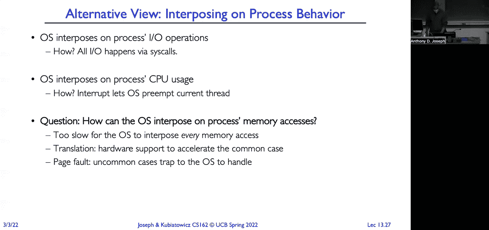

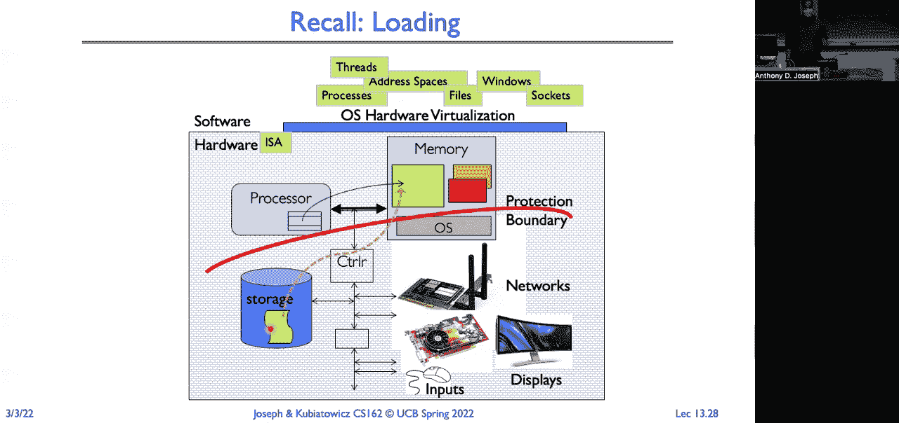

这种方法实现了保护（越界访问被捕获）和重定位（程序可加载到任意物理位置）。但它将整个地址空间视为一个**连续块**，导致两个问题：
1.  **外部碎片**：内存中散布着许多小的空闲区域，但不足以容纳新程序。
2.  **内部浪费/不灵活**：程序的栈、堆、代码等段在虚拟空间中是分开的，但基址-界限模型却将它们打包成一个整体，无法高效处理稀疏地址空间，也不易实现段共享。

## 更灵活的方案：分段 🗂️

分段（Segmentation）解决了上述问题。它将程序的地址空间划分为逻辑段（如代码段、数据段、堆段、栈段），每个段有独立的基址和界限。

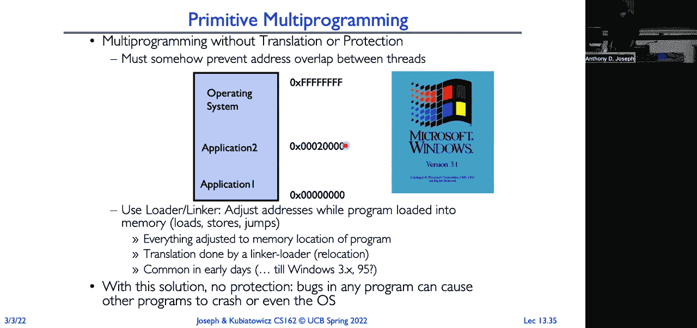

以下是分段地址转换过程：
1.  CPU生成的虚拟地址被分为两部分：**段号** 和 **段内偏移**。
2.  使用**段号**作为索引，查询**段表**，获取该段的基址和界限。
3.  检查：`偏移量 < 界限`？如果否，触发异常。
4.  计算：`物理地址 = 该段基址 + 偏移量`。

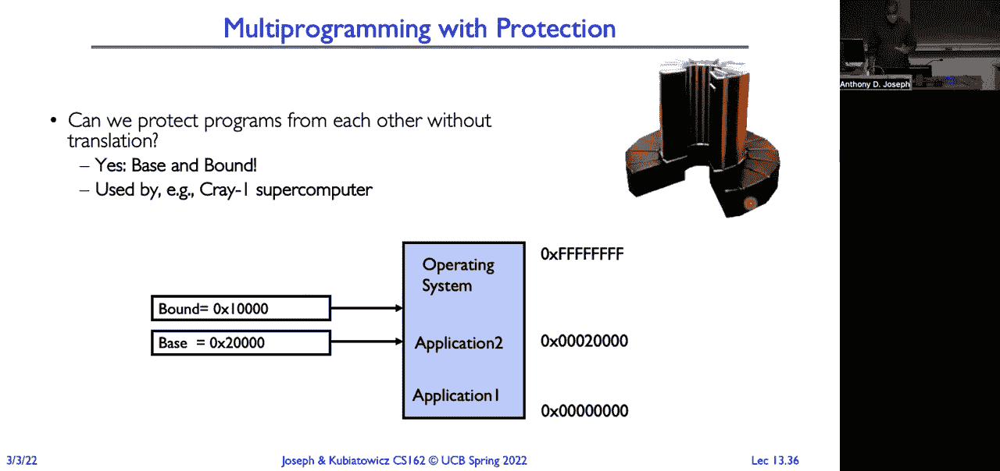

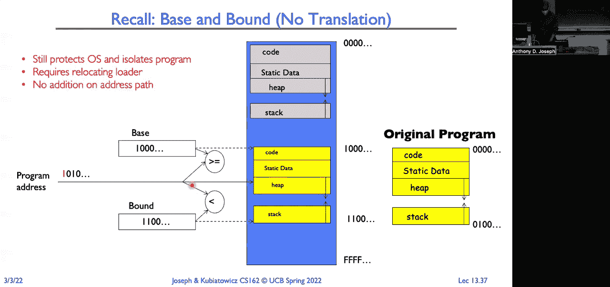

分段允许每个段独立地放入物理内存的不同位置，更符合程序的实际结构。它支持更精细的保护（例如，将代码段设为只读/可执行），也更容易实现段共享（多个程序映射到同一个物理段）。

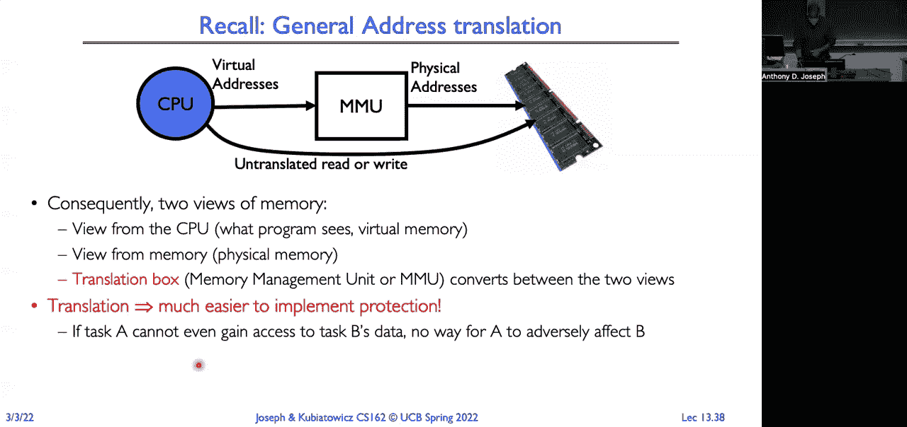


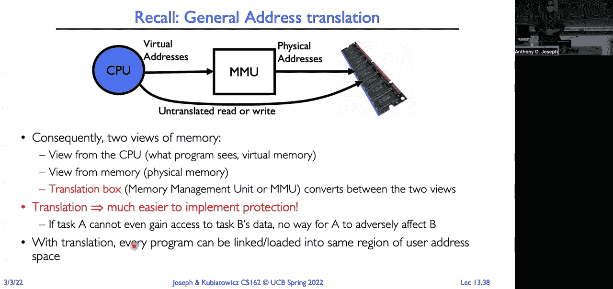

然而，分段仍然管理的是**大小可变的连续内存块**，因此**外部碎片**问题依然存在。操作系统需要复杂的“紧缩”操作来合并空闲空间。

## 关键概念与总结 📚

本节课我们一起学习了内存管理的入门知识：

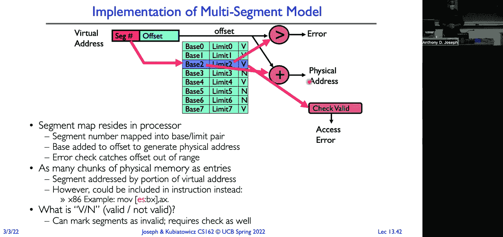

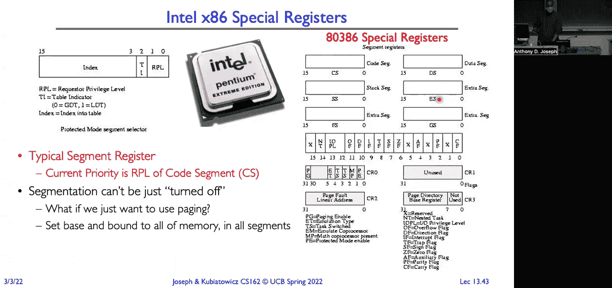

*   **地址空间**：程序所能“看到”的内存地址集合。分为虚拟地址空间和物理地址空间。
*   **地址转换**：通过硬件（MMU）将程序使用的虚拟地址映射到实际的物理地址。这是实现内存虚拟化、保护和共享的核心机制。
*   **基址-界限模型**：简单的动态重定位与保护方案，但将地址空间视为单一连续块，导致碎片化和不灵活。
*   **分段模型**：将地址空间按逻辑划分为多个段，每个段独立映射。它更灵活，支持共享和精细保护，但依然受外部碎片困扰。

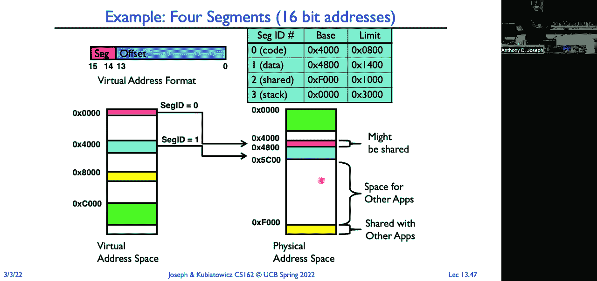

地址转换在每次内存访问（取指令、读写数据）时发生，由硬件快速完成。只有在发生异常（如缺页、越界）时，操作系统才会介入处理。在进程上下文切换时，操作系统必须保存和恢复旧进程的地址转换状态（如基址/界限寄存器或段表），并加载新进程的状态。

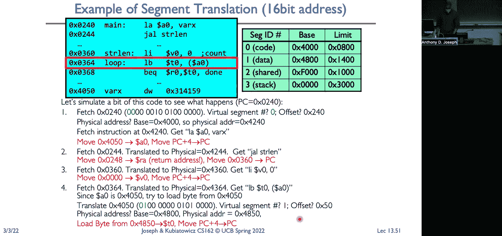

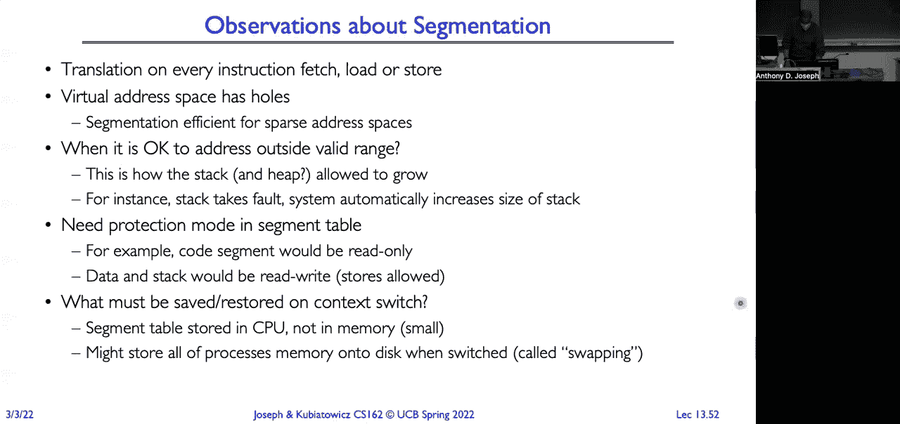

下一讲，我们将探索一种更强大、能彻底解决外部碎片问题的地址转换方案：**分页**。