# P14：Lecture 14： Memory 2 Virtual Memory (con't), Caching and TLBs - RubatoTheEmber - BV1L541117gr

 Okay， let's get started。

 So we're going to continue talking about virtual memory and then we're going to dive。 into caching and translation locuside buffers。 We'll get to TLBs。 Okay。 so remember that with general address translation， the CPU， the processor， and what。 the process sees is virtual addresses。 And then it's the job of the memory management unit or MMU to translate those into physical。

 addresses， which is how we actually access memory。 Now。 we can also have untranslated reads and writes。 So there are two views of memory， right？

 There's the view of memory that the processor has and then there's the view from memory of。 actual physical addresses。 And this translation box is what converts between the two。 So if you think about translation， it makes it a lot easier for us to implement protection。 Right？

 If one process can't see other processes' memory， can't see the operating system's memory， then。 implicitly we're protecting those processes from that process and we're protecting the。 operating system from that process。 Okay， now there's another benefit。 which is if we've decoupled what one processes as， its view of memory from all other processes。

 then we can let every process have the same， view of memory。 So memory that starts in a virtual address space at zero and goes to， you know， two to。 the 31st minus one。 Okay， so remember from last time we had the multi-segment model where we have a segment。 map that gets stored in the processor， the segment map just contains a set of base and， limit pairs。

 So here we have， you know， eight of them and we take our virtual address， divide it up。 into two fields。 One field is a segment number that we use to index into that table。 That gives us a base。 We add our offset and that gives us the physical address that we're going to use。 We have to perform some checks。 We have to make sure we didn't run off the end of the table。

 We also have to make sure that the size of the region is greater than the offset。 Now we can also。 here I have the segment number encoded into the virtual address。 It can also be coded into the instruction。 So for example， in x86。 here we have a move and we're going to use the ES or extra segment。

 with the address being the BX register。 We're going to move the contents of memory at that location into AX。 We also need some metadata here。 We're going to， over the next few lectures。 really look at what that metadata is right， now。 In this case， it's just a valid and not valid bit。 But it could also be permission bits like read， write， read or read write or execute only。

 or whatever。 Okay。 So the question is， does translation save us from copying 100 copies of the same program？

 So to a certain extent， yes。 We could have one shared code segment for everyone who's running the IDE。 And that would just be marked as say， execute only and could be mapped to the same base。 zero register。 So the same zero segment rather。 So then the code would appear in everybody's virtual address space at the same location。 All right。 Now， what do we do if we're in a situation where not all of the segments will fit in memory。

 either for an individual program or for a set of programs？

 Well we can do an extreme form of context switching。 All right。 So if you think about it。 like in this case， when we context switch， what do we have to， do？

 Save this segment map out and load the new segment map。 That will change the processor's view of memory to be that for the new process。 For the new process。 Same thing we have to load all the CPU registers for the old process， load all the CPU registers。 for the new process。 Well an extreme form of this would say if everything doesn't fit into memory。

 then we， just swap out segments from memory out to disk。 So when we're going to run process P1。 we load its segments into memory and unload process， P0 out to disk。 Now that seems extremely slow and kind of unreasonable， but that was actually the approach。 that was used on many early computers because we didn't have enough physical memory and we。

 wanted to do multi programming。 So we paid the price with very， very expensive context switches。 Okay。 So what might be a better alternative？ Well if you think about it。 programs spend most of their time in a relatively small amount， of their code。 For most programs。 not all， but for many programs if you look at like what are the hotspots。

 the active regions of a program， they're much smaller。 Now with the segment model。 we either have to have an entire segment in memory or an entire， segment out on disk。 We can't have both。 Right， there's no way to say well I just want this part of the segment to be in memory。 and this part you can put out the disk。 So we want finer granularity of control。

 We just keep those parts of a segment in memory that are actually being used and everything。 else we can leave out on the disk and pay a really expensive cost if we actually go and， access it。 Okay， so if we look at segmentation， you know， some of the problems that we run into are like。 these variable size chunks that we have to fit into memory。 We play Tetris with memory。

 As programs start and finish， we're going to end up with different size holes based on。 the sizes of their segments in memory。 Now when new processes come along and we're trying to fit their segments into memory。 you， may have to do a lot of copying around and move things around。 So that gets very expensive。 Everything with if we want to grow a segment， you might have to shuffle things around。

 So lots of moving around。 We also have these limited options for swapping to disk in that we can only swap at the granularity。 of an entire segment。 And segments are large。 That's a lot of data to copy out and if it contains some regions that are active。

 we're， then going to turn around and copy it back into memory。 So we have two different types of fragmentation issues。 So one is external fragmentation。 Those are the gaps that are created between segments。 And our solution there is we have to move things around。

 The other is that segments may grow over time， but they don't shrink。 And so we end up with internal fragmentation where say we've allocated a stack segment。 that's 64 kilobytes， but we're only actually using 16 kilobytes of that 64。 So that other 48 is just wasted space。 Everybody can use it。 So we need something that's better。

 And if we think about what we want to do， what we want to do is we have this view of。

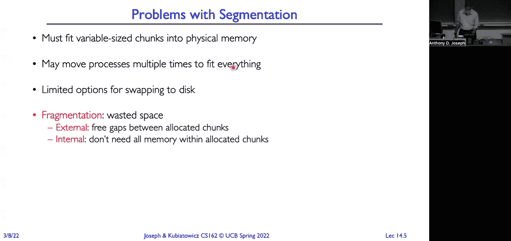

 memory from a processes virtual address space here， program one and program two。 And we're using the translation map to convert that into what are the physical addresses and。 the physical layout of memory。 And here I've done a segment like model。 There's a code region in virtual address space and that maps to a contiguous code region in。

 physical memory。 But this is just a map function。 And so we could map any virtual address to any other physical address。 So there's no need for this to be all nice contiguous regions。 That would give us a lot more flexibility。 And so the really the question is like。 what's the right granularity？ Is it down to the individual byte， the translation map？

 Is it down to the individual bytes of the address space to give them locations？

 Or is it at the granularity of segments？ Well， we saw there's a bunch of issues with segments。 so we know we want something smaller。 We probably don't want it down at the granularity of bytes because that would make the complexity。 of these translation maps really， really hot。 We'd have more bookkeeping information than we'd actually have memory and use。

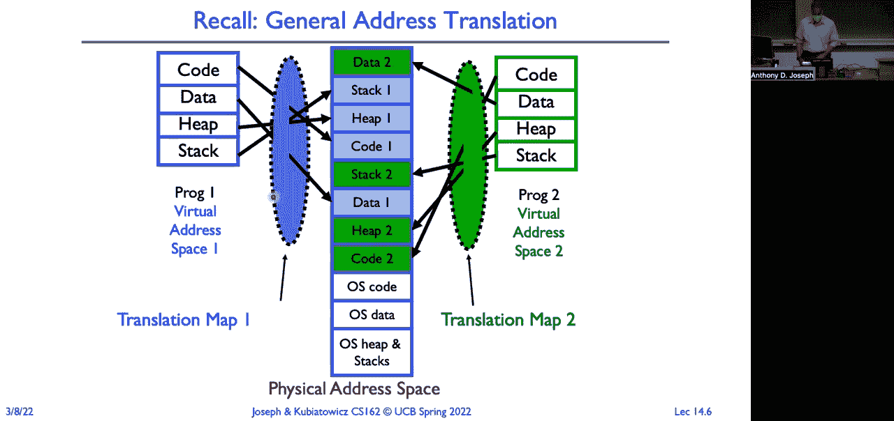

 So that brings us to paging， which is we're going to think about organizing our physical。 memory into fixed size uniform chunks。 So instead of allocating memory in these variable size。 segment size chunks， we're going to allocate， them in pages。 Now if you think about it。 if I allocate with pages， how can I determine whether a given， chunk of memory is free or allocated？

 Well， if they're fixed sizes， I can just use a bit vector。 And in that bit vector。 if there's a zero， it means that page is free。 If there's a one。 it means it's been allocated to some process。 So now when I need to find a free page to give it to a process because it wants some memory。 I just scan quickly through that bit vector， as soon as I hit a zero， I allocate it。

 Now an important thing to think about is that every page in memory is equivalent。 It takes the exact same amount of time to read or write any page in memory。 It doesn't matter if I allocate two pages continuously or I allocate them at opposite。 ends of memory。 The access time is the same。 So now we really can think about this translation map。

 It's just mapping any virtual page to any physical page。 Okay。 Now， how big do we make those pages？

 It's like kind of like alluded to it。 We don't want to make it so small that the bookkeeping overhead exceeds the size of our。 pages。 But we don't want to make it as large as segments because if we make it really large。 we'll end， up with a lot of internal fragmentation。 If we had four megabyte size pages and we have 64 kilobyte size stacks， then that page。

 allocated to the stack is mostly going to be wasted。 And again， memory in this case。 physical memory is precious。 So not as big， but not too small。 And so over time。 people have evolved and typical sizes today are about one kilobyte to。 four kilobytes or even 16 kilobytes in size。 Some architectures include support for much larger page sizes where we know we have physical。

 objects that are going to be very large。 And we'll touch on that later on。 So now if we think about it， to represent the sort of same information that we were storing。 in a segment， we potentially are going to need a lot of pages。 It's not going to be like before we just had one segment， we had eight segments， so we'll。

 just have eight pages to represent our program。 It might have many， many more。 hundreds more of pages than we had segments or even more。 Okay。 so how do we implement simple paging？ We're going to start with the very simplest way we can do it。 which is in the processor， we're going to have a page table pointer。

 That page table pointer will point to a location in physical memory that contains a table。 That table just consists of a combination of physical page numbers and permission bits。 All right。 so now we're going to take our virtual address and again we're going to split， it into two fields。 So there's going to be an offset field， which will be the offset into a page of the data。

 that we're trying to retrieve。 Now since it's into a page and we're dealing with things on page granularity。 we can just， copy that offset over into our physical address。 So there's no addition that we have to do like with segments。 Because we don't know where a segment starts in physical memory， that's why we had to increment。

 that start point， that base with our offset。 Here we know the boundaries of pages are uniform。 And so it's just the offset from the start of a page。 Okay， so for example。 if we have a 10-bit offset， that gives us pages that are 1，024 bytes in， size。 If we have a 12-bit offset， how big are our pages going to be？ Yeah， 4，096。 Okay。

 you're going to learn powers of two if you didn't learn them already。 Okay。 so now we're going to take the rest of our address， the virtual page number， and。 that's just an index into our table here。 So we index into the table that gives us the physical page number。 We combine that with the offset and we get the physical address。 Now， of course。

 we always have to do lots of checking。 I'll say it again。 Don't forget to do checking。 It might show up on the midterm or something like that。 You want to make sure that the entry that is being referenced is actually valid。 Both it's a valid entry and also for the access mode that the processor is using。 Okay。

 so like for example， this page here is a read-only page。 So we want to make sure that the access is like an instruction fetch or a load and not， a store。 Okay， so we check the permission bits。 If they don't match。 like you're trying to write to this page， that would generate a fault。

 Or if the page is invalid or if you run off the end of the page table。 So we also have to look at the virtual page number versus the page table size。 So two registers that we're going to store in the processor， the page table pointer， and。 the page table size。 Okay， so the rest of the bits of our address。

 our virtual address is going to be our virtual， page number。 So if we had a 32-bit address。 it would be 10 bits for our page and then the remaining 22。 bits would be used for our virtual page number。 And two to the 22 is roughly 4 million。 So we could have up to 4 million， roughly 4 million entries in our page table。 Okay， questions？ Yes。

 So the question is given a physical address， how do we know if that physical address represents。 the data that's in memory or maybe out on disk？ So that's where the metadata and the bookkeeping will come into play。 So for example， if it was out on disk， we might mark that entry as invalid。 So now if I try to reference it， what's going to happen？ When a page fall， right？

 Because I tried to access something that's marked as invalid。 Now the operating system checks its books and realizes， oh， that page is actually out， on disk。 And so it'll have to fetch it into disk and then put it someplace， update the page table。 entry with the actual physical page number of where it put it and then set the bit valid。

 and then it'll restart the instruction。

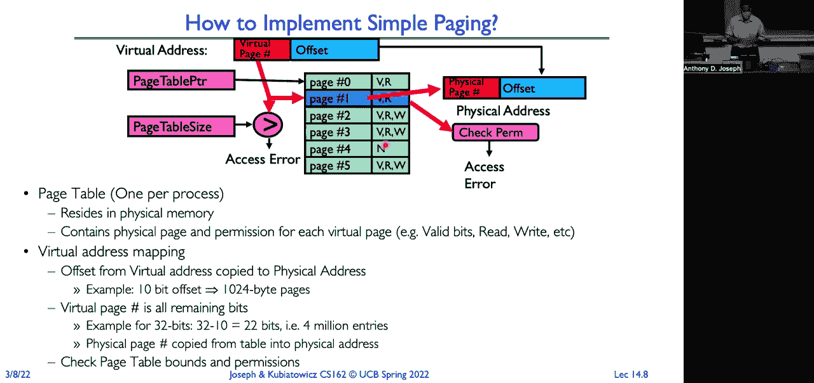

 Okay， so let's go through a really simple example。 So we're going to have four byte pages and here's our virtual memory。 We got three pages in our virtual memory。 We've got a page table with three entries and here's our physical memory。 Okay， four byte pages。 How many bits do we need to represent that for our offset？ Two。 Two， two。

 two is four。 Okay， so the rest of our address will be our virtual page number。 So if we look at address zero， right， that's going to be virtual page number zero and so。 that's going to be， if we look in our page table， we'll see it's at physical page four。 which will write everything out in binary， that's one zero zero and so here it is at。

 10 hex in physical memory。 Similarly， if we look at our next one， so where is four hex located？

 That's zero， one， zero， zero。 So offset zero， page is one， that maps to three， which is one。 one and so that maps to， Charlie hex。 And finally， if we look at eight hex， that's going to be one。 zero， zero， zero， zero， two， to the three and then that'll be page two and that's one。 so that's going to be up down， here， rather up here at four hex， so one， zero， zero， right？ Okay。

 that's the simple。 Now let's actually look at some offsets。 So what if I give you address six？

 What is that map to？ So all we're going to do is we're just going to write it out in binary。 So if we write it out in binary， we'll see that it is zero， one， one， zero。 So our offset is one。 zero， so we copy that over to our physical address and it's on page。 one and page one is three or one， one。 So we're going to end up with one， one， one， zero， right？

 Which in hex is zero， e hex， right？ And do one more， we'll do， let's do nine。 So where does nine hex lie？ So again， we'll convert nine hex into binary。 So that's going to be one。 zero， zero， one。 So offset is one and page is one， zero， or two。 So there's page two， that's one。 so it's going to be one， zero， one， or five。 Five hex。 Okay。 So again， we're doing paging。

 copy over the offset， look up the virtual page number， check， the permission bits。 combine the physical page number， and you get your target address。 All right。 Now there was a question about sharing in the chat。 So how do we do sharing with pages？ Well。 it's actually very easy。 So here is one process， process A's， page table。

 and it's associated with a page table， pointer。 If we want to share a particular page。 let's say we want to share page two， we just simply。 add that same entry into that second page processes page table。 All right。 Now a caveat here。 So they're both， the same physical page will appear in both processes。

 But does it appear in the same place？ Now， right， and one， it's virtual page two， and the other。 it's virtual page four。 What might be the implications of that？ A potential problem？ Yeah。 Exactly。 Yeah。 So we'll have different virtual addresses that are pointing to the same physical addresses。 which means if we have objects that say process A creates that have pointers and things like， that。

 those virtual addresses for those pointers won't work when we look at it from process B's。 point of view。 So we can share， basically， we can share just values and things like that。 But if we wanted to share objects， we'd want to make sure that we map them both， say， in， page two。 or we map them both in virtual page four so that the virtual addresses with the。

 same mapping to the same physical addresses。 That way， if I had a tree or something like that。 the pointers would all work， otherwise， they won't work。 Okay。 So this is a little caveat that you just have to worry about if you're going to map the same。 page into different address spaces。 So the question and chat is。

 does this mean both processes can modify the same address？

 They can both modify the same physical address with different virtual addresses。 And they can read the same physical address with different virtual addresses。 The question is。 when we do swapping， do we just swap the page or the whole segment in， which the page is located？

 So here， we can swap on the granularity of an individual page。 So an individual page could live in physical memory or it could live out on disk。 Whereas with segments， it was the entire segment lived in memory or the entire segment。 lived out on disk。 So now you can kind of think， you know， how we can use this to our advantage。

 If most of the pages in our address space aren't really being used actively， they don't。 need to be in memory。 It can be out on disk。 And that frees up physical memory。 which is expensive for other processes。 So we can now fit more processes。 active portions into memory。

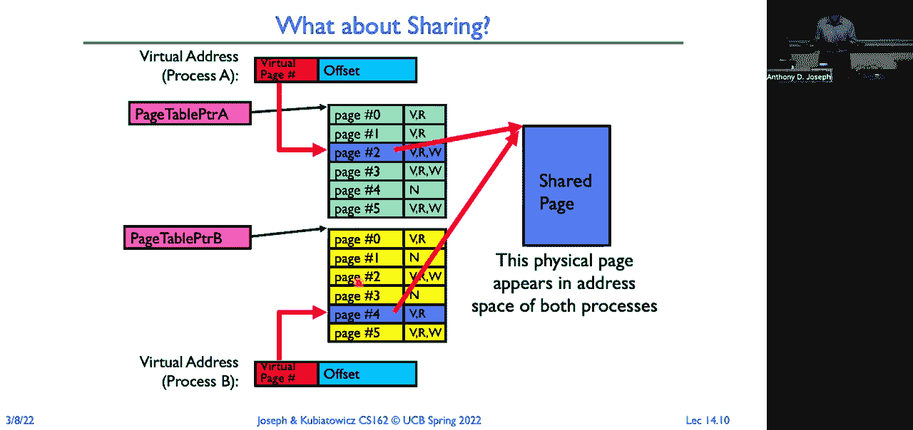

 Okay。 So where do we use sharing of pages？ Well we can map the kernel region of a process to have the same operating system kernel code。 and data structures across all processes。 And this is nice because now it means that when we go into kernel mode。 the operating， system can access all of its code and data and it can access the processes code and data。 And so it doesn't have to do any translation。 The translation is done for the kernel。 Now of course。

 we have to make sure that when we're in user mode， we can't access that， portion of the page table。 Okay。 We can also have， as you know， first question we got today。 we can also have different processes， that are using the same binary。 We just map the pages for the code into the physical pages for the code， into all of the。

 processes running that binary。 Market execute only， and that way nobody can modify it。 Okay。 We can also use it for user level libraries， system libraries。 So only one copy of libc needs to be loaded。 Not multiple copies。 Again。 we market execute only so that we don't have to worry about anybody modifying it。

 And then we can also， as we talked about earlier， have shared memory between processes。 The two processes that can see the same set of data， if we put it at the same place in。 the virtual address space， they can share objects。 So if you think about it。 it's like very similar to the sharing that we have between threads。

 It doesn't require any context which is， into the kernel， to do communication between two。 processes。 I just read and write memory， and other processes that are sharing that same memory can see my。 reads and my writes。 So that's a good thing。 It's also a bad thing because obviously we're going to need things like synchronization。 and all of those sorts of things to make sure that everybody sees consistent views of data。

 structures we modify。 All right。 So remember the layout that we had for memory？

 We have the kernel getting mapped into every single address space。 Again。 this gives us the advantage of the kernel can copy to and from its buffers， from， user buffers。 and have all the translation be done in hardware。 We have our stack。 We have our memory。 We have our heap。 We have our code， our initialized， and our uninitialized data segments。 Now。

 some of the security things that we do， and it might be a little hard to read this。 on the slide as it's projected， but the start of our stack starts somewhere randomly offset。 from 2 to the 31st minus 1。 Similarly， our heap starts at some random offset。 and our code can start at some random， offset from 0。

 And we do that as part of a address space randomization。 So to make it harder for an attacker to guess where a particular data structure might be。 located in memory or where a return value， a return address might be located on the stack。 or local variables in the stack frame are located， we do this randomization。

 That way if someone's doing some kind of buffer overflow or code injection attack， they're。 not able to know directly where a particular routine might be loaded or where a particular。 data value might be。 The caveat here is if you operate with a 32-bit machine。 that's only 4 gigabytes， and， the amount of randomization you can do is going to be limited。

 And so if I have enough ability to probe， I can usually guess where things are located。 On a 64-bit machine， that's not an issue because it's very hard to try and guess where。 something might be randomly placed in a 64-bit address space。 Okay。 another thing is because of Meltdown， we realized that user programs could figure。

 out what kernel data structures contained， especially security sensitive ones。 And so now what we do is we actually don't map the entire kernel into all address spaces。 So those sensitive things get mapped into a separate kernel address space。 And we only map things like buffers for copying to and from the kernel and simple code routines。

 into the processes address space。 So that protects the kernel from these kinds of observation attacks。 but it comes at a， cost。 Now when the kernel wants to access that code or access that data。 it has to switch the， context for the address space。 And that's expensive。 We'll see why， you know。 when we get into caching and TLBs。

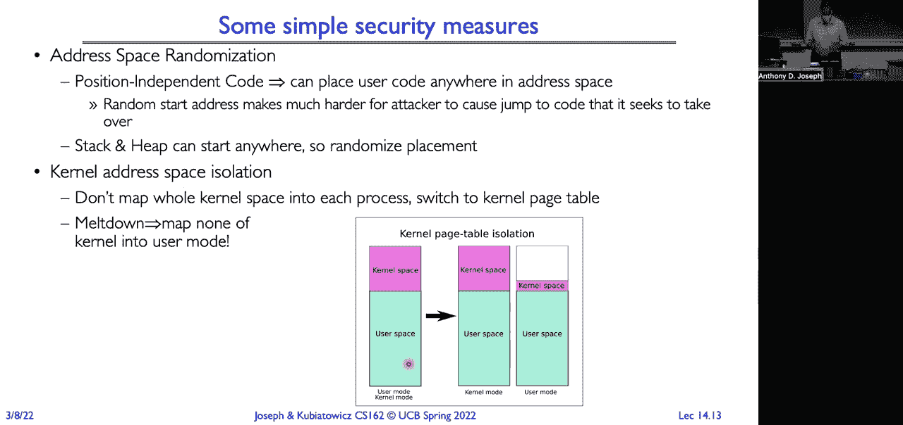

 Okay so to summarize what we get with paging。 So we're able to now take that view of the virtual address space and through the page。 table we can map it to any physical memory view that we want on a page granular。 Now here I've just used the same sort of models we had with segments。 So contiguous regions in our virtual address space happen to map the contiguous regions。

 in our physical address space。 But that's not a requirement。 If our stack here grows down。 if we look over here in physical memory， there isn't enough。 space for those two additional page frames we need。 But that's fine。 Because every page in memory is， physical memory is equal。

 So we can put those two stack frames anywhere we want。 So I might choose to， let's say。 put them there。 Or I could put one here and put another one down here。 Or anywhere else。 It doesn't matter。 There's no benefit that we gain from making them be contiguous。 Because of that。 you know， we get a lot of flexibility in how we can place things in memory。

 We now don't have to worry about external fragmentation。 We're not going to ever have to move things around to make room for another process。 The only thing we might do is we might take one or more pages and copy them out to disk。 to free up memories that we can allocate memory to another process。

 But we're not going to do random moving around within memory。 Okay。 But there's some challenges。 Look at this table in the middle。 Which maps all of our virtual addresses or virtual pages rather to physical pages。 And what do you notice？ It's got a lot of empty spots。 And you also notice that the size of the table is proportional to the number of pages。

 in our virtual address space。 So we've got a table that's mostly empty that's really large。 So that。 of course， you can ask the question， well， just how big do things get？

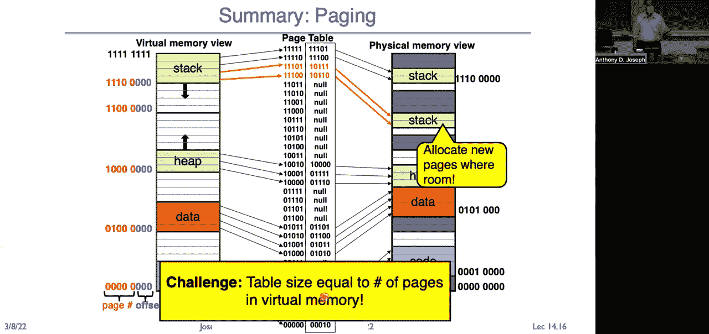

 Well if we had a 32-bit address space， right， that allows us to have 4 gigabytes。 And we use a typical page size of 4 kilobytes。 How many bits do we need for our offset？ 12。 The 12 is 4096。 And so how many bits are we going to end up for our virtual page numbers？

 We end up with 20。 Right？ So those 20 bits translates into a page table。 each of which entry was about a word。 So we're going to have 4 megabytes for our page table。 So 4 megabytes of physical memory where again， if we look back here， it's mostly empty。

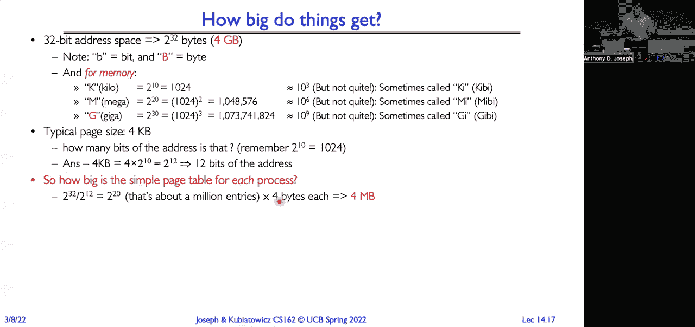

 So that's not very efficient， right？

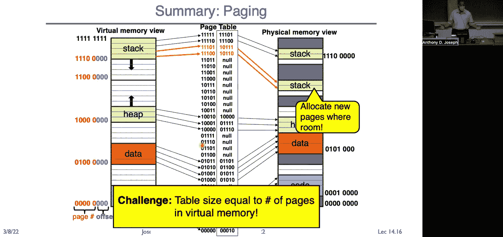

 What about a 64-bit machine？ Well， if you think about it， okay， a 64-bit。 2 to the 64 divided by 2 to the 12， how many， virtual pages are we going to have。 is 2 to the 52nd virtual pages？ Or what is that？ 4。5 exa entries。 Each of which is going to be 8 bytes in size。 So we're going to need 36 times 10 to the 15 bytes of physical memory。

 Just to store the page table。 So clearly that's not going to work as an approach。 We're going to have more memory taken up with the bookkeeping than actually used by the program。 And so that's just not going to work。 Okay。 So the problem we have here is our address space is sparse。 And yet with the single table that we have， we need to keep track of every single entry。

 So what if instead we had a way of trying to keep track of just the entries that were。 likely to be in use？ How could we do that？ That's what we'll get to in just a moment。 Oh。 so there was a question， why do we need to map some kernel space into user space？

 Because the user never able to access things in the kernel space。 Yes， that's correct。 So the user can never access kernel space。 The reason why we map things into the back to it。 So the reason why we map this kernel space into the process of the process space is that。 when you go from user mode to kernel mode and the kernel let's say you want to write something。

 into a file。 Do you provide the kernel with a buffer that buffer could be spread across many different。 pages depending on how your virtual address space maps those pages to physical pages。 By being able to use the processes process map， it's a table page table， the kernel can。 just simply say， oh， just copy in virtual address space， this buffer for this number。

 of bytes into a buffer in kernel space。 Since the kernel space is mapped into the processes page table。 So it makes that really convenient。 Otherwise， if you were in kernel space。 you'd then have to manually kind of walk the page。 table and translate all of the addresses in order to do that copy。 So this makes it much easier。

 let's just use the hardware to do that。 And we use protection to make sure that the user process can't access the kernel data。 structures or code。 Okay， so some discussion。 So what do we need to switch on a context switch？

 Well， we just need to switch the page table pointer and the limit。 Those are the only things that we need to say。 Yeah， question？ [inaudible]， Yeah。 so the question is if we're in kernel mode and we want to access the kernel data。 the memory of another process from one process， then typically what you would do is you would。

 copy from the source process into a kernel buffer， then change the page table to point。 to the new process。 Now you're going to have its translations， then copy from that same buffer。 Again， this is why you map the kernel into all of the processes into that processes buffer。 So that would be an example of inter-process communication。

 So I do like a Unix pipe or something like that and that's going to copy from one processes。 address space into another。 But it's mediated by the kernel and so I have to do a system call into the kernel in order。 to do that。 That's why being able to map a page of memory into multiple processes is really nice。 Because then I'm just reading and writing directly to that page。

 The kernel isn't getting involved in copying the data。 And in fact， there is no copy。 You just copy it into that page。 No additional copying， I should say。 Okay。 What provides a protection for us？ Well， we get protection through translation。 The page table entries limit what you can actually access。

 If there's no virtual to physical mapping that lets you access another processes memory。 or the kernels memory， then you can't access them。 You can only generate physical addresses that correspond to mappings in your table。 We use dual mode operation to keep the user from modifying that table。

 The only the kernel gets to modify the table。 All right。 So what are some of the advantages here？

 Well， we get really simple memory allocation。 Right。 We just use a bit vector to tell us this page is in use。 That page is not in use。 So we can just scan right through and find a free page really quickly。 It's really easy to do sharing。 Right。 We just map the same page into multiple address spaces。

 But what are some of the disadvantages？ Well， our address spaces oftentimes are sparse。 And so we end up with these really huge tables that could be larger than the actual data。 that we're actually trying to code data， heap， stack， and everything else。 So that's a problem。 Another problem is that not all the pages are being used at any given time。

 And we want to really kind of think about just keeping in memory those pages that are。 being used and letting the rest of the pages live out on disk。 We need some mechanism for doing that in the context of page tables。 All right。 So this simple page table is just too big。 So this is not an approach that we can use unless we're going to go to maybe really large。

 pages and then we'd end up with tremendous amount of internal fragmentation。 So what if we had some kind of multi-level scheme？ Right。 Where we had multiple levels of page tables， like a tree of page tables or a tree with segments。 and pages。 Let's look at what that might look like。

 So if we think first about what a page table is kind of providing for us， it's just a map。 that maps from some virtual page number to a given physical page number that we've allocated。 for that page。 If we take a virtual address， give it to the page table and the page table returns the。 associated physical address。 And so really it's just a lookup table， a really large lookup table。

 But there are lots of different ways that we can implement a lookup table。 So we can use those to try and do something that's more efficient than just having a giant。 linear table that takes up a ton of contiguous memory， physical memory， and also。 Okay。 So what are some of the other structures we might be able to use here？ We kind of gave one away。

 which is maybe a tree。 We could also use something like a hash table。 All we need is just some mapping function that we give it a virtual page number and it。 returns a physical page number。 That's all。 All right。 So let's look at one potential fix。 which is a two level page table。 Okay。 So we're going to have a tree of page tables and we're going to take our virtual address。

 and we're going to divide it up in kind of a magical way。 So we're going to take 12 bits and use that for our page size。 12 bits is 4096 bytes。 All right。 So that takes away 12 bits out of our 32 bit address that leaves us with 20 bits。 We're going to divide that evenly and have 10 bits for our top level page table and 10。

 bits for our next level of page tables。 Each page table entry is going to be four bytes in size。 All right。 How big is our page？ Four kilobytes。 How big is our page table entry？ Four bytes。 How many entries do we have per page？ 1024。 How many bits do we need to index into 1024？

 Due to the 10 or 10 bits。 So that's where our magic 10 comes from。 Right。 If you think about it。 this page here contains the entire page table for that level。 So a page table for a level is 4096 bytes divided into four byte entries， 1024 of those。 entries indexed with 10 bits。 That's why this is kind of a magic breakdown of a 32 bit number。 Okay。

 So we have a page table pointer which we store in the processor。 We don't need a page table size pointer。 Why？ It's fixed size。 Right。 It's limited by the size of this page。 And the fact that the size of that page contains all two to the 10 entries。 So we just need one pointer。 And we're going to take our top level， top 10 bits。

 index into our root of our page table。 And that is going to give us the physical page number of our next level page table。 Right。 So that's this physical page here。 Right。 And then we will。 Oh， so I should point out。 you know， when we do a context switch， the only thing we have。 to save is this page table pointer on x86。 It's the CR3 register。 Okay。

 So we're going to take our next 10 bits and use that as an index into this page table。 And it's going to give us the physical page number of the page in memory。 We then combine that with our offset。 And that gives us the physical page and the actual offset on that page。 All right。 Now we also need to have valid bits on all of these entries because now we don't have a。

 length。 So， you know， it might be that we're only using the first， you know， 500 entries in our top。 level page table。 So we need valid bits to tell us whether some entries are valid or invalid。 We don't need every one of these second level page tables。 Right。 If the entry here is invalid in the top level table， then there's going to be no associated。

 second level table。 So now we only really need to map those regions of the virtual address space that are in use。 If it's not in use， we don't need to have a second level table associated with it。 So for our sparse address spaces， this is going to be really good。 Because we've now drastically reduced the number of these like second level tables that， we need。

 The other thing is while we keep our top level table in memory， these second level tables。 can actually live out on disk if they're not being used。 And again。 we just need to do some bookkeeping in this top level table to tell us， oh， hey。 I put this second level table out on disk。 It's not actually the case that it's invalid。

 It's just out on disk。 All right。 So we get a lot more flexibility。 Now we can just keep the page tables and memory that are actually being used。 And the ones that are actually active stay in memory。 The ones that aren't as active go out to disk。 Okay。 So here's an example of 32-bit address translation on x86。

 Their terminology is the top level directory is called a page directory and it has page。 directory entries， PDEs instead of PTEs。 And this base register。 CR3 provides the physical address of that page directory。 We take our top bits。 We use that as an index into that to get our PDE。 That gives us the physical page number of our page table。

 our second level table。 We use the next 10 bits to index into that。 That gives us our physical 4K page。 And we use our offset to get the physical address。 All right。 So when we context switch， we just save out the CR3 from the old process， load the CR3。 from the new process， and now we get a different page directory。 Yes， question。 Okay。

 So he's the guy I asked to be in the audience so he could ask the question that set me up。 for the next slide。 So the reason why we need lots of bits in the page table is because what do we need？

 We need to know what's the pointer to the next level of the page table or what's the。 pointer to the physical page？ That's not a lot of bits， right？ So what else are we doing？

 We have permission bits， right？ So we need to keep track of is this valid， is it invalid。 is it read right， is it read-only， is it execute-only， is it out on disk？ When was it last access。 is it clean， dirty？ You know， there's lots and lots of information that we're going to store in the page table。 entry。 And so that's why that's the answer to why it's four bytes。 So you can see here， for example。

 there's some free bits。 These are allocatable to the operating system。 The operating system can use these bits for bookkeeping。 So it could use these bits to say， oh。 this page is actually out on disk。 So use the other bits in the PTE to figure out where it's on disk。 Like maybe it's the logical block number of the disk block that contains the page table。 All right。

 But there's a lot of other things。 So， you know， valid， writeable。 Has it been accessed recently？

 When we get into paging， that's something that we'll use to say， this is a page。 It's been accessed recently， so it's active as opposed to a page that has not been accessed。 recently。 So， you know， it doesn't really need to live in memory。 Maybe it could live out on disk。 There's other bits like， is it dirty？ So has it been modified？ Has it been written recently？

 And that's going to be important because if we wanted to say， evict this page from memory。 it means we'd actually have to copy it to disk。 Okay。 And there are other bits that are， you know。 architecturally dependent。 Okay。 So how do we use the PTE？ Right。 And in valid page table entry could mean multiple things。 It could mean that， yeah。

 really this is invalid and your program stepped in this location。 It's a landmine and we're just going to seg fault and terminate your program。 Right？

 Or it could mean， you know， the page or the directory is just somewhere else。 It's not in memory。 It's out on disk。 So we check the validity and then we use those other bits to figure out， hey。 where is it， located on disk？ If it's not in memory。 So demand paging is where we're only going to keep the active pages， as I said， in memory。

 We're going to use that active bit to tell us which pages are active。 If the page is not active。 we can feel free to send it out to disk。 And of course then we mark the page table entries invalid and the bookkeeping bits to tell。 us where that page got stored on disk。 Another example is remember fork。 Right？ When I do a fork。 it's really fast。 Right？ Because I don't actually copy all of the parents address space and create a copy for。

 the child。 Instead， I just copy the page tables。 So I copy all of the page tables。 which is going to be much， much smaller。 And I mark any entries that were read right as read only。 So now it's going to happen。 The program， the child or the parent is running along and it goes to write something。 It's going to generate a fault because I'm trying to write a page that's marked as read， only。

 Now I trap into the operating system。 The operating system looks at the page table entry and says。 oh， I did a copy on write。 So now what it will do is it will take that page and it will clone it。 Take two copies， one in the parent， one in the child and mark both pages as write， write。 a vote read write， and then restart the instruction。 So that's where copy and write comes from。

 Because we're only going to copy the pages when the child or the parent actually tries。 to do a write to them。 Everybody follow that？ That's how we make fork really fast。 Okay。 Another example is allocating memory。 So when I allocate memory to a process。 I call malloc or I call espray to get more memory， I ask the operating system。

 give me some physical pages。 And the operating system returns a set of physical pages。 Now if those pages were used by another application， the operating system has to zero out those。 pages。 Why？ Well， what if that was a sensitive server process or it was the kernel using that physical memory？

 It might contain secrets or SSH keys or other sensitive information。 And so the kernel always will give you a memory page that's been zero。 But it's expensive to actually go through and zero 4，096 bytes and do that a lot。 And so typically what the operating system does is it allocates the page table entries。

 and then in the background it's got a process that's running through and scrubbing empty。 pages and making sure they're zero。 Then when you actually try to reference that page。 it swaps in one of those zero pages。 And that way you don't have to wait when you're allocating for zero pages to be created。 They're created basically， they're allocated basically on demand。 Or I should say assign。

 they're allocated when you make your request assigned actually。

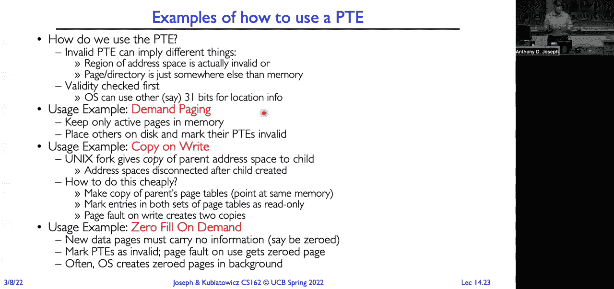

 on demand。 Okay， how do we do sharing？ Well， sharing is really easy。 Right？

 So here we have multi-level page tables。 We can share at the granularity of an entire page table。 Or we can share at the granularity of an individual page or both。 All right。 so we get a lot more flexibility。 So we can have the page tables associated with code and those get shared across all of the。 programs， processes rather running the same binary。

 Or pages assigned to libc and all of those get mapped into every address space。 So it makes it really efficient for us to do sharing between processes。 So there was a question。 so the physical page number is 20 bits。 Yeah， so the actual physical page number。 in this case it was 20 bits， it'll depend on， the machine architecture。

 20 bits is not a lot of memory。 And so， you know， as machines have gotten larger and larger。 now you can have， you know， machines with a terabyte of memory， you need more physical bits。

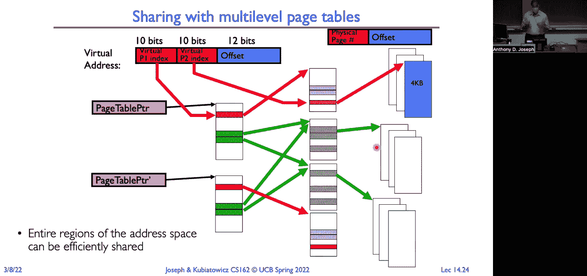

 More physical page number bits。 Okay， so summary for two-level pageing is before we just had one table in the middle。 that kind of mapped any page on the left to any page on the right。 Now we're going through a top-level page table and then going through a second-level page， table。 So you can see here I've divided up our addresses into three fields。

 So our lower three bits are offset。 Then our， what is our next two bits in green。 our second-level table， and our three top bits， are our top-level page table。 So top-level page table has eight entries。 And then our middle tables here have four。 and then we have eight bytes on each page。 Yes。 So the question is。

 did the page table structure at the top level the same as the page table。 structure at the next level？ Yeah， usually。 It's the page table entries are the same at every level。 And that's just because it's easiest to do that in hardware to have uniformity。 If you had two different types of page table structures that it would make for more complex。

 hardware。 Yes。 [ Inaudible ]， The question is， if the operating system wants to modify a page table。 does it do it， in virtual space or physical？ It's in physical address space。 So page tables are stored in physically addressed memory。 But you could also store page tables in virtually addressed memory。

 But it depends on the machine architecture。 [ Inaudible ]， Yes。 Well。 it's never the kernel isn't doing the address translation。 It's setting up the tables。 Then the memory management unit in hardware is walking through the tables to actually do。 the translation for you。 So operating system sets everything up and says， these are the rules。

 This is what these tables look like in terms of mapping from virtual to physical。 And then the hardware actually implements walking through these tables so that it's fast。 [ Inaudible ]， Yes。 So the operating system can either generate translated addresses。 But it can also remember， I don't know where it is in my slides now。 But we have two views， right？

 There we go。 Slide number two。

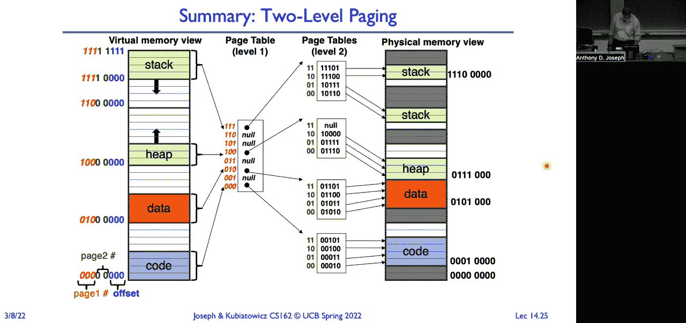

 So there's the CPU generating virtual addresses， but the kernel can generate untranslated addresses。 The kernel can actually say， I want to write this physical location of memory。 It has to be able to do that because if it's going to pull a page in from disk and write。 it somewhere， it has to be able to access untranslated addresses also。 Okay。 Question？

 [ Inaudible ]。

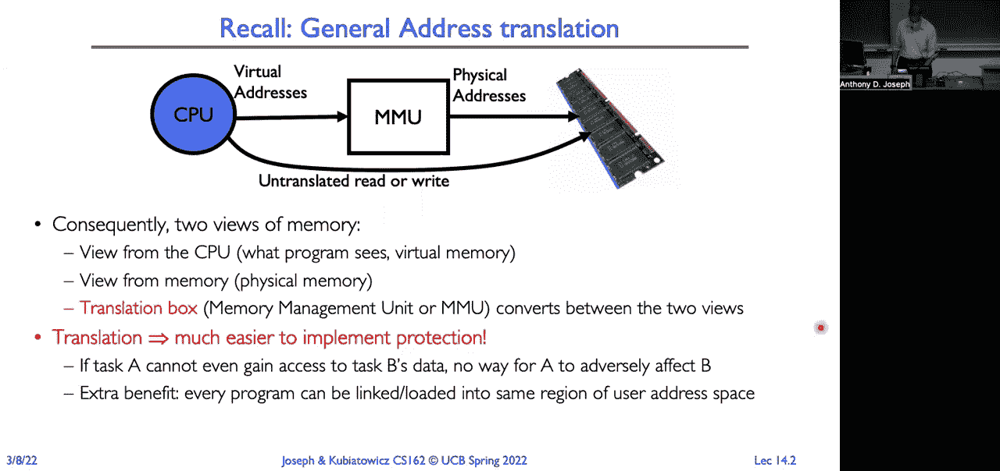

 So the question is， when I do a malloc， am I going to get a page that， if I read it， is。 going to have all zeros or could it have random data on it？ The answer， unfortunately， is yes。 You could， if the page is freshly allocated by the kernel， get a page that is all zeros。 and has been zeroed out。 If， however， you've done a bunch of mallocs and a bunch of freeze and a bunch of mallocs。

 it depends on the implementation of malloc and whether you call something like zalloc which。 will zero the page。 When you do a free， it just puts the page or puts the memory back into the heap。 It doesn't necessarily zero it out for you。 That's why there's a zalloc， I think it's called zalloc。 a c library function which gives， you a zero， a zero out page。

 It guarantees the page is going to be zero。 Okay。 So here， you know， if we want to grow the heap。 you know， add a new page to the heap， we simply， just， or a reference a page rather on the heap。 We simply just look in the top level tables， so this is going to be entry 100 in red。 Then the next level is going to be one zero。 We look there and that gives us this 10。

000 in binary which maps to right here， 80 hex。 Right？

 So we just walk through our tables and that tells us what the physical address is。 Copy over the offset。 So in the best case， right， the total size of the pages that we're going to have our page。 tables here is going to be proportional to the number of pages being used by the program's。 virtual address space。 Right？ That's much smaller than before where it was proportional to the maximum size of the virtual。

 address space。 So assuming the programs are relatively small。 it means our page tables are going to be relatively， small and for these second level tables。 they can live out on disk if we're not using it。 The price we pay now is just to do a memory read or write or instruction fetch。 We're now going to do two additional memory reads。

 So we effectively made our memory three times slower。 And it's already expensive to go out to memory。 It's nanoseconds to access something on chip。 It could be hundreds of nanoseconds to go out to memory。 Now we've made that three times more expensive。 And if some of these second level tables are living out on disk。

 that's going to make that， even more expensive。 We're going to need a solution。 And we'll come back to that in a moment。

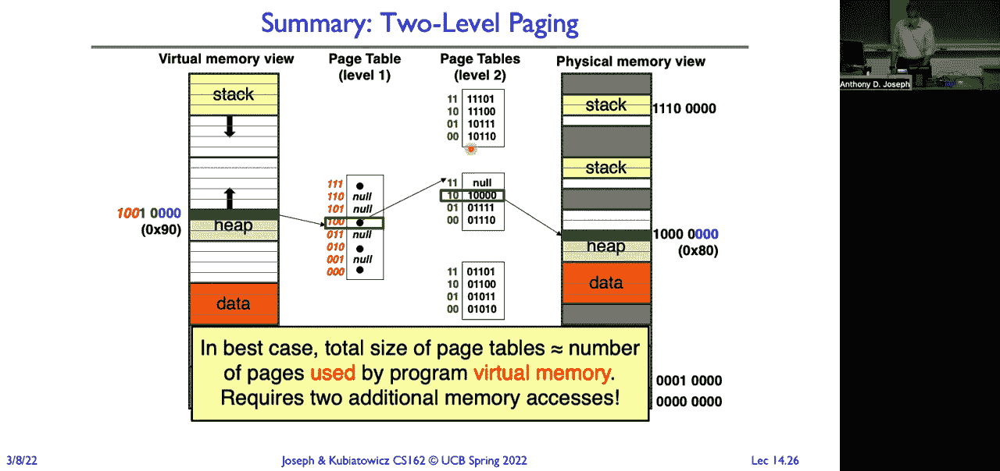

 Okay。 Let's look at another approach。 That was a tree of tables。 Instead we can try and combine the benefits we get from segments with the benefits we get。 from pages。 So the lowest level is going to be a page table in any tree-oriented structure。 Why？

 Because a really simple allocation， right？ We don't have to worry about external fragmentation。 We put page tables at the top and segments at the bottom。 We have to worry about moving these segments around in physical memory， finding large enough。 contiguous chunks of memory to be able to allocate those segments。

 So it's much better to use page tables at the lowest level。 Okay。 Then we just use our bitmap。 Our levels could be segments。 We could have any number of levels。 But we'll make our top level in this case be a segment。 So now our virtual address is going to look like this。 At the top we have a segment number。

 a virtual segment number。 And then we have our virtual page number。 And then we have our offset。 Because our lowest level is a page table， we can just copy the offset over。 Fix size pages。 Our top level， we use a segment map that we store in the processor。 So here we have eight entries。 base and limit。 And those each point to a page table。

 And then we use our second level of our address， our virtual page table of virtual page number。 rather， the index into that table to find the physical page number。 And of course， as always。 don't forget we have to check to make sure we didn't run off， the end of the table。 We have to also check all of our permission bits to make sure there's no issues with the。

 access mode。 All right。 Now， when we do a context switch before when we had a tree of tables。 we just needed to， save out that page table base pointer， CR3 register。 Now it's just like with segments， we have to save out the segment map。 All right。 So it's a relatively small amount of data that we have to save on a context switch between。

 two different address spaces， between two processes。

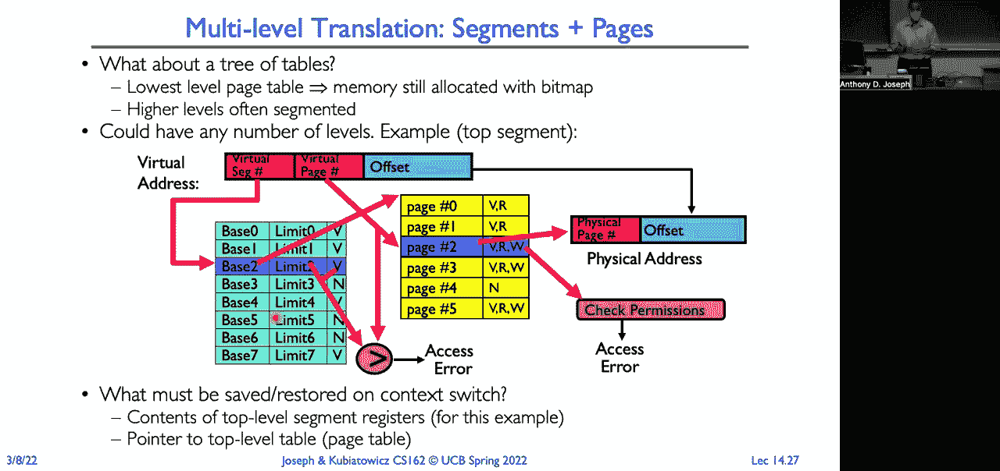

 Now how can we do sharing？ Well， we can share now at the level of a complete segment。 So we just simply point to a page table representing the shared segment， like our shared code。 Now if we have another process B， it's just simply going to point to that same segment。 It's going to have a segment point to that same shared segment page table。

 And now we have the same data that's visible in both programs。 And again。 if we're dealing with virtual addresses and references and things like that， our pointers。 we're going to want to make sure that we put them into the same segment， that the virtual。 addresses are valid in both address spaces。 If it's just a table of integers or other sorts of strings。

 then we don't have to put， them in the same place。 If we want to have pointers or code or anything like that， they have to go into the same virtual。 segment。

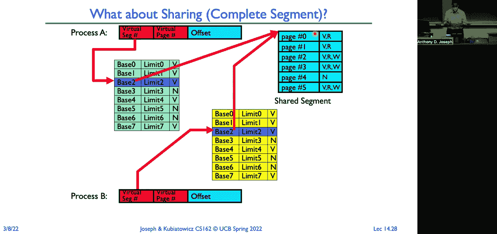

 Okay。 So let's take a step back and look at what we learned with multi-level translation techniques。 So advantages。 Well， we only are going to end up allocating as many page table entries as we need for。 our application's usage。 So if we have a really sparse address space， all that sparseness。 it doesn't matter。 There's no data structures that we need to have to track that sparseness。

 That'll all get captured in the top level of our data structure。 Now。 if we just allocate one page uniformly throughout large gaps in the space， yes， then。 we'll end up with something that's not very sparse as a set of data structures。 But that's not typically how we operate。 We typically have code， data， stack， and heap。

 And so those regions can be really far apart and we'll take up that much space overall for。 our bookkeeping。 We get easy memory allocation。 As long as we always use page tables at the lowest level。 we can use a bitmap to do our， allocation。 We get easy sharing。 We can share an individual set of pages or we can share at the level of a page table。

 our entire segment。 So a lot of flexibility。 But everything comes at a price。 And so some of the disadvantages are we still have a pointer per page。 So for every four or 16 kilobytes of memory we want to allocate， we're going to have a。 page table entry。 So that could be expensive。 Oh， there was a question about what is the advantages of using segments and pages versus。

 just using a multi-level page table？ It's a design choice。 So whether you choose to use multiple levels of page tables or you choose to use multiple。 levels of segments is really just an architectural design choice。 When the architects are looking at what's the target market for this processor or architecture。

 and how are people going to use it， they try to design a memory system that will work well。 with both the applications and the operating systems。 And so segments and page tables or multiple levels of page tables are just two examples。 of the approaches that people have taken。 We're going to look at another example in just a moment。

 But they're all trying to accomplish the same base idea。 Okay。 the other issue we have is that our page tables themselves where they can be more。 than one page have to be stored in contiguous memory。 So that does lead to some potential external fragmentation issues。

 If I have a page table that is 20 pages long， I need to find 20 contiguous runs of zeros。 in order to store that page table in memory。 So I might have to do some moving data around in order to make it work。 But if I use the， you know， for a 32-bit machine， if I use the 10， 10， 12， my page tables are。 one page and I never will run into that kind of problem。

 So another disadvantage which we just saw is that I have to do multiple lookups in order。 to find each reference。 So I have to walk through multiple page tables doing multiple memory references in order。 to do one reference to memory， a read， write， or instruction fetch rather。 So that's going to be expensive。 That tells us we can't。

 there's no way that it could be feasible for us to do translation。 to actually do the full translation for every single memory reference。 We're going to have to figure out a way of amortizing those costs across many memory references。 Okay， so remember dual mode operation， right？ Do we let the process access its translation table？

 No， right？ Because otherwise it could access any memory。 it could access memory associated with other， processes。 could access operating system code and data。 The hardware gives us two modes of operation typically。 a user mode and then a kernel， mode or protected mode or supervisor mode or whatever you want to call it。

 But it's a special mode that has complete access。 User mode is very restricted。 Kernel mode you can do anything。 Now some processors like Intel processors include multiple levels。 So there's actually four different rings that you have that allow you to have different levels。 of access。 So you have your supervisor， your protected mode that has the highest access and then。

 you have lower levels all the way down to user mode。 And on x86 the level below the highest privilege level is typically used by hypervisors。 Sometimes it's used by device drivers so you can limit what they do and their ability to。 corrupt or cause problems for the operating system。 Now certain operations。

 again with dual mode operation， we're going to restrict to being， in kernel mode。 So changing that CR3 register， changing the segment map， you can only do that in kernel， mode。 And that way we can guarantee that the user can't change what their translation mapping， is。 And also， you know， as was， there was a question about reading and writing the page table entries。

 themselves that has to be done when you're in kernel mode。 You can't modify them or read them from the user mode。 Okay， so let's make it all real。 So here is an example of x86 which combines both segments at the top level along with， paging。 a multi-level paging scheme。 So it's taking everything and putting it all together。

 So you get the segment。 So here we have a logical address or virtual address or what they call a far pointer。 And it could either contain the segment or the segment can come from the instruction itself。 So here the segment comes from the instruction， it's the GS segment and that's the segment。 selector。 The segment selector selects a segment descriptor。

 We look it up in our global descriptor table。 Right？ That's global across all processes。 There's also an LDT or local descriptor table which is specific to an individual process。 And you can actually control which one the lookup happens in。 Okay。 and that is going to give us a base address here for a segment within our linear， address space。

 So this is how we go from like our what they call their logical address to our actual address。 in our linear address space。 That linear address is now what we're going to look up in our multi-level page table。 So we're going to divide that linear address into a directory， a table and an offset and。 just do our walkthrough of those tables in order to actually get the physical address that， we want。

 Right？ So in most cases in x86 they just simply map this linear address space to be all of in。 every segment to be from zero to the top of memory so they're not really using segments。 They're just kind of ignoring it。 The addresses you're generating then are just going to be these linear addresses。 Okay。 So here's an example in x86 for 32-bit addresses。

 So here segments are either again implicit in the instruction or they come from the implicit。 in the instruction or they come from the address。 So there's six segment registers， stack segment。 code segment， data segment， extra segment， and， F and G segments。 And the segment register is just a pointer to this segment descriptor。 So again。

 if we look back here， it's an index into this table， the global descriptor table。 or an index into the local descriptor table。 So local descriptor table is a per process segment map you can kind of think of it as。 And the global descriptor table is global。 So for example， if I'd shared binaries。 I would put those entries into the global descriptor， table。 So like for shared code。

 Then there's the current requestor privilege level。 And so this is what the actual descriptor looks like。 It contains a lot of information。 I'm not going to go through all of it。 It tells you what kind of segment it is， whether it's a code。 data， or other segment。 And that's important because code segments are executed only。

 What else is important？ It tells you what privilege level is required to access it。 You have to make sure that the requestor privilege level is less than the actual segment level。 That way it guarantees that you can， whether you can access it or not。 So if it's kernel。 you wouldn't be able to access it from user mode。 And then there are extra bits that you can use for the operating system。

 The bits in A。

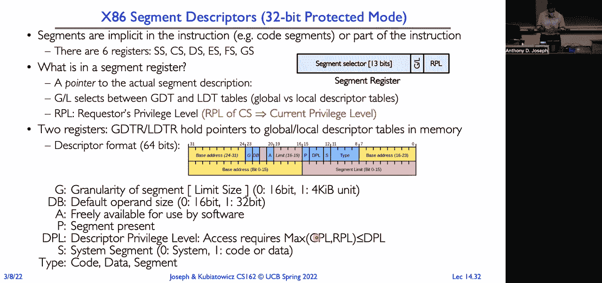

 And that's probably all that's really important。 OK。 So let's say we wanted to be able to have a 48-bit virtual address space。 Like it's on a 64-bit machine， I could potentially have really large pointers， like 64-bit pointers。 Or more commonly， you have something like a 48-bit pointer。 So that。

 I could do with a four-level page table。 So I'm going to use the lower 12 bits for my offset。 Now。 because my page table entries are going to have to be bigger， because my physical addresses。 are going to end up being larger， now I'm going to have to go to 8-byte entries。 So if I go to 8-byte entries and I have 4 kilobyte pages， how many entries do I have？ 4。

096 divided by 8。 Hours are 2。 5-12。 Half of 1024。 OK。 How many bits do I need？

 The index into a table with 512 entries？ 9。 It's right there on the slide too。 OK。 so our page table pointer， our CR3 register， points to our base or directory or whatever。 you want to call it， each of these page table entries is 8 bytes in size， there's 512 of， them。 and I just simply go walking through all of these tables until I get the actual。

 physical page number of the page that I want to reference。 Combine that with my offset。 my 12-bit offset， and now I have my physical address。 All right， and so you can actually do this。 Would you want to do this？ Probably not。 Right， because for every memory reference， I'm doing 1， 2。 3， 4 just to get the address， to then be able to do the fifth reference。

 which is actually going to be my construction， fetch load or store。 All right。 but not very efficient。 Not doable， but not efficient。 So one thing the x86 supports。 which kind of helps with some of this， is larger page， sizes。 Right。 and so here's an example where you have five levels of paging。

 If instead I have pages that are 2 megabytes in size， right， now I need fewer levels。 But why-- and I can go even larger， right？ I can have one gigabyte-sized pages。 So one might want to do that。 Any ideas？ What would be the benefit to having one gigabyte-sized pages？

 What would be an application？ Let's see some creativity。 Yeah。 Yeah， exactly。 Databases， right？

 If I have a database， I want to manage the objects in my database。 I might want to keep a large blob in memory。 And so having a 1 gigabyte page means that I could keep all of that in memory。 right， and manage my access to it。 Video would be another example。 From editing video。 I might have very large video segments， and I can completely fill， the pages。

 The key thing is thinking about applications where， either for， you know， a 2 megabyte page。 size or a 1 gigabyte page size， I can completely fill the page。 If I don't completely fill the page。 you know， if I put a 64 kilobyte stack on a 1 gigabyte， page。 then I have a lot of internal fragmentation， and I've just wasted my expensive memory。

 But if I have an application where I'm going to keep those pages full， then this makes。 it very efficient to have a large virtual address space and not have to do 5 memory references。 to do one read/write operation。 Okay。 So， Great for Colonel， you know。 the Colonel can all be in one page rather than in lots， of pages。

 and it's great for large libraries and so on。 Okay。 What about 64-bit addresses on a 64-bit machine？

 You know， I could just have a 6-level page table。 No。 That would be way too slow， right。 because we're going to have to walk through this。 This page table， then this page table。 then this page table， then this page table， then， this page table， this page table。 And then finally， we actually get to do our load in store on every single operation。 So。

 it would be just really inefficient。 Okay。 So， an alternative is what's called for not really good reasons an inverted page table。 You create something， a data structure， you get to name it。 And people don't always pick the best names， let's just say。 So， the way to think about this。 why it's called an inverted page table， is if you think， about what we've looked at so far。

 all of these we kind of walk through the table。 So， it's a forward path that we take。 mapping from our virtual address to our physical page， number。 And so。 the size of our page table is going to be proportional to the amount of virtual。 memory that we've allocated to this process。 We'll use one of these multi-level schemes so we don't have sparseness in our data structure。

 But the actual physical memory that we have could be much， much less， right。 If you look at a 64-bit machine， with 64-bit pointers， that's a much， much， much larger。 virtual address space， than the actual physical space， you know， our machine might only have。 64 gigabytes of memory。 So， we've got this huge data structure for our mapping and the actual pages that are。

 in memory is much， much smaller。 Most of our code and data and everything might be living out on disk。 So， what we're going to use is a hash table。 We're going to take our virtual page number and give it to this hash table。 And it's going to give us back our physical page number。 Now， it's called an inverted page table。 The nice thing here is the size of this hash table is proportional to the size of physical， memory。

 Because it's just keeping track of what's actually in physical memory。 And where is it？

 It's not on the hash table， then we have to go look in our bookkeeping data structures。 to figure out， hey， where is it out on disk？ So， that's nice。 The size is now independent of the virtual address space。 It's proportional to the amount of physical memory that we have。 And so。

 it becomes a really nice solution to when we have a 64-bit address space， right。 And we don't want to have six or seven or whatever levels of our page table。 So。 the downside here is that hashing， it's hard to come up with good universal hashing。 functions that have short chains。 By chains are where you have a collision。

 you go and you look in the bucket and it's not， the item you look for。 So。 you've got to rehash and look in another bucket， rehash and look at another bucket。 We don't want to do a lot of that because then that will be really slow and expensive。 You want hashing functions that generate very short chains。

 And you're doing this typically in hardware。 And so。 that makes it even harder to figure out what are good hash functions。 The other issue you have is if I want to walk through the page table itself， there's no locality。 here， right， because one virtual page number hashes to some location in the hash table。

 the next virtual page could hash to something far away。 The next virtual page could hash to something far away。 So， there's no locality。 Whereas。 with the approaches we were looking at before， one virtual page table entry was。 right next to the next entry。 It was right next to the next entry。 And in fact。

 they all fit on one page。 So， it was very efficient。 Okay。 But the benefit here is the size of our hash table here is proportional to the number of。 pages being used in physical memory， which is going to be much， much smaller than the。 number of pages used in virtual memory。 Okay。 So， I'm just going to end with the next slide。

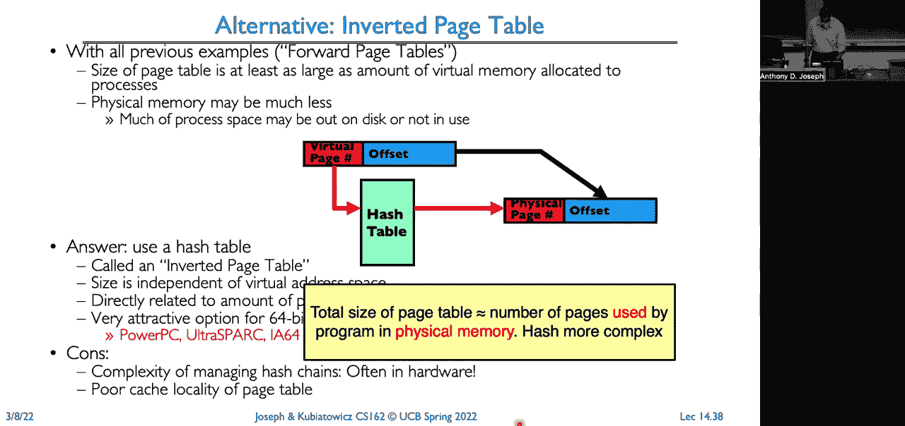

 So， we looked at a bunch of different translation approaches。 The segmentation。 really fast context switching， I just save out the segment map。 The disadvantage。 we can end up with external fragmentation。 Paging is nice at the single level because we now we have a uniform rapid way of allocating。 memory， no external fragmentation rather。 But we end up with table sizes that are proportional to our virtual address space and are mostly。

 full of empty entries。 So， it doesn't work well for sparse address spaces。 Page segmentation or multi-level paging， both of those approaches make the table size now。 proportional to the number of pages in use in virtual memory。 We get the advantages of fast allocation by using paging at the lowest level。

 But the disadvantage is it can be many multiple or many memory references just to do one read。 or one write。 So， we're going to have to fix that。 And that's what we're going to fix in the next lecture。 Inverted page tables。 Now we have a table size that is proportional to the number of pages in physical memory。

 But the downside is we have these hardware hash functions that can be super complex and。 we don't have locality for our cache of page table entries。 On that， we'll continue on Thursday。

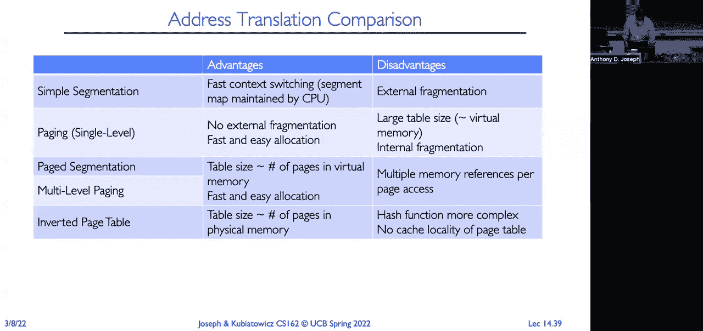