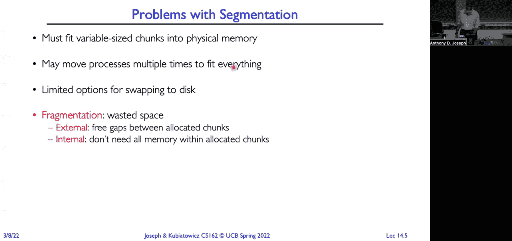
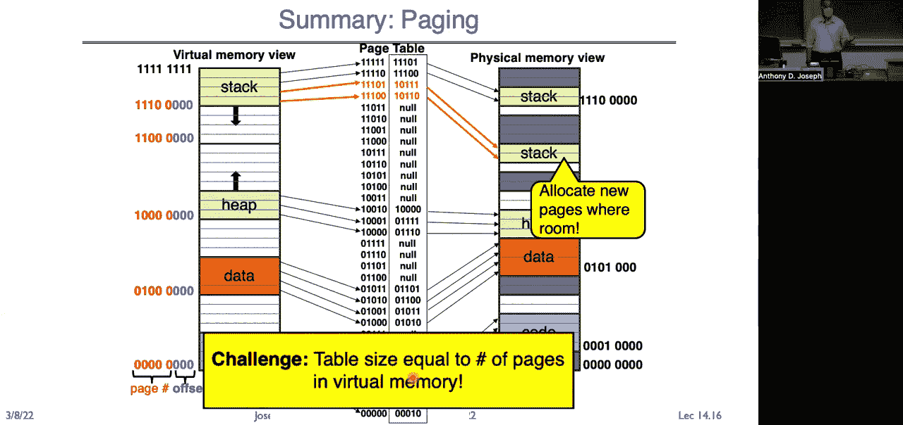
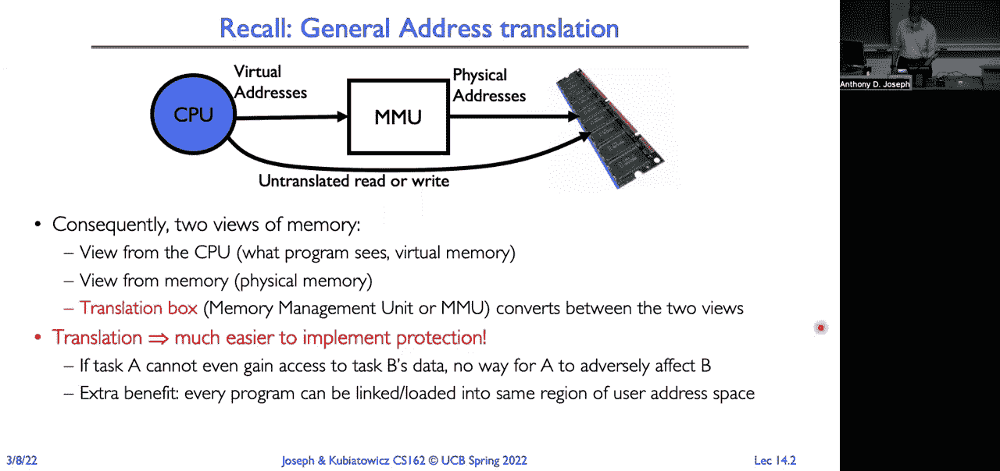

# 🧠 课程 P14：内存管理（二）虚拟内存、缓存与TLB

在本节课中，我们将继续深入探讨虚拟内存的工作原理，并介绍缓存和翻译后备缓冲区（TLB）的概念。我们将从虚拟内存的翻译机制开始，分析不同内存管理模型的优缺点，并最终引出如何通过缓存技术来优化内存访问性能。

---

## 📖 虚拟内存与地址翻译




处理器和进程看到的是虚拟地址。内存管理单元（MMU）的任务是将这些虚拟地址翻译成物理地址，即实际访问内存的方式。内存有两种视图：处理器看到的虚拟视图和内存实际的物理视图。翻译过程不仅实现了内存保护，防止进程访问其他进程或操作系统的内存，还使得每个进程都能拥有相同的内存起始视图（例如从地址0开始）。

### 多段模型

在上一讲介绍的多段模型中，处理器内存储存了一个段映射表，其中包含一组基地址和限制地址对。虚拟地址被分为段号和偏移量两个字段。段号用于索引段映射表，获取基地址，然后与偏移量相加得到物理地址。同时，需要进行边界检查和权限验证（如读写、执行权限）。元数据（如有效位、权限位）也存储在此表中。

**核心概念示例（段地址翻译）**：
```
物理地址 = 段基址[段号] + 偏移量
```


### 分页模型

分段模型存在外部碎片和内部碎片问题，且交换粒度大（整个段）。分页模型将物理内存划分为固定大小的页面（如4KB），并按页面分配内存。这通过位向量管理空闲页面，简化了分配过程。

**核心概念示例（页表条目）**：
```c
// 一个简化的页表条目结构
typedef struct {
    uint32_t physical_page_number;
    bool valid;
    bool readable;
    bool writable;
    bool executable;
} PageTableEntry;
```


在简单分页中，虚拟地址被分为虚拟页号（VPN）和页内偏移量。页表指针指向物理内存中的页表。通过VPN索引页表，获得物理页号（PPN），再与偏移量组合得到物理地址。权限检查同样必不可少。

**核心概念示例（地址翻译）**：
```
物理地址 = (页表[虚拟页号].物理页号 << 偏移量位数) | 偏移量
```

---


## 🔄 分页的优势与挑战



分页模型的主要优势在于：
1.  **灵活的映射**：虚拟页面可以映射到任何物理页面，无需连续。
2.  **易于共享**：多个进程的页表条目可以指向同一个物理页面，实现代码（如libc）和数据的共享。
3.  **简化分配**：使用位图管理固定大小的页面，分配速度快，无外部碎片。


然而，简单分页面临巨大挑战：页表过大。对于一个32位地址空间（4GB）和4KB页面，需要2^20个页表条目，每个条目占4字节，总大小达4MB。对于64位地址空间，页表大小更是天文数字，无法实际使用。

### 多级页表

为了解决页表过大的问题，引入了多级页表（如二级页表）。它将虚拟地址分割为多段，分别用于索引不同层级的页表。

**以32位系统为例（10-10-12划分）**：
- 偏移量：12位（页面大小4KB）。
- 一级页表索引：10位（指向二级页表）。
- 二级页表索引：10位（指向物理页）。

顶级页表（页目录）常驻内存。二级页表可以按需创建、调入内存或换出到磁盘。这种方式使得页表总大小与进程实际使用的虚拟内存量成正比，而非虚拟地址空间的最大值。

**核心概念示例（二级页表翻译）**：
```
物理地址 = (二级页表[一级索引][二级索引].物理页号 << 12) | 偏移量
```

### 段页式结合

另一种方案是结合分段和分页，顶层使用段映射，底层使用页表。虚拟地址包含段号、虚拟页号和偏移量。段映射提供每个段的页表基址。这种方式在上下文切换时需要保存段映射和页表指针，但能更灵活地管理稀疏地址空间。

---

## ⚡ 性能问题与缓存引入


多级页表虽然节省了空间，但增加了访问延迟。一次内存访问可能需要进行多次页表查找（每次查找都是一次内存访问），导致性能严重下降。

**问题核心**：我们不能承受每次内存引用都进行完整的地址转换。




**解决方案思路**：利用**局部性原理**。程序倾向于在短时间内重复访问相同的代码和数据（时间局部性），以及访问相邻的内存地址（空间局部性）。我们可以缓存最近使用过的地址翻译结果。


---

## 🚀 翻译后备缓冲区（TLB）


翻译后备缓冲区（TLB）是一个位于MMU中的小型、高速缓存，用于存储最近使用过的虚拟页到物理页的映射。

**工作原理**：
1.  CPU发出虚拟地址。
2.  MMU首先在TLB中查找该虚拟页号（VPN）。
3.  如果找到（TLB命中），则立即获得物理页号（PPN），与偏移量组合成物理地址。整个过程非常快。
4.  如果未找到（TLB未命中），则需遍历页表（可能多级）进行地址翻译。翻译完成后，将新的映射存入TLB，以备后续使用。

**TLB条目示例**：
```c
typedef struct {
    uint64_t virtual_page_number;
    uint64_t physical_page_number;
    bool valid;
    int asid; // 地址空间标识符，用于多进程上下文
    // ... 其他标志位
} TLBEntry;
```

TLB极大地减少了地址翻译的平均开销，因为大多数内存访问都能在TLB中命中。

### TLB与上下文切换


当发生进程上下文切换时，新进程的虚拟地址映射与旧进程不同。因此，TLB中缓存的旧进程的映射会失效。解决方案包括：
1.  **清空TLB**：切换时清空整个TLB（简单但可能影响性能）。
2.  **添加地址空间标识符（ASID）**：为每个进程分配一个唯一ID，与VPN一起存储在TLB中。这样，TLB可以同时保存多个进程的映射，通过ASID区分。

---

## 💎 总结

本节课我们一起学习了虚拟内存管理的核心机制及其优化。

1.  **地址翻译**是虚拟内存的基础，它通过MMU将虚拟地址转换为物理地址，实现了内存保护和进程隔离。
2.  **分页模型**使用固定大小的页面，解决了分段的外部碎片问题，并通过页表管理映射。
3.  **多级页表**和**段页式结合**是管理稀疏大地址空间的有效方法，它们通过层次化结构减少了页表的内存占用。
4.  多级翻译带来的多次内存访问开销是严重的性能瓶颈。
5.  **翻译后备缓冲区（TLB）** 作为地址翻译的高速缓存，利用局部性原理，缓存最近使用的页表条目，极大地加速了地址翻译过程，是构建高效内存系统的关键组件。


理解这些机制是掌握现代操作系统内存管理，以及后续学习缓存一致性、虚拟化等高级主题的重要基础。