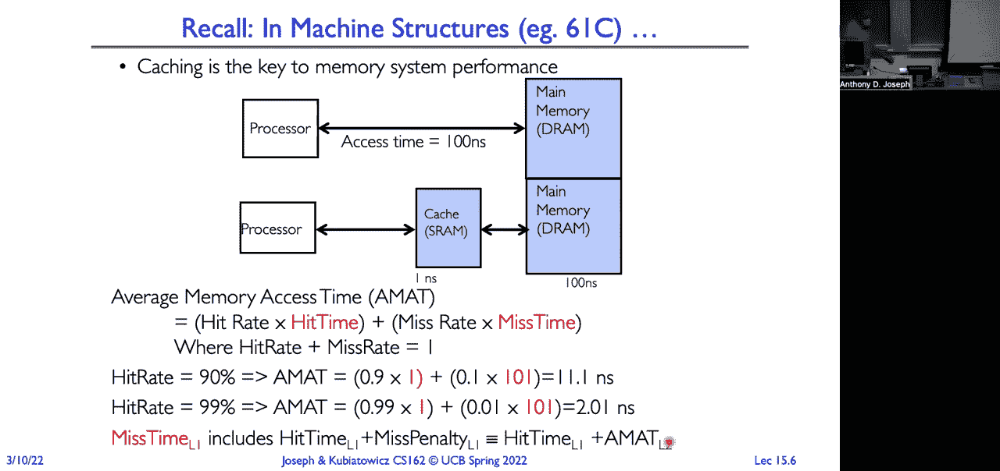
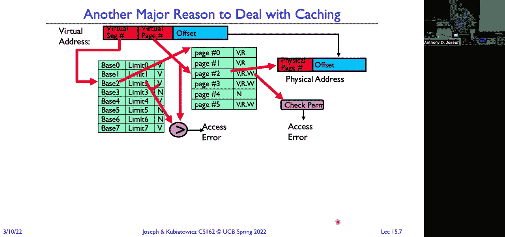
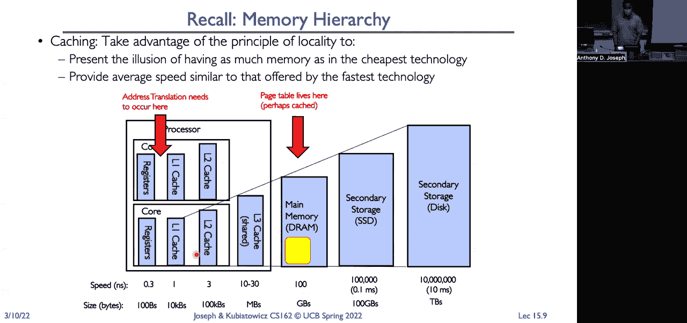
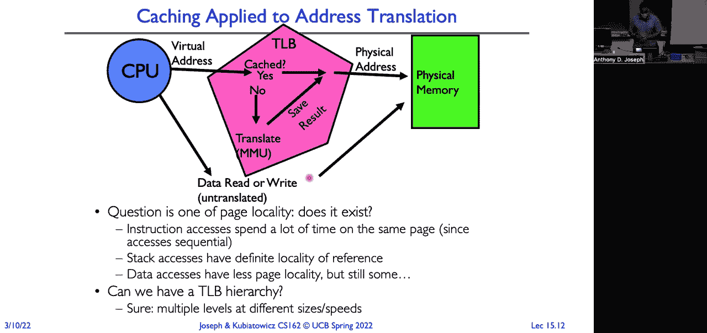
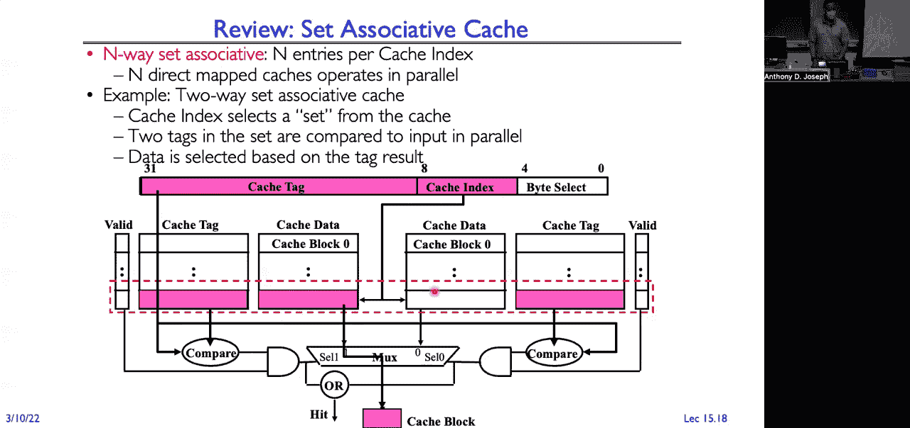
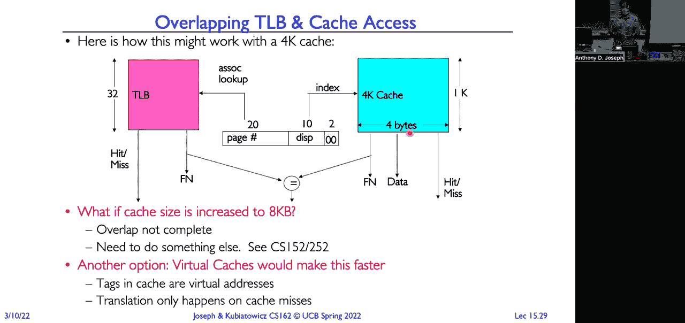
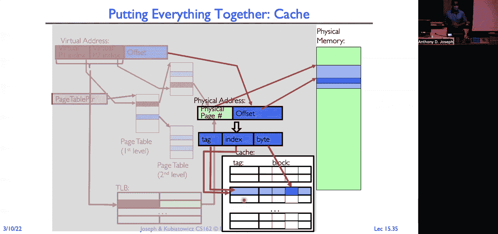

# P15：讲座 15：内存 3 缓存和TLBs（续），分页 - RubatoTheEmber - BV1L541117gr

好的，开始吧。

所以今天我们将看到第三讲关于内存的内容，我们将探讨缓存，转换、旁路缓存（look aside）以及缓冲区，然后我们将进入需求行为部分。好的，记住我们有双级页表，对吧？所以这里我们有这棵页表树。我们使用神奇的10，10，12排序模式，这为我们提供了一个很好的结构。

分析每个表格时，我们的页表每个包含1,024个条目，每个条目是4字节，这样就适合一个4k的页面，代表我们的偏移量为2的12次方。通过这样做，我们的表格大小固定，我们有页表指针的根指针，这个指针是一个寄存器，x86上的CRP寄存器指向我们的顶部。

在级别表中，前10位的索引指向该表。这为我们提供了指向物理内存中页表的指针。在第二级中，使用P2索引和接下来的10位进行索引，这会给我们提供实际物理页的页表项。

将物理帧号与我们的偏移量结合，我们得到页面，并得到页面上的字节。有很多后续信息，我们稍后会在页表项中逐步讲解，比如有效位、30位、修改位等等。现在，双级方案的一个好处是数据结构的数量。

我们将拥有的内容将与实际使用的虚拟地址空间的比例成正比。它将比实际虚拟地址空间要小得多。好了，那么我们如何进行转换呢？再次提醒，转换是在内存管理单元中完成的。

内存管理单元必须将每条指令的获取、每个加载和每个存储操作从程序使用的虚拟地址空间、CPU发出的地址指令转换为内存使用的实际物理地址。现在，我们如何进行这种转换呢？好吧，对于单级页表， 

我们只需要索引到该表并读取，检查页表项是否有效，然后它将为我们提供物理页帧。对于双级页表，它可能正是我在上一张幻灯片上展示的那样，我们将遍历两组页表。对于n级页表，

页表将遍历n组页表项。因此，我们观察到内存管理单元所做的事情只是一种预遍历的形式。它正在遍历那棵页表项的树，以找到我们想要的实际物理页的页表项。好的，那么我们将内存管理单元放在哪里呢？

好吧，这些操作发生在处理器芯片上，就在处理器旁边。所以处理器生成虚拟地址。内存管理单元利用页表基址寄存器来遍历存储在内存中的页表。请注意，这里的缓存是物理寻址的。所以我们传递给缓存的地址是已经被转换过的地址。好的。

当我们给MMU一个虚拟地址时，它将进行遍历。现在，由于我们这里有缓存，可能有一些页表项已经在缓存中了。如果是这样的话，内存管理单元将立即返回这些页表项，并且它能够立刻返回处理器一个物理地址。

对于处理器来说。如果没有找到，那么我们可能需要一直访问物理内存才能进行验证。而且，如果那些页表实际上在外面存储，我们可能还需要进行IO操作才能把虚拟地址转换为物理地址。所以如果我们命中缓存，速度将会非常快。如果缓存缺失。

这可能会非常非常慢。好的。那么内存管理单元在做什么呢？实际上，在每条指令执行时，加载和存储操作都在做这棵树的遍历，用来将虚拟地址转换为物理地址。如果它发现一个无效的页表项，不管是什么原因，比如去除的操作，访问类型等等。

它会返回一个失败状态，并跳转到操作系统。好的。那么这里需要考虑的一点是，内存管理单元在缓存之前。缓存是让一切变得快速的关键。对吧？这个缓存就在处理器内部。所以它的运作速度是纳秒级的。但是访问内存。

就像是100纳秒去访问磁盘。那大约是百万纳秒。所以，为了能够在缓存中访问某些内容，我们必须经过这个过程，这个过程可能会消耗数百万纳秒。看起来这真的违背了我们设定的目标，对吧？

那么让我们看看缓存提供了什么，以及我们如何将缓存应用到取消过程中。我们将快速介绍一下缓存的基础知识，这些你在61C课上忘了的东西。缓存只是一个存储库，用来存放可以更快速访问的副本，或者说比原始副本更快。对吧？所以我们不需要每次都去访问内存。

我们这里有一个缓存。在这种情况下，它是一个数据缓存，允许我们更快速地访问物理内存中的副本。这样我们可以比纳秒级访问快得多，差不多是毫秒级，而不是数百纳秒。好的。缓存之所以有效，是因为它让常见的情况变得更快，而让不常见的情况变得不那么显著。所以如果你看看一个中等规模的计算机。

你会发现缓存无处不在，对吧？所以我们要看看如何利用它来缓存内存位置。我会用来解决地址转换。我会用来缓存域名解析。我会用来缓存网络位置、页面、文件块。在计算机中，一切都可以通过使用缓存来加速，或者几乎总是如此。

这种情况并不算太昂贵。我们会有一个非常高的命中率，并且我们希望尽量减少未命中的成本。所以，这就引出了我们如何评估缓存的问题。我们用这个指标来评估它：平均访问时间。平均访问时间就是命中率乘以命中时间。

所以，当我们在缓存中找到数据时，加上未命中率乘以未命中时间。也就是说，当我们在缓存中找不到数据时，必须去更低级别的内存查找，这就出现了错误。所以缓存是提高系统性能的关键。这里有一个例子，对吧？

如果处理器直接访问内存，则需要100纳秒。如果处理器在1纳秒内操作，那是某个纳秒级别。所以，像S-grant缓存这样的处理器访问是1纳秒。而从内存中获取数据需要100纳秒。

如果我们从主内存中操作，它的速度是100倍慢于直接从处理器上操作的速度。如果我们能够保持在处理器上操作，就能以处理器的速度运行。你刚刚花了几千美元买了那款疯狂快速的Intel i9 12,000 Plus KF处理器。现在，你却要让它运行在内存的速度下。所以这就是缓存和这个技术可以帮助我们在速度上接近处理器实际速度的原因。

那么，处理器实际上能做什么呢？好吧，如何在这里应用平均内存访问时间呢？再次提醒一下，计算公式是：命中率乘以命中时间加上未命中率乘以未命中时间，其中，命中率加未命中率等于1。好吧，如果我们有一个90%的命中率呢？

所以90%的时间，处理器会在缓存中找到数据。这真的很好。比如90%的时间，10次中有9次我们能在缓存中找到它。但这到底意味着什么呢？嗯，那将是0.9乘以1纳秒，90%的时间。然后，另外10%的时间，0.1，就是101纳秒。现在。

为什么是101而不是100呢？因为我必须先在缓存中查找，才知道它不存在。所以在缓存中查找需要1纳秒，然后需要100纳秒去下一层内存中获取。这就是11.1纳秒。这样好不好？这样算不算差呢？

好吧，我的意思是，它显然比100纳秒要好。它快了10倍。但它仍然比我花了大价钱买的这个处理器慢10倍。所以它其实是相当糟糕的。10倍的减速是完全不能接受的。那么如果我提高命中率呢？如果我将命中率提高到99%呢？嗯。

如果我将命中率设为99%，现在是 0.99 乘以 1 加 0.01 乘以 101。所以是 2.01 纳秒。这要好得多，虽然不是完美。但现在你只有二倍的减慢，而不是一百倍。所以这就是能量警告结束时的情况。

但它也意味着我们必须确保我们能够提供非常高的命中率，以便实现良好的性能。现在，当你真正思考时，我们稍后在课程中会看到，内存——在这里我们使用缓存来缓存内存的内容。但我们也使用内存来缓存硬件的内容。所以实际上。

当我们考虑平均内存访问时间时，它实际上是命中时间。因为我们在一级缓存中找到了它。加上如果我们在一级缓存中没有找到它时的缺失惩罚，这基本上等于二级缓存的平均内存访问时间。因为你可能实际上需要从内存中取出它并找到它。

这不是实际上存储在磁盘上的内存，所以我们必须再次从磁盘读取。是的。[听不清]，哦，这是个好工具。[听不清]，让我们看看你能不能降低那个墙。[听不清]。

好的。好的。那么我们希望使用缓存的另一个原因是——哦，是的。

[听不清]，所以应该是 10.1 加 0.1。哦，这里应该是一个字母。是的，我会在旁边修正这个。

谢谢。好的。好的。那么我们想要处理缓存的另一个主要原因是，记住，我们需要遍历这些表格。这里有一个基于段的系统示例，以及最低级别的单一分页。对于我们每次的内存访问，我们将首先查看段映射。那是在进程中的。所以这将是非常快速的。

但它仍然会穿越样本。然后我们将不得不实际去外部工作内存，遍历页面表。在我在第一张幻灯片中展示的示例中，我们必须遍历两个级别的内存页面表。所以我们每次的访问都将是介于两到三次内存访问之间。所以每个我们加载和存储的指令。

我们可以将成本乘以二倍，或者二倍，或者如果我们有额外的级别，五倍，等等。好的。现在，如果你仔细想想，再次，我之前在MX幻灯片中说过，TOB在哪里？

TOB 是我们用来加速内存的缓存之前的部分。但在我们可以在缓存中查找任何内容之前，我们首先需要获取物理地址。所以如果我们需要多次内存访问才能检查缓存，那缓存有什么意义呢？因为访问内存缓存的时间将会被那三次内存访问所主导。

我们必须进行的访问。好的。所以解决方案是，我们做了所有的工作来进行翻译。我们不如把那个结果保存下来或者传递出去。好的。所以这个缓存被称为翻译旁路缓存。它得名的原因，稍后会解释。但首先，问题是，这种方法行得通吗？我们能从缓存翻译中获得合理的命中率吗？

那么，为什么缓存会有效？缓存只有在我们有局部性时才有用。如果没有局部性，缓存就没有任何好处。每次访问都是完全随机的，你不会看到缓存带来任何好处。但这不是计算机程序的典型操作方式，也不是计算机的典型操作方式。对。所以如果我们看一下行为，我们通常会看到时间局部性。

这就是所谓的局部性。所以在这里，x 轴是我们的地址空间，y 轴是我们访问给定内存位置的概率。你可以看到有一些峰值。所以如果我访问了某个东西，我可能会再次访问那个东西。对。如果我有一个全局变量，我访问了它。

我很可能会再次访问那个全局变量。或者我有一些变量在一个子程序内，我很可能会多次访问这些变量。所以将最近访问的数据保留在离处理器更近的位置，将为我们提供更好的性能。现在，如果我访问某个东西，结果证明它不太可能再次被访问，如果你看这个情况。

这里有点粗糙，我也可能会访问周围的东西。对。所以像是，如果我正在读取一个强度，我做的是一个字符串长度或字符串复制操作。好，访问一个字符，我可能会访问附近的其他字符。所以当你考虑移动东西时，空间局部性意味着我想从内存层次结构的较低级别移动一个块。

一个上层。因为访问了一个东西，那一块我可能会访问到其它东西。好的。但这就是这张图所展示的。如果我访问像下面的某些东西，为什么我应该移动它整个块，而不仅仅是我访问的那个单独项目。

好的。所以我们在这里使用缓存的目标完全是关于制造假象的。所以我们希望展示这样一种假象：我有一个以寄存器速度操作的规模为 TB 的内存，并且成本接近最慢存储设备的成本，而不是最昂贵的存储设备。我的最大存储容量，而不是我最快的存储。

比如这里我们讲的寄存器，只有几百个字节，效率差，但我可以在纳秒的微秒内访问这些寄存器。对。而如果我必须访问磁盘，它需要 1000 万纳秒。但在 TB 级别看起来对程序来说几乎是无限的。所以我想要那种假象——我拥有无限快速的存储。

所以我们会在这个更高层级的每个层次进行缓存。我们会处理，比如这里我们有一个L1缓存，核心的L1缓存。然后我们有内存作为缓存用于我们的SST，SST又作为硬盘的缓存。它可能是访问云的缓存，或者其他缓存等。好的。

现在我们的挑战是，地址转换首先需要在这里发生。它发生在我的指令获取阶段，加载和存储到寄存器的过程中，但页表，我需要在内存中完成这个地址转换。而内存的运行速度是100纳秒，而我的寄存器的速度是纳秒级别。

好的。那么我们如何加速地址转换？使用缓存来保存转换结果。好的，这和传统的缓存方式稍有不同。传统的缓存，你会想到它的键是一个内存位置，物理内存位置，缓存返回的是那个内存位置的内容。

这里我们有点像是在缓存一个算法的结果。这个算法是我们用来生成未来虚拟页表的算法。而它的索引方式不是通过物理地址，而是通过物理页和虚拟页号。所以，我们的处理器生成虚拟地址。

我们的内存管理单元通过数据缓存，逐步访问页表。生成转换结果，并且我们会缓存这个结果。所以这里我们有我们的翻译，旁路缓存，按虚拟页号索引，返回物理帧号。还有一堆来自页表的位。好的，所以这里是一个页表。

然后我们加载到我们的……好的。所以这是再次记录虚拟页号和物理帧号的转换。如果我们在TLD中找到了内容，我们就完成了。我们不需要再去访问内存，不需要查看页表，也不需要做其他任何事情。我们已经得到了答案。

我们有物理帧号。所以，这个名称的来源。是由莫里斯·威尔克斯爵士发明的，在缓存之前。因为他意识到，早期的计算机遇到了一个问题，那就是它们运行非常慢，因为它们花费了大量的时间访问内存，仅仅为了进行地址转换。所以他创建了这个地址转换缓存。

然后我们决定将它称为旁路缓存翻译。但随后人们意识到，哇，你知道，我们可以缓存转换的结果。为什么不直接利用内存存储来缓存访问内存的结果呢？这就是所谓的旁路缓存。于是，他们选择了内存翻译作为这个缓存的名称。

看旁表，但那是类似的东西。好。现在，当我们在TLC中找不到某个内容时，我们会恢复到之前的操作方式，就是内存管理。它将遍历树，找到结果。当我们找到结果时，我们将把结果传递给TLC。好，将这些内容汇总起来。

处理器生成虚拟地址。我们查看TLC，如果找到它，我们就有物理地址，可以直接访问物理内存。如果没有找到，我们就请求MMU，将虚拟地址转换为物理地址，并遍历表格。它会做所有的工作，生成物理帧号，然后我们传递该翻译。好。

当然我们也有未翻译的内容。所以有几个问题。这一切都建立在有一个真实问题的假设上。所以如果我作为程序访问一页，我是否可能再次访问那一页？如果答案是否定的，那么翻译缓存就没有任何好处。程序就是那样的。

一种在内存中不断跳跃的方式，永远不碰同一页，而且结果是零效益。但这并不正确。程序通常不会这样行为。所以如果我们看指令访问，它们会在同一页花费很多时间。但是你的代码是顺序执行的。然后你有分支、还有类似的东西，但总体来说。

我们会停留在同一页。周期性地，调用一些库或子例程，换到另一页。但是许多指令获取会停留在同一页。所以我们会从翻译缓存中获益。栈访问。

绝对存在局部性参考。我们递增地增长栈，递减地缩小栈。所以大部分时间你都会在同一页上停留。周期性地，你会上下翻动页面。数据访问则稍微复杂一些。很多时候你会有低质量的访问，但并不总是如此，对吧？比如我之前给的例子。

当我在字符串中遍历字符时，那些都在同一页上，实验证明这些值会跨越页。但如果我有一个查找表，你知道的，我可能在做随机访问。为什么是数据库呢，可能会有很多随机访问这个数据结构。所以它会变化。

但对于栈，肯定是如此，对于指令获取也是如此。我们会看到有很多页面都被使用。好。我们能有一个页表的层次结构吗？可以，我们可以有多个不同组织的层次结构来操作。是的，问题是什么？是的，问题是当处理器通过TOB时。

是否必须通过MMU，还是可以直接访问？所以再说一次，关键是首先询问TOB，它是缓存。如果它有虚拟页号到物理页号的翻译，返回。如果没有，再询问内存管理单元，就会出现TOB缺失。

然后你去访问成员管理单元，它会处理冻结。生成从虚拟页号到物理页框的转换。然后它会告诉TOB，这就是转换以及与之相关的所有位。为未来进行哈希处理。接着你就会走到路径那里。

所以这一切都发生在我们访问缓存之前，这就是为什么它必须是你的测试。如果我们在TOB中的命中率不好，那么即使我们在缓存中有非常高的命中率，也不会有任何影响。我们将花费大量的内存访问时间仅仅是为了找到我们正确的路径。是的，所以这实际上非常重要。因此，这条额外的路径是CPU可以生成物理地址的地方。

所以你要考虑，操作系统需要能够进入并操作一些东西，比如直接与设备交互或内存映射，或者实际上能够设置页表。因此，在很多情况下，操作系统需要能够直接写入物理内存。

所以在这种情况下，知道没有发生地址转换。我们在机器的物理地址空间中操作，而不是在某些进程的地址空间中。否则，就没有办法设置页表。是的。正确。问题是，我们应该阻止用户进程能够生成这些未经翻译的地址。绝对应该。

但是如果没有的话，那么用户进程将能够读取任何物理内存。所以，双模式操作要求如果你要生成物理地址，必须处于保护模式或某种现象下。还有其他问题吗？是的。是的，问题是有没有什么东西表明CPU正在访问和转换的地址，或者是未经通风的地址。

所以通常，可能会有一些类似保留指令的东西。这些指令只能在请求特定级别时执行，直到最终级别。它们允许你直接进行加载和存储，完全不经过转换。但这将是我们正确的议程。是的。是的，问题是。

我能举一些例子，说明为什么内核需要使用未经通风的地址吗？两个简单的例子是，图形帧缓冲区通常位于物理地址空间中的一个非常特定的位置。为了提高性能，我可能希望能够从内核直接读写图形帧缓冲区，而不需要经过任何形式的取消。我还可以将窗口等内容从帧缓冲区映射到各种地址空间中。

但这些地址最终会通过地址转换。你想这么做的另一个关键原因是，如何在第一步设置页表。比如说，你需要知道，页表位于物理内存中。因此，为了设置它们，我需要能够直接读写物理内存。你有什么问题吗？好的。

所以问题是，我们是否假设每次访问后都会通过缓存？是的，对于 TLC（Translation Lookaside Buffer），我们只在对 TLC 中的内容进行更改时才需要更新。例如，当我们进行 MME 翻译时。那时我们会将其放入 TLC 中。TLC 跟踪某个内容是否被最近访问过。

所以，TLC 会在我们进行读或写时更新。类似地，当我们进行写操作时，可能会有一个脏位（dirty bit），它跟踪缓存行是否被修改。这会导致 TLC 更新。但我们将会详细讨论这一点。在上一张幻灯片中，提到如果 TV 缓存未命中，我们会检查其他缓存。是的。

如果是 TV 缓存未命中，我们将使用内存管理单元进行翻译。它会遍历树形结构。并且请记住，内存缓存会对内存中的内容进行哈希处理。这可能包括页面表条目、页表等。因此，我们始终会将所有的写入操作指向缓存。

这样你可能会发现，实际与翻译相关的页面表条目已经在缓存中了。在这种情况下，我们可以在处理器上继续操作，而无需访问内存。因此，TV 缓存是在一级缓存之前吗？是的，表格是在开放缓存之前。我们稍微提前了一些。接下来我们会展示一个图像，显示现代处理器的工作流程。

而且你会发现实际上有多个缓存。并且它们是共享的。

好问题。那么，TV 缓存是什么类型的缓存？嗯，考虑缓存时，有很多不同的参数可以用来选择缓存的组织方式。例如，它的大小，我们所有的缓存都包含其中。还有它的关联性，大小等。还有缓存行大小。现在，记住。

这是位于死循环过程中的内容。因此，每个晶体管都非常昂贵。实施的区域有限。所以正确地做出设计权衡将对性能非常重要。还有一个正确的策略。那么，当我们存储某些内容以进行更改时，它是正确的吗？还是应该回滚？

那么，我们如何组织 TV 缓存？与传统数据缓存和存储的组织方式有何不同？要回答这个问题，你可以查看一下，确保每个人都记得 60 和 C 中各种缓存组织类型的内容。

好的，在我们继续之前，先来看看为什么某些内容可能不在缓存中。那么为什么我们可能会错过某些内容呢？首先，有三个加一个，我称之为缓存的来源。第一个是强制性的。那就是你第一次去访问某个内容时，它不会在缓存中。因此，你必须去内存中取回它。

然后将其放入缓存中。如果你有一个较长的程序，你知道，程序中有数十亿条指令，而这些冷启动效应可能是微乎其微的。但如果每次你进行上下文切换时，都必须刷新缓存，并且你总是会遇到强制性缺失（compulsory misses），那么情况就不同了。现在，情况也是这样。

我认为将其称为强制性有些误导，因为实际上我们可以规避它。因为我知道我将要访问某个特定的块。那个块的第一次引用，肯定会导致多次缺失。如果我知道自己正在进行顺序访问，我知道接下来会访问下一个块。

我实际上可以提前预取那个块，这样等我去请求那个块时，缓存已经有了。我避免了强制性缺失。我希望通过进行预取来权衡这一点。预取的好处是可以避免一些冷启动缺失。缺点是，你可能会将一些有价值的数据从缓存中踢出去，以便为一个我们最终不会使用的数据项腾出空间。

好的，下一个缺失类型是容量缺失（capacity miss）。这是当缓存没有足够的空间时。它无法容纳所有正在执行操作的块。解决方案是，出去买一个更大的缓存。所以，当你查看处理器规格时，我们会看到它们有指令缓存、数据缓存、共享缓存、所有的删除缓存、所有的食品缓存。

而当你查看最低成本的差异时，i3 和 i9 之间的区别将在于缓存的大小。因此，这也是处理器中最昂贵的部分之一，因为它占用了大量的面积和处理过程。所以，较便宜的处理器，较小的芯片，减少了用于缓存的空间。

但接下来，我会遇到更多的容量缺失（capacity misses）。这也是为什么，即使使用相同的架构，一个处理器在某些工作负载上的表现可能比另一个处理器要慢的原因。这就是一个很好的例子。好吧，另一个来源是我们所说的冲突缺失（conflict misses）或碰撞缺失。这是当两个或更多的数据项发生冲突时发生的情况。

所以我们最终不得不替换一个数据项来存储另一个。但是，随后我们访问的是刚刚被替换的数据项。所以你可能会陷入一种崩溃的形式，多个数据项映射到路径中的同一位置。因此，解决方案，还是花更多的钱买更大的缓存，或者让缓存具备更多的社会性。

可以采用集合关联的结构，或者使其完全关联，或者增加更多的集合。但减少冲突缺失。最后，还有一种你不常听到的缺失类型，叫做父缺失（parent misses）。这是一种无效化的形式。例如，如果我正在传递某个内存位置。

还有一个直接内存访问控制器和IO控制器，从磁盘读取某些东西。它从磁盘读取一个块并将其写入内存。这就是我过去的操作。我现在已经使缓存的内容失效。那个DNA操作使其失效。或者，例如，如果我有一个多处理器，而另一个处理器写入我缓存的相同内存位置。

现在我复制的那个内存位置已经失效。大量的工作进入了失效协议，多进程的处理。好的。现在。我们如何在页面中找到某个内容？我们将地址分解成各个部分。所以我们的块是最小的量子或单位，用于传输。

当我们考虑将某些东西从较低层次传输到较高层次时，我们按块移动它。但是当我们考虑将一些内存从块从内存移动到处理器路径时。那个块的大小可能像16字节或类似的东西。当你考虑去磁盘时，它可能是像四千字节那样的一个块被移动。

所以，在每一层级的层次结构中，我们考虑的是我们正在移动的块。现在数据选择你，低位用于在那个块中选择。所以我们分配给偏移量的位数将控制我们的块的大小。嗯。并不是所有的应用程序都会有这个需求。就像在TLE的情况下，你知道。

我们没有这个问题。因为我们只返回翻译。现在我们有了索引，用来标识缓存中可能包含数据的一个集合。然后我们使用标签来实际识别缓存中存储的内容是否是我们要找的东西。好了，接下来让我们通过这个模型，回顾三种不同类型的缓存组织，针对缓存中的高度资金配置。

我们要回顾的第一个是直接映射。所以我们有一个直接映射路径。它将存储2的n次方字节。上面的32减去n个字节将是我们的上限。最低的n位将是我们在块中的偏移量。所以在这三种情况下。

那就是剩下的字节数。所以这说明我们的块将是2的n次方大小。所以这里有一个路径的例子。所以这里我们有块，每一行就是一个块。1千字节的直接映射路径是32字节的块。那就是32字节。我们需要多少位？这是以2为底的幂次。好的。

所以我们将取出最低的五位。这就是我们的字节。这就是我们能够设置特定值的方式。然后我们取下一个五位，将其用作我们的缓存索引。再次，你可以看到这里我们有42个块。2的五次方。所以我们选择它。然后我们使用我们的标签。让我们看看。好的，那就是收银员的事情。

缓存中的块不是我正在寻找的块。它将使用我们的标签来检查是否匹配。那里有一个比较器。如果匹配，我们知道我们找到了我们想要的块。现在我们只需要选择字节。这就是我们将使用字节选择器或处理实际内容的地方。这是直接映射。

对于集合关联缓存，思考的方式是：现在我们基本上拥有了。总之，集合关联缓存。现在我们将没有任何直接映射通过。好吧。现在这里一个重要的考虑因素是：每当我们比较缓存时，我们假设总条目数始终相同。

所以通过使用二路集合关联，我们并没有使条目数量翻倍。事实上，条目数量是相同的，只是组织成了这些直接映射缓存的银行，并且它们是并行工作的，每个缓存都能独立工作。好了，所以在这里，我们的缓存索引用于选择其中一个集合。

然后我们使用我们的缓存标签，并且我们将使用相同数量的条目。我们将使用相同数量的条目。我们将使用相同数量的条目。我们将使用相同数量的条目。我们将使用相同数量的条目。我们将使用相同数量的条目。我们将使用相同数量的条目。

我们将使用相同数量的条目。这些比较器的结果必须通过一堆门逻辑和其他组件。然后这些会传递到多路复用器中。该多路复用器将获取块并提供该块。然后我们可以使用我们的。这里是我们的字节选择器，选择实际的内容。

所以这是一种权衡。但现在我们有更多的地方可以存储潜在的项。所以这有助于我们减少冲突。以这种方式。但那会涉及更多的逻辑。我们有多路复用器，它们只有两个。而我只是想达到八个。你不能建造一个具有八个输入的多路复用器。通常你会使用一个多路复用器的树形结构。

这些每一项都有一定的延迟。因此，当我们开始将所有这些数据加起来时，传递的那些数据集合会运行得更慢。和直接映射一样。所以，我们增加了访问时间，虽然只是稍微增加了一点。但我们可以通过减少冲突来获得好处。同时也需要更多的空间，因为所有的多路复用器、门逻辑等都需要占用空间。

这会影响我们底部的晶体管数量。实现一组敏感的操作更为昂贵。但你知道，如果我们要做集合关联的话，结果就是让每一项都进行比较，而不是仅仅将事物拆开。

这就是我们进行完全关联时所能做的。因此，现在没有索引了。我们的标签是除了我们的末尾之外的所有东西。并且附加在这些条目块上的每个条目上都有一个标签或者一个大的比较器。这需要最多的额外逻辑来实现。这会使得它变得更慢。但是我们没有冲突未命中。

就像任何块都可以放在类中的任何位置。好吧。我不会遇到两个块进入同一位置的问题。现在，我们将块放入缓存中，应该怎么决定呢？让我们来看一个例子。这里有一个32块地址空间。我们有一个包含八条线的缓存。

那么，块12应该放到我们八个块的哪儿呢？在直接映射缓存中很容易。12模4的唯一位置就是这里。它只能放在这个地方。现在我们会遇到问题，对吧？因为我们的30块地址空间中的其他任何块。如果不是等于4的地址，会发生什么呢？

步幅模式或任何访问模式都可能是其中之一。我们将只需返回，因为我们将用另一个请求来替换这个块。然后我们会请求这个块并替换另一个块。我们就会来回地进行切换。然后是一个集合关联缓存。

它可以放在集合零中，那里有两个选项。这是两路集合关联的。它有点像12模4。再次强调，这里我们有两个缓存，它们的大小相同。八个块哈希。无论哪种情况。但现在我们有两个不同的位置可以放这个块。这将减少我们只是不断碰撞的可能性。

就像我们在图中可能遇到的那样。然后如果我们看一个完全关联缓存，它可以去任何地方。再一次，通过这种方式我们将冲突降到了零。但它需要更多的硬件并且会探索更多的答案。新的问题。那么，我们该替换哪个块呢？

在这种情况下我们得到了什么？好吧，使用直接映射缓存是很容易的。我们只有一个选择。对吧？它只映射到一个位置。使用集合关联，完全关联缓存。好吧，现在我们有了选择。所以我们需要一些块替换算法，用来在我们可以使用的潜在位置之间做选择。所以，我们可以考虑的算法之一是随机的。为什么是随机的？嗯。

实现一个随机数生成器在某部分其实非常简单。实际上，要让它更随机一点，并且不依赖于那个固定的方式，这会变得相当复杂。我们所知道的只是，你可以做一些相对较好的事情。它是围绕着第一个数值来的。还有另一种选择。

为什么我们使用像最近使用过的这样的策略呢？我们有哪些块有局部性？我会展示一下时间局部性，哪些块在课堂中使用最远的。那就是我们要替换的块。好的。这是一个工作负载的示例。它只是一个随机的，你知道的，基准工作负载。

我们可以从不同的角度来看待缓存组织。所以我们有关联度的程度。比如二路、四路、八路。你有替换算法的选择。然后在这里，在 Y 轴上。我们有行，这是大小。我想做个坏人。嗯，对于小缓存。

尤其是如果它实际上有些独立的话，我猜，是的，系统之间有大约 0.5% 到 0.6% 的差异，这实际上相当显著。那个 0.6% 是，正是适用的，你看，然后我们看了，你知道，我们需要什么作为错误。另一方面。

停下来想一想。实现 LRU，它需要额外的数据。比如你必须有一个时钟，时间戳。你必须有很多逻辑才能实际遍历并比较每个条目，看看哪个有最旧的时间戳。因此，值得花费那么多精力来换取 0.6% 的增益吗？

也许吧，但是，你知道，我们必须深入地去看一下，因为它会涉及大量的软件，或者我们尝试在硬件中实现，付出很大的硬件开销。另一方面，当我们看到更大的缓存时。LRU 和随机之间其实没有什么区别。鉴于随机算法在硬件中如此容易实现，我们就选择一个随机模型。现在。

这里有个大警告，巨大的方面是，我必须补充的是，这只是一个工作负载在这个组织的盒子和替换盒子上运行。在我做出这样的决定之前，我想要查看很多不同的代表性工作负载，以确定，你知道，可能最好的算法是什么。好吧。现在，我们如何处理写操作？

如果你记得，我们有两种写操作选择。一种方法是写穿透。所以当我向缓存写入数据时，我也会写入内存的下一级。所以缓存中永远只包含与备份内存或页面中相同的数据。好吧。现在。另一种选择是写回。所以在这里，我将数据写入缓存，只有当我将其从缓存中驱逐或替换时。

但是接下来我去将那个块写入下一级的内存层次。所以现在我必须跟踪的是特定块中的数据，是否干净。就像它是否与备份存储中的数据完全匹配，还是脏的，如果是这样的话，我必须将它写回。我将从缓存中驱逐它。

那么让我们考虑一下它的一些优缺点。我会选择写穿透。这样我就可以得到一个好处，即弱点不会导致故障。好吧，这有点复杂。这是什么意思？想一想。我去读取某些东西并检查缓存。它不在缓存中。我该怎么办？我要去备份内存，读取那个项。

并且将其现金存储在现金中。通过它。好吧，但是如果缓存满了呢？

我得从缓存中挑选一个块。如果我选中了一个脏块来替换会怎样？如果是直写，那就没有问题，因为所有块都会更新。如果是写回，那块数据就不会是脏的了。也就是说，我得把它写回内存。所以这就有点奇怪，对吧？处理器从内存读取数据时，最终不得不做很多工作。

所以这就是拥有写操作时的一个问题。我会丢到缓存里。这里的另一个缺点是，想象一下我做了很多写操作。嗯，处理器的操作时间是纳秒级别，内存则是几百纳秒。所以我每次写操作都需要100纳秒才能从内存写出。所以这会让我的处理器变得慢100倍。所以解决办法是使用缓冲区。

现在，当我进行写操作时，写入会被缓冲，最终会写入内存。我只要把数据放入写缓冲区，就能立即返回。但现在，这会限制我能多快地执行。如果缓冲区满了，我就得恢复到内存的速度。或者说。

如果我采用写回策略，那就得考虑一下。如果我有一个计数器，正在不断更新。所有这些更新都将通过写回被吸收到缓存中。因此，我写入的速度是缓存的速度。而当我最终不得不驱逐那个数据块时，我会以内存的速度将它写回。但我大部分的写操作都会以缓存的速度进行。

所以，它对于吸收写操作很有效，不会让处理器在写操作上卡住。但缺点是复杂性。我必须跟踪缓存中的一些数据，知道它们是干净的，还是脏的。当我进行替换时，我得弄清楚，我是要替换掉干净的数据块，还是脏的数据块，因为干净的数据块是免费的。

还是说我可能会加入一些我经常用到的内容？所以我想做些复杂的事情，重新安排一下时间表。这样就变得更加复杂了。正如我们稍后在讲座中看到的那样。所以这是这两者之间的权衡。但同样的问题是，我们错过了，这导致我们不得不替换掉一些脏数据块。

这意味着你得在那个数据块上执行写回操作。问题？好吧，一些行政事务。我的办公时间是周二和周四。我已经在办公时间接待了很多人，更多的人可以来找我。第二个项目的设计文档截止日期是明天，星期五，11号。真不敢相信。

但是从今天起一周后，我们将迎来第二次期中考试。考试内容将涵盖直到蓝色第16讲为止的所有内容。所以是星期一。而且助教们将在考试前一天的16号进行一个新的复习环节，具体的考试详情将会发布在工作区。问题？是的。问题是，第一个期中考试的内容会包括这些吗？

答案有点模糊。所以，我们会特别问一些关于第一次期中考试的内容吗？不会直接问，但我们假设你没有遗漏你的缓存内容。所以，我们会涵盖所有的第一学期内容。我们可能会依赖学期中的一些概念。这是根本问题。当你在学习时，你知道。

请记住，对于你们这些政策方面的人，请不要写出学期开始时的内容。好的。所以，我们来看这些不同的任务。考虑到我们需要做的事情，什么样的组织方式最有意义呢？考虑到这是到达缓存的关键路径，因为每一个内存操作都在关键路径上。

所以，无论我们选择什么样的组织方式，所有的策略必须围绕一个实际的类展开。所以，关于是否通过减少内存访问来加速写入的问题，答案是肯定的。对吧，回写。写入会意味着更少的内存访问。每次写入都必须到达内存，这也是我们可以缓存的一个因素。好的，所以，我们不能在路径之前做。

因此，关键是字段的转换必须以CPE速度发生。好的，目前的内存速度，我们已经失去了有路径的好处。每次访问这个物理寻址路径时，都会受到影响。所以，这将支持像直接映射或低关联性这样的方案。

我一直在与这种方式的冲突关联。但我们需要更多的比较逻辑和多路选择器，以及所有这些东西，这将使查找变慢。但是与此相对的是，冲突，冲突未命中是非常昂贵的。因此，这种情况支持完全关联的缓存。再一次。

这里有一个潜在的问题，就是闪存。因为它是正确的映射，或者因为低级别的关联。因此，如果你想想看，我们把低位用于虚拟索引的数字，意味着代码的第一页，堆栈的第一页，热缓存的第一页都会发生冲突。我的指令获取会命中缓存。

然后，指令会从内存中读取某些内容并将其存储到堆栈上。然后，我会从热缓存中获取数据。我刷新条目，替换指令的条目。然后，一旦我写入堆栈，我就会刷新数据条目。然后，我就这样，重复这个过程。因此，再次。

将其运行至内存速度，不是补丁。因此，我说过我使用完全不同的东西。然后我使用完全不同的东西。然后我使用完全不同的东西。然后我使用完全不同的东西。然后我使用完全不同的东西。然后我使用完全不同的东西。然后我使用完全不同的东西。

然后我使用了另一个完全不同的东西。

然后我使用了另一个完全不同的东西。

然后我使用了另一个完全不同的东西。

然后我使用了另一个完全不同的东西。

然后我使用了另一个完全不同的东西。

然后我使用了另一个完全不同的东西。

然后我使用了另一个完全不同的东西。

然后我使用了另一个完全不同的东西。

然后我使用了另一个完全不同的东西。

然后我使用了另一个完全不同的东西。

然后我使用了另外的一些东西。接着我又使用了另外的一些东西。然后是这个条目值或任何值。接下来是一些访问位。读取、写入，你知道的，只有读取、只有执行，等等。然后是这个列，应用程序特定ID。记得吗？

我马上就会回到这个问题。现在，当我们看看处理器是如何组织的。我将暂时进行一点150架构方面的讲解。实际上，你会将查找与管道中的其他部分重叠。所以管道中有PLB的几个阶段。所以在这里，当你进行指令获取时。

我们有我们的指令和虚拟地址。你进行TLD查找。然后将其转化为物理地址。接着我们查看指令缓存中的指令。我们开始解码它。然后我们开始获取与该指令相关的寄存器。接着我们进行ALU或有效地址操作，类似于进行加载或存储。

我们在做后续存储。得到一个新的地址转换。所以我会有PLB操作并在PLB中进行查找。然后我们加载和存储数据。所以当它有缓存时，我认为它会在加载中。因此我们会查看数据缓存。然后我们可能会回写到寄存器中，或者如果我们在做写操作，我们会稍微等待几秒钟。

现在，组织上，它是一个64条目的片上PLB。实际上当时做出的反直觉的决定是使用基于软件的PLB。那么这意味着什么呢？这意味着当我们发生PLB未命中时，它会触发到操作系统。操作系统是新的软件来决定替换哪个条目。想一想这个问题。我们在谈论的是在纳秒级别操作。

突然之间，我告诉你，如果你找不到它，我们将调用操作系统，花费数千纳秒来尝试弄清楚该怎么做。这怎么可能运作呢？嗯，这一切都因为如果你想一想，如果我们经常发生PLB未命中，那真的非常昂贵。

所以我们希望使频繁发生的情况尽可能频繁。因此我们可以在如何替换PLB中的对象时更加智能。我们将提高我们的路径效率，这将使得频繁的情况变得更频繁。这样就能让我们的有效访问问题变得更少。

所以那是开发人员和芯片架构师之间关于芯片的争论。但当时它确实是反直觉的。人们不相信我能让软件运行得足够快。好的。所以它有这个ASID。记得我提到过我们会回到这个点吗？这是应用程序特定ID。它的作用是，它是一个上下文。

所以操作系统的概念是将一个条目加载到PLB中。它在说，嘿，这个TOB条目与这个进程相关。为什么这很重要？

为什么我需要知道哪个进程拥有特定的 PLB 条目？没错。如果我不知道哪个进程拥有特定的 PLB 条目，我就想象我没有应用程序特定的 ID。那在上下文中会发生什么？A 改变了地址空间。这意味着虚拟地址和物理地址的转换都发生了变化。那就意味着我必须刷新我的 PLB。

这意味着强制冷启动未命中。这意味着性能非常差。所以这里的权衡是，它将占用更多宝贵的处理器空间。应用程序特定的标识符。但这也意味着，我们不必每次切换进程时都监控 PLB。当进程切换和地址切换时，仍然能够在 TOB 中存储有效的翻译，因为 TOB 中的任何查找都会依赖于应用程序特定的 ID。

你不需要仅仅匹配虚拟页号。你还必须匹配 ASIB，才能确保它是有效的翻译。好的。好吧。那么，像我之前展示给你看的 TOB 组织方式的 150 回退就是这样。我们有 TOB，然后我们有 cap。我们查看 TOB，即使我们得到了命中。

我们必须先完成翻译，才能真正操作内存缓存。其实有一种方法，可以将缓存查找与 TOB 中的翻译查找重叠进行。它会像这样工作。好的。那么，你可以想象我们的虚拟地址，对吧？

你做 TOB 查找。这会给我们物理页号，并且给我们偏移量。偏移量是我们地址的低 10 位。在这种情况下，我们将处理关于页面的填充。所以，机器到 TOBs 和缓存做了一个修正，允许它们在我们进行地址翻译时同时开始查找缓存。而且它会有效，因为我们希望设置好环境，让偏移量、索引和字节之间完美重叠。

为什么这样有效？因为在我们的翻译中，我们立刻就有了偏移量。我们在进行翻译时不会改变偏移量。偏移量是在一个页内。我们立刻就能获取到这些位，立刻。我们只是等待与 TOB 相关的位，物理页。好的。

所以它将如何工作呢？我们将使用缓存，它是一个四千字节的缓存。每个块的大小是四个字节。或者按字节大小，或者按半字节大小。我将使用我们的类来输入。因此，我们将输入索引，10 个字节块。为了字节槽，我们需要多少位？所以我们需要 12 位的低 12 位。

然后我们会得到我们的索引和字节。因此，我们可以同时选择我们想要的特定行，块。然后在该块内选择字节。然后，TOB 一旦给出基准号，我们就可以进行比较。如果 TOB 和我们的标签匹配，那么就是该字节。如果不匹配。

如果缓存未命中，你必须去做一些额外的设置。但是它允许我们在缓存查找与实际的转换步骤之间进行重叠。好的，现在，如果我们将缓存设置为8KB，我们就无法完全重叠。取150，150，150,000。我们将学会如何处理它。好的，另一个选择是，如果我们让缓存虚拟寻址。

如果我们的缓存是虚拟寻址的，那么我们可以直接通过虚拟地址在缓存中查找。虚拟寻址标签的缺点是什么？没错。所以每次我们进行进程切换时，我们必须清空缓存，或者我们需要为缓存添加特定的应用程序标识符。这会增加复杂性。

所以出于这两种原因，我们通常使用缓存，哦，第三个原因是它们是共享的。我想我们希望在多个进程之间共享相同的物理内存。如果它们为相同的物理地址有不同的虚拟地址，那么我们可能会遇到带有多个相同数据副本的应用程序标识符，从而导致无法访问或迁移。

所以出于所有这些原因，我们通常将我们的缓存设为物理寻址的。好的，所以这里是一个实际的例子。那么问题是我们如何一次读取超过一个字节？我们最多可以读取一个字，好的，我们的块大小或字是机器的字大小，这也是大多数机器的配置。所以在这种情况下，我们最多可以读取一个字。再说一次。

如果你乘坐152或250，你将能看到各种不同的平台。那些拥有更大块大小并且能够处理更大尺寸类别的组织。

好的，这是现代x86处理器的一个现代例子，比如Skylake、Cascade Lake等等。侧面有点难看清，但这里有三个。所以这里有一个TV，它是数据TLC。还有另一个TV在这里，它是指令程序。然后还有一个TV，它是共享的。这里有个问题，每个不同的传递都有它自己的TV吗？

不，电视是与激情分开的。所以在这种情况下，我们可以拥有。例如，一堆不同的激情，我们有L1指令缓存L1，beta，缓存。并结合指令数据缓存。我会读取它，这在多个课程之间共享，所以一个传递现在到缓存的是那些。个别课程，然后另一个事情会在这里，但你知道的。

将会在多个课程之间共享。

同样，我们可以拥有多个不同的TLD，比如L1指令缓存，然后是共享的三或二级缓存。并且，再次强调，所有这些都有不同的大小，适用于各种社会效用，一些是奇怪的，但本质上就是这样。所有这些都是根据他们对各种工作负载的观察来设计的。

然后决定，您知道，制造芯片的成本和该数量的限制，这就是他们试图实现的价格性能比。使用什么样的架构才是正确的？更多的服务器，您知道，处理器类别。所有类别的处理器都会更大。更多的消费品，您知道，它进入了一个Chromebook或者类似的东西，平台的缓存会更小。

这完全是容量、价格与性能之间的权衡。好的。那么，在一个切换场景下会发生什么呢？嗯，再次强调，如果我们没有应用特定的ID，我们只改变虚拟物理映射和流。所以这些条目不再有效，需要将它们全部刷新。

这会非常昂贵，因为我们在进程之间的上下文切换时不断进行操作，不仅仅是同一个进程之间。或者，我们可以在TLD中放入一个应用特定的ID或进程ID，这样我们就不需要做这些操作。所以，大多数现代架构包含某种形式的进程或应用特定的ID，它们存储在一个字段中，这样我们就不需要每次都做这些操作。

如果我们改变了翻译表，会发生什么呢？我们把一页从内存移到磁盘，或者反过来。从磁盘将一页带入内存。那么，现在页表和字段之间会有差异。所以我们必须使该字段失效，条目失效。这叫做一致性。好的。

对于虚拟索引缓存，您需要刷新缓存。所以，这也是我们不希望有工作被传递的原因，因为每次切换时，我们都需要刷新路径。那么，让我们将这些内容整合起来。我们在本讲的开头看到的是，我们有一个虚拟地址。

我们获取偏移量，复制到物理内存中。内存管理单元使用页表基寄存器找到根表。使用我们的P1索引进入该表，找到第二级的物理页框。这两个索引索引到第二级表，并获得我们所需的物理页面框架。我们正在寻找内存，然后偏移量给我们想要处理的数据。

我们可以用TV替代这个翻译过程。好吧，所以我们现在只需提供这个虚拟页号到TV，它就会返回给我们物理页号。同样，我们实际要读取数据或写入数据时，也可以使用标签。好的，因此我们将物理地址分成标签索引，字节选择。

使用索引选择其中一个集合。标签进行映射，然后字节选择实际提取我们要实现的数据。好的。所以，TV和缓存的这种组合再次让操作更接近进程速度，而不是以常规速度运行。

好的，那么当发生虚拟物理转换时会发生什么？MME 会遍历树结构并生成一个页面。或者我们可能没有权限查找或读取当前的数据区域。这将导致故障或错误。它是同步的。中断当前的指令，导致它被终止。也许这正是目的所在。现在。

在我们运行页面故障处理程序时，你会意识到哦，这实际上是我们可以看到的内容。所以可能是哦，栈溢出了。我们只需要分配另一个栈并结束在关键点上。我们会分配额外的数据页面。或者可能是我们做了一个地板操作。对吧？

因为它是一个被标记的页面。实际上它们现在需要复制它并更新父页面和子页面。或者可能是那个页面就在这个地方。你可以将内存作为缓存来使用。你会发现这就像是把事情翻过来。你通常会认为，软件是运行在硬件之上的。现在情况有点相反，硬件将会先运行，然后才会去处理软件。

接下来我该做什么？当软件需要告诉硬件接下来该做什么，而不是其他方式时。但这种需求驱动的概念实际上非常强大。想想现代程序。我总是很惊讶，因为每次我购买一台笔记本电脑，每次我购买一台计算机时，我都会将物理内存的容量翻倍。然而，我总是会用完内存。

因为它会变得更大。我讨厌使用帮助功能。它变得越来越大。它和像显示幻灯片之类的功能有什么不同吗？我不知道。我现在认为他们其实有一种模式，它看起来不像是学习，而是自动进行。而且它会为你发布一个演示。我真的不需要那个。但它并不执行。对吧？

所以这是一项挑战。我们的程序变得越来越大。但即使我们增加了更多内存并扩大了每台机器的内存容量。我们也希望运行更多的任务。我们希望在机器上做更多的事情。对吧？但是当我们实际查看这些程序时，我们发现代码的 10% 是我们投入的。

我现在并没有使用所有那些选项和功能。尽管手机已经加载并在我的机器上运行。所以我们其实并不需要把所有内容都保留在内存中。在 PowerPoint 的二进制文件中，可能是像你知道的那样，大部分都不需要占用大量的进程内存。

当我们思考到底是什么在运行时，我们要编写的程序是更小的。这才是我们要确保保留在内存中的部分。所以我们会把内存作为任务来使用。对吧？因为内存是昂贵且有限的。这就像我在使用 Instagram 和芯片上的缓存时一样。

我们只保留那些正在被积极使用的缓存中的内容，其他的就不保留了。是的。是的。所以问题在于软件和硬件之间的区别。我们不希望所有的东西都在软件中实现。因此，当内存管理单元遇到一些错误时，硬件人员会发生错误。例如。

有很多小检查会从表的末尾运行。所以你知道，段有效或条目有效，访问权限是否匹配，权限级别是否匹配，当前权限级别是否与PPE上的匹配，都是由于错误处理的原因。现在，作为硬件开发者，你可以尝试去弄清楚。

所有可能发生的故障有哪些，我应该如何处理这些故障？

现在我可以大大地扩展我的操作系统能做的事情。所以我们看到的是，当硬件受限时，像这种情况，它会束手无策。这就是为什么我不知道该怎么做。操作系统，你告诉我该怎么做。这实际上是现在作为一个操作系统开发者要做的事情。

我可以决定最适合我处理的方式，而且我处理的方式可能会不同。如果我在构建服务器，我会用不同的方式处理它，而不是在构建用于交互式使用的笔记本电脑时。大多数情况下，我运行的是大量的大批量任务。这是不同的。如果我在构建数据库引擎。

我可能会和我在网络文件设备上实现页面错误处理的方式不同。所以通过软件实现，我们可以获得更多的控制，而不是在硬件上实现。好了，我们快没时间了。我想给你留下最后一张幻灯片。所以如果你想想页面错误的流程。

在正常情况下，生成一条指令，访问内存管理单元，定义页面。在页面表中，操作将按预期完成，读、写、指令取回。但我们也可以遇到内存管理单元遍历页面表的情况，因为它在工具B中有缓存。

如果我们发现它不在页面表中，我们就会生成页面错误。所以在这种情况下，操作系统接管了。一旦页面错误处理程序搞定一切，读取磁盘，把它载入内存，更新页面表条目，重新调度，将它放回准备队列，然后我们就可以重试了，操作将成功。

所以下次我们要讨论的内容，正是这个页面错误处理程序是如何工作的。好的，谢谢。[无法听清]，（紧张的音乐）。

你。
