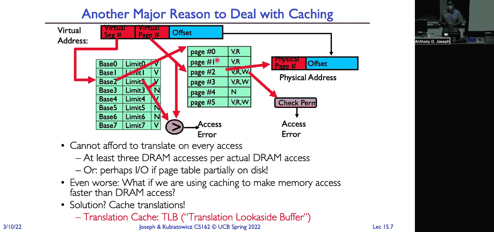
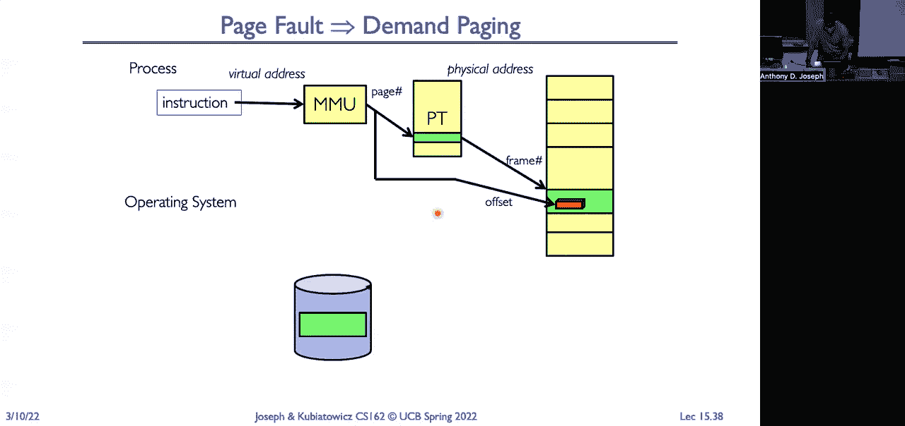

# 操作系统课程 P15：内存 3 - 缓存与TLB（续）及分页 🧠💾

在本节课中，我们将深入学习内存管理的核心机制。我们将探讨如何通过缓存和转换后备缓冲器（TLB）来加速地址转换过程，并理解分页系统的工作原理。这些技术是构建高效、高性能操作系统的基石。

---

## 概述：地址转换的挑战与缓存的作用

上一节我们介绍了多级页表的结构。本节中我们来看看，为了将程序使用的虚拟地址转换为物理地址，内存管理单元（MMU）需要进行多次内存访问。这个过程如果每次都直接访问内存，速度会非常慢。因此，我们需要引入缓存机制来加速这一关键路径。

---

## 多级页表回顾与地址转换流程

我们使用双级页表结构，采用 **10-10-12** 的分割方式。这意味着：
*   虚拟地址的前10位（P1）索引顶级页表。
*   中间10位（P2）索引二级页表。
*   最后12位是页内偏移量。

页表每个条目为4字节，一个4KB的页面刚好可以存放1024个条目。页表基址寄存器（如x86的CR3）指向顶级页表的物理地址。

**地址转换流程如下：**
1.  MMU用P1索引顶级页表，获得二级页表的物理地址。
2.  MMU用P2索引二级页表，获得目标物理页的页表项（PTE）。
3.  将PTE中的物理帧号（PFN）与12位偏移量结合，得到最终的物理地址。

这个过程每次内存访问（取指令、加载、存储）都需要执行，如果页表项不在缓存中，代价会非常高。

---

## 缓存基础：加速的秘诀

缓存是一个存储副本的仓库，其访问速度远快于原始存储位置（如主内存）。其有效性基于**局部性原理**：
*   **时间局部性**：最近被访问过的数据很可能再次被访问。
*   **空间局部性**：访问某个数据时，其附近的数据也可能很快被访问。

我们使用**平均内存访问时间（AMAT）** 来衡量缓存性能：
`AMAT = 命中率 × 命中时间 + 未命中率 × 未命中时间`

**示例分析：**
假设处理器访问缓存需1纳秒，访问内存需100纳秒。
*   若缓存命中率为90%，则 `AMAT = 0.9×1 + 0.1×(1+100) = 11.1纳秒`。这比直接访问内存快，但比处理器速度慢10倍。
*   若将命中率提升至99%，则 `AMAT = 0.99×1 + 0.01×101 = 2.01纳秒`，性能大幅改善。

这说明了实现高缓存命中率对性能至关重要。

---

## 转换后备缓冲器（TLB）：专为地址转换设计的缓存

由于每次地址转换都可能涉及多次内存访问，直接将其放入通用数据缓存并不高效。因此，我们设计了专用的缓存——**转换后备缓冲器（TLB）**。

**TLB的工作方式：**
*   **键**：虚拟页号（VPN）。
*   **值**：对应的物理帧号（PFN）及页表项中的标志位（如有效位、脏位、访问权限等）。
*   **作用**：当CPU发出虚拟地址时，首先查询TLB。若找到对应项（TLB命中），则立即获得物理地址，无需访问内存中的页表。

**TLB未命中处理流程：**
1.  CPU查询TLB，未命中。
2.  触发MMU遍历内存中的页表结构，进行地址转换。
3.  MMU获得物理地址后，将该转换关系载入TLB，以备后续使用。
4.  CPU使用获得的物理地址访问数据缓存或内存。

TLB有效利用了程序访问的时空局部性（例如，循环中的指令、连续访问的栈数据），从而能获得极高的命中率。

---

## 缓存的组织结构与设计权衡

缓存设计需要考虑多个维度，以下是三种常见组织结构：

**以下是三种缓存映射方式：**

1.  **直接映射缓存**
    *   每个内存块只能映射到缓存中的一个特定位置。
    *   **优点**：硬件简单，访问速度快。
    *   **缺点**：容易发生冲突未命中（多个内存块竞争同一个缓存位置）。

2.  **组相联缓存**
    *   缓存分为若干组，每个内存块可以映射到某一组内的任意位置。
    *   **优点**：减少了冲突未命中，是速度与灵活性的折中。
    *   **缺点**：硬件比直接映射复杂（需要多个比较器和多路选择器）。

3.  **全相联缓存**
    *   任何内存块可以放入缓存中的任何位置。
    *   **优点**：最大限度地减少了冲突未命中。
    *   **缺点**：硬件实现最复杂，访问速度最慢（需要与所有条目比较）。

**替换策略**：当缓存已满且需要载入新数据时，必须决定替换哪个旧数据块。常见策略有：
*   **随机替换**：实现简单，但可能替换掉重要数据。
*   **最近最少使用（LRU）**：替换最久未被访问的数据，效果较好，但实现复杂。
*   在实际硬件（如TLB）中，由于追求速度和简化硬件，有时会采用类LRU或随机策略。

**写策略**：处理写入缓存的数据如何同步到下一级存储。
*   **写直达**：数据同时写入缓存和内存。一致性简单，但写操作慢。
*   **写回**：数据只写入缓存，被替换时才写回内存。写操作快，但需要维护“脏位”以跟踪数据一致性，更复杂。

---

## TLB的实际考量与优化

**TLB的特殊性**：
*   TLB位于关键路径上，其速度直接影响处理器流水线。因此，TLB通常采用**全相联**或**高组相联**的组织结构，以最小化冲突未命中，即使这增加了硬件复杂度。
*   一些架构（如历史MIPS）采用**软件管理TLB**。TLB未命中时，由操作系统负责遍历页表并填充TLB。这虽然增加了未命中开销，但允许操作系统实现更智能的替换策略，从而提升整体命中率。

**地址空间标识符（ASID）**：
*   为避免进程切换时刷新整个TLB（导致性能下降），TLB条目会附带一个ASID。
*   查询TLB时，需同时匹配VPN和ASID。这样，不同进程的地址转换可以共存于TLB中，上下文切换时无需清空TLB。

**虚拟索引物理标记缓存**：
*   现代处理器常采用这种优化。利用虚拟地址中的页内偏移量（在翻译前后不变）提前索引数据缓存，同时进行TLB查询。待TLB返回物理页号后，再用其与缓存中的标签进行比较。这**重叠了地址转换和缓存访问**的时间，提升了性能。

---

## 现代处理器内存层次结构示例

一个典型的现代多核处理器（如Intel Skylake）内存层次如下：
*   **每个核心私有**：
    *   L1指令缓存 & L1数据缓存
    *   指令TLB & 数据TLB
*   **核心间共享**：
    *   统一的L2、L3缓存
    *   更大的二级TLB（STLB）
这种设计平衡了私有数据的快速访问和共享数据的容量与一致性。

---

## 页错误：需求驱动的内存管理

当MMU在地址转换过程中发现页表项无效（如页面不在内存中）或访问权限违规时，会触发一个**页错误**异常。这是一个**同步**事件，会中断当前指令。

**页错误处理流程（由操作系统完成）：**
1.  操作系统页错误处理程序被调用。
2.  分析错误原因（例如，页面在磁盘上、写只读页、栈增长等）。
3.  采取相应行动（例如，从磁盘调入页面、分配新页面、复制写时复制页面等）。
4.  更新页表项，使其有效。
5.  重新执行引发页错误的指令。

这种**按需调页**机制使得操作系统能够将物理内存作为磁盘上程序映像的缓存。只有真正被访问的页面才会被加载到内存中，从而高效地支持运行比物理内存更大的程序。

---

## 总结

本节课中我们一起学习了：
1.  **缓存的核心原理**：利用局部性，通过AMAT模型理解其对性能的关键影响。
2.  **TLB的专用角色**：作为地址转换的缓存，极大减少了MMU访问内存的次数，是高效虚拟内存实现的基石。
3.  **缓存的组织与权衡**：包括映射方式（直接、组相联、全相联）、替换策略（LRU、随机）和写策略（写直达、写回），这些设计决策在速度、命中率和硬件成本间取得平衡。
4.  **TLB的实践优化**：如使用ASID避免上下文切换刷新，以及虚拟索引物理标记缓存等重叠优化技术。
5.  **页错误的含义**：它是连接硬件与操作系统的桥梁，实现了需求驱动的内存管理，使物理内存成为磁盘的高效缓存。

通过缓存、TLB和分页机制的协同工作，操作系统得以创造出“容量极大、速度极快”的内存抽象，为应用程序提供近乎无限的线性地址空间，同时保证了隔离性与安全性。