# P15：Lecture 15： Memory 3 Caching, and TLBs (con't), Paging - RubatoTheEmber - BV1L541117gr

 Okay， let's get started。

 So today we're going to look at our third lecture on memory and we're going to look， at caching。

 translation， look aside， buffered and then we'll get into demand behavior。 Okay。

 so remember we have the two level page table， right？ So here we have this tree of page tables。

 We use the magic 10， 10， 12， orderization for the pattern and that gives us this nice。

 breakdown where each of our tables， our page tables is 1，024 entries to the 10。

 The entry is 4 bytes so that fits on a 4k page which represents our offset of 2 to the， 12。

 By doing this， your tables are a fixed size， we have the root page table pointer for the。

 page table pointer here which is a register， the CRP register on x86， points to our top。

 level table， the index of the top 10 bits into that table。

 That gives us a pointer to the page table in physical memory。 At the second level。

 the index into that with our P2 index with the next 10 bits， that。

 gives us the page table entry for the actual physical page that we're looking for。

 Combining that physical frame number with our offset and we get the page and we get the。

 byte on the page。 Lots of bookkeeping information that we'll be going through later on today in the page。

 table entry and things like valid bits， 30 bits， modified bits and so on。

 Now one of the nice things about the two level scheme is the amount of data structures that。

 we're going to have is going to be proportional to the fraction of the virtual address space。

 that's actually in use。 It's going to be much much smaller than the actual virtual address space。

 Okay， now how do we do translation？ Again， remember。

 translation is done in the memory management unit。

 The memory management unit has to translate every instruction fetch， every load and every。

 store from the virtual address space used by the program， the instruction of the addresses。

 emitted by the CPU to the actual physical addresses that are used by memory。 Now。

 how do we do this translation？ Well， for a single level page table。

 we're just going to index into that table and read， the page table entry。

 check that it's valid and that will give us the physical page frame。 For two level tables。

 it can be exactly what I showed you on the last slide where we're。

 going to walk through two sets of those page tables。 For n levels。

 the page tables will walk through n sets of page shavings。

 So what we're watching the memory management unit do is just a form of pre traversing。

 It's traversing through that tree of page table entries to find the page table entry for。

 the actual physical page that we want。 All right， now where do we put the memory management unit？

 Well， those on the processor die right after the processor。

 So the processor is generating virtual addresses。 The memory management unit uses the page table base register to traverse through the page。

 tables that are stored in memory。 And notice here， our cache in this case is physically addressed。

 So the addresses that were passing through the cache are addresses that have been translated。 Okay。

 So when we give the MMU a virtual address， it's going to do this traversing。

 Now since we have a cache here， it might be the case that portions of those page tables。

 are in the cache。 If that's true， then the memory management unit will get back those page table entries。

 right away。 And it'll be able to return answer to the processor or provide the physical address rather。

 for the processor right away。 If not， then we might have to go all the way out to physical memory in order to do that。

 proof of our error。 And if those page tables are actually out on this。

 we might actually have to do IO in， order to actually do that conversion from a virtual address to physical address。

 So if we hit in the cache， it's going to be super fast。 If you're missing the cache。

 it could be really， really slow。 Okay。 So what's the memory management unit doing？ Well。

 on every instruction fact， load and store is doing this tree traversal to do this conversion。

 from a virtual address to a physical address。 And it finds an invalid page table entry for whatever reason。

 the decommission， the access， the type of operation， and whatever。

 it's going to return a fall and will drop into the， operating system。 Okay。

 So one thing to consider here is the memory management unit is before the cache。

 The cache is how we make things fast。 Right？ This cache is inside the processor。

 So it's going to operate on the order of nanoseconds。 But going out to memory。

 that's like 100 nanoseconds going out to disk。 That's like millions of nanoseconds。

 So in order to actually access something in the cache， we have to go through this process。

 which could potentially take millions of nanoseconds。

 Seems like that really defeats the whole purpose here。 Right？

 So let's look at what caching offers and how we might apply caching to the cancellation， process。

 So we're going to do a quick primer， which you forgot on 61C on what cache。

 So a cache is just a repository where we keep copies that we can access much more quickly。

 or faster than the original copy。 Right？ So rather than having to go out to memory。

 we have a cache here。 In this case， it's a data cache that lets us access copies of what's in our physical memory。

 much faster。 So like a millisecond instead of a nanosecond rather than hundreds of nanoseconds。

 Okay。 What makes caches work is that they make the frequent case fast and they make infrequent。

 cases less dominant。 So if you look at it moderate computer。

 you're going to find caching everywhere。 Right？ So we're going to look at how we can use it to cache memory locations。

 I would be to address translations。 I would be to cache domain name resolutions。

 I would be to cache network locations， pages， file blocks。

 Everything in computers really is accelerated by using caches or almost not always be。

 the case is not too expensive。 We're going to walk a very high hit rate and we're going to want to kind of minimize。

 the miss cost as much as possible。 And so that kind of gets us to how do we evaluate caches。

 We evaluate it with this measure， the average access time。

 The average access time is just a hit rate times the hit time。

 So when we find it in the cache plus the miss rate times the miss time。

 So when we don't find it in the cache and have to go out to a lower level of our memory， error。

 So caching is how we get system performance。 So here's an example。 Right？

 If the processor directly gives the memory， it takes us 100 nanoseconds。

 If a processor is operating in a nanosecond， it's some nanoseconds。

 So accessing something on the processor like an S-grant cache is a nanosecond。

 Going all the way out in a memory， 100 nanoseconds。

 It's 100 times slower if we're operating out of main memory than if we're able to stay。

 on the processor and operate a processor speeds。 Just went out and spent thousands of dollars on that crazy fast Intel。

 you know， i9， 12，000， plus KF processor。 And now you're going to run it at the speed of the memory。

 So this is where cache and the thing can help us have speeds that look closer to what。

 that processor can actually do。 Okay， so how do we apply the average memory access time here？ Again。

 it's the hit rate times the hit time plus the miss rate times the miss time where。

 the hit rate plus the miss time is one。 Okay， so what if we have a 90% hit rate？

 So 90% of the time the processor is going to find the data in the cache。 That's really good。

 Like 90% of the time， 9 out of 10， we're finding it in the cache。

 But what is that really translated？ Well， that's going to be 0。9 times one nanosecond。

 90% of the time。 And then the other 10% of the time of 0。1， it's going to be 101。 Now。

 why is it 101 and not 100？ Because I have to look into cache first before I don't find it。

 And so there's one nanosecond to look in the cache and then 100 nanoseconds to go out and。

 get it from the next level， which is memory。 That's 11。1 nanoseconds。 Is that good？ Is that bad？

 Well， I mean， it certainly seems better than 100 nanoseconds。 It's 10 times faster。

 But it still is 10 times slower than this processor that I spend all this money to buy。

 So it actually is pretty bad。 A 10x slowdown really isn't for acceptable。

 So what if I increase the hit rate？ What if I hit the hit rate the 99%？ Well。

 if I hit the hit rate the 99%， now it's 0。99 times one plus 0。01 times 101。 So it's 2。

01 nanoseconds。 So that's much better， not perfect。

 But now you've only got a factor of two slowdown instead of a factor of 100。

 So that's where the power caution ends into the fall。

 But it also says that we have to make sure we can deliver very high hit rates in order。

 to achieve good performance。 Now， when you really think about it。

 what we're going to see later on in the class is， that memory-- so here we're using the cache to cache contents of memory。

 But we use memory to cache the contents of the hardware。 So really。

 when we think about the average memory access time， it really is the hit time。

 because we find it in this level one in cache。 Plus。

 the miss penalty if we don't find it in a level one， which is basically equivalent。

 to the average memory access time for level two。 Because you might actually go to get it out of memory and find it。

 It's not a memory that's actually out of disk and so we have to then go out to disk again。 Yeah。

 [INAUDIBLE]， Oh， that's a good tool。 [INAUDIBLE]， Let's see if you can lower that wall。 [INAUDIBLE]。

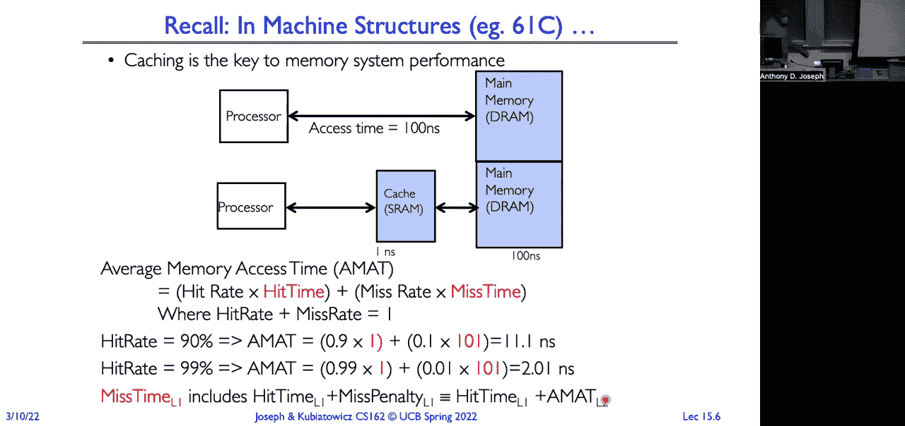

 OK。 All right。 So another reason why we want cache-- oh， yeah。

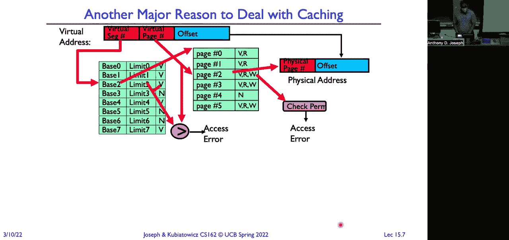

 [INAUDIBLE]， So it should be 10。1 plus 0。1。 Oh， here， it should be a letter。 Yeah。

 I'll fix that on the side。

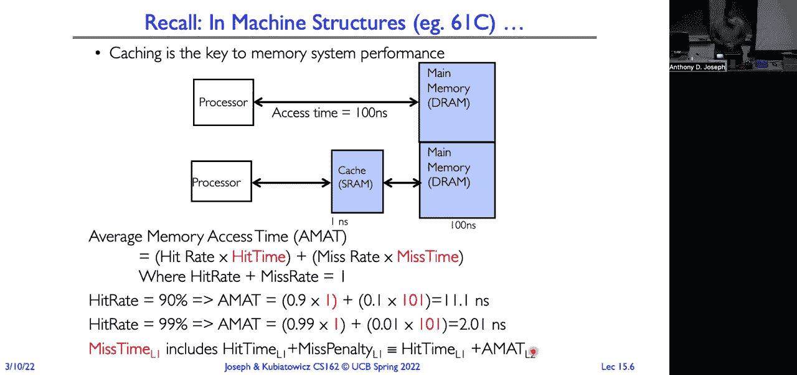

 Thank you。 OK。 OK。 So another major reason why we want to deal with caching is that remember。

 we're having， to walk through these tables。 So here's an example of a segment-based system and a single and one level of paging at the。

 lowest level。 So for every memory reference that we do。

 we're going to first look in the segment map。 That's in the process。 So that's going to be fast。

 but still is going to cross the sample。 And then we're going to have to actually go out and work the memory to walk through the。

 page table。 In the example I showed on the first slide， we had to walk through two levels of memory。

 page tables out of memory。 So every reference that we're doing is going to be somewhere between two to three memory。

 references。 So every instruction that we load and we store。

 we can multiply the cost by a factor of two， or a factor of two。

 Or if we have additional levels or five and so on。 OK。 Now， if you think about it， right， again。

 what I said in the MX slide before， where's the， TOB？

 The TOB is before the cache that we're using to make memory faster。

 But before we can look up anything in the cache， we first need to get the physical address。

 And so if it takes us multiple memory references just to be able to check in the cache， what's。

 the point of having a memory cache anyway？ Because the time to access that memory cache is going to be dominated by those three memory。

 accesses that we have to give。 OK。 So solution is we're doing all this work to do the translation。

 We might as well save that result or pass it。 OK。 So this cache。

 it's called a translation look aside buffer。 It gets a why it has that we have named in just a moment。

 But first the question is， will this work？ And can we get a decent hit rate out of kind of cache translations？

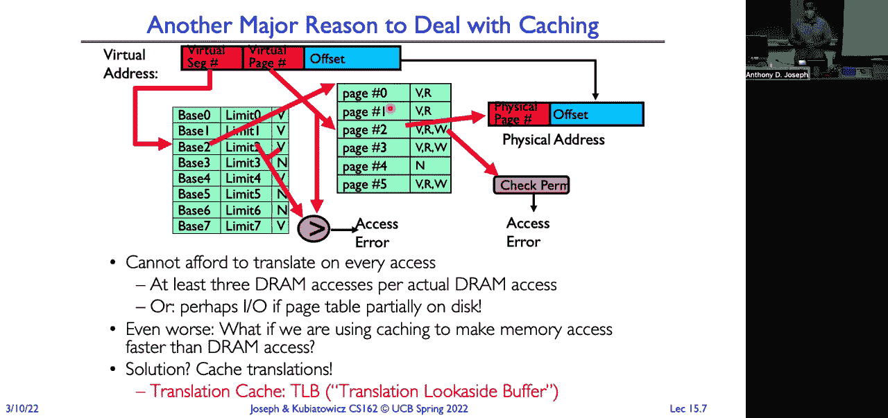

 So why did， when does caching help？ Caching will help us when we have locality。 No locality。

 There is no benefit to caching。 Every access is completely random。

 You won't see any benefit from caching。 But that's not how computer programs typically operate and not how computers operate in general。

 Right。 So if we look at the behavior， we typically see temporal locality。

 That's what polity is called。 So here on the x axis， I have our address space and on the y axis。

 I have the probability that， we reference a given memory location。

 And you can see that there are peaks。 So if I have access something。

 I'm likely to access that thing again。 Right。 If I have some global variable and I access it。

 I'm likely to come back and access that global， variable again。

 Where I have some variables within a subroutine。 I'm likely to access those variables multiple times。

 So keeping recently access data closer to the processor， it's going to give us better performance。

 And now if I access something， it turns out unlikely to also， and if you look at this。

 it's sort of rough here， I'm likely to access things around it too。 Right。

 So like think about like if I'm reading strength， I'm doing a string length or string copy operation。

 Well， access one character， I'm likely to access the other characters nearby。

 So when you think about moving things around， the spatial locality means I want to move a block from a lower level of the memory hierarchy。

 one upper level。 Because access one thing that block。

 I'm likely to access other things in that block。 Okay。 But that's what this picture is doing。

 If I access something down here like law， why I should move it all。

 not just the individual item that I access。

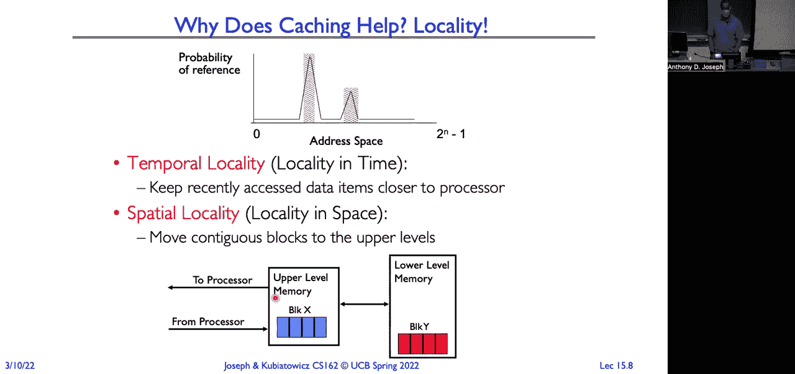

 All right。 So our goal here with caching is all about illusions。

 So we want to present the illusion that I have memory of scale terabytes that operates at speeds of registers。

 And has cost at the order of my slowest storage， rather than my most expensive story。

 The capacities of my largest storage and not my fastest story。

 Like it's here registers were talking about hundreds of bytes， which is terrible。

 but I can access these registers in a fraction of a nanosecond。 Right。

 whereas I have to go out the disk。 It's 10 million nanoseconds。 But at a terabyte。

 it looks like it's infinite for a program。 So I want that illusion that I have infinite fast storage。

 So we'll do caching at every level of this higher。 So we'll treat， you know。

 so here we have an L one， for the， for the core， the LT cash for the core。

 And then we have memory as a cash for our SST and our SST is a cash for our hard drive。

 It could be a cash for going to the cloud or cash for cake and so forth。 Okay。

 Now our challenge is that address translation first needs to occur here。

 It's during my instruction fetch during loads and stores into registers， but the page tables。

 I need to do that address translation or living out in a memory。

 Which is operating again at 100 nanosecond versus the fractions in nanosecond for my registers。

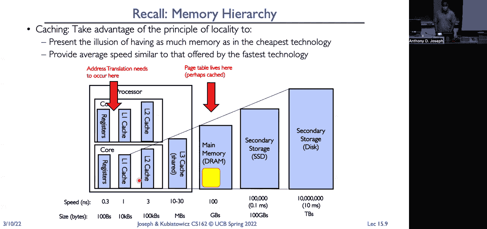

 All right。 So how do we make address translation facts？ The cash， use of translations。 All right。

 And so this is a little different from how you think about a traditional cash。

 The traditional cash you think about， like， you know， the key for it is like a memory location。

 The physical memory location and the cash returns。 There's the contents of that memory location。

 Here we're kind of caching the results of an algorithm。

 The algorithm being the algorithm that we use for future virtual that returns that page table on。

 And it's indexed not by a physical address， but by a physical page， a virtual page number。 So。

 we have our processor generating virtual addresses。

 our memory management unit that's going through our data cache walking through the page table。

 generating the translation， and we're going to cash that result。 So here we have our translation。

 look aside， bussler， indexed by virtual page numbers， returning physical frame numbers。

 along with a whole bunch of bits bits from our page table。 All right。 So here's a page table。

 And we've loaded into our。 Okay。 So this is recording again， virtual page number。

 physical frame number translations。 If we find something in the TLD， we're done。

 We don't need to go out to memory。 We need to look at the page tables。

 We don't need to do any of that particular stuff。 We have the answer。

 We have the physical frame number。 So， what that name comes from。

 what was invented by Sir Morris Wilkes。 Prior to cash。

 Because I realized on the early computers that there was this problem that they were running really slowly because they're spending all their time going out to memory。

 Just to do address translation。 So he created this address translation cache。

 And decided to call it the translation with the side buffer。 But then people realized that， wow。

 you know， we could catch the result of sensations。

 Why don't we just also use memory storage to hash the results of going out to memory。

 And that's where it passes。 And they picked a veteran and a memory translation or memory。

 look aside， but those are something like that。 Okay。 Now， when we don't find something in the TLC。

 we just revert back to what we were doing before， which is the memory management。

 It's just going to traverse through the trees， find the result。 And when we find that result。

 we'll pass that result in the TLC。 Okay， so pulling it all together。

 The processor generates a virtual address。 We look in the TLC， if we find it。

 we have our physical address， you can go directly with physical memory。 If you don't find it。

 and we ask the MmU， translate this virtual address to a physical address and walk the table。

 does all the things it does。 Generate the physical frame number， and we pass that translation。 Okay。

 and of course we have uncranslated。 So there's a couple of questions。

 So this is all premise on the idea that there is a real problem。 So if I access a page as a program。

 am I likely to access that page again？ If the answer is no。

 then there's no benefit to cash in the translation。 The programs are just， you know。

 kind of ping ponging all over their memory， never touching the same page， plus。

 would be zero benefit。 But that's not true。 It's not how programs typically behave。

 So if we look at instruction accesses， they spend a lot of time on the same page。

 but your code runs sequential。 Then you have branches， you have things like that， but in general。

 we will stay on the same page。 Periodically， you know。

 call some library or call some sub-routine and change pages。

 But many of your instruction fetches will be on the same page。

 So we'll gain some benefit from passion that translation。 Stock accesses。

 definitely locality of reference。 We grow our stack， incrementally shrink our stack， incrementally。

 So you're going to spend most of the time on the stack on the same page。 Periodically。

 you'll go up or down a page。 Data accesses， a little bit more complicated。

 Many times you will have low quality， but not always， right？ So the example I gave earlier。

 where I'm going through the characters in a string。

 those will all be on the same page and empirically help these values that say crosses your page。

 But if I have a lookup table， you know， I might be doing random accesses。 Why is the database。

 it might be a lot of random accesses to that data structure。 So it's going to vary。

 But definitely for stack， definitely for instruction fetch。

 we'll see that we have a lot of page with all。 Okay。 Can we have a hierarchy of the tailgreens？ Yes。

 we can have multiple levels of field these operating with different organizations。 Yeah， question。

 Yeah， so the question is when the processor is going through the tool B。

 does it have to go through the MME or can go directly with that。 So again。

 the idea is that you ask the TOB first， it's the cache。

 if it has that translation from the virtual page number， the physical page number， the doc。

 If it doesn't， then you ask the memory management unit， you have to have a TOB miss。

 then you go to the member management unit， and it walks the freeze。

 Generates the translation from that virtual page number to the physical page frame。

 and then it tells the TOB， here is that translation and all of the bits that are associated with it。

 hash this for the future。 And then you go out to the path。

 So this all happens before we go to the cache and that's why it has to be your test。

 If we don't have a good hit rate in the TOB， then we're not going to move matter if we have a very high hit rate in the cache。

 we're going to spend a lot of memory access is just to get to our on-track path。 Yeah。

 so this is actually very important。 So this extra path here where the CPU can generate physical addresses。

 So you think about it， the operating system needs to be able to go in and manipulate things like talk directly to devices or memory map or be actually able to set up page tables。

 And so there are a lot of cases where the operating system needs to be able to directly write the physical memory。

 And so then in that case， you know， there's no translation that happens。

 We're operating in the physical address space of the machine as opposed to in some processes for the address space。

 Otherwise， there'd be like no way to set up page tables。 Yeah。 Correct。 The question is。

 we should do user processes from being able to generate these unferencing。 Absolutely。

 But if we didn't， then a user process would read any physical memory。 So。

 dual mode operation requires that if you're going to generate physical addresses。

 you have to be running like a protective mode， a phenomenon。 Any other questions？ Yeah。 Yeah。

 So the question is whether there's something that indicates whether the CPU is access and translated or un-ventilated addresses。

 So typically， there might be something like reserved instructions。

 And so those instructions can only execute on the request of which level is at the final level。

 that allow you to do directly， the loads and stores that are absolutely a mark going through translation。

 But it's going to be our correct agenda。 Yeah。 Yeah。 So the question is。

 can I give some examples of why the kernel would want to be un-ventilated addresses。

 So two easy examples would be like the graphics frame buffer is typically at a very specific location in physical address space。

 And for performance， I might want to be able to read and write from the kernel directly into the graphics frame buffer without having to go through any kind of cancellation。

 I could also map windows and things like that， from the frame buffer into various address spaces。

 but those would then go through address translation。

 The other key reason why you want to do it is how do you set up the page tables in the first place。

 Like， you need to say， tables are located in physical memory。 And so to set those up。

 I need to be able to read and write directly to the physical memory。 What are your questions？ Okay。

 So the question is， are we assuming that we pass after every access。 Yeah， so the TLC。

 So we're only going to need to update the TLC when we make a change to something that the TLC is passing。

 For example， if。 So when we do a translation on the MME the other hand。

 that's a point we'll put it into the TLC。 The TLC tracks whether something's been recently accessed。

 So the TLC will be updated when we do a week or a right。 And similarly， when we do a right。

 we might have a dirty bit that tracks that that underline changes the modified。

 And so that would cause a TLC update。 But we're going to go into this more detail。

 So on the previous slide， it says if the TV misses， then we check the catch。 Yeah。

 so if the TV misses， then we're just going to do translation using memory management unit。

 And that's going to walk the trees。 And remember the memory cache is hashing the thing that are in memory。

 And that could include page table entry for the page tables and so on。

 So we're always going to do all of our reason rights to the class。

 That way potentially you might find that page table entries that are relevant to the translation are actually in the past。

 which case we get to say on the processor。 We never actually have to go out to name them。

 So is the TV before the one cash。 Yes， the table is before the open cash。

 We're getting a little head。 We're going to have a picture that shows what a modern process for our technical looks like。

 And you'll see that there's actually multiple。 And there's actually shared。

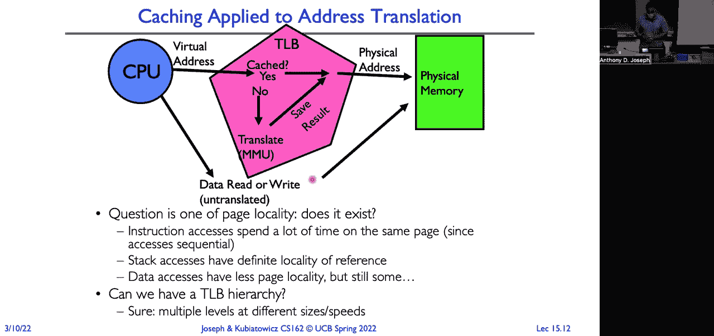

 So， good question。 What organization， what kind of cash is a TV？ Well， you think about caches。

 there's a lot of different parameters that we can use in picking what kind of organization you have。

 So there's the size， and we have all of it in our。 There's the associativity， except all size。

 There's the number of sites。 Right。 And then there's the line size。 Now， remember。

 this is something located on the process of die。 So every transistor is incredibly expensive。

 limited amount of area implemented。 And so making the design trade off properly。

 It's going to be really important for performance。 There's also a right policy。

 So when we store something into make a change。 Is it right or is it right back？

 So how might our organization of the TV。 Different from the organization of a traditional data capture and stuff。

 Answer that question。 You can probably take a look and make sure everybody remembers all the different types of class organizations from 60 and C。

 Okay， before we do that， let's look at why things might not be in a past。

 So why we might have a cat to miss。 So the first， there's three plus one， I call it sources of cash。

 So the first is compulsory。 The cold hard track life that the first time you go to access something。

 it's not going to be in the catch。 And so you have to go out to memory， retrieve it。

 and then put it into the catch。 Now， if you've got a long 11 program， you know。

 you've got billions of instructions and these cold start effects might be minimal。

 But if every time you contact switch， you have to slush the cash。

 and you're always going to be faced with compulsory misses。 Now， it's also。

 I think a little misleading when we call it compulsory because we actually can get around。

 Because I know that I'm going to， like， I， you know， I represent the particular block。

 That first reference of the block， that's going to cause a multiple miss。

 If I know that I'm doing sequential access， I know I'm going to access the next block。

 I could actually pre-search that block so that by the time I go to request that block。

 the cash has it already。 I avoid that compulsory miss。 I want to trade off with doing pre-fetching。

 eight on a time to go into the benefit is you can avoid some of these cold start misses。

 The downside is you might be kicking something valuable out of the path in order to proof at something that we actually don't end up using。

 Okay。 Next type of miss is a capacity miss。 So this is where the cash doesn't have less space。

 You can't contain all of the blocks that are doing the options。 The solution。

 Go out and buy a bigger path。 And so when you look at process respects。

 we'll see they have an instruction cache， a beta cache， shared passes， all one deltings， all foods。

 And the difference when you look at the lowest costs。

 the i3 versus i9 will be in the size of the passes。

 And so that's one of the most expensive parts of a processor because I take up a lot of area and the process of that。

 So a cheaper processor， smaller die， less space for that。

 But then I'm going to have more capacity misses。 And so that's part of the reason why。

 even though the same architecture。 One processor might be much slower on workloads than another processor。

 And that's a good example for that。 Okay， another source is what we call conflict or collision misses。

 This is where one of two or more data items， collab。

 And so we end up having to replace one to store the other。

 but then we go and access that thing that you just replaced。

 And so you kind of can end up in a form of crash， the multiple data items that map to the same location in the path。

 So solutions， again， spend more money and get a bigger cash。 Or make it have more social。

 Make it set associative director， make it fully associated or more sets。 Or include the。

 but reduce the conflict mystery。 And finally， there's one that you don't see。

 talk about as much as a， which is called parents misses。 These are a form of invalidation。

 But for example， if I'm passing some location in memory。

 and there's a direct memory access controller and IO controller that's leading something from the disk。

 And it reads it for a block from the disk and writes it into memory。

 That is what I have in the past。 I've now invalidated the contents of the cache。

 That DNA operation invalidated。 Or， for example， if I have a multi processor and another processor writes the same memory location that I have cash。

 Now my copy of that memory location is invalidated。

 A lot of work goes into the invalidation protocols， the multi processes。 Okay。 Now。

 how do we find something in a page？ We take our address and we break it up into components。

 So our block is our minimum quantum or unit and transfer。

 When we think about transferring something from a lower level to an upper level。

 we move it in blocks。 But when we think about moving some memory from blocks from memory into a processor path。

 That block size might be something like 16 bytes or something like that。

 When you think about going out to disk， it might be something like four kilobytes that we move into one。

 And so， at each level of a hierarchy， we think about what's the block going on already that we're moving。

 Now the data selects you the lower order bits are used select within that block。

 So the number of bits we allocate to the offset is going to control the size of our blocks。 Well。

 not all passionate applications that will have that。 Like in the case of a TLE， you know。

 we don't have that。 Because we're just returning the translation。 Now we have the index。

 which is used to identify a potential set in the cache that would have the data。

 And then we use the tab to actually identify whether what's stored in the cache is the thing that we're looking for。

 All right， so let's go through the three different types of cache organizations using this model for highly funded in the cache。

 The first one we're going to review is a direct map。 So we have a direct map path。

 it'll have two to the end bytes that it's storing。

 The upper 32 minus n bytes is going to be our cap。 The lower our bits right。

 the lower end bits is going to be our offset into the block。 So in the three。

 that's what will be the bytes left。 So this says our blocks are going to be two to the end in size。

 So here's an example of our path。 So here we have blocks that each one of these lines is a block。

 The one kilobyte direct map path that is 32 bytes blocks。 That's a bit as 32 bytes。

 How many bits do we need？ This is powers of key。 All right。

 so we're going to take our lower five order bits。 That's our byte。

 That's how we're going to be able to sell up a particular。 We're going to take the next。

 Five and use those as our cash index。 Again， you can see here we have 42 blocks。 A two to the five。

 So we select that。 Then we use our tag。 Let's see。 Okay， the thing that's cashier。

 the block that's cashier is not the block I'm looking for。

 It's going to use our tag to check if there's a match。 There's a comparator there。 If it matches。

 we know we found the block we want。 Now we just need to fight。

 And that's where we're going to use the byte select or treat the actual。 That's a direct map。

 For a set associative cash， the way to think about it is now we have basically。 Anyway， anyway。

 set associative cash。 Now we're going to have any direct map passes。 All right。 Now。

 an important consideration here is that。 Whenever we compare caches。

 we assume the total number of entries is always the same。

 So we have not doubled the number of entries by going to a two way set associative。 In fact。

 it's the same number of entries are just organized into。

 These banks of direct map caches that are operating in parallel where each。 Okay， so here。

 our cash index is used again to select one of these。 Sets。

 And then we take our cash tag and we're going to use。

 And we're going to use the same number of entries。

 And we're going to use the same number of entries。

 And we're going to use the same number of entries。

 And we're going to use the same number of entries。

 And we're going to use the same number of entries。

 And we're going to use the same number of entries。

 And we're going to use the same number of entries。

 And we're going to use the same number of entries。

 The results of those comparators have to go through a bunch of gate logic and everything。

 And that's going to feed into a multiplexer。 That multiplexer will take the block and then provide the block。

 And then we can use our。 These are our bytes select the select the actual。 Fight from that block。

 So there's a trade off。 But now we have more places to places in this case where we could store a potential item in the cap。

 So that's going to help us with reducing our conflict。 This way。 But that is a lot more logic。

 We have multiplexers and it was just two。 And I just want to get to eight。

 You can't build a multiplexer that has eight inputs。 You typically have like a tree of multiplexers。

 Each of those has a little bit of a big delay associated with it。

 And so when we start to add up all these data， a set of those that are passed is going to run slower。

 And a direct map。 So， we've made the access time higher or a little bit。

 But we get the benefit of reducing the conflict。 And also takes up more area because all multiplexers and gate logic and all。

 Counts against their transistor count that we have on the bottom。

 It's more expensive to implement a set of sensitive。 But you know。

 if we're going to do set associated。 What happens to which is make everything。

 To compare every single country rather than just breaking things up。

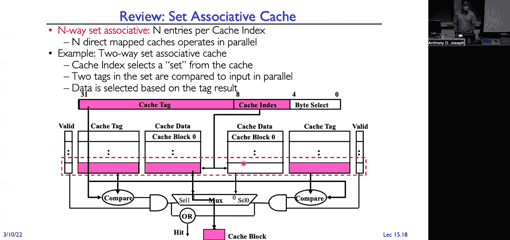

 That's what we get to do a fully associated。 So now there's no index。

 Our tag is everything other than our fight。 And so attached to each of these entries blocks。

 Is a tag or a big comparator。 This takes the most amount of additional logic to implement。

 And that's going to make it slower。 But we have no conflict misses。

 Like any block can go anywhere in the class。 Well。

 I'm not going to have the problem of two blocks going into the same place。 Now。

 where do we put a block in a cache？ How do we decide？ So let's look at an example。

 So here is an 32 block address space。 We've got a cache that holds eight lines。

 So where would block 12 go in our eight block？ Well， it's easy in a direct map cache。

 There's only one place in the 12 mod of the block four。 That's the only place it can go。

 Now that we're going to have a problem， right？ Because any other block from our 30 block address space。

 That is not a equal to four。 What happens at our address， you know。

 stride pattern or whatever access pattern is one of those。

 And we're going to just go back because we're going to replace this block with that other request。

 And then we're going to make a request for this block and replace that other block。

 And we're just going to ping on back and forth。 And a set associative cache。

 It can go anywhere and set zero， which has two options。 These two ways set associative。

 It's sort of a 12 mod four。 Again， recognize here we have the caches have the same size。

 eight block hash。 Both cases。 But now we have two different places that we can put that block。

 That's going to reduce the likelihood that we're just being home between， you know。

 like we might have in the graph。 And then if we look at a fully associative cache。

 it can go anywhere。 Again， we reduce the conflict this way down to zero。

 But it takes more hardware and explore the answers。 New questions。 So， which block do we replace？

 What do we have in this？ Well， it's really easy with a direct map cache。 We only have one choice。

 Right。 It only maps to one location。 With a set associative， fully associative。 Well。

 now we have a choice。 And so we need some block replacement algorithm that's going to pick between the potential location that we could use。

 So we can， you know， some of the algorithms might think about are random。 Why random？ Well。

 really easy to implement a random number generator in part。

 It's actually kind of very complicated to make it more random， not firmly dependent on that。

 And all we know is， but you can do something that's relatively good。

 It's come a two around number one。 Another alternative。

 why do we use something like these recently used？ The which of those blocks， we have locality。

 so I'll show you temporal locality， which of those blocks would use farthest in the class。

 That's the one we're going to admit and replace with the block that we want to explore。 Okay。

 so here's an example of a workload。 It's just a random， you know， kind of benchmark workload。

 And we're sort of different axes to look at for casual organization。

 So we have the degree of associativity。 So two way， four way， eight way。

 You have choice of algorithm for replacement。 And then here on the， on the Y side。

 we have rows that are the size。 I want to be a jerk。 Well， for small caches。

 especially if it's actually kind of independent， I guess， of the， the system。

 There's anywhere from 0。5 to 0。6% difference between using our new and using random。

 which is actually pretty significant。 The point six is， is what applies， you saw， then we looked at。

 you know， what we needed to have as mistakes。 On the other hand。

 stop and think about it for a moment。 Implementing LRU， it's going to require extra data。

 Like you have to have a clock， you have time stamps。

 You have to have a lot of logic to actually be able to go through and compare each entry， the scene。

 which has the oldest time stamp process。 And so， is it worth it to spend that for a point six percent gain？

 Maybe， but， you know， we have to really look a lot deeper into it because it's going to be a lot of software or we try to do it in hard work and do a lot of hardware overhead implemented。

 On the other hand， when we look at the larger caches。

 there's really no difference between LRU and random。

 And given that random is so easy to implement in hard work， we would just pick a random model。 Now。

 big caveat here， giant aspect that I have to add here is this is just one workload running on this organization's box and replacing box。

 Before I made a decision like that， I'd want to look at a lot of different representative workloads to determine。

 you know， what might be the best algorithm to use。 Okay。 Now， how do we handle writes？

 If you remember， we have two choices for writes。 One approach is write for it。

 So when I make a write to the cache， I also write the next level of the memory viral。

 So the cache only ever contains the same data that's in the backing memory or pages。 All right。 Now。

 the other alternative is write back。 So here I write things to the cache and it's only when I'm going to evict it from the cache or replace it。

 But then I go and I write that block to the next level of the memory horror。

 So now I got to keep track of is the data in the particular block， queen。

 as in it perfectly matches what's in the backing store， or is it dirty， in which case。

 I have to write it back。 I'm going to evict it from the closer。

 So let's think about some of the pros and cons。 I would write through。

 I get the advantage that a weakness can't result in a life。 Okay， that's a little complicated。

 What does that mean？ Think about it。 I go to read something and I check the cash。

 It's not in the cash。 What am I going to do？ I'm going to go to the backing memory， read that item。

 and cash it in store in the cash。 Pass it。 All right。 But what if the cash is full？

 I have to pick a block in the cash from a place。 What happens if I pick a block that's dirty to replace。

 If it's not right through， well， first of all， if it's right through none of the blocks will be good。

 If it's right back， then that block won't be dirty。 I mean， I have to write it back to none。

 So this is a little weird， right？ The processor is doing a read from memory and ends up having to do a lot。

 So that's where having rights， I'm going to throw on a read。 The other downside here though。

 is imagine I'm doing a ton of rights。 Well， processor operates in the nanoseconds memory hundreds of nanoseconds。

 So every write I do is going to take 100 nanoseconds to go out from memory and write it。

 So I'm going to make my processor run 100 times slower。 So the solution is to put a buffer。

 And now when I do writes， the writes get buffered and eventually make it out for the memory。

 I can return as soon as I put something into the write buffer。

 But now that's going to gate house how far ahead I can get。

 If I fill the write buffer and now I'm back to running the speed of memory。 Alternatively。

 if I do write back， then think about it。 If I've got a counter that I'm just sitting there updating。

 That's all those updates are going to get absorbed by the catch with write back。

 So I'm writing it cache speeds。 And then periodically when I end up having to evict that block。

 I'm going to write it back to memory speed。 But most of my writes are going to operate at the speed of the path。

 And so it's really good for absorbing rights not holding up the processor on rights。

 But the downside complexity。 I've got to keep track of some of the data in the cache。 It's clean。

 Some of the data is dirty。 When I'm doing replacement。

 I've got to figure out am I going to replace something clean for us because that's free。

 Or am I going to put it might be something I'm using a lot。

 So instead I want to play something dirty， get a schedule。 So it gets a lot more complicated。

 as we'll see later in the lecture。 So that's the tradeoff between these two。 But again。

 there's the issue where we've misses， it causes to replace a block that's dirty。

 which means you then have to do a write back on that block。 Questions。 Okay。

 so administrative stuff。 So I have office hours on Tuesdays and on Thursdays。

 And I've been seeing people in the office hours。 More people can come by。

 Project two design doc is due tomorrow。 Friday， the 11th。 And hard to believe it。

 but a week from today， we have our second midterm。

 And it's going to cover everything up until a blue lecture 16。 So Monday。

 And the TAs are going to do a new session on the 16th of the day before exam details will be posted in the job。

 Questions。 Yeah。 So the question is， is the first midterm in the state。

 The answer is sort of sort of。 So， are we going to specifically ask questions about things that were on the first midterm。

 not directly， but we'll assume you have not heard out of your cash。 So。

 we're going to have all of the content from the term one。

 So we may rely on concepts that come from the term。 It's a root。 When you're studying， you know。

 remember that for your folks in policy， don't please， you know。

 write the stuff from the beginning of the semester。 Okay。 So， we look at all these different tasks。

 What kind of organization would make the most sense given what we need to do here。

 given that it's on the critical path to getting to the cash is on the critical path for every single memory operation。

 So， whatever going to pick as an organization， whatever one of the policies have to be around a real class。

 So， there's a question about would write that faster because you go to a memory， and less。

 And the answer is yes。 Right back。 Going， rights are going to mean memory less often right through every single right has to make it to the memory one of the case。

 Module of the fact that we can buffer。 Okay， so。 So， we can't be before the path。 Right。

 And so it's critical that the field will be the translations occur at CPE speeds。 All right。

 the current memory speeds， and we've lost the benefit of having a path。

 Every access to this physically addressed path。 So。

 that's going to argue for something like direct or something of low associated。

 I've been crazy associated with the conflict this way。

 But we need a lot more comparative logic and muxes and all of this stuff that's going to make that look up slow。

 But the counterpoint to this is conflicts， conflict misses are really expensive。

 And so that kind of argues for a fully associated class。 Again。

 there's this potential issue of flash。 Because it's correct map or because of low associated。 So。

 if you think about it， like what are we using the lower bit to the virtual number of an index。 Well。

 that means that the first page of code first page and stack first page of heat。

 Are all going to collide for the same。 My instruction fetch。 Gets cash。

 And then that instruction is going to read something from memory and store it on the stack。

 And then I'm going to do the data fetch from the heat。

 I flush the entry replace the entry for instruction。 And then as soon as I write to the stop。

 I flush the entry for data。 And then I just， you know， rinse and repeat。 And so， again。

 running it through to the speeds of memory， not a patch。 So， my saying said I use a whole other。

 And then I use a whole other thing。 And then I use a whole other thing。

 And then I use a whole other thing。 And then I use a whole other thing。

 And then I use a whole other thing。 And then I use a whole other thing。

 And then I use a whole other thing。 And then I use a whole other thing。

 And then I use a whole other thing。 And then I use a whole other thing。

 And then I use a whole other thing。 And then I use a whole other thing。

 And then I use a whole other thing。 And then I use a whole other thing。

 And then I use a whole other thing。 And then I use a whole other thing。

 And then I use a whole other thing。 And then I use a whole other thing。

 And then I use a whole other thing。 And then I use a whole other thing。

 And then I use a whole other thing。 And then I use a whole other thing。

 And then I use a whole other thing。 And then I use a whole other thing。

 And then I use a whole other thing。 And then I use a whole other thing。

 And then I use a whole other thing。 And then I use a whole other thing。

 And then I use a whole other thing。 And then I use a whole other thing。

 And then I use a whole other thing。 And then I use a whole other thing。

 And then I use a whole other thing。 And then I use a whole other thing。

 And then I use a whole other thing。 And then I use a whole other thing。

 And then I use a whole other thing。 And then I use a whole other thing。

 And then I use a whole other thing。 And then I use a whole other thing。

 And then I use a whole other thing。 And then I use a whole other thing。

 And then I use a whole other thing。 And then I use a whole other thing。

 And then I use a whole other thing。 And then I use a whole other thing。

 And then I use a whole other thing。 And then I use a whole other thing。

 And then I use a whole other thing。 And then I use a whole other thing。

 And then I use a whole other thing。 And then I use a whole other thing。

 And then I use a whole other thing。 And then I use a whole other thing。

 And then I use a whole other thing。 And then I use a whole other thing。

 And then I use a whole other thing。 And then I use a whole other thing。

 And then I use a whole other thing。 And then I use a whole other thing。

 And then I use a whole other thing。 And then I use a whole other thing。

 And then I use a whole other thing。 And then I use a whole other thing。

 And then I use a whole other thing。 And then I use a whole other thing。

 And then I use a whole other thing。 And then I use a whole other thing。

 And then I use a whole other thing。 And then I use a whole other thing。

 And then I use a whole other thing。 And then I use a whole other thing。

 And then I use a whole other thing。 And then I use a whole other thing。

 And then I use a whole other thing。 And then I use a whole other thing。

 And then I use a whole other thing。 And then I use a whole other thing。

 And then I use a whole other thing。 And then I use a whole other thing。

 And then I use a whole other thing。 And then I use a whole other thing。

 And then I use a whole other thing。 And then I use a whole other thing。

 And then I use a whole other thing。 And then I use a whole other thing。

 And then I use a whole other thing。 And then I use a whole other thing。

 And then I use a whole other thing。 And then there's this entry value or any value。

 And then there's some access bits。 Read， write， you know， read only， execute only， so on。

 And then there's this column， application specific ID。 Remember that？

 I'm going to come back to that in just a moment。 Now when we look at how the processor is organized。

 So I'm going to do a little bit of 150 architect for a moment。

 You actually overlap to the lookup with the rest of the pipeline。

 So there are PLB stages in the pipeline。 So here， when you are instruction fetch。

 we have our instruction， for our virtual address。 You do a TLD lookup。

 You can work that into a physical address。 And then we look at instruction cache in the instruction。

 We're treating it， begin decoding of it。 And then we start to fetch the registers that are associated with that instruction。

 Then we do our ALU or effective address operations like it's being a load or store。

 We're doing a later store。 Got a new address translation。

 And so I'm going to have PLB operation and look up in the PLB。

 And then we're loading and storing data。 And so when it has a cache， I think it will be in the load。

 So we're going to look at the data cache。 And then we might do right back into the register or a write if we're doing a write for a few moments。

 Now， organization， it's a 64 entry on chip PLB。 Really counter-oracle decision that they made at the time is to have a software based PLB。

 So what does that mean？ That means when we have a PLB miss。

 it's going to trap into the operating system。 The operating system is the new software to decide which entry to replace。

 Think about that for a moment。 We're talking about operating at the nanoseconds。

 And all of a sudden， I'm telling you that if you don't find it。

 we're going to call out to the operating system， and spend thousands of nanoseconds to try and figure out what to do。

 How can that work？ Well， it's all because if you think about it。

 if we miss the PLB on a regular basis， it's really expensive。

 And so we want to make the frequent case as frequent as possible。

 And so we can be a little bit more intelligent in how we replace objects in the translations in the PLB。

 We're going to drive up our pitway and that's going to make the frequent case more frequent。

 and that's going to make our effective access problem up low。

 So that was the argument that the developers had of the chip architect to the chip。

 but it was really counter-oracle at the time。 The people didn't believe I could make the software perform fast enough。

 Okay。 So it has this ASID。 Remember I mentioned that we're going to come back to that。

 This is the application specific ID。 Now what it is， is it's a context。

 So the operating system concept is one at loads an entry into the PLB。 It's saying， hey。

 this TOB entry is associated with this process。 Why is that important？

 Why do I need to know what process owns a particular PLB entry？ Exactly。

 If I don't know who owns a particular PLB entry， I'd imagine I didn't have applications specific IDs。

 What happens at a context？ A changed the address space。 It means the virtual。

 the physical translations all change。 It means I have to flush my PLB。

 It means compulsory cold start misses。 It means really bad performance。

 So the trade-off here is going to take up some more precious space on our processor die。

 The Aggies application specific identified。 But it means that we now don't have to necessarily watch the PLB every time the conflict switch to another program。

 Every time the switch process and switch addresses is still be able to have valid translations stored in the TOB because any look-ups in the TOB are going to rely on that application specific ID。

 You don't have to just match the virtual page number。

 You also have to match the ASIB in order for it to be a valid translation。 Okay。 All right。 So。

 a little bit of a 150 regression is the way I showed you the TOB organization。 We have the TOB。

 then we have the cap。 We look at the TOB and even if we get a hit。

 we first have to do that translation before we can actually do anything with the memory cap。

 There's actually a way where we can overlap looking up in the cap with doing the translation look up in the TOB。

 And it's going to work like this。 Okay。 So you think about our virtual address， right？

 You do the TOB look up。 That gives us the physical page number and it gives us the offset。

 The offset is this lower 10 bits of our address。 In this case。

 we're going to have one fill about pages。 So machine to TOBs and caches do a correct that allows them to simultaneously start looking in the cash as we're doing your address translation。

 And it's going to work because we want to set things up so we have perfect overlap between the offset and the index and byte。

 Why does this work？ Because on our translation， we have the offset right away。

 We don't change the offset when we're going doing translation。 The offset is within a page。

 We have those bits available right away， right away。

 and we're just waiting for the bits that are associated with the TOB， the physical page。 All right。

 so here's how it's going to work。 We're going to take our catch。

 It's going to be a four kilobyte cap。 Each block is four bytes in size。 Or by size or by half。

 I'm going to enter using our class。 So we're going to enter the index。 10 for byte blocks。

 How many bits do we need for a byte slot？ So we need 12 bits of a lower 12 bits。

 And then we're going to be our index and our bytes。

 So we can simultaneously select the particular line that we want， the block。

 and then select the byte within that block。 And then as soon as the TOB gives us a gauge number。

 we can compare。 And if the TOB matches our tag， here's the byte。 If it doesn't。

 it's a miss in the cache， you have to go off and do the sets for a moment。

 But it allows us to overlap that look up in the cache with the actual translation steps。 Okay， now。

 if we make our cache be eight kilobytes， we don't have perfect overlap。 Take 150， 150， 150，000。

 and we'll learn how to make that with it。 Okay， another option will be if we made our caches be virtually addressed。

 If our caches were virtually addressed， then we could look up directly in the cache with our virtual address。

 What's the disadvantage of a virtually addressed tag？ Exactly。

 So every time we did a process switch， we'd have to flush the test。

 or we'd have to add application specific identifiers to cache one。 It would increase complexity。

 And so for both of those reasons， we typically use caches， oh， the third reason why they're shared。

 I'd imagine we want to share the same physical memory across multiple processes。

 If they have different virtual addresses for that same physical address。

 then we could end up even with applications for identifiers with multiple copies of the same data in effect to not eligible or a migrate。

 So for all of those reasons， we make our caches typically be physically addressed。 Okay。

 so here's an actual。 So the question is how can we read more than one bite in time。

 So we can read up to a word， right， our block sizes or word is the word side of the machine。

 which is what most machines are。 So the most in this case we could read the word at a point。 Again。

 if you take 152 or take 250 to see all sorts of different platforms。

 organizations that have larger block sizes and can deal with larger size classes。

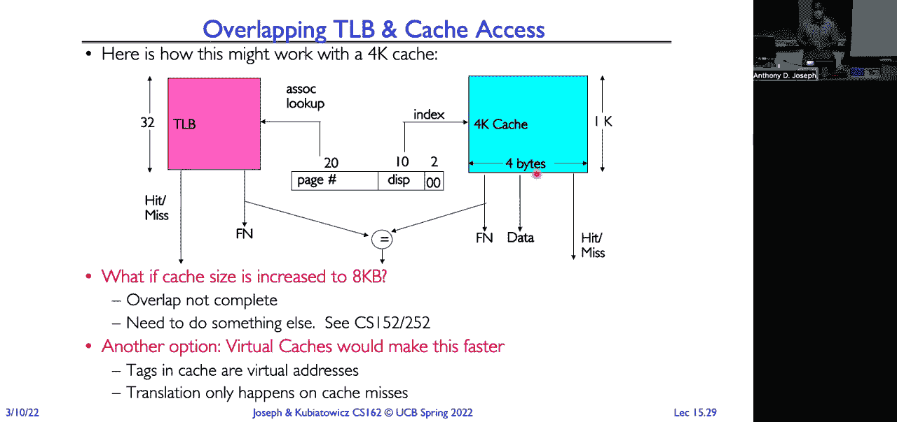

 Okay， so here's a modern example of modern x86 processors of Skylake， Cascade Lake and so on。

 And it's a little hard to see here on the side， but there are three。 So there's a TV down here。

 which is a data TLC。 There's another TV up here， which is an instruction program。

 And then there's another TV here that's a shared。 There's a question here that's each different pass have it on TV。

 No， so the TVs are separate from the passion。 So this case。 We can have。 For example。

 a bunch of different。 Passions， so we have L one instruction test L one， beta， cash。

 and to combine cash instruction data。 And I'll read that that's shared across multiple course so the one passes now to cash is those are。

 Individual course， and then the other thing that will be over here， but you know。

 will be shared across multiple courts。

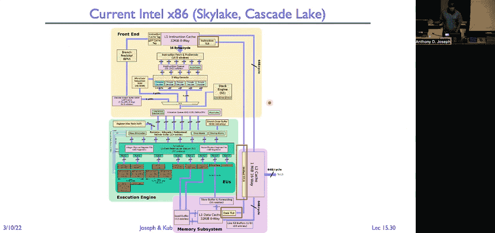

 Similarly， we can have multiple different TLDs so L one instruction。

 and then a shared out three or two rather shared。 And， and again。

 there's all different sizes for these all the kinds of social utility， some weird one。

 but a login way said， essentially。 And this is all where they looked at and look at lots of different workloads。

 And then decided， you know， for the cost of making the chip and the limit on the number of this and this is sort of price performance that they're trying to get。

 What's the right architecture use？ More servers， you know， the class of processor。

 the larger all of the classes are going to be。 The more consumer， you know。

 it's going into a Chromebook or something expensive in a platform is cash is going to be much smaller。

 It's all trade off and forms of capacity versus prices versus performance。 Okay。

 So what's going to happen on a concert switch？ Well， again， you know。

 if we don't have application specific IDs， we just changed what the virtual physical map and flow。

 So those entries are no longer valid and need to flush them all。

 And that's going to be expensive because what we do， we context with all the time between processes。

 not just between the same process。 Alternatively， we put in an application specific ID or process ID in the TLD and then we don't have to do it。

 So most modern architectures， they include some form of process or application specific ID。

 they get stored in a field that way we don't have to。

 What happens if we change the translation tables。 So we move a page from memory out to the disk or vice versa。

 We bring a page in from the disk into memory。 Well。

 now there's going to be a difference between what that page table on three is in the page table and what's in the field。

 So then we have to invalidate that field， the entry。 That's called to be consistency。 Okay。

 With virtual index cash。 You need to flush the caption。

 So that's again a reason why we do not want to have a work to get passed because every time we come to switch。

 we have to flush the path。 So let's pull all of this together。

 So what we saw the word beginning of this lecture was the general we have a virtual address。

 We take the offset， copy over to the physical。 Memory management unit uses the page table base register to find the root table。

 Use our P1 index to index into that table to find the physical page frame for our second level。

 These are two index index into that second level table and get our physical plane of the page frame。

 We're looking for memory and then the offset gives us the data that we want to treat。

 We can replace this translation process with a TV。 All right。

 so we now just provide this virtual page number into the TV and it gives us back the physical page number。

 Similarly， we'll actually go to read the data or write the data in that location。 We can use a tab。

 All right， and so we're going to take our physical address divided up into a tag index， byte so up。

 using index to select one of these sets。 The tag to map and then the byte select to actually so up the data that we're going to achieve。

 Okay。 So this combination of TV and caching is again allows the operation closer to process or speeds instead of operating at normal speeds。

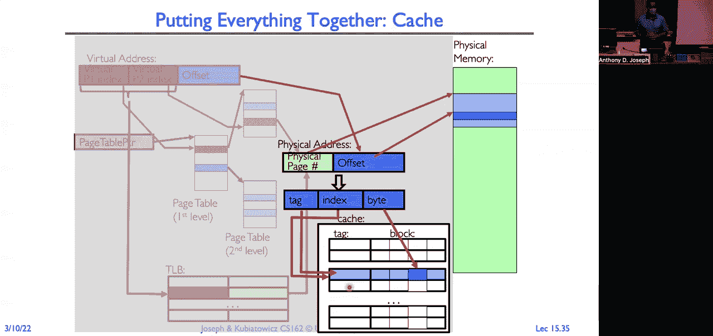

 All right， so what happens when that virtual physical translation。

 The MME walks the trees and it generates a page。 Or we just don't have permission to find a read the current data area。

 This is going to cause a fault or crap。 It's synchronous。

 Interrupts the current instruction causes it to be terminated。 Perhaps this into the purpose。 Now。

 in the kind of we run the page fault hammer and you realize that Oh。

 this is actually something we can see。 So it might be that Oh， ran off the end of the stack。

 We'll just allocate another step and end off the end of the key。

 We'll allocate additional data from pages。 Or it could be we did a floor。 And that right。

 because it's a page marked。 They actually now need to actually copy it and update both the parent and child。

 Or it could be that that page is out on this。 You can use memory as a cash for this。

 And you think about this is like kind of flip things upside down。 You normally think of， you know。

 the software running on top of a hardware。 Now it's kind of the other way around the hardware is going to fall and then it's going to go after the software。

 What do I do next？ When the software is going to tell the hardware what to be next instead of the other world。

 But this notion of demand aging again is really powerful。 Like we think about modern programs。

 I'm always amazed because every time I buy a laptop every time I buy a computer。

 I just double the amount of physical RAM I put in it。 And yet I always run out of number。

 Because I'll get bigger。 I hate using help。 It just gets bigger every word。

 Does it do anything different than like this show slides。 I don't know。

 I think now actually they have this whole mode where it doesn't seem learning and it will be automatic。

 And it will post you on a presentation。 I don't really need that。 But it doesn't。 Right。

 And so it's a challenge。 Our programs are getting bigger and bigger。

 But even if we add more memory and you grow the amount of memory per machine。

 we want to run more things。 We want to do more things with machines。 Right。

 But we actually look at those programs。 And we spend like 10% of the code。

 I'm not using all those options features right now。

 Even though the phone is loaded on running on my machine。

 So we really don't need to keep all of that in memory。 At the PowerPoint binary， probably like。

 you know， a big about don't need to use up a big about my process memory。

 And we think about like what is actually running and we're going to program。 It's much smaller。

 And that's what we want to make sure we keep in memory。

 So we're going to use memory as a task for this。 Right。 Because memory is expensive and small。

 And it's the same thing I was doing with my Instagram and my on chip caches。

 We only keep the things in the cash that are being actively used for anything else。 Yeah。 Yeah。

 So the question is that the difference between software hardware paid for home。

 And the time we don't want to implement everything in software。

 So the hardware people occurs because memory management unit encounters some error。 Like。

 there's all these little checks that does run off the end of the table。 And so， you know。

 the segment valid or the entry valid is the access match the permissions， you know。

 the request or permission level match， the current， the permission level on the PPE。

 is because of fault denhering。 Now you could try to， as a hardware developer architect， figure out。

 what are all the possible faults， that can happen and how should I handle all of those？

 And now I greatly can strain what my operating system can do。

 So what we see is when the hardware impounder， of the situation like that， it throws up its hands。

 This is why I have no idea what to do。 Operating systems， you tell me what to do。

 That's actually really good to do now， as an operating system developer。

 I can decide what's the best way for me to handle this， and how I handle it might be different。

 If I'm building a server， I'm going， to handle it differently than if I'm。

 building a laptop for interactive use。 Mostly what I'm running is lots of big batch jobs。

 That's different。 If I'm building a database engine。

 I might implement it differently from how I implement。

 page fault handling on a network file of appliance。 So by doing things in software。

 we get a lot more control， when we get in hardware。 OK， so we are just about out of time。

 What I want to leave you with is one more slide。 So if you think about how page fault flow。

 In the normal case， generate an instruction， go to a memory management unit， define the page。

 in the page table， and the operation， will conclude as intended， read， write， instruction fetch。

 But we can also have the case where the memory management unit。

 walks through the page table where it looks， because it has a cache in the tool B。

 and we find it's not in the page table。 We generate the page fault。 And so in that case。

 the operating system now takes over。 Once the page fault handler figures our own things out。

 on disk， pulls it into memory， updates the page table， entry， reschedules。

 so puts it back on the ready field， that read， now we can retry it， and the operation will succeed。

 And so what we're going to talk about next time， is exactly how that page fault handler works。 OK。

 thank you。 [INAUDIBLE]， (tense music)。

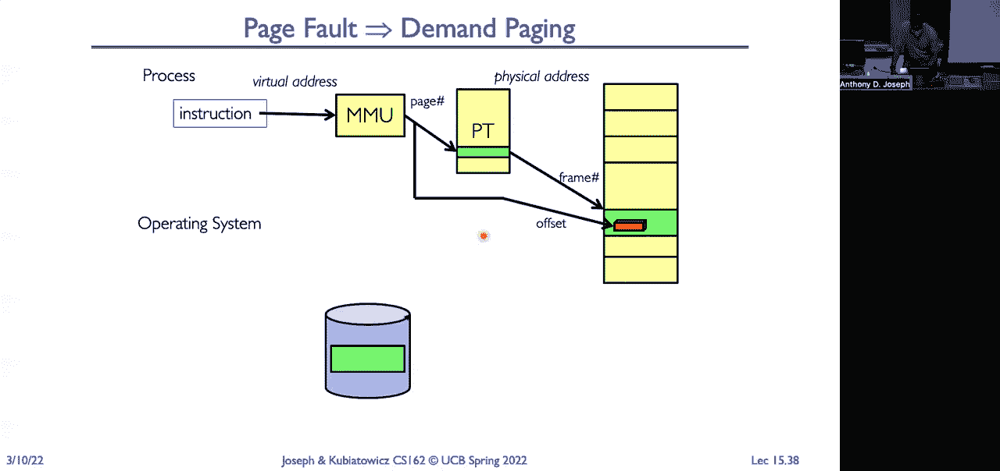

 you。