# P16：第16讲：内存4 需求分页策略 - RubatoTheEmber - BV1L541117gr

好的，我们开始吧。

这是我们关于内存的第四讲，我们将讨论需求分页和分页策略。好的，记住61C中的内容，我们可以计算平均内存访问时间。所以如果我们看一下访问时间，假设我们有一个处理器，它有L1缓存和DRAM，我们想要弄清楚它的平均访问时间。

访问任何给定的内存位置。可能，可能从整体上来说，这将是我们在L1缓存中找到它的命中率，乘以命中时间，加上未命中率乘以未命中时间。现在由于命中率等于1减去未命中率，我们可以简单地将其简化为。

平均内存访问时间就是我们在L1的命中时间，加上L1的未命中率乘以L1的未命中惩罚。现在如果你想一想，我们不仅仅是在看从一个缓存到内存的时间，但在我们的层级中可能会有多个缓存。例如。

如果我们在内存中找不到它，但它在磁盘上，或者如果我们在L1中找不到它，但它在L2缓存中，那么L1的未命中惩罚就成为L2的平均内存访问时间。所以它看起来就像这样。所以它就变成了L2的未命中惩罚，我们的L2平均内存访问时间。

所以我们可以逐层计算每一层的平均内存访问时间，考虑如果在该层命中时的时间，或者如果我们需要访问下面一层的时间，而这可能还包括其下的层级，以此类推。

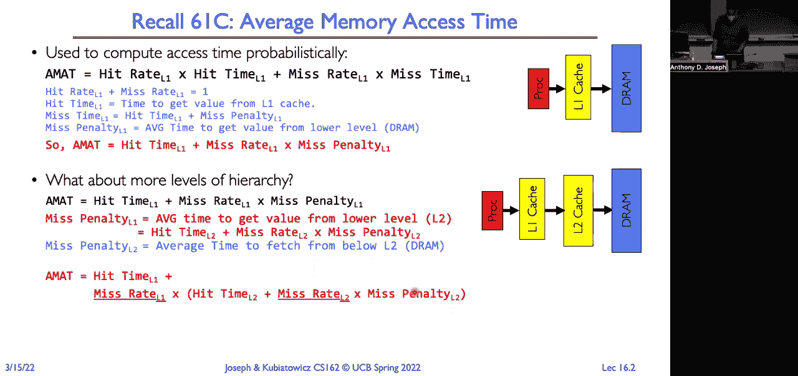

所以最终，这一切都是关于试图让一切看起来像我们在芯片内访问那样快速，尽管那是非常昂贵的内存，而且我们只有非常有限的内存，我们希望让它看起来像我们拥有和最慢的技术、每字节最便宜的内存一样多。

但请注意，这里访问时间的差异，明白吗？

我们可以在芯片内以亚纳秒到纳秒的速度访问数据。访问主内存的时间跳到了100纳秒，而访问硬盘则需要1000万纳秒。所以今天我们面临的挑战是，我们要查看访问时间，并使其看起来像主内存的访问时间，大约100纳秒。

但我们将使用延迟为1000万纳秒的存储来实现它。

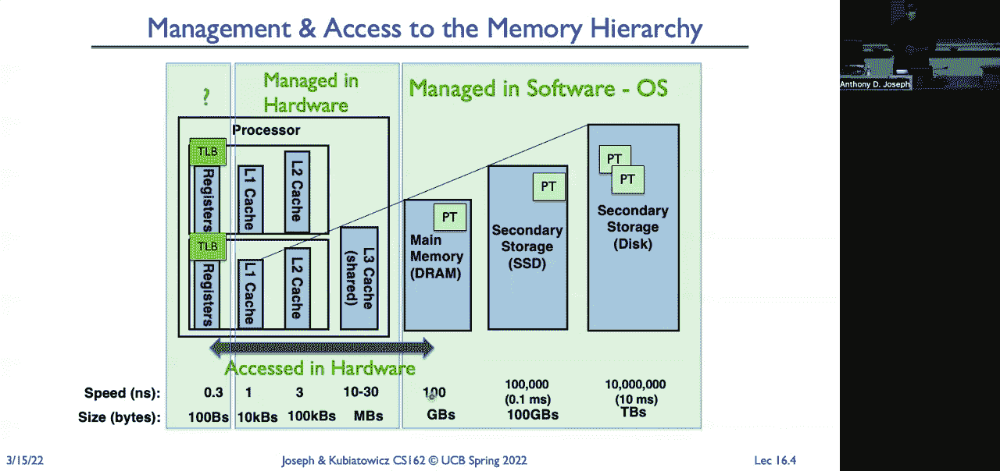

好的，所以记住在理想情况下，我们有一条指令获取或一条从内存加载或存储的指令，它会生成一个虚拟地址，并将其提供给MMU。如果它在TLB中找到了，就直接使用；如果没有，它会遍历内存结构，页表项，找到所需的物理页面的页表项。

返回这个结果，结合偏移量，我们就能得到我们正在寻找的数据。这是理想情况，但今天我们要讨论的是另一种情况：我们进行引用时，查看页表并发现条目无效。这会导致页面错误，触发操作系统中的异常或陷阱，终止。

运行中的指令会触发页面错误处理程序。页面错误处理程序查看操作系统的书籍，也许查看页表项，并确定该页面实际上是在磁盘上，它会调度该页面被加载到内存中，一旦加载到内存，它会更新页表项，并使TLB无效。

将线程放回就绪队列，最终会被调度，我们重试这条指令，它会运行到完成。好的。所以我们可以将需求分页视为将主内存视为我们较慢的SSD或硬盘的缓存。所以如果我们说它是缓存，那么我们必须问出任何缓存我们都应该问的问题。

缓存是指块大小是什么，换句话说，是缓存到后端存储设备之间的数据传输单位，反之亦然。在这个例子中，它将是一个页面。所以你知道是四千字节。我们还可以问，组织结构是什么？

上次我们看过了直接映射和完全关联映射。好吧，在这种情况下，让它完全关联是最有意义的，因为主内存中的每个页面都是等效的。你可以把任何页面放在任何地方。虚拟到物理页面的映射允许任何位置放置。所以它是完全关联的。

那么我们如何定位一个页面？首先我们查看TLB。如果在TLB中未命中，内存管理单元会遍历页表、段映射以及其他内容，找到从虚拟页面号到物理页面框的映射。那么我们的页面替换策略是什么？

所以当我们需要将页面从内存中逐出时，应该选择哪个页面进行逐出？

好吧，我们可以实施很多策略。我们可以实现LRU（最近最少使用）。我们可以实现随机替换或者其他什么方法，对吧。这将需要更多的解释。我们实际上会花很多时间来思考这个策略。为什么？因为如果我们错过了，如果我们替换了错误的页面，然后我们访问那个虚拟页面。

之后你知道，访问需要10百万纳秒，而不是100纳秒。是的，问题来了。是的，那为什么我们要使用完全关联的组织方式？

在这种情况下，每个物理页面都是相同的。所以我们可以放置一个页面，因为页表允许我们将任何虚拟页号映射到任何物理页号，我们可以将页面放置在物理内存的任何位置。现在我们稍后会看到，我们有时会以不同的方式处理物理内存。

在不同的区域，不同的块处理方式不同。但总的来说，它是完全关联的。我们没有硬件上的限制，规定不能将某个虚拟页面映射到给定的物理页面，只要该页面不用于IO或其他用途。我们会对如何使用物理内存施加一些策略，但没有严格的限制。

在硬件中，如果你不能将某个虚拟地址映射到某个物理地址，它会提示你。所以这给了我们完美的灵活性，因为我们稍后会讨论失效（miss）情况。如果我们限制了页面的放置位置，那么我们可能会遇到冲突失效的情况。对吗？好的，那么在失效时会发生什么呢？

我们将转到较低级别的存储介质，将其作为后备存储来填充和检索该页面。所以，在这种情况下，磁盘就是后备存储。那么写操作发生时会怎样呢？

我们希望它是直接写入的吗，还是希望它是写回的？

所以如果我们考虑一下，假设我们做的是写直达（write-through），那么如果我们在栈上写入大量数据，或者我们在字符串中写入字符，那么我们会直接对磁盘进行大量写操作。这将非常慢，因此我们当然希望做写回（write-back）。但是，如果我们做写回，那么我们需要跟踪内存中的一页可能发生的变化。

我们有脏数据，也就是说内存中的数据和存储介质上的数据不同。对于那一页，所以下逐页进行驱逐时，我们不能简单地将该页面重新分配给其他人。好的。所以这一切的原因是我们想提供这种无限内存的错觉。所以我们对进程说，你有一个32位的虚拟地址空间，可以使用4GB的虚拟内存。

然后我们使用硬件、TLB和页表将其映射到可能更小的物理内存。因此我们说你有4GB的虚拟内存，但实际上我们的机器可能只有512MB的物理内存。所以我们使用磁盘（假设有500GB）作为备份存储。这样，部分虚拟地址空间存储在内存中，部分虚拟地址空间存储在磁盘上。

空间存在于磁盘上。对，磁盘比物理内存大得多。所以我们可以将其用作虚拟地址的备份存储。另一个我们想要考虑这一点的原因是，因为我们不仅仅运行一个程序，我们有许多程序在运行。每个程序都有四GB的虚拟地址空间。

因此，每个程序在内存中的部分可能远小于它的虚拟地址空间，其余部分将存储在磁盘上。现在我们希望多个程序并行运行。一个程序在等待页面加载到内存中，或者它在等待输入输出。

它在等待用户。我们希望在我们的处理器上运行其他任务，并且我们可以做到这一点。因此，这里的原则是透明的间接层次。从程序的语义角度来看，它的虚拟地址空间可以接触或访问其中的任何字节。对吧？那些已定义且已映射的字节。

但它不知道数据物理上存储在哪里。数据可以物理存在于物理内存中，或者存储在磁盘上，或者存储在另一台机器上。与其分页到本地磁盘，我们实际上可以通过网络将页面分页到远在地球另一端的磁盘或服务器。

从语义和正确性角度来看。现在从性能角度来看。你实际上可以计时内存引用，看看什么时候发生页面错误，什么时候某些东西不在内存中，然后你会看到差异。但从正确性角度，从语义角度来看，它无法区分。

这是一个在内存中的页面和一个不在内存中的页面之间的区别。

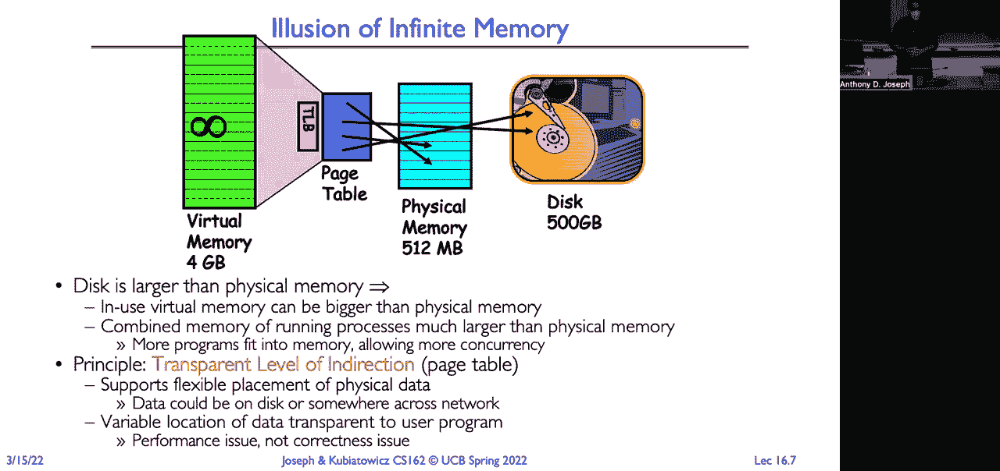

所以这是有价值的。好的。我们已经看到这个画面很多次了，这是一个英特尔页面表条目。今天我们要记住的是三组位。存在位，它像有效位一样，告诉我们这个条目引用的是物理内存中的页面。访问位，它告诉我们是否最近访问过该页面，我会给出一个正式的解释。

这一点稍后会定义。然后是脏位，它告诉我们页面是否反映了磁盘上的内容。那么它是干净的还是脏的？我们是否对它进行了写操作，改变了它与磁盘上可能存储的内容的差异？

好的。所以一些机制。页面表条目让我们能够进行按需分页，因为它为我们提供了透明的间接层。我们查看页面表条目中的位，它们告诉我们在哪里找到页面。所以如果它有效，它告诉我们该页面在内存中，并且页面表条目包含该虚拟页面号的物理页面框号。如果它无效。

这意味着页面不在内存中。好吧。所以如果它使用页面表条目或其他操作系统的记录结构来查找该页面。那么，如果你引用了一个无效的页面表条目，那么这将导致内存管理单元跳转到操作系统。这叫做页面错误。那么操作系统会做什么呢？

假设页面是有效的，且它存储在磁盘上，它将需要将其拉入内存。但我们可能需要找到一个旧页面来替换它。对吧？

因为如果我们的内存已经全部被占用，物理内存全满，我们想要加载一个新页面进来，那么必须有一个页面被驱逐。我们会选择一个旧页面，对吧？

因为如果我们很长时间没有引用那个页面，或者很长时间没有使用那个页面，那么你知道，我们不太可能再次使用它。好吧，我们将详细讲解一下“旧”和“新”的定义。但现在，我们只会选择一个页面来替换。好的。如果那个旧页面是脏的。

我们需要将其写回磁盘。这样，磁盘上的数据才能与该页面保持一致。然后我们会更改页面表项，并使该页面的任何缓存的 TLB 条目失效，因为它不再在内存中。它在磁盘上。接下来，我们将从磁盘将新页面加载到内存中。

我们需要更新它的页面表项，并验证之前标记为无效的任何 TLB 条目。我们将刷新这些 TLB 条目。现在我们可以将线程放回到运行队列，然后放入就绪队列。最终它会运行，对吧？所以我们将从发生缺页异常的指令继续执行该线程。

它将重新启动指令。现在指令会成功执行。所有这些步骤。这是一个缓存。是的。是新条目还是旧条目？是新条目。我们之所以有这个问题，是因为为什么要使新条目的 TLB 失效？

因为当我们通过内存管理单元时，TLB 条目会显示，“哦，这个页面无效”。这是我找到的 TLB 条目。我们把它放入 TLB。因此，现在我们必须使其失效，因为在重新启动指令时，我们会用正确有效的页面表项重新加载 TLB。这是一个重要而微妙的步骤。

这是一个非常好的问题，因为很容易忽略这一点。即使当我们发现某个特定条目无效时，所有内容都会从内存管理单元中缓存出来。是的。还有问题吗？同样的问题。好的。那么，正如我刚才说的，新的页面的 TLB 条目会在加载后立即生效。

发生缺页异常的指令会重新启动，因为它将不存在。内存管理单元会遍历页面表，找到页面表项，然后将其放入 TLB。是的。所以这是另一个好问题。我们马上就要详细讲解这一点。

但是问题是，操作系统如何知道这个页面在磁盘上的位置？

好的。那么，所有这些思考，我们稍后再回到这个话题。但这将是其中一个挑战，因为我们需要一些记录信息，并将其存储在某个地方，可能是页面表项中，以便找到那个特定的页面。对吧？有问题吗？是的。问题是，如何使任何缓存的 TLB 失效？

然后我们会通过TLB，告诉TLB，这个虚拟页面号和应用程序特定ID的映射无效。然后TLB会刷新这个映射。所以如果这个条目在TLB中被缓存，我们就刷新它。好的。现在，这个过程是需要时间的。这可能会花费大量时间，再次提醒，可能需要数千万纳秒。

在这个过程中，进程会处于等待状态，线程会等待该页面的加载，操作系统会调度其他线程运行。所以这也是我希望拥有大量线程的原因之一，因为可能会有多个线程在等待从磁盘加载页面。好的。

一旦我们遇到页面错误和按需分页，就可以做很多事情。这些操作大多是与操作系统相关的。不同的操作系统会以不同的方式实现这些功能，或者支持某些功能，或者不支持。但广泛的一些操作包括可以用它来扩展堆栈，或者在堆栈末尾运行，操作系统会自动扩展你的虚拟内存。

地址空间会增加一页作为堆栈。同样的事情也发生在堆上，程序会在堆的末尾运行。它会自动分配另一页内存。我们上次讲到的“写时复制”就是在执行fork时使用的技术。我们只需简单地复制父进程和子进程的地址空间及页面表项，这样它们就完全一样。

接着我们将所有内容标记为只读。当我们在写入时发生页面错误，我们会检查页面，看它是否是一个可写的页面。然后我们复制这个页面，并更新父进程和子进程的页面表项。exec，exec。所以当我们调用执行新可执行文件的系统调用时，我们会创建一个新的虚拟地址空间。我们不需要立即加载所有内容。

我们可以按需加载实际被引用的二进制部分。这非常方便。如果我有一个PowerPoint程序，它现在可能有2GB大，我就不需要把2GB的物理RAM占用来存储代码。只有实际被使用的代码才会被加载。

我使用时，它才会加载。这意味着程序可以立即启动，并且它的物理内存占用比总的虚拟地址空间占用要小。另一个例子是。稍后我们会看到，我想把一个文件映射到内存中，这样我就可以直接进行读写操作并访问这个文件。

这是我们用于程序代码段的技术之一。我们只需将其内存映射到内存中，然后从中运行。好的。接下来是将可执行文件加载到内存中。这是我们常做的一件事。我们有一个存储在文件系统中的可执行文件，它包含了我们的代码。

还有我们的静态初始化数据，然后是重定位表，一些调试符号和其他各种东西。所以操作系统会将它加载到内存中，初始化寄存器，初始化栈指针，然后调用C运行时初始化，CRT0，启动过程或函数。所以如果我们想一想，對吧。

我们在虚拟地址空间中使用的任何页面，都将由磁盘上的页面、磁盘块来支持。对吧？

所以你可以想象在磁盘上，我们有我们的，嗯，那就对了，我们有我们的堆栈，堆，数据和代码页。所以所有正在使用的虚拟地址空间，内存中每一页都在使用，我们有一个在磁盘上的阻塞页来支持它。对吧？现在，我们可以根据需求随时交换这些页面。我们对每个进程都这样做。

所以这里我们有我们的页表，它将我们的内核、堆栈、堆、数据映射到不同的物理页面。对吧？现在，对于所有其他页面，也就是那些没有映射的页面，我们必须在操作系统中跟踪它们的位置。它们将存在于磁盘上。对吧？所以它们就在这里。

这里是指向所有不在内存中的页面的指针。对吧？

所以问题是，我们如何将给定块或给定页面的虚拟页号映射到磁盘上的位置？好吧，通常我们会有某种形式的后备存储在磁盘上。对吧？在旧的操作系统中，我们有一个专门的分区，这就是我们的分页分区。

这由操作系统管理。所以它是一个连续的区域。它从零到n。然后会有一个函数，给定一个进程ID和一个页号，返回该分区内的块。现在，现代操作系统，它只是一个分页文件。它重用了现有的文件系统机制。

而且我们能够做到这一点有很多原因。这样它可以根据进程的大小扩展，不需要在创建磁盘分区时预定义。因此，它将是某种逻辑索引，指向该文件，告诉你在哪里定义一个给定的块。现在，取决于你的页表项，它们的大小和结构，一些操作系统会…

系统只需要在页表项中存储该逻辑偏移量。你只需查看页表项，它会给你指向该位置的实际指针。在其他情况下，会有一些簿记数据结构，当你调用这个查找块的函数时，它会返回关联的磁盘块。对吧？好的，我们看还有什么？

比如代码段，正如我提到的，我们可以直接将其内存映射到虚拟地址空间中。对吧？

所以，实际情况是这样，当我们需要时，代替将代码映射到磁盘上的某个位置，比如在我们的交换文件中，我们可以将其映射回我们的可执行文件。这就是大多数现代操作系统所做的。而且当你做项目或作业时，你可能遇到过这种情况。

你正在调试作业，运行程序时突然发现，“啊，我有一个 bug。”于是你进入 IDE，修改源代码并重新编译，但编译失败，因为它说可执行文件是只读的。可执行文件被锁定了。当你启动程序时，可执行文件会被锁定，因为我们将它作为后备存储使用。

用于虚拟内存的存储。对吗？所以它实际上有引用计数，因为你可能有多个进程在使用同一个可执行文件，并且在所有这些运行的副本停止运行并且你释放所有锁之前，你不能更改那个可执行文件。所以，是的。这是第二部分。你可以与多个正在运行的实例共享它。对吧？好的。

所以，重新来看，我们有页表，它是双向映射的。它映射到存储在内存中的页面，也映射到存储在磁盘上的页面。但我们可以让多个程序运行相同的可执行文件。所以这里我们有第二个正在运行相同可执行文件的进程。如果我们看看。

它会有单独的堆栈、堆和数据，但它实际上会有相同的代码进行分页。再一次，这可能是我们为了节省磁盘空间而进行分页的实际可执行文件。对吗？所以当，我们当然也有存储在内存中的页面。所以现在当我们去访问内存时，我们可能会发现那段内存引用。

当前不在内存中。所以我们会发生页面错误。发生页面错误时，我们会从当前的活动进程及其每个页表切换到另一个进程，同时调度读取该页面的操作。好的，现在我们已经开始并发执行了。最终，该页面会被调入内存。

页表项会被更新。现在我们可以切换回该进程成为活动进程。最终它会被调度并运行。好的，有问题吗？是的。是的。所以问题是，每个内存中的页面是否都有磁盘上的副本？答案是，某种程度上是的。所以对于内核、堆栈、堆和数据，是的；对于代码之类的内容。

它将是多个进程共享同一个物理页面，在磁盘上是如此，内存中也是如此。是的。[听不清]，是的。[听不清]，是的。[听不清]。是的。所以这里有一些——问题是缓存的包含与排除问题。我们是否有内存区域？当然有。有一些——问题是缓存的包含与排除问题。

那么我们是否有一些不进行缓存的内存区域呢？绝对有。确实存在一些我们不缓存的内存区域。例如，如果你有一个GPU，并且它的内存被映射到虚拟地址空间，那么这部分内存就是不可缓存的（uncachable）。因为所有的写操作都会直接写入，比如帧缓冲区。

类似地，你也可以在网络适配器或磁盘适配器上做同样的事情。是的。如果你能理解这一点，那就是很酷的地方。再次强调，查看页表项时，实际上你会看到是否有标记来表示某些内容是否可缓存或不可缓存。哦，明白了。

我错过了一个关于S break的问题。是的。如果你查看break和S break，你会发现它们改变了数据段的大小。而对于m-map，你会看到如何使用m-map将文件映射到地址空间中。然后你可以将这个文件映射到多个地址空间，并通过它进行共享。好吧。

总结一下我们如何处理主内存访问的内容，当我们执行一个指令，比如加载某个内存位置时。当我们遍历页表时，我们发现该页表项被标记为无效。这会导致我们陷入操作系统，运行我们的页面错误处理程序。

它会在后备存储中定位页面，并安排将页面加载到一个空闲的帧中。创建空闲帧可能需要逐出其他帧。如果该页面是脏的，那么我们必须将该页面写回到后备存储。最终它会被加载进内存。我们更新页表，验证TLB，然后重新启动指令，直到。

该线程再次被调度时。好吧，这就是页面错误（page fault）的整个过程。好吧，很多问题。那么问题是，代码段其实并没有加载到内存中？是的。代码段是加载到内存中的。它只是由磁盘上的可执行文件提供支持，并且我们是按需从那个可执行文件中加载，而不是在你开始运行程序时就将所有的代码都加载到内存中。

尽管如此，我们会看到一些小的注意事项，以及我们可以做的一些优化，我们将在讲座的最后讨论。好吧，有一堆问题需要回答。就像我刚才说的，我们需要一个空闲帧。当页面错误发生时，如果内存已满。那么我们从哪里得到空闲帧呢？嗯。

操作系统通常会有一个空闲列表。因此，它们会有一个类似于死神进程（reaper process）或其他进程，来查找帧。为了逐出（evict）这些帧。如果它们是脏的（dirty），则会安排它们写回磁盘。操作系统会将其清零，然后将它们放到空闲列表中。这样，当操作系统需要使用时。

你知道，总是能找到一个空闲位置来放置帧。再说一遍，我们将在讲座的最后讨论如何管理这个空闲列表的一些方法。现在我们如何组织选择要驱逐的帧？嗯，这实际上涉及到我们的替换策略。我们可以问的另一个问题是，我们应该给每个进程分配多少个页面帧？

它是1/N吗？它与虚拟地址空间的大小成比例吗？还是基于优先级的？

你知道，我们还可以问一些关于利用率和公平性的问题。我们甚至可以将这些问题扩展到思考诸如磁盘带宽之类的内容。对吧？一个给定进程可以使用多少磁盘带宽？

所以这些都是操作系统在分配物理内存给各个进程时需要考虑的问题。问题是，我们绝不会在同一时间进行磁盘的读写操作。所以，你要么是在读磁盘，要么是在写磁盘。

磁盘代表处理器执行命令。因此，处理器可以给磁盘提供一系列的读写命令。磁盘将按给定的顺序执行这些读写操作。或者，正如我们在本学期稍后将看到的那样，我们可以进行各种优化。

在调度磁盘时，计算机中的每个资源都可以进行调度和管理。我们希望这样做是为了提高效率和性能。好的。那么如果我们思考一个程序在使用其虚拟地址空间时在做什么。我们创建一个进程，它有一个虚拟地址空间。

它是否在同一时间使用所有的虚拟地址空间？嗯，如果我们看一个时间窗口，我们会发现以下情况。对吧？

所以在这里，我们在x轴上表示时间，y轴上表示地址。我们会看到程序经历了一组工作集。所以在任何给定的时间差内，我们会看到来自该进程的一组访问。指令获取、加载和存储。你可以看到它并没有在任何给定的时间访问其所有的地址空间。

所以当我们考虑这个问题时，它告诉我们，工作集表示应用程序在其虚拟地址空间中的页面，我们希望确保这些页面在处理器中的物理内存中是驻留的。另一种方式是考虑，如果这些页面，例如，在这个特定的时间，如果。

这两组页面不在物理内存中，我们将发生页面错误，将它们加载到物理内存中。这是需要考虑的一点。另一个需要考虑的点是，工作集随着时间的变化而变化。它不是一个静态的东西，对吧？

在不同的时间阶段，我们有不同的区域是活跃的。问题是，帧和页面有什么区别？它们是一样的。我们将帧和页面交替使用。通常，我们提到的是虚拟页面和物理页面帧，但页面。

帧（frame）和缓存（cache）是同一个概念。好的。现在，如果我们看看我们的缓存大小，在这种情况下，是我们物理内存的大小，我们再看看命中率。随着缓存大小的增加，我们希望看到的缓存行为是，更多的内存意味着更多的工作集能够适应内存，对吧？所以关键点是，还要记住。

我们正在从一个工作集过渡到另一个工作集。因此，工作集的大小也会发生变化。那么，如果我们的工作集无法完全放入内存，会发生什么呢？如果不能放入内存，我们就会遇到页面错误。这样，内存访问时间就会从100纳秒变成更长的时间。

时间可能会达到数千万纳秒。所以，当我们考虑将物理内存分配给进程时，我们要考虑的是，进程的工作集大小。那为什么东西可能装不下，或者为什么会发生缓存未命中的情况呢？有些原因可能是与容量相关的。如果我们没有为工作集大小分配足够的物理内存。

我们会遇到容量未命中。但是也会有冲突未命中和强制未命中。冲突是因为我们替换了错误的页面，这也涉及到页面替换策略。如果我们是完全关联的且没有偏向页面替换，那么冲突未命中应该为零。强制未命中是指我们刚开始运行时，或者当我们刚交换某个东西时。

再次加载。所以将这种模型应用于内存缓存和页面是适用的。但它实际上适用于任何类型的缓存策略。我们有一个有限大小的缓存，我们必须查看该缓存的访问模式，相对于缓存的大小。我们将在下一张幻灯片中回到这个问题。好的。

另一个思考局部性模型是Ziffian分布。在Ziffian分布中，访问某个排名为R的项目的可能性是1除以R的A次方或α次方。因此，访问低排名的某个项目可能非常罕见。

有很多低排名的事物，这使得它呈现出重尾分布。因此，人们在网页访问中经常能看到Ziffian分布。如果我们去伯克利的边界路，看看人们访问的最多的网站是什么？可能是，我不知道，是Cal Central。如果我们再看看下一个。

可能是www.berkeley.edu。因此，访问这些网站的次数每天、每小时、每分钟都会非常多。所以缓存这些网站会带来巨大的价值。然后，可能我们排到第20个，可能是www.sfgate.com。但它还会继续下去。你可能是校园里唯一一个访问www.xyz.com的人。所以如果我们考虑这一点。

缓存顶部视图有很大的价值，巨大的价值。好吧，因为我们将吸收大量的引用到这个顶部视图。但同时，尾部也会有成千上万甚至数百万的引用。所以即使我们在边缘放置了一个巨大的缓存，我们仍然会有很高的访问量。

错失率。这也是人们在开始尝试开发网页缓存时遇到的挑战之一。是的，确实有那些受欢迎的网站，我们可以把所有的流量都吸收到我们的缓存里。但因为人们在网上有各种各样想看的内容，那条长尾意味着我们的命中率不会像我们想要的那么高。

是的，是的。所以问题是为什么低排名的命中率较低。想一想。对吧？如果你是唯一一个在校园内访问www.xyz.com的人，而我们校园的白天人口大约是5万人，那将是一个很小的引用量。然而，如果每个学生都在上Cal Central查看他们的课程，那将会占据。

总体上有大量的引用。因此，缓存这些引用的价值会很高。哦，问题是低排名，较不受欢迎还是更受欢迎？是较不受欢迎的。对。所以当我们一直向外延伸到第49名时，访问的人不多，排名是49，但仍然有人在访问。所以我们不能缓存所有的东西。对。

在理想的世界里，我们会在边缘缓存整个互联网，但我们做不到。对。所以我们必须选择缓存的大小是什么，而我们会发现我们能够捕获很多这些高排名的、低排名的，排名第一、第二、三、四的项目，但我们无法缓存排名第5000的。好，其他问题吗？是的。啊。

所以如果我们能捕获每个页面，缓存这些页面，越多的页面我们能够缓存这些高排名的页面，我们就能捕获更多人尝试浏览的内容，但我们需要一个你知道的，甚至是PB级别的缓存来尝试捕获这些内容。对。完全正确。命中率指的是如果我们缓存所有该排名及以下的内容。

所以我们只能不断地往下走，你知道，才能达到操作，你可以看到我们仍然没有到达第一名。你到达了第一名，你知道。我们将缓存排名一百万的内容，知道，为了捕获它。那将非常昂贵。对。如果内存和磁盘空间不成问题的话。

然后我们可以有一个任意大小的大缓存，但因为我们必须设定一个限制，你知道，我们必须考虑一个权衡。所以我们，如果最终到达这里，对吧，我们的命中率是80%，但是，这意味着我们仍然有20%的内容缺失。还有其他问题吗？好吧。那么，接下来，它说，是否有操作系统能够访问多个缓存。

但是对每个不同的情况使用不同的方法？绝对可以。所以每个缓存，我们都会问这些问题，例如替换策略，像TLB那样，我们说随机通常已经足够好了，因为我们可以采用硬件实现的需求分页。而我们在软件中将实现它。

所以我们可能会实现一些比随机更复杂且更可预测的东西。问题是，如果我们有太多的缓存，是否不值得这样做？是的。所以总是存在一个权衡，对吧？每次我们查看缓存时，都会有一个相关的成本。因此，这就是为什么处理器上不会有20级缓存的原因。

我们通常有大约三级缓存。L3缓存通常是跨多个核心共享的。在芯片空间的价值与性能收益、以及通过另一个缓存时的延迟损失之间总是存在权衡。好的。

所以我们可以计算主内存的平均访问时间。那么让我们来看看。我们的有效访问时间将是命中时间加上未命中率，乘以未命中惩罚。例如，假设我们的内存访问时间是200纳秒，而我们的平均页面故障时间是8毫秒。我们假设未命中的概率是P。

所以1减去P就是我们的命中概率，我们可以按照如下方式计算我们的有效访问时间。好的。它将是200纳秒加上P乘以800万纳秒。所以如果每1000次访问中有一次页面故障，这看起来是一个相对较小的数字。1000次访问以全速运行，而1次访问则运行较慢。好了。

它实际上得出了8.2微秒的平均内存访问时间。所以我们现在将机器的速度降低了40倍。看起来我们的机器好像停下来了。对吧？换个角度思考，如果我想限制这个减速，怎么办？

我想说的是，我愿意为需求分页将我的机器速度降低10%。那我需要做什么？

好的，我需要有一个大约每40万个访问中才会发生一次页面故障的页面故障率。好的。所以这就是为什么制定一个非常好的替换算法至关重要，因为如果我们选择了错误的页面并将其驱逐出去，随后又去引用那个页面，嗯，那么我们的机器就会像运行磁盘一样慢。好了，问题是。

为什么会发生未命中？嗯，是因为我们没有足够的空间，或者没有足够的空间。我们之前没有引用过它（强制性）。我们会碰到空间问题，而且只是更强制性地未引用页面。所以这将导致我们发生未命中。我们可以做预取，但这是非常有争议的。预取的意思是，如果我曾经引用过这个页面，嗯。

我知道我做的是顺序访问，所以在访问第一个页面后，我很可能会访问其他页面。所以当我引用第一个页面时，我会把这些页面拉进来。风险是，如果我没有引用那些其他页面怎么办？好吧，为了把这些页面拉进来，我踢出了其他页面，这样我就使用了磁盘带宽。

把那些页面拉进来，然后我又不引用它们，结果把其他页面踢出去，这样我实际上可能会提高我的缺失率。这就是为什么预取总是具有争议的原因。我们必须预测哪些页面需要预取。所以容量问题。那是我想说的。内存不够。

所以我们必须把某些内容从缓存中踢出去，这将导致我们在稍后引用它时不得不重新拉取它。所以我们必须以某种方式增加可用的内存。这是我朋友们总说的，他们说，哦，你做计算机的，能帮我解决一下我的 Windows 吗？它运行得很慢。我就说，我不做这种计算机方面的事情。

但是我会问，你有多少内存？然后人们会说，哦，我有8GB。我出去买32GB，价格不贵，它会让你的机器跑得更快。对吧？

因为再想一下。如果我们每千次引用发生一次故障，那就是40倍的速度下降。所以，额外的内存可以避免容量丢失，让你的运行开销保持在10%以内。好了。所以增加更多的DRAM，或者调整我们为进程分配的内存量。

如果它没有为工作集分配足够的内存，那么它就会出现页面故障，无法进行有效的进展。所以我们要么给它更多内存，要么就只能说，好吧，你运行得很慢，效果不好。而且你占用了其他进程可以使用的内存。所以这是冲突丢失。技术上讲，除非我们在选择时出了问题，否则不应该出现冲突丢失。

空页面或者类似的东西。这实际上涉及到政策失误。我们替换了错误的页面，结果导致我们发生故障，不得不把该页面重新拉回内存中。所以解决方案是在更好的替换策略上投入更多的时间和软件周期。好的。接下来是一些行政事务。我们有期中考试安排在周四。

这将涵盖所有内容，包括这次讲座。昨天有一个复习环节，相关的幻灯片和视频已上传至课程网站。有什么问题吗？是的。[听不清]，完全没问题。所以问题是，您知道，这里的想法是投资更多的时间在软件上。

与替换策略相关，获得更好的替换策略是值得的。答案是，绝对值得。你可以提高命中率。你会让你的程序运行得更快。对吧？所以一个更好的替换策略，或者像我说的那样，出去增加更多内存。

物理内存。因此，你可以减少容量缺失。这些都会降低错误率，带来更好的性能。所有这一切都成立，因为存在巨大的差异。对吧？如果我们考虑一下TOB，我们可以在几分之一纳秒的时间内访问TOB，而访问主内存则要慢上100倍或更多。对吧？100纳秒。

RAM的访问时间从100到200纳秒与1000万纳秒的差距是如此之大，真的很值得我们投入一个好的替换策略。因为在TOB中，我们曾经想过，嗯，我们只要在硬件上做这件事就好了。因为这是一个显著的成本，但它的成本差距没有那么大。好了。

页面替换策略。再次说明，我们关心替换策略的原因是因为它对任何缓存都很重要。我刚刚讲过，我们如何在TLB中做出决定，TLB通常是由硬件管理的。MIPS是个例外，它们做的是软件TOB。但对于页面来说，它真的很重要，因为访问时间差异太大。

访问主内存和磁盘的访问时间。所以我们不希望丢掉重要的内容。好了，第一个策略是FIFO，先进先出，听起来很简单。确实很简单。我们把最老的页面扔出去。最早从磁盘中加载进来的页面就是我们第一个要驱逐的页面。好吧。你可以说它公平，每个页面在内存中存活的时间大致相同。

但缺点是，如果我们有一个经常使用的旧页面，比如它是某个关键的代码集，跨多个进程使用，并且我们把它驱逐出内存，那么接下来的事情就是把它再加载回内存。所以这是FIFO的一个缺点。随机。随机很容易实现。

所以你不能用随机数生成器来选择一个页面然后将其驱逐，對吧？

但是如果你仔细想一想，在TOB中这方法效果很好，因为那里有很高的成本，100倍的因素去访问磁盘。但在这里，又是100纳秒，200纳秒与1000万纳秒的差距。所以我们选择了错误的页面并将其驱逐。如果我们关注的是软实时，这将对性能非常不利。

或者交互式系统。因此，当涉及分页时，我们不希望出现不可预测的情况。那么从另一个角度来看，最好的做法是什么呢？如果我们必须选择一个页面进行驱逐，哪个页面对我们造成的损害最小？我们应该驱逐的页面，不是我们接下来会引用的页面，不是接下来要引用的页面。

也不是我们之后会引用的页面，而是我们将来最久才会引用的页面。对吧？

这被证明是最优的，是在内存有限的情况下能做到的最好方法。所以这就是我们的最小算法。我们不能实现它，因为我们无法预测未来。如果我们知道未来，你知道，我们可能都已经投资狗狗币之类的了。所以我们将假设程序是一致的，如果它们没有。

如果某个东西已经长时间没有被访问，它们不太可能突然反过来再次访问它。所以我们将利用过去的访问作为对未来的预测。这就引出了LRU。使用LRU时，我们回顾过去，选择最近最少使用的内容。这就是我们将驱逐的页面。希望它能反映出类似最小算法的行为。

它将是最小算法的一个良好近似。那么我们该如何实现LRU呢？一种方式是使用一个列表。当我们引用一个页面时，我们将它放在列表头部，尾部则是最久未使用的页面。所以当我们需要一个空闲页面时，我们只需从尾部拿走一个并分配给进程。但想想看，这样做怎么样？

什么是使用我？使用意味着指令获取。使用意味着内存加载。使用意味着内存存储。如此在每次指令获取、每次加载、每次存储时，我们都必须更新这个列表。这实际上并不是很高效。好吧。对于每一次内存引用来说，这将是一个极其庞大的软件循环次数。而且，是的，你知道，这样我们可以选择替换最旧的页面，但它会带来。

这样做会对性能造成严重的惩罚。所以我们将近似LRU，记住，这将是我们如何近似最小算法。我们从最小算法的黄金标准开始，然后用LRU来近似它。接着，我们将用不同的方法来近似LRU。好的。

那么我们来看一下这会是什么样子。我们将使用FIFO作为我们的假设。我们假设我们有三个物理页面帧和一个虚拟地址空间，里面有四个页面。我们将有以下的引用流：A，B，C，A，B，D，A，D，B，C，B。好吧，这就是它的样子。这里有三个物理帧。

让我们看看我们的引用会发生什么。那么首先是A，会发生什么？引用A。我们将发生页面错误，对吧？这是一个强制性页面错误。它不在物理内存中。因此，我们必须发生页面错误并将其载入。那么我们将载入A。它将去哪里呢？好吧。我们将随机选择一个位置。我们选择一个。好，接下来是B。

它将去哪里呢？同样，它是一个强制性未命中。所以我们将把它放入下一个可用的空闲帧，即帧2。接下来是C。同样，强制性未命中。我们将替换或将其载入空闲帧3。对吧？现在我们引用A。它已经在内存中了。是命中。全速运行。引用B。它也在内存中。是命中。

全速运行。哦，现在我们访问D。那会发生缺页。我们的第一个页面——我们没有任何空闲页。我们第一个进入的页面是什么？是A，第一个页面。所以我们将A替换为D。然后我们的下一个访问——哦，是A。好的。那么现在我们的最旧页面是什么？将是框2，B。所以我们替换B。好的。

然后我们的下一个访问是D。那是一个命中。太好了。接下来我们访问B。它不在内存中。那是一个缺页。那我们替换谁呢？我们替换C。然后我们访问C，它是刚刚被替换出去的。所以现在我们的最旧页是D。我们替换D。然后我们访问B，这是一个命中。最终我们得到了七次缺页。

我们的一次缺页是相当糟糕的。因为当我们访问D时，我们替换了A。然后马上又访问了A。类似地，我们替换了B。然后——不对。好了，让我们看看在每个给定时刻，基于我们的访问记录，最好的选择是什么。那就是最小化缺页。所以A进来了。我们没什么可做的。强制缺页，B也是一样。C也是。

两次命中。好了，现在D进来了。我们应该替换哪个？现在我们从D开始往后看。我们会看到，接下来我们会访问A。所以我们不想替换A。然后我们会访问B。所以我们也不想替换B。而C是最远的，所以我们替换C。现在A是命中。B是命中。B是命中。哦，现在C。

那么我们现在替换谁呢？我们要替换A还是D？我们会替换A。然后B会命中。所以最终的最小缺页数是五次。当我们替换D的帧时，我们会向前看尽可能远，以查看最远的参考记录。现在恰好LRU做的也是同样的事情。但这并不是必然的。事实上。

如果你仔细想想，我们其实可以提出一个病态的例子，说明在某些情况下LRU（最近最少使用）会表现得很差。这里，考虑参考序列ABCD，ABCD，ABCD。虚拟地址的设置相同。每个物理页框也一样。而LRU和FIFO实际上会做出相同的操作。好了，A会发生缺页。

B会发生缺页。C会发生缺页。现在D进来了，使用LRU。那么哪个框最久未被使用？是A，对吧？因为框1，所以我们替换A。然后我们访问A。现在，哪个框最久未被使用？是B，框2，所以我们替换B。然后我们访问B。哪个框最久未被使用？是C。所以你可以看到，我们基本上是在按顺序替换页面。

每次访问都会发生缺页。所以这是一个有些牵强的例子，假设我们的工作集大小是N+1，而可用的物理帧只有N个。但它说明了，如果你的物理帧比工作集大小少，你将会有大量的缺页，并且系统会以磁盘速度运行，而不是内存速度。

那么让我们来看看，实际上会是什么样的一个更好的选择——这又回到了为何替换策略这么重要的问题。

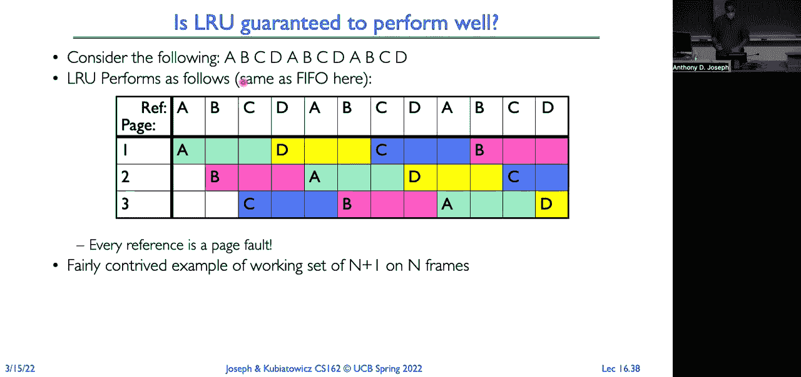

很重要，MIN会怎么做？现在B的引用到来了。我们要替换哪个帧？

展望未来，我们希望替换C。现在，A和B的引用将耗尽内存，接着是C的引用到来。我们想要替换哪个帧？我们将替换B。因为接下来是D、A，然后是B。所以我们替换B。现在D和A的引用将耗尽内存，接着我们得到了B的引用。所以如果我们展望未来，我们可以替换A。

所以我们可以看到故障数大大减少。这就是为什么替换策略很重要。

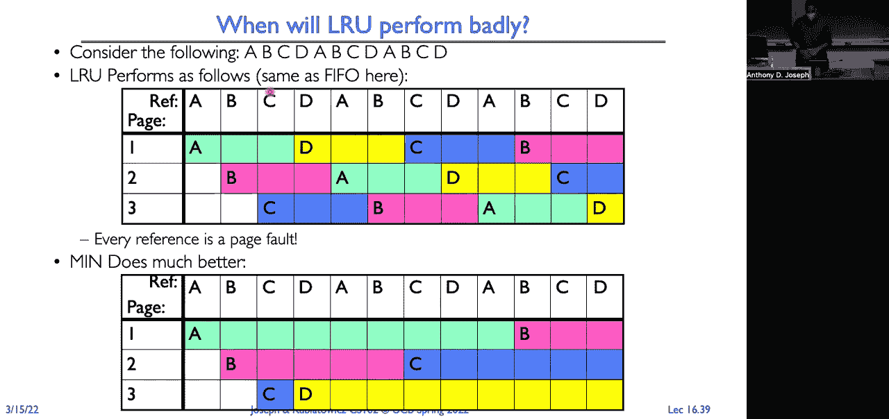

好的，现在我们希望具备的一个理想特性是，当你增加更多内存时，你花费更多的钱，而你得到更好的性能。在这种情况下，当你增加可用的物理页面帧数量时，你会看到页面错误的数量下降。

这里会有一些最小值，因为有强制缺失等情况。但并不是每个替换策略都有这种特性？扔更多内存进去，它就表现得更好？直观来看，答案似乎应该是“是的”。我有更多的内存，所以应该减少容量缺失。但是你也可能会遇到策略缺失。因此，对于某些算法。

我们遇到了所谓的平衡异常（balates anomaly），实际上增加内存并不会减少故障率。所以对于LRU和MIN算法，这是有保证的。你给它们更多内存，故障率会下降。但对于FIFO来说并非总是如此，这就是异常。所以考虑下面这个页面引用序列。三帧，引用字符串是ABCDE。

在我们的虚拟地址空间中，五个页面被映射到三帧。那么这里有多少个故障呢？九个。如果我现在再增加一个帧，我会有多少个故障？十个。所以我增加了内存，而故障数反而上升了。所以，问题来了。看看三帧内存的内容和四帧内存的内容。

完全不同。这就是这里的异常。使用FIFO时，内存的内容可能会完全不同，这意味着命中率可能实际上更低。而在LRU和MIN中，内存中包含X页面的内容，将是内存中包含X+1页面内容的一个子集。这有点让人困惑，感觉有点反直觉。

但这是FIFO处理内存的副作用。

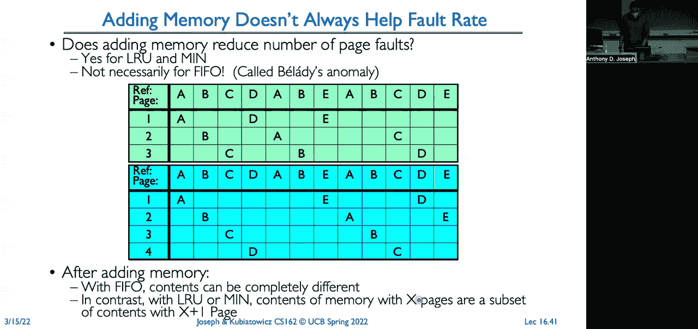

好的，近似值。所以是的。

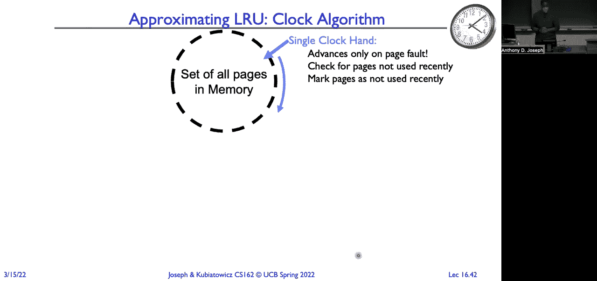

[听不清]，是的。问题是MIN是否保证是最优策略？是的。因为MIN可以看到未来。所以MIN能准确知道哪一帧是最不重要的，可以被替换。最重要的事情是替换那一帧，你会在接下来的操作中立即引用。所以MIN会看得更远。

它尽量将页面错误延迟到尽可能远的未来，并且在每次页面替换时都在执行这个操作。

好的。那么我们可以实现 MIN 算法。我们不能实现 LRU 算法。所以我们将实现一个 LRU 的近似算法。我们会看看几种不同的近似方式。所以第一个是一个叫做时钟算法（clock algorithm）的算法。我们将把所有物理页放在内存中，从概念上讲，我们会将它们排列成一个圆圈。然后我们将有一个时钟指针，它会绕着这些页面转，并执行以下操作。我们的目标是，我们需要找到一个页面进行替换。

我们不会尝试替换绝对最旧的被引用页面。我们只是尝试替换一个老页面，一个我们很久没有引用过的页面。这就是折中。所以与其尝试实现精确的 LRU，我们将实现一个算法，它只会选择一个老的被引用页面并将其逐出。

所以一些细节。我们将有一个硬件使用位（use bit）或访问位（access bit）。如果该位被设置，或者说每次我们访问一个页面时，这个位会被设置。所以如果我们进行指令获取，加载或存储到某个页面时，硬件会自动为我们设置这个使用位或访问位。

现在它可以被设置在 TOB（Translation Lookaside Buffer）。如果它设置在 TOB 中，那么当我们从 TOB 中逐出一个条目时，我们需要将使用位（use bit）复制回 TOB 缓存的页表条目中。当发生页面错误时，会发生什么？我们会推进时钟指针。如果使用位被设置了，这意味着什么？

这意味着该页面最近被访问过。我们清除使用位，并推进指针。如果没有被设置，如果它是 0，这意味着该页面很久没有被访问过，可能是一个替换候选页面。所以我们可以选择这个页面进行替换。好了，稍微再细节一点。当时钟指针绕行时，我们最终会找到一个替换候选页面吗？是的。

即使内存中的每个页面最近都被访问过，那个指针也会将其标记为 0，设置为 0，再设置为 0，然后继续前进，直到绕一圈回来，找到一个标记为 0 的页面。这个页面就成了我们的替换候选页。所以从那个时候起，它实际上就变成了 FIFO 算法。现在，

如果指针移动得非常慢，那意味着什么？这是不是好还是不好？嗯，这意味着发生页面错误的次数不多。所以这可能是好事。它也可能意味着当我们发生页面错误时，能够很快找到页面。这也是好事。现在，如果指针移动得非常快呢？嗯，

这意味着要么是发生了大量的页面错误，要么是我们需要很长时间才能找到一个空闲页面，比如所有页面都在使用中。所以我们必须在每次访问时都绕一圈，才能找到一个有效的页面进行替换。所以你可以这样理解时钟算法，

我们将页面划分为“年轻页面”和“老页面”，即年轻页面是被频繁引用的，而老页面是较少被引用的。但是如果我们只看两个集合，为什么不设置更多的集合呢？

然后我们可以开始思考页面的粒度。接着我们可以开始考虑页面写入的数量，以页面的形式来计算。然后我们可以开始考虑页面的数量，这些页面以页面的形式进行写入。然后我们可以开始考虑页面的数量，这些页面以页面的形式进行写入。

然后我们可以开始考虑页面的数量，这些页面以页面的形式进行写入。然后我们可以开始考虑页面数量，在页面缺失时，操作系统会检查使用位。如果使用位是1，我们清除该位，清除计数器。如果使用位是0，我们将计数器加1。如果计数器等于n。

它就是一个候选替换页面。问题？好吧。那么这意味着，对于任何给定的页面，指针必须循环n次，才会选择它进行替换。所以，它给了页面n次被访问的机会。如果在这n次机会内没有被访问过，我们就选择该页面进行替换。那么现在的大问题是，我们刚刚看到了n次机会，指针可能需要循环1,024次才能找到一个页面进行替换。

直接看一下。我们将n设置为多少？好吧，如果我们将n设置得非常大，那么它将是LRU的一个很好的近似。如果我们将其设置为1,024，这就意味着我们将页面的年龄粒度划分得非常细。它不是完美的LRU，但它将是LRU的一个非常接近的近似值。

但是如果你想一想，这样做并不高效，对吧？

所以如果我们选择一个更小的n，它会更加高效，但我们就不能像LRU那样真实反映了页面的实际情况。它将更像是一个粗粒度的近似。

所以我们要找到一个平衡点，既能快速有效地找到页面，又能选择正确的页面进行替换。好的。是的。是的，所以问题是，如果我们看的是n次机会，是否意味着每次想要找到一个页面都需要n次循环？不一定，对吧？

因为我们可能已经走过了很多次过去的步骤。所以，当我们推进指针时，可能会找到一个页面，其中，计数器增加到 n。这样，第一个页面缺失--，是的，可能需要n次循环才能找到它。如果所有页面最近都已被访问过。好吧，所有这些。

我们没有考虑到如果我们选择的页面被修改了，会发生什么。记住，我们使用的是写回缓存，这意味着我们可能已经进行了大量写操作。后台存储中的内容与内存中的内容不一致。因此，我们实际上需要--。这将增加额外的开销，因为现在我们必须安排将该页面写入存储。

写出这个页面需要耗费数千万纳秒，而在我们用数千万纳秒把页面加载进来之前，我们也许可以给脏页面一个额外的机会。所以在我们第一次发现时，我们不会立即考虑它们被替换掉。

也许我们应该替换掉这个长时间未使用的页面。所以一种常见的方法是，对于干净页面，我们设定n等于1。而对于脏页面，我们设定n等于2。当n等于1时，如果我们发现页面是脏的，我们会安排它写出。希望等到指针回到起点时，这个页面就会变成干净页面。

我们可以直接驱逐该页面，并替换成我们想要加载的页面，明白吗？

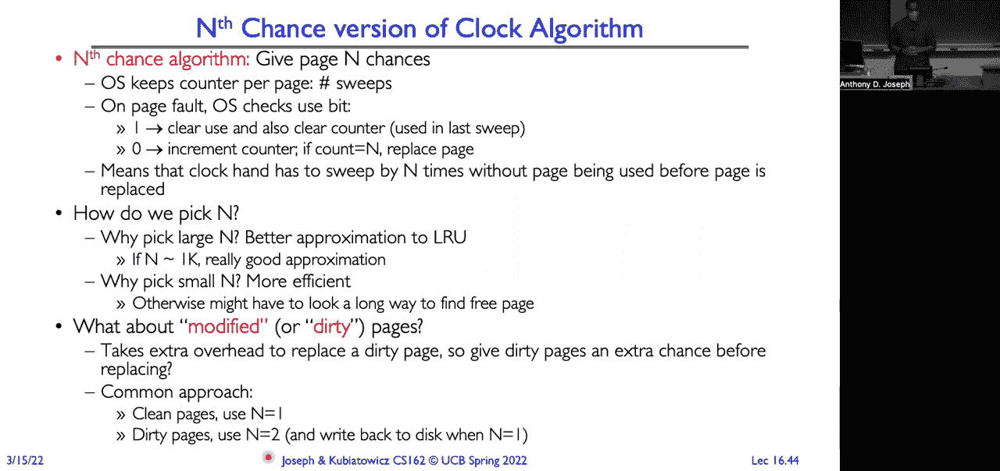

好的。那么如果我们再回来——是的，有问题吗？

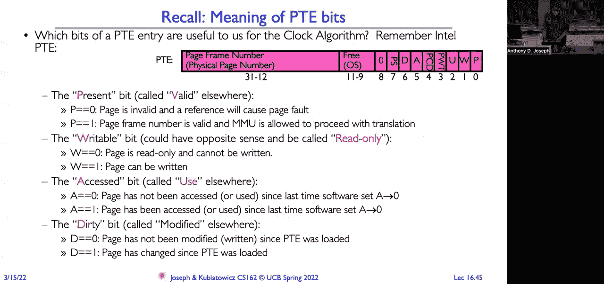

[无法听清]，是的，问题是，n等于1和n等于2是什么意思？

所以问题在于我们什么时候考虑替换它。如果你记得，这里是这样操作的：当我们遇到页面且其使用位为0时，我们增加计数器。如果计数器等于n，那么我们就驱逐该页面并替换它。所以我们要做的是，当我们循环时，如果遇到一个使用位为0的页面，我们就增加计数器。

如果计数器现在大于或等于1，我们就替换它。如果它是干净的。如果是脏的，那么我们假设n必须等于2。我们会安排它被写出。当我们循环一圈回到起点时，如果页面仍然未被使用，届时计数器应该变为1，且会被增加，然后我们就可以替换它。

我们也能够——它也会被宣布过期，所以现在我们可以替换它了。好的，回到我们的页面表条目，我们将使用哪些位？

我们将使用存在位（present bit）、可写位（writable bit）、访问位（access bit）和脏位（dirty bit）。这些就是我们需要使用的位，用于所有的账本记录工作，以判断一个页面是否有效，是否已写入，是否可写，以及该页面是否已被使用。

好的。那么时钟算法的一些变体。我们是否真的需要一个硬件实现的修改位，用来告诉我们页面是否是脏的？答案是否定的。我们可以在软件中模拟这一过程。所以我们需要一些额外的数据结构来跟踪哪些页面是允许写入的，哪些页面不是。

但我们可以简单地将所有页面标记为只读。然后当它们被访问并尝试写入时，检查数据结构，看看是否允许写入？如果允许，我们就在软件中标记该页面已经修改，并标记页面表。这样，我们就可以追踪页面是如何写入的，页面是如何被写入的。

所以我们可以看到页面是如何被写入的。 所以我们可以看到页面是如何被写入的。 所以我们可以看到页面是如何被写入的。 所以我们可以看到页面是如何被写入的。 所以我们可以看到页面是如何被写入的。 所以我们可以看到页面是如何被写入的。 所以我们可以看到页面是如何被写入的。 所以我们可以看到页面是如何被写入的。

所以我们可以看到页面是如何被写入的。 所以我们可以看到页面是如何被写入的。 所以我们可以看到页面是如何被写入的。 所以每当我们将其写回到磁盘时，我们会在软件中清除修改位。类似地，我们可以问，是否需要硬件中的使用位？

这是在每次内存访问时设置的。现在，我们可以在软件中模拟它。因此，我们将为每个页面在软件中保留一个使用位和一个修改位。我们将利用页表基础设施来完成这两个任务。所以我们会将所有页面标记为无效，包括那些实际上在内存中的页面。好了。

当你引用这些页面中的一个时，会发生什么？触发到操作系统。再一次，操作系统会查看它的“双重账本”，并看到，哦，这个页面实际上是有效的。所以把它标记为已使用。如果发生了写操作，我还会将其标记为脏，并设置为读写模式。

如果是发生了读取或指令获取，我会将其标记为只读。好吧？现在，当时钟指针经过时，我会将该软件使用位重置为零，并在页表条目中标记页面为无效。刷新它的T/O/B条目。修改位我不处理，因为页面仍然是脏的，仍然需要写回磁盘。好了。

时钟本身只是LRU的一种近似方法。这只是我们实现LRU的一种方式。还有其他方法可以做到吗？所有的，我们在这里尝试做的，只是识别旧页面，不一定是最旧的页面，而是一个旧页面。所以，另一种方法一度非常流行。

这是一种叫做第二机会列表的方法。今天我们仍然有这种方法的变种。所以这种方法在VaxVMS架构中被使用。其理念是，我们将内存分为两个区域，一个是活跃区域，包含正在被积极使用的页面，我们用FIFO来管理，另一个是第二机会列表，我们将其标记为LRU，包含被认为是非活跃的页面。

所以，活跃列表中的页面被标记为读/写。第二机会列表中的页面被标记为LRU。所以活跃页面，我们可以全速访问它们。访问第二机会列表时，会触发到内核。好了。现在，当我们从活跃页面中溢出时，我们会将该页面移到第二机会列表的头部。

如果我们访问的是第二机会列表中的页面，系统会触发到内核。这告诉我们，这个我们认为是非活跃的页面，实际上是活跃的。因此，我们会将它移到FIFO队列的头部，作为活跃页面。好了，现在，页面从磁盘加载，它是活跃的，所以它将被放到FIFO队列的头部。

这是我们的活动页面。这将迫使我们将一个页面从内存中驱逐出去，我们只会选择我们的LRU页面。那么这给我们带来了什么？嗯，如果我们考虑一下，如果我们将所有页面都放入活动列表，它就是FIFO。如果我们将所有页面放入第二次机会列表，它将是纯LRU。

但这会非常昂贵，因为我们在每次内存引用时都会触发。所以我们选择了一些中间的方案，这样可以减少磁盘访问次数。因为我们让页面在内存中停留更长时间。我们有一个更高保真度的LRU实现，即使它们没有被使用。但这里的权衡是，我们将会。

增加我们进入操作系统的触发次数。所以这是我们在用触发来换取更高保真度的LRU表示作为最小化近似，并减少整体误读的权衡。这里的一个有趣之处是，页面转换完全取决于操作系统开发人员。

要弄清楚我想实现什么替换策略。硬件给了我们实现任何想要的功能的能力。如果硬件没有这个能力，我们可以在软件中模拟这个能力。所以，历史的一个小背景，为什么VaxVMS有软件实现的。

使用位和软件实现的修改位？因为当架构师问操作系统开发人员，是否需要硬件支持的使用位和硬件支持的修改位时，他们回答“不需要”。为什么，谁知道为什么。但事实证明，这并不是世界末日，因为他们实际上能够在软件中模拟它们。

VaxVMS系列是一个非常成功的计算机系列。好。我们还必须考虑的是我们的空闲列表。是的。那么，再次，问题是：陷入操作系统来实现使用位，真的会很昂贵吗？

当然。如果你有其他选择，你当然不想在每次使用时都触发。但他们能够摊销这一成本，因为只有第一次引用页面时，才会触发。尽管如此，如果你有硬件实现的使用位和硬件实现的修改位，那将会更容易。好，嗯。是的。

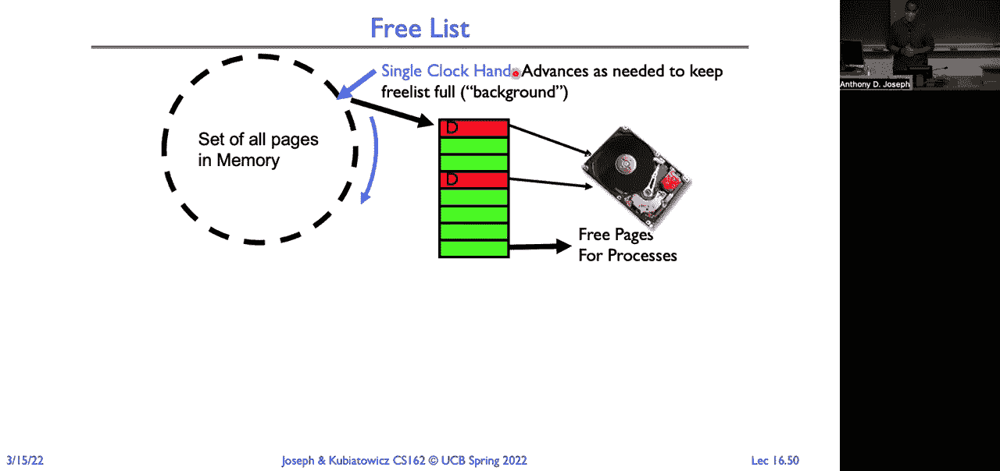

我们必须触发的原因是因为第二次机会列表被标记为无效。所以如果我们尝试访问第二次机会列表上的任何内容，页表项就是无效的，这会导致我们陷入操作系统中，然后将其移到活动页面，并标记为已使用，必要时也会修改标记。[听不清]，是的。所以问题是。

如果它被标记为无效，如何知道它在第二次机会列表上？

所以这就是双重书籍（double books）发挥作用的地方。操作系统必须有一套附加的记录，告诉它这些页面属于第二次机会列表，而不仅仅是可能在磁盘上的页面。再次强调，我们可能能够在页面表项中做一些处理，具体取决于我们有哪些位。好的。

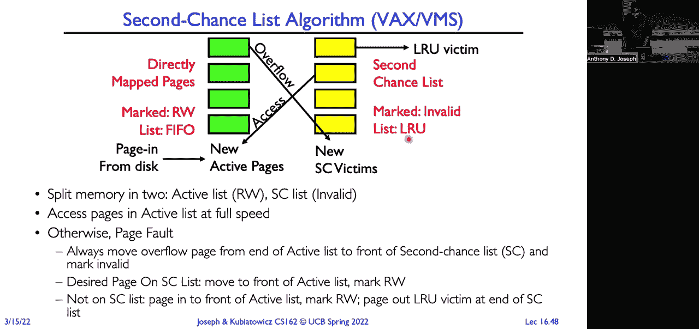

所以我将跳过空闲列表，我们将进行总结。好的。那么替换策略。我们查看了FIFO，它将页面放入队列并替换队尾的页面。我们还查看了要替换的页面，它是距离未来最远的页面。这是最优的，能做的最好选择。我们也查看了LRU，因为我们无法预测未来。

我们将使用过去的情况来预测未来，假设程序的行为是理性的。我们查看了时钟算法作为LRU的近似方法，按照一个环形列表排列页面，使用时钟指针进行扫描。如果一个页面没有被使用，就选择这个页面进行替换。

我们查看了处理年轻页面与旧页面的更细粒度方法。第n次机会算法就是一个例子。另一个例子是拥有一个第二次机会列表，在这个列表中，我们实际上可以在一小部分页面上实现LRU（最近最少使用）。所以我们有一些页面真正地按LRU方式处理，而另外一些页面则按FIFO（先进先出）方式处理。

我们有工作集，即那些最近被访问过的页面。我们还没有涉及到抖动（thrashing），我们会在春假后讨论这个问题。但抖动指的是我们有太多不同的页面。也就是说，我们所有进程的工作集总大小大于物理内存。

所以这是我们不断发生容量未命中并且总是访问磁盘的情况。好了，祝你们期中考试好运。再次提醒，考试是在周四晚上。[视频回放]。[回放结束]，[音频空白]。

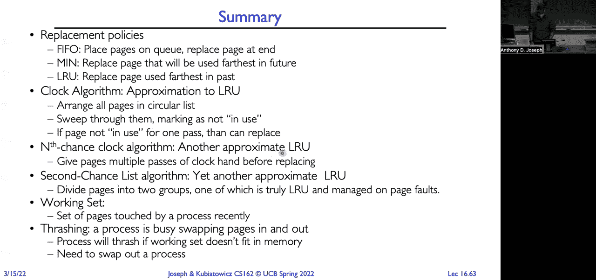
