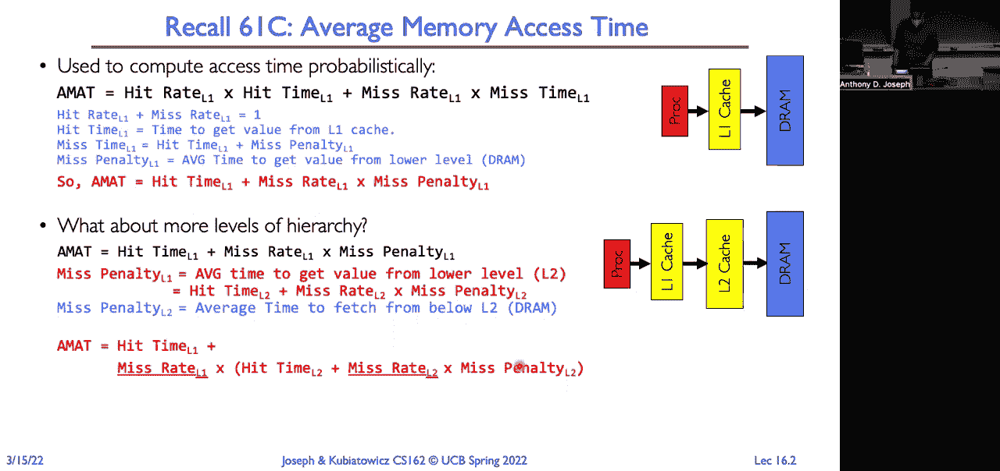
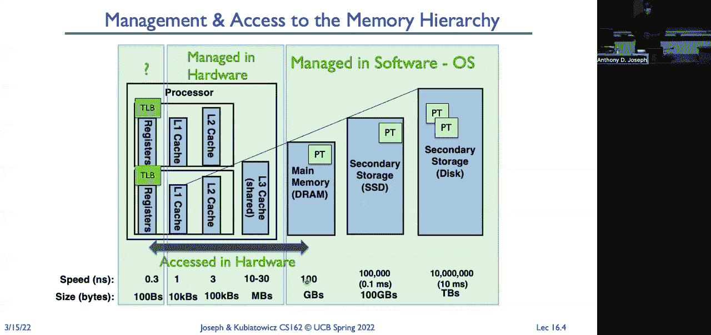
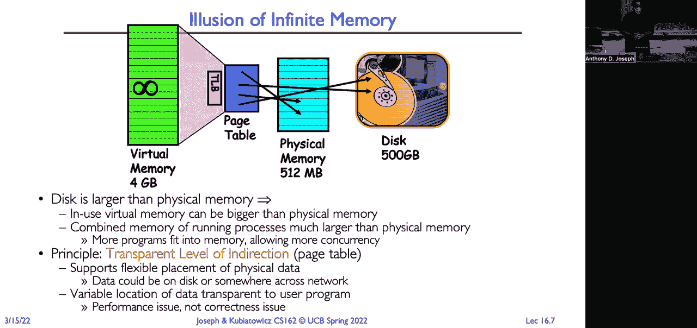
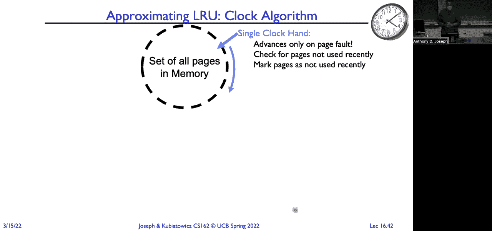
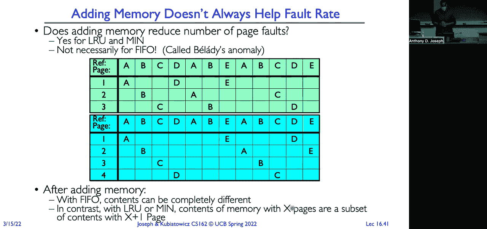
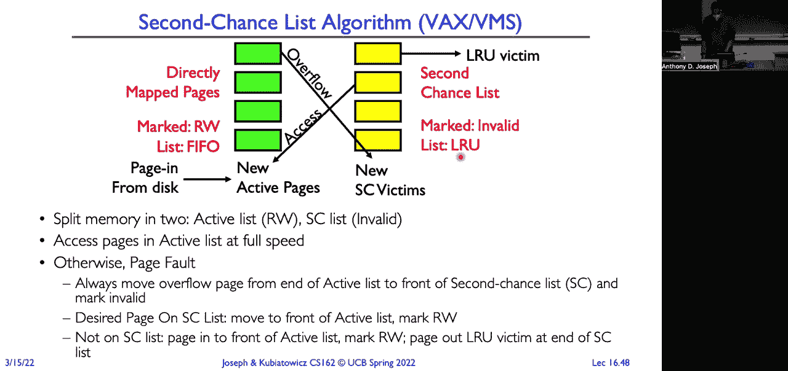

# 🧠 课程 P16：内存管理（四）需求分页策略





在本节课中，我们将要学习操作系统中的**需求分页**机制及其核心的**页面替换策略**。我们将探讨如何利用磁盘作为后备存储，为进程提供远大于物理内存的虚拟地址空间，并深入研究当物理内存不足时，如何选择最合适的页面进行替换，以最小化性能损失。

---

## 📊 概述：内存访问时间与缓存层级

上一节我们介绍了虚拟内存和页表的基本概念。本节中，我们来看看如何计算平均内存访问时间，并理解需求分页如何融入这个模型。



假设一个处理器有 L1 缓存和 DRAM（主内存）。平均内存访问时间（AMAT）可以表示为：

```
AMAT = L1命中时间 + L1未命中率 × L1未命中惩罚
```

其中，L1的未命中惩罚就是访问下一级（如L2缓存或主内存）的平均时间。这个模型可以扩展到多级存储层次，包括将主内存视为磁盘（SSD/HDD）的缓存。访问时间的差异巨大：
*   芯片内缓存：亚纳秒到纳秒级
*   主内存（DRAM）：约100纳秒
*   硬盘（HDD）：约1000万纳秒

我们的核心挑战是：如何利用访问速度为1000万纳秒的磁盘，让程序感觉像是在访问100纳秒的主内存。

---

## ⚙️ 需求分页的工作流程

上一节我们介绍了理想情况下的地址转换。本节中我们来看看当所需页面不在内存中时，会发生什么。

理想情况下，指令生成虚拟地址，通过MMU和TLB转换为物理地址并访问数据。但当页表项标记为“无效”时，会触发**页面错误（Page Fault）**。

以下是页面错误的处理流程：
1.  **触发异常**：运行中的指令被终止，CPU陷入操作系统内核。
2.  **执行处理程序**：操作系统页面错误处理程序被调用。
3.  **定位页面**：处理程序检查发现该页面在磁盘上，并确定其在磁盘上的位置。
4.  **分配物理帧**：如果需要，选择一个内存中的旧页面进行替换（驱逐）。
    *   如果被选中的页面是“脏的”（内容已被修改），则需先将其写回磁盘。
5.  **加载页面**：将所需页面从磁盘加载到空闲的物理内存帧中。
6.  **更新映射**：更新页表项，将其标记为有效，并指向新的物理帧。使TLB中该页面的旧条目失效。
7.  **重启指令**：将原先被中断的进程放回就绪队列。当其再次被调度时，重新执行触发页面错误的指令，此时该指令将成功执行。

这个过程将主内存视为磁盘的**缓存**。我们可以用缓存设计的经典问题来审视它：
*   **块大小**：页面（通常为4KB）。
*   **组织结构**：**完全关联**。任何虚拟页面可以映射到任何物理帧，这提供了最大灵活性，避免了冲突未命中。
*   **查找方式**：通过TLB和页表进行查找。
*   **替换策略**：当需要腾出空间时，选择哪个页面进行驱逐？这是本节课的重点。
*   **写策略**：**写回（Write-back）**。因为写直达（Write-through）会导致每次写操作都直接访问磁盘，速度极慢。脏页需要在被替换时写回磁盘。

需求分页提供了**透明的间接层**。对程序而言，它拥有完整的、连续的虚拟地址空间，无需关心数据实际存储在物理内存还是磁盘上。

---

## 📝 页表项的关键位

页表项（PTE）中的几个关键位支撑了需求分页机制：
*   **存在位（Present Bit）**：类似有效位。1表示该页面在物理内存中；0表示不在内存中（可能在磁盘上）。
*   **访问位（Accessed Bit）**：当页面被读或写时，硬件自动将其置1。用于追踪页面是否被近期使用，是页面替换算法的重要依据。
*   **脏位（Dirty Bit）**：当页面被写入时，硬件自动将其置1。表示该页面内容与磁盘副本不一致，在被替换前必须写回磁盘。

---

## 🗂️ 后备存储与页面定位

当页面不在内存中时，操作系统需要知道去哪里找到它。以下是管理后备存储的常见方式：

以下是操作系统定位不在内存中的页面的主要方法：
*   **专用交换分区/文件**：在磁盘上划出一块固定或可扩展的区域，专门用于存储被换出的页面。操作系统维护一个映射表，将`(进程ID, 虚拟页号)`映射到该分区内的具体磁盘块。
*   **内存映射文件**：对于程序代码等只读或可读写文件，可以直接将文件本身映射为进程虚拟地址空间的后备存储。当访问这些页面时，直接从文件对应的磁盘位置读取。这允许多个进程共享同一份物理内存和磁盘中的代码。

---

## 🔍 工作集与替换策略的重要性

程序在运行中并不会同时访问其全部虚拟地址空间。在任何一个时间窗口内，进程频繁访问的页面集合称为其**工作集（Working Set）**。

为了让进程高效运行，我们需要确保其工作集驻留在物理内存中。如果分配给进程的物理帧数少于其工作集大小，就会发生频繁的页面调入/调出，称为**颠簸（Thrashing）**，系统性能会急剧下降。

平均有效访问时间公式揭示了替换策略的关键性：
```
有效访问时间 = 内存访问时间 + 缺页率 × 缺页处理时间
```
假设内存访问时间为200纳秒，缺页处理（访问磁盘）为800万纳秒。即使缺页率低至0.1%（每1000次访问缺页1次），平均访问时间也会从200纳秒恶化到8200纳秒，性能下降超过40倍。因此，一个优秀的页面替换算法对于降低缺页率至关重要。

---


## 🧮 页面替换算法




现在我们进入核心环节：当物理内存已满，需要加载新页面时，应该选择替换哪个旧页面？以下是几种经典算法。



### 先进先出（FIFO）
*   **描述**：替换在内存中驻留时间最长的页面。
*   **优点**：实现简单。
*   **缺点**：可能会淘汰经常被访问的活跃页面，性能不佳。存在**Belady异常**：增加物理帧数有时反而会导致缺页次数增加。

### 最优算法（OPT/MIN）
*   **描述**：替换在**未来**最长时间内不会被访问的页面。
*   **优点**：这是理论上最优的算法，可产生最少的缺页数。
*   **缺点**：无法实现，因为它需要预知未来的页面访问序列。

### 最近最少使用（LRU）
*   **描述**：替换**过去**最长时间没有被访问的页面。
*   **优点**：基于“过去可以预测未来”的局部性原理，是对OPT算法的良好近似。
*   **缺点**：精确实现LRU成本很高，需要在每次内存访问时更新所有页面的“最近使用时间”信息。

### 时钟算法（Clock）
*   **描述**：一种对LRU的高效近似。将所有物理帧组织成一个环形链表，并有一个指针循环扫描。每帧有一个硬件或软件维护的**使用位**。
    1.  当需要替换页面时，检查指针指向的帧。
    2.  如果其使用位为1，则将其置0，指针前进一格。
    3.  如果其使用位为0，则选择该帧进行替换。
    4.  指针循环扫描，直到找到使用位为0的帧。
*   **变种（二次机会）**：考虑脏页写回磁盘的成本更高，可以给脏页多一次机会。例如，干净页在第一次遇到使用位为0时就被替换；而脏页则先安排其写回磁盘，并将使用位置0，等指针下次扫描到它时（此时已变干净）再替换。


### 改进型时钟算法
*   **描述**：综合考虑页面的使用情况和修改情况。为每个页面维护一个（使用位， 脏位）对。替换时按以下优先级选择页面：
    1.  (0, 0)：最近未使用，且干净。最佳替换对象。
    2.  (0, 1)：最近未使用，但脏。需要写回磁盘。
    3.  (1, 0)：最近使用过，但干净。
    4.  (1, 1)：最近使用过，且脏。
    算法会进行多轮扫描，优先淘汰第一类页面。

---

## 🎯 总结

本节课中我们一起学习了操作系统内存管理的核心高级主题——需求分页。

我们首先理解了需求分页如何作为磁盘的缓存来工作，并通过透明的页面错误处理机制，为进程提供了巨大的虚拟地址空间。我们深入分析了页表项中关键位（存在位、访问位、脏位）的作用。




接着，我们探讨了选择被替换页面的各种策略：从简单但性能有缺陷的FIFO，到理论最优但不可实现的OPT，再到基于历史访问的LRU及其高效近似——时钟算法及其变种。这些算法的核心目标都是尽可能准确地预测未来访问模式，避免将即将被访问的页面换出，从而最大限度地减少代价高昂的缺页异常。


理解这些替换策略，是优化程序内存使用性能、防止系统颠簸的关键。在接下来的课程中，我们将继续探讨与内存管理相关的其他主题，例如工作集模型和系统颠簸的应对策略。