# P17：Lecture 17： Demand Paging (Finished), General I O, Storage Devices - RubatoTheEmber - BV1L541117gr

 Okay。

 Welcome back from spring break everybody。 I'm going to take over for a little while now。 Hope you all had a good spring break and actually got to relax a little bit rather than work the whole time。 I got to go to Yosemite for the first time so that's great if you guys ever get a chance so。 Anyway。 we're going to pick up where Anthony left off and。

 Something that I can actually advance the slides here hello great so if you remember we've been talking a lot about。 Virtual memory and。 One of the advantages of virtual memory of course is that you can have more apparent memory than real memory。 Memory lots of other options there for virtual memory as well but if you're doing this idea of treating virtual memory。 As a caching system where the physical memory is the cash on the disk。

 Then we can come up with something like this which surprisingly may have actually shown up on your midterm as well。 And so the idea here is that if part of the time we have to take a page miss and go off on a disk and pull something in。 Then we can start talking about an average access time。 And so I'm calling this the effective access time here。

 Just for the heck of it and you know this is just like caching so for instance this particular lower version here。 Hold on a sec I forgot I got to pull this up so this laser pointers right there。 So this particular lower。 Hit time here I'm going to use the second equation。 So what's the hit time well the hit time is that it's actually in DRAM right the miss penalty is what happens if we have to go out to disk and pull it back in。

 And so let's see if we can compute something that way and so for instance what if your memory access times 200 nanoseconds。 The time to go to disk is eight milliseconds and the probability of miss is P。 And one minus P is probability of hit then we can actually write down an equation。 So for instance 200 nanoseconds is the hit time plus P times eight milliseconds。

 But as you learned in high school chemistry I hope you never mix units。 So we got to go for milliseconds to nanoseconds for instance and we come up with an equation like this。 Which doesn't seem all that interesting until you actually try to plug some numbers in so for instance。 If one access out of a thousand causes a page fault and our average access time is 8。

2 microseconds even though DRAM is 200 nanoseconds。 So what's the bottom line here you never ever ever ever ever want a page fault right。 That's a factor of 40。 And so really you know then you can do this equation which surprisingly we actually asked you about on the on the midterm as well。 But what if we want our slow down to be less than 10% well 10 adding 10% to 200 nanoseconds is multiplying by 1。

1 we can do the calculation and see that we need to get a page fault in less than 400，000。 Accesses in order to actually have a reasonable access time。 So again never ever ever ever page fault。 Okay。 What did that lead to well that led to a discussion last lecture about。 Replacement policy when we're going to throw a page out to disk we got to be really careful about which one we picked。

 Okay， because this is the this is the cost。 All right。 now we're there any questions on this very simple calculation。 The conclusion from this is basically that we want our replacement policy to be really good。 All right。 And so we talked about the clock algorithm if you remember。

 So the idea is you take all of the pages in the system you link them together into one circular clock and you have something called a clock hand。 which when there's a page fault。 The assumption here is that every one of those physical pages there are in use。

 And so when there's a page fault we advance the clock hand。 And we try to figure out what page to replace。 Now the other thing Anthony talked a lot about it you remember was that l are you is a little too expensive to do on every access and so。 rather than getting the oldest page what we want is an old page right that's the whole point of several of these approximation。 algorithms。 The clock is no different。 And so the simple idea was there's a hardware use bit handled by the hardware in the TLB that basically says or in the page table entry。

 That basically says this has been used。 And what how do we work that well we set it to zero。 And if by the time we get all the way back around it's set to one again we know that it was touched and therefore it's not an old page。 It's a new page new error。 Okay。 I didn't want to go into this in great depth because Anthony did but were there any questions on the clock algorithm in general。 Are we good。 You studied this at great depth before the exam so you'll you'll know it really well right。

 Okay。 I'm moving on。 Were there any questions you had that you always wanted answered about the clock algorithm。 No， okay。 So the other thing I wanted to just splash up here just to make sure that we're clear is the memory management unit is a piece of hardware。

 That has a page table in typically physical memory。 That's structured in a certain way。 And what's what's in that page table it's going to be these page table entries。 So each one of these page table entries this is the x86 version for instance for 32 bits。 32 bit address space looks like this。 So when you go to translate a virtual address what you do is you split it apart in the ways that we're talked about in great depth。

 And ultimately after going through the page table you come up with this page table entry。 That describes the physical page that you would translate to。 And for instance there's a page frame number which is where it's in memory。 And then a bunch of other bits in these access bits mean something。 For instance。

 there's the presence bit。 Which if it's not set to one this page table this page frame is invalid and we get a page fault。 Okay， and then all the other ones are kind of how we do things like the clock algorithm， etc。 Or how we mark a page is read only rather than read right。 Okay。 Any questions on this。 Okay。 so we're going to go ahead。 Now， of course the question I might ask you is。

 Are all page table entries the same across all architectures。 Probably not right that's the kind of question that you'd put false on the exam and you explain well。 Clearly this doesn't work for a 64 bit address space because there's only 20 bits of physical page frame okay。 Now， the thing that you kind of finished up at the very end of the last lecture was this second chance algorithm。

 I what's funny about the second chance algorithm was。 They wanted to do clock but they couldn't because the OS team told the hardware team that they didn't need。 A use bit。 Okay， so， oops。 Now you got the hardware what do you do they came up with the second chance algorithm okay and I know that there were questions on this。 And in the。 Yeah， it says well so I just want to go through it quickly。

 So the idea here is there are pages that are marked green and those are mapped。 So that what does it mean to be mapped it means that if we look at our page table entry。 They're marked as physical， right， able， probably that means it's mapped。 So these guys in green。 The hardware just takes a virtual address and translates it to a physical address。

 There's no operating system involved there at all。 Okay， so those are the green lighted pages。 And the reason we managed them FIFO I know there was a question on Piazza about that is， well。 we don't know anything else to do because the OS can't keep any statistics that it would need to do L are you or anything the best we can do is FIFO。 Okay， and I want to make sure everybody kind of caught that piece that's the best we can do because we're mapping directly from processor through the Mm you to the hardware to the physical pages and there。

 there is no information。 All right。 So how do we get it to be sort of an old page in the state in the fashion of clock well。 we keep some of the pages in yellow here。 In an LRU list but mapped as inaccessible。 So they're in memory， but the page table entry is marked as not present。 Okay。 and as Anthony said multiple times， how do we make this work we have double books。

 So we kind of have books keeping track of these yellow pages and where they're supposed to be mapped。 even though they're not。 And so the moment the processor tries to go after a yellow page。 Well。 you get a page fault because it's marked as invalid or not present。 And then you do something with it。 Okay， so things in the green are accessed at full speed。

 But if we page fault we could page fault either because it's a yellow page。 It's in memory but it's marked invalid。 Or it's on disk。 Those are our two options。 What do we do well if it's a yellow page， then what's great is we just kick a green page to the yellow list。 Pull the yellow page to the green list。 And why can we do that while we take this green page and we market now is not present。

 We take this yellow page we market is present。 Okay， and voila。 we didn't actually do any disk activity。 All we did is we adjusted the page table entries。 Okay。 and why is that sort of LRU。 Why does that give us kind of an approximation for LRU。 Anybody want to take a stab on that。 Yeah。 Great。 I like that。

 So if you use a page it's either going to be in the green you didn't say that but that's true or it was on the yellow and you pulled it back to the green so all the recent pages kind of keep going back to the green。 And if it's not recent it stays in that yellow list。

 And as we do this process eventually it kind of gets pushed further and further to the oldest page in the yellow list so that gives us an approximation right。 And in fact， there's the other option here which is where we paid fault and it's not even in the yellow group in which case we pull it in from disk to the green。

 And that point we kicked the LRU victim out and that is the oldest page because nobody's touched it a long time。 Okay。 That's it。 All right， that's why second chance list kind of gives us an oldest page just like the clock algorithm it's a little different。

 They're more page faults involved。 But it is an approximation。 I put that in quotes because that's important to LRU。 Okay。 All right。 any other questions on this before I leave this。 Yeah。 Great question question is if I can do LRU on the yellow list why can't I do it on the green list。

 Right。 That was your question。 Anybody want to answer that？ Yeah。 So the answer that's great。 As was said here that would be really expensive。 And the reason is。 remember what is real LRU mean it means that every time I do a loader store to a page I move it out of the middle of the list to the front。 So that means every load in store rearranges the list。 Really expensive right。

 So every loader store is multiple loads or stores。 So by approximating we let to have have some number of these pages be really fast in the green。 And。 and then we sort of filter them out and do LRU in the yellow but we're not doing it that frequently so it's not that expensive。 So that's the answer。 Good。 That answer your question。 Great。 So。

 and we can do this lots of things right we can make the green list really small to get really good LRU but now it's expensive we can make the green list really large。 And a small yellow list in which case we kind of have FIFO mostly behavior。 But it's faster and of course if we have too much FIFO we end up with glides anomaly right which is a little bit unfortunate。 So good。 And this is a real algorithm they use this in VMS so that was this works。

 And the key thing there I think the reason we like to talk about this is really it shows you that you can do interesting things with the page table entries that aren't just well if it's invalid it's on disk and if it's valid it's in memory I just did something more interesting right I said well。

 It could be mapped in in memory or not mapped in in memory or on disk and I did that by manipulating the page table entries and basically having another book set of books that are off side that let me know what's going on。 Okay， and the question here is I thought we can't do LRU and the green at all given the OS is not involved that's correct we can't do LRU at all on green but the overall system has an LRU ish behavior。

 So it's an old page to throw out not the not the oldest page just like the clock algorithm。 Okay and again why do we do this implementation because we're missing a use bit。 Okay the hardware didn't have a use bit。 Okay， good。 Any other questions burning questions across your in spring break and you just had to think about the second chance algorithm because it's just that interesting。

 No。

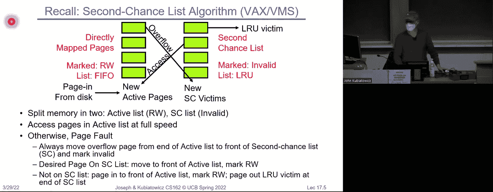

 Okay。 Okay， so we can take what I just showed you there。 Why is by the way why is the yellow called second chance。

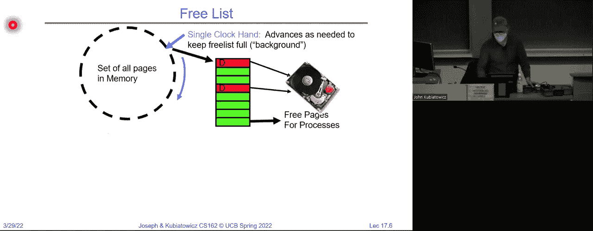

 Because we unmap it right and it's still in memory and it gets a second chance to come back and be used right。 So we can do the same idea， even if we have a clock hand。

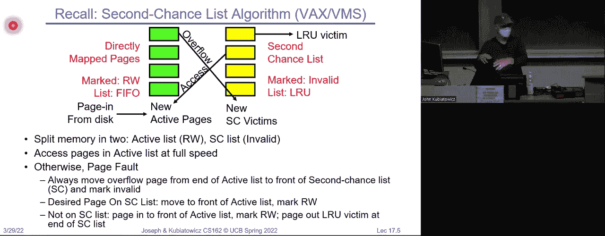

 So we could do the regular clock algorithm but rather than doing the clock algorithm for every page fault what we do is we do the clock algorithm algorithm periodically to put a bunch of pages in what we call a free list。 And that free list we're going to manage FIFO so that when we need a new page on a page fault there is a page right there to use。

 And why is that advantageous well， if we have dirty pages which are pages that have been written。 we can put them the clock algorithm could say well they're dirty but they haven't been used much so put it on the free list。 And then by since it's managed FIFO by the time it kind of gets to the head of that list。 the page out can have happened and it's no longer dirty it's clean。 Okay， and so this is a way。

 a different way to allow us to buffer up a set of free pages and allow us to do the dirty page cleaning kind of in the background so that by the time we really need a page it's ready。 Okay， and it's kind of like a second chance list because well if I ever actually try to access one of these pages and it's on the free list I just pull it back into the clock at that point because I don't have to go to disk。

 Okay， and what's great about this idea is we no longer have the clock algorithm in the critical path when we really need a page to do a page fault service。 We just grab a free page we start the disk and voila。 rather than having to run the clock algorithm right at that very moment。 All right， questions。 Good。 And by the way， there's lots of variations on all of these different things so we're giving you some ideas of kind of the idea of how things work but having a free list that buffers up the clock algorithm really helps get it out of the critical path。

 Okay。 Good。 So now。 There's some details。 Okay， so for instance， what do we do。 When our algorithm whatever it is clock second chance second clock with a free list whatever decides that we're going to kick a page out entirely。 What do we do。 Because when we evict a page frame we've decided to replace it。 It's possible that it's pointed at by a bunch of different page table entries。

 Process a process B they're both sharing a physical page they both have the page in their page tables。 So now when we want to kick that page out we got a reverse map to every page table that happens to have a pointer to it so we can unmap them。 Okay， that's called reverse page mapping。 And you could。 Trace through every page table linearly to find it。 That's obviously a bad idea right。

 Or you could have something which is often called a core map。 Which maps from a physical page to all of the places that it happens to reside all of the page tables so that when we want to kick it out of memory and unmap it at that point。 we can use this reverse page table to look it up。 Okay。 And it's got to be really fast because you got to hunt down all the page tables pointing at a given page frame at the time you're freeing。

 Because again that could be in the critical path of a page fault。 Okay。 and there's lots of options so for every page descriptor。 You keep a list of page table entries that point to it so if you go and you look。 I don't know in the Linux kernel for instance， you would see that every physical page or range of pages potentially has a little structure that describes it。

 And so what you're trying to do is。 Trace through all of those pages to find the ones。 And go from。 go from that entry to all of the page table entries that have it。 And that could be very expensive。 And so Linux kind of buffers up multiple of those by actually handing out ranges of pages at a time。 And we're not going to go in detail and that because if you think about it too much you see that that kind of goes against our no external fragmentation from paging thing that we started with paging because now we sort of give ranges of pages but。

 all right。 Questions。 All right。 So now let's deal with one last topic here so what we've been doing so far is talking about replacement。 And that's really how do we decide which physical page to get rid of if we need a new physical page because of paging activity。

 So how do we actually allocate memory among different processes so really the way this clock algorithm was described was kind of like there's one process in the whole world。 And it's paging right that was kind of the way it was described we didn't bother talking about the complexities of multiple processes。

 But if we have different ones。 What do we do like for instance we could say that every process gets the same fraction of memory or processes get different fractions of memory。 Or they all share one big pot of memory right there's lots of options here。

 And maybe some processes need to be completely swapped out of memory。 Okay so we may have to think about that。 But each process certainly needs a minimum number of pages in order to make progress if it's running。 And I can give you a really simple example。 Basically you want to make sure that every process it's fully loaded into memory can make forward progress。 Here's a simple example。 Just so that I give you something that's a little a little complex enough to be interesting。

 So for instance of the IBM 370。 And it turns out that the string move instruction needs six pages minimum in memory to make progress。 Why is that， because the instruction is six bytes。 And it might span two pages。 You need two pages to handle the from and two pages to handle the two。 So in order to restart the process that's running an SS move instruction。

 you actually have to make sure that all six of those pages are in memory so that it can run。 Okay so now risk processors like risk five that you're well familiar with are much simpler than that because there's like an instruction and the data is going to access that's like two pages。

 Okay， but certainly there's an issue of minimum that we have to worry about。 So we can have some replacement scopes here for instance we could talk about global replacement。 So when a process needs a page because it just page faulted。 we can imagine that every page frame is in one huge clock and we just grabbed the next one off the。

 block right that was kind of the way we've been talking about it。 But more control could be given by a local replacement policy where we say each process gets so many pages of the total fraction and we run each process has its own clock。 Okay， now why might we want to do this second one。 So go ahead。 Okay it's faster because you don't need to synchronize okay， although with the clock algorithm。

 you kind of bypass a lot of synchronization especially if you have a free list right so you're really just pulling something off of a free list。 So speed is a possibility here but there are other other reasons as well yeah。 More fair。 What do you mean by that， of course we don't know what fair means in this class right we。 don't know what it is。 So I like that answer so what it is is it's more fair。

 where fair means that one process can't just take a bunch of memory away from another one。 Okay。 And if you think about real time tasks， we did a little bit of discussion about real time。 then we might say we need a minimum number of pages to make sure that a process makes the right forward progress。 So we're going to give it some pages that nobody can take away from it。

 And if we do global replacement， then we have this issue that we might actually be having one process disturbing another one。 Okay， great。 So， and if you think about this a little bit if you think about what we did with scheduling we started with kind of round Robin。

 We eventually got to CFS right the completely fair scheduler。 where we were giving a fraction of the CPU to every process that was a lot kind of easier to think about fairness。 Overall because we're giving a flow rate of CPU cycles to each process。 This is a similar idea we're going to give a， you know。

 a well defined minimum number of pages to each process。 So。 in addition to global versus local we have some other options here for instance。 if we do local now what well we could give every process an equal amount of memory。 You know if there's a hundred total frames of memory five processes every gets everyone gets 20。

 Okay， or we could give some sort of proportional allocation。 So bigger processes get more memory。 Okay， so all I'm showing here with this equation is you take the total size of the process。 What fraction of that is of all of the processes sizes that's the fraction of memory they get。 Okay。 that one not complex once you kind of figure out what it's doing。

 but it's actually subtly bad can anybody tell me why this is not a good one。 It sounds good。 Yeah。 Yeah， so you could fill up your program with a bunch of libraries that aren't doing anything。 Okay。 and in fact you do that totally non maliciously every day when you link a big crypto library but you only use the ECC portion of that to sign things。 So that's not a huge part of your program。 And if what I'm doing to decide how many physical pages I get is based just on the size of my program then that's just。

 it has nothing to do with what I need and more to do with the sort of default size of the code right。 Okay， so another is I could do this by priority。 So I could have a proportional scheme using priorities rather than size。 You know， and so the behavior might be a process PI generates a page fault。 You still you select a frame from a lower priority process。

 And maybe that makes some sense if you want to do priorities， right。 So maybe we should do something adaptive。 But if we want to do something adaptive。 we have to have a way to figure out how much memory a process actually needs rather than kind of these static ideas here。 Anybody think of what we might do adaptively to decide how much memory a process needs。

 Predict the working set。 I like that。 That's possible。 Yeah。 How else might we do that。 So working set is a page size right。 How would we predict the working set。 I guess we have to define what working set means first right。 So let's get there。 Let's let's look at this。 What if we want to reduce capacity minutes。

 Misses by dynamically changing the number of pages。 So remember a capacity miss was one of those C's。 For cash misses and what it said was I'm getting page faults because I don't have enough memory allocated to me。 And so if I increase the amount of memory。 And I'm not using FIFO。 then I should be able to reduce the number of misses。 Right。 More memory less misses。

 Unless we have FIFO and then we get the ladies anomaly right。 So we could do this。 We could say look。 If we look at the number of frames we give each process。 If we give them a small number。 There'll be a lot of page faults。 If we give it a large number there'll be a lower number of page faults。

 We could imagine a threshold。 And what we really want to do is try to adjust。 So that processes are kind of in some range。 And if they're you know if they're missing way too much then they don't have enough memory and if they're missing。 Little at all then they probably have too much memory and we could try to adjust them on a page frames to try to get ourselves in that desirable range。 Okay and that'll kind of trade off nicely if you got a bunch of processes you kind of everybody gets into that page fault rate。

 Okay， not quite the working set yet but it's it gets there right it's kind of trying to reduce the cost here。 This is more like that effective access time equation we started with this lecture right。 Trying to reduce it。 Okay， so。 What if we just don't have enough memory。 Thrashing that's going to happen yes we'll talk about thrashing but let's talk about this from a high level what if we just don't have enough memory。

 We had a little bit of a at the end of the the whole discussion on scheduling we kind of said well what if you just don't have enough CPU cycles。 You buy a new machine right。 So the thing you should know is resource allocation policies are always trying to allocate a limited resource among a bunch of different consumers。

 And at some point you just don't have enough resource and you got to go for something bigger。 Okay。 so there is that's I know it's funny for me to say that but you got to keep that in mind always right at some point。 Your resource allocation just can't do the trick because you just don't have enough。 Okay。 so we'll go back to assuming we have enough for a moment。

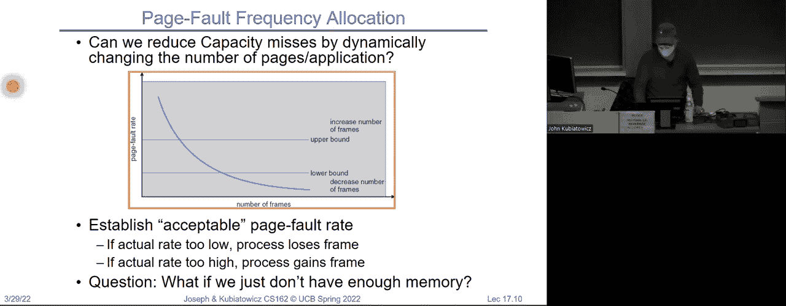

 But let's talk about thrashing so the interesting thing about thrashing is is this process it's something that happens when a process just doesn't have enough pages。 which leads actually to low CPU utilization。 And the operating system spending most of its time swapping to disk。

 So here we have an example where what we're going to do is， for instance。 we might add more and more threads to try to get a lot of computation going。 And for a while more threads give us more parallelism and everything's good but then we don't have enough pages and we don't have enough CPU and actually we drop off as we try to do more。 We just don't have enough for。 Okay， and so that thrashing range is kind of the point at which adding more parallelism of any sort or trying to do more work or whatever just doesn't work because we just don't have enough resource。

 And when you're in paging like we've been talking about。 Thrashing is that situation where you try to access something。 Or you pull it off of disk。 Meanwhile you try another process that process doesn't have enough so it pulls something in off of disk right and so you're always sleeping every process is sleeping waiting for something to come in off of disk。 It runs when the thing comes back， and then it immediately pages again。

 It's a page fault and you go to the next one and so nobody's making any progress all the operating system is doing is paging in things and paging out things and there's no actual computation happening。 Okay， that's thrashing。 All right， and so how do you detect thrashing。

 And how do you respond to thrashing so what's a good way to detect thrashing。 Sure。 you could see how many programs are waiting for disweight if they're all doing it it's probably bad right。 I'd also point this picture right so if you're everybody's up in that。

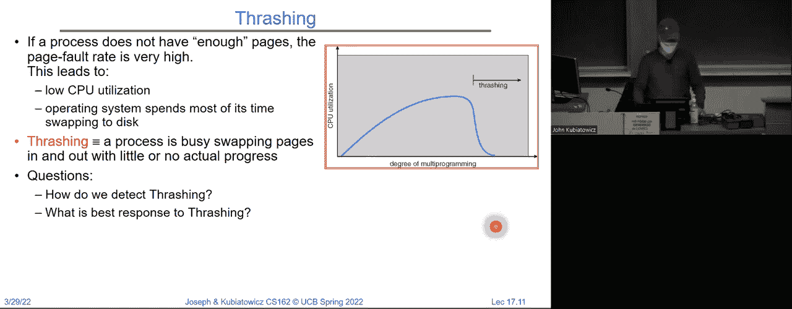

 High miss rate area then things are bad。 Right。 So， um。 thrashing is just not good so now what do we do。 So thrashing typically happens because you got too many processes that are all running simultaneously and trying to have a minimum amount of memory。

 And so perhaps， uh， if there's nothing better to do。 maybe it would make the whole system run better if we put a process completely out to disk swap it completely out of memory。 run the other ones for a while， and then pull it completely back into memory。 It sounds drastic。 but in fact that can speed the whole system up relative to trying to keep them all in memory and make some minimum amount of progress。

 Okay， so now we can talk a bit about。 This question of the。 the working set right so here I have a graph that has execution time along the x axis。 And the。 the y axis is actually。 Address number okay and so each one of these little gray things represents an access of that address at a given time flat。 Okay， everybody with me。 So a time whatever this is right here， if we look straight up。

 we see all of the addresses that are in use at that period of time。 And in fact。 if we were to look at a window。 At any give like a chunk of time and we could look at all of the addresses being accessed。 Those are all the addresses that we really need to have in memory in order for the thing to make progress right。 So we could think of this， so often it's going to be called the working set in a moment。

 But if we were to scan that window across the execution。 what we're seeing is at any given sort of range。 What is， what are the patterns that are in use。 or what are the addresses that are in use。 Okay， and so this is the working set。 And it's kind of the minimum number of pages for the process to behave well。

 And not enough memory for the working set basically leads to thrashing。 And so if we have too many processes and you add up all of their working sets。 Then。 And they don't fit in memory， you know you're going to get thrashing。 Okay。 and so here we can be a little more formal。 So here's a working set model。

 If we look at the page references and by the way these are just think of these as addresses。 Two。 six， one， five， seven， seven， five， one， so on。 The working set。 Basically says for any given time。 There's some delta representing history。 And if we look at all of the pages that were accessed in that delta that says that that's the working set so one。 two， five， six， seven here。 And in this case it's three and four。 Okay。

 and so the thing to notice about this is the working set does change over time。 Okay。 because programs go through different phases。 And when it changes。 there are different numbers of pages even in some cases。 So here the working sets only two pages before the working set was five。 Okay。

 And so this represents。 What's required to be in memory in order to make forward progress。 And so in this， at this timeframe here， this first delta。 If we had a lot of processes that all had a lot of pages， the atom all up。 That's this more than you got。 Whereas in this period of time it's possible that there's a lot of processes。

 each of which only need a few pages， you might not be thrashing。 So the total number of processes that are running that might be causing thrashing actually varies with time to this is a purely dynamical system。 Okay， and so really。 You know， the working sets basically a total set of pages referenced in the most recent delta whatever that is。 If delta is too small， it doesn't encompass the actual locality。

 So we want this to be big enough to kind of average out。 References that are happening。 If it's too large， you basically it's like the whole program and it's like， well， that's not useful。 It's just all the pages of program reference， but it doesn't really talk about any given period of time。 And clearly if delta goes toward infinity， then we're talking about every address accessed by the program。

 But if that program's running over a week or even an hour。 that's not very useful because it doesn't tell us anything about the sort of the time。 Full page fault rate at a given sort of range of time。 Okay。 and then if we take whatever the working set is a given time and we add it up across all the processes。

 that's the total number of physical pages we need。 To come and not be thrashing。 And the thrashing basically happens if D is greater than the amount of memory we've got。 Okay。 and I'm going to pause here for a second。 So this is not complicated math。 It's just。 We compute the working set for every process。 We add it all up。

 And if that total number of pages is bigger than the memory we've got。 we got problems and we're thrashing。 Okay， questions。 Good。 So this is really defining thrashing in some sense， right。

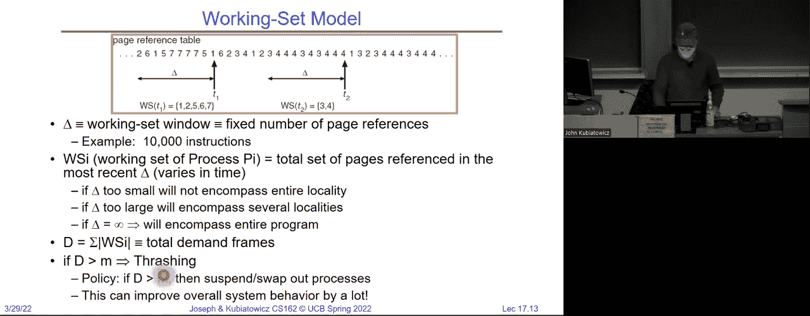

 So， here's a。 So somebody's asking here so thrashing can still happen even if there's no context switch。

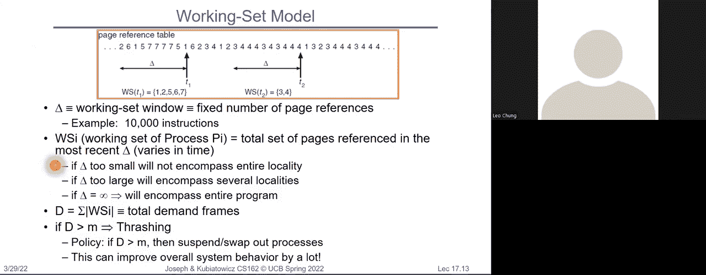

 Well， when thrashing's happening， all you're doing is context switching。 because what's happening is you， you have to go out to disk and while the page is being pulled on for disk。 you're switching to another process。 So， rather than what said here in the chat。 I would say thrashing is a situation where the only thing you're doing is context switching。 Okay。

 it's the opposite。 Now， what about compulsory misses。 So if you think about compulsory misses are misses that occur the first time the pages seen。 Pages that are touched for the first time， or if we swap the whole process out for thrashing reasons and we bring it back in those can also be called compulsory misses。 And it turns out there's a couple of ways that operating systems deal with those。

 One is this idea of clustering， which is when you get a page fault on one page。 You get multiple pages around that page。 Okay。 What do we call that in caching。 Spatial locality。 very good。 So， and as we're going to learn next time when we talk about discs。 especially for spinning storage， the efficiency of the disc reads increases tremendously if you read a bunch of stuff at the same time that's in a row。

 Okay， if we grab a bunch of pages off of a single track。 That's going to be much more efficient than grabbing one page at a time。 And so this idea of clustering， when we get one miss we grab a bunch of them is actually a really good way of both being efficient at your page in and handling compulsory misses assuming there's some spatial locality。 Okay。 Now， the other thing that's kind of interesting it was it's been done in a couple of operating systems is if you actually have something tracking the working set of a process。

 So there's some page structure that says well where this process is right now the working set has these pages。 Then whenever the process goes to sleep and comes back。 you can go ahead and prefetch the working set to make sure that it doesn't page fault right away。 Right。 So this is kind of an interesting predictor it's sort of if I looked at what was the。

 what was the working set just before I put it to sleep or swapped it out to disk。 The moment I bring it back， I make sure all of those pages get prefetched in and now I'm unlikely to page fault right away because I have the working set in memory。 Okay。 Questions。 All right。 Good。 I think we're going to mostly leave paging here。 I did want to say something about the the midterm。 We finished it before spring break。

 I think if you have any questions about regrade requests they're due tomorrow so make sure you get them in。 There is a question stream on Piazza for the midterm。 During spring break I was answering a bunch of questions there's a few that are adding up there and we'll get back to it。 But anyway， our mean was about the same as the last one so we didn't end up with a much easier exam。

 I guess that fifth question ended up being a little long for people。 There's a very long so Sean。 Our head to basically put an answer on Piazza that took you through every。 Access of that fifth problem so if you want to look at it in long detail as to what you could do。 You can take a look at it。 Don't be don't be scared off by the amount of text。

 He tried to sort of he was very verbose。 Try to make sure it was clear to everybody。 Project two is too Saturday。 I'm sure you're aware of that so perhaps I won't belabor it。 Project three last project coming up April third。 So notice that neither of these are April first so these are not April Fool's jokes but they are due。 It's hard to believe that we're two thirds of the way through the class already。

 I guess I'm not used to co teaching so I guess it seems like it's been a while since I've stood up here but。 Anyway。 Don't forget don't forget to do your reread requests。 So I did want to do something else though from a bit of trivia so。 You guys are the crema the creme de la creme of。 CS and need to know your units。

 Okay we assume that you know units。 So for instance。 There were some people that actually asked on asked on the midterm you know how many microseconds are in the millisecond or something。 We assume you know that。 Okay so if you don't know that it wouldn't hurt to look this through okay。 Because I expected basic engineering。 Folks will know these things okay so here are ones that would be particularly helpful millisecond microsecond nanosecond picosecond。

 I will assume that you know that a minute is 60 seconds in an hour is 3600 seconds。 But。 So these are good things to know。 There's some others that are good to know so。 And this is going to come up in the lectures we're going to talk about next time and on。 Typically a bit is a little be and a bite is a big be okay so keep that in mind。 And a W。 Is a。

 Depends。 Okay so W stands for word。 And normally。 I would say that a word represents the number of bits for an integer that's native on a processor。 So 32 bit processor a word is 32 bits。 Unfortunately。 Took over the world。 And because of the 80 86 where a W was 16 bits。 If you're specifically dealing with an Intel processor W is 16 bits and a double word。 Is actually 32 bits。 All right I do not endorse that craziness I'm just telling you。

 Okay so what this really means is if somebody if there's a W involved。 Ask if we're not clear okay because。 And for x86 a W really is 16 bits I hate it because I always forget it every time。 You know as a computer architect over the years W always to me met the native integer size of a processor。 But Intel it isn't so。 All right。 Here's some other ones that are fun okay now this is a little tricky。

 Because。 If you're dealing with memory。 Then killo。 Actually means a thousand 24 bytes。 Okay now I think in 61 B they call that a kibby。 Okay it sounds like something the feed your cat right a kibby bite。 But。 Unfortunately in the real world a kilobyte kby。 Is the same as a kibby bite if you're dealing with memory。 Okay but anyway。

 So as you can see here like a megabyte or a maybe is a thousand 24 squared which is two to the 20th。 Okay etc。 Ones that are this so this part you may not have really realized so a kilobyte or a tibby is two to the 10th。 Megabyte or a maybe is two to the 20th a gigabyte or a gibi is two to the 30th etc。 My favorites are kind of on the higher end like a tibby is to the 40th petabyte is a two to the 50th and a an exabyte is two to the 60th。

 Okay is anybody know what's next。 It's a it's a yada。 Anyway。 these are if you know these guys this is good okay so。 When you're dealing with pretty much everything but other than memory。 We use the powers of 10 so these are powers of two these are powers of 10。 You see the difference。

 Okay so when we talk about disk bandwidth or network bandwidth we're going to be and we talk about a gigabyte。 It's going to be 10 to the ninth bites。 Not you know not two to the 30th bites。 All right again。 I didn't invent this craziness this is just the way it goes all right and actually disk manufacturers。 Like to say they give you you know 100 gigabytes of something。

 And it's going to be down in this it's going to be 10 to the ninth bites not。 You know 1。1 times 10 to the nine so look at your specs。 Now none of it this is not too much of a difference but you should know and it certainly could come up in an exam to know。

 And really。 I try to be careful and maybe give you the kibby notation but I wanted to put this down。 Just so you know that this only shows up in pretty much 61 B and maybe core or some of those other questions sites but not necessarily in the real world so。

 You just got a deal。 Say it again。 The world is a strange and wonderful place。 You know the thing about DRAM is you know it's kind of explicitly power of two because the addresses are you know。 Bits and its powers of two pretty much everything else in the world is you know powers of 10 because we have 10 figures。 Why is it that memory is the only one that tends to be in the kibby's I don't know or the maybe or the gibby's。

 It's just the the rule of the world。 And some manufacturers actually even have tried to be。 And they're full so sometimes you actually see this。 G。I。B。 notation。 Most of the time you don't but I thought I'd point this out to you one。 So that you know to look for it in exams maybe but to you actually if you're looking at specs for anything just look。

 And and sometimes people like to say that this because the disk manufacturers do these。 Powers of 10 instead of the powers of two they're cheating there。 You know the people that they're buying from them。 I don't know that that's true it's just this is good again it's the way the world is so just watch for it。

 But I do expect that you guys have some notion of most of these。 Okay you could put you could put some of the common ones on a cheat sheet or something if you need to。 All right。 Who units。 We don't talk about Bruno。 Oh wait we talked about units okay now。 I guess we don't talk about Bruno hasn't been a thing here at Berkeley。

 Should all you should all see in console I guess I with my with my 10 year old I get to see a lot more animated stuff。 Okay。 Let's let's move on。 So I'd like to start moving in toward。 I hope and we'll talk about discs and file system so that's kind of the next major topic。 I did want to finish up one thing here though。 So memory management and Unix excuse me Linux is a lot more complex than the examples we've been giving so far。

 So in Linux for instance there are a bunch of memory zones。 So there's the zone DMA。 Which is physical memory less than 16 megabytes。 There's the zone normal。 Which is kind of between 16 megabytes and 896 megabytes and then there's the high memory which is everything else。 Where did this come from well everything comes from history。 And so historically。

 You had 32 bit processors or 16 bit processors。 And this was a lot of memory and so this normal zone was kind of what you had。 And now of course nobody buys a machine that has less than you know 4 8 terabytes of memory on it right so this this memory map is already way outdated but it's still functional。

 Okay， and in particular in the old days if you did DMA and we'll talk more about that maybe at the end of the lecture if we get there but certainly next time。 You could only do it cleanly if you're in the lower 16 megabytes of physical memory。 And that was that was sort of a restriction for the old DMA engines。 Okay。 And so。 you know that was DMA able on the Iza box， believe it or not from the old IBM PC。 Okay。

 but we still have this these constants appear in Linux if you take a look for them。 So every zone has its own free list and to our you list which are kind of in a clock。 Okay。 the act in the inactive so you thought it was complicated to have。 One clock or multiple clocks well every zone has its own two clocks that get swapped。 Okay。

 Many different types of allocation in the kernel okay there's slab allocators which allocate big chunks of pages。 There are per page allocators。 There are the ability to do mapped and unmapped allocation lots of interesting things there many different types of allocated memory。

 So when you do when you do allocation of memory， you can get what's called anonymous memory。 which is basically like keep and stack that's not necessarily backed by a file。 Or you can memory map files into memory and access the files like you're reading virtual memory will do we'll talk about that next time。 Okay。 So lots of different types of memory and we'll also talk about the slab allocated a little bit。

 I think next time or one of the next times。 And then of course his allocation priorities and so on。

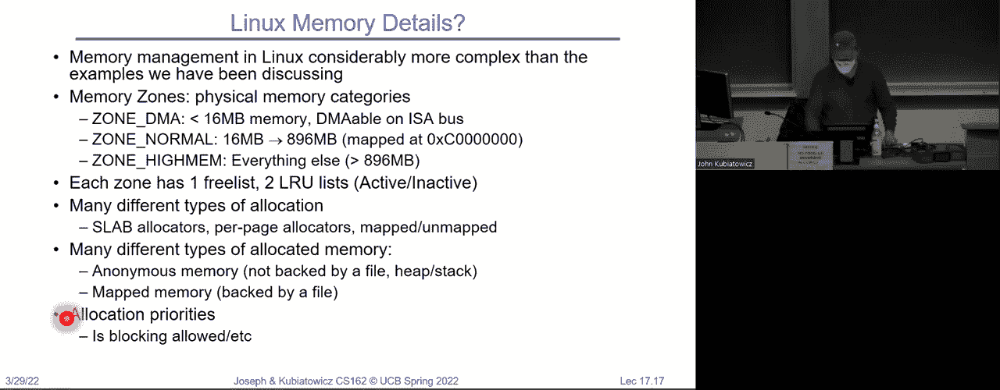

 One thing that's kind of interesting is pre meltdown。 Okay。 This was the typical memory map and you've already seen this but I thought I would make this clear so I'm 32 bit virtual space。 Everything from zero up to zero X C was kind of user addresses。 And then zero X C up to FFFF was kind of kernel addresses。 And that's just the way it was allocated。

 Okay。 And what does that need remember in our page table entry there's the little user bit。 And then it's just DTE。 And meant that any addresses up here。 Had that user bit equal to zero because they were for kernel only。 If you go to 32 or go from 32 to 64 bits。 Then it's much bigger。 Okay， 64 bits is just big。 Okay。

 and so really what the processors do is。 And then we're going to do this。 And then we're going to do this。 And then we're going to do this。 And then we're going to do this。 And then we're going to do this。 And then we're going to do this。 And then we're going to do this。 And then we're going to do this。 And then we're going to do this。 And then we're going to do this。

 And then we're going to do this。 And then we're going to do this。 And then we're going to do this。 And then we're going to do this。 And then we're going to do this。 And then we're going to do this。 And then we're going to do this。 And then we're going to do this。 And then we're going to do this。 And then we're going to do this。 And then we're going to do this。 And then we're going to do this。

 And then we're going to do this。 And then we're going to do this。 And then we're going to do this。 And then we're going to do this。 And then we're going to do this。 And then we're going to do this。 And then we're going to do this。 And then we're going to do this。 And then we're going to do this。 And then we're going to do this。 And then we're going to do this。 And then we're going to do this。

 And then we're going to do this。 And then we're going to do this。 And then we're going to do this。 And then we're going to do this。 And then we're going to do this。 And then we're going to do this。 And then we're going to do this。 And then we're going to do this。 And then we're going to do this。 And then we're going to do this。 And then we're going to do this。 And then we're going to do this。

 And then we're going to do this。 And then we're going to do this。 And then we're going to do this。 And then we're going to do this。 And then we're going to do this。 And then we're going to do this。 And then we're going to do this。 And then we're going to do this。 And then we're going to do this。 And then we're going to do this。 And then we're going to do this。 And then we're going to do this。

 And then we're going to do this。 And then we're going to do this。 And then we're going to do this。 And then we're going to do this。 And then we're going to do this。 And then we're going to do this。 And then we're going to do this。 And then we're going to do this。 And then we're going to do this。 And then we're going to do this。 And then we're going to do this。 And then we're going to do this。

 And then we're going to do this。 And then we're going to do this。 And then we're going to do this。 And then we're going to do this。

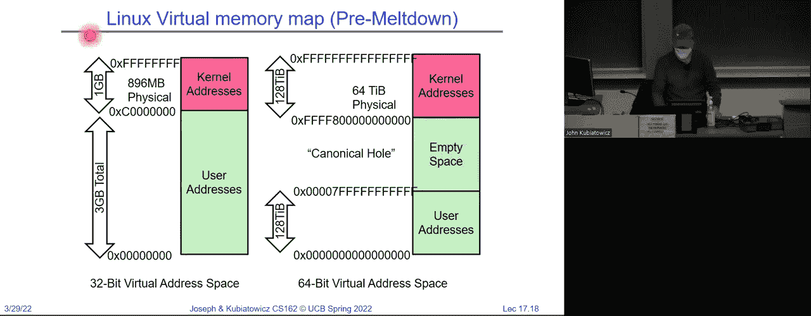

 And then we're going to do this。 And then we're going to do this。 And then we're going to do this。 And then we're going to do this。

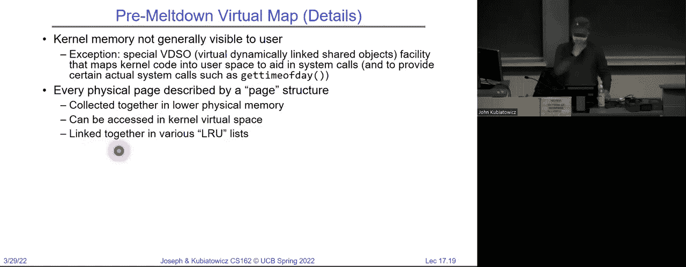

 And then we're going to do this。 And then we're going to do this。 And then we're going to do this。 And then we're going to do this。 And then we're going to do this。 And then we're going to do this。 And then we're going to do this。 And then we're going to do this。 And then we're going to do this。 And then we're going to do this。 And then we're going to do this。 And then we're going to do this。

 And then we're going to do this。 And then we're going to do this。 And then we're going to do this。 And then we're going to do this。 And then we're going to do this。 And then we're going to do this。 And then we're going to do this。 And then we're going to do this。 And then we're going to do this。 And then we're going to do this。 And then we're going to do this。 And then we're going to do this。

 And then we're going to do this。 And then we're going to do this。 And then we're going to do this。 And then we're going to do this。 And then we're going to do this。 And then we're going to do this。 And then we're going to do this。 And then we're going to do this。 And then we're going to do this。 And then we're going to do this。

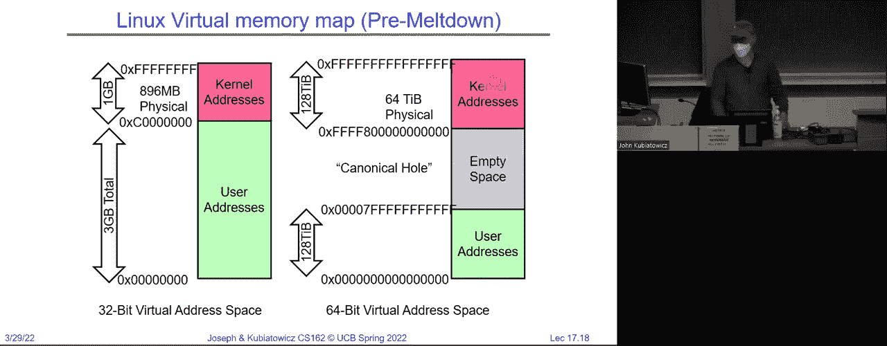

 And then we're going to do this。 And then we're going to do this。 And then we're going to do this。 And then we're going to do this。 And then we're going to do this。 And then we're going to do this。 And then we're going to do this。 And then we're going to do this。 And then we're going to do this。 And then we're going to do this。 And then we're going to do this。 And then we're going to do this。

 And then we're going to do this。 And then we're going to do this。 And then we're going to do this。 And then we're going to do this。 And then we're going to do this。 And then we're going to do this。 And then we're going to do this。 And then we're going to do this。 And then we're going to do this。 And then we're going to do this。 And then we're going to do this。 And then we're going to do this。

 And then we're going to do this。 And then we're going to do this。 And then we're going to do this。 And then we're going to do this。 And then we're going to do this。 And then we're going to do this。 And then we're going to do this。 And then we're going to do this。 And then we're going to do this。

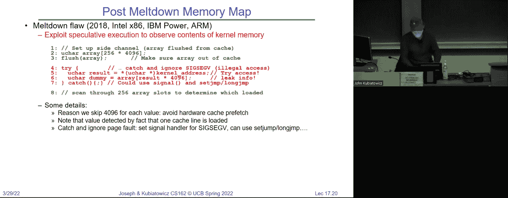

 And then we're going to do this。 And then we're going to do this。 And then we're going to do this。 And then we're going to do this。 And then we're going to do this。 And then we're going to do this。 And then we're going to do this。 And then we're going to do this。 And then we're going to do this。 And then we're going to do this。 And then we're going to do this。 And then we're going to do this。

 And then we're going to do this。 And then we're going to do this。 And then we're going to do this。 And then we're going to do this。 And then we're going to do this。 And then we're going to do this。 And then we're going to do this。 And then we're going to do this。 And then we're going to do this。 And then we're going to do this。 And then we're going to do this。 And then we're going to do this。

 And then we're going to do this。 And then we're going to do this。 And then we're going to do this。 And then we're going to do this。 And then we're going to do this。 And then we're going to do this。 And then we're going to do this。 And then we're going to do this。 And then we're going to do this。

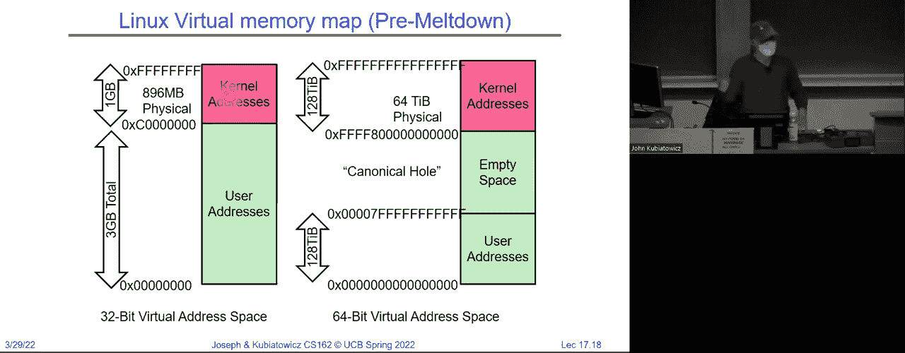

 And then we're going to do this。 And then we're going to do this。 And then we're going to do this。 And then we're going to do this。 And then we're going to do this。 And then we're going to do this。 And then we're going to do this。 And then we're going to do this。 And then we're going to do this。 And then we're going to do this。 And then we're going to do this。 And then we're going to do this。

 And then we're going to do this。 And then we're going to do this。 And then we're going to do this。 And then we're going to do this。 And then we're going to do this。 And then we're going to do this。 And then we're going to do this。 And then we're going to do this。 And then we're going to do this。 And then we're going to do this。 And then we're going to do this。 And then we're going to do this。

 And then we're going to do this。 And then we're going to do this。 And then we're going to do this。 And then we're going to do this。 And then we're going to do this。 And then we're going to do this。 And then we're going to do this。 And then we're going to do this。 And then we're going to do this。 And then we're going to do this。 And then we're going to do this。 And then we're going to do this。

 And then we're going to do this。 And then we're going to do this。 And then we're going to do this。 And then we're going to do this。 And then we're going to do this。 And then we're going to do this。 And then we're going to do this。 And then we're going to do this。 And then we're going to do this。 And then we're going to do this。 And then we're going to do this。 And then we're going to do this。

 And then we're going to do this。 And then we're going to do this。 And then we're going to do this。 And then we're going to do this。 And then we're going to do this。 And then we're going to do this。 And then we're going to do this。 And then we're going to do this。 And then we're going to do this。 And then we're going to do this。 And then we're going to do this。 And then we're going to do this。

 And then we're going to do this。 And then we're going to do this。 And then we're going to do this。 And then we're going to do this。 And then we're going to do this。 And then we're going to do this。 And then we're going to do this。 And then we're going to do this。 And then we're going to do this。 And then we're going to do this。 And then we're going to do this。 And then we're going to do this。

 And then we're going to do this。 And then we're going to do this。 And then we're going to do this。 And then we're going to do this。 And then we're going to do this。 And then we're going to do this。 And then we're going to do this。 And then we're going to do this。 And then we're going to do this。 And then we're going to do this。 And then we're going to do this。 And then we're going to do this。

 And then we're going to do this。 And then we're going to do this。 And then we're going to do this。 And then we're going to do this。 And then we're going to do this。 And then we're going to do this。 And then we're going to do this。 And then we're going to do this。 And then we're going to do this。 And then we're going to do this。 And then we're going to do this。 And then we're going to do this。

 And then we're going to do this。 And then we're going to do this。 And then we're going to do this。 And then we're going to do this。 And then we're going to do this。 And then we're going to do this。 And then we're going to do this。 And then we're going to do this。 And then we're going to do this。 And then we're going to do this。 And then we're going to do this。 And then we're going to do this。

 And then we're going to do this。 And then we're going to do this。 And then we're going to do this。 And then we're going to do this。 And then we're going to do this。 And then we're going to do this。 And then we're going to do this。 And then we're going to do this。 And then we're going to do this。 And then we're going to do this。 And then we're going to do this。 And then we're going to do this。

 And then we're going to do this。 And then we're going to do this。 And then we're going to do this。 And then we're going to do this。 And then we're going to do this。 And then we're going to do this。 And then we're going to do this。 And then we're going to do this。 And then we're going to do this。 And then we're going to do this。 And then we're going to do this。 And then we're going to do this。

 And then we're going to do this。 And then we're going to do this。 And then we're going to do this。 And then we're going to do this。 And then we're going to do this。 And then we're going to do this。 And then we're going to do this。 And then we're going to do this。 And then we're going to do this。 And then we're going to do this。 And then we're going to do this。 And then we're going to do this。

 And then we're going to do this。 And then we're going to do this。 And then we're going to do this。 And then we're going to do this。 And then we're going to do this。 And then we're going to do this。 And then we're going to do this。 And then we're going to do this。 And then we're going to do this。 And then we're going to do this。 And then we're going to do this。 And then we're going to do this。

 And then we're going to do this。 And then we're going to do this。 And then we're going to do this。 And then we're going to do this。 And then we're going to do this。 And then we're going to do this。 And then we're going to do this。 And then we're going to do this。 And then we're going to do this。 And then we're going to do this。 And then we're going to do this。 And then we're going to do this。

 And then we're going to do this。 And then we're going to do this。 And then we're going to do this。 And then we're going to do this。 And then we're going to do this。 And then we're going to do this。 And then we're going to do this。 And then we're going to do this。 And then we're going to do this。 And then we're going to do this。 And then we're going to do this。 And then we're going to do this。

 And then we're going to do this。 And then we're going to do this。 And then we're going to do this。 And then we're going to do this。 And then we're going to do this。 And then we're going to do this。 And then we're going to do this。 And then we're going to do this。 And then we're going to do this。 And then we're going to do this。 And then we're going to do this。 And then we're going to do this。

 And then we're going to do this。 And then we're going to do this。 And then we're going to do this。 And then we're going to do this。 And then we're going to do this。 And then we're going to do this。 And then we're going to do this。 And then we're going to do this。 And then we're going to do this。 And then we're going to do this。 And then we're going to do this。 And then we're going to do this。

 And then we're going to do this。 And then we're going to do this。 And then we're going to do this。 And then we're going to do this。 And then we're going to do this。 And then we're going to do this。 And then we're going to do this。 And then we're going to do this。 And then we're going to do this。 And then we're going to do this。 And then we're going to do this。 And then we're going to do this。

 And then we're going to do this。 And then we're going to do this。 And then we're going to do this。 And then we're going to do this。 And then we're going to do this。 And then we're going to do this。 And then we're going to do this。 And then we're going to do this。 And then we're going to do this。 And then we're going to do this。 And then we're going to do this。 And then we're going to do this。

 And then we're going to do this。 And then we're going to do this。 And then we're going to do this。 And then we're going to do this。 And then we're going to do this。 And then we're going to do this。

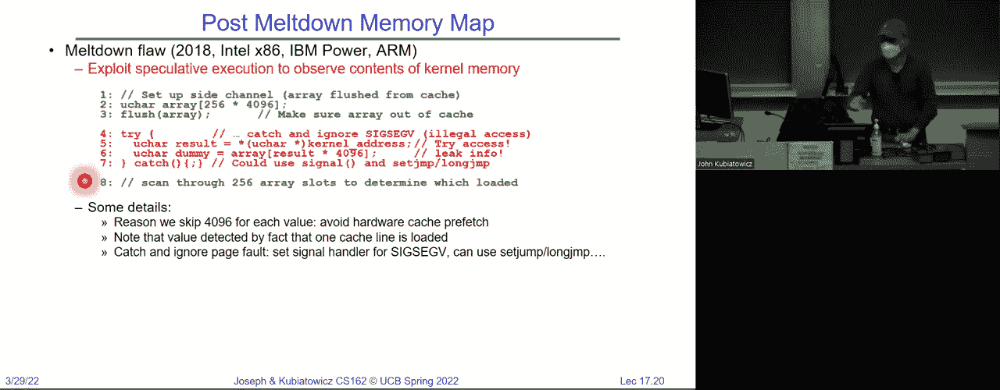

 And then we're going to do this。 And then we're going to do this。 And then we're going to do this。 And then we're going to do this。 And then we're going to do this。 And then we're going to do this。 And then we're going to do this。 And then we're going to do this。 And then we're going to do this。 And then we're going to do this。 And then we're going to do this。 And then we're going to do this。

 And then we're going to do this。 And then we're going to do this。 And then we're going to do this。 And then we're going to do this。 And then we're going to do this。 And then we're going to do this。 And then we're going to do this。 And then we're going to do this。 And then we're going to do this。 And then we're going to do this。 And then we're going to do this。 And then we're going to do this。

 And then we're going to do this。 And then we're going to do this。 And then we're going to do this。 And then we're going to do this。 And then we're going to do this。 And then we're going to do this。 And then we're going to do this。 And then we're going to do this。 And then we're going to do this。 And then we're going to do this。 And then we're going to do this。 And then we're going to do this。

 And then we're going to do this。 And then we're going to do this。 And then we're going to do this。 And then we're going to do this。 And then we're going to do this。 And then we're going to do this。 And then we're going to do this。 And then we're going to do this。 And then we're going to do this。 And then we're going to do this。 And then we're going to do this。 And then we're going to do this。

 And then we're going to do this。 And then we're going to do this。 And then we're going to do this。 And then we're going to do this。 And then we're going to do this。 And then we're going to do this。 And then we're going to do this。 And then we're going to do this。 And then we're going to do this。 And then we're going to do this。 And then we're going to do this。 And then we're going to do this。

 And then we're going to do this。 And then we're going to do this。 And then we're going to do this。 And then we're going to do this。 And then we're going to do this。 And then we're going to do this。 And then we're going to do this。 And then we're going to do this。 And then we're going to do this。 And then we're going to do this。 And then we're going to do this。 And then we're going to do this。

 And then we're going to do this。 And then we're going to do this。 And then we're going to do this。 And then we're going to do this。 And then we're going to do this。 And then we're going to do this。 And then we're going to do this。 And then we're going to do this。 And then we're going to do this。 And then we're going to do this。 And then we're going to do this。 And then we're going to do this。

 Okay。 Let's very quickly get moving on IO now。 Sorry。 This is run a little long today。 but maybe we can just work through this。 And I'll give you a break。 I promise next time。 So if you were to look at the Hennissi Patterson book on computer， architecture。 it talks about the five components of a computer。 And there's a bunch of stuff inside the inside the processor。

 You know， there's a data path and there's the pipeline and all of that stuff。 Which is great and fun to do。 And I'm a computer architect myself。 So I think that's really fascinating。 But if you only have a processor with no IO。 you've got a disembodied， brain that really isn't interesting。 Okay。 It's a， it's a heating element。

 All right。 So really what's interesting about processors today is their IO。 And so that's why we。 we have to have some interesting discussions。

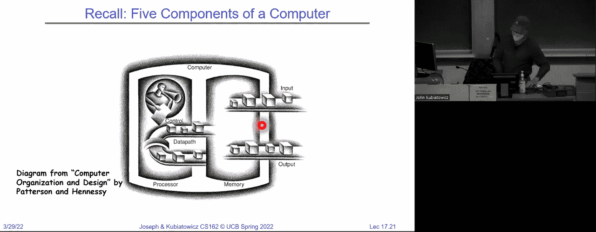

 about how you do IO。 So how do you do IO？ Well， so far in 162 we've started all sorts of abstractions。 API is provided by OS applications。 We talked about synchronization and scheduling。 But we haven't talked about IO。 Okay。 And that was intentional。 But without IO computers are useless。 Okay。 So really。 The most interesting and intricate part of。

 The most interesting part of the project is how do we do IO？

 And more complex is there's thousands and thousands of different。 types of devices and they're all operating at different speeds。 And the question is kind of how do you make it all work together？ You know。 how do we standardize interfaces？ Devices are unreliable。 We get media failures。

 We get transmission errors。 How do we deal？ How do we make them reliable？

 Devices are unpredictable or slow。 How can we manage them if we don't know what they'll do or when？

 So what's interesting about this is if you remember at the beginning of class of the term。 we talked about kind of this virtual machine abstraction idea where what we were going to do was we were going to give a virtual abstraction to the programmer that made it look like they had all an infinite amount of memory that all the devices were perfect。

 And so therefore they didn't have to program worrying about all of those messy physical details。 Okay， that was kind of a that was a meme at the beginning， right？

 And so here we're not coming back to that and saying， well， look at all of these devices out there。 They have all of these failings and limitations and what we need to do now is figure out how to come up with a very clean virtual API。 That's going to actually allow us to make it easy to program。 Okay， and that's going to be our goal。 How do we virtualize these systems in an interesting way。 And if you think about IO。

 it's got a whole bunch of possibilities here right there's networking。 There's disk IO for storage。 There's SSDs。 There's keyboards。 There's mice。 There's speakers。 There's all of this stuff。 And so obviously we can't cover all IO， but we're going to talk about how does an operating system give you a virtualized view of the IO。

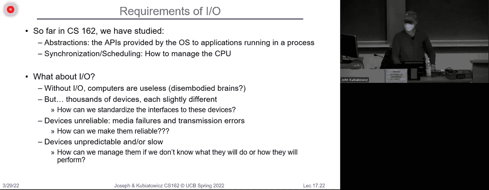

 Okay。 And so if you remember， when we had our IO basics here。 we sort of had this protection boundary， where all the IO was buried underneath that protection boundary。 And， for instance， starting something up， we have to pull data off of storage into memory。 We might do some IO and the processor is running code that has a virtual abstraction that somehow makes the storage and networking devices look ideal。

 Okay。 And so the OS here this red boundary provides common IO services in the form of IO。 And really we had this range of timing scales， which is appropriate given what we talked about earlier。 which is if you look at the time for a cash L one cash access might be point a half a nanosecond or smaller picoseconds now。 Versus sending a packet from California to the Netherlands and back， you know。

 might be 150 milliseconds。 See how quickly I did that computation there， right。 So， um。 we've got a deal with all of these scales in the same IO subsystem。 So， you know。 here's an example it's a very old one， but for instance the device transfer rates for the sun enterprise 6000。 I just put this up because I thought it was kind of interesting right。

 Basically the devices vary by 12 orders of magnitude in performance。 12 orders of magnitude。 So whatever subsystems we come up with， they got to deal with 12 orders of magnitude difference in performance。 Okay。

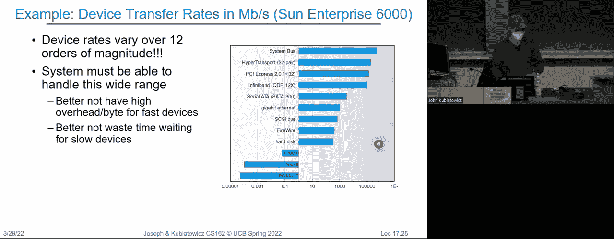

 So， you know， another picture here is IO devices you recognize are supported by IO controllers。 Okay。 And so those IO controllers are going to control devices and the OS is going to talk to the IO controllers。 And so we're going to have to talk about how processes read and write。 And do access to the IO through IO controllers。 And the IO controllers are going to be the centralized thing that helps us build our interfaces here。

 Okay。

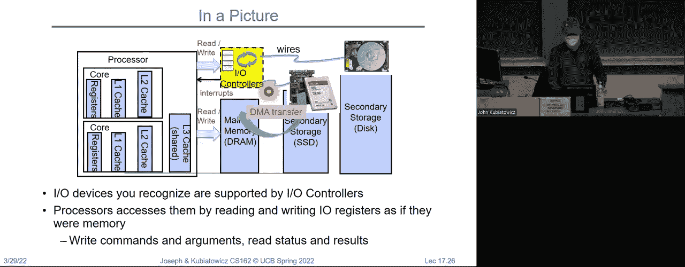

 So， here's an example of kind of a modern system where there's a processor。 And that's the thing with the big fan on it because it's hot。 but then it might have a bridge to PCI buses。 And there might be an IO card to SCSI buses that talk to discs。 There might be expansion buses to other things that might have parallel ports they might have serial ports。

 There's a network networking cards that are connected and do really high performance。 And so。 you know， the graphics controllers all of these stuff is all connected via this web of buses and somehow has to be controlled by that one processor。 So there's， there's a lot of interesting things here complex right。 How many of you have opened up one of your desktop or your laptop and looked inside。

 How many people have done that。 Any of you。 The processor is a big thing right but there's a lot of stuff。 Right。 The other stuff is all of this right and so we want to try to get a handle on that。

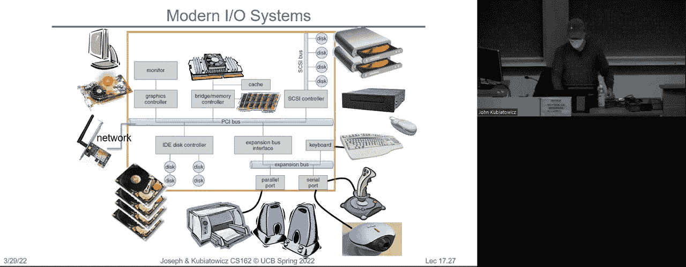

 It's interesting。 Okay。 And by the way， this is， I still highly recommend 152 great class。 That'll tell you what's inside the processor。 So I used to teach it as well。 So what's a bus。 So。 you know， here I have a bunch of things with buses on it the word bus。 So what is a bus。 So it's a common set of wires for communicating among devices with protocols attached。 Okay。

 so a bus typically has some lines for data。 It's got some lines for addresses。 It's got some lines for control。 Okay， and the protocols involved things like well if there's a request or that says。 Hey， I need some data for a given address。 It goes out over the bus。 There's a responder that says。 Hey， I'm good。 Here's your data and you get the data back。 Okay。

 so that's it's simple idea because you have a set of common wires and you plug a bunch of stuff into it and now they're all connected。 Okay。 And you get very high bandwidth close to processors and low bandwidth as you get further away from them。 Okay。 So why do you do a bus。 Well， buses let you connect all sorts of things together with a very simple set of wires。 So upside of a bus is it's extremely flexible。 Okay， because you order in squared communication。

 The downside is you can only do one thing on a bus at a time。 Can't imagine a big。 I don't imagine a zoom call with 100 people。 Okay。 you can have 100 squared conversations going on just not at once。 Right， so that's。 that's a downside and the other downside is physical， which is the more things you commit。

 you connect to the same set of wires。 The more capacitance there is and the slower everything runs。 So buses are by their very nature， they get slower as you add things to them just physically。 Okay。 so buses are great。 They look like this you've all seen the idea of you plug a big card in。

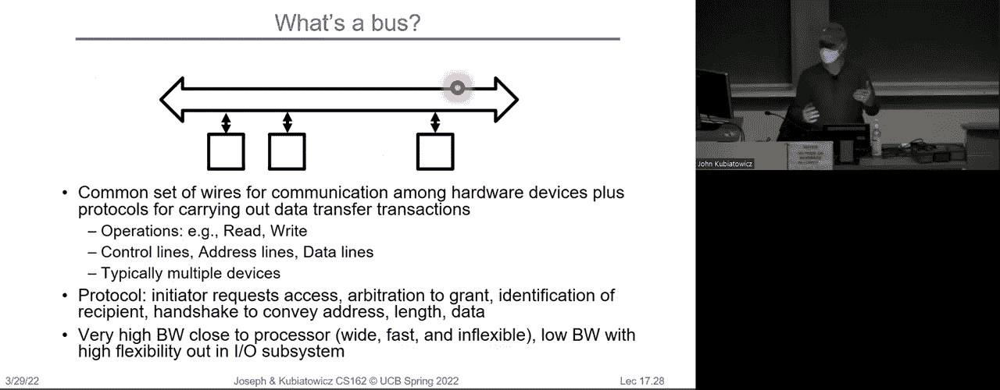

 Right， and there's what's happening on these boards underneath is all of you know this wires connected that one this is connected。 you know， they're parallel connections， and you get a lot of devices in there at once。 Okay。 great for flexibility not so good because the speed is bounded both by that capacitance and by the slowest device。 So if you have a very slow device to respond， even the fastest things that try to communicate have to wait for that slow one to say okay go ahead。

 Okay， and so buses by themselves are not going to help us with our 12 orders of magnitude in communication。 Okay， so we need to do something else and there's a hint here I think。 We have buses that are close to the processor are really short， and here。 and then we have a bunch of gateways the longer buses and gateways the longer buses by building a hierarchy of communication we can push the slow stuff out。

 and the fast stuff close， and maybe we can handle that 12 orders of magnitude。 Okay。 and so this is the this is what you're going to see as we start talking more about this so for instance。 PCI。

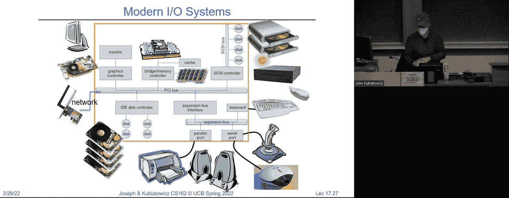

 This is an old bus right this is not as old as the eyes of us but this one was around 2000 easily。 Okay。 Not fast enough， and instead what happened was things like the PCI express bus。 where it was no longer a parallel bus but instead it was really a collection of really fast serial channels。 So you might have 100 things in each of them had a point to point connection to get really fast communication but there was no actual bus。

 Okay， and all the communication was serial。 And there was a way to basically decide how many of these serial channels you needed for bandwidth and slow devices don't have to get in the way of fast devices etc。 And one of the successes of the kind of abstraction we're going to talk about as we start getting into the IO subsystem for Linux was they could go from the parallel old school PCI bus to the PCI express bus by just changing some device drivers a little bit and it wasn't a big deal most of the operating system didn't have to know the difference。

 Everything just got faster。 Okay， that's our goal。 Can we get abstraction and hierarchy in the system to give us a way of dealing with this 12 orders of magnitude of different speeds of devices。 Okay。

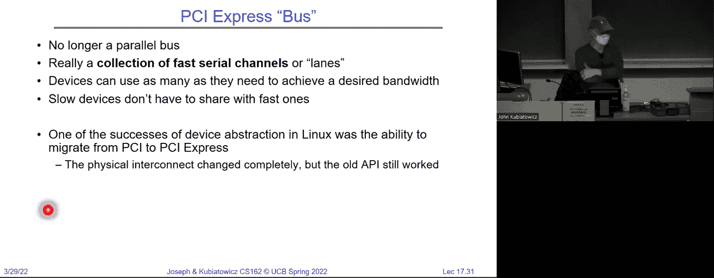

 So here is an example of a typical PCI architecture this is a much more modern system。 You got a CPU with a host bridge to one PCI bus， which has host bridges to other PCI buses and eventually you get to USB which is the universal serial bus。 And it has a hierarchy of communication and then SATA is the typical disk controllers etc。 Okay。 Now， how does the processor talk to the device。 So I want to do a couple more things here before we end for the day。

 But let's give you an example of what I mean by communication because I think right now you're all saying well it makes sense I guess that the CPU talks to the disk but what does that really mean。 Okay， so let's get a little bit more down in the weeds just for a few minutes。

 So here's a CPU and there's a processor memory bus to talk to memory。 Now what that really means is think about memory what is memory memory is a big pot of storage。 You handed an address and it hands you back some data。 Right。 or if you're writing you say here's an address and here's some data put it in the memory。 So。

 for us to go from CPU to memory typically has to have data paths and address paths。 Right。 And in order to avoid that problem I mentioned with capacitance earlier。 we want it to be very short and not to have too many devices on that bus。 Okay。 So what we typically do is that bus which is very fast access to memory has a bunch of adapters。

 Which then go to other buses which connect to typical devices。 So the first thing we do here is we pull the devices away from the memory because the memory isn't the critical path of pretty much everything the processor does。 Okay， so the we have a small number of these bus adapters to communicate with devices and the devices typically look like this。 where there's a controller card。 It has an interface to some bus。 It can generate interrupts。

 It has a controller that takes commands that come across this interface。 And。 and then if it's a display controller for instance it might do something like quick triangles up on the screen。 Right， so if this is a， you know， a display device that does really well with gaming。 Then there might be some hardware in here that takes a list of triangles and doesn't really fast rendering in 3D。

 Okay， that kind of hardware could be inside the controller。 Okay。 but this interface from the CPU to it is typically very simple。 Okay， it's a chip。 It's a set of addresses。 That represent commands to that device。 Okay。 so the CPU is interacting with the controller， which has a set of registers。 I'm showing them here。

 And those registers you read and write them just like memory typically。 And when you read or write that memory you find out status of the device if you read it or if you write it you might say go ahead and draw those triangles。 Okay， so the control interface is between the CPU and a set of apparent registers。 That when you read and write them， pause control to happen。

 And there might be a whole bunch of memory that you can access just like it were memory。 So on the on the display itself， there might be a whole bunch of memory that represents the rendered picture。 And you can do reads and writes to that to kind of see what the pixels look like。 Okay。 And so next time we're going to talk in much more detail about how this all works。 So for instance。

 is at least two completely different ways for the CPU to talk to a device。 And we're going to talk about that more detail。 One is a very legacy way in which the CPU executes what are called port map。 I/O instructions， where you do in be and out be instructions to particular addresses that go to particular registers。 Okay， and the second is much more common across a whole series of devices which is going to be called memory map。

 and there， it's literally if you imagine that address space I showed you earlier。 Well。 flip over to the physical one， there'll be parts of the physical space that have devices in them。 And by reading and writing in the physical space I will actually cause things to happen on the device。 So for next time we're going to flesh out this interface in a lot more detail。

 and then we're going to start talking about interesting devices we're going to talk about spending storage。

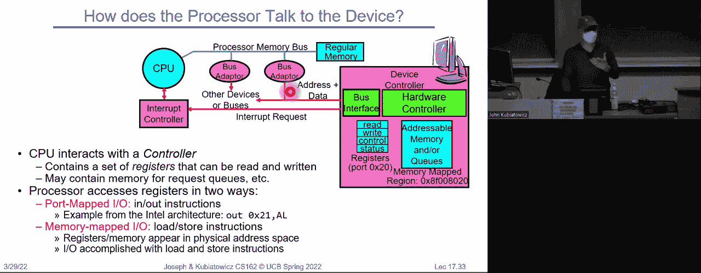

 Talk about discs。 Okay， so in conclusion， we have been talking。 starting the discussion about I/O device top types here that there are many different speeds。 Okay。 you know， tenths of a byte per second to gigabytes。 We're going to talk about lots of access patterns and timing。

 And we're going to get into I/O controllers in a lot more detail。 And obviously there's notification mechanisms like interrupts and polling， etc。 Okay。 and then we're also going to talk about how device drivers work。 So。 hope you have a really great rest of your Tuesday and we'll see you on Thursday。

 Don't forget tomorrow is the deadline for a regret request。 So there is a question here about his addressable memory stored on the device it can be。 We'll talk more about that next time。 All right。

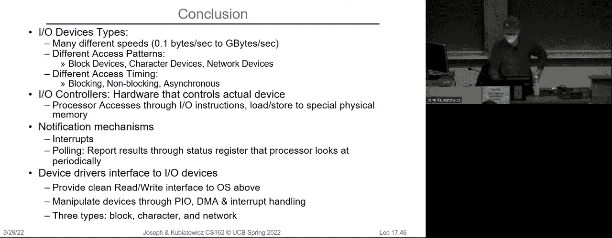

 [BLANK_AUDIO]。

