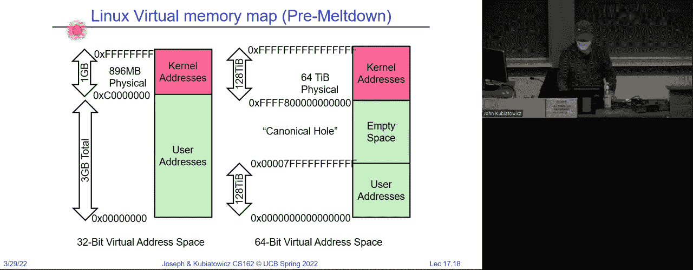
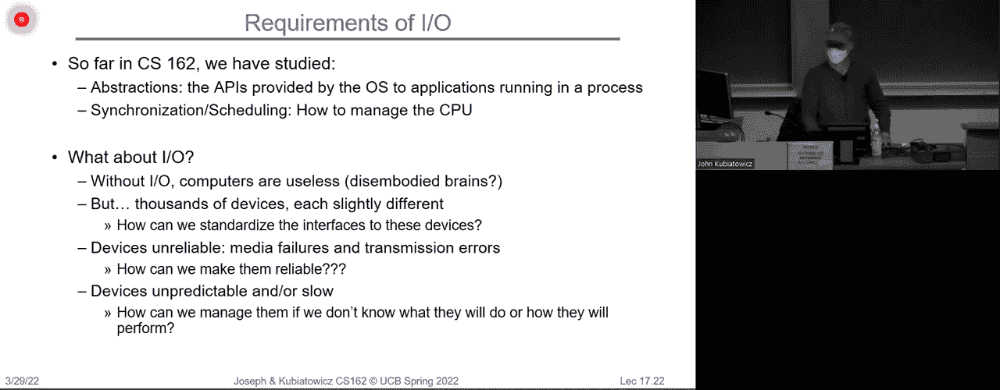
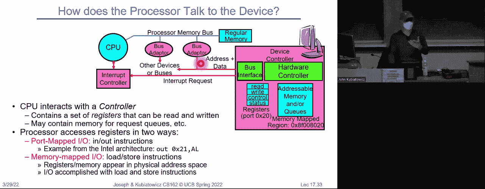
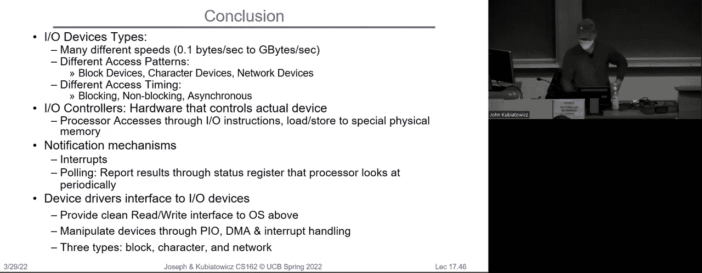

# 操作系统课程 P17：按需分页、通用I/O与存储设备 🖥️💾

在本节课中，我们将深入学习虚拟内存的按需分页机制，探讨页面替换策略的优化，并初步了解计算机系统中复杂多样的输入/输出（I/O）子系统。我们将从计算页面访问的平均时间开始，逐步深入到内存分配策略、抖动现象，最后开启对I/O设备与总线的讨论。

## 按需分页与有效访问时间 ⏱️

上一节我们介绍了虚拟内存作为磁盘缓存的优势。本节中，我们来看看如何量化页面错误（Page Fault）带来的性能影响。

虚拟内存系统的一个关键性能指标是**有效访问时间**（Effective Access Time, EAT）。它衡量的是在考虑页面命中与未命中的概率后，平均每次内存访问所需的时间。其计算公式如下：

**EAT = (1 - p) × 内存访问时间 + p × 页面错误处理时间**

其中：
*   `p` 是页面未命中（即发生页面错误）的概率。
*   `(1 - p)` 是页面命中的概率。

让我们代入具体数值来理解其影响。假设内存（DRAM）访问时间为 **200纳秒**，从磁盘加载一个页面的时间（页面错误处理时间）为 **8毫秒**。如果每1000次访问发生一次页面错误（即 p = 0.001），那么有效访问时间为：
EAT = (1 - 0.001) × 200 ns + 0.001 × 8,000,000 ns ≈ 200 ns + 8000 ns = **8200 ns**

尽管DRAM本身访问很快（200纳秒），但由于极低概率的磁盘访问（8毫秒），平均访问时间激增了40倍。这个计算清晰地表明：**必须极力避免页面错误**，页面替换算法的效率至关重要。

## 页面替换算法回顾与优化 🔄

既然页面错误的代价高昂，我们需要精心选择被换出到磁盘的页面。我们之前讨论过**时钟算法**（Clock Algorithm）作为LRU（最近最少使用）的近似实现。

### 时钟算法（Clock Algorithm）
其核心思想是将所有物理页面组织成一个环形链表（“钟面”），并有一个“时钟指针”。当需要替换页面时，算法检查指针指向的页面：
*   如果该页面的“使用位”（由硬件在访问时设置）为1，则将其置0，指针移向下一个页面。
*   如果使用位为0，则选择该页面进行替换。
这种方法避免了精确LRU的昂贵开销，通过寻找一个“旧的”（近期未被访问的）页面来达到近似效果。

### 二次机会算法（Second-Chance Algorithm）
这是一种在缺乏硬件“使用位”支持时的变通方案。操作系统维护两个列表：
*   **绿色列表**：已映射到页表、可快速访问的页面。采用FIFO管理。
*   **黄色列表**：仍在内存中，但已在页表中取消映射的页面。采用LRU管理。

其工作原理如下：
1.  访问绿色列表中的页面：快速命中。
2.  访问黄色列表中的页面：触发**软页面错误**（Soft Page Fault）。操作系统只需将该页面移回绿色列表，并将绿色列表中的一个页面移到黄色列表，无需磁盘I/O。
3.  访问不在任何列表中的页面：触发**硬页面错误**（Hard Page Fault），需要从磁盘加载。此时，将黄色列表中最旧的页面（LRU牺牲者）换出。

这种方法通过“第二次机会”机制，同样实现了近似LRU的行为，将频繁使用的页面保留在快速访问的绿色区域。

### 优化：空闲页面列表
为了进一步优化，可以将时钟算法与一个**空闲页面列表**结合。时钟算法定期运行，将一些“旧”页面放入空闲列表（按FIFO管理）。当发生页面错误时，直接从空闲列表头部取用一个页面，从而将耗时的页面选择过程从关键路径中移除。如果空闲页面是“脏页”（被修改过），系统可以后台将其写回磁盘。

## 多进程内存分配与抖动 🌀

之前我们假设单个进程的内存分配。现实中，多个进程共享物理内存。分配策略主要有两种：
*   **全局替换**：所有进程的页面在一个全局池中竞争。简单，但一个进程可能“偷走”另一个进程的页面，影响公平性和性能。
*   **本地替换**：为每个进程分配固定数量的页面帧，每个进程在自己的帧集合内进行替换。这保证了公平性，尤其有利于实时任务，但可能造成内存利用率不均衡。

### 工作集与抖动
**工作集**（Working Set）是一个进程在最近一段时间Δ内访问过的页面集合。它是该进程正常运行所需的最小物理页面数。

当系统中所有进程的工作集大小之和超过可用物理内存总量时，就会发生**抖动**（Thrashing）。此时，操作系统忙于在磁盘和内存之间频繁地换入/换出页面，而进程几乎无法获得CPU时间执行实际计算，系统吞吐量急剧下降。

检测和缓解抖动的方法包括：
*   **监控页面错误率**：如果所有进程的页面错误率都居高不下，可能发生了抖动。
*   **挂起进程**：将某些进程完全换出到磁盘，腾出内存让其他进程顺利运行，之后再换回。
*   **预取**：利用空间局部性，在发生一次页面错误时，将其附近的一组页面（集群）一起读入内存。
*   **工作集模型**：操作系统尝试跟踪或估算进程的工作集，并在进程被重新调度时预取其工作集页面。

## 输入/输出（I/O）子系统概述 🔌

没有I/O的处理器是无用的。I/O子系统负责连接CPU与成千上万种速度、特性各异的设备（如磁盘、网络、键盘、显示器），其核心挑战在于**如何通过虚拟化提供统一、简单、可靠的抽象接口**，隐藏硬件的复杂性和差异性。

### 设备与总线
设备通常通过**I/O控制器**（或适配器）与系统连接。控制器是设备上的一个芯片，它有一组**寄存器**。CPU通过读写这些寄存器来向设备发送命令或查询状态。

**总线**（Bus）是连接多个设备的共享通信链路，包含数据线、地址线和控制线。总线的优点是灵活，缺点是带宽共享、一次只能进行一次传输，且添加设备会因电容增加而降低速度。现代系统（如PCI Express）采用高速串行点对点链路替代传统并行总线，以提升性能。

系统通常采用层次化的总线结构来管理速度差异巨大的设备：
*   **快速、短距离的总线**（如处理器-内存总线）靠近CPU。
*   **通过桥接器**连接到速度较慢、距离较长的总线（如PCI总线）。
*   **最终连接到各种外围设备总线**（如USB、SATA）。

### CPU与设备的通信方式
CPU主要通过两种方式与I/O控制器通信：
1.  **端口映射I/O**：CPU使用特殊的指令（如`IN`和`OUT`）访问特定的I/O端口地址。
2.  **内存映射I/O**：将设备控制器的寄存器映射到物理内存地址空间中。CPU通过普通的加载/存储指令访问这些“内存”地址，实际上是在与设备通信。这种方式更为常见和灵活。

## 总结 📚

本节课我们一起学习了：
1.  **按需分页的性能模型**：通过有效访问时间公式，我们量化了页面错误的巨大代价，理解了优化页面替换算法的必要性。
2.  **页面替换算法的优化**：回顾了时钟算法及其变种（如二次机会算法），并介绍了使用空闲页面列表将替换逻辑移出关键路径的优化技巧。
3.  **多进程内存管理**：探讨了全局与本地替换策略，引入了**工作集**的概念来解释**抖动**现象及其应对策略。
4.  **I/O子系统入门**：概述了I/O子系统在操作系统中的核心作用，介绍了设备控制器、总线的基本概念，以及CPU与设备通信的两种主要方式（内存映射I/O和端口映射I/O）。

下节课，我们将更深入地探讨具体的存储设备（如磁盘）的工作原理，以及操作系统如何管理这些设备。