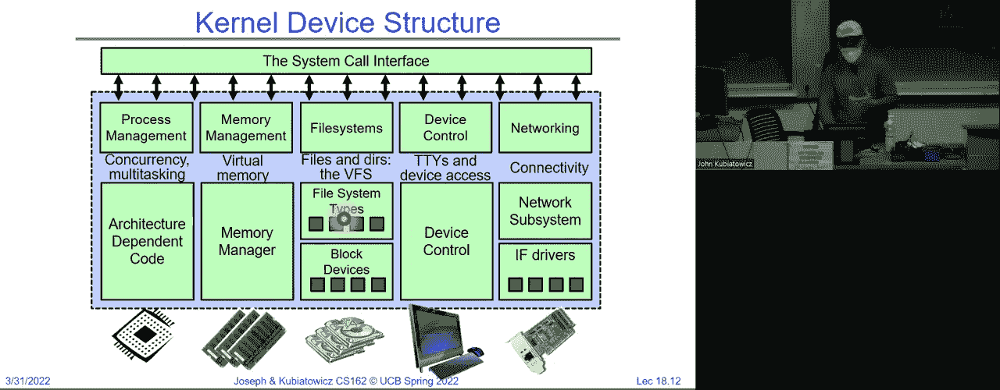

# P18：讲座 18：通用 I/O（续），存储设备，性能 - RubatoTheEmber - BV1L541117gr

所以，欢迎大家回来。

我们将继续上次的内容，讨论设备和通用 I/O。如果你们还记得上次的内容，让我看看是不是已经在这里推进了。我们讨论了处理器如何与设备进行通信。我们从这个概念开始，即 CPU 有一个总线，我们可以称之为。

内存总线。嗯，我猜对大家来说这个已经好了，是不是？

没那么响亮。所以，CPU 内存总线需要短而宽，以保证其速度，因为内存处于一切操作的关键路径中。所以为了将 I/O 设备集成到系统中，我们讨论了通过处理器内存总线与控制器进行通信的适配器。控制器则是与设备本身的接口。

接下来我将向你们展示现代处理器如何将这一切结合在一起。但让我们先从抽象的角度讨论一下。所以 CPU 将执行操作，通过总线适配器传输到这个控制器。然后控制器会返回响应。

所以你可以想象，因为这在内存总线上，我们可以对该控制器进行读写操作。它的作用就像内存一样，只不过它将访问设备。当然，另一个重要的方面是设备能够中断处理器。所以现在，我们开始展示除计时器中断外的所有其他中断。

中断，这个中断几乎是我们整个学期主要讨论的唯一一个。所以，CPU 与控制器的交互可以总结如下。控制器内部，典型的控制器有一组控制寄存器，我在左边展示了这些寄存器，然后可能还有一些实际可寻址的内存块。

这些寄存器是控制寄存器和状态寄存器。你可以通过读取它们了解设备的运行情况。你也可以通过写入它们来控制设备。好的，我们稍后会讨论如何进行这些读写操作。

然后，这些大块内存可能是，比如显示器的像素，或者是与设备相关的任何内容。如果这是一个网络设备，它可能包含传入的数据包。好的。所以，就像我们有物理 DRAM，这些控制器将通过。

一个接口。在大多数情况下，它看起来几乎像内存一样。所以，无论如何，与设备通信有两种主要方式。这就是我们上次停下来的地方。其一是端口映射 I/O。我稍后会展示这是什么意思。另一个是内存映射 I/O。所以端口映射 I/O 是特殊的 I/O 指令。

像 Intel x86 兼容的处理器有这些端口映射的 IO 指令。当你使用其中一个 IO 指令时，你可以用它直接访问该设备的控制寄存器。为了论证，我在这里展示的是端口 32 或 OX 20，这是这些寄存器的起始位置。所以，如果我从端口 20 执行输入操作。

我可能会读取这个寄存器。如果我从端口执行输入操作，或执行输出到端口 21 的操作，我可能会写入这个寄存器。好的，这些是仅用于 IO 的特殊指令。现在，这几乎仅存在于像 x86 这样的专用处理器中，尽管 x86 不能算作是专用的，因为它几乎无处不在。

但所有处理器都通用的一种机制是内存映射 IO。内存映射 IO 的不同之处在于，通过对物理 DRAM 地址以外的地址进行加载和存储，它们可以是内存空间的一部分。好吧，我稍后会给你们展示这是什么样子的。

但通过读写物理空间中的一些高地址，你实际上可以控制一个网络或控制一个设备。好的，问题。是的。那么总线的概念是它是一种连接多个事物的方式。稍后我会展示，这只是一个抽象的示意。好的，但关键是，CPU 本质上是对物理内存进行加载和存储操作。

它们经过 MMU 翻译之后。这些加载和存储操作可以是常规的 DRAM 操作，我们希望它们尽可能快速；或者它们不必那么快，我们可以将它们发送到 IO 设备，因为这与处理器的接口是相同的。

这是对某个物理地址的加载和存储。好的，至少在概念上它是相同的总线。好了，对于我上次告诉你们的关于总线的一些问题，比如总线通常会使速度变慢等等，我接下来会告诉你们，实际上发生的是这实际上是一个点对点的连接，你可以称之为总线，但它更像是一种通信网络。我们一会儿再讨论这个，好的。

不错的问题。还有其他问题吗？我想谈谈这个 IO 端口映射。

这里只是稍微展示一下，你可能看得不太清楚，因为它很小，但端口映射 IO 一直存在。它从最初的 8086 处理器就已经有了。如果你看这里，我有输入和输出指令，它们是用来发送数据的。你可以稍后在网上查看这些幻灯片。

而这个输出指令通常会有一个专门用于扬声器的端口。所以，如果你去了电脑历史博物馆，查看了 IBM PC，你会发现自 IBM PC 诞生以来，就已经定义了用于扬声器和中断的端口，这些端口全都是为了中断服务而设的。

配置。所以下面这些，如果你向标准扬声器端口输出，可能实际上会让扬声器做出某种反应。好的。所以实际上这个输出指令，所谓的“out”指令，这里有一个C语言原型。它使用了汇编语法，这样汇编语法实际上把这个C调用转换成了一个实际的输出指令操作，输出到扬声器。

当然，对于in指令也有类似的概念，基本上你有你感兴趣的端口，它返回的是一个字节。好的。所以in和out实际上是与设备交互的单指令方式，你指定哪个设备或者设备中的哪个寄存器时，实际上是通过使用端口号。那些端口号最初是8位的，然后它们扩展到了16位。

然后还有一个扩展版本，它是32位的，但通常是针对特定架构来定义的。好的。现在我将从这些内容中跳出来，因为它们非常特定于某些架构。更有趣的是这种内存映射的概念。好的，这里我将给你展示一个显示控制器的例子，我展示给你的是物理内存空间。

这是机器的物理内存空间，而不是虚拟内存空间。记住，我们已经讨论了虚拟内存，过去几周以及期中考试中的所有内容，你将用户的虚拟地址映射到物理DRAM地址。对吧？这些物理DRAM地址位于某个物理空间内，这就是我在这里展示的内容。

所以那些粉色的区域可能实际上是DRAM。好的，但那些浅蓝色的区域，也就是青色的部分，将是显示控制器的一部分，如果我从这些物理地址读取和写入，我实际上可以影响控制器。比如说，发生的是控制控制器的寄存器。

可能会映射到这些特定的地址。所以如果我在我的页面表中为内核映射了一些内核地址到7F000，那么如果我从这个地址读取和写入，我实际上可以通过读取和写入这个物理地址来获得显示控制器的状态。好的，这些物理地址显然，如果你有12个显示控制器，你不希望它们都使用相同的地址，因为。

这将被称为冲突。好的。幸运的是，今天这些东西都会自动配置。如果你使用PCI总线或PCI Express的后续版本，当你打开机器并启动时，它会确保地址不会重叠，并且会提供一种方式给设备驱动程序来找出这些地址。好的。如果你使用的是老式的PC，并且插入一些卡片，你实际上会。

你必须设置一些物理跳线，以确保地址不重叠。好的，你可以很容易地插入卡片，而机器就会崩溃，因为地址重叠，导致无法正常工作。好的，但假设这一切都是自动配置的。所以，现在一旦我有了这个显示，我可以简单地写入这里的地址。

比如说 80000F00，我实际上可能获得的是显示内存。所以我不知道你们中有没有人写过视频游戏，目标是让它运行得非常快，但如果你能够访问显示硬件，你实际上可以把数据写入显示内存，它会在屏幕上显示为点，某些情况下。

颜色，好的。所以这是与内存的直接接口，接着它会进入控制器，并最终影响显示效果。好的。但可能是，例如，写入命令寄存器会导致板载控制器执行某些操作。所以你可能在内存映射空间中有一些内存，里面是你想要绘制的三角形队列，来自某个游戏，然后通过。

写入寄存器，你发出命令，比如 "go"，然后它会利用板载硬件为你渲染某些东西。好的。当然，因为这是物理地址，我们可以通过虚拟内存来保护这一切，这样内核就可以确保只有它自己在映射这些地址。

所以用户程序无法，或者更有趣的是，你可以给特定进程赋予控制这个设备的能力，通过将它的虚拟地址空间映射到这些物理地址。好了，有问题吗？是的，请再说一遍。啊，你担心的是缓存。小心，这实际上是在写入硬件中的寄存器。

什么是内存映射，这是个好问题。内存映射 I/O 字面意思是，当我读写某个物理地址时，它会直接与硬件交互。我原以为你问的是另一个问题，那也是个好问题，所以我会回答那个问题。我们一直在谈论缓存，对吧？如果有一个缓存。

在处理器与内存控制器，或者抱歉，是显示控制器之间，似乎你遇到了不同的问题，我以为你问的就是这个问题。你写入数据，它会进入缓存，但它并没有进入硬件。好的，所以缓存有时候会造成干扰。这就是你从另一个角度问的问题，对吧？

那么如果你回去看我上次展示的 PTE，再提醒你一次，你会看到其实有几个位是标记为 "uncache" 的。所以在那个映射中，你可以指定好，读取和写入数据始终直接传送到硬件，不经过缓存。好的，这就是你在这些设备上会做的事情。好问题，是的。

这是真是个好问题，真实的内存是否被影射了？不，实际上发生的是，真实内存在地址空间的另一个部分。所以在这种情况下，你的DRAM永远不会有那么多地址空间。好的，如果它只有32位，我们都知道现在32位是4GB，因此：

32位物理处理器，4GB已经不算什么了，但是大多数处理器是64位的，I/O空间有很多空间。好的，是的。那么，假设为了让这变得有趣，我将给一个进程提供写入控制器的权限，内核会做的是：

它会将某些虚拟地址映射到这些物理地址，然后它还会将执行映射的页面表项（PTE）标记为不缓存，之后你程序的所有进程只需要从这些地址进行读写，哇，它就会出现在屏幕上。所以，实际上就像是加载和存储，这就是为什么它被称为内存映射I/O。

顺便说一下，关于影射的最终答案是，如果没有足够的物理地址空间，那么有方法可以影射一些DRAM，但这些I/O地址占用了大量的空间。是的，物理地址是我在这里展示的，当你读写这些地址时，它会进入设备，而不是DRAM。

现在，我没有完全按照你问的方式回答，是因为那些地址是在设备中，而不是DRAM中。实际上，地址只是存在于地址空间中，问题是当你读写这些地址时会发生什么？我们设置的方式是，读写这些地址会访问硬件，而不是DRAM。

因为硬件已经设置好了，硬件根据地址知道它的位置。

事情会被路由，所以是网络总线将其路由到正确的位置。

好的，现在我们有了。那么问题是，驱动程序是否告诉程序命令、状态等位于何处？这是个好问题，因为我们讨论过自动配置。

哎呀，我们把图片恢复了，当它启动时，这些地址会被分配。这在USB设备中也会发生，你们都很熟悉对吧？你插入你的设备，启动时会有一个自动配置过程，自动识别所有可控制的设备，并以不重叠的方式为它们分配地址。

操作系统确实有一种方法可以查询设备驱动程序，找到它们最终的位置。好的，希望这个问题已经解答了，这里还有一个问题。是的，谁来做重定向？硬件，完全是硬件的事。

是的，所以访问通过MMU，它们的标记在高速缓存上，但它会弄清楚如何将虚拟地址映射到物理地址。因此，它们通过MMU，然后通过物理内存总线到达实际设备。现在我给你展示的是这种工作的常见方式，实际上有许多例外情况。

你可以说，某些地址空间的部分可以绕过MMU，这是另外一种选择，但现在我认为最容易理解的方式是通过MMU进行地址转换。好了，还有其他问题吗？所以内存映射IO是目前人们访问IO设备的最常见方式，因为它是。

这是一个简单的基于地址重定向的过程，来确定数据流向何处。好的，然后内核或其他组件只需从地址读取和写入即可。

你使用相同的加载和存储，但它们的标记是未缓存的。

好的，接下来我们继续讲IO。这是一个芯片，虽然它是2015年的旧款，但如果你有机会，我鼓励大家小心地打开一些硬件，看看里面的结构。好的，记住，不要拿着咖啡杯。我的第一台电脑就是我买的，我当时特别骄傲，还是大一新生，然后我拿着一杯。

我喝了咖啡，然后我不小心把咖啡洒在了我的键盘上，结果立刻把我那崭新的键盘弄坏了，所以大家不要用咖啡这么做。

如果你看看这里，这是Skylake英特尔处理器，这是一款四核版本的Skylake，Skylake最多支持28个核心。但这里有个有趣的地方，这四个核心支持乱序执行、内存保护扩展、支持SGX（安全执行环境）等功能。基本上它每个周期可以执行六个微操作，并且配备了用于图形处理的GPU，拥有高速内存和IO接口。

芯片上有一个大型共享三级缓存，它位于环形结构中，每个核心共享这些蓝色和黄色部分的三级缓存。除此之外，还有一级和二级缓存，里面还集成了IO接口。这正是今天讲座相关的部分。如果你仔细看看这些。

IMC（集成内存控制器）可以连接多个DRAM，这是DRAM所在的地方，然后有一些接口，像是连接到平台芯片控制器的接口，我会在稍后展示给你，另外还有直接媒体接口。所有这些都集成在处理器芯片和这个红色标记的网络中。

实际的环形网络，当核心进行物理地址的读写时，它们会通过这个环形网络被路由到正确的地方。所以它们要么被路由到DRAM，要么路由到IO。关于这里的问题是，我们描述的设备意味着设备上的内存和常规内存。

是分开的，这是事实，因此地址是不同的，所以地址会被路由。一些高位的地址会被路由到设备，或者根据它们的不同情况是否被路由。好的，所以下次你使用笔记本电脑时，要感激所有这些内容，它们都在其中。

一颗芯片。好的，现在如果我们稍微扩展一下，我们看到这里黄色部分是我刚刚给你们的芯片，但在它下面是典型的平臺控制器集线器，以及这个DMI，它是一个高速数字媒体接口，这是一个总线，用于从核心到某个物理地址空间的一部分，这部分表示稍慢的。

高速IO设备通过DMI进行传输，然后有一个独立的芯片，基本上提供了一些USB接口，提供了一个用于以太网的LAN端口，你还可以获得非常快的PCI Express，获得用于硬盘的SATA等等。好的，甚至还有一个低引脚数接口LPC，连接到像BIOS之类的东西。好的，因此所有低速的设备都是类似的。

低速设备在这里，它们是直接连接到芯片的。好了，内存，看到DDR4了吗？还有显示内存，它通常很快。所以之前有一个问题，“那么，连接到内存总线是什么意思？” 这意味着我给你们展示的那个环形结构，那就是内存总线，一些东西直接连接到那个环上，而其他的。

你通过DMI总线接口路由到控制器，然后它带你到另一个芯片，用于处理低带宽的内容。好的，这就是现在英特尔芯片的一个非常标准的架构。好的，有问题吗？这些细节会因芯片的不同而有所不同。例如，有继任版本是Skylake之后的版本，实际上有56个核心等等，但这里的基本思想是这样的。

问题是，另一个问题是设备的内存是存在于设备硬件中还是设备控制器中？是的，它们可以选择放在哪里。好的，很多人以不同的方式设计事物。好的，所以在我之前给你们的图表中，某些东西是空白的，什么也没有。

它们，好吧，如果你读写这些地址，什么也不会发生。现在我们来详细谈谈IO。所以我们深入一下，现在当我们考虑IO时，我希望你们都认为我们正在使用类似内存映射接口或端口接口来读取和写入设备的控制器。大家都明白吗？好的，那么接下来我们要讨论什么？

如果你想与存储进行交互，怎么办？好了，回到这里，你可以看到这里有一个小的SATA接口。它通常用于连接磁盘驱动器，这是本讲座后面要讨论的一个主题。好了，现在假设我们想要从中读取和写入，我们有很多选择。不同的设备有不同的粒度，所以我们将讨论。

关于旋转存储或磁盘，它们有一个块大小粒度或扇区大小粒度，通常是每次512字节，另一方面，如果你有串行线路或鼠标，那么你通常会从中获取字节。好吧，所以问题是你是否有字节级接口或块级接口。

这很重要，好的，另外你是要顺序访问还是随机访问？显然，如果你有一个存储介质，并且你打算在上面放置文件、读取文件和写入文件，那么你需要某种形式的随机访问。所以典型的磁盘、SSD等，允许你随机选择读取的位置，其他像网络端口这样的东西则来自……

以它们进来的顺序读取，没有随机读取网络端口的意义。好吧，现在对我们来说有趣的是，虽然我们需要磁盘支持随机访问，但随机访问不同的磁道并开始读取某些东西要比保持在同一个磁道上读取要昂贵得多，所以我们……

当我们开始设计文件系统时，我们就会想利用这个机制，那其实会在下节课中讲到，某个时候。然后我们也有一个传输机制。假设我们有一个磁盘，我们向磁盘发出请求，说我需要这个块，读一下它，它会将其读入本地控制器内存，但……

对我来说没有帮助，因为我希望它位于某个地方的DRAM中，因为我要作为文件系统的一部分进行操作。所以有一个很大的问题，那就是它是如何从控制器中取出并进入内存的，好吧，这将通过多种方式完成，其中一种是你可以构建一个循环，读、读、读、读并存储，似乎这让处理器做了很多事情。

这种方式叫做程序I/O或直接内存访问（DMA）。所以这些是我们拥有的一些选项。好吧，咱们稍微讨论一下这个问题。再回想一下我告诉你们的内存映射I/O。所以程序I/O非常简单，你建立一个循环，你知道如果是4k块发生的事情是，你说好吧，从……

来源是在内存控制器中，或者抱歉，是在I/O控制器中，然后将其存储到内存中，然后循环增加地址，抓取下一个字节，存储，抓取下一个字节。所以这个循环有4k次迭代，光是从控制器读取一个数据块到内存中，就需要这么多次。好吧，这样做的代价很高，或许你可以优化……

通过进行加载和存储，每次32位，而不是字节，但你仍然在占用处理器。所以这种方法的优点是，它非常简单，希望它非常简单，容易理解，实际上只是处理器从控制器读取并写入内存，或者从内存读取并写入控制器，处理器就这么做……

好的，在我继续讲解下一个选项之前，我想暂停一下，问问大家是否明白。大家都理解吗？我们对于什么是程序I/O有清晰的理解了吗？这是你程序中的I-O，好的，有时某些事情确实是字面意思对吧？

所以我们来谈谈DMA，或者直接内存访问，这是一个例子，在这种情况下，我们不是让处理器从控制器读取并存储到内存，而是我们将允许控制器自行写入内存。好的，所以我们要做的是，我们首先告诉磁盘将一个数据块读取到控制器的内部内存中，然后。

我们告诉控制器直接将数据从它的内存传输到DRAM，我们会自动完成这一切，直到完成后只会收到一个中断，表示“完成”。好的，这样会更加高效，我将给你展示一个示例，看看它是如何工作的。这里有一个例子，我们有一个CPU，有一个磁盘控制器在这里，我们打算通过CPU来执行这个循环，好的，这很容易做到，因为我们使用的是内存映射I/O。

我们会从获取开始，让你的程序请求设备驱动程序为你传输一些数据。接下来，这个请求会通过总线，也就是内存总线，传输到控制器。好了，在这一点上，磁盘控制器将会自行启动DMA。所以我们假设，在过去，我们已经将数据从磁盘加载到控制器中。

但是CPU会说“嘿，控制器，继续做DMA吧”，所以磁盘控制器将会与DMA引擎沟通以开始传输，然后DMA引擎会允许这个过程继续进行。这样，每一个字节就会直接从控制器通过总线传输到内存，并且当传输完成时，它会发送一个中断，表示“我完成了”。请注意，CPU在这个过程中并没有参与。

因为我们刚刚说过“告诉DMA控制器开始这个传输”，然后设备就会将所有数据传输完毕，之后它会说“我完成了”，同时CPU可以继续处理其他重要任务，你知道的，比如计算圆周率的最后一位数字之类的，好的，这就是DMA的问题。

现在请注意，在某种意义上，DMA能够工作的唯一方式是我们能够将整个内存情况当作一个总线来处理。所以DRAM就在这个网络上，磁盘控制器也在这个网络上，我们只是允许磁盘控制器控制数据传输，并直接从控制器通过总线发送到内存，好的，这就是为什么它能工作的原因，且大多数现代设备都直接支持DMA。所以，如果你查看设备驱动程序，通常它们。

知道如何调用DMA，并让它作为文件系统的一部分发生吗？有问题吗？请再说一遍，哪个锁？那么我们在说哪个线程呢？好的，问题很好，那么线程被阻塞了吗？

我想你们需要做的是，戴上你们的并发思维帽子。嗯，你的并发思维帽子会告诉你，如果有独立的路径，那么DMA可以独立于CPU正在做的任何事情进行。这是首先要说的，然后第二点是，如何编程DMA。稍后我们会提醒你们设备驱动程序的组成。

但是如果一个进程或线程说我需要进行一些I/O操作，启动I/O后，实际上发生的事情是，它会进入一个睡眠队列，接着调度器会介入，其他任务将开始运行，它们会运行，稍后DMA会完成，生成一个中断，这时会通知传输已经完成，接着唤醒那个任务。

然后把它放回准备队列。所以这一切你们现在都很熟悉，来自上一组电气相关的内容。好，现在这里的问题是，为什么CPU不能？一个问题是，程序I/O和DMA之间的关系是什么？关系是，程序I/O不幸地要求CPU做很多工作，一次处理一个字节，或者一次处理一个字。

在DMA的过程中，实际上是将CPU从循环中移除。那么，为什么CPU不能直接访问磁盘控制器内存或直接将数据写入磁盘控制器内存呢？它是可以的，这叫做程序I/O。好的，问题在于这样做是非常耗时的，我们希望释放处理器去做其他事情，这就是为什么DMA如此有用。

这对聊天中的各位来说有意义吗？还有其他问题吗？是的，DMA是另一块硬件，因此我们看到的实际上是硬件。如果你注意到的话，这个小的CPU就在那儿，那就是我们整个学期一直在谈论的东西，所以我们有点儿把它从我们的图像中推出来，转而讨论I/O子系统，所以现在我们真正讨论的是这个。

这里是硬件的相关内容。嗯，CMU，CPU正在与DMA控制器和设备通信，要求它们设置相关的配置。顺便说一下，具体的细节会根据我们使用的总线类型而有很大差异。例如，在你非常熟悉的USB总线中，你通常可以要求设备进行DMA，在一些早期的x86架构中也有DMA。

你问的控制器就像一个处理器从内存读取数据，从设备中读取并存储到内存中，嗯，DMA控制器的位置可以不同，但它们的基本思想是相同的。好的，是的，磁盘控制器通知CPU，实际上是DMA部分通过中断通知CPU，这会是一个DMA完成中断。嗯，你担心的是缓存一致性，所以这些内容已经变得相当复杂了。

我想说的是，假设我们有两个核心，其中一个核心从内存读取了一个旧版本的数据，然后 DMA 覆盖了那个旧版本，现在下次 CPU 或核心读取时，它将获得新版本，你担心的是这个问题，对吗？这是一个问题吗？其实有很多方法可以解决这个问题，最简单的方法是操作系统确保清空缓存。

清除所有缓存，以防数据在 DRAM 中被覆盖。不过，这样做也很昂贵。所以现代架构通常在 DMA 进行时，会将验证信息发送给 CPU，这样就能自动将数据逐出缓存。因此，架构的不同会影响这种机制。好的，总之，关键是你需要确保某种方式将缓存清空。

好的，太棒了，哇，我想我从未在这一张幻灯片上收到这么多问题。这真是太棒了，还有其他问题吗？好的，我们正在录制呢。是的。那么如果我们使用程序 I/O 而不是 DMA，会发生什么呢？其实就是 CPU 会被卡在一个循环中，它会从控制器读取第一个字，然后将其存储到内存中，接着读取第二个字并存储。 

你可以把它想象成代码中的一个循环，知道的，加载、存储、加载、存储、加载、存储，而在执行这个过程中，CPU 无法做任何其他事情。而在 DMA 的情况下，它会去做一些完全不同的事情，然后稍后会收到通知。好的，明白了。那么我们来谈谈这个通知，操作系统需要知道。

比如，当 I/O 设备完成操作时，我们请求硬盘读取某个扇区，你想知道它何时完成？那就可能是一个中断，或者你想知道是否发生了错误，或者你想知道 DMA 是否完成。所以，实际上有两种完全不同的方式来处理这个问题，一种是中断，我们已经讨论过中断了。

控制器，我想这是第一讲或第二讲的内容之一。如果你回去看那些幻灯片，你会看到我展示了一个中断控制器的图片，像是硬盘驱动器向中断控制器发出中断请求。就像定时器中断一样，你们现在都很熟悉，我们可以设置设备在 I/O 时中断 CPU。

操作完成后，基本的思路和之前一样，你正在运行一个用户程序线程，硬盘说我完成了，它生成一个中断，你就进入内核，切换栈，就像你之前做的那样，可能会通过唤醒正在等待数据的线程来处理这个硬盘中断，把它们放回就绪队列，然后返回。

从中断返回到被中断的用户线程，之后调度器会调度你刚刚唤醒的那个线程，所以你现在习惯性地思考定时器中断的事情，在设备中断的情况下也能理解这个概念，好吧，轮询是一个稍微不同的概念。

中断，就像我刚才说的，轮询说的是，相反地，每当时间到时，内核就会去检查所有设备，问“它们完成了吗？它们完成了吗？它们完成了吗？”如果没有完成，就会返回继续做其他事情，这就是轮询。好了，通常情况下，轮询时你会关闭中断机制，然后只是查看中断控制器。

看看中断是否已经被标记，这就是一个轮询的例子。好了，有人能告诉我轮询的优点和缺点吗？可以选择任意一个，轮询的缺点是什么？是的，好的，线程参与其中，查看对吗？好吧，所以这是CPU时间，除此之外呢？

你能想到哪些优点，或者说有什么缺点呢？是的，嗯，优点是，当你开始轮询时，你只是查看你正在做的事情，读取一个I/O寄存器，检查并返回到你正在做的其他操作；而中断实际上是进入内核，保存一堆寄存器，获取中断上下文，这样会有很多的开销。

处理中断会有很多额外开销，因此，如果你能处于一个内核定期检查的情况，那样的开销会低得多。问题是，如果中断不可预测，那么你就会浪费大量时间去检查却什么都没有，好的，所以轮询与中断是硬币的两面，实际设备结合了两者，我想给你一个很好的例子。

一个例子是，现在大多数服务器都配有10、40、100吉比特以太网接口，在云计算环境中非常快速。如果你把网络控制器设置成每个到达的数据包都会生成一个中断，你就会花费大量时间处理中断，因为每个数据包都会触发一次中断，而且这个过程发生在极高的速率下，那么结果会如何？

通常发生的情况是，由于数据包是批量到达的，第一个数据包会生成一个中断，操作系统进入网络内核部分，从控制器中提取数据包，然后开始轮询，取出后续所有仍然存在的数据包，之后才会禁用中断或重新启用中断，返回到其他操作中。所以这是一个很好的例子，说明这一点很重要。

由于突发性事件的不可预测性，结合中断操作来处理这些突发事件，但是因为有突发事件，我们进行大量的轮询来清空网络控制器，直到我们完全清空控制器，才结束中断服务。这几乎是五到十年前，你能让10G接口工作的一种方法，因为你有。

因为数据流入速度太快，处理器无法应对，明白了吗？现在记住这个。

我们在课堂上早些时候展示了这张图。好的，这里有一个系统调用接口，我们已经进行了很多操作，这些系统调用接口会转换成一系列高层操作，如进程管理、内存管理等。我们将开始讨论像文件系统、设备控制以及其他种类的网络高层内容，但这个标准接口。

所有的操作都是读取、写入、打开、写入，所有这些标准调用都发生在这个层次上。在底层，我们必须有一组设备驱动程序等来处理这些不同的系统操作。好的，尤其是这些部分，像块设备驱动程序和IF驱动程序等，这些都是为特定硬件定制的，但它们提供标准接口给上层。

所以大部分内核代码并不是设备驱动程序的部分，内核其他部分的行为是相同的，无论是什么类型的设备。因此，大部分内核文件系统的运作方式是相同的，不管连接的是哪种类型的磁盘，好的，或者大多数网络操作方式是一样的，尽管有不同类型的网络，如Wi-Fi、以太网等。这就是设备驱动程序结构在这里所做的事情。

好的，如果你还记得，设备驱动程序是内核中与设备硬件直接交互的设备特定代码。它支持一个标准的内部接口。相同的内核I/O系统可以轻松地与不同的设备驱动程序进行交互，然后我们讨论了I/O局部操作，它让你控制一些东西，所以设备驱动程序通常有两部分。

上半部分是与操作系统高层部分交互的部分，那里有进程等等；下半部分作为中断服务程序运行，并与设备驱动程序交互。好的，记住这个图，我实际上之前已经给你们展示过了。

假设我们要进行文件读取，所以我们将请求I/O操作，开始时在用户程序中。它执行一个读取的系统调用，我们检查是否已经能够处理这个读取操作，然后我们会。接下来的几节课会讲很多关于文件系统的内容，所以我们可能已经能够执行读取操作的原因是什么呢？嗯，我们已经读取了部分内容，已经读取了一个块，我们只请求了一个。

少量字节，可能文件中有更多字节。因此，这实际上是一个查询，文件系统里是否有数据，我能否立即返回答案，如果没有，那么我们将请求发送到文件系统，再传递给设备驱动程序，去实际询问设备获取数据。此时我们进入设备驱动程序的上半部分，发出了请求。

文件中的某些字节被传输，转化为对硬盘特定块的请求，这将需要时间。需要多长时间呢？和硬盘通信，记得那个数字吗？至少需要一百万条指令，那是一个很重要的数字，值得记住。

非常长，那么我们该怎么做呢？在上半部分，我们将正在等待的线程或请求的进程放入休眠队列，同时我们已经启动了设备。将线程休眠后，其他线程可以醒来并运行，稍后设备完成操作。好的，假设中断发生了，给出了一个 I/O 完成中断，在这一点我们收到了。

中断信号进入设备驱动程序，设备驱动程序会判断，哦，谁在等待这个中断？我们找到了他们，将他们从唤醒队列中移除，重新放回就绪队列，他们醒来后，内核会将数据传输到用户的缓冲区，我们继续操作。好的，这就是设备驱动程序上半部分和下半部分之间的交互，上半部分发起操作并将线程置于休眠状态，下半部分则处理。

下半部分被完成中断唤醒，然后唤醒相应的线程，这是一种非常标准的模式。好的，有问题吗？现在你们其实理解了什么是让某个线程休眠了，嗯，这在学期初是一个谜题。那么 I/O 子系统的目标是什么呢？就是确保如果你写出像这样 `fd = open("/dev/something")` 的代码，你能够进入。

无论是什么设备，你都可以通过一个循环进行操作，你 `fprint` 输出到它，最后关闭它，不管设备是什么，都能正常工作。它适用于原始硬盘，也适用于网络套接字，甚至其他各种设备，这就是 Unix 的统一性。记住，所有的东西都是文件，这就是 Unix 的观点，学期初我们曾经提到过，正是因为设备驱动程序部分导出了这种方式。

这种标准化程度使得操作系统的其他部分基本上能对所有设备执行相同的操作。好了，在接下来的讲解中，我们将尝试了解实际控制设备的内容。我们只能触及表面，但我们希望设备有标准的接口。例如，块设备的概念，很多设备都是块设备，比如硬盘。

磁带驱动器、DVD、ROM等，你总是一次访问一个数据块，命令通常是像打开、读取、写入、定位这样的操作，我们通常可以进行原始IO或文件系统访问，因此我们将在下一讲中展示文件系统是什么样子的，但无论我们讨论什么，打开、读取、写入和定位的操作是一样的。

你一次访问一个字节，通常你会使用一组不同的系统调用，而不是普通的读取、写入和定位，而是通常使用获取输入这样的命令来操作这些设备。网络设备通常与块设备和字符设备分开处理，它们通过套接字接口进行通信。

那么，如何处理时间呢？直到现在，当你打开一个文件时，你会先执行打开操作，然后执行读取操作，你主要是在使用一个阻塞接口。你说读取5个字节到缓冲区，发生的情况是，读取操作会一直阻塞，直到有数据返回，这就是阻塞接口。但是现在我想指出的是，还有两种其他的选择，我们可以开始讨论。

关于这些设备，其中有一种被称为非阻塞接口，它的意思是，如果我去执行读取操作而数据还没有准备好，它会立即返回一个错误，告诉我数据还没准备好。这样做的原因是，我可以去做其他事情，然后再回来再次尝试读取。

我们所做的不同之处在于，如果我使用阻塞式的默认接口执行读取操作，我知道它总会返回至少一些数据，除非文件出错、文件为空或者套接字已关闭。而在非阻塞模式下，我可能会立刻什么都得不到，但它会告诉我它确实进行了尝试。

另一个可能更有趣的版本叫做异步接口。在异步接口中，我会提前设置好缓冲区，然后请求IO系统去读取数据，并在稍后通知我，接着我可以去做其他事情。这样我可以立即去做别的事情，稍后它会通过文件描述符的控制接口告诉我数据是否准备好了。

通过某种中断或轮询的方式，当数据准备好时，我就可以获取数据。所以，异步接口有点像是阻塞和非阻塞的结合体，我可以设置一个操作去完成数据访问的任务，而在操作完成时，我可以立即去做其他事情。是的，区别就在于非阻塞模式。

它会立即返回它能提供的内容，如果那里没有数据，它就什么也不给我。所以像是读取一个套接字，如果我使用阻塞接口读取套接字，我总是至少读取到一个字节。如果我使用非阻塞设置读取，嗯，你可以设置一个标志，告诉文件描述符以非阻塞方式工作，但发生的情况是它可能返回零。

即使事情尚未完成，也有字节存在。所以，原则上，非阻塞磁盘 I/O 是可行的，但嗯，很多文件系统与非阻塞操作不兼容，遗憾的是异步 I/O 是可以的。在异步的情况下，你所说的是：这是缓冲区，这是我想让你读取的内容，去做，然后你马上可以去做别的事情。好吧，因为开始读取，启动读取操作。

这是一个系统，它先设置好，然后你可以稍后去了解它。好吧，顺便说一下，如果你对异步 I/O 感兴趣，那不是我们在 162 课上通常教授的内容，但你可以查阅 Linux 的 AIO 接口，实际上有一个完整的方法可以做到这一点，而且它在文件操作中也能很好地工作。好吧，现在我们来谈谈，我们。

现在我们来谈谈存储设备，但先休息一下。我上次没这么做，这次我们休息三分钟，你们站起来伸伸懒腰，之后再继续。好了，嗯，让我们接着上次的内容继续，嗯，看看，大家好，好的。现在我们要讨论的存储设备至少有两种类型，磁盘和闪存或 SSD。所以磁盘。

我稍后会给你看一张图，但基本上是将存储放在一堆环形盘片上，磁性存储很少会被破坏，因为它们有非常好的错误纠正码，容量大且成本低，是块级随机访问的存储。好的，嗯，我会稍后告诉你这是什么意思，但它意味着你总是在进行。

至少有一个扇区大小，即 512 字节或 4K，嗯，在更先进的驱动器上，随机访问非常慢。但如你所料，顺序访问要快得多。闪存是存储设备，它也是非常可靠的存储，相较于磁盘，它的成本处于中间水平，但已经变得非常普及。所以，现在如果你买笔记本电脑，里面很可能就有 SSD 或闪存设备。

我认为我已经很多年没有购买带旋转磁盘的笔记本电脑了，好吧，嗯。对于读取性能表现良好，但写入性能稍差，嗯，不过它也有一些奇怪的问题。比如你必须一次性擦除一大块块，而不能直接覆盖某些内容，而且它也会逐渐磨损。我们从磁盘开始吧，嗯，我之前问过你是否打开过。

你可能曾经使用过笔记本或电脑，对吧？那么你是否打开过硬盘驱动器呢？可能没有。我不知道这里有人是否做过这件事，这是一个相对罕见的操作，但如果你打开它看看，你会看到一堆盘片，这些是圆形的、双面磁性磁盘，叠放在一起，还有一个非常复杂的磁头，上面有一个用于读取和写入的磁头。

每个表面都像一个单元一样移动，所以这里面有一堆磁盘盘片。磁头会进进出出，通常每个盘片的顶部和底部都会有一个磁头。我把它放在这里，顺便说一句，这些非常酷，虽然现在已经过时了，但是有趣的是，这些磁盘的外形尺寸曾是可以适配闪存的大小，能够放入。

相机中，我有一台相机用过这些，但它们实际上是微型硬盘，所以是那种非常小的磁盘。硬盘可以放进你的相机里，它们的容量当时是1GB，比当时任何闪存要大得多，真是非常酷。不过，我想给你们提供一些规格，硬盘驱动器在IBM个人计算机时代开始变得流行。

在1986年，IBM个人计算机的用户用的硬盘是30MB，大约500美元，那个时候非常值钱。它的寻道时间大约是30到40毫秒，传输速度大约是每秒1MB。所以让我们看看现在这些硬盘的情况，接下来我们来谈谈磁盘上的内容。这些旋转的盘片上方和下方都有一个磁头。

如果你取任何一圈（通常叫做轨道），如果你把所有直接叠在一起的环形结构称为一个柱面（Cylinder），这样理解对吧？它看起来像一个罐子，对吧？每个，我们只能一次读取或写入一个扇区。所以一次处理一块字节，它叫做扇区。然后，磁头。

磁头移动到你想要的轨道，然后旋转直到到达你想要的扇区，然后读取你的数据。好吧，所以它有三个操作：寻道、旋转和读取或写入。现在问题可能是，为什么我们不能一次读取或写入一个字节？答案是，所有这些移动和操作的开销太大了，事实上，扇区是一个。

一堆错误更正代码，如果是一个512字节的扇区，那么更多的数据会被组合成一个单元，这样可以确保所有字节都是可读或可写的。现在磁盘的轨道可以小到微米级，显微镜下看到的光波长通常为0.5微米。人眼能看到的最小尺寸大约是50微米，因此这些非常小。通常会有一个保护区域。

这样可以确保一个轨道的读取和写入不会干扰到另一个轨道的操作。问题，好的，这是个很好的问题，你问的是当你从内圈到外圈时，扇区的大小会发生什么变化。在很久以前，也就是在我出生之前，磁盘是以恒定的速度旋转的，你需要把磁头移到相应的位置。

想要做的事情是，这个旋转时间需要找到扇区的位置，因此实际上它会像是一个个饼形区域，外圈的扇区会比内圈的扇区大。好的，遗憾的是，为什么不希望这样做呢？这意味着如果你为某种比特密度优化了磁性介质，那么你实际上是在外圈浪费空间来适应内圈的内容。

所以今天实际上发生的情况是外圈的扇区比内圈的扇区多。好的，扇区大小相同，但随着距离外圈越来越远，扇区数量会增加。好的，所以，嗯，这很好，是个很好的问题，对吧？那么轨道的长度实际上会在磁盘上有所不同，外圈的每轨扇区更多，基本的几何形状随着旋转发生变化。

扇区上的比特在外圈经过磁头的速度比内圈要快，所以如果你将数据存储在外圈的轨道上，你实际上可以比在内圈的轨道上更快地读取和写入它。是的，嗯，不是的，你指的是在环与环之间吗？哦，我明白了，当然是这样，不过这些扇区太多了，所以这种变化很小。

好的，嗯，另一个值得注意的有趣事情是，随着磁盘变得越来越大，意味着每平方英寸的比特密度越来越高。磁盘上的数据量太大了，以至于需要很长时间才能读取和写入数据。例如，18TB的磁盘，要读写上面的所有数据，时间会非常长。

所以大约十年前，谷歌开始做了这样一件事：他们购买这些大容量的商品磁盘。虽然这些磁盘非常大，但他们会将档案存储放在内圈，而大多数正在使用的存储则放在外圈。这样，他们可以快速读取和写入外圈的内容，而那些不常访问的数据则存放在内圈。这是一种有趣的优化。好的，谷歌做了这个，嗯，我们还可以做一些有趣的事情。

提供更多密度的技术叫做叠瓦磁记录，在这种技术中，我们实际上是这样的。普通的磁盘每个轨道之间都有一点间隙，这就是我们之前讨论的内容。在这种方式下，我们可以写入一个轨道，然后略微覆盖下一个轨道。好的，而我们能够恢复这些比特的原因，是因为非常好的数字信号处理技术，能够帮助识别出信号的种类。

基于你所在的轨道和数据的所在位置，原因是它很宽，因为写入磁头在每一侧都有磁性泄漏，所以通过使用SMR（叠瓦式磁记录），我们可以使磁盘更密集。然而，正如你所想象的那样，当你写入一个轨道时，你会覆盖到另一个轨道上的一些内容。所以，通常情况下，如果你打算使用SMR。

你需要在磁盘的一个区域内写入一堆轨道，所以它更适合用于归档存储，而不是活跃存储，好的，它对于活跃文件系统来说并不是特别合适。

覆盖的东西很多时候会变得更加密集。如果我们看一下磁盘，我们会看到的是柱面，嗯，所有的轨道都是磁头在表面上某个位置下方的轨道。寻道时间是把磁头移动到目标位置的时间，旋转延迟是旋转到目标位置所需的时间，传输时间是从位上转移数据块的时间，或者。

从磁盘中读取，好的，所以我们实际上可以得出一个访问方程式的磁盘延迟。这个方程式包括一定的排队时间，下次我们会讲一点排队理论。加上通过控制器的时间，记住控制器是什么，然后是寻道时间加上旋转时间加上传输时间，好的，这里是一些现代磁盘的典型数据。

我有一块2020年的希捷18TB磁盘，它有九个双面盘片，宽度是3.5英寸，密度是每平方英寸1TB，好的，每平方英寸1TB，寻道时间是4到6毫秒，好的，如果你观察，嗯，你知道的大多数磁盘的转速会在3,600转/分钟到7,200转/分钟之间，但服务器。

磁盘可以达到15,000转/分钟（rpm），或者20,000转/分钟，好的，控制器的时间。这将使得速度更快，对吧？如果转速更高，你就能更快地访问数据。传输时间通常在50到70 270兆字节每秒之间，具体取决于你从哪里读取，外侧比内侧更快。

这取决于你的转速等多种因素，这些都是你可以查到的技术规格，好的，现在我知道你总是在寻找有趣的派对活动，你可以去希捷的网站，开始查看一些磁盘规格，我知道那是个很棒的派对小道具，对吧？你可以查看，并且你可以实际看到这些密度数字，看到寻道时间等等。

它们实际上已经被列出并确定好了，好的，那么举个例子，我们可以得出。

一个性能示例，在此我们暂时忽略排队和控制器时间，假设平均寻道时间为五毫秒，我们可以说70 200转每分钟意味着我们每分钟可以执行60,000毫秒的操作。每转一圈大约是8毫秒，接下来，平均需要多长时间才能在找到正确轨道后找到扇区？

我们想要的结果是，如果一个完整的旋转时间是8毫秒，平均需要多长时间才能找到我们的扇区？是的，大约4毫秒，平均来说差不多是这个时间。所以，如果传输速率为50兆字节每秒，块大小为4千字节，我们可以简单地计算，4千字节除以50兆字节每秒的传输时间，可以告诉我们大约需要多长时间。

寻道一个扇区的时间是0.082毫秒，然后我们可以讨论一下，如果我们想从磁盘的随机位置读取一个块，我们必须平均寻道、旋转并传输，这样大约需要9.082毫秒才能获取一个块。另一方面，如果我们从同一圆柱体的随机位置读取一个块，情况又是怎样的呢？

这意味着我们没有进行寻道，我们可以去除寻道时间，注意这里的区别。如果我们必须在磁盘上来回寻道，我们的速度大约是451千字节每秒；但如果我们不进行寻道，而是保持数据在原地读取，那么我们可以达到每秒大约一兆字节的速度。所以，在磁盘上，是否进行寻道或是否需要移动就会产生巨大差异。

移动一点点与移动很多之间的区别是什么？这意味着什么呢？这意味着当我们设计文件系统时，在接下来的几讲中，我们会用到磁盘驱动器，我们需要确保尽量减少寻道的次数。好的，你知道，可能“寻道你就能找到”是正确的做法，但“寻道你会变慢”也是另一种方式。所以我们希望尽量减少寻道。

所以我们在磁盘上需要局部性，这是我们的文件系统将优化的方向。好的，如果我们从同一轨道读取下一个块，它可以更快。所以基本上，读取下一个块时我们甚至不需要旋转，这就是为什么它这么快的原因。那么，硬件中的寻道机制是如何工作的呢？问题是，实际上是这样：

硬盘的磁头实际上配备了压电执行器，这是一种材料，当你在其上施加电流时，它会稍微弯曲，所以它实际上是一个压电执行器。根据施加的电流量，它可以精确地移动，因为它的移动幅度非常小，因此控制器内有很多智能，我之前展示给你看的就是这样一个控制器，扇区。

你可以获取的最小数据量有很复杂的错误校正码。有一种叫做“扇区替换”的技术，我们可以重新映射。因此，控制器会进行错误校正，它可以重新映射扇区。如果原本我认为自己在获取某个扇区，但它是个坏扇区，那么控制器会提供一个不同的扇区给我。我们还可以做一种叫做“滑移替换”的技术。

如果扇区坏了，我们会重新映射所有扇区，稍后会详细讲解这些。我们可以调整轨道，以获得更好的性能。这些复杂的技术都在控制器中，文件系统与控制器通信，控制器与磁盘通信。所以这些复杂性中的一些好处是，操作系统不需要担心这些问题，而一些复杂性将会防止。

这让我们无法确切知道磁盘上物品的位置，这将使我们更难进行优化，因此这里会有一些有趣的问题。好的，这是当前的硬盘。

我提到过的硬盘是2020年发布的**西部数据 XOS X 18**，18TB，平均寻道时间4毫秒，7200转每分钟等，价格大约562美元，这还算不错。记住，500美元在IBM PC时代只能买到18MB的存储，对吧？所以这稍微有些不同，嗯，18MB和18TB的差距可不小。

这就是固态硬盘（SSD），回到1995年，我们开始将这些闪存芯片做成卡片并用它们作为磁盘的替代品。到了2009年左右，技术已经足够成熟，可以让同一个单元格内存储多个比特，稍后我会向你展示这意味着什么。因此，真正大容量的SSD硬盘大约从那时开始出现，你看到的这款就是其中之一。

其外形因子与旋转磁盘完全相同，因此你可以使用相同的接口将它安装到电脑里，接口方式与传统旋转磁盘完全一样，唯一不同的是里面是闪存。好的，固态硬盘（SSD）是将闪存技术嵌入到普通硬盘的外形中，以便你可以将其作为替代品插入电脑中。

固态硬盘没有任何移动部件，也没有旋转寻道的延迟。所以，寻道和旋转延迟都没有了，功耗低，重量轻。但如果你多次写入覆盖相同的数据，它会磨损。因此，与传统硬盘不同，SSD是会磨损的，如果写入次数太多，它会损坏，这是SSD的一个缺点。好的，这是一个架构示意图，通常这叫做NAND闪存。

一堆块以类似于“纳米”的方式布局，但我们暂时不讨论这一点。这里是主机 CPU，它通过 SATA 与控制器通信，这与我们用于旋转存储的磁盘接口相同。然后，SSD 容器内部有一个缓冲区管理器，它排队处理一堆请求，还有一个为闪存服务的内存控制器。那它做什么呢？

做得好，SSD 读取和写入的最小单位通常是 4k 一次。好了，这就是传输时间，你可以每次传输一个 4k 页面。所以我们的延迟将包括排队时间、控制器时间和传输时间。请注意，这里没有寻道时间，没有旋转延迟。好了，问题是，前面提到的那个叫做磁盘驱动。

那么这些数据从哪里来呢？实际上，磁盘表面上有真实的磁性介质。

磁盘会以某种方式被磁化来写入数据，所以让我先给你展示一下这里的有趣之处。写入数据是一个非常复杂的过程，原因在于你永远不能覆盖一个页面。因此，一旦你写入了一个 4k 的页面，如果你想修改它，实际上必须找到另一个不同的 4k 页面，你不能覆盖已经写过的那个页面。相反，你需要将所有内容收集起来。

已使用的 4k 页面，它们被组织成 256KB 的块，然后你可以一次性擦除它们。现在，你会有一堆 4k 页面，可以将它们重新放回空闲列表中。所以 SSD 的工作方式是，实际上在内部有一个间接层，当操作系统请求给我块 x 时，实际发生的情况是它会通过一个转换表，找到“哦，这是块 x，我将。”

它会提供给你，然后如果你写入块 x，它会选择一个新的物理块，并将其映射到你的块 x。然后，旧的块会被放到待擦除的列表中。所以，所有这些转换都在背后发生，这个过程叫做闪存转换层，你实际上不需要担心它，它会自动为你处理这些。好了，但有趣的是，因为这个层的存在，现在它可以做什么呢？

它可以追踪你写入这些块的频率，因为每次擦除并重写一个块时，它会变得更加磨损。因此，闪存转换层所做的事情是，它会尽量将你的写入操作均匀地分布到闪存中的所有可能块上，这叫做“磨损均衡”，目的是确保它们以相同的方式磨损。好了，所有这些都完成之后，

它给你提供与硬盘驱动器相同的读取和写入接口，每次 4k。但是如我所说，你只能擦除 256KB 的块，每次操作都必须是 256KB。好了，擦除速度非常慢，所以你需要优化，每次处理 256KB。好了，问题来了，我不知道你们有多少人曾经见过 SSD 的内部结构，所以这是一个非常高层次的视图，但它是

这里有很多组件，没问题，继续，嗯，因为擦除一个块需要很长时间，所以他们做了这样一个事情，这叫做一个块，而在4K中，实际上它是一个页面，非常混淆，但事情是这样的，擦除一个大块需要很长时间，但现在你有一堆4K页，它们被放到内部空闲列表中，可以使用。记得我们在上两次讲座结束时讨论的空闲列表吗？我们谈到过。

在开始的讲座中谈到时钟算法和空闲列表了，因为擦除一个块需要很长时间，所以我们一次擦除一堆东西，这就是架构的方式。然后你把它们放到空闲列表中，这样你就可以快速获取它们。好的，问题来了。现在，嗯，好的，这层间接层叫做闪存转换层。

允许你在后台自由定位数据，而操作系统对此一无所知，这也是另外一个功能。它本质上是写时复制，所以如果你知道自己在做什么，实际上你可以通过闪存转换层撤销写入，因为你实际上是在做写时复制。嗯，好的，所以，嗯，闪存转换层不需要擦除和重写数据。

在进行小修改时，整个256k块都会被写入，它还会进行磨损均衡等操作，好的，SSD内部有一个垃圾回收器，用来确定哪些页不再使用，然后将它们收集成物理大块并进行擦除。好的，现在这是一些当前的SSD，像是2017年发布的希捷XOS SSD，15TB的容量，它的顺序读取速度要高得多。

860MB每秒、920MB每秒的写入速度，这是我最喜欢的，顺便提一下，这个东西在亚马逊上的价格大约是5000美元，所以你知道，它的容量虽然不到18TB，但价格大约是我之前展示的旋转硬盘的10倍。这是我最喜欢的，它是一个3.5英寸硬盘，100TB的SSD。好的，好的，看来你们已经。

40,000美元，我不知道你是否能在亚马逊上买到这个，我有一阵子没查了，但嗯，好吧，关于这个有趣的是，尽管SSD会磨损，但它的规格是，在五年内你可以随便写入，它也不会失败。为什么他们能保证这一点？有谁想猜猜为什么吗？即使SSD会磨损，还是可以保证你会。

它可以在五年内以你想要的速度进行写入，我们保证它的性能没问题。是的，通过接口没有办法覆盖掉足够多的板载闪存，导致它在五年内磨损殆尽，没错。好的，我今天想以此结束，嗯，SSD的工作原理是，当你有一些晶体管，类似于CMOS晶体管，我不知道你们是否了解。

你们在大一的某门基础课上学过这些东西，但是问题是，假设你将一些电子强制放置到一个孤立的板子上，如果电子在那儿，就表示是一个“1”，如果它们不在那儿，就表示是一个“0”，这就是闪存工作的原理。所以当你把一些电子放到那个小隔离板上时，结果是你增加了那个晶体管的能量。

“1”有较高的能量，而“0”没有，或者说是反过来，其实叫什么都无所谓。那么问题来了，大家有多少人拥有 Kindle？我知道我有，这些设备真的很棒，可以坐在阳光下阅读，简直太赞了。不过，如果你拿一台空的 Kindle，然后把它填满书籍，它会变重吗？有多少人认为它会变重？

然后我就把 Kindle 填满了书籍。很多人认为这个问题完全荒谬，对吧？你们中的一部分人应该这么想。答案实际上是肯定的，但差别不大。所以闪存通过捕获电子来工作。数组状态的能量低于已写入的状态。如果你假设这个是老式的计算方式，Kindle 里有四个千兆字节的闪存。

假设当 Kindle 装满书籍时，所有位的一半都是 1，实际上是概率性的高能态，约比低能态高 10 的负 15 次方焦耳。如果我们使用著名的质能公式 E = mc²，那么装满书籍的 Kindle 大约会比空的重 10 的负 18 次方克，换句话说，比空的重约 1 毫克。现在，在当时有人做这类计算时，最好的秤是……

它大约重 10 的负 9 次方克，所以其实没多重。是 10 的负 18 次方克，所以实际上你可能在任何秤上都测不出来。当然，这个重量差异在电池放电时被消耗掉了，特别是当它变热时，你还会加上能量等等。所以，你说它变重可能有点夸张，当然，这个地方的计算还是存在一些不准确的地方。

那么这些信息是从哪里来的呢？嗯，在2011年《纽约时报》上有一篇文章。我曾接到过一次电话，那里有一个专栏，你们可以去查找，专栏里会有读者来信，问类似“如果 Kindle 装满书籍，它是不是会变重？”的问题。他们联系了我，问我 Kindle 是否变重，我就通过查阅资料做了个分析。

我还咨询了一些同事，研究了这些能量状态，并写了一个小结，结果是：是的，它会变重。最有趣的部分是，文章发布后，出现了大量模仿性的计算，至少这些计算是有道理的，但也有一些完全不靠谱的计算，你们可以去查找。比如有一个人做了一个完整的视频，解释为什么……

网络上的所有数据加起来的重量相当于一颗草莓的重量。好吧，行了，我们得结束了，不过让我们总结一下：我们讨论了中断与轮询，我们谈到了设备驱动程序，我们讨论了DMA，我们让你们了解了磁盘性能的情况，下一次我们会更详细地讨论这些内容，谈到复杂的交互和性能。

我们讨论了各种特性的特点，并开始谈论我们在构建文件系统时需要优化的内容。所以下次我们会继续探讨，关于突发和高利用率。它将给我们带来排队延迟，我们实际上会在这门课中讲解一些排队理论。敬请期待，我们星期二见，祝大家周末愉快，别忘了第二个项目的截止日期。

星期六的第三个项目将在星期天开始。

