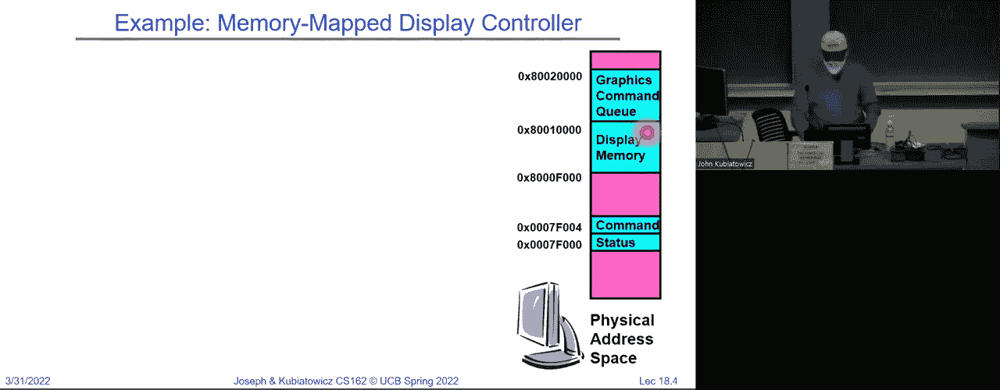
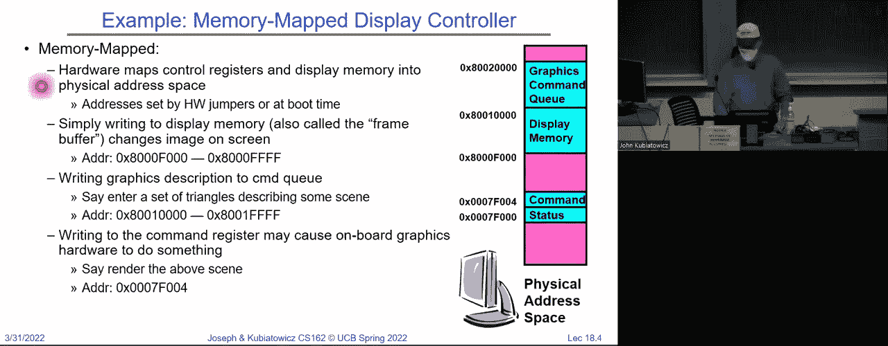
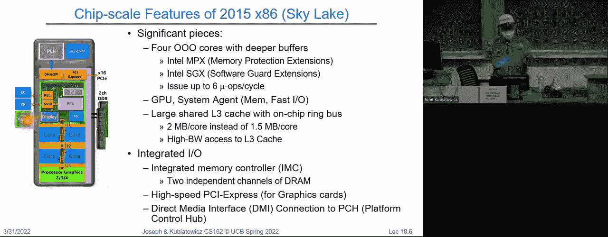
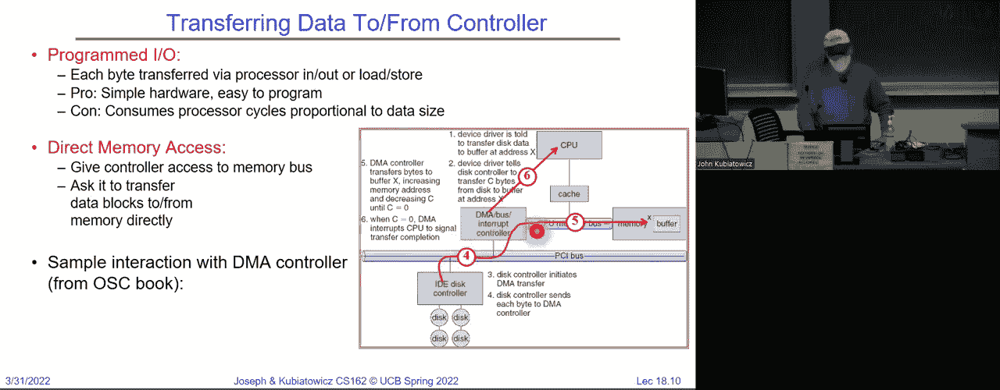
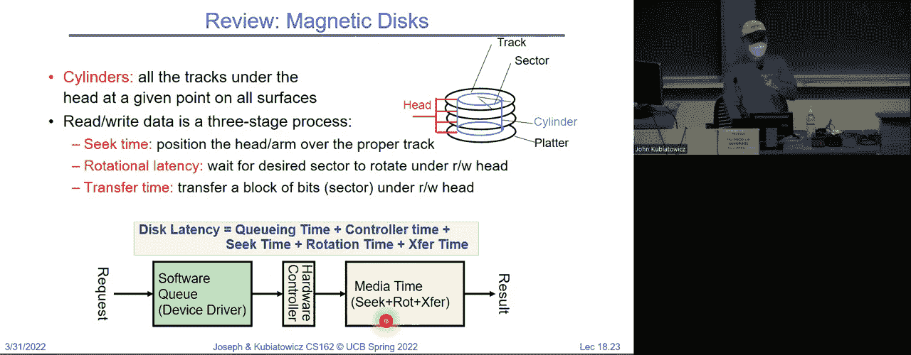
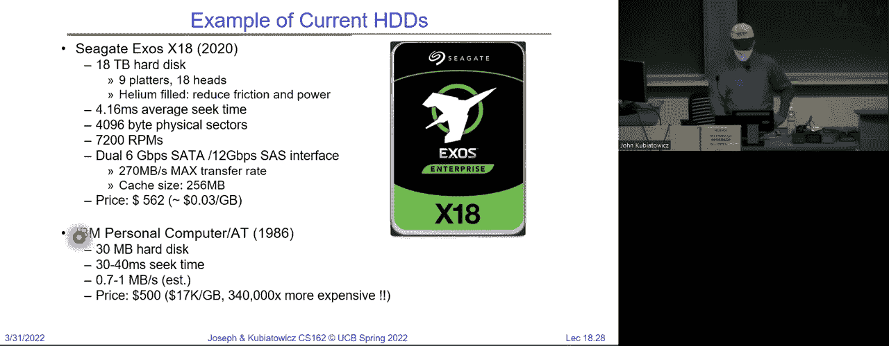

# 课程 P18：通用 I/O（续）、存储设备与性能 🖥️💾

在本节课中，我们将继续学习通用 I/O 的相关知识，并深入了解存储设备的工作原理及其性能特点。我们将探讨处理器如何与设备通信、内存映射 I/O 与端口映射 I/O 的区别、直接内存访问（DMA）机制，以及磁盘和固态硬盘（SSD）的内部结构与性能考量。

---

## 处理器与设备的通信 🔌


上一节我们介绍了处理器通过总线与设备进行通信的基本概念。本节中，我们来看看现代处理器如何具体实现这一过程。

CPU 通过一个高速、短而宽的内存总线与系统其他部分连接。为了集成 I/O 设备，我们使用适配器（通过内存总线与控制器通信）和控制器（与设备本身接口）。CPU 执行操作，通过总线适配器将指令传输到控制器，控制器随后返回响应。由于控制器位于内存总线上，我们可以像访问内存一样对其进行读写操作，从而控制设备。此外，设备能够通过中断机制通知处理器。

典型的控制器内部包含一组控制寄存器和状态寄存器，以及一些可寻址的内存块（如显示器的像素缓冲区或网络设备的数据包缓冲区）。通过读写这些寄存器，可以控制和查询设备状态。

与设备通信主要有两种方式：**端口映射 I/O** 和 **内存映射 I/O**。

---

## 端口映射 I/O 与内存映射 I/O 🗺️




端口映射 I/O 使用特殊的 I/O 指令（如 Intel x86 架构中的 `in` 和 `out` 指令）直接访问设备的控制寄存器。每个寄存器对应一个端口号。


例如，从端口 `0x20` 执行输入操作可能会读取一个特定寄存器，而向端口 `0x21` 执行输出操作可能会写入另一个寄存器。





**代码示例（x86 汇编风格）**：
```c
// 从端口 0x20 读取一个字节
unsigned char value = inb(0x20);
// 向端口 0x21 写入一个字节
outb(0x21, data);
```

内存映射 I/O 则更为通用。它将设备的控制寄存器和内存区域映射到处理器的物理地址空间中。通过对这些特定物理地址进行加载（读）和存储（写）操作，即可控制设备。内核通过页表将虚拟地址映射到这些物理地址，并可以设置页面表项（PTE）为“不缓存”，以确保读写操作直接作用于硬件。



**关键区别**：
*   **端口映射 I/O**：专用指令，地址空间独立。
*   **内存映射 I/O**：使用标准加载/存储指令，地址是物理内存空间的一部分。

现代系统普遍采用内存映射 I/O，因为它提供了统一的基于地址的访问模型。

---

## 现代处理器架构与 I/O 集成 🏗️

了解了基本通信方式后，我们来看看这些组件在现代处理器芯片上是如何集成的。

以 Intel Skylake 处理器为例，其芯片上集成了多个 CPU 核心、大型共享缓存、内存控制器以及 I/O 接口（如直接媒体接口 DMI）。所有组件通过一个环形网络互连。当核心进行物理地址的读写时，请求会通过此网络被路由：如果是 DRAM 地址，则路由到内存控制器；如果是映射给 I/O 设备的高位地址，则路由到相应的 I/O 接口。

处理器通常通过 DMI 等高速总线连接到平台控制器集线器（PCH），该集线器再提供 USB、以太网、SATA、PCI Express 等接口，用于连接各类速度相对较慢的 I/O 设备。




---

## 程序 I/O 与直接内存访问（DMA） ⚙️🚀

处理器与设备控制器交互后，数据如何在设备与主内存之间传输？主要有两种机制。

**程序 I/O**（或轮询式 I/O）是指 CPU 通过一个循环，逐个字节或字地从设备控制器读取数据并存储到内存，或反之。这种方法实现简单，但会完全占用 CPU，效率低下。

**直接内存访问（DMA）** 是一种更高效的机制。CPU 只需初始化传输（告知 DMA 控制器源地址、目标地址和数据量），随后 DMA 控制器会接管，直接在设备内存和主内存之间搬运数据，而无需 CPU 干预。传输完成后，DMA 控制器会触发一个中断通知 CPU。

**DMA 的优势**：释放 CPU 去执行其他任务，大大提高了系统整体效率，尤其适用于大块数据传输。

---


## 设备完成通知：中断与轮询 🔔


当 I/O 操作（如 DMA 传输）完成时，系统如何知晓？主要有两种通知机制。

**中断**：设备操作完成后，硬件会触发一个中断信号。CPU 暂停当前工作，保存上下文，跳转到中断服务程序（ISR）进行处理（例如，唤醒正在等待该 I/O 的线程），然后恢复之前的工作。中断响应及时，但处理开销较大。

**轮询**：CPU 定期主动检查设备状态寄存器，查看操作是否完成。轮询开销较低，但如果检查过于频繁而设备未就绪，则会浪费 CPU 周期；如果检查间隔太长，则会增加响应延迟。

在实际系统中，常结合使用两者。例如，高性能网络处理中，第一个数据包到达时触发中断，ISR 在服务过程中改为轮询模式以快速处理后续成批到达的数据包，清空队列后再退出。

---

## 设备驱动程序结构 🧩

操作系统通过设备驱动程序与硬件设备交互。驱动程序通常分为两部分：
1.  **上半部分**：与操作系统高层（如文件系统、网络协议栈）接口，接收请求，可能将调用线程阻塞并放入等待队列，然后启动设备操作。
2.  **下半部分**：作为中断服务程序运行。当设备操作完成并触发中断时，下半部分被调用，它处理完成状态，唤醒等待中的线程，并可能进行一些数据搬运工作。

这种结构使得操作系统核心部分（如文件系统）能够通过统一的接口与各种不同的硬件设备交互，实现了“一切皆文件”的 Unix 设计哲学。

---

## 存储设备：磁盘 💿

现在，让我们将目光转向重要的存储设备。首先介绍传统的旋转磁盘。


磁盘数据存储在以恒定角速度旋转的磁性盘片上。数据被组织在同心圆的**磁道**上，多个盘片同一半径的磁道组成**柱面**。磁道又被划分为固定大小的**扇区**（通常为 512 字节或 4KB），这是读写的最小单位。


访问磁盘上一个扇区涉及三个主要时间：
1.  **寻道时间**：移动磁头到目标磁道所需的时间。
2.  **旋转延迟**：盘片旋转，使目标扇区到达磁头下方所需的时间。
3.  **传输时间**：实际读取或写入数据所需的时间。



**磁盘访问延迟公式**：
`总延迟 = 排队延迟 + 控制器时间 + 寻道时间 + 旋转延迟 + 传输时间`


**性能示例**：对于一个典型磁盘（平均寻道 5ms，转速 7200 RPM，传输速率 50 MB/s），随机读取一个 4KB 块的总延迟约为 9ms，吞吐量约 451 KB/s。而顺序读取（无需寻道）的吞吐量则可接近传输速率，快得多。

因此，**减少寻道操作**是优化磁盘性能的关键，文件系统设计会致力于提高数据的**局部性**。

---




## 存储设备：固态硬盘（SSD） ⚡


固态硬盘（SSD）使用闪存芯片而非旋转盘片来存储数据，没有机械运动部件。


SSD 的基本操作单位：
*   **页**：读写的最小单位，通常为 4KB。
*   **块**：擦除的最小单位，通常由许多页（如 256KB）组成。

闪存的一个关键特性是：**页可以编程（写入）多次，但只能擦除有限次数**，且擦除必须以块为单位。因此，直接覆盖已写入的页是不可能的。

为了解决这个问题，SSD 内部有一个 **闪存转换层（FTL）**。FTL 维护一个映射表，将操作系统看到的逻辑块地址（LBA）映射到闪存芯片上的物理页地址。当需要“覆盖”写入一个逻辑页时，FTL 会将其写入一个新的空闲物理页，并更新映射表，旧页则被标记为无效。后台的**垃圾回收**进程会收集无效页，擦除整个块，并将有效页搬移到新块，从而回收空间。FTL 还负责**磨损均衡**，将写操作均匀分布到所有闪存块上，以延长 SSD 寿命。

SSD 的访问延迟公式简化为：`总延迟 = 排队延迟 + 控制器时间 + 传输时间`。由于没有寻道和旋转延迟，其随机访问性能远优于传统磁盘。

---

## 总结 📚

本节课中我们一起学习了：
1.  **处理器与 I/O 设备的通信机制**，重点区分了端口映射 I/O 和更通用的内存映射 I/O。
2.  **数据搬运机制**，对比了低效的程序 I/O 和高效的 DMA 方式。
3.  **设备完成通知**，了解了中断和轮询两种方式及其适用场景。
4.  **设备驱动程序**的基本结构及其在操作系统中的作用。
5.  **两种主要存储设备**：**磁盘**的机械结构、访问时序和性能特点（强调寻道开销）；**SSD** 的闪存特性、FTL 层的关键作用（映射、垃圾回收、磨损均衡）及其性能优势。


理解这些底层 I/O 和存储原理，对于后续学习文件系统如何高效组织和管理数据至关重要。