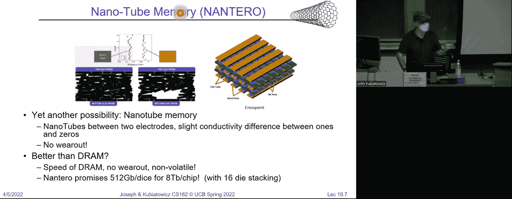
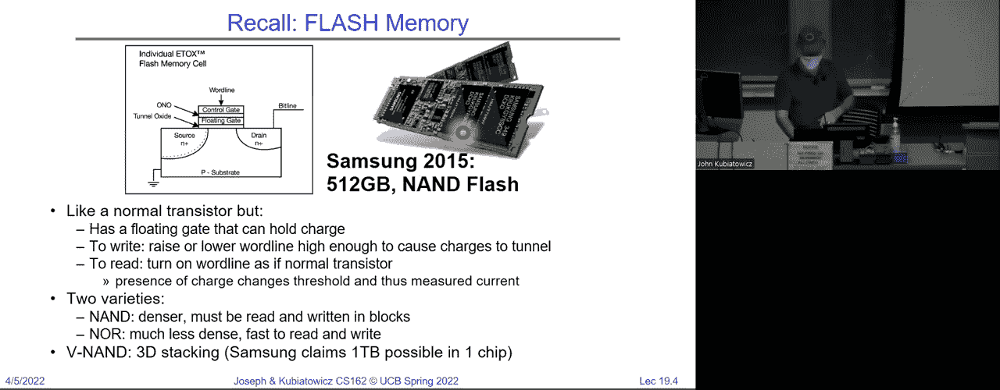
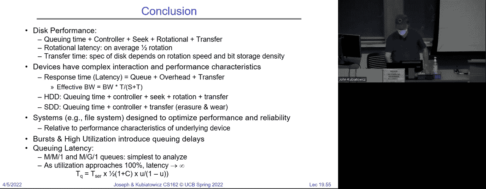

# P19：讲座19：文件系统1 性能（续），排队理论，文件系统 - RubatoTheEmber - BV1L541117gr

好的，大家准备好了吗？

欢迎回来。再次提醒，我们上次讨论了硬盘和固态硬盘（SSDs）。其中包括一个磁盘的示例，它有多个盘片，双面。你可以把它看作一个圆柱体，它是所有轨道的集合，这些轨道是同心圆。并且从堆叠的最上面一直到底部。我们之所以把它看作圆柱体，是因为磁头是一起移动到一个给定位置的。

圆柱体，然后旋转以实际读取扇区。好的，磁头之所以必须一起移动，原因是磁头技术非常昂贵且复杂，它是一个商品设备，因此你不能负担得起拥有独立的磁头。所以我们之前提到过性能模型，寻道时间。

移动的时间是将磁头移动到右边的圆柱体的旋转延迟。获取正确扇区的时间，然后是传输时间，也就是将块传输出去的时间。因此，硬盘延迟的总模型包括寻道时间、旋转时间和传输时间，但它还包括一些其他元素，比如排队延迟，我们稍后会讨论。

今天我们讨论硬件控制器时间，你可以理解为这就是控制器告诉硬盘做什么的时间。

好的，我们还讨论了一些典型的数字。例如，如果你查看一块西部数据18TB的硬盘，它的密度是每平方英寸超过1TB，寻道时间大约是4到6毫秒，而常见产品的旋转延迟大约在3600转/分钟到7200转/分钟之间。

但是服务器的转速可以达到15,000甚至20,000转/分钟。好的，在我继续之前，有没有关于硬盘的问题？如果你仔细想想，磁头移动到正确轨道然后旋转、找到数据的过程意味着它具有显著的优势。

当我们开始构建文件系统时，我们要利用局部性优势。所以今天我们将稍微讨论一下这个话题，下一次肯定会详细讲解。

好的，我们还讨论了由闪存构成的固态硬盘（SSDs）。我想展示这张幻灯片，这是我上次没有展示的，目的是给你们提供一个关于闪存工作原理的另一种理解。这是硅，掺杂硅，你们可能在16级的课程中见过。通常情况下。

在顶部有一个单独的门和控制线，你得到一个晶体管。当有高电压时，电流会流动；没有电压时则不会。使用闪存时，实际上你在其上放置两个门，中间有绝缘体。因此，您看到的这个浮动门，哦，等一下，您看到的这个浮动门。

不要去做它们。中间的晶体管两侧是绝缘的。因此，你可以选择是否将一堆电子存储在其上。如果存储了电子，它会改变晶体管的性质，以至于你可以检测到它。好吧，明白了。闪存会磨损的原因是因为这些电子基本上被卡住了。

每隔一段时间，它会嵌入到绝缘材料中。所以，当你将这些足够多地放进去时，最终它就不能正常工作了。好吧。那么，关于SSD的总结，也就是我们上次讨论的内容，实际上是这样。优点是低延迟和高吞吐量，且没有移动部件。

这是一个可靠性的巨大优势。而且你可以几乎以内存速度读取数据。这些设备的缺点曾经是，它们的存储容量远小于硬盘，而且更贵，除了现在这些都不再成立。记得我曾经给你们展示过，你完全可以轻松地得到一个15TB的SSD。

现在它稍微贵一点，但获得存储空间已经不成问题了。还有一些其他有趣的问题出现，我们在这门课中没有很多时间讨论与硬盘不同的闪存文件系统。不过，有一个奇怪的概念，就是你必须一次性擦除整个块组。

所以，SSD的控制器需要做更多的管理工作，才能确保其良好运作。好吧，此外，SSD必须意识到元件会磨损。但是情况在迅速变化。还有一件有趣的事情，上次我给你们展示了那个100TB的磁盘，嗯，你可以把它放进一台普通计算机里。

现在，当然它是 $40,000。确实比几台计算机还要值，但你知道，或许你可以把它放到云端去做。

好的，我想提到的最后一件事是，如果你对持久性内存感兴趣，它总是很有趣，看看未来会有什么新发展。

对，所以举个例子，当闪存最初出现时，它有几种不同的使用方式，其中一些就像一个存储卡，其他的则进入SSD并配备了控制器等一切组件。

类似地，还有一堆持久性内存技术。这是我最喜欢的一种，虽然它还没完全实现，那就是由纳米管内存制成，它具有交叉哈希图案并且是三维的，用来存储比特。1和0之间的区别在于，是否所有的纳米管都……

是否对齐，你可以通过电阻来检测这种差异。而纳米管内存的酷炫之处在于它不会磨损。好吧，而且它的速度也可能和DRAM一样快。所以，SSD的速度还没有那么快。因此，总有一天，会有一大堆潜在的技术出现。

事实上，当我们在五年后或其他时候教授这门课程时，可能会全部讲述内存持久化的事实。没有磁盘。而问题在于，当你重启时，它会恢复之前的所有内容。所以重启不再是清除 bug 的好方法。对吧？这就是未来的趋势。

这还不算太远。

好的。好了，现在我们来换个话题。让我们在进入文件系统之前，先讨论一下性能测量的方法。好的。所以你可以测量诸如时间和速率之类的东西。你可以测量延迟，也就是完成任务的时间。这很简单。比如我想从磁盘读取一个块，花多长时间？这个时间是以秒为单位的，对吧？秒、毫秒。

微秒，小时，年。另一种可能相似的概念是响应时间，也就是启动一个操作并获取其响应的时间。如果你考虑像开销等因素，响应时间可能与延迟不同。而在另一种情形下，还有吞吐量和带宽之类的概念，也就是每秒可以传输多少数据。

访问次数是每单位时间内可以进行多少次，或者每秒可以获取多少字节？

然后是开销，也就是实际启动操作的时间。通常你会向控制器发送请求。在请求发出之前会有一个固定的时间间隔，可能是微秒或者毫秒，在磁盘收到请求之前。这将是纯粹的开销。好的。所以大多数 IO 操作大致是线性的。

这是一个非常简单的模型，通常是有效的，延迟是位数的函数。记住小写的b是位。是开销加上位数再除以传输能力，这就是每秒可以传输多少位。好的，非常简单的模型，稍后我们将向您展示一些相关内容。

这最终是人们关心的内容，但它到底意味着什么呢？好的。顺便说一下，这里问的问题是，为什么这个是 P 字节，那是一种排序方式。那么，性能到底意味着什么？是指更快的速度吗？

这是否意味着更低的延迟？是否意味着更高的吞吐量？所以每当有人说，这个性能更高时，你的第一个问题应该是，你是什么意思？

如果有人说它性能更好，那应该是你首先问的问题。好的。因为你得知道你在测量什么。好了，接下来是一个例子。假设我们有一个每秒一吉比特的链接。如今，这是低端地方常见的标准以太网链接。

实际上，这意味着我们可以从这个链接中获得每秒 125 兆字节。好的。我刚刚将一吉比特除以 8。好的。启动成本，假设是毫秒级别，仅仅为了论证。于是我们可以构建一个看起来像这样的模型，底部是我们想要在数据包中传输的位数。

然后我们可以看到蓝色的延迟和红色的带宽。所以我把两个不同的刻度放在同一个图表上。我希望你们不介意。但我们能从中学到什么呢？嗯，延迟这里有启动成本加上比特数除以这个最大速率。好的。如果你使用比特，你就得处理。

比特或者字节，你就得处理字节。但这个S加B除以B看起来就像一条直线。对吧？因为它对B是线性的。所以这就是我们的蓝线。并且请注意，传输零比特时，仍然需要一毫秒。这就是为什么拦截点在一毫秒或者一千微秒的位置。顺便说一下，自从我上周二的讲座之后，你们现在已经搞清楚所有这些单位了。

对吧？是的。所以我们在处理的是10的幂次或者2的幂次。10的幂次，对吧？

因为我们在处理带宽。好的。所以传输这么多比特的有效带宽是B除以S加上B除以B。所以这是我传输的比特总数除以延迟。这样就能给我每秒比特数。好的。这就是这个红色曲线。所以请注意，尽管在最佳情况下，我可以获得每秒125兆字节，但它需要。

一个非常大的数据包来克服这个开销并获得完整的带宽。好的。有什么问题吗？明白了吗？好吧。现在我们可以谈谈这个关键的虚线，也就是半功率点。这就是或者半点。通常这就是为什么它没有推进。它就是这个数字。

我有半带宽的B值。好的。所以通常情况下，半功率点就是这个虚线，它是一个有趣的点，因为它意味着你不会被启动开销压倒。你基本上已经开始逐渐克服这个原始开销。所以一个链接，顺便说一句。

问题是，这里有一个链接吗？我们在谈论的是网络。所以一个链接就是一个以太网电缆或者传输的某种东西。好吧。那么在这个例子中，半功率带宽出现在B为125千字节时。好的。顺便说一下，回答上一个问题，B实际上是一个变量。我们在看这里的单位。

这是千字节，在这种情况下。那么这个从哪里来的？

我们找到了B的值，使得带宽的值达到一半的带宽。这个一半的带宽是125千字节。现在对我来说有趣的是，如果我们将开销增大，比如对于一个磁盘，假设是10毫秒，那么同样的概念，半功率带宽现在适用于一个大小为1.25兆字节的数据包。

在我们之前的半功率点是125千字节。这意味着当你传输一个大小为125千字节的数据包时，你将至少使用一半的带宽。这里的10毫秒启动成本表示，如果我们没有得到1.2兆字节大小的数据包，

我们并不会获得完整带宽的一半。好的，所以当开销增加时，你就得想办法减少这些开销。可以通过使数据包变得异常大，这不总是实际可行的，或者通过比如说，在磁盘的情况下，尽量避免过多寻址，这样会减少开销。好的。

有问题吗？是的，抱歉，我刚才说错了。小写字母 b 是变量，表示你传输的数据量。我在这里显示的是比特。好的，而大写字母 B 是常量，表示字节。所以这里再次强调，小写字母 b 是常量。因此，我在这些幻灯片上应该做的是，去掉公式中的小写 b。

也许这样可以减少一些混淆。好的，我会这样做。好了。那么，是什么决定了峰值带宽呢？记住，峰值带宽是指你最终会达到的那个点——一个任意大的数据包。你会达到峰值带宽，这就是保证不会超过的带宽。好的。

所以，一个千兆位网络链接，保证的最高带宽是千兆位，对吧？

那么，是什么决定了这一点呢？在以太网的情况下，它是由协议决定的。如果是千兆以太网，你就无法从中得到超过千兆的带宽。但系统中有很多因素决定了带宽的上限。例如，关于总线，你可以看到像 PCIX 这样的总线，它是一个非常老旧的总线，提供大约每秒 1 吉字节的传输速度。

比如说，Thunderbolt 是另一个很多人使用的接口，尤其是在英特尔机器上。它的传输速度可以达到每秒 40 吉比特。所以它的速度差异非常大。因此，当你尝试弄清楚是否能达到完整带宽时，你需要从弄清楚瓶颈带宽在哪里开始。

所以，设备传输带宽是另一个可能造成瓶颈的因素。例如，磁盘的旋转速度，如果磁盘的转速是原来的一倍，那么你能从磁盘上获得的传输速率也会是原来的两倍，因为数据在磁头下方的传输速度是原来的两倍。好的，这就是为什么高性能系统会使用 15,000 或 20,000 转每分钟的磁盘。

这些磁盘通常是 15,000 转每分钟的磁盘。好的，路径中的瓶颈决定了最高带宽。是的，如果我们提高磁盘的转速，你是指它旋转的速度吗？这会做几件事。好的，它不仅会减少旋转到指定扇区时的开销。这个开销会减少。而且当你从磁盘读取数据时，

比特数据传输速度是原来的两倍。好的。所以，提高磁盘转速实际上加速了几件事。现在，移动磁头进出时的延迟是一个难点，因为那是物理问题。我的意思是，转速有个好处，你可以把它转到某个速度，并且它基本上会保持在那里。好的，关于移动磁头。

这取决于你实际上能多快准确地移动磁头。这是一个更难改进的地方。它一直在改善。过去，访问延迟是15毫秒或20毫秒，而现在我们已经降低到了4毫秒和6毫秒。它在改善，但进展并不快。

好的。所以这就是纯粹的开销。还有其他问题吗？是的。那么，半功率带宽对应哪个数据包大小，在这种情况下是，但是我发送的那个数据包大小是多少，才能从我的系统中获得一半带宽。好的。问题是，当我发送数据包或从磁盘取出某物时，存在。

原始开销，我就能从中获取完整带宽。所以因为有开销，你不能简单地做你需要做的是确定，哪个是最大的数据包大小，以便从中获取一半的带宽。这就是半功率点。好的。好的。还有其他问题吗？现在。

所以这里的问题是，再次问，得到一半带宽究竟是什么意思？

这意味着这条红色曲线，表示包的大小，表示我能得到多少带宽？

这里的包大小是多少，带宽是最大带宽的一半？

这是半功率点。明白了吗？事实上，上一张幻灯片展示了这一点。真正的有效带宽是需要考虑这些开销的。因此，如果没有开销，S为1或0，我的意思是有效带宽将恰好是1千兆，比特率不会存在半功率点的问题，但这里有开销。

这就是为什么我们必须考虑这一点。好的。那么，带宽越高越好。是的，但你不能总是得到更高的带宽，但你会尽力获取可用的带宽。那么，接下来我们从建模的角度来看看其他几个因素。假设我们有一个操作，服务器将执行，并且它需要L的延迟。

总是需要恰好L的延迟。然后我们得到类似这样的东西，好的。我们首先做第一件事，然后做第二件事，再做第三件事。它们的时间长度都是相等的。如果这是对的，虽然它永远不可能发生，但如果它是真的，假设L是10毫秒，那么B就是这里的那个大B。

我们每秒可以执行的操作数是 100，因为 1 除以 10 毫秒等于每秒 100 次操作。好的。这只是链路的倒数。如果链路是两年，我不知道这代表什么，也许是指种植一株兰花之类的。我不确定。然后你得到的兰花数量将是每年半株兰花。好的。

1 除以 L。所以这是你可能遇到的最简单的情况，它实际上从来不会这么顺利。好吧，但让我们假设，这就像是 61C 的材料，我提醒大家这个例子。所以，例如，这适用于处理器、磁盘驱动器等设备。假设你有一个管道，其中某个项目需要 L 时间，但你可以将其分为三个独立的部分。

这些是可以相互独立完成的部分。记得 61C 的内容吧，大家还记得吗？

所以我们可以让蓝色、灰色和绿色代表不同的管道操作，以便实现那个完整的 L，对吧？首先做一个蓝色操作，然后是一个灰色操作，再做一个灰色操作，最后完成。这样看起来是这样的。这里是第一个操作。注意，每个单独的项目仍然需要整整一个 L 来完成，但它是通过先做第一个、第三个操作来实现的。

第二个第三，第三个第三。这意味着如果我们像这样进行管道化处理，那就是当我们执行蓝色操作时，我们可以对下一个操作执行绿色操作，或者对当前操作执行灰色操作，同时对前一个操作执行绿色操作。所以我们正在进行管道化处理。

这对大家来说很熟悉吧。那么现在我们可以谈谈速率。比如说，如果 L 是 10 毫秒，总共四个管道阶段。这意味着，我们不仅能以每秒 100 次操作的速率运行，实际上可以让 400 次操作通过，因为管道正在工作。好吧。实际上你也可以说，每一个小的操作都是 L 的四分之一。

L 的单位时间内，我们基本上可以获得 4 次操作。好的。现在。所以有很多系统管道。我们与你们讨论性能的原因是让你们开始思考，如果我有一个系统，带宽瓶颈在哪里？是什么限制了我的性能？

那么，开销等问题呢？比如说，你可以想象，在这里，举个例子。你有一个用户程序，它通过系统调用来访问文件，然后必须通过文件系统软件，再可能通过驱动程序的上半部分和下半部分。

驱动程序最终到达磁盘。所以我们可以看一下管道，其中一个进程在进行系统调用，另一个在处理文件系统，再一个在设备驱动程序的上半部分，最后一个在设备驱动程序的下半部分。所以这些管道几乎无处不在。

不仅仅是在61c中的处理器流水线里。好的。因此，任何与队列相关的东西，基本上都表现得像流水线一样。好的。这些队列会成为我们的一个问题。我们需要讨论一下实际的排队行为。好的。现在。

你还可以做的另一件事，你在61c课程中也听过，就是我可以有一堆L任务，如果我给它们配上多核处理器，我就能让一堆L任务并行进行。好吧。现在我也可以将它们拆分开。所以如果我有四个核心，每个任务需要10毫秒，那么我也可以让400个操作同时进行。

这样就能同时完成，但这是因为它们现在是并行执行的。好的。你看到了流水线的不同，我把它分成了若干部分，并且有了流水线。并行性，每个部分保持不变，它们都同时经过多个处理。那些只是构建系统的不同方式。当然，这些内容也在61c中有所涉及。

你看到这就是多核处理。好的。所以又是大量的并行性，在这里我们可以有一堆用户进程，同时提交系统调用，也许文件系统和驱动程序中有很多并行性，并且有多个磁盘。因此，我们可以有多个操作同时进行。

好的。那么，有没有人能告诉我，如果我们想像这样利用并行性，我们可能会遇到什么问题？有没有人能提出在这里可能出现的最大问题是什么？

同步问题。很好。是的。好的。因为如果有一个文件系统，而很多人同时访问它。你可以想象，虽然你现在可能还不了解文件系统的细节，但你可以想象它们都是使用共享数据结构，如果我们没有良好的同步机制，那么一切都会变得混乱。因此并行性，就像我们之前在学期初讨论的线程级并行性。

在IO系统中，我们需要确保我们的并行性不会妨碍系统的正确性。好的。就像这门课，你不会忘记我们早期教给你的内容，你只是需要将其应用到不同的主题上。好的。那么，让我们回到IO模型的问题上来。

这是来自用户的一个线程，它将生成某种IO请求。我暂时不考虑文件系统之类的内容，假设它是在访问磁盘。那么发生的事情是，这个请求被放入队列中。好的。它可能是放在控制器前的队列中，也可能是在操作系统或设备驱动程序中的队列。

然后有一个控制器从队列中取出任务，并将其发送到IO设备。好的。因此，响应时间通常是队列等待时间加上IO设备的服务时间。所以这很重要。那个绿色的部分是在获取响应的主要路径上，对吧？因为你的请求必须先通过队列，然后通过控制器。

然后再返回。所以你可以想象，如果队列已经完全满了，这个控制器可能会非常快速地处理事情，但当你把请求放进去时，它仍然需要排空队列，才能让你排到前面，然后被处理。好吧。所以一个大的队列就意味着较长的延迟。好吧。这就是麦当劳的类比，对吧？

你真的很想要那个麦旋风，或者你正在追求的其他东西。你走进麦当劳，排了很长的队，你得等队伍排完，才能到柜台点餐。好吧。相信与不信，这个排队的过程对延迟的影响，比通常推荐的要重要得多。

所以当我们观察IO系统的性能时，你知道，我们有一些指标，比如响应时间和吞吐量。我们可以开始谈论有效带宽，在这里我们有我们尝试执行的操作数。可能还会有一些开销，然后是每个操作的时间。这看起来正好与我之前给你的简单模型一样，对吧？因为它是相当普遍的。

它无处不在。不同的是，我们开始需要解决看起来像这样的事情。好吧。这种情况有点线性，或者稍微有点向下凹的趋势。完全是另一回事。好吧。注意我在底部标记了它，0%到100%。这代表的是设备的完全利用率。

所以100%的利用率意味着设备始终处于工作状态。完全繁忙。0%意味着设备空闲。我们有一些开销，但注意这种行为：当你越接近100%容量时，延迟会越来越大。在你在伯克利的职业生涯中，你会遇到许多类似的情况。

响应行为。好吧。今天我们要讨论的是这些行为的来源，但你也需要意识到，这是一个普遍的工程模式。有几个需要考虑的点。如果你设计一座桥梁，并计算其承重的最大容量，假设它是100%。

你想让桥梁以100%的容量运行吗？不，对吧？那听起来一点也不聪明。好吧。所以，一旦你确定了100%的点，任何100%的情况都会变得非常重要。但队列的另一个问题通常是，由于简单的随机行为，我们稍后会讨论，一旦你接近100%，延迟就会增大。

趋向无限增长。好吧。现在任何真实的系统当然不能无限增长，但它会变得任意大。有人能猜到我们在增长过程中发生了什么吗？队列在增长。太棒了。完全正确。队列的增长速度，远大于一些微小变化所带来的增长。

在利用率方面。好吧，这很通用。所以对延迟的贡献因素。如果我们考虑用户线程提交请求，然后收到响应。软件，大致可以通过队列来建模，硬件控制器，I/O 设备服务时间。它不容易受干扰，但队列行为非常重要。

我不知道你们上过的其他课程是否关注过队列。我们不会讲太多内容，但我想给你一些关于队列的简单概念，这样我们就可以用简单的方式讨论性能了。好吧。现在，让我们从一个非常简单的情况开始。这里是一个简单的确定性世界。

不幸的是，世界不是确定性的。但假装它是确定性的几分钟总是让人觉得不错。那么我在这里是什么意思？

所以我有一个队列在服务器前面。顺便说一下，这台服务器可以是一个控制器加硬盘，也可以是麦当劳，随便。假设项目每 T 子 A 秒准确到达一次，然后我们知道服务器只需要 T 子 S 秒来处理。请注意，T 子 S 是什么？

它比 T 子 A 短。明显短。好吧。那么这里会发生什么呢？嗯，到达的请求会出现。它会被放入队列，但基本上会立即被取出，因为队列是空的。然后我们会处理 T 子 S。处理完后，队列现在为空，整个服务器设置为空闲状态。好吧。

从服务器的忙碌程度来看，显然不是 100%。事实上，正如我在这里的图示，处理率不到一半，对吧？

所以那台服务器真的很空闲。好吧。在这个特别有用的情况下，我们假设是确定性的，所以所有请求都是按固定间隔到达的。处理有固定的时间，之间有足够的时间。我们可以开始谈论服务速率，就是服务器处理事物的速度。

它是 1 除以 T 子 S。所以它需要 T 子 S 时间，1 除以它是服务速率。好吧，就像之前几张幻灯片中的 1 除以 L 是我们的服务速率一样。到达率是事物到达的速度，是 1 除以 T 子 A。你能告诉我关于 Lambda 和 Mu 的什么呢？怎么说？对，没错。

所以 Lambda 的 1 除以 T 子 A 小于 1 除以 T 子 S。所以这看起来是一个不错的情况。好吧。通常我们讨论利用率时，是 Lambda 除以 Mu。Lambda 小于 Mu 意味着我们没有达到 100% 的点，没关系，一切都好。因为事物到达的速度小于它们可以处理的速度。

出来了。现在，平均速率是一个完整的世界。所以在我们所处的理想世界中，如果我们从零到一，那就是 100% 的点，当到达速率低于服务速率时，最棒的是我们可以立即处理。所以队列从不会积压，最多它上面会有一个项目，然后被立即取走。所以这是很棒的情况。但这从来不会发生。

这很好。但是，如果你注意到这种情境，我们尝试提供超过100%的负载，**会发生什么**？嗯，我们会开始饱和。所以设备将尽可能快地输出，但项目的到达速度超过了设备处理的速度。因此队列会增长。好的。

所以当我们处于TS/TA大于1的模式时，发生的事情是我们开始增长。队列会越来越长。好的。所以你也许可以说这是你在麦当劳，但有一堆旅游巴士不断到达并把人们送到门口，他们都要去排队。

McFlurry。好的。现在，当公交车停止时，队列会清空，我们又能快速地拿到冰淇淋了。好的。那么，队列的等待时间看起来怎么样，正在以由TS与TA的比例决定的无界速率增长吗？

我们来看看现实情况。那么现实中，没有什么是确定的。好的。我很抱歉告诉你这个。如果你还没有意识到这一点，可能今天对你来说是一个难过的日子，但这个世界上没有什么是确定的。好的。即使是在量子层面也是如此。那么发生了什么呢？

那么我们来看一下一个情况，在这个情况下，平均到达速率是相同的。好的。所以平均到达速率仍然是1/TA，但我们将会有一堆到达。所以会有一堆人，然后暂停，接着又有一堆其他人到达。好的。这就是突发性情况。好了。这是一个更好的与公交车进行比较的情况，因为公交车会停靠。

但是人们下车，公交车离开，另一辆公交车到达。一堆人下车。那么看这里发生了什么。第一个项目到达后，立即从队列中取出并开始服务。好的，到目前为止看起来和我们之前的幻灯片完全一样。然后另一个项目出现在下一个突发时间段，它是白色的，现在白色的。

将会一直排队，直到蓝色那辆被服务。好的。那么这个，这个白色矩形这里是不高兴的，因为他们没有人排队时，拿到冰淇淋的时间会比预期的要长。接着橙色出现了，注意看它们是如何在这些小刻度处到达的。

所以橙色到达了，排在队列里，白色排在它前面。接着灰色来了。好的。现在我们处于突发的末尾。但注意我们队列里有三项。因此队列不再是空的了，里面有东西。而且一旦蓝色完成。

很棒的是，现在白色可以进入服务器，而橙色排在前面，灰色在后，明白发生了什么吗？然后我们再往下看，最终浅蓝色的那个也被服务了，我们可以继续了。队列甚至有一段时间是空的。好的。

但我们可以设定一个情况，让它们的到达速率平均上与确定性情况完全相同。但请注意这里的不同。不同之处在于，这里有些人非常不开心。看看这个浅蓝色的人，他在深蓝色的人后面稍微晚了一点到达。

但看看他们在排队时等了多长时间。好了。所以在突发场景中，队列开始堆积起来。问题。办公时间简化。是的，非常好。今天，今天我在展示一个关于办公时间的模型。是的，我为此道歉。除了这和实际办公时间情况有多接近之外，还有其他问题吗？

所以一旦我们开始出现突发性或非确定性，我们就开始遇到问题。问题实际上是，如何建模这种突发性？

有一个数学框架非常适用。如果你从像这样的指数分布开始，它表示下一个到达的时间f(x)是lambda e的负lambda x次方。好了，其中平均到达速率是1/lambda。所以lambda是一个速率。这个被称为无记忆分布。

好了，曲线是这样的，我绘制了从现在到下一个到达之间的时间。好了，x轴上。这是一个概率分布函数，因为它告诉我，我得到某个时间间隔为2的人的概率是多少。有人知道无记忆到达的含义吗？是的，完美。

那么条件概率，如果我已经知道自己等了两秒，接下来继续等待的概率是多少？结果是，如果你做条件概率，对于那些记得这个概念的人，并且你重新缩放图表，它看起来完全一样。所以这个模型对于伯克利的突发公交非常适用，对吧？你坐在那里等公交，无论你等了多久都不重要。

你将要等待的时间分布在重新缩放后是一样的。好了，它是无记忆的。这就是它的意思。好了，现在，关于无记忆分布的好处是，它容易代入到其他东西并作为模型使用。你可能会问，它现实吗？嗯。

结果发现，许多物理过程在将多个过程结合在一起时，往往会表现出像无记忆到达速率那样的特性。所以很多时候，如果你不知道实际的分布是什么，通常人们会说，假设它是无记忆的，我们来计算一下，计算一下。

速率。好的。Lambda。然后我们将使用一个无记忆分布，并将其代入我们的公式。现在，你可能会遇到许多不同的争论，在70和170课程中，他们会经常讨论这个问题。你知道，这是不是一个公平的表述？并不总是。但这是一个人们经常使用的表述。好了，我在说什么？

我是说，如果你没有更好的理解，你假设它们都是相互独立的，且具有无记忆的分布，并且只有λ，一个参数，你需要找出它。好的，那么这对我们有什么意义呢？如果我们有一个突发的无记忆的突发行为，实际上这意味着有一些。

到达时间非常接近的情况，然后是一些长尾到达时间。所以如果你看看这里，有很多短的到达时间，也有一些偶尔的长时间到达。所以我们可以谈论一个具有无记忆到达的队列。好的，并且有一个平均到达时间，就像我们之前讨论过的那样，即1除以λ。所以很多短的，到达时间少数长的。好的。

所以我会告诉你，很多人并不试图得到一个超准确的模型，他们会从无记忆的角度来考虑问题。所以我们将继续使用这个方法。好的，快速提醒你们一些常见的随机分布。所以你们都知道，如果服务器花费时间t与客户互动，我们可以看一下。

服务时间的分布。所以你可以这样想，当你到达麦当劳的柜台时，这是获取你的麦旋风所需时间的分布。好的，分布的中间有一个平均值，旁边是一些分布。好的，那么均值就是你将概率加起来，或者将曲线下的面积加起来得到的结果。

好的，方差就是你当你将概率乘以(t减去均值)后加起来的结果。好的。所以，你们对方差的平方根也很熟悉，那就是标准差。所以这就是你们考虑期中考试时的一种方式，对吧？均值大概是52，遗憾的是，标准差是12还是类似的数值，对吧？

所以方差的平方系数可能是你不太常见的东西。它是方差，σ²除以均值的平方。C的好处是C没有单位。因此，我们可以得出一些无单位的排队方程。如果我们知道C的值，我们可以将其代入并得到一个好的近似值。

发生了什么事情。那么例如，这里的重要值C是当C为零时，我们回到确定性。为什么会这样呢？嗯，如果C为零，唯一可能发生的情况是σ²为零，这意味着没有标准差，所有事情都会花费相同的时间。

或者是确定性的。另一个是这个老牌的无记忆情况。记住，这是你用来描述伯克利的公交车的方式，C等于1。因此，通常当C等于1时，这通常意味着是一个无记忆的情况。最后是磁盘响应时间，很多人都测量过磁盘的性能。

它们的C值稍微大于1。所以这不是内存无关的，实际上1.5意味着大多数寻道操作的延迟会小于平均值。有没有人能想到为什么大多数寻道操作的延迟会小于平均延迟？

记住，寻道操作意味着磁头的移动，它是一个代价较高的过程。对的，再说一遍。好的，因为很多东西都在同一位置。对。所以文件系统是好的。那些试图利用局部性的文件系统，尽量确保你不需要大幅度移动磁头。所以如果你把文件系统做得非常好。

那么，你将会有更多的局部性，并且大多数的寻道操作会比平均值少。这就是为什么很多时候人们会说C等于1.5。好的，当然，前提是你要构建一个好的文件系统。如果你没有构建一个好的文件系统，你是得不到这样的结果的。好的，问题来了。这些都是你们已经知道的，对吧？

现在我们来谈谈排队问题。好的，排队理论是一个完整的主题。这里有谁上过关于排队理论的课程，或者听过关于排队理论的讲解吗？没有。好的，我们是第一个。我觉得很荣幸。排队理论是一个非常复杂的主题，你可以专门学习一个完整的课程，但我会给你一个非常简单的模型，这个模型对于一些情况来说非常有效。

我们在这门课上讨论的内容是这样的。这个模型是我们在前面假设有一个排队队列，假设有一个控制器和一个磁盘。我们将会查看整个排队系统，正如我在这里用青色标出的部分。这是有一些到达的请求和一些离开的请求。如果你还记得高中化学的内容，记得提到过详细平衡。

在化学中有一个观点，反应发生的速率和反应不发生的速率会相遇到一个点。这是最后的阶段。所以在排队理论中，到达和离开的速率在平均情况下是相等的。在这种情况下，你就得到了一个稳态。好的。

所以我们在这门课上讨论的排队理论，或者说在这次讲座中的排队理论是稳态排队理论。这并不是处理瞬态启动行为的内容。那是一个更加复杂的主题。好的。所以当我们谈论为某个问题构建一个排队模型时，我们谈论的是稳态行为。好的，顺便说一句。

有一系列由Kleinrock所著的书，关于排队理论的经典书籍。如果你想深入了解，可以去读一读。好的。但今天我们只讨论稳态排队理论。好的。到达事件由某些概率分布来描述。我们之前展示过一种可能的内存无关的情况，对吧？那是一个选项。好的。

离开事件则由一些概率分布来描述。关键是从请求到达的那一刻开始，到你得到答案的那一刻，延迟是多少？同时，平均队列长度是多少？

这就是我们关心的两个问题：时间和队列大小。好吧。所以我想向你介绍Little定律。好吧，这只是一个小定律，但它是一个很好的定律。Little是他的姓氏。基本的想法是，如果你有一个到达某个系统的情况，并且有离开的人，到达的速率是lambda，一般情况下，队列里有L个项目。

那么，你能说什么呢？嗯，在任何稳定的系统中，正如我们刚才所说的，到达率等于离开率，系统中的平均工作数量是N。抱歉，我之前说L是工作数量，L其实是你等待的延迟时间。你可以在这里看到，工作数量N等于lambda乘以L，结束。

所以如果你知道lambda的值，并且知道通过系统的平均延迟时间，那么你就知道有多少工作在积压。而有趣的是，这与是否有无记忆性到达，或者其他任何情况无关。它在所有情况下都适用。好吗？

所以无论是结构，突发变化，瞬时变化，还是其他任何情况，它们都会在平均值中消失。好吧，所以如果你知道lambda的值，知道做一个请求的时间，你就可以计算出队列里有多少个工作。这个会很有趣。

所以，顺便提一下，之前的问题，为什么无记忆性意味着C等于一？

你只需要把它代入公式。好吧，因为对于无记忆性，sigma平方除以M平方等于一。好吧，这里有一个简单的例子。看，如果我们通过系统的延迟是L等于五，且每秒到达一个项目，那么你很容易就能看出，系统中每次都有五个工作。有人不同意这个理解吗？看起来很简单，对吧？

如果他们每秒到达一个人，你花五秒才能进入，那么平均有五个工作。这样理解怎么样？你去麦当劳。今天我为麦当劳做了很多免费的广告，我甚至不喜欢麦当劳，不过随便吧。你走到门口，往里看，麦当劳里面排了一大堆人在等。

好吗？你走到柜台，到你到达柜台的时候，如果你转过头，回头看，排队的人数是一样的。好吗？

这就是所谓的稳态。明白吗？

所以这就是这个公式为什么有效的原因，因为如果你看人们到达的速率，嗯，然后你看自己花了多长时间，转身看看，你知道。在你排队的这段时间里，人们以那个速率在进来。你将你在那里花的时间乘以那个速率，就可以得出排队的人数。好吗？

非常简单。现在，这是小利法则。这里有一个非常简单的示意图。准备好了吗？一，二，三。戴上你们的证明示意帽。如果你看看一堆物品，每个物品需要L的时间，它们的分布是随机的，系统的观察时间是T。

所以我们要对大T进行平均。怎么知道系统中工作的平均数量是多少？

好吗？这非常简单。我们说，假设这里是某个时间点的工作数量。怎么知道的呢？这里有一，二，三，四个。那么，我想知道的是系统中工作的平均数量是多少？

那么，谁能想出我怎么做这个呢？对，非常好，面积。我们计算面积。所以我们要把每一个条带的大小设为1。如果我们计算这个面积并除以时间，就能得出平均值。系统中的人平均数量是多少？好，完全正确。我们开始吧。

我们要说，在任何给定时间，系统的面积S等于L i乘以1，好的，就是那个高度。好的？所以L i是长度，高度是1，这样就得出了那个点的面积。所以我们就把所有的面积加起来。这是所有面积的总和。然后这就变成了L1，L2，L3，L4，它们是延迟时间。

然后我们取总面积，除以T，这样就得出平均人数。很好。所以如果你看看这里，队列中人的平均数量是S除以T。我们可以算出来。这是所有L的总和除以T。或者如果我们考虑所有工作的总数。

我们要除以T。这是工作平均数乘以L的平均值，再除以N总数。这就是平均延迟。然后得出结果。队列中人的平均数量等于，lambda平均值乘以长度平均值。明白了吗？

小利法则。记住这一点，它可能会在期中考试三上出现。我怀疑它可能会出现。但它是普遍适用的，可以把它看作是麦当劳法则。你看着门口，有人进来的速率，你走到柜台，看一下你到达时的情形，回头看看。这就告诉你队伍里有多少人。好，大家有问题吗？好。

所以现在，当你把它应用到队列时，你得到了什么？

如果你知道队列中平均等待时间，并且知道平均到达率，你只需将这两个数相乘，就能得出队列的平均长度。所以基本上，这个公式对于从你在队列中的等待时间推算队列的平均长度是普遍适用的。好吧？好了，我们开始吧。

我们会做所有这些，然后休息一下。所以这是你的排队理论小知识，我们希望你对它有一些了解。因为一，系统是平衡的，队列没有上限。二，连续到达的时间是随机且无记忆的。接下来我们要做一个。

到达率，它是无记忆的。好吧？所以到达率是 lambda，服务率，它是服务器完成工作所需的时间，可以是一个非常复杂的东西。所以我们不会让它是无记忆的。你可以想象为什么会这样，对吧？

如果是 DRAM，你去访问 DRAM，可能需要一个非常确定的时间来读取它。好吧？因此，服务器的确定性服务时间并非不可能，但到达率，通常是以突发的方式出现的。好吧？所以这里是参数。lambda，服务率 T，CER 和 C，即平方系数，这些是。

一些类似于独立变量的东西。如果你知道它们，你可以推导出一堆其他的东西，比如 mu，这是服务率，rate 是 1 除以 T，CER。好吧？

这只是服务器每单位时间可以完成的平均工作量。服务器的利用率就是 lambda 除以 mu，像我们之前说的那样，也就是 lambda 乘以 T，CER。我们知道什么？我们知道利用率必须介于 0 和 1 之间，否则我们就有麻烦。如果大于 1，我们知道队列会无限增长。

因此，任何稳定的系统，其利用率总是小于 1。所以这是我们的结果。以前几年，我曾经为你们推导过这些。至少第一个非常容易推导出来，我不会让你们受苦。但是如果你们注意到这里，队列中的时间 T，Q 等于服务时间，平均服务时间。

times u over one minus u。好吧？现在我们有一个一般的服务时间，在这里我们有一个广义的服务，不只是无记忆的，看起来和之前一样，唯一的区别是这里有一个 1/2，1 + C 的因素。所以顺便提一下，如果 C 等于 1，1 + 1 等于 2，除以 2 就是 1。如果 C 等于 1，这中间的东西就会因子化。

好吧？因此，无记忆的服务分布只是一般服务分布的特殊情况。我们通常称这种情况为 mm1 队列。它是无记忆输入、无记忆输出的一种单队列。底部的那种是无记忆输入、一般输出。因此它可以是任何分布，一台服务器。好吧？所以如果你看，问题是，为什么响应延迟会无限增长，尽管。

利用率小于 1？好吧，如果你注意到，随着你越来越接近 1，会发生什么呢？我们在这里爆炸了。看到了吗？所以越接近 1，我们就越接近曲线的这个部分。那为什么会这样呢？

有人想猜测一下吗？是的。所以首先，对吧，我们假设队列是无限大小的，否则这个数学公式就不成立了，对吧？

好的，是的。为什么它会这样上升？让我给你们展示一下。事实上，我会在一会儿给你们展示。我们先稍微休息一下，等会儿回来，我会给你们解释为什么它会上升。好了，站起来，活动一下。这是一堂比较艰难的讲座，因为里面有很多数学内容。

所以，桌面上提出的问题是，是什么导致了这种行为？

现在，你可以根据一些合理的假设推导出这些方程，最终得到这个`u / (1 - u)`的因子。所以你可以说，如果我特别烦人，那就是“好吧，这只是数学，数学导致了它是这样的，故事结束。”好的，但这总有点让人不满意，对吧？我的意思是，我会觉得有点不满意。

那么我们看看能不能做点别的事情。好的，看看我是否能让它再次推进。

你好。这里被锁住了？好的，如果我们构建一个系统，其中最大利用率位于这里的某一点，并且这里是服务速率，位于y轴，那么我们可以看到，当我们提高请求速率时，这条绿色曲线大致代表了我们从服务器得到的响应。好的，可能会有一些额外的开销。

这将阻止事情继续进行。所以，你知道的。我们知道，比如说，在这个点，我们实际上不能做任何事情，因为我们利用率大于1，这很糟糕。如果我们看一下刚才得出的这个排队模型，为什么延迟会爆炸呢？

因为队列在每个到达时都会爆炸。所以我们有一个无记忆输入，意味着输入中有随机性，这将导致突发性，从而导致队列堆积。好的，所以如果你看，它实际上是一个延迟曲线，看起来像这样，而延迟才是我们真正关心的，因为这决定了我需要等多久。

从我提交请求到收到响应的时间。我们知道，我们这里谈论的这个曲线有一个与利用率成比例的关系，公式为`利用率 / (1 - 利用率)`，因此它会在我们越来越接近这个点时趋于爆炸。好的，那么这里的半功率点表示我们可能想找到一个点，在这个点。

约有一半的系统使用，利用率约为50%，因为这是一个很好的中间值，介于保持系统忙碌和避免延迟效应之间。好的，之前我们提到的半功率点的概念是有用的。但让我们看看为什么我们会得到一个无界的响应时间。好了，继续。

记住，如果到达是确定性的，那么我们实际上可以像这样安排事情。哎呀。我们可以利用100%的服务时间，因为我们首先进行第一次服务，然后第二次服务、第三次服务，事情恰好以正确的速率到达，可以被磁盘或其他设备使用。因此，这里从来不会有任何浪费，一切都是完美的。东西到达了。

我们处理它。下一个到达，我们处理它。我们实际上保持队列为空。好的。那么，我之前说过的关于广义过程的内容，指的是一堆东西到达时的情况？

它可能不是确定性的。所以让我们看看如果我们在这里加入一些突发性，结果会怎样。好的，现在我们有一个随机的或突发的到达过程，接下来发生的是事情。以突发的方式到达，它们来了，看看它们，然后按顺序进行处理。然后可能会有一个间隙，然后它们又以突发的方式到达，我们又会得到一些。

处理等等。但请注意，如果我们追求与之前相同的平均到达率，那么如果我们有一堆突发流量，这确实意味着我们会有这些空白时间段。好的，为了确保平均值赶上，但事实证明，在这里发生的事情是，这些浪费的时间永远无法通过突发流量来回收。好的。

你让突发流量增长，而在你尝试清空这些流量时，永远没有足够长的时间让事情完全清空，这就是为什么我们看到这条曲线向上走。所以，一旦我们开始加入突发流量，就像是我们有一堆请求到达，它们开始被处理，然后可能会有一些长的请求，然后又是一堆。

它们到达了，最终效果是事情会累积。好的。这就是我们在这里所发生的事情的一种直觉。好的，那么让我们给你一个小例子。假设用户的请求是每秒10个，8千字节的磁盘I/O。所以每秒10个是请求速率。假设请求和服务是指数分布的。

这意味着首先C是1，我们使用一个更简单的方程式。现在，假设平均服务时间是20毫秒。好的。那么，如果我们想问一些问题，比如磁盘的利用率是多少？

但我们要做的是计算利用率，事实证明它是lambda乘以服务时间。一旦我们得到了它，我们就可以开始问一些问题，比如队列中花费的平均时间是多少？队列的平均长度是多少？而这个最后一个问题，我认为你应该仔细看一下，它很有趣，问的是：

磁盘请求的平均响应时间总体而言。它的意思是你在队列中花费的时间，加上完成服务所需的时间，对吧？所以它有两个部分。所以T系统是队列时间加上服务时间。现在你可以想象像这样的计算会出现在你可能运行的某个地方。

几周后就会进入。那么比如说，你可能会问，lambda是什么，lambda是每秒10次。为什么是10？是每秒10次I/O？好的。那么服务时间呢？

这是每次为客户提供服务的平均时间，20毫秒。好的。因为它说的是20毫秒。并且包括了一些因素，比如控制器加C加旋转加传输。你可以想象，你得到这个服务时间的方式是基于其他因素进行的计算。但幸运的是，在这张幻灯片上，我给了你20毫秒，对吧？

那么 20 毫秒是多少秒？0.02。由于上周的那个神奇的幻灯片，你们现在都很擅长这个转换了。所以现在我们可以说服务器的利用率是多少？嗯，是 λ 乘以 T server。也就是每秒 10 次乘以 0.02 秒，结果是 0.2。所以注意，秒数的倒数和秒数相互抵消。这是非常有用的。

你们在高中化学课上也学过，你总是需要抵消单位。如果你的单位没有抵消，那么你就遇到问题了。好的，注意到我们的利用率是 0.2。这个大于 1 吗？很好，大家都在注意。很高兴。所以不，0.2 不大于 1。那么现在队列里的时间是多少？我们使用这个版本的方程，T server 乘以 u 除以 1 减去 u，因为。

好的，那就是记忆，无记忆的 MM1 队列，一个服务器。好的，所以我们直接代入。服务时间是 20 乘以 0.2，再除以 1 减去 0.2。这就是排队方程，它给出的结果是 20 乘以 0.25，结果是 5 毫秒。那么这 5 毫秒是排队花费的时间吗？

现在注意到，由于我们这里的参数，它只是总磁盘服务时间的一小部分。这很好，意味着我们没有让队列堆积起来。好的。如果这里的数字不同，比如这个利用率变成了 0.8 或 0.9，那么队列中花费的时间就会显著增加。

这就是它开始累积并出现问题的地方。但我们先完成这个例子。所以现在如果我是一个用户，我把请求放入这个队列，我要多久才能得到答案？嗯，首先，队列有多长？队列是 λ 乘以 TQ。根据小法则，队列中平均有 0.05 个项目。所以在这里，队列实际上不是一个函数，对吧？

但是如果我们看看系统的总时间，它是 TQ 加 T server，它告诉我们，当我考虑排队时，实际上它需要 25 毫秒，而不是 20 毫秒。所以队列里多了一些额外的时间。好了，现在这是一个练习，如果你们试着调整它，使得 λ。

如果更快一些，让这个 0.2 更接近 1，你会看到这个数字可能会无限增大。事实上，纯粹因为排队时间的原因，可能很容易得到 100 毫秒或 200 毫秒，而与磁盘总是需要 20 毫秒的事实无关。好的，之所以让你们学习一些排队理论，就是这个原因。

我想让你们意识到，队列很容易成为延迟的最大贡献者，尤其是在你们接近 100% 利用率的情况下。所以，每当你做一些粗略的计算时，可能会尝试去弄清楚一个利用率意味着什么，每秒多少操作，如何。

我离1有多近？好吧。我会说你从这门课中得到的最好建议是，作为工程师，普遍来说，永远不要让任何东西运行在100%负载下。如果你让某个东西运行在100%负载下，某些东西就会坏掉。对吧？最好是运行在半负载点，或者稍微大一点的负载下，但永远不要接近100%。就像桥梁的承载能力，接近100%是个坏主意。

或请求的数量。

你试图从系统中获取的单位时间。好吧。现在，资源页面上有一堆资源你可以查看，其中包含一些来自Hennissian Patterson书籍的内容等等。你应该绝对假设我们之前讨论的类似于信封背面排队理论的内容。

这里讨论的内容是期中考试第三部分的内容。好吧。但现在我们知道了队列可能对我们产生的影响，我们可以开始问如何优化IO性能。其实，响应时间就是队列加上其他因素。那么我们如何提高性能呢？好吧，我们可以让一切变得更快。好吧。

我那里有一个小小的笑脸，但如果我们允许你这样做，作为期中考试的解决方案也不算坏。也许我们不允许你这么做。但总是要考虑某些东西是否是瓶颈。我们之前讲过调度问题吗？调度只有在某些东西不够用的时候才重要。对吧？当某些东西不够时，排队理论就会成为障碍。

所以总是考虑也许可以加速一些操作。另一个可能是更多的并行处理。好吧。如果我有一堆磁盘并且它们分散开来，那么也许我可以向所有磁盘发送请求，利用并行性让一切变得更快。好吧。我们实际上将在学期末讨论分布式系统。

系统和并行性可以帮助你从分布在许多服务器上的东西中获得。网络中的那种方式。那可能是通过将事情分布到许多队列中，从而提高排队时间的一个方法。好吧。现在，我们可以优化瓶颈来提高服务速率。好吧。也许我们会得到一个更快的控制器，或者这里有一个稍微快一点的设备。

我们可以接受队列并做些其他事情。比如在等待响应时，我们可以计算更多的圆周率数字。所以我们可以做其他的事情。但队列是有用的。好吧。如果回应这个问题的答案是，嗯，这个问题已经消除了队列。谁需要队列呢？好吧。但记住，队列最初存在的原因是为了吸收突发流量，因为……

突发流量才是现实世界中的情况。如果你有一个队列能够吸收一些突发流量，那么生成请求的东西就不必在队列中等待。所以这就是为什么我们需要队列的原因。队列对平滑整个系统的行为非常重要。所以你不能真正去除队列，但你需要知道它们的存在。好了，接下来。

对于有限队列，显然你需要对把东西放入队列的人进行一定的拒绝控制。这就是接纳控制。那么，磁盘性能何时最高呢？好，回想一下。当有大量顺序读取，或者有太多工作需要做，能够合并处理时，你可以重新排列队列。如果大多数时间都处于空闲状态，那么低效也是可以接受的。

所以，如果你的队列没有那么多任务堆积，也许你会效率较低。只有当你的队列开始填满时，才特别需要提高效率。好了，突发情况既是威胁，也是机会。它们是威胁，因为它们导致队列增长。

这些是一个机会，因为它们让你确保系统始终有事情可以做，因此可以保持系统繁忙。这其实是件好事，对吧？因为当你处于这个状态时，我应该先说一下，在我接近100%利用率而且平均延迟很高的时候。

那么磁盘发生了什么？如果你从队列的角度看，它看起来很糟糕。但是磁盘发生了什么？它在工作，对吧？

磁盘一直在高效地工作。这其实是件好事，对吧？

如果你投入了昂贵的资源，你就想让它保持忙碌。所以，你必须能够在延迟之间来回切换，尽管任何单个请求的延迟是无上限的。但关键是，当队列已满时，我们知道昂贵的资源在忙碌。因此，记住这一点。好的，所以我们跟你们讲这些。

所以还有其他的机会，我们将在学期末稍微谈一谈，接下来的几节课也会提到， 我们可以使用用户级设备驱动程序来提高效率。我们可以通过做其他有用的工作来减少I/O延迟的影响。这些方法的核心是减少开销，在等待时做些其他事情。

这些你们都知道，因为我们整学期都在讨论这些。一旦一个进程或线程进入休眠，另一个进程就可以继续工作。今天你们也学到了如何减少开销。好了，下一次我会讲磁盘调度，但让我们总结一下。

我让你们自己去理解，磁盘性能实际上是排队时间加控制器时间，再加上寻道时间、旋转时间和传输时间，这五个要素。记住，旋转延迟是指一旦到达正确的轨道，寻找到扇区的时间，平均来说大约是半个旋转周期，对吧？

然后传输时间是磁盘的规格，抱歉。我们讨论了队列中的复杂交互，因此对于硬盘驱动器来说，你有排队时间、控制器时间、寻道时间、旋转时间和传输时间。SSD则更简单，只需要控制器时间加传输时间。

我们讨论了系统设计旨在优化性能、可靠性和突发情况，而高利用率会导致大量的排队延迟。因此，我们引入了排队延迟方程。需要记住的是，我们给出了两个方程，但它们实际上是相同的方程。如果你看看这里的内容，如果将 C 设置为 1，这个方程就会简化成。

MM1 队列。如果你将 C 设置为非 1 的值，那么这就是 MG1 队列。好的。那么就这样，我祝你度过一个愉快的星期二下午，我们周四见。好的。[沉默]。

