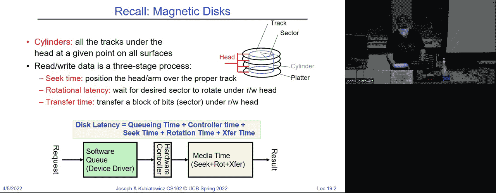
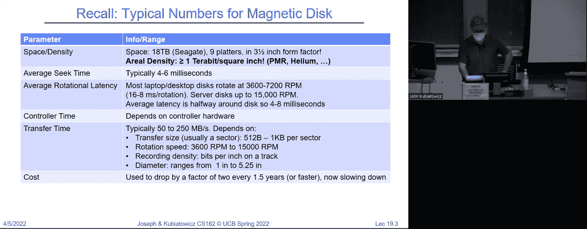
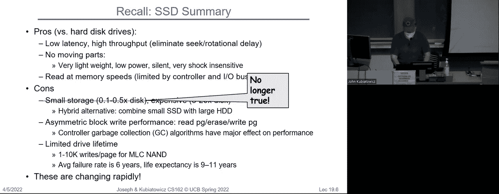
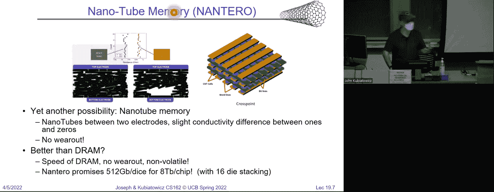
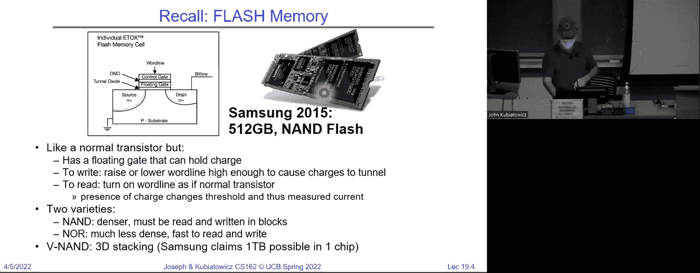
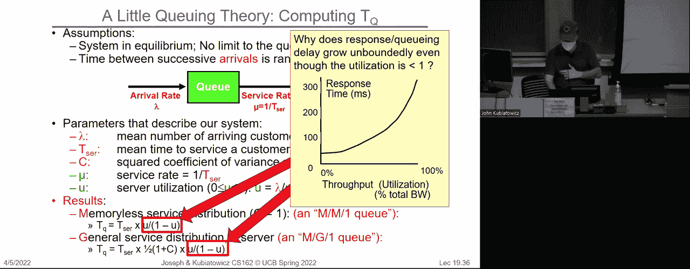
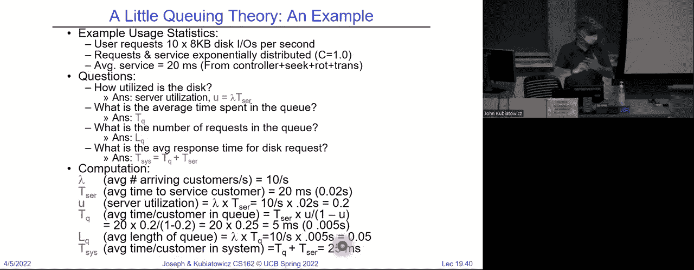
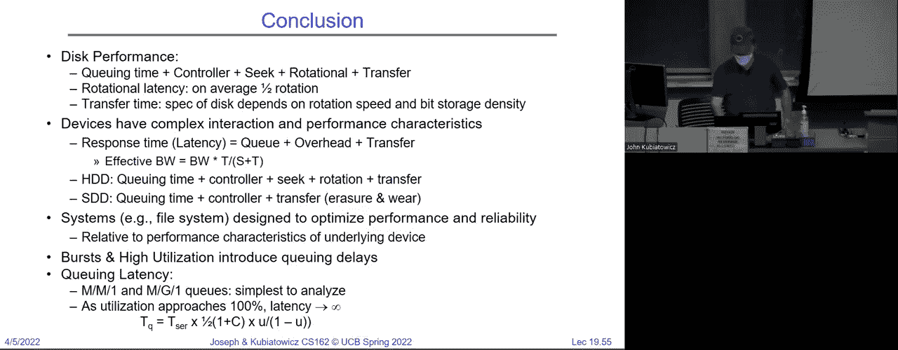

# 📚 课程 P19：文件系统 1 - 性能（续）、排队理论与文件系统概述

在本节课中，我们将继续探讨存储设备的性能模型，并引入排队理论来分析I/O系统的行为。我们还将为后续深入讲解文件系统奠定基础。

## 🧠 性能模型回顾

上一节我们介绍了硬盘（HDD）和固态硬盘（SSD）的基本性能模型。本节中，我们来看看如何更精确地测量和建模性能。

性能通常可以从两个维度衡量：**延迟**和**吞吐量**。
*   **延迟**：完成单个任务所需的时间，单位是秒（s）、毫秒（ms）等。
*   **吞吐量/带宽**：单位时间内可以完成的任务数量或传输的数据量，例如每秒操作数（ops/s）或每秒字节数（B/s）。

一个简单的I/O操作延迟模型可以表示为：
`延迟 = 开销 + 数据量 / 峰值带宽`

其中，**开销**是启动操作（如向控制器发送请求）所需的固定时间。

以下是一个网络链路的性能分析示例：
*   假设有一个1 Gbps（千兆比特每秒）的链路，其峰值带宽为 125 MB/s。
*   假设每次传输的启动开销为 1 ms。
*   我们可以绘制**延迟**和**有效带宽**随数据包大小变化的曲线。
    *   延迟曲线是一条直线，其截距由开销决定。
    *   有效带宽曲线在数据包很小时很低，随着数据包增大而逐渐接近峰值带宽。
*   **半功率点**是一个关键概念，指达到一半峰值带宽所需的数据包大小。它帮助我们理解需要多大的数据量才能有效利用带宽。

**核心要点**：高开销意味着需要传输更大的数据块才能获得良好的有效带宽。在磁盘系统中，这意味着应尽量减少寻道等开销操作。

## ⚙️ 并行与流水线

为了提升系统整体吞吐量，我们常采用**流水线**和**并行**技术。

*   **流水线**：将一个任务拆分为多个可重叠执行的阶段。例如，一个I/O请求可能经历“用户程序 -> 系统调用 -> 文件系统 -> 设备驱动 -> 硬件”等多个阶段。如果这些阶段能像流水线一样工作，系统的整体处理速率就能提升。
*   **并行**：使用多个相同的资源同时处理多个任务。例如，多个用户进程同时提交I/O请求，或者系统使用多个磁盘。

**需要注意的问题**：引入并行性会带来**同步**的挑战。当多个请求同时访问共享资源（如文件系统的数据结构）时，必须使用锁等机制来保证正确性。

## 🎢 排队理论简介

当请求到达速率超过瞬时处理能力时，就会形成**队列**。排队行为对系统响应时间有巨大影响。

一个请求的**响应时间**可以分解为：
`响应时间 = 队列等待时间 + 服务时间`

服务时间相对固定，但**队列等待时间会随着系统利用率升高而急剧增长**。

### 利特尔法则

利特尔法则是一个普遍适用的排队系统基本定律：
`系统中的平均任务数 (N) = 平均到达率 (λ) × 平均响应时间 (L)`

**直观理解**：如果你以每秒2人的速率进入商店（λ），平均每人停留5分钟（L），那么店里平均有10人（N）。

### M/G/1 队列模型

我们常用M/G/1模型来近似分析I/O队列：
*   **M**：请求到达时间间隔服从无记忆的指数分布（马尔可夫过程）。这模拟了请求的“突发性”。
*   **G**：服务时间服从一个一般分布，其方差用**平方系数 C** 描述。
    *   C = 0 表示服务时间是确定的。
    *   C = 1 表示服务时间是无记忆的（如指数分布）。
    *   对于磁盘，C 通常约为 1.5，因为好的文件系统利用局部性，使得多数寻道时间短于平均值。
*   **1**：表示只有一个服务器。

在该模型下，队列中的平均等待时间 `T_q` 为：
`T_q = T_s × [u / (1 - u)] × [(1 + C) / 2]`
其中：
*   `T_s` 是平均服务时间。
*   `u` 是系统利用率（`u = λ × T_s`，且必须小于1）。
*   `C` 是服务时间分布的平方系数。

**关键结论**：当利用率 `u` 接近 1 时，分母 `(1 - u)` 趋近于 0，导致队列等待时间 `T_q` 趋向于无穷大。这就是为什么系统在高负载下响应会变得极慢。

### 实例分析

假设一个磁盘系统：
*   请求到达率 `λ = 10` 次 I/O/秒。
*   平均服务时间 `T_s = 20` ms = 0.02 秒。
*   假设为 M/M/1 队列（C=1）。

计算过程：
1.  利用率 `u = λ × T_s = 10 × 0.02 = 0.2`。
2.  队列平均等待时间 `T_q = T_s × [u / (1 - u)] = 0.02 × [0.2 / 0.8] = 0.005` 秒 = 5 ms。
3.  平均队列长度 `N_q = λ × T_q = 10 × 0.005 = 0.05` 个请求。
4.  平均总响应时间 `L = T_q + T_s = 5 ms + 20 ms = 25 ms`。

可以看到，即使利用率只有20%，排队也增加了5ms的延迟。如果利用率升至0.8或0.9，排队延迟将成为主导因素。

## 🚀 性能优化思路

了解了排队理论后，我们可以从以下几个方向优化I/O性能：

以下是几种优化思路：
1.  **降低服务时间**：使用更快的硬件（如SSD）、优化驱动程序或控制器。
2.  **提高并行度**：使用多个磁盘（RAID）或通过网络分布请求，将负载分散到多个队列。
3.  **利用队列吸收突发**：队列本身是有益的，它能平滑突发流量，避免请求被立即拒绝。
4.  **在等待时做其他工作**：当进程因I/O阻塞时，操作系统可以调度其他进程运行，隐藏I/O延迟。
5.  **实施准入控制**：对于队列长度有限的系统，在过载时拒绝新请求，防止系统崩溃。
6.  **智能调度请求**：对于磁盘，可以对队列中的请求进行重新排序（如电梯算法），以减少平均寻道时间。

**重要原则**：作为工程师，应避免让任何系统长期运行在接近100%利用率的状态。通常，将利用率保持在50%-80%是更稳健的选择，能在吞吐量和延迟之间取得较好平衡。

## 📝 总结

本节课中我们一起学习了：
1.  **性能度量**：明确了延迟、吞吐量和开销的概念，并分析了它们之间的关系。
2.  **并行技术**：回顾了流水线和并行处理如何提升系统吞吐量，并指出其带来的同步挑战。
3.  **排队理论核心**：
    *   引入利特尔法则 `N = λ × L`。
    *   学习了M/G/1队列模型，理解了利用率 `u` 对队列延迟 `T_q` 的巨大影响（公式 `T_q ∝ u/(1-u)`）。
    *   认识到高利用率下，排队延迟是系统响应时间的主要瓶颈。
4.  **优化方向**：总结了通过降低服务时间、提高并行度、利用队列和智能调度等方法来优化I/O性能。

最终，一个硬盘I/O请求的总延迟可归纳为五个部分：**排队延迟**、**控制器延迟**、**寻道时间**、**旋转延迟**和**传输时间**。而对于SSD，则主要是**控制器延迟**和**传输时间**。理解这些组成部分及其相互作用，是设计和优化高效文件系统的基础。