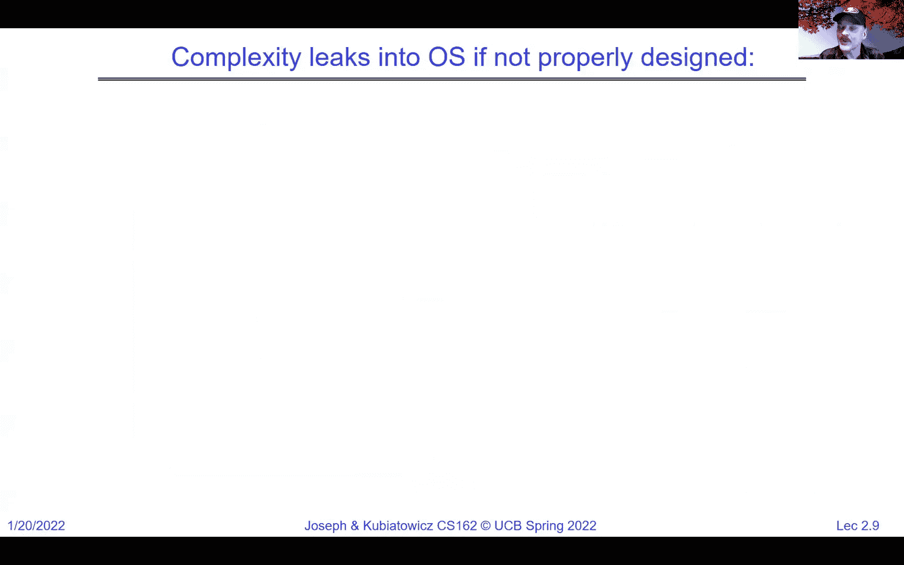
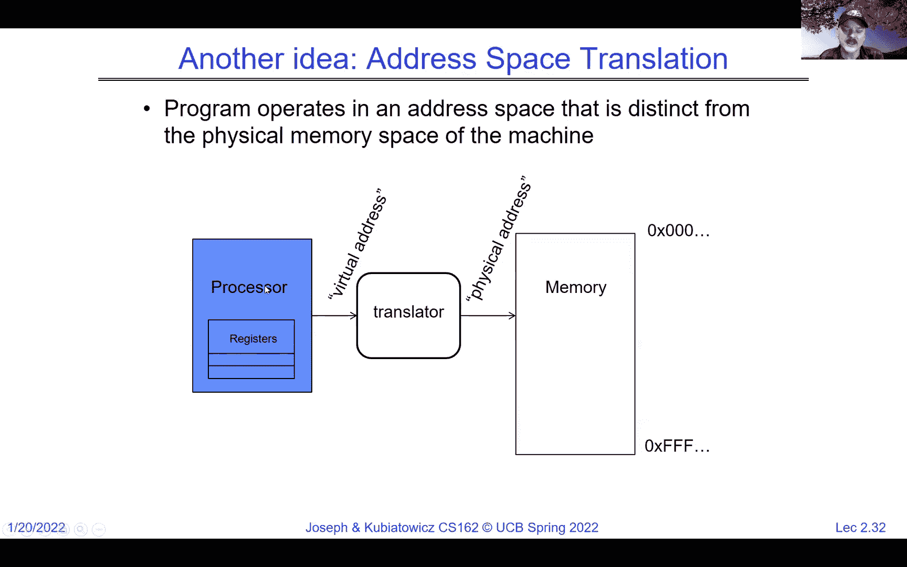

# P2：Lecture 2： Four Fundamental OS Concepts - RubatoTheEmber - BV1L541117gr

 Okay everybody， welcome back to 162。 I'm going to be giving lecture two， finishing some of。

 the things we were starting last time。 And if you remember last time we talked about。 operating systems pretty much in general and we asked ourselves what it was exactly that。 an operating system was。 And I tried to indicate to you that it's， there are lots of different。 operating systems and different people would disagree with each other on this。 But these。

 three functions of referee， illusionist and glue are pretty common across a wide variety。 of operating systems and many of them have all three。 Okay， where the referee is actually。 managing resources， the illusionist is providing that illusion of infinite memory and perfect。 hardware resources。 And the glue consists of a whole series of common services like file， systems。

 etc。 that are there to help make programming the machine much better。 We also。

 talked， started talking about protection in general， that's going to be one of our first。 major detail topics but we're going to touch on it lightly today。 And here what I show。 is that there's the hardware underneath， the operating system up above is basically providing。 that virtual machine view to the processes。 Okay， and the processes which we're going。

 to talk in more detail today and in additional detail as we go on are really these virtual。 containers that have a view of perfect hardware underneath them and they think that they have。 the whole machine。 So here I have a brown and a green process， the brown process thinks。 it has all of the memory， all of the file system， all of the sockets and threads， the。

 green one thinks similarly and it's up the operating system to really basically provide。 that illusion。 And in terms of protection， of course the important part here is for instance。 this green process， while it's running， could attempt to access the memory of the brown， process。 it could attempt to access OS memory， it could attempt to access parts of the storage。

 that it's not supposed to。 And in all of those cases， what ends up happening is the operating。 system essentially stops that from happening and then causes a segmentation fault and basically。 boots the process out。 So that's the protection piece。 And we're going to talk a lot about。 that as we go on the next couple of weeks。 And there'll be many different ways to do that。

 kind of protection， but I'll show you a fairly simple first thoughts at that today even。

 The thing that we didn't quite get to last time and I wanted to mention now is really。 the complexity of all of this。 So you saw that picture of the world as a single machine， you know。 single huge computer that I showed last time。 And that's a lot of hardware that。 somehow has to be tamed。 And if you look at applications， they really have a variety。

 of software modules， they run on a bunch of different devices or machines， they implement。 different hardware architectures， they run competing applications， they fail in unexpected， ways。 they might be under attack。 And really that complexity of both what the applications。 are trying to do and all the underlying hardware is tremendous。 Okay， and it's not feasible。

 to test all the combinations。 I mean， how could you possibly test an application against。 the machine with a one terabyte SSD and a two terabyte spinning storage and six gigabytes。 of memory and a hundred gigabytes of memory。 You just can't do that and all combinations。 are just not possible。 And so we're really going are going to have to figure out how。

 to design things correctly from the beginning。 And， you know， let's accept it now。 It's not。 a question about whether they're bugs or not。 There will always be bugs。 It's a question。 about how serious they are and， you know， what type of bugs they are。 And we're going to。 try to do bug management in a sense as well as we go out throughout the term。 And one of。

 the things that leads to complexity is parallelism。 And this is why， of course， we're going to。 spend a bunch of time talking about synchronization primitives in a couple of weeks。 But what I。 wanted to mention， here's a good example from 2027。 The Intel Skylake has cores that can。 have 28 cores。 There's even a 56 core version up to 56 threads。 So there's two threads per。

 core and lots of different security instructions and graphics instructions。 There are 28 megabytes。 of cache at the L2 level。 There's 38。5 megabytes of cache at the L3 level。 Directory-based cache。 coherence。 There's lots of different types of networks， including a mesh network on chip。 and fast off-chip networks， DRAM connections up to 1。5 terabytes。 And so this is complex。

 even of itself。 And this is like a single node。 So when we tie all that together， things。 get really interesting， right？ But parallelism is fundamental these days。 And in addition to。

 that parallelism， a modern chip typically has a chipset that goes with it。 So what you。 see here at the top is an example of an Intel chip family processor with a bunch of cores， on it。 It has direct connections to memory and PCI express for high-speed communication。 And then there's typically a direct media interface connection to the chip sets underneath。

 And the chip set potentially handles all the other interesting aisle。 So from the standpoint。 of the processor， we have high bandwidth memory channels。 We've got really high-speed IO for。 graphics。 We've got this direct media interface down to this secondary chipset used to be。 called the Southbridge， for instance。 But not anymore。 But anyway， off of that， we have。

 PCI Express。 We've got SATA for disk。 We've got USB for other types of IO。 We have Ethernet， IO。 PCIe， RAID， et cetera。 All sorts of really interesting things all tied into that one CPU。 So if you look at， you know， this itself is interesting。 This is very interesting。 Lots。 of complexity。 And， you know， I like this graph。 You guys should all take a look。 You。

 can go to information is beautiful。net/visualization/millionlines of code and take a look at some of the code。 counts over the years。 Okay。 And what's interesting here is if you look at a newer version of something。 so like Linux 2。2 versus Linux 3。1， it's always bigger。 So there's a lot more software for each。 next generation。 Right。 And so more and more memory， more and more complexity with each， generation。

 A car is starting to get very complicated。 100 million lines of code。 Actually。 it would be interesting to see what a Tesla is like。 And so， you know， that complexity。

 leaks in to the operating system if you don't design it correctly。 And you get blue screens。

 Okay。 Mouse base pairs。 The question is what's a mouse base pair？ So this is actually the。 DNA of a mouse。 Okay。 So we're not getting all that far away。 Okay。 From that complexity。

 The third party device drivers， which are the parts of an operating system that access。 the outside world， are some of the most unreliable parts of operating systems。 Okay。 And the reason。 for that is they're not written well， necessarily they're written quickly to support a new device。 and they're not written by Microsoft or Apple or whoever your operating system comes from。

 And as a result， they tend to be the things that crash the system。 Okay。 And basically。 there are clean interfaces from the operating system to the device。 And that's an attempt。 to provide a clean interface so that third parties can write this type of code。 And that。 ironically can lead to more crashes under some of circumstances。 And we're going to spend。

 a lot of time talking about device drivers later in the term。 And there's all sorts of， holes。 Okay。 See， if you don't have enough complexity from everything that's working properly。 now you've got security holes。 Okay。 And a great example from 2017 was the infamous meltdown。 bug where it was discovered that despite all of the protection in the hardware and the。

 proper use in the operating system of that hardware， you ended up with the ability for。 user level programs to drain secure information out of the kernel。 Okay。 And so if you think。 about that， it's like， well， I did everything I could。 And there was this weird hole in the。 hardware that nobody knew about。 And even surprised a bunch of famous computer architects。

 like Dave Patterson and John Hennessy。 So complexity is always there。 And at best， we。 have to manage it。 Okay。 And then things like versions queue on libraries can lead to all。 sorts of problems。 Okay。 Data breaches， denial of service attacks， timing channels。 There。 was the heart bleed SSL bug， so on。 So all of these exploits are there if you're not careful。 Okay。

 And so， and I see a comment in the chat that it was a really cool exploit。 And yes。 Altong was cool as an exploit。 And we'll actually talk about that a little later in the term。

 So back to what the OS is supposed to do。 So we have all of this complexity。 And really。 the OS is out there trying to tame the underlying hardware and provide a clean virtual machine。 abstraction。 And so here's the hardware underneath。 We have the physical machine interfaces， which。 are， you know， they're what they're are， their buses， their interfaces to disks。 We have an。

 operating system on top of it， which then turns all of these imperfect physical interfaces。 or limited physical interfaces into a nice clean programming abstraction so that the。 abstract machine interface up top can be used by applications。 Okay。 And I gave you the。 simplest one to think about is this this illusion of infinite memory。 So maybe you only have。

 16 gigabytes of memory on your laptop， but the operating system gives you the illusion。 that's that there's a lot more memory。 And it does that through a paging and various other。 virtual memory techniques， which we will talk about。 But that's the function of the operating。 system is provide this virtual or abstract machine interface that's more perfect than， the hardware。

 Okay。 So the processor underlying becomes a clean thread。 The memory underlying。 becomes a clean address space。 The disks at SSDs， which are just block based storage become， files。 Okay。 Networks lead to sockets， which give you sort of the ability to have a stream。 that's sent perfectly from one part of the world to another machines become processes。 Okay。

 And so all sorts of interesting things here， but this is basically the OS as an illusionist。 to remove the software hardware quirks and give us a better， a better abstraction。 Okay。 And you pick any OS area and there are many of them and we're going to have an interesting。 sample this term like file systems， virtual memory， networking， scheduling。 And you can。

 ask the question of what's the hardware interface that we need to handle。 That's the physical。 reality。 And what's the software interface we want to provide？ And that's the nicer abstraction。 And so we will we will play with that hardware interface versus natural abstraction idea throughout。 the term。 Okay。 So today we have four fundamental OS concepts， which we want to get across just。

 to dive in and start going。 Okay。 One of them is this idea of a thread。 And a thread is。 a virtual execution context fully describes program state of an executing program。 It's。 got the counter。 It's got registers。 It's got execution flags。 It's got stack。 Okay。 And。 this thread， however， is a virtual entity as you'll see in a bit。 This is not necessarily。

 running on a CPU at all times and it's not even running necessarily on the same CPU。 So this thread is an entity of itself。 Okay。 And hopefully we'll get to where we'll be thinking。 in terms of threads rather than CPUs。 And we have some interesting discussion on on。 the Piazza actually after lecture one about that idea。 We'll get some there of that today。

 So another idea which we're going to want to talk about is the address space with or。 without translation。 And an address space essentially the set of memory addresses that。 the program sees for reading and writing。 And it may actually be distinct from the physical。 machine。 So once again， the address space is a virtualized idea。 And a third thing is。

 now going to be a process。 And so a process is a combination of a protected address space。 and one or more threads。 Okay。 And so a process is really this executing instance of a program。 in its own protected environment with multiple potentially things running。 Okay。 And then。 finally we're going to introduce some hardware。 And this hardware idea is dual mode operation。

 which leads to protection and that dual mode operation is really that there are certain。 things that can only be done by the system。 Okay。 And so the way we distinguish that running。 in the system versus not is going to be a bit at least possibly more bits but at least。 one bit in the hardware that says whether we're in system mode or user mode。 Okay。 And。

 we're going to show you more about how that works。 But the simple idea there is that when。 you're in system mode， the hardware will allow more access to things than when you're。 in user mode and that will lead us to be able to provide a nice clean virtual abstraction。 We call that dual mode because there's two modes there。 Okay。 Now， so let's look at the。

 bottom line。 What's the bottom line？ Well， the OS is helping us run programs。 That's。 our important aspect here， right？ And so here's， you know， here's Joe。 He's typing away。 And。 he comes up with a program。 He's going to type a bunch of stuff into his editor。 And。 then the compiler is actually going to produce a binary version of these instructions that。

 is going to be executable on a CPU。 And it's going to have data。 It's going to have instructions。 in binary mode。 And typically it's in a file called a。out， which is the result of the compiler。 And potentially the linker。 Okay。 And once that exists and that might sit on your sit on， your disk。 then when we want to execute it， we take this executable and it gets loaded， into memory。

 And that's the point at which it becomes executing。 Okay。 So a program is。 the potential for execution。 Once it gets loaded into a process， it becomes an executing， process。 Okay。 And we can have many instances of the same executable running at the same。 time in different processes。 And you'll see that as we go along as well。 But if you notice， here。

 here's a typical address space for a process where the address space is kind of， remember。 I said it was all the addresses that can be accessed。 And it's sort of from， zero up to FFFF。 Typically， there are instructions at the low part of memory， the low addresses。 and then data on top of that， heap， etc。 And then at the top， there's the OS space， which。

 is protected。 And then we grow down from there for our stack。 Now， there's a question about。 where the linker is。 I haven't shown you here， but this， think of this as a combination compiling。 and linking to produce the final executable。 And the linker is really taking individual。 things that you compiled plus some libraries and putting them together into a single entity。

 And we'll see a lot more of that as we go on。 All right。 So once we've loaded things。 into memory and we're in a process， we create the stack and the heap。 So the stack is the。 grows down to give us the ability to have recursive processes。 And the heap grows up。 for allocation like memory。 And so as a result， we will basically have a completely executing。

 process。 Okay。 And how does it become executing？ Well， we load the program counter。 And we。 are in the processor to point at a starting instruction in the process。 And then we tell。 the processor to go。 And at that point， it will start executing。 And we typically don't。 do this in system mode。 We make sure that at the time we say go， it's in user mode。 And。

 as a result， this will be a nice protected entity。 And this notion of when we're in user， mode。 when we're in system mode， just don't worry about the exact details because we'll。 give you more and more details as we go on。 We're trying to get the high level idea here。 So are there questions？ So how much memory is allocated per process？ It's a good question。

 So the answer is the bare minimum on most and most good operating systems only allocates。 as little as it needs。 So it basically allocates instructions in data。 There's typically no。 actual DRAM allocated for heap or stack。 But the address space is here。 Okay。 So that's。 where you got to start thinking about the virtual versus the physical。 So physically。

 we don't get much memory when we start up。 Virtually， we have all of these addresses。 And what will happen is as the program tries to use parts of the address space that aren't。 backed by real memory， they'll be trapped into the operating system and the operating。 system will allocate some more memory for it and then return to the user。 And so therefore。

 with a modern operating system， we can start by giving processes as little as we need to。 start with。 And then it'll automatically adapt as the program starts running。 All right。 And of course， the OS once everything is running will provide services through the notion of。 system calls， which we'll talk about a little bit later。 Okay。 Good。 Any other questions？

 And Anthony is actually giving some good details about linkage there。 So there's static。 linking and dynamic linking。 We'll talk about those also later。 Okay。 So now let's pull back。

 out of the depth of your memory from 61 C。 So if you remember what's inside a processor。 So system calls， by the way， are that transfer of control into the kernel， a controlled transfer。 And again， we will talk more about those as we go on。 So if you look here， we typically。 have a program counter， okay， which is a register inside the processor。

 And then we have instructions， in memory， which is in the address space of the process and data as well。 And the program， counter points at the next instruction to execute。 And it's going to be up to the actual processor， to pull that instruction out of memory and decode it and decide what to do with it。 Okay。 And so for instance， once we've fetched the instruction， then it'll be decoded。 And that。

 decoded instruction will then work on the data path that might pull things out of registers。 and it tells the ALU to do a multiply or whatever。 And the results might be stored into memory。 or memory might be pulled out， data might be pulled out of memory。 And then we go and execute。 the next instruction。 Okay。 And so this is the continuous loop of fetch， decode， execute。

 memory right back。 Okay。 And this hopefully will remind you a little bit of 61 C。 There。 is a question here about what happens if there's a memory safety violation in a program。 So。 we're going to need to get much more detail about exactly what that means。 But I showed。 you in a couple of previous slides that idea where the green process tried to access memory。

 of the brown process。 And that memory access violation was flagged with a segmentation fault。 And the green process was dumped。 Okay。 And that'll be one of many responses that we can， get。 So。 you know， and basically the processor is going to walk the PC through a series of。 instructions as the execution occurs。 And that's how we get a program to run。 Okay。

 Now the first concept here that I mentioned was the thread of control。 And a thread is。 really a single unique execution context consisting of a program counter registers， execution。 flags， a stack， memory state。 Okay。 And you need to think of this as a virtual version， of this。 So the 61 C idea was there's this processor thing and it's executing instructions。 Okay。

 But excuse me， just having that processor thing executing instructions is too low level。 to build a modern environment on top of it。 And so instead we're going to virtualize that。 idea with a thread。 So a thread is something that has its program counter。 So it knows。 where is next instructions coming from。 But because it's virtual， it could actually be。

 unloaded from the physical processor for a little while and then loaded back and start。 executing again。 And so the thread maintains its identity even when it doesn't have the。 view of the CPU。 And that's going to be helpful for us。 Okay。 And a thread is basically executing。 on a processor or core when it's resident。 Okay。 When it's in the processor registers。

 Now by the way， let me clear one thing up here for the first several weeks。 We are going。 to be talking about processors or cores independently。 And we're going to be thinking about machines， with exactly one core or processor for now。 Okay。 So don't worry about multi core。 Okay。 We want to understand single core first。

 And so I'm going to use the word processor。 I might， use the word core。 These are going to be essentially interchangeable in the next several weeks。 Okay。 But anyway。 the thread is actually executing when it's running in the processor registers。 So if you look back here， you could say， well， this could be thought of as a thread that's。

 running right now because it's program counters in the real program counter of the processor。 Okay。 And what resident really means here is the registers hold all the state， the root。 state or context of the thread。 The registers have the program counter loaded。 It's currently。 executing instructions from there。 The program counter points at the next instruction in memory。

 All the instructions are stored in memory so that as the processor or core starts executing。 and pulling instructions， it can pull them out of memory。 Okay。 So that's those instructions。 we want actually are in memory。 And it includes intermediate values for ongoing computations。 in the actual registers。 So we might have added two things together and the result is。

 in a register or there are pointers to places in memory where the results are going。 And。 the stack pointer in the physical hardware is actually holding the address of the top。 of stack for the thread， which is in memory。 And everything else is in memory。 So this is。 an executing thread。 And so if you want to think about 61C again for a moment， an executing。

 thread or a loaded thread or a resident thread is an example of something running like you。 thought of in 61C。 Okay。 A thread is suspended or not executing when。 its state isn't in the processor。 Okay。 And so this is like if you took the thing that。 from 61C and you just unloaded it all and put it aside in memory somewhere and what we'll。

 call a thread control block， it's still a thread。 It's just not running。 Okay。 And at， that point。 something else is running。 Okay。 So the processor state is pointing somewhere。 else at a different thread。 Okay。 Is that clear to everybody here？ Okay。 So again， back。

 to your 61C。 So we are going to keep this virtual machine idea in our brain。 I just wanted。 to show this other slide of here's a processor or a core。 We're going to do the fetch execute， loop。 We got a bunch of registers loaded。 The execution sequence fetches the instruction， at the PC。 decodes it， executes it， writes the results back and goes to the next instruction。

 So for end repeat， this is a wash and repeat kind of scenario。 So for instance， if the program。 counter here is pointing at instruction zero， we'll execute it， then we'll go on to instruction。 one， we'll go on to instruction two， three， four。 Okay。 And keep in mind， so there's a。 question here in this class is core， the processor or execution unit within the processor。 You。

 know， I know Anthony gave one answer to that。 Let's not be too confused about that for now。 So processor could be a bunch of cores and that's sometimes an entity the way they work， at it。 We're going to talk about just a processor is executing only one core and only having， one core。 So there's no confusion there for now。 Okay。 So just think whenever I say core， processor。

 I'm thinking about something with exactly one execution pipeline in it。 Okay。 And the other thing I wanted to say here， and don't we're getting in depth here about。 suspending here and I don't want to quite get there yet。 Anthony can answer that if he likes。 But let's hold that question there for a couple of weeks。 Okay， make a lot more sense。

 So here's our execution sequence。 The PC is busy executing。 There's a set of registers。 that represent the thread and are loaded at any given time。 And this is the view， for， instance。 from 61 C， which is like a simple risk processor where there's a set of registers。 that are very straightforward and there's many of them。 If you look， that's kind of like。

 risk five。 Okay。 So we have a bunch of registers， some of which are the next program counter。 some of which are the stack pointer and so on。 And the set of instructions that can be。 run are simple。 There are ads and subtracts and so on。 This class， we're going to bite。 off the complexity of a modern machine that's more likely to be in your laptop。 Okay。 Like， an x86。

 And so if you notice， some interesting things about the x86 is it's got a lot more。 different types of registers and a lot fewer of them。 Okay。 So there are registers for segments。 There are registers for control and tags and so on。 There's a bunch of other registers。 And so we're going to we're going to look at some of these going on because the environment。

 in which the PintoOS operating system that we're using in this class operates is an x86。 environment。 Okay。 And section is going to cover the architecture a lot more detail。 Okay。 And I will too as time goes on。 But what I want to focus on right now， so let's pull。 everybody's mind back to this， is how can we possibly have a single core or a single。

 processor but have many threads that look like they're running at the same time。 Okay。 And we're going to get this view of a bunch of virtual CPUs or threads all sharing the， same memory。 And this is going to be the programmer's view of a process。 Okay。 So assume， a single core。 Now。 the question is how do we provide this illusion？ Well， we multiplex。

 And so think of threads as virtual cores。 And here's time moving to the right。 And what。 we're going to do is we're going to run virtual CPU one for a little while。 And then number。 two for a little while， number three for a little while。 And then we're going to go back。 to number one and so on。 And we're going to basically load the contents of a thread。

 into a processor。 We're going to run it for a little while， then we're going to unload， it。 We're going to load the next one。 And we're just going to keep doing this over and over， again。 And if we do this with a fine enough granularity， then essentially it's going to。 appear that these are all running simultaneously， even though only one of them is actually running。

 at any given time。 Okay。 So the contents of a virtual core here is what we've been calling。 a thread。 Program counter， stack pointer， registers， etc。 Where is the thread？ Well， it's。 on the real physical core， like here during magenta time， CPU one or thread one is actually。 loaded in the physical core or saved in a chunk of memory when it's not running called。

 the thread control block。 Okay。 And it's going to be up to the operating system that's doing。 the scheduling to be swapping these guys in and out over and over again in order to give。 us that illusion。 Okay。 And I'm going to just， I'm repeating this multiple times just to。 make sure we're all on the same page， because this is fairly simple。 But if you don't quite。

 catch what's going on here， then what we do afterwards is going to be confusing。 So any。 other questions？ So is good。 The great question in the slack here is the execution time for。 each thread the same。 And the answer is， doesn't have to be。 In fact， we're going to have a。 whole unit on schedulers， where we're going to vary the amount of time a thread gets based。

 on priorities， or we're going to vary it based on real time requirements。 So the simplest。 thing you could do is just give every thread the same amount of time。 But that's absolutely。 not required。 And just to give you a good idea why that might not even work is it's possible。 that CPU one runs for a little while， and then it has to talk to a disk or network， which。

 is going to take， you know， milliseconds or seconds。 It can't run。 And so it makes no。 sense to waste the CPU waiting for all that stuff externally。 So that will be a good reason。 to switch to another one。 Okay。 And what does it mean for the CPU to be idle？ What it means。 is there are no threads that are runnable right now because they're all waiting for， idle。 Okay。

 that would be a good example of an idle CPU。 Okay， does that make sense？ Now， I'm assuming here。 by the way， by this slide that we have three runnable threads。 And so that's why I'm showing three of them alternating。 Now， so this illusion， let's continue。

 this for a moment。 So consider， for instance， at time one， virtual CPU one's on the real core。 CPU two's back in memory at time two， virtual CPU one is on the core is in memory and CPU。 two is on in the core， etc。 Okay。 So what happens to go from T one to T two？ Well， if you think。 about it， something had to take over and unload thread one and load thread two。 What is that？ Well。

 it's the operating system。 And so between thread one and thread two at this boundary。 the OS ran somehow。 And it saved the PC stack pointers， all the stuff of the CPU is thread。 out to memory and then loaded stuff from CPU two's thread back into memory。 All right。 And。 you might， if you're thinking about this carefully， start asking yourself， well， how the heck。

 did the OS get control because the user's running here， right？ Suppose that CPU one's。 doing my favorite thing of all time， which is it's busy computing the last digit of pi。 then it's not going to give the OS any second give it the time of day because it's working。 on that last digit。 And so really， what has to happen is some intervention here。 Okay。

 And we'll get， we'll learn a lot more about that。 But the simplest intervention is a timer。 goes off into the OS。 And the OS then grabs control away from T one and gives it to T two。 Okay。 And by the way， as an important part of 162， you have to know why computing the。 last digit of pi is important。 Okay。 And that was basically to remove the malicious entity。

 from the enterprise computer back in the original days。 The only way that Spock could get the。 computer back was he started all the memory banks working on computing the last digit。 of pi and that saved the day。 So you guys need to remember that。 That's your history， for today。 All right。 Now， does the timer have its own thread or process？ That's a good question。

 And the answer is it doesn't have to。 It only has to have something that takes over to run。 when the timer goes off。 So most of the time， it may not be running at all。 And it's probably。 when it starts running， it'll be running in an interrupt context， not necessarily a full-blown。 thread。 And we will get into that in a lot more detail。 Okay。 So keep that answer in the。

 back of your brain and ask me more in a little bit， well， not today， but a couple of lectures。 Okay。 So what triggered this switch？ So I just talked about a timer， but there's other things。 like CPU one could have voluntarily yielded the CPU。 And a great example is a system call。 Hi。 I want to do IO。 Okay。 I'm yielding the CPU because the IO is going to go on and the， timer。

 not the timer， the scheduler then takes over and loads CPU too while that IO is going， on。 So that's a voluntary， that's IO。 There's also the ability to say， okay， give somebody。 else a chance。 Other things we'll discuss。 Okay。 But we have to have some way to take over， control。 Now， the question is， can I repeat how the OS takes back control？ And if you look。

 down here at the very last bullet， it gives you all the ways the OS can take control。 The。 simplest for you to remember from today is a timer goes off inside the OS and it grabs。 control away from thread one。 Okay。 And because the OS is running at an interrupt level and。 the thread is running at user level， then the answer is no， the OS is able to steal it away。

 and the thread one can't prevent that from happening。 And that's important。 So multiple。

 threads of control now， let's talk more about that。 So we call that typically multi programming。 And if you look， the， here we have a bunch of processes， for instance， running on top， of the OS。 And those processes each have their own little chunk of the DRAM。 And when they're， running。 they need to have the illusion that they have 100% of the memory。 And so we're。

 going to have to do something to this DRAM to give that illusion that， for instance， when。 the green processor is running， it has all of the memory because clearly there are lots。 of different processes in memory。 Okay。 And good question here in the chat， which is basically。 since the threads like a virtual CPU， why do modern CPUs have a specific number of threads。

 in the spec。 And the answer is that the number of threads quoted in a CPU spec are the number。 of hardware threads。 And that is the number of simultaneous things that we can， simultaneous。 threads of control that can be running at the same time， literally in the hardware。 Okay。 So again。 for now， let's not worry about the hardware threads or multiple cores and we'll， get back to that。

 I promise。 Okay。 Now， if you look， the thread control block holds the。 contents of the registers when the thread's not running， what other information？ Well。 it's going to have things like the registers， it's going to have things like the program， counter。 as I mentioned， stack pointers， all of that stuff。 Where's the thread control， block stored？

 It's going to be in the kernel for now。 Can toss， which is this operating。 system that we're going to be programming and working with and modifying， you can start。 doing things by reading， for instance， thread dot H and thread dot C in the process control。 structures when you start your first project， project zero。 So you get a chance to actually。

 start looking at that code very soon and you can start seeing how some of the things。 I'm talking about are implemented。 Okay。 The question about what's user level or interrupt， level。 why don't we hold off for a moment on too many detailed questions there。 Just think。 of user level is less priority than kernel level or interrupt level。 Okay。 We'll get to。

 these in a lot more detail later。 So now let's talk about a little in minestribia。 All of， you。 both those who are in the class and those who are still on the wait list ought to be doing。 homework zero。 Okay。 It's due next Wednesday and it， you know， so you need to be going on， it。 And it's important because it's going to help you get your VM environment set up。

 and get familiar with tools and some of the other things， both homework zero and project， zero。 which is going to be next Monday。 So all of these things are important for getting。 going right away because when the projects， the real projects start up and your groups。 are ready to go， which is going to happen in the third week， you need to have gotten。

 all this preliminary stuff done。 So even if you're thinking you can still get in the class。 and kind of waiting， you should be doing this homework。 If you're unless you withdraw from。 the class and are not on the wait list and certainly not in the class， you should be。 doing this homework。 Okay。 And moving forward， we finally got our section sorted out。 So all。

 of our sections starting next week are going to be on Friday。 I know that we had this weirdness。 with Wednesdays and Thursdays and so on。 But the reason it's important to have everything。 on Friday and they're going to be spread throughout the day is that we can make sure that the。 sections can cover details from the two lectures in the week and that everybody gets the same。

 lectures before section。 So that's going to make things much clearer。 Okay。 And watch。 for updates on Piazza and on our website。 Okay。 Slipt days。 So you get some number of， slip days。 Good question there。 Let me back up。 So there's a question of do we sign up。 for sections or can we go to any first two weeks？ You're welcome to go to any offered， sections。

 Okay。 When you sign up for groups， which is going to be the beginning of the， third week。 we will assign sections based on preferences from you guys such that all。 four of your group members have to be in the same section or at least with the same TA。 It's going to be important so that that TA can know about you and your group members。 Okay。

 And so you're going to actually sign up for groups and give some preferences and then。 we're going to assign you sections。 Okay。 But for now， first two weeks， any section is， fine。 So back to slip days。 So you have three slip days for homeworks and four slip days。 for projects which you can use any way you want。 But don't use them up right away because。

 there's no credit for late homeworks or projects when you start running out of slip days。 Okay。 So that's very important。 These are not meant to make up for starting really late， although。 you could do that occasionally。 They're there for kind of contingencies。 If something doesn't。 quite work out or somebody has a problem or gets injured or gets sick。 Okay。 And Saturday。

 is an optional review。 Okay。 And Zoom link is either TBA or beyond Piazza， maybe recorded。 Okay。 Friday is the drop day and that's a week from this Friday， week from tomorrow。 Please drop before then if you're going to drop。 That way we can make sure that everybody。 who wants to get in and could get in can get in。 Okay。 Because it's going to be hard after。

 the drop day to drop it。 So please drop sooner rather than later。 All right。 Any questions？

 Let's see。 Do I have it up？ That was the last one。 And by the way， our final class size。 has been set。 We're not going to be adding any more sections。 We have 11 of them now。 And。 we're not going to go for any larger class sizes either。 So， you know， I think we're getting。 down toward our final enrollment。 So we are going for all Friday sections。 Okay。 So we're。

 no longer doing Thursday。 And again， that's important from a course content standpoint。 All right。 Once again， I want to remind you of the collaboration policy。 We're going to。 explain a concept to somebody in another group conceptually。 Okay。 Discussing algorithms。 conceptually。 Okay。 Discussing approaches to debugging without specific details might， be okay。

 Searching online for generic algorithms like hash tables。 Okay。 All right。 These are。 kind of allowed collaborations。 Sharing code for test cases with another group。 Not okay。 Copying or reading another group's code or test cases。 Not okay。 Copying or reading your。 friends code。 Not okay。 Okay。 You can't search for online code or test cases from prior years。

 We actually test for that。 Okay。 We have running， you know， we have running checks to make sure。 that people are not doing that。 So don't do it because if you get snared in， you know。 collaboration， failure here， you're going to， it's going to be problematic for everybody。 And we just don't want to deal with it。 Okay。 Helping somebody in another group to debug。

 their code。 Not okay。 Okay。 So we're comparing all the project submissions against prior years。 and online solutions and we'll take actions if we find matches。 And don't， you know， don't。 put a friend in a bad position by asking them to help you with something。 Okay。 Don't。 ask them for their code。 That just， it turns out bad for both of you。 Okay。 All right。 Okay。

 So let's look at the second concept of address space here。 And are there any testing frameworks。 that you'll use throughout the semester？ That's good question。 We're going to start by making。 sure you learn GDB。 And we may， we may give you some more unit testing options as time。 goes on here。 That's a good question。 And we'll see what we can do。 Okay。 But definitely。

 want to get good at GDB。 So I mentioned earlier the address space。 And here's the example。 of an address space with 32-bit addresses， let's say。 So that would mean that there's。 32 bits of digits here。 These are hex。 So that would be eight hex digits。 And from zero zero。 to FFFF， that's an address space。 Okay。 It's all the addresses that a 32-bit processor。

 could conceivably access。 And notice that this is a virtual idea。 Okay。 So just because。 they can access all 32 bits doesn't mean that all 32 bits are valid or even backed by DRAM。 Okay。 So this is the view of a thread as it's running。 Okay。 And so an address space set。 of accessible addresses in state。 For a 32-bit processor， it's about 4 billion addresses。

 For a 64-bit processor， it's considerably bigger。 Okay。 It's 18 quintillion addresses。 And what happens when a thread that's running reads your rights from an address？ And the， answer is。 well， you can maybe it'll act like regular memory and you could read or write， to memory。 Perhaps you write to it but nothing happens because it's read only but it's set。

 up to ignore your rights。 Okay。 Perhaps it causes an IO operation。 It's possible to read。 or write from an address that'll actually cause something to appear on a screen。 Okay。 That's memory map。 I owe。 We'll talk a lot about that。 Perhaps it causes an exception， or a fault。 Okay。 And that would be you're trying to access parts of the memory space。

 that you're not allowed to and you get a page fault。 It maybe it communicates with another， program。 Okay。 So there， and that's an interesting thing we'll call shared memory in a moment。 or actually in a couple of lectures where you read and write and address and it appears。 in somebody else's address space。 Okay。 So the address space is the set of addresses。

 you can address and what happens when you try to read or write them is up to the operating。 system and how it's configured things。 And we'll talk a lot more about how you do that。 Okay。 But so in a picture， let me show you。 Here's the processor registers。 Here's the， program counter。 It points to some address instruction in the address space。 Here's， the stack pointer。

 It's pointing to the stack at the bottom of the stack。 Okay。 And what's， in the code segment？ Well。 instructions。 What's in the static data segment？ Well， data that， was in your C program statically。 Okay。 What's in the stack segment？ Well， hopefully， and， we'll talk more about this next time。 but you remember what a stack is。 So the stack is， the set of local variables。

 And typically when you call a procedure， you allocate a new stack。 segment to handle all the local variables。 And when you return from the procedure， the。 stack is popped off。 And what I'm showing you here is the typical mode in which the stack。 is growing downward。 So the stack pointer starts at a FFFF。 And as you push things on， the stack。

 it grows downward。 And as you pop them off the stack， it grows up。 Okay。 What's， in the heap？ Well。 the heap is dynamically allocated memory。 Okay。 So how is it allocated？ Well。 typically by calling something like Malick， how big is it？ Well， it depends on。 how much allocation you've done。 You know， how many times have you called Malick， which。

 will ultimately call S break and the underlying system。 But， you know， how much is in the。 heap depends on how much you ask for。 And then there's this hole in the middle， okay。 And。 that hole is going to be kind of interesting to us in a few lectures because， you know。 what happens when you try to push something on the stack and there's no physical memory， underneath。

 that's going to cause a page fault。 And the OS can do a couple of things。 like it could add more memory or it could cause a segmentation fault。 So we're going。 to talk a lot more about that as well。 Okay。 Questions？ So good question。 What is stack overflow？

 Well， stack overflow is going to be when you allocate， so much stack， because you go push， push。 push， push， push， push， that the OS decides， that it can't give you anymore。 And then you'd say that the stack is overflowed。 And if the， OS catches it properly。 the worst that would happen is your program， your process would， be killed。

 What's a little less fortunate is if the stack grows into the heap and the。 right protection isn't there。 And then you silently overwrite some of your data。 And the。 reason that's worse is because you don't actually get a fault out of it。 You just get。 really weird behavior。 Okay。 We'll talk more again about these ideas。 Okay。 Can the heap。

 overflow too？ Yes。 So let's talk about our previous discussion of threads。 So very simple。 multi programming was what we did there。 Okay。 All the virtual CPUs share the same memory。 IO devices， et cetera。 They're all in the same address space。 The magenta thread can。 can overwrite or look at the blue cyan threads values。 Okay。 And each thread is therefore not。

 protected of the others。 Can it overwrite the OS？ Well， that's a good question。 Not in a。 lot of operating systems， but certainly in the original ones it did。 Okay。 Is this scenario。 unusable because it's possible for threads to overwrite each other or the operating system？ Well。 this approach was used with no protection in the early days of computing。 It's often。

 used still in embedded applications。 Some of the early Mac OS versions or Windows 3。1 or。 Windows 95 actually had this level of protection where there was just very simple multiplexing。 there wasn't any protection。 And as a result， it was possible for threads to overwrite parts。 of the address space that contain the operating system。 Risky。 Okay。 There was that question。

 earlier about how does the OS make sure that it gets control again？ Well， if you have no。 protection， it's possible for a user thread to overwrite the code that was supposed to do， that。 And as a result， basically that timer interrupt might go off and the wrong things。 might happen and it wouldn't take control back。 So that's an issue。 So simple multiplexing。

 that I told you about has no protection， but the operating system really has to protect， itself。 as you might imagine， for lots of reasons。 Like reliability。 We know if we're compromising。 the operating system that generally causes it to crash at minimum， security， if you limit。 the scope of what threads can do， then they can't steal information from other threads。

 that are supposed to really be separate processes。 Privacy could one running program steal keys。 in another one。 For fairness， could each thread limit its appropriate share of system resources。 limit the share of other system resources by overwriting the operating system and basically。 never giving up the CPU。 So all of these things mean that the operating system needs something。

 better than simple multiplexing。 Okay。 And it also must protect user programs from one。 another so that different programs can't overwrite each other。 So what can the hardware do？ Well。 it can start adding some hardware。 Okay， we can start adding some hardware to prevent。 violations of privacy and security。 And here's a particularly simple one， which we're just。

 going to call base and bound。 And the idea is this address space I'm showing you is the。 set of all D RAM， physical D RAM options。 And it is operating system， which is in gray here。 and a particular thread that we want to be running in a protected mode down here， which。 is the yellow piece。 And what the base and bound idea is is that there's a special register。

 called the base that points to the lowest address。 Now I've got this reverse from earlier， by。 the way， so smaller addresses are up。 But this， the base is pointing to the lowest address。 that yellow is allowed to access。 And the bound is pointing at the highest part that the。 yellow is allowed to access。 And as a result， if we could somehow make this prevent things。

 running in user mode from accessing the gray thing at all， then we can prevent the yellow。 thing from overwriting the operating system。 And so， for instance， here's an example where。 we have program addresses pointing at data。 And if we have the CPU try to access， say， address 1010。 what we're going to do is we're going to ask ourselves， is it larger than the， base？

 And if you notice 1010 is larger than 1010， so the answer is yes。 Okay， is it lower， than the bound？

 The answer is yes， in which case we go ahead and actually allow the access。 So just by having these two registers and a couple of hardware comparison things that。 cause exceptions to happen， suddenly we can protect。 Okay， very simple protection base， and bound。 Okay， so however， if you notice the simple version of this program on the disk。

 actually sort of thinks it's got address zero for the code and some higher address for stack。 stuff and really an address for static data goes 0010 on the file system。 And so when。 we load it into memory， we're going to have to dynamically translate all of the addresses。 that were here into their new position where notice the code was at all zeros here， but。

 now it's at all one zeros are zero。 And so there's a dynamic loader that changes all。 the addresses inside the code to be consistent to operate at a base of one zeros are zero。 And if we do that， then we can use base and bound to allow execution。 So if you look here。 so how can the address space live in the or how can the OS live in an address space when。

 the OS itself is the one providing the abstract of address spaces。 Well， I just showed you， here。 It's the magic of protection。 So here the OS is running here。 It's going to be all。 the code down here where the gray is。 And I've prevented whenever I'm in user mode。 Notice。 I don't have user mode yet。 But when I'm in user mode， the base and bound registers are。

 going to be set and enforced。 And as a result， the user code won't be able to mess up the。 operating system。 And so it's protected。 And so these base and bound registers as is asked。 in the in the chat are dynamically set。 Each time a thread is started executing。 So when。 we decide a thread is ready to execute， we set the base and bound registers then。 Okay。

 So this protects the OS and isolates the program and requires a relocating loader， however。 which can somehow translate the addresses as they were on disk into the way they are in， memory。 And notice by the way， this will make sense in a moment。 There's nothing special。 like addition or wherever on the hardware path。 For those of you who have taken a hardware， class。

 there's no delay introduced when we try to read from the heap by this particular。 mechanism because they're really the address goes straight out to memory。 Okay。 We'll have。 a better type of protection， which is going to add a little bit of hardware latency there。

 in just a few slides。 So what is relocation？ So you might remember this from 61C。 So here's。 an example of an assembly mode instruction jump and link where that gets translated into。 binary where the opcode， 000， 000， 011 is at the top。 And the address of the print def。 gets put into the lower part of the binary instruction。 And when we load it， when we compile， it。

 it looks like this in on disk with the x is replaced by binaries。 But when we finally， load it。 at that point it needs to be translated and linked properly to go where it belongs in， memory。 And so at that point， we do what's called relocation， which is we relocate all。 of these addresses that were filled in either at the time that we do loading or at the time。

 that we do linking。 Those are two possibilities。 Okay。 And the addresses in the executable on。 disk are as if everything was loaded in memory at 000。 And when we link it or load it into， memory。 at that point we're going to translate to its new position。 Okay。 So let me show you。

 something that's a little bit less complicated for the software by putting a little complexity。 into the hardware。 And if you notice， if you think back to what I showed you earlier， the。 only thing I've done here is I've added an adder here。 Okay。 And this is a hardware adder。 And what it means is that when the program addresses come out of the CPU， they go through。

 an adder before they go to DRAM。 Okay。 And if you think about that， I'll set a base address。 still of 10000。 But now when the CPU tries to access address 0010000， we add the base。 to it and now we access address 1010000。 And suddenly we've translated the CPU's view to。 the physical view。 So this is actually a type of virtual memory。 Okay。 Where we do translation。

 on the fly。 Okay。 And this is going to give us an illusion of memory。 It's not going to。 be a very good one toward the infinite illusion though， but it does give us an illusion。 Okay。 And hopefully this makes sense to everybody。 So now the way that the binary looks on disk。 and the way it looks in memory is the same。 We've just loaded this off of disk and put it。

 into memory。 And we can execute it as if it were at zero because it's the program or the。 CPU thinks it's at zero。 And we address it on the fly in its real spot by adding a base。 address to it。 Okay。 This is hardware relocation rather than the software case where the software。 had to change its location。 Now can the program touch the OS here？ And the answer is no because。

 it would have to give a negative address that would go below yellow and it can't do that。 Or it would have to give an address that's so big that it wraps around。 It's also not。 allowed to do that because it's trapped between the base and it's trapped here with the bound。 Okay。 So this is still protecting the OS into this little yellow chunk of physical memory。

 Can it touch other programs？ Well the answer is that's going to be no too because if you。 imagine a green one up here this CPU can only use addresses that when added to the base go。 between one zero zero and one one zero zero and nothing else is going to be touchable。 So all the other programs and the operating system are all protected。 Now the good question。

 here on the chat is is this a hardware delay？ Yes。 But in a modern type of CMOS this extra。 adder is essentially almost unnoticeable。 So many other things in there。 So this extra。 little hardware delay is not going to change the cycle time in any reasonable way。 And。 the benefit or if it did you want to slow the cycle time down the benefit of this is huge。 Okay。

 Because it means that the same code from the disk can be loaded into memory and directly。

 executed。 And by the way we're not going to worry about these kind of hardware delays。

 very much in this class。 We'll mention them occasionally。 That's more for 152。 Now the。

 x86 is a very interesting architecture with a whole bunch of what are called segments。 Okay。 And segment registers to define them。 For instance the code segment has basically。 a pointer to the beginning of one of these chunks and a link。 So it's very much like base。 in bound where however instead of just one base in bound we have potentially many with。

 different functionalities like code， data， stack and so on。 Okay。 And we'll get much。

 more into segments as we go。 But just keep in mind that the idea there is lots of base。

 in bounds each with a sort of a function that it's allowed to have。 Okay。 Now a slightly。

 different idea from that simple one I introduced you here is fully general address based translation。 And here what happens is the addresses come out of the processor and they're translated。

 to physical addresses。 And by the way you could say that happened here right？ Came out of。

 the processor got translated to physical addresses。 But we're much more general whereas in the。

 previous case they were linearly arrayed from the base to the bound。 Here we can put an arbitrarily。 translator in here and so the virtual addresses can be all over the place in physical memory。 And so that's going to bring us to another 61C idea which you got briefly which was the。 page virtual address space。 And so this translator in the case of paging is a very specific one。

 where it moves things around and moves them around but it does so in granularity of one， page。 A very good question here that I think just showed up in the chat was the registers。 in risk 5 and the ones in x86 are the same physical registers in the CPU but assigned to。 different functions。 You can't really think of it that way。 An x86 CPU and a risk 5 CPU。

 are totally different。 And there's no simple way for you just to flip a switch and one becomes。 the other。 So they both have registers they both have similar functionality but they're。 very different in their implementation and it's not like those registers of the x86 became。 registers in the risk 5 by flipping a switch。 And this is so page virtual address space getting。

 back to this idea here。 The question was is this software but no it's hardware translation。 It's up to the software to set up the translation but then the hardware does it。 Okay。 And all。 the pages here are the same size so it's easy to place each page in memory。 The hardware。 translates addresses using a page table。 Okay。 Every page has a base and bound but they're。

 all the same size。 Okay。 And special hardware register is point to the page。 We're going。 to treat the memory as a page size frame。 A whole bunch of page size frames。 Okay。 And。 this is another quick CS 161 C review。 And the idea here is the translator that I just。 told you about is really called a page table。 And what will happen is an address will come。

 out of the processor and we'll take that address and we'll look up in the page table where that。 address is in physical memory。 And so for a given address there'll be a frame address。 here that's in blue that will point to a particular page in DRAM and we'll basically。 divide that virtual address into both a page number and an offset。 And that page number。

 having been translated into the blue we then take the offset and that tells us how far。 into the blue。 Okay。 So hopefully this is ringing a bell for people。 But notice for。 instance that addresses here are in the same order as in the virtual address space。 That。 order once it's translated to physical order doesn't have to have anything like the same， ordering。

 So the blue frame could be here in physical memory in the green frame up there。 The processor running in virtual space thinks that everything is pulled together in a nice。 clean order but in fact the page table can scramble them all over in memory and it turns。 out this is going to be very helpful for management。 Okay。 So this is actually a really， good thing。

 Okay。 So instructions operate on virtual addresses。 Instruction addresses are。 virtual loads and stored data addresses are virtual。 They're translated through the page。 table to physical addresses and the physical addresses are the ones that are looked up in， DRAM。 Okay。 And any page of the address space can be in any place in memory。 So this is an。

 alternative to the base and bound I just showed you。 Okay。 And the question is will a locality。 be compromised in any way？ Let's hold off that question a little bit because there's a question。 even at what you mean by locality。 Just keep in mind that for the processor to access in。 the processors we're talking about for the processor to access here versus here there's。

 not a difference in speed unless the memory isn't loaded。 Okay。 And we're not going to。 get into two level virtual memory right now either hold off on that question please。 Good。 that you know to ask that but we'll deal with it later。 Okay。 All right。 And there's a special。 register called a page table address that points to the base of the page table。 So notice what's。

 cool about this is if different processes have different address spaces then what I can do is。 just by when I'm ready to switch from process magenta to process cyan all I have to do is in。 addition to load saving and loading registers I just changed the page table base address and。 suddenly that new thread that we just swapped in has a completely different set of physical。

 addresses available to it。 Okay。 So that's going to lead to the third concept of a process which is。 going to be an execution environment with restricted rights。 Okay。 Where there's a protected address， space with one or more threads in it it owns some memory so that's the address space it owns。 file descriptor file descriptors file system context etc。 It's going to encapsulate one or。

 more threads sharing process resources。 Okay。 So a program when it's loaded into memory and。 starts executing is a process。 Okay。 And so complex applications can actually fork themselves。 into multiple processes that's one possibility。 Okay。 And that would have multiple of these things。 all working on behalf of the process each of which has its own protected address space。

 Furthermore a single protected address space can have one or more threads。 Okay。 So why are。 processes useful they're protected from each other。 So think back to the slides I showed you。 at the beginning of the lecture。 Brown green。 The brown process protected from the green process。 Why they each have their own address space either worked out through base and bound or more likely。

 in a modern processor by its page table。 They each have the page table be in memory and so when we。 switch from brown to green and back again we're altering the page table address in addition to。 loading registers in。 And as a result when we go from brown to green and back again they're fully。 protected in their own address space where they can't mess up each other unless we decide to let them。

 Okay。 All right。 Does the OS build the page table？ Yes。 Okay。 And I'm gonna and the page table is a。 long lived thing that kind of exists from the creation of the process to the to the death of the。 process。 And for now we're gonna say absolutely the page table is in the operating system。 Okay。 You guys will know when you could ask me that question again it might give you a different answer。

 but it won't be for a month or so。 Okay。 So the OS is definitely controlling the page table。 And if。 you notice why do we want processes well because the processes are protected from each other the OS。 is protected from them。 Okay。 Why is that？ Well let's go back to this。 If the only parts of memory are， parts that are in the page table that I can access then if it's not if it doesn't have a pointer in the。

 page table there's no way for this processor running in that process to go through the page table and。 touch a part of memory that's supposed to be only accessible to the OS。 Okay。 So the reason OS is。 protected is there just aren't any pointers that are accessible to the virtual process that can。 access OS。 Okay。 Another good question are the threads in a process protected from each other or。

 not？ No。 That's a feature。 Okay。 So the threads inside of a process are not protected from each。 other and that's good because they're sharing concurrency and memory with each other to get some。 job done rapidly。 And so they're not protected by each other but that's by design。 And the reason we， don't think of that as a security violation is because we assume that you wrote your program to。

 work properly and you wrote it to use those threads and have those threads collaborate with each other。 properly and therefore they aren't protected from one another but boy they're protected from somebody。 else's threads。 Okay。 Now here's a view that I just said of a single threaded and a multi threaded。 process。 So for instance a single threaded process has a code and data and files in it and。

 registers and stack and a single thread of control。 And so when that process gets put to sleep there's。 only one thread running that needs to be put to sleep。 A multi threaded process has a bunch of threads。 Okay。 Each of which has registers and stack of their own。 That's the part that makes it uniquely a。 thread but they also have code and data that's shared。 So typically a multi threaded process has a。 huge chunk of code and the threads are running around inside that code but that code is all part。 of the same linked image。 Okay。 So threads encapsulate the concurrency aspect。 Okay。

 They're the active， component， the executing component of a process。 The address space encapsulates protection。 It's the， passive component or the box。 Okay。 I like to think of the address space is the box that we shove， these things in。 The threads are busy running around in that box。 Okay。 And that box that protection。

 prevents bad deep programs from crashing the system。 Good question is the heap shared by different。 threads？ Yes。 So typically there's one heap。 Okay。 So code data files heap all one heap。 The reason we， need to have multiple stacks is because each thread is all busy running。 It's own sort of recursive， routines and so on。 And so it needs its own stack。

 And of course it has its own registers because it's， doing actual execution。 Okay。 And how are multiple stacks set up？ Well， this is all part of both the。 process allocation will give you at least one register and stack。 And then when you make new threads， there'll be more of them。

 And all of that is done typically at user level or can be done in the， kernel。 We'll talk about both of those as an option。 Okay。 So we'll get to we'll get to more how to build a。 process and make it run as we go on。 So protection and isolation together are important。 So why do we， need processes just to remind you for reliability？

 Because bugs can only overwrite the memory of， processes they're in。 So that's good。 Security and privacy。 Molishes are compromised processes can't， look at other processes data。 Okay。 And fairness to some extent。 So by confining threads to a process。 and those processes are protected and manipulated by the operating system， it means the operating。

 system can make sure that no one process can steal all of the resources and prevent other。 processes from running。 Okay。 So the protection environment of the process with proper scheduling in the。 OS is what lets us build a modern operating system where we can guarantee that even malicious things。 that are running can't prevent others from running or prevent or steal information。 Okay。 Now the。

 mechanisms to make this all work， we've already showed you this idea of address translation。 But if。 you think about it， why can't we let a process change the page table pointer on its own？ Okay。 Well。 can anybody figure that out？ So why can't we let the process that's running change its own。 page table？ And Rizal， I'll get to your question in a second here。 Can anybody think about why we。

 can't let a process change its own page table？ Yeah。 If it could change its own page table。 not protected， right？ It could point it at the OS or another process。 Okay。 And so clearly。 when we're running inside the process， it can't touch the page table。 Okay。 And so that means that。 we have to have something about the hardware that has those two modes I mentioned that make sure。

 that when you're running as a process， you can't mess with the page table and only can mess with。 the page table when you go into the operating system， which is kernel code that's been vetted。 and is known to be not malicious， at least we hope。 Okay。 Now the question here about which I want。 to answer briefly， what's the advantage of multi-threading in a single core？

 And the answer is one of concurrency。 Okay。 So it's not about getting performance out of parallelism。 but it's allowing you to have， many things that are starting and stopping and waiting on events。 Okay。 And you'll be much more， sophisticated about that as you go forward。 So there's a lot of use for multi-threading， even when there's only a single core。

 And it's not about making things faster， but about dealing with。 the fact that you want to overlap computation and IO in an important way。 Okay。 And also making sure， that when one thread is waiting， it's not blocking everybody else。 And so the fourth concept for today， which we're going to end up with quickly here。

 is that hardware has to provide at least two modes， kernel mode user mode or supervisor mode。 Okay。 Certain operations prohibited when you're in user， mode。 Okay。 Like changing the page table pointer。 etc。 And there has to be， when you're in user mode， you can't do those things。 And there has to be very carefully controlled transitions from user， mode to kernel mode。

 So in that case， system calls， interrupts， exceptions， are all examples of。 transitioning from user mode into kernel mode in a controlled way， which is not only going to go。 to kernel mode， but it's also going to make sure that the only code that's allowed to run is code。 that's vetted and belongs in the operating system。

 So we can't obviously allow the user code to just。 go to kernel mode because then it can run anything it wants。 And so we have to control the transitions， into kernel mode。 So one example we've mentioned already today was the system call idea， which is。

 the user process is running along and user mode。 And then it says， hey。 I need to do a read from disk。 So it's going to make a system call， which is going to do two things。 One， it's going to enter a very， well-defined piece of code， which represents the read system call。 And two， that transition is going， to also have a transition to kernel mode。

 So I'm showing it here where there's a single bit， the user。 mode bit is a register in the processor。 And we're running up here with the user mode bit set to one。 But then when we do a system call， we transition to a user to the bit being set to zero。 And so now。 the code that's only kernel code is running with a lot of privileges。

 and it can do whatever it needs， to， including maybe altering the page tables。 And then when it returns to the user code， which is like， a return from a function call。 but it's a special function call， we will then go back to user mode。 after we're inside the user process。 Okay。 So for example， we can now start talking about a。

 diagram like this。 Here's the typical unit system structure。 And by the way， I'm running a tiny bit。 late。 If you guys will hold on for another five minutes， I want to make sure that we keep a couple。 of things going here。 Okay。 But if you look， we can imagine things running at user mode。 These are。 pieces of applications and standard libraries that are all up here running without special privilege。

 And they can be built by you， linked by you， or other users， any way you want。 Kernel mode are things that are running with high priority。 And this represents things that have to。 be done perfectly。 Okay， they have to be done in a way that's not buggy， doesn't allow people to。 have security violations， whatever。 So that's important。 Okay。 And so we need to make sure this。

 code is all perfectly correct。 Okay。 And if you look now at the hardware， okay， that's the lowest。 level。 And typically， kernel mode， only the kernel mode things are allowed to actually access。 the hardware。 And that's partially because they have the kernel mode bit set。 And the hardware will。 only talk to things when the kernel mode bit is set。 Okay。 So we can start looking at the structure。

 of a typical system this way。 Okay。 So for instance， here now let's look at what we've got。 We've got。

 hardware is this brick wall。 Here's our software。 So we have the core as things that are running in。 the carefully vetted kernel mode。 User mode is all the stuff that you produced or regular users。 produced。 And what happens is the kernel will exact a process。 You'll learn how to do this when。 you do the shell。 It execs it， which is loaded into memory off of disk。

 and then starts it running at， user mode in the startup routine of that file。 Okay。 That's main typically。 Okay。 And it runs for a， while。 And later when it's done。 it'll the process will exit。 And that process will be shut down and， we'll be back in kernel mode。 Okay。 Now， meanwhile， from the beginning to the end， things can happen， like， well。

 we could make a system call into kernel mode， and that will get returned back to user。 mode when we're done。 Or we could have an interrupt。 So an interrupt is an event coming from outside， like a timer that forces from user mode into kernel mode。 where stuff will happen。 And then， eventually might access the hardware， for instance。

 and then eventually return after the interrupt's done。 So that could happen if a network packet comes in， etc。 Okay。 And then finally， an exception might。 be an example where you try to divide by zero， in which case we might enter the kernel。 And if。 it's an unrecoverable one， like divide by zero， then we might kill off the process。

 If it's a different， type of exception， like a page fault， which we'll learn a lot about later。 then it will return。

 properly for execution。 Okay。 All right。 So there are different additional layers of protection in。 modern systems。 And so for instance， there can be something even higher privilege than the operating。 system like the hypervisor。 Okay。 These are additional layers of protection where we have what are。 typically called virtual machines that let you run an operating system on top of them， where the。

 operating system thinks it's got full control of the machine。 But the hypervisor is multiplexing。 underneath。 Okay。 And that's what you're actually playing with right now， is you're getting set up。 with your virtual machines。 Okay。 Now， is the OS running in user mode by default？ So again。

 that's a good question to get close to finishing on。 If you look at this for a moment。 we have stuff， kernel mode things， which might be the OS， which run at kernel mode。 And so there's the code that， touches the hardware and does highly privileged things。 Then we have user mode， which is your user， programs that are not running that special code。

 So the one answer to the is the OS running in user。 mode is the OS is really always running in kernel mode。 Okay。 It may not always be actually getting。 cycles out of the CPU， though， because it may be in this instance here， where we made a here。 we're running in user mode。 And if there's only one CPU， then the OS isn't running at all， right。

 isn't running。 The moment we have a system fall into the kernel， now we transition into kernel mode。 And now the user mode code isn't running。 And the kernel mode code is running， where running means。 has the CPU。 Okay。 Hopefully that's helpful。 We'll get more of this as we go on。 So I think。

 I'll give you this last example here。 Okay， I promised five minutes。 So just let's look at this。 For instance， let me just show you。 Let's use base and bound。 Here's the operating system。 Here's two processes。 And we're going to have this illusion of processes。 And notice that when。 we're running the operating system， we're in system mode。 That's why this is on。

 So this is not a user， mode bit。 This is system mode bit。 The program counters pointing into the operating system。 The。 stack pointer is pointing into the stack and the OS kernel mode is running。 Now what we're going to do， is we want to start running something else like the yellow code。

 So we're about to return from interrupt。 And to do that。 we set up pointers to the yellow code in special registers so that when we do a， return to user。 what happens is the PC gets switched over to the yellow code。 The base and bounds will。 now be enforced because the system mode is zero。 So only when we're in system mode zero or kernel。

 mode or excuse me user mode does base and bound get used whereas when we're out of kernel mode。 the kernel is free to do whatever it wants。 Okay。 All right。 So next time I'm going to talk about。

 different types of kernel mode transfers。 So in conclusion， today we talked about four fundamental。 OS concepts。 Thread， which is a virtualized CPU。 It's an execution context fully describes。 a program state program counter registers execution flag stack。 And it can be multiplexed。 So there。 can be many more threads than there are actual CPU's or cores。 An address space with or without。

 translation is a protected box。 It's the set of all memory addresses accessible to the program for。 reader write。 So for a 32 bit CPU， for instance， it's four billion values。 Okay。 And it may be distinct， from the physical machine。 That's when we start having translations。 We talked about a process， which combines threads and address spaces into a useful idea。

 which is a protected address space， with one or more threads。 And then we also finally talked about the need for hardware to have two。 modes system and user so that we can enforce that certain hardware can't be touched by the user。 in order to give us our full protection。 All right。 I have gone over。 Thank you for bearing with me。

 I， hope that everybody has a good rest of their evening and stay safe。

