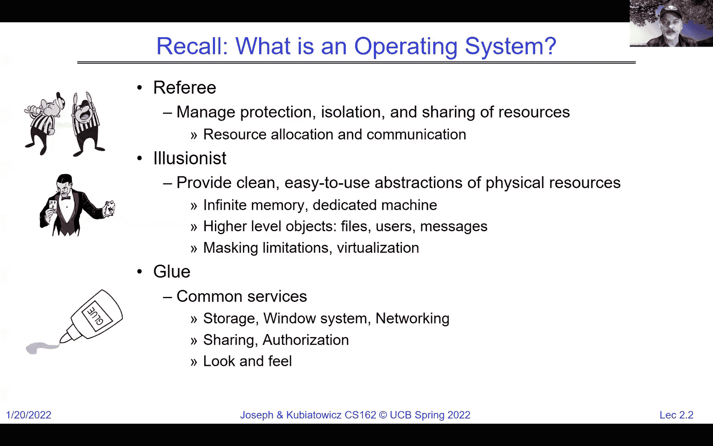
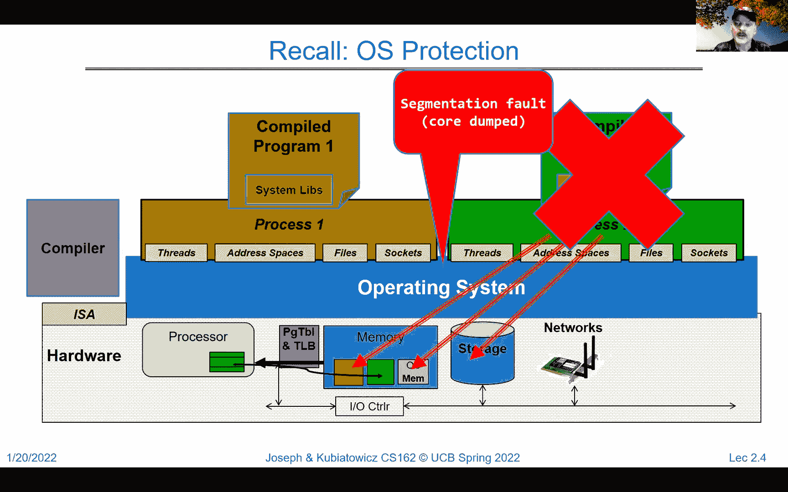
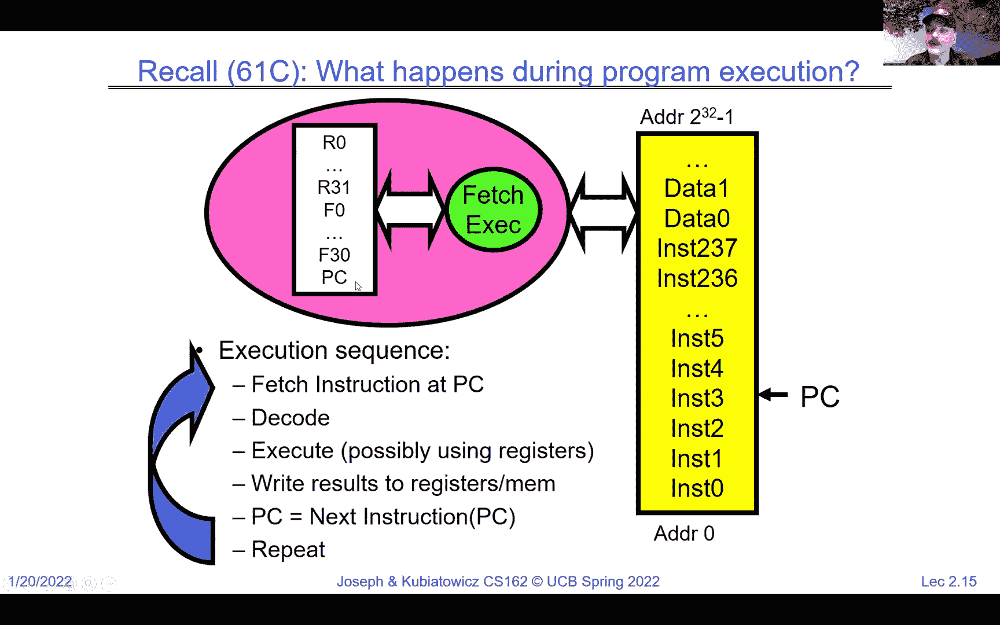
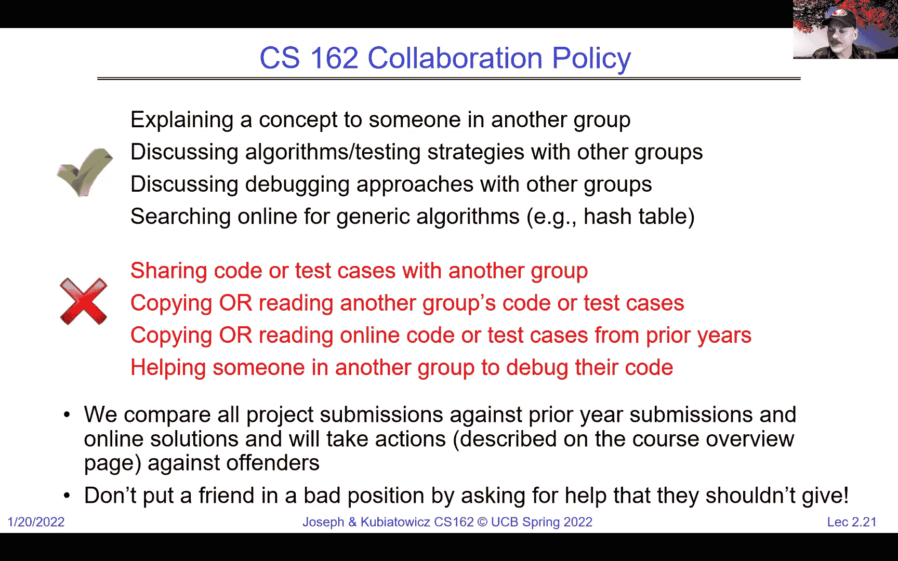
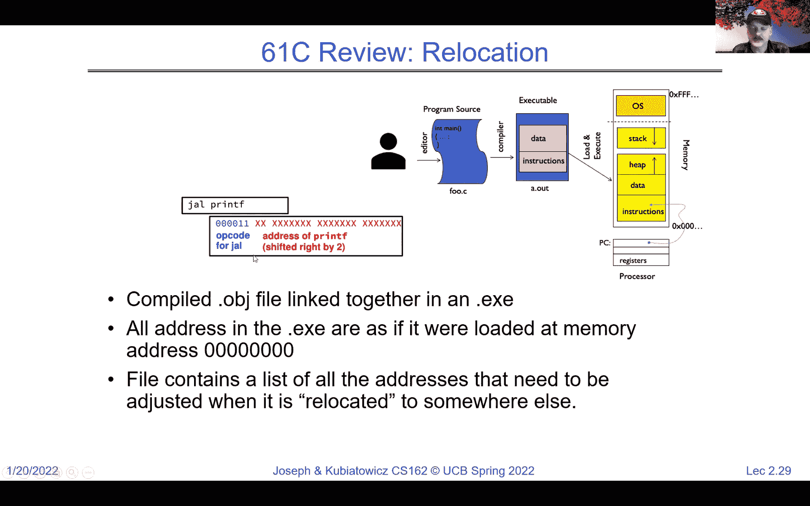
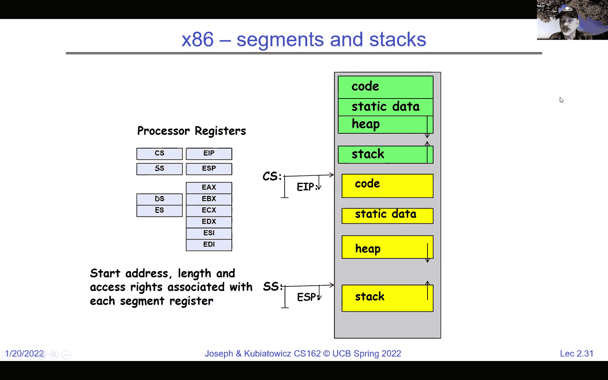
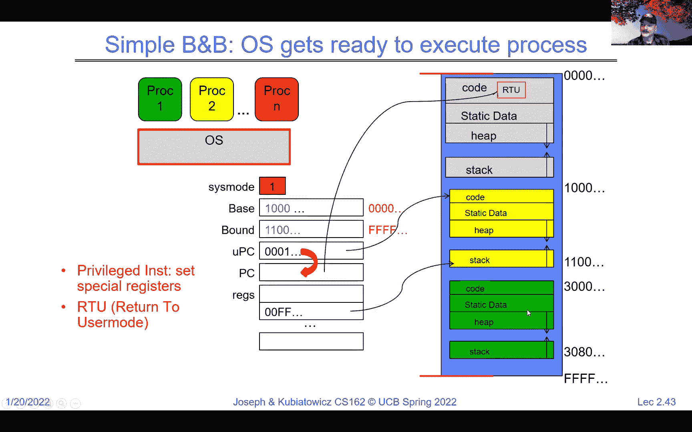
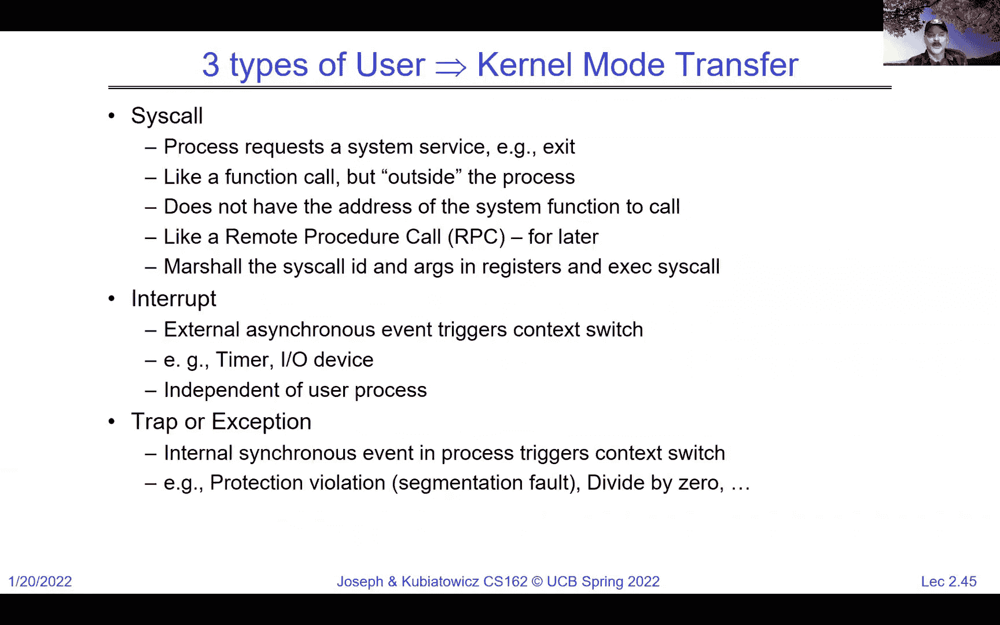

# 操作系统基础：第二讲 - 四个核心概念 🧠




在本节课中，我们将学习操作系统的四个基本概念：线程、地址空间、进程和双模式操作。这些概念是理解操作系统如何管理资源和提供抽象服务的基础。


---


## 概述 📋


上一节我们介绍了操作系统的三种常见角色：裁判、魔术师和粘合剂。本节中，我们将深入探讨操作系统为实现这些角色而构建的四个核心抽象概念。这些概念共同构成了现代操作系统的基础框架。

---

## 1. 线程 🧵

线程是第一个核心概念。它是一个虚拟的执行上下文，完整描述了正在执行的程序状态。线程包含程序计数器、寄存器、执行标志和栈。然而，线程是一个虚拟实体，它不一定始终在物理CPU上运行，也不一定运行在同一个CPU上。


线程是独立的实体，我们可以从线程的角度，而非物理CPU的角度来思考程序的执行。当线程在处理器上运行时，我们称其为“常驻”线程，其状态（如程序计数器、寄存器）被加载到物理硬件中。当线程被挂起时，其状态被保存到内存中的一个特定区域，称为**线程控制块**。

**核心概念**：线程是一个虚拟CPU，其状态可以用一个数据结构表示，例如在C语言中可能类似于：
```c
struct thread_control_block {
    void *program_counter;
    void *stack_pointer;
    int registers[32];
    // ... 其他状态
};
```


操作系统通过**多路复用**技术，在单个物理CPU上快速切换多个线程，从而制造出所有线程都在同时运行的假象。这种切换可以由计时器中断触发，也可以由线程自愿放弃CPU（例如进行I/O操作时）触发。



---

## 2. 地址空间 🗺️


地址空间是第二个核心概念。它是程序在读写时所看到的内存地址集合。对于一个32位处理器，地址空间大约有40亿个地址。关键在于，这个地址空间是**虚拟的**，可能与实际的物理内存布局完全不同。

当一个线程尝试访问某个地址时，可能发生多种情况：
*   正常读写内存。
*   触发I/O操作（如内存映射I/O）。
*   引发异常或故障（如段错误）。
*   与其他程序通信（如共享内存）。


一个典型的进程地址空间布局如下：低地址部分存放指令和静态数据，高地址部分是操作系统空间（受保护），中间是堆（向上增长）和栈（向下增长）。地址空间中间可能存在空洞。

为了实现保护和隔离，硬件需要提供地址转换机制。一个简单的早期方法是**基址-界限寄存器**。CPU输出的每个地址都会与基址寄存器相加，并检查是否超出界限。这可以防止程序访问其分配区域之外的内存（包括操作系统和其他程序的内存）。

更现代和通用的方法是**分页**。内存被划分为固定大小的页。硬件通过一个称为**页表**的数据结构，将虚拟地址（由页号和页内偏移组成）转换为物理地址。页表由操作系统管理，其基地址存储在一个特殊的硬件寄存器中。切换进程时，只需更改这个页表基地址寄存器，即可切换到完全不同的地址空间视图。



**核心概念**：地址转换公式可以简化为：
`物理地址 = 页表[虚拟页号] + 页内偏移`
其中，`页表`是一个由操作系统维护的映射表。

---

## 3. 进程 ⚙️

进程是第三个核心概念，它结合了前两者。一个**进程**是一个受保护的地址空间与一个或多个线程的组合。它是程序的一个执行实例，运行在自己的隔离环境中。

进程是资源分配和保护的基本单位。一个进程中的多个线程共享该进程的地址空间（代码、数据、堆、文件等），因此它们之间没有内存保护，可以高效协作。但每个线程拥有自己独立的寄存器和栈。




不同的进程则通过各自独立的地址空间实现严格隔离。一个进程无法直接访问另一个进程的内存，从而提供了可靠性、安全性和公平性。

**核心概念**：进程 = 受保护的地址空间 + 一个或多个线程。它是一个封装了执行环境和资源的“盒子”。





---


## 4. 双模式操作 🛡️

双模式操作是第四个核心概念，也是实现上述保护机制的硬件基础。硬件必须提供至少两种运行模式：**内核模式**（或系统模式、监管模式）和**用户模式**。

*   **用户模式**：普通应用程序在此模式下运行。在此模式下，某些特权操作（如直接修改页表寄存器、执行某些指令）是被禁止的。
*   **内核模式**：操作系统内核在此模式下运行。它可以执行所有指令，访问所有硬件资源。

从用户模式到内核模式的转换必须受到严格、明确的控制，不能随意进行。这种转换主要通过三种途径发生：
1.  **系统调用**：用户程序主动调用操作系统服务（如读写文件）。
2.  **中断**：由外部设备（如定时器、网卡）触发。
3.  **异常**：由程序运行时的错误（如除零、页错误）触发。

当发生上述事件时，硬件会自动切换到内核模式，并将控制权交给操作系统中预先定义好的处理代码。处理完毕后，操作系统再通过特殊的指令（如“从中断返回”）安全地切换回用户模式，并恢复用户程序的执行。

**核心概念**：处理器中有一个**模式位**。当该位为`0`时，表示内核模式；为`1`时，表示用户模式。硬件根据此位来决定是否允许执行特权操作。


---


## 总结 🎯


本节课我们一起学习了操作系统的四个基本概念：
1.  **线程**：虚拟化的CPU执行上下文，是并发的基本单位。
2.  **地址空间**：程序可见的虚拟内存地址集合，通过基址-界限或页表机制与物理内存隔离。
3.  **进程**：受保护的地址空间与线程的组合，是资源分配和保护的基本单位。
4.  **双模式操作**：硬件提供的用户模式和内核模式，是实现隔离与保护的基石。






这些概念层层递进：硬件提供双模式支持；在此之上，操作系统为每个进程创建受保护的地址空间；在每个地址空间内，可以运行一个或多个线程来执行任务。理解这些抽象是深入探索文件系统、虚拟内存、调度等高级主题的关键。