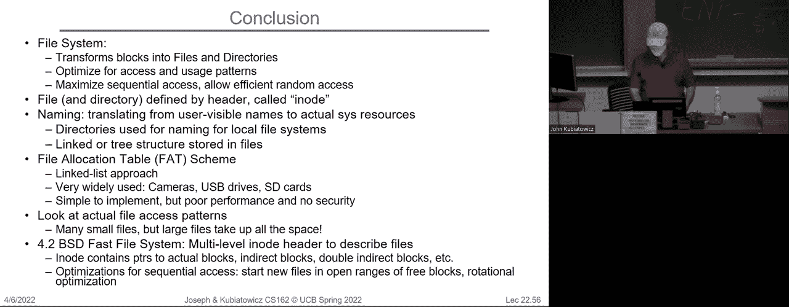

# P20：第20讲：文件系统 2 文件系统设计（续），文件系统案例研究 - RubatoTheEmber - BV1L541117gr

好的，大家。

欢迎回来。今天我们将继续讨论文件系统。我要做的一件事是给你们展示新的幻灯片版本。所以我决定之前的版本有些过于复杂。如果你还记得我们在讨论的内容，这里谈的是开销的概念。

如果你有一个千兆比特每秒的链接，这意味着总带宽除以8就是125兆字节每秒。而且启动成本是1毫秒。然后你得到的曲线大致是这样的，表示有效带宽。

这意味着什么？好吧，对于小数据包来说，那个有效带宽不是125兆字节每秒，因为你的开销会影响到带宽。对吧？然后当你增大数据包的大小时，更多的时间不再用于开销，你会越来越接近总带宽。

所以如果你注意到现在这个数据包的大小是X单位。所以希望这更容易理解。我们在这里讨论的内容是半功率点。或者说什么是半点，基本上就是你获得总带宽一半的那个点。因为你的数据包足够大，能够克服足够的开销，从而获得总最大带宽的一半。

所以如果你有一个更大的数据包，你可以越来越接近那125。所以下定决心在他离开之前确认没有更多问题。是的。是的。就是这样，所以总是有一个最大链路带宽，并且涉及到像这样的计算，所以这个就是125兆字节每秒。对于一个不同的总线，它有点像以太网链路，如果是一个不同的总线，它的最大带宽会是不同的，这个东西会收敛到不同的数值。

好的。这个线性延迟是非常标准的模型。然后你想尽量简单，它基本上是传输一个大小为X的数据包的延迟，它是开销加上X除以带宽。所以这是启动成本，第二部分是原始传输时间。所以这并不是火箭科学，但我想确保你看到了新的、改进后的版本，并使用了更好的变量。

好的。抱歉刚才的失误。是的，继续吧。所以哦，这是W。哦。那里有个错字，那是W的部分。是的。再一个错字。好的。就是这个点，是传输带宽达到最大的一半的点。好的。所以我们上次做的另外一件事情，更复杂一些，是我们讨论了排队理论。

记住，我们在这门课中处理的排队是纯粹的平衡排队理论，这意味着这个队列有一个稳定的平均链路。基本上，随着时间推移，进入的物品数和出去的物品数相等。好的，这就是平衡。那我们这是什么意思？那意味着，如果你看看整个系统，

事物进来，事物出去，但从平均来看，它们是相等的。现在，当然，这真正意味着的是服务器的服务率比到达率要快，但也有一段时间排队是空的，所以这就是它如何平均的。好的。所以我们讨论过的一个重要参数就是这个 lambda 参数。

它是到达率。在我们这门课中的排队理论非常简单，我们假设事物到达是无记忆分布，也就是指数分布。我们还说服务器可以有一个任意的分布。

所以，服务时间 T sub sir 是平均时间，但它可以是一个任意复杂的分布。所以这就是平均服务时间，有时也叫做第一个均值，对吧？然后 C 是我们引入的这个新东西，它是方差平方除以均值平方，而且是无单位的。

好的，C 的一个很酷之处是，如果你将一个复杂的分布简化为 C，这就足够帮助你推算出排队的情况。好的，这就是我们为什么引入它的原因。如果你记得，序列一对应的是无记忆的。所以我们可以推导出一些数字，比如服务率 new 实际上就是 1 除以 T sir。

那是事物一旦到达服务器后离开的平均速度。服务器利用率，这个不新鲜，它是 u，必须在 0 和 1 之间，实际上就是到达率除以服务率，且这个比率必须小于 1，因为否则队列就会填满。

没有反弹，对吧？然后我们要计算的参数是排队时间和队列长度，这两项是我们讨论的内容。关于队列长度，我们从上次得到了一个小定律，就是 lambda 乘以 T Q。

好的，现在在我给你们并提醒你们上次的关键结果之前，关于这些参数有没有什么问题？你应该能够理解给定的系统，并且至少能够弄清楚这些红色的东西是什么，lambda、T sir 和 C。

然后你可以将它们代入公式，来计算你在队列中花费的时间。好的，我们上次讨论了一个问题，我不会再重复了。所以我们得到的两个结果是无记忆服务分布，那就是输入和输出都是无记忆的，叫做 MM1 排队。在这种情况下，你在队列中花费的时间是这样的：服务时间乘以这个缩放因子。

然后你有一个 1 减去你，通用版本是这种服务器有一个任意有趣的分布。这就像是无记忆分布，只不过我们在中间插入了一个小因子，1 加 C 的一半。

好的，当 C 为 1 时，1 加 1 的一半是 1。所以这个 mg 1 变成了 mm 1 1 等于 1。好，大家有什么问题吗？希望对你们来说有趣的关键点是，我们可以看到这一点。所以延迟，或者说你在队列中花费的时间，随着你接近 100 的临界点会无限增长。

好的，所以当你到达 100% 时，如果你有一个无限长的队列，这个值会趋向于无穷大。这实际上来源于这两个因素：你除以 1 减去你。好，你将会在几乎所有你遇到的排队问题中看到这种行为。如果你真的喜欢排队，实际上有一本关于排队的书是 Kleinrock 编写的，我敢肯定，Corey 方面也有关于排队的好课程。

但是对于这门课来说，这些就够了。所以如果没有关于变量或者其他任何问题，我就先停在这里。好，接下来，你们已经是专家了。这是你们用来快速估算队列会如何影响你的主要方式。

好的。接下来我们上次停留的地方，我们在探讨磁盘性能什么时候最高。现在我说的是旋转存储磁盘。你知道旋转存储的特点是你必须移动磁头。你需要转到正确的扇区，然后读取。

所以当你不需要做任何寻道或旋转操作，直接就在一个实际的扇区上读取一大堆数据时，它会最快。这时候磁盘的带宽是最高的。因为你没有移动任何东西，也没有在等待。所以大规模的顺序读取将是我们在构建磁盘文件系统时要优化的目标。

另一个有趣的点是当你有其他任务可以做时，这样你就可以将一大堆请求接入并排序。我接下来会以一种最小化寻道的方式给你们展示这一点。寻道的关键是它需要时间，你必须转到磁盘的正确圆柱体。对吧？如果你有很多请求，那就像是电梯。

你可以在进程中服务，而不必像这样来回走动，因此有能力对一堆请求进行排序也是提高性能的一种方式。当然，正如我们在这门课程中谈到的其他资源一样，当大部分时间系统处于空闲状态时，效率低下也是可以接受的。

所以资源并不是瓶颈，它也不是处于所有过程的中间，稍微低效一点也是重要的。它在不大部分时间处于空闲状态时才很重要。当它大部分时间都是满的，才会有人真正看到问题。这里，这个曲线是一个大部分时间处于满负荷的曲线，对吧？这是我尽可能从磁盘中获取更多数据的时候，延迟会大幅增加。

有人记得延迟上升的根本原因是什么吗？是的，爆发性。 如果你看一下我上次给你们展示的那张爆发图，你仍然会得到相同的平均值，但你会发生一系列爆发，然后是一个较长的空闲期，然后又是一系列爆发。如果你看一下它是如何布局的，有一段时间队列是空的，磁盘没有任何操作。

并且没有办法把这些时间收回来。因为磁头什么也做不了。所以，爆发性立即开始扩展你能做的事情，结果就是越是爆发性强，越接近100个请求点，你就会看到更多的队列积压，这就是发生的情况。好吧，你可以考虑各种优化。

那么让我们讨论几个问题。所以，我们可以做的一个事情就是磁盘调度。好吧。现在我们不再讨论此的调度，而是讨论磁盘的调度。在这里你可以想象你有一堆请求。这些请求可能来自操作系统内部或外部，其实不重要。

而这些请求可能是诸如柱面2，扇区2，或者柱面5，扇区2，或者柱面7，扇区2这样的。 如果你逐个调度它们，最好的情况是你移动到右侧的柱面，读取数据，然后移动到下一个，再到下一个，你来回移动，浪费了很多时间。

然后你会怎么做？所以那是一个FIFO顺序。顺便说一下，正如你们可能已经猜到的，我们在这门课里不喜欢FIFO，对吧？我们在调度时不喜欢FIFO，这里也不喜欢FIFO。它对请求者是公平的，但却是一个非常糟糕的磁盘利用方式。

你把所有时间都花在了寻道上。所以这是另一个思路：最短寻道时间优先。现在我给你们展示的假设是我们有一个请求，这些请求相对于磁头当前位置我标记了1、2、3和4。所以现在磁头在中间。

我接下来要做的是，我会逐步完成我的工作，我会先处理第一项，即第二项，然后是第三项，再到第四项。所以，磁头就在我进行操作时一直在扫描。这是好的。实际上，这叫做最短寻道时间优先，但今天你必须考虑旋转等因素，所以它实际上是以螺旋方式展开的。这是好的。减少寻道次数，但可能会导致饥饿现象。

有人能弄明白为什么这会导致饥饿现象吗？对了，没错。所以这个问题在于，假设我们处于磁盘的中间，突然有一堆请求开始涌现，那么我们就会返回去，我们会停在那里，因为那是在移动磁头的位置。

我们甚至根本不会到达最外层。好吧，还有一种叫做SCAN的算法，它是电梯算法，单向电梯算法。其理念是我们先到达极限点，然后只朝一个方向移动，再返回来，再朝一个方向移动。

好的，它有一个长寻道，然后接上一大堆人，再进行长寻道。我想这就像是电梯，你等着电梯上来，它停下来接上所有人，然后它直接下行，再做一次。

好的，这样的话就会减少饥饿现象。好的，SCAN和SSTF都可以统称为电梯算法，除非你特别明确。好的，为什么叫电梯算法呢？就像电梯一样，它在途中接人。好的，这是优化寻道时间的一个非常好的方法，但这意味着你需要排队一些东西。

这是一个例子，通过排队和延迟这些请求的整体满足，我们可以获得更好的整体系统行为，因为我们可以排队。我们可以重新排序，然后系统整体就会更快。所以这是另一个例子，说明排队实际上是件好事。好的，明白了。那么接下来，C-SCAN就是我刚才提到的那个，它会一直回到原点。好的，我们继续。

所以现在的问题是，如果你要使用类似这些电梯算法，你会在哪里做呢？好的，再次提醒，这个控制器是正确的答案。是的，过去旧时的磁盘控制器不够智能，所以操作系统自己做电梯算法。好的，然后发生了什么呢？控制器变得越来越智能，开始把所有的逻辑都放进了控制器内部，现在的情况是操作系统提交了一堆请求。

这种方式是并行的，或者说是同时进行的，互相重叠，控制器负责排序和处理。所以今天很多人遇到的情况是，控制器在做优化，而操作系统只需要搞清楚如何避开。

好的，与操作系统知道一切不同，控制器是今天这个问题的一个很好的例子。好的，顺便说一句，为了澄清一下，SCAN就是上下移动的电梯算法，而C-SCAN是只朝一个方向移动的电梯算法。

好的。那么，总的来说，我们如何隐藏IO延迟呢？因为从这点来看，通过收集一堆请求来隐藏IO延迟对系统是有利的。那么，现在我们如何隐藏这些IO延迟呢？好吧，现在回到我们上周开始讲的三件事关于IO。

好的，我们可以有一个阻塞接口，这实际上是你整个学期一直在做的。阻塞接口的例子是，当你发出读取请求时，它会让你休眠，直到至少有一个字节返回。好了，当你发出写入请求时，它会让你休眠，直到可以实际写入。所以这是阻塞的，意味着它并没有隐藏 IO 延迟，因为 IO 延迟恰好发生在所有操作的中间。

我们确实讨论过非阻塞接口。所以非阻塞接口就是不等待接口。它的意思是你发出读写系统调用时，它会立即返回。要么返回一些数据，要么返回一个错误，告诉你没有数据，但是它会立即返回。好了，它的优点是，如果我尝试进行某些 IO 操作，如果没有发生，系统会立刻告诉我。

做一些其他事情，我会回来，这样你就可以进行一些轮询。检查 IO，做一些事情，检查 IO，做一些事情。好了，现在，另一个选项是所谓的异步接口。这与非阻塞略有不同，我要再次尝试解释这一点，因为人们第一次听到时，总是不太清楚到底有什么区别，所以异步接口。

接口是你设置一个描述符，告诉系统你想从某个地方读取这部分数据，或者从另一个地方读取那部分数据，你甚至可以将它们链接在一起。然后你提交文件描述符，抱歉，提交异步执行到一个特定的系统调用，稍后你会收到通知，告诉你任务已完成。

所以它的优点是，它在调度后会立即返回。而且它的优点是，它会继续尝试执行所有 IO，而不是直接告诉你“嗨，我没有东西给你”。好的，是的，它实际上是一种带有系统调用的 API，让你描述你想做什么。然后你使用这个 API 来提交任务，而不是通过像读取和写入这样的系统调用来提交异步 IO，异步 IO 有一个不同的系统调用。

它依赖于库的具体实现是什么。然后，稍后你可以通过轮询来查看任务是否完成，或者系统会向你发送一个信号。好了，那些对这个话题特别感兴趣的人，这是一个值得了解的内容，你可以谷歌一下“异步 IO”。有几种不同的实现方式，其中一些深入内核，而其他一些在用户级别使用桥接技术，它们将这一切隐藏起来，但它们是不同的实现方式。

好的。所以，如果我们有这些类型的接口，我们就可以让用户程序在 IO 操作发生时去做其他事情，这对于你想要将 IO 与计算重叠是非常有帮助的。尤其是如果你想做类似电梯算法这样的事情。好的，有什么问题吗？好的。

很好。那么现在，让我们回顾一下前几节课的内容。你们记得这个堆栈吧。这是输入输出和存储层堆栈，在这里你有高层次的IO（流）和低层次的IO（读、写、打开和系统调用接口）以及文件系统和IO设备驱动程序。

我们已经在前几节课中讲解了高层次的内容。然后，如何使用`F open`、`open`，你知道的，`F read`和`read`。最近几节课我们开始讲解低层次的内容，设备驱动程序以及一些设备。那么，当然缺少的就是中间这一部分。好的。

中间这一部分，正是让这些位于底部的各种设备变得足够统一，以便它们易于使用。你们每个人都做过这样的事情，插入过USB驱动器，或者可能是安装了新的磁盘驱动器、固态硬盘或者做过其他类似的事情。有趣的是，尽管这些设备各不相同，你仍然可以把它们当作一个文件系统来看待，想象有目录和文件。所以，这将是我们接下来的话题，去探讨一下我们要去哪里。为了更进一步深入这个话题。

所以，如果你考虑一下用户对IO的视图，位于顶部的是一个可变大小的缓冲区和字节级的访问。因此，我可以说从那个文件中读取12个字节，这样是可以的。好的。但这实际上是一种变通方法。

好的，因为在操作系统内部，也就是在本次讲座中，文件系统实际上是在块级别工作，通常一个块是4KB大小。所以当我说从那个文件读取12字节时，并不是说我能直接从磁盘上读取12字节。好的，实际上发生的情况是文件系统会确定从磁盘上拉取哪个4KB的块。

将其放入内存中，然后获取你想要的12个字节。好的，文件系统就是在做这种转换，因为底层的这些东西本质上是基于块的。但是用户使用的Unix接口本质上是字节级的。好的。举个例子，我们可能有硬件设备，比如硬盘驱动器。好的。

在这种情况下，扇区是最小的量度。我已经提到过几次，现在的不同硬盘通常有512字节或4KB字节的扇区。这两种都是越来越常见的。512字节是多年来的标准，但在那个时期，你真的想给你的朋友留下深刻印象，并且想给他们展示如何浏览Seagate网站，展示你如何理解它。你可以向他们展示硬盘规格，看到那里面有512字节或4KB字节的扇区选项。

现在，扇区是你从磁盘读取和写入的最小单位。但通常文件系统是以4千字节为单位来工作的。所以如果你以512字节的扇区为单位，实际上意味着文件系统会知道一次拿出8个这样的扇区，合成4千字节一起处理，然后进行磁盘的读写。磁盘的限制是512字节，但通过文件系统，实际操作是以4千字节为单位进行上下传输的。

好的，接下来我们谈到的是SSD。SSD内部的结构当然和硬盘完全不同，硬盘是由一块块盘片组成，它们会旋转，并且有一个磁头进进出出，而闪存则是有一堆由闪存晶体管构成的物理块，你可以访问的物理单元通常是4千字节，这在闪存文献中被称为页面（page）。

所以，这个接口读取和写入的是4千字节，但究竟是哪4千字节呢？其实是由闪存翻译层来进行转换的。所以如果你说，我想要第36页，SSD实际会说，哦，操作系统要的是36页，它会进入这个小小的翻译表，查到哦，原来这是物理页1937。

所以，SSD系统内部实际上有一个间接层，所有这些操作都是自动完成的。为什么是这样呢？如果你还记得，闪存是无法直接覆盖任何内容的，你必须先擦除，再进行写入。所以我们需要这个闪存翻译层，每次覆盖一个逻辑块时，实际上发生的是我们抓取一个已擦除的干净页面，将数据写入其中，交换掉旧的数据，更新翻译层，而那个旧块就变成了垃圾，等待回收。

好的，问题来了。是的，访问的粒度呢？哦，地址呢？这个问题很好，访问的粒度取决于接口和你所使用的最小粒度。所以，它会以512字节表示你请求的一个项，所以你总是会请求512字节；而在闪存那边，你总是会请求4千字节。

好的，明白了。还有其他问题吗？是的，SSD呢？哦，硬盘驱动器。所有的扇区已经存在了，如果这是你的问题的话。所以当你格式化硬盘时，格式化过程会进入并为每个磁盘盘片上的每一轨进行格式化。

它会在每个扇区上写入一个小的头部，标明这是该轨道的第1、2、3、4个扇区。这些都是在格式化时初始化的。所以当你实际写入一个扇区时，发生的事情是将磁头移动到正确的圆柱位置，并激活位于正确轨道上的磁头。

然后你继续旋转，直到磁头读取到那个小标题，上面写着“这是第43扇区”。然后它开始写入，这就是写入的方式。所以这些扇区已经在那里了，如果你想使用它们。这样回答了这个问题吗？所以当你分配一个新文件系统或打开一个文件时……

它会查看硬盘驱动器中已存在的文件系统信息，在我们完全回答这个问题之前，让我们再看几张幻灯片，了解文件系统是什么。好的，这是个好问题。没有，嗯，是的。所以文件系统……

文件系统知道块的大小，接着你可以问它是否在文件系统中，或者在设备驱动程序中，它总是一次性获取 4k 数据，而不是底层的……是的，这取决于布局方式，不同操作系统的情况不同。

但我的意思是，你需要知道的是，在文件系统层面，我们一次读取和写入的是 4k 数据。并且在这块绿色块状物和实际的物理部分之间，某个地方会搞清楚扇区的大小，这样它就知道一次访问多少。

好的。还有其他问题吗？

那么，我们如何构建文件系统呢？文件系统是操作系统的一层，它将磁盘或其他块设备的块接口转换为文件、目录等。我们看到了 SSD，这里还有许多其他的设备，它通过将自己插入到处理字节的高层和处理块的低层之间来实现这一点。文件系统提供了目录和文件的视图。明白了吗？

这其实是操作系统中的经典操作，我们利用有限的硬件接口和速率块。然后，我们提供一个更方便或更有用的接口。在这个例子中，它有命名功能。所以你可以通过文件名而不是块号来找到文件。这很棒，对吧？因为你不必记得自己把文件放在哪个块里，像是在块 6 还是块 37，记不清了。所以它给了我们为文件命名的方式。

它给了我们组织文件和目录的方式。它让我们能够将文件映射到各个块上。所以文件实际上就是一堆块。当然，它还提供了执行保护、访问限制的方式，并且为可靠性提供保障。

尽管可能发生崩溃，我们仍有办法确保能够从崩溃中恢复过来，使得你的文件不会丢失。好了，所有这些内容都进入了文件系统。而再次强调，这与用户的视图有关。实际上，文件是持久的，对吧？当你将东西放入文件时……

你期望当你返回时它会在那里。也许你不这么想，也许你足够聪明，从不把东西放在某个地方并期望总能找回来，但。假设这是一个目标。那么，系统的视图就是，在系统调用接口处，它是一个字节集合。系统并不关心你如何使用这些字节，所以你可以有一堆字节。

那些是视频，你可以有一堆字节作为数据库，你也可以有一堆字节作为网页。操作系统并不关心，它只是一堆字节。好吧，所以操作系统内部的系统视图，如我之前提到的，是一组块。块是逻辑传输单元，设备间的数据传输单位，块的大小通常大于或等于扇区大小。

所以我们暂时还是坚持使用4k。另一个我们刚才说的视图是这样的：这里是你，用户。你请求一个文件，这些是字节。它传递到文件系统，最终到达磁盘。那么，假设用户说“给我第2到第12个字节”。文件系统会怎么做呢？

Fetch是对应那些字节的块，然后它抓取那些字节并将其返回给用户。我们知道必须发生的事情是，因为我们谈论的是4k块。如果我请求的是从第2到第12字节，那只有13个字节，对吧？因此它将会加载4k数据到内存中。我们将这个称为缓冲区缓存，然后如果我请求第13到第26字节。

读取操作会进入文件系统，文件系统会说，“哦，我已经有了”，然后直接把它返回给你，因为它已经被缓存到缓冲区缓存中了。好了，文件系统的一个优点就是它可以开始调用缓存机制，确实符合我们请求字节的情况，同时也帮助处理时间局部性。因此，文件系统中的缓存层本身实际上是一个很有趣的组件。

好的，那如果我们需要写入第2到第12字节怎么办呢？这就有点复杂了，假设我们之前没有读取这些字节。那么你不能只是将13个字节直接写入磁盘，你必须至少写入512个字节。例如，文件系统首先处理你的写请求，它说“哦”然后将4k字节加载到内存中，现在这13个字节会被放置在已经存在的字节上面。它可以将其写回磁盘。所以，你必须在文件系统中执行读取、修改、写入操作，以匹配磁盘以块为单位的存储方式，而用户则以字节为单位进行操作。

好的。现在，我刚刚完全忽略了一个有趣的问题，那就是：如果它加载了4k并且覆盖了字节，应该立即写回磁盘吗？是还是不是？有多少人认为它应该立即写回磁盘？很好，我们这里有一个小心的人。有多少人认为它应该等待呢？

有一对互相信任的人。所以，你知道正确的答案是：这取决于情况。好的。如果你真的很担心那一组特定的字节，而这就是我告诉你的全部内容。那当然你需要将它刷新回磁盘，因为如果系统崩溃而它没有刷新回磁盘，你就会丢失数据。但是另一方面，如果你每次写入的是13个字节。

每次都推送出去其实不是很聪明，因为你宁愿等几次写操作，比如一、二、三、四、五次，然后一起推送出去。好的，所以等待是有显著优势的。即便你放弃了持久性。而这种权衡是你需要时刻考虑的事情。好的。

结果会在我们下几节课的讨论中出现，关于日志如何帮助你处理这个问题。好的，因为我们实际上会记录这些字节，这样如果一切崩溃，我们仍然能恢复它们。好吧，所以文件系统内部的一切都是基于完整的块大小。实际的磁盘I/O发生在块级别。任何小于块大小的读取或写入都需要在文件系统内部进行转换和缓存。

所以这是我们的底线。我们好了吗？到目前为止还顺利吧？是的。好问题。所以，等等。也许我先确认一下我理解你的问题。如果你是用户，你是不是需要先读取4K，然后写回4K，还是你在问关于文件系统的事情？好的，很好。问题是，假设我要写入4K字节。

如果我要覆盖4K字节，我是否需要先加载数据，再覆盖它，然后再存回去？好的，是的，除非你给它更好的信息。好的，实际上大多数文件系统会考虑到你正在写入4K数据，并且它正好在一个块边界上，它会做出正确的处理，因为它知道加载并覆盖是不合适的。

那就把它存回去。所以这是在文件系统层面会发生的事情。重要的是，你作为用户，除非你非常关心性能，否则不需要担心这些事情。所以你唯一需要担心的是性能问题，而不是正确性问题，对吧？因为如果它加载了字节，你覆盖了它们，然后它把它们存回去，那就是不对的。

但这是正确的。好的，所以你打开了一个有趣的“潘多拉魔盒”，关于如何从这些系统中获取性能，并且有很多方法可以进行预处理、延迟写入等等。这个问题问得很好。好的，还有其他问题吗？所以，我想我提前说一下，中期考试即将到来。所以我们继续前进。哦，顺便说一下，下周。

我认为冲突形式是做什么的，或者说看一下Piazza。下周一项目三的设计文档，时间有点紧。今天我们在谈论时，我们会告诉你什么是I know，它可能会有帮助。我还想说的另一件事是，始终确保你的TA知道发生了什么。如果你有任何小组问题，确保你把它们告诉TA，因为TA是你的支持者。

好的，你们每个人都有TA。希望你们小组中的每个人都有同一个TA，确保他们知道发生了什么。好吧，除了小组评估，我们还要求你们做的，确保你的TA了解一切。好吧，今天没有其他有趣的行政事项。我不确定这些是否有趣，但今天没有其他行政事项了。好的，那我们如何管理磁盘呢？

磁盘上的基本实体是文件，它是一个用户可见的按顺序排列的块的集合，位于某些逻辑空间中。你可以把文件看作是一堆字节，目录则是一个用户可见的索引，将文件名映射到文件。所以磁盘作为一个线性数组的扇区来访问。那么我们是怎么做到的呢？我们从外面开始计数，然后就这样螺旋式地向内推进，直到我们访问了所有的扇区。

好的，现在我们如何识别一个扇区呢？在过去的时代，扇区通常是通过像圆柱面、表面、扇区ID这样的方式来标识的。好吧，你在哪个圆柱面上，在哪个表面上，在那个轨道上是哪个扇区？你在哪个位置，对吧？现在这种方式不再使用了。有趣的是，这个变化是……

磁盘在80年代开始发展。它们的增长达到了一个超出了我们能处理的MS大小的地步。磁盘制造商等不及偏置发生变化，于是他们开始做一些不同的事情，那就是逻辑块寻址。因此，这种逻辑块寻址实际上是非常有道理的。

其实是因为MS的偏置没有跟上磁盘的大小，才被迫做出了这个改变。好吧，但今天所有的磁盘都基本上定义了每个扇区。因此，每个扇区都有一个整数地址。控制器将地址转换为物理位置，并且它实际上屏蔽了操作系统对磁盘结构的了解。

所以，这是好事也是坏事，对吧？这取决于情况。我想，这会是我今天很多问题的回答。对吧？所以这是好事，因为这意味着控制器可以将坏块过滤掉，重新映射到其他地方，并在格式化时在后台完成这个操作。

因为操作系统不需要担心这些问题。好吧。问题在于，这也意味着操作系统不再拥有关于事物位置的纯粹信息。所以，如果操作系统试图通过优化局部性来构建文件系统，它可能会自以为如果逻辑块地址彼此接近，那它们应该在同一个轨道上。对吧？那就像一种启发式方法，但这不一定是对的。

所以，LBA的概念实际上在某种程度上将操作系统隔离了。而这里的问题是，LBA是由磁盘控制器维护，而不是操作系统吗？是的。现在，另外一个有趣的事情是，你可以拿一个磁盘，分配多个分区，这些分区的总逻辑块地址数量超过了磁盘上实际的物理块数量。

它的实现方式是，当每个分区需要更多空间时，控制器会动态增加磁盘块。因此，只要所有分区没有同时使用完它们的空间，这种方式就能正常工作。好吧。所以这就是所谓的“薄分区”，通常用于虚拟机部署中。好的。

但是今天你需要知道的是逻辑块地址。它深刻地标识了每个扇区，通常来说，相互接近的逻辑块地址在磁盘上也相对接近。好吧，差不多。是的。对。对。所以，分区是磁盘上扇区的逻辑分组，看起来像是一个独立的磁盘，类似虚拟磁盘。这在实际应用中非常有用。

我不知道你们有多少人在笔记本电脑或者其他设备上安装了两个操作系统。多少人同时拥有Windows和Linux，或者其他类似的系统？其实现方式是，Windows和Linux，或者可能有Apple OS和其他你想用的系统，都在不同的分区中。还有一个特殊的引导分区，当你第一次打开计算机时，它会询问你想启动哪个系统，然后引导到相应的分区。

但是一旦操作系统运行起来，那个分区就认为它拥有整个磁盘的视图。好吧，明白。现在，文件系统需要什么？它需要跟踪空闲磁盘块。因为它需要知道将新写入的数据放到哪里，还需要跟踪哪些块包含哪个文件的数据。好吧。需要知道从哪里读取文件。而且你需要在目录中跟踪文件。好吧。

基本上是为了弄清楚如何解析名称。现在这里有个问题，文件系统是在操作系统中实现的，而不是在控制器中吗？是的。现在我们讨论的是操作系统如何决定组织逻辑块来为你提供文件系统。

好的。那么我们在哪里维护这些关于目录和文件之间映射的信息呢？这些信息必须存储在磁盘上。希望如此吧。因为当你关闭一切并重新启动时，文件还应该在那。好吧，所以我们谈论的这些管理信息不仅需要存储数据本身，还要持久化存储。

那么，磁盘上有哪些数据结构呢？这和内存中的数据结构有些不同。因为我们一次只能访问一个单独的块或者一系列块。你永远无法高效地读取或写入单个字，所有操作都只能是块级别的读取或写入。好吧，理想情况下，你希望能够进行顺序访问模式，想象一下磁盘驱动器它是旋转的。

你希望大多数情况下能在一个单一的磁道上进行访问，而不是四处移动，明白吗？这显然在硬盘驱动器上会是最优的。当你使用闪存驱动器时，就没有寻道操作了。不过，也有一些更微妙的事情，比如垃圾回收，在SSD上如果你随机写入数据，就可能会发生这种情况。

你实际上可能会调用垃圾回收器，结果访问速度比预期的还要慢。所以我实际上在Piazza上回答了一个关于上节课的问题，如果你有兴趣可以去看看。耐久性意味着，理想情况下，文件系统在你关闭系统时应该处于一个有意义的状态。好吧，这显然并不总是这样。如果你在使用Unix工作站时突然拔掉电源，系统崩溃了。

那可能不好。好吧，为什么这不好呢？因为在块缓存中会有一堆未刷新到磁盘的脏块。好了，现在很多现代文件系统像x t3、x t4有日志功能，这样即使你随机终止所有内存的操作，数据也能得以恢复。

如果你关机后再次启动，日志信息可能足够用来恢复系统状态。所以，关于让文件系统抵御意外失败的工作有很多。接下来我们来谈谈文件系统设计。文件系统设计中的一些关键因素是……

如果你有硬盘，最好最大化顺序访问并最小化寻道。我甚至在这里加上了感叹号，可以把它当作是大声喊叫吧，应该是这个意思。好了，现在，从授权的角度来看，你在读取和写入之前需要先打开文件，这意味着文件系统会在打开时执行所有权限检查。没错，正是打开操作，这时会失败并提示你没有权限使用这个文件。

这意味着我们将围绕这个概念来设计文件系统。我们首先检查文件，然后在你从`open`返回时，你会得到一个文件描述符。现在你可以读写这个文件描述符，因为你已经检查了权限，而权限并不是在每次读取时都检查的，只有在`open`时才检查。

好的，这将是一个设计问题。大小是在使用过程中确定的。我想这也值得大声说出来，但这个想法是，如果你每次写入一个字节，而是每次写入四个字节，那么首先你最好去泡点咖啡，对吧？

但第二个问题是，文件系统并不知道你要扩展到一TB。因此，它会做出一些可能不太好的选择，如果它知道你需要一个一TB的文件，可能会做出更好的选择，比如为这个文件分配整个磁道。

对，然而，如果你每次只做一点，具体如何分配可能会影响结果，你可能只会获取几个扇区，然后再从别的地方抓取几个扇区，依此类推，这样可能就无法实现你希望的局部性。但这是POSIX文件接口的一个基本特性，除了某些系统调用给出的提示外，实际上文件系统并不完全清楚在写入时文件会变得多大。好的，明白了。当然，我们希望将内容组织到目录中。所以，我让你们来做。

你知道，在我做咨询工作时很久以前，我用过一台非常老的IBM机器。奇怪的是，你把磁盘挂载到系统中后，系统里根本没有目录，什么都没有，只是一个平坦的视图，显示磁盘上所有的文件。

我告诉你，这真的是一种糟糕的组织方式。所以，目录，你们这些人根本不知道自己有多幸运。对吧，目录，目录现在简直棒极了，当然，它们并不完美。因为现在，你们有多少人会忘记把文件放在哪个目录里？好吧，那是我最近的问题。

所以，你知道，可能真的应该通过在你的文件系统上搜索整个Google或者其他类似的东西来解决。好的，因为我们有这么多数据。但不管怎样，这是另一个话题。

你需要小心地分配空闲块，以保持访问效率。那么，我说的是什么呢？好吧，如果你有一个文件，并且不断分配新的块，你希望它们都位于同一磁道上。所以，你知道，你不希望分配过程即使信息不完全，也会尽量为你提供局部性。好了，这就是文件系统的一些组成部分，如果你有一个路径的话。

你知道，"/user/home/"，然后你去目录结构查找那个文件。从文件中出来的是一个叫做i号的东西，它实际上是磁盘上i节点的一个索引。所以，那个词就是i节点，今天我可没忘了告诉你这个。好了。

i节点是文件的描述符，它告诉我们哪些块属于该文件，且它们的顺序是什么。好的，所以这个i号实际上就像是一个数组索引，指向所有i节点的集合。好的，这个i号会被放入到目录中。这个是非常简单的示意图，但我会暂停两秒钟，看大家是否有问题。是的。是的，所有这些都在磁盘上。所以目录是这样的。

所以这里我们把它做得非常简单，假设文件是一个指向一系列块的i节点。那么显然i节点需要存储在磁盘上，以便稍后我能搞清楚哪些块属于我的文件。对吧？但目录是什么呢？目录其实就是一系列文件，它们将名称映射到i号。好的，实际上这一切都是i节点和磁盘上的块。

我稍后会再讲得更清楚。现在，记住进程的抽象表示，这来自于课堂早期的内容。在内核空间，我们有这些文件描述符，它们是指向我们所谓文件描述的整数。

当然，如果我们打开food.tech文件。那么它会打开文件，并且从那时起我们可以通过文件描述符来读取和写入文件，从此之后不再有访问控制，对吧？这就是我们之前谈到的内容。

实际上，打开操作发生时，文件描述符中会包含一个i号，它指向一个i节点。好的，因为打开文件的意义就是验证访问权限，并将i节点加载到内存中，这样我就可以知道哪些块属于这个文件。

好的。现在，文件系统的组成部分包括文件名偏移。通过目录结构我们得到一个文件号。好的，打开操作给你名称解析，它将路径名转换成文件号或i节点。i号进行读写操作。

最终这就给我们提供了存储块。所以这里有四个组成部分：我们的目录是什么样的？我们的索引结构是什么？存储块是什么？空闲空间映射又是什么？这些都是我们需要在文件系统中解决的部分。

那么，文件号从哪里来呢？我们需要在目录结构中查找。所以目录实际上就是一个文件，包含了文件名到文件号的映射，或者说是i号。而文件号可以是一个文件，也可以是另一个目录。那么，当你说“/user/home/kuby/SecretFile/”时，这意味着什么呢？你需要去根目录，然后查找“/user”，根目录会给你一个i号，然后你继续查找。

然后你进入下一个目录，查找 `kuby`，依此类推，你会进行一系列的文件打开操作。但你不需要担心这些，因为操作系统会在你进行 `open` 系统调用时为你处理这些。好的，所以进程不允许直接读取目录的原始字节，因为它们是以特定的方式格式化的。

因此，有一些系统调用，比如 `reader` 等，可以让你遍历目录，我相信你可能已经使用过这些，所以我们不会详细讲解。但为什么我们不让进程直接读取目录呢？因为它们可能不知道自己看到的是什么，而且我们不希望它们搞乱目录结构。所以目录结构就来源于我刚才说的那些内容。

所以这里的抽象是，目录是特殊的文件，像 `/user/user/lib4.3` 和 `/user/libboard/3/food`。基本上，它们是在查看一系列文件。好的，并且有一堆系统调用可以访问目录。

比如说，如果你在某个目录中用 `create` 打开文件，它实际上会为你创建一个新的目录条目并为你分配一个 i 节点。这就是你创建文件时发生的事情。好的，还有一些 libc 支持，这里有一些新的系统调用，如果你还没查阅过的话，可以看看，比如 `open_dir`、`dir_read` 或者 `readdir`，它们用于遍历目录，如果你将这些放在循环中，你就可以进行遍历。

好的。是的，文件号和 i 节点号是可以互换使用的。好的。那么目录结构是怎么样的呢？要解析 `/my/book/count` 需要多少次磁盘访问？首先，你读取根目录的头部信息。根目录的头部在磁盘上有一个固定位置，然后你读取根目录的第一个数据块。好的，因为你正在读取这个文件，它是一个文件名索引对的表格。

你是线性搜索的。好的，因为 Linux 在目录布局上并不是特别聪明，所以你必须实际在线性方式下搜索目录。最终你会找到 `my`。好的，现在你读取 `my` 的文件头或 i 节点。

然后你进入 `my`，并在其中查找 `book`。接着你读取 `book` 的文件头，再在 `book` 中查找 `count`。这会给你 `count` 的文件头，接着你就可以开始读取和写入名为 `count` 的文件了。好的，我在学期开始时简要提到过的另一个概念是当前工作目录。

当前工作目录实际上是一个每个进程的目录。它是当前工作目录的 i 节点。它是文件解析的起点。好的。所以它几乎像是你指向一个文件，一切都相对于它来解析，但实际上在这种情况下它是一个目录。

好的，没问题。这里是内存中文件结构的另一个视图。所以，如果你读取一个文件描述符，它会进入你的每个进程的文件描述符表，文件描述符表指向包含 i 节点的文件描述。i 节点再指向数据块，所以当你打开文件时，i 节点会从磁盘中加载到内存中，然后它被用来确定获取文件的哪些数据块。

好的，没问题。这一点很容易理解。那么现在我们来看一下我们希望得到的文件系统。多年来，关于 Unix 风格文件系统中的数据是什么样的，进行了大量的研究。所以从这些多年的各种研究中得出的第一个观察结果是，大多数文件都是小文件。所以如果你看看这里，这是按年划分的给定大小的文件数量的概率质量函数。

如果你注意到，大多数峰值都集中在像 2K 或更小的文件上。而大文件并不多，所以我们希望能够高效地处理大量的小文件。而大多数字节都位于大文件中，如果我们查看包含的文件大小，会发现大部分字节集中在 2MB 或更大的文件中，因此大文件占据了大部分字节。

但大多数文件都是小文件。那么，这告诉我们什么呢？我们需要对小文件进行高效处理，但也要能够很好地处理大文件。当然，最新的变化是， мультимедиа 文件变得非常流行。因此，真正的大文件往往是流媒体文件，因为它们是视频或者其他内容。好的，所以现在你知道，像 ext4 这样的系统。

这些文件甚至在更大的文件端进行了优化，因为它们位于具有大量大文件的服务器系统上。好的，所以从这里得到的结论是，除了我们会尝试处理大量小文件并能够处理大文件之外，不同的文件系统针对不同的访问模式进行了优化。

市面上有很多文件系统，你们知道，在早期，当你们还像大一新生一样时，你们可能选择了系统给你们的任何文件系统。但是现在你们可以实际考虑选择一个文件系统。你们知道，可以根据需求以不同的方式重新格式化文件系统。

好的，我只是想指出这一点。所以，最简单的文件系统就是所谓的 FAT 文件系统（文件分配表）。它诞生于 1977 年。你可能会认为它现在不再有用了。然而，几乎所有的 USB 卡、硬盘或者你放在相机里的存储介质，基本上都默认使用 FAT 文件系统，你知道的，处理 32 位或更多地址的大版本文件系统。

这样做的原因是它如此简单，以至于实际上可以将其嵌入到相机等固件中。好的。现在，有一个问题在聊天中有人提到，我没有注意到，就是由于目录结构也存储在磁盘上，我们如何知道课程绑定？我知道如何访问结构。

这个问题的答案是根文件系统将存储在一个我们可以始终找到的特殊位置。一旦我们到达这个特殊位置，我们就可以解决其他所有问题。好的，接下来是 FAT 文件系统。其思想是文件分配表实际上只是一个指针的序列。一个从零到 n-1 的指针数组，其中 n-1 是块的数量。

假设我们有一种方法能够获得一个目录，进而将一个名称转换为文件号。磁盘存储，这里只是一个包含块的旧数据集合。数据本身没有意义，它只是一些数据，直到你将文件分配表的部分加进去。那么它是如何工作的呢？例如，假设我们有一个文件。

它有三个块，我将把你的块 01 和这个文件的两个块称为文件号 31。好的，稍后你会看到文件号 31 是怎么来的。但假设我们已经按这种方式布局，那么如果我们想从文件 31 中读取数据，并且想访问第二个块偏移量 X，好的。

所以显然我们现在处于操作系统内部。我们需要做的是找到一种方法来查找该文件的块 2。好的，而到目前为止我展示给你们的内容中没有办法做到这一点，因为这些块是混杂的，它们就像是随意放在那里。那么文件分配表是怎么工作的呢？我们必须用文件号 31 来索引文件分配表，这样我们就能找到我们关心的文件。

我们去查看 FAT 中的第 31 条，它指向下一个块。这是一个指向下一个块的指针。所以如果我们知道文件号是 31，这就告诉我们，在 FAT 文件系统中，块号 31 实际上是该文件的第一个块。因此，我们在目录中放置的内容，也就是文件 31 映射到的名称，也告诉我们该文件的第一个块在哪。

好的，现在记住这是一个非常简化的文件系统。但 FAT 的作用是什么呢？我们可以通过知道 31 来访问块 30，或者说可以通过知道 31 来访问第一个块。但 FAT 中的内容是一个链表，包含了所有与该文件相关联的剩余块。好的，我们先去 31，然后沿着链接到 32，这里就是块 1，然后继续跟踪链接，直到最终找到它。

这告诉我们是块二。所以为了读取块二，我们实际上必须去fat中，跟随链接直到我们找到块二。然后我们可以将它读入内存，在那时我们可以进行索引操作，读取偏移量x。好的。现在问题是，为什么不在块的末尾加一个指针链接这些块，而是列出所有的首位置呢？我不完全确定这个问题的意思，但这就是答案。

我的意思是，这是他们的结构，我们不想把指针放到块里面，因为这些块是2的幂次方。所以fat必须是独立的，这样才能正常工作。接下来我们再看看这个问题。文件是磁盘块的集合，fat与块一一对应，这一点是隐含的，我甚至不需要在这里放指针。文件号和索引是文件根目录的索引，文件偏移量是块号和块内的偏移量。

然后我们跟随列表获取我们请求的块号。在使用过的块上会标记为空闲。好的，所以有一种方法可以说fat中有一个条目代表空闲块。好的，我们可以扫描它来找空闲块，当我们需要时。例如，如果我们要写入文件31，一个新的块三，假设我们是追加操作。那么发生的事情是，我们抓取一个空闲块，将它链接到fat中，现在我们的文件就多了一个块。

好的。问题。很好。是的，这是个很好的问题，显然当计算机不运行时，数据必须存储在磁盘上。如果它能够适应内存，它们会尽量把它放入内存中。好的，所以打开文件系统的一部分工作就是尽可能多地将fat加载进内存。但如果是一个非常非常大的磁盘，可能无法做到这一点。

你可以看到将数据存入内存的好处。这样可以更快地找到内容，因为你可以快速跳跃，甚至可以在内存中为此构建一个索引。如果需要的话。对吧。很好。所以，这里有两个文件的例子。注意我实际上用黄色和绿色标注了。那么它存储在磁盘上，如何格式化磁盘呢？你只需将一切设置为零，这代表一个空闲块。

好的，这就是你如何获得一个全新的磁盘或格式化磁盘，注意，格式化文件系统时，你以为是在删除数据，实际上数据仍然在那里，只不过你删除了fat。你清除了fat。对吧。所以这不是一种干净、安全的删除数据的方式。好的，实际上，当你删除一个文件时，发生的事情是它会标记所有条目为空闲，然而你的数据仍然存在。

如果某人拥有正确的工具，他可以通过它并可能重建你的文件。好了，那么如何快速格式化一个刚标记为“fat”无错误的磁盘呢？所以，关于fat文件系统的一个优点是它简单，你可以在设备固件中实现它。但你可以看到它具有所有这些线性结构，对吧，如果我在一个文件上。

一个大文件中的第37个块。是的，希望我将fat加载到内存中，但接下来我得跟踪一堆链接才能到达那里。所以这对于随机访问来说毫无效率。现在，今天你经常看到fat文件系统出现在媒体设备上，比如相机和手机。通常情况下，如果你有一段视频，你可能不会频繁地进行随机访问，而是顺序地浏览。

所以，这个特定的文件系统对于顺序访问来说非常适用。好了，但是请注意，它做得不好的一个地方是，如果fat中有任何错误，你就会失去所有数据。因此，你会看到许多文件恢复程序，它们会尝试浏览块并弄清楚它们是如何链接在一起的。它们通常比你想象的要有效得多。

但他们正在做的事情是根据这里的内容尝试重建这个文件。你会惊讶的，我看到人们摇头，你会对它能做的事情感到惊讶。这就是为什么你不能信任一个普通的恢复程序来修复fat系统，你真正需要的是一些能够通过1和0来覆盖它，然后用1010和0101进行覆盖，做到几乎不可能恢复的程度。

好的，那么目录看起来如何呢？如果我想做的话，就像我们之前谈到的fat文件系统，目录是由名字和指向fat文件系统中条目的指针组成的。好了，这很简单。目录是包含文件名与文件编号映射的文件。空闲空间为新添加或删除的条目保留。

如果我在该目录中删除文本，发生的情况是这个文件被标记为“已释放”。然后，下次我向该目录中添加内容时，它只是将其链接到空闲空间。所以，目录不会进行垃圾回收，除非你要求它。文件属性实际上保存在目录中，值得注意的是，文件存在于磁盘上，而权限存在于目录中。所以如果你成功地去弄乱目录，或者损坏了部分目录并更改了权限，那么突然间，你就可以访问数据了。

而且在fat文件系统中，这一点也没有独立保护。好了，每个目录都是一个条目的链表，你必须进行线性搜索。那么如何找到根目录呢？这个问题现在应该是你们讨论文件系统时的一个关键问题。在fat文件系统中，根目录是由块2开始指向的。

而且没有块零或块一，别问我为什么。但每次挂载 FAT 文件系统时，它会找到根目录，将内容加载到内存中，然后你就可以开始使用了。好的。现在，问题来了。我希望这部分挺简单的，大家觉得这对每个人来说是一个很好的文件系统入门吗？还不算太难。如果你有问题，尽管问，因为我接下来会展示一个更好的文件系统。

很难说它不好，毕竟它被大家都在使用，但它不是一个很好的文件系统。好的，继续。好，接下来我们来处理另一个小问题，假设你从一个文件编号开始。找到一个块需要多长时间？你得线性搜索，对吧？文件的块布局是什么？看这个，注意这些块是如何排列的。

在磁盘上的块分布到处都是对吧？我先写了块零和块一，然后是块二，再然后是块三。由于空闲块列表的搜索方式，文件系统中的数据存储没有规律可循，因此 FAT 文件系统中没有局部性。所以，这不是必须的。现在，如果你使用一个全新的磁盘并开始顺序写入一些内容，仅仅是偶然的情况。

这些新文件将会变得有序且线性。好的，但现在如果你删除一个文件并快速添加一些新的文件，然后删除并再添加一些新的文件，你最终会看到文件的混乱。在 FAT 文件系统中，它会试图将文件恢复到顺序结构。然而是这样的。大家有谁做过文件系统中的块压缩优化吗？

这些非常适合在你失眠时观看，打开它，它会显示所有块来回移动的过程，就像它在重新排列它们一样。四小时后你可能会想，前四个小时到底发生了什么？好吧。

所以顺序访问并不好，因为如果你顺序访问某些东西，你仍然需要跟踪所有这些指针，可能无法做到顺序访问，随机访问也不好。所以这个文件系统在使用一段时间后，既不适合顺序访问，也不适合随机访问。

它有很多碎片化的情况。至于小文件，如果它们完全适合一个磁盘块，那实际上是很好的，因为你实际上只是指向一个磁盘块。不过不管怎样，大文件差不多是一样的。我们来看一下 Unix 文件系统，特别是 Berkeley 快速文件系统。我知道它在 Unix 中，像下面这样，文件编号和索引指向一组 I 节点。好的。

索引结构是 I 节点的数组，文件编号索引到 I 节点数组中的每个 I 节点，每个 I 节点对应一个文件并包含元数据。所以像读取和写入权限这样的信息存储在 I 节点中，而不是目录中，这与快速文件系统非常不同。

压缩文件系统。由于我们这样设置，我们实际上可以为同一个文件在不同的目录下设置多个名称，它们只是指向相同的i节点。所以文件本身的命名方式并不影响它的独立性。好的。

i节点它维护一个多级树结构来查找存储块或文件，因此它既适用于小文件，也适用于大文件。它是一个不对称的树，采用固定大小的块。最初的i节点格式是在伯克利的BSD 4.1中使用的，后来被很多人广泛复制，所以伯克利Unix系统，你知道吧，这是伯克利Unix的发源地，早在很久以前就提出了这个想法。

它与Linux的ext2或ext3文件系统非常相似，今天你很可能会遇到这些系统。这里是i节点结构。所以记住，文件是通过索引到这个i节点的数组来定义的，或者通过i节点本身来定义的，这两者是一样的。如果你查看这个i节点的内容，顶部有一堆元数据，比如读写权限、文件大小。然后是指向实际数据块的指针。所以元数据中包含诸如用户、组、所有者、访问权限等内容。

比如设置UID位或设置GID位，表示在你尝试执行这个文件时，是否继承该文件的权限。然后是一些直接指针，直接指针实际上就是i节点中指向数据块的指针。

这是一个逻辑块地址，指向一个数据块。我们有一组这样的指针。好的，举个例子，我们可能会有12个这样的指针。那么，为什么有一堆直接指针指向块会好呢？在i节点本身中，这给我们带来了什么好处？对，快速查找。那它给我们带来什么？它给我们带来顺序访问，我们知道在什么样的文件中我们主要使用直接指针。

小文件。记住我们之前说的，我们要优化小文件。这就是i节点结构如何做到的，它有很多直接指针。然后，好吧，这样就可以处理小文件了。那我们如何处理大文件呢？我们使用所谓的间接指针，这些指针位于i节点中，它们不指向实际的数据块。

它们指向的是指向数据块的块，或者是指向指向数据块的块。或者是指向指向数据块的块的块。明白了吗？这些称为间接指针。好的，举个例子，在下面你会看到一个三重间接指针，它指向一个包含多个指针的块。这些指针指向的块再指向指向数据块的块。

间接、双重间接和三重间接指针的加入使得我们能够支持大文件。因此，i节点结构对小文件进行了优化，但也能很好地处理大文件。好的，明白了吗？现在，如果我们看一下磁盘上的索引，我们有一个样本文件，它采用多重索引格式。这是另一个例子，里面有10个直接指针。

那么，块号23需要多少次访问？嗯，你要做的是，必须先到间接块，因为你已经超出了直接块。你需要查找一个间接块，然后才能获取你想要的块。所以，如果有人问你，多少次磁盘访问不需要我去获取某些东西，你可以查找一下，好吗？这可能会出现在考试中。那块号5呢？块号5在这个起始部分，所以只需要一次查找。

好的，等等。块340，结果你需要到双重间接块去做这个操作。好的。问题？是的。没错，你现在想知道间接块中有多少个指针。那取决于块的大小和磁盘的大小，实际上是因为你需要足够的位来指向每个块。但是一个简单的经验法则是，假设这些是32位的东西，所以如果你有一个4k的块。

对，你可以，你可以计算出来，弄清楚它，没错，结果是2k个。好的。是的。你知道吗，原来是10，所以我在这里用了10。随着磁盘变大，小文件的质心稍微上移了一些，所以他们就加了几个指针。所以，实际上，我会说，原始的usonic Unix，我已经说过两次了，原始的Unix。

我知道这个结构基本上和BSD 4.1一样，在许多现代Unix系统中也是如此。所以，xt2和xt3看起来非常相似。只不过在一些地方有所调整，比如直接指针的数量等等。好的。所以，文件系统设计中的关键因素包括高性能、最大化顺序访问、先打开再读取、写时决定大小、组织成目录等等。那么，如何获得高性能呢？好，如果你还记得，这将是我们今天的最后一个话题。

如果你还记得，由于磁盘驱动器的布局方式，你会想尽量避免尽可能多的寻道，也就是移动磁头进出。然后，你知道的，你会希望在磁盘本身上获得局部性。因此，实际上我们希望设计一个文件系统，使得文件中的大多数块都位于同一轨道上。那样就太棒了，对吧？

所以，做了很多工作。快速文件系统和dsd 4.2的i节点结构和4.1是一样的。4.1遇到了和fat文件系统类似的问题。也就是说，如果你有一个全新的文件系统，做了一些读写操作，读写操作之后，最终文件中的块会被打乱，散布在整个磁盘上。好的。

因为没有什么机制可以将它们重新组织在一起。所以快速文件系统的重大创新之一就是通过一些方法和启发式算法来确保一般情况下文件具有良好的局部性。好了，我甚至在资源页面上为大家提供了一篇论文，来自快速文件系统的原始作者，你们现在应该能够理解他们是如何做到从系统中提取局部性的。好的，这就是 Unix 的快速文件系统。实际上，这也是。

如果你们中有对 262 课题感兴趣的，这就是我们研究的第一篇论文。它包含了一些优化，主要是关于在知道你有一个旋转磁盘的情况下，从快速文件系统中获取局部性。好的，它将 I 节点分布在不同的磁道上，这样它们就离数据更近了，而原始文件系统将所有 I 节点都放在一个地方，即磁盘的外圈。所有数据则分散在整个磁盘上。

这有两个非常严重的问题：首先，如果磁头发生故障并破坏了磁盘的外圈，所有数据都将丢失。好了，通过将 I 节点分布在磁盘的不同位置，现在如果磁盘的部分区域损坏，其余的磁盘区域仍然可以正常工作，这就是一个重要的优化。

另一个重要的优化是通过将 I 节点分布在磁盘的各个位置。这样，目录中的所有文件及其 I 节点和数据块都位于磁盘的相同区域，只要你在该目录中，就不需要移动太多。

好的，这是一个很大的优化。还引入了位图分配方式来代替自由列表，这让文件系统在定位磁盘位置方面做得更好，或者说定位磁盘块时更加高效。我们还采用了 10% 保留磁盘空间的技巧。只要你保留大约 10% 的磁盘空间，并且不告诉任何人，那么它的分配启发式算法就能更好地为你提供文件的局部性，因为它留出了足够的空间，从而能够形成连续的大块空闲磁盘空间，进而获得局部性。

所以这次我们会花很多时间讨论这个，下周再继续，但事实上我们会把这部分留到下周，讨论快速文件系统的一些变化。不过总的来说，文件系统是将块转换为文件和库的部分。它将用户对文件和目录的视图与底层的块结构相结合，将其转化为有用的东西。

一切都围绕着优化访问和使用模式展开。文件由一个叫做 i 节点的头部定义。首先是从根路径开始，经过一系列文件，直到找到感兴趣的 i 节点。文件分配表方案是一种非常简单的链表方法，令人惊讶的是，它仍然广泛存在。然后我们看了一些实际的文件访问模式。

我们开始讨论了 BSD i 节点结构，下一次我们会继续讲解这个内容。所以希望大家度过一个愉快的周末。我听说明天会更凉爽，所以这挺好的，接下来就享受一天的美好时光吧。谢谢大家。

