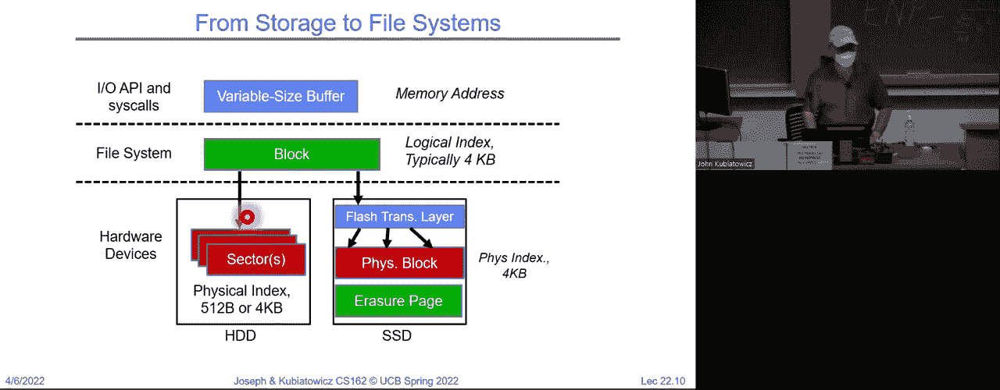
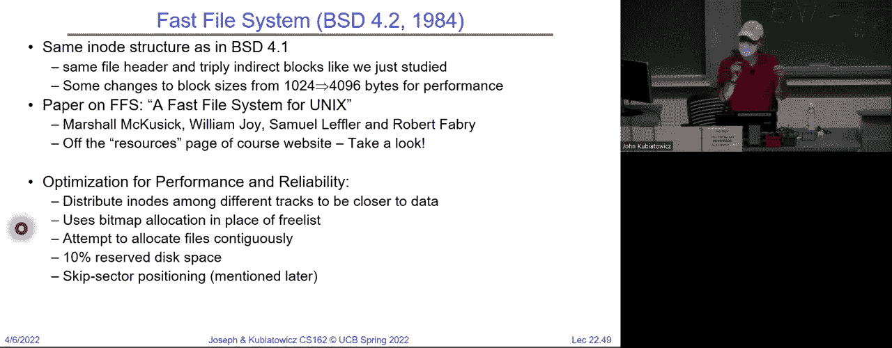

# 操作系统课程 P20：第20讲 - 文件系统设计（续）与案例研究 📂

在本节课中，我们将继续深入探讨文件系统的设计，并研究几个具体的文件系统案例。我们将学习如何将底层的块设备抽象为用户友好的文件和目录，理解不同文件系统的设计权衡，并分析它们如何优化性能。

---

## 概述

上一节我们介绍了文件系统的基本概念和磁盘性能模型。本节中，我们将首先回顾排队理论在I/O中的应用，然后探讨如何通过调度和接口设计来隐藏I/O延迟。接着，我们将深入文件系统的核心设计，包括其组成部分、数据结构以及两种经典的文件系统实现：FAT和Unix快速文件系统（FFS）。

---

## 回顾：排队理论与磁盘性能

排队理论帮助我们理解当多个I/O请求到达一个资源（如磁盘）时，系统行为会如何变化。我们使用一个简单的模型，其中到达率（λ）和服务时间（T_s）是关键参数。

**公式**：平均队列时间 `T_q = T_s * (1 + C) / (2 * (1 - ρ))`，其中 `ρ = λ / μ` 是利用率，`C` 是服务时间分布的变异系数。

当利用率接近100%时，队列延迟会急剧增加。这对于理解磁盘在重负载下的行为至关重要。

---

## 优化磁盘访问：调度与接口

为了最大化磁盘性能，我们需要减少耗时的寻道操作。大规模的顺序读取是优化的主要目标。

### 磁盘调度算法

以下是几种常见的磁盘调度算法，它们通过重新排序请求来减少磁头移动。

*   **FIFO（先进先出）**：按请求到达顺序服务。公平但效率低下，因为磁头可能频繁来回移动。
*   **SSTF（最短寻道时间优先）**：总是服务离当前磁头位置最近的请求。提高了效率，但可能导致边缘请求“饥饿”。
*   **SCAN（电梯算法）**：磁头沿一个方向移动，服务途中的所有请求，到达一端后反向移动。减少了饥饿现象。
*   **C-SCAN（循环扫描）**：磁头只朝一个方向移动服务请求，到达末端后立即返回起点重新开始。提供了更均匀的等待时间。



现代磁盘控制器通常内置了智能调度算法，操作系统只需提交请求即可。

### 隐藏I/O延迟的接口

为了在I/O操作进行时允许CPU执行其他任务，操作系统提供了不同的编程接口。

*   **阻塞接口**：发起I/O调用的进程会睡眠，直到操作完成。简单但无法重叠计算与I/O。
*   **非阻塞接口**：I/O调用立即返回。如果数据未就绪，则返回一个错误码。进程可以通过轮询来检查状态。
*   **异步接口**：进程提交一个I/O操作描述后立即返回。操作系统在后台执行I/O，并在完成后通过回调或信号通知进程。这是重叠计算与I/O最高效的方式。

---

## 文件系统设计核心

文件系统是操作系统中的一层，它将块设备（如磁盘）的块接口，转换为用户和应用程序所看到的文件、目录接口。

### 用户视图 vs. 系统视图

*   **用户视图**：文件是可变大小的字节序列（字节流），支持随机访问。
*   **系统视图**：磁盘以固定大小的**块**（如4KB）为单位进行读写。文件系统负责在字节流和磁盘块之间进行转换。

**关键操作**：当用户读取12个字节时，文件系统需要：
1.  确定这12个字节位于哪个（或哪些）4KB块中。
2.  将整个块读入内存中的**缓冲区缓存**。
3.  从缓存中提取所需的12字节返回给用户。
写入操作同样可能需要“读取-修改-写入”整个块。

### 文件系统的组成部分

一个完整的文件系统需要管理以下信息：
1.  **目录结构**：将人类可读的路径名映射到文件标识符（如i节点号）。
2.  **索引结构**：记录每个文件的数据块在磁盘上的位置（如FAT表、i节点）。
3.  **存储块**：实际存放文件数据的磁盘块。
4.  **空闲空间管理**：跟踪磁盘上哪些块是空闲的，可用于分配。

### 目录与文件标识

目录是一种特殊的文件，其内容是一张表，记录了`（文件名，文件标识符）`的映射关系。
在类Unix系统中，文件标识符通常是**i节点号**。i节点是文件的“元数据”结构，存储了文件属性（大小、权限等）和指向其数据块的指针。

**路径解析示例**：打开文件 `/home/user/file.txt` 需要：
1.  读取根目录`/`，找到`home`的i节点号。
2.  读取`home`目录，找到`user`的i节点号。
3.  读取`user`目录，找到`file.txt`的i节点号。
4.  访问`file.txt`的i节点，进而访问其数据块。

---

## 文件系统案例研究

### 案例一：FAT（文件分配表）文件系统

FAT是一个古老但至今仍广泛用于U盘、SD卡的文件系统，因其设计简单，易于在嵌入式设备中实现。

**核心数据结构**：
*   **文件分配表（FAT）**：一个贯穿整个磁盘的大数组，每个条目对应一个磁盘块。条目内容是指向下一个块的指针，或标记为空闲、坏块等。
*   **目录项**：存储文件名和文件的**起始块号**。

**工作原理**：
1.  目录项中存储的起始块号，是文件第一个数据块在磁盘上的位置，也是进入FAT表的索引。
2.  要查找文件的第N块，需要从起始块开始，在FAT表中依次遍历链表指针，直到找到第N块。
3.  文件的所有块通过FAT表中的链表连接在一起。

**代码/公式描述文件块查找**：
```
当前块号 = 目录项.起始块号
for i in 范围(1, 目标块索引):
    当前块号 = FAT[当前块号]
返回 当前块号
```

**优点与缺点**：
*   **优点**：结构极其简单，实现容易。
*   **缺点**：
    *   随机访问性能差（需要遍历链表）。
    *   文件易产生碎片，破坏局部性。
    *   文件元数据（如权限）存储在目录中，而非与文件绑定，安全性较差。

### 案例二：Unix FFS（快速文件系统）与 i节点结构

FFS（及其后继者如ext2/ext3）是类Unix系统的经典设计，其核心是**i节点**结构。

**i节点结构**：
i节点包含了文件的元数据（权限、大小、时间戳等）和一组指向数据块的指针。这些指针经过精心设计，以同时优化小文件和大文件的访问。

**指针布局**：
*   **直接指针**：i节点中有多个（如12个）指针直接指向数据块。这使得小文件可以快速访问，无需额外磁盘读取。
*   **间接指针**：
    *   **一级间接指针**：指向一个块，该块本身不存数据，而是存满了指向数据块的指针。
    *   **二级间接指针**：指向一个块，该块存满了一级间接指针。
    *   **三级间接指针**：以此类推。

这种多级索引结构使得文件系统可以支持从几个字节到数TB大小的文件。

**FFS的性能优化**：
1.  **柱面组**：将磁盘划分为多个柱面组，每个组都有自己的i节点区和数据区。目标是让一个目录下的文件和它们的i节点、数据块尽量位于同一个柱面组内，减少寻道时间。
2.  **i节点分布**：将i节点分散到磁盘各处，而不是集中存放，提高了可靠性和局部性。
3.  **预留空间**：默认保留一部分磁盘空间（如10%），这为文件系统分配连续空间提供了灵活性，有助于减少碎片。

---

## 总结

本节课我们一起深入学习了文件系统的设计。我们回顾了排队理论对I/O性能的分析，探讨了通过磁盘调度和异步接口来优化性能的策略。我们剖析了文件系统的核心职责，即在字节流和磁盘块之间进行转换，并管理目录、文件索引和空闲空间。




通过研究**FAT**和**Unix FFS**两个典型案例，我们看到了不同的设计哲学：FAT追求极致的简单，而FFS通过精巧的i节点结构和布局优化来追求高性能与可靠性。理解这些基础设计，是后续学习现代文件系统高级特性（如日志、快照、压缩）的基石。