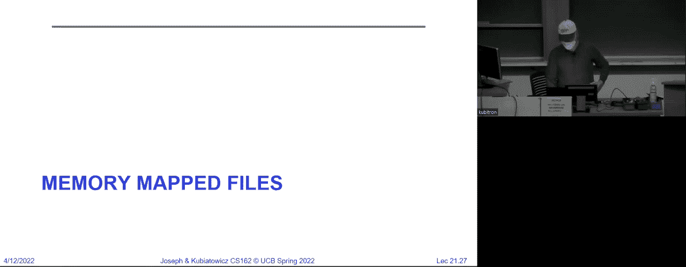

# P21：第21讲：文件系统3案例研究（续），缓冲，可靠性，和 - RubatoTheEmber - BV1L541117gr

大家欢迎回到CS162课程。我们将继续从上次的地方开始，讨论文件系统。如果你还记得上次的内容，我们讨论了文件系统的主要组成部分。那是某种查找名称的方式，目录结构提供了某种索引指向i节点，i节点代表了实际的文件，并且i节点通常指向数据块。

所以这是一个看待文件系统的相当通用的方式。那么我们为什么需要像这样的东西呢？首先，存储介质被分成了一系列数据块，要么是512字节，要么是4K，而512字节就是4K大小。因此，我们显然需要某种方法来标明哪些块属于哪个文件，以及它们的顺序。i节点正是用于解决这个问题的。而目录结构则提供了方便的名称查找功能。

对于这个非常高层次的内容，有没有什么问题？

因为这正是你现在为项目三所思考的内容。所以我们讨论了来自MS-DOS的古老文件系统，叫做FAT。它非常简单，这也是它至今仍被使用的原因。它的结构就是一系列块和一个叫做文件访问表的大型数组。该数组实际上与每个磁盘块一一对应。

它唯一的作用就是按某种顺序将块链接在一起，表示一个文件。好的，所以在这个特定的退化版文件系统中，甚至没有i节点。这真的是非常简单。好了，我们寻址文件的方式基本上是这样说的：哦，文件号是31，代表第一个块。

然后我们把它们连接起来以获取其余的部分。好的，你只需要知道如何引导它，你需要知道根目录在哪里。事实证明，在FAT文件系统中，根目录通常在块号2，然后一切就从这里开始。明白了吗？

有问题吗？好的，我们在这方面没问题。现在，当然，这种方式并不完美，它有很多问题，对吧？比如，你总是需要进行线性搜索才能在文件系统中找到东西。因此，它在顺序访问和随机访问上都很低效。所以说，基本上从各个方面来说，这并不理想。

但它的简单性让你可以把它放到固件中。所以我们接着说，好的，那我们还能做些什么？

我们给你展示了这个来自4.1 BSD Berkeley标准发行版的原始文件系统，长得像这样。这可以说是我见过的第一个包含直接块、指针、间接块指针等等的i节点。那这到底意味着什么呢？嗯，这意味着我们有一个结构就是文件。你几乎可以说，i节点就是文件。

它包含了元数据，包括所有的访问权限。谁是文件的所有者？

最后一次写入或读取是什么时候？然后这些指针帮助指向文件中实际存在的块，且按特定顺序排列。比如，在原始的BSD系统中，我们有10个直接块指针，这些指针可以指向最多10个块。然后，一个单独的间接块指针会指向一个块，而这个块又会指向数据块。

然后双指针会指向一个块，再指向一个块，依此类推。因此，这种结构优化了短文件和长文件的存储，因为它可以快速处理短文件，而长文件也能得到有效表示。现在，我确实有一个问题，我想是在上周的讲座后提出来的，那就是，如果有一个短文件，怎么办？

你必须填入所有这些指针吗？不，你可以在这里不填写任何指针。好的，那么你能创建的最短类型的i节点是，至少包含一个指向块的指针，其他指针都是空的。好的。所以它的优点是，它或多或少是简单的。比起FAT文件系统来说，它并不那么简单。

但它相当简单，并且提供了一种表示小块和大块文件的方式。缺点是这些块的来源没有规律。因此，这个数据结构没有指出这些块的存储方式将是高效的，磁盘的使用没有什么规律可言。大家都理解了吗？唯一能说的是，我可以在磁盘上表示文件。

它并没有说我一定会让它们变得高效。这是这个问题的关键。这个布局关注的是正确性。它告诉我哪些块属于文件以及它们的顺序。由于它并未涉及性能问题，它可能表现得很好。为什么？嗯，如果我能确保在一个轨道上按顺序选择所有块，那么这样做。

可能非常高效。另一方面，如果我随机选择这些块，文件仍然能够工作，但效率会非常低。因此，这个数据结构并没有涉及效率的问题。它关乎正确性。现在我们必须弄清楚如何让它变得高效。

有趣的是，在原始的BSD文件系统4.1版本中，你会创建一个全新的文件系统。你会重新格式化磁盘，一切都会，我要说，那时速度飞快。然后随着使用，它不断地删除、添加、删除和添加文件，它会变得越来越慢，因为空闲列表的工作方式是链式的。

空闲块，其他的东西。最终，你会得到一种最差的块排序。你会从最好的排序开始，最终变成最差的排序。明白吗？大家都理解吗？

所以接下来出现的是4.2 BSD和快速文件系统。那么这里有一个问题，聊天中有人提到，磁盘上总共有多少文件是有限制的。是的，磁盘上文件的总数限制取决于你有多少个i节点。如果你只分配了一定数量的i节点，那么你最多只能有这么多文件。

好吗？还有一点是，每个文件的最小大小是一个i节点的大小加上一个块的大小。而且没有比这个更小的文件。所以即使是一个字节的文件，它也会有这个问题。通常，i节点的大小大约是128字节。所以你说的128字节加一个块是最小的文件大小，甚至是对于一个字节的文件。好吗？好。那么，4.2 BSD大约是在1984年出现的。

它仍然使用相同的i节点结构，因为记住我之前说过，i节点结构本身并不是问题，问题在于分配块。所以它还是用了相同的头部，三重间接块等等。它们稍微改变了块的大小，从1.024（1k）变成了4k。这让事情变得稍微快了一些。为什么这样做让它变得更快呢？

为什么改变块大小会让这个文件系统变得更快呢？对的。好吧，但为什么这能帮助减少每个文件的块数呢？为什么它会更快呢？

是什么？好。那么它是如何减少开销的？很好。[听不清]，很好。所以它在减少开销。那么你们在讨论的另一个问题是，如果我们总是按连续的磁道扇区来分配一个块，那么一个1k的块就有两个512字节的扇区，一个4k的块就有八个，且都在同一个磁道上。

所以我们通过把块大小从1k改成4k，就能从磁盘中获得局部性。所以是的，这样减少了开销，但也以一种非常有利的方式在旋转磁盘上减少了开销。但是它们还做了很多其他事情。我放了这篇论文，我不知道你们上次在我们的资源页面之后是否看过，但。

这是McEw's、Nick Joy、Leffler和Fabry写的关于原始快速文件系统的论文。你们也可以去看看。1984年的论文与今天的研究论文看起来有点不同，但这实际上是我们在262课程中学习的第一篇论文。它们做了很多优化文件系统的方法。好吧，其中之一。

因为它们将i节点分布在了磁盘的各个位置。好，那么为什么这很好呢？这意味着现在你知道，当它们最初都在磁盘的外侧时，无论文件在哪里，你总是必须寻道到磁盘的外侧，再返回来获取i节点。所以如果你在一个目录中执行LS命令，你会去寻道，然后获取数据。

你会定位，获取数据。由于i节点的位置，头部移动会很频繁。所以他们将i节点分布到不同的地方，这样做也提高了可靠性。因为如果你遇到磁头崩溃，破坏了部分磁道，而恰好是在外部磁道，那么你基本上会毁掉所有的i节点，从而……

实际上摧毁了文件系统，因为你根本不知道里面有什么。好吧。然后他们所做的另一件事是，改用位图，而不是链表的空闲列表。他们实际开始使用每块一个比特的位图，这样的长位图基本上可以让他们分配空间，同时知道涉及到的局部性。如果你有一个很长的位图。

你可以选择使用一大串未分配的扇区。你可以通过在位图中找到一堆未分配的扇区来获得很多局部性。而且他们还尝试了连续分配文件。他们有一个10%的保留磁盘空间，我稍后会详细说明，然后他们还做了其他事情。

他们有一个叫做跳过扇区定位的机制，我稍后会讲到。那么我们来看一下i节点的布局。早期的Unix和Windows上的FAT文件系统，所有的元数据，也就是目录、i节点和所有相关信息，都存储在磁盘的外部一个地方。好吧。

这些i节点在你格式化磁盘时是固定大小的，而i节点集中存放在一个地方的问题之一是，磁头崩溃会摧毁所有的数据，正如我所说的那样，而且i节点与数据不在一起。好吧，另一个问题是，在Unix中创建文件时，你其实不知道文件的大小，因此你无法知道该分配多少连续的空间。

好吧，我们通过这种文件系统获得快速访问的方式是，如果我们有一个包含100个扇区的磁盘，我们希望所有100个扇区都位于少数几个相邻的磁道上，因为那样能提供最快的性能。好吧。所以他们实际做的是将i节点分散开来，然后提出了……

一种分配机制，确保在平均分配的情况下，分配的块有局部性。所以他们实际做的是将磁道分成一组一组的磁道组或块组，你可以看到这些就像是沿路的甜甜圈。对于每个块组，他们为该块组放置了一组i节点。好吧。

因此，通常由于这一点，你可能会发现一个文件的i节点存储在同一个磁道组中，同时也作为该文件所在目录的父目录的i节点，并且在同一个块组内存储着该磁盘的所有数据。现在，如果我们在访问某个目录下的内容，突然间所有数据都集中在一个块组内，这样速度就会更快，因为不需要进行大量的寻道。好吧。

所以我们将磁盘分成了很多块组，这些块组是一组封闭的轨道。记得我们曾谈到磁盘访问时的C值为1.5，其中常见的寻道时间低于平均值吗？好吧，块组给你带来了这个好处，因为这意味着你比平均寻道时间要少得多，平均情况下是从每个轨道到其他轨道的寻道时间。

并且你对它们求平均。这就是这里的平均寻道时间，通过保持在一个块组内，我们只需稍微移动一点点。结果就是我们可以更快地访问数据。所以，基本上我们做的事情是把磁盘分成了许多局部区域。

把东西放进去，避免大范围的寻道。目录和它的文件通常位于一个共同的块组中。现在让我告诉你们另一件事。记得我们在几堂课前看到的数据吗？我们看到大多数文件很小，但大多数字节都在大文件中。记得我给你们展示了两张幻灯片吗？所以，大多数文件都很小这一点与这个方案非常契合，但对于那些非常大的文件。

大文件。如果我在一个块组中有一个大文件，并且试图将它完全放入这个块组中，结果会是什么呢？我会把整个块组都填满一个大文件，这样就没有空间放入任何小文件。所以他们做的事情是，采用启发式方法，首先在与I节点相同的块组中分配空间，但当你超过一定数量时，比如64。

假设你有千字节或者其他类似大小的数据，你会去不同的块组中运行一段时间。好的，结果是，它确保了你每次寻道的间隔不会太频繁，而这个间隔就是多个块的大小，并且它预留了空间，这样小文件仍然可以适应，并且靠近它们的I节点。

所以快速文件系统的核心是通过大量启发式方法来确保分配的东西是快速的。好的，一旦你有了这种方案，剩下的就很容易理解了。我们为每个块组做了位图，我们先进行新的块的空闲分配，尽量选择连续的块来避免碎片化。

然后，当大文件出现时，有一种方法可以跨多个块组进行处理。好的，关于这一点，最初可能有些反直觉，但我希望你们能够理解它的原理。我们想确保基本上有10％或更多的存储空间是空闲的。如果我们这样做，我们就知道，从概率上来说，找到一段空闲块的序列会很容易。

在磁盘上跟踪并确保性能良好。这只是一个概率性论证，因此在许多现代文件系统中，这种情况表现为总磁盘大小的10%直接被预留出去，而你甚至没有被告知这一点，它通常被隐藏在系统背后，目的是为了提高性能。而通常作为系统用户，如果你是根用户（root），你可以进入系统并更改这个设置。

但我建议除非你真的急需空间，否则不要更改。好了，总结一下，对于小型目录，i-node 布局可以将所有数据、头信息等放在同一磁道上，从而避免了寻道。文件头比整个块要小得多，因此可以一次从磁盘中提取多个头信息，这样我们就能一次性获取一堆头信息。

因此，我们可以从同一目录中获取一堆i-node。其可靠性在于，即使磁头崩溃摧毁了磁盘的一部分，剩余的磁盘仍然是完好的。所以可以把这个理解为最小化磁头崩溃时的损失。顺便说一句，我应该告诉你“磁头崩溃”是什么意思。

这不是那种重金属音乐演奏时，墙壁太近的情况。那种情况也会导致磁头崩溃。我们这里讨论的是，当你使用旋转存储时，磁盘在旋转，实际上那些小磁头上方有一层微薄的气流，造成它们浮在磁盘上方。

所以这些磁头实际上并没有接触磁盘，它们是悬浮在上方的，因为磁盘转速足够快，导致磁头漂浮在磁盘上空。而所谓的磁头崩溃，就是在这种情况下，如果你撞击磁盘，磁头会直接接触磁盘并刮出一个凹槽。当发生这种情况时，所有的0和1会从侧面脱落，你就会看到它们。

当磁盘掉落到电脑旁边时，你知道那时候你无法恢复数据了。那就是所谓的磁头崩溃。多年来，已经做了很多工作以确保磁盘不会发生磁头崩溃。比如在机器关闭时，磁头会停留在没有数据的区域。另外，当磁盘空闲时，它还会定期将磁头拉回到安全的位置。

等等。但磁头崩溃确实是一个真实的现象。现在让我们看看第一个适配块分配。如果你想象一下，我们有一个区域，其中灰色代表正在使用的块，白色代表未使用的块，那么你可以快速查看这些块并确定哪些是可以分配的。所以如果我们写一个占用两个块的文件，我们可以选择两个相邻的块。

或者如果我们想写一个大文件，我们可以确保大多数块都集中在一起。好的，这绝对不是火箭科学，但这意味着如果你有一个位图分配方案，你可以通过查看位图轻松找到一系列空闲块，而这正是快速文件系统所做的。问题？是的，好的，这是个很好的问题。

所以下一讲我可能说过，或者是之前讲过，我基本上说过，现代控制器会自动重新映射有故障的扇区，因此像这样的方案就不会那么有效了，因为它与局部性并没有完美对应。是的，这是一个问题。控制器尽力确保它大致反映局部性。

好的，虽然现在它并不再是完美的，但仍然相当不错。好的，这个点非常重要。这是一个很好的例子，回到 4.2 BSD 时代，你是通过扇区、柱面、磁道扇区号来定位的。因此，你可以准确知道你的位图和位置之间的对应关系。

一旦我们使用逻辑块地址，虽然有点模糊，但它大致上还是有效的。所以我认为这里的关键部分是，大多数情况下它能带来巨大的局部性和性能提升。好的问题，其他问题呢？

这很有意思，你们应该去看看我在资源页面上放的那篇论文。它有趣的地方在于，一些非常简单的启发式方法让他们的性能大幅提升，因为它确保了文件大多数是局部的，具有很高的局部性，这带来了巨大的不同。

他们做的另一个事情也很有意思。解决了由于旋转延迟导致的丢失块问题。这里的想法是，你从磁盘读取一个块，然后将其放入设备驱动程序中，等到你确定下一个块要读取时，磁盘已经转动得太远，所以你想要的块已经过去，你得等它再转一圈，才能读取到该块。

这是一个大问题，因为这意味着即使你有非常好的局部性，所有扇区都紧挨在一起，你仍然必须为每个读取的扇区等待一次旋转，这很糟糕，对吧。所以他们在 4。

2 BSD 实际上使用了一种叫做跳跃扇区（skip sector）的方法。例如，如果你看看这里的 Fuchsia，发生的事情是这些粉色的块代表文件的块，而这些块不是彼此相邻的，而是被分散开来，恰好足够保证如果你拉取这个东西并进行某些操作时，延迟不会过高。

它在请求下一个块时，不会超过它已经转过的区域，而会恰好旋转到你想要的地方。好吧，这就是他们的另一个优化方法。现在你可以想象，做到这一点可能是一个问题，但幸运的是，现在的磁盘基本上有了更好的解决方案，那就是……

控制器内有足够的 DRAM，用来存储所谓的轨道缓冲区，所以当你读取一个轨道时，你只需将整个轨道读取到控制器的 DRAM 中，这样操作系统就可以以任何它想要的速度请求数据，因为数据已经从磁盘上读取到内存中了。好的，这就是一个典型的过时问题的解决方案，现在已经得到解决，因为我们有足够的内存。

内存。所以现代的磁盘和控制器做了很多类似的事情。所以现在几乎所有的磁盘控制器都做了电梯算法，并且在控制器内部进行了坏块的过滤处理，这样操作系统就不再需要做这些工作。好的，问题？

好的，优点是，4.1 和 4.2 版本之间的性能差异是巨大的。在你的硬盘上，你可以获得非常高效的存储，无论是小文件还是大文件，都能保持局部性，元数据的局部性也得到了优化，而且你不需要进行磁盘碎片整理就能获得良好的性能。好吧，这很酷，而且这一切都与那 10% 必须保留的空间有关。

这是一种十个百分点的情况。所以缺点是，比如说，这种方案对于小文件非常低效。一个字节的文件需要同时占用一个 i-node 和一个数据块。好吧，这样就卡住了。如果文件在磁盘上大部分是连续的，那这种方式就更低效了。换句话说，如果你有一堆已经在一起的块，一个更好的描述方式是……

它会是第一个轨道或扇区或逻辑块地址，然后是它包含的块数。这就完整描述了这一整段块的内容。好吧，在这种 i-node 结构下，你基本上被迫为每个块命名，即便它们已经在一起了。好吧，你还需要保留 10% 到 20%的空闲空间，但我会说，这是一种很好的平衡。

这是通过隐藏一些空间来防止碎片化，按照我的观点，这是一个很好的权衡。好吧，你也可以尝试这类东西，所需的只是有 Linux 系统并使用 ext 文件系统，可能现在不再是 ext2，而是 ext3，基本上它看起来和最初的 4.2 BSD 很相似，只是做了一些小的调整，所以它有和原始系统一样的局部性思想，采用了块组的方式。

每个组都有两个位图，一个用于 i-node，另一个用于组内的块。你可以在格式化时设置块大小，1k、2k、4k 或 8k。所以，当你创建一个新文件系统时，你可以选择想要的块大小，这就清楚地表明了块大小与局部性之间的权衡问题：较大的块大小带来更好的局部性，但如果你有很多小文件，可能会浪费空间。不过你可以自己选择。

如果你正在创建一个文件系统来处理大量的媒体文件，你可能会选择更大的块大小，实际上你可能会选择ext 4而不是ext 3，但那是另一个话题。实际的i-节点结构与4.2 bsd非常相似，只有12个直接指针，而不是10个，但其他方面非常接近，ext之间的差异。

2和3是你将一个ext 2文件系统与快速文件系统相似的结构结合，再加上日志记录功能，从而提高可靠性，你得到了ext 3。我们今天可能无法完全讲完日志记录，但我们会尽力的。好吧，有问题吗？我在这里展示的是，i-节点2可能是根文件。

系统它指向块258，这就是根目录，你往下查找，发现d1有i-节点5.03.3，这里查找的i-节点指向d1的内容，依此类推，如果你愿意，可以实际追踪查看文件在磁盘上的布局。现在让我们记住目录抽象，这是你每次都使用的东西。

day /usr/usr/lib 4.3 然后你知道实际的文件就在里面，实际上，目录结构就是一系列作为目录的文件，这些文件将名称映射到i-节点或名称映射到i-编号。好吧，所以你知道，目录实际上就是特殊的文件，它们包含文件名与文件编号对的列表，系统调用可以访问目录。

直接访问目录，这与访问文件的系统调用不同，比如make deer、removed deer、link、unlink等。还有很多libc支持的函数，比如open deer、re-dear等等，这些都是你可以用来遍历目录的libc函数。我想谈谈什么是硬链接，所以下面我展示的结构就是这样的。

它代表硬链接，例如，如果在/usr/目录中，我有一个指向目录/usr/lib 4.3的指针，这意味着/usr/text指向这个文件的i-编号，而这个文件是目录，这就是硬链接，它是名称和i-编号之间的链接。如果我删除这个目录，那么这个目录中的条目就会消失。

并且该i-节点会被释放，并重新放回位图上作为空闲项。所以，当你删除文件内容时，是在没有指向它的指针时进行删除。例如，这个文件/usr/lib 4.3/foo可能有另一个硬链接/usr/lib/foo，这样我就会看到两个指针指向同一个文件。那么为什么我要提到这一点呢？首先，文件是自包含的。

它们有元数据、权限和所有的块，这就是i-节点。如何命名它并不重要，我可以为一个i-节点取多个名字，这听起来很像莎士比亚的名句，“一个i-节点，哪怕换个名字，依然是i-节点”。因此，如果你看看，命名空间中有很多路径，它们都指向同一个i-节点，而i-节点本身有。

它有自己的权限结构，你知道，那个文件告诉谁可以访问它等等。而诀窍是，如果我从指向它的那两个目录中删除它，文件本身其实并不会立即消失，直到我删除最后一个硬链接，好吗？实际上，你应该尝试一下，但不要在你关心的文件上进行，而是如果你有一个文件在一个。

你编写一个程序，打开该文件，然后进入一个无限循环，如果你删除这个文件，它实际上并不会消失，因为i节点仍然被你的进程内部结构所引用，好的，只有当那个进程结束时，文件才会消失。好的，所以这一切都是通过引用计数管理的，现在你。

你可能听说过软链接的概念，什么是软链接？软链接与硬链接稍有不同。它是一个目录条目，包含文件的路径名称。所以这里我们有文件的路径和i号，而符号链接是一个路径和文件的名称。所以如果你看这里，这是一个普通的目录条目，它是一个硬链接文件名。

指向文件编号，符号链接则指向文件名，指向目标文件名。这些文件名可以位于完全不同的文件系统中，好吗？因此，这些链接更像是由某些你每天使用的结构中的open所支持的，对于很多事情来说，它们是相似的，但符号链接实际上就是指向文件系统的名称。

名称指针，好吗，问题在于，名称指针并不能保证一定有效。所以，如果这个名称在某个你之后丢弃的文件系统上，那么你可能会遇到错误的引用，尝试查找符号链接时，多少人遇到过类似的系统？所以通常当你下载一个大型软件包并解压时，。

然后你去编译它时，通常发生的情况是，编译构建目录中有一系列符号链接指向实际的代码，然后你就在那个目录中进行构建，之后可能会删除所有的符号链接。所以所有这些操作都是由make进行的，因此被编译的文件实际上是在另一个目录中，出于保护原因，这是一种常见的。

结构，好吗？有问题吗？嗯，权限是一样的，i节点的权限和文件的权限是相同的，因此i节点包含权限。如果你查看i节点的最上面部分，那是元数据，这些元数据会说明文件的拥有者、组和世界权限等信息，并且会。

这就是一种常见的做法，文件系统会遵守这个规则，当你去打开某个东西时，我认为最好的经验法则是i节点就是文件，文件就是i节点，好吗？如果你从这个角度来看，你应该没问题。所以文件会说明谁可以修改它，谁拥有它，谁可以读取它等等，这与fat文件系统非常不同。

文件系统，好吧，在某种意义上，权限在 FAT 文件系统中的权限，若有的话，全部都在目录中，这有点不同。它实际上与文件没有直接关联，因为 FAT 文件系统中没有 i-node。好的问题，好吧，让我们简要地用一种稍微不同的方式来做目录遍历。那么。

当我们打开 `/home/cs-162/stuff.txt` 时会发生什么呢？在这里，你首先需要找到根目录的 i-node。所以假设 i-node 编号 2 是根目录，这是 i-node 编号 2，我展开它，查看里面，它有一堆指向块的指针，而保存根目录的块，第一块可能是示例中的块 49 358。

然后，我所做的是将这个 i-node 拉入下面的缓存中。好吧，我查找那个 i-node，块 4958。我查看里面，看到 `home` 指向另一个 i-node，我查找那个，看到 `cs-162`，它说那是在块 732 中。好吧，我查看 732，它显示文件本身在 909 中。接下来，我查看这个，读取 i-node。

909，然后它开始提供文件的块。那么我在这里做了什么？我大致展示了所有涉及到查找的 i-node，这就是 i-node 的内容，就像是我们在系统中的缓存，我们稍后会在讲座中讨论这个缓冲区缓存。但如果你注意到，我不仅缓存了文件描述符指向的块。

我恰好加载了类似于 i-node 的内容，但我也缓存了部分名称查找的内容。也就是说，当我查看 `/home` 时，它的 i-node 是 8086，我实际上把它存储在某个缓存中，因此，如果我再次查找相同的文件 `/home/cs-162/stuff.txt`，我可以完全通过名称缓存获取，而不必再去查找。

到硬盘上。好吧，我喜欢说，在某些时刻，我想我没怎么说过这个词，但操作系统就是关于缓存的，几乎操作系统中的一切都涉及缓存。好像我们讨论虚拟内存，它是缓存，对吧？我们在这里讨论磁盘块查找，它是缓存；我们讨论命名反转，它是缓存。好吧，所以。

在操作系统内部，文件中有很多缓存。这是其中一个好的例子。然后，当我们走到我们的 `stuff.txt` 时，重要的是要注意，示例中的 i-node 909 9909 会被放入你打开的文件的文件描述符中。所以，如果你打开 `/home/cs-162/stuff.txt`，并获得一个文件描述符。

还缓存了内核中的文件描述符。该文件描述符知道 909 9909 的内容，所以当你开始读取和写入文件时，就不需要进行名称查找，因为文件的 i-node 已经在文件描述符中为你缓存好了。好吧，明白了吗？好的，顺便说一句，当你得到那个文件描述符并拥有文件。

描述符返回，我们已经检查了这些文件的 i 节点的元数据，并确保你有权限使用它，这也是为什么对该文件的后续读取和写入操作不会再次进行权限检查。抱歉，到了这个时候，权限检查就不再执行了。好了，现在，让我看看，确保我没有漏掉什么。位图有多大，能够映射整个文件系统呢？

磁盘，基本上每个块组（block group）内必须足够大，以容纳该块组中的所有文件的所有数据块。所以你可以想象每个数据块有一位（bit），这就是文件系统格式的一部分。好吧，让我在这里说一件事，我会简要强调一下。如果我查看任何目录，它实际上是一个名称和 i 号之间的映射。

如果我有一个包含大量文件的目录，问题就在于这种目录结构的缺点：你必须线性地从头到尾搜索整个目录结构，才能找到你想要的文件。好吧，有多少人曾经看到过这种情况？我不知道，嗯，相机软件喜欢这样做，它们喜欢把你假期的 5000 张照片都放在一个目录下。

首先，当你列出一个大文件中的数据块时，你不需要列出每一个数据块。你在一个目录中查看并尝试查看时，它只是一个庞大的，包含一堆数字的集合。事实证明，这是存储文件的最低效方式，因为为了找到一个特定的文件进行打开，它必须线性地搜索目录中的每一项，直到找到你想要的文件。

特别是在 Unix 系统中，Unix 对大目录的优化非常差。如果你使用一些 Unix 变种，比如 FreeBSD 等，它们提供了一种名为目录哈希（directory hash）或目录哈希表（dir hash）的功能，实际上它使用的是 B 树（B-tree）。B 树显然是一种存储大量文件的更高效方式，所以记住这一点。

如果你曾经想知道为什么你使用的软件可能会访问多个包含少量文件的目录，那可能是它在优化这个问题。如果你有兴趣使用一个每个目录包含大量文件的系统，你可能需要确保检查一下你的系统是否能在目录中做比线性查找更高效的操作。

所以我们在这里再做一个案例研究，NTFS 是 Windows 中使用的文件系统。新技术文件系统（New Technology File System），大约是在 2000 年代或 1990 年代末期出现的，它是现代 Windows 系统的默认文件系统，并且与 BSD 文件系统的设计方式完全不同。

可以使用扩展区，这意味着你指定磁盘上的一个起始位置和若干个扇区，这就构成了一个扩展区。它不像文件访问表或i节点数组，而是采用了主文件表（MFT）。它类似于一个数据库，每个表项的最大大小为1KB，而且几乎NTFS中的一切都是属性值对的序列，这意味着嗯，听起来像是一个。

这有点令人困惑，但你可以把它理解为如果我有一个文件名:后面是一堆数据，这就像是一个文件。所以属性值对可以说是关键点，我会给你们看一些图片。每个主文件表条目都包含元数据，并且对于小文件，数据直接存储在条目中，或者对于大文件则是扩展区的列表，或者对于非常大的文件，则是指向其他MFT条目的指针。

我想稍微提醒一下第一个例子，如果你有一个非常小的文件，不像BSD文件系统那样，你可以有一个MFT条目，它包含所有的元数据和数据本身，所有这些信息都在一个小结构里。因此，不需要像i节点和块一样分开，我们可以使用一个单独的MFT结构，这样在小文件时效率更高。

文件系统中的主文件表就像一个数据库，具有非常灵活的1KB条目。它是一个可变大小的属性记录，用于存储数据，并且你可以通过一个可变深度的树来扩展它。我这里给你们举个例子，展示扩展区是什么。如果你注意到右边，我有一长串块，这表示的是一个起始位置。

假设在某些地方有一个链接和一些轨迹，这就是一个扩展区。如果我要有一个非常大的文件，我可以使用多个扩展区来组成这个文件，因此从元数据角度来看，这样效率更高，我只需要几个扩展区就可以覆盖大量块。现在有人能直接告诉我他们认为可能的是什么吗，刚刚想到了什么问题？

这里的碎片化问题很棒，充分利用了上次期中考试中的术语，没错，碎片化。我们这里所做的就是在使用效率方面做出了一些妥协，需要处理碎片化的问题。因此，在这里必须不断进行改进和重新定位，以尽量避免过度的碎片化，另外一个问题是。

默认情况下，NTFS具备日志功能来提高可靠性，这很不错，这意味着如果在进行某个操作时发生崩溃，你丢失数据的可能性较小。举个例子，假设有一个小文件，你会有所有的元数据，比如创建时间、修改时间、访问时间、所有者等，你还会有文件的名称，然后属性列表可以仅包含一个属性数据，因此所有这些。

这是一个中等大小的文件，我们有相同的记录，但现在数据不在 MFT 中，而是指向一系列扩展区。所以现在你可以看到，立刻我们可能处理更大的文件，对吧？我们可以通过简单地将扩展区放入其中来处理大文件。因此，这对于多媒体文件来说是有效的。这里是一个非常大的文件，或者一个非常大的……

当根 MFT 指向其他多个 MFT 时，它们不再位于属性列表中，然后所有数据都指向一系列扩展区。因此，你可以把它推广到做一个非常大的文件。遗憾的是，如果发生了碎片化，你甚至可能需要为一个中等大小的文件这样做，因为所有扩展区必须很小，因为你得……

磁盘碎片化是一个很大的问题，因此有很多原因需要定期进行磁盘碎片整理。好吧，这里是一个非常碎片化的例子，你明白我的意思了。所以，目录和 NTFS 默认实现为 d 树，因此如果你在 Windows 上工作，就不会遇到线性查找问题。因此，很多 Windows 机器通常会继续使用较大的文件系统。

目录，嗯，你知道基本上可以推导出这三条问题的其他属性。希望通过这些例子，我已经向你展示了从磁盘块到文件系统中文件的多种方式。文件系统基本上是命名结构和定义文件方式的结合。

是的，Linux 可以同时使用多个文件系统。文件系统由块组成，有很多方法可以做到这一点，我刚才给你展示了快速文件系统（Fast File System）/ext3 和 ext4，这是一个常见的文件系统，NTFS 版本通常在 Windows 上使用，还有一些其他文件系统，稍后我会提到其中几个。但我想给你足够的选择，让你看到这里有很多种不同的选项。

对，它们的重点是确保你能够将两个磁盘块映射出来。好，现在那些正在忙于第二个项目、第三个项目的人，嗯，抱歉，思维有点乱。基于我刚才展示的内容，大家有问题吗？是的。

好的，这是个很好的问题，问题是：假设我有多个不同的文件系统，在 Linux 中，我打开一个文件系统，但它里面没有 i-nodes，我该怎么办？好吧，今天我们不讨论这个问题，但也许下周会提到。这里有一个叫做虚拟文件系统层（VFS）的东西，它的作用是提供一种方法。

即使文件系统没有 i-nodes，它看起来也像是操作系统上层的 i-nodes。因此我不想深入探讨这个问题，因为我不想让你感到困惑。但在将 FAT 文件系统挂载到 Unix 或 Linux 中时，发生的情况是，VFS 层有办法伪造 i-nodes 的存在，这样从上层看就像是有 i-nodes 一样。

即使底层系统中没有它们，适配层代码会使其看起来正确。好吧，至少在Linux和Unix变种系统中，你可以有许多不同类型的文件系统，每种文件系统都有不同的属性。这个问题出现的地方是在我们开始讨论nt或nfs时，nfs是网络文件系统，这里有一个例子。

无论i-nodes或其他内容是否存在于网上，虚拟文件系统（VFS）层会让你假装它们是本地的。所以，当你进行打开、关闭、读取、写入操作时，虚拟文件系统层会将这些操作转化为网络上的操作。所以，我想你问题的正确答案是：抽象是解决这个问题的方式。在将fat文件。

系统看起来像是有i-nodes的，可能是一个很好的例子，或许是让自己变得复杂的方式，但我不知道这是个好理由还是什么，但它确实允许你在Linux中挂载多种不同的文件系统。好，其他问题吗？好了，这是一个很好的休息点，大家可以站起来休息一下。

稍微伸展一下，我们会讨论一些稍微不同的内容。

好的，我们继续。有一个有趣的问题在聊天中提到了新技术文件系统，嗯，新的技术来自哪里呢？它当时是新的，这就是加上“新”字的危险——总有一天它不再“新”了。所以，让我们聊聊文件的内存映射，嗯，让我把这部分弄清楚，大家好，所以。

你们都习惯的传统I/O操作涉及打开、读取、写入、关闭系统调用，对吧。关于这些系统调用的问题是，它们涉及很多复制操作，因为数据从磁盘读取后，它会被复制到缓冲区缓存中，然后再复制到你的用户缓冲区，传递到应用程序。所以，嗯，你知道，这可能是浪费，但问题是，如果我们。

可以将文件直接映射到我们地址空间中的空白区域，然后仅通过加载和存储来使用。这样会不会更好？它几乎是一个隐式的分页操作，我们在读取时会自动调入，最终写入时会调出。因此，这其实并不新奇，如果你从我们在课堂上讲解的内容来看，因为当我们讨论exec时，发生的是。

二进制文件将在运行时映射到一块内存区域，接着它开始运行时，会发生页面调入，继续执行。所以你已经见过这个概念，但我将明确将其作为思考文件的方式来讲解。如果你还记得虚拟内存，我们有一张幻灯片，展示了一个指令使用了一个。

虚拟地址，它使用 MMU，查找页表中的条目，生成物理帧和偏移量，那个特定的条目工作正常，但也可能有另一种情况，你去查找页表，发现条目标记为不存在或无效，你会遇到页面错误。那么接下来怎么办呢？当然，发生的事情是你会得到一个异常，它会触发页面错误。

内核中的处理程序，内核从磁盘加载页面，它将页面映射到页表中指向它，然后将进程或线程重新放回调度程序。我们重试指令，它就能工作了，哇，好吧，这就是需求分页，这就是上次期中考试的内容，对吧？现在，我们有相同的想法，因为这个页面表和 MMU 仍然会存在，但。

我们现在将把一个文件映射到一个虚拟地址空间区域，因此在这里，我们将使用 mmap 系统调用，它将向页表中添加一些条目，这些条目尚未填充，但它们本质上将指向该文件。好的，这意味着这里有一个虚拟地址空间区域，如果你做了。

在这里的读写操作，你最终会读取或写入文件。例如，假设我们有一条加载指令，它尝试进入这里，我们遇到页面错误，因为文件还没有加载，唯一做的事情是映射。我们通过页面错误处理程序，它从文件中加载数据并将其放入物理地址空间，然后我们就可以。

这样就会正确地映射，所以那条虚线就是这个过程，当我们重试指令时，它就能工作，我们读取文件的内容。所以注意，我们正在使用已经存在的虚拟内存机制，允许我们通过常规的加载和存储，或者数组访问等方式来访问文件。好的，类似地，当我们在这个区域写入时，它将会。

更新该物理地址空间的一部分，并假设我们关闭或刷新，它将被推回文件。所以现在使用 mmap，我们基本上可以在不使用 open、close、read 或 write 的情况下访问文件。实际上，我们必须先进行 open，然后是 mem map，但之后我们就可以直接使用，不需要使用 read 和 write 系统调用，只需进行加载和存储操作。好的，有什么问题吗？

所以，它会在关闭时刷新以及其他一些操作，这是其中的一部分，你也可以显式地刷新某些区域。这是接口的一部分。这里是内存映射系统调用，你们可以运行 `man` 命令查看它，注意它有几个参数，我知道这有点难以阅读，但其中一个参数是你想要它映射到的虚拟地址空间的一部分。

要映射你的文件好吧，所以我实际上可以说，嗯，这里有一个地方里面没有任何内容，请把我的文件放在这里。如果你不想这么做，想偷懒的话，你可以直接放一个零在那里，操作系统会为你找到一个位置，好吗？然后这里有一堆参数。我要特别指出的是这个，它是文件的文件描述符。

文件中的一个偏移量，它表示文件是什么，以及应该在内存空间中映射多远。好吧，所以问题是既然文件可能非常大，多个文件的映射会不会耗尽所有可用的虚拟地址？如果你映射太多大文件，确实会耗尽虚拟地址，但如果你使用的是64位处理器，那么你不太可能映射这么多文件，以至于用光所有的。

地址空间，所以显然在64位处理器上这不是问题，而在32位处理器上你得小心，好吧，希望这个解答了你的问题。它既用于操作文件，也用于进程间共享。所以，如果你看这里有个例子，我会很快带你走过这段代码，但基本上我们得包含`sys/memman.h`，然后这里是一个变量。

一些全局变量被设置为162，我们栈上有其他几个变量，接着这里我们打印一些地址，只是为了看看内存中东西的位置，像是全局数据、栈等，但关键点在这里，我们现在要打开文件进行读写操作。好吧，文件打开失败时会有错误并退出，否则我们会执行内存映射。

注意第一个参数是零，它是说，嗯，为我们选择一个位置，我不太在乎是什么地址，然后这里是文件描述符和偏移量零，接着我们检查错误返回，最后我们基本上会说，我们要放入的是`put string`，`m file`，所以注意这里有点搞笑，看看这个`m file`，那是从映射中返回的地址。

内存映射，所以从这个角度来看，在那个地址处有一个字符串，它包含了文件的所有内容。所以如果我执行`puts`或者`put s`的`mem file`，它就会把整个文件打印到屏幕上。好吧，稍微停顿一下，看看这有多奇怪，对吧？这不是你通常会想到的访问文件的方式，我把它映射到内存中，然后现在这个内存地址——注意它是一个`char star`——所以这是从`mem map`返回的，我可以说`put string`，然后它就会输出整个文件。

更奇怪的是，我说`string copy`到`m file + 20`，让我们覆盖它。这样做其实是在覆盖文件的一部分，一旦我执行`close`并退出，它就会被刷新出去。好吧，注意一下有多简单，我就这么覆盖了。

比如，如果你看这里，这是一个示例，文件`test`中包含了这些内容：这一行是第一行，这一行是第二行，这一行是第三行，这一行是第四行。当我运行`mmap`测试这个文件时，它首先会告诉我们那些地址，然后告诉我内存映射在哪个地址，看到这个地址了吗？它和数据的地址不同。

堆和栈是一个空闲空间块，注意它就在数据段的上方一点，然后我们运行它，程序退出了，但注意到我没有在这里做另一个`puts`，我只是让它将字符串复制过去然后返回。所以，如果我现在`cat`那个文件`test`，注意，它不再显示“这一行是第一行，这一行是第二行，这一行是第三行，这一行是第四行”，而是显示“这一行是第一行”。

让我们覆盖它，这一行是第三行，这一行是第四行，好了，这个字符串已经复制到文件中了。好的，有问题吗？现在，`mmap`有一个有趣的地方，我可以这么做：我可以拿一个文件，然后让两个进程都去映射这个文件，这样它们就可以共享数据了。所以，这是在两个进程之间设置共享内存段的一种方法，在这里，所有读写的数据都在内存中，但它是由文件支持的。

好的，现在你可以做的另一件事是，你可以做一个叫做匿名映射（anonymous mapping）的操作，在这种情况下，你甚至不需要有文件。它基本上是一种获得没有文件支持的共享内存的方法，可以在进程间共享。好吧，我不打算深入探讨你在这里可以使用的所有不同选项，但这大致是你如何映射内存的思路。

你可以共享进程间的读取和写入。好吧，问题来了。顺便提一下，这里有个有趣的现象：文件在磁盘上是由一块块的块组成的，但我们已经将文件映射到内存中，这意味着文件块进入内存的方式取决于文件系统，它实际上位于磁盘和内存之间。所以，当我们发生页面错误并拉取数据时，

我们将文件加载到内存时，实际上是在调用底层的文件系统。所以，所有的i节点等等都被用来确定文件块在内存中的顺序，透明地被加载。顺便说一句，你不需要担心这一点，因为文件系统的想法就是你不需要关心它，文件系统的核心思想是文件在磁盘上，你不需要关心它们是如何结构化的。

好吧，现在让我们稍微提一下缓冲区缓存，内核会将磁盘块复制到主内存中以访问它们的内容。我在Piazza上和在课堂上有几次问到这个问题，或者在课后问过：为什么不能直接从磁盘读取一个字节呢？磁盘不是这么工作的，对吧？你必须先定位，然后旋转，至少抓取一个扇区，然后你。

你甚至无法从那个扇区中读取一个字节，你必须将它加载到内存中，然后才能查看。好的，基本上，当内核访问磁盘时，它要么是将整个扇区拉入内存，要么是将整个扇区写出。那么数据去哪儿了呢？有一个叫做缓冲区缓存的地方，它是内核内部设置的一组物理D-RAM，用于帮助缓存数据。

它可能是数据块、i节点或者目录内容，这就是缓冲区缓存。或者它甚至可以缓存名称，当我们做名称引用时，跨多个目录进行追踪的过程也可以存入缓冲区缓存。因此，任何缓存的关键思想是通过在内存中缓存磁盘数据来利用局部性。好的，我在这里也暂停一下。

为什么我们要在D-RAM中缓存呢？这与处理器的硬件缓存不同，硬件缓存很快，它在处理器内部。用来访问D-RAM的硬件缓存是我正在谈论的，而D-RAM则是一个缓存，用来缓存这种非常慢的磁盘数据。那么，磁盘读取速度相对于指令的速度是多少呢？

至少有一百万条指令，对吧？可能相差几个数量级，但这是一个值得记住的数字。也许我会确保它出现在最后一场考试中，看看你们是否记得这个数字。关键是，D-RAM的速度是100纳秒，而磁盘是毫秒级别的，这个差距很大，对吧？所以，缓存到内存中是有充分理由的。

所以缓冲区缓存实际上是用来缓存内核资源的内存，包括磁盘块和名称转换，它可以包含脏块。脏块是你从虚拟内存讨论中记得的，它是文件中已经更新但还没有写回磁盘的块。所以，这是我们观察文件系统缓冲区缓存的一种方式。

这是我们的块组，这里有一些内存，这些内存中包含了各种类型的块。例如，假设我们可能有数据块、灰色的i节点、绿色的目录数据块，或者黄色的位图块是红色的。这些东西都被分配到缓冲区缓存中。例如，我们的进程控制块可能就是其中之一。

有一个文件描述符，它指向的是一个内存中的my node。如果我们想打开一个新文件，我们首先需要找到并访问我们感兴趣的目录块。那个目录块被加载到缓冲区缓存中，然后被访问。在那里面是一些名称到i节点的映射，所以会有一些块存储着我们的数据，我们可能会将它拉入内存。

好了，如果你仔细看，你会看到每个缓冲区缓存条目上都有小标志，表示它当前是否被保留用于正在进行的访问等等，所以这里有一些同步机制。但基本的想法是，我们将数据从磁盘拉入缓冲区缓存，然后就像我们要读取的时间节点那样。

要找到要读取的内容，等等，如果我们正在写入，我们将写一些实际上可能是。你看不太清楚，但在这里它写着“脏”，所以这里有些块被标记为“脏”。这些是文件系统需要推送到磁盘的块。好了，什么时候我们会驱逐呢？我们可以说，每次写入文件时，我们都会将其推送出去。

立即将数据写入磁盘，尽管这并不总是可取的，能有人告诉我为什么吗？是的，你可能会对同一个块进行多次写入，也许是一个临时文件，这是一个好例子。也许它是一个编译过程中产生的临时文件，创建后写入，然后马上丢弃。在你把任何东西推送到磁盘之前，这就有效地使用了。

好的，正因为有这样的结构，你最终会遇到一种情况，即临时文件即使有地方可以存储，也不必写入磁盘。所以这是基本结构，现在我们可以开始讨论，什么时候我们知道必须将脏数据推送出去呢？这是一个在试图获取写入局部性和持久性之间的权衡。

我写的东西我真的不想丢失，它必须推送到磁盘。好了，我们可以开始进行一些讨论。比如说，缓冲区缓存完全由软件实现。与部分硬件实现的内存缓存和TLB不同，块会经历过渡状态。正如我们所说的，块在空闲、正在使用和脏之间转换。好了，从磁盘读取、写入磁盘等等。

块被缓冲区缓存用于很多用途，所以你可以在其中有i节点，目录和文件的数据，自由映射，操作系统在其中维护指针。所以我给你们展示了这样一个平坦的块结构，确实，它是磁盘使用的一个内存块，操作系统用它来缓存各种内容，并且在进程退出或文件关闭时。

读写操作后，数据会经常被刷新到缓冲区缓存中。那么，当缓冲区缓存满了怎么办？这个问题是关于替换策略的，记得在虚拟内存中我们有过关于是否采用时钟算法或者选择你最喜欢的替换算法的讨论，基本上是同样的思路。好的，那么替换策略是什么呢？好在于它的延迟写操作。

缓冲缓存是因为我们在磁盘读取和写入的粒度上进行操作，实际上可以将所有块链接在一起，进行LRU（最近最少使用）替换策略，与虚拟内存系统不同。在虚拟内存中，我们谈论的是加载和存储，而在这里我们谈论的是磁盘的读写，因此我们可以使用LRU策略。所以大多数文件系统缓存都是采用LRU策略，唯一的一个大缺点是你应该。

如果你有机会尝试这种操作，像是在根目录下做 `find . -name "exact crap" foo` 这样的查找，文件系统会遍历整个磁盘寻找文件。结果是什么呢？它会加载所有文件，把它们推入缓冲缓存中，然后再丢弃掉。所以这是一个非常不局部的操作，这是一个很好的示例。

会遇到缓冲缓存的瓶颈，而且有一些方法可以绕过这个问题。有些文件系统允许你指定某些数据是“永远不会被重新使用”的。好的，那么还有其他一些替换策略。举个例子，你可以说，我只会使用一次这个文件，不需要放入缓冲缓存中，等等。好的，现在缓存有多大？操作系统为其分配了多少内存？当我们谈论虚拟内存时，我们曾提到过。

虚拟内存是磁盘上的一个缓存，磁盘存储的是内存的内容。而我说的是缓冲缓存是磁盘上的一个缓存，磁盘存储的是文件。它们是两种略有不同的使用方式。好的，那么你怎么决定是分配更多的虚拟内存，还是更多的物理内存用于缓冲缓存呢？结果是，如果。

如果文件系统缓存的内存过多，那么虚拟内存将总是发生页面错误。如果文件系统缓存的内存过少，应用程序可能会运行缓慢，因为文件的操作效果不好。真正的解决方案是进行动态调整。现在看起来这似乎是显而易见的，但实际上在早期的UNIX系统中，你。

实际上，你需要决定在缓冲缓存和虚拟内存之间分配多少内存，你在编译内核时就得决定，并且它会以这种方式启动。现在它会根据使用情况动态调整，这种做法其实很不错。好吧，既然我们现在有了缓冲缓存，我们就可以开始讨论预取了。因此，文件系统在缓冲缓存中的一个操作就是当你读取。

一个块它会读取更多的块，这就是所谓的预取（prefetching），并且这是文件系统内置的功能。其原因在于我们利用了大多数常见文件访问是顺序的这一事实。我们有一个缓存来存放内容，所以你读取一个块时，不妨把接下来的几个块也一起拉进来。因为从磁盘拉取它们会非常快速，而且你可以把它们存入缓冲缓存。

当你去读取数据时，它总是先检查缓冲区缓存，然后再去访问磁盘。所以，如果你有顺序访问，提前读取的预取会做得非常好。好吧，有人能告诉我，当我们进行预取时，我们在解决什么类型的缓存未命中吗？是的，这些是我们在解决的强制未命中，没错，非常好。嗯，另外还有一件事。

如果你有一堆不同进程的预取访问，再加上一堆正在写入的操作，那么你可能会有电梯算法，这些算法可以选择哪些内容从磁盘中取出，哪些内容推送到磁盘，以保持局部性。好的，所以从电梯算法的角度来看，立即请求的稍多一些访问实际上是有好处的。

那么你会预取多少数据呢？其实，过度预取会导致所谓的缓存污染或脏缓存，所以你会因为忙于预取而延迟其他请求，而有人可能需要使用磁盘做其他事情。如果你预取得太少，那么你会有很多缺失，因为你必须不断地回去访问。所以，他们到底做了多少呢？

许多系统会抓取接下来的一个或两个数据块，这是一个非常好的启发式方法，效果也不错。另一个是延迟写入的想法，我刚才也暗示了这一点。这些都是你已经写入数据但还没有推送到磁盘的缓冲区缓存块，这些叫做延迟写入。好吧，知道了，写系统调用会将数据从用户空间复制到内存中。

数据进入缓冲区缓存后会迅速返回用户空间。所以，当你写一个文件并返回时，并不意味着文件已经持久化，也不意味着文件已经写入磁盘，只是它已经在缓冲区缓存中了。好吧，实际上，有一些系统调用，比如`sync`，你可以调用它们将数据推送出去，如果你真的关心这些的话。但默认情况下，当你执行写系统调用时。

实际上数据会进入缓冲区缓存，而不是直接写入磁盘，所以读取操作也会通过缓存完成。因此，我可以读写数据，它会进入缓冲区缓存，但不立即写入磁盘，缓冲区缓存会确保我始终看到一致的视图。所以一个进程写了一些数据，另一个进程读取时，虽然这些数据还没有写入磁盘，它会立刻看到这些数据。

每个人都跟得上，这是因为缓冲区缓存的存在，我们确保总是经过它。接下来会变得非常有趣，当我们开始讨论网络分布式文件系统时，那个级别的一致性就变得更加重要了，好吗？那就更难处理了，你有两个在不同节点上的进程，它们在访问一个网络文件系统。

然后你不能保证你会看到彼此的写入操作，好的，这将是我们必须处理的问题。但幸运的是，如果我们只有一个节点，那么就没问题了。那么，写系统调用的数据何时最终到达磁盘呢？显然，当缓冲区缓存满时，这是推动数据写入的一个原因，另一个重要的原因你可能已经能猜到。

结果发现，原始的Unix大约有30秒的刷新周期，因此如果你在机器崩溃时，可能会丢失过去30秒的写入数据，好的，我只是想暂停一下，想一想，这意味着如果你正在运行某个程序并写入数据，你可能会丢失这段时间的数据。

如果机器崩溃了，可能会丢失过去30秒的数据。现在修复这个问题的方法是，如果你真的关心，你可以执行刷新操作，好的，同步操作，但显然这是一个权衡，这是性能和持久性之间的取舍，我们选择了更多的性能，较少的持久性。我们下次可能会做的事情是，看看如何在不写磁盘的情况下快速将数据返回给用户。

这种性能优势同时保证了持久性，我们将引入日志记录，好的，日志记录将为我们提供一种方法，在磁盘的某些部分高效地写入数据，同时仍保留高性能的缓冲区缓存。好的，这就是我们修复这个问题的方式。所以，延迟写入的优势就是我们定期将脏数据刷新到磁盘。

调度器可以使用电梯算法对一堆请求进行排序，因为你让它们都在那儿，然后将它们逐一发送出去。你可以延迟块的分配，因此可能可以一次分配多个块。让我暂停一下，记得我说过你打开一个全新的文件时吗？

然后你写入几个字节，再写入几个字节，再写入更多字节。如果你有延迟写入，可以确保这些块在实际分配到磁盘之前先进入缓冲区缓存，从而让文件系统确定文件的实际大小，这样它可以分配一个合适的连续数据流。所以，缓冲区缓存给你足够的延迟，允许你做得更好。

分配作业正常，某些文件实际上并没有完全写入磁盘，这些是编译时产生的临时文件。好的，缓冲区缓存和按需分页路径的替换策略，按需分页的替换策略不能使用LRU，所以我们采用了近似方法，比如“未最近使用”或“时钟算法”。对于缓冲区缓存，LRU是可以的，逐出策略是按需分页的情况。

或者，这是一个在内存接近满时的**最近未使用**（vick）算法，抱歉，我在缓冲区缓存中，即使是最近使用过的，你也会写回脏块。嗯，处理持久化状态时，缓冲区缓存会定期写回脏块，以最小化数据丢失，这就是那个每30秒一次的周期性刷新，虽然它不是百分百可靠，因为你仍然可能崩溃并丢失块。

好的，如果脏块是目录的，那可真麻烦了，因为如果你有一个脏的目录块，它指向一个文件但没有被写回，那你的元数据就不一致了。好的，所以你可能会丢失指向文件的i节点，文件系统现在变得不一致了，所以这就有点不太好笑了，那是一个难过的表情。好的，所以要记住的是，文件。

系统将需要良好的恢复机制，这也是我们接下来的话题，所以让我停一下，给你们总结一下。总之，我们一直在讨论文件系统是什么，它将磁盘的块转化为文件和目录，它优化了大小、访问和使用模式，最大化顺序访问，允许高效的随机访问，并且它做出了规划。

操作系统的保护和安全机制已经集成到i节点中，所以无论你的系统如何处理安全性，它都在i节点部分。好的，文件是由i节点头定义的，名称从用户可见的名称转换为实际的系统资源，我们讨论了目录如何只是用来查找的文件，接着我们讲到了4.2 BSD如何采用多级索引方案，并且加上了局部性启发式。

文件布局由空闲空间管理驱动，所以我告诉过你很多关于BSD快速文件系统的内容，它优化了顺序访问。我们讨论了如何使用`mmap`映射文件，这样就实现了虚拟内存和文件系统之间的深度集成，然后我们还讨论了缓冲区缓存，它是用来缓存资源的内存，包括磁盘块和名称转换。

我们谈到了许多不同的块更新所带来的问题，所以下次我们将讨论如果有一些状态还没有写入磁盘，但系统崩溃了，我们该如何恢复。好的，这将是下一个话题，所以我要向大家告别了，希望你们度过愉快的一天。我不确定周四我是否会在这里，安东尼可能会在，但我们肯定会在。

我们下次讲座时再继续。

[ Silence ]。
