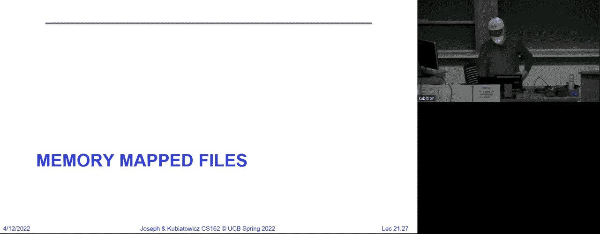
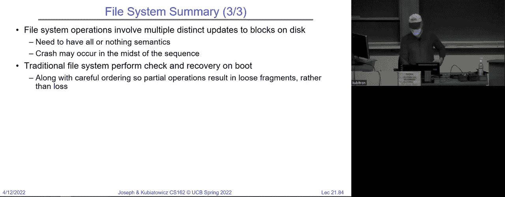

# 📁 课程 P21：文件系统案例研究（续）、缓冲与可靠性

在本节课中，我们将继续深入探讨文件系统的设计。我们将回顾几种经典文件系统的结构，理解它们如何管理磁盘块、优化性能，并初步接触文件系统可靠性的核心挑战。我们还将学习内存映射文件和缓冲区缓存的工作原理。

---

## 回顾：文件系统的基本组成

上一节我们介绍了文件系统的主要组成部分。文件系统提供了一种将名称（文件名）映射到实际数据的方法。目录结构提供了名称到 i 节点（inode）的索引，而 i 节点则代表了文件本身，并指向存储文件内容的数据块。

存储介质被划分为一系列固定大小的数据块（例如 512 字节或 4KB）。因此，我们需要一种方法来标记哪些块属于哪个文件，以及它们的顺序。i 节点正是为了解决这个问题而设计的，而目录结构则提供了方便的名称查找功能。

---

## 🗂️ 案例研究：从 FAT 到快速文件系统

### FAT 文件系统

我们首先讨论了来自 MS-DOS 的古老文件系统 FAT。它的结构非常简单，这也是它至今仍被使用的原因。FAT 的核心是一个与每个磁盘块一一对应的大型数组，称为文件分配表（File Allocation Table）。这个数组的唯一作用就是按顺序将属于同一个文件的块链接在一起。

在这种简化的文件系统中，甚至没有独立的 i 节点概念。寻址文件的方式是：从根目录（通常位于块号 2）开始，找到文件的起始块号，然后顺着 FAT 中的链表找到其余块。

然而，这种方式存在明显问题：它总是需要进行线性搜索，因此在顺序访问和随机访问上效率都很低。虽然简单到可以放入固件，但从性能角度看并不理想。

### 4.1 BSD 文件系统

接下来，我们介绍了来自 4.1 BSD 的原始 Unix 文件系统。它引入了包含直接块指针和间接块指针的 i 节点结构。

**i 节点结构示例（概念性）:**
```
struct inode {
    // 元数据（权限、所有者、时间戳等）
    metadata_t meta;
    // 直接块指针（例如 10 个）
    block_ptr_t direct_blocks[10];
    // 一级间接块指针
    block_ptr_t indirect;
    // 二级间接块指针
    block_ptr_t double_indirect;
    // 三级间接块指针
    block_ptr_t triple_indirect;
};
```

这种结构优化了不同大小文件的存储：小文件可以通过直接指针快速访问，而大文件则通过多级间接指针高效表示。一个 i 节点可以完全不填写某些指针，因此最短的文件可能只占用一个数据块。

这种布局关注的是正确性——它定义了哪些块属于文件以及它们的顺序，但并未涉及性能优化。块可能被随机分配，导致访问效率低下。在早期的 BSD 系统中，随着文件的不断创建和删除，磁盘碎片化会越来越严重，性能逐渐下降。

### 4.2 BSD 快速文件系统（FFS）

为了解决性能问题，4.2 BSD 引入了快速文件系统（Fast File System， FFS）。它保留了相同的 i 节点结构，但彻底改进了磁盘块的分配策略。

FFS 的核心优化思想是 **局部性（Locality）**。以下是它采取的主要措施：

1.  **将磁盘划分为块组（Block Groups/Cylinder Groups）**：每个块组包含一组连续的磁道，并拥有自己的 i 节点、数据块和位图。这样，一个目录及其下的文件很可能被分配在同一个块组内，减少了磁头寻道距离。
2.  **使用位图管理空闲空间**：取代了低效的链表，可以快速找到连续的空闲块。
3.  **预留空间**：默认保留约 10% 的磁盘空间。这提高了在磁盘上找到连续空闲块序列的概率，有助于减少碎片。
4.  **优化块大小**：将块大小从 1KB 增加到 4KB，减少了管理开销，并更好地利用了磁盘传输带宽。
5.  **旋转优化（Skip Sector）**：考虑到磁盘旋转延迟，FFS 会有意地将连续文件的块分散放置，确保在读取完一个块并处理时，磁盘恰好旋转到下一个块的位置。不过，现代磁盘控制器通常内置了轨道缓冲区，已经透明地解决了这个问题。

通过这些启发式方法，FFS 在保持简单性的同时，大幅提升了文件访问的性能，特别是顺序访问的性能。它不需要像 FAT 那样进行定期的磁盘碎片整理。

---

## 🔗 目录、硬链接与符号链接

文件系统的命名层由目录实现。目录本质上是一种特殊的文件，其内容是一系列“文件名 -> i 节点编号”的映射对。

**硬链接（Hard Link）** 是目录中一个直接指向文件 i 节点编号的条目。一个 i 节点可以有多个硬链接（即多个名称）。只有当指向一个 i 节点的所有硬链接都被删除，且没有进程打开该文件时，该 i 节点及其数据块才会被真正释放。这通过引用计数机制管理。

**符号链接（Symbolic Link / Soft Link）** 则不同，它是一个包含目标文件路径名的特殊文件。当访问符号链接时，系统会去解析这个路径名。符号链接可以跨文件系统，甚至可以指向不存在的目标（形成“悬空引用”）。

---

## 🗺️ 路径名解析与缓存

当我们打开一个像 `/home/cs162/stuff.txt` 这样的文件时，系统会逐级解析路径：




1.  从固定的根目录 i 节点（通常编号为 2）开始。
2.  读取根目录的数据块，找到条目 `home` 及其 i 节点号。
3.  读取 `home` 目录的 i 节点和数据块，找到条目 `cs162` 及其 i 节点号。
4.  读取 `cs162` 目录的 i 节点和数据块，找到条目 `stuff.txt` 及其 i 节点号。
5.  最后，访问 `stuff.txt` 的 i 节点，进而访问文件数据。

这个过程涉及多次磁盘 I/O。为了加速，操作系统使用了多种缓存：
*   **目录项缓存（dentry cache）**：缓存最近解析过的路径名到 i 节点的映射。
*   **i 节点缓存**：缓存最近访问过的 i 节点信息。
*   **缓冲区缓存**：缓存最近访问过的磁盘数据块（包括目录内容块）。

一旦文件被打开，其 i 节点信息就会缓存在内核的文件描述符结构中，后续的读写操作无需重复进行路径解析和权限检查。

---

## 💾 内存映射文件（mmap）

传统的文件 I/O（`read`/`write`）涉及数据在用户缓冲区、内核缓冲区、磁盘之间的多次拷贝。内存映射文件提供了一种更高效的替代方式。

系统调用 `mmap` 可以将一个文件的一部分直接映射到进程的虚拟地址空间。之后，进程可以通过普通的**内存加载/存储指令**来访问文件数据，就像访问内存数组一样。

**mmap 使用示例（简化）:**
```c
#include <sys/mman.h>
int fd = open("file.txt", O_RDWR);
char *mapped_addr = mmap(NULL, file_size, PROT_READ | PROT_WRITE, MAP_SHARED, fd, 0);
// 现在可以直接通过 mapped_addr 指针读写文件内容
strcpy(mapped_addr + 10, "New Data"); // 修改文件内容
munmap(mapped_addr, file_size); // 解除映射
close(fd);
```

其工作原理与虚拟内存的需求分页紧密结合：当进程访问映射区域的某个地址时，如果对应的文件页尚未加载，会触发一个页面错误（page fault）。页面错误处理程序会从磁盘读取相应的文件块到物理内存，并更新页表。对映射区域的写入会先标记为“脏页”，最终由系统刷回磁盘。

`mmap` 的优势在于：
*   **减少数据拷贝**：避免了 `read`/`write` 系统调用中的内核缓冲区与用户缓冲区之间的拷贝。
*   **简化编程**：可以像操作内存一样操作大文件。
*   **支持进程间共享**：多个进程可以映射同一个文件，实现共享内存通信。

---

## 🚀 缓冲区缓存（Buffer Cache）

磁盘访问速度远慢于内存。为了弥补这个差距，内核在内存中维护了一个 **缓冲区缓存（Buffer Cache）**，用于缓存最近访问过的磁盘块。

**缓冲区缓存的作用：**
1.  **缓存磁盘块**：包括文件数据块、i 节点块、目录块、位图块等。
2.  **统一访问点**：所有文件的读写请求都先经过缓冲区缓存。如果数据在缓存中（缓存命中），则直接返回，无需磁盘 I/O。
3.  **延迟写入（Delayed Write）**：当进程执行 `write` 系统调用时，数据只是被复制到缓冲区缓存中的“脏”块，系统调用便立即返回。实际的磁盘写入会在之后异步进行。
4.  **预读（Read-ahead）**：当系统检测到顺序读取模式时，会提前将后续的磁盘块读入缓冲区缓存，以备后续访问，从而减少缓存未命中。

**缓冲区缓存的管理挑战：**
*   **替换策略**：当缓存满时，需要选择哪些块被换出。通常采用类似 LRU（最近最少使用）的算法。
*   **写回时机**：脏块需要被写回磁盘以保持持久化。系统会定期（例如每 30 秒）或根据特定规则（缓存满、文件关闭、调用 `sync`）触发写回。
*   **内存分配权衡**：内核需要在缓冲区缓存和虚拟内存的页缓存之间动态分配物理内存，以平衡文件 I/O 性能和应用程序运行需求。

延迟写入虽然提高了性能（允许合并写入、电梯排序），但也带来了风险：如果系统在脏块写回前崩溃，最近的数据修改将会丢失，甚至可能导致文件系统元数据不一致（例如目录条目丢失）。这引出了我们对文件系统**可靠性**和**一致性**的需求。

---

## 📝 本节总结

本节课我们一起深入学习了文件系统的设计与优化：
1.  我们回顾了从 **FAT** 到 **BSD 快速文件系统** 的演进，理解了如何通过**块组、位图、预留空间**等设计来优化文件访问的局部性和性能。
2.  我们厘清了**目录、硬链接与符号链接**的区别与实现。
3.  我们探讨了路径名解析过程，以及操作系统如何利用**目录项缓存、i节点缓存**来加速这一过程。
4.  我们学习了**内存映射文件（mmap）** 这一高效的文件 I/O 机制，它利用虚拟内存系统将文件直接映射到进程地址空间。
5.  我们分析了**缓冲区缓存**的核心作用，它作为磁盘的缓存，通过**延迟写入**和**预读**策略极大地提升了文件系统性能，但也引入了数据丢失和一致性的风险。



下一节课，我们将重点探讨如何解决这个风险，即文件系统的**可靠性**机制，特别是**日志（Journaling）** 技术，它能在系统崩溃后快速恢复文件系统的一致性。