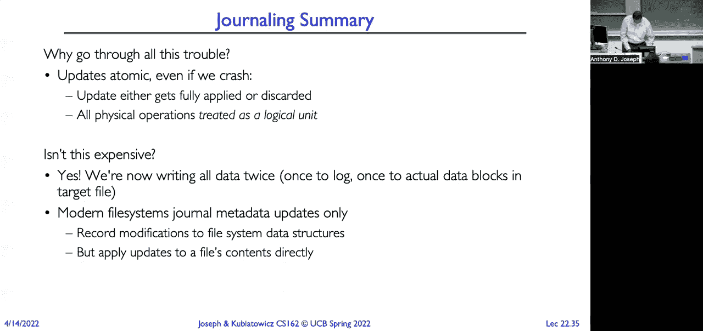

# P22：讲座 22：事务（续），端到端论证，分布式 D - RubatoTheEmber - BV1L541117gr

好的，开始吧。

这就是讲座22，我们将讨论可靠性。然后我们将深入探讨事务，讨论端到端论证，接着讨论分布式决策，如果有足够的时间的话。所以记住，我们有文件系统缓冲缓存以及文件系统缓冲的角色。

缓存存在于缓存磁盘块中，对吧？因为访问内存的时间是100纳秒，而访问磁盘的时间是数百万，甚至数千万纳秒。所以我们使用内存作为磁盘缓存，采用缓冲缓存的形式。所以我们缓存各种各样的东西，对吧？我们缓存数据块，我们缓存i-nodes。

我们缓存目录块。我们缓存重要的元数据结构，比如我们的空闲映射表。好吧？

现在我们要讨论一些重要的能力。第一个能力是可用性。它是指系统能够接受和处理请求的概率。我们通常用nines的概率来衡量这一点。所以一个99。

9%的可用概率被称为“三个9的可用性”。所以有时候你会看到有人提供服务水平协议（SLA），他们会说系统将提供三个9的可用性。这意味着99.9%的时间系统将可用并处理请求。现在。

我们怎么获得可用性？这里的关键思想是故障的独立性。一个组件的故障不会导致整个系统宕机。我们稍后会深入讨论这一点。现在，持久性是指系统能够在故障和失败的情况下恢复数据。所以这实际上是将容错应用到我们的数据上。

现在这里有一个可能会让人困惑的地方，那就是数据被“保存”是什么意思。它并不意味着数据是可访问的或可用的。几千年来，金字塔旁边雕刻着象形文字。但直到最近通过罗塞塔石碑的发现，我们才能实际。

能够读取这些象形文字是什么意思，因为罗塞塔石碑基本上为我们提供了一个翻译表。展示了用象形文字和用希腊语写的文本的示例。所以数据存在，它在数千年里是持久的，但它并不可用。所以这就是为什么你需要区分持久性和可用性这两个概念。

现在很多时候，你知道，像云服务提供商或者，一些服务提供商会说我们提供高可用性。所以系统是正常运行的，处理你的请求。但他们没有告诉你的是，系统是否真正正确地处理这些请求。其实，真正的问题是，你应该问的是系统的可靠性如何。

可靠性是指一个系统或组件在规定条件下，在指定时间段内执行所需功能的能力。现在，这听起来非常正式，因为这是IEEE的正式定义。所以，这比可用性要强得多。因为它意味着系统不仅仅是处于运行状态并接受处理请求，

而且它是在正确执行的。对吧。所以，可能会有某个服务存在bug，如果这个服务在接受请求并处理这些请求时腐蚀了数据，并且返回垃圾数据。技术上讲，系统是可用的，它在处理请求。但你不会认为这个系统是可靠的。所以举个例子。

当我们想到太空任务，比如阿波罗登月任务时，他们不仅仅考虑了任务中计算机的可用性，还考虑了这些计算机能否在两周的时间内，能够以高概率正常工作。好的。

这意味着我们必须从整体上考虑系统。我们需要确保数据能够在系统崩溃和介质故障的情况下存活。比如，崩溃和其他可能出现的任何问题。类似的可靠性要求同样适用于飞机。对吧。

我们希望确保飞机不仅仅是可用的，飞行计算机不仅仅是可用的，而是它们能正确处理数据。好的，接下来我们开始谈论一些关于LED的问题。我们将讨论耐用性。那么，如何让像文件系统这样的东西更耐用呢？让我确保打开我的聊天记录。

好的。明白了。我们在多个不同层次上做这个操作。首先，在最低层，磁盘块包含了读取所罗门错误校正码（ECC）。这些用于处理硬盘上的缺陷。我们可以试图制造一个硬盘，但即使它的铁氧体涂层完美无缺。

制造商努力让它尽可能完美和统一。但这很困难，也很昂贵。因此，在如何实现完美与容错之间，存在一种权衡。所以，错误校正码就是解决这些制造缺陷的一种方法。另外，正如Cooby上次提到的，你知道，我摇动了我的笔记本或其他设备。

它里面有一个硬盘。那些悬浮的磁头，距离表面仅仅是微米级，如果它们撞击到表面，就可能会损坏介质。这样就可能导致数据丢失。在这种情况下，错误校正码可能能够恢复数据。因此，我们需要为文件系统做的第二件事是确保写入能够持久保存。

在短期内。所以，一旦我们将写入操作提交到硬盘，理论上它们会长期存活。我们会使用像ECC这样的技术，来确保数据的持久性。但我们仍然需要将数据从应用程序写入到硬盘。因此，我们需要考虑当应用程序执行写入时，不仅仅是简单地处理。

缓存直接回写，我们将其视为写穿透。所以，当我们从应用程序返回时，数据是持久的，存储在硬盘上。那么我们为什么可能不想这样做呢？嗯，正如我一开始所说的那样，缓存的作用。

它处理的是访问主内存需要100纳秒，而访问磁盘需要1000万纳秒的差异。所以，如果我们想使用写穿透，我们可能也应该知道，我们已经放弃了使用缓存的好处。 所以，替代方案是使用某种类型的电池备份RAM，或者。

非易失性RAM并将我们的写入存储在那里。这就是很多服务器会做的事情。它们会有一个特殊的非易失性或电池备份RAM区域，写入操作会排队。这样，如果系统崩溃，它们可以立即返回。当系统恢复时，我们只需继续将数据块写入磁盘。好的。

所以现在我们需要确保数据在长期内能存活。仅仅将数据写入硬盘并不足够。为什么？因为硬盘的平均故障间隔时间大约是50,000小时。这是一个相当长的时间，但实际上，按连续运行的年数计算，这并不是很长。

所以最终硬盘会出现故障。我相信你们都遇到过硬盘故障的情况，对吧？那么我们该怎么做呢？我们可以做复制。我们可以有多份数据副本。这样如果硬盘故障并丢失了一份数据副本，我们还有另一份可以使用。但这里需要考虑的一个重要点，正如之前所说，是数据的独立性。

故障的独立性。好吧，我可以在我的计算机中安装两个硬盘。但如果我的计算机出现故障，怎么办？对吧，那样我就可能丧失这两块硬盘。我也可以将硬盘放在我的机房里的另一台计算机中。但如果发生火灾，我可能会丧失那两台服务器。

我不知道建筑物会不会被雷击中，或者会不会被龙卷风袭击。所以，也许我把数据放在不同的大陆上。对吧？这样，只有当类似小行星撞击地球时，我才会丧失两份数据副本。到那时，我可能有更大的事情要担心。好吧，关键点是。

这正是很多云服务提供商考虑的问题，就是如何确保故障的独立性？所以，当你使用由G Suite提供支持的伯克利邮件时，当你点击发送按钮时，Google会在你点击发送按钮之前，确保将你的邮件复制到三个不同数据中心的服务器上。

这些数据可能甚至不在同一个地点或国家。是的。所以即使其中一个或多个数据中心发生故障，你的电子邮件仍然会被发送。仍然会有一个副本，他们可以访问。好吧，让我们看看一些不同的方法。是的。问题是，什么是电池备份？

它的意思就是字面上的意思。所以它是一种特殊的内存模块，附带有一个电池。即使机器断电，比如服务器，内存中的内容也能得以保存。另一个例子是SSD或SSD中的闪存。我可以关闭电源，它仍然能保持电荷。

在这里，它是通过在实际的闪存单元内维持电荷来完成的。但在这些技术变得具备成本效益并广泛流行之前，人们所做的是仅仅把电池连接到某些内存上。现在，在我们部门发生了一个警示故事。我们曾经有一个大文件服务器，用于存储所有项目的研究资料。

我们的主页目录都存放在那里。它是一个具有电池备份内存区域的服务器。嗯，电池在使用若干年后会失效。在使用若干年后，电池果然失效了。现在这些服务器非常智能，它们有很多监控功能。所以它检测到电池已经失效，并且忠实地将这一信息记录在日志中。

没有人曾经查看过日志。服务器有不间断电源（UPS），但UPS故障了。实现故障独立性的问题。电力中断了。但电力只中断了几毫秒。实际上只是闪了一下，其他一切正常。除了它并不正常。因为在那短短的一段时间里，服务器失去了电源。

那些有电池备份的内存，用来存储所有重要数据的地方丢失了。现在想想文件系统。你认为那些数据会存储在我们缓冲区缓存中的电池备份内存里吗？

有什么想法吗？我回到我的图示。那是所有重要的东西，比如空闲位图，目录块，i节点，i节点表。所有告诉你在哪里找到文件系统内容的信息。在几毫秒内，那些数据丢失了。我们有备份。

但结果是人们在服务器上添加了更多的磁盘，却忘记将这些磁盘添加到备份组中。有一些组丢失了他们所有的研究，还有一些个人丢失了他们所有的研究。这是一个警示故事，实际上要实现完全的故障独立性非常困难。好了，我要谈论的第一种复制技术是在伯克利这里开发的。

现在是一个每年盈利10亿美元的行业，叫做RAID。RAID代表冗余阵列独立磁盘。争论的点在于，我可以尝试制造一个超级超可靠的磁盘，但那样它也会超级昂贵。我可以使用最顶级的钛金属。

金镀和铍合金组件能提供一些惊人的平均故障间隔时间。但它的价格会超出所有人的预算。所以我打算做的是，我将使用普通的磁盘，它们的平均故障间隔时间为 50,000 小时。然后我将它们组合成一个阵列。

通过将它们组合成一个阵列，我现在将它们分成这些恢复组，并复制数据。所以与其去买一个 10TB 的磁盘，我决定去买两个 10TB 的磁盘。每个磁盘现在都完全复制到了它的影像磁盘上。

假设绿色的磁盘是主磁盘，粉紫色的闪存磁盘是影像磁盘。所以这对于高 IO 环境和高可用性环境来说非常适用，因为要丢失数据，我必须同时丧失两个磁盘。现在我们考虑的是双磁盘故障的概率，而不仅仅是单个磁盘故障的概率。但这非常昂贵，对吧？

现在我不再有 10TB 的存储空间，而是必须去购买两个这样的磁盘。但它们很便宜。而且比制造一个超高可靠性的 10TB 磁盘要便宜。所以权衡在于我为写入操作所得到的带宽。对吗？因为当我执行一个逻辑写入时，实际上我必须执行两个物理写入。我必须同时写入两个磁盘。

当这些技术刚推出时，有一些电缆连接在两个磁盘之间，就像伺服电缆一样，它们能够完美地同步磁盘的旋转，使得两个磁盘上的相同扇区都在相同的磁头下。因此，当你进行写入操作时，可以通过控制器同时进行写入。

现在，现代版本的技术不会这样做。因此，存在一定的成本，因为它们之间的同步会略微滞后。因此，执行这些写操作时会产生更高的成本。另一方面，读取操作是优化的。如果我有一个高读取负载，那么 RAID 1 是非常好的选择。因为我可以从任意一个磁盘读取，甚至可以同时从两个磁盘并行读取。

所以我可以把一半的读写任务发送到一个磁盘，另一半发送到另一个磁盘。通过这样做，我实际上把两个磁盘的读写能力翻倍了。那么如果其中一个磁盘发生故障会怎么样呢？我只需要简单地拔掉那个磁盘，然后用一个新的 10TB 磁盘替换它。接下来，我将所有 10TB 的数据从仍在工作的磁盘复制到那个新的磁盘上。

全新。现在如果在深夜发生故障会怎么样呢？

那么现在在故障发生和我完成所有数据复制之间，会有一个脆弱的窗口期。如果另一个磁盘发生故障会怎么样呢？

那么我就会丢失所有的数据。所以为了缩小这个窗口，我可以有一个热备盘。所以现在，我不需要去购买一个10TB的磁盘来存储10TB的数据。我将购买三个10TB的磁盘。一个是主盘，一个是影像盘，一个是热备盘。这样存储数据就变得非常昂贵。

但它仍然比我尝试过度设计一个驱动器以获得非常高的平均故障间隔要便宜。好，接下来我们来看看RAID的另一个方面。我们可以用很多不同的方式做RAID，但其中一种较常见的RAID方式叫做RAID 5。我说的是RAID 5 Plus，因为这是用于更高版本RAID的技术。

所以这里的想法是，我会慢慢讲解，我们将数据进行处理，而不是说所有数据都放在一个驱动器上，然后所有的备份冗余数据放在另一个驱动器上，我将有一个驱动器阵列。所以这里我有五个磁盘。我将把数据条带化分布到这五个磁盘上。

现在我可以有超过五个磁盘，我可以有10个磁盘，甚至12个磁盘，任何数量。但关键是，我将数据条带化分布到这些驱动器上，使得块0放在第一个磁盘上，块1放在第二个磁盘上，块2放在第三个磁盘上，块3放在第四个磁盘上。然后这个组的下一个块就是一个奇偶校验块。

我通过对数据块进行异或运算来计算奇偶校验块。然后我重复这个过程。所以现在，我有了下一个数据，下一个数据，下一个数据，这里我们实际上应该对奇偶校验进行条带化。所以像RAID 5这样的版本，你只会有一个驱动器作为奇偶校验盘。但更高版本的RAID会将奇偶校验条带化分布。所以不是一个磁盘是你的奇偶校验盘。

而且存在一个瓶颈。所以现在我可以并行读取块一、块二、块三，依此类推。现在，当一个驱动器发生故障时，会发生什么呢？假设，我不知道，我们说磁盘发生故障。好吧，如果磁盘发生故障，我们可以通过对其他驱动器上的数据块进行异或操作来重建磁盘三的内容。

所以块D2实际上只是将D0、D1、D3和P0进行异或运算得到的结果。块D6只是将D4、D5、P1和D7进行异或运算的结果。就像我可以非常快速地，或者我可以恢复所有在这个特定驱动器上的数据。好吧，现在在这种情况下，通常你会在像网络设备这样的东西中找到它，这些设备通常会放在你的服务器箱中。但你可以想象，我也可以把这些磁盘分布到全球各地。

当然，这样做会有一定的权衡，对吧？因为光速是有限的，因此会给读取时间增加延迟。但是如果数据不是存储在一个数据中心，而是分散存储，可能会更独立于故障，这样即使数据中心被龙卷风、雷击或地震等灾害袭击，也能保证数据的安全。好吧，那么通常情况下，RAID是某种形式的纠删码，对吧？假设我们有一种方法能够判断硬盘是否损坏，我们确实有，因为我们可以查看。

使用的错误纠正码，用来检测是否能够从错误中恢复。我们能否在一个块中恢复数据？所以我们能判断硬盘是否已经发生故障，故障就被视为一个擦除事件。所以擦除码用于纠正擦除故障。因此擦除纠正码。结果是，今天我们的硬盘容量真的非常大。好吧，我说的是10TB。

我想你现在可以去买12TB或16TB的硬盘。当你遇到其中一个硬盘发生故障时，恢复10TB的数据需要非常长的时间，尤其是当你需要读取其他硬盘并重建这些数据时。现在我们必须考虑，我遭遇另一个故障的概率有多大。

硬盘故障发生在我正在重建磁盘的过程中。那么假设，我不知道，磁盘4发生故障。当磁盘4在我进行恢复的过程中发生故障时，会怎样？哎呀，我的10TB数据就没了。我没办法恢复它，因为异或运算只适用于一个硬盘发生故障的情况。所以当硬盘容量较小时，这种方法非常有效，而当硬盘容量增大时，就不再适用了。

例如，如果硬盘的容量为数GB、TB级别，像一个TB，我可以在几个小时内恢复一个故障。但如果硬盘故障的情况发生了，可能需要许多小时，甚至一天以上才能恢复。在此期间，像RAID 5这样的系统，硬盘发生故障时，我可能面临另一个硬盘的故障。我没有时间详细解释，但如果你查看硬盘的故障曲线，你会看到。

硬盘通常会立即故障，或者会在其平均故障间隔时间附近发生故障。如果你从一个厂家或者分销商那里购买硬盘，当你查看它们的序列号时，通常会发现它们是按顺序排列的，它们都来自同一个生产批次，这意味着它们有着相似的故障特性。

如果出现任何问题，或者类似的情况，故障之间的平均时间是一样的。但事实证明，如果一个硬盘发生故障，那么很可能会接着发生第二个硬盘故障。所以当我们在我的团队中构建存储阵列网络时，我们实际上会选择多个分销商，这样我们就能从不同批次获取硬盘。

我们减少了在故障中看到的这种兄弟故障现象，但它仍然不是完美的。所以这就是我们使用像RAID 6这样的更复杂的编码方案的原因，它允许一个阵列中的两个硬盘发生故障。然后你将其与热备盘结合使用，这样如果发生故障，系统就能立即。

开始重建数组，并缩小在多个硬盘故障情况下的风险窗口。是的，问题是什么？是的，问题是RAID 0怎么样？RAID 0其实就是灾难的配方，礼貌的说法。RAID 0只是将我的两个硬盘用作一个巨大的磁盘块，而不是将一个作为备份来使用，它被称为JBOD。

只是一些磁盘，一个巨大的磁盘块，一个巨大的磁盘。所以如果任何一个硬盘失败，我就会丢失数据。所以RAID 0的唯一用途是人们为了错误的理由，想要创建一个更大的磁盘池，可以存储一个非常大的文件之类的。但是它的价值非常低，因为如果任何一个硬盘失败，我就会丢失这个非常大的文件。

所以除非你真的想玩火，否则没人会使用RAID 0。RAID 1可能是最常见的之一。很多低端的两盘位存储设备，像你为桌面购买的NAS设备，基本上都是RAID 1。你只需将一个硬盘的数据镜像到另一个硬盘。如果你有多个硬盘，比如五个硬盘，那么你可以使用四个硬盘，甚至可以做更复杂的配置。

这样你就可以使用更复杂的擦除编码，以容忍多个磁盘故障。你可以在读取时看到这一点。所以一般来说，擦除编码类似于前向纠错编码。我们以前在位级别应用过这些编码。

我们也可以在块级别应用这些方法，并有一种基本的编码方式，可以将数据编码成若干片段。因此，我们可以对数据进行编码，将数据分块，然后将其编码成一组片段。然后我们只需要这些块中的m个，就能重建数据。所以我们在复制数据，但这也增加了我们的耐久性，因为现在我们拥有了更多的副本。

通过删除更多的块，我们可以在丢失数据之前保留更多的副本。所以在这个示例中，如果我们将数据分成m等于四个块，并生成16个片段，那么任何四个片段都可以用来重建原始数据。这使得数据具有极高的耐久性。但代价是会有一些额外的开销。

现在我们可以进一步推动这一方法，通过将数据复制到不同的地理区域，使得摧毁所有副本或大多数副本变得非常困难。这在读取操作时表现出色，因为在简单情况下，我只需要读取一个副本，如果我在文件级别复制它。

或者我只需要这些片段的一部分，就能重建原始数据。但这种方式在写操作中效果不佳。因为当我进行写操作时，我需要能够更新所有的副本。如果我要修改文件中的某个值，我必须更新所有副本中的所有片段。

如果其中任何一个副本宕机了，那么我就面临两个选择。一个是系统停止。这会影响可用性。第二个选择是我使用某种放松一致性的模型。例如，我可以在数据片段上加上版本号，然后将它们写入磁盘。然后，当我读取时，确保读取的是该文件的最新版本。

有各种各样的协议可以用来确保我读取的是文件的最新版本。然后，最终，如果副本恢复上线，我可以通过用它们错过的写入来使它们保持一致。但这增加了更多复杂性。不过，这正是很多云服务提供商实际使用的方法。

同样，他们会将你的数据复制成这些片段。然后，他们支持这样的概念：一个或多个副本可能会不可用。好了，现在，为了在这个背景下获得真正的可靠性，我们必须考虑所有的组件。我们必须考虑可用性。副本是否可用并能够处理请求？

我们还必须考虑安全性。如果有蠕虫或病毒侵入，我们不希望它通过加密所有数据和加密所有数据片段来破坏我们的数据。那样我们的数据就不可用、不可持久、不可访问了。然后，当然，我们还得考虑所有可能的故障。

所以，实际上，大量的努力已经投入到云基础设施的设计中。当发生停机事件时，这真的很有趣。你可以访问像谷歌的状态页面，或者去亚马逊或微软的页面。很多时候，他们会在发生故障后发布事后报告。深入阅读这些报告，看看出了什么问题，真的很有意思。

导致谷歌某一天停机三小时的关键原因是什么？

而且，通常是一些无关紧要的事情，比如有人做了配置更改并且犯了个错误。它破坏了系统，且没有办法回滚。或者一个没有人意识到是全球操作核心的认证服务器宕机了，并导致整个系统崩溃。这些只是造成全球性停机的一些例子。

好的，那么我们如何使文件系统更可靠呢？如果我们考虑文件系统的可靠性，那么就会发现，它和我们在块级别所做的事情有所不同。我们刚才讨论了如何使我们的数据块保持持久性。现在我们要使我们的文件系统保持持久性和可靠性。所以我们希望正确性成为其组成部分。

那么，如果磁盘失去电源，或者操作系统蓝屏或崩溃时会发生什么？嗯，可能有一些正在进行的操作实际上会完成。所以，如果我将数据发送到磁盘进行写入，而磁盘控制器仍然有电源，但操作系统崩溃了，嗯，也许这些写入操作仍然会被写入磁盘，因为。

它们保存在物理驱动器上的某个磁盘缓冲区，而不仅仅是在操作系统的缓冲区中。但有些正在进行的操作可能会丢失。如果我中断了电源，那些正在写入的操作就不会继续进行。因此，我可能会有一个正在写入的磁盘块，它只写了一部分，没有完全写入。

完全写入。问题在于，像 RAID 这样的东西并不一定能保护我们免受这些故障的影响，对吧？没有任何保护能够防止应用程序或操作系统写入错误状态。RAID 会尽职尽责地保护你写入的状态，但如果是错误的状态，那就是垃圾，对吧？

RAID 控制器本身也可能出现错误和问题，比如 RAID 组中的一个磁盘可能没有正确写入，因为存在 bug。所以文件系统需要具备持久性。最基本的要求就是这样，对吧？

如果文件系统没有持久性，磁盘上的块是否持久也没有意义，因为我们无法知道这些块代表什么。而这正是我们在存储发生断电时所遇到的情况。数据都存在于磁盘上，存储了数TB的数据，但我们完全不知道哪个块属于哪个文件。所以，实际上，数据就没有用了。

它丢失了，没了，无法恢复了。好吧。所以我们希望拥有持久性，知道即使在发生操作系统崩溃、电源故障等问题后，也许我们还需要做一些恢复操作。我们可能需要做一些磁盘检查、文件系统检查等操作。

以便重建文件系统的状态。但仅仅有持久性并不总是足够的。好吧。所以如果我们这样想：对吧，我们进行一个单一的逻辑文件操作，比如写入。我们触碰了许多不同的物理磁盘块。好的，我们触碰了 i 节点，因为可能需要分配它。我们触碰了间接块。

我们触碰了直接块。我们触碰了数据块。我们必须触碰位图，告诉我们哪些块在使用，哪些块未使用，等等。然后，我们有底层驱动可能进行的扇区级重新映射。如果一个块包含多个扇区，当我实际写入时，可能会在这里写入，在那里写入，再在其他地方写入，从而写同一个块。对吧？

因为它已经因为驱动上的数据缺陷而被重新映射了。所以在物理层面，操作是一个接一个完成的。我做一个扇区写入，接着做另一个扇区写入，依此类推。我们希望并发操作，以提高性能，对吧？

并发总是让我们通过重叠 IO 计算等操作来获得性能。那么，即使发生崩溃，我们如何确保文件系统的一致性呢？

关键在于，我们需要思考是什么因素可能影响到我们的可靠性。有什么是威胁我们文件系统可靠性的因素呢？

所以我们将面临的一些威胁是中断操作。在文件系统更新过程中发生崩溃或断电。这样可能会导致我们存储的数据处于不一致的状态。有些数据已经写入，有些数据没有，可能有些i节点被更新了。

但是目录没有更新，或者空闲块没有更新，等等。一个例子，你知道的，在逻辑层面上是，我想把$100从一个银行账户转到另一个银行账户。电力中断发生在中间。如果我已经取出了$100，但没有把它存入另一个账户，会发生什么？

$100就这样消失了。银行的账本现在与分支账户对不上，与账户对不上，等等。还有存储数据丢失的情况。如果我们有一个磁盘故障，我们看到过如何通过RAID等方法来解决其中的一些问题。所以我们在文件系统中看到两种方法来确保可靠性。

第一种方法是小心排序和恢复过程。第二种方法是进行某种版本控制和写时复制。因此，在第一种情况下，这就是FAT文件系统所使用的方式，也被UNIX快速文件系统（FastFile）使用。在FAT文件系统中，我们有检查磁盘工具，在FAT文件系统中，我们有文件。

系统检查器，FSCK。发生的情况是，在每一步中，我们构建文件系统的结构。比如说，先写入数据块，再写入i节点，再写入空闲列表，然后写入目录条目。最后一步就是当我们将其添加到目录时，将它链接到文件系统中。如果发生故障，我们只需重新扫描，寻找这些未完成的操作。

比如说，也许我们只写了数据块和i节点，但没有更新空闲列表，或者没有将它添加到目录中。在版本控制的情况下，它被ZFS、OpenZFS和一些其他文件系统使用。我们在某个粒度上对文件进行了版本控制。所以我们将创建一个新的结构，链接回文件中未更改的部分。

一个文件，就像如果我们只是在文件中追加内容，然后是文件的新部分，比如我们刚刚写入文件的追加内容。最后一步将声明该文件已准备好使用。让我们看看第一种方法，在这种方法中我们使用了一个小心的排序。

所以在这里，我们非常重视操作的顺序，并且总是按照特定的顺序执行这些操作。我们假设会发生故障，并且可能会中断这个过程。然后，在崩溃之后，作为操作系统启动的一部分，我们将执行一个恢复过程。因此，这就是为什么，比如说，如果你使用的是Mac之类的设备，你会。

有时你会注意到，比如说，如果你的操作系统崩溃了，当它重新启动时，可能需要很长时间才能恢复。启动过程实际上并不会花那么长时间？

启动只需要几秒钟。它在做什么？它正在运行这个恢复过程，检查磁盘，看哪些操作进程没有完成，导致文件系统处于不一致的状态。而这个过程所需的时间将与你使用磁盘的比例成正比。如果你像我一样，电脑里有一个大硬盘或者大SSD。

非常满的时候，这些操作可能会需要很长时间。好的。所以再次强调，这是FAT文件系统和伯克利FFS采用的方法，用来保护文件系统和元数据。现在注意，我说的是文件系统和元数据。我没有说数据。所以，这种方法并不能保护由应用程序存储的数据。

所以，恢复机制的设计就由应用程序开发者来完成。稍后我们将深入了解这些机制。比如像Word和EMACs这样的程序，它们会将数据自动保存到一个不同的文件中。这样，如果发生中断，你总是可以恢复，系统会提示“哦，你知道吗，有一个自动保存的版本，你想用那个吗，而不是你试图打开的那个版本？”

好的，那么让我们来看一下它是如何在伯克利FFS文件系统中工作的。在正常情况下，我们分配一个磁盘块，写入数据块，分配一个i节点，写入i节点块，然后更新空闲块和空闲i节点的位图。最后一步，我们更新目录，映射文件名与i节点编号。

然后我们更新目录的修改时间，因为我们刚刚向其中添加了一个新文件。好的，现在恢复时，我们该怎么做？我们扫描i节点表。如果找到任何被取消链接的文件，即那些已经分配了i节点，但没有目录项的文件，我们可以选择删除它。

但也许那对某个人来说非常重要。那是某个人的论文。那是某个人的CS162项目。所以，FFS文件系统和许多其他操作系统所做的，并不是删除那个文件，而是将它放入一个“丢失与找到”目录中。如果你去看看你的Mac。

你会看到有一个“丢失与找到”目录。那里存放着像是被取消链接的文件。在FFS文件系统中，这些文件可能会有扩展名，或者我记得像是CHK或类似的文件，例如000.chk文件。然后你可以手动查看文件内容，意识到“哦，这是非常重要的东西”，然后手动将它链接回文件系统结构中。

如果它真的非常重要，你就可以将它手动链接回文件系统结构。或者，如果它是垃圾文件或临时文件，你可以直接删除它。然后，我们将空闲块位图与i节点树进行比较，看看是否有些块已经被写入，但实际上并没有分配给i节点。

然后，我们扫描目录以查找任何丢失的更新，并更新它们的时间和访问状态。再次说明，执行所有这些操作的时间将与文件系统的大小成正比。文件系统的大小与磁盘大小成正比，假设文件系统填满了整个磁盘。所以，如果你有一个非常大的硬盘，这可能是一个非常昂贵的操作。所以，嗯，是的。嗯。

所以问题是，“如果我们在分配 i 节点后，但在写入数据之前崩溃，会发生什么？”在这种情况下，哦，在我们写入数据之后但在分配 i 节点之前崩溃，嗯，嗯。如果我们在写入数据后，但在分配 i 节点之前崩溃，那么数据就会丢失。因为我们没有在位图中标记数据块正在使用。

我们还没有将其附加到任何 i 节点上。所以在这种情况下，它只是简单地丢失了。这就是为什么，在应用层，可能会像 Word 那样做两份副本。它会有自动保存副本和原始副本。当我进行保存时，我会先保存到临时文件中。然后在我完成临时文件后，对吧。

然后我会去把原始文件重命名为某个名字。然后我会注意到那是一个文件系统操作，所以它是原子操作。接着，我会把刚才写入的临时文件重命名为原始文件。这样，如果在这个过程中发生崩溃，系统中要么有自动保存文件，要么就是旧的文件。

所以我有可以恢复的文件。但有时候，在自动保存过程中可能会出现损坏，导致你最终什么也没有。你最后可能只剩下原始文件。如果你没有频繁保存，它可能是非常久远的版本。这里有很多问题。我从这里开始。是的，问题是为什么我们最后更新位图？

所以我们希望在声明我们已分配之前，先完整填充数据结构。如果我们首先分配位图，那么我们可能会有一个不完整的数据结构。这样我们就得把它丢弃。是的，问题是，如果我们在分配文件时同时写入同一个块，会发生什么？所以，重复一次，我们并没有保护数据块。我们只是尽力保护文件系统的完整性，确保文件系统

最终，它包含了指向磁盘上数据和文件的完整指针。而文件系统中没有任何不完整或不一致的地方，它也再次保护我们不受写入数据块没有成功写出缓存区的影响。它并不保护我们免受数据块写入不完全的情况，因为我正处于中间状态。

写入数据块。我们将看看其他可以提供这种保护的方法。但这些方法是有成本的，总是存在取舍问题。好的，还有其他问题吗？好的。那我们来看看第二种方法——写时复制。如果你想一想，对吧。我们现在有的多级索引结构，让我们来理清一下。

找出文件的所有数据块。我们有直接指针。我们有间接指针块。我们有双重间接块，三重间接块。与其覆盖现有的数据块，为什么不直接更新索引结构呢？所以我们将重用所有未更改的索引块。

我们将重用所有未更改的数据块，只更新结构中已更改的部分。这就是“写时复制”之所以如此命名的原因。所以这看起来有点昂贵，好像我们做了很多重复的工作，但实际上并没有。因为我们做的一件事是批量更新。

与其尝试做每一个单独的更新，我们将采用“写时复制”的方法，批量处理多个更新，然后进行更改。好吧。这种方法在许多网络文件服务器设备中得到了应用，NetApp的Waffle文件系统、ZFS和Open ZFS都使用了这种方法。

所以这就是“写时复制”的样子。在这种情况下，我通过在树中使用较小的写块来简化了事情。但是我们的文件只是表示为一个块的树。因此，这是我们旧版本的指针，它指向这个索引块，后者指向另一个索引块，再到另一个索引块。

这个指向一个索引块，它指向一个扩展。这里是另一个扩展，另一个扩展，等等。假设我们正在向文件追加内容。实际上我们只需要更新文件的前沿部分。所以我们可以这么做，对吧？我们就会写入它。

现在我们要复制文件的其余部分。我们不会真正复制它。我们只会复制指针以及现有数据结构中尽可能多的部分。所以如果你想一想，什么需要更改？显然，这部分需要更改。这个索引块必须指向这里并指向这里。

所以我们必须复制它。然后我们需要一个新的索引块来处理这个。我们需要一个新的版本在顶部。所以我们会这么做。现在我们只需添加指针，指向现有的数据结构。好吧？

现在我们添加写操作。因此，实际的开销相对较小。你可能已经注意到的另一个好处是，这现在允许我们以相对节省空间的方式同时拥有旧版本和新版本。因此，许多网络设备将此作为它们所谓的快照功能提供。

会保存一些旧版本。最后一天会保留每小时一个旧版本。之后每一天一个，回溯到一周前，再之后可能是每月一个，依此类推。而且它能够以非常高效的方式进行存储。相对开销是相当小的，假设我并不是每次都完全重写文件。好的。

所以，实施这一点的文件系统包括ZFS和它的开源版本，叫做Open ZFS，采用可变大小的块。所以你可以有不同大小的扩展块。它是一个对称树。所以我们知道树的大小，无论是大还是小，我们都必须进行复制。我们存储版本号和指针。因此，我们可以通过添加块和指针来创建新版本，正如我之前展示的。

在最后一张幻灯片上。我们将许多写操作合并在一起，然后再写入到磁盘。所以再次强调，我们是在尽力保护文件系统的完整性，并不一定是在保护你的数据完整性或数据。所以你的数据可能会在缓冲区停留更长的时间，才会被写入磁盘。

然后，空闲空间是一组扩展。这样我们就可以在需要为文件分配大量数据块时，直接抓取一个扩展块。好的。所以我想花一点时间再次谈谈我们的合作政策。我知道现在是学期中非常忙碌的时刻，大家都在忙着做最后一个项目，还要做作业、考试和其他一切事情。

所以在这门课中，一些好的做法包括：向小组中的其他人解释一个概念，进行高层次的讨论。与其他小组一起做算法或测试策略的讨论。例如，你可能如何进行玻璃盒测试或黑盒测试，如何设计你将使用的测试用例空间。讨论你如何进行调试，或者与他人分享不同的调试方法。

group。如果你在网上寻找通用算法，比如什么是好的哈希算法，或者什么是快速内存分配算法，类似这样的东西。这些都是通用算法。所以这些都是很好的做法。而不好的做法是与其他小组共享代码或测试用例。

所以，即使只是代码的一部分，或者是测试用例的一部分，复制或阅读其他小组的代码或测试用例。不幸的是，我们曾经遇到过必须进行艰难对话的情况，因为有人只是看了别人代码的一部分，然后几个小时后就去实现了别人的代码。

结果发现，我们每个人写代码的方式、设计代码的方式就像是**指纹**。它是不同的，是独一无二的。所以仅仅通过查看别人是如何考虑结构化代码的，可能就足以影响你如何结构化你的代码。然后这会触发我们的作弊检测算法。接着，我们就会进行那些艰难的对话。复制或阅读网上的代码或来自前几年测试用例。

所以磁盘空间便宜。我们保存了很多年的提交记录。并且我们会与所有这些提交进行比对。助教们也非常擅长使用谷歌。他们能找到所有的162个代码和公开的代码库，类似这样的东西在互联网上。而且再次强调，如果你查看，哪怕只是查看其中之一。

即使你不试图直接复制，它也会影响你编写代码的结构，影响你编写代码的方式。而且，这将再次导致一次艰难的对话。所以，帮助另一个小组调试代码是不被接受的。再次强调。

我们之前看到过这种情况：有人的代码遇到瓶颈，无法突破，然后有个朋友过来，帮助他们调试代码，并说：“哦，你知道，我就是这样做的。” 然后他们就改变了代码。接着我们就能检测到，因为事实证明，这是一种独特的解决该问题的方式。所以，这些都是你不应该做的事情。再次强调。

我们会比较上一年与当前年的所有在线解决方案和每个人的提交。那么如果你碰到难关该怎么办？知道截止日期到了，代码截止了，但它不起作用。好吧，这时候你就需要联系核心工作人员。我们在这里帮助你度过这门课，而且我们有很多办公时间。

我们有很多助教支持，也有大量的读者支持。这一切都旨在帮助你解决遇到的任何问题。所以，如果你发现自己处于一种需要依赖 Google 作为朋友的情况，请不要这么做。相反，请向你的助教、向你的讲师、向你的读者寻求帮助。

此外，请不要把你的朋友置于那种你向他们求助，甚至向他们索要代码的情况。我们曾遇到过这样的情况：一个室友将电脑没有锁定，另一位同学看到了他们的电脑，看到他们的代码，看到他们的做法，并受到了影响，改变了自己的设计。现在，我们不得不进行一场困难的对话，两个曾经是朋友的人，现在却不再是朋友了。

所以，考虑到这一切，如果你遇到这种情况，认为自己需要做这些事情，请来找我们。这就是我们在这里的原因。还有问题吗？是的。你可以阅读吗？好的，读哪个源代码？是的，阅读像 BSD 这样的公共操作系统的源代码完全没有问题。

无论是 Linux 还是其他操作系统，这不会直接影响你在 162 课程中的解决方案。但你会看到操作系统是如何实现某些功能的。通用案例是完全可以的。但如果你去找别人放在 GitHub 上的 162 代码仓库，那就越界了。你可以随时提问。还有其他问题吗？好的。

现在让我们回到技术话题，谈谈一些更一般的可靠性解决方案。好的，我们将使用事务来实现原子更新。目标是确保多个相关的更新要么完全发生，要么根本不发生。所以这是一个“全有或全无”的问题。

所以如果在事务执行过程中发生崩溃，在恢复完成后，我们的状态要么是所有操作完成，要么什么都没有发生。我们不能让系统进入某种不一致的奇怪状态，比如100美元从银行账户中取出，但并没有存入目标账户。正如我之前所说，大多数现代文件系统。

它们的重点是保护文件系统本身，以及与文件系统相关的元数据。它们不会尝试处理存储在文件系统中的数据。以下是一些我举的例子，展示它们如何尝试保护文件系统中的部分数据。但很多时候，应用程序必须实现自己的事务类型，或者。

其他技术用来保护他们的数据。因此，我们当然也希望提供冗余，以防媒体故障。再一次，我们看到如何通过对单个磁盘应用纠错码，或者通过像 RAID 这样的技术复制存储介质，或使用擦除码将数据块复制到地理区域来实现这一目标。好了。

所以事务实际上与我们之前看过的内容有很大关系，那就是临界区。对吧？当我们需要操作一个共享的数据结构时，使用临界区。事务则把对共享数据结构进行原子更新的概念，从内存扩展到持久存储。对吧？如果你仔细想想。

就像临界区的概念一样，目的是确保所有在临界区外的线程，要么看到进入临界区前的数据，要么看到离开临界区后的数据。它们无法看到数据的中间状态。这正是事务要为我们做的事情，只不过是在稳定存储上实现。

它会通过持久存储来实现这个目标。现在有很多临时的方案，对吧？

所以我们在快速文件系统中看到的情况是，我们通过非常小心地排序更新操作，来更新文件系统的数据结构，确保我们要么让文件从未被创建或更新，要么让文件被创建或更新。但我们不会让文件系统进入一个不一致的状态。就像我之前说的。

应用程序仍然使用临时文件或其他技术来确保操作的原子性。因此，这里关键的概念是事务。事务是一个原子的读取和写入序列，它将系统从一个一致的状态转移到另一个一致的状态。就像临界区的情况一样。

事务对其他线程表现为原子操作。所以当事务处于活动状态时，线程无法看到事务过程中的中间状态。因此，事务扩展了我们对内存中原子更新的概念，把它从临界区的内存扩展到稳定存储，持久存储。所以典型的结构是，我们首先开始事务。这会给我们一个事务 ID。然后我们进行一系列的更新。

现在假设我们遇到了问题。我们的程序抛出了一个异常。没关系，我们会中止交易并回滚，好像什么都没发生过。如果我们和另一个交易发生了冲突会怎么样？

我们尝试读取和写入相同的文件，或者该交易试图读取和写入相同的数据结构。我们就会有冲突。没关系，我们会中止这两个交易中的一个，或者将其回滚。好了，所以核心思想是，当我们开始时，我们会快照当前的状态。

然后你可以在这个沙箱中做任何你想做的事情。如果有什么出错了，我们只需要让它消失。我们会回滚到那个快照。最后，当我们完成所有更改后，我们提交交易。假设我们有一个经典的，这就是一种经典的交易示例，比如说，从186年。

我想在银行环境中将钱从Alice转账到Bond。所以我首先开始减少Alice账户的余额。而这家银行，像许多数据库一样，拥有两套账本。它有个人账户账本，也有分行账本。所以我需要从Alice账户所在的银行分行减少100美元。

这是她去开设账户的地方。然后我会增加Bob的银行余额。我要增加Bob账户所在分行的余额。然后我就完成了。所以我有四个独立的操作进行读写，但我想将它们作为一个逻辑上的、不可分割的操作。实现这个目标时，事务会非常复杂。

我在开始时加了一个begin，然后在结束时加了一个commit。就是这样。其实并不复杂。所以这保证了即使我有其他交易在同时增加和减少账户和分行余额，这也是一个不可分割的单元。其他交易无法看到中间状态。

这个交易不会看到其他交易的中间状态。当提交发生时，系统会保证结果是持久化的。好，问题来了？是的。那么问题是我们不能看到中间状态。会不会出现双重支付的情况？系统保证，如果有几个不同的事情发生。

或者，系统会保证，如果同时有多个线程试图减少Alice账户的余额，那么我们要么让其中一个等待，要么中止那个交易，另一个交易可以继续进行。所以，两个交易不能同时操作数据。

所以如果你想考虑顺序，尽管所有的事务看起来像是同时进行的，但其实是有顺序的，一个事务在逻辑上会先发生，然后是另一个事务，依此类推，如果它们操作的是同一份数据。如果它们操作的是独立数据，独立账户的话，就可以同时运行。

如果是独立的银行账户余额，那么所有这些事务可以同时运行。因此，系统需要做的部分工作就是跟踪哪些数据被哪些事务访问，并且哪些操作属于哪个事务。所以这里讲的是一个非常简化的概念，实际上更为复杂。这里涉及到锁机制。

还有很多其他的监控系统在关注发生的事情。好的，另外一个我们需要的概念是日志的概念。所以在日志中有一个简单的原子操作，即写入或追加基本项。我们将利用这个操作来完成一系列动作的承诺。

这里是一系列的操作，我们可以称之为与某个特定事务相关联的操作。现在可能有其他操作正在进行，这些操作已写入日志，但并不属于这个事务。这些操作将会有一个事务ID，这个ID在我们进行开始时就已经确定。当我们开始事务时，我们会得到一个事务ID。

事务ID会被分配给我们写入日志的每个项。所以当我们开始事务时，我们会获得一个ID，并且它将与所有这些项关联。当我们完成事务时，我们将在日志中提交它。我们会写入一个提交记录，表明该事务已完成。

所以当我们查看日志时，如果我们仅看到一个开始并看到一堆操作，但没有看到提交记录，那么该事务就没有完成。那么我们如何将其转化为事务性文件系统呢？基本的思想是通过使用日志来提升可靠性。

所以我们将对文件系统进行的所有更改都视为事务处理。因此，之前在文件系统中，我们操作了i节点，操作了位图，操作了目录条目。我们在执行这些操作时，直接对它们进行了修改。

现在我们将所有这些操作放入日志中并通过事务来执行。因此，事务，一旦写入日志并看到提交记录，就完成提交。我们可以采用两种方法。因为日志会被缓存到缓冲区，我们可以强制将日志写入磁盘。因此我们将会阻塞，停止。

等到日志写入磁盘时我们才进行提交，或者我们可以将日志存储在某种非易失性内存中。好的，采用这种方式，它就能在系统崩溃或断电时存活下来。所以我们首先做所有的操作都写入日志。这是前置日志记录。

然后我们会在文件系统中做一些操作。所以即使文件系统稍后更新，我们会确保它最终会被更新，如果它应该被更新。现在我们可以用两种不同的方式来使用日志和文件系统。一个叫做日志结构化文件系统。

另一个叫做日志文件系统。此房间里的每个人都在使用日志文件系统，因为所有现代文件系统都使用日志记录。区别在于，在日志结构化文件系统中，我们把数据放入日志中。数据块也存放在日志中。在一个有日志的文件系统中。

我们只把日志用于恢复目的。所以数据实际上会像在普通文件系统中那样写入磁盘。日志记录通常被看作是文件系统的一个附加功能。而日志结构化文件系统则是从头重新实现的文件系统。好吧。所以在一个日志文件系统中，我们不会直接修改磁盘上的数据结构。而是。

我们将每次更新作为一个事务写入日志中。所以这通常被称为日志，或者叫做意图列表。它保存在磁盘上。所以我们为日志分配块。我们可以再次将其保存在内存中，并且在提交时强制将日志写入磁盘，或者我们可以选择将其放入非易失性内存中。现在一旦变更被记录在日志中。

一旦提交，我们就可以将其应用到文件系统中。所以我会通过一个例子来讲解，因为这些可能是很多话，听起来有点复杂。这个想法是，可能会有一个指令，像是以某种特定方式修改 I 指针。我们把这个记录在日志中，然后稍后我们会实际修改文件系统。

再次强调，这与之前直接修改 I 的方式不同。现在我们要做的是记录下来，嘿，去修改 I。这就是我们要做的。然后我们可以清理日志。一旦我们实际执行了这些操作，日志就不会无限增长。所以就像我说的，它是你可以添加的一个附加功能。所以原始的文件。

Linux 的原始文件系统之一，EXT2，是一种快速的文件系统。然后他们给它添加了日志功能，创建了 EXT3。这是一个相对简单的变更。好吧。其他日志文件系统的例子。这就是为什么我说每个人都在使用它。如果你在使用 NTFS，或者在 Mac 产品上使用 HFS+ 或 APFS，如果你在使用。

Linux XFS、JFS 或 EXT4，所有这些都是日志文件系统。但现在让我们揭开这些文件系统的面纱，看看它们究竟是如何工作的。好吧。首先，让我们看一个没有日志时会发生什么。比如我想创建一个文件。那么我该怎么做？我做的第一件事是找到一些空闲的数据块。

好的，找到了空闲的数据块。接着找到空闲的 I 节点条目。好的，找到了空闲的 I 节点条目。然后我找到了目录插入点。找到了。现在，我实际上将去执行所有操作。因此，我会写入映射并标记为已用，表示我正在使用这个数据块。

我要写入 I 节点条目，指向那些数据块。然后，我将更新目录条目，指向 I 节点，指向 I 号。好了，完成了。好，我已经在文件系统的磁盘上做了所有这些更改，并且按这个非常精确的顺序进行操作，这样如果发生故障，我可以尝试恢复。

然后，我将尝试解决问题，比如如何使用 FSCK 重建磁盘。那日志是如何工作的？有点不同。所以我们有日志。再次提醒，我们将把它存储在非易失性存储介质上。因此，我们必须强制将其写入磁盘，并等待磁盘完成。

现在我们要找到空闲的数据块。好的，我找到了一个空闲数据块。接下来，我们将找到空闲的 I 节点条目。然后我们将找到空闲的目录插入点。好吧。现在，这和我之前做的非常相似。接下来，我将把我的意图记录到日志中。

我不会直接修改文件系统本身，而是将指令写入日志，描述我想要做的操作。所以我想要写入映射并标记为已使用。我想写入 I 节点条目，指向我刚分配的数据块。我想写入目录条目，指向我刚分配的 I 节点。好的。

完成所有操作后，我现在完成了文件的创建。所以接下来我将提交我的事务。好，接下来有几点。我们将日志分为几个区域。已完成区域表示磁盘的状态已反映在日志中。我们已经完成了日志中描述的操作。

我们有日志的尾部区域，然后是一个叫做待处理（pending）的区域。待处理区域包含我们还未执行的所有操作。所以现在，我们有一堆刚创建的待处理操作。现在，事务完成后，我们将日志头指向末尾。

所有这些都在我们的待处理区域。这些是说明我们想要对文件系统做什么的指令，以创建文件。我们还没有修改文件系统，文件系统仍然反映磁盘上旧的状态。所以在提交后，最终我们会回放这个事务。

我们将实际执行日志中记录的意图和操作。因此，在此期间对文件系统的所有访问必须首先查看日志。这意味着，如果我想查找我刚创建的文件，我必须扫描。操作系统将扫描待处理的操作，查看那个文件是否存在。

该文件存在。然后它将查看磁盘上文件的状态。好了。刚创建的文件，只有它的目录条目存在于日志中。磁盘上的内容是过时的，它反映的是之前的状态，而不是文件系统的当前状态。所以我们在这里增加了一些复杂性。之前我们只需要查看磁盘。

查看磁盘，它告诉我们世界的状态。现在我们必须查看日志。阅读日志中的操作，以确定某个东西是否存在，或者它的状态是什么。最终，我们将复制日志中的更改。

日志到磁盘。所以我们开始，假设我们已经完成了所有待处理的任务，我们将复制。我们的更改。接下来，我们将标记该块为已分配。然后，我们将标记 i 节点为已分配，并指向我们刚刚标记为已分配的数据块。然后我们将添加实际的目录条目，指向我们已分配的 i 节点。好了。

现在在这一点上，我们的尾部是提交，当我们的尾部到达头部时，我们可以。现在丢弃日志中的所有内容。我们可以进行垃圾回收。好了。现在如果在崩溃之后，我正在恢复，我正在读取日志，好吧，随着系统启动，我碰巧看到了这个，我正在扫描日志。

我看到一个开始，然后我看到，哦，它是在分配一个块，对吧。但我没有看到任何目录条目。我没有看到任何提交。所以在这种情况下，我有一个开始，但没有提交。所以它被中断了，因此这个事务没有完成。

所以我所做的就是简单地丢弃日志条目。磁盘保持不变。好了。现在，如果我看到一个提交，那就意味着事务已经完成。所以当我扫描日志时，我找到了一个开始，并找到了一个匹配的提交。所以有两种选择。我现在可以重新做它，并使其生效。

或者我可以继续启动系统，最终日志处理代码会。简单地重播从头到最后一个提交的所有内容，我们就完成了。然后我们将丢弃这些更改。但这些更改会被应用到磁盘上的实际文件系统。所以我们为什么要这么麻烦？因为它为我们提供了原子性的更新。

即使我们崩溃。所以即使操作系统崩溃，即使我们遭遇断电，我们也能够确保我们的文件系统保持一致、连贯、正确的状态。更新要么完全应用，要么被丢弃。所以我们正在做的所有操作，比如创建文件、删除文件、更新文件，都是原子操作。

它们要么完成，要么永远不会发生。所以你可能会问，这是不是很昂贵？是的。对吧？

当涉及到我们的元数据时，我们会将所有内容写两次。我们首先将它写入日志，然后再实际写入磁盘，修改磁盘中的数据结构。这也是为什么在现代文件系统中，我们只对元数据进行日志记录的原因之一。

元数据更新。因为如果我们对实际的数据块进行日志记录，日志的大小将会急剧增长。如果我们不得不从日志中复制数据块到磁盘的其他部分，我们将进行大量的复制。所以这其实是一个权衡，对吧？

我们能够保护文件系统结构的完整性，但我们并没有保护文件的内容。所以这也是为什么应用程序会选择在应用层做自己的事情的原因。并且，确实有很多不同的方式来复制文件和临时文件等，我们可以使用这些方式。没有日志记录的问题？是的，当然。[INAUDIBLE]，是的。

所以问题是，当我在这里恢复时，对吧？我看到我有一个开始。我看到我有一个提交。所以我知道这个已经完成了。那么我要重新做这个。我将重新分配这个，重新链接到 I 节点，重新在目录中链接到 I 节点。那如果崩溃发生在我已经做完这些操作之后会怎么样？

一次？好吧，我最终会得到两份文件。那么答案是否定的，因为所有这些操作都是我们所说的幂等操作。就像，我可以多次重复这些操作，结果还是相同的。因为当我做这些操作时，我并不是在说“找一个空闲的块”。我是在说。

我正在为位图中非常特定的空闲块分配空间。同样，我是在说，我正在为这个特定的 I 节点分配空间，这是我要写入的内容。同样，我也在说，我正在为这个特定的目录项分配空间，这是我要写入的内容。所以我可以重新做这些操作，实际上我可以多次重复这些操作，结果仍然是相同的。

磁盘上的物理结果。这一点很重要。这些操作都必须是幂等的。如果其中任何一个不是幂等的，那么进行更改将导致像你说的那样，多个文件被创建。好了，这就是我们的日志记录总结。下次我们将讨论 LFS，然后进入网络部分。好的。好的。好的。好的。

好的。

