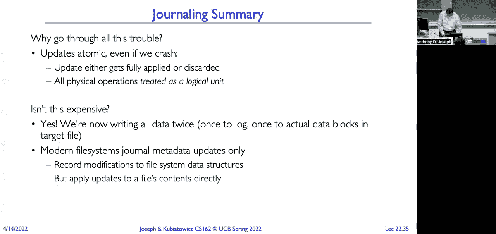

# 课程 P22：事务（续）、端到端论证与分布式决策 🧩

在本节课中，我们将深入探讨系统可靠性的核心概念。我们将从文件系统缓存的作用开始，逐步理解可用性、持久性与可靠性的区别。接着，我们会详细分析如何通过复制（如RAID技术）和事务处理（如日志文件系统）来构建可靠的存储系统。最后，我们会简要介绍端到端论证和分布式决策的基本思想。

## 可靠性基础：缓存、可用性与持久性 💾

上一节我们介绍了文件系统的基本结构，本节中我们来看看系统可靠性的几个关键维度。

文件系统使用**缓冲缓存**来提升性能。因为访问内存（约100纳秒）比访问磁盘（数百万纳秒）快得多，所以系统将磁盘块缓存在内存中。我们缓存数据块、i节点、目录块以及空闲映射表等元数据结构。

现在，我们来区分几个重要的可靠性概念：

*   **可用性**：指系统能够接受和处理请求的概率，通常用“几个9”来衡量（如99.9%被称为“三个9的可用性”）。其核心思想是**故障独立性**，即一个组件的故障不应导致整个系统宕机。
*   **持久性**：指系统在故障后恢复数据的能力，即将容错应用于数据。但数据“被保存”不等于“可访问”。例如，古老的象形文字数据存在了数千年（持久），但直到罗塞塔石碑被发现才变得可读（可用）。
*   **可靠性**：比可用性要求更高。它指系统在指定条件下，于规定时间内**正确执行**所需功能的能力。一个存在Bug、会损坏数据的服务可能是“可用”的，但绝不是“可靠”的。太空任务和飞行计算机对可靠性的要求极高。

## 实现持久性：从硬件到架构 🛡️

理解了可靠性的目标后，我们来看看如何在多个层次上实现数据的持久性。

我们通过多层防护来增强像文件系统这样的系统的耐用性：
1.  **物理层**：磁盘块包含**ECC（错误校正码）**，用于处理制造缺陷或物理撞击导致的数据错误。
2.  **写入策略**：为确保写入持久化，应用程序可采用**写穿透**策略，即数据必须写入硬盘后才返回。但这会牺牲缓存带来的性能优势。
3.  **非易失存储**：替代方案是使用**电池备份RAM**或**非易失性RAM**来暂存写入操作。这样即使系统崩溃，数据也不会丢失，待系统恢复后再写入磁盘。
4.  **长期存活**：硬盘本身会故障（平均故障间隔时间约5万小时）。为确保数据长期存活，需要进行**复制**，并保证副本间的**故障独立性**（例如，将副本存放在不同数据中心甚至不同大陆）。

一个警示故事：某服务器使用电池备份内存存储关键元数据（如空闲位图、i节点表）。电池失效后未被察觉，一次短暂断电导致该内存数据丢失。由于备份策略不完整，部分数据永久丢失。这说明实现完全的故障独立性非常困难。

## 数据复制技术：RAID 🎯

为了实现故障独立性，工业界发展出了成熟的复制技术，RAID便是其中之一。

RAID（冗余阵列独立磁盘）的核心思想是：使用多个普通（相对廉价）的磁盘，通过组织成阵列并复制数据，来获得比单个昂贵的高可靠性磁盘更高的性价比和可靠性。

以下是几种常见的RAID级别：

*   **RAID 1（镜像）**：
    *   **原理**：每个数据块都完整复制到另一个磁盘（镜像盘）。
    *   **优点**：读取性能高（可从任一磁盘读），写入需要两次操作。容错能力强，需两个磁盘同时故障才会丢失数据。
    *   **缺点**：存储成本高（有效容量仅为总容量的一半）。可采用**热备盘**来缩短故障恢复窗口，但成本更高。
*   **RAID 5（带分布式奇偶校验的条带化）**：
    *   **原理**：将数据条带化分布在多个磁盘上，并计算一个**奇偶校验块**（通过对数据块进行`XOR`运算得到），校验块也分布在不同磁盘上。
    *   **优点**：兼顾存储利用率、读取性能和容错（允许单个磁盘故障）。故障后可通过其他盘的数据和校验信息重建。
    *   **挑战**：现代磁盘容量巨大（如10TB），重建时间很长。在此期间若发生第二块磁盘故障，数据将无法恢复。此外，同批次磁盘可能存在关联故障。
*   **RAID 6**：允许阵列中两个磁盘同时故障，容错能力更强。
*   **RAID 0（条带化）**：仅将多个磁盘合并为一个大的逻辑盘，**无任何冗余**。任一磁盘故障即导致全部数据丢失，可靠性极低，不推荐用于需要数据保护的场景。

更通用的方法是**擦除编码**：将数据编码成`n`个片段，只需其中任意`m`个(`m < n`)即可重建原始数据。这能以更低的空间开销实现高耐久性，并易于跨地理区域分布。但写入时需要更新多个片段，复杂度较高。

## 文件系统可靠性：排序恢复与写时复制 🔄

数据块的持久性得到保障后，我们需要确保文件系统结构本身的可靠性。

文件系统面临的威胁包括：更新过程中发生崩溃导致状态不一致，以及存储介质故障。主要有两种方法来保证文件系统元数据的可靠性：

**1. 谨慎排序与恢复（如FFS，FAT）**
这种方法强调以特定顺序执行更新操作（例如：先写数据块 -> 分配i节点 -> 更新位图 -> 更新目录），并假设故障可能中断此过程。系统启动时，运行恢复工具（如`fsck`）扫描磁盘，根据规则修复不一致状态（如将已分配但无目录项的文件放入`lost+found`目录）。这种方法**主要保护元数据，不保护文件内容**，且恢复时间与磁盘容量成正比。

**2. 写时复制（如ZFS，WAFL）**
该方法不覆盖现有数据块，而是通过更新指针结构来创建新版本。例如，修改文件时，只复制并更改受影响的数据块及其上游的索引块，最终更新根指针。这带来了两个好处：
*   **原子性**：更新要么全部生效（新指针被提交），要么全部不生效（仍使用旧指针）。
*   **高效快照**：旧版本的数据结构可以轻松保留，实现低开销的快照功能。
这种方法同样**侧重于保护文件系统结构的完整性**。

## 事务：实现原子更新的通用机制 ⚙️

无论是文件系统还是应用程序，都需要一种通用机制来保证一系列操作的原子性，事务正是为此而生。

事务将内存中临界区的原子性概念扩展到了持久存储。它确保一系列读写操作作为一个不可分割的单元执行（全有或全无），即使发生崩溃，系统也能恢复到一致状态。

一个典型的事务示例是银行转账：
```plaintext
BEGIN TRANSACTION;
UPDATE accounts SET balance = balance - 100 WHERE user = ‘Alice‘;
UPDATE branches SET total = total - 100 WHERE branch_id = Alice‘s_branch;
UPDATE accounts SET balance = balance + 100 WHERE user = ‘Bob‘;
UPDATE branches SET total = total + 100 WHERE branch_id = Bob‘s_branch;
COMMIT;
```
`BEGIN`和`COMMIT`之间的所有操作被视为一个原子单元。系统通过锁等机制处理并发事务间的冲突。

## 日志文件系统：事务在存储中的实践 📝

事务思想在文件系统中的直接应用就是日志文件系统，这也是现代操作系统的标准配置。

日志文件系统（如ext3/4, NTFS, APFS, XFS）的核心思想是：**先将更改的意图（元数据操作）作为事务顺序写入一个专门的日志区域，然后再实际修改文件系统结构**。

其工作流程如下：
1.  **日志写入**：将创建文件所需的所有元数据操作（分配块、初始化i节点、更新目录）作为一条记录写入日志。
2.  **提交事务**：向日志写入一个**提交记录**，标志此事务日志已完整持久化。
3.  **检查点/回写**：后台将日志中已提交的事务真正应用到文件系统的实际位置。
4.  **垃圾回收**：应用完成后，可清理日志中的旧记录。

**崩溃恢复**：
*   若日志中有`BEGIN`但无`COMMIT`，则丢弃该不完整事务。
*   若日志中有`BEGIN`和`COMMIT`，则**重做**该事务。由于日志记录的操作是**幂等**的（如“将i节点X的指针设为块Y”），重复执行不会导致错误。

**优势与权衡**：
*   **优势**：保证了元数据操作的原子性，大幅缩短了崩溃后的恢复时间（只需扫描和重放日志，而非全盘扫描）。
*   **权衡**：所有元数据需写入两次（先日志，后实际位置），带来额外开销。因此，通常只对**元数据**进行日志记录，**文件数据内容**的原子性仍需由应用程序通过其他方式（如临时文件重命名）保证。

## 端到端论证与分布式决策 🌐

最后，我们简要展望两个更宏观的可靠性主题。

**端到端论证**的核心观点是：某些功能（如可靠传输）最好由通信链路两端的应用程序来实现，而非由中间系统（如网络层）单独保证。因为只有应用程序能真正了解“正确完成”的语义。这提醒我们在设计系统时，需仔细考虑将可靠性机制放在哪一层最合适。

**分布式决策**涉及在多个独立节点间达成一致，是构建可靠分布式系统的基石。经典的共识算法（如Paxos, Raft）用于解决在网络不可靠、节点可能故障的情况下，如何就一个值或序列达成一致的问题，这是实现分布式事务、复制状态机等高级功能的基础。

---



本节课中我们一起学习了系统可靠性的多层次构建。我们从缓存与可靠性概念出发，探讨了通过RAID和擦除编码实现数据持久性，分析了文件系统通过排序恢复和写时复制来保护元数据。接着，我们深入探讨了事务这一通用原子性机制，及其在日志文件系统中的具体实践。最后，我们概要介绍了端到端论证和分布式决策这两个构建大规模可靠系统的关键思想。理解这些技术及其权衡，是设计健壮软件系统的重要基础。