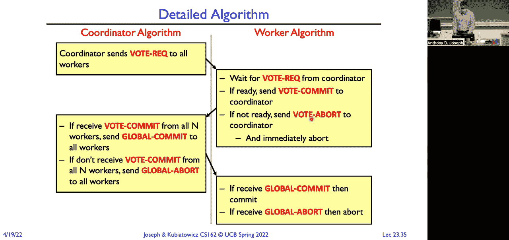

# P23：讲座23：分布式决策制定（续），网络和TCP I - RubatoTheEmber - BV1L541117gr

好的，大家开始吧。

今天我们有很多内容要讲。好，我们将讨论分布式系统。然后我们将探讨分布式决策制定，以及分布式提交协议。我们还会讨论网络，时间允许的话，我们会深入了解PCPIP协议。好，如果你回想一下，我们有社会规模的信息系统。

这些设备横跨了从成千上万台机器的巨大集群，到像气囊加速度计这样的MEMS设备。我们不断被几十到上百个微处理器所环绕。所以，如果我们要猜测一下这个房间里有多少个微处理器。

你可能会错估三到四倍。对吧，每个人有三四个设备。一部手机、一台平板、一台笔记本、一个手表，都是带有微处理器的。但整个房间内充满了微处理器。所以，从房间里每一个无线接入点，到照明控制器，都是微处理器的组成部分。

AV控制器、无线麦克风、投影仪、升降幕布的设备。这些都有微处理器，并且它们都互联互通，运行着各种应用程序。所以，今天我们将要深入探讨的就是这些分布式系统，这些分布式应用程序。实际上，过去并非一直是这样。

如果我们回顾一下时间的起点，最早是大型主机。可能花500万美元购买一台主机。然后，你会有连接到它的傻终端。之所以称其为傻终端，是因为它们实际上完全没有智能。它们唯一能做的就是接收命令并将内容显示在屏幕上。

当你输入按键时，按键输入会传送到主机上进行处理。然后，应用程序会处理这些输入并绘制屏幕。今天最接近的类比是，如果你使用类似远程桌面或远程显示的协议，你的计算机实际上只是作为一个帧缓冲器来使用。

还有输入按键和鼠标的方式。所以，在80年代，当我们拥有个人计算机时，这种模式变成了客户端-服务器模型。现在，一些计算任务发生在桌面计算机上，而这些桌面计算机作为客户端，向主机或服务器发出请求。所以，单台计算机。

今天，我们看到的是一种类似对等网络的模型，拥有分布式系统。所以，曾经存在于那个单一巨大、价值500万美元的主机上的功能，现在已经分布到各个服务器上。最初这些服务器都在同一个房间里，后来在同一栋大楼中。现在，它们可以在全球范围内分布。所以，这种模式又被称为对等网络或广泛的协作模式。

好的，那为什么我们需要分布式系统呢？假设那台花费500万美元的主机可以支持1万台傻终端。那么，当我购买了我的第一台1万台中的终端时，会发生什么？我得再去买一台500万美元的主机来支持一个额外的用户。好吧，所以增长的单位非常大，根本不具备良好的扩展性。

分布式计算的思想是，这些较小的计算机、较小的服务器或单元要便宜得多，可能只需要几千美元，而不是几百万美元。所以，当我扩展用户时，我可以按需逐步扩展计算能力。或者如果是一个Web服务器，随着需求的增加，我也可以逐步扩展。所以，分布式计算有很大的经济原因。

当我们看客户端-服务器模型时，用户可以控制一些组件，对吧？

客户端可以是运行某个应用程序的手机，手机通过网络与远程服务器进行通信。但是你控制着你的手机。你可以选择不运行那个应用程序，或者运行一个计算应用程序。然后就有了协作，对吧？举个简单的例子，Google Docs，对吧？

我们都可以在共享的网络文件系统上共同处理文档。所以分布式系统的承诺是，它们能为我们提供更高的可用性。一台机器宕机了，我只需简单地使用另一台机器。它们提供了更好的耐久性。我将我的数据存储在多个不同的位置。它们提供了更多的安全性，对吧？

每个组件变得更容易变得安全。然而，现实真的令人失望。所以，这是莱斯利·兰波特。他是图灵奖得主，并且在分布式系统、分布式时间和分布式时钟等方面做出了非常基础的贡献。稍后我们会回过头来看看他在这方面的工作。

但现实真的很令人失望，对吧？我们得到的是更差的可用性。我们依赖于每一台机器都正常运行。所以，除了其他他出名的事情外，他因为这句话也很有名。他说：“分布式系统是这样一种系统，某台你甚至不知道存在的计算机的故障，会导致你自己的计算机无法使用。”今天我在校园里就一直遇到这种情况。

我一直被踢出 Edgiro。我认为是因为某个身份验证服务器超载了，所以我一直在超时。而我不知道那个服务器在哪里，但我真想去那里，而且不想对那个服务器做些什么，因为它让我很难完成我的工作。但我想这就是原因，我不知道。但在某台我不了解的计算机上，有什么东西阻止我连上网络。

让我们无法完成工作。这就是分布式计算的问题。我们都遇到过这种情况，不仅仅是在校园里，某些东西坏了，是因为我们不知道或者无法控制的东西出了问题。所以我们无法完成工作。这更糟糕，因为可靠性差。任何机器崩溃都可能会影响系统。

现在系统崩溃，我们无法完成工作。这更糟糕，因为安全性变差，因为我可以攻破任何组件，然后可能从那里跳跃到其他组件，等等，因此我系统中的最弱环节就成了我的最大漏洞。而且，这也变得更加困难。

我们在学期初部分讨论了在单台机器上的协调，其中我们有多个线程需要在一些数据上进行协调。我们可以使用测试和设置。但现在这些数据散布在全球各地。那么我们如何同步这些数据呢？所以在集中式系统中容易的事情，在分布式系统中就变得困难了。

在去中心化系统中，我们将看到极其复杂的算法是必须的，以便应对这些问题。还有其他各种问题，对吧？比如信任问题。我必须信任那些可能存储我数据或执行我计算的第三方。

有安全问题。也有隐私问题。对吧？当你把照片存储在Facebook上时，Facebook会怎么处理你的照片？对吧？或者其他任何你存储私人数据的云服务。有拒绝服务潜在风险。对吧？而且，单机环境中的许多问题，现在在分布式计算环境中被放大了。对吧？

我们如何从一堆第三方组件构建一个分布式应用？

我们如何信任这些第三方组件会正确运行并正常执行任务？对吧？所以LAMPORITE的引用的一个推论是，分布式系统是在某台你甚至不知道存在的计算机成功协调攻击我的系统时，你无法完成工作的系统。对吧？如果你对我发起分布式拒绝服务攻击。

我们现在开始看到的分布式拒绝服务攻击简直惊人。每秒上兆比特的流量指向一台服务器。对吧？所以，能承受这种攻击的服务器是非常少的。好吧，也许我们需要退后一步，思考一下我们的一些目标是什么？

我们从分布式系统中希望得到什么？有哪些需求？

所以，我会说第一个是透明性。这实际上是系统通过某些简单接口来掩盖复杂性的能力。透明性有很多种类型，对吧？其中一种透明性可能是位置透明性。对吧？我无法知道资源存放在哪里。对吧？当我去读我的熊邮件时，我的熊邮件存储在哪里？我不知道。对吧？我在乎吗？不。在乎的只是我能否读到我的邮件。

我不关心数据存储在哪里。那有迁移，对吧？

因此，管理熊邮件数据的服务器会不断地移动这些数据，为了负载均衡和其他原因。我能看到这个过程吗？有时能。对吧？偶尔你可能会登录某个系统，然后看到提示，说账户迁移正在进行中。就像银行似乎特别喜欢做这种事情。

你去支付账单时，他们会说：“抱歉，请离开。你知道，我们正在将你的钱转到别的地方。”对吧？但在许多情况下，这个过程是完全透明的。我根本不知道我的数据在哪里，也不知道迁移正在发生。这对服务提供者来说是有利的，对吧？

所以我可以将我的数据存储在从位置透明性角度来看最有效的地方。从迁移的角度来看，这意味着如果我需要进行维护，我只需将这些账户从服务器上迁移。进行一些硬件维护后，再将这些账户和数据迁移回来。复制，对吧？有多少副本？

当我将文档保存到Google Drive时，创建了多少副本？对吧？

事实证明，在某些情况下，可能会创建多达十二个副本，分布在全球各地。再次强调，这是为了提供耐用性。但我不关心副本有多少个。我关心的是，当我要获取文档，或者加载幻灯片时，幻灯片就在那。并发性，对吧？当你使用Bing搜索时，多少用户在同时使用？

嗯，也许那个例子不太好。也许我应该用Google搜索来举例，对吧？

你不知道，对吧？性能似乎与用户数量无关。并行性。因此，当我做一个搜索查询时，**我可以通过访问一台机器来实现**，然后那台机器读取一拍字节的索引数据来查找相关条目并返回页面。这会花费很长时间。相反，查询会被路由到成千上万台机器上。

每个都拥有该全局索引的一小部分。容错性。对吧？

所以，机器在云中时常会发生故障。你看不见这个过程，因为透明性把它隐藏了。所以，透明性和协作，它们是不同机器上不同进程之间相互沟通的方式。但这需要沟通。因此，你可以立刻问，**这些进程是如何沟通的**？好吧。

他们使用协议进行通信。对吧？协议是关于如何通信的约定。它包括两个组件。一个是语法，它指定了如何传递消息，如何构造消息。它是格式，是消息传递的顺序。然后是语义。对吧？

一条特定通信的含义。它是当你收到这个特定消息时，你采取的动作。对吧？现在我们可以——或者当类似计时器过期时会发生什么。好吧。所以我们可以用状态机正式描述一个协议。通常我们会使用一些消息交易图来表示它。对吧？

所以你可以把协议看作是这样。然后我们还可以添加一种语言，这实际上是这种分区状态机，我们在两个实体之间保持同步。我们还可以添加稳定存储。当我们进入分布式事务和分布式权限时，我们将看到它作为一种方法。确保即使发生故障，这些分布式分区状态机也能继续工作。

保持同步。好吧，那么让我们——那是一个抽象的，正式的定义。现在我们来看一个来自现实世界的例子。是人类互动。而我们要使用的互动方式是电话。好吧，我想打电话给我的朋友。那么我该怎么做？我拿起电话，或者打开手机，或者拿起听筒。对吧？

然后我听到拨号音，或者我检查，我是否真的有服务？对吧？在这个房间里？

然后我有服务。太好了。好吧。那么我死了。发生了什么？

我开始听到铃声，然后对方也会听到铃声。他们会拿起电话并接听。他们会说“你好”。我会说“嗨，我是安东尼”或者“嗨，我是我”之类的。然后我会说，“嘿 blah blah blah blah blah。”停顿。接着他们会回应，blah blah blah blah blah。

停顿。然后说再见。然后他们会回应再见，然后挂断。这就是一个协议。那么我们如何启动它？铃声启动了协议传递到另一端。另一端用问候语回应。你好。然后我回应了一个你好，并带着一些请求。然后他们回应。

“好的，他们会执行那个请求。”现在我们想关闭连接。所以我们有一个联合的告别，然后我们可以挂断。这就是协议的一个例子。你在这里看到的是语法。你没有看到语义，因为你并没有真正看到内容。

虽然你可以看到初始消息、你好和告别消息。但也许在中间有一个请求和响应。所以我们回到计算机。我们有这些我们想要创建的应用程序。是我们甚至无法想象的应用程序。也许是像Skype这样的通信应用程序。它可以是像SSH这样的终端应用程序。

它可以是像网络文件系统这样的网络应用程序。同时，所有计算机科学家都在创新，应用程序开发人员也在创新。我们也有硬件人员、电气工程师在创新新的传输介质、传输媒体。所以我们有同轴电缆。这就是 Comcast 运营的东西，或者是光纤。

AT&T 和 Sonic 运营的东西，进入你家。然后你有在其之上运行的应用程序。许多不同的应用程序，许多不同的计算机互联方式、网络风格和技术。Wi-Fi 和无线、蜂窝网络等等。实际上，这是一个问题，如何组织这个混乱的局面？

因为如果情况是这样的话，那么每次我们添加一个新应用时，就像是“哦，网络来了。”我们就必须在网络中实现对有线调制解调器、光纤调制解调器、Wi-Fi、有线以太网等的支持。

所以我们最终会为每种新技术重新实现每项技术或每个应用程序。因为也可能出现新的数据包无线电，基于业余无线电的广域新无线技术。所以不，这真的行不通。如果每个应用程序必须支持每种潜在的网络技术，这种方法是不可扩展的。

如果每种网络技术都需要重新实现现有的应用程序。那么，互联网是如何避免这种情况的？目标是拥有可靠的通信渠道，通过这些渠道我们可以构建应用程序。我们将通过一层间接层来实现这个目标。所以我们将增加这个中间层，提供一组各种网络功能、组件和技术的抽象。

所以这让我们现在可以只实现一次应用程序。我们在这个中间层上实现一个应用程序。类似地，当我们添加新技术时，我们也将实现对这个中间层的支持。所以这有点像，是另一种间接层的变体。

你在这里伯克利的整个学术生涯中都听说过的。这个中间层，这个狭窄的腰带，就是互联网协议。它是一个基础的抽象，允许我们进行创新，因为当一个新应用程序出现时。

就像网络一样，它只需要实现对 IP（互联网协议）的支持。类似地，当有人提出 802.11、AX 或 AC 等标准时，他们所需要做的就是实现对 IP 的支持。然后所有应用程序都能工作。那些20年前写的应用程序，像 Skype。

它可以在最新的网络技术上运行。类似地，我可以拿出一条支持IP的1980年代的微波链路，来运行现代应用程序。所以，这就是拥有这样一个狭窄腰带——这个间接层或间接级别的力量所在。

这就是所谓的互联网沙漏结构。只有一个网络层协议，才使我们实现了这种互操作性。在它的底层，我们可以有许多不同的网络技术，使用许多不同的物理实现。例如，我与这个房间的连接是通过铜线以太网连接的，而这个房间可能通过光纤连接到校园网关。我也可以通过 802 协议将我的笔记本电脑连接上。

11 到房间四周的接入点，尽管我今天非常沮丧，因为身份验证没有成功。然后在其上，我们有各种各样的传输协议，比如不可靠的数据报协议、传输控制协议。在这些协议之上，我们有许多应用程序。有问题吗？好。

那么，这里有什么影响呢？对吧？有了这个单一的 IP 互联网层，任意网络都可以互操作，任何支持 IP 的网络技术都可以交换流量。所以我可以在古老的微波链路上与使用现代光纤到户链接的人进行通信。

对吧？只要两者都支持 IP，我就可以在它们之间交换数据包。好吧。它还允许应用程序在任何支持 IP 的网络上运行。这是非常令人惊讶的，对吧？当我想到 20、30 年前支持 IP 的应用程序时，我今天仍然可以在最新的网络上运行它们，而无需做任何更改。

所以这促成了非凡的创新，对吧？看看各种移动应用商店里的数百万款应用。它们都运行在 IP 协议之上，对吧？与此同时，看看我们在 IP 之下所取得的非凡创新，比如 LTE、卫星、Starlink 等新的广域网技术的发展。

对吧？这一切都得益于仅有一个传输协议，所有人都在此基础上进行实现。缺点呢？当你想要更改这个传输协议时，会发生什么？

所以当我们想从有限地址空间的 IP 版本四（稍后我们会讨论）过渡到几乎无限地址空间的 IP 版本六时，实际上这需要几十年的时间。IP 版本六已经存在了很多年，而我们仍然只是逐步推进，对吧？所以当我连接到有线网络时。

我现在得到一个 IP 版本四的地址。当我连接到 Wi-Fi 时，我得到一个 IP 版本六的地址，因为我们在过去几年里将无线网络迁移到了 IP 版本六。我们这么做是因为地址不够用了，对吧？我们白天的人口大概是七万多人。而这些人每人都有很多设备，他们都在用 Wi-Fi，而我们根本没有足够的地址。

所以通过迁移到 IPv6，我们基本上拥有了无限的地址，这就不再是问题。但为了实现这一点，付出了大量的工作和努力。并且全球范围内，大多数东西仍然在使用 IPv4。好吧，这就是层次化的一个例子，它的缺点是，一旦你有一个每个人都依赖的层。

对那个层进行更改是非常困难的。所以其他的缺点是，在给定的层中，你可能会最终重复下面一层的功能。对吧，像错误恢复、校验和之类的东西。不同的层可能需要相同的信息。时间戳在网络中非常有用。

因此，我可能在我的网络栈的多个层次上都有时间戳。我需要知道底层网络支持的最大传输单元是多少。我也可能会面临由于分层带来的性能影响。对吧，因为我隐藏了发生的细节。我做了一些假设，这些假设干扰了我在更高层的性能。

我们稍后会看到一些例子。有时候，各层之间的分离并不那么清晰。有时在头部信息、校验和或者其他一些层之间的内容会有重叠。所以层次之间会有一定的“渗透”，我在多个层同时进行处理。然后，有时我的头部信息就是很大。对吧。

因为每一层都会增加一些头部信息，即它需要的一些元数据。当我们谈论数据很小的时候，例如，Zoom使用的语音包。你知道，语音数据包中，头部信息和语音样本的比例，实际上可能是头部信息要比编码和传输的小语音样本大得多。

所以这就提出了一个问题，当我使用分层时，功能应该放在哪里？

我应该把它放在第n层、第n-1层，还是系统中最高层？

有一篇论文写于1984年，它是计算机网络领域最具影响力的论文之一。它是每个人都会参考的奠基性论文。它叫做“端到端论点”，即“系统设计中的端到端论证”。关于这篇论文的意义和内容，争议不断。

而且很多时候，你会看到站在截然对立立场的人声称论文支持他们的观点。好吧，总结一下，阅读这篇论文，它确实是一篇非常好的论文。这里的简单信息是，一些类型的网络功能只能通过端到端的方式正确实现。可靠性、安全性和其他类型的功能就是其中之一。所以因为这个原因。

这意味着终端主机可以在没有网络帮助的情况下满足这一需求，比如可靠性。所以它们必须这样做，因为无法依赖网络，必须在第四层完成。既然如此，如果我要在网络中做这些事情，而最终只是重复实现端到端的功能，那做这些事情的意义何在呢？所以，别特意去网络中做某些事情。

因为它与我在更高层次必须做的事情是重复的。所以它看起来简单，但实际上有点令人困惑。我是什么意思呢？我们来看一个例子，这样就能稍微清楚些。假设我要做可靠的文件传输。我在主机A的磁盘上有一个文件，我想把这个文件传输到主机B，并确保文件能。

主机B上该文件的内容与主机A上该文件的内容完全相同。非常简单。你平时就做这些事，对吧？比如FTP或者SCP等。基本的文件传输。那么我需要做什么呢？嗯，我需要让操作系统从磁盘读取文件，读取文件后再传输给应用程序。

然后应用程序会把这些文件字节提供给操作系统，并告诉它将数据发送到主机B上的应用程序。于是它将通过网络发送到主机B上的操作系统，操作系统接着会缓冲并将字节发送给主机B上的应用程序，应用程序会打开文件以进行写入，并要求操作系统将字节写入磁盘。很简单。

好的，那我们怎么保证它的可靠性呢？这仅仅是文件传输。嗯，两个方案。第一个方案，我们让每一步都具有可靠性，然后把它们连接起来。第二个方案是，我们只做端到端的校验，然后在遇到任何错误时如果有必要就重试。所以它有点像，你知道的，我们只需在最后读取文件，计算一个校验和。

然后把这个校验和发送回原始应用程序，原始应用程序将从其文件中读取校验和，读取计算出来的校验和。如果它们匹配，我们就完成了。如果不匹配，你知道的，我们就需要重新传输。那在第一个方案中我们该怎么做呢？嗯，在第一个方案中，当我们从磁盘读取数据时，我们会检查确保数据从磁盘读取正确。

然后我们将其发送到另一台机器，确保它在这条链路上可靠地传输。接着我们会复制它，可以对每个数据包进行校验，校验我们传输的内容。然后我们会把它交给主机B上的应用程序，主机B上的应用程序将把它写入磁盘。

然后它可能会再做一次校验，确保数据已经可靠地写入。所以这就是两种不同的方案。方案一，是让每个组件都具有可靠性；方案二，是从端到端的角度来保证过程的可靠性。稍作讨论，方案一是不完整的。假设我在主机A上读取了数据，明白了吗？

从这里读取。现在，一个宇宙射线打击发生了，持有缓冲区的内存芯片发生了位翻转。我现在可靠地把它发送到另一台机器，然后可靠地将它写入磁盘。结果我写出了一个损坏的副本。同样的事情也可能发生在目标机器上，如果发生宇宙射线。

宇宙射线可能会打击并翻转一个位。那么这个解决方案就行不通。而接收方无论如何都需要检查。接收方即使每一步都是可靠的，数据也可能在缓冲区和临时存储中被损坏。我还是得做端到端的检查，确保没有出错。对吧？那第二个解决方案怎么样？它是完整的。

我从 A 到 B 硬盘可靠地传输文件的功能已经具备，因为我做了那个端到端检查。所以你可以问，嗯，那我为什么要在底层实现可靠性呢？那有什么意义？

如果最终我还得做端到端的检查，如果出错了，那我得重新传输。这不是一个修辞性问题，这是一个实际问题。是的，完全正确。所以，如果我不在底层实现可靠性，那么可能的情况是，如果我有一个非常不稳定的连接，并且我正在传输一个**TB**大小的文件。

我可能必须多次传输才能成功完成清晰的传输。如果我真的丢失了连接，那么提供可靠性实际上在效率上会对我帮助很大。它可能会让传输效率变得更高，因为与其重新传输一个**TB**的文件，我可能只需要重新传输那一个包含**1,500字节**或**8千字节**数据包。

数据也可能会损坏。所以如果我们考虑端到端原则，它基本上是在说，网络中实现复杂的功能并不会减少主机实现的复杂性。我仍然需要做那些端到端的安全性、完整性或可靠交付检查。但是这将会。

增加我的网络复杂性。什么是包含处理器的路由器组件？

这将增加我的操作系统中网络代码的复杂性。如果我现在必须在所有这些不同的组件中保证可靠性，这将会导致延迟。这将给所有应用程序带来额外的开销，即使它们并不需要这些功能。那么，假设我真的实现了可靠的网络连接。

我打算把它作为构建我的可靠文件传输应用的一部分。比如，看看那些在家里通过 Zoom 观看我的人。Zoom 使用的是不可靠的通信。为什么？因为在进行交互式通信时，延迟很重要。所以我们都有过那种 Zoom 通话，音频一直掉线。

视频也在丢帧。但你还是大致能听懂对方说的话。那总比我们说，**每个语音样本都要完美传送**，然后就不停重传好。那样对方可能会滞后1到2秒，你也会滞后1到2秒。那样的延迟通讯真的很难进行。

进行对话就变得非常困难。但我们需要找到一个平衡点。我刚刚和在爱达荷州的一个同事进行了一次FaceTime通话。她的网络连接是卫星链路，丢包严重。我几乎听不懂她说什么，因为每个数据包都会丢失。我有点想起了这次讲座，心想，可能。

这种情况下，我可能希望有一定的可靠性。例如，重试几次。如果重传失败，那么就丢弃数据包。但即使如此，也会引入延迟，使得实时对话更加困难。因此，当你有一个非常**丢包率**高的链路时，一定程度的可靠性。

引入可能有助于提升整体性能，尤其是在应用层的**重传单元**非常大的情况下。如果我处理的是一个30字节的语音样本，应用层如果真的重视**可靠性**，重传这个数据并不难。但如果我处理的是一个**1TB**大小的文件。

重传，这将变得非常痛苦。好的，所以我们可以思考一下**非常保守的实现观点**，作为对端到端原则的解释。非常保守的观点是，除非可以完全在上层实现该功能，否则就不要在系统的低层次实现。

在这种情况下，除非你能在某种程度上减轻**终端主机**的负担，否则不应该去实现这个功能。如果不能做到，那么就不要浪费时间去实现它。持这种非常**保守的极端观点**，你会发现，我们永远不会在较低层次上实现任何功能。因为在较低层次做的任何事情，我们都必须。

一些人会持这种观点，认为网络应该尽可能简洁和清晰，基本上只采用最好的努力来传送数据包，不做更多的处理。这是一种观点，在某些情况下，确实非常合理。但我更倾向于**一种适度的解读**，也就是说，

在我们实施某些网络功能之前，应该仔细考虑。所以如果一个主机能够正确实现该功能，那就只在有性能提升或改善的情况下，在**较低层次**实现该功能。但我们要确保，只有在实现该功能不会对系统造成负担的情况下，才实施。

对那些不需要该功能的应用施加性能负担。这就是我们有TCP和UDP的原因。如果你需要可靠的传输，就使用TCP。如果不需要可靠传输，或者你想自己实现，就使用UDP。因此，你作为终端主机上的应用，可以选择使用哪种协议。

选择使用。这是我们所使用的一种解释。这是我在我的研究小组中使用的解释。很多人采取这种更中庸的方式来解释端到端原则和论点。但是你可以问一个问题，这在我们遇到像分布式拒绝服务攻击或防止包含性等情况时，是否仍然有效呢？

这些是我们实际上将功能推送到节点的情况。所以我之前提到过，应该如何应对针对主机发起的每秒数太比特流量的拒绝服务攻击。你可以争论说，端到端原则要求。

应该在主机上处理这种攻击。好吧，地球上没有哪台机器可以吸收太比特的数据并从有效请求中过滤掉攻击。然而，如果我在网络中实现这个功能，那么我可以去中心化它。现在我有独立的路由器，可能在处理千兆比特流量，或者数十到数百千兆比特流量。

在这种情况下，我有机会能够过滤掉并阻止这些攻击。因此，你会看到像CloudFlare这样的服务越来越多，他们把功能推送到网络中，实施本应在终端主机上实现的功能。如果我们再次。

如果我们严格按照端到端原则的解释来做。那么，这就意味着应该把很多功能像这样推送到网络中，因为我们可以在网络层实现得更好。虽然我们仍然需要在服务器上实现拒绝服务保护，但如果我。

如果我处理的是兆比特或千兆比特流量，与处理太比特流量的情况相比就完全不同。好的，有关端到端的问题吗？好吧，那么我们换个话题，来讨论分布式应用。我们到底如何编写一个分布式应用？这需要什么？嗯，想一想，好的？一个分布式应用，对吧？它有两个组成部分。一个是代码，负责实现功能，另一个是状态。

当我们在单台机器上编写应用时，状态和同步状态非常容易实现。但现在我们有多个线程在不同的机器上运行。因此，不存在共享状态。我们不能仅仅使用测试和设置。

创建临界区。所以我们需要一个不同的原语，允许我们在广泛区域内对共享状态进行同步。因此，我们可以使用的一种抽象方式是发送和接收消息。为什么？因为从本质上讲，它是原子的。要么收到消息，要么没有收到消息。

两个接收者不能接收到相同的消息。所以我可以在发送和接收消息的基础上建立同步。如果你想这样理解的话，我就有了一个原子操作。那么，接口是什么？

我们将使用一个非常简单的接口来开始介绍邮箱的概念。所以这是一个临时的消息存储区域，关联有一个队列和一个目标位置。然后它们会向邮箱发送一条消息。因此，这将把消息发送到邮箱标识的地址。而接收则是从邮箱读取消息并存入缓冲区。

所以我们将等待。线程将在邮箱上接收消息，直到有消息到来。然后其中一个等待的线程会被唤醒，并将消息复制到它的缓冲区。好吧。那么我们可以提出一些关于发送行为的问题。例如，发送操作何时返回？

所以它可能会在接收应用程序的线程实际获取到消息时返回。当我们收到确认回执，表示它已经收到了消息时，它也可以返回。可能是当消息被操作系统在目标端缓冲时。嗯，也许是立即的。当我们将消息复制到操作系统缓冲区时，发送操作立即返回。

我们需要的语义将依赖于应用程序。因此，这实际上是一个问题：发送方什么时候能知道接收方已经实际接收到消息？只有在第一种情况下，其他情况我们有点依赖系统最终将消息传递到目的地。

但是，如果是第二种情况，目标主机在消息传送到接收方之前崩溃，或者消息被本地缓冲而本地机器在发送之前崩溃了，发生了什么呢？还有一个问题是，发送方何时可以重用包含该消息的缓冲区。我们稍后会在讨论TCP时回到这个问题。但邮箱为我们提供的是单向传输。

线程一和线程二之间通过缓冲区进行通信。嗯，这看起来非常熟悉。对吧？我们在课堂开始时看到过线程一与线程二之间通过缓冲区进行通信的实例。还记得学期初的内容吗？希望你没有忘记。

我们马上有期中考试了。这里是生产者消费者模型。对吧？线程一生产数据，线程二消费数据，我们在两者之间放置了一个缓冲区，以便解耦两个线程的执行。所以我们的发送就像是带有信号量的V操作，而接收就像是带有P操作的接收。

信号量。但这里的关键区别是，回到课堂一开始，线程一和线程二是在同一台机器上。现在，线程一和线程二甚至不需要在同一颗星球上，它们仍然能够通信和同步。好的，如果我们想一下。

比如实现生产者消费者模式，生产者取一个消息缓冲区，准备消息，然后将该消息发送到目标邮箱。消费者有一个缓冲区，他们等待该缓冲区中的接收消息。我希望消息到达，它会被复制到缓冲区中，然后他们就可以处理这个消息。所以，最棒的地方是生产者和消费者。

消费者并不关心邮箱中有多少缓冲区空间。他们不需要跟踪这些，发送和接收由操作系统来处理。这是TCP窗口的一个角色。它是可用缓冲区空间、带宽延迟积和其他几个因素的功能。但它告诉我们发送者有多少空间可以发送给接收者。

那么，如果我们想进行通信呢？我们可不想只是把它丢到墙那边，从线程一到线程二。而是想要发起一个请求，比如向服务器请求某些东西并获得响应。我想读取一个文件服务器上的文件并得到响应。

我想从网页服务器请求一个网页并得到响应。这就是客户端-服务器应用。客户端是我们的请求者，服务器是我们的响应者。服务器为发起请求的客户端提供某种服务。那么，文件服务会是什么样子呢？客户端说，我有一个响应缓冲区。我将把这个。

请求服务器读取文件，根目录的大文件。这里是该服务器的邮箱。在哪里找到该应用程序。然后我将从那个服务器收到响应。进入我的客户端邮箱。当然，发送也有很多细节没有提到，但我必须告诉服务器如何找到客户端邮箱，之类的事情。好的。

所以服务器会接收来自服务器邮箱中的命令缓冲区请求。读取根目录的大文件。它将解码该命令，将文件加载到内存中，然后放入这个答案缓冲区。接着，它会将这个答案缓冲区发送到客户端的邮箱。然后就把它返回给发起请求的客户端。好的，再次。

你可以想一想，如果我们在同一台机器上使用进程间通信，或者使用管道和其他类似的方式，我们会怎么做。现在我们要通过互联网来做这件事，两台独立的机器。好了，关于请求响应的问题，有没有？是的。这和演员模型的概念一样吗？有点相似。我是说，这些都是各种各样的。

协议是在你发出请求后，在远程机器上执行某些操作，并返回响应的过程中，发生某些重叠。还有其他问题吗？好，我们要转变话题，开始讨论分布式共识的制定。所以共识问题是你有一组节点。它们提出一个值。

它可以是真或假。它可以是 A 或 B。它可以是 ABC。但是我必须做出某些决策。这是现实世界。所以其中一些节点可能会崩溃，或者可能停止响应，或者它们可能是恶意的。我希望最终所有节点都能达成共识，并从一组提议的值中决定相同的值。所以，简而言之，

这是分布式共识问题。所以它是一种分布式决策的形式。例子包括选择真假，提交与中止等等。现在，分布式共识或分布式决策的一个重要组成部分是持久性。一旦做出决策，它必须能够持久化。所以非常重要的一点是，

包括稳定存储，以便你有一种持久的方式来记录这个决定。所以就像在一个事务中，这是 D 和 ACID，持久性组件。现在，在一个全球规模的系统中，有很多不同的方法可以做到这一点。从分布式账本（如区块链）到比率代码或多个副本，种种方式都有。但关键是，无论我们怎么做，

我们都要确保我们的决策能够持久化。好，接下来我们来看一下通过一个看似简单的问题来了解分布式共识有多难。这就是所谓的将军悖论。这里是一些约束条件。我们有两位将军，一位在这座山上，另一位也在另一座山上。

在这里，它们只能通过信使进行通信。好，所以它们将通过战场上的信使，从一座山传递到另一座山。而且，当然，我不知道，可能会有山猫、熊，或者其他能吃掉信使的动物。这是它们唯一的通信方式。信使可能被捕捉，等等。

一些事情可能会发生。问题是他们每个人都有一支军队，但这些军队的规模并不大。单独来看，这些军队并不强大。而他们要攻击的目标有一支大军。那支大军的规模超过了任何一位将军的军队，但两个将军的军队合起来，比目标的军队还要大。所以如果他们同时发动攻击，他们将会成功。

如果他们在不同的时间攻击，他们将失败并死亡。好，事情是这样的，这个问题被以卡斯特命名，他因为提前到达而在小大角战役中阵亡。好，那么我接下来要问的问题是：在一个不可靠的网络上，能否通过消息保证两个实体同时做出某种操作？所以，你知道，我们可以让不可靠的网络变得可靠，对吧？因为我们可以。

发送确认信息，对吧？我们可以发送大量消息。但这有点违反直觉。答案是否定的。即使所有消息都能传达出去，这部分通常会让学生感到困惑。即使我说每一条消息都会成功传达，你能做到这一点吗？答案是不能的。那么我们来看一个示例。

可能的消息交换过程是什么样的呢？这将帮助我们理解为什么这是一个悖论。这里有两个将军。好吧。那么左边的将军将提议一个会谈。我们在11点进攻。好吧。好了，我们完成了吗？我们可以在11点进攻吗？是的？不是，也许。正是如此。所以答案是否定的，对吧？因为如果右边的将军没有收到。

信息是因为山狮吃了这个信使？好吧。那左边的将军怎么知道右边的将军收到了它的消息？很简单。我们将消息发送回去。是的，上午11点可以。我们在11点进攻。我们现在可以在11点进攻并活下来吗？我看到有人点头，大家还在摇头吗？是的。

所以这里的困惑是，右边的将军不知道他们的信使是否到达了左边的将军。而如果没有呢？对吧？

也许消息传达成功了，也许没有。如果没有传达，那么这个将军就去11点进攻。可是左边的将军并没有收到确认消息，表示可以在11点进攻。所以他们不会在11点进攻。结果对右边的将军来说并不好。我们可以解决这个问题。所以是11点。

我们将在11点进攻。好吧，现在左边的将军已经告诉右边的将军，我收到了你的最后一条消息。所以我们可以出发了，对吧？是吗？不是？是的。这是同样的问题，对吧？因为现在左边的将军告诉右边的将军，我们可以在11点进攻，但他们不知道他们的消息是否传达成功。如果他们的消息没有传达出去。

那么右边的将军可能不知道他们的消息是否传达成功。所以他们不会在11点进攻。我们可以解决这个问题。从计算机的角度看，我们只需再发送一条消息。对吧？所以这就是问题所在。我们无法确认最后一条消息是否传达成功。所以我们永远无法确认是否可以在11点进攻。

无论我们发送多少消息，即使我们保证每条消息都能传达，我们仍然无法真正知道每条消息是否都已到达。所以，你知道，现实中不会发生这种情况，因为我们有带外通信。但这两个将军只需要使用他们的对讲机或卫星电话。

能够实时确认另一台计算机知道攻击计划将在11点发生。对吧？但如果我们看两个计算机，它们试图在特定时间达成一致，并且只能通过这些不可靠的网络消息进行通信，我们无法在一个非常具体的时间达成共识。所以我们需要做一些不同的事情，而不是同时发生。对吧？

我们需要做出决定，但不幸的是，我们必须从方程中去除时间，因为我们不知道最后一条消息。好吧，如果我们能够解决将军问题，我们将解决一个相关问题，那就是分布式事务的问题。所以，这是两个或更多机器同意做某事或不做某事并作出。

这个决策是托马斯的。所以，要么每个人都同意执行，要么每个人都同意我们不做这件事。我们在这里做的关键改变是，我们去除了时间的约束，并将其转化为最终会发生的事情。与其说“它会在11点发生”，我们说最终它会发生，或者我们都同意它不会发生。这被编入了一个叫做的协议中。

两阶段提交是由另一位图灵奖得主吉姆·格雷（Jim Gray）提出的，他还是1969年第一位获得伯克利计算机科学博士学位的人。吉姆·格雷做出了许多对数据库基础的贡献。他在数据库领域的影响巨大。好吧。那么，这个过程的组件是什么呢？我们有一个持久的稳定日志。

在每台机器上。这就是我们将跟踪提交是否发生的地方。如果某台机器崩溃，当它恢复时，它会查看其日志，以了解它崩溃时世界的状态。我们将有两个阶段。第一个阶段是准备阶段。因此，我们将有一个全局协调器，他们将请求所有参与者。

承诺提交或回滚事务。所以，如果参与者同意提交，他们将把这个承诺记录在日志中；如果有人投票选择中止，协调者会在其日志中写下中止。然后，它会通知所有参与者中止，每个参与者也会在自己的日志中记录中止。现在，如果每个人都说让我们继续提交，那么我们进入提交阶段。这样，如果。

每个人都回应说他们已准备好，协调者在其日志中写下提交。然后，它要求所有节点提交，节点回应确认。收到所有确认后，协调者会在日志中写下“已提交”。好吧，这里的决策点是协调者在其日志中写下“提交”的时候。此时。

我们致力于完成阶段提交，确保每个人最终都会提交。这就是我们使用日志的目的，保证你知道，一旦我们将其写入稳定存储，我们保证要么继续进行事务或提交，要么我们决定中止事务，所有人将回滚结果。好的。

所以这里的算法是，一个协调者和多个工作节点是副本。在高层次上，协调者会询问所有工作节点，大家准备好提交了吗？如果所有工作节点都说“我们投票提交”，那么协调者就会说，全局提交，大家都会提交，对吧？否则，如果有人说“不，我投票中止”，协调者就会广播全局中止。

然后每个人都回滚事务，释放所有锁，就好像什么都没发生一样。工作节点会遵循它们接收到的任何全局消息。所以，如果全局消息是提交，它们就会提交；如果全局消息是中止，它们就会中止。我们在每台机器上使用持久化的稳定日志来追踪该机器上发生的情况。

所以每个副本和全局协调器也是如此。当机器崩溃时，正如我之前所说，它会重新启动，检查日志以恢复数据，并理解崩溃时的世界状态。好了，所以一个机器，协调者发起协议，它询问每台机器，事务是投赞成票还是反对票。

有两个可能的投票选项：提交或中止。只有在收到所有机器的一致提交票时，才会提交。所以任何人基本上都有否决权，可以说中止该事务。现在，如果一个工作节点同意提交，它必须保证它会接受该事务。所以它会在通知服务器之前将提交记录到日志中。一旦它记录了该提交。

在日志中记录了该提交后，如果收到继续并全局提交的消息，它必须完成该事务。它不能改变主意说，“哦，我现在想中止”。一旦它将提交写入日志，它就保证在被告知时会完成该事务。好的，如果工作节点决定中止，它就保证永远不会接受该事务。

它会在日志中记录中止，并可以回滚该事务，并通知服务器：“我决定投票中止”。最终，当我们决定提交事务时，在提交阶段，协调者会听到所有人都说投票提交，然后它会在日志中记录提交的决定。这也是一个关键点，现在事务已经。

已提交。无论协调员或任何机器发生什么情况，我们都能保证最终所有机器都会提交事务。稍后我们会讨论一些故障案例，那样会更清楚。然后我们应用事务并通知其他所有机器。如果我们决定中止，因为有人...

如果有人否决并要求中止事务，那么我们会在日志中记录下我们已经中止的操作，并且会通过全局中止通知所有机器。所以，如果我们考虑一下，有两种操作。要么所有人都同意提交事务，并确保我们按原子操作执行提交路径，要么有一个或更多的人决定中止。

然后我们会选择中止路径，并通知所有人将中止。只有这两种结果中的一种会发生。我们要么同意提交事务，要么不同意，然后决定中止事务。好的，有问题吗？

我们将通过一系列例子来帮助理解。是的？嗯，这是个好问题。问题是，在告诉协调员我的投票之前，我作为工作节点应该先写入日志。这非常重要，因为这个日志是持久的。所以我记录下自己决定提交，或者报告自己决定中止。如果我立即崩溃，最终我会重新启动。

我会浏览我的日志，然后查看我是否决定提交或中止。接着我会联系协调员。我们稍后会看到一个例子。好的，接下来是一些行政事务。我们有一个期中考试，日期是28号。考试时间是晚上7点到9点。所有课程内容都是考试范围。

尽管重点将放在上次期中考试之后的材料上，但这并不意味着你可以忘记12周前的内容。并且将于25号举行复习课，时间和地点稍后公布。好的，现在让我们更详细地讲解一下这个算法。

所以协调员会向所有工作节点发送投票请求。工作节点在等待协调员的投票请求。如果他们准备提交，他们会向协调员发送投票提交。如果他们没有准备提交，他们会向协调员发送投票中止。

然后他们可以立即中止。那么为什么他们可以立即中止呢？

因为他们知道结果。如果我投票提交，我不能立即提交并释放锁，处理所有相关操作，因为我不知道其他人是否可能导致事务被中止。但如果我自己说我还没有准备好，我将投票中止，那么我就可以继续进行中止，因为我知道协调员会听我的，并最终中止事务。

事务。那么我可以立即停止该事务，释放所有锁并回滚一切。好的，等待直到收到协调者的全局中止也是同样正确的，但作为一种优化，我可以立即清理。好的。所以在协调者那边，如果每个人都投票提交，它会向所有工作节点发送全局提交。

如果有人不同意，它会向所有工作节点发送全局中止。然后，工作节点如果收到全局提交，它们就会继续提交。如果收到全局中止，它们则会中止。好的。那么现在我们，仍然处于算法阶段。让我们看一些执行示例，看看它是如何工作的。

所以我们首先从这里开始。

在没有故障的情况下。好的。那么在这里，协调者发送投票请求。在无故障的情况下，所有工作节点都准备好并投票提交。好的。现在协调者收到了所有投票，并记录在日志中，提交。这就是我们的提交点。然后广播全局提交。好的，所有人都会提交。

所以如果我们深入查看协调者的状态机，它是一个非常简单的状态机。好的，我们从初始化状态开始。我们发送，然后接收一个开始信号。程序被告知启动两阶段提交。然后它发送一个投票请求。接着它等待。如果它收到投票中止。

它发送全局中止并进入中止状态。如果它收到所有投票提交，它会进入提交状态并发送全局提交。工作节点也实现了一个非常简单的状态机。它们从初始化状态开始，等待投票请求。当它们收到投票请求时，它们可以选择。

我会投票中止，在这种情况下，它们进入中止状态。或者它们可以说，好的，我准备提交，并发送投票提交。然后它们进入准备状态，再次等待。它们等待从服务器接收全局中止或全局提交的响应。根据响应，它们要么进入中止状态并回滚一切。

或者进入提交状态，完成所有操作，释放锁，事务提交。那么让我们思考一下。协调者的故障只有在我们等待消息时才真正重要。好的，所以当我们发送投票请求时，现在我们在等待来自工作节点的消息。如果其中一个工作节点失败。

然后我们会停留在这个等待状态。所以如果我们没有收到所有的投票，经过一段时间后，我们可以简单地超时并中止事务。这将是最简单的实现。更复杂的实现可能是我们会重试，重新发送消息给任何没有响应的节点，因为可能有消息丢失或其他原因。

但从概念上讲，我们只需等待固定时间。如果没有收到回复，我们就会中止事务。所以这是一个工作节点失败的例子。我们发送投票请求。我们收到了工作节点一和工作节点二的提交投票。而工作节点三呢？也许它们的消息丢失了，或者发生了什么事情。

但最终我们会达成共识，或者它们崩溃，我们超时，然后我们将发送全局中止。稍后，这个工作节点三将会恢复，查看日志并说，“嘿，我有这个事务。”然后联系协调者并说，“这个事务发生了什么？”

协调者会说，事务已中止。在这种情况下，工作节点会清理所有内容，回滚，释放锁，并继续。所以这就是最终一致性的体现。即使这台机器需要一周的时间重建并重新上线。

最终它会执行，最终会应用结果。对于已经中止的事务的情况。好的，当我们从工作节点的角度考虑协调者故障时，存在两个等待的地方。我们等待那个投票请求，在一个NIN中。对于工作节点来说，他们也可能会超时。他们没有收到，知道吗？

他们有一个正在结束的事务，他们在等待查看，我们是提交还是中止。我还没有收到进入Q-phase提交的请求，他们可能就会超时并中止。稍后，当协调者联系他们时，最终会说，“嘿，我没有收到你的消息。我已经中止了那个事务。”这没问题，协调者会处理这个。

它会收到一个中止投票，然后发送全局中止。我们可以等待的另一个地方，更复杂的是在就绪状态下。这里的等待真的很糟糕。真的，非常糟糕，对吧？因为在NIT状态下，工作节点拥有控制权。好的，想一想这个。

这是一个分布式事务系统，运行在各个工作节点上。有大量的事务正在进行。每个事务都会占用锁，并防止其他事务可能继续进行。所以我们希望尽可能快地完成事务。当我们卡在NIT状态时。

作为工作节点我们有控制权。因为我们可以随时说，“嘿，已经10分钟了。我还没有收到这个事务的请求。”所以我就超时了，我会中止这个事务，释放锁，让系统中其他等待这些资源和锁的事务继续执行。当我们处于就绪状态时，它是。

不同的是。我们告诉协调者，我们正在提交。所以我们不能释放这些锁。我们不能中止事务，我们必须等到协调者说，“好的，我们要提交，或者不，我们要继续中止这个事务。”所以卡在这个就绪状态真的很糟糕。

因为它在该特定节点上占用了资源，而且可能会占用不确定的时间，而节点无法控制何时离开准备状态。好的，接下来是协调器失败的示例。第一个情况是，我们没有收到来自协调器的投票请求，可能是因为协调器崩溃或发生了其他问题，结果工人节点只是。

只需超时中止事务并继续。当协调器恢复时，它们会说，嘿，我们都决定中止事务，因为你消失了。当我们处于准备状态时，我们收到了投票请求，我们都已经返回了投票提交，或者我们甚至不知道，也许一些工人节点已经决定投票中止，因为他们遇到了一些问题。

我们在等待协调器的消息，等待了解将会发生什么。我们被阻塞，等待协调器最终重启，然后可能会发送全局中止，或者它可能会发送全局提交。这一切将取决于协调器是否已经将提交写入其日志。如果它没有写入提交，那么它将中止事务。

事务。如果它已经写入了提交日志，那么它将发送全局提交。因此，在这种情况下，人们有时会进行的小优化是，如果您没有收到协调器的消息，那么您尝试与其他所有工人节点进行通信。如果您能找到任何投票中止的工人节点，那么您就知道最终决定将是全局中止。

反而，您可以继续进行。即使您处于准备状态，您也可以安全地中止。但是这是有问题的，您知道确保正确实现这一点是很复杂的。但这是实际环境中人们会进行的优化之一，因为协调器失败和重启之间可能有很大的时间差距。

而且，事实上，它在这些节点上阻塞了其他事务。好的，关于这一点，再说一下耐久性。所有节点都使用稳定存储来存储日志，记录当前状态。非易失性存储可以是硬盘、固态硬盘或某种非易失性RAM。因此，当我们从节点故障中恢复时。

它会查看那个状态，这就告诉它如何继续。对，如果协调器发现它处于初始化状态、等待状态或中止状态，它就知道事务将会全局中止。如果协调器恢复并看到它处于提交状态，那么在这种情况下，当它重启时，它会向所有工人节点发送全局提交消息。

所以，实际上，这真的是一个问题：这个崩溃发生在何时？它是在决策做出并写入稳定存储之前发生的吗？如果是，那就是全局中止。它是在我们将提交写入日志之后发生的吗？那么它将是全局提交。对于工人节点来说，如果它们重新启动并处于初始化状态或中止状态。

它们可以在本地中止，因为如果协调器询问它们，它们会说：“我投票中止。我不投票提交。”如果它处于提交状态，那么这意味着它同意提交事务。所以如果它需要重新播放日志或其他操作，它将会执行，以确保事务结果的持久性。

如果它重新启动并且处于就绪状态，那么它将会询问协调器：“最终决策是什么？”全球决策是继续执行并提交，还是全球决策是全局中止？好，在我们深入讨论之前，关于阶段提交有什么问题吗？是的。

所以问题类似于将军悖论的情况。协调器如何知道所有工作节点都收到了全球提交？对吧？问题在于，如果工作节点没有收到全球提交，并且它们被卡在就绪状态，它们最终会回来问协调器：“嘿，你做出决定了吗？”对吧？

然后它们会从协调器那里得到回应。我们早就决定了，要执行全球提交。所以它们会提交。这是正确的。所以假设我们遇到这种情况，我不确定是否有完全准确的示意图，但假设一个工作节点收到了全球提交。好的？但是在它能够将提交写入日志并执行提交之前。

进程崩溃。好的，所以当它重新启动时，它将会读取日志，它看到的最后一项就是已经执行了提交。然后它会去联系协调器，协调器会说：“嘿，我已经告诉过你我们已经全球提交了。” 然后它会说，“哦，好吧，我会继续提交，写入日志，然后提交事务。”

所以这里的关键点，正如我反复强调的，当我们写入稳定存储时，必须确保无论哪里发生故障，我们最终都会处于一个状态，在这个状态下我们能够继续事务并提交，或者我们中止事务。而不会进入一个我们不知道该怎么办的状态。

这里有些不一致的地方。是的。[听不清]，完全正确。所以这里的关键区别是，在将军的悖论中，我们试图确保我们的分布式决策会在特定的时间点发生，像是上午11点。这里没有具体的时间要求。如果一台机器宕机，可能需要一周时间才能恢复。

但是当它重新启动时，它会询问全局协调器最终的决策是什么。所以其中一个问题是，如果你还记得早些时候，我提到一旦你执行提交，你需要向协调器发送一个确认。那时，协调器就知道它已经收到了所有的确认。

现在它可以删除那个提交记录。在获得所有这些确认之前，它必须保留该提交记录，因为一周后，某个已经离线一周的工作节点可能会回来，问：“嘿，这个事务发生了什么？”它可以告诉它，是的，我们决定提交这个事务。所以没有时间限制。

当决策实施时，实际上我们会以去中心化的方式做出决策并执行。是的。[听不清]，是的，这是一个非常关键的区别。所以投票请求发生在事务的末尾，当我们决定要提交事务时。这时我们会启动两阶段提交。

过程。所以这不是启动事务，而是在我们决定要提交或中止事务后，完成事务的过程。好的，还有其他问题吗？是的。[听不清]，是的，如果其中一个工作节点在响应投票请求之前崩溃，那么我们就把它当作投票中止，协调器会超时，然后做出决策。

要中止事务，这是持久化的。因此，当该工作节点回来时，它会被告知事务没有提交，而是被中止了。[听不清]，没错。如果工作节点离线很长时间，那么所有这些待处理的事务会被决定为中止。好的。好的，周四见。

[听不清]。

[沉默]。
