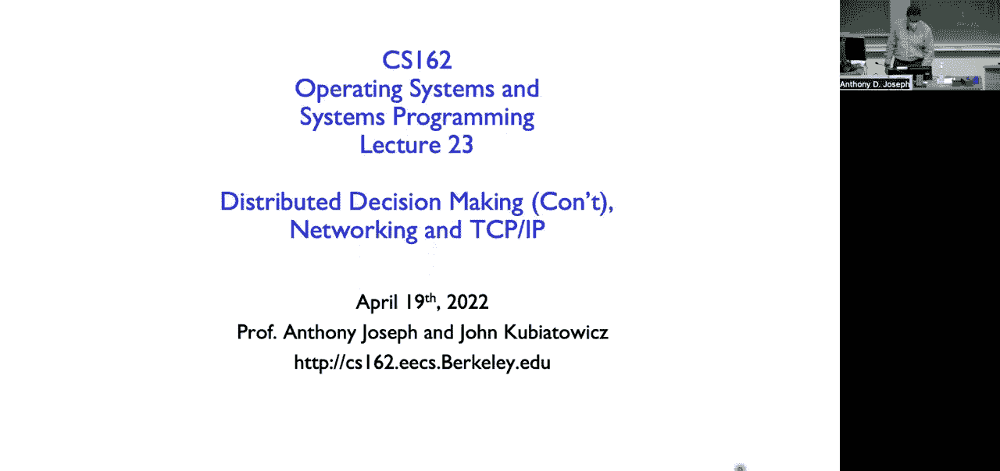
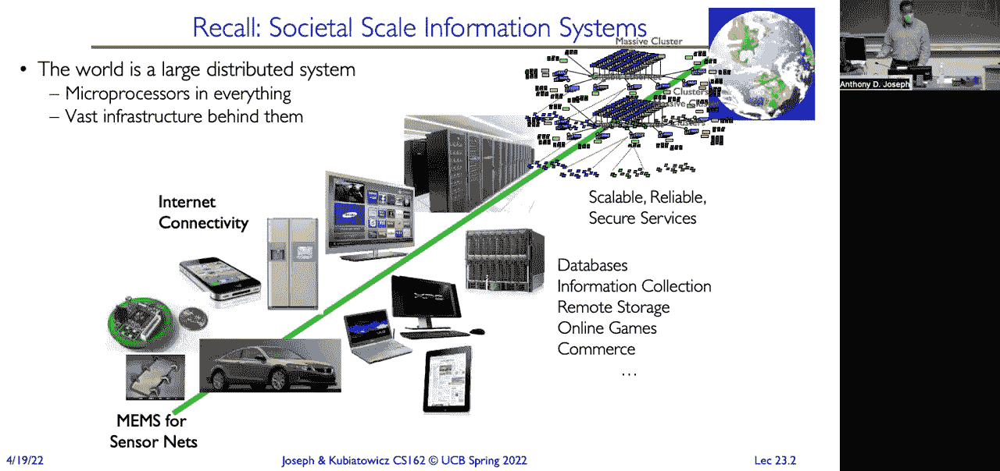
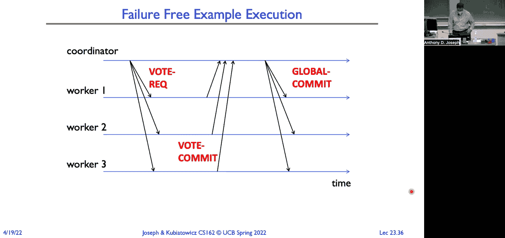

# 课程23：分布式系统、网络与TCP协议（上） 🌐



在本节课中，我们将学习分布式系统的基本概念、面临的挑战以及构建分布式应用的基础。我们将探讨分布式决策制定的难题，并介绍网络通信的核心模型与协议分层思想。

---

## 分布式系统概述

过去，计算模式经历了从大型主机到客户端-服务器，再到如今对等网络与分布式系统的演变。分布式系统由众多互联的计算机组成，它们协同工作以完成共同的任务。

我们身边充满了微处理器，从手机、笔记本电脑到房间内的无线接入点、照明控制器等。这些设备相互连接，运行着各种分布式应用程序。

分布式系统的发展有重要的经济原因。与购买昂贵的大型主机相比，使用许多廉价的小型计算机进行扩展，成本效益更高，也更具弹性。

然而，分布式系统也带来了新的挑战。系统可靠性可能不升反降，因为任何一台未知远程计算机的故障都可能导致整个服务不可用。安全性也变得更加复杂，系统中最薄弱的环节可能成为攻击的入口。

---

## 网络协议与分层模型

为了实现不同设备间的通信，我们需要定义**协议**。协议规定了通信的语法（消息格式与顺序）和语义（消息的含义与触发的动作）。

现实世界充满了各种网络技术（如光纤、Wi-Fi）和应用程序需求。如果每个应用都需要直接支持每种网络技术，或者每种新技术都需要重写所有应用，这将无法扩展。


互联网通过引入一个关键的中间抽象层解决了这个问题：**互联网协议**。这形成了所谓的“互联网沙漏模型”。


### 互联网沙漏模型 🌐

在沙漏模型中，狭窄的腰部是单一的**网络层协议**。其下层是各种**链路层技术**，上层是各种**传输层协议**和**应用程序**。

**公式表示：**
```
[ 多种应用 (HTTP, FTP, Skype...) ]
            |
[ 传输层 (TCP, UDP...) ]
            |
[ 网络层 (IP) ]  <-- 狭窄的“腰部”
            |
[ 链路层 (以太网, Wi-Fi, 光纤...) ]
            |
[ 物理层 (电缆, 无线电波...) ]
```

这种分层架构的优势在于：
*   **互操作性**：任何支持IP的网络技术都可以相互交换数据。
*   **创新促进**：应用开发者只需针对IP编程，网络工程师只需让新技术支持IP，双方可以独立创新。

其缺点在于：
*   **更改困难**：对核心层（如从IPv4升级到IPv6）的修改非常缓慢且昂贵。
*   **性能开销**：分层可能导致头部信息冗余和功能重复。

---

## 端到端原则

关于网络功能应该放在哪一层，有一个重要的设计哲学：**端到端原则**。

该原则的核心论点是：某些功能（如可靠性、安全性）最终只能由通信的端点来正确、完整地实现。因此，在底层网络中间节点中实现这些功能可能是不必要的，甚至是有害的，因为它会增加系统复杂性，并对不需要该功能的应用造成性能负担。

**一个例子：可靠文件传输**
假设我们要从主机A可靠地传输一个文件到主机B。
*   **方案一（网络提供可靠性）**：确保每一步（读盘、发送、接收、写盘）都可靠。但即使如此，数据仍可能在端点内存中被宇宙射线等因素破坏，因此**最终仍需在端点进行完整性校验**。
*   **方案二（仅端点保证）**：网络只提供尽力而为的传输。传输完成后，接收方计算整个文件的校验和，发送回发送方比对。如果不匹配，则重传整个文件。

端到端原则倾向于方案二的思路。它建议，除非在底层实现某功能能带来显著的性能提升，并且不会对不需要它的应用造成负担，否则应避免在底层实现该功能。

这也解释了为什么我们有**TCP**（在传输层提供可靠性）和**UDP**（不提供可靠性）两种协议，供应用根据自身需求选择。

---

## 构建分布式应用：进程间通信

编写分布式应用需要协调运行在不同机器上的进程。由于没有共享内存，我们依赖**消息传递**作为同步和通信的基本原语。

一个基础的抽象是**邮箱**。进程可以向目标邮箱发送消息，也可以从自己的邮箱接收消息。

**代码描述发送与接收：**
```c
send(mailbox, message_buffer); // 向指定邮箱发送消息
receive(mailbox, message_buffer); // 从指定邮箱接收消息（可能阻塞）
```

这类似于单机环境中的**生产者-消费者模型**，但生产者和消费者可以位于世界任何地方。操作系统和网络协议会处理缓冲、流量控制等复杂问题。

基于此，我们可以构建**客户端-服务器**应用：
1.  客户端将请求消息发送到服务器的邮箱。
2.  服务器从邮箱接收请求，处理它。
3.  服务器将响应消息发送回客户端的邮箱。
4.  客户端接收响应。

---

## 分布式共识与两阶段提交

在分布式系统中，让所有节点就某个值达成一致（共识）是一个核心且困难的问题。一个经典的难题是**两将军问题**，它说明了在不可靠信道上，仅通过消息传递无法确保双方**同时**发起某个动作。

然而，如果我们把要求从“同时”放宽到“最终一致”，就可以解决一类重要的分布式共识问题，例如**分布式事务提交**。这通过**两阶段提交协议**实现。

### 两阶段提交协议 ⚙️

该协议涉及一个**协调者**和多个**参与者**（工作节点）。目标是让所有节点原子化地决定是提交还是中止一个事务。


**协议分为两个阶段：**

**第一阶段：投票阶段**
1.  协调者向所有参与者发送“准备提交”请求。
2.  参与者执行事务直到最后一步，然后决定是否能够提交。
    *   如果**可以**，它将“同意提交”的投票和事务日志**持久化到稳定存储**，然后发送“投票提交”给协调者。之后进入“就绪”状态，**锁定资源，等待最终指令**。
    *   如果**不可以**，它直接将“投票中止”发送给协调者，并可在本地中止事务。

**第二阶段：决策阶段**
1.  协调者收集所有投票。
    *   如果**所有参与者都投票“提交”**，协调者将“全局提交”的决定**持久化到日志**，然后向所有参与者发送“全局提交”命令。
    *   如果**有任何参与者投票“中止”**，协调者将“全局中止”的决定持久化，然后发送“全局中止”命令。
2.  参与者收到最终命令后：
    *   若收到“全局提交”，则完成事务提交，释放资源。
    *   若收到“全局中止”，则中止事务，回滚更改，释放资源。

**关键点：**
*   **持久化日志**：用于故障恢复。节点崩溃重启后，通过日志知道自己之前的状态和决定。
*   **协调者的提交点**：当协调者将“全局提交”写入稳定存储时，事务的结果就已确定，必须最终提交。
*   **阻塞问题**：参与者在“就绪”状态会一直阻塞，直到收到协调者的命令。这是该协议的一个缺点。

**故障处理示例：**
*   **参与者崩溃**：若在投票前崩溃，协调者超时后视为其“投票中止”。若在“就绪”状态崩溃，恢复后会查询协调者以获知最终决定。
*   **协调者崩溃**：若在写入决策日志前崩溃，恢复后将中止事务。若在写入“提交”日志后崩溃，恢复后将重新发送“全局提交”命令。

---

## 总结

本节课我们一起学习了：
1.  **分布式系统**的演变、优势与挑战，特别是其复杂性带来的可靠性、安全性问题。
2.  网络通信的**分层模型**，尤其是互联网沙漏结构如何通过IP层促进创新。
3.  **端到端原则**这一核心设计哲学，它指导我们将功能放置在合适的层次。
4.  构建分布式应用的基础——**基于消息的进程间通信**模型。
5.  **分布式共识**的难度，以及通过**两阶段提交协议**实现分布式事务原子提交的经典方法，包括其步骤和故障处理机制。



这些概念是理解现代计算系统和网络如何工作的基石。在下节课中，我们将继续深入网络协议栈，详细探讨TCP/IP协议族的具体工作机制。