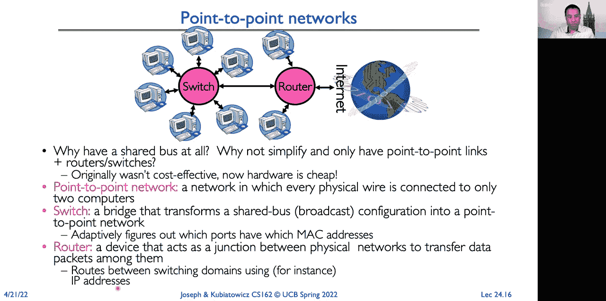
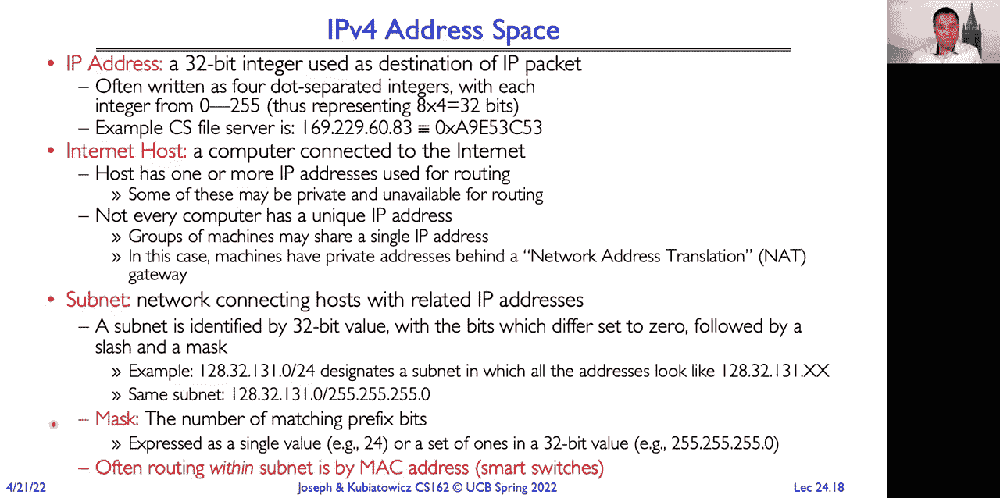
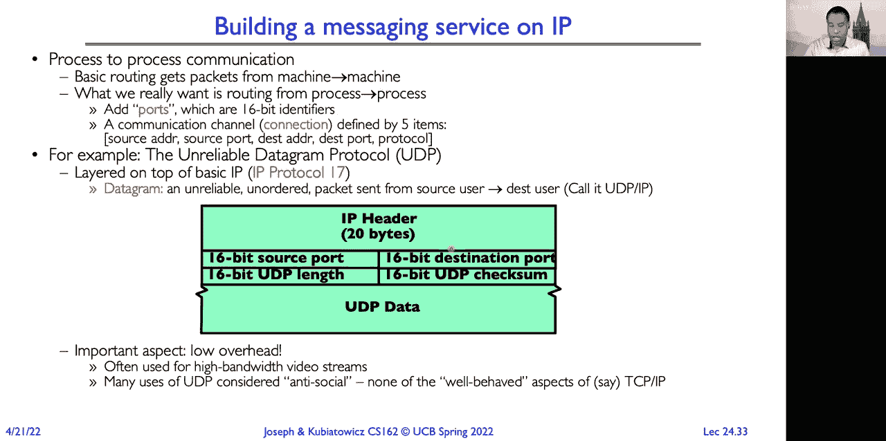
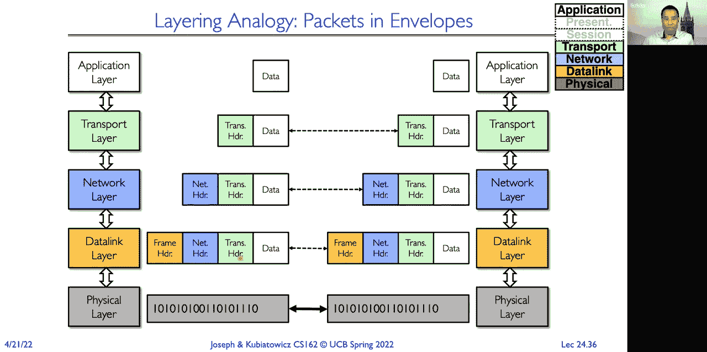
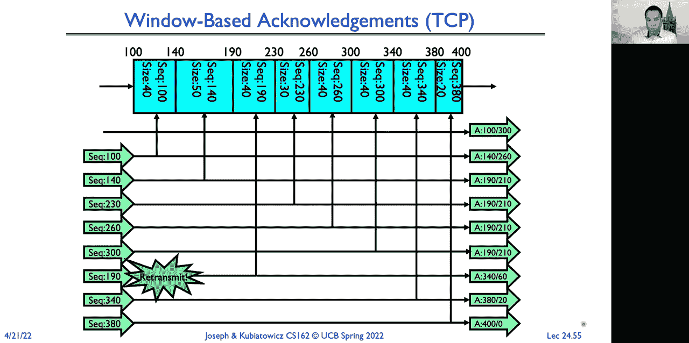

# P24：第24讲：网络与TCP/IP（续），RPC，分布式文件系统 - RubatoTheEmber - BV1L541117gr

好的，我们开始吧。

所以我们原本并不打算本学期再次远程授课，但现在我们又一次远程授课了，希望今天仅此一次。这是第24讲，我们有很多内容要讲。接下来我们将继续讨论分布式共识问题，然后将进入网络与TCP/IP的内容，如果时间允许的话。

我们将讨论远程过程调用（RPC）和分布式文件系统。所以如果你还记得上次，我们讨论了分布式共识问题。在那里，我们有一个共识问题。节点提出一个值，我们希望即使在其他节点崩溃或故障的情况下，仍然能够达成一致。

需要能够在所有节点之间达成一致决策，并确保所有节点的决策相同。举个例子，就是在选择真假之间，或者选择提交或中止之间做决定。现在非常重要的是，我们要确保我们的结果是持久的。

因此，我们将使用日志或其他形式的稳定存储，以确保一旦做出决策，它就能持久化。好的，另外，记得我们还讨论过两阶段提交协议，其中每个节点都有一个持久的稳定日志，节点在其中跟踪并记录提交是否已发生。这个过程有两个阶段。

这就是为什么它被称为两阶段提交，首先是准备阶段，在这个阶段，全球协调者要求所有参与者承诺提交，或者决定回滚事务。所以参与者每个人都记录下他们的决定，他们的承诺并在日志中确认这一点，随后将确认发送给协调者。如果有人投票决定中止。

然后，协调者将在其日志中写入中止，并告诉每个人中止并在他们的日志中记录中止。在提交阶段，如果每个人都同意准备提交，那么协调者会在其日志中写入提交。当它在日志中写入提交时。

这是当事务被认为已提交时。无论机器如何启动和停止，最终所有节点都会提交它们的事务。然后，它要求所有节点提交并在收到所有确认后进行确认。

它写入日志以提交。因此，日志在这里用于保证我们的决策得以持久化。它是一个提交决策，或者是一个中止事务的决策。接下来是一些讨论。那么，为什么分布式决策制定如此重要且可取呢？因为可能会发生故障。

我们需要容错能力。我们希望即使在某些机器出现故障的情况下，分组机器仍然能够达成一致决策。所以这个简单的故障模式被称为假设一个简单的故障模式，叫做停止故障（fail stop）。如果机器出现问题，它就会停止，崩溃。

它重启并恢复。我们会谈到其他模式，这些模式在失败时更具拜占庭特性。现在，做出决策后，我们会在多个地方记录，这再次确保在做出决策后，它会持久化。现在，一些人问，为什么 Too Faced 提交不受将军悖论的影响？

不是说它们在同一时刻做出相同的决定，而是它最终会达到相同的决策。它并不一定要求所有节点在同一时间做出相同的决定，它只是说它们最终都会做出相同的决策。

这是因为机器可能会失败并需要重启，所以我们希望确保最终我们能做出决定。好的，我接下来想谈谈的是，Too Faced 提交存在一个问题，实际上它在实践中可能很麻烦，这也是为什么 Too Faced 提交有时候不太容易使用。

这就是阻塞。因此，假设一台机器可能会被停滞，不能做任何有用的工作，直到另一个站点恢复。于是站点 B 写入“准备提交”并将其记录在日志中，然后向协调器发送“是”票，我们假设协调器是站点 A，然后它崩溃了。嗯。

最终它会恢复。在此期间，假设站点 A 也崩溃。那么现在站点 B 正在恢复，并检查它的日志，发现它已经投了“是”。于是它将向站点 A 发送消息，问：“发生了什么？”

这个事务是提交还是中止了？现在，在这个时候，站点 B 不能单方面决定：“我要中止。”对吧？因为它已经表示准备提交，并且该更新可能已经提交，这时它就必须履行它的提交承诺。所以它会被阻塞，直到站点 A 恢复并作出回应。

协调器恢复并询问：“事务发生了什么？” 这之所以成为问题，是因为阻塞的站点 B 持有资源，对吧？

所以它可能会持有已更新项目的锁。它可能会有一些页面在内存中被固定，并且在得知更新的结果之前，它无法释放任何这些资源。因此，如果全球协调器恢复需要几个小时，那么这些资源就会被占用，这可能会阻碍站点 B 的进展。好的，所以有一些替代方案可以取代两阶段提交。

有一种叫做三阶段提交（three phase commit）的替代方案，它增加了一个阶段。这就是为什么它被称为三阶段提交，它允许节点失败或阻塞，但我们仍然可以继续推进。现在，它是一个更加复杂的算法，而且在实际中并不广泛使用。Paxos 是一个分布式提交的算法。

它是由Google开发并使用的，并且没有两阶段提交的阻塞问题。它由莱斯利·兰波特开发。你可能还记得他，上一回我们提到过他。他是那个说分布式计算就是当一台机器崩溃，阻止我完成工作，而我不知道是哪台机器的人。所以，使用Paxos。

这里没有固定的领导者。你会临时选择一个领导者。因此，这使得处理故障变得更容易，但这是一个非常复杂的算法，所以它并不像我们希望的那样广泛使用。后来有一个替代方案被开发出来，叫做Raft，它由斯坦福大学的约翰·奥斯特哈特教授开发。

它的协议描述起来简单得多，因此有些人已经开始将Raft作为Paxos或两阶段提交的替代方案。现在，直到目前为止，我们假设发生的故障是因为正常的事情，比如宇宙射线、机器崩溃或硬件故障等。

当故障是由于节点恶意行为造成时，会发生什么？

恶意意味着一个节点试图破坏决策过程。所以如果大家都在说“是”，恶意节点可能会说“不是”。因此，我们需要使用更为强大的决策过程，比如拜占庭协议，我们稍后会讨论，或者使用区块链。不幸的是。

我们今天没有时间讨论区块链。因此，这里假设你有一个对手，基本上是在尽最大努力损害你的系统。所以，如果你只是处理正常故障，这也能有所帮助，因为有时系统会以非常奇怪的方式失败。它们开始表现得不一致。那么。

这在某种程度上看起来像是一个恶意行为者，但其实不是。这只是一个表现不正常的节点，正在执行错误的操作。拜占庭算法的一个优点是，它们能够很好地处理这些不正常的节点。好吧，现在我们遇到了一个不同的问题。

这就是拜占庭将军问题。所以，拜占庭将军问题中有n个参与者。我们有一个将军。这里是我们的将军，我们有n-1个副将。在这个例子中，我们有四个参与者，一个将军和三个副将。因此，这些参与者中有一部分可能是疯狂或恶意的。

这包括将军和副将。所以指挥将军会向他的n-1个副将发出命令，并且满足以下完整性约束：第一个是所有忠诚的副将必须遵守相同的命令；第二个是，如果指挥将军是忠诚的，那么所有忠诚的副将都必须遵守该命令。

他或她发送的消息。所以这里我们的忠诚将军给每个人发送了攻击命令。所有忠诚的中尉也向其他人发送了攻击命令。但这个恶意中尉在这里告诉这个中尉撤退，对吧？并告诉这个中尉撤退。好了，所以在这种情况下，我们希望决策是因为将军忠诚并下达攻击命令而进行攻击。

但这里的恶意中尉试图让分布式决策是撤退。所以我们可以区分恶意行动者和忠诚行动者，对吧？

因为这个中尉收到了两个攻击消息和一个撤退消息。这个忠诚的中尉收到了一个撤退消息和两个攻击消息。但并非总是如此。有些情况下是不可能的。所以特别地，如果我们只有三名玩家，那么我们无法解决拜占庭将军问题，对吧？

因为这里一个玩家可以把一切搞砸，对吧？

所以在这里，我们有一个忠诚的将军和一个忠诚的中尉，将军对所有人下达攻击命令。而这里有一个恶意的中尉，他们说撤退，对吧？

从这个中尉的角度来看，他们收到一个攻击命令，且听到一个撤退的传闻命令。右边是一个恶意的将军，指挥一个中尉，左边的那个说攻击，右边的说撤退，而这两个是忠诚的。

所以这个中尉会接受将军的攻击命令，同时也会听到撤退命令。这个忠诚的中尉会传递撤退命令。所以问题在于，我们无法从左边这个中尉的角度判断该跟随哪个命令，对吧？

因为在这里我们无法判断是将军忠诚，还是另一个中尉忠诚。所以在一般情况下，有F个故障时，我们需要N大于3F才能解决问题。如果你有问题，请在聊天中提问，这样最方便。

因为每个人都可以阅读它，它将被包含在记录中。好吧。解决这个问题有很多算法。原始算法需要的消息数量是N的指数级，更新的算法消息复杂度是N平方级别。有一个MIT使用的算法，

这些算法是由卡斯特罗和利斯科夫在1999年开发的。那么这里的问题是，如果将军是恶意的，我们应该执行什么命令，才能使问题正常工作？如果将军是恶意的，你基本上会采取相反的命令，对吧？

你将能够判断将军是恶意的，因为他们会告诉一些人攻击，告诉另一些人撤退。我们仍然希望达成一个所有正确玩家的一致意见。好吧。所以当我们有这些拜占庭容错算法时，

它允许多个机器做出协调的决策，即使其中一些机器是恶意的。所以它允许我们发出请求。我们希望这个群体做出决策，而这里有一些恶意的参与者，他们将获取请求中的信息。

并试图让决策朝着他们的方向进行，通过混淆其他参与者来污染决策，并向其他参与者发送混合信息。但只要恶意参与者少于三分之一，拜占庭容错算法仍然能够在其他所有参与者之间达成一致。好的。

在我们切换话题之前，有没有其他关于BFT的问题？再说一次，这种方法在恶意环境下非常有效。它也适用于那些节点不稳定且以奇异拜占庭方式故障的情况。好了，让我们换个话题，来谈谈网络协议。

所以我们在许多层次上都有网络协议。在物理层，有用于机械连接器和电气网络的协议，如何用波形表示0和1。在链路层，有数据包格式和错误控制。在网络层，我们有路由和寻址协议。

然后，在传输层，我们可能会有像可靠消息传递这样的东西。因此，如果我们看一下今天互联网中的协议，最常用的协议之一是在物理层，像以太网这样的协议。所以我正在用一台通过以太网连接的电脑进行Zoom会议。那台电脑还有一个Wi-Fi接口。

并且还可以通过那个接口进行通信。你还可以使用像LTE这样的蜂窝协议。在中间，我们再次看到沙漏形状的结构。我们有IP协议，作为狭窄的瓶颈。然后，我们有传输层协议，比如不可靠数据报协议和传输控制协议。在此之上，我们可以构建我们的应用程序。

我们可以有实现协议的库，比如远程过程调用等。那么，让我们从物理链路开始看起。我们有哪些类型的网络呢？最常见的网络类型是广播网络，在这种网络中，我们有一个共享的通信介质。现在，你打开了电脑，在这个共享介质中有一组电线。

这些协议连接所有的组件，包括处理器、I/O设备、内存等。因此在计算机内部，我们称之为总线。所有设备都同时连接到这条总线上，并能够进行通信。最初，以太网是一种广播网络，局域网中的所有计算机都彼此连接。现在，我们有了其他的例子。

比如说，无线介质是空气。当我们在教室里说话时，这就是通过一个通信介质进行的，这个广播介质就是空气。我们还有Wi-Fi，对吧？所以Wi-Fi也是一个广播介质。这就是为什么当你在咖啡馆时，人们会告诉你使用虚拟私人网络（VPN）。比如校园VPN。

因为你正在从你的计算机广播信息，而在咖啡馆里坐着的任何人实际上都可能接收到这些信息，可能知道你在做什么，并且可能获得敏感信息。还有其他广播网络，比如蜂窝网络，其中所有设备都通过共享介质——无线电频率来进行通信。

一些关于广播网络的细节。在大多数基于协议的常见网络中，比如以太网，有一个叫做媒体访问控制（MAC）地址的东西。它是硬件接口的48位物理地址。世界上的每个设备都有一个唯一的地址。

我说是“几乎唯一”是因为MAC地址的分配方式是，厂商会获得一个前缀。所以3com获得一个前缀，Netgear获得一个前缀，然后在他们的位空间中分配设备。由于制造商生产了大量设备，他们有时会重复使用MAC地址。所以它们应该是唯一的，但并不总是能保证唯一。

如果制造商回收了某些地址。那么，数据包的传输是怎样实现的呢？当你广播一个数据包时，接收者怎么知道它应该接收这个数据包呢？

因为这个数据包会传送给每个人。所以这实际上就像在一个房间里站起来开始讲话。房间里的人怎么知道你是在和他们说话，而不是只是在对整个房间说话？如果我们看一下网络中的节点，它们每一个都有一个MAC地址。这里的这个节点有MAC地址3，并正在发送数据包。

好的，我们确定目的地的方法是，我们将数据包加上一个头部。这个头部包含了目的地的MAC地址。所以现在当每个人接收到这个数据包时，ID为1的设备会忽略它，ID为4的设备也会忽略它。而ID为2的设备，它的目的地址匹配，便会接收这个数据包，并将其传递给操作系统。

将数据包传递给应用程序。现在非常重要的是，在以太网中，这个检查是在硬件中完成的。所以操作系统不会在每次广播数据包时被中断。它只会查看，哦，这个数据包是要发送给我的吗？说到这一点，你实际上可以禁用这个硬件检查，将你的适配器设置为某种模式。

这个模式叫做混杂模式，因为它现在会监听并接收每一个传输的数据包。所以再次强调，这就是为什么你在使用公共Wi-Fi时要确保使用VPN的原因，因为任何人都可以将他们的适配器设置为混杂模式。这样他们就能接收到所有的数据包。

这些数据是由该区域的人传输的，他们可以解码并看到人们在做什么。不幸的是，并非每个应用程序都会加密其敏感数据。因此，你可能会丢失密码、用户名和其他被盗的东西。好的。

因此，广播网络的一个替代方案是点对点网络。为什么要使用共享总线呢？

你可以简化事情，增加可用带宽。如果你有点对点链路，然后添加路由器和交换机。那么，为什么最初没有这么做呢？成本。过去，路由器和交换机的每端口成本非常高。现在，交换机的成本通常是几十美元，甚至更低。

所以每个端口的成本非常非常低。因此，点对点网络几乎是你在大多数环境中看到的网络类型。除了无线环境之外。所以，在点对点网络中，你会有一个网络，每一根物理线缆只连接两个计算机，或者是计算机和交换机，或者计算机与计算机之间。

还有一个路由器或交换机以及其他交换机，或者交换机和其他路由器，或者两个路由器。那么，交换机有什么区别呢？我在路由器中使用交换机这个术语。好吧，交换机是一种桥接设备，它将共享总线的广播配置转变为点对点网络。

它会自适应地找出每个端口上可用的MAC地址，只将流量路由到那些具有与头部中匹配的MAC地址的端口。因此，交换机实际上是在查看头部，并查看谁在发送数据，发送者的MAC地址是什么。

为该端口记录数据，并在查找表中查找以确定收件人MAC地址在头部的位置。路由器充当物理网络之间的连接点。所以，交换机和互联网之间就是通过路由器连接的。路由器不看MAC地址，而是使用IP地址。

所以它们在更高层次进行路由。那么问题是，交换机和路由器是不是也属于计算机，还是仅仅是特殊设备？答案是“是的”。通常，路由器是使用应用特定集成电路（ASIX）构建的。这是定制的逻辑。如果你看这些定制逻辑的内容。

很多时候，使用的是ARM核心，或者其他类型的计算单元。这些都是我们在微处理器中发现的类似设备。实际上也可以使用现代微处理器来进行路由和交换。如果你想在网络内部实现某些功能，完全可以这样做。

所以，违背端到端原则，你可以将功能推送到网络中，在通用计算机上实现。但一般来说，对于我们所追求的性能，比如100千兆、400千兆的链路，通常是使用ASIX来实现的。这是专用硬件。好的。

那么我们来看看互联网协议。

这是互联网的网络层。所以它是我们堆栈中的这个红色层。它提供的服务是尽力而为的数据包传递服务。对，它会尽力把数据包传递到目的地。但是，这意味着数据包可能会丢失，可能会被破坏，可能会乱序到达。

我喜欢把数据包想象成明信片，你知道的，你去度假时，你会，嗯，去不同的地方旅行时，我们会给一堆朋友寄明信片。我们可能会从不同的地方寄三四张明信片。而每次你回家后发现，哎，原来它们不是按顺序到达的，这总是让人觉得很有趣。

这些明信片是按什么顺序到达的呢？它们是按照我们发送的顺序到达的吗？

那么这些信息包到达了吗？你知道，很多时候它们没有到达，或者，有些丢失，或者它们的到达顺序错乱。嗯，这就像互联网一样，对吧？

没有保证数据包不会丢失，不会被破坏，或者它们可能会乱序到达。所以，总结一下，交换机和路由器之间的区别是什么？再次强调，交换机操作在局域网内，路由器连接局域网到更广泛的网络。所以交换机是根据MAC地址工作的。

路由器操作在IP地址上。好的，你可以把IP看作是一种数据报服务。我们正在跨越许多物理交换域或子网进行路由，因此局域网。所以这些局域网，换句话说，子网，那些是交换机。路由器在这里的网络层工作，用来互联这些子网。

我们把IP地址分成，你可以把它看作是一个32位的命名空间。然后它被划分为四个八位组或四个字节。因此，我们通常会将它们写成四个字节之间用点号分隔的形式。所以这里我们有169.229.6.83。那恰好是其中一个计算机科学文件服务器的IP地址，一个部门文件服务器的IP地址。

一个互联网主机，就是连接到互联网的计算机。那这意味着什么呢？

嗯，那可以是任何东西，比如，我们有智能温控器，这些温控器有一个IP地址。它们连接到互联网。你的手机有一个IP地址。它连接到互联网。你的平板电脑、你的电脑，所有这些设备都有一个或多个IP地址，它们用于路由。所以比如说。

在你的手机上，你有一个分配给LTE或5G网络的IP地址。当你连接WiFi时，你也会有一个WiFi网络的IP地址。所以，你的手机同时拥有两个IP地址。现在，其中一些可能是私有的，不能用于路由。所以，你在家时获得的IP地址就是一个例子。

是一个私有网络地址，无法直接路由到它，并不是每台计算机都有一个唯一的 IP 地址。所以当你在家时，你的电缆调制解调器或光纤调制解调器有一个 IP 地址，然后你的本地子网是一个私有子网。你的电缆调制解调器使用网络地址转换。

将来自网络外部的请求转换为网络内部主机的请求，反之亦然。所以你家里的设备或者机器，都有相同的公共 IP 地址，并且它们有一个内部私有 IP 地址。子网是一个连接有相关 IP 地址的主机的网络。它由一个 32 位的值来标识。

和一个前缀位数。所以它会是一个斜杠后跟掩码。例如，128.32.131.0/24 表示所有与前 24 位匹配的地址都会匹配。所以这个子网就是 128.32.131.任意，最后的 XX 会在 0 到 255 之间。

这个掩码实际上只是匹配位数的数量。所以 24 表示前 3 个字节，或者前 3 个八位组。但它不一定是以 8 为单位的，可以是任何值。可以是 22，也可以是 31，这取决于情况。然后，通常在子网内的路由是通过 MAC 地址来完成的。所以在子网内，交换机会看到所有的主机。

在相同子网上的设备之间，然后只使用它的 MAC 地址来路由数据包。好的。那么当外部有人向私有网络中的一台计算机发送请求时，路由器如何知道将请求发送到哪台计算机呢？这将取决于计算机。

它发出了到该服务器的出站请求。当发生这种情况时，网络地址转换（NAT）会记录出站请求，然后将其与入站响应或入站请求进行匹配。还有像通用即插即用协议（UPnP）这样的协议，网络中的主机可以告诉路由器，为我在特定端口上建立连接。

让我的主机能够访问公共 IP。所以，举个例子，像游戏主机和电话适配器这样的设备，采用这种方法，告诉路由器为它们开放端口。这样，你就能完成反向映射。所以问题是，我们家里的 Wi-Fi 路由器，实际上是交换机和路由器的结合体，负责处理公共网络。

和私有数据传输。绝对是这样的。这就是为什么你在路由器的背面通常会看到四个端口，对吧？一个是上行端口，可能连接到另一个路由器，其他端口是内部端口，你可以将设备插入这些端口，连接将在这些设备之间进行路由或交换。

然后它在内部子网和外部子网之间执行路由功能。比如192子网和外部子网，即你服务提供商的广域网子网。所以有人会说，我猜Nat会保持一个翻译表，这个表将实际端口与目标端口绑定，对吗？是的。所以Nat确实保持一个表。

它执行的是内部端口和外部端口之间的映射。我们稍后会谈到端口，特别是在讨论UDP时。好的。如果我们看一下IPv4数据包的格式。

我不会一一讲解所有字段，但一些重要字段包括：版本，有版本四；大小，这是我的头部加数据；目的地IP地址，同样是32位地址；源地址，同样是32位地址；还有校验和类型的传输协议。

以及一堆其他重要的选项、标志和功能。并非所有设备都支持所有功能。不过，确实有一组核心功能是必须的。IP数据报的功能再次类似于明信片。它是不可靠的，无序的，可能会损坏。

从源到目的地发送的数据包。

网络的功能简单来说就是传送数据报。现在，我们已经开始谈论这个话题了，但在互联网中的两个主机之间是广域网。你可以把广域网看作是覆盖大范围区域的网络。所以它可能是一个城市，可能是一个县，或者是一个州。

一个国家，也可以是一个整个星球，对吧？互联网是一个广域网。广域网连接多个物理数据链路网络。因此，多个子网或局域网通过广域网连接。数据链路网络本身通过路由器连接，对吧？

因此，不同的局域网可能使用完全不同的技术。所以你可能有一个局域网使用Wi-Fi，另一个局域网使用以太网，另一个局域网使用LTE，或激光，或者任何其他不同的技术。路由器将这些不同的局域网互联起来。

好的，所以路由器的作用是将每个接收到的数据包从进入链路转发到适当的出去链路。并且这个出去链路会更接近目的地。它将基于数据包的目的地IP地址。所以，这是再次强调的内容。

与根据MAC地址传递数据包的交换机不同，媒体访问控制地址，路由器在网络层工作。并根据IP地址进行路由。路由器操作时是逐个转发数据包，因此数据包会被缓冲，然后再转发。而且有一个转发表。

这就是 IP 地址与输出链路之间的映射。所以在这里，我们可以看到路由器内部的情况。我们有传入链路和通过这些链路传入的数据包。所以你可以看到这里有一堆蓝色数据包正在传入。它们被缓存在内存中。

然后路由到适当的输出链路。所以在这里你可以看到，绿色和红色数据包之间有一些解复用。绿色的数据包最终通过这个链路出去。红色的数据包最终通过那个链路出去。你可以看到，这里有黑色数据包和红色数据包的复用。

它们都通过这个输出链路发送出去。所以我们使用缓冲区，因为可能会有比输出链路容量更多的流量进入。 这些缓冲区是固定大小的。所以如果进来的数据包太多，黑色和红色的数据包太多，超过了该链路的容量。

如果我们没有足够的内存来缓存这些数据包，我们就会丢弃这些数据包。再次提醒，IP 是尽力而为的。如果路由器内存空间不足，数据包就会被丢弃。由上层协议来处理那些丢失的数据包。好了，数据包转发。这里有一个示例，展示了 IP 数据包从主机 A 到主机 B 的过程。当路由器接收到一个数据包时。

它将会筛选数据包的 IP 目标地址。查看其转发表来确定输出端口。然后将数据包转发到相应的输出端口。现在我们为没有明确条目的子网添加默认路由。基本上就是这样。

你可以将这看作是把问题交给别人来处理。希望是一个更有权威的路由器，它知道如何到达那个位置。所以你的有线调制解调器，它只知道，它有一个默认路由，就是将数据包发送到有线电视公司，而那个有线电视公司路由器会处理发送到哪里。

这样你就不需要有一个可以到达世界上每个网络的有线调制解调器。它只需要知道有另一个更有权威的路由器，它知道如何到达那个网络。好的，我一直在讲 IP 地址，也讲了 MAC 地址。

这可能会让人感到很困惑，因为我们在谈论的是在不同层次上运行的东西。所以这里有一个例子，帮助你理解它们之间的区别。这里有约翰·多伊。约翰·多伊有一个社会安全号码，他住在华盛顿 D.C.，但是约翰·多伊收到了一封来自伯克利的录取信，于是他去了伯克利上学。

迁移到伯克利。好的，现在约翰有了伯克利的地址，但他的社会安全号码依然保持不变。那么，为什么我们不使用 MAC 地址进行路由呢？因为这样无法扩展。我们怎么知道约翰的社会安全号码，0，0，0，0，0，0，0，位于哪里呢？

我们需要一个表格，告诉我们每个社会安全号码的位置。所以这里的类比是，MAC 地址就像社会安全号码，而 IP 地址就像家庭地址。问题是，MAC 地址是唯一地与设备在其生命周期内相关联的。

所以你的笔记本电脑无线网卡的 MAC 地址是永久的。它是在工厂分配的，且不会改变。而你拥有的 IP 地址在一天中会发生变化。当你在家时，你会有一个 IP 地址，也就是你宽带或光纤调制解调器的公共 IP 地址。

当你在校园内时，随着你从一栋楼移动到另一栋楼，从边缘网络到教室网络再到边缘网络，IP 地址可能会发生变化。而 MAC 地址是永远不变的。好的，那为什么使用 IP 地址的包转发能够扩展呢？

因为 IP 地址是聚合的。所以你不是随机分配一个 IP 地址，而是它们属于某个组织。所以在 UC 伯克利，所有的 IP 地址的前两个字节都是 A9 和 E5。所以任何形式为 A9，E5，某某某的地址都属于伯克利。所以纽约的路由器只需要一个条目。

路由到伯克利的所有主机。如果我们改用 MAC 地址，那么纽约的路由器就必须为我们校园内可能在任何时刻激活的 70,000 台设备维护路由表条目，这样就无法扩展。所以问题是，世界上的每个路由器都知道这个地址属于伯克利吗？

还是只有一些顶级节点知道？这取决于对吧？根据 ISP 的规模，他们可能不知道如何到达伯克利，在这种情况下，他们会将数据包转发给他们的互联网服务提供商，后者会将数据包转发给其他人。最终，你会到达一个权威路由器。

并且可以进行路由。另一方面，如果你在像 Comcast 或 AT&T 等主要提供商处，他们会有所有的路由表，来到达互联网上的所有主要组织。所以这里的类比是，把这封信交给一个有特定社会安全号码的人，对吧？这是一个相当棘手的问题。

跟踪这个人。另一方面，如果我说，把它交给约翰·史密斯，他住在美国加利福尼亚州洛杉矶市的 123 第一街，这个地址非常容易路由到。好的，一些行政事项。我们下周有期中考试，时间是晚上 7 点到 9 点。考试内容涵盖所有课程材料，重点是

优先考虑从上次期中考试到现在的材料，或者从上次期中考试到现在的材料。接下来我们将在下周一，25号下午 1 点到 3 点，举行复习课。好的，回到路由和命名。所以我们需要将人类可读的名称转化为 IP 地址。我不想记住 www.berkeley.edu 这样的地址。

由IP地址128.32.139.48表示的主机。我可能记不住这些数字，或者在手机键盘上输入这些数字。所以有时候，名称也可以映射到许多不同的主机。例如，www.google.com在世界各地会映射到数以十万计的不同主机。

这些不同服务器的负载问题。所以我们需要一种从人类可读的名称到IP地址的映射方式。这里有一个问题，是否有一门课程是关于网络的？是的，本科课程是CS 168，研究生课程是CS 268。我们将对网络进行一个非常基础的讨论。

在这门课程中，由于时间有限，我们只能覆盖有限的内容。但由于网络对于分布式系统和一般系统都非常重要，我们会让你对网络如何工作有一个基本的了解。但如果你真的想理解更多细节，并构建使用网络的应用程序……

可以选择修读CS 168。好了，再说一遍，IP地址很难记住，IP地址会变化。如果服务器崩溃并被另一个服务器替代，我不希望人们记住www.berkeley.edu是12832，13948。对吧。所以我们使用的机制叫做DNS，即域名系统。

域名系统是一种分层机制，用于命名。名称被分为不同的域，从右到左排列。顶级域名是……缺少的部分是其实有一个点，顶级域名就是这个点。然后是edu，再然后是Berkeley.edu。最后是eks.berkeley.edu。

然后我们要找的是主机。每个域名都由特定的组织拥有。顶级域名由ICANN（互联网名称与数字地址分配机构）管理。所以他们是分配顶级域名的机构。几年前，当……

他们创建了大量的新域名，并且这些域名是由ICANN分配的。每一个后续层级的域名都由特定的组织拥有。所以有一个组织管理.com域名，另一个管理.edu域名，另一个管理.dot域名，还有mil，gov，org等等。

所以每个组织将这些域名分配给更低级别的组织。对于美国的学术组织，他们可以获得一个.edu域名。例如MIT.edu。如果你想知道www.mit.edu对应的地址，你需要访问MIT.edu服务器，这由MIT管理。我们这边也是类似的，我们需要找到eks，这是一个Web服务器。

我们将访问校园，伯克利校园的域名服务器。它会告诉我们，“哦，去访问eks”。Eks部门恰好是校园中一个运行自己DNS的部门。因此，你会访问eks.berkeley.edu的DNS，它会告诉你，“哦，这个主机是www，映射到123到139.48”。这需要一些时间。

解释这个过程花了很多时间。如果每次你想查找www.eks.berkeley.edu时，都必须从顶级域名服务器一直查找到树的最底端，找到目标主机，那会花费很多时间。如果你考虑到每天有数十亿设备在查找主机名，这样的请求会给顶级服务器带来巨大的负载。所以我们使用缓存来优化这个过程。

因此，客户端会缓存结果。通常情况下，缓存时间从几个小时到几周不等。这是一个权衡，如果缓存时间太长，如果某个名字发生了变化，映射也发生了变化，那么就会出现问题，因为你可能无法访问该主机。如果缓存时间太短，负载则会增加，因为你会不断向DNS服务器请求。

因此，这在容错性和负载均衡之间是一种权衡。

好的，那么正确的分辨率有多重要呢？嗯，实际上，有些人一直在尝试攻击DNS。因为这样他们就可以让，比如说，Wells Fargo.com解析到他们的服务器，创建一个看起来完全一样的服务器。这样，你本以为是连接到自己的银行，实际上却并没有，结果你可能会泄露你的用户名和密码。

所以很多钓鱼攻击常常与DNS篡改类型的攻击协同工作。因为DNS本身并不安全，存在许多漏洞和替换攻击可以用来攻击DNS。这些事情以前就发生过，2008年DNS发现了一个重大漏洞，这个漏洞如此严重，以至于他们不得不紧急修补。

他们广泛地说DNS已经被破解，但实际上并没有明确指出具体的漏洞，因为他们不想泄露太多信息，避免攻击者在其他人修补系统之前就开始利用这个漏洞。现在也有其他协议，比如安全DNS协议。

但是实际实现这些防护措施需要大量工作，而且人们在这些安全DNS协议中也发现了漏洞。所以这依然是一个挑战，绝对是一个薄弱环节。好的，层叠架构就是通过构建复杂的服务器服务，逐步从简单的服务发展而来的。

每一层提供了高层所需的服务。它通过利用低层提供的服务来实现这一点。它增加了一个方向层。因此，如果我们看看物理链路层，事情真的非常有限。对吧，数据包的大小是非常有限的，最大传输单元。

它的大小可以从200字节，如果我们处理的是类似电话网络上的拨号连接，到1500字节或800字节，取决于特定的网络，如以太网，路由通常局限于物理链路内，或者可能通过特定的交换机。因此，我们在这里的目标是利用我们在这门课程中学到的抽象，将混乱的物理现实转化为更理想的抽象。如果你看看现实情况，数据包有大小限制，即最大传输单元（MTU）。

它们是无序的，有时可能不可靠，如果你知道的话，可能是因为无线链路存在丢包情况。它们是机器对机器的，只在局域网内操作。它们是异步的，我们永远不知道它们何时到达或被发送，而且它们是不安全的。对吧。我们想要的抽象是安全可靠的消息传递。对吧。

所以大小是任意的，从进程到进程的有序可靠传输。是从应用程序到应用程序的，而不仅仅是从一台机器到另一台机器，从一个操作系统到另一个操作系统。可以在全球范围内路由，按顺序交付，并且能够防止篡改，甚至可能经过身份验证，确认是谁发送的。

好的，再次记住我们的数据包格式，我们将查看不同类型的传输协议。

所以我们要在IP之上构建一个消息服务，我们想要进程到进程的通信。如果你想想IP为我们提供的是什么，其实就像是收到了一张送达地址的明信片，明信片上没有名字。所以假设你知道，某个地址有五六个人住，有一张明信片到达了这个地址。

它来自哪里？有发送地址，也有目标地址。传输层告诉我们谁是接收应用程序的那个人。所以我们想要从进程到进程的路由，因此我们要做的是添加端口。一个16位的目标端口，一个16位的源端口。这将告诉我们通信通道是什么。

我们将通过所谓的五元组来定义两个应用之间的通信通道，这个五元组由源IP地址、源端口、目标IP地址、目标端口和协议组成。所以在这种情况下。

这是用户数据，不可靠的数据报协议。所以这定义了这个连接的五个要素。通过不可靠的数据报协议，我们有数据报。从源到目标用户发送的不可靠数据包。

这里的一个重要方面是，它的开销相对较低，因此在 IP 头（20 字节）之上，我们将添加一些字节来表示端口、长度、校验和和端口。现在事情变得有些复杂。但如果我们回到 IP 的示意图，右边有一个 16 位的头部校验和，它覆盖了这个 IP 头。

现在我们又添加了一个 16 位的 UDP 校验和，它将覆盖我们的数据。好的，这种数据报通常用于那些我们希望不可靠传输的情况，但它可能是高带宽的。例如，视频连接。通常，视频和音频都会通过 UDP 发送，因为它更重要的是按时送达。

它可能不可靠，因此可能会丢包或出现一些空白。所以，屏幕共享通常是较不同步的，因此这类信息通常会通过 TCP 发送，因为你希望能够看到清晰的图像，以便能阅读上面的所有文字。

所以 Zoom 实际上给了你一个选项，选择是否通过 UDP 进行屏幕共享，或者通过 TCP 进行。UDP 允许你以一种爆发式的方式进行高带宽通信。因此，它并不是很“社交”，对其他可能同时使用同一网络的应用程序不太友好。

UDP 会根据发送方的发送速率直接发送数据。我们会按照这个速率将数据推送通过网络，所以发送方控制着如何使用网络，忽略网络中的其他用户。另一方面，TCP 会尝试在网络拥堵时变得更加“社交”和“守规矩”。

好的，互联网架构实际上有五个层次，从应用层、传输层、网络层、数据链路层到物理层。最低的三层我们在各处都实现。对，物理层连接主机和路由器，以及其他路由器。数据链路层连接主机和路由器，以及其他路由器交换机。

网络层再次用于主机和路由器，通常不在交换机上使用。因此，交换机可能只实现了最低的两层，而应用层和传输层仅在主机上实现。所以，当我们建立连接时，套接字就会在这里实现。我们将一直向下走，直到堆栈的最底层，再向上返回。

从头到尾再到一端，然后一直回到上面直到交付。所以，在大多数情况下，这就是事情的运作方式。人们有时会打破端到端原则，并在路由器中实现功能。例如，内容的网络缓存。那将是有效地在网络中运行的应用程序，而不是端到端运行的。

这样做是为了权衡，原则上我们应该只在最后一步执行这个操作。但在网络中我们有时会这么做，因为这样做能带来效率、带宽和延迟的好处。好的。所以，我们可以把分层看作是把数据包放进信封。一个应用程序有一些数据，想要从一个应用程序发送到另一个应用程序。

所以，它将把应用程序中的数据放入一个传输层的信封中，添加一个传输头部，这个头部由传输层使用。传输层会把数据放入另一个信封中。对，像是你收到一个人的信件，然后你把它放进一个更大的信封里，寄给另一个人。对，这样它就会添加一个网络头部。

然后网络层将这些信封放入另一个信封中，添加我们在数据链路层所需的帧头部，然后我们将其编码为物理层所需的“0”和“1”。所以，再次强调，这就是为什么分层有巨大好处，但你也可以看到，这并不是一个你能轻松缩放的场景，假设我们试图发送的数据量很小。

我们在相对较少的数据上添加了大量的头部信息。所以我们在物理层能够获得的效率可能会受到很大限制，尤其是当我们发送的大部分是头部而非数据时。

好的。所以数据报服务基本上是最简化的、扩展了的尽力而为IP，相比发送数据包，我们现在可以发送更长的数据包。它们比我们在最低数据链路层可能遇到的最大传输单元（MTU）要大，并且它能够处理这些数据包到端点进程的复用和解复用。所以我们能够在两个进程之间发送这些较长的消息。

TCP（传输控制协议）为我们提供了可靠的有序传输。所以它为我们提供了连接的建立与拆除，处理可能被损坏的包、可能丢失的包、流量控制、拥塞控制，避免我们超载接收端。

这样我们就不会超载网络。关于数据链路层和物理层之间有什么区别，物理层是“0”和“1”。数据链路层则是我们用来访问媒体的协议。所以，当我们发声时。

我们的物理层是我们的声带，制造音素，而我们的耳朵则是接收这些音素。数据链路层的等效操作可能是举手提问，或者其他让我们在人与人之间进行媒体接入控制的方式。

你知道，像说出你的名字，这样你就知道我在群体中是在跟你说话，而不是只是广播一些内容。好的，其他一些没有人实际使用但有标准的互联网传输协议包括数据报拥塞控制协议。

可靠数据协议和流控制传输协议。但是这些协议并没有被使用。好的，记住套接字是如何工作的，作为一个概念，我们在服务器端创建了一个服务器套接字，并将其绑定到一个地址。现在你知道了那个主机的IP地址和端口是从哪里来的。我们监听连接，然后在客户端也创建了一个套接字，并将其连接到我们绑定到的服务器套接字的主机和端口时，我们会使用调用来接受连接。

然后这就创建了一个连接套接字。它允许我们写入请求，读取这些请求，写入响应，读取这些响应。好的，当我们谈论可靠消息传递时，我们是在讨论如何让这个连接正常工作，即套接字连接。好的，那么问题是，我们刚才讲过它们，物理网络，它们可能会出现乱码。

它们可以在物理层丢弃或丢失数据包，数据包可能无法传输或接收。如果我们以最大速率进行传输，我们会得到更多的吞吐量，但可能会有更多的错误。因此，错误率更高，一些数据包可能会被损坏或丢失。而我们以每比特最佳功率进行传输。在一个非常低的功率水平下。嗯，你知道的。

错误校正，你知道，可能能够纠正一些错误。如果我们有一个包含错误校正的物理编码，可能无法纠正所有错误。因此，依然会有一些乱码或丢包的情况。所以，这意味着我们可能没有地方接收一个传入的数据包。

对，想想你的手机，它的处理器相对较弱，相较于可能以非常高的速率发送数据的Web服务器。如果它以更高的速率发送数据，你的手机的操作系统中的缓冲空间就不够了，因此它会丢弃数据包。所以，我们会有一个网络，你可能在交换机和路由器上有不足的队列空间，广播链路。

你可能有两个主机同时尝试使用链路，即两个主机同时发送数据。接收方会听到这个信号的叠加，而无法区分它们。再次强调，任何网络中如果缓冲区空间不足，而发送方的发送速度快于接收方的处理速度，就会出现这个问题。所以我们希望在这些不可靠的数据包——这些IP数据包之上构建可靠的消息传递。

所以我们需要某种方式来确保数据包确实能够到达接收方，并且我们希望每个数据包只接收一次。因此，每个数据包至少接收一次，且最多接收一次。如果我们想要结合顺序，并说得更强一些，每个数据包由目标的进程接收，且**只接收一次**，并且按顺序接收。那么，传输控制协议（TCP）就提供了这种方式。

所以我们有一个字节流要发送出去。它们通过路由器、交换机、更多的交换机、更多的路由器和交换机，到达目的地进程时，我们得到一个字节流。所以这是一个在不同机器上的两个进程之间通过互联网传输的可靠字节流。我们可以进行读、写和刷新，就像对文件或本地IPC进行操作一样。所以一些细节。

TCP必须将这个字节流分段成IP数据包，然后交给IP，IP可能会再次将其拆分成更多的数据包，基于最大传输单元进行分片。它使用基于窗口的确认协议，这是最小化我们需要在发送方和接收方维护的状态的方式。窗口反映了接收方有多少存储空间。

因为我们不希望发送方超出接收方的缓冲区空间。但是窗口窗口也必须反映网络的速度和容量。我们不想让网络过载。同时，光速是有限的。因此，我们注入网络的流量需要时间才能真正到达发送方。

因此，我们要确保不会超载发送方。它会自动重新传输任何丢失或损坏的数据包。并且它试图调整其传输速率，成为一个好的网络公民。所以与UDP不同，如果我只是开始在UDP中发送数据包，我可以按我想要的速率发送。

网络，您知道，可能会轻易过载，其他客户端可能会看到它们的流量受到我的UDP流的影响。TCP试图弄清楚还有谁在传输数据，什么是可用的容量，并调整自身以适应这个可用容量。因此，它试图成为一个好的网络公民。好的，我们来看一下丢包问题。

所有物理网络都可能发生干扰，丢包，对吧？这可能是硬件问题。因此，IP由于基于这些物理链路，也可能发生干扰或丢包，并且不会进行修复。对吧？所以IP并不会尝试修复。IP唯一做的事情就是它的头部查看校验。它的头部校验和仅查看头部的校验和。对吧。

如果数据被损坏，您知道，我们会丢弃这个数据包，因为我们无法路由它。但如果没有损坏，数据包可能会受损，应用程序需要判断如何处理它。这是端到端原则。而且，再次强调。

这很重要，因为我们希望使用像UDP这样的协议，因为有时我们愿意接受损坏或腐败的包裹，并仍然尝试解码它们。你可以使用，例如，能处理损坏的音频编解码器，或者使用能处理损坏的视音频编解码器。这样你仍然能看到一些内容。

它可能是一个损坏的帧，或者你听到的内容有点混乱，但是你收到了它，而不是简单地让它消失，错过了所有的上下文、内容和信息。好的，因此我们需要可靠的消息传递，确保包裹是完整的，它们的完整性得以保存，并且确保它们只会到达一次。

我们可以通过使用确认来实现这一点。对的，我们会有校验和，用来检测当我们从A发送包裹到B时，包裹是否被损坏。如果被损坏，我们就丢弃它。如果没问题，我们就会发送确认回去，告诉发送方我们正确地接收了这个包裹。

现在，如果我们发送的包裹被损坏，或者网络丢失了它，那么就会发生超时，因此A会启动一个计时器。当你发送一个包裹时，启动计时器，这个计时器在运行。如果在超时窗口内没有收到确认，则会简单地重新发送包裹，并重新启动计时器，等待确认。

所以，当我说这些时，应该有一些问题出现在你脑海中。第一个问题是，发送方如果没有收到确认，是否意味着接收方没有收到原始消息？这可能是对的，但不一定是对的。它也可能是错误的，因为确认本身就是一个不可靠发送的包裹。

所以包裹可能会丢失，对吧？这有点像我给你寄了一张明信片，然后你也给我寄回了一张明信片，而邮局把明信片当做最低优先级，卡在了机器里，或者你知道的，丢失在了运输员的包里。所以那个确认，它是回传的数据报，可能就这样丢失了。

或者可能是因为包裹被延迟了。因此我确实发送了确认，但这个确认是在超时期后才到达的。这样你已经开始了，通过重新发送包裹。然后发送方没有收到确认，它只是简单地重新发送。接着接收方会收到两次消息，并确认了每一次。

好的，让我们看看可以使用的一个协议。这个协议叫做停止等待协议。我们首先在没有包裹丢失的情况下来看这个协议。我们发送一个包裹，然后等待确认。好的，然后重复这个过程。我们发送包裹1，接收到包裹1的确认。

所以我们发送数据包的时间，它到达接收方，并且我们收到回应的时间被称为往返时延。这是数据包从发送方到接收方再返回所需的时间。对吧？现在，单程延迟，如果你考虑的话，就是D。对。

所以这就是从发送方到接收方的延迟。如果它是对称的，也就是我们拥有的链接在延迟方面是对称的，那么往返时延将是单程延迟的两倍。对吧？所以现在我们发送第二个数据包。对，然后我们得到第二个确认回来。好的。然后我们可以发送第三个数据包。我们会收到第三个确认。对吧？所以现在。

我们用这种方式能多快地发送数据呢？嗯，想一想，我们可以使用一个叫做小定律的法则，它可以应用于网络。它表示n等于B乘以往返时延。所以对于停止等待协议，我们只有一个数据包在传输中。对，我们发送一个数据包，等待一个往返时延的响应。

然后我们发送下一个数据包。所以我们的带宽将是每个数据包的往返时延。这意味着我们的带宽取决于延迟，而不是网络的容量。对吧？想象一下，我们有一条10千兆比特的连接，连接伯克利和巴黎。对吧？这非常高的延迟。那可能是，嗯，几百毫秒。

我们不能在伯克利和巴黎之间那条10千兆比特链接的容量范围内发送数据。好的。假设作为一个例子，我们的往返时延是100毫秒，而一个数据包的大小是1500字节。那么我们的吞吐量，网络带宽将是1500除以0.1，也就是120千比特每秒。

所以再说一遍，如果我们有100兆比特每秒的链接，但我们只使用了120千比特每秒的容量。那么我们只用了这条链接容量的极小一部分。所以，丢包恢复在这里依赖于超时机制。好的，所以我们有了往返时延，我们将往返时延再加上一些东西来计算超时时间。

你知道，也许这里是50%。也就是1.5倍的往返时延。因此，如果我们没有收到确认，无论是因为数据包没有成功传输，还是确认没有传回，我们都会超时并重新传输数据包。那么我们如何选择一个合适的超时时间值呢？

嗯，太短了，不对。如果我们设定的超时时间仅仅是稍微超过往返时延，或者可能正好是往返时延的话。嗯，实际上会有一点波动，因为网络中可能存在其他的拥塞和流量，这会导致我们超过往返时延，从而触发超时。

我们的平均往返时间和超时。然后我们会进行大量的重传。对，这会导致大量的重复发送。我们说过，超时时间设得太长会怎样。假设我们把它设置得非常长，你看，这样一来在发生数据包丢失时就会出现很多干扰。对。

因为我们会花很长时间才意识到数据包丢失，并且实际进行重传。那么，如何处理超时时间设置得太短的问题呢？这样我们就会在收到确认之前重新发送数据包，所以我们会重复发送数据包一。或者就像在这种情况下，确认消息丢失。

但实际上数据包已经正确接收。所以，传输意味着这种情况可能会发生。因此，我们可以使用的一个特定方法就是在消息中简单地添加序列号来标识我们发送的包。对，接收方只需要检查是否有重复的序列号，若收到重复的消息，它将简单地丢弃该消息。对，因此这里的要求是发送方保留任何尚未确认的消息副本。

对，这很简单，你只需要缓存那些消息，并且在收到确认之前保持缓存。接收方则跟踪可能的重复消息。因此，这有点复杂。对，因为什么时候忘记一个已接收的消息是可以的呢，什么时候可以忘记我实际上已经接收到某条特定的消息？

好的，这是一个交替位协议，你发送一个消息，逐个发送，直到收到确认才发送下一个消息。对，发送方只需跟踪最后一条消息，接收方只需简单地跟踪最后一条接收到的消息的序列号，然后将其返回并置为零。

你确认零，发送数据包一，你确认一，发送数据包零，你确认零。这有一个优点，这个方法简单，而且开销低，我们只需要跟踪一个序列号。缺点是，如果网络可能任意延迟消息或任意重复消息时，就会出现问题。

那么我们可能会收到这个数据包零，但它实际上是数据包零，因此我们无法判断这是一个新的数据包零，还是这个数据包零的重复，或者如果我们没有收到数据包零却看到了数据包一，情况就是这样。你可以看到。

可能会有多种情况，导致我们无法判断是收到了一条新消息，还是收到了一条旧消息的重复。因此，如果我们拥有更大的确认空间，脱离停止等待协议会有很多优点。

那么我们可以进行流水线处理。对的，所以我们可以发送多个消息。在等待确认消息到来时。对，确认消息有双重作用。一是确认数据包已被接收。二是提供排序信息，因为数据包可能在目的地被重新排序。

所以我们可能会先收到数据包 1，而不是先收到数据包 0。我们可能会先收到确认消息 1，而不是先收到确认消息 0。但如果我们有足够大的序列号空间，那么我们就可以区分重复的消息和顺序错乱的消息。

我们可以在接收方重新排序这些数据包，避免从发送方重新传输它们。那么我们能在传输中的数据量是多少呢？回到小法则，对的。我们的发送窗口将是往返时间乘以每秒字节数。所以，发送方的窗口大小告诉我们传输中的数据包数量。

对，所以正在传输的数据包数量将是窗口大小除以数据包的大小。那么发送方需要保留这些数据包多长时间？对的，发送方需要多少缓冲区空间，这是我们可以提出的一个问题。另一个问题是接收方需要将数据包数据保留多长时间，以告知发送方：“是的，你知道的，如果发送方重新发送，实际上我已经收到了。”对的。

那如果发送方的发送速度比接收方处理数据的速度快呢？对的。如果这导致接收方溢出，并且接收方在这里大致没有了缓冲区空间，那么所有这些已发送的数据包就有点白费了。因为它们将不得不被重新发送，因为接收方已经丢弃了这些数据包。

所以，记住当我们在进程之间进行通信时，我们会有这个内存队列。对的。所以你作为生产者会写入队列，而消费者进程 B 在这里从队列中读取。并且这个队列有固定的容量。如果进程 A 超过了队列的容量，那么我们就会阻塞它。对的。同样地，如果消费者进程 B 试图从队列中读取数据，而队列是空的。

它会等待，它会阻塞。对，所以 posits 通过管道的形式提供这个功能。所以当我们考虑 TCP 连接中的缓冲时，我们有一个主机，这里有进程 A，它有一个待发送的数据包队列，而进程 B 有一个接收队列，用于存放已经接收但尚未被进程消费的数据包。所以你可以看到，我们已经将原本在 Unix 环境下的单一队列，扩展成了这种形式。

我们现在将其分成两个队列，一个是发送方的队列，用于外发数据包；另一个是接收方的队列，用于已接收但尚未处理的数据包。所以进程A将数据包放入发送队列，数据包会穿过网络被接收，然后发送到进程B。因此，这是双向的。

因为我们要将响应从主机发送回发送队列。将接收队列进行数据包化，然后它会传递给进程A。所以每个TCP连接都有一对独立的队列。因此，每个TCP连接都有与之关联的接收队列和发送队列。

所以我们需要四个内存队列，每个主机有两个队列，用来缓冲一个方向的发送和另一个方向的接收，或者从该连接的另一角度看。好的，窗口大小是我们在接收队列中剩余的空间，对吧？也就是接收队列中的剩余空间，主机将在每个TCP包中宣告此窗口大小，所以每个数据包都会如此。

它会发送所有这些确认消息，并且任何外发流量都会说，“嘿，这是我缓冲区中的可用空间，别超出它。”所以发送方永远不会发送超过接收方所宣告的窗口大小的数据。即使网络链路支持发送更多的数据，也不行。对吧。

所以我们将通过接收队列来限制飞行中的数据量。好的，我们使用滑动窗口协议，发送方知道它永远不能超过接收方窗口大小所宣告的窗口大小。但之前发送的数据包可能会到达并填满窗口大小。因此，发送方需要确保已发送但未确认的数据字节数少于宣告的窗口大小，这将包括所有飞行中的数据包。

对接收方来说，它们被视为飞行中的数据包，因为接收方尚未确认已经接收到这些字节。所以我们可以发送新的数据包，只要已发送但未确认的数据包没有填满宣告的窗口大小即可。

这是为了绕过这样一个事实：你知道的，因为存在光速、往返时间和延迟。我们可能有很多数据包在飞行中，而我们不希望接收方说，“嘿，我满了。”你知道，当这些数据包返回到发送方时，发送方已经溢出了。

所以它将跟踪已经发送到网络中的数据。好的，下面是一个窗口大小为三个数据包的示例。填满链路的窗口大小由W（带宽）乘以每秒数据包数再乘以往返时间给出，所以小法则再次起作用。现在对于TCP，窗口大小是以字节为单位，而不是数据包，因为它是在缓冲区中的字节。

所以我们有未确认的数据包，是发送方已经发送的。我们有乱序的数据包，这些可能在接收方的窗口中，因为网络可以重新排序。所以我们有一个数据包发出去，另一个数据包发出去，再一个数据包发出去。好，现在我们已经填满了接收方的缓冲区。所以等待。

或者直到我们收到确认。所以现在我们收到了第一个数据包的确认。然后我们可以发送另一个数据包。对吧，当我们收到第二个数据包的确认时，我们可以发送另一个数据包，当我们收到第三个数据包的确认时，我们可以发送另一个数据包。所以，我们可以向服务器发送另一个数据包。

我们可以向服务器窗口发送另一个数据包。所以，我们可以向服务器窗口发送另一个数据包。所以，我们可以向服务器窗口发送另一个数据包。所以，我们可以向服务器窗口发送另一个数据包。所以，我们可以向服务器窗口发送另一个数据包。所以。

我们可以向服务器窗口发送另一个数据包。所以，我们可以向服务器窗口发送另一个数据包。所以，我们可以向服务器窗口发送另一个数据包。所以，我们可以向服务器窗口发送另一个数据包。所以，在TCP中，仍然是按字节发送。

我们在发送方有三个区域。第一个序列区域是已经发送并确认的数据包，字节数。好，这些我们可以忽略。第二个区域是已发送，但尚未确认的。所以，这些可能正在传输中，可能是丢失的数据包，可能是损坏的数据包，或者是还没有被传送的数据包，或者是我们没有收到返回确认，因为往返时间的原因。

然后我们有尚未发送的数据包和字节。正是这个窗口，这里蓝色的区域，由发送方根据我们从接收方获得的信息进行调整。同样地，我们考虑接收方。对吧，接收方已经接收并将字节交给了应用程序。它有已经接收并缓冲的字节，以及尚未接收的字节。

你可以看到这是比发送方更小的区域，对吧？因为这些是可能正在传输中的数据包。对吧？所以它们还没有被接收，或者说，它们还没有被确认，因此这些确认信息正在传输中。而这些则是正在传输中的数据包。

所以它们还没有在接收方被接收。好，这里是一个关于TCP中基于窗口的确认机制如何工作的示例。对吧？所以在这里，我们发送序列号为100，大小为40的数据包，然后另一个数据包在140时发出。对吧？现在我们再次占用了大小为50的缓冲区，所以从140到190。

我们将会收到190到210的确认，我们发出了一个数据包，或者说是序列号为230、大小为30的数据包。所以接收方会说，“嘿，我只收到了190，收到了210。”对，所以在190到230之间有一个空隙，接收方，发送方此时呢。

仍然在发送数据包，接收方正在接收这些数据包。所以我们现在处于序列号260，大小40，而接收方正在说，“嘿，我在确认。我仍然只收到了190到210。”所以这里的问题是，如果接收方的确认没有传输成功，而发送方不知道窗口大小已经增加，TCP 就会停止。是的，最终就是这样发生的。

嗯，这里发生的情况并不是这样，接收方正在发送回一个确认信息，表示它丢失了一个数据包。如果我最终没有收到这些确认信息，TCP 会在发送方停止，因为它会认为它已经填满了广告窗口。所以它会等待直到它听到确认信息说，好的，没问题，你知道的。

对我来说继续进行。对。可能是确认信息没有回来，因为它们被丢失了。也有可能是传出的数据包丢失了，或者在这种情况下，事情可能是以某种方式到达的，也可能是各种不同的原因，但最终是的，TCP 会从发送方的角度停止，如果它觉得已经填满了窗口并且没有收到确认信息。好的，所以这里我们说是340。再一次，我们仍然在为190到210发送确认，最终那个确认会回来。

所以现在发送方会说，“哦，我需要重新传输190”，于是它会填补这个空隙。当它到达接收方时，接收方会发送回，“好的，我收到了340。”对，所以它在确认所有那些中间的包。所以这避免了我们需要重新传输所有这些包，我们可以继续进行，直到填满窗口。

好的，让我总结一下。

好的，TCP 给我们提供的是两个不同机器上的进程之间的可靠字节流，通过互联网传输。它让我们能够进行读、写和刷新，并且使用我们刚刚看到的基于窗口的确认协议。在下节课中，我们将学习它如何通过拥塞避免动态调整发送窗口，以应对网络中的拥塞。

所以我会在周四见到大家，希望我们能在周二见面，或者希望我们能在周二恢复面对面的交流。谢谢大家。你们。

你们。
