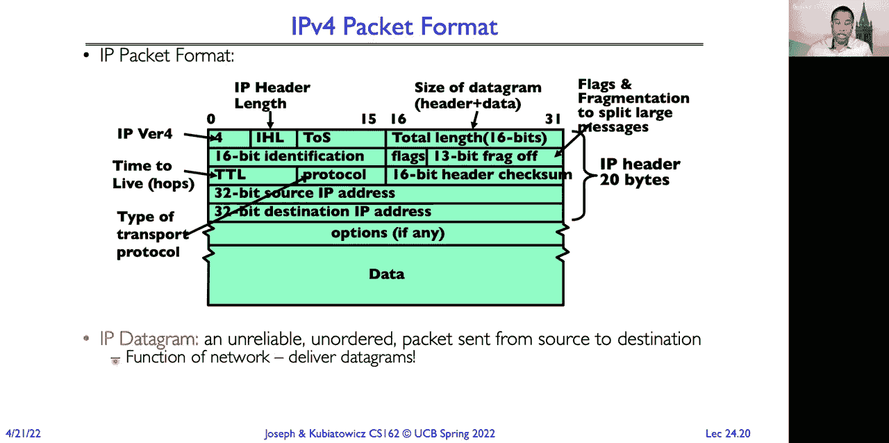
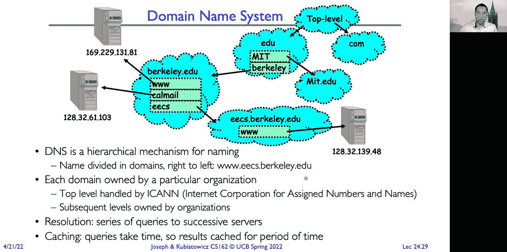
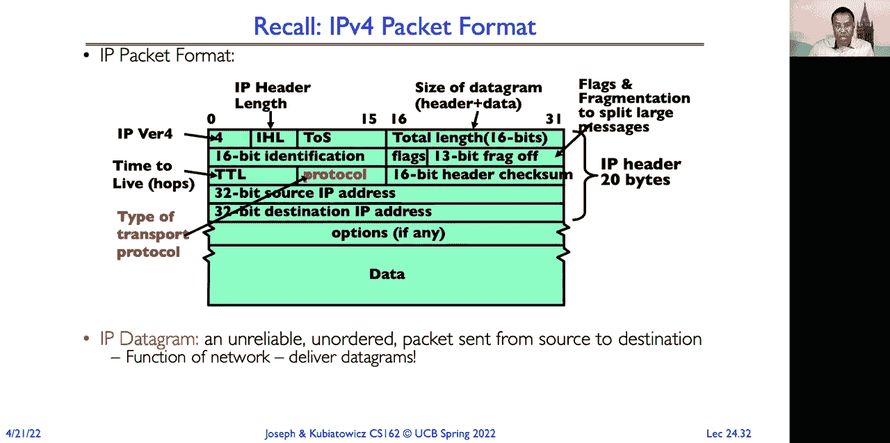
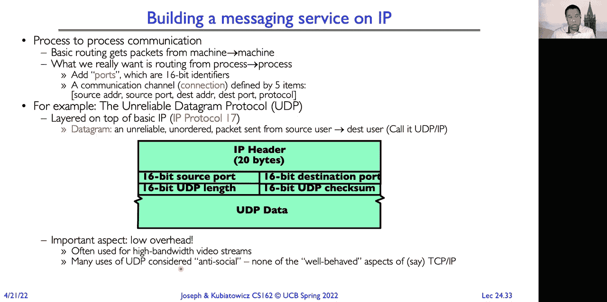

# 📚 课程 P24：网络与TCP/IP（续），RPC，分布式文件系统

在本节课中，我们将继续学习分布式系统中的核心概念。我们将回顾分布式共识问题，并深入探讨网络协议栈，特别是TCP/IP协议的工作原理。此外，我们还将介绍远程过程调用（RPC）和分布式文件系统的基础知识。

## 🔄 分布式共识回顾

上一节我们介绍了分布式共识问题，即多个节点需要就一个值达成一致，即使部分节点可能发生故障。本节中，我们来看看实现共识的具体协议及其挑战。

### 两阶段提交协议

两阶段提交协议是确保分布式事务原子性的经典算法。它分为两个阶段，并使用日志来保证决策的持久性。

以下是该协议的两个阶段：

1.  **准备阶段**：全局协调者要求所有参与者承诺提交或决定回滚事务。每个参与者将决定记录在稳定的日志中，并将确认发送给协调者。如果有任何参与者投票中止，协调者将记录“中止”并通知所有参与者中止。
2.  **提交阶段**：如果所有参与者都同意提交，协调者在其日志中写入“提交”。此时事务被视为已提交。协调者随后要求所有节点提交，并在收到所有确认后完成事务。

### 两阶段提交的挑战

尽管两阶段提交能保证一致性，但它存在一个主要问题：**阻塞**。

以下是一个阻塞场景的示例：
*   参与者B投票“是”并记录在日志中，然后协调者A崩溃。
*   参与者B恢复后，发现日志中记录了“准备提交”，但不知道最终结果。
*   此时，B不能单方面决定中止，因为它可能已经履行了提交承诺。因此，B会被阻塞，持有相关资源（如锁），直到协调者A恢复并告知最终决定。

### 共识协议的替代方案

为了解决阻塞等问题，业界提出了其他共识算法：

*   **三阶段提交**：增加一个阶段来减少阻塞，但算法更复杂，不常用。
*   **Paxos算法**：由Leslie Lamport提出，Google使用，没有固定的领导者，能更好地处理故障，但算法本身非常复杂。
*   **Raft算法**：由斯坦福大学开发，比Paxos更易于理解和实现，正逐渐成为流行的替代方案。

### 拜占庭将军问题

到目前为止，我们假设的故障都是非恶意的（如机器崩溃）。但当节点可能**恶意**行动，试图破坏系统时，就需要更强大的协议。

拜占庭将军问题描述了在有叛徒（恶意节点）的情况下，如何让忠诚的将军们达成一致行动命令。其核心约束是：
1.  所有忠诚的副将必须遵守相同的命令。
2.  如果发出命令的将军是忠诚的，那么所有忠诚的副将都必须遵守他发出的命令。

解决拜占庭故障需要满足 **N > 3F** 的条件，其中N是总节点数，F是故障（恶意）节点数。这意味着系统需要超过三分之二的节点是忠诚的。

拜占庭容错算法不仅适用于恶意环境，也能处理节点以怪异方式故障的情况。

## 🌐 网络协议基础

在了解了分布式共识后，我们将视角转向支撑分布式系统的网络基础。网络协议是分层构建的，每一层为上层提供服务。

### 网络类型与设备

网络主要分为广播网络和点对点网络。

以下是常见的网络设备及其功能：
*   **交换机**：工作在数据链路层，根据MAC地址在局域网内转发数据帧。它学习每个端口连接的设备MAC地址，形成转发表。
*   **路由器**：工作在网络层，根据IP地址在不同网络（如不同局域网）之间路由数据包。它连接多个子网，构成广域网。

MAC地址是设备网卡的唯一硬件标识，而IP地址是逻辑地址，用于网络层路由。使用IP地址的优势在于其**可聚合性**，例如，伯克利大学的所有IP地址可能都以 `169.229` 开头，这大大简化了全球路由表。

### 互联网协议（IP）

IP是互联网的网络层协议，提供“尽力而为”的数据包传递服务。这意味着数据包可能丢失、损坏、重复或乱序到达，就像邮寄明信片一样。

一个IPv4数据包头部包含关键信息，如：
*   **版本**：例如IPv4。
*   **源IP地址**：发送方的32位地址。
*   **目的IP地址**：接收方的32位地址。
*   **协议**：指示上层使用哪种传输协议（如TCP或UDP）。
*   **生存时间**：防止数据包在网络中无限循环。
*   **头部校验和**：用于检测头部在传输中是否出错。

### 域名系统（DNS）

由于IP地址难以记忆且可能变化，我们使用域名系统将人类可读的域名（如 `www.berkeley.edu`）映射为IP地址。

DNS是一个分层、分布式的数据库：
*   **根域名服务器**：管理顶级域（如 `.com`, `.edu`）。
*   **顶级域名服务器**：管理下一级域（如 `berkeley.edu`）。
*   **权威域名服务器**：管理具体主机的记录（如 `www.eecs.berkeley.edu`）。

查询域名时，客户端通常先查询本地缓存，若没有则从根域名服务器开始递归或迭代查询。DNS缓存提高了效率，但也带来了安全挑战（如DNS缓存投毒攻击）。

## 📦 传输层协议：UDP与TCP

网络层实现了主机到主机的通信，而传输层实现了**进程到进程**的通信。这是通过**端口**号来实现的。

### 用户数据报协议（UDP）

UDP在IP协议之上增加了简单的进程复用功能。它非常轻量，头部开销小，但不提供可靠性保证。

UDP数据包格式在IP头部基础上增加了：
*   **源端口**：16位，发送方进程端口。
*   **目的端口**：16位，接收方进程端口。
*   **长度**：UDP数据报的总长度。
*   **校验和**：覆盖整个UDP数据报，用于检错。

UDP适用于那些可以容忍少量丢包但要求低延迟的应用，如音视频流、DNS查询。

### 传输控制协议（TCP）

TCP提供了可靠的、面向连接的字节流服务。它在不可靠的IP网络上构建了一个可靠的信道。

TCP通过以下机制实现可靠性：
1.  **序列号与确认**：每个字节都有序列号。接收方通过返回确认号，告知发送方已成功接收到的连续字节序列。
2.  **超时与重传**：发送方为每个发出的数据段启动计时器。如果在规定时间内未收到确认，则重传该数据段。
3.  **流量控制**：接收方通过通告窗口大小，告诉发送方自己还有多少缓冲区空间，防止发送方发送过快导致接收方溢出。
4.  **拥塞控制**：发送方通过感知网络拥塞程度，动态调整发送速率，成为“良好的网络公民”。

#### 滑动窗口协议

TCP使用滑动窗口协议来高效管理数据传输。窗口大小决定了在收到确认前，可以发送多少数据。

发送方维护三个区域：
*   **已发送并已确认**：可以安全丢弃。
*   **已发送但未确认**：需要保留，以备重传。
*   **未发送但可发送**：在接收方通告窗口范围内的数据。

接收方则维护：
*   **已接收并已交付应用**：已处理。
*   **已接收但未交付**：在接收缓冲区中，等待应用读取。
*   **未接收**：期望接收的序列号之后的数据。

通过滑动窗口，TCP实现了全双工、流水线化的数据传输，充分利用了网络带宽。

## 🎯 本节课总结

在本节课中，我们一起学习了分布式系统和网络的核心知识。

我们首先回顾了分布式共识问题，探讨了两阶段提交协议的优缺点以及阻塞问题，并介绍了Paxos、Raft等替代方案。我们还深入了解了更具挑战性的拜占庭将军问题及其容错条件。

接着，我们转向网络基础，理解了交换机与路由器的区别，以及IP协议如何提供尽力而为的服务。我们学习了DNS如何将域名映射为IP地址。

最后，我们重点剖析了传输层协议。UDP提供了简单的无连接服务，而TCP则通过序列号、确认、重传、流量控制和滑动窗口等复杂机制，在不可靠的IP网络上构建了可靠的字节流通道，这是大多数互联网应用（如HTTP、SSH、电子邮件）的基石。

这些概念是构建和理解复杂分布式系统与网络应用的关键。