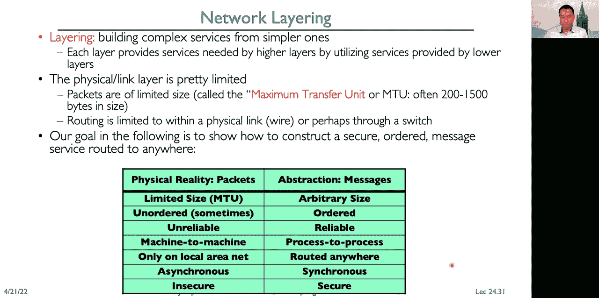

# P24：Lecture 24： Networking and TCP IP (Con't), RPC, Distributed File Systems - RubatoTheEmber - BV1L541117gr

 All right， so let's get started。

 So we did not intend to be remote again this semester， but here we are remote once again。

 hopefully just for today。 So this is lecture 24 and we have a lot to go through。

 We're gonna continue talking about distributed consensus making。

 Then we're gonna get into networking and TCP/IP， and time permitting。

 we'll get into our remote procedure call， and distributed file systems。

 So if you remember from last time， we talked about distributed consensus making。

 where we have a consensus problem。 So nodes propose a value and we want。

 even in the presence of crashes and failures of other nodes。

 to be able to reach a decision across all of the nodes。

 and have that be the same decision at all of the nodes。

 So examples are choosing between true and false， or choosing between commit and abort。

 Now it's very important that we make our results durable。

 So we're gonna use a log or other form of stable storage。

 to ensure that the decision persists once it's made。 Okay， and remember also we talked about。

 the two phase commit protocol， where we have a persistent stable log on each node。

 and that's where nodes track and record， whether a commit has occurred or not。 There are two phases。

 that's why it's called two phase commit， which starts with the prepare phase。

 where the global coordinator requests， that all of the participants promise to commit。

 or decide to roll back the transaction。 So the participants each record their decision。

 their promise in the log and acknowledge that， to the coordinator and if anyone votes to abort。

 then the coordinator is going to write abort in its log。

 and tell everyone to abort and record abort in their log。 During the commit phase。

 if everyone has agreed， that they are prepared to commit。

 then the coordinator writes commit in its log。 When it writes committed in its log。

 that's when the transaction is considered committed。

 and no matter what happens with machines going up and down。

 eventually everybody will commit their transactions。 It then asks all the nodes to commit。

 and respond with an acknowledgement， after it receives and acknowledge all of the acknowledgments。

 it writes got commit to the log。 So the log here is used to guarantee that our decision， persists。

 that it's a decision to commit， or it's a decision to abort the transaction。 So some discussion。

 Now， why is distributed decision making important， and desirable because of faults that can happen？

 We want fault tolerance。 We want a grouping machines to be able to come， to a decision。

 even if one or more of those happens， to fail during that process。

 So this simple failure mode is called， we're assuming here a simple failure mode。

 that's called fail stop。 So if a machine has problems， it stops， it crashes。

 it reboots and then recovers。 There are other modes that we'll talk about。

 in just a moment which are more Byzantine， in terms of the way that they might fail。

 Now after a decision is made， we recorded in multiple places that again ensures。

 that it persists after that decision is made。 Now， some people have asked， why is Too Faced commit。

 not subject to the same paradox as the general's paradox？ Well。

 the difference here is that Too Faced commit， is about eventually coming to the same decision。

 It's not necessarily true that they all come， to the same decision at the same time。

 It simply says that they will eventually all come。

 to that same decision because machines might fail， and have to reboot。

 And so we want to make sure that again， eventually we reach that decision。 Okay。

 second thing I want to talk about， is that there is a problem with Too Faced commit。

 and there is a reason why Too Faced commit， can be troublesome to actually use and practice。

 and that is blocking。 So let's say， so one machine can be stalled。

 that is prevented from doing any useful work， until another site recovers。

 So site B writes prepared to commit， and records that in its log。

 and then sends a yes vote to the coordinator， which we'll say is site A and then crashes。 Well。

 eventually it'll come back up。 In the meantime， let's say site A also crashes。

 So now site B is coming back up and it checks its log， and it says， oh， I voted yes。

 And so it's going to send a message to site A， saying， well， what happened？

 Did that transaction commit or abort？ Now at this point， site B cannot unilaterally decide。

 I'm going to abort， right？ Because it already said it was prepared to commit。

 and that update might have actually committed， in which case it then has to go through。

 with its promise to commit。 So it's blocked until A comes back up and responds。

 The coordinator comes back up and says， what happened to the transaction。

 Now the reason why this is a problem， is because that block site B holds resources， right？

 So it might be holding locks on updated items。 It might have pages that are pinned in memory。

 and it can't release any of those resources， until it knows the fate of the update。

 And so if it takes the global coordinator， a few hours to come back， well， those resources are held。

 and that could hold up progress on site B。 Okay， so there are some alternatives to two phase commit。

 There's an alternative called three phase commit， which adds in another phase。

 That's why it's called three phase commit， and that allows nodes to fail or block。

 and yet we can still make progress。 Now it's a much more complex algorithm。

 and it's not widely used in practice。 Paxos is an algorithm for a distributed commit。

 that was developed and is used by Google， and it doesn't have the two phase commit blocking problem。

 It was developed by Leslie Lamport。 You may remember him from last time。

 He's the person who said that distributed computing， is when a machine crashes and prevents me。

 from getting my work done， and I have no idea what that machine is。 And so with Paxos。

 there's no fixed leader。 You choose a leader on the fly。

 And so that makes it much easier to deal with， a failure occurring。

 but it's a very complex algorithm， and so it's not as widely used as we'd like to see it be used。

 There's an alternative that was developed later， called Raft developed by Professor John Austerhat。

 at Stanford and it's much simpler to describe， the complete protocol and so some people。

 have started using Raft as an alternative， to Paxos or two phase commit。 Now。

 up until now we've assumed that failures that occur， occur because of normal things that happen。

 like cosmic rays or machine crashes or hardware failures， and other sorts of things。

 What happens when failures are caused， because nodes act maliciously？

 So malicious means that a node is attempting， to compromise the decision making process。

 So if everyone is saying do， yes， the malicious node says， for example， do no。

 So we need to use a more hardened decision making process， and like Byzantine agreement。

 which we're going to look， at in just a moment or blockchains。 And unfortunately。

 we don't have time， to look at blockchains today。 So the assumption here is that you have an adversary。

 that's trying to basically do the worst case， damaged your system。

 So if you're just dealing with normal faults， this takes it， this will also help you。

 because sometimes systems will fail， in truly bizarre ways。 They start acting inconsistent。 Well。

 that to a certain extent could look like a malicious， actor， but it's not。

 It's just a node that's misbehaving， and performing incorrectly。

 The nice thing about the Byzantine algorithms， is that they'll handle those misbehaving nodes。

 just equally as well。 Okay， so we have a different problem now。

 which is the Byzantine generals problem。 So the Byzantine generals problem has n players in it。

 So we have one general。 So here's our general and we have n minus one lieutenants。 In this case。

 we have four players， and we have one general and three lieutenants。

 So some number of these participants， can be insane or malicious。

 And that includes both the general and the lieutenants。 So the commanding general sends an order。

 to his n minus or her n minus one lieutenants， such that the following integrity constraints apply。

 The first one is that all loyal lieutenants， must obey the same order。

 The second one is that if a commanding general is loyal， then all loyal lieutenants obey the order。

 that he or she sends。 So here our general， who is loyal， sends attacked everybody。

 And all the loyal lieutenants send an attack to everyone else。 But this malicious lieutenant here。

 tells this lieutenant retreat， right？ And tells this lieutenant retreat。 All right。

 so we want the decision in this case， because the general is loyal and says attack to be attacked。

 But again， the malicious lieutenant here， is trying to make the distributed decision be retreat。

 So we can differentiate between the malicious actors， and the loyal actors in this case， right？

 Because here this lieutenant receives two attack messages， and one retreat message。

 And same with this loyal lieutenant receives one retreat message， and two attack messages。

 But it's not always the case。 There are some impossibility results。 So in particular。

 if we only have three players， then we can't solve the Byzantine general's problem， right？

 Because one player here can mess everything up， right？

 So here we have a loyal general and a loyal lieutenant， and the general says attack to everybody。

 And here we have a malicious lieutenant， and they say retreat， right？

 So now from the point of view of this lieutenant， they get one order to attack。

 and they hear a hearsay order to retreat。 On the right， we have a malicious general。

 who do one lieutenant， the one on the left says attack。

 The one on the right says retreat and these two are loyal。

 So this one's going to accept that attack from the general， and it's also going to hear retreat。

 from this loyal lieutenant who's gonna relay that retreat。

 So the challenge here is that we can't see， we can't determine from the point of view。

 of this lieutenant on the left， which of the commands to follow， right？

 Because here we can't tell is it the general that is loyal。

 or that it's the other lieutenant that is loyal。 So in general with F faults。

 we're gonna need N greater than three F to solve the problem。 You can ask questions。

 If you have a question， please ask questions in chat。 That'll make it easiest。

 'cause then everyone can read it， and it'll be included in the transcript。 Okay。

 So there's lots of algorithms to solve the problem。 The original algorithm has a number of messages。

 that's exponential in N， and newer algorithms have message complexity， of order N squared。

 And there's an algorithm that people use from MIT。

 that was developed by Castro and Liskoff back in 1999。

 So the question here is if a general was malicious， what orders are we supposed to execute。

 for the problem to work？ So in the case where the general is malicious。

 you'd basically take the order that was opposite， right？

 You'd be able to tell them the general is malicious。

 because they're gonna be telling some people to attack。

 They're gonna be telling some people to retreat。 We still want to reach a general consensus。

 for all of the correct players in the game。 Okay。 So when we have these Byzantine fault tolerance algorithms。

 it allows multiple machines to make a coordinated decision。

 even if some subset of them are malicious。 So it allows us to have a request。

 We want this group to make a decision， and we have these malicious participants here。

 who are gonna take the information coming in on the request。

 and try to make the decision go their way， to pollute by confusing everyone else。

 and sending mixed messages to those other participants。 But as long as there are less than a third。

 of the population that are malicious， the Byzantine fault tolerance algorithms。

 will still be able to come into agreement， across all of the other participants。 Okay。

 Any other questions about BFT before we change gears？ And again。

 this works well for malicious environments。 It also works well where you have nodes。

 that are flaky and fail in bizarre Byzantine kinds of ways。 Okay。

 So let's switch gears and talk about network protocols。

 So we have networking protocols on many levels。 So at the physical level。

 there are protocols for the mechanical connectors， and for the electrical network。

 how we represent zero and ones in waveforms。 That the link level。

 there are packet formats and error control。 At the network level， we have routing and addressing。

 And then at the transport level， we might have something like reliable message delivered。

 And so if we look at the protocols in today's internet， the ones that are most commonly used。

 at the physical layer， we have protocols like ethernet。 So I'm doing Zoom on a computer。

 that's connected over ethernet。 That computer also has a wifi interface。

 and can also communicate over that interface。 You can also have cellular protocols like LTE。

 In between， again， we have the hourglass。 We have IP， the internet protocol as the narrow waste。

 And then we have transport layer protocols， like the unreliable data gram protocol。

 and the transmission control protocol。 On top of that， we can build our applications。

 We can have libraries that implement protocols， like remote procedure call and so on。

 So let's start with looking at the physical link。 What kinds of networks do we have？ Well。

 the most common type of network is a broadcast network， where we have a shared communication medium。

 Now you have one， you popped open your computer， inside that shared medium is a set of wires。

 that interconnects all of the components， the processor， the I/O devices， memory and so on。

 So inside the computer， we call this a bus。 And all devices are simultaneously connected。

 to that bus and can communicate。 Originally， Ethernet was a broadcast network。

 and all computers on a local subnet， were connected to one another。 Now， we have other examples。

 So for example， where the wireless medium is air。 So when we're in the classroom and we're speaking。

 that's via a communication medium， that's a broadcast medium that is the air。 We also have Wi-Fi。

 right？ And so Wi-Fi is a broadcast medium。 And so this is one of the reasons why。

 when you're at a cafe， people tell you， use a virtual private network。 For example， the campus VPN。

 because you're broadcasting the information， from your computer and anyone who's sitting there。

 in the cafe could actually receive that information， and potentially know what you're doing。

 and potentially get sensitive information。 There are other broadcast networks like cellular networks。

 where all devices are communicating over shared medium， which is radio frequencies。 Okay。

 so some of the details about a broadcast network。 So in most common networks that are based on protocols。

 like Ethernet， there's what's called a media access control， address or MAC address。

 It's a 48-bit physical address for the hardware interface。

 And every device in the world has a unique address。

 Now I say sort of because the way MAC addresses are assigned， is vendors get a prefix。 So 3。

com gets a prefix， Netgear gets a prefix， and then the assigned devices in their space of bits。

 Because manufacturers produce a lot of devices， they sometimes reuse MAC addresses。

 So they're supposed to be unique， but they're not always guaranteed to be unique。

 if the manufacturer has recycled some of those addresses。 Okay， now delivery。

 So when you broadcast a packet， how does a receiver know that it's supposed， to receive that packet？

 Because that packet goes to everyone。 So it's literally like standing up in a room。

 and starting talking。 How does someone in the room know， that you're actually talking to them。

 and not just to the room as a whole？ So if we look at the nodes in a network。

 they each have this MAC address。 So here this one has MAC address three， and it's sending a packet。

 Well， the way we determine the destination， is we take our packet and we prepend on that packet a header。

 And that header has the destination MAC address。 So now when everyone receives that packet。

 this one with ID one ignores it。 This one with ID four ignores it。 And this one， oh， ID two。

 that matches the destination。 It'll receive the packet， pass it on to the operating system。

 pass it on to the application。 Now very important is that in Ethernet。

 this check is done in hardware。 So the operating system isn't getting interrupted。

 every time a packet is broadcast。 The look and see， oh， is this packet for me。 Now that said。

 you can actually disable that hardware check， that puts your adapter into mode。

 that's called promiscuous mode， because it'll now listen to and receive。

 every single packet that's transmitted。 So again， this is the reason why。

 you wanna make sure you use a VPN， when you're using public Wi-Fi。

 because anybody can put their adapter into promiscuous mode。 Now they receive all of the packets。

 that are being transmitted by people in that area。

 and they can decode them and see what people are doing。

 Not every application will unfortunately encrypt， its sensitive data。

 And so you could have passwords and usernames， and other things that get stolen。 Okay。

 so an alternative to broadcast networks， is point-to-point networks。 Why have a shared bus？

 You could simplify things， you could increase the available bandwidth。

 If you had point-to-point links， then you added in routers and switches。

 So why was this not done originally？ Cost。 It used to be routers and switches。

 were very expensive on a per-port cost。 Now， there are dollars， tens of dollars， or less per switch。

 And so the cost per port is very， very small。 And so point-to-point networks。

 are pretty much the point you'll see in most environments。 Again， except for wireless environments。

 So on a point-to-point network， you have a network where every physical wire。

 is connected to only two computers， or a computer and a switch or a computer。

 and a router or a switch and other switch， or a switch and other router or two routers。 So a switch。

 What's the difference？ I'm using the term switch in routers。 Well。

 a switch is a bridge that transforms that shared bus。

 that broadcast configuration into a point-to-point network。

 And it adaptively figures out what MAC addresses， are available on each port。

 and only routes traffic to the ports， that have the particular MAC address。

 that matches what's in the header。 So here the switch is actually looking at the header。

 and it's seeing who is sending this， what's the MAC address of the sender。

 recording it for that port， and looking in a lookup table to find out。

 where is the MAC address for the recipient， in the header located。

 A router acts as a junction between physical networks。 So between switches and say the internet。

 we have routers。 And routers instead of looking at MAC addresses， use IP addresses。

 So they're routing at the layer above。 So the question is， are switch and router。

 both computers as well or just special ones？ The answer is sort of yes。

 So typically routers are built using， application specific integrated circuits or ASIX。

 So this is custom logic。 And， but if you look at what that custom logic is。

 a lot of times it's ARM cores， or other sorts of computational units。

 that are the same types of things， that we find in microprocessors。

 It is also possible to actually use modern microprocessors， to do routing and switching。

 And you can do this if you， for example， want to implement functionality inside the network。

 So going against the end-to-end principle， you could push functionality into the network。

 implement it on a general purpose computer。 But in general， for the kinds of performance。

 that we're trying to get to， you know， 100 gigabit， 400 gigabit links。

 those are typically done using ASIX。 So special purpose hardware。 Okay。

 so let's look at the internet protocol。

 So it's the internet's networking layer。 So it's this red layer here in our stack。

 And the service that it provides， is a best effort packet delivery service。 Right。

 so it's gonna try its best， to deliver packets to its destination。 That means， however。

 that packets might get lost。 They might get corrupted， they might get delivered out of order。

 So the way I like to think about packets is like postcards， right， you go on vacation， and。

 you know， when we go away， we'll send postcards to a bunch of friends。 And we might send， you know。

 three or four postcards， from different places while we're traveling around。

 And it's always humorous when you get back to find out， well。

 what order of those postcards arrive in？ Did they arrive in the order we sent them？

 And did they arrive， period？ And， you know， a lot of times they don't arrive， or， you know。

 someone missing， and they arrive out of order。 Well， that's just like the internet， right？

 There's no guarantee that packets won't be lost， that they won't be corrupted。

 or that they might be delivered out of order。 So there's a question to summarize the difference。

 between switch and router。 So again， switches operate on local area networks。

 routers connect local area networks to wider networks。 So switches are on Mac addresses。

 routers operate on IP addresses。 Okay， so you can think of IP as a data gram service。

 We're routing across many physical switching domains， or subnets， so local area networks。

 And so those local area networks again， subnets， those are switches。

 The routers operate here at the network layer， to interconnect those subnets。

 So we divide IP addresses up into， you can think of them as a 32-bit namespace。

 and that's divided up into four octets or four bytes。 And so we'll typically write them。

 as those four bytes dot separated。 So here we have 169。229。6。83。 That happens to be the IP address。

 from one of the computer science file servers， one of the departmental file servers。

 An internet host， this is the computer， that's connected to the internet。 Now， what does that mean？

 Well， that could be anything from， we have smart thermostats。

 and those thermostats have an IP address。 They're connected to the internet。

 Your phone has an IP address。 It's connected to the internet。 Your tablet， your computer。

 all of these have an IP address， one or more of them and they're used for routing。 So for example。

 on your phone， you have an IP address that's assigned， for the LTE or 5G network。 You also。

 when you're on WiFi， have an IP address for that WiFi network。 So simultaneously。

 your phone has two IP addresses。 Now， some of these might be private。

 and they can't be used for routing。 So the IP address that you get， say when you're at home。

 is a private network address。 You can't route directly to it。

 And not every computer has a unique IP address。 So when you're at home， your cable modem。

 or your fiber modem has an IP address。 And then your local subnet is a private subnet。

 Your cable modem uses network address translation。

 to translate requests from host outside your network， to host inside your network and vice versa。

 So your machines or your devices at home， all have the same public IP address。

 and they have an internal private IP address。 So a subnet is a set of a network that connects hosts。

 that have related IP addresses。 And so that it's identified by a 32-bit value。

 and a prefix number of bits。 So it'll be a slash， the mask。 So here 128。32。131。

0/24 says that all of the addresses， that match the first 24 bits will match。 So are the subnet。

 So that would be 128。32。131。whatever is all， on the same subnet。

 So the last XX is gonna be between zero and 255。 All right。

 And that mask is just simply the number of matching bits。 So 24 represents the first three bytes。

 or the first three octets。 But it doesn't have to be units of eight。 It could be anything。

 It could be 22， it could be 31。 It all will depend。 And then often routing within the subnet。

 is done by MAC address。 So within a subnet， the switch will see all of the hosts。

 that have the same， that are on that subnet， and then just use its MAC address。

 to route packets between those hosts。 All right。 So there's a question when someone from the outside sends。

 a request to one machine inside a private network。 How does a router know which computer。

 to send the request？ So it's all gonna depend on the computer。

 that made the outbound request to that server。 When that happens network address translation。

 will record that there was the outbound request， and then match that up with the inbound response。

 or inbound request。 There also are protocols like the universal plug， and play protocol or UPNP。

 where a host inside the network can say， hey， route connections for me on this particular port。

 to on the public IP to my host inside that。 So for example， devices like game consoles。

 and telephone adapters use that kind of approach， to tell the router to open ports up for them。

 So that's how you'll do that reverse mapping。 So the question is， so the Wi-Fi routers in our home。

 is really a combination of switch and router， that is responsible for both public。

 and private data transfer。 Absolutely。 That's why on the back of your router。

 you'll see typically four ports， right？ One is an upstream port， which might connect。

 to another router and then the other ports are internal ports， which you can plug your devices into。

 and connections will be routed， between or will be switched between those devices。

 And then it's doing a routing function， between the subnet that's your internal subnet。

 like a 192 subnet and the external subnet， which is your providers wide area network subnet。

 So someone says， I guess Nat keeps the table， for translation which binds empirical port。

 to destination port， is that correct？ Yes。 So Nat does keep a table。

 that does mapping between internal ports and external ports。

 We're gonna get into ports in just a moment， when we start talking about UDP。 Okay。

 so if we look at the format of an IPv4 packet。

 I'm not gonna go through all the fields here， but some of the fields that are important are。

 there's the version， there's version four， there's the size， this is my header plus data。

 there's the destination IP address， again， it's the 32-bit address， the source address， again。

 that's a 32-bit address， and there's a checksum type of transport protocol。

 and a bunch of other important options， flags and features。

 Not all of the features will be supported by all devices。

 There's a sort of core set that are required though。 The function of an IP data gram is just again。

 like a postcard。 It's unreliable， unordered， could be damaged。

 packet that's sent from a source to a destination。

 And the function of the network， is simply to deliver data grams。 Now。

 we kind of already started talking about it， but between two hosts on the internet。

 is a wide area network。 And you can think of the wide area network。

 as a network that covers a broad area。 So it could be a city， it could be a county， a state。

 a country， could be an entire planet， right？ The internet is a wide area network。

 Wide area networks connect multiple physical data link， networks。

 so multiple subnets or local area networks， get connected by a wide area network。

 The data link networks are themselves connected by routers， right？

 And so different local area networks， could use completely different technologies。

 So you might have one local area network， that is using Wi-Fi， another local area network。

 that's using ethernet， and another local area network that's using LTE， or laser or， you know。

 any different technology。 And the routers interconnect all of these different local area， networks。

 OK， so the role of routers is to forward each packet that's。

 received on an incoming link to the appropriate， outgoing link。

 And the ideas that outgoing link is closer to the destination。

 And it's going to be based on that packet's destination IP， address。 So that's， again。

 in contrast to switches， which deliver packets based on MAC addresses。

 the media access control addresses， routers operate at the network layer。

 and route based on IP addresses。 Routers operate with storm forward。

 so packets are buffered and then they're forwarded。 And there's a forwarding table。

 which maps between IP， addresses and the output link。 So here。

 we can see what it might look like inside a router。

 We have incoming links and packets coming in on those links。

 So you can see here we have a bunch of blue packets coming in。 They get buffered in memory。

 And then routed to the appropriate output link。 And so here you can see there's some demultiplexing。

 between the green and the red packets。 The green end up going out this link。

 The red end up going out this link。 You can see that there's multiplexing。

 of the black packets coming in here and the red packets coming， in here。

 And they're both going out on this outgoing link。 And so we use buffers because we might have more traffic coming。

 in for an output link than we have capacity on that output link。 These buffers are fixed size。

 So if too many packets， too many of these black and red packets。

 come in and it exceeds the capacity of this link consistently。

 and we run out of memory to buffer those packets， we drop those packets。 Again， IP is best effort。

 So if we run out of space in the routers， packets get dropped。

 It's up to the upper levels to deal with those packets that， get lost。 OK， so packet forwarding。

 Here's an example of an IP packet going from host A to host B。 And when a router receives a packet。

 it's going to weed the IP destination address of the packet。

 look at its forwarding table to determine the output port。

 and then forward the packet to the corresponding output port。

 Now we include default route for subnets where we don't have， an explicit entry。 And basically。

 you can think of this， as for passing the problem off to someone else。

 hopefully a more authoritative router that， knows how to get to that location。 So your cable modem。

 all it knows， is it has a default route， which is send it， to the cable company。

 and that cable company router， will figure out where to send it。

 So that way you don't need to have a cable modem that。

 has the way to reach every possible network in the world。

 All it needs to know is there's another more authoritative router， that does have that information。

 OK， so I've been talking about IP addresses。 I've been talking about MAC addresses。

 It can get very confusing because we're， talking about things that operate at different levels。

 And so here's an example to help you， think about what the difference is。 So here we have John Doe。

 and John Doe has a Social Security， number， and John Doe lives in Washington， D。C。

 But John Doe gets an acceptance letter from Berkeley， comes to Berkeley to go to school。

 moves to Berkeley。 All right， so now John has a Berkeley address。

 But his Social Security number still remains the same。 Now。

 why do we not use MAC addresses for routing？ Because it wouldn't scale。

 How do we know where John Social Security number， 0， 0， 0， 0， 0， 0， 0 is located？

 We'd need a table that tells us where every single Social， Security number is located。

 So the analogy here is that a MAC address， is like a Social Security number。

 whereas an IP address is like some home address。 And the thing is that the MAC address。

 is uniquely associated with the device for the lifetime， of that device。

 So the MAC address that your laptop has， for its wireless card， is permanent。

 It's assigned at the factory， and it doesn't change。

 Whereas the IP address you have is going to change， throughout the day。 When you're at home。

 you're going to have one IP address， the public IP address of your cable or fiber modem。

 When you're on campus， well， as you move from building， to building。

 and you switch from edge to room network， to edge to room network， your IP address may change。

 And again， the MAC address never changes。 OK， so why does Packet Ford and using IP addresses scale？

 Because IP addresses are aggregated。 So you're not just randomly assigned an IP address。

 but rather they belong to organizations。 So at UC Berkeley， all IP addresses。

 start with the first two bytes being A9 and E5。 So any address of the form， A9， E5， something。

 something， belongs to Berkeley。 So a router in New York just needs one entry。

 to route to all of the hosts at Berkeley。 If instead we were using a MAC address。

 then that router in New York would， have to have table entries for the， whatever， 70。

000 devices that we might have active at any given time， on campus， so it wouldn't scale。

 So the question is， does every router in the world， know that this address belongs to Berkeley。

 or only some top nodes？ Again， it depends， right？ Depending on the size of the ISP。

 they may not know how to reach Berkeley， which case。

 they'll forward the packet on to their internet service。

 provider who will forward it on to someone else。 And eventually you reach a router that is authoritative。

 and can route to it。 On the other hand， if you're at a major provider， like。

 say Comcast or AT&T or others， they would have all of the routing tables。

 to reach all of the major organizations in the internet。 So the analogy here is， give this letter。

 to a person with a given Social Security number， right？ That's a pretty intractable problem。

 to track that person down。 On the other hand， if I say， give it to John Smith， who。

 was at 123 First Street in Los Angeles， California， in the United States， very easy to route。

 to that particular address。 OK， so some administrative stuff。

 We have a midterm next week from 7 to 9 PM。 It'll cover all course material with a focus。

 a priority， on the material from before the last midterm to now， or from the last midterm to now。

 And then we have a review session coming up next Monday， on the 25th from 1 to 3 PM。 OK。

 back to routing and naming。 So we need to go from human readable names to IP addresses。

 So I don't want to have to remember that www。berkeley。edu。

 is represented by the host with IP address 128。32。139。48。 I got that good at remembering numbers。

 so I probably would not be able to remember that， and type that in on my phone keyboard。 Same thing。

 Sometimes it's also the case that a name maps， to many different hosts。 So www。google。

com maps to hundreds of thousands， of different hosts depending on where you are in the world。

 And so and the load on those different servers。 And so we need a way of mapping from human readable names。

 to IP addresses。 There's a question， is there a class that is about networks？ Yes。

 The undergraduate class is CS 168。 And the graduate class is CS 268。

 We're going to do a very surface level discussion of networking。

 in this class just because we have a limited amount of time。

 But because networking is really important to distributed systems， and systems in general。

 we're going to give you， a basic understanding of how networking works。

 But if you really want to understand the full details， and build applications that use networking。

 take CS 168。 OK。 So again， IP addresses， they're hard to remember。 IP addresses change。

 If a server crashes and gets replaced by another one， I don't want people remembering that。

 you know， www。berkeley。edu is 12832， 13948。 Right。

 So the mechanism we use is called DNS or the domain naming system。

 And the domain naming system is a hierarchical mechanism， that we use for naming。

 So names are divided into domains and it goes from right to left。 So the top level domain。

 what's missing here is there's actually， a dot and that's the top level is dot。

 And then there's edu and then there's Berkeley。edu。 And then there's eks。berkeley。edu。

 And then there's the host that we're trying to find。

 So each domain is owned by a particular organization。 The top level is handled by ICANN。

 the Internet Corporation for， assigned numbers and names。

 And so they're the ones that hand out top level domain。 So when， you know， a few years ago。

 they created a ton of new domains。 And those were assigned。

 handled out or handed out rather by ICANN。 Each of these subsequent levels is owned by a particular organization。

 So there's an organization that runs。com。 There's an organization that runs。edu。

 There's an organization that runs dot。 That mill。gov。org and so on。

 So each of these organizations then hands out to lower level organizations， for。

 so for academic organizations in the US， they can get a。edu。 So there's MIT。edu。

 If you want to find out what www。mit。edu maps to， you go to the MIT。edu， server。

 which is run by MIT。 Similar in our case， well， we want to find the eks， a web server。

 We're going to go to the campus， the Berkeley campus domain name server。 And it'll tell us， oh。

 go to eks。 Eks is hand， eks department happens to be one of the departments in campus that runs its own DNS。

 And so you'll go to the eks。berkeley。edu DNS， and it will tell you， oh。

 that host is for www that maps to 123 to 139。48。 Now that takes time。

 It took a lot of time to explain this。 If every time you wanted to look up， you know， www。eks。

berkeley。edu， you had to go all the way up to the top level and go all the way down this tree to find the host that would take a lot of time。

 That would also put a tremendous level。 If you think of the billions of devices that are looking up host names every day。

 that would put a tremendous level on the load， rather on the top level。 And so we use caching。

 And so there's caching at clients of the results。 And typically you'll cash for anywhere from a couple of hours all the way up to could be a couple of weeks。

 It's kind of a trade off cash too long。 And if a name changes that the mapping changes。

 then it'll break because you won't， you'll think you can't reach that host cash to infrequently。

 you know， too short。 A time period， and you'll end up putting more load on the DNS server。

 So it's kind of a trade off in terms of fault tolerance versus load balancing。

 Okay， so how important is the correct resolution。 Well。

 there are people have constantly been trying to launch attacks against DNS。

 because that way they could say， you know， get Wells Fargo。com to resolve to their server。

 create a server that looks just like it。 And now you're going to connect and think you're connecting to your bank when you're not really and then you give up your username and password。

 So a lot of phishing attacks will oftentimes try to work in conjunction with a DNS manipulation type of attack。

 And it's because DNS really isn't secure。 There are a lot of vulnerabilities and substitution attacks that can be launched against DNS。

 These have happened before back in 2008 there was a major hole in DNS that was discovered。

 and it was so critical that they had to， you know。

 widely say DNS is broken without actually seeing what the vulnerability was because they didn't want to leak too much information and allow attackers to start using that attack before people could patch their systems。

 Now there are other protocols like a secure DNS protocol。

 but it requires a lot of work to actually implement these。

 and people have found vulnerabilities in those secure DNS protocols too。

 So it's a challenge and it is a， it is definitely a weak link。 Okay。

 So layering is all about building complex servers services rather from simpler services。

 Each layer provides the services that are needed by the higher layers。

 and it does that by utilizing services that are provided from the lower layer。

 It adds a layer of a direction。 So if we look down at the physical link layer things are really very limited。

 right， packets have a very limited size maximum transfer unit。

 it could be anywhere from 200 bytes if we're dealing with something like dial up over a telephony network up to 1500 or 800 bytes for。

 a particular network like Ethernet routing is limited within a physical link or maybe through a particular switch。

 So our goal here is to go from， you know， is to use abstraction as we have throughout this class to go from the messy physical reality to a more desirable abstraction。

 So if you look at reality packets have limited is a limited sizes， MTU's。

 they're unordered sometimes they might be unreliable if， you know， it's a lossy wireless link。

 They're machine to machine， they only operate on the local area network there。

 they're asynchronous we never know when they're going to arrive or be sent， and it's insecure。

 Right。 And the abstraction we want is secure reliable messaging。 Right。

 so arbitrary sizes ordered reliable from process to process。 So from application to application。

 not just simply from one machine to another machine so one operating system to another operating system。

 routed anywhere in the world， synchronously delivered and secure against。

 And so integrity against manipulation， and perhaps maybe even authenticated for who sent it。

 Okay， remember again our packet format here， we're going to look at different types of transport protocols。

 So we're going to build a messaging service on top of IP， we want process to process communication。

 And if you think about what IP gives us is， is just so it's like having a postcard that's just delivered to an address。

 No name on it。 And so let's say you've got， you know。

 five or six people living in an address in a postcard arrives。

 Who is it from well there's a sending address， and there's a destination address。

 Well the transport layer says who is the person receiving the application。

 So we want routing from process to process and so what we're going to do is we're going to add ports。

 So 16 bit destination port a 16 bit source port。 This will tell us what is the communication channel。

 and we'll define a communication channel between two applications by what's called a five to bowl and that five to bowl consists of the source IP address。

 the source port。 The destination IP address the destination port， and the protocol。 So in this case。

 this is the user data， the unreliable data gram protocol。 And。

 and so that defines the five to bowl for this， this connection。

 With the unreliable data gram protocol， we have data grams。

 an unreliable packet that gets sent from a source to a destination user。

 and the important aspect here is it's relatively low overhead so on top of the IP header which was 20 bytes。

 We're going to add a few more bytes for our port our length or checksum and our port。

 Now here's where things get a little complicated。 But if we go back to our IP picture， right。

 there's a 16 bit header checksum here， which is over this IP header。

 And now we've added a 16 bit UDP checksum， which is going to be over our， our data also。 Okay。

 so this type of data gram is oftentimes used for things where we want unreliable delivery。

 but it might be high bound。 So for example， this video connection。 Typically the video。

 So my video would be sent over UDP。 My audio would also be sent over UDP because it's more important that it get there in a timely manner。

 and that it be reliable so there may be some losses or maybe some， some gaps。

 And so screen sharing that's kind of less synchronous and so that oftentimes might be set sent over TCP because you want a nice clear picture so you can read all of the words that are on it。

 And so zoom actually gives you the option of whether you want screen sharing done over UDP or you want it done over TCP。

 UDP allows you to just like kind of blast these high bandwidth communications。

 And so it's not really very， it's kind of anti social。

 It's not friendly to other applications that might simultaneously be trying to use the same network。

 It's UDP is just going to send it whatever the rate the sender sending it。

 That's the right we're going to push it through the network so really the sender controls how it's using the network and ignores other users in the network。

 TCP will see on the other hand tries to be more social and well behaved when a network gets congested。

 Okay， so the Internet architecture really has kind of five layers from the application transport network data link to physical。

 the lowest three layers we implement everywhere。 Right。

 so the physical layer connects hosts and routers， and other routers。

 the data link connects hosts and routers and other routers switches everything。

 The network layer again is used at hosts and routers it's not used at switches typically。

 So switches might only implement the lower two， and the application and transport layers only get implemented at hosts。

 And so this is where our sockets get implemented when we have a connection。

 we have going down all the way the stack across to appear then all the way back up。

 back down across to appear， and then all the way back up until we deliver。 So。

 in most cases this is how things work。 People break the end to end principle。

 and sometimes implement functionality in the in the routers。 So， for example。

 caching in the network of content。 That would be applications that effectively are running inside the network instead of running end to end。

 And to trade off， you know， and then principle says we should only do that at the end。

 but we'll do it sometimes in the network because we get efficiency and bandwidth benefits and latency benefits also。

 Okay。 So， we can think about layering as putting packets in an envelope。

 So an application has some data and wants to send from one application to another application。

 And so it's going to take that app that data， it's going to put it in a transport layer envelope that adds a transport header。

 which is used by the transport layer。 The transport layer is going to put it in another envelope。

 Right， so it's like you get a letter from someone and then you take it and you put it into a bigger envelope address to someone else。

 Right。 And so that's the， adds a network header to that。

 And then the network layer takes that set of envelopes and puts it into another envelope and adds the frame header that we need for the data link layer。

 and then we encode it into the ones and zeros that we need for the physical layer。 So again。

 the challenge here and this is why， you know， the layering has huge benefits。

 but you can also see and this is not the scale that you know let's say this is a small amount of data that we're trying to send。

 We're putting a lot of header information on that relatively small amount of data。

 And so the efficiency that we're going to get at our physical layer could be very limited。

 if mostly what we're sending is header and not data。

 Okay。 So the data gram service is basically a no frills extension of best effort IP so instead of sending packets now we can send longer packets。

 They're bigger than the MTU that we might have at the lowest data link layer。

 and it handles the multiplexing and demultiplexing of these packets to processes at the end house。

 So we're able to send between two processes， these longer messages。

 TCP the transmission control protocol gives us reliable in order delivery。

 And so that gives us connection setup and tear down deals with packets that might be corrupted packets that might be lost flow control congestion controls we don't overload the receiver。

 and so that we don't overload the network。 So there's a question between what's the difference between the data link layer and the physical layer so the physical layer is the ones and zeros。

 the data link layer is the protocol that we use to access the media。 So when we're speaking。

 our physical layer is our vocal cords， making us phonemes and our ears。

 hearing those phonemes receiving them。 And so data link equivalent would be raising your hand because you have a question that you want to ask or something that allows us to do media access control between people and then also like。

 you know， saying your name， so that you know I'm talking to you in a in a group as opposed to just broadcasting something。

 Okay， other examples of of internet transport protocols that nobody actually uses are but you know there are standards for it are the data gram congestion control protocol。

 the reliable data protocol， and the stream control transmission protocol。 But those aren't used。

 Okay， so remember how sockets work as a concept we at the server created a server socket bind it to an address。

 So now you know where you know that that host IP address and port come from。

 we listen for connection， and then we'll use the， call to accept a connection when the client which also created a socket connected it to that host and port that we had bound the server socket to。

 then that creates a connection socket。 And that allows us to write requests。

 read those requests writer response read those response。 Okay。

 so when we're talking about reliable message delivery we're talking about how do we make this connection work properly that socket connection。

 Okay， so the problem。 Well， we just went through them right physical networks， they can garble。

 they can drop or lose packets right at the physical layer packet might not be transmitted or received。

 you know， if we're transmitting at the maximum rate， we get more throughput。

 but we might have more error。 And so higher error rate and so some packets might get corrupted or lost。

 And we transmitted sort of the best power per bit。 So at a really low power level。 Well， you know。

 error correction， you know， might be able to correct some of the errors。

 If the if we have a physical encoding that includes error correction。

 but it might not be able to correct all of them。 And so again。

 we'll have some garbling or loss of packets。 And so the suggestion means we might not have any place to put an incoming packet。

 Right， think about your phone it's kind of relatively weak processor in it in comparison to a web server that might be sending。

 you know， at a very high rate。 If it sends it to higher rate。

 you're not going to have enough buffer space on your phone in the operating system and so it's just going to drop packets。

 And so we're going to have a network。 So you might have insufficient queue space it switches and routers broadcast link。

 you might have two hosts that are simultaneously trying to use the link so two hosts that speak at the same time。

 And receivers are just going to hear like some superposition of that signal and they're not going to be able to distinguish it。

 Again， any network where there's insufficient buffer space and if a sender is fast sending faster than a receiver can can process。

 So we want to build reliable message delivery on top of these unreliable packets， these IP packets。

 So we need some way to make sure that packets actually make it to the receiver and we'd like exactly once。

 So every packet is received at least once， and every packet is received at most ones。

 Now if we want to combine this with ordering and say something even stronger that every packet is received by a process at a destination。

 exactly once， and in order。 And so this is what the transmission control protocol or TCP provides this way。

 So we have a stream of bytes that we send in。 They go through routers switches more switches more routers more switches。

 and at the destination process， we get a stream out。

 So it's a reliable byte stream between two processes on different machines over the Internet。

 And we can do read， write and flush， just as we could do to a file or local IPC。 So some details。

 TCP has to take this byte stream and fragmented into IP packets and then into packets handed to IP and IP may turn around and break it up into further packets。

 fragments rather based on the maximum transmission units。

 It uses a window based acknowledgement protocol and this is a way of minimizing the state that we need to maintain at the sender and also the state we have to maintain at the receiver。

 The window is kind of a reflection of how much storage we have at the receiver。

 because we don't want the sender to overrun the receivers buffer space。

 But the window window also has to reflect the speed and the capacity of the network。

 We don't want to overload the network。 Also， it takes time。 Speed of light is finite。

 And so it takes time for the traffic we inject in the network to actually reach the sender。

 And so we want to make sure that's not going to overload the sender either。

 It handles automatically retransmitting any packets that are lost or garbled。

 And it tries to adjust its rate of transmission to be a good citizen。 So unlike UDP， which。

 you know， if I just start blasting packets out in UDP， I can blast whatever rate I want。

 And the network， you know， could easily become overloaded。

 and other clients could see their traffic impacted by my UDP streams。

 TCP tries to figure out who else is transmitting what is the available capacity and adjust itself to fit within that available capacity。

 So it tries to be a good citizen。 Okay， so let's look at the problem with drop packets。

 So all physical networks， they can garble， they can lose packets， right。

 it could be hardware issues。 And so IP， because it's built on those physical links can garble or drop packets and it doesn't repair it。

 Right， so IP doesn't try。 The only thing IP does is its header looks at the check。

 it's header checksum just looks at the checksum for the header。 Right。

 and so if that gets corrupted， you know， then， you know。

 we're going to throw away the packet because we can't route it。 But otherwise。

 the packet could be damaged and it's up to the application to figure out what to do。

 because that's the end to end principle。 And again。

 that's important because we want protocols like UDP。

 because sometimes we're willing to accept damaged or corrupted packets and still try to decode them。

 use， you know， for example， an audio codec that can handle corruption or。

 use a video codec that can handle corruption。 So you still see something。

 it might be a garbled frame or you hear something that's a little garbled。

 but you get it instead of simply just having silence and missing all of the context and contents and information。

 Okay， so we need reliable message delivery。 Make sure packets are integral。

 Their integrity is preserved and make sure they arrive exactly once。

 So we can do this by using acknowledgments。 Right。

 so we're going to have checksums that will detect whether this packet gets garbled when we send it from a to B。

 And if it's garbled， we simply discard it。 If it's okay， then we'll send back an acknowledgement。

 And that tells the sender that we correctly received this packet。

 Now if we send it in the packet gets corrupted and so we rejected it B or the network loses it。

 then there'll be a timeout so a starts a timer so when you send a packet。

 start a timer that timers running， if you don't get an acknowledgement within that window of that timeout。

 then you'll just simply retransmit the packet and again start the timer again and wait for the acknowledgement。

 So there's some questions that should pop into mind when I say something like this。 So the first is。

 doesn't mean if the sender doesn't get an acknowledgement that the receiver did not get the original message。

 So it could be。 Right， but not necessarily。 Right。

 it could be no right because the acknowledgement itself is a packet sent unreliably。

 And so it could get lost。 Right， so it's sort of like I send you a postcard。

 And you send me back a postcard and the post office treats postcards is like the lowest of priority and it gets stuck in machines and。

 you know， get lost in the carriers bag and， and so that acknowledgement。 And so。

 that's the data gram that comes back， could just get lost。 Right。

 Or it could be the case that it gets delayed。 And so I do send back the acknowledgement。

 but that acknowledgement comes after the timeout period。 And so you've already started the。

 by retransmitting the packet。 And then the sender doesn't get the acknowledgement。

 it just simply retransmits。 And then the receiver is going to get the message twice and have acknowledged each one of those。

 Okay， so let's look at a protocol that we could use。 This protocol is called stop and wait。

 we'll look at this in the context， first of the case where we don't have any packet loss。

 So we're going to send， and then wait for an acknowledgement。 Okay， and then repeat。

 So we send packet one， we get an acknowledgement for packet one。

 So this time between when we send the packet， it goes to the receiver。

 and we get a response is called the round trip time。

 And that is the time it takes the packet to travel from the sender to the receiver and back。 Right。

 Now， the one way delay， if you can think about it is going to be D。 Right。

 so that's the delay from the sender to the receiver。 And if it's symmetric， the links that we have。

 then in terms of latency， then the round trip time is going to be twice this one way delay。 Right。

 So now we send our second packet。 Right， and we get our second acknowledgement back。 Okay。

 and then we can send our third packet。 And we'll get our third acknowledgement back。 Right。 So now。

 how fast can we send data with this kind of approach。 Well， think about it。

 What we can use is a law called little's law that we can apply to the network。

 It says that n equals B times the round trip time。 So for stop and wait， we have one packet in flux。

 Right。 There's one packet。 We send a packet， wait for a response round trip time。

 and we send the next packet。 So our bandwidth is going to be one packet for round trip time。

 So this means that our bandwidth depends on latency， not the capacity of the network。 Right。

 so imagine we have a 10 gigabit connection between Berkeley and Paris。 Right。

 that's very high latency。 That could be， you know， a couple hundred milliseconds。

 And we're not going to be able to send at anywhere near the capacity of that 10 gigabit link between Berkeley and Paris。

 Okay。 So suppose as an example， our round trip time is 100 milliseconds。

 and one packet is 1500 bytes in size。 Then our throughput。

 our bandwidth for the network is going to be 1500 over 0。1， which is 120 kilobits per second。

 So again， if we have 100 megabit per second link， we're only using 120 kilobits per second of that capacity。

 So we're using a tiny fraction of the capacity of that link。

 So loss recovery here relies on timeouts。 All right， so we have our round trip time。

 and we're going to add something to our round trip time to calculate what our time out value would be。

 You know， maybe here it's 50%。 So 1。5 times our round trip time。

 And so if we don't get our acknowledgement， either because the packet didn't get delivered or the acknowledgement didn't get delivered。

 we're going to time out and then retransmit the packet。 So how do we choose a good timeout value？

 Well， too short， right， if we made it， you know， just a little， you know， right。

 just a little bit over the round trip time， or maybe exactly the round trip time。 Well。

 there's going to be a little bit of variability， because there may be other congestion and traffic in the network。

 which is going to cause us to， you know， exceed that round trip time， and that timeout。

 our average round trip time and time out。 And then we're going to be retransmitting a lot。 Right。

 so that'll lead to a lot of duplication。 We said， set it too long。

 Let's say we said it all the way around， you know， down here。

 then we're going to have a lot of disruption when there's a packet loss。 Right。

 because it's going to take us a long time to realize that the packet has been lost。

 and to actually transmit it。 Now， how do we deal with the fact that if we set our timeouts too short。

 we're going to resend packets before they， we get the acknowledgement for that packet so we'll send packet one twice。

 or like in this case， right there， acknowledgement gets lost。

 but the packet was actually correctly received。 So， we transmission means this can happen。

 And so a particular approach that we could use is just simply to put a sequence number in a message to identify we transmitted packets。

 Right， so the receiver is just going to check for duplicate numbers and it gets a duplicate message。

 It'll just simply discard that message。 Right， so the requirements here are the sender keeps a copy of any messages that have not been acknowledged。

 Right， and that's easy， you just， you buffer those messages。

 and just retain the buffer until you get an acknowledgement。

 and the receiver tracks possible duplicate messages。 So this is a little bit hard。 Right。

 because when is it okay to forget about a received message to forget that I actually received a particular message。

 Right， so here's an alternating bit protocol where you send a message。 At a time。

 and you don't send the next message until you get an acknowledgement。 Right。

 and so the sender just keeps track of the last message。

 and at the receiver they just simply need to track the sequence number of the last message that was received so you send it back and zero。

 You acknowledge zero， you send packet one， you acknowledge one， you send packet zero。

 you acknowledge zero。 The advantages， this is simple。

 and it has low overhead it's a single bit that we need to keep track of that sequence number。

 The downside though is that if the network could arbitrarily delay messages or duplicate messages arbitrarily。

 then we might get this packet zero but it's actually this packet zero and so we can't tell the difference between is this a new packet zero。

 or is this a duplicate of that packet zero， or if we didn't receive packet zero and we see packet one right so you can see。

 there can be a number of different cases where we end up not being able to tell whether we're getting a new message or we're getting a duplicate of an old message。

 So there's lots of advantages of moving away from stop and wait right if we have a larger space of acknowledge of acknowledgments。

 then we can pipeline。 Right， so we can send multiple messages。 Right。

 while we're waiting for those acknowledgments to come in。 Right。

 so the acknowledgments serve dual purposes。 One is they confirm that a packet was received。

 And they provide us with ordering， right， because packets could be reordered at the destination。

 and so we might receive packet one， before we receive packet zero。

 So we might receive acknowledgement one before we receive acknowledgement zero。

 But if we have sequence numbers， you know， that are large enough space。

 then we can differentiate between messages that are duplicated messages that arrive out of order。

 and we can reorder those at the receiver， and avoid having to retransmit them from the sender。

 So now how much data can we have in flight。 So going back to little law， right。

 our sending window is going to be around trip time times our bytes per second。

 So our send a sender's window size， tells us the number of packets that we're going to have in flight。

 Right， so the packets in flight would be the window size divided by the size of those packets。

 So how long does the sender have to keep the packets around。 Right。

 so how much buffer space is the sender going to need that's one question we can ask another question we could ask is how long does the receiver have to keep the packets data to let the sender know yes。

 you know， if the， sender tries sending it again yeah I've already received that。 Right。

 and what if the sender is sending packets faster， then the receiver can process the data。 Right。

 and so it's if this floods the receiver and the receiver right around here runs out of buffer space。

 you know， then all of these packets that were sent were sent kind of in vain。

 because they're going to have to be repeated anyway because the receiver dropped those packets on the floor。

 So， remember when we have communication between processes， we have this in memory queue。 Right。

 and so you write into the queue as a producer and the consumer process be here is reading from that queue。

 and the queue has a fixed capacity。 So if this process a exceeds the capacity of that queue。

 then we block it。 Right。 And similarly， if this process be this consumer is trying to read from this queue and it's empty。

 it'll wait， it'll block。 Right， so posits provides this in the form of pipes。

 So when we think about buffering in a TCP connection， right。

 so we have a host here with process a there's a queue of packets that are outgoing and process be we have a receive queue of packets that have been received。

 but not yet consumed by the process， So you can see we've taken that sort of single queue that we had in in a Unix environment。

 we've now split it into two queues， a queue at the sender for outgoing packets。

 and a queue with the receiver for packets that have been received， but not yet， process。

 So process a sends in the send queue the packets get sent across the network received。

 and then they get sent to process be。 So this is bidirectional。

 because we're going to send the response back from host to in a send queue。

 packetize that receive queue， and then that goes to process a。

 So there's a separate pair of queues per TCP connection。

 So every TCP connection has both a receive queue and a send queue associated with it。

 So we need four in memory queues to at each of the house to buffer sends in one direction。

 and to buffer receives in the other direction or from the other perspective of that that connection。

 Okay， so the window size is the space that we have in this more receive queue， right。

 how much remaining space we have in that receive queue and a host is going to advertise this window size in every TCP packet it's in so everything。

 It's sending back all those acknowledgments and any outgoing traffic is going to say， hey。

 this is how much space I have in my buffer don't overrun it。

 So the center is never going to send more than what the receiver。 It's advertised window sizes。

 even if the network link would support sending much more data。 Right。

 so we're going to bound the amount of data that'll be in flight by the receive queue。 All right。

 so the set we use a sliding window protocol and the sender knows that it should never exceed the windows receiver with window size。

 and it。 But packets that it previously sent might arrive and then fill the window size。

 So as a result， it needs to ensure that the number of sent by but unack acknowledged bytes is less than the advertised window side so that's going to include any packets that are in flight。

 To that receiver。 They're considered in flight because the receiver has not acknowledged yet that it has received those。

 those bites。 So we can send new packets as long as the sent but unack acknowledged packets haven't already filled that advertised window side so that's。

 that's the way of getting around the fact that， you know。

 because there's speed of light and round trip times and and delay。

 We could have a lot of packets in flight， and we don't want the receiver saying， hey， I'm full。

 you know， by the time that gets back to the sender the sender is already overrun。

 So it's going to keep track of what it's already sent in into the network。 Okay。

 so here's an example with a window size of three packets。

 and the window size to fill the link is given by W times the bandwidth packets per second times the round trip time so little's law comes into play。

 Once again， now for TCP， the window is in bites， not in packets because it's it's bites in the buffer。

 So we have unacknowledged packets that the sender is sent。

 we have out of sequence packets that might be in the receivers window because again the network can。

 can reorder。 So we have a packet that goes out。 Another packet that goes out。

 Another packet that goes out。 All right， so now we have filled the receivers buffer。 So wait。

 or there until we get an acknowledgement。 So now we get an acknowledgement for that first。

 And so now we can send another packet。 Right， when we get an acknowledgement for the second one。

 Now we can send another packet， we get a knowledge meant for the third one。

 Now we can send another packet。 So， we can send another packet to the server。

 we can send another packet to the server window。 And so we can send another packet to the server window。

 And so， we can send another packet to the server window。 And so。

 we can send another packet to the server window。 And so。

 we can send another packet to the server window。 And so。

 we can send another packet to the server window。 And so。

 we can send another packet to the server window。 And so。

 we can send another packet to the server window。 And so。

 we can send another packet to the server window。 So， with TCP， again it's per byte。

 We have three regions at the sender。 So the first sequence region is packets。

 bytes rather than have been sent and acknowledged。 All right。

 so those we can forget about the second region is sent， but not yet acknowledged。 So。

 these could be in flight， they could be represent packets that have been lost packets that have been garbled or packets that just simply haven't been delivered yet or packets that we simply haven't gotten the return acknowledgement again because of the round trip time。

 And then we have packets and bytes rather that have not yet been sent。

 And it's this window this color region here in blue that's adjusted by the sender based on what information we get from the receiver。

 Similarly， we think about the receiver。 Right the receiver has received bites and given them up to the application。

 It has bytes that have been received and buffered and bites that have not yet been received。

 And you can see that this is a smaller region than the sender right because these are packets that could be in flight。

 Right。 And so they haven't been received yet or rather。

 they haven't been acknowledged yet rather so the acknowledgments here are in flight。

 And these over here are packets that are in flight。

 And so they haven't been received yet at the receiver。 Okay。

 so here's an example of how this window based acknowledgments works in TCP with bites。 Right。

 so here we send sequence number 100 size 40 so we have a packet that goes out at 100。

 then another packet that goes out at 140。 Right， and so now again we're taking up space in our buffer size 50 so now from 140 to 190。

 And we're going to get an acknowledgement for 190 to 210 we send out a package。

 a packet rather for sequence number 230 size 30。 And so here， the receiver， it's going to say hey。

 I've only heard up to 190。 And I've got 210。 Right。

 And so we've got this gap here from 190 to 230 the receive the sender， meanwhile。

 still sending packets at the receiver we're receiving these packets。

 So here we are at sequence to 60 size 40， and the receiver is saying hey I'm acknowledging。

 I still have only heard up to 190 to 10。 So the question here is if the receivers act doesn't get through and the sender doesn't know the window size has increased。

 Well TCP stall。 So yes eventually so that's exactly what's happened here right。

 Well it's not what's happened here right the the receiver is sending back an acknowledgement saying。

 I've missed a packet。 If I don't get these acknowledgments eventually TCP will stop at the sender because it won't。

 it will think it has filled the advertised window。

 And so to wait until it hears acknowledgement saying， okay it's all right， you know。

 for me to proceed。 Right。 And it could be that the acknowledgments aren't coming back because they're getting lost。

 it could be that the outbound packets are getting lost， or in this case， you know。

 things might be arriving out of， there could be a variety of different reasons but yes eventually TCP will stop from the sender point of view if it feels like it is filled the window and has not gotten acknowledgments。

 Okay so here we've said 340。 And again， still we're sending acknowledgement for 190 to 10 eventually that acknowledgement makes it back。

 And so now the sender will say oh I need to retransmit 190 and so it'll fill in that gap。

 It arrives at the receiver the receiver will then send back。 Okay， I got up to 340。 Right。

 And so it's acknowledging all those intermediate packets。

 And so that avoids us needing to retransmit all of those packets right and we can keep going until we fill the window。

 All right， so let me just summarize。

 Okay so what TCP gives us is a reliable byte stream between two processes that are on different machines over the Internet。

 It gives us the ability to have read， write and flush。

 and uses a window based acknowledgement protocols we just looked at。

 And in the next lecture we'll look at how it uses congestion avoidance to dynamically adapt the sender's window to account for congestion in the network。

 And so I'll see everybody on Thursday and hopefully on Tuesday rather and hopefully we will be back in person on Tuesday。

 Thank you。 You。

 You。