# P25：Lecture 25： RPC, NFS and AFS - RubatoTheEmber - BV1L541117gr

 Okay， let's get started。

 So this is lecture 25 and we're going to continue talking about TCD， then dive into。 remote procedure call and then we're going to look at distributed file systems。 Okay。 so remember with the， with the laser point up here， with the transmission control， protocol。 it's all about delivering。 There we go。 Okay， so it's all about delivering bytes reliably from one host to the other。

 Now we looked at how we get that reliability using a sliding window protocol where we set。 the size of the window to ensure that we don't over on receivers buffer。 But remember that one of the other properties that TCP offers is that it tries to be a good。 Internet citizen。 That is it's going to try and not overload the network between the sender and the receiver。

 So that's what we're going to look at next， which is how we avoid congestion。 So let me talk about first what I mean by congestion。 Okay。 so congestion is when we have too much data that we're trying to flow through some。 part of the system。 Now it could be the input link or it could be the output link。

 So it could be the link from the server， the rest of the Internet or it could be the link。 between your computer at home and your ISP。 Or it could be any of the links in between， right？

 Or it could be because there's other traffic in the Internet， right？

 You're not the only one using the connection between here and some sort or that you're connecting。 to in most cases。 And so what is I we do， right？ The Internet protocol will just simply drop packets if there's too many too much traffic。 for a given link。 Right？ Because if there's too much traffic consistently for a given link。 it's going to overflow the， buffers， those output buffers in the world。

 And that's completely acceptable， right？ We said IP is best effort。 And so if it runs into a situation rather than having something complex in the router， the。 router is free to just simply start dropping packets。 Now if we think about this。 what's going to happen to the TCP connection？ If you remember from last time the sliding window protocol。

 if we don't get acknowledgments， we're just going to simply retransmit。 Right？

 And so then we end up with lots of retransmissions。 And those retransmissions are going to cause more congestion。 And that congestion is going to cause more packets to get drawn。 And more packets getting a drop means more of our acknowledgments or source packets are。

 going to get dropped， which means we'll just keep retransmit。 Right？

 And so when bandwidth is kind of scarce， we're going to just keep injecting more and more。 traffic to get our packets through。 Right？ So that doesn't really work。 So instead。 TCP tries to implement congestion avoidance。 So if you think about it， we only have congestion。 Right？ How long should we wait to do a retransmission？ Right？ If we wait too long。

 then we're going to waste time when messages actually get lost。 And we wait too short。 then we're going to retransmit when that acknowledgement was just， slightly delayed。 And so we're going to waste our precious network bandwidth。 So there's kind of a stability problem here。 Right？ The more congestion there is。

 the more acknowledgments get delayed， the more acknowledgments get delayed。 the more we're going to unnecessarily climb out and retransmit， the more traffic we're。 going to inject causing more congestion， causing our apps to get delayed more and so on。 So you can see how this is kind of a vicious cycle。

 So it's kind of closely related to the window size of the sender。 Right？

 Because if the window size is too large， we're trying to push too much traffic through the。 network and the network can't handle it。 So think about how we choose the sender's window size。 Right？ Well， we choose it based on the available buffer space that the receiver tells us they have。 So the sender doesn't overflow the receiver's buffer。 So this kind of， you know。

 now we can think about it。 Okay。 So the only purpose of this window is to ensure we don't overflow at the receiver。 But we can also say， well， it's， it's also to make sure we don't overflow within the network。 We don't push the network into congestion。 So we want to really match the rate at which we send packets with kind of the slowest link。 in the network， a bottleneck link。 Okay。 So the way the sender does this is it uses an adaptive algorithm to decide what end should。

 be。 All right。 So our goal is fill the network between the sender and the receiver。 And the technique that we use is every time we get an acknowledgement， we're going to。 increase the window a little bit until some delay or loss of groups。 And then we're going to adapt。 So TCP calls this slow start because we start sending slow。

 Now with each acknowledgement we get back， we're going to open the window by one。 All right。 If we have a time now， that's our signal。 All there's congestion in the network。 And so we're going to slam the window。 And we're going to put it in。 So this is an additive increase， multiplicative decrease algorithm。

 And so you can think about other alternatives。 My maybe like。 what if we just decrease the window by one？ So is that an increase additive decrease？ Well。 turns out that wouldn't respond fast。 And so we'd still have a network of congestion。 Our goal here is when we push the network into congestion to very quickly kind of pull。

 back off and pull ourselves out of congestion。 Okay。 So how does TCP do this？

 So it's going to artificially restrict the window size if it sees some packet loss。 And kind of have to carefully design this control because it's really critical that。 we don't overrun the network or overwhelm the network。 But at the same time。 we want to make sure we're using as much of the network bandwidth， as possible。

 So that might argue for multiplicative increase， multiplicative decrease。 All right。 But again。 we've got this careful control。 But if we do a multiplicative increase。 we're going to push the network way into congestion， before we pull it back in。 All right。 So when they were designed the TCP algorithm， the slow start algorithm， they looked at all。

 these different sort of choices and the design space。 What if we open the window really quickly and close the window really quickly or open。 the window quickly because it's slowly， you know， and so on。 Right。 And what they found was that what gave us the most ability。

 And here's the graph on the left that shows time on the x axis and the window size on。 the y axis where this solid line is the actual available capacity。 And this other one is the actual window size。 What we get with AIMB is an algorithm that you can see oscillates a bit。 but it's oscillating， around what our true window size is in the network。

 So what the network truly can support。 And you can see here， you know， as we grow。 we end up pushing the network， you know， packing， packets into the network until we see losses。 And then you can see big drop， the window size and hash， right？

 Then try opening it back up and then big cut and open a little bit and， you know， keep。 having it until we get to this relatively stable state。 All right。 Questions。 Yeah。 All right。 Very good question。 So how does congestion management interact with not pulling up the receivers buffer？

 So the cap on the window size is always going to be the receivers advertised space。 So we're never going to exceed the receiver space， but at the same time， we're not going。 to exceed the network capacity。 Because maybe the receivers are server， right？

 So it has the ability to have a very large buffer space。 We don't want to overwhelm our weakest link， our lowest bandwidth link or capacity constraint。 link in our network at the same time。 Right。 And vice versa。 We had a client was the receiver。 you know， your mobile device and it doesn't have a lot， of buffer space。

 Even if you're connected to， you know， a gigabit network， we want to make sure we don't overwhelm。 that device。 Now， one thing I didn't mention is what happens when there's a lossy link， right？

 So if you're operating at the edge of a cell， you know， cell coverage， well， this afternoon。 is actually going to hurt you a lot。 Right。 Because those losses that are occurring because of packets getting dropped or acknowledgement。 is getting dropped， are going to cause the window size to get closed down really small。 That's why if you're like trying to watch some video or something and you're， you know。

 on the edge of coverage， it'll buffer it'll stutter， go below resolution， because the network。 is struggling to try and TCP is struggling to try and keep the window open and push packets。 Right。 Because every loss it sees， the thing is the link is congested， even if it's not actual， congestion。 So TCP works well until the loss rate hits about 10%。 When you get to about 10% loss。

 it starts in a feeling with congestion。 Okay。 So remember how we had set up a connection over TCP。 we identified our connections by， this five people of the source IP address， source port。 destination IP address， destination， port， and then protocol， which would be， you know， say。 UDP or TCP。 Now， client port， of course， is randomly assigned。

 The server port is often some kind of well known port， like 480 for web servers or 443 for。 web servers using SSL rather and SSH is a platform。 All right。 So what are the processes of establishing this connection at the network？ All right。 So this is that the application layer， we have sockets。 The network layer， there are three phases。

 There's connection establishment， which we do with the three way entry。 That's how we open the connection。 Then you send bytes back and forth。 like the reliable byte stream transfer。 And that's what we looked at last week。 And we looked at how we do congestion control today。 If the connection failed， right。

 we repeatedly try to transmit it。 You know， eventually a client out occurs and you reset the connection。 So you log the web browser and you get the connection to the server。 It was reset。 That means TCP failed。 It couldn't get packets to whether from the server to the client or the client to the server。 Now when we're done， we closed the connection and we need to tear down the connection so。

 that the user state associated at both the client and the server both have to agree。 Okay。 The connection is now terminated。 All right。 So let's start with that first part where we're connecting from a client to a server socket。 All right。 So we're connecting to that web server on port 80。 So what the client's going to do is a three way connection。

 So it's going to start with the client initiator sending messages to the server。 Time goes from top to bottom。 All right。 So on the server， the server calls listen， right。 but wait for new connection。 Now the client is going to call connect and connect。 It'll provide the server's IP address or name or talking of resolve with the rescue and。

 IP address and afford it。 All right。 So now we will send out a message。 A syntax。 All right。 So syntax it gets sent from the client to the server proposing an initial sequence number。 All right。 So you don't always start to remember at zeros。 You pick some random number and start it at that。 That way if you have two hosts that are talking back and forth multiple times。

 you don't end， up confusing packets from one session。 one connection with packets from another connection。 All right。 So it sends here a sin with sequence number X and each side is going to do that， right？

 Because remember， these are bidirectional connections。 And so the client can send the server with one sequence number of space， the server will。 respond back with messages in the other direction using sequence numbers from a different space。 So it'll send back a sin。 So a sin here's my proposed initial sequence number。 And hey。

 I'm acknowledging that I received your packet with sequence number X by sending。 an acknowledgement with that first one。 And I'm proposing to use one。 So of course now the client has to do the same thing。 That's the same thing。 Okay， yes。 there's an acknowledgement。 I got the packet walk。 I'm waiting for life。 That's why。

 So now our connection has opened and we're going to allocate buffer space at the server。 And we're ready to go into the connection。 Now we will schedule some thread which can then go and accept that connection and。 you， know， now proceed。 All right。 So we're going to do our byte exchange back and forth。 We'll look next at what we might send back and forth。 But first。

 we're going to look at what happens when the two parties are dull。 And it's a now we want to close the connection。 We send all our data back and forth。 What do we do？

 So there's a four way turnip， right？ Because both the client has state and buffers and the server has state and buffers in each。 direction and we need to throw away all of that state。 And both sides have to agree。 Okay。 so the server， the client rather host one will say here， it's going to do a close。 So it'll send a thin packet to the server。 Right。 So that tells the server， okay。

 I'm done with this connection。 I'm not going to send you any more data。 The server responds back。 Okay， I got nerd knowledge meant no more data is coming in。 Right。 This connection is now I agree that this connection is close。 If the host that host sends subsequent data on that connection， we're going to ignore。

 As Morgan said， you know， we're done。 The socket is closing。 All right。 Now on the server will also call close and it's going to send a thin packet and post one。 will send back a thin app saying， okay， I agree to close your side of the connection。 Right。 And then there's a timeout here。 After that timeout here that occurs on host one。

 we throw away all state associated with， this connection。 That way that the timeout occurs because maybe host didn't get me involved。 And so it might want to be like， go transmit again， you know， hey， I said I'm closing this。 connection。 Okay。 All right。 So within that window。

 we have stayed enough to be able to respond back with the thinner outside， of that window。 We don't。 All right。 So that gives us a little bit of a window for us to be able to respond back to the second。 host and say， yes， this connection is close。 Now before we can actually turn down the connection。 if there are multiple file descriptors on the， host that were further at the connection。

 all to a socket， all of those have the floats。 There's some reference down in that approach。 The same thing happens with the host to side all anyone holding a file descriptor has to。 agree or close。 Yes。 So the question is， how does host who know if the host one is not received the fan when。 it's in the fan？ So that's why host one send the fan act back。 Right。

 So how does host one know that host two received the fan act？ Yeah。 So if it doesn't get received。 it doesn't matter。 We're still going to crawl away the state and it can actually consider。 Uh。 and so that sometimes that'll happen。 Like the fan or the fan act doesn't get full truth。 One side thinks it's still connected。 It will try to send some data and it will get back。

 I don't know who you are。 And then it just resets the connection。 You see that happen。 Open the buzzer。 Um， there's a question in chat。 Why is host two not closing the connection when。 uh， it seems the first thing。 Because both sides have to agree。 So host one。 all the processes that are using that file descriptor have to agree it's closed。 And host two。

 we also have to agree that it's close。 It's a， that's why there's this four way handshake。 And one side doesn't mean a laterally just say connection close。 All right。 If I do close the connection， I am going to have， you know， once I receive that response， uh， thin。 I'm then going to throw away， uh， all of the state after， uh， this time out， of groups。

 And the question is how does host one differentiate data and fit？ Fill is a special kind of path。 So， uh， data packets are of data type and send back to a， I can send back to it like。 soon and acts are actually can be put in， uh， other packets。 And so you can， uh。 piggyback and act on a data packet or even on a soon back at all。 So like the。

 the same act that goes back is a packet that contains a soon and a convenient。 Yeah。 What's the relation between sockets and ports？ So ports are what you're listening on or what you're sending out for a server or what。 you're sending from as a client。 So ports are at the protocol level。 And then the socket is at the application level。 And that is the connection between， uh。

 two missions。 So again， you know， when we define a connection， it's defined as a source IP address。 source， port destination， IP address， destination port and a protocol。 You see there need to be the typical。 Okay。 Now remember we build distributed applications with messages。 right？ So I send a message to a message， uh， mailbox， a server report by over a connection。

 So the question is what's in those messages？ All right。 And so that's what we're going to talk about。 So it's really a question of how do we represent data in a message？

 Right？ Cause you think about like applications work with objects where I build the data structure。 and see or build an object in Java。 And now I want to send some representation of that over the network。 All right。 So I want to go from a machine specific binary representation to bytes that I can send over。 the network。 And this is in contrast to when we think about a single process， right？

 The threads running in that process can view the data structures that contain pointers and。 other sorts of things。 And it's easy for us to follow those points。 That you just do reference the pointer and that gives us the next thing and say a trick。 Right？

 But we don't have shared memory when we have two separate machines。 So that external representation is going to have to take whatever like a tree structure。 and turn it into some serial sequence of bytes。 So that is actually called serialization or Marshall。 And so that's taking a binary representation of an object in a machine， a virtual address。

 space and turning it into a sequence of bytes。 The reverse of this is deserialization or un-marsh。 And that's taking the bytes and kind of rehydrating it into what could potentially be a complex。 data structure or a video or an audio file or a database file。 Okay。 So simple data types。 So like an interview。 The goal is I want to write the integer x， the inside of the new x， the file。

 Like， well， I could just do something like open the file， write， and then I have two choices。 I could write it as an ASCII spring。 The ASCII representation of say 162， 162。 Right？

 And then a new line would say。 Or I could write it as four binary bytes。 Of course。 I have to modify it so I open the file with the binary flag。 So I don't end up with any translation issues。 Well， there's two different ways I can serialize it。 Serialize it as a sequence of bytes that reflect the bytes that I have in memory or serialize。

 it as a set of ASCII parameters。 Now which is the right way？ Turns out， you know。 that it doesn't matter。 Both are mechanisms that we could use。 One's a little less dense， right？

 If I want to represent a large integer as a ASCII string， it's going to take more than。 four bytes to represent them。 But I have to make sure that if I write an ASCII string at the sender that the receiver。 I parse an ASCII string， a scanable， an ASCII string。 Okay。 How do we know that the recipient represents X the same way？

 If you think about like a pipe with pipes， that's between two processes on the same machine。 so we know that the machine binary representation of the integer X is going to be the same almost。 empty machines。 Well， what about sockets？ An unissendent between my mat and your windows machine。 Or between my mat and some， you know， MIPS machine。 Well。

 I have to worry about an envious when it comes to integers。 You probably remember this from kids you would see， but you know， for a byte address machine。 when I refer to a type like an integer， what does that byte address refer to？

 And the case of a big ambient machine， it refers to the most significant bits。 For a little ambient machine， it refers to both significant bits。 Right？

 And here I have a little chart， right of processors and envious。 All right。 so we can see that the Motorola 68000 is big and our PC big and until x86 little。 went by some processors， it kind of depends on the little and the more big。 Right。 So I had one max little and the bigger and the well， you know， it's something that the。

 check could check it by running a little program like this， my number of problems。 If you want to see where all we're going to do is just taking a value and going to print。 out the string of that value in representation。 And then we're going to print out what each byte wins in a word。 And since this was run on a little and new machine， we're going to see that the least。

 significant bits， the 78， go up first followed by increasing significant bits。 If I ran this on。 you know， power can see， I'd see the opposite。 Like one， two would be first and three， four， five。 six， and seven。 Right。 So then I can ask the question if I've got two machines communicating over the internet。 what Indian is the internet？ All right。 So what's the network by order from integer in the internet versus what might be the host。

 by order？ And how do I write programs that are right once run anywhere， say against the POSIX API？

 Like the argument behind the POSIX APIs， I write my programs to the POSIX API， then I。 can run them on my Mac， I can run them on the windows with the windows subsystem for Linux。 installed， I can run it on a power PC with the POSIX API and so on。 But if I've got applications that are talking to each other。

 how do they know what the representation， is？ So the answer is they don't have to think about it。 They just simply call a function。 One of the POSIX functions that handles that question。 All right。 So we need to decide on an on wire emptiness in case of the internet。 The internet is big and in。 Why is the internet big and in？ Because it's big and in。 All right。

 It happens that the machines that were first being connected to the internet will be in。 the machines or people said， well， you're big and in。 Now why is this important actually？

 Because if I've got a little ambient machine talking to a big ambient machine， then I have。 to convert from little ambient representation to big ambient， put it on the network， send。 it across the network and then at the big ambient machine， I can use it as it。 If I have two little ambient machines talking to each other， they're going to come each。

 convert from little ambient to big ambient and then from big ambient back to little ambient。 as a representation。 So that's going to impose it over。 And so if you actually had say a hyperphone to a few clusters of all little ambient machines。 you probably wouldn't want to use this as an approach because you're constantly going。

 to be converting from little ambient to big ambient to little ambient even though everyone。 is little ambient。 But in the internet， you don't know the server of talking to you is little ambient or big。 ambient and so that's why we need a standard format that we're going to use。 Okay。 so we have functions that will convert from the native emptiness to the on wire and， these。

 All right， so welcome work from a host HD or H2 network and then there's long versions。 and they're short versions， whether they're looking at 16 bit or 32 bit values。 And then vice versa。 So when we get to the target converting from the network format to the host one。 And again。 if I have two little ambient machines talking， then each of these functions is actually。

 going to do something。 If I have two big ambient machines talking。 these functions are going to be no off。 So we're just going to copy the output。 Okay。 What if we have more complicated objects like， you know， from homework zero and one or like。 so we have a structure here that has pointers for string and a count of integers and then。

 a pointer to another total。 Right。 Well， we do like a kind of word。 It's going to just write things out of the sequence of words。 Right。 And so into a file stream。 you can usually imagine having a basically scatter words that would。 read in and we tokenize those at the other end。 So that would， you know。

 we could represent the string as we would represent it in the string。 that would send over the socket the same way we would represent the string that we would。 save for the file and read from the file。 Right。 And we write something like a pointer。 We don't want to write the actual point because that actual pointer depends on the virtual， address。

 Even on the same machine， if we wrote pointers out to a file and then tried to read them in。 another process， they would be enough。 Right。 So we have to take pointers and turn them into something that's like an index。 Right。 So instead of pointing to somewhere in a memory location。 this points to the second structure， that I wrote。 So it's like an index。

 This points to the third structure that I， this points to the tenth structure that I。 haven't written yet， but I'm going to write。 All right。 So if you make something relative so that string is completely self-contained。 And when we receive it at the other end， we can rehydrate it back into a list or a tree。

 of odd ones。 Now there are lots of data serialization formats that people use to do this kind of。 stuff like JSON and sent to the markup language。 There's lots and lots of ad hoc functions。

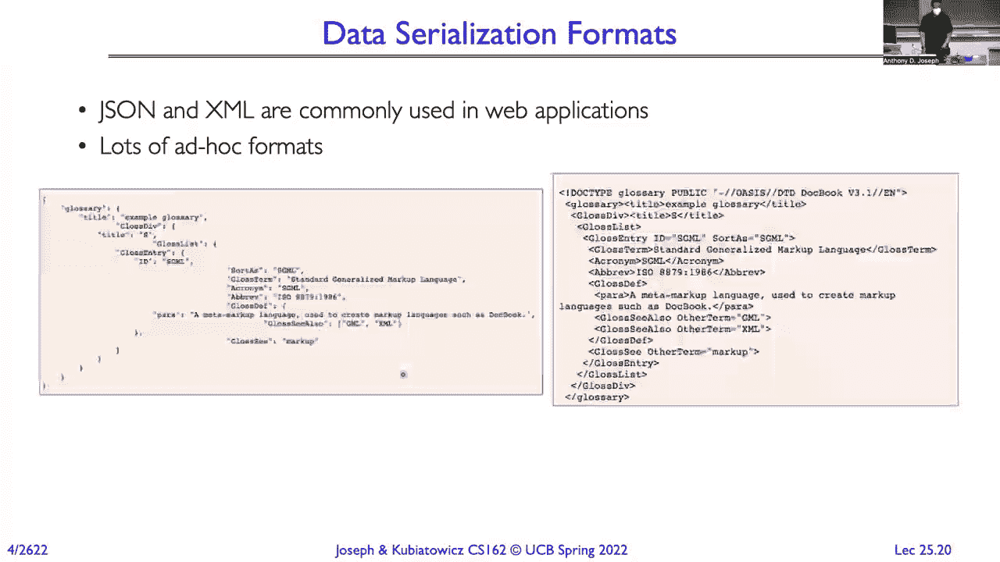

 And in fact， there are tons and tons of data serialized data formats。 And I'm not intending to read the columns here， but you know， some of them are human readable。 with standardized is a， you know， binary format and so on。 So when you're designing a protocol to talk between two applications， you know， like， you know。

 going work for a company that's doing web applications or mobile applications。 And you have to do a client or a protocol。 You look at these like choices for data serialization formats and pick one that meets the criteria。 that we need for application。 Because you're in readable one， I think it always kind of humates。 You look at like JSON， it's very human readable。 It's very verbose， which， you know。

 it's nice if you're trying to do webbing， but it's not， so great dealing with， you know。 adjusted limited mobile links or something like that。 And， you know。 it's a very common format that people use。

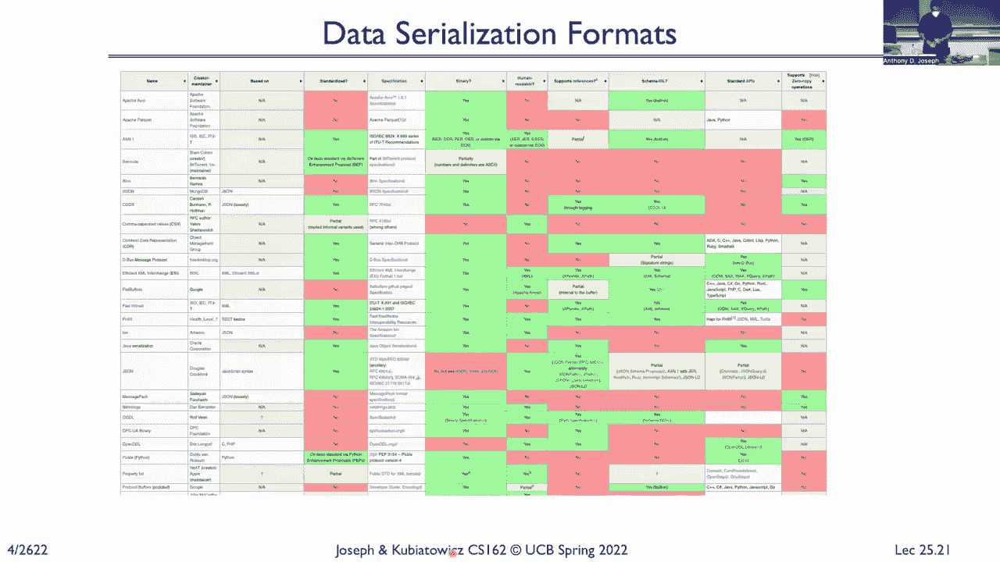

 Okay。 Yes。

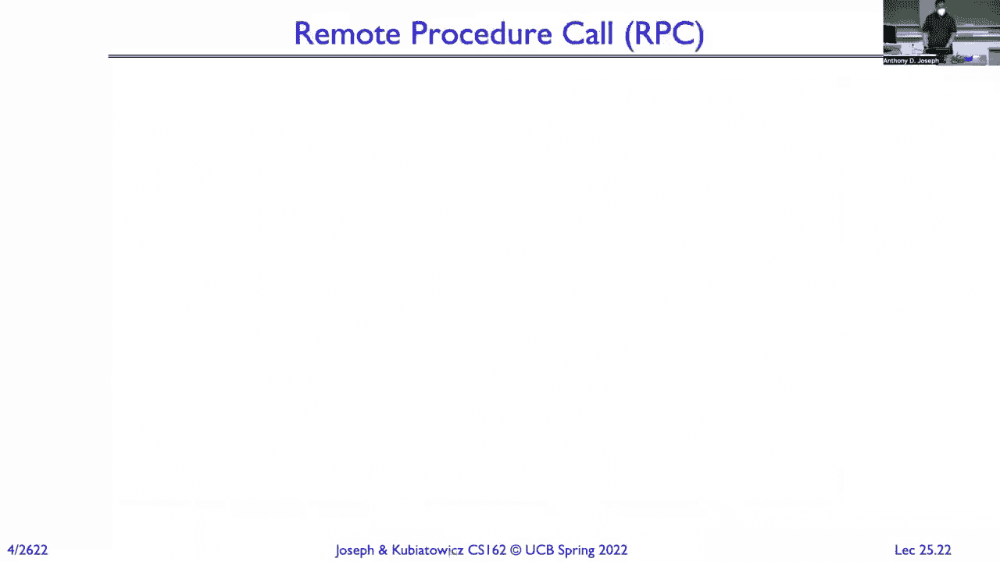

 Yeah。 So the question is， what about objects that are represented differently on different machines。 say integers of a 32 bit versus 64。 So in that case， actually those are two different data types。 32 bit would be an integer， 64 bits would be a long。 I think an example where you have that happen is what's your stringing code， like your string。

 writing and coding like the ASCII， it might be up to date， mainframe， and code。 It could be double white and coded。 It's， you know。 representing the language of some of the Asian languages。 And so that's where like you have to worry about， like， I think I'm speaking asking you。

 and you're expecting your mainframe， you're expecting up to date。 And so we have different character sets that we're using。 And so we'd have to agree。 This is what an character string represents。 Is it UTF-A being coded？ Is it asking coded？

 Is it double white and coded？

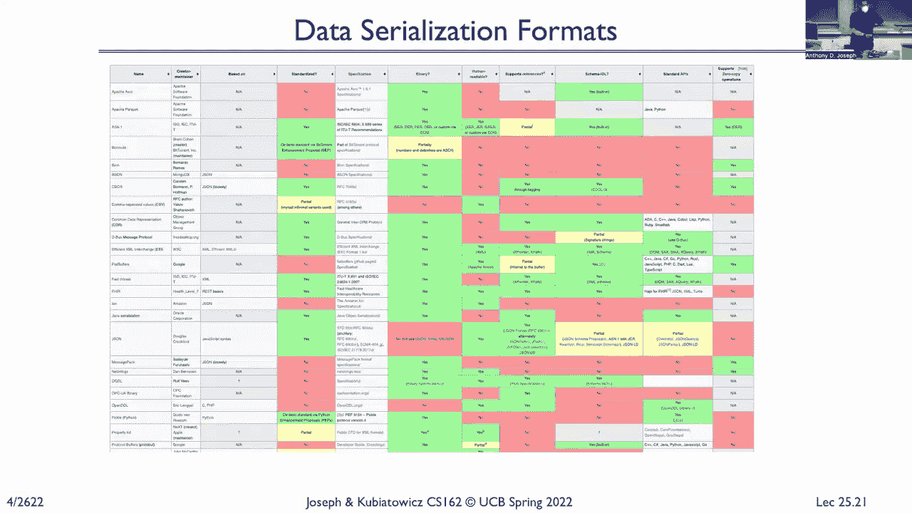

 You know， it's all。 The key thing is both sides have to be able。 And it either has to be implicit in the type like everybody knows a short 16 bit， but what's， the。 you know， ordering of those or I think the strings， you know， what is the， okay。 So if there are other questions， I want to shift gears and talk about or local procedure， call。

 All right。 So with local procedure call， we try to move up from the level of message。 We don't want users to have to worry about instructing these messages， picking these formats。 and these serialization and marshal functions and having to sit there right， you know， scan。 apps or other kind of parsing functions。 So in order to do this。

 we need something that's going to wrap up all of that information， to be less of source。 include all the typing information， and then at the destination is， going to include all。 we're going to receive all the information we need to then deserialize， a marshal that data， right。 And what procedure call might have to wait， you know， for a response or a service。

 And at the server， you can have to wait for incoming messages。 And we want to deal with all of these message representation issues that we just talked， about。 So the option here is remote procedure。 The move is up a layer level of indirection and hide everything behind our PC。 So I don't have to worry about all that complexity。

 So now making a call to another procedure on our machine， I want to make that look almost。 the same as a call to a procedure on the same machine， a ordinary function。 And automate everything associated。 So for example， required to see simple calls。 remote file system read on the file。 And that's going to do something to automatically get translated into a call on the server for。

 file system read of the file database。 And the bytes will come back。 And when this call returns。 I'll have the contents of the file。 Right。 It's very different from before。 where we think about open the connection， I'll take， a socket， code， and send it off。 In this case。 doesn't have to worry about any of that。 Similarly， at the server。

 it looks like it's getting a local procedure call to the file。 And so on。 So the concept here is that the caller calls some function f with some arguments we want， to be to。 And there's a client stuff。 So it does a local procedure call to this client stuff。 And that's going to bundle up all the arguments， serialize them， and send them to the server， stuff。

 The operating system will deliver that message to the server stuff， which we'll see that message。 on the arguments and do a local procedure call to the server with those arguments。 Right。 And then back will come to response data and response return values。 Those get bundled up。 serialize sent back to the client stuff， which then receives them， and will then un-martial。

 And then an ordinary procedure call would turn to the client， to the caller。 Right。 Now。 these could be on the same machine， or they could be on completely different machines。 across the network。 All right。 So we could do this with pipes or we could do this with sockets。 So how do we go from， you know， I want to make that local procedure call to it actually。

 turns into something that happened remotely on a machine and I get back those constants。

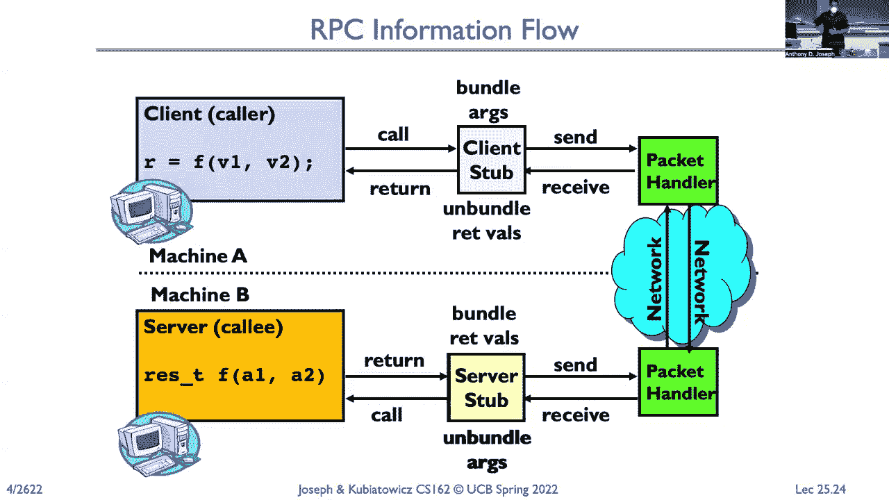

 That's the implementation。 So there was a question from earlier。 So essentially。 is a pointer represented as a relative address effecting， you know， however。 your approach and code structure is going to have to take something that was absolute。 like a pointer and then it's something that's going to be relative to the byte stream that。

 you're sending back and forth。 Okay。 So under the covers， it's just request response message pass。 All we have is message passing between the two machines。 The stub gives us the glue， right。 because it's responsible on the client side for serializing， the arguments and sending them out。 And then un-martialing， deserializing， it was term values。 And on the server。

 it's responsible for receiving the message containing the arguments and deserializing。 that and then calling the local procedure and serializing up the results and sending it。 back to the point。 So marshal and what happens is going to depend on the system。 but it's going to involve converting， the values from whatever the binary machine representation is into something that we can。

 send on the wire。 And so some of the values that might be passed in through that RPC might be just ordinary。 ordinal values， an integer like a short， some might be cleaner， a pointer to an integer。 And so if it's a pointer to an integer， the client stuff is going to have to de-martial。 that pointer or de-reference value of that pointer， get the integer and send the integer。

 to the other side。 It's a memory， put it in that memory at the server stub and then pass in a pointer to。 that to the server function。 It gets a lot more complicated potentially if you have things like a pass in two arguments。 that are the same pointer to the same object。 How do you handle it？

 You create two copies or one copy of the destination。 So there's lots of devils in the detail。 but at a high level， we have to worry about things。 that get passed in by value versus things that get passed in by reference。 Okay。 so some more details。 If we look at the equivalence between a remote procedure call and a local procedure call。

 the parameters are what goes into the request message。 The result is what goes into the request message。 The name of the local procedure is something that gets passed in the request message and。 then applied at the invoke of this at the server。 The return address here。 so what would be the return address in the local procedure call。

 is effectively like a return mailbox that we provide for the server， the server stub。 knows where it suddenly is all about。 Again， in this case it would be a stop。 All right。 so we have a， so as a user， you don't have to do this。 The user。 there is a stub generator where the compiler just simply jights the stubs for。

 you to find stubs in the series。 Question。 Yes， the question is。 does this mean that the server procedure can only work with a pass， by value。 instead of call by value values， instead of call by reference values。 It could be either。 It would be the job of the server stub if things are called by reference arguments to。

 basically create those references。 So allocates the memory and then pass the pointer to the arguments converted into deserialize。 into that memory into the server procedure。 And again。 it gets complicated if what you called on the client side contains references。 that point for the same option。 Because then I have to figure out how to recreate that at the server with that point。

 Okay， let's see。 Okay， so how does that compiler generate the stubs？ Well。 the input could be some interface definitions that are written in some interface definition。 language or idea。 And that'll tell us what the types are in the arguments and what the types are in the。 returns。 In some environments， this is automatically inferred。

 So if you have typed structures and things like that， then the compiler can automatically。 infer what the types are of the arguments that are returned。 So all languages of job that's really super， since everything is strong and tiny。 The output from this compiler is those stubs。 The stub that runs at the client。

 the stub that runs at the server。 And it's going to have code again at the client will do all of the packing up of the arguments。 sending it out， voting for the response， unpack the response， and vice-versa， the server。 it's going to wait for requests， unpack the arguments and book the local server procedure。 and then wait for response， and then pack up the response variables and send them back。 Okay。

 some more details。 What happens if the client and server are different applications with different languages？

 Well， it's just before we have to convert everything to some canonical form， determine。 what our white order into the input like that， and then tag every object with some indication。 of how it's encoded。 So we can avoid unnecessary conversions。 So everything's big end-end。 and you know， running code， it's big end-end to the other， side。

 It's also big end-end that we don't need to do any conversion。 We take the data and the buffer as it is。 Now， how does the client know where to send its messages？

 Well， we need some way of converting that remote service request into a remote machine。 that we can address and remote port address。 Okay， and so that's the process of binding。 So there's some， it could be other than statically。 We picked it up in file time that this IP address and port is where you're going to find。

 remote file server or it can be done dynamically so that we can find where that server is。 And doing it dynamic， you know， that is also the benefits because， you know， machines can。 fail or substitute the applications。 We don't need to recompile our code if you change where the server is located。 And so most systems will do dynamic binding。 So with dynamic binding， we need a name service。

 That name service will provide that dynamic translation between a service and where we。 find the data。 So maybe it's， you know， we need to look up something with the light， light。 the directory， access protocol， or LDAP， and so when I request a lookup， that lookable query。 some name service， to find out where do I find the LDAP server or the eks department。

 where the active directory， server and so on。 And then they're finding again the advantages here are like failover。 something failed， you， can use failover transparently， the clients， the different server。 but it also can use the， access control。 It's a way， you know， maybe if you're not on campus。 we don't tell you what the IP address， is for the LDAP server， where the active directory。

 so that way， draw campus， you don't， notice， you can't attack it。 So it's a sort of a problem。 It's a little bit of a severity-bob spill。 And then there could also be multiple servers。 And so again， we get flexibility in terms of， you know， maybe we can do load balancing。 failover and so on。 Yeah， question？ Yes， the question is， is this connecting with DNS？

 DNS is an example of dynamic finding， but there are lots of services that lots of， you， know。 sort of RPC packages that provide their own kind of game service。 So we could use DNS for some things like for web server， right， and doing RPC to a web。 server that owns DNS to find， you know， the well， and I know it's on the well-known port。

 then I can just use DNS。 But if I'm connecting to something like an active directory service， then。 you know， it's， a different protocol that I use， like NetVial or something else to find the main map。 You can have router level re-drained。 So a lot of load balances。 applications load balances or web server load balances are violating， the end end principle。

 but they operate in the network and they look at the traffic coming。 in and redirect it to whichever web server is like a load。 It gets complicated if you're trying to maintain sessions。 So these things will actually look into the packets flowing through and see， oh， here。

 the cookies and I'm going to statefully find this flow to a particular server。 That way， you know。 for example， if you're logging into a bank， you'll get back a cookie。 and you might be connecting to one of a thousand different servers。 But every time we open a new connection， you're going to get redirected to the same server。

 as a load balance or look into the packet to see the cookie。 It kind of violates end to end。 but we do it for performance， for load balancing and for， flow load things like that。 Now if we have multiple clients， then we need to make sure that we pass a pointer to the。 client specific return mailbox。 Again， we get this with sockets because those are done with the connection and so we have。

 the client port number。 So that tells us where to go back to。 Questions about our decision。 So some issues with different failure modes with RPC than we might have with a single machine。 Because now instead of it being just one machine that might fail， the client could fail， the。 server could fail， they could both。 And so we have to look at what could be different types of code。

 You might have a usual level bug in the server code that causes it to crash。 Set call。 We're saying on the client， causes it to set file。 There might be a kernel bug or， you know。 powers of life fails， machine， the client flashes， or turns off or the server turns on。 Or either those machines get compromised by some error。 Now before we had RPC。

 when we're doing everything on the same machine we shared。 The power supply goes out of my laptop。 Everything's gone。 You know， the power point comes in。 But if I'm doing RPC。 now the server could crash and the client will crash and the server， will crash。 And so one is going to keep working while the other stuff。

 And so now we see some inconsistent view of the work。 If I wrote some data to the server。 did it say before the server flat？ Or no？ Did the server do what I requested or not？

 So how do we solve this？ What we just saw how to use distributed transactions or some kind of Byzantine net protocol？

 The guarantee that even if one or the other crashes， we're still able to eventually read。 something sensitive。 But now we've added some Hudson because this was not a behavior we had to think about in。 our applications before。 So while we have transparency in that it looks like we're just making a local procedure。 call， we invoke the RPC just as we invoke a local procedure call。 Now weird things can happen。

 I mean， here in failure modes that don't happen in the local procedure call， please。 Another issue is performance。 If you look at the wall clock， you'll see that RPC is slow。 A local procedure call is micro-sappening or less。 A remote procedure call on the same machine or where pipes is more expensive because there's。

 kernel crossing associated with IPC。 And if I have to go to a server。 now instead of taking microseconds， you could be talking。 about tens or hundreds of milliseconds in latency。 Plus， just in speed of light latency。 but then we also have to account for the fact that， we have to marshal the data。

 we have to serialize it and deserialize it。 We have a gigabyte buffer， right？

 And we're acting on that between threads in the same address space。 There's no problem。 But if I want， I can pass it by reference， right？ But I want to pass it by reference to a server。 I've got to copy that gigabyte to the server。 I have to actually copy and pass it by value。 So programs have to know that you're using RPC。 And that RPC isn't free。 But it is not just。

 it is functionally a drop in replacement for local procedure calls。 Mostly it's a preferred rate。 But performance-wise， there's a significant cost difference。 Now。 there's huge benefits that we get in being able to be transformed remotely and have it。 look like it's just local， which is the reason why we still use RPC。

 Almost all the familiar applications are built on top of RPC。 But it's very important to recognize。 you know， you can't just drop in replace local， procedure calls with remote procedure calls without really thinking through what the performance。 effects are doing。 Now， we can do caching。 We're going to see how crashing and using the sugar file systems。 But we're also going to see how it increases all sorts of complexity and consistency issues。

 All right。 So if we look at how address-based is communicated with each other， on a local machine。 it's just， through shared memory or through the file system。 Or we can do things， you know。 so we can do m-app to get some shared memory， manage it， with monitors。 And。 and some afford we can write， you know， like phases of the C compiler， write through。

 the file system to communicate with one phase or the other with the new types and the uni-directional。 mechanism for communicating。 Or now we have this ability to use remote procedure calls。 Where that。 again， could be on the same machine or different machines on different climates。 This means we can run services where it had since。 Right？

 So we can put services where maybe we want real reliability and availability and durability。 you know， in some cloud data center。 And access them remotely from clients。 The clients that want to make sure， you know， I could use my laptop， my laptop， could be stolen。 And so it's constantly doing RPC to synchronize the contents of my laptop with a Google data。

 center， and storing my data in the cloud。 That way， when I lose my laptop， it's stolen。 I can get a new laptop and just RPC back all of my data are developed。 So it makes sense that like that's sort of some place to secure。 And it looks the same whether I'm accessing data on a local machine or on some other machine。

 Now there are lots of art and systems out there， Corba is a really old one that people， use。 DCOM is what the attributed common on public model is one。 So Corba is called common object requests， local architecture， common object model and。 DCOM is commonly used in Windows environments。 People who's in Java， there's JMI。

 Java remote method indication， which as it sounds is aware， of remotely invoking Java methods。 You know， hand opening is like exceptions being passed back to the current values。 Okay。 any questions about RPC？ All right， so we can take this kind of to be extreme。 Right？

 And that's what we get when we look at things like micro effects。 So we look at how we build kernels up till now， we think of the problem with something。 monolith and teams are file systems， what's memory management， windowing， networking， thread。 support and so on。 But a radical way to think about how to do an operating system would be to break it up。

 into components。 If the file system and make it an application level sort。 make the windowing system and make， it be an application level sort。 Now。 the file system is going to look at the same， on the same machine， right？

 But we're going to do everything through RPC instead of here where it's shared memory。 in the funnel。 Now， question。 Why would I want to do it？

 I want to take my monolithic operating system， we've got all my state of the C everything。 and break it up into these micro kernel components。 But benefit my identity。 Yeah。 So that's a very good example is， and we're using the size of my kernel。 So I'm reducing my trusted code base size。 So I'm trying to validate or verify that my kernel is correct in that tamper where in。

 trustworthy。 I've reduced now a lot of the code。 And you think about how much code is in a file system or how much code is in a window。 system management。 I've taken all of that。 In the extreme， I can squeeze everything out。 Virtual memory management in pajent doesn't need to be in a kernel and make it an application。 level process。 All right。 And so some of the other reasons are multi-solution。

 How systems are incredibly complicated and they have to deal with disks that have structures。 that can get damaged。 And if you don't have a proper sanity check。 you might accidentally try to dereference something。 from a structure created by reading the file system， you know， some of the metadata and。

 cause a segmentation。 On a monolithic panel， you get the， oh。 your Mac is crash or you get a blue screen or black， screen in windows。 Right？ In a microkernel。 it's like， oops， the file system crash。 We started， right？ And then it just rebuild， you know。 all of its data structures， the same as if I just， booted up。 Same thing。

 the window system can crash and just wipe back up。 Right？ And rebuild all of the state。 So it gives you real power in terms of being able to firewall between files。 It also， of course。 is modularity。 Right？ And look in the typical kernel， it's spaghetti code。 People do things to optimize for all sorts of things。 And so making changes to a file system that's。

 you know， in an integral part of the operating， system。 you really have the same thing with a window subsystem， same thing with the page， and system。 Right？

 Everything is dependent upon everything else。 And， you know， there's so much here at state。 it's really hard to understand sometimes what， the APIs are when the APIs have changed。 If you have them in separate processes communicating via RPC， the API is very complete。 If you make a lot of incremental or even major changes。

 So I can completely swap out one file system implementation for another。 The ground up rewrite implementation of my file system， as long as it uses the same。 and supports the same remote procedure。 I can also now take components and put them somewhere else。 Right？ So I can have my window manager run on a different machine。

 my frame buffer run on a different， machine。 For my applications that are writing to the windows subsystem。 exist on another machine。 So that's really powerful from a distributed computing standpoint。 Now there is a caveat here and we've seen over a time， you know， operating systems like。 windows went to a completely micro kernel version。

 Everything was pushed out of the kernel that it could。 And then the next version。 they pulled a bunch of components back in。 Why？ Which is like the rule。 like all these benefits around trust， around fault isolation， around， modularity。 and development velocity。 Why would you then want to undo all of that and put big chunks of code back into the model。

 of the kernel？ In the back。 Exactly。 Increase in overhead。 Right？ Remember， remote procedure call。 Even on the same machine。 Is expensive。 Right？ There are ways to make it faster using shared memory and things like that。 but there's still， a cost。 And what they found was that even though they got all the benefits around trust around fault。 isolation around modularity， it came at the cost of performance。 And so they then looked at， well。

 where is that trained off better as a separate process。 versus where is that trade off better as we put it back in the kernel。 And then when it crashes。 it'll be between all the systems。 Okay。 Question。 Yes。 So why can't I have two versions。 kind of the monolithic and the microkernel where like。

 a file system lives both in the kernel and outside of the kernel。 So that's actually kind of sort of something you've worked today。 The virtual file system stuff lives in the kernel and then file system implementations。 live as modules potentially outside the kernel。 But trade off again。

 it's going to be performance and consistent。 Right？

 If I take just two copies of the same file system， then I could keep all of the buffers。 and say that the people， you know， open file descriptor tables and say， and so it becomes， more。 But typically， I'll choose one or the other， you know， I'm going to put it in the kernel， and。 you know， risk it crashing and burning the kernel down or it put it outside， which。

 case I've played some performance costs。 So you'll see environments where， you know。 in a moment where we have come both。

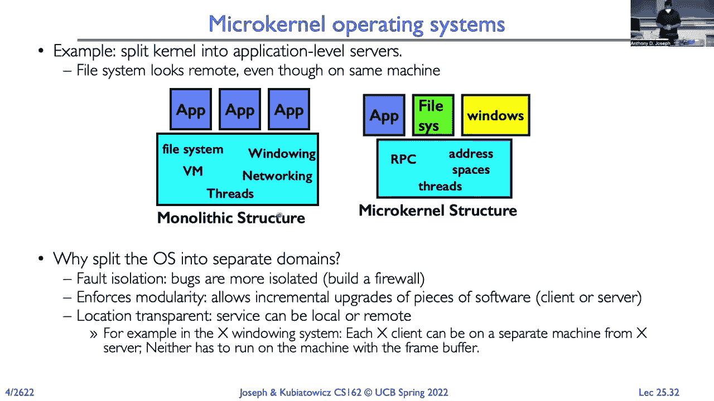

 Okay。 So now let's look at network attached storage。 And with network attached storage。 we have lots of hosts。 So here are all these hosts。 Here are these servers that have storage and these servers are synchronizing the storage。 That's a host can read from any server。 And my colleague。

 Professor Brewer has a theorem of the cap theory。 So between these servers， we want consistency。 So changes that are coming in from， say， this client and to this server and changes that。 are coming in from this client to this server， there's some serial ordering of because they're。 all tuned in the same data， just replicated across the stories， one， and sure there's。

 some serial order。 Right。 And everyone sees the same serial order。 So a， before b。 occurred before c。 You also want availability。 So anybody here can get a result。 Right。 So if I want to read some value， read some object that's stored in this replicated， system。 I can read and get the value。 You also want partition power。 So if I slice a line， you know。

 in this machine here down in the lower right， it's disconnected。 I still want the system to continue to be able to work。 So these hosts here are connected to this server。 I want them to continue to be able to， you know。 read and write。 So what the camp theorem says is if you have these， if you want consistency。

 you want availability， you want partition tolerance， you can't have all great。 So for example。 if you want consistency， so everything appears in the same serial order。 So this host is writing in the upper left and this host in the lower right is upper left。 one is writing here， the root， this server down here， we're writing this server， replicating。

 the same modifying the same value。 I want them to see a， b， c， b， e as your， you know。 write your goal。 And I want them to see that same order。 So one doesn't see a， c， b。 and the other sees a， b， c。 They both see a， b， c。 In fact。 everybody reads those same objects or same object sees the right a， then the right， c。

 And then availability， I want everybody to be able to be reading and writing at the， same time。 Well， if I partition my networks and now this server is disconnected and these two hosts。 are writing to the server， then now I can't have， I can't have consistency because if these。 servers are writing that same object， they're writing D E F， well， these machines over here。

 aren't going to see it。 Right。 So I can't have consistency availability and then also tolerate position。 And the same thing， if I want availability and the ability to talk， how are partitioning。 then you could， everybody could read， but I can't allow rights because then I can't have。 consistency。 I don't really have availability。 And so you do the mental exercise。

 but if you try to see， you'll see， you say， I want， consistency and partition tolerance。 but I can't have availability。 If I want availability and consistency， I can't have the control。 And so。 So this is also known as Brewers Theorem。 There's developed by Eric Blue proposed by Eric Blue。 Yes。 But then you could dynamically switch， but there's going to be， if there's a partition。

 I may not be able to see servers or hosts on the other side of that network partition。 Right。 So imagine， you know， I cut the US in half， you know， the East Coast machines might wouldn't。 be able to see the West Coast machine， but they might be able to see some of the central。 machines and vice versa， you know， from the West Coast， I can see East Coast， but I could。

 potentially see some of the sample。 So this is really fundamental， right？

 Because this means when we're thinking about the shrimpy systems and how we're dissolving， them。 we have to recognize that we can't have all three of these properties， even though， you know。 if I find build a， I don't know， distributed financial system， I want all three。 of these properties。 I can't have them。 Okay。 So some administrative stuff。

 The term three is coming up on Thursday and it's from seven to nine PM going to cover all。 course material with a focus on the material since the last minute。 It was a review session yesterday and we saved that video for you。 Okay。 So distributed file system。 So here we have a client that wants to read a file from the server。

 We want transparent access to files that are stored on our motor。 So the way we can do this is we can mount remote file systems into our local file system。 Now just as transparent， it looks like I'm accessing a local file， but I'm really accessing。 a file that's on another server。 We can do this by specifying by hosting and port or we can have some binding service that。

 maps automatically to a particular machine or we can do it with global unique names or。

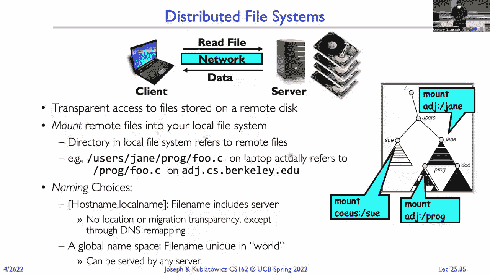

 all of the above。 What enables this is in units and POSIX like systems。 we have the virtual file system。 So the virtual file system。 just think of it as a layer of indirection on file systems。

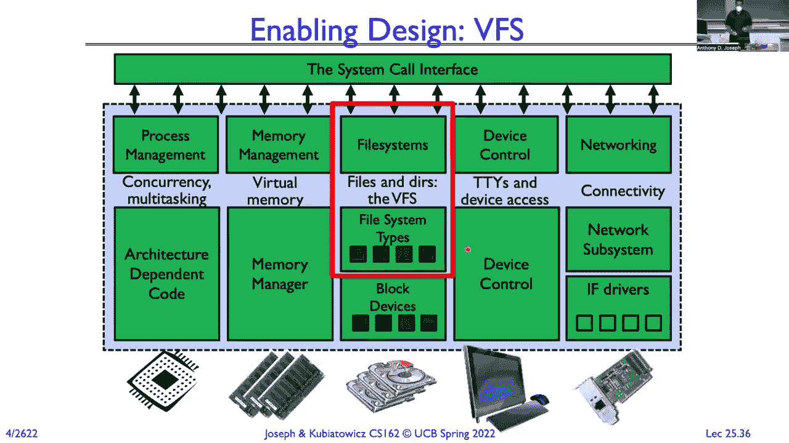

 So at the user level， we're doing read， that gets translated into the C， we call the C library。 function to be read， we do a system call and that traps into the kernel and then dispatches。 out the handle。 Instead of dispatching directly through the file system of interest。 we're going to dispatch， the virtual file system handle。 So the virtual file system handler again。

 you can think of it as just a layer of indirection。 So it's providing the same kind of functions that a real file system would provide。 So super blocks。 I-nodes， files， directories and so on。 And they designed a virtual file system API to be consistent with what underlying file。 systems can offer。 Okay。 So four primary objects， super block， I-nodes。

 directory entry and file object。 I don't have time to go into detail but basically those map onto what you find in a typical。 file system。 Not every file system will have the same analogies and so sometimes I'll have to be a little translation。 like the fat file system doesn't have a super block。 Okay。 So simple distributed file system。 clients issue remote procedure call， open a file。 Okay， read the contents of the file。

 So we just simply translate those disc calls， read， open， elsie， write， flush and everything。 into remote procedure calls。 No cache。 The advantage here is the server gives this a consistent view。 right？ Because every request goes from my laptop all the way to the server and then comes back。 So multiple clients are doing the same thing。 The canonical copy is at the server。 But of course。

 problems here in different formats。 Right？ Because every request I'm making goes across the network。 So I'm inferring latency。 I'm going to be limited by the bandwidth in the network。 I'm going to be limited by how many requests per second IO operations per second， the server。 can do。 So the server is going to be a bottleneck。

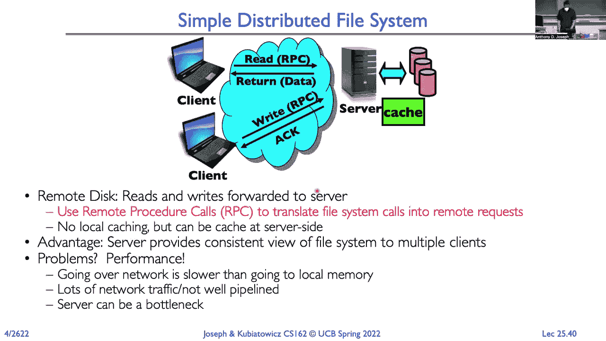

 So we can add caches， right？ And so I'll put a cache at the client and at the server。 So now some operations can be done locally and reduce the load on the server。 So now when I do a read， the read a value for say F1， I'll cache it at the server， return。 back the value。 Multiple reads all served out of the cache local performance。 Right？

 So that is an RPC， but it's all local to the virtual file system。 But disadvantage is what happens if I do a write and a machine and then crack and lose， the data。 Right？ Another problem。 So maybe I can write code as an alternative。 Another problem is that。 so in this case， if I crack and I wrote it and I got the acknowledgement， I know it's okay。

 Another problem is cache consistency。 Right？ When this first post reads。 it's going to get the old value not from move out。 It's getting V1 instead of getting V2。 Right？

 So there's inconsistent。

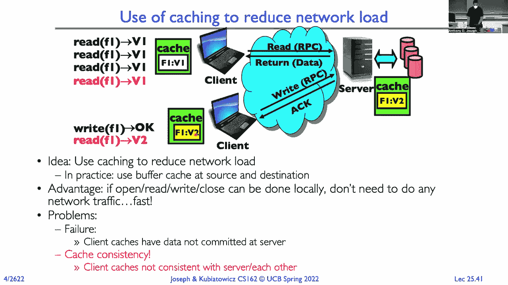

 So what happens if the server crashes？ Right？ Does the client wait until it comes back up？

 Does it continue operating out of its cache？ If there were changes in the service cache。 were those in nonvolatile RAM instead of be， committed？ Or do they get lost？ Right？

 What if there's shared state across the remote procedure code？ Right？ Typically in UX， right。 I open a file and then I seek through that file。 Right？ There's a file position。 I mean。 when we keep track of that file position in the phone， well， if I crash， the， server。 I've lost that seek。 So if I'm doing read， read， read， read， read from clients。

 a crash or come back up， the， clients try to do another read。 we're going to read from the beginning of the file。 We need to think about that。 What happens if we delete a file at the server and the server crashes before we get an acknowledgement？

 So what we really want is a stateless protocol。 One of which everything that we need for that protocol is in that request。 We also want operations to be item hope。 So I can repeat them any number of times and I get the same result。 If I write 100 for memory， to a given number location， I can do that 10 times。 I can do that 100 times。 The end result is always going to be 100 in that number of times。

 All right。 So in that case， when I find times out， I can just re-try an operation。 And there are items to be the result is going to be the same。 There are other examples of stateless protocols like HTTP， where we put a cookie that encodes。 our session state in that cookie。 All right。 So I want to talk about two file systems。

 really quickly， NFS。 Three layers for NFS， Unix file system interface。 So this is the standard libc operation to open， close， see， and so on。 The VFS layer。 that's the layer of indirection that tells which file system type we're going， to。 And then there's the NFS service， which implements the protocol。 The RPC encoding method。

 we use the XDR representation。 So there's a whole library for doing that。 And it implements all of the functions that we need， like being able to read and write， directories。 manipulate links， delete files， open files， close files， write， and so on。 NFS uses write group cache。 So when clients do a write。

 that gets written all the way back to the server， we wait for， the acknowledgment。 So we lose some of the benefits of caching， but we know that when we do a write in NFS。 it goes to the server。 All right。 So now if we're doing caching。 we need some way of figuring out what's going on in the， cache。

 and we'll come back and divide it in just a second。 The servers themselves are stateless。 So everything in a request to the server， indeed， everything we need。 So that means it has to contain a position， not just simply read something from an open， file。 And in fact， we don't have open and close because there's no state in team at the server。

 The request comes in， it's just read from this I know， I number rather， at this location。 This number of bytes。 It's item potent， so we can perform multiple requests multiple times。 So reading and writing， that's pretty simple。 If you delete a file。 we can do that actually multiple times。 You can say， "Rm multiple times。"。

 If the file doesn't exist， the server is just going to say， "Hey， by the way， that file。 doesn't exist。"， That's okay。 Failures are where NFS has a problem。 There's two options。 Server crashes。 What does the client do？ The other option is to find just wait。 But what if it takes a week for the server to come back up because we have to get a part？

 Server is going to wait for the week。 The other alternative is that it returns an error。 Well。 what if the client doesn't know about errors because the client's written before。 NFS existed and so it expects them to write a file or read a file and get back the data。 So that can be a problem。 That's why they allow you to have the blocking option is for old clients that don't know。

 how to deal with errors， you have them blocked。 But for modern clients。 they get the error and then they figure out how to convey that， to the user。 Okay。 So here's the architecture。 And again， we have this VFS layer， but you make system calls。 They go through the VFS layer to the NFS client。 They get RPCed over to the server。

 And then the server calls the VFS interface to the actual file system。 So I can have multiple different types of file systems at my NFL server。 Existency。 We do consistency with week consistency。 So client poll every three to 30 seconds。 ask the server as a value has a file change。 The answer is no。 Right。 The answer is yes。

 Then the client will switch to using the new version。 So here it holds to say that one's still okay。 It gets old。 No， it's now the two。 And so now it's a group。 If multiple clients are writing for the same file， NFS is a problem。 Because they're independent。 you know， right， there's no notion of any kind of blocking or， anything like that。

 And so when one 62 used to operate off of a common file server， project group sometimes。 would use the same directory for everyone。 So you can imagine on the night the projects do everybody saving their C files and ending。 up the part like blocks would get in from different files。 So we told them when we separate the records。 Okay。

 So if we think about the kind of ordering that we might want， we want some kind of sequential。 ordering constraint。 So what we're going to say is if you started a write and finish that right before another。 one starts on another client， you get the new value。 If you start that read while the write is in progress， you could get either the old。

 value or you get the new value。 Like， that's what would happen on a local machine is you might get either the old or。 the new depending on what the order is。 So for NFS， if you start more than 30 seconds later。 you're going to get the new version。 You start before that， you'll get maybe the old version。 maybe some partial version。 It's ill defined。 So NFS is super simple， highly portable。

 the disadvantages sometimes have been consistent， right because of this whole employee。 And you have to keep checking。 Right。 So it's like your little brother， a little sister， you know。 in the car asking， are we， there yet？ Are we there yet？ It's really annoying really quickly。 And kind of if you have a lot of siblings， it overloads the service and the polling traffic。

 can be a problem。 All right。 So I'm going to skip over NFS and go to summary。 So TCP gives us a reliable byte stream between two processes。 We've seen how we can use a window based protocol for acknowledgments and how we dynamically。 adapt the congestion。 RPC lets us make remote procedure calls that will be exactly like local procedure calls。

 Lots of issues under the covers about marshalling and un-marshalling。 And distributing file systems give us transparent access to files stored on other machines。 We can use passion for performance and we enable all this with a virtual file system。 layer that gives us a level of interaction that allows us now to have a publicly file， system。

 So this is why modern operating systems are able to support many different file systems。 simultaneously that you don't have to change your application every time someone adds a。 new file system。 And then with the cache consumes consistency in NFS， it uses polling。 I think it has a chance to talk about Andrew， but the Andrew file system uses all that instead。

 And so with that， we've covered lots of topics in this class。 I hope you have enjoyed this class。 I hope you've enjoyed the home works and the projects。 They haven't been too challenging for you。 And I want to wish everybody good luck on midterm number three and say thank you for， taking 162。 Thanks and have a great summer also。 Bye。

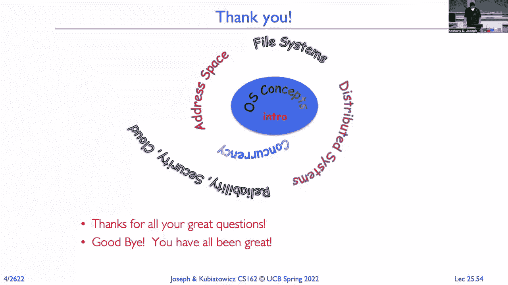

 [BLANK_AUDIO]。