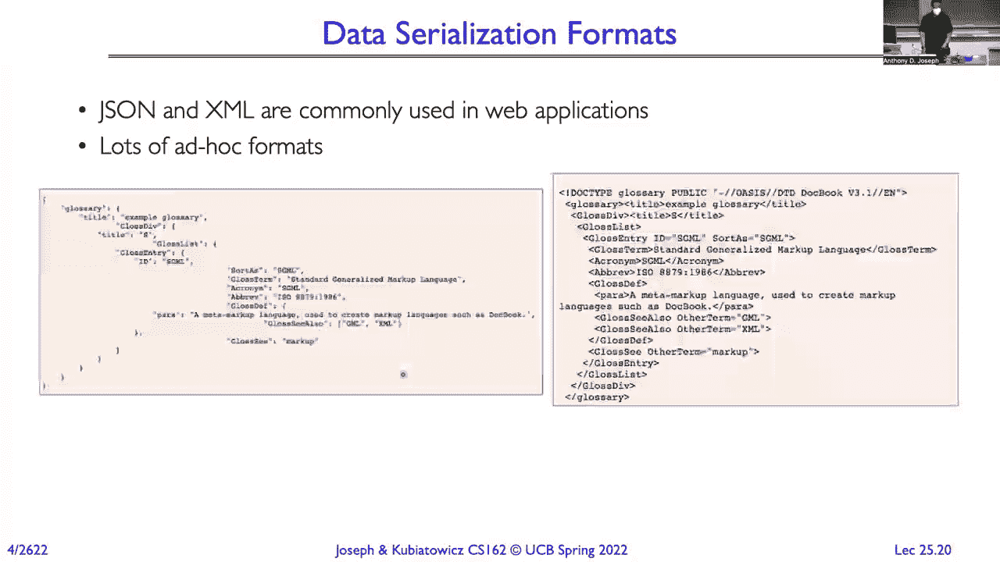
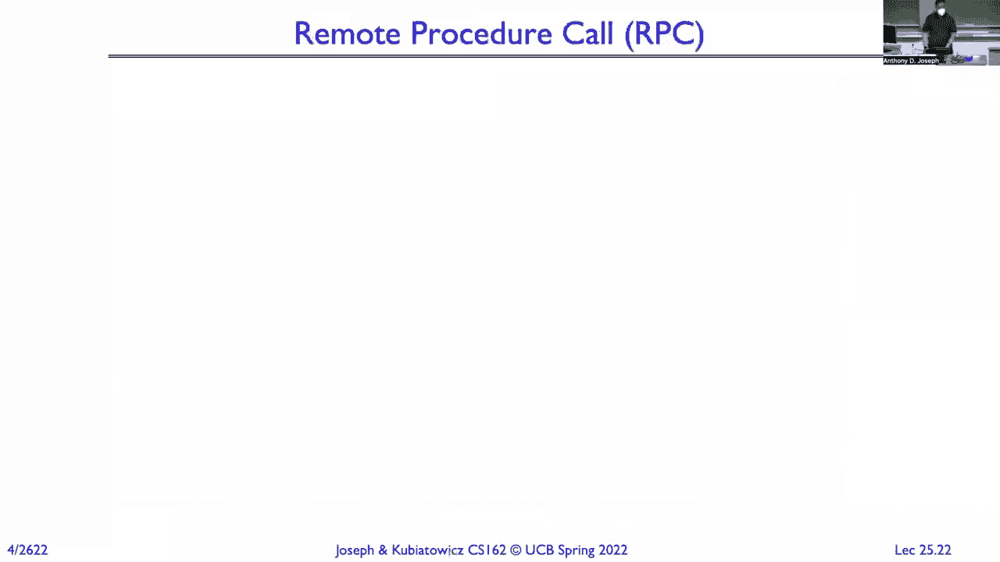
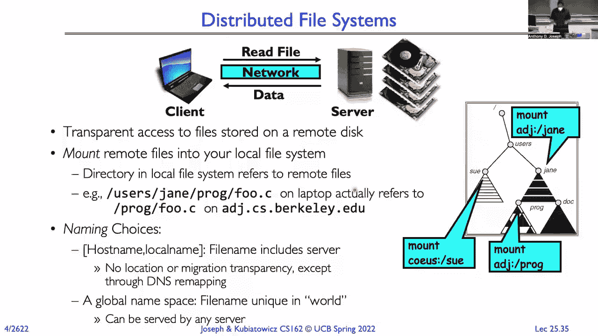

# 课程 P25：RPC、NFS 和 AFS 🖥️🌐

在本节课中，我们将要学习传输控制协议（TCP）的拥塞控制机制，然后深入探讨远程过程调用（RPC）的原理，最后介绍分布式文件系统，特别是网络文件系统（NFS）和安德鲁文件系统（AFS）的基本概念。

---

## TCP 拥塞控制 🚦

上一节我们介绍了 TCP 如何通过滑动窗口协议实现可靠传输。本节中我们来看看 TCP 如何避免网络拥塞，成为一个良好的互联网公民。

拥塞是指网络中某个部分（如链路或路由器）尝试传输的数据过多，超出了其处理能力。这可能导致数据包被丢弃。TCP 的拥塞控制目标是在不压垮网络的前提下，尽可能高效地利用带宽。

TCP 通过动态调整发送窗口的大小来实现拥塞控制。其核心算法是“慢启动”和“拥塞避免”，遵循“加性增，乘性减”的原则。

以下是拥塞控制的基本流程：
1.  **慢启动**：连接开始时，窗口从一个很小的值（如1个MSS）开始。每收到一个确认（ACK），窗口大小就增加一个MSS。这使得发送速率呈指数增长，快速探测可用带宽。
2.  **拥塞避免**：当窗口大小达到一个阈值（`ssthresh`）后，进入拥塞避免阶段。此时，每经过一个往返时间（RTT），窗口大小只增加一个MSS，变为线性增长。
3.  **拥塞检测**：当检测到数据包丢失（通过超时或收到三个重复ACK）时，TCP 认为发生了拥塞。
    *   将 `ssthresh` 设置为当前拥塞窗口大小的一半。
    *   将拥塞窗口重置为一个很小的值（慢启动起点），然后重新开始慢启动过程（如果是由超时触发），或者直接将窗口减半并进入拥塞避免阶段（如果是由重复ACK触发）。

通过这种方式，TCP 的发送窗口大小会围绕网络的实际承载能力动态振荡，在避免拥塞的同时尽力利用带宽。

---

## 远程过程调用（RPC）📞

在了解了底层网络传输机制后，我们来看如何构建分布式应用。直接处理消息和套接字非常复杂，远程过程调用（RPC）旨在简化这一过程。

RPC 的目标是让调用远程机器上的服务，看起来就像调用本地函数一样简单。它隐藏了网络通信、数据序列化等细节。

### RPC 的工作原理



以下是 RPC 调用的基本步骤：
1.  **客户端调用**：客户端程序调用一个本地函数（客户端存根）。
2.  **参数封送**：客户端存根将函数参数从本地格式序列化为网络标准格式（如XDR），并打包成网络消息。
3.  **网络传输**：消息通过网络发送到服务器。
4.  **服务器解包**：服务器端的存根接收消息，将参数反序列化为服务器本地格式。
5.  **本地调用**：服务器存根调用实际的服务器函数。
6.  **结果返回**：服务器函数执行完毕，将结果返回给服务器存根。
7.  **结果封送**：服务器存根将结果序列化，打包成响应消息发回客户端。
8.  **客户端接收**：客户端存根接收响应，反序列化结果，并将其返回给最初的客户端调用者。





从程序员视角看，整个过程就像一个普通的函数调用 `result = remote_function(arguments)`。

### RPC 的关键问题与挑战


实现 RPC 需要解决几个核心问题：

*   **数据表示（序列化/反序列化）**：不同机器可能有不同的字节序（大端/小端）、整数大小等。RPC 使用一种标准的网络格式（如大端字节序）进行数据交换。函数 `htonl()`, `ntohl()` 等用于主机字节序和网络字节序之间的转换。
    ```c
    // 示例：将32位主机字节序整数转换为网络字节序
    uint32_t host_value = 123456;
    uint32_t network_value = htonl(host_value);
    ```
*   **接口定义**：客户端和服务器必须就函数名、参数类型和返回类型达成一致。通常使用接口定义语言（IDL）来定义接口，然后由工具自动生成客户端和服务器存根代码。
*   **绑定**：客户端如何找到服务器？这可以通过静态配置、动态查询名称服务（如LDAP、DNS）或目录服务来实现。
*   **故障处理**：RPC 可能面临本地调用不会遇到的故障：网络中断、服务器崩溃、客户端崩溃等。RPC 系统需要处理超时、重试和错误报告。
*   **性能**：RPC 比本地调用慢得多，涉及网络延迟和数据拷贝开销。设计时需要权衡透明性和性能。

---

## 分布式文件系统 📂

RPC 的一个重要应用场景是构建分布式文件系统。它允许客户端像访问本地文件一样，透明地访问存储在远程服务器上的文件。

### 虚拟文件系统（VFS）层

现代操作系统通过虚拟文件系统（VFS）层来支持多种文件系统。VFS 定义了一组通用操作接口（如 `open`, `read`, `write`, `close`）。当应用程序发起系统调用时，VFS 将其路由到具体的文件系统实现（如 ext4, NTFS, NFS 客户端）。

### 网络文件系统（NFS）

NFS 是一个经典的分布式文件系统协议。其核心设计思想是 **无状态服务器** 和 **幂等操作**。

*   **无状态**：服务器不保存客户端会话状态（如打开文件表、文件偏移量）。每个请求（如“从文件X的偏移量Y读取Z字节”）都包含完成操作所需的全部信息。
*   **幂等性**：操作可以安全地重复执行多次而效果相同。例如，重复发送“删除文件A”的请求，最终结果都是文件A被删除（如果存在）。

这种设计简化了服务器的实现，并易于处理客户端或服务器崩溃后的恢复。客户端只需重试未完成的请求即可。


### 缓存与一致性问题

为了提高性能，客户端会在本地缓存经常访问的文件数据。但这引入了 **缓存一致性问题**：当某个客户端修改了文件，其他客户端缓存中的旧数据就过时了。

NFS 采用 **弱一致性模型** 来解决这个问题：
*   客户端定期（例如每3到30秒）向服务器轮询，检查缓存的文件属性（如修改时间）是否已改变。
*   如果发现改变，客户端会使对应的缓存数据失效，并在下次访问时从服务器获取新数据。
*   这种模型简单，但存在“更新可见延迟”，在轮询间隔内，客户端可能读到旧数据。




### 安德鲁文件系统（AFS）简介


AFS 是另一个著名的分布式文件系统，它在设计上更侧重于可扩展性和广域网性能。
*   **回调机制**：与 NFS 的轮询不同，AFS 服务器会在文件被修改时，主动通知持有该文件缓存的客户端（回调），使其缓存失效。这减少了网络轮询流量。
*   **会话语义**：AFS 对文件修改提供了更清晰的语义。文件通常在关闭时才将修改写回服务器，这减少了网络写操作，但可能增加不同客户端看到不一致状态的时间窗口。


---

## 总结 🎯

本节课中我们一起学习了构建分布式系统的几个核心概念：

1.  **TCP 拥塞控制**：TCP 通过“慢启动”和“加性增，乘性减”的窗口调整算法，在保证可靠传输的同时，避免网络过载，公平地共享带宽。
2.  **远程过程调用（RPC）**：RPC 抽象了网络通信细节，使远程服务调用如同本地函数调用。它涉及存根生成、数据序列化、绑定和复杂的故障处理。
3.  **分布式文件系统**：以 NFS 为例，我们了解了如何通过 VFS 层和 RPC 透明地访问远程文件。其无状态和幂等性的设计简化了容错，而客户端缓存与弱一致性模型的权衡则体现了分布式系统设计的经典挑战。


理解这些基础机制，是进一步学习现代分布式计算、云存储和微服务架构的重要基石。