# P3：第三讲：进程、系统调用和Fork - RubatoTheEmber - BV1L541117gr

欢迎大家回到CS162的第三讲，我们将从上次的内容继续。

如果你还记得我们上次谈到的四个操作系统的基本概念，这些概念帮助我们直接进入操作系统在调度方面的核心内容。一个是线程的概念，它是一个执行上下文，像是一个虚拟CPU或处理器。

完整描述程序状态的内容包括程序计数器、寄存器、执行标志、堆栈等。我们讨论了地址空间，包括有翻译和没有翻译的情况。基本上，地址空间就是程序可以访问的内存地址集合，它们可能与物理机器的内存空间不同，因此从原则上来说。

每个地址空间在访问地址时可能会有所不同，但它们通常都有相同的地址集合。一个进程将这些地址集合起来，形成一个正在运行的程序实例。它实际上是一个受保护的地址空间，并且包含一个或多个线程，今天我们将更详细地探讨这个主题，也在Piazza上进行了很多很好的讨论。

你可以从第二讲中查看这些内容，我相信它们会继续出现在第三讲中。最后我们谈到的一个非常重要的硬件组件，实际上就是帮助将这一切串联起来的双模式操作。

在至少有两种模式的系统和用户模式下，其中一种模式，即系统模式，拥有比另一种模式更高的权限，这种模式是用户模式。除非你有类似的设置，否则很难在系统中加入任何形式的保护措施。因此，这种双模式操作也会非常重要。好的。

所以，正如我们上次提到的，操作系统的核心功能实际上是运行程序。记住，程序就像是一个原始进程，它准备好运行但还未执行。你做的事情是，通常通过某种程序源，比如C语言或你喜欢的其他语言，生成程序。它经过编译和链接后，变成可执行文件。然后它可以被加载并变成一个进程，而这个进程就是一个正在执行的程序。

好的，没问题，接下来这一整条路径，从编写源代码、编译到运行，是你在这个学期会经常做的事情，随着项目和作业的推进，你会不断接触到这些内容。还要注意，不仅仅是用户程序我们会涉及，操作系统本身也会被我们修改。

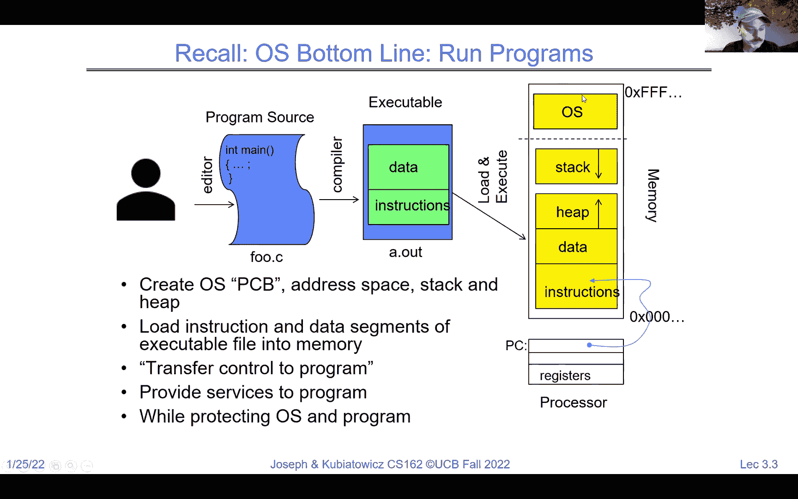

另一个我们想要提醒你的是保护地址空间的概念。其实这是一个相当简单的概念。它的意思是，处理器有一组地址，我们称之为虚拟地址，这些地址通过某种翻译器，变成物理地址，最终用来寻址物理内存。

作为翻译器的这个概念，在整个学期中会给你展示一些实例。但请记住，处理器使用的地址和实际的物理地址（指向 DRAM 或其他存储介质）是不同的。

它们是不同的。好的，另一个我们上次讨论的内容，只是为了帮助你回忆一下我们走到哪里了，那就是一个类似这样的图，试图把一切整合起来，展示进程的概念。我们可以在一个进程中拥有多个线程。所以这里最简单的情况其实是单线程进程。

我们可以根据需要添加更多线程。好的，PCB（进程控制块）基本上就是进程控制块，我们将详细讨论它。但如果你注意到这里，单线程进程的情况，我们可以看到线程封装了并发部分，即实际运行的部分，而地址空间则是存储或保护环境的部分。

每个线程通常都有寄存器和栈，可能会存储在内存中，以便在不运行时使用。如果你看这个多线程的例子，我们实际上为每个线程都有与之相关的寄存器和栈。

好的。关于多线程的问题在 Piazza 上也有很多很好的提问。请注意，这个保护环境封装了多线程环境中的所有线程。所以在这里，我们有三个线程，它们共享相同的保护域。这意味着它们可能会互相覆盖，造成意外情况。

但我们希望它们处于相同的保护域，因为这样它们共享信息会更容易。如果我们真的担心恶意行为或数据覆盖，我们会创建一个独立的进程，并为它分配自己的线程。所以在一个进程内，所有线程共享相同的内存，而进程之间则是相互隔离的，互相保护。好的，关于如何实现这种保护，我们将在今天的课程中深入讨论。

所以又有一个好问题，这些线程，比如说多线程的那些，都是同一个应用程序的一部分吗？是的，它们都是同一个应用程序的一部分，都是由同一个写入者生成的，或者它们被链接在一起，等等。因此，不同的进程可以是不同的应用程序。我们还将在这节课的最后讨论如何为一个应用程序创建多个进程。

但你每个进程中永远不会有多个应用程序。好的，因为那是保护域。现在，如果你还记得，我们开始理解地址空间和翻译的整个过程时，用的是我称之为基址和边界翻译的这个非常简单的例子。

这里的想法是，磁盘上的程序镜像包含代码和数据，并且需要为堆和栈留出空间。我们可以把它当作从零地址开始的链接。当我们开始运行时，物理内存可能会有多个相同程序的实例，或者可能有不同的程序。它们都会在内存中有不同的区域来存储它们的数据。

请注意，我在这里用灰色标出了，这也是内核，或者操作系统有自己的区域。好的。在这个特定的实例中，我们注意到，由于我们将这个黄色部分或者程序（即进程）放到了从一零零开始的内存位置，它将不再能够从零开始运行，除非我们做些什么，而这就是翻译发挥作用的地方。因此，即使处理器提到像零零一零这样的地址，

这样在这里就有意义了，因为我们有一个基址和边界的基址红色地址和边界。我们实际上是将基址加到处理器所做的操作上。最终结果就是一个翻译后的地址，它在物理上是适用的，所以如果你看看这里，CPU说的是零零一零，这个地址在静态数据区域内。数据地址。

硬件中添加了基地址，因此这些地址在物理内存中也变得有意义。现在有一个问题，这里有几个有趣的问题，一个是操作系统是什么？第二个问题是，是否可以在没有翻译的情况下进行保护？答案是，当然可以，完全可以。所以我们展示的第一个基址和边界版本，就是上次我们提到的。

星期四的那一周没有这个小加号，所有它做的就是确保程序中的地址位于基址和不超过边界的范围内。这意味着当你从磁盘中取数据时，必须通过动态链接器进行翻译，才能将其放入内存。

一旦我们把动态翻译引入进来，CPU就可以继续使用它认为存在的地址，这些地址是相对于镜像的，硬件会为你进行翻译。好的，现在关于基址和边界是否总是使用一个常量偏移的问题，答案是否定的。操作系统将这个黄色部分加载进去后，设置它的基地址以及它的边界地址，表示它的大小。

我们可以，嗯，我们可以在内存的不同部分放置另一个副本的黄色区域，并且当它运行时，我们设置一个不同的基址和界限。好吧，明白了，现在我们回到刚才的话题。这里有一个很好的问题，关于操作系统如何防止恶意进程通过生成许多线程来发起拒绝服务攻击。

这是一个有趣的问题，但可能是从错误的角度来思考，所以一个过程中的所有线程都是其中的一部分。

应用程序是由一个人编写的，因此，如果你启动了太多线程，实际上就是在对自己发起拒绝服务攻击，这叫做一个 bug。

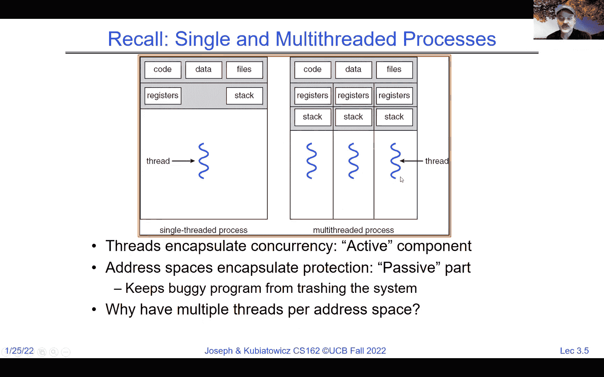

好的，现在注意到由于这个基址和界限，程序正在运行，或者说 CPU 抱歉，没有办法寻址到低于该位置的任何内容，它只能寻址到灰色区域或以上，所以它不能低于这个位置，因为那将是一个负地址，而 CPU 是不支持负地址的。

它不能超出上限，因为如果 CPU 尝试使用一个超出界限的地址，就会触发故障。所以我们在这里展示的内容基本上可以保护程序不去触及超出其界限的任何内容。

好的，现在我们简要地回顾一下。我在上次讲座的最后开始讲这个话题，我想结束我们讨论的内容。比如你注意到，这里有一个黄色程序，它现在是一个正在运行的进程。

我们还有一个状态是“空闲”是绿色的。我们有一个空闲的内核，它是灰色的。所以现在假设我上次说过，整个系统只有一个核心或一个 CPU。在这种情况下，当我们运行用户代码时，我们没有在其他地方运行。

因此，这些寄存器，表示 CPU 上的寄存器，注意到程序计数器指向代码中的某个位置。栈指针指向栈中的某个位置。我们在这里设置了基址和界限，从 100 开始，然后是最大界限。结果是这个程序在黄色区域中愉快地运行。

并且注意到我们这里有一个系统模式位，它的值为零，表示我们不在系统模式下，而是在用户模式下。因此，这个当前的执行环境是这样的：如果代码有缺陷，并且它试图寻址到应该不在的区域。

会发生故障，操作系统会接管。好的。所以，当然，正如你可能想象的那样，如果我们永远无法离开黄色区域，那么我们就无法运行操作系统，也无法运行任何其他进程，所以显然必须有一种方法可以从黄色区域跳到内核区域，我们会进一步讨论这个问题。

无论是自愿让步还是定时器中断等，随着我们继续进行，问题的核心是，假设其中一个事件发生，我们如何从这种环境转移到另一个，比如说内核正在运行的环境。你可以想象发生了什么事情，所以首先我们要进入系统模式，这意味着基址绑定被忽略，现在内核将控制一切。

这是一个方面。第二个方面是，我们需要保存当前用户程序正在使用的PC、栈指针以及其他寄存器，我们需要保存这些，以便以后能够恢复它们。好的。并且注意到我们不仅需要保存它们，还要同时开始在内核中运行。

所以我们假设例如发生了一个中断，看看这里有什么不同之处。基址绑定（代表黄色部分的那个）没有使用，因为我们处于系统模式1，因此它基本上允许访问所有地址范围。

另外，正在运行的程序计数器（PC）现在被存储在用户PC寄存器中，这就像一个寄存器，用于在中断发生后跟踪我们从哪里来。好的，我们现在有了新的中断代码，它将是一个中断向量，带我们进入操作系统。

假设我们所有操作都很干净，此时操作系统可以保存黄色进程的所有其他寄存器，然后可能允许绿色进程运行。好的。现在，这里有个问题：如果虚拟内存空间包含了所有内容，那么如何可能会发生段错误呢？

基本上，随着我们继续讲解，我们会更多地谈到这一点，但这里有一个例子，说明我们正在运行的段是一个有限的大小，如果你试图访问超出该范围的地方，就会发生段错误（segmentation fault）。但这意味着操作系统可以选择增大段的大小，从而创造出无限内存的幻觉。

好的。现在这个中断向量实际上并没有存储任何状态，它存储的是发生了什么中断的指针，这可能是磁盘有数据返回，所以中断发生的一部分是，我们将开始在操作系统的一个特殊部分运行。

内核处理这个中断。好的。那么，我们如何保存寄存器并设置系统堆栈以便运行呢？首先，我们把所有的寄存器保存到内存中的某个地方。好的，内核可以这样做，因为我们处于系统模式，所以它有权限访问所有寄存器。

你知道，我们可以访问所有的内存，然后我们可以加载预系统。并预加载绿色进程并使其准备好运行。所以请注意，我所做的是找到了早些时候提到的黄色进程的进程控制块，我们找到了绿色进程的进程控制块。

我们加载它。我们为绿色设置基址和界限，设置用户PC，准备好栈，然后我们要做的是执行返回用户模式的操作，顺便说一下，C.V. 实际上存储在内核的静态数据中，稍后我们会详细讨论这个问题。

当我们返回用户模式时，突然之间我们进入了系统模式0。程序计数器从用户PC转移到程序计数器，我们现在在运行用户代码。基址和界限是活动的，栈也处于活动状态，现在这个进程开始运行，就好像它拥有机器的独占控制权一样。好了，现在。

基本上，问题在于你在哪里保存来自不同进程的中断的程序计数器（PC）值。我们现在不要太混淆，所以当中断发生时，它会使用内核栈并开始在上面运行。它可能是与当前用户进程相关的内核栈，等等。我们稍后会讨论。好了，暂时搁置这个问题，稍后在讲座中再提问吧。

好的。但现在先理解这一点：如果你回看中断发生后的情况。假设这是一个定时器中断，我们有用户的PC，内核现在可以将它保存到PCV中，并为绿色进程加载PCV，我们就可以继续了。

好的，现在，我们已经恢复并正在运行绿色进程。那么，是否还有其他问题呢？我刚才向你展示的这个简单的概念是这样的：我们正在运行黄色进程时发生了中断。我们运行调度代码，保存黄色进程，运行绿色进程，然后我们会在两者之间来回切换，这样基本上就会给我们一种黄色和绿色进程同时运行的假象。

好的，没错，也许我误解了，是的，每个进程都有自己的PCB。

那么，我们如何运行多个程序呢？现在我们已经有了基本机制，可以在内核中切换用户进程。刚才我们展示了从黄色切换到绿色，接下来同样的机制也适用于从绿色切换回黄色。内核可以在用户进程之间切换，并保护操作系统免受用户进程的影响，同时也可以保护进程不互相干扰。

这就是我向你展示的带有分支限界的保护域，分支限界的基本机制真的起到了保护作用。它将所有的用户进程相互隔离，并防止它们干扰内核。内核负责一切，所以内核。如果你在这个基本模型中突破了内核，你就可以。

你可以丢掉所有东西，但我们暂时假设内核没有被突破。好了，我们有很多问题，其中一个我会立即回答，那就是如果它们不适合内存怎么办。这是一个好问题。现在，这个模型在黄色或绿色进程如果尝试增长得过大时就不太适用了。

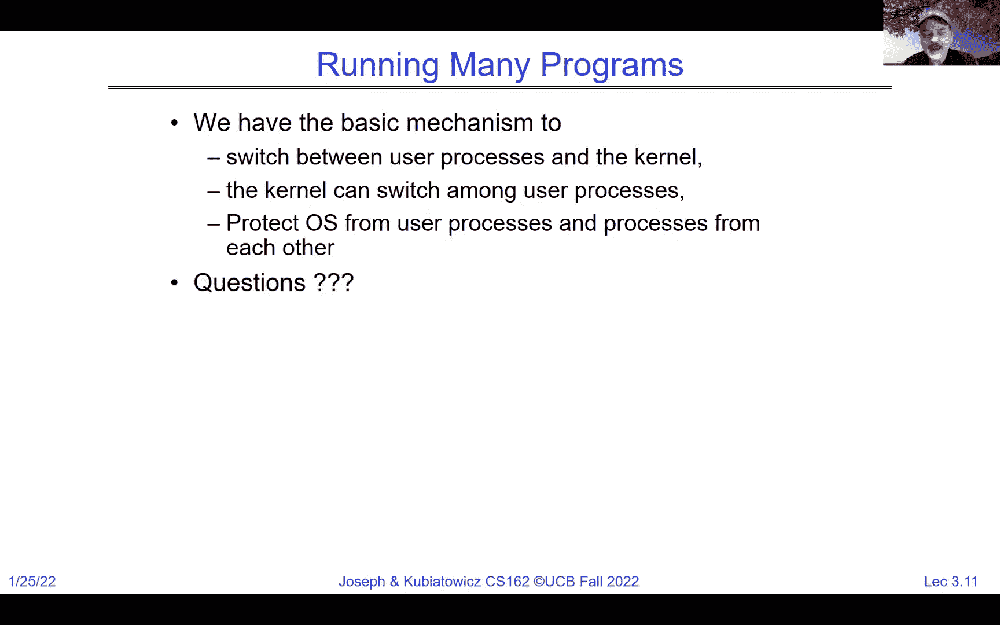

所以我们会遇到一些问题。 好的，因为我们要求整个程序必须适应在一块连续的内存区域内，所以我们很快就会放弃分支和界限（branch and bound）或基址和界限（base and bound）作为我们期望的机制。

好的。 在用户模式和内核模式之间切换的是硬件。 当处理器接收到中断时，它会执行这个操作。 它就是执行这种切换的组件。 好的，它就是进行用户模式到系统模式的双重模式切换的那个东西。

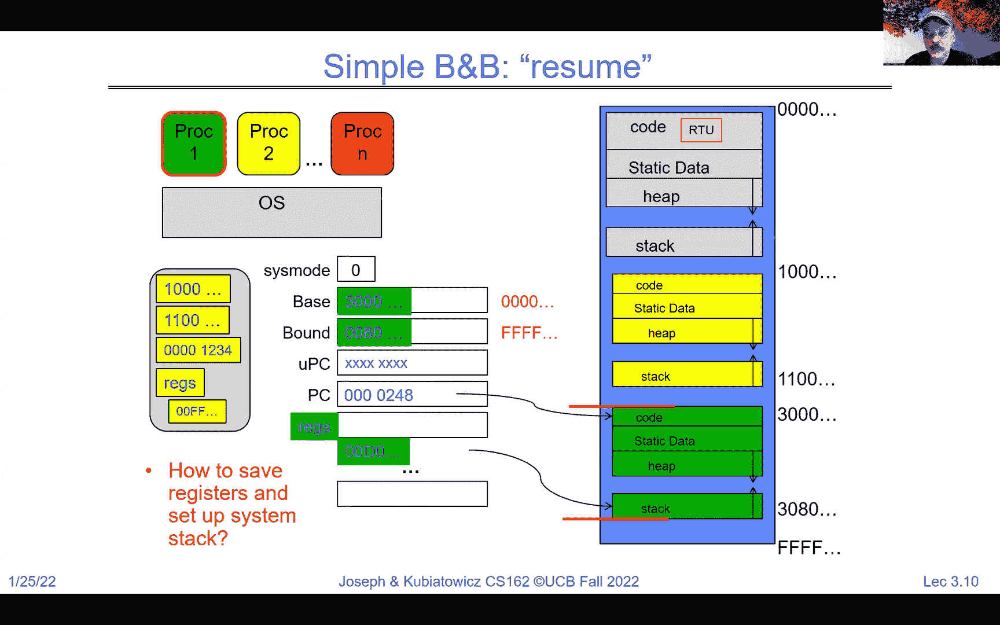

我们如何在操作系统中表示用户进程？ 我们提到过，每个进程都有一个 PCB。 我们如何决定运行哪个用户进程？ 这是一个好问题，这就是调度（scheduling），我们接下来会有一个关于调度的完整单元。 但是，仅仅因为我们能够在绿色和黄色之间切换，以及在黄色和绿色之间切换，并不意味着一切都已经解决。

它并没有告诉我们切换的时机或为每个进程分配多少时间。 那是一个完全不同的话题，实际上相当有趣，因为有很多原因可能导致你给某个进程更多的时间，或者立即中断它，等等。

我们将会详细讨论这个问题。 接下来，我们如何打包进程并将其搁置？ 我们刚才已经展示了，基本上是将它的寄存器卸载到进程控制块中。 如何为内核设置堆栈和堆？ 这个问题很有趣，我们需要谈论其中的一些内容。 内存分配。 看起来通过强制加载所有用户程序到内存中并不会浪费很多内存。

当然。 所以我们将不得不开始讨论交换（swapping），最终我们还会讨论分页（paging），这是更为简洁的方法。 但是进程控制块是一个关键部分，你知道不同的操作系统会有不同的格式，但你可以大致了解它包含了什么。

它包含进程的某些状态。 它包含进程 ID 的编号，可能还知道计数器的值以及一些其他寄存器。 内存限制等。 所有这些内容都在进程控制块中，内核使用它来跟踪进程，尤其是在接下来的几周里，我们主要讨论的是单核或单 CPU 的机器。 大多数进程是空闲的，存储在进程控制块中。

在任何给定时刻，只有一个可以在运行。 好的。 现在，内核调度器是我们接下来要讨论的内容，基本上负责决定哪个进程被调度进来。 我们还可以通过调度器分配非 CPU 资源，如内存、I/O 等。 我会说，正如我们之前提到的，进程控制块（PCB）是每个进程都有一个的，所以每个进程都有。

每个进程都有一个单独的进程控制块，并且它们存储在内核内存中。OK。现在，暂时不用担心恶意行为。用户态到内核态的切换是由内核控制的，关于恶意行为我们会在学期后期更详细地讨论。

但假设到目前为止，一切都在正常发生。那么我们刚才展示的其实是相当简单的。这是两个进程，一个核心。

听起来像是一个广告活动吧——两个进程，一个核心。我们从进程零开始，它是一个用户态的进程。OK。它开始执行。如果你注意到，在这个蓝色箭头的末尾，似乎发生了一个中断。OK。到那个时候，我们会保存足够的进程状态，并进入系统模式。

系统模式实际上是在运行内核代码，这时我们会保存大量信息。我们将这些信息保存到进程控制块（PCB）中的进程零，并从PCB加载进程一的状态。然后我们会开始运行进程一，它同样是在用户模式下运行。OK。注意，关于谁负责分配非CPU资源的问题。

这将是调度程序在某些实例中的组合，以及内核的其他部分。所以我们以后肯定会讨论其他资源。但现在我们先保持事情简单。OK。所以，如果你看这里，你会看到进程零运行了一段时间，发生了一个中断。我们保存状态，重新加载状态，然后在用户模式下重新启动进程零。

我们运行一段时间后，回到进程一，保存状态。然后我们根据调度再次进行操作。如果你注意到这些黄色圆圈，其实代表的是用户态到内核态或内核态到用户态的转换。这些是系统模式发生变化的地方。OK。

另一个需要注意的事项是，在这个特定的图示中，红色部分表示的是100%的开销。对吧。所以之前有个问题是，切换时的开销是什么？好吧，这就是开销。OK。这基本上是处理中断、保存和恢复寄存器的时间，然后做出调度决策。全部都是开销。所以，你可以在早期就开始思考这个问题。

关键是，如果我们切换得太频繁，实际上会导致切换的次数比计算的次数还要多，这似乎是个不好的主意。对吧。所以有一个最小的时间限制，我会给出一个数字，但通常如果时间大于10%，人们会认为你正在进行过度切换（thrashing）。

不用担心那些具体的数字，但是如果你在切换过程中浪费超过10%的CPU周期，可能就不好了。好了。当我说内核内存时，我指的是之前提到的那部分。好了。那么，在保存和重新加载之间运行的是什么？其实，这是一个关于下一步运行什么的决策问题，这就是一个调度器。

今天我不打算详细讨论这个话题。

但是把这个看作一个连续的循环，它说的是，如果有一个就绪进程，就选一个，运行一段时间，然后再返回来继续做。好了，这个循环将由类似计时器、让步或I/O之类的东西触发。我们下次会详细讨论这个话题。好了。那么调度呢？调度又是怎么回事？

这个选择进程的机制是决定哪个进程或线程下一个可以运行的方式，它涉及许多不同的调度策略。所以我们有一些策略可以确保公平性。我们也有一些策略可以提供实时保障，就像你在特斯拉上踩刹车时的情形。

你知道，必须有一些实时保障才行，否则它会撞到什么东西，对吧？也许还有一些优化措施来降低延迟。这些都是有趣的调度策略。所以你会看到很多不同的方式。好了，关于如何理解这个，有个不错的问题是在聊天中提到的，关于操作系统是如何知道哪些寄存器需要保存和恢复的。

这取决于哪些寄存器是活跃的。所以，通常的做法是保存所有的寄存器，除非有更多的信息。你可能会在项目一中发现，如果有FPU在运行，那么你必须保存并恢复FPU寄存器。好了。

我们还想再次强调，我们不希望花太多时间在保存、恢复或调度上。

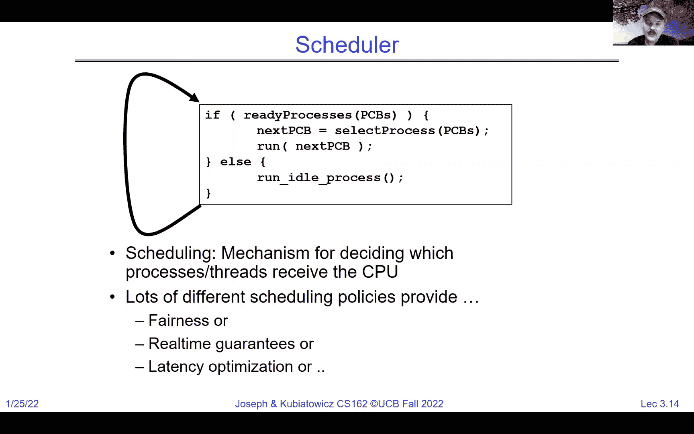

所以我们不想频繁来回切换，再次记住那个10%的数字。

好的，所以在Piazza上有过关于这个话题的讨论，我想我应该提一下。这里有一个叫做“同时多线程”或“超线程”的概念。把这些交给Intel来处理，他们把人们已经知道的同时多线程技术起了个新名字，叫做超线程。

但是核心思想是，硬件是一种调度技术，它基本上允许超标量处理器（可以同时执行多个操作的处理器）同时运行两个、三个或者四个线程，这些线程都在同一流水线中运行。我们不会花太多时间讨论这个，因为这是152课程的内容。

但是如果你看一下，这里是一个单独的CPU，想象时间在这里向下流动，实心块与灰色区域相比，表示实际执行发生的周期。这里请注意，只有一个线程时，我们浪费了管道中的所有灰色时间。

但是如果我们把两个线程放入同一个管道中，那么就能填补这些空白。你可以说，嗯，这是两个管道。实际上这是超线程。所以这将是两个核心。这将是一个核心和两个超线程。两个超线程填补并更好地利用管道。从操作系统的角度看，两个超线程核心和两个核心之间的差异很小。

从架构角度看，这个问题要大得多。我们现在仍然只是在讨论接下来的几周内的一个CPU，一个硬件线程。但当我们开始使用更多的核心时，你会发现更多的核心和超线程对你来说是非常相似的。

我之前在软件中提到的调度实际上是在硬件中发生的。它可能是在每个周期的基础上进行的。所以你可以在同一个周期内有两个不同的线程。现在也要记住，再重复一次，不是接下来的几节课要讲的内容，但要记住，世界是并行的。

即使是在单核级别，你也可以看到像2007年的Skylake这样的处理器，然后是英特尔Xeon处理器的更新版3。很多核心，很多超线程。一个Skylake的例子是28个核心，56个线程。很多并行性。所以即使我们现在讨论的是如何处理一个核心。

一旦我们搞清楚了这一点，那么实际上每个人都能很清楚地理解如何处理多个核心。这不会是个大问题。

好的。是的，您们可以在离线时和我讨论超线程中的硬件策略。但关于资源不足时，谁能去执行是有各种策略的。

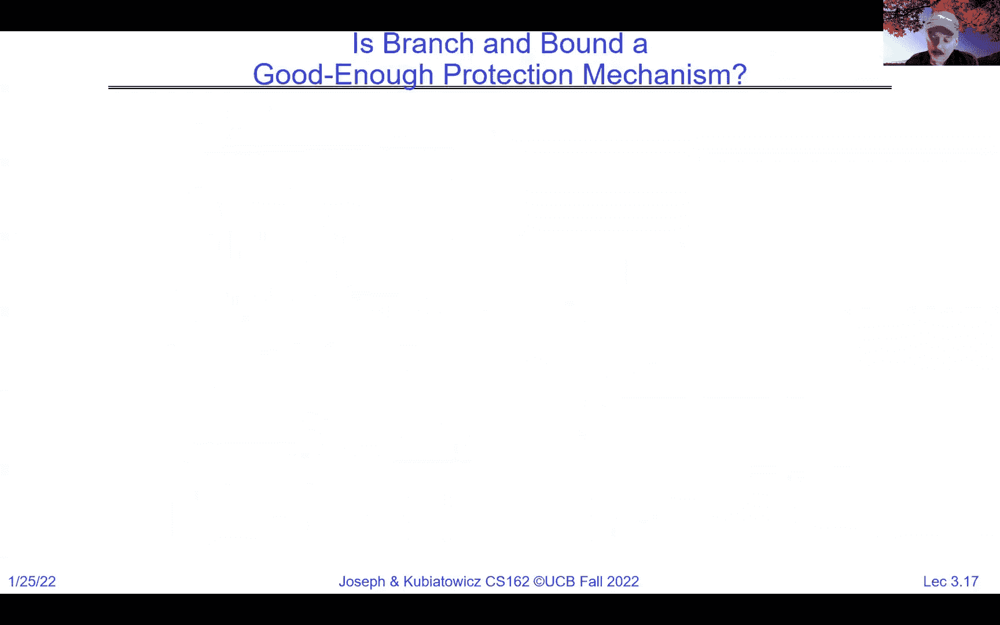

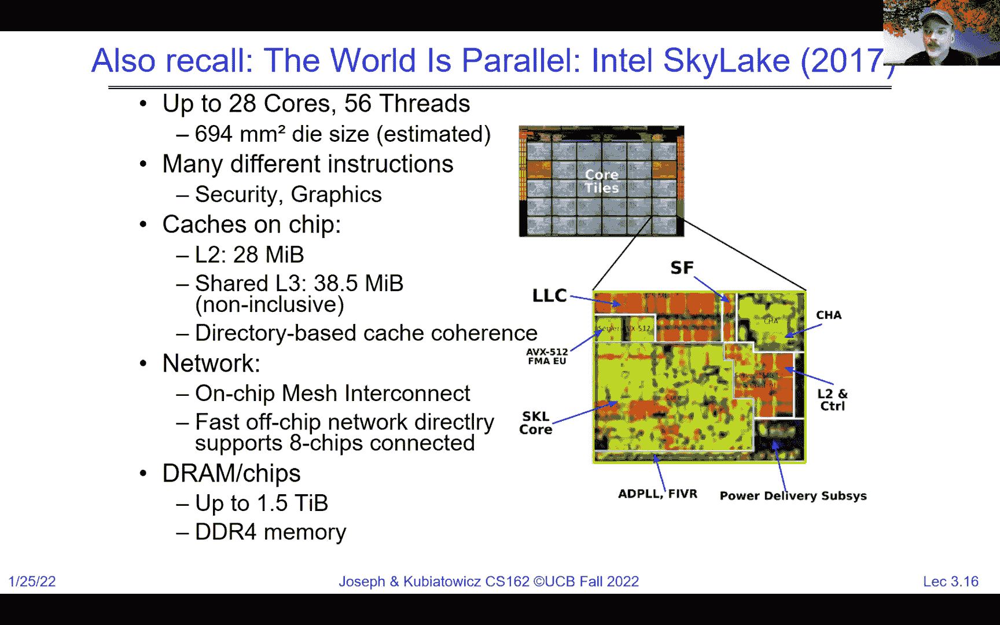

好的，所以是基本的边界保护。我说的是分支边界，抱歉。一个足够好的保护机制是基本的边界保护。答案是否定的，它对于实际系统来说实在是过于简单了。好的，而且它不灵活或浪费。你必须为潜在的未来使用分配物理内存。

所以如果你想要足够的空间让堆栈能够增长，那么你就得为此分配一大块内存。好的。所以它也会有碎片化问题。如果你有多个大小不同的进程，并且希望它们退出后再引入新的进程，你很快就会遇到碎片化问题。

然后你将不得不开始在物理内存中移动东西，仅仅是为了找到空间来适应。好的。所以，作为单一的转换或保护机制，基址和界限这个想法其实并不太好。当你考虑到共享时，它甚至更糟。想象一下那块黄色和绿色的块。如果这两个进程想要直接共享内存。

在我展示的当前基址和界限机制中，并没有办法让它们发生这种共享。好的。所以，是的，操作系统可以调整界限以提供更多的内存，但没有办法让黄色进程和绿色进程相互通信，因为设计上，它们不能重叠。

好的。所以，关于虚拟内存的一个清晰要点是，我们将开始讨论基址和界限的通用化——也就是段的概念。例如，在 x86 架构中，处理器就是这样工作的。

你将在本课程中非常熟悉这一点。这里有多个段，如代码段和栈段。每个段都有一个基址和界限。好的，我们可以有多个段，来自不同进程的两个段实际上可以在物理内存中重叠，如果这是我们的选择的话。

现在，我们有了一种通过内存让它们通信的方法。好的。现在，这是我们可以做的一种方式，但更好的方法其实是分页，我们上次开始讨论过它，你在 61 C 课程中也听说过这个概念。

然后，想法是你将每个进程的代码、数据、堆和栈组合起来。每个地址都会通过一个通用的转换单元进行转换，并且可以指向物理内存中各种页面的不同部分。然后我们可以得到一个页大小的转换，其中所有的页面大小是固定的。

像 4K 或 16K 这样固定大小的页面将防止碎片化，因为每个页面的大小是相同的。我们只需要通过向翻译映射中添加几个页面，就可以获得更多的栈或堆。这就是分页的作用。现代虚拟内存几乎完全基于分页。关于这一点有很多更详细的内容。好的。

好的。那么，现在是时候真正开始上课了。如果你还没有开始的话，我告诉你作业零的截止日期是明天。好的。所以，我会安排一些额外的办公时间。我感到抱歉，但作业零明天到期。好的，你必须熟悉 162 工具，配置你的虚拟机，提交这些所有的东西。

然后，我们需要尽快完成作业零，确保你们都能跟上进度，因为这些都是你们需要立刻掌握的内容。好的。现在你应该去参加某个小节了，哪个小节不重要，因为我们希望你能获取一些至关重要的其他信息，帮助你理解C语言等内容。我希望每个人都能有机会参加我们周六举行的C语言复习课。

我认为如果你们没去的话，可以看视频，大家应该都要复习一下，因为就像我之前提到的作业零一样，有很多事情我们假设你们已经知道，并且准备好迎接。好的。这些内容就像是基础，准备好之后我们才能深入学习。

不要太担心这一点，觉得自己怎么可能做到。我们理解61 C课程只给你们提供了C语言的基础知识，但这也是我们在前两周提供这些资源的原因，目的是让你们能尽快上手。好的。所以把它当作一个挑战，让自己足够好，能够开始跟上这门课的进度。

好的，我会安排更好的办公时间。我意识到今天早些时候我已经安排了这些时间，但我意识到那样行不通，所以我会为你们安排更好的办公时间。还有一件非常重要的事是，星期五是退课的最后期限。好的。

这意味着你必须做出退课的决定，否则情况会变得复杂，因为你会开始浪费你的一些学分。如果你知道自己会退课，现在就做出决定，这样我们可以从等候名单中让更多的人加入进来。我们设定早期退课的最后期限，另一个原因是因为我们下周要分小组。

我们想确保每个小组的人会一直坚持下去，这样我们就不会有那种剩下几个人的“孤儿小组”。好的，所以请仔细思考，你是否真的想跟上课程的进度。

如果是的话，请务必留下来，因为我们希望你能继续参加。事实上，我认为目前为止，我们已经让所有在等候名单上的人都加入了课程。但如果你决定不继续，麻烦在星期五做出退课的决定。好的。如果你知道有任何朋友已经不再来上课，但还没有退课的话。

告诉他们需要退课，因为他们将会被自动加入到课程中。每个学期我都会遇到有些人不知道自己还在课程里，直到学期结束。这样一来，情况就会变得很混乱。所以，我很高兴知道这里的每一个人都对这门课充满了兴趣。我知道有一个可能还在我们的班级名单上，但实际上打算退课，并且可能面临退课的风险。

请确保他们不要这样做。所以小组注册表单将在周末或下周一发布，真正开始组建小组是在下周。那将是一个自动评分表单或类似的东西，小组是四人一组。

好的，你知道，如果你的小组成员不满三人，或者想要增加到五人，请确保你开始找四个人的小组。我们会帮你，如果你最终找不到小组，但通常来说，和你认识的人在一起组队会更好。

好的。如果你只有两个小组成员，你可以在Piazza上发布。那里有很多人，我们有一个特别的讨论线程，专门为寻找小组成员的人设置。所以尽量自己找一个人。我们会帮你一点忙，但可能不妨先自己试试。好的，你需要选择一个时间段。然后填写建议。

好的，我们将允许你选择几个时间段。但你要尽量确保你的小组成员可以参加同一个时间段。理想情况下，是同一个时间段，或者至少是同一个助教。我们有一些20小时的助教，他们有两个时间段。好的。期中考试的日期和时间已经确定，期中一、期中二和期中三的考试时间已经固定。

我相信它们都是七到九点的时间段，我们会确保所有信息都得到更新。会有一个冲突表单，用于处理冲突。好的，现在我要再次说明一下讨论课的安排，如果你查看上面第一个要点。我们在你们组成小组之前是没有固定的讨论课的，因为你的小组必须在同一时间段。

好的。所以在上周和这周，你可以参加任何一个时间段。但从下周开始，你需要选择一个时间段，这样你的小组就能一起参加同一个时间段。最坏的情况下，你和你的团队可能会在不同的时间段，但会有同一个助教。好的，我想我已经回答了所有这些问题。还有其他问题吗？好的。是的。

你知道，这门课启动得很快。但我们开始得这么快的原因之一是，我们希望确保你们能充分准备好，能够深入学习并高效地工作。是的，就像安东尼在聊天里刚刚说的那样。

请尽量自己找到小组，而不是我们随机分配。现在我注意到聊天里有一个问题，我想简要谈一下，这是个不错的问题。问题是，为什么你们不分页？

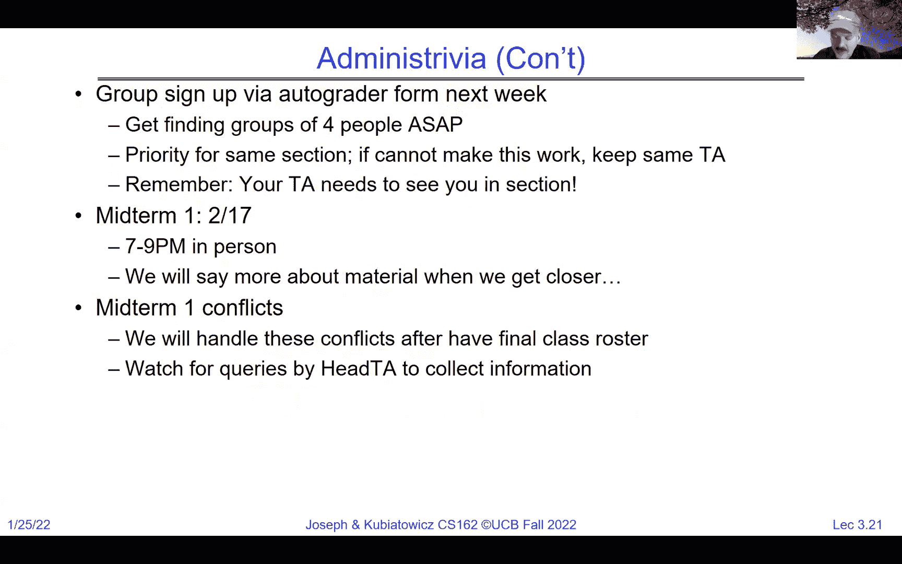

为什么不把分页和分段结合起来？答案是，目前我们描述的分段方式并不是分页场景，因为它有一个基值和一个上限。所以除非你把每个分段都做成相同的大小，否则分页不会有很好的效果。

对，然而，正如我们将向你展示的，你可以轻松地将分段和分页结合起来，事实上，x86架构就是这么做的。但那是几周后讲解的内容。好的，但目前为止，我们描述的基本段并没有分页的潜力，因为它们是可变长度的。好的，现在。记住，继续前进。

上次我们在最后提到过，有三种方式可以从用户模式进入内核模式。好的，有三种类型的内核模式转移。我想更深入地探讨一下这个问题，第一种是系统调用。系统调用将是用户代码请求内核提供文件系统或网络通信等服务的基本方式。

好的，这是一个例子，展示了一个进程请求系统服务。这有点像一个函数调用，但这个函数调用实际上会从用户模式进入内核模式，然后再返回，所以它是一个函数调用，但它实际上会穿越不同的模式。在项目一中，你将有机会编写一些系统调用代码。好的，随着你深入，你会熟悉这些内容。

这也将与我们稍后将要讨论的远程过程调用（RPC）有些相似。因为你将把函数调用中的一些内容打包起来，以便内核能够接受它们。

然后，它们会在稍后被返回。好的，现在，很多系统调用。好的，我们会向你展示其中的一些。随着时间的推移，有一个问题是，进程是否可以请求更多的处理时间？当然，在一些调度程序中，确实有办法请求更多的时间。进程也可以有方法说“我现在完成了，可以让别人运行了”。

有很多很多的系统调用，好的，我认为在最新版本的Linux中，有成千上万的系统调用。在某些时候，这些API会显得有些过多。除了系统调用——即用户主动请求进入内核的方式——我们还有中断的概念，中断是外部的异步事件，它强制系统从用户模式进入内核来处理某个事件。

它完全独立于用户正在做的事情。所以用户可能正在忙着计算圆周率到最后一位，突然有一个中断到来，这时系统会暂停并进入内核处理这个中断，然后再返回继续计算圆周率。那为什么我们需要中断呢？中断用于处理一些不可预测或未知的事情，比如什么时候网络包会到达，或者磁盘什么时候会返回数据。

一个非常重要的中断，接下来我们在讲解调度时会深入探讨，就是定时器中断。这是内核确保能够从用户那里抢回时间的方式。所以如果我们在黄色和绿色之间切换，黄色和绿色之间切换。我们确保内核始终能做到这一点的方式就是定时器中断触发。

如果黄色在运行，我们进入内核，内核会调整一些内容，然后让绿色运行，然后一个定时器会触发，然后它会让黄色运行。因此，定时器将成为我们确保不同进程之间执行公平性的关键机制之一。

另一个是同步异常或陷阱。这些是一些例子，其中与用户正在做的事情相关的内容无法继续进行。最简单的例子是除零错误，用户运行某段代码时尝试除以零。答案是很大的，对吧，非常大。所以这是一个无法继续的异常。

我们因异常进入内核。另一个你会在接下来学到的常见情况是页错误。用户尝试使用没有物理内存支持的地址空间的一部分。那么，我们会得到一个页错误异常，这将在内核中处理，内核随后会决定如何处理，或者是否要将进程从系统中移除并终止它。好的。

如果你还记得，我上次给你展示了这种新的方式，类似于这些圆圈，其中硬件是下面的砖块，然后我们有内核模式，它处理硬件直接操作的内容，再往上是用户模式，它浮在一切之上。

所以在某个时刻，我们会有一个exec调用，内核被要求启动一个全新的程序运行，这个exec调用会转入用户模式。现在我们正在以进程的形式运行一个程序。在执行过程中，可能会进行内核服务调用，但最终我们会有一个退出操作，将我们带回内核，这就是一个进程从A点到B点的生命周期。

好的，我们肯定会在以后的讲座中更详细地讲解调度。但现在我们先来看一下如何让事情运行的机制，以及它们运行时会发生什么。当你在运行时，首先，用户程序可能会发出一个系统调用，比如需要从磁盘读取数据。那么在这种情况下，系统调用会进入内核，它可能会立即返回。或者。

并且在返回之后，它实际上可能让内核在硬件上启动一些操作。好的，在这种情况下，稍后可能会有一个中断把我们从用户模式拉到内核模式。这个中断可能会导致内核去操作硬件，从硬件中读取一些信息，比如一些网络数据包。结果可能会返回，可能会做多次读取，最终完成。

我们恢复从中断返回的用户状态，啪，我们又开始运行用户代码了。所以注意到所有这些从用户模式到内核模式的过渡，都是以一种确保用户模式可以继续执行且不被中断或其状态不被破坏的方式完成的。

所以它可以继续运行，就像内核从未接管过一样。好的，这就是保存和恢复寄存器的部分，我们必须确保理解这一点。好的。现在，问题来了，我们能否假设 libc 函数通常会触发上下文切换？不一定。好的，如果你看一下这个系统调用，会发现有很多情况下，系统调用进入内核请求信息后，立即退出，没有任何上下文切换。

所以，libc 通常充当系统调用的一个屏障，当你调用这些库函数时，它可能会触发系统调用，但这不一定意味着会发生上下文切换。好的。这里有一个例子，用户模式可能会发生除零错误，在这种情况下我们进入内核，进程就终止了。

除此之外，我们可以在多个系统调用、硬件中断等之间来回切换。

然后最终我们退出。现在，我们如何确保这是安全的？

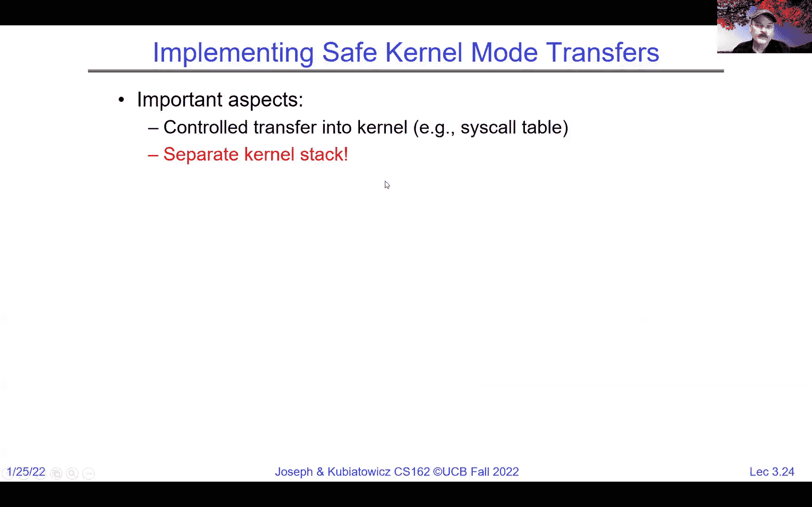

我所说的“安全”是什么意思？我所说的“安全”是用户代码正在运行，然后，我们去内核执行一些服务和任务，但我们希望能以一种方式回到用户模式，使得用户程序能够继续正常运行，这是安全的一部分。

另外一方面，实际上是确保用户代码无法破坏内核。好的，这里有很多关于“安全”的不同含义。例如，用户代码不应该能够使用错误的参数进行系统调用，从而导致内核崩溃。好的，或者说应该没有任何方式让用户模式破坏内核模式。

所以这里有几种不同的“安全”概念。在从用户代码切换到内核模式时，我们必须确保所有进入内核的转移都是可控的。

好的，那么“控制”是什么意思？控制意味着无论用户的请求有多糟糕，都不应该让用户进入代码中的坏部分或者发生类似的情况。应该精确控制执行哪些内核代码，始终从内核函数的起始处开始，等等。所有这些都需要发生。否则，恶意的用户代码可能会破坏内核。

这将是我们接下来要讨论的内容的一部分。此外，还有其他问题。需要一个单独的内核栈，以确保内核执行的任务不会受到用户破坏自己栈的影响。现在，栈是你们在《61C》课程中接触过的概念，实际上我们将在下次提醒你更多有关栈的内容。如果你记得，它是用来确保我们能够使用递归例程的那个结构，其中局部变量存储在栈中，我们可以将数据压入栈中，也可以从栈中弹出数据。

因此，除了单独的内核栈外，我们还必须确保内核代码谨慎处理用户的请求，验证它是否正确，并确保一切无误，同时保存用户的寄存器等信息，以便恢复。

正如我之前所说，应该不可能出现一个有缺陷或恶意的用户程序导致内核损坏自身的情况。所以，用户要求内核执行任务的这一想法非常好，因为内核控制着所有事情。

但是，内核必须小心谨慎，确保以用户无法破坏的方式处理这些事务。好的，这将是一个主题。这种**安全性和防护恶意操作**的理念，将是我们在接下来的课程中讨论的核心。好的，现在，让我们讨论一下硬件支持。我们之前提到过，谁拥有实际的系统模式位，谁负责进行之前提到的转换。

所以这就是硬件的概念，类似地，**定时器中断**可以随时从用户程序中夺回控制权，这和中断控制是一个类似的概念。所以，正如我们之前提到的，中断处理其实对用户进程是不可见的，这也是其中的一个原因。

并且始终可以保证这一点。好的，换句话说，从用户的角度来看，假设中断发生在两条指令之间。指令A正在执行时，发生了中断，接下来有一堆事情发生。那么，**指令B**会从用户的代码中执行。

他们没有注意到区别，除了那到底什么能让用户意识到中断发生了呢？有人解决这个问题了吗？准确地说。好的，**延迟时间**，这将是一个有趣的点，因为从理论上讲，我们在虚拟化执行，但会有一些时间消失的时段。

这个稍后会成为一个主题。所以中断处理程序，什么是处理程序？处理程序是在内核中代表该中断被调用的部分。如果是定时器中断，我们确保该定时器中断在内核中的正确位置，并且会禁用中断，这样我们就不会陷入永久的中断循环，直到定时器中断能够接管并执行足够长的时间以清除中断标志。

好，现在这里有个问题是关于没有上下文切换的，也就是说在发生中断的情况下没有上下文切换，什么是上下文切换，对我们来说是什么意思，等到下次你会理解更多，实际上上下文切换是指一个用户进程被换出去，换成另一个进程。

或者是一个线程被切换出去，换成另一个线程。所以这就是被切换的部分。好，基本上中断处理程序会做的是将任何无法立即处理的事情打包进操作系统线程，以便稍后处理。

好。关于中断被禁用时会发生什么的一个好问题是，它们通常只是静静地等待，直到中断被重新启用，然后它们才会接管。好。如果我们有操作系统线程，那么调度程序确实会调度操作系统线程。

好。可以把操作系统线程想象成类似用户线程的东西，但它没有用户相关的部分。我们下次会更详细地讲解这个内容。

所以其中一个要点是给你一个关于中断的基本概念，不用太担心这个，每台机器通常都有一个被称为中断控制器的东西。所以它不是 CPU 或我们的核心，并且通常会有一个禁用中断的标志位。好。

然后中断控制器基本上是一个硬件芯片，其中所有外部中断线路，包括定时器中断，都会通过一个掩码，决定哪些中断被启用，哪些不被启用。还有一个优先级编码器，决定如果有多个中断被启用，哪个是重要的。如果有任何中断被启用并且它的优先级已经被选定，那么中断编号就会发送到 CPU。

在这一点上，它会进行中断保存状态并继续。好。所以中断是通过设备的中断线路来触发的，中断控制器基本上会根据它设置的掩码和优先级来选择哪个中断请求需要被处理。

而 CPU 基本上会开始运行中断控制器。大多数情况下，我们将在调度部分详细讨论，但大多数中断情况是，在中断发生时，禁用所有中断的标志位会被设置，足够长的时间让 CPU 处理掩码等操作，以避免中断的无限递归。然后一旦处理好，它就会重新启用中断，以允许其他中断发生。好。

并且CPU可以使用这个中断标志禁用所有这些中断。对吧？这是一个稍微详细的话题，但我想让你们了解这里的硬件上下文。基本上，这些物理线路表示“嗨，我是一个网络，有一个数据包准备好了。”这个物理线路会引发一个中断，使我们从用户模式切换到中断处理程序。

好的。关于聊天中的非阻塞问题，基本上是“运行到完成”。好的，我们将随着课程深入详细讨论这个问题。还有这个不可屏蔽中断的概念，它是指在任何情况下都无法关闭的中断。通常用于像是“你的电源即将失败，我有几秒钟的电容器来保持电力，最好做点什么，这是紧急情况”这样的情况。

好的。那么让我们看看这个概念，假设网络引起了一个中断，并且它是中断号五。

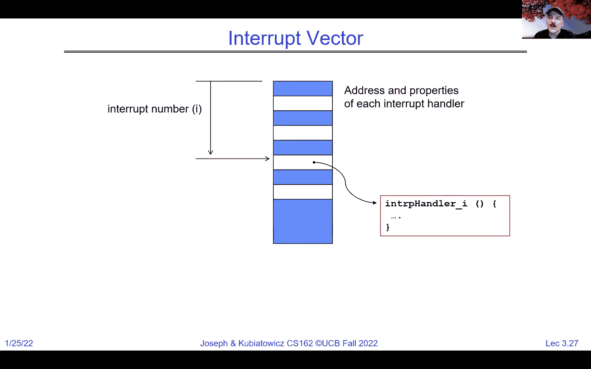

会发生什么呢？嗯，数字五进入了CPU。

然后，数字五会用来在中断向量中查找，这个向量是内核中唯一可访问的内存块。数字五、六、七、八、九等都有相应的槽位，指向中断五的中断处理程序。

好的。值得注意的是，这是一个很好的例子，说明我所说的“受控进入内核”是什么意思。我们使用数字五和表格来确保我们准确地跳到正确的中断处理程序，并从它的开始处进入，而不是从中间某个位置。

好的。我们使用中断向量和表格的事实意味着内核可以有经过精心控制的代码，这些代码已经经过编译并经过千万次检查，每当比如网络中断发生时，就会调用这些代码。好的，这是确保内核能够以非常高的优先级运行，并且实际上只运行那些已经经过审查，能够正确处理例如网络中断的代码的关键之一。

好的。我们将看到一个与系统调用相同的概念。好的，我在这里简要地提一下，稍后我们会讨论系统调用。当用户进行系统调用时，比如我要读取一个文件，这个系统调用通过一个系统调用编号从用户模式传递到内核。这个编号会在向量表中查找，并且会同时发生从用户模式到系统模式的切换。

它还会决定运行这些向量中的哪个。因此，用户不能只是说“把它放到内核模式并从这个地址开始运行”。因为如果他们这样做，会构成安全漏洞，相反，他们必须说：“嘿，我想让你为我运行系统调用12。” 在硬件中，它会同时保存用户的PC，转换到系统模式，并开始运行向量12。

通过以原子方式执行这一操作，我们得到了一个受控的入口。好的。好吧，关于是否存在冗余的问题，也就是不同的处理程序可能会在不同的槽中运行，是否是同一个处理程序，我想这个问题的回答是，在某些情况下，确实会发生。取决于，因为通常有办法读取当前中断号的概念。

因此，有很多种方式来结构化这个问题，我们至少会在Pintos中查看其中的一种。好的，那么你们在哪里看到这种调度模式呢？它出现在系统调用中，异常中等等。我们安全地处理中断，好，我们刚才谈到过中断向量，它是有限的入口点。这里是内核栈，这意味着当中断发生时，我们会把用户正在做的事情都放到一边。

然后我们用一个已知良好的内核栈重新加载处理器。好的，这样无论用户在做什么，抱歉，内核都是处于良好的状态。可能在有中断的情况下，我们需要关闭刚发生的那个中断，以免出现无限递归。接下来我们有这个原子性的控制转移。在一个不可中断的链中，我们得到新的程序计数器和新的栈指针。

我们正确设置内存保护，并进行用户到内核的模式切换，我们以原子方式执行这一操作，确保我们以一种非常受控的方式从用户模式切换到内核模式。好的，这就是我们能够确保干净地进入内核的方式。

好的，接下来，当然我们需要确保这一切对用户是透明的，并且是可重启的。因此，即使我们进行原子性的内核转移，我们也需要保存用户正在做的所有事情。以一种方式让我们能够恢复这些内容，这样我们就可以从中断中恢复过来，用户可以在中断后从上次停止的地方继续他们的计算，几乎不受影响。好的，所以这个关于单独内核栈的想法，我只是想多说一点，接下来几次我们会更详细地展示，因为你们稍后会深入了解内核。

但我们不能使用用户的栈。有没有人能想出为什么我们不想使用用户的栈呢？也就是用户的栈指针寄存器所指向的内存。对了，我喜欢那个“安全性”和“能力安全”还有小写的“i”，我不知道这两者之间是否有区别。不过，最简单的情况是，他们的栈指针可能指向一个错误的地址。

如果我们使用它，整个机器可能会崩溃，所以实际上，我们在课程的前一个月或者更多时间里，将使用这个两栈模型，我们会详细讨论它，所以不要太担心。但每个正在运行的用户程序或进程都有一个与之明确关联的内核栈。

当我们运行程序本身时，我们处在用户代码中，并且它有自己的栈在运行。如果进程被挂起并进入休眠状态，比如说绿色在运行，而黄色在休眠。若查看黄色的资源，将会看到黄色的用户栈，甚至黄色的内核栈上也会保存有状态。而且当绿色在运行时，黄色将会被挂起。

如果我们看一下当我们执行系统调用进入内核时会发生什么，注意每次从用户空间转到系统空间时，我们都会获得一个新的内核栈。然后，如果系统调用需要在内核中执行一堆操作，我们会使用内核栈来完成这些操作。好的，因此我们有一个干净且保证的小栈。

好的，Pintas 将是 4k，我们稍后会详细讨论这个。但它足够支持我们在这里需要运行的内容，尤其是当我们准备从中断中返回时，我们会恢复系统调用本身执行的所有内容。然后我们恢复用户状态，其中包括恢复用户的栈，接着我们返回到用户空间，用户就能从中断之前的地方继续执行。

好的。所以是的，我确实说过每个用户进程都有一个独立的内核栈。聊天室中有个很好的评论：所有这些安全措施是否都依赖于内核没有漏洞？是的。如果内核有漏洞，那么一切都不再可靠。一些漏洞比其他漏洞更严重，但你可以想象一下。好的，内核栈在哪里？这是一个很好的问题，实际上可以有多个位置。Pintas 中的内核栈实际上是一个单页，并且包含 PCB。

好的，虽然这部分不直接被称为栈，但它都位于同一页面上。好的，我们会更详细地研究这个。我们怎么知道用户无法触碰内核栈呢？因为它位于一块因地址翻译保护而不可访问的内存区域。回想一下之前提到的基址和界限，它们位于灰色区域。

结果是，当我们在绿色或黄色中运行时，它们无法访问灰色区域。好的，希望这个解释能帮到你。所以我们会确保我们的保护措施使得用户无法干扰到灰色区域。举例来说，在 x86 架构中，当我们在用户级别运行时，我们有用户的栈，我们有用户的代码 PC，我在这里展示的是栈段。

这里的 ESP 是栈指针，我们有代码段和 EIP。然后在执行中断系统调用时，我们会原子切换到内核栈，因此注意栈指针指向异常，而指令指针则指向内核代码。

这个从这里到这里的转移实际上是在x86硬件传输的一部分，我们将会详细了解这个过程，但这就是我们如何设置它，当中断发生时，我们会“砰”的一声切换到另一端，并自动切换到新的堆栈。

所以这有助于保持内核的完整性。好了，现在，如果你还记得，我上次给过你这张图，但也许现在我们可以稍微更好地理解它，所以应用程序本身，用户代码大致在这里，可能是某个有趣的程序，比如计算圆周率的最后一位数字之类的。

然后，我们会链接一些标准库，比如先前聊天中提到的libc。然后这些库可能会通过系统调用访问运行内核代码的内核部分。

在系统模式下。对于像这样的单体内核，我们稍后会讨论更多关于非单体内核的内容。所有这些代码都位于内存的一个特殊部分，这部分是专门为内核链接的，已设置为在内核模式下运行，包含像文件系统、调度程序以及各种其他内容。好的，我们将在学期中讨论这些不同的部分。

关于聊天中提到的为什么在异常堆栈中保存寄存器的问题。可以把异常堆栈和内核堆栈看作是同一个东西。好了，知道吗？当你发生异常时，内核堆栈在处理这个异常。所以那时它就成了一个异常堆栈。好的，抱歉造成了混乱。

但是，对于你的当前目的来说，异常堆栈和内核堆栈是相同的。所以，这个系统调用接口就是我们将在结束这节课时，可能还会延续到下节课讨论的内容。但我想给你展示一下这一点，所有我们认为由内核安全提供的服务，都是在内核模式下运行的，且都在内核的内存中。现在，这里有一个很好的问题：硬件是以操作系统为设计前提构建的，还是操作系统完全建立在现有硬件之上？

所以那是哲学436，这是一个不同于这个课的课程。我会说，最初并没有我们现在能识别的操作系统的概念，但操作系统的想法几乎从一开始就存在了，因此，基本上，几乎所有的硬件都是以操作系统为设计前提来构建的。关键问题是，如何在给定的硬件上运行一个足够复杂的操作系统，我们希望能更好地理解这一点。

然后我喜欢那里的“鸡与蛋”评论。这里存在鸡与蛋的另一个原因是，随着人们对操作系统需求的日益复杂，硬件也在不断适应。而我们稍后会讨论的一个很好的例子，就是虚拟机的概念。在过去20年里，CPU的设计已经发生了显著变化，以便更方便地运行虚拟机。

好的，而寄存器是相同的寄存器。所以记住，我要说这个问题：操作系统有分离的寄存器吗？通常没有，除非是特殊的处理器。现在，只需记住，我们是在考虑一颗核心或者一颗CPU，统治所有的方式。好了。

它同时运行内核代码和用户代码，我们必须确保在来回切换时，保存和恢复寄存器的操作是正确的。好了，想象一下，这是一组寄存器，统治所有寄存器，这就是思考的方式。好了。

所以这里有一个狭窄的浪费，实际上就是系统调用接口，我们将更详细地探索这一部分。但你可以认为应用程序的空间很大，服务和硬件的空间也很大，而正是系统调用接口，即进入内核的受控入口，赋予我们以受控的方式使其工作的能力。

那系统调用处理程序呢？它大致类似于中断，但它是用于调用服务的。因此，我们将通过标准的、定义明确的系统调用入口点进行跳转。我们会定位参数，查看寄存器是否在栈上或其他地方，当要进入内核时，我们会复制这些参数，并确保它们是有效的，因为我们不能信任用户提供的参数，它们可能不在合理的内存区域，或者可能不合理。

我们将验证它们，然后在完成后将结果复制回用户内存。所以，基本上，内核会信任，但会验证，意味着所有的内容都会被验证。也许不信任任何东西吧，我猜。但进入系统调用时，检查一切，检查两遍，确保所有地址都是正确的。按照要求做事。

将结果从内核复制回用户空间。因此，用户永远不会直接访问内核，也无法破坏内核。关于操作系统是否有自己的寄存器的问题，我想我们可以暂时不讨论。我认为，记住大部分执行时使用的寄存器其实都是一样的。

有一些特殊的情况，比如虚拟内存的基表等。但那并不是我认为问题的关键所在。那么，好吧，接下来我们把所有内容合在一起。这里有一个网页服务器，你知道，你向网页服务器发送请求，然后得到回复。

问题可能是，网页服务器做了什么？你可以想象，网页服务器本身是一个进程，就是这个网页服务器。好的，服务器上有网络和磁盘硬件。还有内核，接着是服务器进程，也就是那个Apache网页服务器。好的。

你知道，网页服务器启动时，它是一个进程。它在用户模式下运行。网络基本上是通过读取已经设置好的网络套接字来启动服务器，并询问是否有更多请求。通常发生的情况是，如果没有请求，系统调用读取会通过睡眠等待。

现在在这种情况下，服务器正在等待，因为它在等待某些东西。好的。与此同时，请求，或者稍后会有请求进入。它会生成一个中断，表示有请求，这将唤醒服务器进程。返回请求，现在服务器进程就有了请求的缓冲区。

所以请注意，读取系统调用已经返回了数据，但在打印时，发生的时间是读取系统调用睡了一会儿，直到中断到来。然后我们得到了数据。现在这些数据是什么呢？它是网页请求。所以我们弄清楚它的含义。是HTTP和HTML。我们会弄清楚的。

现在我们知道要读取哪个文件了。所以我们会执行一个读取系统调用。注意这个读取系统调用是去访问磁盘。这个读取系统调用是去访问网络。你很快就会学到，Unix将所有I/O操作看作相似的。读取和写入操作在各方面都很相似。但在这里我们请求读取。

这将不得不等待，因为内核可能实际上需要访问磁盘。这将需要时间。磁盘会以中断的方式返回结果。结果会从读取操作中返回。现在我们有了一个回复缓冲区。我们会格式化回复，通过另一个系统调用发送到出去的套接字。

然后回复返回，我们最终看到一个网页。好的。中断和系统调用之间的区别在于，系统调用是一个从进程到内核的**同步查询**，就像一个函数调用，它会返回一个结果。而中断是来自外部世界的**异步事件**。

好的，好的。步骤二和步骤七是中断。好的。它们将触发我之前展示的中断机制。好的。白框代表排队。所以，我们现在在高层次上讲，实际上这里有很多队列。

所以通常，如果在我们进行读取之前有一堆数据包到达，那么它们会被排队，读取操作将会获取第一个数据包，依此类推。因此，典型的套接字或缓冲区有很多队列。现在关于这个问题，嗯，中断是否在内核没有发出请求时发生？答案是。

嗯，是的，但有一些设置，我们已经提前设置好了套接字。一旦设置完成，就会有一个通道，有人试图获取网页时，会将请求发送到这个提前设置好的队列中。因此我们将能够确保我们不会无法发出请求。

所以我们将能够确保我们不会无法发出请求。因此我们将能够确保我们不会无法发出请求。因此我们将能够确保我们不会无法发出请求。因此我们将能够确保我们不会无法发出请求。

所以我们将能够确保我们不会无法发出请求。这就是为什么，你知道，我们必须确保当中断发生时，确实，这个中断正在中断其他正在运行的程序。可能不是服务进程，因为服务进程处于休眠状态，但。

中断其他正在进行的操作，保存并恢复寄存器，处理这个中断，然后恢复到那个操作。最后我们运行服务器进程。好的。因此这里有很多同时进行的操作，我们需要处理。

需要整理一下，但我相当有信心，在接下来的几周内，你将会对这一切如何协同工作有一个更加清晰的把握。因为这里有一套相当简单的机制。

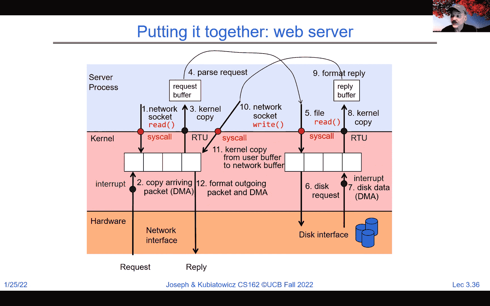

好的。如果你记得的话，我们没有时间完全讲解这一点，实际上。

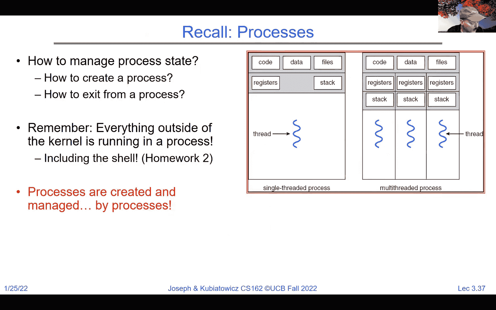

让我停下来看看是否还有其他问题。还有其他人有问题吗？啊，好的问题。如果在另一个中断被处理时发生中断会怎样？

所以记住中断控制器。当第一个中断到达时，好的，假设为了讨论的方便，你问的是如果两个中断几乎同时从网络到达会发生什么。第一个中断将进入中断处理程序，这个中断处理程序会。

在处理第一个中断时，禁用网络中断，接收第一个数据包。然后当它从中断返回时，它将重新启用，此时第二个中断将到来并继续处理。好的。所以基本上，我们控制中断的方式是确保不会发生。

混乱是因为外部世界是混乱的，对吧？今天给你讲的哲学 405 就是，外部世界是混乱的。我们确保在处理内核内某些核心状态的操作时，永远不重新启用中断，以免第二个操作出现并破坏核心状态。所以这就是我们如何正确启用和禁用中断。

好的，明白了。那么，如果你记得，我们今天讨论的是进程，但有一点……

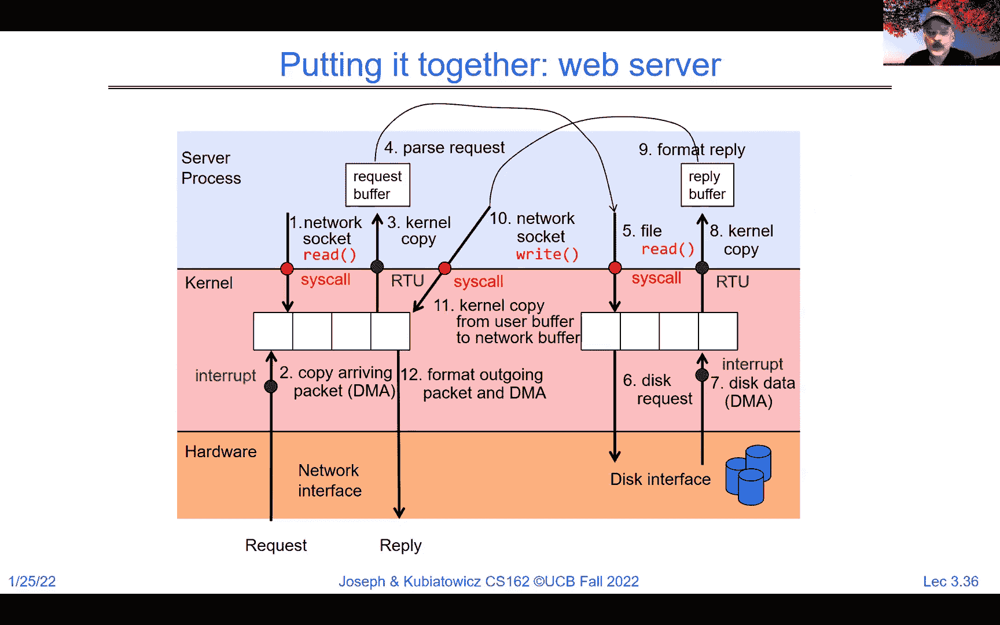

那么我们如何管理进程状态呢？你知道的，显然我们有堆栈、寄存器、代码和数据。我们必须弄清楚如何初始化这些东西。所以我们会到达那个阶段，并且需要关注如何创建和退出进程。好的。如果你记得，内核外部的一切都在一个进程中运行。

所以进程并不是特殊的东西，它们不是偶尔才会发生的事情。进程是主要的功能。好的。而更有趣的是，进程是由其他进程创建和管理的。所以我们这里有一个引导问题。进程是由其他进程创建的。你知道的，这是经典的“鸡和蛋”问题。

第一个进程是如何启动的？答案是，第一个进程是在内核启动时启动的，通常被称为 init 进程。一旦这个 init 进程启动，它可能会启动一个 shell，或者启动一组其他进程。所以一旦我们有了第一个进程，它就可以做一些被称为 fork 的事情。

如果你稍微耐心一点，我至少会给你一个概念，然后我们下次会更详细地讨论它，这样更多的进程可以由第一个进程作为父进程创建。好的。所以我们有一个进程管理的 API，包括 exit、fork、exec、wait、kill、sig action。

在你的一号项目中，你将会非常亲密地接触到这一部分。你将学习这个 API 的这一部分。例如，exit 做什么？嗯，exit，顾名思义，是一个系统调用，它将我们从运行一个用户进程转到退出该进程，基本上销毁它的状态。

如果你记得我之前展示过的那个小半圆形图片，上面中间是红色，右侧有蓝色的用户进程，最右侧的是退出。那就是一个进程是如何被终止的。如果你看这里，你将学到很多关于主函数的内容。那将是你在 C 语言中的最喜欢的过程，因为那是典型进程的起始点。

我们在这里运行了一些东西。在这个例子中，我们运行的是 get PID，这是一个 libc 函数，它随后会发出一个 get PID 系统调用。所以它会问内核，“嘿，我的进程 ID 是多少？”然后我们用 printf 打印出来。然后我们用一个零参数退出，通常意味着没有错误。所以零是一个好的退出码。好的。

问题可能是，“如果我们忘记了那个呢？”然后我们就直接让主函数退出。好吧，结果证明，主函数并不是第一个运行的东西。还有其他的东西。所以如果我们忘记了退出，我们只是让主函数执行，然后退出会由操作系统库自动为我们调用。好吧。

所以在最后会有一个隐式的退出零。好了。现在你将在项目零和它的.c文件中看到这一点。你将看到主函数开始时的一部分内容。好吧，现在我们来看一下fork。fork是你将要运行的最奇怪的例程之一。

这是原始Unix中的遗留部分，但它实际上是一个非常有用的例程。它的基本思路是复制当前进程，获取一个新的进程ID，创建一个全新的地址空间，一个全新的安全上下文，并开始运行一个单线程。好吧。

这个单线程将会在另一个线程停止的地方继续执行。所以fork是你将遇到的最奇怪的函数调用。这也是你第一次会遇到的函数调用，因为如果你想想看，在执行fork之前。

执行完fork之后，会有两个进程，它们是彼此的副本。所以如果你看看内部发生了什么，第一个进程执行fork，然后从fork返回。第二个进程也在完全相同的位置从fork返回。

代码中唯一的不同是，原始进程，即父进程，从fork返回一个非零值。这个值是一个整数，实际上是子进程的进程ID。好吧，在子进程中，它将返回零，告诉操作系统它是子进程。如果返回的值小于零，那就是一个错误。

这种情况只会发生在父进程内部。好吧。原始进程的状态在父进程和子进程中都会被复制。好吧。将会有重复的地址空间。所以地址空间会完全复制到子进程中。所有的文件描述符也会被复制。所有的一切都会被复制。

你将会有两个正在运行的进程，它们本质上是彼此相同的。但其中一个从fork返回非零值，另一个则返回零。好吧。现在用例是你很快就会遇到的情况，比如shell是如何工作的。它使用了fork，当然还有其他东西。好吧。

子进程能够通过一个单独的系统调用来找到它的父进程是谁，以及它的父进程ID是什么。所以你会学到这些。但另外一个需要考虑的fork的用例是，假设你有一个进程正在运行，你然后fork出一个子进程。

它将拥有与父进程完全相同的环境。所以你很容易就能弄清楚如何去构建它。此时，子进程将处于你已经设置好的环境中，你可以让父进程等待，直到子进程完成。好了，如果你看，我将在这里给你一个快速示例。

它如何判断大于零还是零呢？这其实就是一个 `if` 语句。所以这里你会看到，首先执行 `result = fork`，然后判断 `if result > 0`，否则 `if result == 0`。对于那些能耐心再等我几分钟的朋友，我想给大家展示一个例子。这是一个很好的例子。

这是 `fork` 的一个用法例子，在这里我们有主进程。它获取了自己的 PID，并表示“哦，父进程 PID 是这个”。好了，现在我们调用 `fork` 并将 CPID 设置为 `fork` 的返回值。注意我们接下来的操作：我们判断 `if CPID > 0`，如果成立，就说明父进程将在这个 `if` 语句中执行，否则如果 `CPID == 0`。

子进程将在 `fork` 的这一部分运行。否则我们将导致错误，或者声明错误，表示 `fork` 失败。好了，是的，这有点混乱。也许吧，但这是个值得学习的好事。好了，现在请注意，首先，最重要的是，经过 `fork` 后，你会有两个几乎完全相同的进程，它们唯一的区别就是……

区别在于一个进程的 CPID 大于零，而另一个进程的 CPID 等于零。那如果在这些 `if` 语句中调用一个函数呢？嗯，那时该函数只会在特定的进程中运行。到目前为止，我们只有一个进程。

到了这一步，我们有两个进程。如果你在 `if` 语句的这个分支中运行某些代码，它将只在父进程中运行。如果你在另一个分支中运行某些代码，它将只在子进程中运行。例如，这里我有两个箭头，分别表示 C 和 P。你可以理解 C 代表父进程，P 代表子进程。等等，你们在认真听吗？

C 代表子进程，P 代表父进程。注意，`fork` 调用后，我们有两个进程，它们将开始执行。在这种情况下，父进程将在这里运行，子进程将在这里运行。好了，什么时候 `fork` 返回 1，什么时候返回 0 呢？它总是返回……

除非出现故障，否则它会在一个进程中返回大于零，在另一个进程中返回零。所以这就是为什么我让你们在晚餐时思考这个问题，仔细考虑一下。调用 `fork` 后，现在有两个进程，而原本只有一个。

这两个进程都在运行。其中一个进程，`fork` 的返回值大于零；另一个进程，`fork` 的返回值为零。好了，现在问题是子进程的 PID 是多少。每个进程都有一个进程 ID。通过查看 CPID，我们知道子进程的 PID。这里子进程必须调用 `getpid` 来获取它自己的 PID。明白了吗？

现在有很多问题。比如，为什么我们必须显式调用fork？嗯，因为什么，fork是一种并行方式。所以fork是实现并行的一种方式。我们会在后续讨论其他的并行方式。但fork是创建全新保护环境的主要方式。

也就是说，进程。好的，我们会讨论新的线程。所以我们刚刚创建的这个新进程，子进程运行着，恰好只有一个线程。我们会讨论如何创建更多线程。好的，子进程可以调用fork。所以在这里，子进程可以继续调用fork。现在我们有了父进程、子进程和孙子进程。好的，或者子进程可以调用fork并进入循环。

现在你有了父进程、子进程和一堆孙子进程。好的。所以有很多方式可以创建，嗯，是的，一个fork。好的。所以这将是你的机器的保证性崩溃。好的，嗯，实际上，到某个时候，可能会超出某些，嗯。

你被允许创建的进程数量。好的，好的。嗯，是的，这里有一个限制。嗯，好吧。所以，我们要结束这部分内容了，但我只是想让你看到。想想fork，认为它是实现并行的一个方式。好的，我们下次会详细讨论fork，嗯。记住，将会有许多其他方式来创建并行。好的。

所以，总结一下，这次我们讨论了很多关于进程的内容。好的，基于地址并且有一个或多个线程的就是一个进程。嗯，它拥有自己的地址空间。在这个地址空间内，当你读取或写入地址12,468时，可能会因每个进程而异。好的，我们稍后会详细讨论。进程拥有自己的文件描述符。

文件系统上下文，并且有一个或多个线程。我们讨论了中断如何作为硬件机制从外部获取控制并进入内核。它是一个通知，表示事件已经发生，其中对我们来说重要的事件将是计时器，当然还有像网络和内核、网络和磁盘的IO。我们还讨论了，开始讨论了如何控制进程。我们谈到了fork，嗯。

我们谈到了exit，并且我们会继续深入讨论exit等等。嗯，下次再说。所以我就让你们先走吧，因为时间已经超出了，但我希望你们，嗯，大家有一个愉快的晚上，我们下次见。再见。好的。

[BLANK_AUDIO]。
