# P3：Lecture 3： Processes, System Calls, and Fork - RubatoTheEmber - BV1L541117gr

 Welcome back everybody to lecture number three of CS162 and we're going to pick up where we left off。

 And if you remember last time we talked about four fundamental OS concepts that help get us right away into sort of the meat of what operating systems do with respect to scheduling。 One was the idea of a thread， which was an execution context like a virtual CPU or processor。

 which fully describes the program state， it's got a program counter registers， execution flag stack。 etc。 We talked about address spaces， both with and without translation。 And that's basically the set of memory addresses that are accessible to a program。 and they may be distinct from the memory space of the physical machine so in principle。

 every address space can be a little different in terms of what happens when you go to the addresses。 but they'll all have the same kind of set of addresses typically。 A process combines those together to give an instance of a running program。 and it's really a protected address space and one or more threads and so we're going to work on that theme a little bit more today to give some more details and we also had some pretty good discussion on Piazza。

 that you can take a look at from lecture two， and I'm sure that will continue for lecture three。 And then the final thing that we talked about which is kind of an essential hardware component that helps tie this all together is really dual mode operation。

 where there's at least two modes system and user， mode， where one of the modes。 namely the system mode has more access than the other， which is the user mode。 and unless you have something like this， then it's very hard to actually put any sort of protection into the picture。 And so that dual mode operation is going to be very important as well。 Okay。

 so the bottom line as we mentioned last time is really OS is run programs。 And remember a program is like， like a proto process or it's ready to run but not running yet。 And what you do is you take that program you typically generate it via some program source like in the C language or pick your favorite language。 It gets compiled and linked into that executable。 And then it can get loaded and become a process and that process is an executing program。

 Okay。 All right， and this is this whole path here from writing the source。 compiling it and running it is something that you're going to get to do a lot of in this term as as we go on with the projects and homeworks。 And notice also that not only are we going to be able to play with user programs but we're going to be modifying the operating system as well。

 And the other thing that we're going to just remove refresh your memory a little bit was this notion of a protected address space。 which is really something fairly simple。 It's the idea that the processor has a set of addresses。 which we're going to call virtual addresses that come out。 They go through some sort of translator。 And they become physical addresses and that's what's actually used to address the physical memory。

 And this general idea of a translator is one that will show you a number of instances as the term goes on。 But just keep in mind that there's kind of the addresses the processor uses and the addresses that actually are physical and go to DRAM or some other storage media。

 Those are different。 Okay。 Another thing we had last time。 just to remember where we were going was basically a picture like this that's kind of putting it all together and showing you what the process is。 And we can have more than one thread in a process。 So the simplest thing here is really a single threaded process。

 And we can put more threads in as we wish。 Okay。 And the PCB is basically the process control block and we'll talk about that in more detail。 But if you notice here， just taking a single threaded process。 we can see that the thread kind of encapsulates the concurrency portion or the part that's actually running。 And the address space is kind of the storage or protection environment。

 And every thread typically has registers and stack that are potentially stored in memory for when it's not running。 And if you look at this multi threaded case we actually have a bunch of for each thread we have registers and stack associated with that。

 Okay。 And there were a lot of good questions about multi threading kind of on on Piazza as well。 And notice that this protection environment encapsulates all of the threads in a multi threaded environment。 So we have， here we have three threads， they share the same protection domain。 So that means they can override each other by accident。

 But the reason we want them in the same protection domain is it's much easier for them to share information。 And if we really were worried about maliciousness or overwriting we would create a separate process with its own threads。 So within a process the threads all share the same memory between processes they're protected from one another。 Okay。 And it's that protection which we're going to talk more about how to get today。

 So there's another good question so these threads and say the multi threaded one are they all part of the same application。 Yes。 They're all part they were all generated by the same writer or they were linked together， etc。 And so different processes can be different applications。 We're also going to talk at the end of this lecture about how to have more than one process for application。

 But you never have more than one application per process。 Okay。 Because that's the protection domain。 Now， if you remember。 we started this whole process of understanding address spaces and translation with this very simple thing I call base and bound translation。

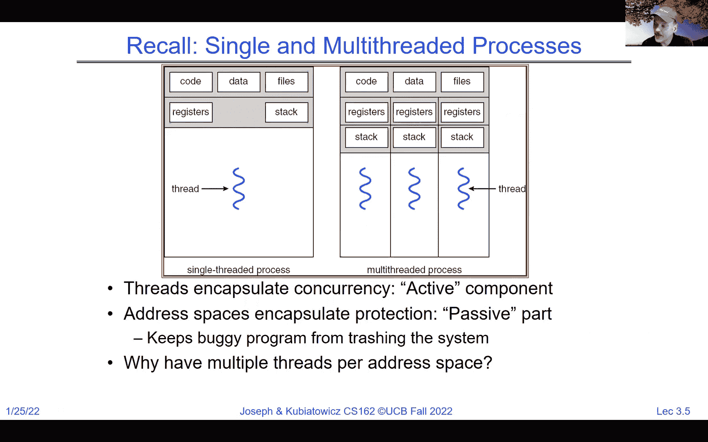

 And the idea here is that on disk or the image of the program kind of has code and data and is going to need room for heap and stack。 And we can think of it as starting at address zero as it's linked。 And when we start running it。 we can have our physical memory may have many instances of the same program or may have different programs。 And they're all going to have different chunks within the memory that sort of store their data。

 And notice I put in gray here this is also the kernel， or the operating system has its own。 Okay。 And the， in this particular instance， what we notice here is that because we put this yellow portion or the program that becomes a process here。 starting at one zero zero and memory。 It will no longer be capable of running from zero unless we do something and that's where this translation comes into play。 So even when the processor talks about an address like zero zero one zero。

 which would make sense over here， because we have a base and bound base red address and bound。 we actually add the base to what the processor does。 And the net result is a translated。 a translated address， which is appropriate for where it is physically so if you look here the CPU says。 zero zero one zero， which is somewhere in the static data。 The data adder。

 which is in hardware adds the base address and as a result that addresses make sense also in physical memory。 Now there's a question here， several questions that are kind of interesting one yeah gray is the operating system。 So two is can there be protection without translation and the。 and yeah absolutely yes so we the first version of base and bound that we showed you last last。

 week on Thursday was one without the little plus here and all it did was just made sure that the addresses that the program had were between base and no farther above base than bound。 And that means that when you took stuff out of disk you had to actually do the translation with a dynamic linker before it got put into memory。

 Once we put this dynamic translation into the picture then the CPU can continue using the addresses it thinks are there。 which are relative to the image and the hardware translates it for you。 Okay。 now the question of the base and bounds always use a constant offset the answer is no。 the operating system loads this yellow thing in there and then it sets the base address for where it loaded it it sets the bound address for how big it is。

 And we could， you know we could put another copy of the yellow thing here in a different part of memory and when it's running we put a different base and bound。 Okay， all right， now we will get back。 There's a good question here about the OS preventing a denial of service attack from malicious process that spawns many threads。

 So that's an interesting question， but it's perhaps thinking in the wrong way here so all of the threads in a process are part of that。

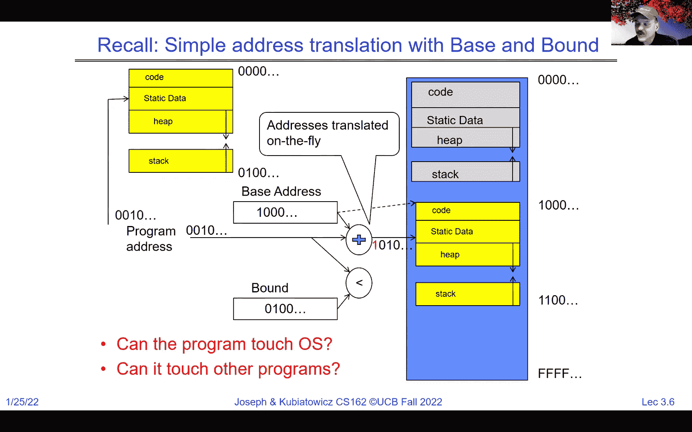

 application and they're written by one person so if you're launching too many threads you're basically executing denial of service against yourself and that's called a bug。

 Okay， now， notice also that because of this base and bound。 the program running or the CPU excuse me has no way to address anything below so it can address gray or above so it can't go below because that would be a negative address which the CPU doesn't do。

 and it can't be above because if the CPU tries to use an address that would exceed the bound。 then it's faulted and so this what we've shown you here basically protects against this program touching anything that's outside of its bounds。

 Okay， now let's take a look briefly。 I started down this path at the very end of the lecture last time and I wanted to finish up what we were talking about just to go through it。 So if you notice， for instance， here we have the yellow program， which is now a process running。

 We have another one which is idle is green。 We have the kernel which is idle which is gray so right now let's assume again I said last time that there's only one core in the whole system or one CPU。 And in that instance when we're running in this user code we're not running anywhere else。

 And so these registers here， which represent registers on the CPU notice that the program counter is pointing somewhere in the code。 And the stack pointer is pointing somewhere on the stack。 and we have basin bound set up here for starting at one zero zero and and then the maximum kind of bound as well。 And as a result this program is happily running away in that yellow area。

 And notice that we have a system mode bit here which is zero saying that we're not in system mode and so we're at user mode。 And so this current execution environment is one in which if the code were buggy and it tried to address below or above where it's supposed to。

 There would be a fault and the operating system would take over。 Okay。 So。 of course as you might imagine， if we can't ever get out of yellow then we can't run the operating system we can't ever run any other process so clearly there's got to be a way to get out of yellow and into the kernel and we'll talk a lot more about。

 either voluntarily yielding or timer interrupts etc as we go on。 but really the question is assuming one of those events happens how do we go from this environment to one say where the kernel is running。 And you can imagine what needs to happen so one we're going to have a system mode go to one。 which is going to mean that the basin bound get ignored and now the kernel is going to have control of everything。

 So that's one thing。 And the second is going to be that we're going to need to save aside the PC and the stack pointer and other registers that are currently being used by the user program we need to save that so that we can restore it later。 Okay。 And notice also that we're all we're going to have to save them aside but then simultaneously go and start running in the kernel。

 And so here we go so we're going to assume for instance and interrupt just happened and take a look at what's a little different here so the basin bound。 which represent this yellow thing are not in use because we're in system mode one and so it basically is allowing the full set of addresses to be touched。

 The other thing is that the PC that was running is stored now in the user PC register so this is like a register set aside for right after an interrupt to keep track of where we came from。 Okay， and we have the new interrupt code which is going to be an interrupt vector is going to take us to the operating system。

 And assuming we do all this cleanly at this point now the operating system can kind of save all the other registers for the yellow and then maybe allow the green to run。 Okay。 Now， there's questions here about you know if virtual memory space has everything in it then how can you ever have a segmentation fault。

 And basically we'll talk more about that as we go but here's an instance where there's a segment we're running in。 which is a restricted size and so if you try to go outside of that you get a segmentation fault but it means to have the illusion of infinite memory is the operating system could choose to make the segment bigger。

 Okay。 Now this interrupt vector is actually not storing any state what it is is it's storing the pointer to whatever interrupt occurred so that could be a disk has data that came back and so the part of the interrupt happening is that we're going to start running in a special part of the。

 kernel to handle that interrupt。 Okay。 Now， how do we save the registers and set up the system stack for running well first of all we take all the registers we save them off in memory somewhere。 Okay。 And this the kernel can do that because it has we're in system mode and so it has access to all the registers and be。

 you know， we have access to all the memory and so we can then take and load pre-systems。 And load preload the green process and get it ready to go so notice that what I've done is I found so this is the process control block we mentioned earlier for yellow we find the process control block for green。

 We load it up。 We put the base in bound for green we put the user PC we set up the stack and then what we're going to do is we're going to do that return to user mode and notice by the way that the。 C。V。 is actually stored in the static data of the kernel we'll talk more about that as we go。

 And when we do a return to user poof all of a sudden we're in system mode zero。 the program counter got a transfer from the user PC into the program counter and we're now running in the users code。 the base in bound are active and the stack is active and now this process gets to run。 as if it has exclusive control of the machine。 Okay。 Now。

 basically the question here where do you save the PC value of interrupts from different processes。 So let's not get too confused here so right now when it interrupt occurs it's going to take a kernel stack and start running on it。 And it can be the kernel stack associated with the current user process etc。 We'll get there。 Okay。 so just suspend that understand or that question for a little bit and ask me in maybe a lecture or so。

 Okay。 But for now just this understanding here that we took if you look back here right after the interrupt occurred。 say it's a timer interrupt， we have the users PC which the kernel can now save out to the PCV can load the PCV for green and we're good to go。

 Okay。 Now， so here we now have resumed and we're now running green。 So。 are there any questions any more questions on this。 So what I've just shown you here is this simple idea we were running yellow and interrupt occurs。 We run the scheduling code to now run save yellow run green and we're going to go back and forth with that and that's going to basically give us the illusion that these two yellow and green are running at the same time。

 Okay。 Right， and that's good。 Maybe I misunderstood that yes every process has its own PCB。

 Now， so how do we run many programs well we have the basic mechanism now to switch between user processes in the kernel we just showed you go from yellow to green and then same thing would work from green to yellow。 And the kernel can switch among user processes and protect the operating system from user processes and processes from each other。

 That's that protection domain I showed you with branch and bound right the basic mechanism of branch and bound really protects。 All of the user processes from each other and from and from messing up the kernel。 The kernel is in charge of everything and so the kernel。 If you break into the kernel in this basic model here you can。

 you can trash everything but we're going to assume for a moment that the， kernel is not broken into。 Okay。 So we have a lot of questions here one of which I will answer right away which is what if they don't fit in memory。 That's a great question。 Right now this model is not great if if the yellow or the green try to grow too big。

 So we're going to run into issues here。 Okay， and because we're requiring the whole program to fit in one contiguous bit of memory so that's why we're going to very quickly discard branch and bound as or base and bound excuse me as our desired mechanism here。

 Okay。 The thing that switches between user and kernel mode is the hardware。 That's what the processor does when it receives an interrupt。 It is the thing that does that switching。 Okay， and it's the thing that's doing that dual mode switching from user mode to system mode。

 How do we represent user processes in the OS we mentioned everyone's got a PCB。 How do we decide which user process to run。 Well that's a good question that's called scheduling and we're going to actually have a whole unit on scheduling coming up。 But just because we can switch between green and yellow and yellow and green。

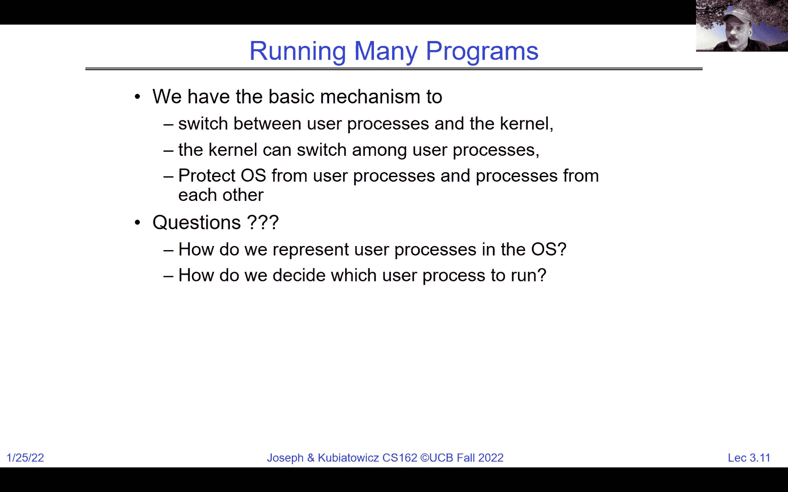

 Doesn't tell us anything about when we switch or how much time we give each of them。 That's a。 that's a whole another discussion that's actually pretty interesting because there's many reasons you might have for giving one more time than the other or interrupting it immediately or whatever。

 We're going to talk about that a lot。 Coming up later。 How do we pack up the process and set it aside well we just showed you we basically unloaded its registers into its PCB。 How do we get a stack and heat for the kernel well that's interesting we'll have to talk about some of that。 Memory allocation。 Doesn't look like we're wasting a lot of memory by forcing kind of all of the user programs to be loaded at once。

 Certainly。 So we're going to have to start talking about swapping and then ultimately we're going to talk about paging which is even cleaner。 But so the process control block is an essential piece and you know they're different for every operating system as to exactly what the format of them are but you get the idea what's in there。

 It's got some state of the process。 It's got， you know。 a number for the process ID and maybe knows what the counter is and some of the other registers。 Memory limits， etc。 All of that's in the process control block and the kernel uses that to track the processes because especially in the next couple of weeks where we're mostly talking about one core or one CPU for the whole machine。 Most of the processes are idle and in stored in process control blocks。

 There's only one of them that can be running at any given time。 Okay。 Now。 the kernel scheduler is this thing that we're going to talk more about for basically deciding which gets swapped in。 And we can give non CPU resources， memory， IO， etc。 Also by a scheduler。 And I would say。 as we've said a couple of times now the process control block there's one per process so everyone has。

 Every process has a separate process control block and they're stored in the kernel memory。 Okay。 Now， let's not worry about maliciousness for now。 The user to kernel mode switches are under control of the kernel and we'll talk a lot more about maliciousness when we go much later in the term。

 But let's assume that where the right things are happening so far。 So what we just shown you here is pretty simple。 So this is two processes one core。

 It sounds like sounds like an ad campaign right two processes one core。 We start with process zero。 which is a user mode thing。 Okay。 And it starts executing。 And if you notice right at about the end of this blue arrow， there's something like an interrupt。 Okay。 And at that point， we're going to save enough state of the process and we're going to enter system mode。

 And the system mode is really running kernel code and that's the point at which we save a bunch of stuff。 And we load we save a bunch of stuff into PCB for zero and we load it back from PCB for one。 And then we're going to start running process one， which is also going to be running in user mode。 Okay。 And， and notice， so the question about who hands out non CPU resources。

 So that's going to be a combination of the scheduler in some instances and other parts of the kernel。 So we'll definitely get to other resources later。 But let's stick with things simple things for now。 Okay。 And so if you look what you see here is process zero runs for a while。 There's an interrupt。 We saved state we really reload state。 We start process zero back in user mode。

 We run for a little while we come back， save state for process one。 And then we sort of rinse and repeat based on scheduling。 And if you notice these little places that I have yellow circles actually represent a user to kernel or kernel to user transitions。 So these are the points at which we actually have the change in the system mode。 Okay。

 And the other thing to note is what's in red here in this particular diagram is 100% overhead。 Right。 So there was a question earlier about what， what about the overhead is switching。 Well。 here's overhead。 Okay。 And that's basically the time to handle the interrupt and save and restore registers and then make scheduling decisions。 That's all overhead。 And so one thing that you can start thinking early in the game。

 Is that if we switch back and forth too frequently。 we're going to actually end up where we do more switching than we do a computing and that seems like a bad idea。 Right。 So there's a minimum amount of time that I'm going to throw out a number there。 But oftentimes if it's bigger than 10% people will say you're thrashing。

 Don't worry about those exact numbers， but if you're wasting more than 10% of your CPU cycles in the switching process it's probably bad。 Okay。 And when I said kernel memory I meant the great part earlier。 Okay。 So what's running in here in between the save and reload。 Well。 there's a decision about what to run next and that's a scheduler。

 which I'm not going to go into great detail today。

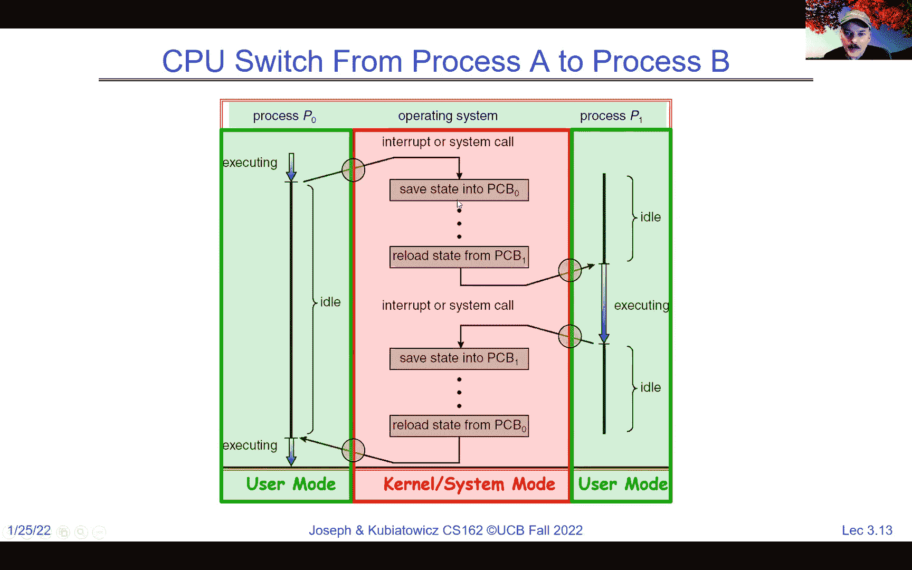

 But think of this as a continuous loop where it says， well， I'm going to schedule。 So if there's a ready process pick one， run it for a while， and then loop back and do it again。 Okay， and this arc is going to be triggered by something like a timer or a yield or I/O。 And we'll talk a lot about that next time。 Okay。 But scheduling。 What about scheduling？

 It's this select process thing is a mechanism for deciding which get to run next which processes are threads and lots of different scheduling policies。 So we'll have ones that give you fairness。 We'll have ones that give you real time guarantees like might be in your Tesla when you slam on the brakes。

 You know， there's some real time guarantees that better come into play or it runs into something right。 Maybe there are some optimizations for latency。 These are all interesting scheduling policies。 And so you'll be many different ways。 Okay， to think about it。 There's a good question kind of in the chat about how the OS knows which registers to save and restore。

 And that's going to be that's going to depend on kind of which registers are active。 And so。 mostly it's a decision to just save them all unless there's more information。 You're going to potentially get the potential you're going to find out in project one that if there's。 for instance， an FPU running， then you have to save and restore the FPU registers。 Okay。

 And we want to again just reiterate that we don't want to be spending a bunch of time saving and restoring or scheduling。

 And so we do not want to be going back and forth too often and again keep that 10% number in mind。

 Okay， so I， there was discussion about this in Piazza and I thought I'd bring this up。 There is this notion of simultaneous multi threading or hyper threading。 This leave it to Intel to take something that people knew already。 which is simultaneous multi threading and give it a different name， which is hyper threading。

 But the idea is that the hardware， it's a hardware scheduling technique that basically allows super scalar processors。 which are processors that can run more than one operation at a time。 To have two simultaneous threads or three threads or fourth threads running at the same time in the same pipeline。 And we're not going to spend a lot of time talking about this because that's for 152。

 But if you look， here's a single CPU where each think about time going down here and solid blocks as opposed to gray represent cycles where actual executions happening。 So here， notice that in with only one thread we're wasting all of this gray time in the pipeline。

 But if we put two threads in the same pipeline， then we can fill things in。 And you could say， well。 here's two pipelines。 Here's actually hyper threading。 So this would be two cores。 This would be one core with two hyper threads。 The two hyper threads fill out and better utilize the pipeline。 The difference between two hyper threaded cores and two cores is small from an operating system standpoint。

 It's much bigger from an architecture standpoint。 And we're still only talking for the next couple of weeks about one CPU。 one hardware thread。 But you'll be able to see when we start having more cores that more cores and hyper threads are pretty close to the same thing for you。

 And this scheduling that I talked about in software earlier is actually happening in hardware。 And it's happening potentially on a per cycle basis。 So you can have two different threads on the same cycle。 Now， also remember， and again。 not for the next couple of lectures， but remember the world is parallel。

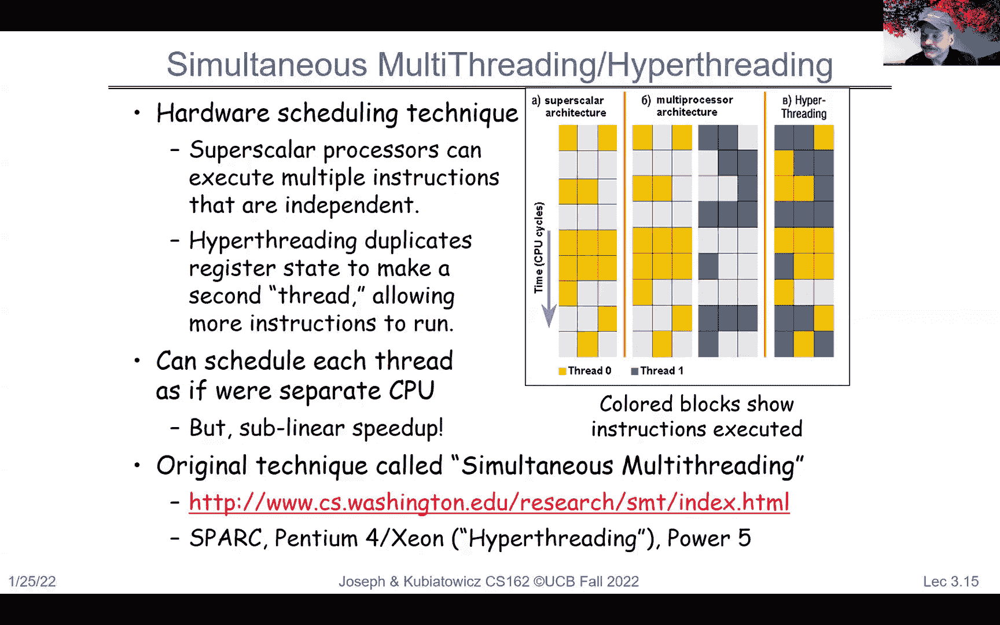

 So even at the single core level， you can have something like this Skylake from 2007。 and then there's a more recent version three of the Xeon processors from Intel。 Lots of cores。 lots of hyper threads。 There's two 28 cores， 56 threads is one example of Skylake。 Lots of parallelism。 Okay， so even though we're talking about how to deal with one core。

 once we figure that out， then it'll actually be pretty clear。 hopefully to everybody how to do multiple cores。 It's not going to be a big deal。

 Okay。 Yes， and we can， you guys can talk to me offline about policies in hardware in hyper threads。 but there's all sorts of policies about who gets to go when there's not enough resources。

 Okay， so is the base in bound。 I said branch in bound there。 Sorry。 A good enough protection mechanism。 It's base in bound。 And the answer is no。 it's really too simplistic for real systems。 Okay。 And it's inflexible or wasteful。 You have to dedicate physical memory for potential future use。

 So if you want to have enough space where the stack can grow。 then you got to allocate a huge big chunk just for that。 Okay。 So it's also got fragmentation。 So if you have processes with a bunch of different sizes， and you want to have， you know。 them exit and then bring in new ones， you're going to very rapidly get fragmentation。

 And you're going to have to start moving things around in physical memory just to make just to find space to fit。 Okay。 And so this idea of the base in bound is really not great as a sole mechanism for translation or protection。 It's even worse when you think about sharing。 So picture your mind back to that yellow and green block。 If those two processes want to directly share memory。

 there's no mechanism in the current base in bound that I shown you for that to happen。 Okay。 So yes。 the OS can resize the bound to give more memory， but there's no way for yellow to talk to green and green talk to yellow because by design。 they don't， they can't overlap each other。

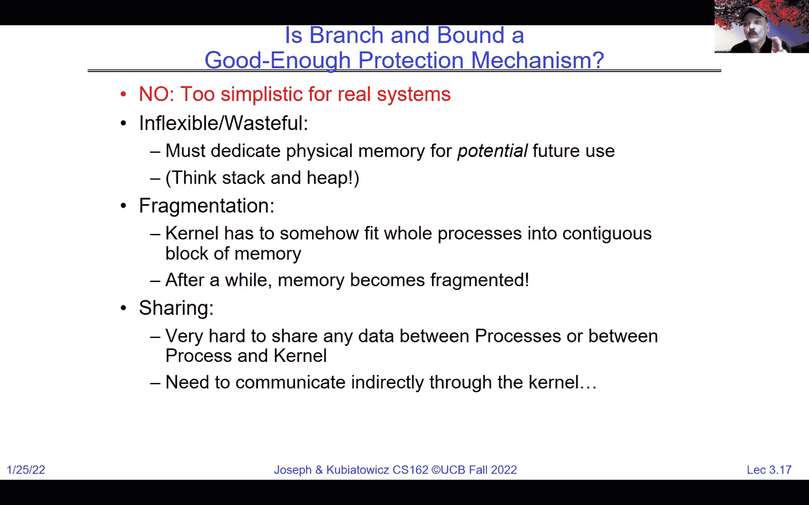

 Okay。 And so what's one clear thing that we're going to do when we get into virtual memory and greater detail is we're going to start talking about a generalization of base in bound。 which is the segment idea。 And here， for instance， in the x86， which is the processor。

 you're going to become very familiar with in this class。 There are multiple segments like a code segment and a stack segment。 And each of those segments has a base and a bound。 Okay。 and we can have multiple segments and two segments from different processes could actually overlap in physical memory if that was our choice。

 And now we've got a way to have them communicate through memory。 Okay。 Now。 this is one thing we could do， but even better is actually paging which we talked about last time we started talking about it and you heard about this in 61 C as well。

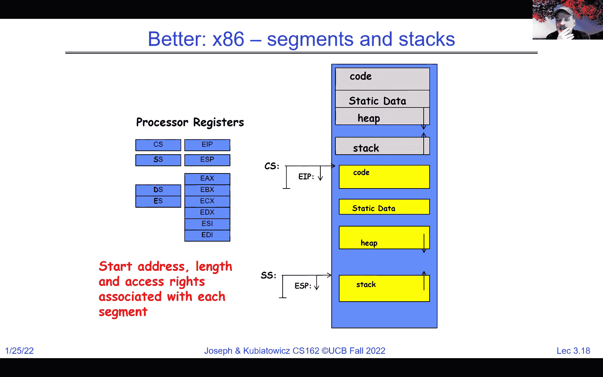

 And then the idea is that you take the code data heap and stack of each process。 And everyone in the addresses goes through a generalized translation unit。 and can be pointed at in pieces to all sorts of pages in the physical memory。 And then we can get a translation on page size where all the pages are fixed。

 And that fixed size like 4K or 16 K is going to prevent fragmentation because every page is the same。 And we can get more stack or heat just by adding a few more pages to the translation map。 And that's where paging comes into play。 And modern virtual memory is almost exclusively page based。 And there's a lot more about that in greater detail。 Okay。

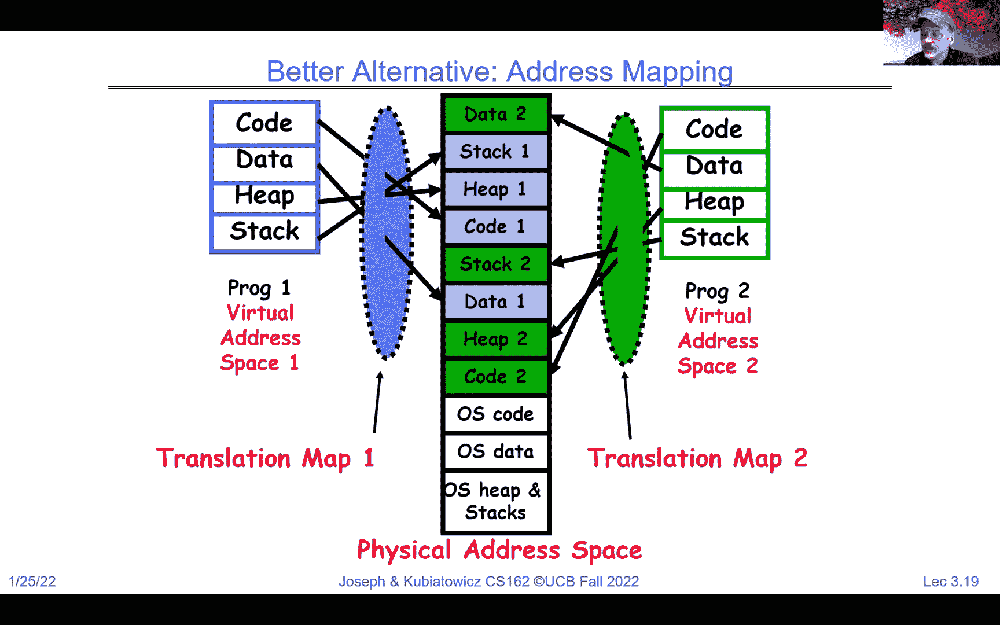

 All right。 So， time to get really started with the class。 If you haven't gotten started。 I will tell you that homework zero is due tomorrow。 Okay。 And so。 I'll put up some other office hours。 I apologize。 But homework zeros do tomorrow。 Okay。 And so you got to get familiar with 162 tools configure your VM submit the get all of these things。

 And then we have homework zero do quickly is to get you guys all on board because these are all things that you need to know how to do right off the bat。 Okay。 And you should be going to some section now。 It doesn't really matter which one。 because there's sort of crucial other information we want you to get a whole of in terms of understanding。 you know， C language and so on。 And I hope that everybody who everybody got a chance to go to the sea review that we had on Saturday。

 I believe that if you didn't go there's videos of it， you should all review that because again。 just like I was mentioning with homework zero there's a bunch of things we assume。 that you're going to know and be ready to go with。 Okay。 And those are kind of like baseline before we really plow in。

 And don't don't get too worried about this in the sense of how can I possibly do this。 We understand that 61 C left you with a very basic understanding of C。 but that's why we give you these resources in the first two weeks so that you can really get up and running。 Okay。 And so take that as a challenge to get good enough for C that you can start doing the class。

 Okay。 And I'll put up， I'll put up better office hours I realized I had these earlier today and I realized it's not going to work so I'll have better office hours for you。 The other thing that's really important is this。 Friday is the drop deadline。 Okay。

 so that means that you have to make a decision to drop otherwise it gets tricky because you start using up your。 you know， once a career kind of drops or whatever。 It's available。 And if you know you're going to drop you should do that now because that way we can bring more people in from the wait list。 And the other reason we have an early drop deadline is because when we form our groups next week。

 we want to make sure that we have groups of people that are going to stick together and so we don't have orphan groups where there's a couple of people are all that's left。 Okay， and so really do a careful thinking about do you believe that you want to keep up with the class。

 then please do because we want to have you here。 In fact。 I think as of right now we may have led everybody in off the wait list so that could come to the class。 But if you're not going to make it， please make a decision to drop Friday。 Okay。 And if you know of any friends of yours that have stopped coming and haven't dropped。

 let them know that they need to drop because they will get put into the class。 And then I have this every semester I have somebody who doesn't realize they're still in the class until the very end of the term。 And it just， it's a mess。 So， I'm sure all I'm glad to know that all the people that are。 that are here are excited about the class。 And I know somebody who might still be on our on our class list and it's actually planning to drop and might be in danger for getting。

 Please make sure that they don't do that。 So the group registration form stuff's going to come out over the weekend and or next Monday so really it's next week that we start really getting our groups together。 And that's going to be the an autograter form or something of that nature and groups are for in a group。

 Okay， you know， that will not have three in your group or add another to make five so make sure that you start looking at four people。 And find a group。 All right， and we'll help you if it turns out you can't but it's it's often much better to have folks that you know in the group。

 Okay。 If you only have a group of two， you might post on Piazza。 There's lots of lots of people up there we have a special kind of thread about people looking for group members。 So try to find somebody yourself。 I mean we'll help you a bit but might not hurt to try。 try yourself first。 Okay。 And you're going to want to put down a section。 And then suggestions。

 Okay， we'll have the ability for you to ask for a couple of sections。 but you want to try to make sure that all of you in your group can attend either the same section。 which is ideal or at least the same TA。 So we have some 20 hour TAs that have two sections。 All right。 The midterm， the day and times are fixed now for midterms one， two and three。

 I believe they're all the seven to nine PM and we'll make sure that everything's updated。 And there is， there's going to be a conflict form to figure out how to deal with conflicts。 Okay。 Now I'm going to say this again about discussion sections if you look about the first bullet here。 We don't have discussion sections permanent ones until you get your group because your group all has to be in the same section。

 All right。 So for this last week and this week you can attend any section。 but starting next week you need to pick a set of sections that we'll choose from in which your group can all attend the same section。 And it works in worst case you and your group are in this with the same TA in different sections。 Okay。 We， I think I've answered all of those questions。 Are there any others？ Okay。 Yeah。

 you know this class get started pretty quickly。 But part of the reason we started so quickly is because there are some things where we want to make sure you're really rare and to go and ready to dive in and be productive。 Yeah， so please， as Anthony just said in the chat。

 please try to find your own group rather than us randomly assigning。 Now there was a one question in chat that I noticed that I wanted to talk about briefly and it was a good one。 So the question was， can why don't you page。

 Why don't you combine paging with segments。 And the answer is the way we've described segments right now it isn't a paging scenario because it's got a base and a bound。 Okay， and so that unless you made every segment exactly the same size it wouldn't be good toward paging。

 Right， however， as we'll show you is you can easily combine segmentation and paging and in fact the x86 actually does that。 But that's that's for a lecture in a few weeks。 Okay。 but for now basic segments that we've described to you don't have paging potential because they're variable length。 Okay。 Now。 So if you remember， move and light along。

 We talked last time at the very end about there being three ways to get from the user into the kernel。 Okay， there are three types of kernel mode transfer。 And I want to I want to explore that a little bit more so one is a system call。 And a system call is going to be the basic way in which user code can ask the kernel for facilities or services like file systems or communication across the network。

 Okay， and so this is an example where a process requests the system service。 It's kind of like a function call but that function calls actually going to go from user mode into the kernel and then back out again so it's a function call。 but it actually goes through different modes。 And you're going to get in project one you're going to actually get a chance to write some system call code。 Okay， so you'll be familiar with this as you go forward。

 This is going to also be some similar to what we're going to call a remote procedure call later。 because you're going to take a bunch of things that were part of the function call and they're going to get packaged up in a way the kernel can accept them。

 And then they'll get returned back later。 Okay。 Now， many system calls。 Okay。 we're going to show you a bunch of them。 As we go over time， there's a question here can you know。 can a process ask for more processing time well certainly in some schedulers there's a way to ask for more time。 There's certainly ways for a process to say hey I'm done for now。 You can let somebody else run。

 There are many， many system calls okay and I think in the latest versions of Linux there's thousands of system calls。 At some point that API gets to be a little excessive。 Another way other than a system call which is a voluntary request from a user into the kernel。 We also have this idea of interrupts and interrupts are external asynchronous events that force the system to go from user mode into the kernel to handle an event。

 And it's totally independent of whatever the user was doing。 So the user is busy computing pie to the last digit and interrupt might come along it's going to suspend and go into the kernel。 handle the interrupt and then go back to where it left off computing pie。 And why do we have interrupts well interrupts are for things that are unpredictable or unknown like when is a packet going to come in from the network or when is the disk going to have its data back for you。

 And a very important interrupt which is going to be very important next time when we talk more about scheduling is going to be a timer interrupt。 which is how the kernel can be sure that it can steal time back away from the user。 So if we were switching between the yellow and the green and the yellow and the green。 The way we make sure that the kernel can always do that is a timer interrupt goes off。

 And if yellow is running， we go into the kernel the kernel will change things around and then let green run and then a timer will come off and then it'll let yellow run。 And so timers are going to be kind of one of our key mechanisms for ensuring fairness of execution between different processes。

 And then another one is a synchronous exception or trap。 And these are examples in which something that's tied to what the user is doing can't go forward。 The simplest example is an easy one divide by zero so the users run in some code they try to divide by zero。 The answer is big， right， very big。 So that's an exception that can't continue。

 We enter the kernel with an exception。 Another good one that you're going to see a lot of a little later in the term is a page fault。 So the user tries to use a part of the address space that doesn't have any physical memory backing in。 Well， we'll get a page fault exception that'll be in the kernel and the kernel will then make a decision about how to handle that or whether to boot the process out of the picture there and kill it。 Okay。

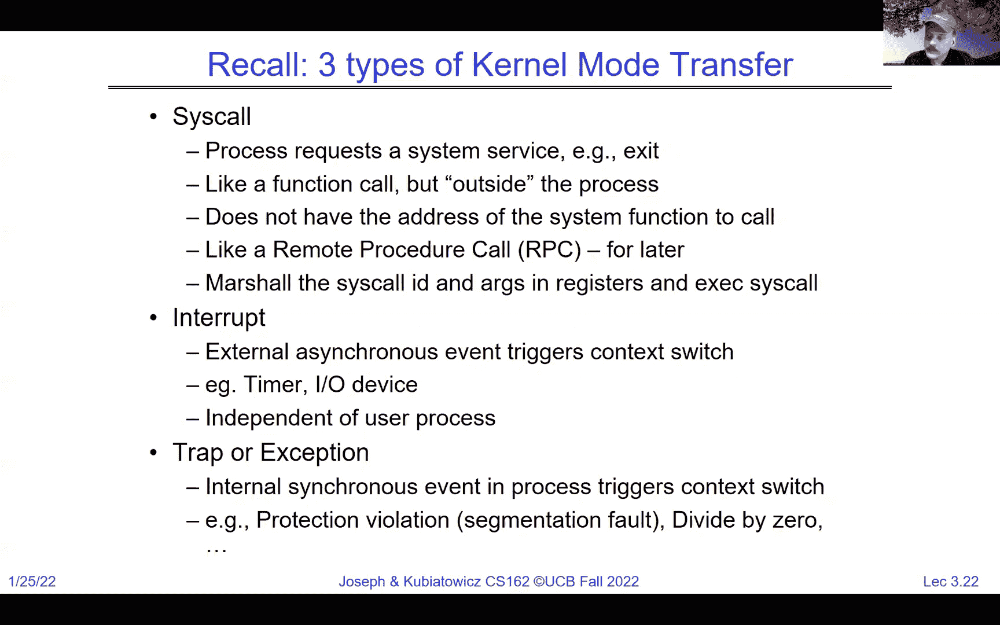

 Now if you remember， I showed you kind of this new last time to kind of the circles where we had the hardware was the brick underneath and then we had kernel mode which was things that handled hardware directly and then user mode which kind of floated on top of everything。

 And so at some point we have an exec call where the kernel has been asked to start a brand new program running that exec call transfers into user mode。 And now we're running a program as a process。 And during the course of the execution will maybe make service calls of the kernel but eventually we'll have an exit which will take us back to the kernel and this is the life of a process from point A to point B。

 Okay， and we're definitely going to cover scheduling in a much greater detail in later lectures。 But for now let's look at the mechanism of getting things running and what happens when they're running。 And so when you're running， for one thing a user program might make a system call like it needs to read from disk。 So in that case that system call is in the kernel it might actually return right away。 Or。

 and after it's returned it might actually have the kernel start something in the hardware。 Okay。 and in that instance later we might have an interrupt that will pull us from user mode into kernel mode。 And that interrupt may cause the kernel to go mess with the hardware to read something out of the hardware like some network packet。 The result might come back， might do multiple reads eventually we're done。

 We restore the user's state returned from interrupt and poof we're now running user code again。 And so notice that all of these transitions out of user mode into the kernel mode are done in a way that are going to make sure that the user mode can continue running where it was without interruption or without it's state being destroyed。

 And so it can continue as if the kernel never took over。 Okay。 and that's part of that saving and restoring of registers which we're going to have to make sure we understand there。 Okay。 Now， the question here， can we assume that libc functions are usually going to trigger a context which not necessarily okay there's a lot of things if you look at this system call。 There are a lot of cases where a system call goes in the kernel and asks for information and comes immediately out without any context switch。

 And so， and then libc is often a shield over the system call so when you're calling these library functions it may make system call it doesn't necessarily mean that there'll be a context which。 Okay。 Here's an example where that user mode might divide by zero in which case we enter the kernel and the process is done。

 But other than that we can go back and forth for multiple system calls interrupts etc。

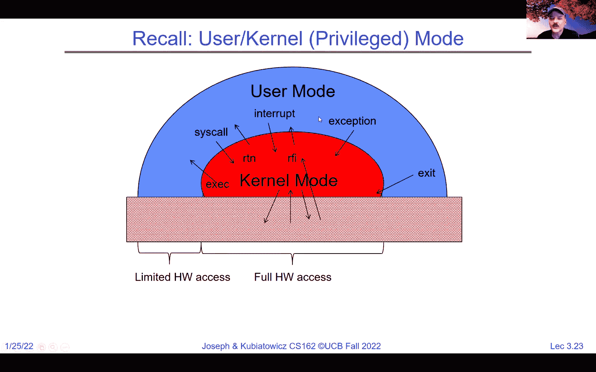

 And then eventually we exit。 Now， how do we make this safe。

 What do I mean by safe。 What I mean by safe is the user code's running。 And， you know。 we go to the kernel to do services and stuff but we want to come back to the user mode in a way that the user program can continue properly so that's one part of safe。

 And the other part is really going to be that there's nothing the user code can do to screw up the kernel。 Okay， so there's a lot of different uses of safe here。 But for instance。 you know it shouldn't be possible for the user code to make a system call with bad arguments that will cause the kernel to crash。 Okay， or whatever there should be no way for the user mode to screw up the kernel mode。

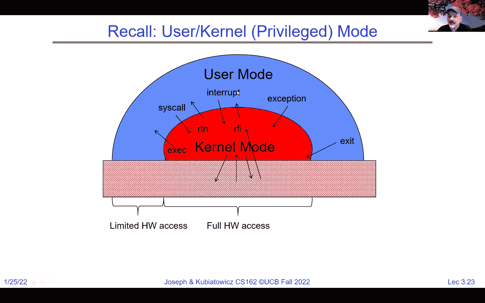

 So there's a couple different notions of safe here。 And in going from user code to kernel mode。 We have to make sure that all transfers into the kernel are controlled。

 Okay， and what is controlled mean controlled means that no matter how screwed up the request is from the user。 it shouldn't be possible for the user to pop into bad part of code or anything like that。 It should be controlled as to exactly what part of the kernel code runs that you always start at the beginning of kernel functions。 etc。 All of that needs to happen。 Otherwise malicious user code could actually screw up the kernel。

 And that's going to be part of what we talk about here。 But among other things。 there needs to be a separate kernel stack to make sure that whatever the kernel tries to do isn't impacted by how the user has screwed up their own stack。 Now a stack is a concept that you've got from 61 C and we're actually going to remind you a lot more about it next time。 But if you remember， it's that thing that makes sure that we can have recursive routines where the local variables are stored on the stack and we can push down the stack and pull it up。

 So， and in addition to a separate kernel stack， we have to make sure that the kernel code is careful to pack up everything the user is in the user's request and kind of validate it and make sure that it's correct for one thing and pack up all the users registers and so on so it can be restored。

 And it should really be impossible like I said for a buggy or malicious user program to cause the kernel to corrupt itself。 So this idea that the user is asking the kernel to do things is a nice notion because the kernel has got control of everything。

 but the kernel has got to be careful and do it and allow that in a way that the user can't screw it up。 Okay， and we're going to this is going to be a theme。 this idea of security and protection against malicious things it's going to be a theme that we're going to work on as the term goes on。 Okay。 Now， let's talk about hardware support here we brought that up earlier like what who has the the actual system mode bit and who does those transitions that we talked about earlier。

 And so that's the hardware， this idea that an interrupt like a timer interrupt can always take control back from a user program is in a similar P in a similar vein is about interrupt control。 And so interrupt processing as we mentioned earlier is not actually visible to the user process for one thing。

 And it's always can always be guaranteed to happen。 Okay。 so that you could kind of think from the user standpoint that the interrupt happened between two instructions。 instruction a was happening the interrupt occurs bunch stuff happens。 So。 what is the state instruction B happens from the user's code。

 they don't notice the difference except for what so what what one thing can the user notice to know that interrupts have happened anybody figured that out。 Exactly。 Okay， lag time exactly so that's going to be an interesting thing because in theory we're virtualizing the execution but there are these periods where time goes away。

 And that's going to be a theme a little bit later。 So the interrupt handler。 what's a handler a handler is the thing that is invoked inside the kernel on behalf of of that interrupt and so if it's a timer interrupt。 We make sure that that timer interrupt is the right place in the kernel and that interrupts are disabled so we don't have this permanent interrupt interrupt interrupt interrupt until the timer interrupt can actually take over and execute long enough to clear the interrupt field。

 Okay， now the question here about no context which is there's no context switch in the case of this interrupt happening in the what a context which is means to us and is going to mean a lot more to you next time is really a context which is when one user process gets switched out for another one。

 or one thread gets switched out for another one。 So that's the that's the thing that's getting switched。 Okay， and basically what that interrupt handler is going to do is pack up any thing that can't be handled immediately into an OS thread for later work。

 Okay。 And a good question about what happens to interrupts when interrupts are disabled is they typically just sit around until they get re enabled and then they take over。 Okay。 And if we have OS threads then potentially the scheduler is indeed going to schedule OS threads。

 Okay。 So think of OS threads as a， if they're like user threads but they don't have a user aspect to them。 We'll get more of that next time。

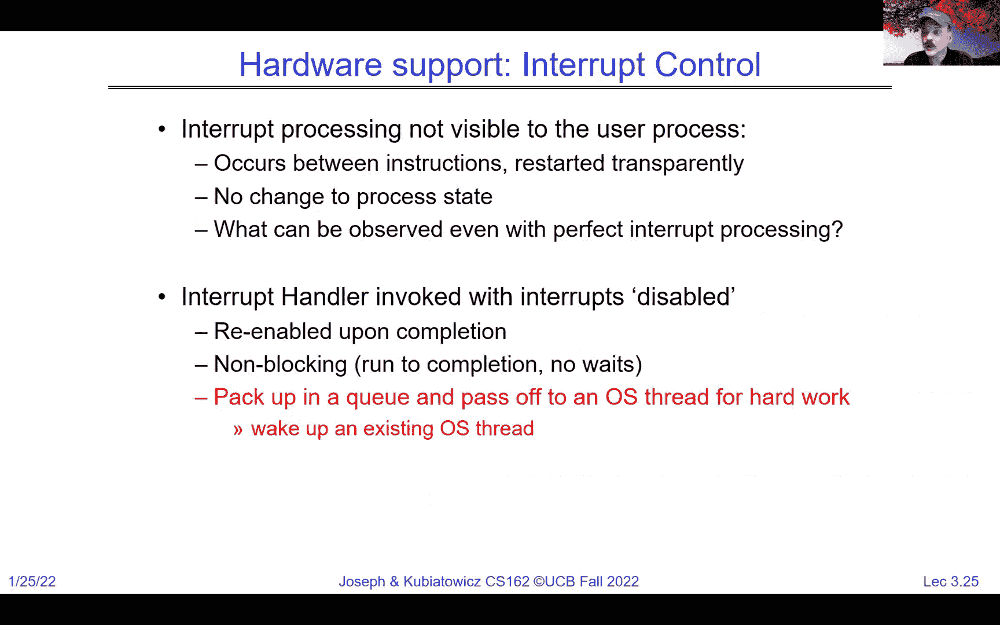

 So one of the things just to give you a little flavor for what interrupts are and don't worry about this too much but every machine has typically what's called an interrupt controller。 So it's not a CPU or our core and there's typically an interrupt disabled bit。 Okay。

 And then the interrupt controller basically is a place a chip piece of hardware where all the interrupt lines that are external including the timer interrupt。 Go through a mask which decides which of them are going to be enabled and which aren't。 And a priority encoder to decide if multiple of them are on and enabled which one's important。 And if anyone is enabled and its priorities been chosen then the interrupt number gets sent to the CPU。

 And at that point it's going to take an interrupt save the state and continue。 Okay。 And so interrupts are invoked with interrupt lines typically from devices and interrupt controller basically chooses the interrupt request to honor based on how it set the mask and priority。

 And the CPU is basically going to go ahead and start running that interrupt controller。 And most again we'll talk a much more detail when we get into scheduling。 But most interrupt situations are such that as soon as the interrupt occurs this disable every interrupt bit is set long enough for the CPU to do things with the mask and so on to avoid that infinite recursion of interrupts。 And then once it's sort of fixed that it can turn interrupts back on to allow others to occur。 Okay。

 And the CPU can disable all of them with this interrupt flag。 Right。 And that's a topic for a little more detail。 But I wanted to give you a flavor for the hardware context here。 There's basically these actual physical lines that say hi I'm a network there's a packet ready。 And that physical line causes an interrupt to occur which will take us out of user mode and into an interrupt handler。

 Okay。 Now the question about non blocking on the chat there is basically running to completion。 Okay。 We'll be much more detailed about that as we go forward。 And there's also this non maskable interrupt idea which is an interrupt that can't be turned off under any circumstances。 And often is for things like， well your power is failing and I've got a couple of seconds worth of capacitance to hold me up better do something it's an emergency。

 Okay。 So let's look at this idea here that let's suppose that the network is causing an interrupt and it's interrupt number five。

 What happens？ Well that number five gets into the CPU。

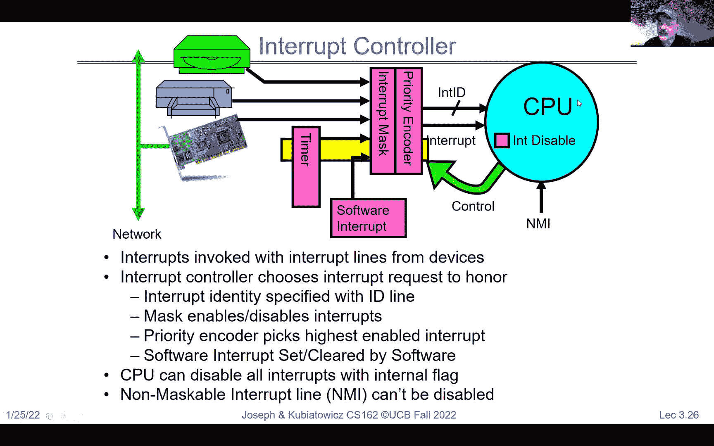

 And then that number five is used to look up in an interrupt vector which is a chunk of memory in that's accessible in the kernel only to the kernel。 And number five one two three four five has a slot in it that points to the interrupt handler for interrupt five。

 Okay。 And so notice what's interesting this is a very good example what I mean by controlled entry into the kernel。 We use a number five and a table to make sure that we go exactly to the right interrupt handler and to the beginning of it not somewhere in the middle。

 Okay。 So the fact that we use an interrupt vector and a table means the kernel can have very carefully controlled code that's been compiled and looked at millions of times that will be invoked whenever say a network interrupt occurs。 Okay。 And that's part of the key of making sure that the kernel it's running with really high priority can actually run only that piece of the code that has been vetted to properly handle say a network interrupt。

 Okay。 And we're going to see the same idea with a system call。 Okay。 And I'll say it here just briefly we'll talk about system calls in a second。 But when a user makes a system call， like I want to read a file that system call the way it goes from user to kernel is with a system call number。 And that number will look up in a vector table and it simultaneously with going from user mode to system mode。

 It will also make a decision about which of these vectors to run。 And so the user can't just say yeah put it in kernel mode and start running at this address。 because if they did that that would be a security violation instead they have to say， hey。 I want you to run system， call 12 for me。 And in hardware it will simultaneously save the user's PC transform into system mode and start running the vector 12。

 And by doing that atomically we get our nice controlled entry。 Okay。 All right。 The question about is there some redundancy here where different handlers might。 The same handler might be in different slots I think was the question yes under some circumstances that will happen。 Depends because there is a way typically of reading the idea of what interrupt number you've got as well。

 And so there are many different ways to structure this and we'll look at at least one of them in Pintos。 All right。 Now， where do you see this this dispatch pattern well it's in system calls it's in exceptions。 etc。 And we take interrupts safely well we just talked about the interrupt vector so it's a limited number of entry points。 There's the kernel stack， which means when the interrupt happens we just set aside everything the user is doing。

 And we reload the processor with a kernel stack that's known to be good。 All right。 so that no matter what the user was doing， excuse me， the kernel is in a good state。 Potentially with interrupts we got to turn that interrupt that just occurred off so that we don't get an infinite recursion。 And then we have this atomic transfer of control。 Which in a single non interruptable chain we get we get a new program counter a new stack pointer。

 We set the memory production protection properly and we make a user kernel mode switch and we do that atomically so that we go from the user to the kernel in a very controlled way。 All right， and that's how we're going to be able to make sure that the kernel gets entered cleanly。

 Okay， and then of course we want to make sure that this is transparent to the user and restartable。 And so， even as we make an atomic transfer into the kernel we need to save everything that the user was doing。 In a way that allows us to restore it so that we can come back from the interrupt and the user can pick up where they left off with their computation kind of unscathed in that。 Okay， and so this idea of a separate kernel stack is just I wanted to say a little bit more and then next time and the time after we'll show you in even more detail because you're going to get deep into the kernel in a bit。

 But we can't use the user's stack。 Can anybody figure out why we wouldn't want to use the users。 the memory that the user's stack point register is pointing it。 Yeah。 I like that safety and cap security and lowercase I don't know if there's a difference between those two。 But for instance the simplest thing is they could have a bad address in their stack pointer。

 And if we use it the whole machine could crash right so really we have everything for the first month or more of the class is going to have this two stack model which we're going to talk in great detail so don't worry about it too much。 But every user program or process that's running has a kernel stack associated with it explicitly。

 And when we're running the program itself。 We were up in the user code and it's got its own stack that it's running。 And if the process is suspended and sleeping， because say green is running so yellow is asleep。 If you look at yellow's resources， there's going to be the yellow's user stack but even the yellow's kernel stack is going to have the saved state on it。 And going to be suspended while the green is running。

 And then if we look at what happens when we're we've done a system call into the kernel。 notice that every time we make this transfer from user to system we get a new kernel stack。 And then potentially if the system call requires a bunch of stuff to be done in the kernel。 we use the kernel stack to do that stuff。 Okay， and so we have a nice clean guaranteed stack it's small。

 Okay， Pintas is going to be 4k and we'll talk more about that。 But it's enough to run what we need down here and then when we're ready to return from interrupt in particular case。 we return all of the stuff that the system call itself was doing。 And then we restore the user state which is going to include restoring the user's stack and then we return to user and the user picks up where they left off。

 Okay。 And so yes I did say there's a separate kernel stack for every user process。 And there is a good comment in the in the chat does all of this security stuff rely on there being no bugs in the kernel。 Yes。 So if there are bugs in the kernel， all bets are off。 Some bugs are worse than others。 But you can imagine。 Okay。 Where is the kernel stack that's a great question can be many places in Pintas it turns out that the kernel stack actually is a single page and has the PCB in it。

 Okay， not specifically in the part that's called a stack but it's all in one page。 Okay。 and we'll look。 And we'll look at that in more detail。 Why do we know the user can't can't touch the kernel stack because it'll be in a part of memory that's inaccessible because of the translation protection of the of the address。 base think back to base and bound from earlier。 These are in the gray part。

 And as a result when we're running up here in green or yellow， they can't access gray。 Okay。 hopefully that helps。 And so we'll make sure that our protection is such that the user can't mess up the gray。 So for instance， in the case of the x86， you can see here that when we're running at the user level。 we have the the users stack。 We have the users code PC and what I'm showing you here is the stack segment。

 And the ESP is a stack pointer here we have the code segment and the EIP。 And then after we're during， excuse me the interrupt system call。 we have switched atomically over to the kernel stack so notice how the stack pointer is on the exception or。 the back and the instruction pointer is pointing into kernel code。

 This transfer from here to here actually happens as part of the hardware transfer in the x86 and we'll get a lot more detail about that but that's。 that's kind of how we set it up so that when the interrupt happens we go poof over the other side and we automatically switch to a new stack。

 So that helps to keep the integrity of the kernel up there。 Okay。 Now， if you remember。 I gave you this picture last time but maybe we can understand a little bit more about it now so the application itself。 the user code is kind of up here at some， you know。 interesting program that is computing the last digit of pie or whatever。

 And then we'll be linked with some standard libraries like libc that was mentioned in the chat earlier。 And then those libraries will potentially make system calls into a part of the kernel that is running part of the kernel code which is going to be running。

 in the system mode。 And in the case of a monolithic kernel like this one。 we'll talk more about non monolithic ones much later。 All of that code is inside a special part of the memory that has been linked just for the kernel and set up to run in kernel mode and it has things like the file system and the scheduler and all sorts of things。 Okay， and we're going to talk about many different pieces of this as the term goes on。 And。

 and this question in the， in the chat about why the registers are saved in the exception stack。 Think of the exception stack and the kernel stack are the same thing。 Okay， there， you know。 when you take an exception， the kernel stack is handling the exception。 So that's an exception stack at that point。 Okay， sorry for the confusion there。

 But exception stack and kernel stack are the same for your purposes right now。 And so this system call interface is the one that we're going to spend a little bit more time on as we end this lecture and probably a little bit into the next lecture。 But I wanted to show you this right so all of the services that we think of as being provided securely by the kernel are things that run in kernel mode and are inside the kernels memory。 Now， there's a good question here is the hardware built with the OS in mind or is the OS built purely on top of the existing hardware。

 So that's philosophy 436 that's a different class than this one。 I would say， you know。 originally there were no nothing that we would recognize as an OS but the OS idea has been around since almost the beginning of time and so basically。 Pretty much all hardware is built with an OS in mind。 It's just a question of how sophisticated an OS can run on given hardware and we'll hopefully understand a little bit more about that。

 And then I love the chicken and egg comment in there。 The other reason there is a chicken and egg thing here is that as people have become more sophisticated in their requirements from the operating system。 hardware has adapted。 And the great example of that which we will talk about later in the term more is the idea of virtual machines。 There's been adaptation pretty significantly over the last 20 years of the way the CPU is designed to make it easier for running virtual machines。

 Okay。 And the registers are the same registers。 So keep in mind， I'm going to say this。 The question here， do we have separated registers for the OS。 Usually no except for special processors。 For now， just remember。 we are thinking about one core or one CPU to rule them all。 Okay。

 and it runs both the kernel code and the user code and we got to make sure the right thing happens with saving and restoring the registers when we're transitioning back and forth。 Okay， so think about a single， a single set of registers to rule them all is the way to think。 Okay。

 so there's this narrow waste， which is really the system call interface and we're going to be exploring this more in detail。 but you could think of the space of applications is large。 the space of services and hardware is large， and it's the system call interface the。 controlled entry to the kernel that really gives us the power to make this work in a controlled way。

 So what about that system call handler？ It's roughly similar to what interrupts。 but it's for calling services。 And so once again， we're going to vector through a standard。 well-defined system call entry points。 We're going to locate arguments and registers are on the stack or wherever when to get into the kernel。 We're going to copy the arguments because and make sure that they're validated and saying because we can't trust the user to either give us arguments that are in a reasonable part of memory or that are reasonable。

 We're going to validate them and then we're going to copy the results back into user memory when we're done。 And so it's basically the kernel will trust， but verify in the sense that everything gets verified。 Maybe trust nothing， I guess。 But go into a system call， check everything， check it twice。 make sure all the addresses are good。 Do what you were asked to。

 copy the results out of the kernel back into user space。 So the user is never given access to the kernel and it can't corrupt the kernel。 Now the question about does the， so I think the， let's hold off on the question of does the OS have its own registers or not。 I think keep in mind that most of the registers for execution are all the same。

 There are some special ones for things like the base table of virtual memory and stuff。 but that's not kind of what I thought the question was about。 So， okay。 so let's put it all together。 Here's a web server， you know， you make a request to the web server。 you make a reply。

 Question might be what is it that the web server does。 And so you can imagine on the web server itself is a process that is the web server。 Okay。 and on that web server， there's hardware with networking and disk。 There's the kernel and then there's the server process， which is that Apache web server。 All right。

 and you know that web server when it starts up， it's a process。 It's running in user mode。 And the network， basically the server starts by saying read for the。 read the network socket that has been set up and ask it， are there more requests in。 And usually what will happen is that system called a read is going to wait by going to sleep if there's no requests。

 And now in this situation， the server is sleeping because it's waiting for something。 Okay。 and meanwhile， the request， or sometime later the request will come in。 It'll generate an interrupt saying， hey， there's a request， which will wake up the server process。 return the request， and now the server process。 And now the server process has the request in a buffer。

 So notice there was a read system call that came back with data， but in print。 what happened in timing is the read system call slept for a while until the interrupt came in。 And then we got our data。 And now that data is what it's a request for a web page。 So we figure out what that means。 It's HTTP and HTML。 And we're going to figure that out。

 And now we know what file to read。 So we'll do a read system call。 Notice this read system call is going after the disk。 This read system call went after the network。 You're going to learn very soon that Unix makes everything that's I/O look pretty similar。 Reads and writes are going to be similar across the board。 But here we ask for a read。

 That's going to have to wait because potentially the kernel may actually have to go to the disk。 And that's going to take time。 The disk will interrupt with a result。 The result will come back from the read。 Now we have a reply buffer。 We'll format the reply。 We'll send it back to the outgoing socket via another system call。

 And the reply goes back and we end up with looking at a web page。 Okay。 And the difference between an interrupt and a system call here is the system call is a。 synchronous query from the process into the kernel that's like a function call that's。 going to give a result back。 Whereas the interrupt is an asynchronous thing that comes in from the outside world。

 Okay。 All right。 And this step two and step seven， those are interrupts。 Okay。 And they're going to invoke that interrupt mechanism I showed you earlier。 Okay。 And the white box is here。 Uh， represent queuing。 And so we're， you know。 I'm being very high level here right now， but there's a bunch of， queues。

 And so typically if there were a bunch of packets that came in before we did our read， then。 they'd be queued and the read would grab the first one and so on。 So typical sockets or buffers have many， uh， many， um， queues。 Now this question about， um。 does the interrupt happen without the kernel making a， request？ And the answer is going to be that。

 um， yes， but there's some setup where we've set the， socket up in advance。 And once it's set up。 then there's a channel and somebody who's trying to make， uh， um。 get a web page will actually send a request in to a， to this queue that's been set up in， advance。 And so we're going to be able to make sure that we're not going to be able to make， the request。

 And so we're going to be able to make sure that we're not going to be able to make， the request。 And so we're going to be able to make sure that we're not going to be able to make， the request。 And so we're going to be able to make sure that we're not going to be able to make， the request。 And so we're going to be able to make sure that we're not going to be able to make， the request。

 And so we're going to be able to make sure that we're not going to be able to make， the request。 That's why， you know， we've got to make sure that when the interrupt happens， really。 this interrupt is actually interrupting something else that's running。 Probably not the service process because the service process is sleeping， but the。

 interrupting something else that's happening， saving and restoring its registers， doing。 handling the interrupt and then restoring to that thing。 And then eventually we run the server process。 Okay。 And so there's a lot of simultaneous things going on here that are going to be things we。

 have to sort out， but I am quite confident that within the next couple of weeks you'll。 have a much clean handle， a much better handle on how this all works together。 because there's a fairly simple set of mechanisms。

 All right。 So if you recall and we don't have a time to go through this entirely， actually。

 let me stop and see if there's one more question on this。 Anybody else have any other questions？ Ah。 good question。 What happens if an interrupt comes while another interrupt is being handled？

 So remember that interrupt controller。 So the interrupt controller。 when the first interrupt comes in， okay， both， I'm assuming for the sake of argument。 you're asking what happens if two， interrupts come in from the network at the same time or roughly the same time。 The first one will enter the interrupt handler and that interrupt handler will。

 disable the network interrupt while it's processing interrupt number one， taking。 that first packet in。 And then when it returns from interrupt， it'll re-enable and at that point。 the second interrupt will come and go forward。 Okay。 So basically the way we control the interrupts to make sure that we don't have。

 chaos because the outside world is messy， right？ There's the philosophy 405 for you today that the outside world is messy。 We make sure that we never let， we never re-enable interrupts to happen if。 we're doing something to the core state of some thing inside the kernel that would。 get messed up if the second one came along。 And so that's how we're going to enable and disable interrupts properly。

 Okay。 Good。 All right。 So if you remember， we talked about processes today， but one thing。

 So how do we manage the process state？ You know， obviously you see we got stacks and registers and code and data。 We're going to have to figure out how to initialize all that stuff。 So we're going to get there and we're going to need to worry about creating， and exiting processes。 Okay。 And if you remember， everything outside of the kernel runs in a process。

 So it's not like processes are special things in the sense that they only， happen occasionally。 Processes are major functionality。 Okay。 And so even more interesting is the fact that processes are created and。 managed by other processes。 So we have a bootstrapping problem here。 So processes are created by other processes。 You know， this is the ultimate chicken and the egg。

 How does the first process start？ And the answer is the very first process gets started at the time of the。 kernels booted。 And it's typically called the init process。 And once that init process starts。 it will then start a shell potentially， or start a set of other processes。 So once we have the first process， it will then be able to do something， called fork， which will。

 if you'll bear with me for a moment， I'll at least， give you an idea what it is。 And then we'll talk a lot more about it next time， which allows more。 processes to be created with that first one as the parent。 Okay。 And so we have a process management API exit fork， exact wait， kill， sig action。

 And in your project number one， you're going to get to play with this， pretty intimately。 You'll get to learn this part of the API。 And for instance， what does exit do？ Well， exit。 as you can imagine， is a system call that takes us from running。 a user process to exiting the user process and basically destroying， its state。

 And if you remember that little semi-circle picture I had where there。 was red in the middle and there was the blue user process， the thing at the， far right was exit。 So that's how a process is killed off。 And if you look here， you're going to learn a lot about main。 That's going to be your favorite procedure in C because that's the。

 starting point for a typical process。 And we run a bunch of stuff here。 In this case。 we're running get PID， which is a libc function that， then makes a get PID system call。 So it asks the kernel， "Hey， what is my process？ ID？"， And we'll print it out with a printf。 And then we exit with a zero argument that typically means no errors。 So zero is a good exit。 Okay。

 And the question might be， "What if we forgot that？"， And we just let main exit。 Well。 it turns out that main is not the real first thing that runs。 There's other stuff。 And so if we forget exit and we just let main and then exit gets。 called automatically for us by the OS library。 Okay。

 So there's kind of an implicit exit zero at the end。 All right。 Okay。 Now you'll see this in。 you know， project zero and it。c。 You get to actually see kind of part of what happens at the。 beginning of wrapped around main there。 Okay。 Now let's look at fork。 So fork is one of the stranger routines that you'll get to run。

 into part of its kind of a legacy thing from original Unix。 But it's actually a pretty useful routine。 So the idea is copy the current process and get a new process ID。 and create a brand new address space and a brand new security。 context and start running with a single thread。 Okay。

 And that single thread is going to kind of pick up where the other one left， off。 So fork is the weirdest function call that you're going to get。 And that's the first function call that you're ever going to run。 into because if you think about it before you execute fork。

 there's one process after you execute fork， there's two。 processes which are duplicates of each other。 So if you were to look inside。 what happens is the first process， executes fork and then it returns from fork。 And the second one also returns from fork in the exact same place。

 in the code except that the original one， which is the parent， process。 returns something non-zero from fork。 It's an integer and that non-zero number is actually the process。 ID of the child。 Okay。 And in the child process， it's going to return zero telling that。 guy that it's child。 And if there's something less than zero， that's going to be an error。

 And that's only going to occur inside the parent。 Okay。 And the state of the original process is duplicated in both， the parent and the child。 Okay。 There's going to be duplicate address spaces。 So the address space is going to be fully copied into the child。 All of the file descriptors are going to be copied。 Everything is going to be copied。

 And you'll have two things that are running and are essentially， identical for each other。 But one of them gets a non-zero back from fork and the other gets a， zero。 Okay。 Now the use case is going to be something you're going to run， into very quickly。 which is how a shell works。 It uses fork among other things。 Okay。

 And the child is able to find out who its parent is and what its。 parent ID is by a separate system call。 So you'll learn about those。 But the other thing to think about a use case for fork is suppose。 that you have somebody running and you fork off a child process。

 and it's going to have exactly the same environment as a parent。 So it'll be easy for you to figure out how to make it。 And at that point。 the child will be in that environment you've， already set up and you can have the parent wait until it's done。 Okay。 And if you look， I'm going to give you one quick example here。

 How does it decide greater than zero versus zero？ Well， that's just an if clause。 So here you say。 you know， result equal fork and then if result， greater than zero， otherwise if result zero。 And those of you who can bear with me for another couple of minutes。 I want to just show you an example。 So here's a good example。

 So here's a fork usage where we have the main。 Okay。 And it sort of gets its own PID and it says。 oh， parent PID is this。 All right。 And now at this point， we call fork and we set the CPID to equal。 the return from fork。 Okay。 And notice what we do right after。 We say if CPID greater than zero。 then we know that the parent is， going to run in this part of the if else if CPID is zero。

 the child is going to run in this part of fork。 Otherwise we're going to cause an error or declare an error and say。 the fork failed。 Okay。 Yes。 This is messed up。 Maybe。 Well， it's a good thing to learn。 Okay。 Now notice that first and foremost， after you get past fork。 there are two things that are essentially identical where the only。

 difference is one of the processes CPID is greater than zero and the。 other process CPID is equal to zero。 And the question of what do you。 what if you call a function inside， either of these if statements？ Well。 that function will now run only in the given process。 So up to this point， we had only one process。

 After this point， we have two。 If you run something in this arm of the if， it'll only run in the。 parent process。 If you run something in this arm of the if， it'll only run in the， child process。 So for instance， here I've got two arrows。 So I've got C and P。 You can imagine C stands for parent and P stands， for child。 Oh wait， are you paying attention？

 C stands for child and P stands for parent。 And notice that right after fork。 we have two things and they'll， start executing。 And in that case。 the parent will run here and the child will run， here。 Okay。 When does fork return one and when does it return the other？ It always returns。

 unless there's a failure， it returns greater than。 zero in one process and zero in the other process。 So this is why I'm leaving you guys to mull over this over dinner， to think about this。 After we call fork， there are now two where there were just one。

 Those two processes are both running。 One of them， the return from fork was greater than zero。 The other one， the return from fork was zero。 Okay。 Now the question of what's the PID of the child。 So every process has a process ID。 Here we know what the child's PID was just by looking at CPID。 Here the child has to ask， you know， get PID to get its own PID。 Okay。

 Now there's lots of questions here。 One of them， why do we have to explicitly call fork？ Well。 because fork is a style of parallelism。 So fork is one way to do it。 We'll talk about other styles of parallelism as we go。 But fork is the principle way that you have for creating a brand new， protection environment。

 namely a process。 Okay。 We'll talk about new threads。 So this new process that we've just created。 the child process has， exactly one thread running。 We'll talk about how to get more。 Okay。 And the child process can yes call fork。 So in here， the child process could go ahead and call fork。 And now we've got a parent， a child and a grandchild。 Okay。 Or the child could call fork and a loop。

 And now you have a parent， a child and a bunch of grandchildren。 Okay。 So there are many ways to making， uh， yeah， while one fork。 Okay。 So that's a guaranteed crash of your machine。 Okay。 Um。 actually what will happen at some point is you'll probably exceed some， uh。

 number of processes that you're allowed。 Okay。 All right。 Um， and there is a limit。 Uh， okay。 So。 um， we're gonna， we're gonna end there， but I just wanted you to see。 So fork。 think of this as one way to get parallelism。 Okay。 And we'll talk a lot more about fork， uh。 next time and keep in mind that， there'll be many other ways to create parallelism。 All right。

 So in conclusion， we talked a lot about processes this time。 Okay。 Address based with one or more threads is a process。 Uh， it owns the process owns its address space。 Inside that address space， what happens when you read or write the address 12，468 could。 vary from every process。 Okay。 We'll get to that later。 The process owns its own file descriptors。

 file system context and has one or more， threads。 We talked about how interrupts are hardware mechanism for gaining control from。 outside to run in the kernel。 And it's a notification that events have happened where the big one is going to。 be timers for us， but also IO like network and， and kernel or a network and disk。 And we also talked， started talking about native control of processes。 We talked about fork， uh。

 and we talked about exit and we'll get into exact and so on。 Uh， next time。 so I'm going to leave you go because we're way over time， but I hope， you， uh。 guys have a great evening and we'll see you later。 Bye。 Yeah。

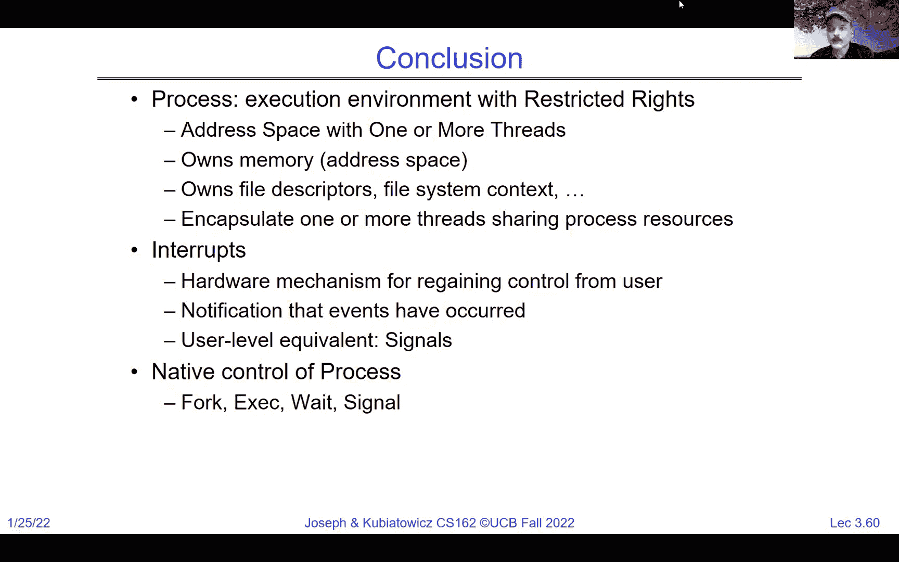

 [BLANK_AUDIO]。