# P4：Lecture 4： Fork (Con't), Introduction to  I O (Everything is a File!) - RubatoTheEmber - BV1L541117gr

 Okay， welcome back everybody to 162。

 We're going to pick up where we left off last time briefly and finish our discussion of。 fork and then move on。 And so if you remember last time we were talking about how to create new processes。 And basically the mechanism that we talked about was fork。 This is going to be one of several mechanisms for getting parallelism and concurrency that we're going to discuss over this term。

 And if you remember fork was a call that was function call that was a little weird relative to anything else you've ever seen before。 So what fork does is it you call fork in one process and it returns in two different ones。 Okay。 so you have a parent process you call fork。 It creates a child process。 which is identical to the parent one and then both of them return from the fork system call。

 And if you notice， one of them will return something bigger than zero and the other will return something equal to zero。 If it's bigger than zero， that's going to be the original parent process。 And the number you get back is the process ID for the child。 If you get zero then the process knows that it was the child process that it's in and it can call get PID and get parent PID and all of those to find out kind of what's parent is and what。

 it's ideas。 Only if you get something less than zero then you know that the fork process failed and you're still running in the parent and the number that you get back tells you something about an error code。 Okay， and the key thing about fork is that the state of the original process ends up duplicated in both the parent and the child。

 So if there are gigabytes of memory。 In one case in the parent when you fork the child will have gigabytes of memory。 Okay， and that may seem kind of excessive except that what's going to happen is we're going to show you how that's actually not too expensive because really we're not going to copy all of the memory we're just going to copy the page tables and in the parent and the child so that we can sort of。

 duplicate the memory without actually having to duplicate anything。 That'll make for another discussion。 So， so remember two processes are there after fork and both of them return from fork。 And so what I'm showing you here is what happens right after we call fork。 the value that comes back is an integer。 Okay， it's a PID T actually but it's that's really an integer and both the child and the parent process start from that same spot。

 If， and then they start running。 And what you'll see is that the parent will notice that CP IDs greater than zero start running in this point。 The child will notice that CP ID is equal to zero start running in this point。 And at that from that point on then that the executions of the two processes diverge。 And you can do something completely different in the parent than from the child。 Okay。

 now the question in this chat there does this， you know， the parent and the child share the memory。 So the answer is yes and no。 And so I don't want to get too much in the subtleties you should think of this as if they get complete copies。 The way this is really going to work is we're going to set everything read only。 And the moment one of them tries to write then we'll copy and so it'll still look exactly like they have their own separate copies。

 but it's a lot cheaper than copying all the memory。 Okay。 we'll talk more about that in a couple of lectures。 So。 I want to see if there are any questions on this basic idea here。 and then we're going to go a little forward on it。 Okay。 to one process calls for two of them returned from four。 All right， now。 here's a good challenge for you guys。 So here is a program。 Notice what it does is it has an integer that's declared that's a global variable。 It calls for the parent will run in one arm of the L of the F the child or run in the other and I'm ignoring errors here for a moment。

 Question is， what do we see on the screen if this runs because it looks like I the two eyes uses of I are kind of interfering with each other when I'm going up one of them's going down the two processes are running at same time potentially what happens。

 Very good。 So somebody said in chat wait， isn't it the fact the processes are protected from each other。 Yes。 Good answer。 So if you notice， yes， the parent had a global variable I。 And when we duplicate they both have a global variable I but it's a different global variable because it's a completely different address space。 So in fact， these two processes will do their loops perfectly happily with I going up and one and down in the other。

 The thing that we'll see that's going to be a little non deterministic is since they're both printing to the same standard out and we'll get to that later in the lecture。 then you'll see some interleaving from the two of them but there won't be any confusion about I。

 Okay。 So， so basically I is is literally the execution graph is forking into two completely unrelated things。 Yes。 That was to we talked about exit last time that was for。 I want to give you a couple more sort of process management pieces here before we before we move on to the next topic。 So what I've shown you so far gives you new processes but they're kind of duplicates of the each other and that hasn't seen too useful yet if you want to make a bunch of new processes。

 Okay。 To do that we're going to have the exact system call and wait is going to help parents understand about children finishing execution。 So let's look at the exact first。 So the exact system call and there's a bunch of different variants of that so I'm going to call them exact generically。

 You can do a man on exec to find out all the different versions。 but what's going to happen here is if you notice we start off with fork。 When we're in the parent。 all we're going to do is we're going to execute weight which is going to just wait until the child exits and I'll say more about that in the next slide。 And the child is going to do something interesting it's going to make an array of of character strings and notice this is LS dash L and then a no。

 So it's an array with two strings and a no。 And the exact V system call is going to have its first argument slash bin slash LS and the second argument is going to be this array of arguments。 Okay， and what's interesting about this is we for to create two processes the parent just spin weights。

 It's actually just waiting for a moment。 The child doesn't exec。 And what that does is it looks this program up on the file system and it replaces everything that was in the process with the contents of the new program and it starts at running。 Okay， so assuming there are no errors。 What we just did here is we forked off a new process。 a child process。 We started it running the LS program。 And the parent is waiting。 Okay。

 and so now you can start to see how like your shell might work。 where the shell has its parent which has the little prompt that puts down there and processes what you type。 And all of the things you spawn off to run get put in their own process as child processes。 Okay。 and so what exec does is assuming there's no failure。

 Exact will throw out all the memory that's in an existing process and it'll start a new program running in that process。 So the process sticks around the contents of the address space of that process changes。 And the only reason that you would ever return from exec is if there was an error。 Okay。 And then what about this weight system call so there are lots of versions of weight you can look that up。

 The simplest one that I told you about here is trying to address an interesting problem you can imagine。 So if the parent starts a child process and the child process ends。 the parent wants to know what was the success of that process。 Was there a successful return was there an error， etc。 And so weight basically lets us do that。

 And so if you notice down here the child is basically executing something。 And then it doesn't exit 42 which since that's not zero is technically an error。 The parent does a weight and it gives the address of an integer variable for a return value。 And this weight system call will wait until the child exits at which point this exit will get the exit code will get put into the variable that we've put forward。

 And the weight system call will return and we can see what the return value was from the child。 Okay。 Yeah， and so the， and the question about back here whoops is that yes the ARGS are basically just like the arguments to LS。 And that's essentially how the arguments to LS get put in there。 Okay。 Now。 so again this weight system call waits for the child to exit gets its value and then moves forward。

 Okay。 And so the reason you can think that this needs to be more complicated。 And so the reason why it's not clear is because if a child exits a long time before the parents ready to execute weight。 clearly that process has to sit around with its return code， even though it's done。 so that the parent can eventually get the weight status。 Okay。 And so if that's the case。

 then that process that was a child， but doesn't have a isn't running anymore is what's called a zombie process and it'll sit around until somebody executes weight。 Now there's a good question about what happens if you have multiple children that are spawned off this weight system call this version will wait for the next one to exit。

 There's a bunch of other ones where you can even say wait for this particular process ID to exit。 etc。 So there's much more sophisticated ones that you can do。 The other question here is does the exec the process here have access to all the parents memory。 And the answer is no。 So what happens is there's a child's memory。 Okay。

 which is a copy but separate from the parents and exec will essentially overwrite everything with the new execution image。 Okay。 And so here's a， here's a typical what I call the shell pattern。 So this is what you typically see in your shell。 After you've typed your command。 we fork off a new process。 The child goes off and exec executes that process with an exec。

 The parent does a wait and waits for it to finish。 Okay。 And that's what you typically see when you type a command on the shell you hit return something happens and then it gives you back to the shell。 That would be this。 Now， in a different pattern where you want to start a child and then go on。 let it run and go on to do something else in the shell。

 That's going to be a case where we don't do wait， but we just move on。 Okay。 So the question is。 where is the status variable coming from if you look in this particular code。 notice it's the exit code。 So when the child exits with exit 42。 that is the status code that gets returned into the status variable。 Okay。 All right。 And then last。

 I want to talk about。 So we were talking about starting， stopping， managing processes。 The last thing， that's from the standpoint kind of of a parent。 The system needs to be able to control processes that are already running。 And so that's basically the so called kill。 Action。 Okay。 And basically。

 I'm going to show you an example here。 So typically， if you hit like control C。 That's actually going to send a signal that's going to be an interrupt signal to the process that's running。 And you want to， we have a more general idea here where we can send signals to any process。 And it's kind of like a user level version of an interrupt。

 And you're going to actually get to play with this in your projects。 But I want to just show you a particularly simple example of what you can do。 So when you hit control C， the default thing is that the system will catch that control C and throw it off and kill it。 Okay。 However， if you want to do something different， you can do this。

 So notice that the main procedure actually sets up a SIG action， which you can look at this code。 I don't want to go in great detail right now。 But the SIG， SIG action has a handler。 which is a program， which is a function that you've actually registered already。 So here's the signal callback handler that you've put in your code。

 you register that as a handler to be called on SIG it。 And so when you hit control C。 it'll now call this instead of the default systems version。 And in this case。 it'll say caught signal and then die。 But you could have it say caught signal ignoring and return immediately。 And that means the control C wouldn't do anything except keep saying caught signal。

 So there's lots of flexibility there with signals。 Okay。 All right。 And then there's a bunch of different signals that SIG and SIG into control C。 There's a SIG term。 which is the kill shell command。 And then there's like SIG kill and SIG stop。 which are uncatcheable signals。 SIG kill is what you get with kill minus 15 for kill minus nine。

 You get these extreme signals that are not catchable。 Okay。 So I guess I'm not entirely understanding the question here why just the status variable。 This is a code and the selected variable so status in this case。 So status。 the word status here is just because I said status notice that my city and status this could be a variable of any name。

 So this could be weight。 Fred， if you wanted， I don't know if that answers your question。 whatever you， whatever you feel like calling that variable in the parent you can do it。 Okay。 All right， so moving on now if you remember last time and the time before actually we showed you this figure。 which kind of gave you an idea of the difference between user mode and kernel mode。

 So the kernel mode is the set of high priority things that are inside the kernel and they have direct access to the hardware and they have to be perfect。 Okay。 The user mode are the things that are written by users and other people and may have bugs in them and typically what the kernel is doing is it's providing the process of traction and making sure that the protections of the file system。

 and all of those other things are maintained by the operating system。 All of that's inside the kernel。 The user mode is the thing that is running most of your programs。 but is running inside a process address space and protected from all the other ones and all the other ones are protected from it。 Okay。 So， the， the difference between the kernel and the shell is a question the shell is just a program running in user mode that you're running on your own。

 but it's asking the kernel to start up new process。 So the kernel is this core bit of the operating system that handles the file system and the scheduling and all of that sort of stuff and is essentially always there。 Okay， the shell is just a user mode program like every other one it's just it's been set up to process your commands and use those to launch programs running。 Okay， and again if there with respect to wait if there's multiple children then wait we'll just wait for the next one to exit。

 And then you can run it again and again。 Okay， so the other thing to note by the way is this there's two things shown in user mode here kind of the applications in the standard libraries。

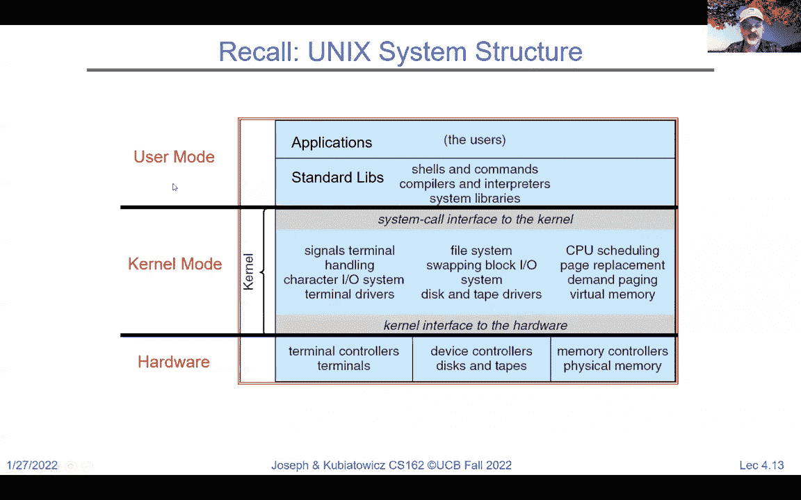

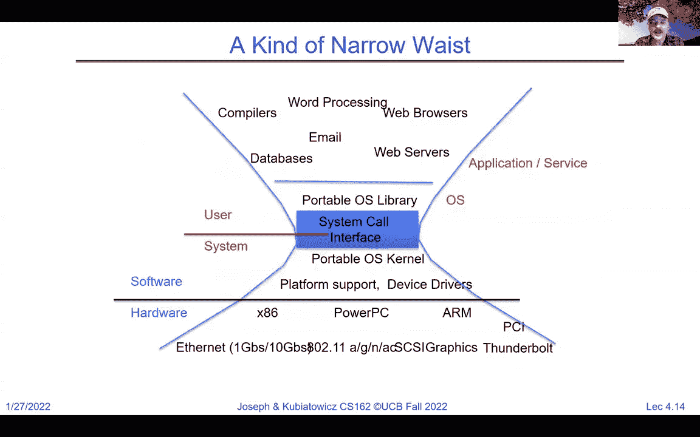

 So the standard libraries are a set of wrappers around the system call interface to make it somewhat easier to use and just the raw system call interface。 And so if you look here at this idea of kind of the narrow waste of the system call interface puts the library like a lib C is a good example of that on top of the system call interface。

 and the things inside a lib C are somewhat easier to use。

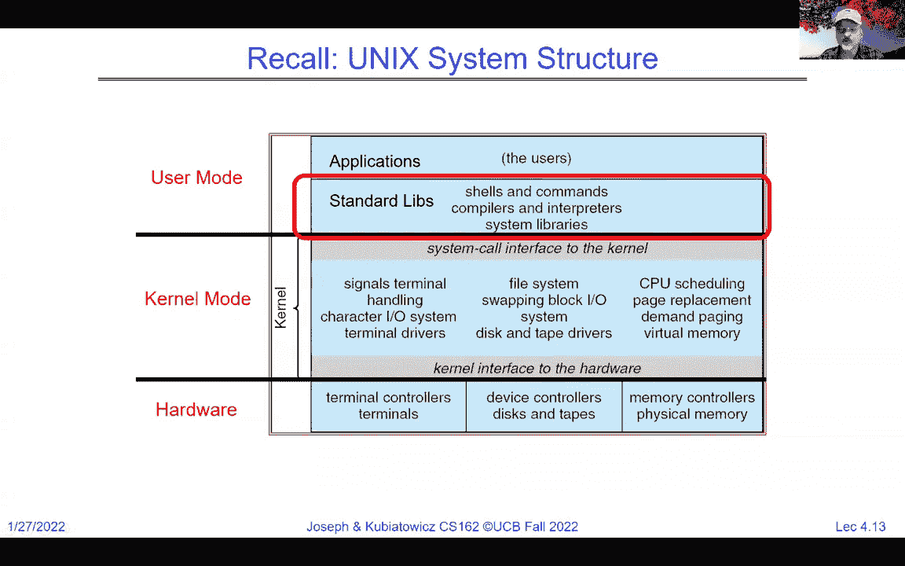

 than just the raw system calls。 And so most people who are programming in see at least link with lib C and so they don't use system calls directly what they do is they use lib C which uses system calls。 Okay。 And so， for instance， I had this picture earlier and I just wanted to clarify so typically you have a library like a library。

 and you can see that there's a library。

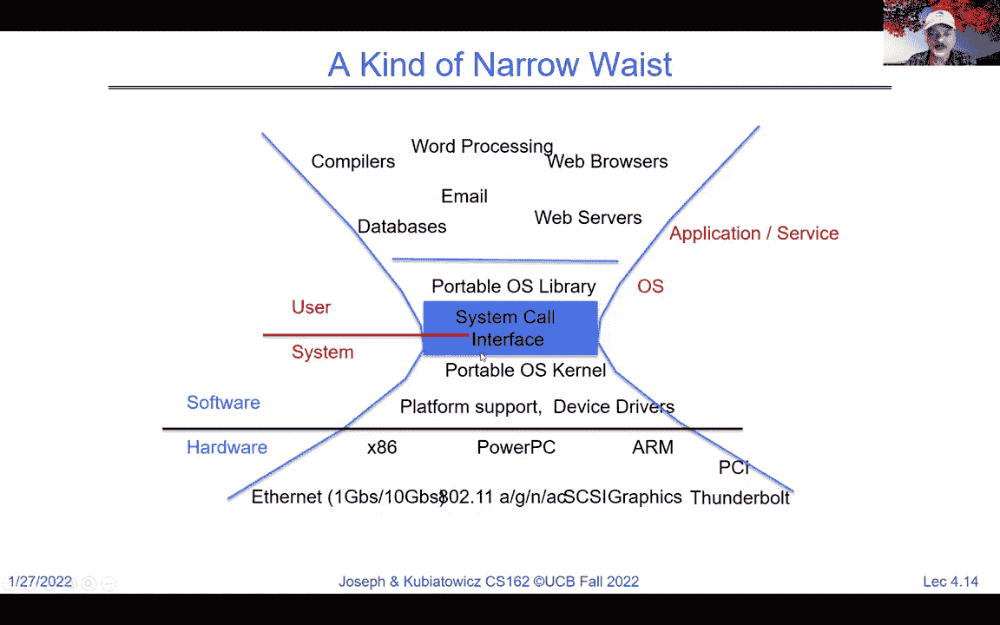

 And to clarify so typically you have a library like lib C that is linked into your application this is showing a bunch of different applications grew green yellow orange with the lib C and the lib C gives a nice clean easy interface up to the application。

 And it calls the OS typically， and most of the library code runs inside of the user mode with occasional call outs to system calls inside the OS。 Yeah， as Anthony says about weight I know that's a great interest to a bunch of people but do man wait and you'll see there are lots of different versions of it。

 Many that do， you know， non blocking things that let you say， well wait for this particular process。 etc。

 Okay。 So， this idea here of wrapping things around the system call interface is a very standard thing because that system call interfaces extremely powerful because it's like a function call into the kernel and out。 but it's very stripped down it's kind of the bare minimum that you need。

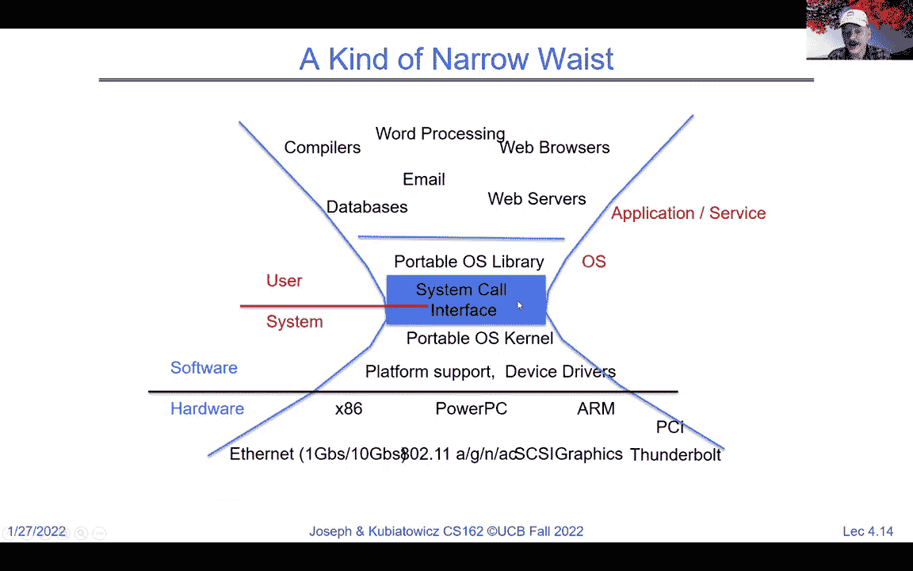

 Okay。 And we're going to today today we're going to talk a lot about going across that system call interface。

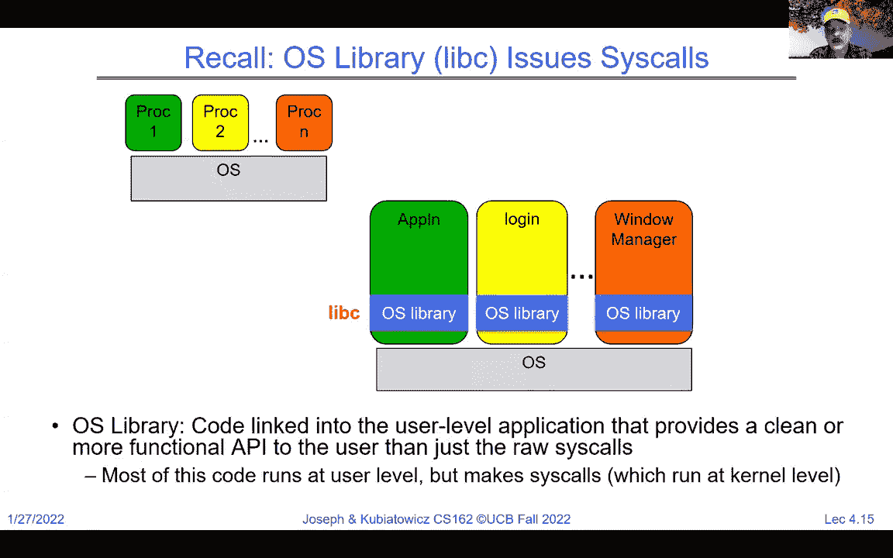

 And I'm going to give you some good examples of where lib C comes into play to provide a cleaner wrapper around the actual calls into the system call interface。 Okay， and this should help set you up quite well for project number one。 And so the first idea for the day here is that everything is a file。 Okay。 and this is a very you Unix idea。 And it got adopted and standardized as posits and I'll say what posits is a moment but it's a standardization of a lot of Unix。

 And the idea behind this is it is an identical interface for files devices， regular files on disk。 networking， interprocess communication， all of those， everything looks like a file。 Okay。 And so a lot of this type of communication， things that go across that system call interface are based on system calls like open read right close。 which you're going to become very familiar with by the end of the term。 Okay。

 and there's an additional part of this interface which we haven't talked about yet， called I octals。 and the I octals are kind of or I could all I've heard people say。 although that's a little strange sounding to me。 But the I octal interface lets you do customize stuff to interfaces when you can't quite shoehorn everything into open read writer close。 And this typically an I octal interface that lets you do some additional configuration to those things and we'll talk about a few I octal calls over the term。

 but basically imagine that open read right and close are what you do for everything， almost。 And the idea that everything is a file was actually kind of radical when it was originally proposed。 and you can see this in the one of their early papers from 1974 from Richie and Thompson called the Unix time sharing system。 And I actually posted this on the resources page， if you're curious about it it's one of its actually the first paper we read in 262 a so you can get a little bit of of an interesting flavor for what a graduate computer systems it's like。

 And this idea of everything's a file was powerful enough that now we don't even think of it as radical。 and it even got adopted as a standardized interface so I wanted to say what POSIX is so POSIX is the so called portable operating system interface for Unix。

 It's an interface for application programmers， specifically it's a system called interface。 and it was created to kind of bring order to the fact that there were many different flavors of Unix spread all over the place and they all had slightly different system。

 call interfaces。 And so what happened was they adopted a more standardized version called POSIX。 and some of the POSIX interfaces are even available in Windows。 even though Windows is not a Unix operating system that still has POSIX interfaces。 And so when I talk about Unix system calls and so on。

 mostly I'm talking about things that are standardized in POSIX and if I'm not， I will。 I will clarify。 So let's look at this ever present file system abstraction。 So a file is a named collection of data in a file system， for instance。 So POSIX file data is a sequence of bytes could be text or binary or serialized objects it doesn't really matter。

 and the operating system doesn't care so the operating system doesn't have any interest in how you format your data it's just going to give you kind of a bag of。 bytes that are sequenced， and it's up to you to interpret them。 Okay。 and there's only one example of a file type that's actually processed directly by the Unix file system and that's directories are in a special format。 And we'll get to that later in the term but for now a file is a sequence of bytes。

 It doesn't matter what the bytes represent。 Okay， and then there's file metadata like size。 modification time， owner， security information， all of that stuff， which。 you'll you'll get a good flavor for as you start using this interface a lot more。 A directory is really just another special file containing pointers to files and other directories with names。

 Okay。 And so each directory sort of provides a mapping between the file name and。 either a directory or a file that's represented there。 And if you trace your way from the root directory， which is the very top level。 through a set of directories to a file you're actually hopping your way through the。

 route directory， which is a file to the next directory， which is a file to the next directory。 which is a file to the final file， which is not a directory。 That tracing of the path is something that we're going to talk a lot about when we get into file systems in several weeks。 Okay。 But you've all used this so you're familiar with this idea。 And inside of Unix。

 every process actually has its own current working directory。 which is kind of the directory path for files that are being used by that process。 So there's a system call change directory， that can you be used to set the current working directory。 And absolute paths， which are things that start with a slash kind of ignore the current working directory。

 So this one is at root file system slash home slash osuki slash six。 CS 6162 or relative paths are things with dots in them。 Okay。 or in some cases with tilde's those are relative to the current working directory。 So if you just say index， HTML， that's really current working directory slash index dot HTML。 Okay。

 Now， what about this interface to files and so what I want to do today is we're going to do a really quick tour of the levels of the stack for IO starting with the high level of streams。 which is buffered IO and that's in libc down through the low level， through the Cisco interface。

 We're not going to say a lot about file systems right now but we're also going to say a little bit about IO device drivers。 just so you can get a flavor of all these interesting pieces of the stack that we're going to cover as the term goes on。 So at the highest level。 Okay， we have what are called streams。 Okay。 and the C high level API operates on stream。 So stream is an as a sequence of bytes that isn't really formatted in any particular way。

 And it's got a position associated with it。 I've got this little arrow here。 And there is an F open and F close routine。 These are a lot of these are in libc to open a file or close a file。 And notice that there's a special F in front of here F open F close。 So these aren't open and close。 So these are the F versions or the stream versions。 And so F open takes a file name。

 which could either be an absolute path， or something relative to current working directory。 And then some mode bits。 And it returns something called a file star which is a is a structure that you don't look into。 but is a stream that you can read and write from。 And then when you're done you F close you close by giving it back the file star。 Now remember what this means is there is some structure of a file capital file and it returns a pointer to that。

 And then the definitions are for this standard I/O dot H include all the definitions you need for this。 Okay， now the question here about what's a stream I'm going to say more in a moment okay but it's really just like I said it's an。 unformatted sequence of bytes that are kind of streaming along and you're going to read them。 Just read a whole sequence of bytes okay it's going to be a stream of bytes。

 And it's going to be like a river。 Okay， these mode bits are really something that you give it a string。 a pointer to a set of characters。 And there's a lot of mode possibilities here so if you give it an R。 it'll be read only if you give it a W it's right only if you give it an A you're opening it for a pending。 which is starting at the end， et cetera。 Now， now the question about are the permissions stored in metadata for files。

 So， I'm going to say yes for things that are of the power of Unix。 We're going to actually look at the fat file system as our first one where permissions are a little bit less cleanly defined but for now it's actually。 part of the metadata。 Okay。 And so an open stream is actually represented by a pointer to a file structure so look what comes back from F open is a file star。 Okay。 And how do you get an error back so this is going to be an essential question that I'm going to want to train you guys and Anthony's going to want to train you guys very well by the end of the term。

 Whenever you execute a system function of some sort you always ask yourself what's the error condition。 And here the error condition would be that rather than getting a pointer to a file structure you get back a null which are zero。 Okay， in which case the F open failed and you shouldn't go anywhere with it。 Okay。 And in class I'll say more about this later， I will probably not always in fact frequently won't look at the error cases because that would just make my slides messy。

 but you as budding system programmers should always think about errors。 And what's the error return。 And let's look at some of what we got with the stream interface so among other things。 there are some free standard streams that are always open for reading and writing。 So that's the standard input standard output and standard error。

 So standard in if you read from it that's the normal source of input。 Okay。 which if you don't do anything else is typically like the keyboard。 Okay。 standard out is an output stream and if you don't do anything special will just print on your screen。 Standard error also prints on your screen but typically errors go to standard error。

 So standard out in standard error， unless you change them are interleaved， typically。 and they go on the same screen。 Okay。 Unlike a regular file where I have to execute F open to get this in every process。 you automatically have standard in standard out and standard error ready to go。 Okay。 And basically。 they enable composition and Unix in an interesting way。

 So one thing you might not have done yet but you should in your in your Unix environment is if you say like cat。 which means dump out the contents of hello。text and you put this little， vertical bar。 which is a pipe symbol and then you say grep world。 What you're really doing is you're taking the output of this process。

 The shell will start two processes。 The output of the first one goes to standard out。 The input of the second one for looking for matches comes from standard in but the little pipe symbol actually connects together the standard out of this process。 to the standard in of this process automatically。 And as a result。 what this will do is it'll take all the contents of hello。

text and send it to grep to look for the world world， the word world exclamation point in that file。 Okay。 And so we're actually connecting up standard ins and standard outs with the shell and that's going to be something that you get to do with the shell homework。

 Okay。 So that's something to look forward to。 Now。 Let's look。 So the good question here is in the chat if it was just grep what would happen。 So the answer is that really the way you would do this is you would say grep world and then you'd say the file name and so then grep actually has two arguments that you use。 Okay， if you just said grep quote world on the line by itself。

 it would pause there because it'd be waiting for standard input。 So you would actually end up with a with a failure in that case okay because you really need to have a file to to grep from。 Okay， but get that a try。 Okay。 And it's actually what will really happen。 Well。 you give it a try see what happens。 Okay。 So now we're going to。

 So there was another question here about what does the greater than symbol do we're not we're not going to get too in depth into the into the details here until you get a little bit later but if you if I were to put a greater than symbol。 After all of this and then put a file name what it says is take the standard out from that grep process and dump it into a file。

 So the greater than symbol， rather than the bar actually allows you to redirect into a file。 So part of what the shell homework is going to be is you get to learn how to make vertical bar and greater than and less than symbols work properly by tying together processes。

 So that's actually what you get to do。 So let's look at something that's not standard it in standard out so if they let's suppose that we had a file on disk and we wanted to do stuff with it well once we opened it。 Then we've got the we can put the file star for that file we've opened here and now we can do reads and rights of single characters or strains。

 Okay。 And this will return this will put F put C will try to put the value on to a stream so this is a right。 And it'll either return the character or an error。 Here's a read for instance of string will actually read up till or this will excuse me F put as this will actually put a string onto the file all the way up to the no。 And then there's other ones like this okay so these are character oriented getting okay。

 And you can do man so I'm going to want you to start looking at man。 And then giving a command and that'll actually give you exact details about what these do。 Okay。 another version so but let's look at it one example just you see so notice how I opened input。text this is all relative to the current working directory。

 I get that input file star I have an output file output file star notice that the input one is open for reading the output ones open for writing。 And then what I do is I get a character from from the input file。 And as long as that character is not EOF I write it to the output file I get the next one and I keep in the loop so that'll basically transfer everything from the input file to the output file。 And then I close the two okay and this is doing character by character IO。 Okay。

 so in that previous example by the way the question is was cat and grapped two different children processes at the same time yes。 Okay so now those were single character or bite oriented IO we also have block oriented IO again notice they all have F in front of them that's important。

 So in addition to the file star of the open file we in this case we actually give a pointer to a buffer and the size of elements that we want and how many of them we want to read or write。 And this will read a whole bunch of things at once。 Okay， and that will be that's buffered。

 Bigger IO okay and it into a buffer that you specified and so this void star is really just a pointer to a buffer that you've pre allocated of an arbitrary type that's kind of what void star means and see you get used to this as well。 And so with F read I can read a big chunk of data at once rather than a single character and with F right I can write a big chunk of things rather than a single character at a time。

 And you can imagine this has a lot lower overhead and so you'd want to do buffer reader right you can't。 Okay， and so here's another example of using the buffer read and write versions and notice what I've done here or the read F right and F read versions and notice I define my buffer size here as a constant for 1024。

 And down inside the main here I declare a buffer of size 1024 that's what this means it's a character buffer。 And so then what I'm going to do is I read into that buffer。 That's a pointer to buffer of maximum size buffer size， a bunch of elements of size。 whatever character is。 Okay， and the， and from the input file。

 And that comes back as a link that tells us what length was come back with and it's either non zero or zero if it's zero the files done if it's non zero。 then I go ahead and write the buffer out that many items and I keep looping。 So this is now doing a much better copy from input that text to output。 that text where we potentially grabbing things in 1024 by chunks it's much more efficient。 Okay， so。

 here， we're still doing everything is still a stream but we're doing block oriented IO here and it was character oriented IO in the previous one so we're all still streaming。 Alright， and again check your errors so always assistant programmers。 you should be really writing things like this where we get the input from F open， if the inputs， no。 we do something else because we failed you do not want to pass no。

 You want to pass no into one like F read if this were no then this thing would fail in a bad way okay and you wouldn't necessarily know why。 Alright， always check errors， always start by saying man。 give the command see what the error return is like。 That's not error checking in class。 but that doesn't mean that you shouldn't check that。 Alright， so that's the high level API。

 There are a bunch of other things like you can do F seek to set the pointer to a particular part in the file。 Okay， so F seek you can set it relative to the， the current position so here's the current position of the file。 you can seek to an offset from there you can seek to an offset from the beginning。 And thereby you can go to different parts of the file to read different parts randomly as you will。

 Okay， but if you don't seek， then each read， whether it's a。 whether it's a character oriented get see or a block oriented read will actually just work its way slowly because it advances the pointer as you go。 Okay， so now what I've just described with streams is actually a good example of Lib C wrapping an interface around the low level descriptors for you。 Okay， and the reason that this is helpful。 A particularly good reason is if we go back to this example of getting one character at a time and writing one character at a time。

 you can imagine this is horribly inefficient。 In general。 because what happens is if you made a system call for every character that you were getting。 you got to go into the kernel that's got a lot of overhead it's got to go find the character bring it back。 And so this would be her horrendously inefficient。

 except we're using the streaming versions because we've got F here。 And what happens is F get see is actually running it user level inside the kernel， excuse me。 running it user level inside the process。 And this file descriptor actually has a chunk of memory that it has reserved in user level for for buffering。 So when you do F get see the first time it actually goes into the kernel grabs a chunk of data like a thousand 24 bytes and puts it into the user level buffer。

 And then each F gets see from that point on until we run out of that data is really efficient because it's in user level。 So the streaming is really about automatic buffering in a way in live see without you having to worry about it。 Okay。 So， but that's implemented at the low level by actually using the real system calls here's open create close and this is not a misspelling。 of create by the way， these are system calls directly that go into the kernel。

 And here I give a file named open and some flags in a mode， for instance。 and it opens the file for me but it returns an integer not a file star that means it's returning a file descriptor。 Okay。 And that file descriptor integer is something that I'm then going to use from that point on when I'm reading and writing。 And I'll show you that in a moment。 Okay。 But so what to notice from this。

 There are some flags like read， write， create， etc。 And more bits like permissions that I need for when I'm writing， you know。 what's the user group other permissions that I want to put in that file。 Notice that return from open， assuming that it's not an error which would be negative return。

 What I get back is an integer file descriptor that is an integer。 Okay。 And the other thing I want to point out is this open doesn't have an F in front of it。 It's open without an F。 Okay。 And so if the air if what comes back from opens negative it's an error。 Otherwise it's a file descriptor。 Okay。 And just like， just like in the buffered stream versions。

 the， the un buffered low level versions also have file descriptors that are integers for standard in standard out on standard error。 But since they're integers， what we know is there zero is standard in one is standard out and to a standard error。 And every process typically starts with those values assigned to something。 And so standard in。 which is， which is zero is assigned to grab stuff from your keyboard and standard out and standard error typically set up to send things to the screen。

 Okay。 And there are macros that you want to use。 You don't want to say 012 because that's bad programming style。 You want to say standard in file， no， etc。 And these macros are defined in another include file。 you understand。h。 Okay。 All right。 Now， so the difference between the F buffered versions and the un buffered versions is the un buffered versions don't have that buffer in memory。 Okay。 So they're， they don't have that efficiency of asking the kernel for more than the user currently wanted so that they can be more efficient。

 Okay。 But this is the direct interface into the kernel。 So， so notice。 for instance that read now doesn't have an F in front of it because I'm using the low level interface。 I put the file descriptor as the first argument。 And then I have a buffer and a size。 which is the maximum number of characters that I can get back。 Okay。

 And that's a read and reads will read up to the maximum size I asked for， but it might be less。 Okay。 And the， um， notice the fact here that what comes back from read is one of two possibilities。 either it's a zero， in which case， not only was nothing read。 but the file is done where at the end of file。 Otherwise。

 it's some number greater than one to tell me how many characters I got。 Okay。 And it actually might be less than what I asked for。 So if I asked for 20。 it might give me back one。 And you have to keep that in mind。 Okay。 So it returns up to maximum size。 And so if you're expecting more。

 you may have to do this in a loop。 Okay。 And as is usual， if it's negative， it's an error。 Okay。 And writing has a similar idea。 Notice the file is crypto is the first argument。 It's an integer。 I have the buffer and how much I want to write， and it returns number of bytes written。 And in this case， if the only reason it would return less than the total number of bytes I asked for is typically an error。

 but you should do man on， right as well。 Okay。 And the reason that a file descriptor is an integer。 Well， because it's going to be a look up in a table inside the kernel。 So everybody。 I'm going to have you back up for a moment and think about what we said about interrupt handlers。 right？ The interrupt handler had a vector， and we took the interrupt number and that told us a very clean entry point into the kernel。

 And so that was one way of being secure against the user doing something crazy。 This example where the file descriptor is just an integer is the same idea where it gives me back an integer and then I pass a data integer to the kernel when I'm busy reading and writing。

 And the kernel， the kernel is not trusting a file star， which is a buffer and。 a user space that might be bogus。 It's only got an integer and it can directly check and see whether that integer is good or not。 Okay。 But anyway， so read， write， seek。 Okay。 All right。 these are all versions of what we just saw in a buffering sense。 Okay。

 And so here's a simple example of I open a file for reading。 Okay。 And。 and then I have some permission bits here。 And I read it。 Okay。 I close it and then I write it to standard out。 So this is a very simple example。 Okay。 How many bytes does this program read well it's going to read up to 1000 right。

 And then the difference a file descriptor which you see right here is the thing that comes back from open that is a file descriptor。 Okay。 It's an integer zero。 It's a positive integer。 If you ever get back a negative here you know there's a problem。 Okay。 So。 I want to emphasize something here， which is this design pattern that we've been talking about both at the low and the high level。

 the low level design pattern is you always open before use。 Okay。 so notice we always did open so open is the thing or F open if you're using the streaming versions。 And then the thing that checks permissions and make sure you have permission to use something and assuming open returns without error。 then， then you no longer have to check the permissions because now you have a file descriptor that you can keep using for reading and writing。

 And assuming that you use it the way you said you wanted to saying you wanted to read or wanted to write it should work。 Okay， and so we do all the permissions checking first and then all the subsequent reads and rights don't do permission checking。 So if you look here for instance， we did the permission checking at this point。 And then now when we do read we only give the file descriptor and we don't have to say anymore about what's the file name or any of that stuff because open now has a working file descriptor and we just。

 do not。 Okay， and it's an index the file descriptors and index into internal tables and we'll talk a lot more about that as we go further。 Okay。 And so the pattern here is we always open first。 It's bite oriented so it doesn't matter whether I grab a big chunk of of bites or not。 I'm guessing it is bite so I sort of say I want a thousand 24 bites， or I want one bite。 Okay。

 it doesn't care。 Oh， it doesn't care what it is or what those bites represent it's just giving me bites back or taking bites for rights。 We close it explicitly。 Okay。 So， reads inside the kernel are actually buffered。 So because a disk as you'll learn a lot later in the term takes things in thousand 24 or four thousand ninety six bite chunks。 It doesn't even make sense to try to read a bite from a disk。

 So in the low level interface where you you're using the system calls and you asked for a couple of bites。 The kernel actually has its own cache， which we'll talk about， about。 So。 we'll talk about the buffer cache， which is storing chunks of things off of disk and feeding them to the user in a way that lets it look like everything is bite oriented。 So that's the everything's a file。 Everything's a bite oriented file and it doesn't matter that the underlying storage is block based we give that illusion of everything's a file and it's all bite oriented。

 So， I'm not sure if we're in the kernel because you can't write a single bite to a disk either。 Okay。 And so all of that stuff is buffered inside of the kernel。 And this buffering is sort of part of global buffer management across the whole machine。 And to make things complicated perhaps is that buffering is done by the operating system。

 The stream buffering is done by the user level library and those two buffers could cause you trouble if you weren't careful and remembering。 what's buffered where。 Okay。 But you'll get used to that。 Don't worry。 And we'll make sure that makes sense in addition。 So there's a bunch of other low level operations。 I mentioned the iocthal interface for changing， you know， resolutions and terminal。

 and the bug rates and stuff。 There's ways of duplicating descriptors which you'll get to learn a lot about for your shell。 So for instance， I can take an old one and I can say take that file descriptor and take this new one and make that new one a duplicate of the old one。

 et cetera。 There are pipes which are ways of communicating between processes you'll learn about those。 There's ways of locking files there's ways of memory mapping files so that you can share between processes。 Ways of doing asynchronous IO all sorts of stuff。 But the key thing here is that remember everything is a file。 Okay， in the way that I interact with it across the system call interface。

 Everything has an open read right close pretty much everything。 And even if I'm talking to a network or I'm talking to a file or I'm talking to a pipe with another process all of those things I'm reading and writing is if it were a file and that's the。

 that's the title of today's lecture is that everything is a file。 Yes， even a mouse is a file。 Okay。 you can open the open the stream on the slash dev part of the file system and there you can find a raw port to read from。 Okay， so what's the difference between high and low level API。 So I'm presenting him in the same lecture because I want you to always say does it have an F in front of it or not。

 Is it an F open or is it an open am I mixing file stars with integers。 I want you to at least know that both of them are there so that you don't。 So you at least can hope to not mix them up。 Okay。 but if you look at the high level streaming interface。

 What happens is the F read function is actually in lib C and has a whole bunch of stuff that runs at user level。 Like a normal function and it might occasionally make a system call where I have there's sort of assembly headers and stuff that you get to learn about in project one。

 And then I call into the kernel which does some stuff for me and then I exit the kernel and I do more stuff at user level。 So I'm kind of like I'm wrapping this kernel interface with interesting user level stuff like buffering that I talked about in the streams。

 And that's how I get a high level streaming reads rights opens F read F right F open。 The low level one is basically just kind of the raw interface to the kernel。 So this is the raw system call so I read as this raw system call。 an F read does a bunch of other stuff for buffering and so on。 Okay。

 and so really the high level API is make it more useful for people by wrapping stuff around it。 Okay。 As Anthony basically is stating in the chat there。 you should take a look at slash damn slash it's got all sorts of weird files in there you can do all sorts of stuff with if you're the super user。 So I just want to do one last thing to keep in mind all the buffering so streams are buffered and user memory。

 So for instance， print F being a streaming interface actually takes it basically takes a you know beginning of line that I sleep for a little while I say end of line。 And there's enough buffering in this that it waits at user level until the slash and which is the new line comes up and then it sends the。

 the resulting line out to the screen。 And if I use the very low level things where for instance I write to the standard out beginning of line and sleep and then say end of line。 what will happen is you'll actually see beginning of line， and wait 10 seconds and say end of line。

 And the reason for this is that there's buffering happening at user level in this case。 Okay。 So what I mentioned in the buffer cache inside the kernel fortunately is invisible to users。 Okay。 so it's there， and you occasionally have to flush to push something out to disk but it's mostly something you can can ignore the buffering at the user level with the streaming interfaces you have to be a little more careful about。 Okay， so I'm running administrative a little late today so my office hours。

 I think for now we're going to do one to two on Tuesday and Wednesday。 So I picked a class day and a non class day in the hopes that people will be able to come to those。 And I may。 I don't know if I'll do zoom up I may post a zoom link。 We'll see how that goes my no next week in theory we're in the office so。

 there's nobody left on the wait list so everybody that's going to be in the class is in the class。 And so tomorrow is drop deadline。 So you should make sure that if there are any friends of yours that might have been in the class and forgot they stayed in there but decided they were leaving。

 Make sure they drop by tomorrow。 Okay， I every term， somebody at the end of the term comes and says。 Oh， Professor Kubie you know I forgot to drop it and now I'm got trouble trying to petition this and it doesn't always work。 So please make sure that they drop it and you drop if you're planning to drop。 Otherwise。 Otherwise you should start forming your groups。 Okay。

 I would say you know who's going to be in the class。 You need groups of four。 We have the link for group formation up there and for saying kind of which sections you'd like to be in。 And so let's get that done。 Okay。 The other thing is if you notice carefully on the website and this is going to become more important as we go forward with more complicated stuff。 There are readings in your textbook that you should take a look at and I know that some people like to read as a way of really learning something in depth and so you know you should take a chance to try to read the chapters before the class to help you navigate some of the stuff we're going to be talking about。

 Okay。 And you should be going to sections last week and this week， there are tomorrow on Friday。 because there is， there are some pieces of information that we're trying to give you in these early sections to get you ready to do ready to go on the projects and。

 there are no assignments or restrictions on which section to go to so go for it next Friday。 we will have groups assigned and that point you'll have your section you should be going to。 and the group sign up is operational， all four of you in your group should be going to the same section or if you can't do that for some reason。 go to a section two sections that have the same TA。 Okay。 All right。 I think， and then midterm one。

 two， three， we have all of the， the days are fixed。 The time is seven to nine。 And now it's just about dealing with conflicts and so on。 and we'll talk about other things as we go on in terms of conflicts。 I didn't put this on my slides。 but I do want to say as a matter of course we're opening up to reality right it's it's about time for us to be。

 Doing things next week in person。 And so please if you're sick。 don't come to class okay don't go to your section and whatever we will have ways that will describe for you to make up for things that you might have missed。 etc。 Please don't come to class okay we want to make sure that everybody stays safe and healthy。 Okay。 And we will not have versions of， you know， checking for people attending and so on。

 that would convince you that you need to come sick to class so if you feel like you're sick and you have to come to class。 Don't do it first you could ask your TA if there's something you're not sure about how to make it up。 Okay。 So I think that's all my administer V。 I know Anthony was going to give you some off of the office hours to。 I didn't manage to get them from him in advance but I will， we'll post them on the website and。

 And he can post them in the chat if he likes。 All right。 So， so the going back。 There was a couple of questions on this last slide。 One is how are rights buffered。 So the answer about buffering rights is they're buffered both at the high level and the lower level。 The high level。 What happens is rights if you write a couple of characters they go into a buffer in in user memory。

 And so they don't miss you know you write a couple of bytes to the file it may not even go to this until you flush and close。 Okay， so you got to be careful there because what the high level buffering is trying to do is eliminate too many cross。 Into the kernel and back because crossings into the kernel are expensive。 So that's one way things are written so you write little characters at a time with F right。

 And then eventually you say a flush then it'll get pushed down into the the disk with a single F right。 Okay， this also happens inside the kernel and there it's more transparent to you。 and that you'll write a bunch of single characters with a system， call across each one of them。 They'll be buffered in inside the kernel and you'll need to make sure that they're flushed out to disk。

 If you want to make sure they're on disk but other than that you won't know a lot about that lower level。 but you need to know the buffers there。 The other question is why does this delay so this is a buffered case here we print beginning of line goes into the buffer and user space and because print F is waiting for a slash and before it sends things out。

 And nothing happens until you do an end of line and put the the backslash and which is a new line and then it'll actually go to the screen。 Okay。 So let's go a little lower。 Okay。 So we're going to look at the system call interface so I gave you some actual examples of system calls read right。

 you know about for that's another system call。

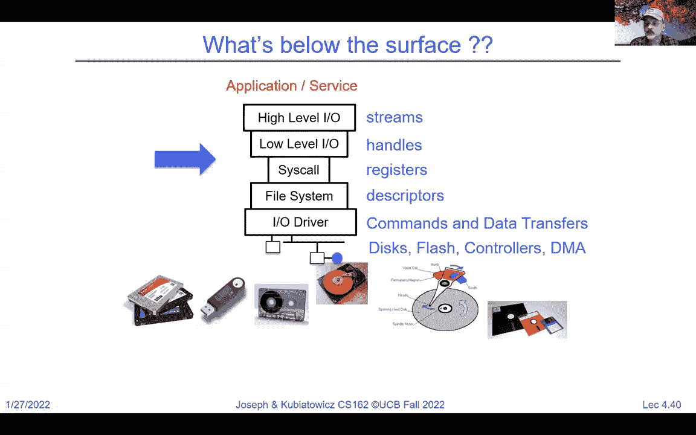

 So we were to look at the， for instance， the Linux system call reference there's a lot of them right so if you look here。 There's exit for read right open etc。 These are all numbered。 Okay。 why are the system calls numbered。 We have numbers for system calls rather than function pointers。 Yep。 So we do this because we're indexing into a vector。

 because we cannot trust the user to say a generic function call。 Oh。 I know where forks address is turn it in。 So we need to get into the kernel switching into kernel mode but then starting at the beginning of a well defined vetted function like for a read。

 And that's why everything's got a number。 Okay， and so the actual system call is a special type of synchronous trap that gives kind of this the call number。 And it looks gives looked up in a vector table。

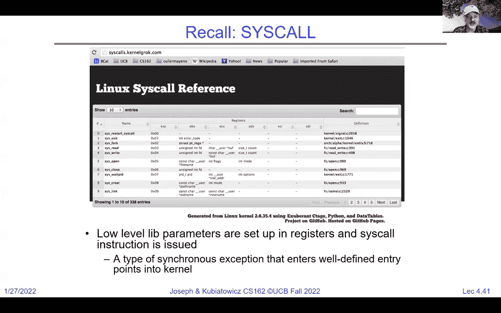

 Okay， so as far as the read and write interface that we've been talking about above the system call level we've been talking about descriptor numbers。 Okay。 Below， by the way， there's more than 255 system calls。 So we have a descriptor number which is a integer at the high level below。 There's actually a descriptor of the file that you've opened in a structure that's in kernel memory that the user can't look at。

 Okay。 And so there's an integer at the top level and inside the descriptor is actually a structure that points at the file。 And this integer that the user knows about is indexed into a table to find this underlying structure。 Okay。 And we're not going to go in great detail。 But if you were to look in the Linux kernel or you look into Pintos kernel you'd see that there is a file structure。 And so， you know， the user can't look at it and for now there's at least two very important things so one is。

 where is the file on disk if it's a file， file system disk file。 And that's an I know pointer and we're going to talk about that when we get into how file systems are made。 And that's the current position so every time you read a bite that that position inside the kernel advances automatically so that a subsequent read will be beyond which you've already gotten it so you can just do a bunch of reads to read from the beginning to the end of the file。

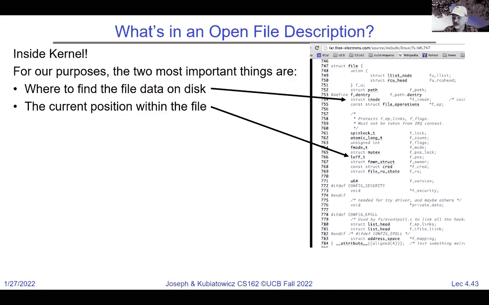

 Okay。 Now， So， for system call to driver。 Let's look at what happens so when you execute the read system call。 It actually goes into the kernel。 It looks up the file structure for that read。 And then it calls some internal function like this VFS read will talk about the virtual file system interface later in the term。 So， we'll give you a flavor that here's this file star which we just showed you there that the kernel knows about。

 And here the parameters the user asked about。 Okay。 read up to count bytes from the file put it into a buffer all of these things have been sanity checked and will be further sanity checked inside the kernel。 And then make sure you're allowed to read the file。 We make sure that the file has read methods okay so every file actually has a set of operations you're allowed to do and if you try to read to something that doesn't have a read option then you'll fail。

 And you know what's an example of that well that might be a an output stream like a serial link you can't read from an output link and so it wouldn't have a read method and so if you try to read from it it would fail。 Also we check that the buffer has proper permissions because we don't trust the user to give us a good buffer。

 We check whether we're reading from a valid range in the file。 And then we get to the actual reading。 Okay， and there's a table of functions and if the。 If that particular type of file if it's device driver allows you to do a synchronous read。 then it'll go ahead and use that function。 Otherwise it'll go and build a synchronous read out of the asynchronous read。

 Okay， you don't have to worry about the all details I'm just giving you a flavor。 Okay。 and then there's a notification that says oh somebody read this and that's to the parent of that file。 And we'll update some bytes read by the current tasks that's a little bit of statistics and some other statistics and then we'll exit。

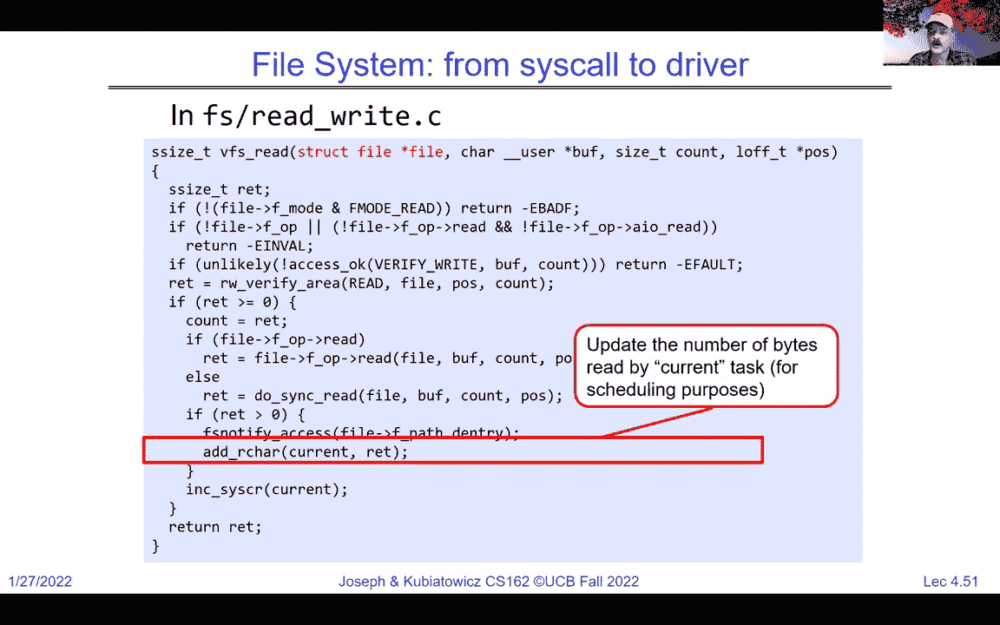

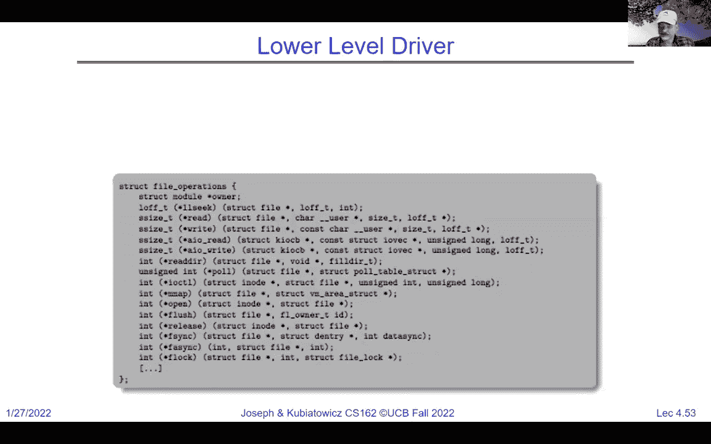

 Okay， so when you call a system call read something like this is going to get executed in the kernel at kernel level。

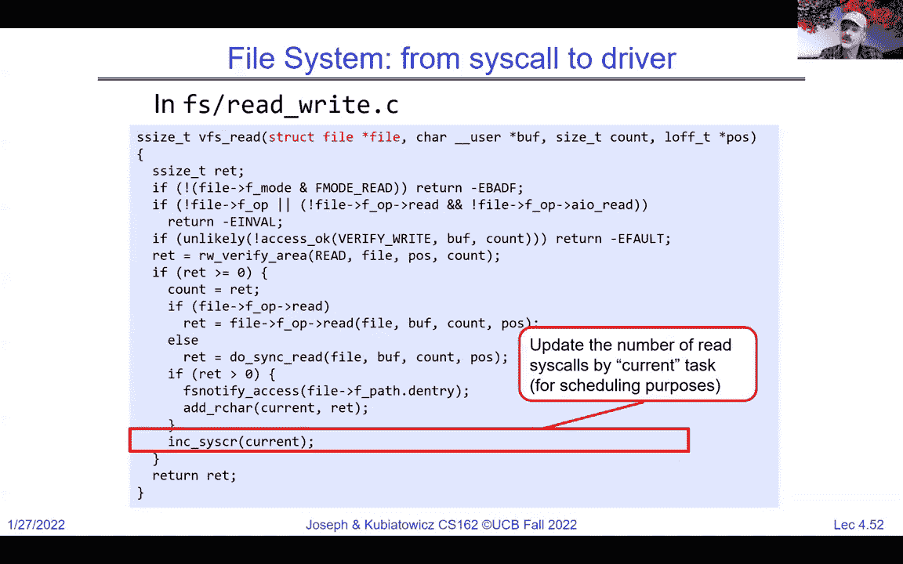

 Okay。

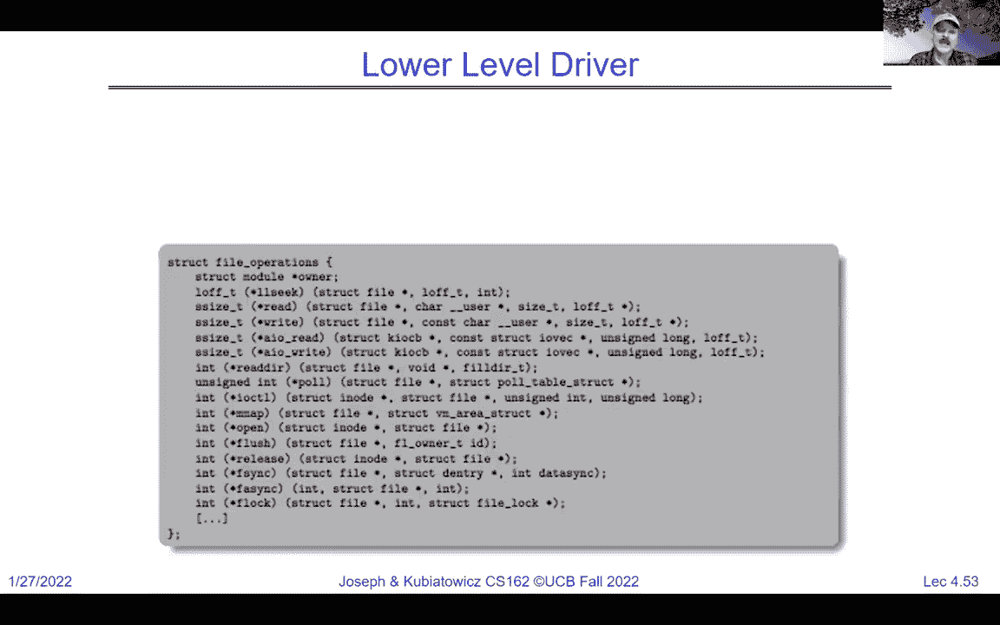

 Now， let's look back here notice I mentioned this file。 This is a take the file itself pointer。 Look at its f op sub field and then look at the read inside of that。 This is actually the device driver for that type of file， whatever it is。 If it's on the file system， it might be a disk device driver， or it might be a file system。 Okay。

 these are all lots of different options。 It could be referencing a mouse as people asked earlier。

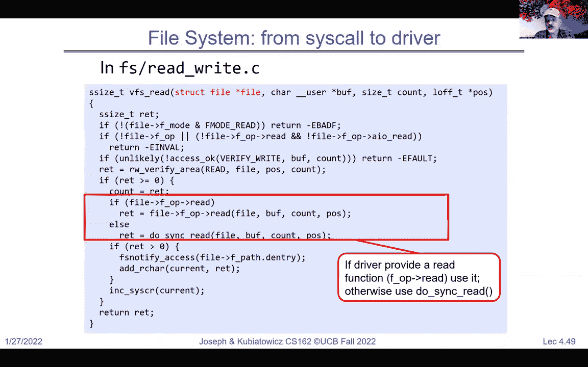

 Okay， so the device driver actually has a structure like this， called the file operations structure。 And every time a new device is put into the system。 A file operations is registered with the device driver that basically tells the kernel how to do all these things。 How do you read？ How do you write？ How do you do different things。 Okay。

 So it's essential to our idea that everything's a file。 because the way we're able to make everything a file and have the same open read right。 close interface is every type of device we could care about every type of thing that we could try to。 read right close open from all register of file operation。

 And so the kernel just can do the same thing。 You give it a read。 it'll go into that VFS read routine。 And it automatically knows which device driver to ask for data back from。 Is it the disk？ Is it your mouse？ Is it the network。

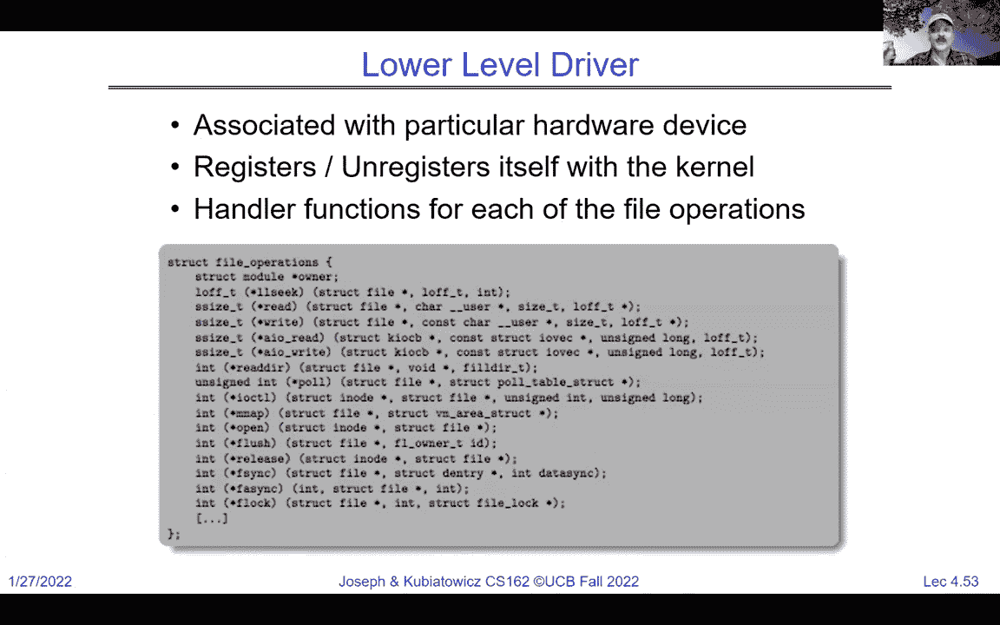

 Okay。 So what is a device driver？ So device driver is this device specific code in the kernel that interacts directly with the device hardware。 It gives you this standard interface of open read right close。 And an I octal system call to do special things to the device。 Okay。 And device drivers typically are divided into two pieces which you'll also get to play with。

 There's the top half， which comes in from the user in the system call level and gives you open close read right。 I octal strategy， etc。 And then there's the bottom half。 which is handling interrupts from the device itself。 And so all the interrupt handlers from that device will run in the bottom half。 Okay。 And I， again。

 this is this lecture is about flavors of how this all kind of ties together。 If you think about read from a file here。 Okay。 What you see here is the user program is about to do a read。 And so it's going to request some IO by making a system call。 And that system call， if we do a read。 it's possible that the contents of that read are already cash in the kernels buffer cash。

 in which case， if the answer is the data is already there。 then we'd have this quick path back out of the kernel。 We just copy stuff out of the cash。 adjust the pointers and move back up and all as well。 But if not。 we may need to ask the disk device to， to start a read， and we're going to put the process to sleep。

 And what that really means is the kernel half of a user process gets put to sleep while the device is busy。 Okay， and we're going to talk a lot more about scheduling and putting things to sleep next time。 But imagine that if you have a user process is trying to read from disk that's a long latency operation。 And here's a number that hopefully by the end of the term you'll guys will have automatically but if you ask how many instructions does it take to do a disk read。

 Okay。 Well， it depends a lot on the circumstances but a number to keep in mind is a million instructions worth of time。 Okay， to do a discrete that's a lot。 And so we don't want to waste all that time waiting for the disk and so the fact that we put the process to sleep。

 mean somebody else can work。 Okay， and so at the top half of the device driver may put us to sleep。 And then we have set up the disk to read and so really the hardware is kind of implicitly monitoring and waiting for interrupts but somebody else is running。

 And eventually， it interrupt comes and that interrupt handler will run and it will wake up the process that was sleeping。 Okay， and then it'll return from interrupt and the scheduler will take over and notice that that process should run again。 It'll copy the stuff out of the buffers from the device driver， et cetera。 It'll transfer to the user's buffers and complete。 Okay。 So files。

 so the thing that this is glossing over file system for a moment。 Okay。 so think about this as reading from a device that doesn't have something complicated like a file system in it。 but rather， you know， like a raw disk or any other thing like that。 So this is this is handling read and remember everything looks like a file。

 So it's read the read system call。 Once we get to the file system。 the file system is kind of what's in here with this， this blue kind of question mark here。 Okay。 so the idea of the file system and the file interface kind of gets handled up here。 Okay。 but we'll get to that later。 So， the last thing。 Okay， good。 I like that comment。

 So there's comment in the chat。 So the OS isn't really pulling， pulling， I/O devices。 but kind of giving it an alert。 Yes。 What we do is we set up everything so that the process is。 is waiting on a weight cue for an event， which is an interrupt in this case from the device。 So it's sleeping on a weight cue associated with this device。

 And the hardware itself will cause an interrupt that will wake that process up and take it off of the weight cue and put it back ready to run。 So yes， so the OS does not have to be polling to wait for devices in this way I've described it here。 Okay， so last but not least， let's push this idea that everything's a file even further。 So what about communication。 So， suppose that one process opens a file for writing and the other one opens it for reading。

 Can we communicate between processes like that？ Certainly。 Right。 We can write to the file here。 And this guy can read from the file and data will go through the file system and get transferred to the other guy。 And we've just communicated between two processes。 Now。 what if we only write data once and read it only once。 So this is really like a cue。

 And this is a little wasteful because we're filling up the disk with something that isn't going to be read again。 Right。 Because this is a cue。 And so then we can start thinking about a cue。 And in fact。 the typical example you like to think about is the network。 So a good example of that is we have cues on either side of the network。

 And we set them up and the client writes to that cue。 And it goes across the network into another cue on the server side and the server reads from it。 Okay， so these are connected cues over the Internet。 But notice the interface is still looks like a file。 Okay。

 we're reading and writing file descriptors。 So the question might be。 what's the analog of open here。 All right。 What's the name space。 How are they connected in time。 All of this stuff。 We're going to have to figure out。 But the simple idea is everything's a file。 And in fact， we can go more with this。 Right。 We can think of a client server on a single machine where the client issues a right of a request。

 Okay， and then it waits for the response。 The server running on the same machine reads that request services it sends it back。 And we through a read， we wake up and go forward。 Okay。 so this would be fine on a single machine but voila， let's put the network in there。 Okay。 Now。 that sounds good。 All right， this is starting to look like like a web server so far。 Right。

 So the socket abstraction is really this idea of a cue that goes across from goes across from one endpoint to another。 And those endpoints can actually span the network。 Okay。 So for instance。 when we have sockets on either side， there can actually be the network in here。 And one process opens a socket on one side。 The other process opens on the other side。

 And we have some way of connecting the two。 And if we do that。 then we'll be able to write on one side and read on the other and it will just work。 Okay。 Now sockets are this idea of an endpoint for communication。 which are cues for temporarily holding results。 These cues don't have to be across the network。

 They could be on the same machine。 They could be across the network。 And in fact， we could。 we could have the same two client server kind of sets of code。 one of which is running at one point on the same machine and another point on different machines。 And we're going to talk a lot about that level of flexibility later in the term as well。

 So two sockets connected over the internet or over a network gives us inter procedural or inter process communication over the network。 Okay， and we still don't know how to open or what the name space is。 Okay。 And a good question in the chat is， well， if I go to do a read and there isn't anything there。 what happens。 The answer is yes， it'll get put to sleep until the data comes。 Okay。 Exactly。

 All right。 Now， right now， this is actually。 So the question in the chat is how does it contrast if we were trying to do this without everything being a file。 So， in Unix， you don't do this without everything being a file。 Okay， here in Unix。 this is exactly the interface。 And this， in this case， the sockets are not storing stuff on disk。 they're just cues that are passing from one across the network to the other。

 But the interface that's right and read look exactly like the file interface and that's the idea that everything's a file is the interface is the same。 Okay。 Can two processes share a socket to processes can have two ends of a socket。 Okay。 we're going to look at different ways of communicating later。 Okay。 so more details so a socket's an abstraction for one endpoint of a network connection， for instance。

 most operating systems provided， even if they don't have the rest of the Unix I， I， O， API。 Okay。 they were first introduced in BSD Unix。 Okay。 And 4。2 and what was interesting was 4。2 BSD was such a big deal。 This was in the days before everybody had the internet in the way that we're talking about it now that what happened was there were at Berkeley。 they were actually producing the 4。2 release the final version of it copying it on tapes。

 And there were runners sitting at Berkeley waiting to get the tapes to run them back to their companies。 And， you know， and load them onto their machines。 So this was a really lots of excitement with 4。2 BSD sockets were just one of the many things there。 Okay。 And it's the same abstraction for lots of types of network， including no network。

 So it's local within the machine， the internet TCP IP UDP IP work with sockets。 and even things that nobody uses anymore。 There's types of networking like OSI and Apple Talk and IPX and all of these things that also use sockets。 Okay。 So it looks just like a file with a file descriptor with read and write。 Okay。 Now。 not all the， not all the file type calls make sense like you can't else seek on a socket。 Okay。

 but you can read and write to it。 And how can you use sockets to give you real applications？ Well。 it's a byte stream。 And the real applications typically have to wrap something else on top of it。 like a messaging facility or a remote procedure call facility that can basically serialize and encode things。 et cetera。 And we will， we'll spend time talking about that later in the term as well。 But for now。

 we're just communicating bytes。 So here's a simple example of an echo server。 Clients is hello world web server goes hello world。 Okay， kind of a silly one。 Here's how it looks。 Here's the two sockets。 Let's assume they've been connected。 So at the client， we're going to echo。 But before that happens， the server starts up and goes to sleep on a week on a read。

 That's a blocking read。 The client potentially this F get S is actually getting a string from the user that the user is going to type hello world。 And then it will use that resulting buffer， write it to the socket。 It'll then go and execute a read， which is going to cause it to wait。 So it's waiting for the echo。 So it wrote the value out to the network and it's going to wait。 And meanwhile。

 the data goes out from the sockets to the server side。 The server is going to take it。 It's going to print it on its own screen。 It's going to send it back。 So go across the network。 it'll wake up the client and voila， we've just echoed and then we will repeat on both sides。 Okay。 Now， good question。 It's a string guaranteed to come back in chunks， all at once or in chunks。

 In fact， it's not guaranteed to come back all at once。 And so you actually have to execute read multiple times potentially to look for that null at the end。 Good question。 So here's a fairly simple， really quick set of code。 I'm assuming the sockets are already open because I haven't shown you how to do that yet。

 But here we have the right on one side and the read on the other and notice I'm not checking in a loop like I should with read。 That's a good question。 But then I take the result and assuming there are no errors。 I write it back and I get my echo。 Okay， echo echo echo。 So what assumptions are we making here we're assuming it's reliable。 So when you write to it。

 you get it back。 And so there's nothing lost。 And so that's a special type of socket。 We need to set up a TCP socket to the other side。 We're assuming everything's in order so that gets helped by a TCP socket as well。 And when are things ready？ Well， we're going to rely on read going to sleep。 If there's no bytes ready。 So how do we create sockets。 Well。

 file systems basically provide a collection of permanent objects。 And， you know。 so it's easy to open a file。 But sockets are a little funny， right？

 So it's a two way communication between processes on completely different machines。 So we have to have some way to rendezvous between our desire to make a connection and somebody's remote desire to provide service。 And so that's going to be a question of how do we name the objects were opening。 And how do these completely independent programs know that the other one wants to talk to them。

 Okay， and I'm going to finish this up but let's just keep in mind。 What is the namespace here。 And we have file systems。 The namespace is just the set of all possible path names right。 In the case of communicating over the network the day space is something like host names or IP addresses。 And also port numbers so given IP address represents a machine。 So port number represents a service。

 Okay， and well， so typically if you're connecting to somebody you're actually connecting to a combination of the IP address and port。 All right， and so this is the last thing we're going to talk about today。 Bear with me for two slides。 So here's how we actually set up a socket。 And the server side starts by creating what's called a server socket。

 And that server socket executes a listen。 And that listens as I'm listening for somebody who wants to connect it my IP address with this port that everybody knows about。 Could be the echo port。 It could be the web server port。 Okay。 later the client does a connection request saying hi here's my address here's a port I've got。 I'd like to connect。 If the circuit the server socket accepts。

 then it makes a brand new socket with a connection。 Okay。 so basically that connection is now a set of connected sockets。 And that's the green ones。 And that yellow connection is actually defined uniquely by a five tuple。 What is that five tuple the source IP address， the destination IP address。

 the source port number the destination port number， and the， protocol which in this case is TCP。 Okay， the client port which is needed for uniqueness is often randomly chosen。 And that port which is well known is typically something like 80 for the web or 443， etc。 Okay。 All right， so we need to finish。 So in conclusion the system call interface is a narrow waste between user programs in the kernel。

 Streaming IO is a stream of bytes。 Most of the streaming functions start with F like F3。 And we have a little bit of a level IO which is the actual kernel interface。 Okay， system calls。 We talked about composition。 We talked about what the device drivers are and how they work。 And the file abstraction is basically used for everything。 Okay。

 and then we finally finished up with sockets which will pick up next time。 Sorry， I went over。 I hope you all have a good evening。 And we will see you later。 Ciao。 [ Silence ]。

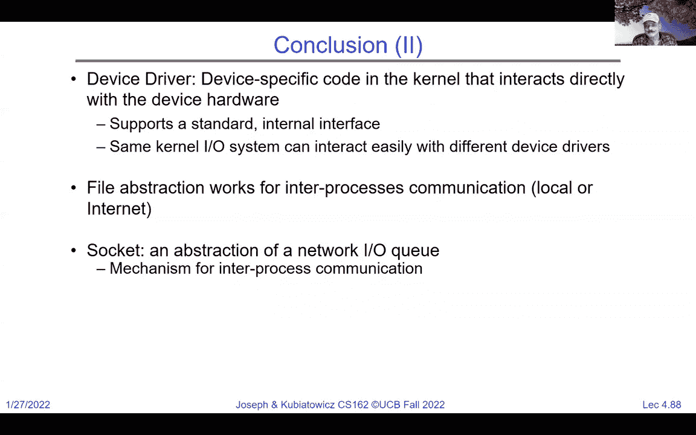