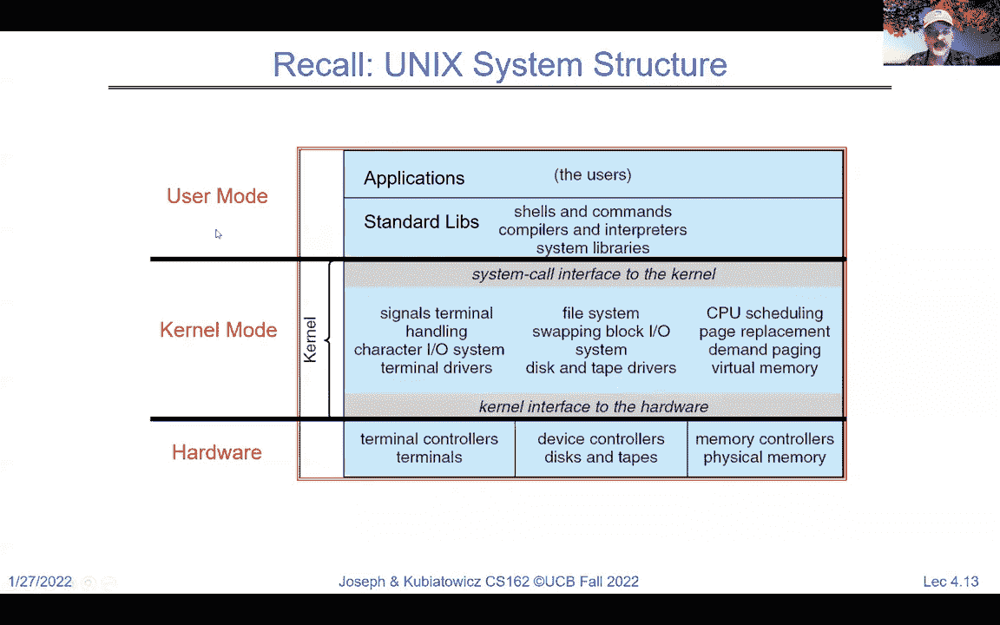
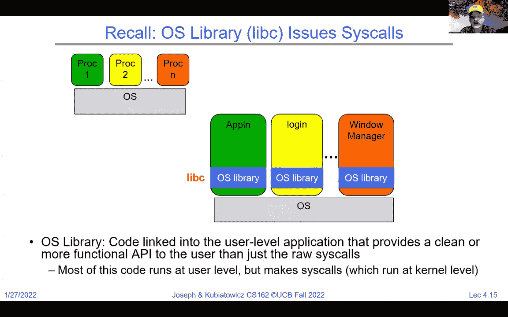
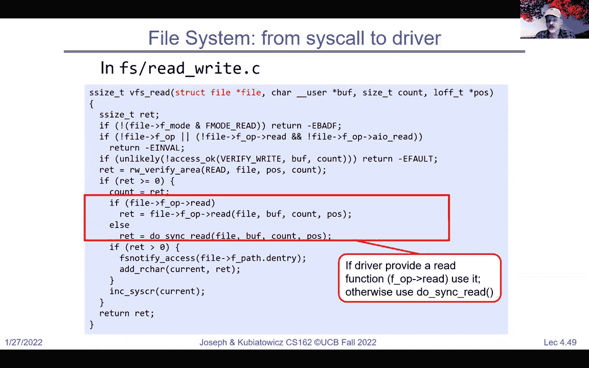

# 课程 P4：`fork`（续）与 I/O 介绍（万物皆文件！）🚀

在本节课中，我们将继续深入探讨 `fork` 系统调用，并介绍 Unix/Linux 中一个核心的哲学思想——“万物皆文件”。我们将学习进程创建、管理以及如何通过统一的文件接口进行输入输出操作。

---

## 1. `fork` 系统调用详解 🔄

上一节我们介绍了进程的基本概念，本节中我们来看看如何使用 `fork` 创建新进程。

`fork` 是一个特殊的系统调用。当一个进程（父进程）调用 `fork` 时，它会创建一个几乎完全相同的副本（子进程）。调用完成后，两个进程都会从 `fork` 调用处继续执行。

以下是 `fork` 的关键行为：

*   **返回值**：`fork` 在父进程中返回子进程的进程ID（PID，一个大于0的整数），在子进程中返回0。如果返回负数，则表示 `fork` 失败。
*   **内存复制**：子进程会获得父进程地址空间的副本。在实现上，操作系统使用写时复制（Copy-On-Write）技术来高效处理，即初始时共享内存，只有当任一进程尝试写入时，才会复制被修改的部分。
*   **执行分流**：`fork` 调用后，父进程和子进程成为两个独立的实体，可以执行完全不同的代码。

```c
#include <unistd.h>
#include <stdio.h>

int main() {
    pid_t pid = fork(); // 创建子进程

    if (pid > 0) {
        // 父进程代码
        printf("I am the parent, child PID is %d\n", pid);
    } else if (pid == 0) {
        // 子进程代码
        printf("I am the child\n");
    } else {
        // fork 失败
        perror("fork failed");
    }
    return 0;
}
```

---

## 2. 进程管理：`exec` 与 `wait` ⚙️

仅仅复制自身通常不够，我们经常需要让子进程执行全新的程序。这时就需要 `exec` 系列系统调用。同时，父进程可能需要等待子进程结束并获取其状态，这通过 `wait` 系统调用来实现。




### 2.1 `exec`：执行新程序


`exec` 会用指定的新程序完全替换当前进程的内存映像（代码、数据、堆栈等），然后开始运行新程序。如果成功，`exec` 不会返回（因为原进程已被替换）；只有失败时才会返回。


以下是 `exec` 的一个常见用法模式：




```c
#include <unistd.h>
#include <stdio.h>

int main() {
    char *args[] = {"/bin/ls", "-l", NULL}; // 参数列表，以NULL结束
    execvp(args[0], args); // 执行 ls -l 命令
    // 如果 execvp 成功，下面的代码不会执行
    perror("execvp failed");
    return 1;
}
```

### 2.2 `wait`：等待子进程

父进程可以调用 `wait` 来暂停自己的执行，直到一个子进程结束。`wait` 还能获取子进程的退出状态。

```c
#include <sys/wait.h>
#include <unistd.h>
#include <stdio.h>
#include <stdlib.h>

int main() {
    pid_t pid = fork();

    if (pid == 0) {
        // 子进程：执行一个简单命令后退出
        printf("Child process exiting with code 42\n");
        exit(42); // 子进程退出，返回状态码42
    } else if (pid > 0) {
        // 父进程：等待子进程结束
        int status;
        wait(&status); // 等待子进程，并将退出状态存入status
        if (WIFEXITED(status)) {
            printf("Child exited with status: %d\n", WEXITSTATUS(status));
        }
    }
    return 0;
}
```

**典型模式（Shell模式）**：Shell 运行程序的标准模式就是 `fork` -> （子进程）`exec` -> （父进程）`wait`。

---

## 3. 信号：进程间的基本通知机制 📡

除了通过文件或管道通信，进程间另一种简单的通信方式是**信号**。信号是异步发送给进程的通知，通常用于告知进程发生了某个事件（如用户按下了 Ctrl+C）。

进程可以为大多数信号注册自己的处理函数，以覆盖默认行为（如终止进程）。

```c
#include <stdio.h>
#include <signal.h>
#include <unistd.h>

void signal_handler(int sig) {
    printf("Caught signal %d. Ignoring.\n", sig);
    // 不退出，只是打印信息
}

int main() {
    // 注册信号处理函数，处理 SIGINT (通常由 Ctrl+C 触发)
    signal(SIGINT, signal_handler);

    while(1) {
        printf("Running...\n");
        sleep(1);
    }
    return 0;
}
```

**注意**：`SIGKILL` 和 `SIGSTOP` 信号无法被捕获或忽略。

---

## 4. 系统架构回顾：用户模式 vs 内核模式 🏗️

在深入 I/O 之前，我们先回顾一下操作系统的分层架构。

*   **内核模式**：操作系统核心代码运行的特权模式，可以直接访问硬件和所有内存。
*   **用户模式**：普通应用程序运行的模式，权限受限，无法直接访问硬件或其他进程的内存。
*   **系统调用**：用户模式程序请求内核服务的唯一接口，是一个狭窄而明确的函数集合（如 `fork`, `read`, `write`）。
*   **标准库（如 libc）**：对原始系统调用的封装，提供更友好、更高效的高级 API（如 `fopen`, `printf`）。库代码本身运行在用户模式。

应用程序 -> 标准库 -> 系统调用 -> 内核 -> 硬件

---

## 5. Unix 哲学：万物皆文件 📁

这是 Unix/Linux 系统设计的核心思想之一。许多资源（普通文件、目录、设备、管道、网络套接字等）都被抽象成“文件”，通过一套统一的接口进行操作。

这套接口的核心系统调用是：
*   `open` / `close`：打开/关闭文件。
*   `read` / `write`：读写数据。
*   `lseek`：移动文件指针（随机访问）。

### 5.1 高级 I/O（流式 I/O，带缓冲）

标准库（如 `stdio.h`）提供了更易用的流（`FILE*`）接口。这些函数通常以 `f` 开头（如 `fopen`, `fread`）。

**关键特性**：
*   **缓冲**：在用户空间维护缓冲区，减少系统调用次数，提升效率。例如，`fgetc` 可能一次从内核读入一大块数据到缓冲区，后续读取直接从缓冲区获取。
*   **自动处理**：简化了错误处理和格式转换。

```c
#include <stdio.h>

int main() {
    FILE *in_file = fopen("input.txt", "r"); // 高级打开，返回 FILE*
    FILE *out_file = fopen("output.txt", "w");

    if (!in_file || !out_file) {
        perror("File opening failed");
        return 1;
    }

    int c;
    while ((c = fgetc(in_file)) != EOF) { // 逐字符读取（有缓冲）
        fputc(c, out_file); // 逐字符写入
    }

    fclose(in_file);
    fclose(out_file);
    return 0;
}
```

### 5.2 低级 I/O（文件描述符 I/O，无缓冲）

这是更接近内核的系统调用接口，操作对象是整数类型的**文件描述符**。

**关键特性**：
*   **文件描述符**：一个小的非负整数，是进程打开文件表中某个条目的索引。标准输入、输出、错误对应的描述符分别是 **0**、**1**、**2**（宏定义为 `STDIN_FILENO`, `STDOUT_FILENO`, `STDERR_FILENO`）。
*   **无用户缓冲**：每次 `read`/`write` 都直接引发系统调用。但内核内部仍有缓存以提高磁盘I/O效率。
*   **更直接的控制**：提供更底层的操作。

```c
#include <unistd.h>
#include <fcntl.h>
#include <stdio.h>


int main() {
    int in_fd = open("input.txt", O_RDONLY); // 低级打开，返回文件描述符（int）
    int out_fd = open("output.txt", O_WRONLY | O_CREAT, 0644);

    if (in_fd < 0 || out_fd < 0) {
        perror("File opening failed");
        return 1;
    }

    char buffer[1024];
    ssize_t bytes_read;
    while ((bytes_read = read(in_fd, buffer, sizeof(buffer))) > 0) { // 块读取
        write(out_fd, buffer, bytes_read); // 块写入
    }

    close(in_fd);
    close(out_fd);
    return 0;
}
```


**重要区别**：高级 I/O 的缓冲在用户空间的库中，低级 I/O 的缓冲在内核中。混合使用时需小心，可能需要 `fflush` 来同步状态。


---

## 6. 设备驱动与“一切皆文件”的底层实现 ⚙️


“一切皆文件”是如何实现的？关键在于**虚拟文件系统**和**设备驱动**。



1.  **文件结构体**：内核为每个打开的文件维护一个结构体，其中包含一个**文件操作函数表**的指针。
2.  **驱动注册**：每种资源类型（磁盘文件、键盘、鼠标、网络卡）的设备驱动程序都会向内核注册自己的文件操作函数表（包含 `read`, `write`, `open`, `close` 等函数的实现）。
3.  **统一接口**：当用户程序对某个文件描述符调用 `read` 时，内核通过描述符找到文件结构体，再通过其中的函数表调用到相应设备驱动提供的 `read` 函数。对于用户来说，接口完全一致。


**I/O 控制**：有些设备需要特殊配置，无法完全通过 `read`/`write` 完成。`ioctl` 系统调用提供了这个额外的控制通道。

---

## 7. 超越本地文件：套接字（Sockets）🌐

“万物皆文件”的思想甚至延伸到了网络通信。**套接字**是网络通信端点的抽象，它同样使用文件描述符，支持 `read` 和 `write` 操作。

**核心概念**：
*   套接字是双向通信队列的端点。
*   通信双方可以是同一台机器上的进程（本地套接字），也可以是不同机器上的进程（网络套接字）。
*   使用 IP 地址和端口号来命名和定位套接字。

一个简单的客户端-服务器回显模型如下：
1.  服务器创建套接字，绑定到知名端口并监听。
2.  客户端创建套接字，连接到服务器的地址和端口。
3.  连接建立后，双方获得用于通信的新套接字描述符。
4.  客户端向它的套接字 `write` 数据，服务器从它的套接字 `read` 数据，处理后再 `write` 回去。

```c
// 伪代码示例：连接已建立后的数据交换
// 客户端
write(socket_fd, “Hello”, 5);
read(socket_fd, buffer, sizeof(buffer)); // 等待回显

// 服务器
read(socket_fd, buffer, sizeof(buffer)); // 等待客户端消息
printf(“Received: %s\n”, buffer);
write(socket_fd, buffer, strlen(buffer)); // 发回回显
```

**注意**：套接字是面向字节流的，`read` 和 `write` 的数据量可能不匹配，应用程序需要自己处理消息边界。此外，套接字不支持 `lseek` 操作。

---

## 总结 📚

本节课中我们一起学习了：

1.  **`fork` 的完整机制**：包括其行为、写时复制优化，以及如何通过返回值区分父子进程。
2.  **进程管理**：使用 `exec` 让子进程执行新程序，使用 `wait` 让父进程同步子进程状态。
3.  **信号**：作为进程间异步通知的基本机制。
4.  **系统架构**：理解了用户模式、内核模式、系统调用和标准库的分工。
5.  **“万物皆文件”哲学**：这是 Unix/Linux 系统的基石。
6.  **高级与低级 I/O**：掌握了带缓冲的流式 I/O（`FILE*`, `fread`/`fwrite`）和无缓冲的文件描述符 I/O（`int fd`, `read`/`write`）两套接口及其区别。
7.  **底层实现**：了解了设备驱动和虚拟文件系统如何支撑“一切皆文件”的抽象。
8.  **网络扩展**：看到了套接字如何将文件抽象应用于网络通信，实现了跨机器的进程间通信。


通过本课，你应该对进程的创建、管理和通信，以及 Unix 系统统一而强大的 I/O 模型有了扎实的理解。这些概念是后续学习文件系统、并发编程和网络编程的重要基础。