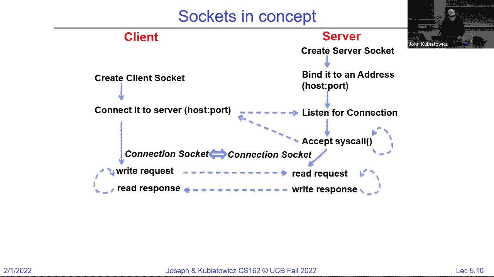
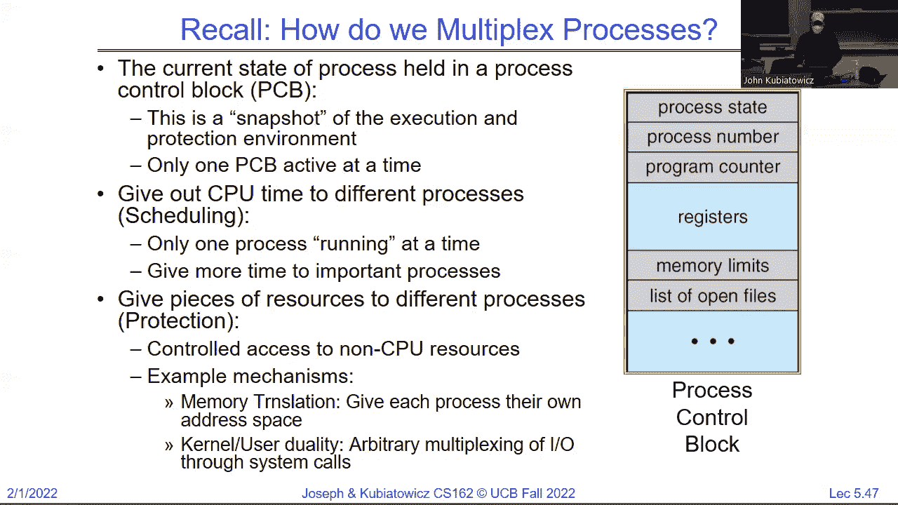
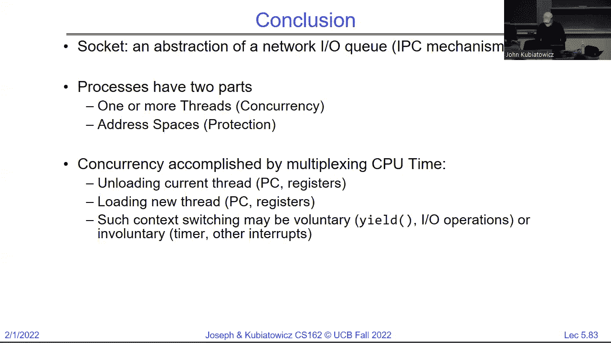

# P5：讲座5：套接字和进程间通信（已完成），并发进程与线程 - RubatoTheEmber - BV1L541117gr

大家能在网络上听到我说话吗？

我们还好吗？好吧。你好，很高兴终于能见到大家了。抱歉刚才有一点小小的设置问题。我觉得它们从来没有按照预期的方式工作过，但我想我们应该没问题了。我是John Kubitowitz，大多数人叫我Kubie。你们可能在Zoom上听过我，但现在我在这里。我真的存在。实际上，这只是一个非常。

非常惊人的全息投影。所以我其实坐在家里。但现在我们就假装我在这里。让我调整一下摄像头。看。我们来转一下。好了，我们之前讲过一些操作系统的入门知识，现在我们继续。嗯，如果你注意到。看看我能不能把这个东西。

好了。所以我们上次在讲，我要讲讲Unix中的一个关键概念。当时它首次出现时是独一无二的，那就是“一切皆文件”或至少一切看起来像文件。所以你可以打开文件，它们就像文件一样。这不奇怪，但你也可以打开设备、套接字或其他东西，并且使用相同的接口。

这个接口将允许我们将不同程序的数据管道连接起来，当你开始使用Shell时你会体验到这一点。我想这是第二次作业。但这里的基本概念是你总是打开一切。打开操作是你检查权限的地方。然后所有的读写操作都是基于字节的，无论存储的是什么。

所以即使你存储的是某种特殊格式的数据库，操作系统也不关心。它把它看作字节。好的。内核会帮助缓冲读取和缓冲写入。并且有一个显式的关闭操作。好的，这是一个有趣的概念，它意味着当你开始在内核内部的系统调用层工作时，你将会使用那个打开、关闭、读取、写入的接口。我们上次做的另一件事是，我们看了两种不同的方式来访问这个文件接口，低级别的是系统调用接口。

所以我会说这是原始的打开、读取、写入、关闭操作。你不会获得很多功能，你给它一个缓冲区，告诉它你想读多少或写多少，它就会为你做这些。我们把它与高级IO接口进行对比，基本上它们都是以F开头的，因此与open不同，你会用F open。

而这些字节是经过缓冲的。好的，用户级别的实现，它们实际上会执行一些额外的功能，因此它们会将内核级的CIS调用包装成高级接口。因此，你甚至不需要从这个层次进行系统调用，你只需要做F打开，然后你就会执行读取、写入和关闭操作。当你在低级别打开文件时，那个打开系统调用会返回一个整数，这个整数表示你打开的文件，你将从此以后使用这个整数，它叫做文件描述符。

在你所有的读取和写入操作中，必须告诉操作系统你到底在谈论哪一个。对吧，你已经打开了文件，现在你将告诉它你要操作的具体哪个文件。在高级接口中，你会得到一个文件指针，它指向一个在用户级分配的结构。好的，所以注意，这些是非常不同的。所以不要混用F版本和非F版本，因为你会遇到混乱。

好的，你可以混合使用不同文件的操作，但不要在同一个文件中混用。现在，文件描述符是一个仅对内核有意义的整数。我们稍后会谈谈它在内核接口另一侧的含义。文件结构在用户空间中。所以它是一个结构，你可以探测并查看它，但你永远不会。

你知道，你永远不需要直接操作它。但它是一个用于缓冲的内存块，是文件的文件描述符，因此显然F打开必须在底层做一个打开操作，它会跟踪这个整数。好的，每个读取写入操作都会引发一次系统调用，无论如何。

而每个F读取器F，它会对数据进行缓冲，可能会或者不会调用内核，所以这就是我们通过使用高级接口获得一些优势的地方。举个例子，使用低级接口时，假设你有一个循环，每次从文件中读取四个字节，你将为每四个字节执行一次系统调用，并且它会返回四个字节给你。

F读取有点更有趣，对吧，你首先调用F读取请求内核获取一大堆字节，也许是1024字节。然后它会返回其中四个给你，下一次你调用时，你会得到四个字节，但它们来自缓冲区，不需要再次去请求内核。

好的，大家都明白了吗？现在，另一个要点是，我想稍微看一下这里的内容，你们在探索这个接口时会开始接触它，但低级读取操作，举个例子，实际上就是直接进入系统调用。而这个系统调用就像是一个过程调用，只不过它是进入内核的，所以它必须以一种非常特殊的方式执行，而你们已经开始在看这个内容了。

所以，会有一些汇编代码将系统调用号放入一个寄存器，将参数放入其他寄存器，然后执行一个陷阱指令，这会跳转到内核。在内核中，会做一些处理。我们将在学期的过程中更多讨论这一点。

然后它会返回到用户级别。在这一点上，这算是系统调用，这是从用户角度来看系统调用的过程。然后会以正确的方式返回格式。与高级别的对比是，在这里我们实际上处于用户级别，系统会说，嘿。

我们的缓冲区里有内容吗？如果有，就直接返回，不用麻烦。好的。否则，它会做我们之前讨论的系统调用。然后它会将一些数据返回到缓冲区，并将其返回给调用者。所以这是看待这两者差异的另一种方式。好的。

我注意到在 Tiazza 上有一些讨论，大家在讨论它们之间的区别是什么。我想我会给你们一些理解上的帮助。在我继续之前，有没有什么问题？好吧。好的，现在，嗯，继续。如果你注意到我们在最后讨论的事情，我们开始解开套接字的概念。

随着学期的进行，我们会讨论更多关于网络的内容。但现在，套接字的这个概念实际上是另一个看起来像文件的例子。它实际上是通过网络连接的两个队列。它看起来像一个文件，你像操作文件一样读取和写入，但它实际上并不是一个文件。好的。

所以，套接字是通信的端点，它们位于网络的两端。好的，在很多情况下。所以我们在最后讨论的是连接的建立。实际上有两种类型的套接字。当你是服务器时，你需要监听是否有客户端尝试连接。

所以，服务器是监听的那一方，客户端是连接的那一方。所以，服务器套接字在任何通信发生之前就已经建立了。然后有两个操作。第一个是它会设置监听。这个监听会在 TCP/IP 的特殊端口上进行，其中我们有服务器的 IP 地址，但它也是一个知名端口。

那些知名端口，比如 80 是标准的网页浏览器，443 是受保护的浏览器，等等。所以那个监听基本上什么也不做，直到客户端设置一个套接字来与服务器通信。它有自己的 IP 地址和自己的端口，通常是随机选择的。然后它的连接请求会发送到服务器套接字。服务器套接字，到那个时候。

为该连接创建一个全新的套接字，并将它们连接起来。所以，在连接设置好之后，现在我们有了这个独特的连接，而那个服务器套接字可以接收其他许多连接。这就是为什么一个网页浏览器可以处理，或者说，抱歉，一个网页服务器可以同时处理多个不同的连接，每一个连接都是通过这个过程建立的。

好的，请注意，图示中的黄色连接具有一个五元组，使其独一无二。每一端都有一个IP地址，每一端都有一个端口号，还有一个协议，在本例中是TCP/IP。所以，只要这些参数中的任何一个不同，你就可以与服务器建立一个完全不同的连接。好的，而且通常客户端端口也是如此。

就像我说的那样，随机分配是由操作系统完成的。而服务器端口被称为知名端口。如果我连接到一个普通的Apache网页浏览器服务器，我一直在说浏览器，它的端口是80。如果我连接到你的银行，它可能是443，等等。好的，明白了。我想暂停一下。那是我们上次讨论的地方。有什么问题吗？是的。

那么，端口到底是什么？端口是一个16位的数字，但这其实不是你想要了解的。所以端口是一个在特定服务器中唯一的服务。因此，端口号标识了该特定IP地址所能处理的服务。如果你仔细想想，如果你有一台服务器，单单是服务器硬件就拥有自己的IP地址。

这就是数据包如何到达它的方式。但这其实还不够。你真的需要识别内部运行的内容。事实上，你想要识别的是服务器进程。而这种识别是在端口设置的一部分中进行的。好的，明白了。还有其他问题吗？那么，现在我想做的是快速带你了解一下网页服务器的概念。

好的，你知道我们为什么要以这种方式做网页服务器吗？你可以看到，监听基本上允许多个客户端与服务器通信。事实上，有时候多个不同的标签页也可以与同一个服务器通信，或者网页的多个不同部分可以与同一个服务器通信。每一个连接都可以拥有自己的独特连接。好的，所以这是多对一的关系。我们来看一下。

比如说，我们可以更详细地了解一下网页中套接字的使用。我不会细讲这个，但我想确保你们俩都看过它。所以，服务器创建那个服务器套接字，并将它绑定到一个地址，表示我们将使用IP地址和我所拥有的端口号。然后，它执行一个监听操作。好的。

与此同时，它什么也不做，直到其他事情发生。所以它在一个循环中，等待接受操作。而这个接受操作是完全阻塞的。所以实际上，发生的情况是，服务器完成所有这些操作后，它会进入“接受”状态，像睡着了一样。好的，客户端随后创建一个套接字，连接到服务器。

这实际上意味着有一个监听连接。这个监听会触发一个接受协议，我们稍后会在本学期讲到。当你完成时，你会有两个现在连接到彼此的套接字，能够进行读写。抱歉。所以这是一个双向连接，黄色箭头表示双向。

一旦这两个连接建立，它们就可以在每一方传送数据，也就是字节，对吧？

记住，一切都是一个数据包。而在另一端，它可以被接收，因此可以双向传输。好的。是的，问题。是的。所以对于每个连接，都是一个新的套接字。

好的，但请注意，为了回到这个图，因为它很重要。注意，有一个服务器套接字，那个家伙在那里监听。但每一个新的连接都会在服务器端生成一个新的小绿点。好的。并且必须通过那个五元组中的某些内容来区分。

这意味着，如果你有相同的客户端在连接，它会为每个连接生成新的端口。是的，后面。是的，好问题。存在一个众所周知的端口。假设这是443。这个服务器端的套接字会使用443作为它的服务器端口。是的。

所以这里的每个绿色的东西都会有相同的IP地址和端口，用于服务器端。通过IP地址和/或端口与另一端区分开来。这样就使它变得唯一。它基本上让底层的网络协议栈能够整理所有进来的数据包，并能判断应该将它们发送到哪里，并基于那个五元组选择相应的套接字。还有一个在下面。对。

套接字的数量有限制吗？所以我可以哲学性地说，总是有一个限制。是的。通常发生的情况是，如果你用过多的套接字请求轰炸服务器，它会崩溃。经过强化的系统会开始拒绝接受。但你必须确保自己经常这么做，以确保它能正常工作。

好的，最后一个。是的，继续。这个问题很好。我稍后会展示在这个场景中，forking是如何发挥作用的。但其实这只是内核中创建了一个新的结构，它知道自己应该接收哪些数据包，以及它们何时出站该发送到哪里。所以它不是一个进程，而是一个数据结构加一个队列，因为每个套接字端点都有一个与之关联的队列。

好的，你们会很棒的。你们实际上在提问。是不是很棒？

你实际上就像是在课堂上，大家举手提问。

就像激进的做法。好的，所以。我要展示的是，一旦连接发生，这个服务器（它不是一个非常智能的服务器，我们需要修复它），但请注意，它现在完全被那个连接占用了。你永远不会以这种方式构建一个网页服务器。但是我们先来看这个。

所以注意到在服务器和客户端已经完成设置之后，它们现在只是相互通信。好的，稍后有一段时间，你知道，客户端完成了。它将关闭它的套接字。服务器将关闭它的套接字，在这个并不非常聪明的版本中，它将返回并接受另一个传入的连接。

好的，这是一个并不非常聪明的版本。好的，你们跟得上吧。所以注意这里有几点。服务器怎么知道事情完成了呢？嗯，一方面是如果你关闭了客户端的套接字，服务器将收到通知。所以它会知道。另一点是你需要一个协议来进行来回通信。

这就是字节的格式，因为操作系统只知道它们是字节。我们将在学期后续讨论这个。好的。所以，你知道，以下是在客户端这方简单协议的样子。我只是想给你们一个了解。你们知道，我们在这门课上使用C语言编程。所以如果你注意到，当我们创建套接字时。

我们需要从一个添加或信息结构开始，定义诸如IP地址、端口名或我将要去哪里之类的内容。稍后我们可以在幻灯片中查看主机。我们会决定是否想查看它。套接字本身有一个家族、类型和协议，它们是这个地址结构的一部分。所以例如，协议将是TCP，好的，等等。

套接字的类型将是流式的，因为TCP实际上是一个流协议。当套接字返回时，注意它是一个整数。大吃一惊，对吧？一切都是文件。它看起来像文件，像文件的味道。实际上，我不确定文件的味道是什么，但如果你能尝到，它就应该像文件一样，对吧？

这意味着现在我可以像操作文件一样对其进行区域写入，因为它是一个文件描述符。大家明白这个意思吧？所以，如果你注意到，这就是获取主机名并将其转换为我可以使用的结构。这个是创建套接字。这是尝试连接。所以它正在尝试找到另一端的监听器，假设成功的话。

连接是阻塞的，但它会退出。当连接成功后，我可以让客户端做任何我想做的事情，发送字节并读取字节。然后最终我关闭它，就完成了。好的，客户端的内容就不太复杂了。

服务器也在这里。我只是给你们展示几个部分。所以再次，我们设置地址。这次，也许我们只提供端口，因为我们知道IP地址是什么。它是本地的。我们获得了一个套接字。这次我们将它绑定。此时我告诉服务器套接字，你认为你在什么地址。

好的，这既是本地IP地址，也是端口。然后我执行`listen`。我只需要执行一次。因为当`listen`返回时，服务器已经开始监听了。好的，此时在一个循环中，特定的代码会等待接受新的连接。所以这是阻塞的。只有在获得新连接时才会返回，哦，看，它是一个整数。

这意味着它看起来像一个文件。好的，差不多就是这样。然后一旦返回并且我通过了这个`accept`，我现在就有了一个指向套接字的文件描述符，它看起来像一个文件，我可以在其上进行读写。顺便说一句，当我进行读写时，我是在和另一端进行通信。好的。

所以当我写入时，客户端会读取，当客户端写入时，我也可以读取。好的，双向的。然后当我完成时，我会关闭它。注意，因为有两个套接字，当服务器完全完成时，出于某种原因，虽然我们目前还没有提供退出机制，我们也会关闭服务器套接字。因为这是最后一个套接字。对吧。

因为每个`accept`都代表一个独特的连接，所以会为它分配一个新的套接字，每次都会关闭它，这是这个不那么智能的版本。然后在最后，我们关闭监听套接字，这样就完成了。好的。是的。好的。所以问题是，套接字有一个描述符返回，而`fread`需要一个文件指针。

希望大家都记得高中化学课上，你必须匹配单位。对吧，整数和文件指针不匹配。所以中间必须有某种转换，幸运的是，实际上有一个调用，它可以把描述符转化成你可以使用的文件指针。所以你问题的答案是，没错，但你得先捕捉到这个不匹配的情况。好的。

好的，这里有个问题。这个客户端需要知道服务器套接字的端口号才能进行初始连接。是的。好的，为什么呢？因为每个端口代表服务器上的一个不同服务，所以你需要知道你想要连接哪个端口。

所以当你的网页浏览器进行浏览时，它知道你要么访问端口80，要么访问端口443。好的，这就是连接过程的一部分。好的，问题来了。是的。这个版本不算很智能。它只是等待连接，处理一个连接后就关闭，然后返回去处理下一个连接。所以没有线程，没有其他操作，我们会修复它。好的，这个版本实际上不能算是一个好的连接方式，尤其是对于单个网页浏览器，因为大多数现代浏览器会同时发起多个连接来加载图片等资源。

与文本同时进行的就是图片加载，这就是为什么你会看到页面上图片在同时加载，因为每个图片都有一个单独的连接，在某些情况下就是这样。好的，具体怎么做取决于实现方式。是的，问题。好问题。那在这个过程中会发生什么呢？

特别是这里很清楚，因为当我在这里提供服务时，我并没有接受连接。那么，其他世界上的连接会发生什么呢？答案是，操作系统内部有一个连接队列，存放着等待的连接。

所以监听器，监听器套接字有一个队列，这是一个很好的问题。好的，还有其他问题吗？好的，既然似乎有很多人感兴趣，我们来修复这个问题。好的，但我们也许可以对吧？例如，这里有一件有趣的事。我们在与服务器同一个进程中运行这个`serve client`。

从安全角度来看，这可能并不理想。如果提供远程服务是一个独立的进程，以保护服务器，岂不是更好吗？那么，我们接下来该使用什么来实现这一点呢？`fork`。好的，开始吧。这是一个非常简单的改动，注意到我在`accept`之后做了什么。

我将执行一个`fork`，父进程会关闭并等待子进程完成，然后子进程将执行我们刚才做的事情。因此，我们现在还没有实现并行性，但我们已获得一些安全性。好的。所以，如果你仔细看，唯一的区别是我们仍然在监听，仍然在接受连接。

现在我们在这里执行`fork`。如果PID等于零，这意味着它是子进程的父进程。子进程，既然子进程是从父进程`fork`出来的，它拥有和父进程相同的文件描述符，包括这个服务器套接字。因此，这个套接字对子进程来说没用，所以它会关闭。

之前有两个指向相同套接字的连接。好的。我只是指出这一点，让它在你脑中转一转。但如果你注意到，关闭它之后，我们将继续为客户端提供服务，注意我们正在使用的是连接套接字，也就是我们通过`accept`获得的那个。好了，等我们完成了，就会关闭它。然后我们就退出。好的。

我没有在这里特别强调，但`exit`表示子进程已完成。我为什么要调用`exit 0`呢？这意味着成功，对吧？父进程呢，父进程关闭连接套接字，因为它不会与远程客户端通信。

然后它会等待。好的，有很多种等待的版本，这个甚至不关心返回的是零，因为我在这里简化了，但是你可以通过`man wait`来查看，实际上有很多种。好的，然后当我们完成后，我们会循环并重新开始。

我们会在后台完成后关闭。好的。如果父进程不关闭它，那么它们就会开始积累很多东西。当然，当父进程最终退出时，剩余的套接字会在那时关闭，但你还是希望保持足够的整洁。

好的，是的。那么套接字呢？不。好的，好，那就有问题了，套接字应该是唯一的，如果子进程没有关闭它会怎样？首先，套接字是唯一的。发生的情况是文件描述符成员是一个整数。每个进程都有一个从整数到它们指向的各个对象的表。实际上，它确实是一个唯一的套接字来处理它。好的。

所以，如果你愿意，实际上可以通过一个套接字进行双向通信，但这可能会在这个应用程序中引起一些混乱。好的，句柄只是整数，整数不是文件，但一个整数可以指向文件或套接字的描述符，或者其他东西，所以底层的东西是唯一的。

好的，实际上，我认为我有足够的时间，在我们完成这个示例后稍微深入展示更多细节。好的。还有其他问题吗？是的，能再说一遍吗？你怎么从while循环中跳出来？你不能按Ctrl+C。是的，这个示例并不打算作为一个完整的服务器，只是一个草图。但那是个好问题。好的，是的，这个没有退出机制。

要关闭它，其实是代码本身从未真正执行过，如果你编译这个特定的代码的话。是的。每个进程都有自己的一张文件描述符表。是的。好。这就是为什么我很高兴接下来会展示一些内容。好的。那么到目前为止，我们做的是为每个连接获取了一个独立的进程，但我们仍然没有并发或并行性。

这意味着我们一次只能处理一个连接。那么显而易见的是什么呢？嗯。当父进程完成关闭额外连接时，因为子进程正在处理它，它就会返回并再次接受连接。所以请注意，我删除的唯一内容是等待。好的，所以在这个实例中，我们现在可以继续了。好的，现在这个看起来就是这样，我把等待的部分注释掉了。

好的，现在真的要小心不要让事情堆积起来，所以你真的需要释放已经完成的子进程。所以，比这里稍微复杂一点，但我，我。现在这个示例，我只希望你考虑我们不需要等待，所以现在我们可以做更多的事情。好的，明白了。现在你可以查看这个。

你可以查看幻灯片等内容以看到完整的示例，但比如说，要为服务器端设置地址。我们必须构建一个特定类型的结构并清理它，设置一些参数，然后做一些类似获取信息的操作，给它端口和其他信息，这样就生成一个结构，我们可以用它进行绑定和关闭。好的，我现在不想深入讲解这些细节，但。

客户端类似。你可能会有类似这样的操作：查找主机，在其中提供主机名，比如 www.berkeley.edu 和端口号 80，然后它为你构建一些东西，接着你就可以创建一个套接字，进而与之建立连接。

好的。那么最后，我们如何在没有保护的情况下做到这一点呢？你可以想象，产生一堆进程实际上可能会有点慢。因此，假设我们的保护来自不同的方式，我们真正想要做的是什么呢？不需要为每个连接创建一个全新的线程或进程，我们希望为每个连接创建一个全新的线程。

对了。在这种情况下，生成线程会更加高效。因此，在这里，实际上我们可能会做类似 `p thread create` 这样的操作，我会稍后详细讲解，它将创建一个新线程。在这个实例中，我们都在同一个进程中，但我们有一个低开销的方式来与一个客户端通信，同时我们还可以继续接受其他连接，创建更多线程。这样，我们就为每个连接创建一个线程，这也是大多数现代服务器的做法。好的。它们会以稍微不同的方式进行沙箱保护，因为不为每个进程创建一个进程是一个巨大的性能提升。

好的，最后，问题在于这个方法很好，但它仍然会受到某些问题的影响。以前我们称之为“Slashdot 效应”。好吧，或者说某些东西变得太受欢迎，结果是什么？如果全世界的人都来参加我们的讲座，因为你知道是 Kuby 教学，而且很棒。

你这样做的话，最终会导致服务器崩溃。对吧？所以这实际上会受到拒绝服务攻击的影响，即过多的传入连接生成过多的线程，填满所有内存，导致系统崩溃。

好的，所以这其实并不是真正的解决方案。如果你真的想要一个真正的解决方案，你可以做类似线程池的事情，稍后我们会在几张幻灯片或几次讲座中讨论，限定任何时刻可以存活的线程总数。这样。

如果你成功了，那么就不需要创建新线程，等待线程消失。然后你再接受一个新的连接，依赖内核中等待的连接队列。好吧，这样你就可以权衡你想要的并发量或并行性与所需的内存量之间的关系。好的，一切看起来就像一个文件。好的，我有办公时间。

抱歉今天没在。今天我遇到了一点小灾难正在处理，明天可能会在，也可能不在，但我肯定会在本周剩余时间里在。意思是说剩下的整个学期。我也会发布安东尼的办公时间。

如果有谁明天或者周三想来见我，我会告诉你们。我想提醒大家，如果这些办公时间不适合你，你可以发邮件告诉我，我们可以安排个时间。好吧，谁希望我能开一个虚拟的办公时间？好的，可能在这里的同学不太需要。看看吧，反正虚拟也挺不错的。

好的，我们来看一下。所以这里有一个人问了一个问题。让我再回顾一下，还有一个问题，有些人对如何在同一端口上处理多个连接感到困惑。

不会在同一端口上冲突。这里的答案是每个套接字连接都有一个独特的特征，包含那五个部分对吧？从客户端来看，每个连接都有唯一的 IP 地址和端口，服务器端也有相同的 IP 地址和端口。然后还有 TCP/IP。所以为什么它们不会冲突的原因是每个连接都有独特的部分。

因此，当我们将那个套接字交给线程时，该线程正在与一个独特的套接字通信，而且它的连接也是唯一的。好的。明白了。那么，服务器端的套接字看到的是独特的客户端 IP 地址或端口。可能来自同一 IP，但端口不同。好的，所以下周五是最后的退选截止日期。如果你忘记退选，或者你现在还在网络空间里，或者你们可能不想退选。

这很好。如果你知道有人忘记退选，你需要告诉他们，他们有麻烦需要解决。我已经有人告诉我，"我本来以为我进不了这个班"，我说：“那不关我的事，你得找你们系里。”再次建议是：在上课之前阅读指定的课文。

小组注册应该已经完成了。对于那些小组成员不足四个的人，我想我们会尽量为你们找到其他人。目标是四人一组，不是三人或者五人。好了，在你们启动小组之前，记得要凑齐四人。而且我们会尽量确保每个小组都有相同的助教。期中一的冲突，我们会处理。接下来。

可能从这周开始，如果你有期中一的时间冲突（现在你知道了时间和安排），请告诉我们。我们会尽量解决这个问题。最后，看看有没有其他问题。是的，我觉得没有了。好像他们还在处理这些问题。

所以各小组的课程现在都在周五进行，我们已经安排好了教室。大概有一天左右的时间，但我们会提前通知你们，你们应该参加你们常规的课程。

我看到我错过了动画，所以我们又回到现场了。所以很有可能我会在 VLSB 2050 教室，每周二和周四。向所有实际在场的人问好。我们会尝试让秘密假设正常工作，我们做到了。可能需要几次尝试才能弄对。我成功了，等等。所以开始计划吧。

关于如何与小组合作。我认为我们甚至会有一个信息会议，因为没有什么比小组不正常更糟糕了。好的，我不会让你们举手，但我敢肯定在座的大多数人都经历过某种形式的小组功能失调。

所以，早点计划。好的，计划定期见面。好的。咖啡店。无论你喜欢什么地方。好的，见面，知道吗，吃点东西。虚拟互动，你知道的，你可能在学期中某个时候会生病，或者我希望不是。你可能有一个成员稍微小心一点，不太愿意互动。你可能需要进行虚拟互动，所以弄清楚怎么做。还有我。

我的最大建议是，如果你是进行虚拟互动，最好是偶尔，而不是一直这样。开摄像头。最重要的事情就是开摄像头。好的，非常重要，尽量每周见面多次。好吧，非常重要。好的，我们将会讲很多关于如何让小组更高效的内容。

另一件事是摄像头，我想做一些有趣的内容，所以我尝试做一些关于计算机新闻的事情。

你们都，我不喜欢这么说，可能都太年轻了，不记得为什么 Y2K 是一个问题。但是现在我们有了 Y2K 的问题。我不知道你们是否意识到这一点，但，嗯，是的。所以，如果你把日期写成 yy mm dd hh mm 这种格式，那是 10 位数字。如果恰好是年份到 2000 年，那它就是 32 位数字。2000 年就会产生这个问题。

如果你设计软件的工程师不够聪明，且他们使用了带符号整数。那当我们进入 1 月 1 日时，问题就发生了。这不久前的事情。所有日期变成负数，很多东西都坏了。好的，所以有很多本田车，每次启动时，它会重置为 2002 年 1 月 1 日的 2 点。现在我的车也是如此。

这也是本田的情况，只是稍微晚一些。它只是认为自己处于夏令时。所以今天我开车过来时，看了下时间，差点吓得心脏病发作，才意识到我以为自己迟到了一个小时。但你也会读到有关微软交换服务器失败的事实。

一堆信息被排队发出，但是 SonicWall，这个防火墙生产商遇到了一些邮件安全和防火墙问题。所以，欢迎来到 22 世纪。好的，我们有 Y2K 问题。是的。它强调了我在讲座中已经多次提到的一点。

但是要时刻考虑错误情况。好的。现在的问题是，他们可能认为已经测试过了，因为当年份不大于2021年时，这段代码运行得很好。但也要小心，在你真的做某些事情时，使用带符号整数是很危险的。

这里没有任何签名，完全是无符号的。好的。有人遇到过为什么要使用两个签名的情况吗？你们真幸运。我呢，只能跳进车里，每次坐进去都要小心别心脏病发作，开车简直让我抓狂。所以是的，聊天中的问题是，他们使用带符号类型来表示日期和时间，答案是“是的”。

好的，最后有一个问题在聊天中提到，关于我们之前问的那些问题：如果客户端套接字在同一个进程中，如何保护它们互相访问？答案是代码必须经过加固，且必须非常小心，确保代码编写正确，或者使用适当的沙箱和其他技术。所以我们可能会在学期后期讨论这个问题。好的。

所以如果你记得，进程控制块是内核内部的一个结构，代表一个进程，并且包含很多信息。比如，进程的状态是什么，进程ID是哪个，程序计数器在哪里，等等。它包含调度器能够用来调度进程并让它运行的各种信息。好的，接下来我们会谈到调度器。

在之后的几节课中我们会深入讲解，但今天我们也会稍微接触到。调度器会把CPU的时间分配给不同的进程，最终分配给不同的线程。但进程控制块作为描述进程的根本结构，起着关键作用。好的。

这里面有一个问题，我在Piazza上看到过很多问题，那就是：进程中打开文件的列表到底意味着什么？好的，我们来看一下。记住，文件描述符是一个整数。而这个整数在内核中必须指向一个不是整数的东西，它实际上指向一个叫做文件描述的对象。

这其中有很多有趣的内容。举个例子，实际文件中有一个叫做i节点的东西，我们将在学期后期讲解它，描述文件是如何存储在磁盘上的。它还包含了偏移量，有多少字节已经从文件的开头读取了。好的，那么这就意味着，如果我们有进程结构。

进程的一部分在用户空间，另一部分在内核空间。所以，用户空间的部分包括像线程寄存器和一些地址空间内容。然后在内核中，包括文件描述符。好的，记得文件描述符是在内核外部的整数。

但是这里有一个表格，所以如果我们打开food.text。这里有一个文件描述符，表示“你好，这是文件food.text，当前位置是零”。你知道它在磁盘上的i节点，描述着文件及其所有信息。所以实际上，从这个open返回的是一个整数3。

这意味着进程只知道3，但内核可以将3映射到实际的文件描述符的指针。好的，那个整数实际上是指向内核中这个文件描述符的指针。好的，然后你知道，还有特殊的0、1和2。

我们稍后会给你展示，那个描述符代表控制台的输入输出。但显然，这里的3映射到这个文件，所以现在如果我们从文件描述符3读取100个字节，在用户级别上，那个操作会改变内核中的一些内容，顺便说一下，它的位置会变成100。例如，因为我们刚才读取了100个字节。

所以，下次我们阅读时，我们会从位置100开始。好的，然后我们会关闭它，它就会消失。好的，噗。对，所以这就是你打开的文件的生命周期。如果这不是一个实际的文件，而是像一个套接字，那我们在这里指的是一个带缓冲区等的套接字结构。好的，概念是一样的。现在。

关于fork会发生什么的概念出现了，我只是想向你展示一下。所以这是我刚刚展示给你的内容。如果我们执行fork，我们会得到很多之前存在的内容的副本。尽管如此，如果有多个线程，只有一个线程会在fork时生成。

这部分稍微复杂一点，但文件描述符表会有数字3，并且它指向那个相同的内容。好的，现在父进程和子进程都可以从描述符3读取，它们将共享那个底层的文件描述符描述描述描述。

好的，问题。是的，是的，所以当前的位置是共享的。是的。好的，现在。所以文件描述符被复制，文件描述符是别名。好的，如果你看看这里，例如，如果我们从缓冲区读取100个字节，那么它会到达200。但这个进程也可以读取100个字节，然后它会到达300。

所以他们两个在交换谁从文件中获取数据。所以，这是一种实现并行的方式，你打开一个文件，然后执行44444次fork，每个进程读取文件的一部分内容并处理一段时间。好的，这是一个相当简单的模式。好的，现在，文件描述符已经复制。

但是文件描述符是共享的。好了，当我关闭时，注意到这个关闭了，但这个仍然保持打开状态。好了，这应该能提示你类似于我们在 Web 服务器中看到的模式，那时子进程关闭了父进程的服务器套接字，因为它不再需要，而父进程关闭了子进程的连接套接字，因为它也不再需要。

好的，大家都明白了吗？很好。好了，现在，一切都是文件。所以这个方式适用于所有的事情。但我想最后至少给你们展示一些，当你在使用 shell 时会玩的东西。另一个每个新进程始终打开的文件描述符是 0、1 和 2，文件描述符 0 是输入文件描述符，1 是标准输出文件描述符，2 是错误输出文件描述符。

如果你注意到，它们通常是连接到终端的。但是，使用小的管道符号（|）或者大于（>）或小于（<）符号，实际上会将这些符号指向文件。代码中可能认为它在写入屏幕，但实际上它会写入一个文件，因为你的 shell 修改了这些，正是你可以玩弄的部分。好了，当然，如果我在这里创建一个子进程。

注意所有的文件描述符指向的是相同的地方。所以如果 shell 是父进程，它创建了一个新的子进程，如果什么都不做，那个子进程的输入和输出就会直接指向同一个控制台。就像平时那样，你们应该已经习惯了。

我就停在这里，因为我不想再讲得太多了，有其他问题吗？好的，是的，嗯，你最终需要在两者中都关闭文件描述符，否则文件会在后台继续保持打开状态。如果进程退出，它会自动关闭。但通常的做法是在 fork 后，关闭那些不再需要的文件描述符。

好的，很好。是的，确实会有一个不同的文件描述符。是的，这是个好问题。好了，接下来，其他共享的东西有套接字和管道。我们以后会讲管道。但我想做的是，我们暂时看一下，我会尽量展示一些东西。

在本学期的过程中，我们暂时休息一下，大约五分钟。你们可以站起来，走动一下，等会儿我们会开始一个稍微新的话题。好了，深呼吸一下。然后那些坐在那里的人，我也暂停一下录音。好了，大家安静一下。嗯，看看我能不能把这个弄好。你好。好了，现在我们开始吧。

我们跳过一堆接口的内容，进入内核，实际了解一下我们是如何多路复用的。如何让两个进程看起来好像在同时运行，尽管我们只有一个 CPU。好了，这将是我们的目标。所以我们需要弄清楚如何将这个一个 CPU 或核心分配出去。

以某种方式将不同的进程分开，这样我们至少可以让它们并发地运行，看起来就像它们同时运行一样。好吧。再说一次，这实际上是调度器的一个功能，决定哪个进程运行以及运行多长时间。好的，但我们要看的不是这些，而是调度器有很多策略，我们将探讨如何保持系统的有序，以便能够干净地将CPU时间分配给不同的进程，然后稍后再考虑不同的调度方式。

那么我在这里做出的区分是什么呢？区分就是调度是一个策略决策。我会给那个进程分配60%的CPU时间，给另一个进程分配140%的时间。那是一个策略决策。我们将要探讨的是在操作系统底层，如何进行多路复用决策，如何利用一个CPU资源并将其共享。好的，那是我们当前的任务。

当然，我们已经开始讨论这个了，所以这里的想法你已经看过这个图。进程0正在运行，进程1也在运行，还有操作系统代码。原则上，这里的想法是，你知道进程0在用户模式下运行。然后我们遇到一个切换点，我们进入内核并保存进程0的一些状态。

然后我们回到内核，反向做同样的事情，通过这样做，我们来回切换，进程0运行一段时间，接着进程1运行一段时间，然后是进程0运行一段时间，再然后是进程0运行一段时间，接着是进程1运行一段时间，再然后是进程1运行一段时间，看起来就像我们在同时运行一样。如果我们做得足够快的话。好的，好的。

一个CPU，一个核心，注意红色部分，红色部分有两个原因。我为那些可能有色盲的朋友道歉，因为红绿组合不好辨识。然后中间部分是开销，实际上现在纯粹是开销。因为当它在中间执行时，它并没有完成外部的任何工作。

所以我们要确保，当我们进行这些操作时，内部发生的事情是迅速的，或者至少占据整个操作中非常小的比例。所以我要给你一个数字，像10%是一个不错的参考值。如果我的开销超过10%，那可能就不好了。好的。

现在我们开始进入所谓的“抖动”（thrashing）状态，实际上我们在做的开销操作花费的时间比真正执行实际过程的时间还要多。好吧。现在，你知道，这是一个操作系统课程，我们都喜欢操作系统，理论上这里面最酷的东西在中间，但我得告诉你。

我们试图创建这个操作系统，以便让某些人能够完成任务，这意味着外部的部分才是他们实际想完成的，而不是把所有时间都花在中间的开销上。

好的。那么，从这个角度看，进程的生命周期是怎样的呢？我们首先会创建一个全新的进程结构。然后将其添加到所谓的就绪队列，它会处于就绪状态，即等待运行但还没有运行，就像在那个图示中，当进程零正在运行时，进程一处于就绪状态。好了，它准备好运行，但实际上还不能运行。接下来，当时机成熟时，它就会开始运行。

它将开始运行。好了，所以在这个情况下，运行实际上是使用 CPU。Ready 状态表示准备运行，但不使用 CPU，然后一个像定时器中断这样的中断会到来。接着我们会返回到就绪队列，所以发生的情况是你可以看到，我们可以来回多次切换。所以我们从就绪状态切换到实际运行，再切换回来。

注意我上面有一个中断。这是我们将讨论的一个关键方式，举个例子，如何从一个进程中获取 CPU。好的，这个进程忙着做我最喜欢的事情，那就是计算圆周率的最后一位数字。而它不会主动释放 CPU，因为它需要很长时间来计算。于是我们需要一个机制去抢占 CPU，让其他进程有机会运行。

一个很好的例子是定时器中断。好的。所以，抢夺 CPU 资源有一个机制，我们将讨论许多机制，但今天先从定时器开始，好的，这是一个很好的例子。那么发生的事情是，在我运行时，有时我可能会尝试进行 I/O 操作。当我进行 I/O 操作时，可能是我要访问一个磁盘，或者尝试从一个套接字读取数据，但那里面还没有数据，这可能会花费很长时间。

好的，那么当我准备进行一个长时间运行的操作时，我应该怎么做呢？显然，我是在等待。但操作系统还应该做什么呢？对吧，我们不喜欢浪费周期，所以当我在等待 I/O 时，我想要安排其他可能已经准备好的进程去运行。所以，这个生命周期只是展示了一个进程对世界的视角，而此时另一个进程因为第一个进程正在等待而获得了运行的机会。

好的，基本上你可以把就绪状态、等待状态理解为两种情况。就绪状态表示我完全准备好，而等待状态有许多可能性，表示我需要的某些东西还没准备好。

比如，我请求磁盘的数据，数据还没准备好；我进行 I/O 操作，数据还没准备好；我在等待键盘输入，数据还没准备好。好的，最终，当数据返回并且我准备好时，我就会被放入就绪队列，然后调度器（在这里的“调度器”是那个词）有机会再次让我运行。好的，最后，我完成工作并退出。

这里有一个“终止状态”的概念，意味着我已经完成了运行。我已经执行了退出操作，每个人都记得退出。可是，我的父进程还没有得到我的退出代码，所以我的进程就一直在那儿。它不再有用来运行的功能，但仍然持有退出代码，而没有被释放。好了，这有时被称为僵尸进程。好了。

僵尸进程的杀手攻击退出进程，对吧？所以这就是终态，当最终的等待发生，或者父进程的等待发生，或者祖父进程的等待发生，或者某个进程的等待发生时，那么那个终止的进程就可以完全被释放。

好的。现在有什么问题吗？所以，调度的这个概念可以这样理解：进程控制块就像是从一个队列移到另一个队列，偶尔会进入就绪队列并获得 CPU 使用权限。但当它们的时间片用完了，运行时间过长时，它们会回到就绪队列。

所以，如果它们发出 I/O 请求，它们会被放入 I/O 队列，最终再返回到就绪队列。或者这是一个好例子，`fork`。实际上会把一个进程变成两个，这两个进程可能会在就绪队列中。好了。记住，记住只有一个进程。所以那个进程，当它执行 `fork` 时，现在变成了两个，一个父进程和一个子进程。

它们都在就绪队列中，但任何时刻只有一个在运行。所以，并不是说当你用 `fork` 创建一个新的子进程时，突然就有了并行运行的进程。它们是并发运行的。好了，意思是它们在相互交替运行。它们看起来像是并行运行的，实际上并不是。嗯。

不久之后，我们会开始承认多核的存在之类的东西，那时它们可以真正地同时运行，但在这些讲座中，它们还不会。好了，有问题吗？顺便说一下，关于如何决定哪个进程从就绪队列中被选出，这一整套关于调度的概念将会是一个系列的讲座。嗯。

这是我们在学期稍后会讨论的内容。我会暂停一下，看看是否有其他问题。网络那边没有问题。哦，对了，继续。首先，记住在几堂课之前提到的，中断实际上是来自外部的。所以答案是，计时器会触发并产生一个定时器中断，例如。

这会导致内核被调用。好了，这是一个简单的例子。其他的例子可能是，比如说，网络包从网络中接收到时会产生一个中断。它可能会暂时停止当前的运行，然后再继续。中断有很多种类型。好了。还有其他问题吗？好了，那么。

所以准备队列和各种其他IO设备队列中的进程未运行时，PCB就在某个调度器队列中。每个设备、信号或条件通常有一个单独的队列。因此，你可以把这些看作是许多队列，准备队列意味着“我可以运行”。但也可能有，比如USB控制器、磁盘0或网络等。

这些都是我可以等待的地方。所以你可以把这些队列看作是保存着排队等待的事物的链表。因此，顺便提一下，这个小的地面符号，是的，我曾是电气工程师，你得原谅我。这表示“没有”，对吧？这就是队列的结束。所以，如果你注意到，这个准备队列里有三个链表元素。

这意味着有三个事物准备运行。这里的磁盘有一些等待磁盘数据包或等待从磁盘返回的东西。这里有一个例子，某人正在等待一个套接字，尝试从网络获取东西。好的，所有这些PCB必须存储在某个队列中。好的，现在。

所以直到现在我们一直在谈论进程的概念，嗯，你知道的。它要么在运行，要么不在运行。好的，但是在上一讲和之前的讲解中，我们做了一些更细致的区分。那就是一个现代进程实际上拥有一个地址空间，并且有一个或多个线程。好的，所以我们刚才简化地说进程只有一个线程，但实际上它可以有多个线程。

好的。所以多线程通常是指一个程序中有很多不同的线程同时运行。好的，为什么我们要把线程和进程分开呢？嗯，进程是整个环境加上其中执行的事物。所以它就像是一个环境。而线程是这些独立的事物，它们正在获取CPU周期，拥有程序计数器和栈，代表了进程内部独立的计算。

好的，可能有不止一个。或者以最简单的方式思考，每个进程只有一个也是可以的。好的，关于这一点有问题吗？我想我们给出了这个图，所以这展示了单线程和多线程进程的概念。

单线程意味着一个线程，多线程意味着多个线程，对吧？每个线程必须有一个地方来存储其寄存器，当它不运行时，就在栈中。好的，这意味着当你有多个线程时，你有多个栈和寄存器存储。但它们都共享相同的代码块、堆和文件描述符。好的。

所以地址空间封装了保护部分。为什么地址空间有多个线程呢？嗯，你可能每个线程都在计算一些东西，或者其中一些线程可能在处理IO，比如等待按键被按下，而其他线程则在计算并绘制屏幕上的内容。

所以典型的游戏就是这样，你有一些线程在绘制物体和移动物体。你还有其他线程在等待来自控制器的输入和其他事情。好的，所以，这是一种非常简单的编程方式，在一个进程中使用多个线程，你会习惯的。希望到学期结束时，线程对你们来说会变得非常容易理解。

好的。这里有多少人曾经编写过游戏并且有多个线程运行的？这里有游戏开发者吗？还是你们不敢承认？有多少人是游戏玩家？你们都玩游戏？好的，那么，线程的状态是什么？好的，线程状态是指在一个进程或地址空间中由所有线程共享的状态，通常是内存的内容。

全局堆等等。在这些状态下，每个线程的私有状态是线程控制块。每个进程控制块里都有一个线程控制块的链表，对吧。可能是一个或多个。好的，这将包含 CPU 寄存器、执行栈等等。我想稍微提醒一下你们栈的概念，但这里有另一种视图，展示了共享状态和每个线程的状态。

好的，这里有一个例子，展示了所有线程共享的内容：堆、全局变量、代码，然后每个线程的状态，包括线程控制块、栈和寄存器等等。好的。现在有一个问题，除了 fork 之外，还有其他创建新进程的方式吗？答案是，主要是 fork，是创建新进程的最主要方式。好的。

Linux 有一些更简单的版本。但是我们暂时就先讲这个。好，来，提醒一下你们 61 C 的警告。好的，你现在被提醒了什么，栈里有什么。好，多少人还记得 61 C 时的栈？好的。是的，继续。对的。为什么栈很重要？它们保存局部变量，为什么重要？对的。

所以如果你考虑递归，我们最喜欢的递归过程是斐波那契，多少人记得斐波那契？是不是很棒？那么，让我们看看在一个典型场景中发生了什么，假设你有一个值为 1 的变量。它将调用这个过程，并且用临时变量 1 来调用它。然后发生的事情是，我们为栈分配了一个栈帧。

有一个栈指针，我们将栈帧推入，其中包含 temp 等于 1。当我们返回时，我们会退出，因为如果你看看这里，当我们调用 day of one 时，调用后面的操作是退出。所以，推入栈的有两样东西：局部变量和返回时要做的事。好的，现在我们来看一下 A 里包含的内容，是否 temp 小于 2。对的。

所以在这种情况下，它会调用`b`。当我们调用`b`时，我们实际上会为`b`创建一个新的栈帧，但`b`没有任何局部变量。所以实际上发生的事就是它提醒我们，把我们放入栈中，以便从`b`返回时，它会转到`a`，也就是这里的`a`加二，这样有点。

把它看作是一个指令地址，这就是`b`完成返回后发生的事情。好吧，推入栈中的既有局部变量，也有返回地址。好吧，然后当我们到达`see`时。好吧，我们会为`see`创建一个新的栈帧。同样，在这种情况下，返回地址将是`b`加一。

然后最后注意到，`see`将再次调用`a`。所以现在我们调用`a`，但在这种情况下，`temp`等于二，注意这个栈帧。所以实际上在栈上同时有两个`a`实例，一个位于栈的稍深位置。它们代表了时间顺序，因为栈是向下增长的，所以更深的部分是后调用的。

好吧，然后`temp`小于二吗？不，我们会打印一些东西，所以我们会打印出数字二。好吧，然后注意到，当我们完成打印时，我们将退出`a`，所以我们看这里，退出`a`后我们去哪儿？好吧，在这种情况下，我们会返回到`C`加一所在的位置。好吧，那个地方就在这里。

现在它之所以如此，是因为它在栈上。所以现在我们从`see`返回，这将把我们带到`b`加一。然后我们会返回到这里，这将带我们回到`a`加二，在那里我们打印。最后，我们会退出。所以如果你考虑这个`a`调用的栈，它上面有所有这些内容，最终我们完成了。好吧。这个是不是让你想起了栈是什么？有问题吗？

你能看出为什么斐波那契有效吗？因为每次递归调用时，它都会按照返回顺序向下。有人问过我，什么是最简单的递归示例，但我一直觉得这个问题很傻。对，继续吧。所以这里，`a`表示我们进入了`a`过程。事实上，我们回去看一下。我们进入了`a`过程。

这是一个栈帧。通常情况下，栈帧会记住返回位置。好吧，或者这取决于它是否存储在之前的位置，但它需要在这里。在这个例子中，它在这里，因为当我们从`a`返回时，我们需要知道返回的地方。所以这个`a`的栈帧不仅包含了`temp`等于一，还记得它完成时需要返回到哪里。

有帮助吗？好吧。所以我建议返回，确保回去看61页的C部分，了解栈的内容，因为你已经遇到过栈了，对吧？如果你在做各种作业时，应该已经接触到过它们。所以让我们来谈谈多线程的动机。

然后我将给你留下一些思考过程。那么我们来看看这里。这里有一个C程序，`main`通常是你关注的入口点。其实它不是唯一的入口点，`main`之外还有一些东西，但现在我们暂时把`main`当作入口点来考虑。这里的例子是我们计算圆周率并将结果存储到某个地方。然后我们打印班级名单。

那么这里的行为是什么样的呢？3.1415。好。38。38。2795。284。979。38。979。28。979。1095。1095。1095。1095。你永远不能准确地列出班级名单，所以这看起来是一个很好的例子。嗯，你可能永远不会完全这么做，但它是一个很好的例子，说明为什么你可能希望同时做两件事，或者至少需要并发，以便它们可以交替执行。对，因为在这里我们永远也无法完成，所以你可以。你可以有一个线程。好的。

还有很多不同类型的线程，所以你可以为某种任务创建一个线程。在这种情况下，你不仅计算圆周率，还同时打印班级名单。再次强调，这里是“同时”用引号括起来的，因为到目前为止我们只有一个CPU，所以它并不是真正的同时发生。但它看起来像是同时发生的。好的，切换时间可能是10毫秒或100毫秒，所以它肯定是在快速交替执行。

那么线程4是做什么的呢？它必须启动一个独立的线程来运行给定的程序。好的，现在，我们回到我们之前讨论的这个图，可能是第二天讲的那个，表示两个不同虚拟CPU的品红色和青色的交替执行。

好的，所以我们的不同线程会交替执行，就像它们同时运行一样。好的，我不想过分强调这个，但大家应该能理解吧。我们稍后会更清楚地讲解并发与并行的区别，但现在，实际上，它们只是交替执行，因为目前只有一个CPU。

有人在线问这是“保持问题”吗？不是，这个问题不会发生。这里没有问题，我们完全知道什么不会发生。那么，这个程序的内存占用是多少呢？如果我们停止程序并查看它，我们会说有两组CPU寄存器，因为我们必须能够交替并保持其他线程继续运行。对，两个栈集在同一个地址空间中。

所以我们可能会问的一些问题是，如何将栈相对位置安排？嗯，它们在同一个地址空间，因为线程共享同一个地址空间。这也可能是一个问题，另外我们还需要考虑允许多少空间。因为不在同一进程中的线程是没有相互保护的，它们可能会互相干扰。但好的一面是它们可以共享内存，而且开销很低，所以这是好事，而不是坏事。对，这是好事，因为它们共享相同的内存，创建线程的开销低，能给你带来很好的并发效果。

它们之间没有互相保护。有人能给我一个好的理由，解释为什么它们之间没有保护是可以接受的吗？为什么不呢？所以我认为，当然，这样共享很简单。我认为你应该这样理解：它们是由一个人编写的，目的是让某个任务得以完成。如果它们互相干扰，那就叫做 bug。好了，这不是恶意使用线程，而是你自己搞砸了，所以这就是一个 bug。

好的，想一想，线程是你为帮助程序执行而创建的，它们为你提供了一个受保护的空间，防止它们互相干扰。如果你不确定某些东西是否正确，你可以为自己的工作创建一个进程，这是一种沙箱技术，能够将你的代码保护在其他代码之外。

好的，我们稍后会深入研究这个问题，好的，那么我们应该选择什么样的最大大小呢？如果线程违反了这个限制，彼此覆盖堆栈，导致系统出现严重问题该怎么办？如何捕捉这些违规行为呢？一旦我们开始引入虚拟内存，我们就可以做一些事情，比如如果堆栈增长到某个保护页，我们就会遇到一个我们可以识别的故障，然后触发调试器，提示你的某个线程增长过大，可能是存在 bug。

所以，只要我们不是故意搞砸自己的线程，我们就可以防止它们互相干扰，好的，但这可能本来也不是一个好的计划。好的，医生，当我这样做时，疼痛加剧。我们会说什么？别做这个，对吧？好了，那就是。

`Pausex`。好了，这是许多 Unix 标准的接口。它有一组线程创建功能，你会有机会去使用它们，如果你还没接触过的话。比如 `p thread create`、`p thread exit`、`p thread yield`，这时候你主动放弃一些 CPU 时间、`p thread join`。这些功能相当于进程的 `fork`，但它们是针对线程的。

你可以使用 `man p thread`，所以 `man` 是你的朋友。好的，至少在你输入命令时，它是你的朋友。好的。那么，典型操作系统的调度循环是怎样的呢？让我们在这里留下几个思考点。一个思路是我们将进入一个循环，运行一个线程。我们选择下一个线程。保存当前线程的状态。获取新的线程状态，然后我们永远地重复这个过程。

有人可能会争辩说，这就是操作系统的全部功能。好了，我们到此为止，下周会进行期末考试。这是一个无限循环。操作系统所做的就是这些。然后注意，运行线程基本上是操作系统将控制权交给用户层，然后我们以某种方式将其收回。我们继续处理，然后选择下一个线程，这就是调度。

然后我们将进行一些保存和恢复，以确保两个线程彼此独立，现在一切正常。好的。那么，我们何时退出这个循环呢？我们会在各种崩溃时退出循环。你可以说也许是I/O或中断退出了循环。那么，我如何运行线程呢？我加载状态，加载环境，然后跳转到程序计数器（PC）。调度程序如何重新获得控制权呢？

有很多方法要么线程自愿放弃，要么线程被抢占。好的，下次我会更详细地讲解获取资源的不同方式，然后我们将研究当我在两个线程之间来回切换时，栈实际上是什么样子的。好的，因为它们都在尝试运行，这将会很有趣。好的，总结一下。

我们谈到了套接字作为网络I/O队列的抽象，作为进程间通信机制。我们讨论了一个或多个线程加上一个地址空间。我们还讨论了通过多路复用CPU时间来实现并发。下次我们将更详细地探讨CPU如何实现这些。

操作系统如何与CPU协作以多路复用线程？好吧，大家晚上愉快，我们下次再见。好的。（安静）

