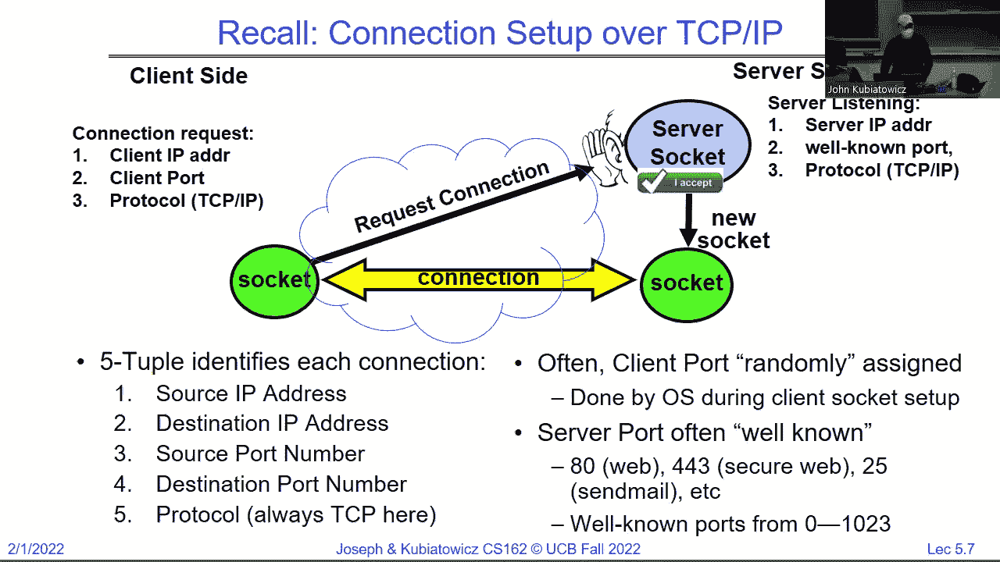
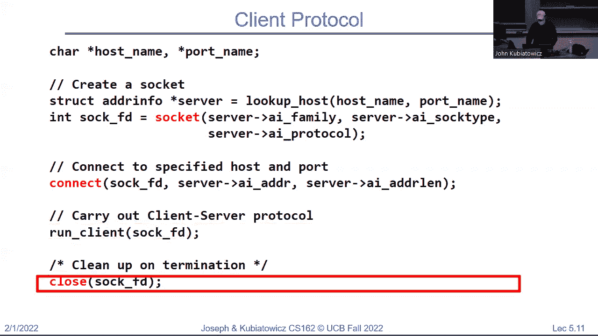
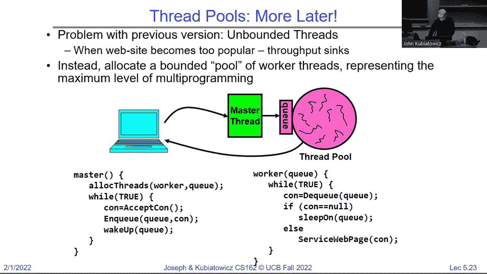
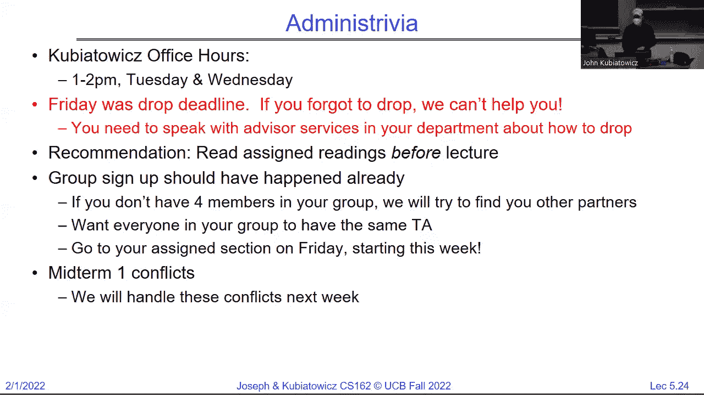
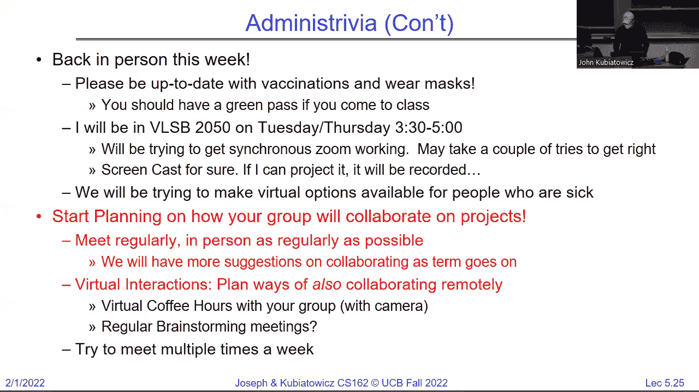

# P5：Lecture 5： Sockets and IPC (Finished),  Concurrency Processes and Threads - RubatoTheEmber - BV1L541117gr

 Can you guys hear me out on in net land too？

 Are we good？ Good。 Well， hello， it's nice to actually see people for a change。

 Sorry about the little bit of setup there。 I think it's never quite worked the way you expect them。

 but I think we're good。 I'm John Kubitowitz。 Most people call me Kubie。

 And you've sort of heard me on zoom， but here I am。 I actually exist。 Actually， this is a really。

 a really amazing holographic projection up here。 So I'm really sitting at home。 But we'll。

 we'll pretend for now that I'm actually here。 And let me pick the camera here。 See。

 Let's do like turn。 Okay， so we have been talking a lot about some introductory ideas in operating systems。

 and we're going to continue now。 So if you notice。 Let's see if I can actually get this thing to。

 There we go。 So we were talking last time。 I'm going to talk about this key idea in Unix。

 which was unique when it was first， first came up that everything's a file or everything at least looks like a file。

 So you can open files and they look like files。 That's not surprising。

 but you can also open devices or sockets or whatever and you use the same interface。

 And that interface is going to allow us to pipe things different programs into each other and you get to do that when you start playing with the shell。

 That's homework two， I think。 But the basic ideas here are you always open everything。

 And the open is where you're going to be checking permissions on things。

 And then all of the reads and writes are bite oriented， regardless of what's being stored。

 So even if you're storing a database that's in some special format， operating system doesn't care。

 It thinks of it as bites。 Okay。 The kernel will help buffer reads and buffer writes。

 And there's an explicit close operation。 Okay， so that's an interesting concept and what it means is when you start working at the system call level inside the kernel you're going to be working on that open close read right interface。

 The other thing we did last time is we kind of looked at two different ways of accessing that file interface so at the low level is the system full interface。

 So I would say this is the raw open read right close。

 And you don't get a lot of functionality with this you give it a buffer。

 And you tell it how much you want to read or how much you want to write and it just does it for you。

 We contrasted that with the high level IO interfaces and pretty much they are all the ones that start with an F instead so instead of open you got F open。

 And those are buffered。 Okay， and so it user level。

 They actually go ahead and do some extra functionality so they're going to wrap the kernel level cis calls with the high level ones。

 And so you don't even have to do system calls from this level you're just going to do F open and then you're going to do read that right up read up close。

 When you open at the low level。 That open system calls going to return an integer that integer represents your file being opened and you're going to use that integer from that point on it's called a file descriptor。

 In all of your region rights to tell the operating system kind of which one you're talking about。

 Right， so you already went to the trouble of opening now you'll tell them which one you're going to talk about。

 In the high level interface， you get back a file star so that's a pointer to a structure that's allocated at user level。

 Okay， and so notice these are very different。 So don't mix F versions and non F versions because you'll get chaos。

 Okay， you can mix them if they're different files but don't mix them in the same file。 Now。

 the file descriptor is an integer that's only meaningful for the kernel。

 And we'll talk a little bit about what that means on the other side of the kernel interface。

 The file structures in user space。 So it's a it's a structure and you could probe it and look at it but you're never。

 you know， you never do that。 But it's a chunk of memory for buffering it's a file descriptor for the file so clearly F open had to do an open under the covers so it keeps track of that integer。

 Okay。 Every reader right causes a system called no matter what。

 Whereas every F reader F right kind of buffers things and it might or might not call the kernel so that's where we're going to get some power out of using the high level ones。

 So for instance， with the low level ones suppose you have a loop and you're reading from a file four bytes at a time you're going to do a system call for every four bytes and it's going to return four bytes for you。

 The F reads a little more interesting right there you first call the F read as the kernel for a bunch of bytes maybe 1024。

 and then it gives four of them back to you and then the next time you call you get you get four but they're out of the buffer they don't have to go back to the current。

 Okay。 Everybody good on that。 Now， the other thing is。

 I wanted to look a little bit here and you're going to start exploring this interface as you go but the low level read for instance。

 is really just going to go directly into the system call。

 And that system call is kind of like a procedure call but into the kernel and so it's got to be done in a very special way and you've already started looking at this。

 So there's going to be some assembly code that puts the system call number in a register and the arguments and other registers and then it does a trap instruction which falls into the kernel。

 Inside the kernel， you'll do a bunch of stuff。 We'll talk more about that over the course of the term。

 and then it'll return back to user level。 And at that point。

 this is kind of a system call this is what the system call is from the user standpoint。

 And then there's going to be formatting in the right way to return。

 The contrast with the high level is here we're actually at user level or it's going to say， hey。

 does our buffer have anything in it。 Well， it does just return don't even bother。 Okay。

 Otherwise it does that system call thing we talked about。

 And now it's going to return some of that data into a buffer and then return it to the caller。

 So that's another way to look at those two differences。 Okay。

 I noticed there's some chat on the Tiazza as to what the differences was that it were。

 And I thought I would give you a little bit of a handle on that。

 Are there any questions before I move on。 All right。 Okay。 Now， um， moving forward。

 If you notice the thing that we were talking about at the very end is we were starting to unwrap the idea of a socket。

 And we're going to talk a lot more about networking as the term goes on。 But for now。

 this idea of a socket is really another example of something that looks like a file。

 But is actually a couple of cues connected across the network。

 So it looks like a file and you read and write it like a file， but it's not actually a file。 Okay。

 And so sockets are endpoints to communication。 And they're on two sides of a network。 Okay。

 In many cases。 And so we talked at the very end we're talking about this connection set up。

 And so there's actually two types of sockets。 So when you're a server。

 you got to listen for the fact that somebody may try to connect。

 So the server is the one that's listening， the client is going to be the one that connects。

 And so that server socket gets put up before any communication happens。 And there's two operations。

 The first one is it's going to set up listening。 And that listening is going to be listening on a special port in the case of TCP IP。

 where we have the IP address of the server， but then it's also a well known port。

 And those well known ports are things like 80 is the standard web browser。

 443 is the protected browser， etc。 And so that listening does basically nothing else until a client sets up a socket for communication with the server。

 And it has its own IP address and its own port， which is often randomly chosen。

 And it connection request goes to the server socket。 The server socket， well， at that point。

 create a brand new socket purely for that connection and to connect them。

 And so after the connection is set up， now， well， we have this unique connection and that server socket can have many other connections coming in。

 That's why a web browser can handle， or excuse me。

 a web server can handle many different connections at once every one of them will be one that has come through this process。

 Okay。 And notice that that connection， which is yellow in this diagram here has a five tuple that makes it unique。

 There's an IP address on either side。 There's a port on either side。 And then there's a protocol。

 which in this case is TCP IP。 So as long as any of those things are different。

 you can have a completely different connection to that server。 Okay。 And often the client port。

 like I said， randomly assigned done by the OS。 And the server port is what's called a well-known port。

 And that's you're connecting if I'm connecting to a regular patchy web browser web server。

 I keep saying browser。 It would be 80。 If I'm connecting to your bank， it might be 443， etc。 Okay。

 All right。 And I want to pause there。 That's where we left it last time。 Questions。 Yeah。

 What exactly is a port？ Well， a port is a 16 bit number。

 but that isn't really what you wanted to know。 So port is a unique service in a given server。

 And so that port number identifies a service that that particular IP address can handle。

 And if you think about it， if you have a server， just the server hardware has got its own IP address。

 That's kind of how packets get to it。 But that isn't really enough。

 You really need to identify something running inside。 In fact。

 you want the server process to be identified。 And that identification happens as part of the port setup。

 Okay。 Good。 Any other questions？ So， so now what I wanted to do is just quickly take you through the web server idea。

 Okay。 And， you know， why do we do web servers this way？ Well。

 you can see that that listening basically allows many clients to talk to the server。 And in fact。

 sometimes many different tabs could talk to the same server or many different pieces of a web page could talk to the same server。

 Each of them could have their own unique connection。 Okay。 So it's a many to one。 And let's look at。

 for instance， this， this use of sockets in a little more detail for the web。

 And I'm not going to go through this fairly quickly， but I wanted to make sure you've both seen it。

 So the server creates that server socket。 It binds it to the address that says， gee。

 we're going to do IP address， whatever I've got in my port。 And then it does a listen。 Okay。

 And meanwhile， that's all it does until somebody else is going to do something。 And so in a loop。

 it's waiting for an accept。 And that accept is totally blocking。

 So really what happens is the server does all this and then it goes to sleep in the accept。 Okay。

 the client comes along creates a socket， connects it to the server。

 which really means there's a communication to the listen。 That listen causes an accept protocol。

 which we'll talk about later in the term。 And when you're done。

 you've got two sockets that are now connected to each other that can read and write。 Excuse me。

 So that is a bidirectional connection that yellow arrows bidirectional。

 And once those two things are connected， they can send data down each side， which are bytes， right？

 Remember， everything's a bite。 And at the other side。

 it can be picked up so it can go in both directions。 Okay。 Yes， question。 Yes。

 so for each connection， it's a new socket。

 Okay， but notice just to go back to this picture because it's important。

 Notice that there's one server socket that guy sits there and listens。

 But every new connections got a new little green thing on the server side。 Okay。

 and that's got to be distinguished by something in that five tuple。

 And so that means that if you've got the same client is connecting。

 it keeps making new ports for each connection。 Yes， the back。 Yes， good question。

 There is the well known port。 Let's say this is 443。

 This socket on the server side will have 443 as its server port。 Yes。

 so every every green thing here will have the same IP address and port for the server side。

 Distinguished by the IP address and or the port from the other side。 That makes it unique。

 And it basically lets the the network protocol stack underneath sort out all the packets that come in and can figure out kind of where to send them。

 And which one of the sockets based on that five tuple。 There was another one down here。 Yeah。

 Is there a limit on the number of sockets？ So I could be philosophical and say there's always a limit。

 Yes。 What happens usually is if you bombard the server with too many socket requests。

 it crashes the server。 Better hardened things will start start for refusing to actually accept。

 But you have to you have to make sure you do that often yourself in order to make that work properly。

 Okay， one last。 Yeah， go ahead。 That's a good question。

 I'm going to show you where forking comes into play here in a moment with this scenario。

 But it's really just making a new structure inside of the kernel that knows what packets it's supposed to be receiving and where they go when they go out。

 So it's not it's not a process。 It's like a data structure plus a queue because every socket endpoint has a queue associated。

 Okay， you guys are going to be great。 You're actually asking questions。 Isn't this great？

 You're actually like in person in a classroom and people are raising their hand。

 It's like radical。 Okay， so。 So what I'm showing here is once the connections happen。 This server。

 which is not a very bright server， we're going to have to fix it。

 But notice that it's totally consumed right now with that one connection。

 You'd never want to build a web server this way。 But let's look at this one first。

 So notice that after the server and the client have cooked up。

 Now they're just communicating back and forth。 Okay， and sometime later。 You know。

 the client is done。 It's going to close its socket。

 The server will close its socket in this particular not very bright version will then go back and accept another incoming connection。

 Okay， this is a not very bright version。 Okay， you guys are with me on that。

 So notice a couple of things here。 How does the server know things are done？ Well。

 one thing is if you close down the socket， the client side， the server will get notified。

 So it'll find that out。 The other thing is you're going to need a protocol going over this back and forth。

 This sort of format what the bytes look like because the operating system only knows them as bytes。

 We'll talk about that later in the term。 Okay。 So， you know。

 here's what that simple protocol looks like on the client side。 I just wanted to give you。 You know。

 we program C in this class。 So if you notice， when we create the socket。

 We need to start out with an add or info structure which defines things like what's the IP address and port name or where I'm going。

 And we can have look up host later in the slides。 We'll decide whether we want to look at it。

 The socket itself kind of has a family and a type and a protocol that was part of this address structure。

 So for instance， the protocol is going to be TCP， okay， etc。

 And the socket type is going to be a stream because TCP actually is a streaming protocol。

 And once that socket comes back， notice it's an integer。 Big surprise， right？ Everything's a file。

 It all looks like a file tastes like a file。 Actually， I'm not sure what a file tastes like。

 but it would taste like a file if you could， right。

 Which means that now I can do region rights to it as if it were a file because it's a file descriptor。

 Guys get the idea here， right。 So if you notice， so that's grabbing the host name and turning it into a structure I can use。

 This is creating the socket。 This is trying to connect。

 So it's reaching out to try to find that listener on the other side and assuming that succeeds。

 the connect is blocking， but it'll exit。 When it's succeeded and now I can run the client doing whatever I want。

 sending bytes back and reading bytes。 And then eventually I close and I'm done。 Okay。

 so the client's kind of not very exciting。

 The server is also here。 I'm just going to give you a couple of pieces here。 So once again。

 we set up the address。 This time， maybe we only give it a port because we know what the IP address is。

 It's local。 We get ourselves a socket。 This time we bind it。

 This is where I'm telling the server socket。 What address do you have to think you are at this point。

 Okay， and that's both the local IP address and the port。 And then I execute listen。

 And I only do that once。 Because when it returns from listen， there is now an ear in the server。

 Okay， and at that point in a loop that particular code， waits to accept a new connection。

 So this is blocking。 It'll only return when it's got a new connection and oh look it's a it's an integer。

 which means it looks like a file。 Okay， right about that。 Okay。

 And then once that comes back and I get past this except。

 I now have a file descriptor to a socket that looks like a file that I can read and write at。

 And by the way， when I do that read and writing， I'm talking to the other side。 Okay。

 so when I write the client reads when it read when it's writing on its side， I can read it。 Okay。

 bi-directional。 And then when I'm done， I close it。

 And notice since there's two sockets when the server is totally done for whatever reason we haven't given it any way to exit here at the moment。

 we'll also close the server socket。 Because that's the last socket。 Right。

 so each except since it's a unique connection gets a new socket associated with it。

 which we close each time in this not so bright version。

 And then at the very end we close the listener socket and we're good and done。 Okay。 Yes。 Okay。 So。

 the problem is that a socket is a got a descriptor that came back and an F read needs a file star。

 So hopefully you guys all remember from high school chemistry you got to match the units。

 Right integer file star don't match。 So something's got to happen in the middle now fortunate for you。

 there actually is a， there's a call that will turn a descriptor into a file star that you can use。

 So the answer to your questions yes but you got to check you got to catch that mismatch first。 Okay。

 All right。 So here was a question。 So this client needs to know the server sockets port to make the initial connection。

 Yes。 Okay， that's a， and why is that that's because every port is a different service on that server so you need to know what port you want。

 So when your web browser goes to browse。 It knows you're either going to port 80 or port 443。 Okay。

 and that's part of the connection process。 Okay， question。 Yes。 This is a not a very bright version。

 all it does is it waits for connection。 It serves that one connection and then it closes and goes back and does another connection so there's no threading no nothing we're going to fix it。

 Okay， this would， this would fail in fact to be a good connection for a single web browser because most modern browsers make more than one connection simultaneously to get pictures and stuff。

 At the same time as text so that's why you see the pictures are simultaneously loading all over the page that's because each one's got a separate connection in some instances。

 Okay， depending on how it's done。 Yeah， question。 Good question。 What happens in this。

 especially with here it's clear， because when I'm serving something here I'm not accepting so what happens to all the connections from the rest of the world。

 The answer is there's an internal queue in the operating system of connections that are waiting。

 So the listener， the listener socket has a cue that's a great question。 Okay， any other questions。

 Okay， since there seems to be a lot of interest let's fix this guy okay but we might as well right。

 So for instance， one of the things it's kind of interesting about this is。

 we run this serve client thing in the same process as the server。

 That might not be desirable from a security standpoint。

 wouldn't it be nice if the serving to somebody remote was a separate process just to protect the server。

 So now what， what are we going to use to have that happen altogether。 Fork。 Okay， so here we go。

 Here's a very simple change notice all I did here was after I accept。

 I'm going to execute a fork and the parent is going to close and wait for the child to be done and then the child is going to do what we just did so we haven't gotten any parallelism yet but we've gotten some security。

 Okay。 And so if you look really， the only difference there is that we still listen we still accept。

 Now we're executing fork in here。 And if PID equals zero what's that mean it's the parent of the child。

 Child， so the child goes ahead since the child was a was forked from the parent it's got the same。

 All the same file descriptor that the parent had at the point that the fork executed。

 including this server socket so this one isn't useful to the child so it closes it。

 And before there are two of them that point to the same socket。 Okay。

 So I'm just point pointing that out just to get it rattling around your brain。 But if you notice。

 once we close that now we're going to go ahead and serve the client notice we're using the connection socket which is the one we got from the accept。

 Okay， and when we're done with that we'll close it。 And then we just exit。 Okay。

 I didn't put a highlight on that but exit says this child is done。 And why do I do exit zero。

 What's that mean success right nowhere。 What's the parent to well the parent closes the connection socket because it's not going to talk to the remote client。

 And then it does wait。 Okay， and there's lots of versions of weight this one doesn't even care that there was a zero coming back just because I'm being simple about this but take a look through man wait you can see there's lots of them。

 Okay， and then when we're done， we'll loop and do it all over again。

 And we'll close when we're done in the back yeah。 Well if the parent doesn't close this then they're going to start building up a bunch of stuff。

 Now， of course， when the parent finally exits the leftover sockets will close at that point but you want to be clean enough。

 Okay， yes。 So the socket it。 No。 Okay good so there's question there's the sockets should be unique what if the child doesn't close it so first of all the socket is unique。

 What happens is the file descriptor member it's an integer。

 Every process has a table that goes from integers to the individual things they're pointing at under the covers。

 So it really is one unique socket to handles on it。 Okay。

 and so you can actually both communicate over the one socket if you want to but that would probably cause some chaos in this application。

 Okay， so the handles are just integers and integers not a file but an integer could point at a descriptor of a file or a socket or whatever so the thing underneath the covers is the thing that's unique。

 Okay， and I'm actually， I'll have enough time I think to show you that in more explicit detail with when we get a little after the past this example。

 Okay。 Good。 Any other questions。 Yeah。 Say that again。 How do you get out of the while loop。

 You don't control C。 Yeah， so this this is not intended to be a full server this is just a sketch。

 but that that's a good catch。 Okay， yeah this this one， there is no exit of this。

 To get that close to that close it's code that would never actually run if you compiled this particular。

 Yeah。 Every process has its own table of file descriptors。 Yes。 Good。

 That's why I'm glad I'm putting some things up in just a moment。 Okay， so。

 so far what we've done is we've gotten a separate process for each connection but we still don't have any concurrency or parallelism。

 Which means that we can only handle one connection at a time。 So what's the obvious thing？ Well。

 when the parent is done closing this extra connection because it the child is handling it then it just goes back and accepts again。

 So notice the only thing I removed there was the weight。 Okay， so in this instance。

 we're now good to go。 Okay， now really this one kind of looks like this where I commented out the weight。

 All right， now really， you got to be a little careful that things don't pile up and so you really want to free up children that have finished。

 And so there's a little more complexity to that than here but I'm， I'm。

 for now this example I just want you to think we're not waiting and so now we can do some more。

 Okay。 All right。 So now this， you can look through this。

 the slides and so on to see this full example， but for instance to set up addresses for the server side。

 We have to make a structure of a certain type and clear it out and set some parameters and so on and then do something like get at her info。

 giving it the port and some other information and that makes a structure that then we can use to bind and fall。

 Okay， and I don't want to go into the details and that too much right now。 But。

 similar for the client。 You might have something like this look up host where you give it the host name。

 you know， www。berkeley。edu and the port 80 and then it constructs some stuff for you so that then you can make a socket that then you can connect with。

 Okay。 So last， how do we do this without protection。

 So you could imagine that producing a bunch of processes might actually be kind of slow。

 And so for a moment， if our protection comes from different ways that what would we really want to do that doesn't have the overhead of making a brand new thread。

 excuse me a brand new process for every connection what let's do a brand new thread for every connection。

 right。 And in this case， it's much more efficient to spawn threads and so here really instead of a fork we might do something like p thread create。

 which I'll talk about a little bit more but that'll create a new thread。

 And in that instance we're all in the same process but we've got a nice low overhead thing that can talk with one client and meanwhile we can go back except another system called create more threads and so now we get a thread for connection。

 which is really， most modern servers do。 Okay。 And they sandbox and protect you in slightly different ways because this is a big performance improvement not to have a process for everything。

 All right。 And finally， the problem with this is this is great but it's still subject to something。

 that's used to call the slash dot effect。 All right。

 or something becoming a little too popular what happens。 Well， if everybody in the world。

 goes to our lecture because you know it's kuby teaching and it's awesome。

 You cross you end up crashing the server right。 So this is actually subject to a denial of service where too many incoming connections generate too many threads and it fills up all the memory and the system crashes。

 Okay， so this is really not a real solution。 If you actually want a real solution what you do is you do something like a thread pool which we'll talk about in a couple of slides or a couple of lectures little more。

 where you limit the total number of threads that can be alive at any time。 So。

 if you've succeeded that then you don't make new threads you wait until threads go away。

 And then you then you take a new connection and you rely on that cue inside of the kernel of connections that are waiting。

 Okay， and that's so then you can kind of trade off the amount of concurrency or parallelism you want versus the memory that you need。

 Okay。 All right， everything is looks like a file。 Okay。 I have office hours。

 Sorry I wasn't there today。 I had a little mini disaster I was dealing with and I may or may not be there tomorrow but I definitely will for the rest of the week。

 I mean the rest of the term。 And Anthony's got some hours that he's going to post as well。

 I'll let you know if I'll be there tomorrow Wednesday if anybody wants to come see me。

 Important thing to note is if these office hours don't work and you want to talk with me just send me mail or something let me know。

 We'll set something up。 Okay， and how many people would like me to try to have a virtual version of office hours。

 Okay， probably not so much the people that are here。 Let's see。 Anyway， I have virtual is great。

 Okay， so we'll see。 So one person did ask here by the way。

 let me let me put back one more question still a bit confused on how the multiple connections collide on the same。

 Don't collide on the same port。 The answer here is that each socket。

 but is the answer each socket connection has a unique something of those five parts right。

 And it's going to be from the client side。 There's a unique IP address and port on the client side server will have the same IP address in port。

 And then there's the TCP IP。 And so the answer to why they don't collide is every connection has something that's unique about it。

 And therefore when we hand that socket into the thread that thread is talking to a socket that's unique and it's connection is unique。

 Okay。 All right， good。 So， so the socket on the server side sees the unique client IP or， or port。

 It could be multiple from the same IP but different ports。 Okay， so， Friday was drop deadline。

 If you forgot to drop and you're out in cyberspace or you have or probably you guys didn't want to drop。

 which is great。 But if you know somebody who forgot to drop。

 You need to tell them that they've got a mess they got to clean up。 I already had somebody tell me。

 I didn't think I was going to get into the class。 Now what I was like well it's out of my hands you got to talk to your department。

 The recommendation again is read assigned readings before lecture。

 The group sign up should have happened。 And for those of you that didn't quite have four members in your group I think we'll try to find you other ones。

 The goal here is for。 Now， shall count to four， you know， not to three or five。 Okay。

 before you launch your group。 And we're going to try to make sure you all have the same TA in your group。

 Mid term one conflicts， we're going to handle them。 I say next。

 probably starting this week so if you have a conflict with mid turn one。

 which you now know when it is and what time it is on the schedule。 Please let us know。

 We're going to try to figure this out。 And then lastly， let's see。 Any questions on this so far。

 Yeah。 I don't think so。 I think they're still working on them。

 So sections are all on Friday now we've managed to get the rooms to be that way。

 And so we have a day or so， but we'll let you know， but you should be。

 you should be attending your regular sections。

 I see that I've got， I missed the， I missed the animation on this so we're back in person。

 So there's good chance that I'll be in VLSB 2050。 Tuesdays and Thursdays。

 Hello to everybody who's actually out there。 And we'll try to get secret assume working we did that。

 May take a couple of tries get it right。 I succeeded。 Etc。 So start planning。

 On how to collaborate with your group。 I think we're going to have even an info session on this because there's nothing worse than dysfunction in a group。

 Okay， and I won't ask you to raise your hands， but I'm sure most of you out here have had a dysfunctional group one way or another。

 So plan early。 Okay， and plan to meet regularly。 Okay。 Coffee。 Whatever your favorite place。 Okay。

 meet over， you know， food。 Virtual interactions， you know that you're probably going to get sick during the term or something I hope not。

 You may have a member who's being a little bit careful with how much they interact。

 you may need to have virtual interaction so figure out how that works。 And I。

 my biggest recommendation if you're interacting virtually， hopefully， occasionally not all the time。

 camera。 Most important thing is camera and a camera that you turn on。 Okay。

 It's very important and try to meet multiple times a week。 All right， very important。 Okay。

 And we'll， we'll say a lot more about making functional groups。

 The other thing camera is I wanted to do a little bit of interesting here so I try to do computers in the news。

 You've all， I hate to say it probably are too young to have remembered why 2k the problem。

 But now we got why 2k to to the problem。 I don't know if you've been aware of this， but。 Yeah。

 so if you write your date in the form y y m m d d h m m that's 10 digits。

 And if it happens to have a year that's to to。 And it's a 32 bit number to to is got the hybrid set。

 And if your designer of the software wasn't very clever and they made it a signed integer。

 Then suddenly when we went to January 1。 That's not too long ago。

 All of the dates were negative and a bunch of stuff broke。 Okay。 So there are a bunch of Honda cars。

 Every time they turn them on it resets to two o'clock January 1， 2002。 Now my car。

 which is also Honda is a little bit later than that。

 And it's just thinks it's in daylight savings time。 And so I got in the car coming over here today。

 And almost had a heart attack when I looked at the time and realized I thought I was an hour late。

 But you'll also read about the fact that Microsoft exchange failed。

 Cued up a bunch of messages that didn't go out sonic wall。

 which is a firewall producer had a bunch of email security and firewall issues。 So。

 welcome to the 22s。 Okay， we have why 2k to two。 And it's yeah。

 It kind of emphasizes the point which I made a couple of times in lecture already。

 But always think about the error cases。 Okay。 Now what's problem about this is they probably thought they tested it because it worked great as long as the year is no greater than 2021。

 This works fine。 But yeah。 Be very careful about using signed integers in places where you're really doing something。

 There's nothing signed about this right this is absolutely unsigned。 All right。

 Anybody run into why to take to two。 You guys about lucky。 Me。

 I just have to hop in the car and try not to have a heart attack every time I get in there drives me nuts。

 So yeah， the question in here in the chat is they use the sign type for date and time and the answer is yes。

 Okay。 There's one last question in the chat here from the last。

 The set of questions we're asking which is how are client sockets protected to get to each other if they're in the same process。

 The answer is the code has got to be hardened and you got to be very careful that it's written correctly or has proper sandboxing and other techniques。

 So we may talk about that later in the term。 Okay。

 So if you remember the process control block is a structure inside the kernel that represents a process and it's got a lot of stuff。

 Like what's the state what number is the process ID， where's the program counter a bunch of stuff。

 It's got things that the scheduler will be able to use to schedule the process and let it run。 Okay。

 and the scheduler which we're going to talk about。

 In a couple of later lectures but we're going to get close to it today even is going to give out pieces of CPU to different processes and ultimately to different threads。

 But that process control block serves as the root of describing the process。 Okay。

 And one of the things that's in here and I've heard questions about on piazza a bunch is well。

 What does it mean for there to be a list of open files in the process。 Okay。

 and so let's look here for a moment。 Remember that a file descriptors an integer。

 And that integer inside the kernel has to go to something other than an integer it actually goes to something called a file description。

 which has a bunch of interesting stuff。 So for a for an actual file it， for instance。

 has something called an i node which we'll get later in the term describing how the file is stored on the disk。

 And it's got like what's the offset how many bytes have you read so far from the beginning。 Okay。

 so what that translates to is if we have the process structure。

 There's kind of part of the processes in user space part of it's in kernel space。

 So the user space portion is going to be things like thread registers and some of the address space contents。

 And then the kernel among other things are the file descriptors。 Okay。

 and if remember that the file descriptors and integer outside the kernel。

 but there's a table inside so if we do open food。text。 There's a file description here。

 which says hi， this is file food。text where position zero。

 And you know what are the i node on the disk， you know describing the file and everything。

 And so really what happens that comes back from that open is a integer three。

 And what that means is the process only knows about three。

 but the kernel can map three to a pointer to the actual file description。 Okay。

 so that thing that's an integer is really a pointer to this thing in the kernel。 Okay， and then。

 you know also there's the special zero one and two。

 which we'll show you in a second which represent the console input and output。

 But certainly three here is mapping to this file and so now if we read a hundred bytes from file descriptor three at the current at the user level。

 that's going to go ahead and change things inside the kernel and by the way it's going to move its position to be a hundred。

 For instance， okay， because we just read a hundred bytes。

 And so the next time we would read we would start a position 100。 Okay。

 and then we'll close and it'll go away。 Okay， poof。 Right， so that's kind of the。

 that's the lifetime of a file that you open。 And if this is not an actual file and if it's instead like a socket。

 but we're pointing out here is a socket structure with a buffer and stuff。 Okay， same idea。 Now。

 the idea of what happens about fork came up and I just wanted to show you。

 So here's the thing I just showed you。 If we execute fork。

 we're going to get duplication of a lot of the stuff that was there。 Although。

 if this has got more than one thread only one of them gets generated with fork。

 So that's a little tricky part， but it's file descriptor table is going to have the number three and it's going to point at that same thing。

 Okay， and so now both parent and child can be reading from descriptor three and they will be sharing that underlying file description description description description。

 Okay， question。 Yes。 Yes， so current location here is shared。 Yep。 Okay， now。

 so the file descriptors copied file description is alias。 All right。 If you look here， for instance。

 if we read a hundred from the buffer， then this is going to go to 200。

 but then this guy could read 100。 And it's going to go to 300。

 And so the two of them are trading off who's getting data from the file。

 So this is one way you could do parallelism is you open a file， and you do。

 44444 fork and each of them kind of reads a chunk of stuff out of the file and processes for a while。

 Okay， so that's a pretty simple pattern。 Okay。 Now， so the file descriptors copied。

 but the file description is shared。 Okay， so when I close， notice this guy closed。

 but this one's still open。 Okay， and that should suggest something that's kind of like that pattern we looked at in our web server right where the child closed the parent server socket because it didn't need anymore and the parent closed the child's connection socket because it didn't need that。

 Okay， everybody clear on that。 Good。 All right。 Now， everything's a file。

 And so this all works for everything。 But I wanted to last a lot。

 least show you something that you'll get to play with when you're doing with your shell。

 So the other file descriptors that are always open for every new process is zero one and two file descriptors zero is input file descriptor one is regular output file descriptor two is error output。

 And if you notice， they're connected to the terminal typically。

 But using that little pipe symbol or， or greater than or less than symbols will actually change these to point at files instead。

 And the in the code can think it's writing to the screen but really it's going to a file because your shell has altered these that's something you get to play with。

 Okay。 And of course， if I fork a child process here。

 notice that all the file descriptors are pointing at the same place。 So if the shell is the parent。

 and it makes a new child process if it doesn't do anything。

 the input and output of that child process is just going to go to the same console。

 Kind of like the way it does right that's what you're used to。 Okay。

 I'm going to leave this because I don't want to do too long on this but any other questions。 Okay。

 Yeah。 Yes， well， you need to close it in both of them eventually or the files still open underneath the covers。

 Now if the process exits， it'll close it。 Automatically。

 but typically the pattern is that after the fork you close the things that you don't need anymore。

 Okay， good。 Yeah。 Yes， there would be a different file description for it。 Yes。

 That's a good question。 Okay。 All right。 So。 So， the other things that are shared sockets are shared。

 Pipes are shared。 We'll talk about pipes another time。

 But what I'd like to do is let's briefly take， I'm going to try to do this。

 What throughout the term is let's briefly give you guys about five minute rest。 You can stand up。

 walk around， come back and we'll pick up a slightly new topic。 Okay。 Take a breath。

 And then that lay had folks out there。 I'll just pause the recording for a little bit as well。 Okay。

 settle down everybody。 So， um。 See if I can get this to go。 Hello。 Okay， so let's now。

 Go past ton of the ideas of interface and let's get。

 Let's go into the kernel a bit and actually ask how do we actually multiplex。

 Two processes to make it look like they're both running， even if we only have one CPU。 Okay。

 so that's going to be our goal。 And so we're going to need to figure out how to give that one CPU or core out。

 In some way to the different processes， so that we can make it be concurrent at least so it looks like they're both running at the same time。

 Okay。 And again， this is a function of the scheduler to decide which one gets to run for how long。

 Okay， and。 But we're going to look at instead is the scheduler has a lot of policies we're going to look at how do we keep things organized in a way that will allow us to hand out。

 CPU cycles to different processes cleanly， and then we'll think about different ways of scheduling later。

 So what is the distinction I'm making here the distinction is scheduling is a policy decision。

 I'm going to give that one 60% of the CPU cycles miss 140。 That's a policy decision。

 We're going to talk about under the covers the multiplexing decision about how to take that one CPU resource and share it。

 Okay。 That's our current task。

 And of course， we've already started talking about this and so the idea here you've seen this figure。

 where process zero is running process one is running and there's operating system code。

 And in principle， the idea here is that you know process zero is running in user mode。

 And then we hit a switch point and we go into the kernel and we save a bunch of state for a process zero into the。

 And then we go back into the kernel and do the same thing in reverse and by that doing that we go back and forth and one zero runs for a while。

 then one runs for a while， then zero runs for a while， then zero runs for a while。

 then zero runs for a while， then one runs for a while， then one runs for a while， and it looks like。

 like we're running simultaneously。 If we do that fast enough。 Okay。 Okay。

 One CPU one for and notice the stuff in red， red is there for two reasons。

 And I apologize for those of you that might be color blank as red green combinations are not good。

 And then in the middle is about overhead right now that's purely overhead。

 because what when it's executing in the middle， it's not getting anything done on the outside。

 So we want to make sure when we're doing this that whatever's going on inside here is quick。

 or at least the small fraction of the total stuff going on the outside。

 So I'm going to give you a number I'm going to say like 10% is a good number to keep in your mind。

 If I got more than 10% overhead， it's probably bad。 Okay。

 it's starting to get into what's called thrashing where we're really wasting more time doing the overhead thing than we are doing the actual。

 process。 Okay。 Now， you know， this is an OS class and we all love OS is in theory what's in the middle here is the cool stuff but I will tell you。

 we're trying to make this OS for somebody to get something done which means what's on the outside is what they're actually trying to get done not spend all the fun time in the middle。

 All right。 So， what's the life cycle of a process from this standpoint so we start out by making a brand new process structure。

 And we admit it to what's called the ready queue， and it'll be in a ready state。

 which is it's waiting to run but it's not currently running so it's like it's process one in that diagram when process zero is running。

 Okay， it's ready to run but it can't actually run。 And what will happen is when it's time comes。

 it'll get to run。 Okay， so running in this instance is actually using the CPU。

 Ready is ready to run but not using the CPU and then an interrupt like a timer interrupt will come around。

 And we'll go back to the ready queue so what happens is you get the picture we can go back and forth a bunch of times。

 And so we go from ready to actually running and back again。

 And notice that I have an interrupt up there。 This is one of the key ways we're going to talk about for instance。

 How to get the CPU back from a process。 Okay， so that process is busy doing my favorite thing。

 which is computing the last digit of pie。 And it's not going to return the CPU because it's got a long time to compute right。

 And so what we have to have is something to reach in grab the CPU away so that we can give time over to the other process。

 And a good example of that is going to be for instance a timer interrupt。 Okay。

 and so this grabbing the CPU away from somebody who's running has to be some mechanism and we'll talk about many mechanisms but for today think about the timer。

 Okay， it's a great one。 So what happens here as I'm running is sometimes I may actually try to do I oh。

 So when I'm doing I oh it might be an example of I'm going to a desk or I'm trying to read from a socket but there's nothing there yet that can take a long time。

 Okay， and so what should I do when I'm about to do a long running operation。

 Well clearly I'm waiting。 But what else should the OS do。 What else。 Right。

 We do not like to waste cycles in this class so when I'm waiting on IO I want to arrange things so that the other thing that might be ready can run。

 So this life cycle here is just showing you what one processes view of the world is there's another one who now gets to run because the first one is waiting。

 Okay， and pretty much you can think of read ready waiting。

 Certainly our weight states the ready weight state is one that says I'm definitely ready to go the waiting state is any of a number of possibilities where whatever I need to continue isn't ready yet。

 So I asked the disc for something it's not ready yet。

 I went for some IO it's not ready yet I'm waiting for a keyboard stroke it's not ready yet。 Okay。

 Eventually， when the data comes back and I'm ready to go I just get put on the ready queue and now the scheduler there's getting that word there gets a chance to now make me run a bowl again。

 Okay。 And then eventually， I'll be done and I'll exit。

 And there's this idea of a terminated state which is where I'm done running。

 I've executed exit everybody remember exit。 And， but my parent hasn't gotten my exit code yet and so my process is just sitting there。

 Not useful for running anymore but holding an exit code and not the allocated。 Okay。

 and this is sometimes called a zombie process。 Okay。

 Attack of the zombie killer exited processes right。

 So that's kind of the final state there and when when the final weight happens or when the parents weight happens or the grandparents wait or somebody's weight happens then that terminated thing can be totally deallocated。

 Okay。 Now any questions。 So， this idea of scheduling is really can be looked at like this。

 where the process control blocks kind of move from Q to Q。

 And occasionally get in the ready queue and get to do CPU。

 But then after their say their time slice expires because they've run too long they go back to the ready queue。

 So， where if they do IO requests， they get put in an IO queue and eventually get back to the ready queue。

 or here's a good one fork。 Will actually take one process turn it into two。

 which might be on the ready queue。 Okay。 And remember， remember there's only one process。

 So that one， you know， when a process executes fork and now there's two a parent and child。

 and they're both on the ready queue only one of them's running at any given time。

 So it isn't the case that when you generate a new child process with fork that suddenly you've got things running in parallel。

 They're running concurrently。 Okay， meaning that they're alternating between each other。

 They only look like they're running in parallel。 So。

 that's not too long from now we'll start admitting the existence of multi core and all that sort of stuff and then they could actually be running at the same time but for this。

 these lectures， they're not。 Okay， any questions。 And by the way。

 this whole idea of how do you decide which one gets pulled off the ready queue。

 That's a whole series of lectures of interest on scheduling。 So。

 that's something to look forward to a little bit later in the term。 I'll pause any other questions。

 Nothing in net land there。 Oh yeah， go ahead。 So， so first of all。

 remember from a couple of lectures ago interrupts are actually from the outside。

 So the answer is that a timer would go off and it would generate a timer interrupt， for instance。

 that would cause the kernel to get entered。 Okay， that's an easy one。 Other ones might be。

 for instance， if a network packet comes in off the network that'll generate an interrupt。

 And it might temporarily stop things running and then continue it again。

 There's lots of types of interrupts。 Okay。 Good。 Any other questions。 All right， so。

 so the ready queue and various other IO device cues sort of in a process is not running the PCB is on some scheduler queue。

 And there's a separate queue typically for every device or signal or condition。

 And so you can think of these as lots of cues the ready queue means I'm runnable。

 But then there might be， you know， the USB controller or disk zero or just to network， etc。

 These are all places I can wait。 And so you can think of these cues as holding a linked list of things that are on that queue。

 And so in this case， by the way， that little ground symbol。 Yes， I was electrical engineer。

 you'll have to forgive me for that。 That means no， right。 That's the end of the queue。 So。

 if you notice， this thing， this ready queue has got three things in the linked list。

 which means that there are three things ready to run。

 The disk here has a couple of things that are waiting for disk packets or for things to come back off the disk。

 Here's an example of somebody waiting on a socket trying to get something off the network。 Okay。

 and so those PCBs have to be stored in a queue somewhere。 Okay。 Now。

 So up till now we've been talking about the idea of a process as， you know。

 it's running or it's not running。 Okay， but we made a little finer distinction than that last lecture lecture before that。

 which is that a process a modern process really has an address space。 And one or more threads。 Okay。

 so we were kind of talking simply just now that the process had one thread but in fact it could have multiple threads。

 All right。 And so multi threading is this idea typically of a single program with lots of different threads in it。

 Running concurrently。 Okay， and why do we separate threads from processes？ Well。

 the process is the whole environment plus the things executing in it。 So it's like an。

 it's an environment。 And the threads are these individual things that are getting CPU cycles and have a program counter and a staff and represent independent computations going on inside the process。

 Okay， and there could be more than one。 Or for the simplest way of thinking there is only one per process that's also okay。

 Okay， are there any questions on that。 I think we gave this picture right so this is showing the idea of a single threaded in a multi threaded process。

 Single meaning single threaded meaning one thread multi thread meaning multiple threads right。

 Every thread has to have a place in memory to store its registers when it's not running at a stack。

 Okay， and so that means that when you have multiple threads you have multiple stacks and register storage。

 But they all share the same block of code， the heap and their file descriptors。 Okay。

 So the address space is encapsulating the protection portion of this。

 Why have multiple threads for address space。 Yeah。

 you might be each computing something or each some of these threads might be handling IO。

 like waiting for keys to be pressed while other ones are computing and drawing things of on the screen。

 So typical games are exactly that way you have threads that are drawing things and moving things around。

 You have other threads that are waiting for input from the controllers and other things。 Okay。

 so you， so it's a very easy way of programming where you have multiple threads in a single process and so that's。

 you'll get used to that。 By the end of this term threads will be easy for you to think about I hope。

 Okay。 How many people here have ever programmed games and had multiple threads going。

 Do you have any game creators in here， or you're not going to admit it。

 How many game players all of you guys。 Okay， so， so what is the state of a thread。 Okay。

 so it's the state shared by all threads in a process or address space is sort of the content of memory。

 global heap， etc。 So in those states， the state private each thread is a thread control block。

 And so each process control block has a linked list of bread control blocks inside it， right。

 one or more。 Okay， and that's going to have CPU registers execution stack， etc。

 And what I wanted to say a little bit is remind you a bit about what stacks are but here's another view of the shared versus the per thread state。

 Okay， so here's an example of things that are shared with all the threads， the heat。

 the global variables， the code， and then the per thread state are things like each thread control block and then stack and registers and etc。

 Okay。 Now there's a question are there other ways to create new processes other than fork。

 And the answer is primarily fork is the biggest way to create new processes。 Okay。

 there are some simpler versions that Linux has。 But let's stick with that for now。 And so。

 let's remind you 61 C alert。 Okay， you're being reminded of what， what's inside a stack。 Okay。

 and so how many people remember stacks from way back in 61 C。 Okay。 Yes。 Go ahead。 Yep。 Right。

 and why are stacks important， they hold the local variables， why are they important。 Yeah。

 so if you think about recursion， what's our favorite recursive procedure Fibonacci right how many people remember Fibonacci isn't that great。

 So， let's look at what happens here in a typical scenario here where you have a of one。 And it's。

 is going to call the procedure， and it's going to call it with the argument one in the temporary bowl。

 And so what happens is we get a stack frame allocated。

 There's a stack pointer we push on there the fact that a stack frame has temp equal to one。

 And when we return， we're going to go to exit， because if you look here when we call day of one。

 the thing after our call is an exit。 So what went on the stack there is two things the local variables and what to do on return。

 Okay， and now let's look at what's inside of a a says is temp less than two。 Yep。

 So in that case it's going to call be。 So when we call be。

 we're actually going to make a new stack frame for be but be doesn't have any local variables。

 And so all that really happens is it reminds it puts us on the stack that when it returns from be。

 it's going to go to a， which is here plus two， which is kind of。

 of think of this as an instruction address， which is what happens after be done returning。 Okay。

 so what gets pushed on the stack is both the local variables and the return。 Okay。

 and then here when we hit see。 Okay， we're going to make a new stack frame for see。

 And again the return in this case is going to be be plus one。 Okay。

 and then finally notice that see is going to call a up to again。

 So now we're calling a but in this case temp is equal to two so notice on this stack frame。

 So we actually have two instances of a simultaneously on there one is a little further in the stack。

 They represent the time ordering because stack is going down here and so things that are deeper got called later。

 Okay， and then is temp less than two。 No， we're going to print out something so we're going to print out the number two。

 Okay， and then notice that when we get up done with print。

 we're going to exit a and so we look here where do we go after we exit a。

 Well in that case we're going to return to wherever C plus one is。 Okay， which is down here。

 And now it's because it was on the stack。 And now we're returning from see that's going to take us to be plus one。

 And then we're going to return here which is going to take us to a plus two where we print。

 And then finally， we're going to exit。 So really， if you think about the stack of this call of a of one it's got all of these things on the stack and eventually we're all done。

 Okay。 Does that remind you of what a stack is questions。

 Can you see why Fibonacci works right because every time you call recursively it goes down in the return。

 So， I've been asked like the easiest recursive thing to teach but I've always thought it will silly。

 Yeah， go ahead。 So this， so a here is we entered the a procedure。

 Let's go back in fact just for the heck of it here。 We entered the a procedure。

 So this is a stack frame。 And oftentimes on a stack frame it remembers the return place。 Okay。

 or it depends on it depends on whether it's stored in the previous or not but it needs to be here。

 In this example it's here because when we return from a we need to know where to go back to。

 And so this stack frame of a has not only the temp is equal to one but it also remembers where to return to when it's done。

 That help。 Okay。 So I would say return， make sure to look back in 61 C for stacks because you've already encountered stacks right if you've been doing your various assignments you've already run into them。

 So let's talk about some motivation for having multiple threads。

 And then I'm going to leave you with a thought process。 And so let's look at here。

 Here's a program that in C main is typically the very entry point that you get to worry about。

 It's not really there's something a little on the outside of main but for now we'll think about main is the entry point。

 And here's a case where we compute pie and store the result in。 And then we print the class list。

 So what's the behavior here。 3。1415。 Nice。 38。 38。 2795。 284。 979。 38。 979。 28。 979。 1095。 1095。

 1095。 1095。 You never get the class list right so this seems like a great example。 Well。

 you probably would never quite do this but it's a great example of why you might want two things happening at once right or at least concurrency so that they're interlead。

 Right， because here we're never going to get there so you could。 You could have a thread。 Okay。

 and there's lots of different types of threads so you could have essentially a thread for some sort and in this case。

 you're not only computing pie but you're also printing the class list。

 At the same time and again it's in quotes because there's only one CPU in our instances so far right so it's not really at the same time。

 But it looks like it。 Okay， and the switching time might be 10 or 100 milliseconds so it's definitely quickly interleaving。

 So what is thread for do it's got to start an independent thread running the given procedure。 Okay。

 now， we're getting back to this picture that we had kind of maybe the second day of this interleaving between magenta and cyan which represents the two different virtual CPUs。

 Okay， and so our different threads get interleaved as if they're running at the same time。 Okay。

 and I don't want to over stress this but that makes sense to everybody。

 And we'll be a little clearer about concurrency versus parallelism as we get further on but for now。

 really， you know， right now they're just interleaving there's only one CPU。

 Somebody asked in the chat is this the holding problem revisited no this just won't hold。

 There's no problem here we know exactly what won't happen so。

 So what's the memory footprint of this right so if we stop this program and looked at it。

 we'd say two sets of CPU registers because we have to be able to alternate and keep the other threads going right two sets of stacks in the same address space。

 So questions we might ask is how do we position stacks relative to each other。 Well。

 they're in the same address space because threads are sharing the same address space。

 So that could be an issue as well as how much space we allow here so threads are not in the same process are not protected from each other。

 They can screw each other up。 But what's great is they can share the same memory so that and they're low overhead so this is good versus bad right it's good because they share the same memory they're low overhead to create to give you good concurrency。

 They don't they're not protected against each other。

 And somebody give me a good reason for why that might be okay for them to not be protected against each other。

 Why not yeah。 So I think that sure it's easy to share I think the way you should think of this is they're written by one person who's trying to get something done and if they screw each other up that's called a bug。

 Okay that's not。 That's not a malicious use of threads it's you screwing yourself up right so that's a bug。

 Okay so think of that that way threads are something that you've created to help you with your program get it's execution processes give you a protected space so the two of them can't screw each other up。

 You could create a process for your own work if you're not sure whether something is correct that's a way of sandboxing or protecting a piece of your code against the other code。

 Okay we'll look a lot at this later okay， but what maximum size should we choose what if threads violate this while they override each other stacks and things get really broken。

 How do you catch violations。 Well once we start getting virtual memory in here we can do something like if this stack grows into a certain set of guard pages then we get a fault that we recognize and we hit the debugger saying well one of your threads is growing too much maybe there's a bug。

 So we can protect things against each other as long as we're not trying to maliciously screw our own threads up okay but that's probably not a good plan anyway。

 Okay doctor it hurts when I do this。 What do we say。 Don't do this right。 Okay， so there's a。

 Pausex。 Okay， which is the standard of a lot of Unix。

 I owe interfaces has a set of thread creation things which you're going to get a chance to play with if you haven't already。

 So there's a p thread create p thread exit p thread yield where you voluntarily give some CPU up p thread join。

 So these are the equivalent of fork but for threads。

 And you can do man p thread so man is your friend。 Okay， at least when you're typing it a prompt。

 Okay。 Now， the dispatch loop of a typical operating system so let's leave you with a couple of thoughts here。

 So one says we're going to in a loop we run a thread。 We choose the next thread。

 We save the current thread state。 We get new thread state and we loop this forever。

 There is some argument to be made that that's all that an operating system does right there。 Okay。

 so we're done we'll have our final next week。 This is an infinite loop。

 There's all that an operating system does okay。 And notice the running the thread is basically the operating system giving control over to user level。

 Then we yank it back somehow。 In we're up whatever then we choose the next one that's scheduling。

 And then we're going to do some saving and restoring to make sure that the two threads are kept separate from each other and now we're good。

 Okay。 Now， should we ever exit this loop well we exit this loop for various crashes。

 You could argue that maybe IO or interrupts exit the loop。 So how do I run the thread。

 I loaded states I load the environment I jumped to the PC。 How does the dispatcher get control back。

 Well lots of ways either the thread gives it up voluntarily or the thread gets preempted。 Okay。

 and so next time I'm going to look more about different ways of getting things back and then we're going to look at how did the stacks。

 Actually look when I'm going back and forth between two threads。 Okay。

 because they're both trying to run and it's going to be interesting。 Okay， so in conclusion。

 We talked about the socket being an abstraction of network IO queue。

 An inter-procedural communication mechanism。 We talked about one or more threads plus an address space。

 And we talked about concurrency happening with multiplexing CPU time。

 And we're going to dive next time we're going to dive into this in much more detail about how does the CPU actually。

 How does the OS collaborate with the CPU to multiplex threads。 All right。

 you guys have a great rest of your evening and we'll see you next time。 Okay。 (silence)。

