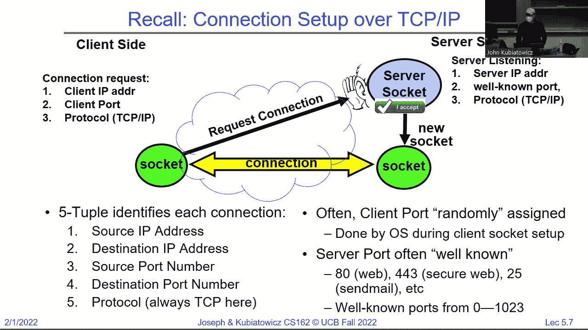
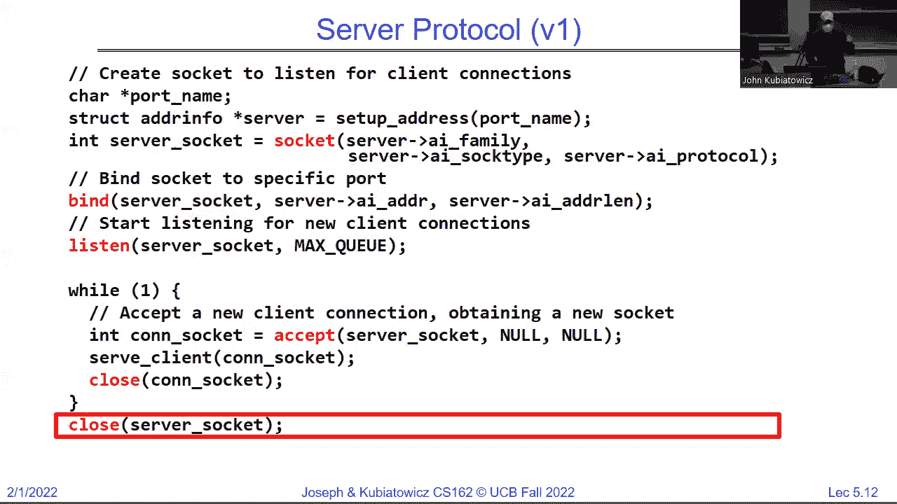
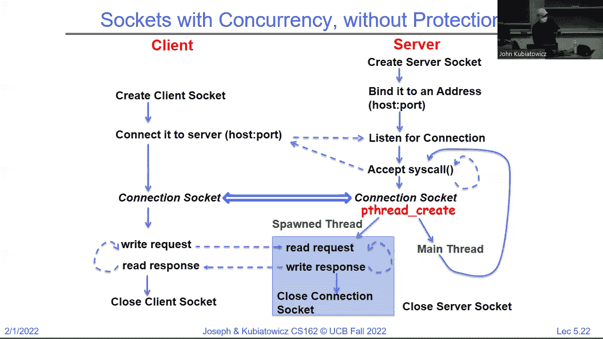
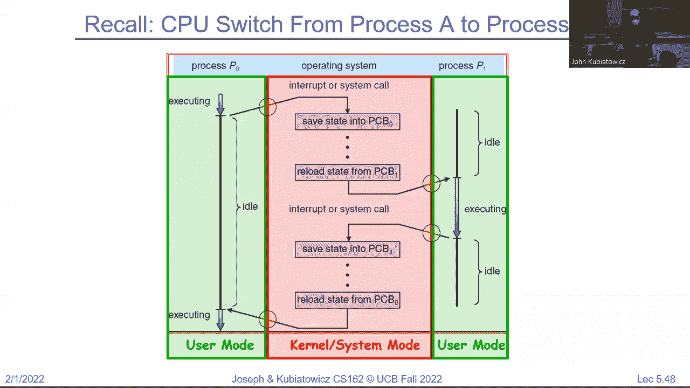

# 操作系统课程 P5：套接字与进程间通信 🖧

在本节课中，我们将学习操作系统中的两个核心概念：**套接字**和**进程间通信**。我们将从“一切皆文件”的Unix哲学出发，理解套接字如何作为通信端点，并探讨如何通过进程和线程来实现并发服务。

---

## 概述：一切皆文件 📁

在Unix系统中，一个核心的设计哲学是“一切皆文件”。这意味着无论是普通文件、设备、还是网络连接，都可以通过相同的接口（如 `open`、`read`、`write`、`close`）来操作。这个接口允许我们将不同程序的数据流连接起来，为进程间通信奠定了基础。

上一节我们介绍了文件操作的基本接口，本节中我们来看看如何将这个接口应用于网络通信。



---

## 套接字：网络通信的端点 🔌


套接字是网络通信的端点，它看起来像一个文件，但实际上代表了网络连接两端的队列。通过套接字，不同机器上的进程可以进行数据交换。


### 套接字的工作原理

套接字通信通常涉及**服务器**和**客户端**两种角色：
*   **服务器**：监听特定端口，等待连接。
*   **客户端**：向服务器的IP地址和端口发起连接请求。


每个成功的连接都由一个**五元组**唯一标识，这使得多个连接可以同时存在：
```
(客户端IP, 客户端端口, 服务器IP, 服务器端口, 协议)
```

以下是建立连接的基本步骤：

1.  **服务器**创建套接字，绑定到地址和端口，并开始监听。
2.  **客户端**创建套接字，并向服务器地址发起连接。
3.  服务器接受连接，为这个连接创建一个**新的套接字**用于后续通信。
4.  双方通过新套接字进行读写操作。



### 一个简单的服务器模型

一个最简单的服务器模型是顺序处理连接：接受一个连接，处理完毕，关闭连接，再接受下一个。这种模型效率很低。

```c
// 简化示例：顺序服务器
while(1) {
    int conn_sock = accept(server_sock, ...); // 阻塞等待连接
    serve_client(conn_sock); // 处理这个客户端
    close(conn_sock); // 关闭连接
}
```

---



## 使用进程实现并发服务 👨‍👦

为了让服务器能同时处理多个客户端，我们可以为每个新连接创建一个独立的子进程。这是通过 `fork()` 系统调用实现的。


### 进程模型的工作流程


以下是使用进程改进后的服务器模型：


1.  主进程（父进程）监听并接受连接。
2.  每当有新连接时，父进程调用 `fork()` 创建一个子进程。
3.  子进程继承父进程的文件描述符，负责处理该客户端的请求。
4.  父进程关闭不再需要的连接套接字，并继续监听新连接。

```c
// 简化示例：多进程服务器
while(1) {
    int conn_sock = accept(server_sock, ...);
    pid_t pid = fork();
    if (pid == 0) { // 子进程
        close(server_sock); // 子进程不需要监听套接字
        serve_client(conn_sock);
        close(conn_sock);
        exit(0); // 处理完毕，退出
    } else { // 父进程
        close(conn_sock); // 父进程不需要连接套接字
        // 可以选择 wait() 回收子进程，或继续循环
    }
}
```

**优点**：子进程拥有独立的地址空间，提供了良好的隔离性和安全性。
**缺点**：创建进程（`fork`）的开销较大，当连接数巨大时，系统资源可能被耗尽。

---

## 使用线程实现并发服务 🧵

为了降低创建并发单元的开销，现代服务器更常使用**线程**。线程被称为“轻量级进程”，它们共享同一个进程的地址空间（代码、堆、全局变量），但拥有独立的栈和寄存器状态。

### 线程模型的工作流程


使用线程的服务器模型与进程类似，但创建的是线程而非进程：

1.  主线程监听并接受连接。
2.  为新连接创建一个新线程。
3.  新线程处理客户端请求。
4.  主线程继续监听。



```c
// 伪代码示例：多线程服务器
while(1) {
    int conn_sock = accept(server_sock, ...);
    pthread_create(&thread_id, NULL, serve_client_thread, (void*)conn_sock);
    // 主线程继续循环
}
```

**优点**：创建线程的开销远小于创建进程，共享内存使得数据交换非常高效。
**缺点**：线程间缺乏内存保护，一个线程的错误可能影响整个进程。同时，大量线程同样可能导致资源耗尽（线程池是常见的解决方案）。

---

## 进程与线程的状态与调度 ⏱️

无论是进程还是线程，操作系统都需要管理它们的生命周期和CPU时间的分配。

### 进程/线程的状态

一个进程或线程在其生命周期中可能处于以下几种状态：
*   **就绪**：已准备好运行，正在等待CPU。
*   **运行**：正在CPU上执行。
*   **阻塞/等待**：因等待某事件（如I/O完成）而暂停执行。
*   **终止**：已执行完毕，等待被清理。

### 调度器与上下文切换

操作系统内核的**调度器**负责决定哪个就绪状态的线程/进程获得CPU使用权。当一个运行中的线程因时间片用完、主动放弃（如调用 `yield`）或等待I/O而被剥夺CPU时，就会发生**上下文切换**。

上下文切换的过程如下：
1.  保存当前线程的寄存器状态到其线程控制块。
2.  根据调度策略，从就绪队列中选择下一个要运行的线程。
3.  恢复新线程的寄存器状态。
4.  跳转到新线程的程序计数器，开始执行。

这个过程必须非常高效，因为它是纯粹的“开销”，会减少程序实际执行的时间。

---

## 总结 🎯

本节课中我们一起学习了：
1.  **套接字**作为网络通信端点的抽象，它遵循“一切皆文件”的接口，通过五元组唯一标识连接。
2.  如何通过**创建子进程**来实现并发服务器，提供了隔离性但开销较大。
3.  如何通过**创建线程**来实现更高效的并发服务器，共享内存但需注意线程安全。
4.  操作系统通过**调度器**和**上下文切换**在单个CPU上实现多个线程/进程的并发执行，管理其就绪、运行、阻塞等状态。


理解这些概念是构建高效、可靠网络服务和应用的基础。在接下来的课程中，我们将深入探讨调度策略、线程同步以及更复杂的进程间通信机制。