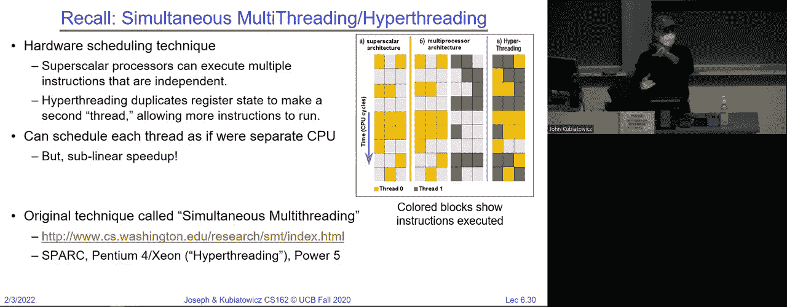

# P6：第六讲：同步 1 并发与互斥 - RubatoTheEmber - BV1L541117gr

好的，大家，欢迎回来。

看看，是不是声音够大？你们能听到我说话吗？好了，欢迎回到第二次面对面的讲座。我希望这是一个习惯。所以，很好。你知道，上次我们讨论了一些并发的基本概念，并开始真正讨论线程如何实现，今天我们会继续这个话题，并希望到今天结束时，你们不仅会对线程如何实现有更好的了解，可能还会...

其实我现在能更好地理解为什么我们一开始需要线程了。那么，让我们看看发生了什么，我的幻灯片会继续播放吗？好的。如果你们还记得上次，首先，提醒一下，我们当时在讨论如何设置套接字进行通信。

关键点是，你会设置一个服务器套接字来监听某个特定的 IP 地址和端口。客户端会通过告知其自己的 IP 地址和端口来请求与该 IP 地址和端口的连接。然后，连接会建立，每一个新的连接都会创建一个全新的套接字，并且每个连接都是唯一的。通过源地址、目标地址、源端口号、目标端口号和协议来区分。

每个连接必须有一个唯一的端口，通常是因为客户端从一个范围内随机选择一个端口。好的。然后，常见端口如 80、443 或 25，通常是从 0 到 103 之间的端口。所以，好了，大家有问题吗？当然，我们之前展示了这个基础的网页浏览器。这个浏览器是使用进程的方式，因此这个监听函数只会执行一次，基本上是在“张耳朵”。

从那时起，我们进入一个循环，接受下一个连接，直到有连接可以接受。我们会创建一个新的进程。这个子进程会处理该连接。注意，我们关闭了服务器套接字，因为我们不再使用它，但是因为 fork，我们得到了它的副本。然后，当任务完成时，我们关闭自己的套接字。

同时，父进程关闭其连接插口，因为子进程将处理这个任务。然后，在协议的第三个版本中，我们不会等待，直接返回并接受另一个连接。我们可以继续进行。这将确保可以有尽可能多的并行连接，数量等于想要这些连接的人数。好了，大家有问题吗？

好的，很好。接下来我们要进入今天的话题。我们首先讨论了每个进程都由进程控制块描述。你知道，这是内核中的一个数据块，用户层无法访问。在这些内容中，还有进程的状态，用来恢复该进程。

如果只有一个线程，这个状态实际上可以嵌入到进程控制块（PCB）中，包括程序计数器寄存器等。正如我们稍后在讲座中看到的那样，如果你有一个包含多个线程的进程，那么通常你会有一个线程控制块的链表，它描述了每个正在运行的线程。我们将在接下来的调度讨论中，花更多时间研究调度器。

然后，在期中考试后，系统决定哪个进程在何时获得CPU时间。还有一个需要记住的点是，调度器还可以分配非CPU资源，比如网络访问或磁盘I/O访问。所以今天我们会更加深入地探讨这种多路复用的概念。如果你记得的话，这是上次的图片，如果我们有两个进程并且它们目前只有一个线程。

进程零、进程一，进程零运行一段时间。在某个时刻，我们会得到一个中断，切换到操作系统中，保存进程零的所有状态，重新加载进程一的状态，然后回到用户级别运行进程一。进程一运行一段时间后，再次得到一个中断，回到内核，保存进程一的状态，恢复进程零的状态，继续执行。

我们就这样来回切换。最终的效果是，我们有两个进程，看起来它们像是同时运行的。好了，我们在Piazza上有过很好的讨论，关于“如果只有一个CPU，为什么还要这么做呢，因为你知道，事情永远不可能同时运行。”你知道的。

进程零在进程一不运行时运行，那么为什么要这样做呢？有没有好的理由？你怎么看？是的。所以，最好的想法是，考虑到这个进程正在运行时，它会因为等待磁盘IO而被阻塞。那么另一个进程就可以运行。

通过确保有多个进程，我们就有了并发的潜力，实际上可以让我们重叠IO和计算。接下来，在这门课的进程中，你会看到，所谓的并发不仅仅是简单的IO和计算的重叠，它还将允许我们分配一个线程。

做一些非常简单的事情，比如从键盘获取所有输入并进行处理，我们完全可以让它自己完成。然后，我们可以去画外星人或者游戏中的其他事情。这两件事可以彼此独立，并且即使只有一个CPU，也能完美运行。好了，单个CPU并不是避免使用多个进程或多个线程的理由。

好的，到目前为止大家都跟得上我吗？顺便说一下，直到大约2002年，一个CPU是标准配置，后来我们才开始有了多核处理器，所以多核处理器在宏观上来看是一个相对较新的概念。尽管或许你们这一代人生活的环境已经是多核的了。还有一些其他有趣的东西，虽然我们今天不会深入探讨，但我们会稍微提到，就是这些交叉点——我们从用户态到内核态，或从内核态到用户态的转换。我将会非常明确地向你们展示这方面的内容，特别是与堆栈相关的部分。

但我认为下次我实际上会在Pintos或一个真实的操作系统中给你们展示，那个转换到底是什么样的，我们还会展示更多的细节。

最后，关于进程的样子，它是如何启动的，我们通过fork生成一个新的进程，它会被放入就绪队列，这意味着它是可运行的。然后我们基本上可以在就绪队列中的任务和正在运行的任务之间来回切换。所以现在在接下来的几节课中，假设只有一个CPU或核心。那样就只能有一个任务在运行圈中，所有其他任务都在就绪队列中。

好的，这将由调度器决定从就绪队列中挑选下一个任务，将其放到运行队列中，然后它们会来回切换。好的，因此你可以在就绪队列中有很多任务，但只能有一个任务在运行。好了，大家有多少人实际上查看过任务管理器，或者做过PSA UX，或者查看过其他东西来看看正在运行什么？你看，你会看到很多很多任务，对吧，数百个。所以它们大多都在某个地方处于睡眠状态。所以。

它们并不是都在运行，因为如果那成百上千的线程都在运行，你就麻烦了。所以请注意，每当某个任务需要执行I/O操作时，它就会被放入等待队列。任务管理器中的大多数任务都在等待。然后，当I/O操作完成后，我们就会回到就绪队列，可以继续分配更多的处理时间，最终我们会退出。

当进程进入终止状态时，我们需要将退出代码传递给父进程或祖父进程，之后我们就结束了。好的，现在需要记住的是，进程的概念是：它是一个包含一个或多个线程的容器地址空间。

左边的单线程进程就是我们以前称之为传统进程或重型进程的那种。今天，大多数操作系统支持右边这种，即在一个进程中有多个线程。好的，每个线程当然都有自己独立的寄存器和堆栈存储。

因为，嗯，这是一个完整的执行线程，它需要知道自己从哪里执行，它需要知道栈指针在哪里，它需要知道寄存器是什么。所以我们必须为每个线程准备空间。另一方面，所有的线程都在同一个地址空间里，因此它们共享相同的代码、相同的数据和相同的文件。好的。很好。现在这些内容有点像是上次的重复，所以我要暂停一下，看看在继续之前是否有其他问题。

是的。所以在子进程的概念中，父进程与线程的关系是，线程通常是比较平坦的。好吧，线程就像是在进程内部。偶尔有一些操作系统会提供更多的细节，但现在我们就把它看作是进程内部的一个平面结构。好的。所以，当然，我们也有这种视图，即线程的共享状态或堆和代码中的全局变量。

每个线程的状态就如我所说，包括栈、寄存器和元数据等等。好的。现在。所以我们来看看并发的核心，操作系统的核心就是这个。好的，我们在这里看到的是循环，我们运行一个线程，选择下一个线程，保存状态，加载状态，然后再循环。好的，我们就这样一遍又一遍地做。

就像我上次讲座的最后开玩笑的那样，操作系统就是这个样子。你全都明白了，下周就可以去参加期末考试，我们就完成了。好的，这是一个无限循环。好吧。现在，你可以说操作系统就是做这些事。好的，嗯，我能把它总结成这几行。现在，有人能告诉我，嗯。

我们是否应该退出这个循环，为什么我们会退出这个循环呢？关闭系统。很好。还有哪里，为什么呢？像是异常，大的异常。蓝屏，死亡蓝屏，对吧。这是另一个例子。现在，另外一个稍微微妙一点的地方是你可能会想，为什么我在忙于运行时，我可能会退出当前运行，去做一些其他事情。

我欠了一些关于中断处理的内容，然后再回来。好吧。所以这是另一种思考如何跳出循环的方式。所以是的，虽然想象操作系统就是这样，但或许我们应该有更多的细节。你怎么看？听起来是个好主意。我们来做吧。

让我们先把期末考试推迟到永远，我就没有期末考试了。那么我们来谈谈这个线程运行的部分，首先我们要考虑这一部分。那么这意味着什么呢？我们必须将线程的状态加载到物理CPU的寄存器中。所以当线程没有运行时，它就待在内存里。所以它是一个线程控制块。它，嗯。

它从哪里中断了，因为你知道它的PC，知道栈指针是什么，等等。但为了真正运行它，你得把它重新加载到CPU中。然后，加载虚拟内存空间，如果我们正在更改进程，然后跳转到PC。现在你在运行了。所以，这里有几个要点，首先是我们必须加载线程的虚拟内存空间。

如果我们要更改进程，这意味着我们必须在内核模式下运行我之前展示的那个循环，以便能够实际修改线程。但当我们开始运行时，我们将跳回到用户模式，所以这里有一些转换，正如你在之前的幻灯片中看到的红色到绿色的转换。

那么，我们如何确保，例如，这个调度器循环在运行线程一段时间后，能把控制权交还给操作系统，去选择下一个线程并运行它呢？这是一个重要的问题。我们该如何做呢？有人知道吗？是时钟中断，对吧？现在，多少人去过计算机博物馆？我不确定。

也许你在父母的房间里找到过1980年代的Macintosh。你知道吗，操作系统以前并不是那么稳定。你会加载很多程序，它们会出现在屏幕上。你看到的情况是，这很好，直到其中一个崩溃，接着整个系统崩溃。所以，一个冻结的应用程序实际上会让整个系统冻结，这就是那个问题。

这里解释得非常清楚。并且，由于它会运行一个进入无限循环的线程，而永远不会返回操作系统，因此没有办法重新获取控制权。好了。所以，今天我们将详细讨论的定时器是我们必须小心使用的东西。

好的，我们必须以某种方式确保它正确发生，以免因为bug而卡住。然后，然而，其中一种方法是我们不会依赖定时器。我们来谈谈那个Macintosh是如何工作的。这就是我们所说的内部事件，在这个过程中，进程运行一段时间，然后它会说“让步”。这意味着，好吧，操作系统，轮到别人运行了。

所以，早期的操作系统依赖于“让步”这一概念。它是一个过程，运行中的应用程序会定期说，“好吧，轮到别人运行了。”于是，是否能够正确运行并有效地多路复用，关键在于你是否在其中插入了足够的让步语句。你是否曾经触发过让步。好吧，这些就是我们所说的内部事件。

外部事件是定时器中断的这个例子。好吧，接下来我们来谈谈内部事件。除了显式地让出控制权，你可能实际上会尝试执行像是读取文件这样的 I/O 操作。在这种情况下，你将控制权交还给操作系统，操作系统可能会决定在这个时候重新调度其他任务。

好吧，一个原因当然是我总是知道一个长时间运行的进程需要很长时间。你倒不如让别人先去。另一个原因是，他们决定将这里的任务拆分开来，所以我将利用这个机会切换给别人。好吧。所以，让我们说个简单的经验法则。我想我在两天前给你们讲过这个，关于访问一个物理硬盘需要多少指令。

有人记得吗？百万，嗯，百万是个不错的数字。好吧，正负几个数量级。我们就像天文学家一样说点话，但我们会用指令来谈论它。所以这对黑色的非常重要，我将让别人运行。另一个例子可能是，如果某个给定的应用程序在运行时。

它将等待另一个线程的信号。它会进入操作系统并说，我现在做不了任何事情，让别人运行，直到我等待。然后让出控制权，当然就是我刚才提到的那个。如果你看看这里。

这里是我们如何创建一个计算圆周率的版本，它可能实际上与其他程序兼容。对吧？所以在一个无限循环中，我们计算下一个数字，然后让出控制权，计算下一个数字，再让出控制权，只要我们继续这样做，那么我们就知道系统中的其他应用程序可以继续运行。即使是在一台旧的 Mac 和触摸设备上。然后，有人看出这个特定语句中的缺陷了吗？嗯。

不，你正在计算下一个数字，所以你会让出控制权。是的。是的，每个数字，如果你曾经，我曾是那种喜欢想出计算圆周率方法的人，我的嘴巴也静音了，所以我看了很多算法。问题是，如果你计算每个下一个数字，花费的时间会越来越长，越来越长，越来越长。所以这段时间可能有效，但最终你知道，你会在让出控制权前等上好几天，因此这可能不是一个特别好的例子。

但现在我们将使用这个来更好地理解堆栈的工作原理。让我告诉你为什么我提到堆栈，如果我们有两个应用程序在运行，并且它们之间切换。它们各自有一个堆栈。这些堆栈必须以某种方式协调和清理，因为我们在处理器上加载和卸载内容，所以让我们看看能否稍微窥探一下这个过程。

所以我们开始了。我们计算了π的一些数字，然后执行了yield。那么，这里使用的青色部分表示的是用户级别的代码。它是用户代码执行的，用户代码正在执行π的下一个数字。然后yield会通过一个系统调用进入操作系统。好的，现在。为什么它是一个系统调用？这就是为什么yield需要是一个系统调用。是的。现在是这样。

我们假设，要切换到另一个线程，我们必须进入内核。那么，为什么我们知道在调用内核时，栈会发生什么呢？这是什么情况？嗯，状态需要被保存，那栈呢？我们是否相信用户在进入内核时会有一个有效的栈指针？

基本上，我问的任何问题都是关于我们是否信任用户，你的回答是“哦，对，好的”。所以我们必须做的事情之一，在那个转换过程中，当我们进入内核时，我们会切换到一个内核栈。这个内核栈不一定与原始的用户栈是连续的。所以有一个用户栈，还有一个内核栈。这两者在当前进程中是紧密联系在一起的。

一个用户级进程总是会同时拥有一个用户栈空间和一个内核栈。我们可以把它们看作是绑定在一起的，因为发生的事情是，从用户模式到内核模式的转换，伴随着将栈切换到一个已定义的内核栈，我们知道它是好的，因为我们已经进入了操作系统并且验证过它。

好的。我们基本上是将用户状态存储在内核栈上，所以这就是为什么它说是“内核让步”。这个系统调用，实际上就像一个跨越到内核的过程调用。

保存返回时的状态。这样，当我们从这里返回时，会返回到用户级别。但实际上，这意味着我们必须设置好返回陷阱的操作，它将恢复用户栈。好的，但我们可以把它看作是用户调用进入了内核，然后会运行新线程。接着，它会调用切换操作。好的。

我们接下来需要讨论的是“switch”是怎么回事。但目前为止，我们所做的只是计算了一个π的数字。我们执行了yield系统调用，这让我们进入了内核，我们切换了栈。然后执行了“run new thread”。这里的“run new thread”是一个过程。它做了什么呢？嗯。

它选择了一个新的线程。考虑到它叫做“run new thread”，这也挺合理的。然后，它执行了这个切换操作。这个切换操作本质上是将当前线程和新线程进行交换，保存当前线程的状态到其线程控制块，并从新线程的控制块加载到硬件中。

然后是寄存器。接下来我们可能会做一些清理工作，比如追踪上一个任务运行的时间等，这样我们之后就能获得统计数据。好的。那么，切换是怎么发生的呢？嗯，你需要保存新线程可能会破坏的内容，比如程序计数器寄存器、栈指针，然后保持每个线程的隔离。这样我们就不会互相重叠了。我们必须确保这一切能干净利落地完成。好的。

所以我想在这里暂停一下，确保我已经讲了很多术语，而且我展示了这种栈结构，接下来我们会多次使用这个结构，所以我想看看大家是否理解了。现在可以提问了。是的，事实上，每个进程，甚至每个线程，都会有自己的内核栈。

所以并不是只有一个内核栈。每个用户线程都有一个内核栈。好问题。这就是为什么我们可以明确地将它们视作配对的原因。其实并不难。当我切换到一个新线程时，我也会得到一个新的内核栈。是的。那么你们可能会问，TCB（线程控制块）存储在哪里？TCB存储在进程控制块中，每个进程都有一组线程。

好的，这是一个答案。另一个答案是，当我们深入了解时，你会发现内核栈是为每个K分配一个独特的内存页。

这块页面的一部分是TCB，其余部分是内核栈，这些总是一起分配，以保持整洁。好的。所以现在只需把TCB看作在内存中的一个独立位置，并且它和进程控制块相连接。

好的。其他问题吗？那么，聊天室里，能否向正在运行的进程注入代码？讲的是即时编译机制如何工作的。答案是，如果你在那个进程中，并且你是该进程中的一个线程，那么你有可能注入代码。稍后我们可以再讨论这个问题。

但通常代码块是显式设为只读，除非我们允许即时编译（JIT）。所以就是这样。还有其他问题吗？是的。用户。那么这里有两种方式来看待这个问题。问题是，内核线程和用户线程是如何相互关联的，对吧？一种答案是，它们实际上只有一个线程，因为你要么在用户级别运行，要么在内核级别运行，永远不会同时进行。

好的，答案是它们不是两个独立的线程，它们实际上是一个线程。好的。现在有很多术语，即便是我自己也会使用，因为它们是标准术语。我们在这片红色区域运行时，我们在运行与用户线程关联的内核线程。

这有点让人困惑。但现在只需要把每个用户一半的内容都附加到我们的内核一半，并且你在其中一个中运行。暂时保持这种方式，我们以后会更精细地处理，但我认为至少在接下来的几周里，这是最简单的思考方式，明白吗？

很好的问题。好吧，我们继续。大家明白我说的意思了吗？我们在这里展示给你们看上次的情况，但计算机正在运行，然后它调用 yield。接着它调用 kernel yield 进入内核，然后调用 run new thread，再调用 switch。

好的，我们不知怎么的，必须将这个转化为切换到下一个进程。那么栈到底是什么样子的呢？我暂时忘记计算机的部分，我们来看一个更简单的例子。如果你看这里，有一个程序，A 调用 B，然后程序 B 说 while true yield，它就在一个循环中一直 yield，所以这是一个终极的什么都不做，只是不断 yield。

好的。所以，假设你有两个线程 s 和 T，它们看起来是怎么样的呢？这里是线程 s。所以，这里是一个函数 A 调用 B，而 B 是一个 while 循环。B 调用 yield，yield 进入内核并进行切换。好的。现在我们切换到哪里呢？这是线程 s，线程 s 和 T 正在运行，我们得切换到 T。

所以这里有个魔法。它把线程 s 的所有寄存器保存到线程控制块中，并将来自 T 的控制块中的寄存器加载回硬件中。那些寄存器之一就是栈指针。所以，当我们切换栈指针时，我们就脱离了这个图形，突然进入了另一个图形。因为我们切换了栈指针。明白吗？而且因为我们切换了栈指针。

我们还在 switch 中，但我们在 switch 中。我们在 switch 的栈帧中，来自上次线程 T 切换的栈帧。所以当我们从 switch 返回时，我们会返回到 run new thread，之后会返回到用户模式，然后会从 yield 返回，接着进入 while 循环，然后它会调用 yield。然后会调用 run new thread，再调用 switch。

这将切换栈指针，现在我们回到了另一种方式，并且会来回切换。现在我们有两个什么都不做的线程，但它们的复用表现得很不错。好的，现在我要暂停一下，因为这个要么是显而易见的，要么是让人疯狂的。我遇到过两种情况。所以，如果你是那种觉得这让你抓狂的人，随时可以提问。没问题。

好的。好的。我喜欢这个问题。那么问题是，这个只有在**线程T**已经在运行的情况下才有意义，对吧？但是如果**线程T**还没有运行，这就没有意义了。好吧。是的，没错。所以它必须已经准备好了。接下来几张幻灯片中，我们将展示如何设置一个全新的**线程T**，使其仍然能够与这个模式兼容，并且看起来像是已经在运行了。但当我们切换到它时，它会自动启动，看起来就像这样。好的。

所以我建议大家现在暂时不要担心我们是怎么到这里的。只要担心我们在这里做什么，我们稍后会讨论如何启动它。但这是一个很好的观察。好的，只有当**线程T**已经在运行并且已经执行了切换时，你才会明白这能正常工作。好的，另一个问题。

是的，后面。不是，我们得切换所有的寄存器，因为我们从一个线程的运行切换到另一个线程的运行，这是一种虚拟化。线程本质上，拥有所有的用户级寄存器。好的。所以我们会切换它们，实际上，我会在一会儿展示一段汇编代码，演示如何切换。

好的。是的，继续。嗯，在这种情况下，栈的大小将保持不变。因为注意到我们看这个代码时，这段代码表示**B**执行时，**while**执行了**yield**。然后过了一会儿，我们将从**yield**返回并再次调用**yield**。所以我们从**yield**返回意味着我们已经跨越了这个边界。

这就缩小了栈。所以我们一直调用调用调用调用调用，一直到最底层。然后最终，即使是切换之后，我们会返回，返回，再向上回溯。然后我们再调用下去，所以这个特定的例子，只是做了一个无用的示范。栈向下增长再向上增长，你知道的。

一直在增长然后收缩，增长收缩，增长收缩，一次又一次，最终的效果是它们不会变得比这更大。好的，问题很好。是的。啊，那么问题是，为什么**线程T**和执行相同代码。想象一下，这就像一个很好的例子，程序在磁盘上，或者应用程序就像一个原始进程，当它加载到内存中时，它就变成了一个进程，并开始运行。

你可以做很多次，所以没有理由我们不能编译这个程序，先在磁盘上启动它，然后启动**S**和**T**作为它的两个实例。好的。好吧，其他问题。好的， 这有点像魔法，对吧？让我们来看一下。这通常被称为上下文切换。所以我们正在保存，我们正在切换线程，切换当前线程和新线程。

所以这是什么意思呢？意思是当前线程的TCB。我们，我们卸载物理寄存器并将其存储回去，包括这个堆栈指针，也许还有返回的PC，所以这就像是RISC-V版本的这个操作。然后我们从新线程加载所有寄存器。接着我们执行返回操作。

那么返回的是什么？返回说明，我将从这个切换函数调用中返回，但我是根据我刚加载的堆栈和寄存器来返回的，所以我返回的方式就像T当时运行时那样。好的，这就是为什么它看起来像这样。好的，你知道我们下去了下去了下去了，然后我们切换回T。

然后我们返回，返回，返回，返回，返回，但现在我们在T堆栈上，然后我们一路向下向下向下向下再切换，返回，返回，返回，返回，返回，返回，返回在S堆栈上，然后来回切换。所以这看起来这么奇怪的部分原因是我们实际上改变了堆栈指针。

所以我们有点改变了执行的局部性，转到了另一个线程。相信我，这是个值得在派对上深思的话题，任何时候你都可以在派对上大放异彩，像是“我能告诉你我今天课堂上学到的一些很奇怪的事情吗？”但是我发现，有时只要稍微思考一下这个问题就有帮助。还有其他问题吗？有。

再来一次。你在问的是这段代码是否在执行不同的地址空间吗？所以答案是，在这个简单的例子中，我们没有改变任何地址空间，所以可以把它想象成是两个线程在同一个地址空间中。

好的，因为如果你看一下，你知道这个切换操作并没有改变任何翻译页表等内容。再来一个，嗯，线程如何访问线程T结构呢？答案是我们进入内核，而内核有权访问所有内容。所以这些TCB是在内核空间中存储的，因此它选择一个，选择另一个。

所以这里没有安全漏洞。是的，只有一个内核，一个内核统治一切。好的，这些是小环。是的。只有一个内核。一个内核。

只有一个内核，但是内核是运行在系统级别的代码。所以只有一个内核，我们进入内核，我们出来，我们再进内核，我们再出来。一个内核统治一切。只有一个内核。所以T和S有相同的内核。现在，T和S有不同的内核堆栈。

但它是一个内核，所以实际上看，看到这里的代码了吗？这是一个在内核模式下运行的子程序。它正在访问，你知道，S是T的TCB，然后T是T的TCB。所以，记住内核在做什么，内核是那个生成这个虚拟机视图的东西，线程们就是在这个视图中运行的。所以它把本来只有一个CPU的情况变成了看起来有很多CPU的样子，但实际上它是一个内核。

很多线程。很好。好的。所以，只有一个内核，多个内核栈和/或线程。好的，因为内核栈实际上是由一些内存块定义的，所以拥有很多内核栈并不难。好的，那我继续吗？我们没问题吗？好的。那么，如果你犯了错，看看这个是一个相当简单的例程。如果你搞砸了会发生什么？比如你忘了一个寄存器。是的。泄露数据。或许是的。

但情况比这更糟糕。所以泄露数据，某种程度上，属于隐私侵犯，这是不好的。但它比泄露数据更糟糕。是的。所以，你知道，系统不会以什么方式超载。那有谁想尝试一下，如果你没有正确切换会发生什么？但是。嗯，系统崩溃了，或者更糟糕。它会悄悄地搞乱一切，而你不知道发生了什么。

好的，因为这些寄存器。有没有人看过编译器的输出？所以，你知道，这是一个非常简单的事情。你应该有时看一下。这里有很多寄存器优化。寄存器的使用方式非常复杂。如果我们忘记保存或恢复一个寄存器。

也许那个东西一开始运行得很好。但它会在一些非常微妙的方式上开始失败。因为线程的整个概念。它自己的 CPU 寄存器，每次运行时都要保证是好的，当你将某些东西放入寄存器时。下次再查看时，它会在那里。但如果我们搞砸了切换例程，完全有可能我们把某些东西放入寄存器，然后切换到 s。

我们搞砸了，当我们回过头来寻找那个东西时，它并没有正确出现。现在我们可能遇到崩溃。如果幸运的话可能是崩溃，但也许我们遇到的是更糟糕的情况，那就是计算被破坏了。

然后我们要谈到切换。切换是很重要的。好。并且。更有趣的是，你可以认为，内核中最重要的事情就是你必须把切换工作做好。

你能提出一个详尽的测试来验证切换例程，确保你永远不会忘记任何东西吗？那将是指数级的，而且你永远无法搞清楚，所以你得仔细盯着它，然后让你的朋友盯着它，然后再让你朋友的朋友盯着它。

幸运的是，我们不会要求你在这门课上写太多切换代码，因为那可能会触发我们的作弊检测，如果你写得太多的话。所以下结论就是，切换很重要，你得小心它。好的。我总是喜欢讲一个警示故事，它很有趣。那时候有一个内核，叫 Topaz。那是在过去，单条指令的差异能产生巨大的影响，因为你可以想象，切换的开销是很重要的。

所以，有人很聪明，成功地在切换例程中节省了一条指令。然后他们做了文档记录，写了一大段注释，解释说只要内核的大小不超过一兆字节，这样做是可以的。好的，然后几年后，人们忘记了这些注释，他们没有读这些注释。所以他们只是添加了一些东西，内核变得足够大，不再是一兆字节的大小，突然间一些奇怪的事情开始发生了。

你能想象一下吗？你的内核运行得很好，你调试了一下，突然它完全崩溃了。好的，所以你得非常小心切换例程。顺便问一下，多少位？他们处理的地方，一个兆字节有多重要？快点。好。你应该知道这些。这很好。你知道，这可以成为一个派对把戏，对吧？我知道我的二次方。

在这节课上，我将给你们提供很多非常好的社交建议。你听我的，这将会非常棒。所以，项目一已经全面启动，昨天发布了。你应该开始做了。好的。项目一的第一部分作业将是一个设计文档。我们会给你们一些设计文档应该是什么样子的基本草图。

但是，你知道，想想设计文档是你交给老板的东西，用来解释你的高层次概念。如果里面有代码，应该是伪代码，而不是直接丢出50行C语言代码。这里是我计划做的事情，因为重点是“这是我们计划做的事情”，而不是“我们写了50行C语言代码”。所以，你知道，设计文档应该是对你所做工作的高层次描述。好的。

现在这里的悖论是，如果你需要为设计文档写代码，比如伪代码，尝试用一种你的助教能轻松理解的方式描述。好的。你现在有一个固定的讨论课，因为我们做了小组作业。所以，你应该参加你固定的讨论课，时间是星期五。好的。

这将是你们第一次做这个。我们希望你们来，这样助教们可以认识你们。如果你生病了，就不要来了。这对这里的讲座也是一样的。如果你生病了，我们有解决办法。好的。那么，有一种方法可以弥补缺失的讨论课，你可以通过这个方法找到解决方案。

我认为我们在Piazza上有相关信息。我们还会有轮流的讨论课组长录制讨论会的内容，这样每周的讨论会都会有录音存档，方便你们复习和学习。

好的，期中考试将在两周后的今天进行。好的，时间是七点到九点。我们需要你尽快填写冲突情况，这样我们才能确定如何处理冲突。我们明天会处理这件事，已安排在日程上。好的，考试内容基本涵盖了期中之前的所有内容，包括之前的讲座。

里面可能有一些内容，虽然不会作为重点测试。但好的，Anthony 指出，或许我们会要求你在项目一中做一些切换的工作，所以你们会稍微体验一下。有什么问题吗？那么，我们马上开始，我们现在就开始上课，有多少人实际上已经开始做项目了，加载并查看了项目？

所以对于那些在网上的人，大家举手了吗？他们真的很在行，所以你们也应该做到这一点。好了，那么在这些之前的例子中，我们有在切换上下文吗？我称之为上下文切换。之前我们大致说过上下文切换是进程间的切换，所以当你说上下文切换时...

你需要明确了解你从“好的”状态切换到什么，所以如果你在同一个地址空间内并且在各线程之间切换，那就是我之前给你举的例子。好的，这比切换地址空间要便宜得多，事实上这里有一些数字，能给你一点感受，从 Linux 来看。

比如说，它们每 10 到 100 毫秒就会进行一次上下文切换，进程之间的切换大约需要三到四微秒，而在一个进程内部，线程之间的切换仅需 100 纳秒，速度更快。好的，为什么会这样呢？因为线程切换只需要更改寄存器。

你实际上需要切换地址上下文并刷新它。所以我想在这里给出一些术语，以确保大家在同一页面上，如果你注意到，我们在谈论的是每个内核线程对应一个用户线程，这可能是个让人混淆的术语，我想确保大家都理解。实际上是每个内核栈对应一个用户栈。好的。之所以称它为内核线程，是因为这是为用户线程的下半部分在内核中运行时预留的空间。

但还有其他几种选择，下面是一个例子，我们可以在用户级别多路复用一堆线程，并在底层使用一个内核线程。所以最初的 Java 就是这样，你启动了很多线程，但底层只有一个内核实例。

而且库会完全在用户级别多路复用寄存器。只要它正确执行 `yield` 操作，那么你就可以在用户级别完全运行等同于内核调度程序的操作，这比任何操作都便宜，因为你甚至不需要进入内核。

好的。有人能看到这个模型可能有哪些缺点吗？记住，我们现在是在一个进程内部运行线程，所以最坏的情况是一个bug，而不是安全漏洞，对吧？还有其他人有什么想法吗？是的。那么，记住，我们假设内核是没问题的，或者代码是好的，所以并不是说这些模型中的某个会让你搞砸，但重点是……

如果这些用户线程中的任何一个在内核中睡眠，并且我需要它们时，它们都会被挂起，因为只有一个内核线程。所以你可以把内核的一半看作是去睡觉的地方。好的。最后但同样重要的是，你可以有多个线程和多个内核线程，并且你可以对它们进行多路复用。我们其实是在讨论这个特别简单的模型，顺便提一下。

因为Linux已经变得相当便宜。所以，Linux中的默认线程模型基本上是左侧这个模型。很好。那么，开始吧。既然我们都已经对堆栈很熟悉了，那我们来看看当你不执行yield，但却忙着执行IO时会发生什么。假设你在执行复制文件的例程，你做了一个读取操作。

这个读取操作必须进入内核，所以系统调用会进入内核。对吧？它会进入内核栈，执行内核读取操作，实际上我在几节课前给你们展示过那个代码。好的，做了一些设置，比如准备好磁盘，但现在我们需要切换到另一个线程，因为我可能有百万条指令需要执行，对吧？

所以在这里，我们调用`run new thread`并执行切换。这个例程通过调用`read`隐式地执行了yield，然后`read`执行了它的任务，但随后执行了切换，现在我们会运行其他的东西。好的，堆栈看起来完全和我们之前给出的示例一样。好的，对于线程间的通信，比如信号、连接和网络，所有这些都是相似的。

注意，现在我们可以说，不管是什么原因导致你要进行切换，是因为`yield`，还是因为IO。它都能正常工作，切换会让你继续执行另一个线程。那外部事件呢？好的，那么如果一个线程从不执行IO，不等待，也不调用yield，结果会怎样呢？我们说过，这实际上是早期版本的Macintosh，甚至微软Windows的一个bug。所以，问题在于，如果计算进程从不调用yield，从不输出任何内容会怎么样呢？

我们需要一种方法让调度器获得控制权，这就是外部事件的作用。最简单的思路是，我们设置一个定时器，它会产生一个中断，这个中断会让我们进入内核，到那时我们就可以进行调度并执行切换。

好的。但原则上，我接下来给你展示的这个定时器工作原理，对于任何中断都适用，比如网络数据包到达时可以重新获得控制。好的，在这里，你只需要确保外部事件足够频繁地发生，这样就能确保你正确地切换。

所以如果你记得的话，我给你展示过这张图，所以我不会深入细节，但中断再次发生。它们来自外部，包括定时器。它们生成一个物理信号，导致CPU跳转到中断向量。好的。现在你已经下载了进程代码，你就可以查看这些代码了。

开始第一个项目。

好的。那么，这是一个网络中断期间发生的例子。提醒一下我们之前并没有明确讨论过这个，但是这里我正在执行。好的，这有点像RISC-V汇编语言，仅仅为了举个例子。当中断发生时，内部中断会告诉处理器停止执行。所以。

这是一个管道刷新，清除部分执行的指令。它保存程序计数器并禁用中断，进入内核模式，内核模式运行。然后它执行例如将网络数据包从硬件传输到内核缓冲区的工作。如果你有一个正在运行的进程，比如我们上次展示的Web服务器代码。

它执行了一个来自网络的读取，可能在这个时刻它会变得非常快，通过查找并从等待队列中移除，然后放回到就绪队列中的绿色部分。所以，回到所有的流程，用户进程继续运行。所以中断背后的想法是，它是对正在运行的任务的临时中断，用于执行其他任务，然后再回来。我们可以用它来帮助我们切换的方式是，当我们处于这个绿色区域，执行中断处理程序部分时。

在那时，我们可以进行切换并让其他进程开始运行。这里是一个例子，我正在忙着做某事，不管是什么。定时器中断发生了。所以我调用，你可以把中断看作是调用进入内核。但是它是一个强制性的调用，用户什么都不做，中断强制你从用户模式进入内核。

好的，那强制操作到底做了什么呢？它放置了一个内核栈。好的，现在那个内核栈中，我们运行中断代码，其中的一部分最终会调用`run new thread`并进行切换。现在我们可以将其他任务切换进来，我们刚刚展示了如何通过定时器中断确保我们定期切换。谢谢。这是一个例子，你知道我们的定时器中断可能会进行一些周期性清理工作，并执行其他任务，然后调用`run new thread`。

好的，问题。好的，是的。这个问题很好，解释一下红色部分是你在这里问的内容，那么当中断发生时会发生什么。首先，在这张图中，你可以看到的是禁用中断位。

它启用所有的中断，直到 CPU 能够清理当前的中断并禁用那个特定的中断，然后准备好处理其他中断，最后再重新开启中断并继续执行。所以首先会立即禁用所有中断，这样我们就会陷入一个死循环，硬件会不停地重复触发中断。

而实际上发生的情况是，我们进入时会把所有的中断都关闭，这个操作是在硬件层面完成的，然后我们禁用那个特定的中断，接着我们可以再次开启其他中断。

所以，你可以用不同的方式来处理这个问题。问题是，难道我们不应该在最后才重新启用中断吗？那样就会总是重新启用它们。但你可能想重新启用一些更高优先级的中断，它们可能比当前处理中断的优先级更高，更加重要。

好的。我们可以稍后再讨论这个，我不想在这个问题上分心太久，但你应该已经明白基本的概念了。我们可以理解为，这就像是提高中断的优先级，系统只会处理那些真正高优先级的中断，而不是当前我正在处理的那个中断。

好的，明白了。还有其他问题吗？我认为今天讲座的关键是，你可以用多种方式实现切换。好了，如果你在内核中设计了堆栈的工作方式，那就能轻松处理各种外部和内部事件，确保它们能够唤醒内核调度器，从而保证系统的正常运行。

到了那时，你就能看到内核中切换例程是如何运作的了。你会明白它是如何实现的。好了，我想下次或下下次（我还没有决定具体时间）我会给你们展示一个 x86 的堆栈结构，并让你们了解它是如何工作的。

好的。那么这个思路是这样的，只要我们能够到达这个切换点，我们就可以交换出当前的内容。好了，还有其他问题吗？我可以继续吗？接下来，让我们来讨论之前提到的问题。那个 S 和 T 的例子没问题，但它假设 T 已经永远在运行。那么我们来谈谈我们可以大致称之为线程派生（thread fork）的概念。记得上次我给你们讲过 p 线程的 API，在幻灯片上有提到，比如 `p thread create` 等等，但暂时我们就称之为线程派生吧。它是一个用户级的程序，用来创建一个新的线程。线程派生的参数是应用程序的执行例程的指针，以及它的参数和需要的栈大小。

这与 fork 的不同之处在于，记得 fork 会给我们一个全新的保护上下文，并且会复制一切。

我们不能把指针传递到别人安全上下文中，因为那样是不可靠的。所以这就是为什么只需要说我们将精确执行到我们之前的状态，并给你一个全新的安全上下文。如果我们处于一个线程进程中，并且正在创建新线程，我们当然可以给它一个指向例程的指针，那么线程就会说，嗯，在新线程中运行这个函数。

好的，先来看指针。接下来是参数。然后我们来计算栈的大小。好，接下来我们该怎么做呢？我们会进行一些合理性检查，确保不会搞错任何事情。我们将再次进入内核模式进行合理性检查，只是为了确保用户给出的不是完全垃圾数据，然后我们会分配一个新的栈，并初始化TCB（线程控制块）。

将它放到就绪列表中，准备好并且我们可以继续。但请记住，我们需要以一种方式进行操作，一旦我们将其放到就绪队列中，尽管它之前从未运行过，它看起来就像是已经运行过的，这样我们就可以切换到它，而不需要更改我们刚才讨论的任何内容。好的，这就是我们的目标。就像ST ST一样。

我们希望能够在T第一次运行时做到这一点，为了做到这一点，我们必须稍微伪造一下，让栈看起来就像它已经运行了很长时间。好，大家都明白了吗？那么我们该怎么做呢？我们会这样做。

我们需要获得一个新的TCB，因为这是一个全新的线程。我们需要初始化一些字段，如栈指针，指向栈的指针，程序计数器（PC）返回地址，指向我们可能称为线程路由到的参数寄存器，也许是函数和函数指针、参数指针。

那我们该怎么处理栈呢？通常我们不需要对栈做太多操作。最少我们可能只需要将返回地址放在那里。但除此之外，不需要其他设置。不过，我们希望做的是伪造它，使得当我们切换到它时，栈会创建线程。我们要以某种格式将它放置，以便切换到它时能够正常工作。

系统认为它已经运行了很长时间，但实际上发生的情况是，它就在那一刻创建了一个新线程。好，诀窍是，当你切换到线程T时，你会返回那个点。

所以我们真正需要做的就是设置新线程控制块中的返回地址，这样当我们返回时，我们就不是返回到已经存在的地方，而是返回到线程的起始位置。这样就能启动一切。

好的，接下来这是思考的方式。这里是另一个线程。这个存根是我们刚刚制作的线程控制块（TCB），我们可以通过相同的切换代码切换到它，但当我们到达这里时，它实际上开始创建线程。就在那个时候。为什么我们能做到这一点呢？因为它将切换到一个新的栈，这个新栈上有一个返回地址。

如果我们执行返回，就像切换到这个时一样，我们就像是在底部那样做返回，所以我们设置它，当我们做返回时，它会执行我们想要的内容。

好的，你可以这么理解，我们通过设置 TCB 中的寄存器来设置新的线程，包括设置新的栈指针，设置一个返回地址指向线程路由，以及一些其他的东西。然后当我们切换到它时，它会先执行返回，然后代码会执行线程路由，不管那个具体是什么，用来设置线程。

好的，暂停一下。是的。你能再大声一点说吗？对，所以我们会为新的栈分配空间。我们会分配栈空间，然后分配线程控制块（TCB）。接着，我们会把栈的顶部指针放到 TCB 中的栈指针里，这样当我们加载 TCB 时，就会有一个新的栈指针指向新的栈。

另外，我们需要做的唯一一件事是设置，当我们执行 switch 语句末尾的那个返回时，它能够通过执行线程初始化例程的开始来返回。好，再次强调，这是一个需要仔细思考的事情。好的。

再快速说一下，好的。现在是线程路由，这里我会展示什么是线程路由。

好的，给你。它是一个接受函数指针和一些参数的东西。它做一些启动时的家务事，比如设置一些零值、一些计数器等等。然后它进入用户模式。接着它调用带有参数的函数指针。如果该函数最终返回，它会调用线程结束函数，关闭所有内容。好的。

所以这其实很简单。启动时会有一些家务记录，像线程的开始时间等等。所以如果你在线程路由开始运行后查看栈，我们就会看到这一小段，它是用户内核模式。然后它调用线程代码，就在这里，我们调用函数指针。好的。所以到那个时候，我们会有一个新的栈帧，这是我们想要的函数的开始。

从那时起，它将正常工作，因为无论我们是通过让渡控制，还是遇到中断等方式来切换，现在所有的过程都在进行。所以唯一的“魔法”其实是第一次达到这个例程的开始并执行它，从那时起，它就像我之前说的那样正常工作。

所以在线程T的情况下，最初发生的事情是有一个线程路由。它做了一个用户模式切换，调用了函数a。然后它得到了这个栈，开始执行，最终我们会进入内核，在让出控制权和切换之后，我们会转到其他地方执行。好了。那么这里有个问题，用户模式切换到内核模式是什么样子的，反之又是什么样的呢？

这是不是一个标志，因此它是一个处理器标志。记得我们在第一天和第二天时讲到过双重模式。硬件中有一些东西可以指示你是在内核模式还是用户模式。进入内核模式到用户模式很容易，因为没有安全性违反，内核一统天下。进入用户模式到内核模式时，我们就需要小心了，我们上次说过这个。

不，几次之前。是控制。所以你可以通过系统调用做，也可以通过中断做，但它必须通过一个向量，进入内核模式之前有一段定义好的内核代码。好了。所以那就是受控进入。好，好的。问题吗？是的。

很好的问题，你在这里讲的关于调用的部分。它怎么知道把东西放入线程栈而不是内核栈，是你问的吗？这是个好问题，知道这个函数调用为什么能使用正确栈的原因是我们设置了线程路由，使得第一次切换到它时，它能获得指向新栈的指针。在栈寄存器中，这就是这个操作的魔法所在。

注意，在这里我们把新的栈指针设置到TCB中。所以这一切的切换会加载它。

好的，我们从现在开始就有了新的栈。所以从那时起，我们只是在正常执行，它使用栈，因为它有栈。

好的。是的。嗯，每个线程只有一个栈。嗯。它必须有，既有内核栈，也有用户栈，但它是一个栈。没有所谓的执行栈和其他栈的区别，只有栈。所以，栈。所以我们并不是在存储这个栈。所以我们在这里的函数。

我们不是在栈中执行这段代码。这段代码在代码块中，我们是通过栈来执行这段代码的。所以这表示所有存储的变量。是的，如果这之前让你感到困惑，我很抱歉，这本来应该是个好问题，如果你困惑的话，我们在说这件事的时候。

每次函数调用都会分配一个新的栈帧。这里的意思是有一个栈帧，但里面没有存储数据。所以实际上，唯一存储的内容将是返回值。好的。抱歉，感谢你提出这个问题。

是的。问题是，是否合理假设每个线程的路由都像这样。是的，那是对的。当然，这将取决于操作系统的实现，但我在这里说的每件事都会在每个线程启动时发生。

好的。那么，让我稍微谈一下进程与线程的区别，我们只有一个核心。

你可以把一个核心看作是在来回进行复用。每个进程可以有多个线程，这样你就可以开始看到我们如何在同一时间执行多个任务。然后，我们有两个引号，尽管我们只有一个 CPU，因为我们只是来回切换。好了。现在，从这个概念来看，多核并不比这个复杂。真的。

我们只是有一堆核心，每个核心都可以像我们谈论的那样调度，现在你可以在这个案例中，实际上同时运行四个任务。然后调度器可以选择将一个线程从某个核心移走，给另一个线程，因此调度器有多个物理进程。

处理器可用。

好的。然后当然我们讨论了同时多线程技术。在这种情况下，希望这个图表中间部分现在会更有意义，我们有一个双核情况，每个核心都是超标量的。所以时间减少了，在这里我们看到三个可能的插槽。

只有两个在核心一上执行有用的任务。然后我们有两个插槽，三个插槽，只有两个在核心二上执行有用的任务，超线程技术将它们混合在一起，这样我们就能填满所有插槽，提高硬件利用率。

但是从今天的模型角度来看。你可以认为，尽管我们有四个核心，每个核心有两个超线程，但你可以认为这相当于同时运行的八个物理核心。从目前的角度来看。我们在谈论时，这就像是一个八核处理器。好了，来回切换是你希望能在有多个核心或多个超线程时进行推广的。

你可以很容易地想到卸载、加载。你可以在不同的时间点在所有核心上进行这些操作，然后就可以进行调度，好的。所以，我们可以开始思考一些选项了。大多数操作系统通常有一个或多个地址空间。如今大多数操作系统都有多个地址空间。

它们可以为地址空间分配一个线程，或者为地址空间分配多个线程，因此这给我们提供了四种选择，位于中间的“1对1”类别是早期的Mac和Tasha的MS-DOS系统。那时只有一个地址空间且没有保护，并且一次只有一个线程在运行。

非常原始。我们可以有一个地址空间和多个线程，这通常是小型设备上运行的操作系统的方式。你也可以有一个线程为一个地址空间，多个地址空间，这大致是传统的Unix系统，它只为每个进程分配一个线程。

现代的东西都在左下角这个位置，可以有多个进程，每个进程有多个线程。好的。

所以，既然我们大约还剩下10分钟，我想。我今天没有休息时间，很抱歉，但你们能再坚持10分钟。我想在这里做几个定义，以确保我们都在同一个思路上。多处理通常指的是多个CPU或核心同时运行。好的。在这里，我将CPU和核心交替使用。

多道程序设计通常指的是多个作业或进程，实际上是指同时运行多个应用程序。好的。然后多线程通常指的是每个进程多个线程。现在。我曾在Piazza上看到一个问题，问的是在超线程技术下，两个超线程是否可以在不同的进程中运行，答案是可以。好的，所以它们实际上像是不同的核心，但现在当我说多线程时，除非我特别说明。

除非我特别说明，否则请假设我指的是在一个进程中有多个线程。好的。那么，两个线程并发运行是什么意思呢？这意味着这两个线程看起来像是同时运行。今天我们讨论了并发执行。一个CPU交替执行多个线程。好的。

多处理实际上是指，假设这里有三个线程，绿色、洋红色和蓝色。它们实际上是同时运行的，因为有三个核心。我们确实有这些东西在同一时间运行。多道程序设计更为宽泛，并且包含了并发性。因此，在这里，我们可以有ABC，可能只有一个CPU，所以这些线程并不是实际同时运行的，而是交替进行。

因此，A、B 和 C 必须被设计得足够好，才能确保它们无论在任何交替顺序下都能正常工作。例如，注意我给你提供了两种交替顺序，一种是上面那种，A执行完再执行B，B执行完再执行C；另一种是在下面交替执行ABC ABC ABC，假设调度器会像这样安排，你应该认为调度器可能会给你这种安排。

好的，所以我喜欢将其视为假设对抗性调度。然后在我们的代码中，我们将假设，如果你有一个bug，它可能会因为某种特定的顺序而出错，调度器会为你发现它，可能是在凌晨三点。

好的。大家跟得上吗？所以，底部的这一部分应该是能够真正激励我们在接下来的几堂课中继续前进的内容，因为每当我们处理多处理器或者并发的多程序时，事情就会同时进行。

我们需要设计我们的应用程序，使得它们无论发生什么顺序都能正常工作。这将是为了正确性设计，而不是通过设计测试来检查其中的bug，并希望能找到所有的bug，因为这种做法肯定不会正常工作。好吧，你会在凌晨三点发现问题的。

或者，实际上更糟糕的是，某个合作伙伴会在凌晨三点发现你的bug，而你可能正在打盹。所以，对于具有并发线程的系统来说，正确性是一个很有趣的问题，如果调度器可以以任何方式调度线程的话。

程序必须在所有情况下都能正常工作。所有情况下，你能测试这个吗？不能。现在，实际上我们的院系和其他院系有一些非常酷的工作，试图测试在并发下某些东西是否大致正确。他们可以做到一定深度，比如内部交换等。但你必须想象，测试所有可能的调度方案，以确保它们没有问题，是非常困难的。

非常困难。好的，所以，我们真正需要做的是从一开始就正确地设计，而这将是我们的目标。我们要理解如何进行同步。这是你将会深入了解的一个词。目的是让代码保持正确。现在，唯一一个你不必太担心这种问题的情况是，如果线程之间真的完全独立，彼此不共享数据，也就是说没有共享状态。结果可以是确定性的。

好的，输入状态决定了结果，无论发生什么，因为它们只是运行着。 无论这两个线程同时计算 E 和圆周率并做其他复杂的事情，都没有关系。 这个线程与其他线程无关，它可以完成运行。 你会得到一个确定性和可重复的结果。 无论交替顺序如何都没关系，因为这个线程运行一段时间，然后你切换，它再次运行。

这些其他线程做了什么并不重要，因为它们是完全独立的。 太棒了。 好的。不幸的是，这种情况并不常发生，尤其是当你们都共享一个操作系统时。 这是中间的一点，但合作线程可以给你更强大的能力。 但它们也更具问题性，这就是我们必须小心如何设计的原因。

所以问题在于，如果你有两个线程，它们共享数据并且同时调度。 那么它们就会遇到非确定性问题，这些问题无法重现。 我们通常称这些为高并发错误和 bug。 好的。 它们真的像海森堡原理，因为这些就是那种你在有 bug 的时候，插入打印语句试图找到 bug，但打印语句却让 bug 消失的 bug。

所以，如果你看它，它已经消失了。 好的，高并发错误和 bug 很烦人且危险，我们要确保通过设计来尽量减少它们。 好的，我现在已经不在我的讲坛上了吧？设计时要注重正确性，注重正确性。

所以交互。 我只是把打印结果留在那里，它就是在聊天中出现的内容。 我不会让其他人做这个。 所以，任何程序真的是独立的吗？每个进程共享相同的文件系统、操作系统资源和网络。 你可以想象一个例子，错误的设备驱动程序导致线程 A 崩溃，而与线程 B 无关。

但现在 B 完成了，假设有一个邪恶的 C 编译器。 它在你不知情的情况下修改文件，通过在 C 程序中插入错误，除非你插入调试代码，然后它才能完美编译。 你可能会笑。 其实曾经有几个著名的黑客就是这样，编译器能判断你是否在调试，如果你在调试时它就执行正确的操作。 但需要注意的是，调试语句在某些情况下可能会超出堆栈，因此通过插入调试语句你可能会把一切搞砸。

所以这将是你需要思考的事情。 非确定性错误，也就是每次运行时结果不同的错误，非常难以发现。 你知道，内核和用户的内存布局可能在每次运行时都不同，或者 I/O 可能会引发问题。 好的，这些将会是很有趣的挑战。 好的。 你现在进入了非确定性错误的暮光地带。

那些不是你在找的 bug。那么为什么还要允许线程之间的合作呢？因为人们合作，计算机帮助并提升了人们的生活，你需要进行交互，这就意味着并发。因为我们一方面需要在键盘上输入东西，同时还要进行计算，另外还有其他输入，我们正在看一个相机。所以我们将能够实现并发。

所以我们需要搞清楚如何做到这一点。合作线程的一个优点是，你可以共享资源，比如一台计算机、多个用户，或者一个银行账户，多个 ATM 等等。你可以获得加速效果，所以如果你有多个核心和更多线程，那么如果是并行的，事情就能加快速度，你应该已经了解了这一点，我想你们应该也做过一些并行处理吧。

其实，把事情拆分成不同的进程有一个模块化的优势。例如，编译器 GCC 实际上会调用 CPU 处理器，并将其分为两个代码阶段，然后分别管道到汇编器和加载器。通过将它们拆分成独立的程序，调试可能会更容易。然后，你将它们连接在一起，结果形成了一个很好的流水线。所以如果你能控制得当，平行化有很多优点。

你知道，我们将通过几个快速的例子来结束，然后下次再继续讨论。如果你还记得我们之前谈到的网页服务器，其中我们有一个不合作的网页服务器版本，我们接受连接，然后创建一个新的进程并继续前进。这可能会相当昂贵。

因为每个连接都需要加载自己类型的文件状态、网页缓存以及所有类似的内容。难道不是很希望把这些线程整合在一起吗？好了，这就是线程版本的实现。我们接受连接并创建一个新的线程，看起来一样，但从性能角度来看它有很多优点，线程创建的成本较低。而且你可以共享状态。所以当两个不同的人请求相同的内容时。

你有的是缓存状态，这样可以更快。而显然，你们都在考虑安全概念，但我们暂时先不谈。回想一下，我提到过一个性能上的大问题，就是线程过多时，某些人可能会找到如何利用这一点的方法，这就是所谓的“拒绝服务”攻击，通过制造大量连接，生成过多的线程，最终导致操作系统崩溃。

好的，如果你记得，我给你们提出了这个想法，就是通过使用通常被称为线程池的东西来限制你的并发性。好的，想法是这样的，看看这些线程。外部的连接会被一个主线程接收。主线程接受连接并把它们放入队列中，然后我们有一个固定数量的线程，比如 20 个。

这个想法是，我们一次只运行20个连接，每当一个线程退出时，它就会抓取下一个连接。因此我们有一个有界的线程池。你们可以大致理解这个想法，主程序接受连接并将其放入队列中。

工人们从队列中拉出连接。好吧，这就是控制线程的一种方式。所以，既然这样我们就没时间了，我想总结一下，等等，别走。进程有两个部分，一个是我们花了很多时间讨论的线程，这是并发部分，另一个是地址基址。还有问题部分。各种教科书讨论进程时，通常指的是原始的旧式Unix进程，它只有一个线程。

我们将讨论多个线程。下次我们将继续讨论并发线程的实用性。我们将深入探讨当多个线程共享数据时会发生什么问题。这并非没有风险。好吧，这将是它们引入的问题，大家祝你们周末愉快。赶紧开始做项目吧，因为我知道当我问谁在做项目时，你们都举了手。

我们明天将开始你们的部分，我们周二见。第二。

