# 操作系统课程 P6：第六讲：同步 1 并发与互斥 🧵


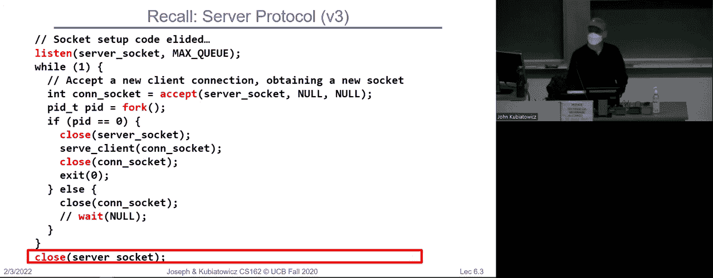

在本节课中，我们将要学习操作系统中的核心概念——并发与互斥。我们将探讨线程如何实现、如何切换，以及当多个线程共享数据时会引发哪些问题。理解这些是构建正确、高效并发程序的基础。

---


## 概述：从进程到线程

上一节我们介绍了进程的基本概念和通信方式。本节中我们来看看如何在一个进程内部实现更轻量级的并发执行单元——线程。

进程是包含一个或多个线程的容器地址空间。传统的单线程进程被称为“重型进程”。现代操作系统支持在一个进程中有多个线程。每个线程拥有独立的寄存器和栈存储，但共享相同的代码、数据和文件。

---

## 线程的实现与切换 🔄

操作系统的核心工作之一是在多个线程之间进行切换，制造出它们“同时”运行的假象。这通过一个核心循环实现：

```c
while (1) {
    run_thread_for_a_while();
    choose_next_thread();
    save_state_of_current_thread();
    load_state_of_new_thread();
}
```

这个循环不断保存当前线程状态，并加载下一个线程的状态。

### 如何获得控制权：内部事件与外部事件

操作系统如何确保能定期从用户线程收回控制权，以运行调度器？主要有两种方式：

以下是内部事件的例子：
*   **显式让出 (Yield)**：线程主动调用 `yield()` 系统调用，将CPU交还给操作系统。
*   **执行I/O操作**：当线程进行如读取文件等I/O操作时，会进入内核并可能被阻塞，操作系统可借此机会调度其他线程。

以下是外部事件的例子：
*   **定时器中断**：硬件定时器定期产生中断，强制CPU进入内核模式。内核的中断处理程序可以调用调度器。
*   **其他硬件中断**：如网络数据包到达、磁盘I/O完成等。

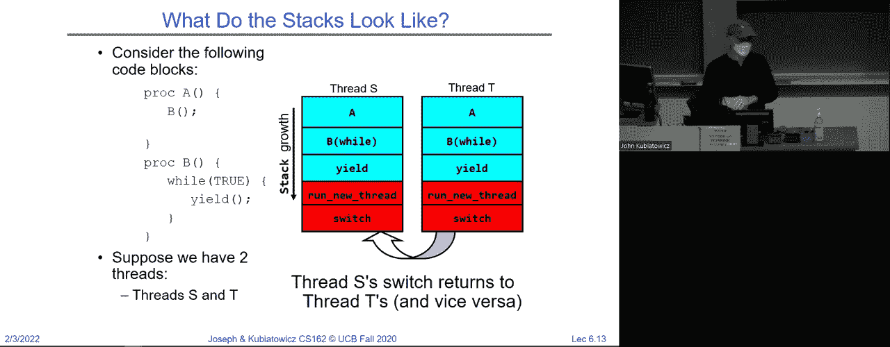


早期系统（如旧版Macintosh）依赖内部事件（协作式多任务），一个错误或恶意的无限循环就可能导致整个系统冻结。现代系统主要依赖外部事件（特别是定时器中断）来实现**抢占式多任务**，确保操作系统始终能掌握控制权。

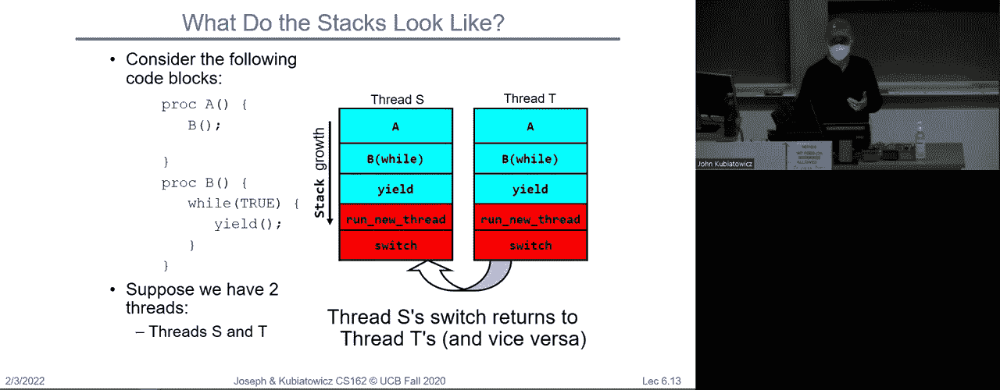

---

## 上下文切换的堆栈视角 🥞

理解线程切换的关键在于理解堆栈的变化。每个线程都拥有一个**用户栈**和一个关联的**内核栈**。

当发生从用户模式到内核模式的转换（如系统调用或中断）时，CPU会从当前线程的用户栈切换到其内核栈。线程的状态（寄存器等）被保存在内核栈上。

上下文切换例程 `switch()` 的核心工作是：
1.  将当前线程的寄存器保存到其**线程控制块 (TCB)** 中。
2.  从新线程的TCB中加载寄存器到物理CPU。
3.  其中被加载的**栈指针寄存器**会指向新线程的内核栈。
4.  执行返回指令，此时程序将基于新加载的栈和返回地址继续执行，从而“跳转”到了新线程的上下文中。


这个过程就像改变了执行的“时空位置”，从一个线程的上下文无缝切换到另一个。


---

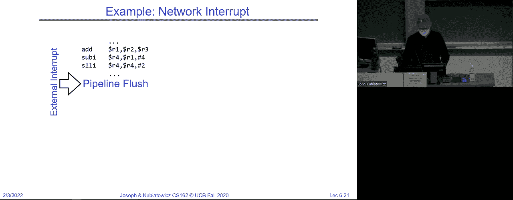

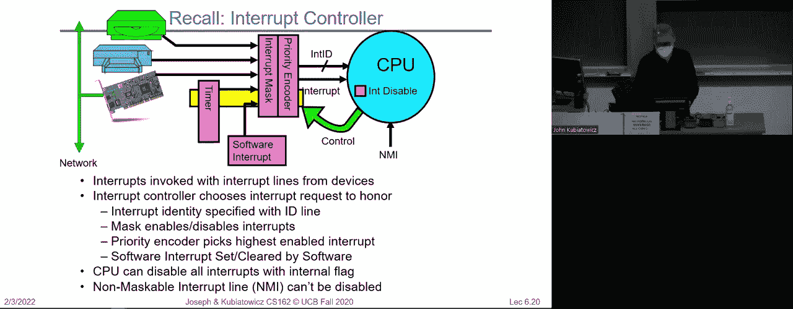

## 创建新线程 🐣

我们如何启动一个全新的线程，并让它能融入上述切换机制？

关键在于初始化新线程的TCB，特别是设置其栈指针和程序计数器（返回地址），使其看起来“仿佛”已经运行过并刚刚调用了 `switch()`。


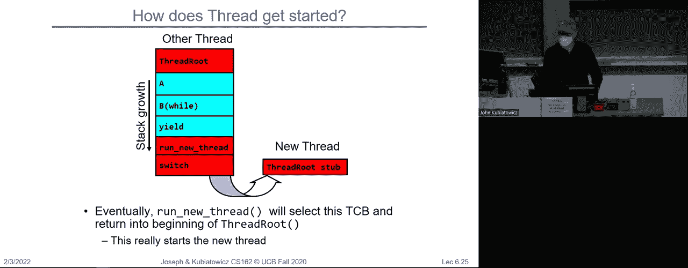

以下是创建新线程的步骤：
1.  分配新的栈空间和TCB。
2.  初始化TCB：将栈指针设置为新栈的顶部，将程序计数器设置为线程启动例程（如 `thread_start()`）的地址。
3.  将新TCB放入就绪队列。
4.  当调度器切换到该新线程时，硬件会加载我们预设的栈指针和程序计数器。
5.  线程开始执行 `thread_start()`，进行一些初始化工作后，调用用户提供的线程函数。
6.  从此，该线程便能像普通线程一样参与正常的切换和调度。


---


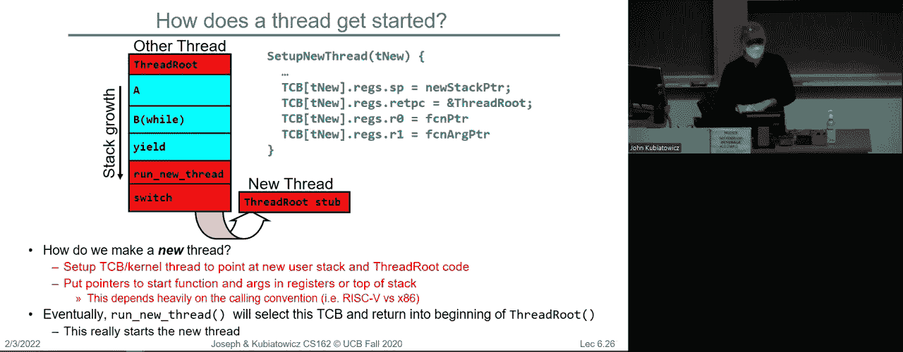

## 并发带来的挑战与概念 🔀


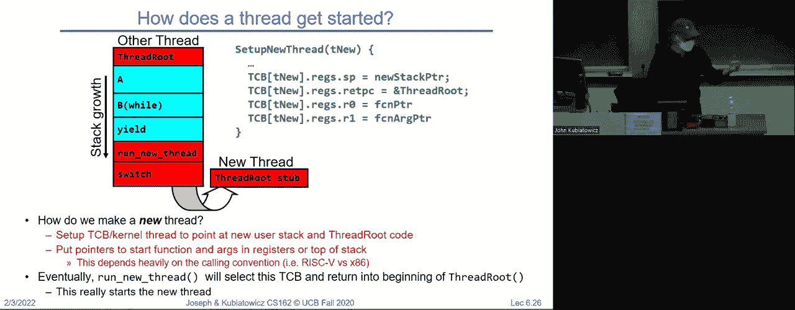


当我们有多个线程（或进程）时，就引入了**并发**。并发执行可能带来非确定性，因为调度器可以以任意顺序交错执行各线程的指令。

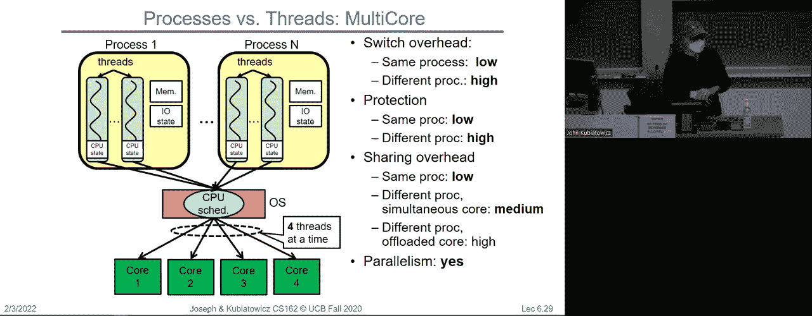


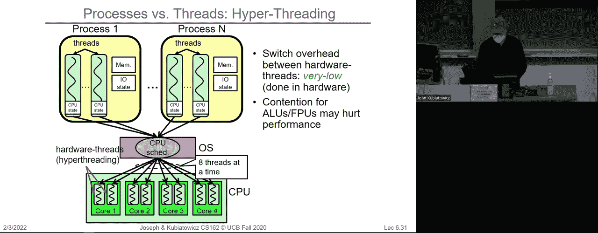

以下是几个关键术语的定义：
*   **多处理 (Multiprocessing)**：指系统有多个物理CPU或核心，可以真正同时执行指令。
*   **多道程序设计 (Multiprogramming)**：指系统能同时管理多个作业或进程（可能是在单个CPU上交替运行）。
*   **多线程 (Multithreading)**：指单个进程内包含多个执行线程。

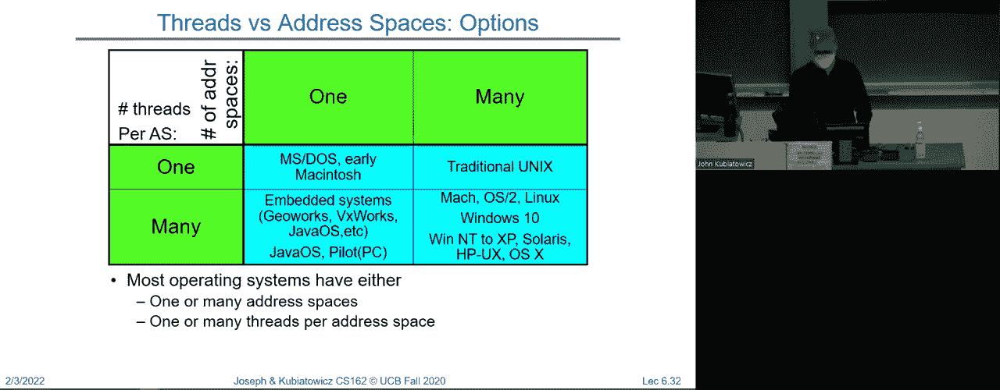

如果线程之间**完全不共享状态**，那么无论调度顺序如何，结果都是确定且可重现的。然而，为了实现协作、资源共享或性能加速，线程间通常需要共享数据（如内存、文件），这就引入了复杂性。

**竞争条件 (Race Condition)** 是指多个线程并发访问和操作共享数据，且执行结果依赖于线程执行的精确时序。由此产生的错误称为**并发错误**，它们通常难以重现和调试。

---

## 总结

本节课中我们一起学习了操作系统实现并发的核心机制。我们探讨了线程的概念、上下文切换的详细过程（包括堆栈操作）、以及如何创建新线程。我们还引入了并发的基本概念，并指出了当线程共享数据时将面临的正确性挑战——竞争条件。


理解线程如何切换是理解并发如何工作的基础。下一讲，我们将深入探讨如何通过**同步**和**互斥**机制来解决共享数据带来的问题，确保并发程序的正确性。