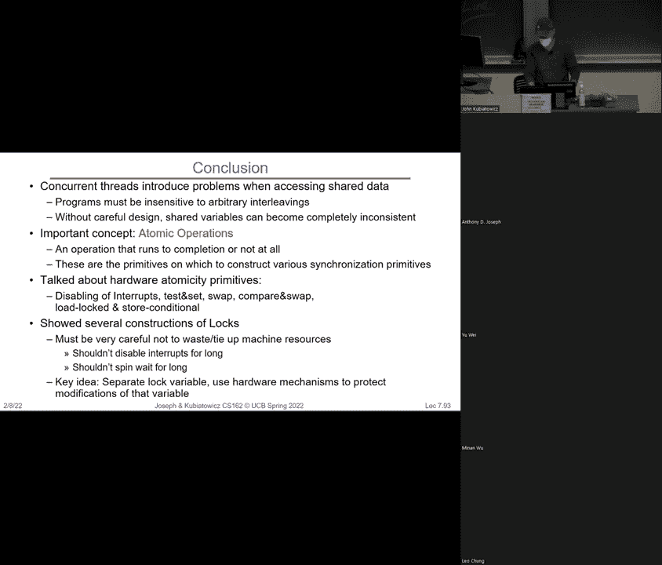

# P7：第7讲：同步 2 并发（续），锁的实现，原子 - RubatoTheEmber - BV1L541117gr

好的，欢迎大家来到CS162课程。

真实的生活方式，总是挺不错的。今天我们将从上次的内容继续，真正开始推进线程的实现。然后我们会讨论线程的一些后果，特别是当我们开始关注同步问题时。所以下次如果你记得上次我们有一个示例，这个示例通常会让第一次听到或看到的人感到困惑。

所以我们简单回顾一下，理念是我们有两个线程S和T。线程运行相同代码这一事实对你们来说不应该感到神秘。代码可以存储在磁盘上。我们可以有两个独立的进程，也可以在一个进程内有两个线程，它们都在启动这段代码。所以这不是什么神秘的事情。

记住，每个线程都有自己的栈。所以当线程S运行时，它调用A，然后A调用B，B进入循环并调用yield。这会把我们带到内核，然后内核调用运行新线程，再调用切换。因此，运行新线程现在实际上是我们调度器的代理。它将决定选择哪个线程。我们将有一个完整的过程。

有几次关于调度的讲座。好的，因为决定下一个线程是什么，会有很多有趣的可能性。好的，如果你能想到的，它可能已经被某人做过了。但回到这个问题，运行新线程选择了一个新的线程来运行。这就是它的名字。然后它调用切换，切换做了什么？嗯，它交换了线程S中的寄存器。

将它们保存到TCB中，并从T加载寄存器。其中一个寄存器恰好是栈指针。所以切换把S换成T，意味着“砰”，我们突然进入了T的栈。这就是这里有箭头的原因。然后我们就从栈顶向回走。好的。

现在这是一个不完美的动画，但你们可以明白我的意思：一旦栈指针切换，我们就突然进入了这里的切换状态。所以，当我们从切换返回时，我们最终会返回到运行新线程，然后再返回到yield，再返回到while。while循环调用yield，yield又进入运行新线程。

线程调用切换。我们假设世界上只有两个线程，切换调用将线程T替换为线程S，然后整个过程再次发生。好的，我想在这里暂停一下，因为我知道在Piazza上已经有一些讨论了，大家在问这意味着什么？那你们可以继续问我，这意味着什么？

推测这和这个幻灯片有什么关系？什么是水仙花开了的意思？不，不是那样，但对，语法也很好，顺便说一句，你什么意思？我喜欢这个。好的，继续。好的，问题来了。当我给出这个例子时，我说我们回到栈上了？好的，好的。那我们就来回答这个问题。

我们回到这一点。所以你明白了，每次调用新程序时，我们都会得到一个新的堆栈帧。局部变量就存储在这里，返回地址也存储在这里。所以如果我们只有一个线程，是的，发生的事情是 A 会调用 B，B 会调用 yield，yield 会调用一个新线程，我们会切换，然后什么都不做，然后返回。

从 switch 开始，它实际上会擦除那个 switch 堆栈，然后我们会从新线程运行，它会擦除那个，然后我们会返回到 yield，它会擦除那个，我们再回到 while 循环中，然后我们会重新做一遍。好吧。所以如果你明白我刚才说的，思考这个问题的方式是，一旦。

我们交换了 S 和 T，S 就像是被冻在了《暮光之区》。当我们交换回来时，S 就像我说的那样，直接从返回处继续，因为我们做得足够干净，一旦我们切换回 S，它真的就像这样，我们返回并回到堆栈中。好吧。还有别人吗？是的。所以没有。

运行新线程并不会从 A 重新开始。所以记住，抱歉，嗯，这个例子的限制是 S 和 T 已经运行了很长时间。所以在我们切换到 T 时，T 之前已经在运行了。所以它的堆栈已经是那样了。所以我们是返回到 switch，而不是返回到 A。

所以我们回到 switch，然后我们回到我们的路上，往上走，再下来，回到我们的路上，往上走。好吧。这可能是我在这堂课上讲的最难的一张幻灯片。所以它有点，嗯，我很快会展示一个很有趣的引用，帮助你理解这个。

继续吧。对。所以当我们把 S 完全带到 switch 时，问题是。然后去别的地方，悬挂线程总是看起来像这样吗？是的。嗯，除了，我的意思是，它必须运行这段代码，你知道，我不认为你们任何人会运行那段代码，因为它很无聊，但你明白我的意思，它总是会。

在堆栈的最底部有 switch。很好。好的。好的。我敢继续吗？是的。当。嗯，当内核调用 switch 时，所有它做的事情就是交换寄存器，然后你从 switch 返回，但当你返回时，你已经交换到了不同的堆栈。所以当你在这里调用 switch，然后开始返回时。

你实际上是在一个不同的线程中，然后你回到堆栈中。所以你没有改变任何代码，你运行的还是相同的 switch 代码。只是那时它出现在不同的堆栈中。吓人。好吧。对。它不是去切换代码。它是相同的切换代码。

但它已经改变了堆栈。所以当相同的 switch 代码遇到返回时，它做的事情就和留在 S 上时不一样了。是的。啊，为什么不暂时保持这个问题。那是个好问题。我们怎么知道 T 在哪里？

好的。那么让我给你们授权继续到下一张幻灯片。我们继续一下。另一个我想提醒的事情是，**yield**的使用方法同样适用于定时器中断。定时器中断是将你从用户模式强制切换到内核模式的操作。但是，请注意，**运行新线程**和**切换**是在底部的。

所以，在这一点，处理器将切换到TRS或其他已准备好的模式。好的。另一个我们上次讨论过的，但我没有放在这里的是，如何从零开始启动一个线程？你必须设置栈，以便当切换到它时，它认为它是在进行切换，这是正在运行的任务，但当它进入并返回时。

它实际上是从红色运行开始的。好的。这是一个贯穿多种操作的简单范式。好的。所以这里的问题也在聊天室里提到了，即使线程T没有运行，我们是否仍然会切换回S，假设我们会先启动线程T？是的。如果我们处于一个T尚未运行的情况，并且我们进行了此操作，那么实际上发生了什么？

这是切换到它并从A开始执行的唯一实例，并且会一直运行到结束。因为我们已经将其设置为一个存根，并且从那时起它会看起来像这样。好的。接下来，我将继续前进。这基本上是我们如何控制调度器的概念，以便我们能够定期地运行新线程并做出决定。

这部分内容是另外一堂课的内容。好的。现在，我想给你们提供一些实际的基础。如果你查看Pintos内部，会看到有x86处理器代码用于处理x86相关操作。实际上，这个概念中有一个内核栈，一旦进入内核模式，就会交换到该栈，所有这些操作都由x86的寄存器直接支持。例如：

为异常和处理器设置了一个TSS，这个TSS属于处理器的零级（内核级）。你放置一个栈，这样一旦进入内核，它就会交换到那个栈。好的。如果你开始查看像TSS.c和inter_stub.tap S这样的文件，你将看到相关代码。好的。那么，一旦我们进入内核，我们该做什么？

我们已经交换了，或者说保存了用户的栈和程序计数器。我们把它们放入内核栈和程序计数器中。所以，实际上这里从蓝色到红色的这一切疯狂的过程，实际上是在使用我们Pintos系统中的x86特性，它能在我们进行模式切换时自动切换栈。

因为SIS调用是一种异常。它就像中断一样，无论是什么。因此我们必须在内核中预设好，以确保这种切换会发生。好的。当你从内核返回并回到用户模式时，x86的相同硬件部分会恢复用户的程序计数器和栈。

所以这就是为什么我会费心或不费心地让它看起来像真的。我们只是在做一个函数调用进入内核。好的。因此，用户栈在增长，但当我们从蓝色变到红色时，它是一个不同的栈。但一旦你设置好这一切，你就不需要再去考虑它了。

你只是在调用内核的过程，然后做一些事情，之后再从内核返回。这个小的过渡是由x86硬件为你们处理的，很多其他处理器也是如此。虽然这更多与软件相关，但我希望你能开始理解，就像是你在调用过程进入内核，再从内核返回。好的。例如，下面是一个例子。

这里我们正在运行代码，用户也在愉快地运行，记住每个用户线程实际上都有一个对应的内核线程，它正坐在那里等待。好的。而发生的事情是，当有中断发生时，注意到我们有CS、CIP，也就是代码指针或指令指针，然后我们有一个栈指针。

一旦我们跨越那个界限，注意到发生了什么，硬件将我们切换到了硬件的栈，这个栈就在这里，而硬件的指令指针则与我们做的任何异常相关。好的。然后，在那个时刻，原始的用户程序计数器和栈实际上被推送到了内核栈上。好的。

所以看看我们做了什么。这里是用户的程序计数器和栈。只要我们进行内核调用，这两个寄存器就会自动被硬件推送到栈上。现在我们就有了内核的程序计数器和栈指针。接下来，我们就继续在内核中进行过程调用。

我曾经有很多人在Piazza上问类似的问题，为什么内核需要栈？嗯，原因跟用户需要栈是一样的。好的。所以你看，它必须有地方来存放返回值和局部变量。好的。现在还有一个页表基址寄存器，在这个简单的例子中它是一样的。但我们处于内核模式意味着页表也会。

我们将在稍后的几节讲座中讨论这个问题。但是你可以将某些条目标记为仅对内核可用。因此，只需进入内核模式，内核空间就会突然对内核可用。好的。再说一次，这是一个硬件特性。好了，现在我们可以运行了。好的，这个内核正在忙于做一些有趣的事情。也许它正在执行一个读取系统调用之类的操作。好的。

然后我们准备恢复。此时，我们需要做的就是撤销我们在这里所做的工作，也就是我们必须恢复程序计数器和栈。好的。这将通过中断返回来完成。现在我们又回到了用户栈上运行。

问题，是的。是的。现在，原子（atomic）这个概念是什么意思？原子意味着不可中断。我们稍后会讨论这个。所以说它是原子操作并不意味着它一定是在一个周期内完成的，但它意味着它是不可中断的。好吧。但是，事实证明有很多比x86更简单的东西，并没有那么复杂。你不需要做的事情其实只有少数几个需要原子操作的部分。

其余的可以在软件中完成。好的。但我认为现在把它当做一种简单的方式来理解这些内容，直到你对这些想法感到熟悉。好的。还有其他问题吗？是的。好的。硬件怎么知道内核堆栈的地址？

答案是，如果你查看这些东西，你会看到有一个叫做TSS（陷阱段寄存器）的寄存器。实际上，你会将内核堆栈存储在这个寄存器中，这样当硬件执行转换时，它就知道从哪里获取它。你可以查看C代码，看看它是如何设置的。好问题。好的。

所以内核堆栈是在启动时预设的。还不完全正确。发生的事情是，当你切换到一个新的线程组时，内核堆栈需要被预设。记住，每个用户线程都有一个内核堆栈。所以，当调度器进行切换时，它需要改变这个堆栈。好的。但基本上，你是在返回用户模式之前提前完成这个操作。

是的。我想这就是你想要说的。继续。就在这里。现在，你说它没有自己的寄存器。它有自己的寄存器值。好吧。所以，你知道，它有自己的处理器。当我们进行这个转换时，发生的事情是硬件将程序计数器和堆栈指针加载到内核。

然后它还会将用户的内容保存在那个内核堆栈中。好的。现在，并不是所有硬件都会为你完成这个操作。x86硬件是这样做的。好的。这意味着我们现在正运行在更低的堆栈层次。记住，我曾提到的那些红色的内容是更往下的部分吗？

当我们返回足够多时，我们会回到这个点，这时会执行iret指令。在这里，我们会从堆栈恢复数据，将寄存器恢复到运行状态。现在，唯一会受到影响的寄存器是那些在进入内核时会被彻底清除的寄存器，即程序计数器和堆栈指针。

现在将由内核来保存和恢复其他所有内容。好的。所以你必须正确地执行这个操作。很好。还有其他人吗？好的。继续。页面表基址寄存器在内核和用户之间是共享的，因为你可以将条目标记为仅对内核可用。好的。

冒昧地说，这里有一些可能让你困惑的内容，我要指出2017年发生了一些非常疯狂的事情，当时发生了一个叫做Meltdown的事件，研究人员发现即使不应该这样做，他们也能从内核中“拔出”某些东西。我们稍后在学期中会讨论这个，但它的最终效果是，受影响的事物数量。

内核的栈位于用户页表中，这个表必须非常小。因此今天，当你切换时，你必须切换到不同的页表。通常来说，但直到2017年之前，它是这样的。我们稍后会详细讨论这个。好的，我现在不想走这条路。我想先给你展示这个。

这里是一个我们正在调度的例子，我们将进行上下文切换。注意到发生了一个中断，但你之所以知道是因为我说了有一个。我们现在在同一点。它看起来几乎和我们做系统调用进入内核时的情况一样。不同之处在于我们现在将调度一个新的进程。到那个时候。

我们通过交换新用户线程、内核栈对、用户栈和内核栈来调度。这就是为什么事情是绿色的原因。注意，页表基址寄存器肯定是不同的，因为这可能是一个不同的进程。然后我们现在就返回，看看，现在我们在运行绿色，而不是蓝色。我们刚才刚刚调度好了。好的。

我让你思考一下这一点。我将向你展示这个，这更像是一个时间相关的东西，而这更是空间相关的。所以Pintos，你开始使用的版本每个进程只有一个线程。稍后我们会让你在学期中更改它一点。那么这意味着什么？

这意味着在一个进程中，我们有用户模式在这里，位于下方，内核模式在上方。所以在用户模式下，用户有代码、数据、堆、栈。然后在上面是内核栈。但在Pintos中，这个内核栈实际上是一个4K大小的整个页面，页面底部有一块区域是TCB。好的。所以他们实际上把它放在页面底部，还有一个位置来保存栈。

指针，它指向页面的顶部。那么，这样做是为了使用内核栈计算斐波那契数吗？为什么或为什么不？

有人知道我为什么问这个吗？继续。好吧。这是一个非常有限的栈大小。但内核会搞砸，如果做任何递归操作过深，它会覆盖TCB，这样就会很糟糕。好的，不要这么做。好的，博士，覆盖栈的时候很痛，别这么做。好的。所以我想给你展示的是，如果我们在用户线程中，

内核线程没有功能，但内核线程，本质上是一个与用户线程配对的栈。我们看起来像这样，指令指针（即PC）和栈指针指向用户空间，而我们已经在那个特殊寄存器中加载了内核栈指针，指向将要交换的位置。

所以现在我们很高兴地在这里计算斐波那契数列。如果我们发起一个系统调用，硬件这里有足够的信息来交换进新的内核栈，新的内核栈会在这里，并继续保存数据。好吧。那么，接下来我们看另一个不同的情况。注意到这个有一个内核线程或者内核栈与用户线程或者用户栈配对。

不，我们这里有一些没有用户组件的东西。Piazza上有很多问题。那么，内核是否有只做自己事情的线程？有的。所以这是一个线程的例子，它们从不返回到用户模式，或者说它们从没有用户模式。它们只在内核中运行，做一些维护性的工作，比如刷新磁盘块。

等等。这个设置的好处是，正如我们所设置的那样，内核部分看起来是相同的，不管它是用户线程还是不是。所以调度器可以在这些线程之间调度，这些线程都有不同的用户代码和内核代码。它们是一样的。好吧。那是什么？嗯。

看看这个。我们正在内核中运行。好吧。在一个内核线程上。在这种情况下，程序计数器和栈指针指向内核中，我们永远不会返回到指向用户空间的地方。是的，我明白了。你能看到吗？让我们看看。哦，我的指针似乎没显示出来。

我很抱歉。那么我在这里提到的是，我得想办法怎么做。但我们看看。激光指示器工作吗？我们检查一下。试试看。哦，有了。怎么样？

这个比不可见的要大得多。所以好吧。那么我在这里讲的内容，谢谢你指出这一点，就是在这种情况下，注意到，这是用户的栈，我们在这里运行，硬件有内核栈设置，当我们发起系统调用时，我们会使用那个栈。但在这种情况下。

我们已经在这个栈上运行，注意栈指针指向栈内，当然指令指针指向内核代码中的某个位置。这是一个运行在内核中的实例。所以现在，只要我们有办法在不同的内核线程之间切换。

然后调度器会自动将CPU时间分配给用户线程和内核线程，现在调度器可以做任何它想做的事。好吧，这就把我们带回了策略的问题。所以这就是为什么人们称用户线程的后半部分为内核线程。我对于是否喜欢这种术语有点犹豫。从这一张幻灯片来看。

这完全可以理解，但常常让人困惑。所以另一件事是，知道每个用户栈都有一个内核栈。好吧。现在我们可以进一步讨论这个。这里是那个原始线程的例子，它刚刚发起了一个系统调用，注意在这个实例中。发生的情况是，我不知道你是否注意到，看看这里，那里。

在栈顶实际上什么都没有，当我们到达这里时，实际上我们已经将用户的寄存器压入了那个内核栈，现在我们正在内核中运行。这将是一个进行读取的系统调用示例。我们现在正在那个栈上运行。当我们返回时，我们穿越了那个边界，回到了用户层级。好吧。

那么，Pintos是什么样的呢？让我看看能不能在不太费劲的情况下关掉它。让我试试，如果我只是，哦，关掉它。好吧，没关系。很好。好了，这里。现在专家们。让我们简单看一下Pintos的中断处理过程。这里我们有硬件向量，当发生硬件中断（比如定时器）时。

这是OX20，等于32，发生了，它进入了由内核设置的向量，告诉我们执行这些指令。这些指令可能是特定于该向量的，但实际上，在Pintos中，发生的情况是，它们只是把中断的类型压入栈中，然后调用公共代码。这段代码保存了其他所有寄存器。记得我说过，你需要保存所有用户的寄存器。

但是内核只保存了其中的两个。所以这段代码保存了它们所有，设置计算机、内核环境，调用中断处理程序本身，好吧。这将运行与定时器相关的某些操作。所以在这里，我们有一个从用户到内核的中断向量情况。

这是中断向量。它指向代码中的各个部分。当我们接收到中断时，实际上会转移到这里，我得给你们展示一下这个激光指针。所以这里，经过中断后，现在我们有了栈指针和正在运行的线程，并且如果我们想的话，可以继续进行调度并切换到另一个栈。

就像在系统调用中，我们可以进行调度并切换到不同的栈。所以，进入那里并处理中断，进行系统调用，无论如何，在内核层面看起来都一样，这就是为什么调度很容易的原因。好吧，我不想再继续讲下去了，因为这会让你们的大脑爆炸。

我们开始变得一团糟，但我确实想指出，一旦我们到达这一点，我们调用中断处理程序，然后该处理程序会继续进行另一次调度，在Pintos内部，嗯，我究竟该如何处理定时器？到那时，定时器调用`tick`，然后`thread tick`，这可能什么也不做，最后返回。

定时器可以触发若干次，代码会继续执行。好吧，或者线程的时钟滴答可能会调用`thread yield`，在这种情况下，我们将进行调度。此时，我们只需通过交换指令指针和栈指针来切换到另一个线程。当我们返回时，回到路径上。

我们现在在另一个线程上运行。所以是s和t。好了，现在，我将让你们自己再玩一下这个，但我想让你们看到这就像是所有这些的空间版本。好了，后面。是的，请继续。所以，内核中只有一个TCB。这就是那种偏黄的颜色。

所以，当你要切换到其他内核线程或其他线程时，TCB就在这里保存一些信息。因此，对于在内核线程中运行的内核，它只是在这里保存信息。如果我们在用户线程中，然后进入内核，再切换到其他用户线程时，我们也只需将我们的寄存器保存到该TCB中，然后进行交换。

所以有一个地方。好的，问题很好。是的。所以内核和用户并不共享相同的。内核能访问的东西比用户多得多。所以，是的。地址空间是所有地址及其映射的集合。好的，从这个角度看，我会说用户的地址空间是通过内核的地址空间来增强的。

当你进入内核时，内核的地址空间包含更多内容。地址的数量相同。但在用户模式下，大部分地址是不可用的，但当你进入内核时，它们现在是可用的。所以你可以认为这是地址空间的“增量”，或者当你进入时，它稍微有所不同。

内核，它的活跃地址集更大。正如我刚才提到的，他们可以共享同一个页表，但当你处于用户模式时，大部分页表是关闭的。因为只有一个内核。记住，这是我们的新口号：只有一个内核。

当你在内核中时，内核空间是映射的，对每个人来说都是一样的。他们可以访问所有东西。只是在进入用户空间时，你对事物的访问受到更严格的限制，并且只是一个较小的子集。好的，明白。所以我们并没有被地址限制住。好了，这个我想在我们结束前给你们讲一下。

Dennis Ritchie，Unix的创始人之一，在调度器代码中写下了以下注释。就像我们刚才所说的那样。它写道，如果新进程因被换出而暂停，设置栈级别为，最后一个单元用来保存u_ss。AVE。这意味着返回。也就是在调用我们的ARETU之后立即执行的返回，实际上是从上一个例程返回。

这做了保存u。你不需要理解这个。这是我在任何内核或其他地方最喜欢的引述。好了，所以，然而。我希望你们理解我们刚刚讨论的内容。但如果你们觉得有挑战性，记住Dennis Ritchie在Unix中写的内容。好了，就这么办。

给自己稍微休息一下。问题。所以，好吧，它们确实会保存在TCB中。当我进入内核时，你看，看到这里了吗？这会在我们进入内核时保存所有寄存器。但我们需要立即保存的寄存器实际上是，嗯，回到我想要的地方。

回到这里。我们在进入这里时需要立即保存的寄存器是用户的PC和栈指针等等。它们会被推送到栈上。这就是为什么这个家伙现在有两个条目的原因。那是用户的东西被推送到那里。所以，当你调用内核时，你将用户的东西推送到内核栈上。

然后你继续进行。也推到内核栈上。一切都被推到内核栈上。由内核完成，除了程序计数器和栈指针。所有东西都被推送。理解红栈和蓝栈的最好方式是它们只是过程调用。我们清理内核和用户之间的杂乱，但这只是过程调用的过程。

经过一番讨论后，回到原点。好的。没错，一个继续。我是说，这家伙是从哪里来的？

实际上，让我直接跳到最后。哎呀。然后我们确实想继续一点，因为今天我们还有其他事情要讨论。但如果你看这里。这是由内核在内核空间中设置的，硬件知道在哪里查找。好吧。好吧。好了，咱们继续。如果你觉得有挑战，那没关系。它确实有挑战性，但我们会确保你理解，因为我，我相信你。

所有人都能理解这一点。好吧。我相信你们。那么今天我们要讨论的是……所以我们有一个机制可以在线程之间切换。哇哦，机制。问题是，如果你继续使用它，而且不明智地使用，这种并发可能会从功能性和正确性角度**杀死**你。好吧。

所以我们得开始理解为什么这是个问题，以及该怎么做。好了，大家准备好了吗？顺便说一句，这是我最喜欢的《Dilbert》漫画，来自以前的某个星期天。它是一个点，老板问桌子周围的每个人。所以告诉我你们的项目怎么样。然后第一个人说，我的项目，整个新的范式。

然后还有这一切，嗯，什么是范式的意思？哦，你知道，范式，范式。就像我的项目，整个新的范式。然后其余的框架是，嗯，我的也是一个新范式。我的也是。我的也是。所以，好吧。今天我们要教你一个新的范式。好吧。所以如果你记得的话。

我们大致给了你这张幻灯片，讲述了调度程序如何给你很多不同的调度。好吧。如果我们有A、B和C线程，那么。如果我们碰巧有一堆核心，那么它们实际上是并行运行的。这就是第一个样子。这就是多处理。

另一个选项是调度程序将在它们之间切换。我们刚刚花了很多时间讨论这个切换是如何机械地工作的，对吧？

你如何保存寄存器并执行这些操作。但这里需要理解的关键点是，调度程序可能先运行A一段时间，再运行B，然后是C，或者它可能运行A更长时间，然后是B，或者它可能让A执行到底。你不知道调度程序会做什么。因此，任何你写的多线程代码都必须能在调度程序做任何事情的情况下都能正常工作。好吧。顺便说一下，这是Kubi的恶意调度器规则第一条，假设调度程序会。

找到你代码中的bug，并以最坏的方式利用它，它必须出现在早上3:35。好吧。我还有其他版本的规则，时间限制没有那么严格，但你明白了。设计并行线程代码时，始终记住这张幻灯片。

你需要意识到，不管调度方式是什么，这段代码都必须能够正常工作。好吧。我们来看一个特别简单的例子。这里是一个银行服务器。这些我在这里画的有趣符号代表ATM机。好吧，你可以在外面稍微享受一下这个小小的好处。

我们在中央银行有一些主机。这个概念是，很多人可以同时取款，你知道有许多请求需要往返于中央银行。好吧，所以这里有很多并行处理的可能性。现在假设你要构建这个服务器，那么你可能会有类似这样的代码：一个大的循环，`while true`。你接收请求信息并处理请求。好吧。

那么，处理请求是什么意思呢？好吧，根据操作是否是存款，它就执行存款功能，否则就执行其他操作。而存款功能的实现大致是这样的，首先从ID获取账户，然后取出账户余额，加上存入的金额，然后将结果存回账户。

首先，你可以像这样清晰地编写代码。我猜是这样的。好吧。我省略了关于如何存储资金、如何与联邦储备互动以及其他那些细节，但我们假设这些内容不相关。那么这段代码有什么问题呢？我们一个一个来看。

我们有很多愤怒的客户，对吧？因为只有一个客户能一次性取钱。那么我们该如何加速呢？我们希望能有多个请求同时进行。现在我想指出一点。我这里有这些标红的可能使用磁盘I/O的地方。如果你注意到，这些可能会花费非常长的时间，因为它涉及到。

去操作一个机械设备。所以如果我们想要加快速度，而只有一个 CPU，可能我们希望确保无论做什么，都不会让用户被磁盘 IO 阻塞。好的。所以当一个用户遇到磁盘 IO 时，另一个用户可以继续执行，反之亦然。好的。所以我们可以这样做。我们可以构建一个事件驱动的系统。假设我们只有一个 CPU。

我们想要重叠 IO。而且我们没有线程。那么我们能做什么呢？嗯，我们可以像这样构建银行服务器，仍然是 `while true`。我们获取下一个事件。但是现在一个事件是一个过程的组成部分。所以一个存款有多个事件。我们看存款时，可能会有获取账户事件、增加余额事件、存储账户事件。

无论如何，许多子部分。至少我们需要确保我们为每个慢速部分都有单独的处理。对吧？这样当你在等待某个慢速过程时，其他人可以部分地处理他们的存款。好的。这就是事件驱动。它可能看起来像这样。很好，获取下一个事件。

如果事件是一个全新的请求，那就启动它。否则，如果事件是账户可用事件，那就继续处理。如果是存储事件，那就完成它。每一个事件都完成存款过程的一部分。好的。这在图形编程中是一个非常常见的方式。

所以，如果你们中间有任何人做过游戏编程之类的，你们就会构建像这样的事件循环，其中事件是等待下一个鼠标点击或者等待某些东西被绘制出来，等等。好的。这里的复杂性在于，只有当我们非常小心地识别出每一个慢速部分时，我们才能从中获得性能，以便当出现慢速部分时，我们知道会发生什么。

就像这样，当我们启动请求时，它将从磁盘获取某些东西。所以我们想要做的是，当请求启动时，开始获取数据，然后当从磁盘返回时，事件将会是一个账户可用事件。好的。我们可以通过这种方式来构建它。

但是，如果我们错过了其中的某个阻塞步骤，那么系统仍然会被阻塞，整个系统会停滞不前。但通过仔细分析，你可以做到这一点。好的。这对于非常复杂的代码是一个挑战，因为如果你注意到我这里的存款，这其实非常简单。但想象一下，如果是复杂的情况。

你必须把它拆分成很多小块。这可能不是你编写复杂代码时的首选方式。除非你是一个非常疯狂的游戏开发者，并且想要让它运行得更快，你可能会这样做。好的。那么我们用线程来做吧。好的。每个请求一个线程。所以现在你有 20 个人站在自动取款机前，每个人都获得一个线程。好的。

这就是为什么线程很有用。所以请求将继续执行，阻塞是必需的。所以在这里，我们每个线程执行获取账户、添加到余额、存储账户。好的。如果这个线程被阻塞或进入休眠，其他线程会接管。好的。所以现在我们不需要做太多工作，就可以为每个用户分配一个线程，它就能正常工作。

好的。除了它是否有效。没有，不幸的是，它不起作用。那么，实际上发生了什么呢，当我们获取账户更新余额等等？好吧，看看这个中间步骤。我们如何在获取账户余额到寄存器时添加金额？我们将金额加到寄存器，然后将金额存回去。

如果恰好有其他人在同一时间访问那个账户，并且线程发生了交错，现在我就会遇到问题。好的。让我给你一个例子，就是你准备把10美元存入你的账户，而你的父母把500美元存入你的账户。结果是，你的10美元存款覆盖了你父母存入的500美元，到你完成时，你的账户...

余额里没有$510。它有10。好的。我不知道你们怎么样，但这可能很糟糕。好的。那可是你失去的很多拿铁钱。大家理解吗？所以这里的问题是，有一些操作需要是原子性的。也就是说，加载、加法、存储的组合不能被打断。

它必须被当作一个原子操作处理。而这里的根本问题是我们还没有妥善处理我们的原子操作，也还没有方法来表达原子操作。所以，如果你记得Cooby的调度程序，恶意调度程序规则，调度程序会找到两个线程的最佳调度方案让你损失500美元。好的。

该调度程序会执行这个操作，并且会在335时执行。对吧。就是我说的。那我们该怎么办呢？问题出在最低层次。所以时间线程在处理不同的数据。调度不重要。所以在这里，如果线程A说x等于1，线程B说y等于2。无论它们的顺序如何，都不重要。

对吧？这里，假设y是12，现在我们有A和B交错执行。当执行结束时，x会是多少？好吧，我们来看看。如果线程A先执行完成，那么x将是13，对吧？x等于1加1。或者如果线程A和B交错执行，那么可能我们会得到y等于2，在这种情况下x最终是3，或者y等于4，那么x最终是5。

所以这两个线程交错执行时可能发生的情况是完全不可预测的，并且依赖于那个恶意调度程序。好的，它会让你。好的。我们希望你在这门课中对一件事保持警惕，其他的都不需要。就只有调度程序。好的。现在，发生了什么呢？所以，今天线程A说x等于1，线程B说x等于2。好吧。

在大多数真实机器中，你会知道x是1或者x等于2。现在。你可以想象某种奇怪的串行处理器，位被交错排列，你得到了一个人提供的零一和另一个人提供的一个零，它们交错在一起，你得到了三。好吧，但我在这里是为了让你放心。

这可能不会发生。好吧，因为大多数处理器，加载和存储是原子的。意味着实际的加载或存储操作，要么完全完成，要么根本不完成。好吧。所以，我们需要理解并发程序。我们需要知道底层不可分割的操作是什么。所以我们需要原子操作的概念，原子操作是指那些始终完整执行的操作。

是否完成，或者根本没有完成。它是不可分割的，不能在中途停止，也不能被其他人修改。因此，它可以成为基本构建块。在大多数机器上，内存引用和赋值是原子的，因此奇怪的情况（如三次操作）不会发生。现在事实证明，在32位处理器中有很多非原子指令。

使用双精度浮点数，大小为64位。这些操作并不总是原子的。但现在不用担心这些。好吧。如果我们有原子加载和存储，问题可能是我们是否能让某些东西，比如那个银行示例，正常工作？好吧，因为它显然不像我开始时设想的那样工作。对吧？它是坏的。所以。

这是另一个例子。所以，你有两个线程A和B，它们在互相竞争。一个设置i为零，递增并说A赢了。另一个设置i等于零，递减并说B赢了。那么，发生了什么？

这是同一个进程中的两个线程。会发生什么呢？嗯，我不知道。所以内存的加载和存储是原子的，但递增和递减不是。那么谁赢了？嗯。可能是任何一个，或者都不是。它们被保证某一方会赢吗？不，因为如果它们的执行顺序错误，它们会不断相互覆盖。好吧，它们永远不能赢。好。

如果它们都在同一速度下运行的同一CPU呢？

它会永远继续下去吗？不。由于缓存和其他原因，会有非确定性。所以，即使它们以相同的速度运行，最终一个线程可能会完成。好吧。所以再次强调，这个恶意调度器在这里发挥作用，对吧？所以，事情是这样的。循环看起来像这样：线程A执行加载，线程B执行加载，线程A加法，线程B减法，线程A执行存储。

线程B在上面存储。你知道，当你这样做时，A会抢先一步，B则表示最好加速并努力尝试。A继续写入1，B继续写入-1，A说，嗯？好吧，这种情况会发生在单处理器上吗，使用我们开始时的调度方式？

讲座的结论是什么？可能不是，因为我们讨论的切换量。有没有人记得切换的合适频率是多少？

所以我们不希望浪费超过 10% 的时间，但在切换之间需要多少时间呢？

大家还记得我给过你们几个数字吗？是吗？100 毫秒是一个不错的数值。好的，10 毫秒或 100 毫秒。是的。所以，往前看，试图解决这个问题时，我们的定义可能是，同步是使用原子操作确保线程间的合作。现在，加载和存储操作是原子的。

互斥性意味着确保每次只有一个线程执行某个特定的操作。临界区是一段代码，只有一个线程能在某一时刻执行。好了，你能得到临界区是因为互斥性。好了，所以我们需要某种方式来实现互斥性。我想给你们一个概念。

这个概念是锁。好了，我相信你们在 61C 课程中可能已经学到过，或者也许是在 B 课程中学到的。但现在我们将深入学习锁的相关知识。好了，锁的作用是防止某人做某事。所以这个概念是，在进入临界区之前，你要先进行加锁。

然后你会在之后进行解锁。这里的技巧是，如果有人已经锁定了它，而你试图锁定它，你将被迫等待直到他们解锁它。然后你才能继续。所以今天讲座的核心思想是，同步问题都可以通过等待来解决。如果你确保线程在合适的时机等待。

然后你可以解决问题。好了，锁需要初始化。好的，初始化有两种方式，一种是构造锁，另一种是使用锁初始化（lock init）。通常，获取锁时，你会调用 acquire，并传递锁的指针；释放锁时，你会调用 release，并传递锁的指针。所以程序中可以有多个锁。好了，让我们看看如何解决银行问题。

请注意，我在临界区周围加了 acquire 和 release。这就是临界区。它是我们不希望被打断的部分，因为如果打断它，一切都会乱套。所以如果我们在临界区周围有加锁和解锁，我们看到的情况是，如果我们在临界区周围有加锁和解锁，就能确保一切正常。

看看发生了什么。线程 ABC，它们都出现了，但只有其中一个获得了锁。好的，举个例子，a 可能会先获取锁，其他线程则被迫等待。所以现在 a 完成了它的工作，接下来 b 可以去做，b 完成后，接着是 c。好的，大家跟得上吗？就这样，我们解决了银行问题。

但是只有当我们确保在所有存款中使用相同的锁时，才可以这样做。撤销所有必须确保每次只有一个线程在其中的操作。这是在处理银行状态。好了，我暂停一下。好了。那么，如果你对 p 线程感兴趣，我们之前提到过 p 线程包，它们有锁。

叫做互斥锁。好的，大多数语言都提供了一种锁定机制。但我们接下来会深入探讨，这意味着什么。因为实际上，如果我只是做了加载和存储操作，到目前为止，我还没有向你展示如何执行很多操作。好的，但通常来说，如果我在写多线程代码，第一件事。

我的第一步是找出我的同步操作，其中锁是一个。好的，这是过程的一部分。好了，**正确性要求**基本上是，线程程序必须能够应对恶意调度器。因此，几乎所有线程指令序列的交错执行，以及协作线程使用相同数据的情况，几乎是定义上的，因为它们是在协作。

所以它是非确定性的。如果你不小心设计代码，要调试起来会非常困难，除非你从一开始就做了非常仔细的设计。好的，如果没有做设计规避，那么就运行几次，声明它没问题，然后回家。你将**确保**恶意调度器会搞砸一切。好的，接下来几节课中，我们将讨论一些内容。

尝试理解在各种线程调度下，如何正确构建能够正常工作的代码。好的，举个例子，这里有25个案例。其实上次的阅读材料我没有上传，但是这是一个为癌症患者提供辐射治疗的机器。

该机器通过软件控制电子加速和电子束的产生，以获取X射线。同时，软件还控制剂量。因此，基本思路是把病人放到治疗台上。如果你想为他们提供X射线治疗，你会将电子射向一个靶标。

这个机器产生X射线，并且你会持续这么做，直到给病人提供足够的剂量。你知道，这是治疗癌症的一种重要方式。问题是，这台机器中存在并发错误，导致了多名病人死亡。好了，关于并发错误的一个真正糟糕的地方是，它们是由多个竞态条件引起的。

有些人没有好好思考这个问题。这是一个非常糟糕的软件设计。这里有一个最疯狂的引用。上面有一份上次阅读的报告，你可以查看一下。引用：“他们确定在编辑过程中，数据输入速度是导致错误条件的关键因素。如果处方数据以很快的速度被编辑。”

发生了过量。“让我为你翻译一下。你有一个非常优秀的操作员，他们非常了解这些操作，但他们输入数据太快。这就是你最终导致杀人的原因。好了，希望你们都不会陷入这种情境。但我要指出的是，**并发性**真的需要你设计时保证正确性。

从一开始。好了。这就是重点。现在我稍微有点落后于我平时的进度，不过我们这周有期中考试。从星期四开始。我敢肯定你们都很兴奋。那天没有课。好的。如果有人需要，我会尽量在上课期间增加一些办公时间。

如果想来找我，我们会提供更多细节。但所有的主题都会涵盖到那一天。好了。抱歉。直到星期二之前，但星期二的讲座不会有太重的重点。好的。项目一的设计文档下周五截止。所以你们都知道了。这意味着设计评审即将到来。

我们会让助教安排你们来进行设计评审。你们将讨论你们的项目计划。把设计文档当作你计划做的事情的高层讨论。不要先做完，再把所有的代码扔到设计文档里。好了。这里的重点是讨论你的设计。好的。如果需要一些代码。

放入伪代码中。好的。这就是我在课堂上展示的代码，它没有大量的语法，给出的是一般的思路。好的。因为你希望他们帮助你。你要让他们理解你打算做什么。然后他们可以为此提供一些建议。好的。

并且确保你有一个良好的测试方法。你将如何测试它，以确保它能正常工作？

另外我想提到的一点是，我们在前几次讲座中做了很多这方面的内容。在这些项目中，记得在你们的小组内做自己的工作。不要去勾结合作。不要搞一个大型的项目写作聚会。好的。那是个坏主意。你可以在你的团队内举行一个项目写作聚会。好的。

四个人差不多是一个合理的团队人数，你知道的，适合两片披萨和其他什么的。但不要，呃，不要来回交换东西，因为我们用来检查的工具会标记你们。我们真的不希望那样。好的。现在，项目一、项目二、项目三，它们都涉及到Pintos。所以希望你们已经开始查看代码了。

好的。今天我展示的一些内容，如果你回去看我的幻灯片，你可以看到一些提到的不同文件。如果你想看一些细节。好的。好了。有问题吗？好的。是的。你知道，你可以开始写一些代码了。但是我会建议你在开始编码前先通过设计评审。

如果你对某种方法特别感兴趣。好的。但是，你知道吗，我会。尽可能推得远一点，这样你就能很清楚地知道你要做什么。好的。只是。我会说不要走到最后一步，写完整的代码，但我会继续努力，弄清楚你在做什么。如果你写了一些初步代码。

只是为了让你明白它将是什么样子，做到这一点可能是一个好主意。在这门课上超前从来不会是负担。再说一遍，在这门课上超前从来不会是负担。总是个好主意。好了。那么，我想先举个例子，开始理解区块构造。

所以我们称之为牛奶过多。好吧。操作系统的一个优点是，现实生活和操作系统之间的类比无处不在。呃，有时候这很有帮助。好吧。但你必须假设，当你提出一个类比时，计算机远比人类更强大。我希望，尤其是你们在伯克利的同学们，能理解这一点。嗯，所以我们要小心。

这是问题。你和别人一起住在一间屋子里，你们有个关于牛奶的规则。如果用完了就去买一些。好吧。然后发生了什么呢？A人三点钟从外面回到家，打开冰箱，发现牛奶没了。所以我们已经违反了某些规则。但他们要去买牛奶，对吧？于是他们出发去商店，三点十分到达商店。

与此同时，另一个人查看冰箱，发现牛奶没了。他们开始出发去商店，去另一家商店，对吧？嗯。A人买了牛奶，回到家，把牛奶放好。然后，呃，B人去商店，买了牛奶，回到家。现在我们就有了“牛奶过多”的情况。好吧。

那么我们该如何解决这个问题呢？对吧？我们可以使用锁吗？

现在我们还不需要构建一个锁，但所有的同步操作都涉及等待，对吧？

这是今天学到的内容。举个例子，你解决了牛奶的问题。你在冰箱上挂上了一个大挂锁，当你去商店时带上了钥匙，回到家时，呃，你的室友非常生气。好吧。因为他们其实只是想喝橙汁或冰淇淋之类的东西。好吧。那么也许我们需要做点其他的事情。好吧。

那么我们来看看能不能稍微复杂一点。首先，这里的正确性属性是什么？一个是我们必须非常小心并发程序的正确性，因为它是一个非确定性问题。好吧。所以本能的反应是先编写代码，之后再提问题。不要这样做。先思考，再编码。然后再提问题。好吧。不是的。所以，首先要先思考。

然后编写代码，并始终写下你预期的行为，特别是对于同步问题。好吧，你在这里。作为一名EECS（电气工程与计算机科学）或LNSCS（计算机科学与数学）专业的学生，你的本能是先写代码，后提问题。你得抵制这种冲动。先理解。好吧。那么，正确性属性是什么？

所以不会有超过一个人买牛奶。只要有需要的人就会买。这是两个非常重要的约束条件。好吧。第一步尝试是我们将限制自己仅使用原子加载和存储。这意味着我们会使用便条。所以这里的想法是，你使用便条来避免买太多牛奶。你在买牛奶之前留下一个便条，就像一个锁，然后当你完成时。

你移除便条，如果有便条就不买。好吧，看起来合理。问题是，我们在谈论的是计算机而不是人类。所以注意我们的代码。我们想从中获取一个临界区，可能是这样的。如果没有牛奶，好吧。如果没有便条，留下便条，买牛奶，移除便条。好吧。那么会发生什么？有人看到了吗？是的，嗯。

好的。现在注意到这里的问题了吧？所以线程A说，如果没有牛奶，线程B说，如果没有牛奶，线程B说，如果没有便条，线程A说，如果没有便条，留下便条，去买牛奶。另一个线程做的也是同样的事情。所以这里的交错执行实际上又会让你买太多牛奶，对吧？但是注意，这只是偶尔会买太多牛奶，因为我们。

基本上，你必须精准地处理交错执行，否则一切都不会正常工作。所以这其实更糟，对吧？因为这会间歇性发生，调度程序会在早上3:35抓到这个问题，对吧？好吧。所以结果还是会有太多牛奶，但只是偶尔。好吧，大家跟得上吗？这行不通。好吧。那么，呃。

所以这个解决方案基本上让问题更糟，因为它间歇性地失败，你知道的。你不希望这样。顺便说一下，早期的Unix中有很多错误，虽然不完全像这个，但也是间歇性的失败问题。当时建议你得时不时重启，因为有一些。

内核中的奇怪错误。好吧。确实有一些操作系统（我们不提名字）也有这种特性。其实，我前几天听说，特斯拉现在建议他们的大屏幕要定期重启，因为它会被阻塞。所以总之，我不知道，我不确定我喜欢这个方向。显然，便条没有足够地阻止。

所以我们试着通过先留下便条来修复这个问题。首先留下便条，然后你说，如果没有牛奶，如果没有牛奶，那么这有什么问题？

那里有一个便条。好吧，对于人类来说，可能没什么大问题，但对于计算机来说。没有人会买牛奶。好吧。那么我们试试不同的做法。我们给便条加标签。所以A留下便条A，B留下便条B。好吧。然后A说，如果没有便条B，就留下便条A；如果没有牛奶，就去买牛奶；拿掉便条A，反之亦然。好吧。这行得通吗？为什么不行？好吧，然后呢？

所以它们两个都离开了便条，但是都没有买牛奶。好吧。所以，可能两个线程都不会买牛奶。这个是发生在完全错误的时机的上下文切换。记得那个恶意调度器吗？好吧。这是极不可能发生的情况。但是，这也是出现过很多类似 bug 的地方。好吧，非常不可能。

但很难调试，因为你必须以一种正确的方式去触发它，才能找到 bug。好吧。这不是那种几天都不能睡觉的调试。对吧。这是那种“我没有买到牛奶，你买到了牛奶”的情况。好吧。这种死锁通常叫做“饥饿”，在这里算是发生了，对吧？

因为没有牛奶。所以，我们再试试另外一种选择。我要称之为第三种情况。这里，线程 A 离开便条，然后说，“嗯，有便条给 B，不做任何事，继续旋转”。然后如果没有牛奶，就买牛奶，移除便条，而 B 也会离开它的便条，并且说，“如果没有便条 A”，那如果没有牛奶……

买牛奶，移除便条。所以首先要注意的是这两个线程是不同的。大家都注意到了吗？这个有效吗？谁觉得找到牛奶这么复杂？

有多少人认为这个有效？有多少人认为它无效？

有多少人完全不知道？好吧，至少你很诚实。所以结果是它确实有效。它可以保证不管怎么样，要么买牛奶是安全的，要么其他人会去买。好吧。退出也是可以的。所以如果你注意到，想想这个。没关系。假设他们同时都离开了便条，那么 A 要做的就是 A 会去做。

为了等待，A 旋转等待 B 移除便条，现在 B 可以高兴地看是否没有便条 A。如果没有便条 A，它就会继续买牛奶。但如果发现有便条 A，它什么也不会做。为什么这样没问题？因为 A 会检查是否没有牛奶。好吧，所以，在 X 处如果没有便条 B，A 可以安全购买，否则就等待。

找出会发生什么。如果 A，Y 如果没有便条 A，对 B 来说是安全购买。否则，A 要么正在购买，要么在等待 B 退出。哇。好吧。所以你可以在这里看到。你知道，便条 A 的离开发生在如果没有便条 A 之前，然后我们就停下来旋转等待。然后最终，当我们移除便条时，我们继续做这件事，并且它有效。好吧。

第二种情况是我们先离开便条 B，然后在离开便条 A 之前执行“如果没有便条 A”的判断。那么发生的情况是，它可能会离开便条 A，看到便条 B 被设置，所以它们会稍微等待一下。然后这个线程会继续执行并购买牛奶，而另一个线程还在旋转等待。

所以等到我们到这里时，有牛奶。好吧。现在，哇，它有效了。我可以保证，如果你必须一直这样写代码，你永远不会。写对。我永远不会写对。有人能回答这个问题吗？

如果我有第三个线程呢？如果我有C呢？再说一遍，是画还是涂？嗯，涂。是的，涂是存在的。所以事实证明，这个可以推广到多个线程。你可以查一下这篇论文，但这看起来不太好，对吧？我的意思是，它能工作，但看起来并不理想。那么我们现在学到了什么？如果我们只有加载和存储，是的，我们可以同步。好的。

事实上，这就是我们在同步的临界区。外面那些其他的东西是为了确保只有一个线程会执行“如果没有牛奶，就买牛奶”。所以我们实际上想出了一个锁定场景，给我们提供了一个临界区的解决方案。方案三能工作，但它非常不令人满意，而且非常复杂。好的。

A的代码和B的代码不同。而更糟的是，正如你们会学到的，A实际上是在等待B时旋转。所以有可能B去商店、去图书馆、去吃晚餐，然后回家把牛奶放进去，而此时A一直在不停地旋转。好的，这很糟糕。所以如果你提出一个同步解决方案，其中处理器周期被浪费，那就是不好的。

这样不行。好的。如果你有一个显式的忙等待，而且它可能持续很长时间，我们实际上会扣分。所以我可以告诉你，实际上这不是推荐的解决方案。好的，必须有更好的方法。所以更好的方法是我们需要其他的东西，而不是加载或存储。

我们需要一些硬件来帮助我们。好的，方案四基本上是我们想要这个获取锁和释放锁。如果其他人已经获取了锁，你就去睡觉，等待队列，这样你就不会浪费任何处理器周期。这是一个理想的解决方案。好的。

那个在等待B的室友可以去小睡一会儿，他们会在B回来时被叫醒。好的，这就不是忙等待。好的，而且这些触发和释放的操作必须是原子操作。如果两个线程都在等待锁并且都释放它，那么只有一个能够抢到它。

所以如果你还记得我之前给你们展示的银行的例子，那里有三个线程，它们都在入口处等。然后其中一个先进入，退出时，剩下的两个线程只有一个能够继续执行。所以它必须是原子的。否则这就不是一个好的锁。好的，接下来是我们的问题。好的。

这对于姐妹会现在有效。好的，无论你需要多少人，或者兄弟会都可以，没关系。你可以在没有牛奶时释放牛奶，它就能工作，无论是20个线程还是100个线程。好的，这就是我们要走的方向。我们希望代码是一样的。好的，那我们接下来要去哪里？我们在讨论加载和存储的同步。

我们将开始涉及一些其他类型的硬件操作，而不仅仅是加载或存储。在今天结束前我们还会涉及一点。所有的操作如果只有基本操作，那么在这个层面上会有些痛苦，但如果我们能够禁用中断等操作，情况会好很多。但最终，我们将基于这些低级原语来构建锁、信号量、监视器等等。

所以等到我们涉及到信号量和监视器时，构建正确代码将变得容易得多。好的。然后我们将构建共享程序等等。好的。现在，如何实现一个锁呢？记住，锁的作用是防止其他人做某些事情。你在进入临界区之前锁定，在等待时解锁。

我们会说，为了避免忙等待，如果你无法获取锁，应该让线程休眠。所以我一直使用“休眠”这个术语，我只是想确保大家明白我指的是什么意思。休眠意味着你的线程被卸载，TCB（线程控制块）保存了寄存器的状态，并且它正坐在某个队列中。那就是一个休眠线程。大家明白吗？

所以我们希望锁的工作方式是，如果多个线程尝试获取锁，只有一个线程能够通过，其他线程则被放入一个通常与锁关联的等待队列中。好的。问题。是的。所以到目前为止，我们给你们提供的功能就是它们会进入休眠状态。如果多个线程进入获取阶段，只有其中一个能够成功，其他线程则...

它们被放置在等待队列中。好的。那么现在假设这个等待队列是与锁显式关联的。好的。所以将会有与锁的数量相同的等待队列。好的。好，问题。是的。 (沉默)。

