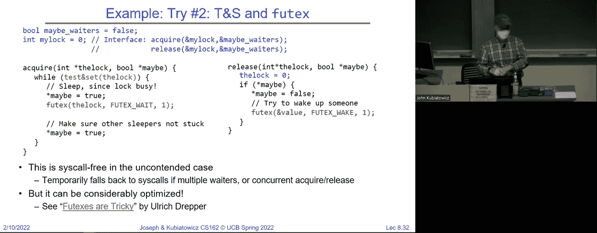
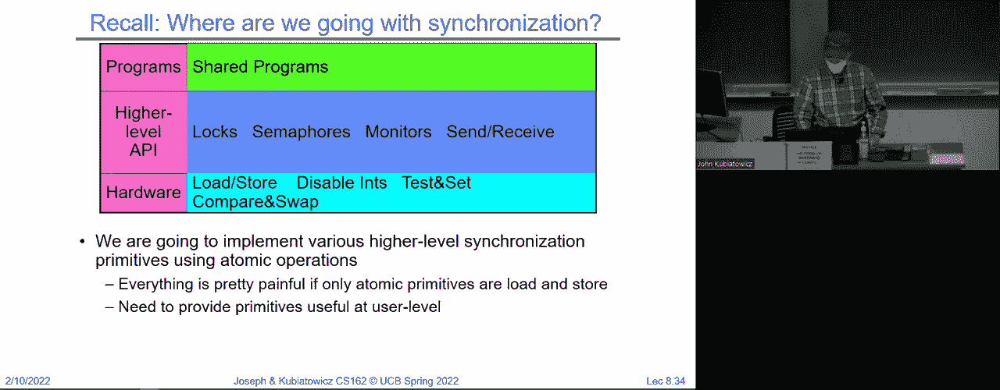
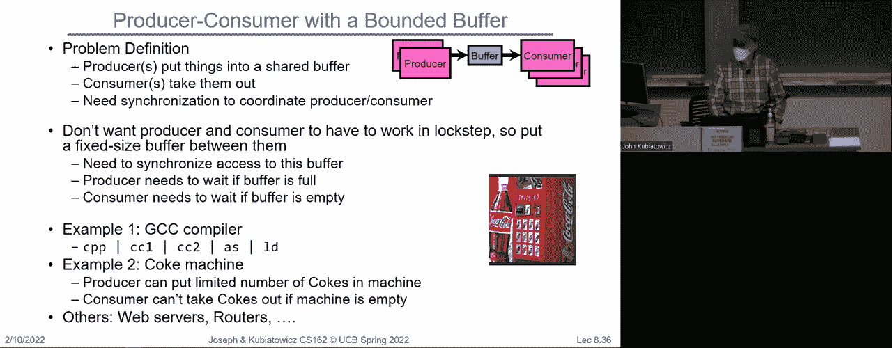
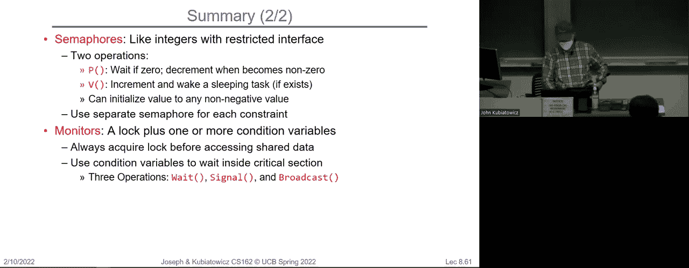

# P8：第8讲：同步 3 锁、信号量和监视器 - RubatoTheEmber - BV1L541117gr

好的。

大家欢迎回来。我们将从上次讨论同步的地方接着讲，看看我们是否能够完成锁、信号量和监视器的内容。所以这应该是一堂充实的信息量的课程。如果你还记得上次的内容，因为某些原因，我们讨论了过多牛奶的解决方案。如果你记得的话。

我们当时试图仅使用加载和存储来实现一个锁。这很快就变得相当复杂了。这个是一个实际有效的解决方案。但如果你注意到，线程A和B的代码实际上是不同的。我们说，如果你将其推广到n个线程，实际上会有n个不同的锁。

不同的线程和不同的代码段，我的意思是，这其实并不是很理想。你可以在这个X点基本上理解这一点，如果没有来自B的通知，我们就能够继续下去，因为B不会意外地执行临界区，在Y点，我们可以说，如果没有A的通知，对于B来说，去买东西是安全的。

所以，这样是可行的，但其实并不太令人满意。我还要指出，这对线程 A 来说，至少它有一个非常糟糕的特性。它可能会在 B 去拿牛奶并返回的整个过程中一直在这里等待旋转。所以我们稍后将把这称为忙等待。

这真的是一个糟糕同步协议的标志。所以我们真正想要的是，在你需要等待一个锁时，我们希望它能够进入睡眠状态。明白吗？有任何问题吗？

我们明白了吗？所以这不算一个真正的解决方案，更像是一种理想。我们说，实际上我们希望的是某种可以被获取和释放的锁，我们可以传递一个锁的地址，假设，并且一个合唱队会等待直到锁被释放，然后抓取它，释放操作会释放锁，让其他人抓取它。

所以，这样做的好处是，如果我们有一个像这样的统一锁，我们可以在任何临界区周围放一个合唱队，并释放它，例如，这个是为了我们的牛奶。它会确保在该临界区内一次只有一个线程，因此我们不会得到过多的牛奶。明白了吗？

而且不仅不会导致牛奶过多，而且很容易看出这段代码是正确的。所以这比之前那个要简单得多，后者比较难以评估，对吧？好了，临界区，顺便说一下，就是我们要保护的那部分，这样就只有一个线程能进去。

另一个显然的关于这种获取锁的事情是我们会进入睡眠状态。所以如果有 12 个线程同时进入，其中一个线程可以通过，其他的线程会进入睡眠状态，剩下的 11 个线程什么也不做。它们不是在忙碌，只是处于等待队列中。明白了吗？

所以这将是我们构建锁的目标。在我继续讲解 API 之前，我想确保大家对这个没有疑问。大家理解了吗？好，有问题吗？好。那么我们接下来说，好的，我们要构建一个锁。我们该怎么做呢？嗯，一种方法是我们可以开始使用，所以显然仅仅依赖加载和存储并不足够。

这对我们来说太复杂了。所以相反，我们想使用某种其他硬件。我们知道的一件事是我们知道如何禁用和启用中断。如果你考虑一下我们迄今为止如何构建调度器和线程多路复用器，你会发现，当线程在运行时，它切换到另一个线程的唯一原因是要么有。

内部事件或外部事件。内部事件是所有那些线程选择进入内核的情况。也许它正在执行一个读系统调用，可能它正在做一个让步，不管是什么。我们可以通过不让它发生来避免这种情况。所以我们真正需要保护的就是外部事件。一个特别重要的外部事件是定时器中断触发，它会。

把正在运行的线程换成另一个线程。好，所以这将是一个我们可能会破坏临界区的时刻。也正因为如此，如果我们禁用中断，特别是禁用定时器中断，那么我们就不用担心临界区了。明白吗？

所以这就是为什么禁用中断对我们来说是一个有趣的事情，因为它有可能让我们阻止调度。现在，这仅适用于单处理器，因为禁用和重新启用中断在单处理器上很容易做到。但如果你有多个核心，禁用所有核心的中断让一个线程运行就要难得多。明白吗？

所以无论我们现在想出来的方案，在多核系统上都不会很好用，但在单核系统上它可以很好地工作。我们可以这么做，对吧？

这是我们说的天真方法。嗯，你通过禁用中断来获取锁，通过重新启用中断来释放锁。再一次，这种方法有效的原因是我们知道定时器不会触发，所以我们可以运行那个临界区，确保没有其他线程进入。唯一可能让线程进入临界区的方式就是定时器触发。明白了吗？

大家都明白了吗？但这样不好。好，为什么这样不好？对，对。比如你的程序，你可以把它理解为用户程序，可能正以较低优先级运行，可能有某个高优先级的东西需要介入。而且特别是，我们甚至不能让用户做这件事。所以我们大概就说了。

问题是，我们从不想让用户控制中断。因为他们可能会说锁被占用了，然后不小心进入无限循环，或者故意这样做，从而导致整个机器崩溃。所以不管这是什么，这已经是不好的了。而且更糟糕的是，当我们长时间禁用中断时，

那么，很可能有些非常关键的事情发生了，比如，天哪，你的反应堆快要熔毁了。你可能会忽视它，因为中断被禁用了。好吧。所以像这样禁用中断显然不是一个好计划。太激进了。但是到目前为止，我们没有发现更好的方法。除了加载存储和中断，我没有告诉你们其他可以使用的东西。

禁用。所以让我们看看是否可以做得比这个更好。好的。这是我们上次结束时的情况。所以我们想出了一个通过禁用中断来实现锁的更好方案。这里的想法是，禁用和启用中断并不是实际的锁。实际的锁将是内存中的一个变量，它的值是零或一。

我们将使用禁用和启用中断来实现锁。所以，与其说禁用和启用中断是锁本身，我们将创建一个情境，利用它们来实现锁。大家明白了吗？这有点不同。就像是一个元任务。好的。所以这就是，比如说，我们的 acquire 是这样工作的。

然后注意，我这里做了什么，我在内存中有一个单一的变量。我将留给你们去想怎么将这个方法推广到多个可能的锁。但现在我们只有一个整数。我们将它设置为“空闲”，即零。然后我们调用 acquire 做这个操作。它暂时禁用中断。

它快速执行一些操作，然后重新启用中断。所以，唯一能够保证这个操作是安全的原因，就是在禁用和启用之间的那个操作要足够快。好的。这将是我们的目标。注意我们做的事情是，我们说，如果别人已经获得了锁，因为值已经是忙碌状态。

我们会将自己放到线程队列上，然后进入休眠状态。好的。线程队列可能会与这个锁相关联。否则，如果值不是忙碌状态，我会继续将其设为忙碌并退出。所以 acquire 能立即工作的唯一情况是，如果锁是空闲的，执行此操作的人就能获得锁。

acquire 或执行 acquire 的线程，禁用中断，获取锁，然后重新启用中断。这非常快。或者，如果锁已经被占用，它们会迅速将自己放到线程队列上，然后进入休眠，其他线程可以运行。现在，别想得太复杂，直到我们看到几张幻灯片之后，因为那时。

有点棘手，对吧？比如，怎么禁用中断然后去休眠呢？

现在中断已经禁用了。好的，听起来不太好，但我们会很快让它变得不那么糟糕。所以释放（release）在这里是简单的，对吧？释放操作说，我知道我已经得到了锁。那么我将检查是否有其他人在等待锁。如果有，我会将它们从等待队列中取出并让它们开始执行。好的。

然后我会退出，因为在释放（release）时，你通常会说，好吧，我已经用完了这个锁，但其他人可以继续使用。注意，我们甚至不需要将值设置为“自由”，然后再将其设置为“忙碌”，因为这里发生的情况是这个线程已经在休眠，值已经是“忙碌”了。所以当我们让它继续执行并且唤醒它后，新线程现在已经醒了。

现在值仍然很忙。所以它拿到了锁。好的。只有在没有人等待时，我们才会继续将锁设置为自由并退出。好的。所以我们在这里做的其实是通过禁用和启用来实现一个锁。我会稍后再详细讲解这个过程，不过现在有任何问题吗？

好了。你们都100%理解这个实现了吗？好的。首先，为什么我们只能在内核中使用这个呢？是的，没错。这个代码目前只能在内核中使用。现在，我可以做的是，稍后我们会讨论一下，我可以创建一个获取和释放的系统调用。

所以用户代码将获取（acquire）作为系统调用来调用。好的。但目前这些还不是系统调用。这只是内核可以使用的内容，用户不能使用。好的。完全是因为我们禁用了和重新启用了中断。让我们再深入看一下，因为这可能比看上去更微妙一些。

你们可能会想。那么我们为什么还需要禁用中断呢？好的。因为执行获取（acquire）或释放（release）操作的代码中有一些逻辑。看，在这两块红色部分之间。如果这个逻辑被其他尝试执行获取或释放操作的代码插入，事情就会乱套。所以事实上，这里这段代码实际上是我们需要保护的临界区。

好的。我们确保只有一个线程会在这一边或那一边。好的。现在，聊天室中的一个好问题是，如果我们禁用了中断然后进入休眠，是否只是禁用当前线程的中断？不，中断禁用是全局性的。所以到目前为止这看起来是有问题的，对吧？我希望大家都在想，如果我禁用了中断然后进入休眠。

这里发生了什么？它们是如何重新启用的，为什么机器不会被刷新呢？

所以我承认这看起来很复杂。我还没有展示如何使它工作。好的。所以，然而我们确实需要禁用中断，以确保没有人会在获取和释放操作之间插入，否则它就会坏掉。现在，让我们只看看获取（acquire）操作，注意这里有个临界区。

禁用和启用之间的部分，但我称其为元关键区段，因为它是在一个种植园的锁定中，这与用户说的获取和释放不同。用户在这两个操作之间的部分就是他的，嗯，你知道的，用户的临界区。好的。我想如果 Facebook 能做到的话。

我可以称这个为元关键区段。好的，为什么不呢？所以，不像之前的解决方案，这个元关键区段非常短。之前的解决方案是禁用中断时获取锁，你做一堆事情，然后释放。那可能会很长。这个应该非常快，假设在这里将自己放入睡眠状态的操作是快速的。好的。

所以我们需要弄清楚如何操作。好的。锁的用户基本上可以一直持有锁，因为操作系统对用户持有锁的唯一后果就是内存中有一个值长时间等于 1。好吧。那么怎么样呢？好的。

背部有问题。不是，背部有拉伸。那么现在我们仍然没有弄清楚该怎么做。好的。那边发生了什么？我们来看一下。所以我们在这里，假设值是忙的。我们是一个尝试获取锁的线程，并且发现锁是忙的。所以我们需要做的是，等一会儿直到锁再次可用。

所以这意味着我们需要把自己放到睡眠状态。那么问题是如果我们在这里重新启用中断，会发生什么呢？

所以我们没有在这里启用中断，而是把它放在了那里。好的。那么那里会发生什么呢？

是的，好的。让我简化一下你刚才说的，但你在正确的轨道上，对吧？如果我们在这里重新启用中断，计时器中断来了，而持有锁的线程释放了锁，那么看看会发生什么。我们回到这里，把自己放入等待队列并去睡觉。然后我们永远不会醒来，因为持有锁的线程释放了我们，或者它认为已经释放了。

好吧，没有人来释放。它去睡觉了。好的。那么在这里重新启用中断是一个糟糕的地方。所以那不好。那么我们可以怎么办呢？

相同的问题，对吧？那个版本的情况。好的。释放将线程放入就绪队列，或者因为那实际上比之前的情况稍差一些。如果我们已经把自己放入等待队列，那么唤醒线程就会说，哦，等待队列里有其他人，他们把我们放入就绪队列，然后我们继续做任何事情去睡觉。所以这一切都搞砸了，对吧？

所以我们实际上也不能在这里重新启用中断。那么我们真正想做的是，我们想先去睡觉，然后再重新启用中断。这是唯一真正能让它工作的方式。好的。但这似乎有点挑战性，对吧？

你是怎么去睡觉然后再启用中断的，因为你知道，你正在睡觉。现在，我觉得在 Piazza 上有一些非常好的讨论，或者说问题，正是涉及这个问题，我想和大家一起理清楚。试图获取或正在获取锁的线程会把自己挂起并进入睡眠状态。

进入睡眠时，发生了什么呢？它尝试获取锁，执行禁用中断的操作，检查并关闭它。实际上，它把 TCB 放入等待队列，同时仍然有指令在执行。所以你可以理解为线程在运行并把自己挂起，但仍然有代码在继续执行。那么在将自己挂起后，我们现在可以继续操作。

然后去唤醒其他人，因为我们有 CPU。所以我知道这个思考起来有点奇怪，但你可以想象这个线程把自己挂起，然后同一个 CPU 会去选择其他线程执行。这样就能解决我们的难题了，因为事情是这样的。线程 A 和 B。

我们必须把这两者结合来看。线程 A 正在运行，禁用中断并决定自己需要睡觉。睡眠的意思是将所有寄存器保存到 TCB，将自己放到某个等待队列上，这就叫睡觉。但是之后，虽然那个线程处于睡眠状态，但 CPU 仍然在运行，那么它能做什么？

它可以做一次上下文切换，切换到其他线程，而那个线程是在中断关闭的情况下进入睡眠的，对吧？这就是我们刚才做的。所以当我们进行上下文切换到线程 B 时，我们也是在中断关闭的上下文中运行的。因此，当我们重新开始运行时，我们只是重新启用中断。

但是现在 CPU 正在运行 A，然后它切换到 B，并且中断在这里被禁用，抱歉我没有将其标红，我应该标红的，我们加载了 TCB，然后重新启用中断，继续运行。直到下一次上下文切换时重新启用中断。所以实际上，如果你只看线程 A，禁用和启用的差异已经结束。

两次上下文切换。好吧，我会暂停一下，让你们消化一下，因为这有点奇怪。实际上，如果我回到这里，注意到线程 A 禁用中断，进入睡眠，然后稍后有人唤醒它，重新启用中断并释放，因为它已经被唤醒了。所以启用和禁用中断的操作实际上是跨越了整个周期和释放的过程。

好吗？因为唤醒你的那个家伙会把你叫醒。明白吗？现在，关于我们是否在每次上下文切换时启用中断的问题，聊天里有提到，我们如何知道之前的线程禁用了中断？

答案是，你必须小心地正确编码所有会绕过调度程序的代码，这样当你进入调度程序时实际上中断是关闭的。所以当你出来时，你知道你必须重新启用它们。好的，这就是一个模式。这就像是操作系统的第一个规则，每当你进入调度程序时，中断是禁用的。

所以你知道当你把一个线程从那里拿出来开始运行时，究竟发生了什么。好的。注意，这个过程很快。禁用、让自己休眠、唤醒其他线程的这个想法，只是一小段指令。所以在禁用中断和启用中断之间不会有长时间的运行差异。好的。

这是快速的部分。好了，有问题吗？这是大家都达成的共识，大家都知道它涉及到调度程序。你有一个特定的模式，你知道，在进入调度程序时总是禁用它，并且处理谁在休眠，谁没有休眠。这就是它有效的原因。好的，我继续吗？

现在这里的问题是如果线程 B 不回到休眠状态会怎么样。在这个特定的例子中，顺便说一下，让我打开我的小指示器。在这个特定的例子中，如果线程 B 真的在这里被唤醒。好的，线程 B 这时没有回到休眠状态，但问题是，这种情况有点儿，嗯。

如果线程 B 永远不再进入休眠状态，会怎么样？它必须回到休眠状态，因为我们不会让线程 B 永远运行下去。这将是一个操作系统的 bug，对吧？因为我们有定时器中断来进行切换。好吧。所以我们最终会回到这种情况。好了，现在我有一些东西可以帮你们。我们来模拟一下。好的。

你只能在课堂上处理这么多模拟，但这个不算太复杂。这里有一个值，要么是 0，要么是 1。0 表示空闲，1 表示忙碌。我们将跟踪谁是锁的拥有者，谁在等待锁。所以这里的等待者队列将是一个等待者的队列。

所有者实际上现在并没有真正的意义。它只是一个帮助我们理解发生了什么的记账工具。它将表示现在谁在拥有锁。所以现在没有人拥有锁，但我们将通过这个情境来讨论线程。

A 和 B，假设某人拥有锁，然后另一个人拥有锁。好的。注意看这里的情况。这里是线程 A，这里是线程 B，这是我们的请求和释放。好的。注意线程 A 正在运行，并且它执行锁获取做一些事情，再执行锁释放。线程 B 也会做锁获取，做一些事情，然后锁释放。好的。

那么我们来看一下，如果这两个线程同时尝试这样做，会发生什么情况。因为我们希望只有一个线程能够进入它们的临界区，对吧？这是我们的主要目标。如果多个线程进入了临界区，我们就有问题了。那么，我们开始吧。此时 A 恰好占用了 CPU 一会儿。

它正在运行并遇到 lock acquire。所以 acquire 做了什么？它禁用了中断。这就是那颗小红点的意思。现在它将运行这段代码。但请注意，值最初是零。所以在这一刻，没有人拥有锁。于是 A 将获得锁，对吧？我们会设置值为 1，成为所有者。

好的，当前 CPU 正在运行。请注意，当前的所有者指向 A。但我们不必一直追踪实际的所有者。这只是为了我们了解。因为知道所有者的原因实际上是，线程 A 会通过 lock acquire 进入其临界区。因此，它将成为所有者。

它知道这一点，因为它已经到达了那里。好的。但是现在我们重新启用中断。从 acquire 返回后，A 将开始在其临界区内运行，并且它拥有锁。好的。现在请注意，我在这个幻灯片上还列出了就绪队列。就绪队列就是我们在运行和就绪之间切换的队列。

你知道，随着我们对 CPU 进行多路复用。好的。那么当前的状态表示 A 正在运行，B 准备运行。在任何时刻，定时器中断可能会触发，让准备好的线程运行，而正在运行的线程则变为准备状态。唯一不会发生这种情况的原因是如果我们禁用了中断。现在我想暂停一下，确保每个人都理解了这一切。

这张幻灯片上的信息，因为这里有很多内容。好的，有问题吗？大家都明白了吗？

现在我们再往后看一点。A 正在计算它的临界区。不是 dum dum dum dum dum dum。好的，看到文本在屏幕上显示出来的样子真有趣。无论如何，接下来在某个时刻定时器触发了。为什么定时器会触发？

好吧，因为定时器触发了。它的目的是为我们进行多路复用。所以所发生的就是我们会因为调度程序的作用而从线程 A 切换到 B。好的，到目前为止没有什么神奇的东西。如果你注意到，从那时起进入调度程序时也会禁用中断。

这就是我为什么在这里加了一个小红点的原因。所以不仅我们在 acquire 和 release 的代码中显式禁用了中断，而且当你因为中断而进入内核时，内核的开始总是会禁用中断。我之前讲到的中断就是这么回事，这也是为什么这个点是红色的。接着它会在调度程序中切换 A 和 B。

现在我们处于这种情况。首先，我们将 A 放入就绪队列。然后我们开始让 B 运行。现在 A 没有运行，它只是处于就绪队列中，而 B 在运行。好的，所发生的一切就是我们交换了。这是上节课的内容。好的。如果你注意到现在我们要进行锁获取。

那么，当 B 去获取锁时，我们希望发生什么呢？

去睡觉吧，对吧？为什么 B 要去睡觉？因为 A 拿到了锁，对吧？

如果我们让 B 运行，就会遇到一个问题。那么我们来看看为什么会发生这种情况。B 在锁的调用中调用了锁获取。我们首先禁用中断。现在注意，值是 1，而值为 1 的原因是因为 A 已经获得了锁。所以我们会执行这段代码，并将自己放到。

等待队列并进入睡眠状态。这意味着我们将进入就绪队列寻找其他可以运行的进程，因为我们无法运行，必须睡觉。因此，谁准备好运行了？A，对吧？

所以发生的事情是，CPU 禁用中断后进入睡眠状态，这将调用调度程序。调度程序会说 B 正在等待。好的，因为它已经进入睡眠状态，所以它在等待。接着我们会回到 A，重新启用中断，A 又开始运行。所以我们试图获取锁但无法获取，从而迫使调度操作，使 A 重新“复活”。现在 A 在运行，B 在等待。

如果你查看内核中的内容，你会看到 B 正在与锁相关的队列上等待。所以它不会被挑选出来，即使定时器一直响，B 也永远不会被唤醒，因为它不在就绪队列中，它在等待队列中。所以 B 被挂起在这里。好了，现在我们将运行一段时间，接着来到锁释放。

那么我们希望锁释放时发生什么呢？请说一下或举手。我们希望如何处理锁？我们希望把锁交给 B，对吧？至少我们希望把 B 从等待队列中取出并把锁交给它。所以注意，这实际上意味着什么呢？我们进入释放状态，禁用中断。

我们检查等待队列中是否有进程，是的，我们将它们放到就绪队列中。砰！现在 B 就是所有者了。好的，但这有点微妙，因为这个所有者的概念并不是真实的，它只是告诉我们在模拟中谁是所有者，因为我们重新启用中断，然后继续运行 A，A 释放锁后继续运行。

在内核中发生的唯一事情是，B 被从等待队列中移除并放到就绪队列中，好的。如果稍后定时器响了，我们会再次交换。那会发生什么呢？它将禁用中断并从就绪队列中挑选一个进程来运行。如果恰好选中了 B，那 B 被挂起的位置是这里，所以 B 会继续。

从这里继续，我们会让B运行，并从那一点开始运行。我们会重新启用中断，回到锁获取函数，现在我们在临界区中运行。所以唯一发生的事情是稍后A释放锁后，B就会运行，它会从锁获取函数返回，意味着B得到了锁。

为什么B需要锁？因为它从锁获取函数返回时，你已经得到了锁，明白吗？所以这个小的“拥有者”并不需要B存在就能让这一切正常工作，好的，然后稍后我们会释放锁，或者唤醒其他人，或者直接释放锁。好了，我暂停一下关于这个模拟的讲解，如果有问题请提问。

是的，没错。第一个问题是每个中断禁用是否禁用相同的中断？是否每个其他设备都是一样的？如果你记得我们之前讨论中断的时候，每个设备都有一个独特的中断，并且当其中一个准备好时，会有一个ID，这个禁用中断就像我在这里讨论的那样，实际上是一个元中断禁用，它会禁用。

关闭所有中断然后重新启用它们。只要我们非常小心，我们可以在这里得到相同的活动，我甚至不会说我们要禁用所有中断的原因是因为几乎任何进入的东西都可能成为一个中断，重新启用它会重新运行调度程序。所以我们要确保此时没有人在运行调度程序，好的，这实际上是与中断相关的。

关闭所有中断好吧，这里有一个问题，“在内核模式下没有中断”是错误的，好吗？这是一个问题，答案是否定的。这就是为什么我们要进入内核模式，并且需要禁用和重新启用中断，因为中断是有可能发生的。如果你记得我上次展示的那张幻灯片，应该是我展示的内容。

其实有一堆用户线程，它们既有用户栈也有内核栈，还有一些只有内核栈的内核线程，这些线程会在它们之间进行复用。所以你可能会遇到这种情况：内核正在运行一个内核线程，而此时发生了一个中断，你可以切换到另一个内核线程。

所以我们只会暂时禁用中断。好了，这里有一个问题，我马上就给你，继续吧。所以在`else`语句中执行的难点是，如果你在`value == 1`之前执行它，你会遇到麻烦，如果有人在错误的位置进入，或者如果你在之后执行，就相当于重新做了一遍相同的操作。

使能中断的事情就是这样，所以把它放在`else`语句中并没有真正的优势。好吧，这个“fall through”可能并不会节省一个指令，这取决于编译的方式，因为这只是跳过了那个`else`语句。继续吧，你有问题吗？所以现在要么你得使用辅助的方式来做这件事，要么这就发生在内核中。

这些可以工作，所以它可以在内核中的内核线程之间使用。用来锁住彼此，并且要小心，现在这里有一个问题，锁被获取的想法。是当值等于一时我们释放线程A并将所有权传递给它，是的，接下来我们获取线程B，当你释放线程A并将B从等待队列中移除时。

队列并把它放到就绪队列中，你隐式地给了B锁，因为下次它开始运行时，它将会在临界区。好的，问题很好，为什么我们需要禁用所有中断，而不是允许非常高优先级的中断呢？这是一个好问题，我们之前其实已经回答了，非常高优先级的中断，就像你知道的核灾难。

你可以把那些仍然保留在那个人身上，只要确保你留下的任何中断不会触发上下文切换，因为禁用中断的整个目的是为了避免上下文切换。好的，没问题，线程B成为所有者并释放。因为就绪队列为空，B成为所有者并在这里释放，释放后的操作完全是。

因为锁获取将返回，下一次我们让它运行时，我们会将它放到就绪队列而不是等待队列，你可以继续。好的，很好，你现在说的是这种情况，即A做了很多，或者B做了锁获取，进入获取并进入睡眠状态。那么发生的事情是我们把自己放到了等待队列中，接着去睡觉意味着我们必须让别人。

运行时，我们进入调度程序，调度程序将选择一个新的线程，我们将经过一个路径，这个路径会再次启用，没错，调度程序总是从禁用中断开始，出来时重新启用。如果你看这里，这有点混乱，但我们从这个点开始，然后我们到达启用的绿色部分。

在我们开始运行之前。所以这里的问题很有趣，睡眠是否会改变指令指针的某个地方，这样它知道每次醒来时重新尝试获取函数？不，这比那要微妙一些，当我们去睡觉时，我们的指令指针就在获取的中间，当我们去睡觉时，所以现在当我们重新启用时。

当我们重新开始运行时，我们的指令指针将会在那儿，当我们到达我们离开的那个点时，所以下次调度时，我们将从那个获取的点开始运行，没有其他东西会阻止我们。所以我们会退出获取，而现在我们得到了锁，因为我们退出了获取。

好的，所以这比在这里有一个循环要微妙一些，是的，后排有个问题。你是说将值设为零然后什么也不做吗？这是一个好问题。那么，是什么防止线程B恶意地将值设为零呢？答案是，你可以这么做，但是你就打破了类似合同的东西。

每个内核中的每个人在这种情况下都有对吧？合同是你要通过锁的获取和释放，然后才能触碰到一些共享数据。好的，这是一个重要的点，让我换种方式说。我们一旦到达用户模式，当我们有多个协作的用户线程，它们获取和释放锁时，它们隐式地是一个整体。

他们是同一个应用程序的一部分，并且会尽力避免出错。所以，基本上你可以认为如果线程B这么做了，那是一个bug，而不是安全问题。我意识到这听起来有点傻，但这是一个重要的点，随着我们深入，理解这个点会变得更加重要。好的，继续。

所以当B线程在这里休眠时，B将进入休眠，你问的是谁重新启用它。发生的事情是我们进入调度器，然后我们选择A线程再次运行。因此，在调度器中释放A线程以便运行时，将会重新启用中断。那时你可以说线程A释放了中断，我想。

好的，但等一下，你可以这么说，但我希望你们能够非常熟练地在线程视图和CPU视图之间来回切换，因为这里只有一个CPU。这就是为什么我有这么多小箭头来回穿梭的原因，CPU在这里运行，然后切换到B线程，接着又回到A，继续往返。

所以你们需要掌握的两个视图，对不起那边的Nittland。所以你们要理解的两个视图是，一个是CPU在做什么，另一个是线程在做什么。如果你能够理解这两者如何同时存在于你脑海中，那你将能够很好地理解。

形状，这大概就是这个模拟的内容，好的，继续。是的，通常每个锁都有一个等待队列。那么，关于什么呢？

所以就绪队列是所有线程共享的，因为当你将某个线程放入就绪队列时，它仅仅意味着它可以运行，意味着它准备好被交换并获得一些CPU时间。我们将其放入等待队列的原因是，B线程无法运行，因为它试图获取一个已经被占用的锁，所以我们必须让它休眠，然后放入等待队列。很好，是的。[听不清]。

不，因为当我们获取锁时，我们禁用了并重新启用了锁。如果你仔细看，会发现每个禁用都有一个对应的重新启用。唯一的例外是这个获取释放没有使用调度器，因为我们仍然在运行线程A，当我们完成时。所以在这个循环中，没有涉及调度器。

这里并不是回到线程A的查询，实际上发生的是它回到了线程A在临界区的执行。所以线程A从来没有进入睡眠状态，它绕过了这个`else`分支。因此，线程A在最初的获取中从未触及调度器。唯一涉及调度器的时刻是定时器在这里触发，然后我们作为。

我们让 B 运行的调度器。所以如果大家没问题的话，我将继续讲下去，因为这是那种需要稍微停下来想一想的事情，之后如果你们有问题可以问我。但一切都已经配对好了，我觉得这个模拟是有用的，对吧？因为它能展示出一些微妙的部分，我希望如此。好了，大家没问题吧？很好。那么我们继续。

所以这倒没什么大问题，除了不幸的是，我们现在不能以用户模式运行它，就像我们那样写的。我们必须实际进行一个系统调用。好吧，这看起来有点不幸。所以这也不适用于多处理器，因为我们必须禁用所有核心的中断，而这也是非常消耗资源的。那么让我们看看是否能想出别的办法，这里的替代方案就是原子指令。

序列。好的，这些是特殊指令，和加载、存储、禁用中断和启用中断不一样，它们以原子方式操作一个值。所以硬件必须不同，它必须包含这些指令，才能使我们所说的这些事情得以实现。幸运的是，所有现代处理器都有这种形式的硬件。好的。

与禁用中断不同，我们可以在多核处理器上使用这个。所以这里有很多例子。最常见的是所谓的测试并设置。你给它一个地址，它会从内存中的地址读取值，并存储一个 1，然后告诉你之前存储的值是什么。

所以原子地进行操作，确保没有任何人能够插手，它会读取旧值并存储一个 1。好的，然后告诉你它得到了什么。现在我们要做的当然是把零定义为空闲，把一定义为忙碌。如果你执行测试并设置，而恰好是你抓到了零并将它设为一，那么你就会获得锁，其他所有尝试进行的操作都会被排队。

如果你在那里执行，它会存储一个 1，你抓到这个 1 并存储这个 1，你就可以说我得到了一个 1，我必须进入一个循环。好的，这就是我们将感兴趣的那种指令。交换是另一种类型的原子指令，它的意思是你给它一个寄存器和一个地址，它会从地址中获取数据，并将寄存器中的数据存储到这个地址。

回到地址。交换地址和寄存器，并且我以原子方式进行交换，确保没有人能够插手。比较并交换是一个更复杂的操作，你需要一个地址和两个寄存器，它的意思是如果地址中的值与第一个寄存器的值匹配，就把第二个寄存器的值存储到这个地址，并返回成功。否则，如果地址中的值与第一个寄存器的值不匹配。

如果失败则返回失败。好的，最后有一个有趣的操作叫做`load link store conditional`，最初出现在R4000和MIPS的Alpha架构中。R4000来自MIPS，Alpha来自数字设备公司。这里的想法是，你可以通过`load link`和`store conditional`这两个指令，构建任何任意的其他指令。

在地址中加载内容，您可以做任何您想做的事情，所以这个操作我将`R1`的值移动到`R2`并存储到`R2`，这是一段任意代码，然后基本上可以这样说。如果存储失败，那么你会回到循环，执行这段操作。它会让你抓取一个值并存储一个值，如果有人修改了这个值，那你就必须再来一次。

然后再重新做一次。所以它是一种类似于其他版本的RISC指令集，允许你构建更复杂的指令序列。好了，我将暂停进一步解释这个，但我们来看看其他内容。这里我们讨论的是`compare and swap`。这个操作是x86指令集中的一部分，也曾在68000上出现，注意发生了什么。这里我们基本上说，如果寄存器`R1`与内存地址中的值匹配……

加载地址的值并用寄存器`R1`进行比较，如果匹配，则我们将寄存器`R2`的值存储到地址中并返回成功，否则返回失败。接下来，我将展示如何基于这个操作构建一个无锁的链表。好，这就是我的`add to Q`方法，我做的是给它一个指向对象的指针，好吧，然后……

对象必须包含一个链接，我们将一直添加、添加、添加，所有这一切可以在成千上万的线程和核心中并行进行，依然能够正常工作。好吧，请注意一些细节：我加载了根节点的值，它是一个单链表，我把根节点的值加载到寄存器中，再把根节点的新值存储到对象里。

所以我在将其链接进链表。如果`compare and swap`失败，我会继续重试，因此如果有人与你竞争加入列表，这个操作会自动重试。让我展示给你看，这是一个单链表，这是61B，大家都记得吧？好，注意我们有一个根节点，它指向下一个节点，后者指向下一个节点，依此类推。

我们希望做的是往这个链表里添加一个项目，并希望多个线程能够同时进行而不需要锁。好，看看我们这里做的事情，我们将根节点指针加载到寄存器`R1`中，然后将`R1`的值存储到新的对象里。好的，这是新的对象，我们把根节点值存储到其中，然后我们比较当前值……

如果没有人修改它，没其他人往根节点存储了数据，且根节点仍然等于`R1`，那么我们就算成功了，因为我们已经将根节点指向了这个对象，一切都好了。如果失败了，我们会一直重试，直到最终完成连接，然后退出。

好的，这里有一个通常称为无锁同步的例子。在这种方式下，我们不需要在根节点上加锁。好的，这比我们做的显而易见的事情要快得多，到了这个讲座部分，你显然认为应该加锁，改变列表，然后释放锁。

对，这希望你现在几乎准备好了，但是如果你现在就做的话，你会发现很多人会在加锁时陷入困境。相比之下，在那种罕见的情况下，你可能会和别人一起执行几条指令，才会进入循环，但这种情况发生的几率非常小。

好的，这有点像忙等，这是聊天中的问题，但事实上这个过程会非常迅速。所以你可以说这并不算是忙等，唯一可能长时间自旋的情况是你有成千上万的线程同时执行这个。如果你只有一个CPU的话，就不会发生这种情况，只有一个线程会运行。

一次性执行，所以，好的，下周四，也就是从今天起一周后，期中考试一。好的，我们将在Piazza上发布关于去哪个教室的信息。将有四个教室，请留意这个，信息很快就会发布。你可以带一张手写的纸，正反两面都可以。

好的，不要把教材做成微缩胶片粘上并带个放大镜，这样违反了这个规则的精神。好的，你可以带一张纸，正反两面都可以写，写你想写的任何东西。好的，不允许带计算器或其他设备，只能带那张纸和一支笔。

铅笔、钢笔或其他东西都可以。如果你觉得用钢笔方便，可以带上一些液体修正液。项目的设计文档可以做，我说的是下周五，实际上就是明天。所以，记得要注意设计评审即将进行，那个很快就会来了，所以也要注意那个，可能会在周末或下周初进行。

下周好吧，因为我们不想与期中考试冲突。也会有一个设计评审，或者抱歉，也会有一个期中考试的复习，但这个还没有安排，我们正在解决这个问题，所以请留意。抱歉，现在还有很多不确定的事情。

我提到过设计评审，这是对你设计的高层次讨论。如果你必须在其中写代码，尽量使用伪代码，不要写一堆C代码，因为你是想向你的助教解释你的方法。可以把它当作是你向公司经理汇报设计的情景。

确保他们理解你想做什么。好了，设计评审快要来了，我们来看一下，这将由你的助教决定。接下来，当然，你也要在项目上做自己的工作。那么，有其他问题吗？聊天中提到的问题是，设计评审很快就会举行。

通常情况下，提交设计文档后，设计评审会紧随其后。我想我们可以在日程安排上把这一点说得更清楚一些，但这显然是对的。好的，有个问题在聊天里，我会继续往下讲，除非有人有问题。事实上，我要说的是，聊天里有一个问题，然后我将……

给大家休息一下，然后我们再回来，不过原子读-修改-写指令和文件上的读写锁有什么区别呢？文件上的读写锁是软件实现的，它更为复杂，而原子指令是一条单独的指令，你可以在此基础上构建各种有趣的锁。

这就是我们接下来的话题了。好了，我们先休息一下，然后再回来。让我们保持短暂的休息，大约三分钟，随时站起来伸展一下。

好的。

所以我们继续。现在我们可以做一些简单的事情，像这样。我之前已经说过了，你可以将锁定义为一个整数，并且把它的初始值设置为零，然后获取锁的方式就是进入一个循环，执行`while test and set`，并传入锁的地址，它会一直旋转。那么，为什么这有效呢？它之所以有效是因为……

因为如果多个线程都在尝试获取锁，它们都会尝试进行测试和设置。最终其中一个线程会得到零并存储一，而其他线程都会存储一。这个`while`循环中，如果返回的是一，意味着你没有获得锁，所以你会不断地重复执行测试和设置。

发生的情况是，当你释放锁时，你将那个变量设置为零，突然其中一个忙于旋转的线程幸运地执行了测试和设置指令，将零取出并存储为一，然后它会退出并继续执行。好的。所以，如果锁是空闲的，`test and set`读取零并将锁设置为一，这样就变成了忙等待。

当你将它设置为零时，其他人就可以进去了。问题当然是，这是一种严重的忙等待（busy wait）场景，因为当你等待锁时，你会一直旋转。不过，在我们解决这个问题之前，我想暂停一下，问一下大家，这样理解大家都能明白吗？好，现在没问题，我们可以继续。那么问题是什么？这种方式的好处是……

这是因为它在内存中，我们没有禁用或启用中断，所以机器可以继续运行，我们不需要在内核中执行这个操作。好的，这样就有效。它在多处理器或多核系统上也能正常工作，为什么？因为内存在所有核心之间是共享的，所以它们都可以在相同地址上执行测试和设置操作，效果就是这样。好的。

似乎是一个正面的问题。负面的是，这非常低效，当你在等待时，你是在旋转并浪费时间。事实上，如果你想想看，当你在旋转时，你什么也没做，实际上如果你只有一个CPU和两个线程，等待的线程会一直旋转，直到计时器响起，然后线程A可以继续执行。

更远，最终释放。所以，你浪费的不是时间，而是大量的时间，你有点像在等待100毫秒，直到计时器响起，然后让线程A继续执行来释放锁。好的，这真的很糟糕，因为浪费循环的线程不是必须释放锁的线程。

实际上阻止了它执行释放锁所需的工作。好的，这就是为什么忙等待不好。这里的可怜家伙正在忙等待，他看起来很糟糕，真的很糟糕。这种情况非常糟糕，这可能是一种优先级倒置的问题，因为如果忙等待的线程优先级比持有锁的线程高，可能会……

没有任何进展，好的，因为你必须继续，因为你有忙等待。它在执行循环，当我们进入优先级调度时，我们还没有到达那个阶段。必须释放锁的线程甚至无法运行，因为优先级更高的线程正在旋转。好的，这样就不好了，这也是原始的火星探测车所面临的问题。

这是一个非常有趣的优先级倒置问题，我们稍后会多讲一些，当我们开始讨论调度时，但实际上这是一个导致这辆火星探测车反复重启的问题。由于优先级倒置问题，它离地球有相当远的距离，所以不断重启。就像这样，所以当我们深入了解更高层次的……

原语和信号量或监视器有些类似，等待的线程可能会等待任意长的时间，所以我们会浪费很多循环时间。让我们看看是否能够修复这个问题，结果证明，我们可以通过一种口语上叫做“测试并测试设置”的方式来修复它。看起来几乎一样，但它的意思是……

获取锁，我首先说，当锁是1时，旋转并尝试获取它。现在，这实际上还是忙等待，所以还不是特别好，但它确实有一个非常好的特性，因为如果你有多个核心，而线程数少于核心数，那么你并没有真正阻止线程运行，而是阻止了一些……

它们中的许多都在旋转，使用之前的解决方案时，每次循环都会一次又一次地写入变量，对吧？一次一次地写，写，重复，而且它也会读取，如果你有一个缓存，当你在多处理器上时，值会来回跳动。所以你不仅浪费了周期，还消耗了内存带宽。因此这就是不好的做法。所以这个。

这仍然是一个忙等待的解决方案，但这个测试和测试内嵌并没有做我刚才说的那样。因为发生的情况是，只要锁定处于忙碌状态，那些没有忙等待的核心就会旋转，等待将数据读取到它们的缓存中，结果它们仅在自己的缓存中旋转，而不会打扰其他处理器。所以当你知道时。

当我们开始更多地讨论多处理器时，你可能永远不会只做一个原始的测试插入，你会想要做一个测试内嵌测试插入，因为它对内存使用更好。好的，虽然现在这是忙等待，问题是我们能否构建没有忙等待的测试内嵌锁，想法是我们基本上会做。

我们采用与禁用中断时相同的模式，好的，所以我们有我们的锁，这将是自由的忙等待，但现在我们会有一个我们称之为守卫的东西，所以这就像一个元锁。记住，我们有元锁，我不知道他们在叫 Facebook 为“元”时是怎么想的，对我来说这似乎有点傻，但无论如何，顺便说一句，这只是个人看法。

这并不能反映现实，我不知道。所以我们要做的是，这个守卫就像禁用和启用中断一样，我们要确保我们只在短时间内进行操作。所以注意我们所做的就是抓住锁，这就是守卫，然后我们看我们真正关心的锁。元锁是红色的，我们看实际的锁。

如果我们想要的锁是忙碌的，我们就把自己放到休眠状态，把线程放到休眠状态，然后原子地将守卫设置为零。好的，这类似于当我们把自己放到休眠状态时，原子地重新启用中断。否则，我们将锁设置为忙碌并退出，守卫等于零，注意这就像禁用和启用中断一样。

禁用和启用中断，我们只会在短时间内禁用中断。在这里我们只会让守卫变量为 1 在短时间内，因此一群线程撞到那个守卫并浪费大量周期的可能性非常低。所以这和中断禁用的想法类似。

好的，现在不管我们做什么，休眠操作必须重置守卫变量。好的，这个难点当然是，如果我们在用户级别运行这个操作（这是我们的目标），那我们必须做什么才能休眠？我们在用户级别运行，怎么做才能休眠呢？是的，我们必须进入内核。

必须进入内核休眠，可能在这里并不算大问题，因为我们只有在必须休眠时才会进入内核。这里的意思是，我们甚至必须进入内核才能看看是否有线程需要唤醒。所以这个特定的解决方案强制要求你进入内核系统调用，仅仅是为了查看是否有人需要唤醒。

而这可能不太理想，因为我们真的希望有一种情况，如果没有锁的争用（意味着没有多个线程试图获取锁），我们可以非常快速地获取和释放锁，而不需要进入内核，这样会更好。嗯，但是这个特定的解决方案并不具备这样的特性。

有谁有主意我们该怎么做吗？嗯，好的问题。为什么在守卫上忙等待比在完整的获取释放上忙等待更好？因为守卫仅在非常短的时间内为1，所以碰到别人并忙等待的概率极低，而如果你获取和……

释放时，如果你在获取和释放之间做了长时间计算，那么持有锁的线程可能会占用锁很长时间，且不同线程发生碰撞的概率非常高，这样就会大大增加长时间自旋的机会。嗯，你是指这里，所以记住我们把锁和保护分开了。

那么你担心哪一部分不安全呢？哦，我明白了，这个问题很好。好的，这真是个好问题。那么，你担心的是，如果CPU重排了加载和存储，那该怎么办呢？是的，这是一个极其复杂的问题，我的回答是：你必须确保，如果有……

可能发生的加载存储重排，你必须放入正确的保护、正确的屏障指令来防止这种情况发生。所以没有边界的处理器执行，但内存模型更弱，这时候释放一致性就能发挥作用，你可以做一些操作来防止这两者相互绕过。嗯，这不像是代码。

这是一个指令，所以它编译成什么我们并没有完全展示给你，但如果有问题，可以随时问我。这个问题可能需要更长时间来解答，但这是个好问题。好了，如果你记得，获取就像我们刚才做的那样，通过禁用中断并重新启用，这是不好的，所以我们做了这个元临界区。

我们的想法是禁用中断并快速重新启用它，这样做让事情变得更快。注意，我们刚才做的这个模式非常相似，对吧？与其长时间自旋做获取和释放，我们更倾向于使用自旋部分作为一个元临界区，然后我们用变量作为我们的锁，所以这些非常类似。

另一种方法是这样思考它们的区别，好吗？右侧两个版本的优点实际上是锁可以仅包含一个锁的地址，因此你可以拥有一整个锁数组，你可以有多个锁。好了，现在让我简要介绍一些文本，然后我想给你讲一下信号量。

信号量是Linux中的一种特殊的隐藏系统调用，它接受一个变量地址（像我们刚才提到的值）、一个操作（如wait或wake）和一个当前值，我们要查找的值。其思想是在超时的情况下，如果某些操作太长时间没有完成，可以超时，这也是内核休眠函数的接口。记住我之前说过的。

如前所述，进入休眠意味着你必须进入内核才能休眠。所以Linux给你提供的方式是通过一些文本。通常这会被隐藏在p线程代码中，所以你实际上不会显式地编程，但你可以做，举个例子，我们可以在某些文本中进行测试和设置。

这会是这样：当我们尝试获取锁时，如果返回1，那么我们就必须进入休眠。我们可以调用信号量来进入休眠。注意我们所说的是，锁等于1并通过信号量原子操作等待，我们就会进入内核并休眠。释放操作只是将锁设置为0，然后请求释放。

内核会唤醒可能存在的某个线程。所以，信号量成为了进入内核休眠的方式。现在这样做的缺点是，我们总是进入内核查看是否有人需要唤醒。所以锁没有开销，因为如果没有人锁定，你可以立即抓取它并退出，但每次释放时。

必须进入内核查看是否有线程正在休眠，因此这并不是我们想要实现的真正好的锁。好了，所以我们可以像这样做，其中我们可能会说，当测试并设置失败时，将maybe设置为true，然后进入休眠，再次设置maybe为true，然后继续重试，直到你从这个while循环中退出。

拥有锁的方式是我们确认确实获得了锁，因为我们交换了一个1并且得到了一个0，我们得到了锁。因此，我们在做的所有与信号量相关的操作都是在处理锁的休眠部分。看看释放时发生了什么，我们将锁设置为0，这样它就被释放了。

有可能某个线程在内核中休眠，然后试图唤醒它。与之前的情况不同，因为如果只有一个线程，那么就不会有人将maybe设置为true，并且当线程释放时，它们永远不会进入内核。所以这是比较混乱的，但比之前的情况要好，如果你只有一个线程的话。

有一个线程不断地请求和释放锁，锁的目标是确保在极少数情况下，如果两个线程同时进入同一个锁，那么你能够妥善处理。好的，现在我不会展示给你看，你可以在幻灯片上查看，哎呀。

还有一种更好的实现方法，其中锁有三个状态：解锁、加锁和争用。在这种情况下，如果没有竞争，系统将处于解锁和加锁状态，只有在可能存在多个线程争用锁时，才会进入内核。好的，这是一种非常酷的锁实现方式。

你应该在自己的时间里或课后再仔细看一下这个。好的，这个掩码的东西还是有点奇怪。好吧，现在让我们今天结束这一部分，接着说。

在过去的几节课中，我们讨论了同步线程的正确抽象是什么，所以我们尽可能地推动锁的使用，现在最好有一些更高级的东西来帮助同步，因此，好的原语、实践或设计模式将非常重要，才能确保系统正常工作。Linux、Unix以及所有的IX操作系统现在已经非常稳定，但在早期的日子里。

直到80年代中期左右，计算机经常崩溃或定期死机，那是因为同步做得不好。好的同步实践花了很长时间才被人们弄明白。所以如果你没有正确同步，并且有共享数据，那么很有可能会发生不好的事情。

好的，在锁的情况下，这意味着在同一临界区同时发生多件事情，这是不好的。好的，接下来我们来谈一下同步，通常这个词的意思是以一种确保代码正确运行的方式来协调多个并发活动。所以我们今天接下来的时间，以及下次课，我们将会讨论很多不同的同步方法。

产生良好的数据共享，从这里开始，讲一个有界缓冲区的概念。好的，有界缓冲区的想法是生产者消费者问题，生产者生产一些东西并将它放入缓冲区，如果缓冲区满了，生产者会休眠，而消费者会尝试从缓冲区中取东西，如果没有东西可取。

在缓冲区中，消费者会休眠。好的，因此，这个同步模式的目标是让这个过程顺利工作，并且你不希望生产者和消费者需要步调一致地工作，所以你在它们之间放置了一个缓冲区。现在的难点是，缓冲区将会吸收一些时间差，我们需要弄清楚怎么做。

为了让同步顺利工作，之前提到的GCC编译器，你知道的，它的C预处理器分成两个阶段，编译器进入汇编器和加载器阶段，这就是生产者消费者的一个很好的例子，因为缓冲区正是这个管道的样子，顺便说一句，第二次作业我想是明天发的，做的是shell，你会学会如何实现这些东西。

另一个我喜欢的例子是可乐机，它有一些放可乐的槽，工作人员来填充，如果没有空位，在这个例子中，他就会睡着，直到有人拿走一瓶可乐，然后他醒来再放进去。

好的，关于那些学生去尝试买可乐的情况，如果可乐机空了，他就会睡着，直到有人放进去，之后他们把你叫醒，你就能得到一瓶可乐。好的，这就是我们的可乐机了，去解决我们都知道你们有的咖啡因习惯，对吧，我也有，没错，但这对很多东西都很有用，比如服务器。

和路由器。好的，所以循环缓冲区，这是一个61 B的例子，通常有一个……

读取指针和写入指针，以及一堆条目，关键是，这里面有操作，确保根据队列指针检查缓冲区是否满或空，然后添加东西并移动指针，你得以一种不会出错的方式来做这个，尤其是当多个线程可能会干扰时，明白了吗？

所以，为了构建一个多线程使用的循环队列，我们需要在这周围添加同步机制。好的，这是我们真正需要的例子。例如，如果我们说对于一个生产者，你获取队列上的锁，当缓冲区满时，你会一直旋转，直到缓冲区有了空位，然后你添加项目并释放锁。

锁和退出，消费者获取锁，等待直到缓冲区完全空，或者只要缓冲区仍然为空，他就会等待，一旦有东西，他就取出该项目，释放锁并返回该项目。这个有什么问题呢？我们在里面加了一个锁，确保红色的队列操作不会被多个线程搞乱。

这个有什么问题呢？是的，这是死锁。为什么呢？因为生产者获取了锁，旋转等待缓冲区满了，但那个会处理的线程必须先获取锁，然后它就会睡觉，这样它不能取出任何项目，所以生产者不能醒来继续进行，这就是一个永久的锁定情况。好的，这样不好。

永远不会退出循环，所以这里，信不信由你，我们可以这样做，虽然有些杂乱，但我们获取锁，然后检查缓冲区是否已满，接着释放锁，获取锁，检查缓冲区是否已满，然后释放锁，获取锁，再检查缓冲区是否已满，直到最终遇到一个不是满的缓冲区，之后我们可以将新项入队，释放锁并继续前进。虽然这种做法并不好，但这会奏效。

实际上是有效的，不过这是忙等待，因为获取和释放锁不断循环。所以问题真正的关键在于，什么才是正确的抽象，好的原语会非常重要，所以下次我们不讨论锁，而是要讨论同步，正如我之前所说，实际上同步是一种协调多个并发活动的方式，我们将会讨论信号量。

我有几分钟时间，我想给你们讲解一下信号量模式，好吗？信号量就像是一种通用的锁，Dykstra 在 60 年代首次定义了它们，而原始 Unix 中使用的主要同步原语就是信号量。信号量就像一种特殊类型的整数，它支持以下操作，你只能在初始化时设置其值。

然后只有两个操作，一个是 down 或者 p，它等待信号量变得大于 1，然后将其减去 1，另一个是 upper，v 操作，它将信号量增加 1，并唤醒可能正在等待的人。所以如果你尝试将信号量减到零以下，你就会进入休眠状态，并且当某人将信号量增加到零以上时，你就会被唤醒。

所以信号量比锁要强大一些，它们就像整数一样，但没有负值。你能对它们进行的唯一操作是 p 和 v 操作，或者说是 down 和 up。这些操作是原子的，所以两个 p 操作同时执行时，永远不会让信号量降到零以下。正在休眠的线程执行 p 操作时不会错过来自 v 的唤醒信号。所以这里，实际的情况是。

我将用铁路类比来说明，然后我们就结束。我会说开始时值为 2，这是一个信号量，这就是图中的小图示。火车经过并尝试执行 p 操作，将值减 1，火车通过信号量，第二列火车来时，信号量再减 1，火车继续通过，第三列火车经过时尝试减 1，但。

这会把信号量降低到零以下，所以 p 操作会让它进入休眠状态。如果其中一个线程退出并将信号量值增加到 1，火车就会被唤醒并通过。所以我想给你留下这个概念，我们稍后会继续讲解。最后总结一下，我们讨论了很多关于原子操作的内容，比如硬件的原子性原语，例如测试并设置、比较并交换等，我们展示了

有很多种方法可以构建锁，但是我们不想让它们等待太长时间，好吗？我们这次做的事情是开始讨论信号量，嗯，监视器将是我们的另一个话题。所以我接下来会做的是，我会上传一个视频，里面有更多关于信号量和监视器的信息，大家可以去看一下，接着我们下次再继续讨论这个话题，但我希望。

确保你有机会进一步阅读相关内容，好吗？祝你周末愉快。请关注有关设计评审和期中评审的信息，谢谢。

(感谢收看)。
