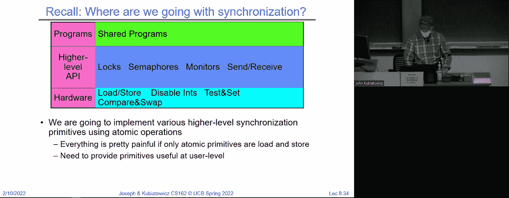
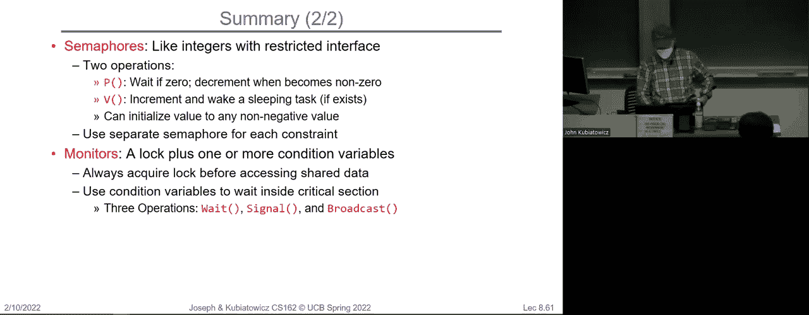

# 操作系统课程 P8：第8讲 - 锁、信号量和监视器 🔒

在本节课中，我们将学习操作系统中的核心同步机制：锁、信号量和监视器。我们将探讨如何利用硬件原语构建高效的锁，并理解更高级的同步抽象如何解决复杂的并发问题。

---

## 概述 📋

上一节我们讨论了仅使用加载和存储指令实现同步的复杂性。本节中，我们将看看如何利用更强大的硬件支持来构建更实用、更高效的锁，并引入信号量和监视器这两种更高级的同步原语。

---

## 从简单锁到硬件支持

我们之前尝试仅用加载和存储实现锁，但代码复杂且线程间逻辑不同，难以推广。一个理想的锁应具备统一的获取（acquire）和释放（release）接口，并能让等待的线程进入睡眠而非忙等。

### 禁用中断的尝试（单处理器）

一种思路是利用禁用中断来防止线程切换，从而保护临界区。

```c
// 天真的方法：直接通过禁用/启用中断实现锁
acquire() {
    disable_interrupts();
}
release() {
    enable_interrupts();
}
```

**问题**：
*   用户程序不应拥有禁用中断的权限。
*   长时间禁用中断会阻碍系统响应关键事件（如硬件中断）。
*   不适用于多处理器系统。

### 改进：使用中断保护实现锁

我们可以在内核中，利用短暂的禁用中断来实现一个真正的锁数据结构。

```c
int lock_value = 0; // 0=空闲，1=忙碌
queue_t wait_queue;

acquire() {
    disable_interrupts(); // 进入元临界区
    if (lock_value == 1) {
        // 锁已被占用
        enqueue(current_thread, wait_queue);
        sleep(); // 将自己挂起
    } else {
        lock_value = 1; // 获取锁
    }
    enable_interrupts(); // 退出元临界区
}

release() {
    disable_interrupts();
    if (!is_empty(wait_queue)) {
        thread = dequeue(wait_queue);
        wakeup(thread); // 唤醒一个等待线程
    } else {
        lock_value = 0; // 无等待者，释放锁
    }
    enable_interrupts();
}
```

**关键点**：
*   锁本身是一个内存变量（`lock_value`）。
*   `acquire` 和 `release` 中的核心操作被一个**元临界区**（通过禁用中断实现）保护，确保其原子性。
*   当线程无法获取锁时，它会将自己放入与该锁关联的等待队列并进入睡眠，从而避免忙等。
*   `sleep()` 和上下文切换的细节由内核调度器处理，它遵循“进入调度器时中断总是禁用”的规则。

**局限性**：此实现依赖于内核特权（禁用中断），且不适用于多处理器。

---

## 原子指令与多处理器锁

为了在多处理器上实现用户态的锁，我们需要硬件的原子读-修改-写指令支持。

### 常见的原子指令

*   **测试并设置 (Test-and-Set)**: `TAS(addr)`：原子地读取地址`addr`处的值，并写入1，返回读取到的旧值。
*   **交换 (Swap)**: `SWAP(reg, addr)`：原子地交换寄存器`reg`和内存地址`addr`处的值。
*   **比较并交换 (Compare-and-Swap)**: `CAS(addr, expected, new)`：如果`addr`处的值等于`expected`，则原子地将其设置为`new`并返回成功；否则返回失败。
*   **加载链接/条件存储 (Load-Linked/Store-Conditional)**: 一对指令，允许构建更复杂的原子操作。

### 基于“测试并设置”的忙等锁

利用原子指令，可以构建一个简单的锁，但线程在等待时会“忙等”（自旋）。

```c
int lock = 0;

acquire() {
    while (test_and_set(&lock) == 1) {
        // 锁为忙碌状态，循环等待（忙等）
    }
}
release() {
    lock = 0;
}
```

**问题**：忙等浪费CPU周期，尤其在单处理器上，等待线程会阻碍持有锁的线程运行。

### 优化：测试并测试-设置锁 (Test-and-Test-and-Set)

```c
acquire() {
    while (1) {
        while (lock == 1) {} // 先普通读取（可能在缓存中）
        if (test_and_set(&lock) == 0) { // 再尝试原子获取
            break;
        }
    }
}
```

**优点**：减少了多处理器环境下对内存总线的争用，但仍是忙等。

### 迈向无忙等：混合锁（如Linux Futex）

理想锁的目标是：无竞争时快速（无需进入内核），有竞争时让等待者睡眠。

以下是利用原子指令和系统调用（如信号量）实现混合锁的概念模型：

```c
int lock = 0;
bool maybe_sleep = false;

acquire() {
    while (test_and_set(&lock) == 1) {
        // 获取失败
        maybe_sleep = true;
        semaphore_wait(&lock); // 系统调用，进入内核休眠
        maybe_sleep = false;
    }
}

release() {
    lock = 0;
    if (maybe_sleep) { // 可能需要唤醒
        semaphore_wake(&lock); // 系统调用，唤醒等待者
    }
}
```

**实际实现**（如Linux的Futex）更为精巧，锁可能有三种状态：`UNLOCKED`、`LOCKED`（无竞争）、`LOCKED`（有竞争，需内核介入）。仅在检测到竞争时才进行系统调用。

---

## 生产者-消费者问题与锁的局限

为了协调更复杂的交互（如生产者-消费者），仅使用锁会带来问题。

考虑一个有界缓冲区，使用锁保护：


```c
// 生产者伪代码
producer() {
    acquire(&buffer_lock);
    while (buffer_is_full()) { // 缓冲区满，等待
        // 问题：持有锁时循环等待！
    }
    enqueue(item);
    release(&buffer_lock);
}


// 消费者伪代码
consumer() {
    acquire(&buffer_lock);
    while (buffer_is_empty()) { // 缓冲区空，等待
        // 同样的问题！
    }
    item = dequeue();
    release(&buffer_lock);
    return item;
}
```

**问题**：如果生产者持有锁时发现缓冲区满，它会循环等待。但此时消费者无法获取锁来消费物品，导致**死锁**。

一种低效的解决方法是不断获取和释放锁来检查条件，但这会导致**忙等**。我们需要更合适的同步原语。

---

## 信号量：更通用的同步原语 🚦

信号量由Dijkstra提出，是一种比锁更通用的同步工具。

### 信号量定义

信号量 `S` 是一个非负整数，支持两种原子操作：
*   **P (或 down/wait)**：如果 `S > 0`，则 `S = S - 1`；否则，调用线程阻塞，直到 `S > 0`。
*   **V (或 up/post/signal)**：`S = S + 1`，并唤醒一个（或多个）正在 `P` 操作上阻塞的线程。

初始化时设定 `S` 的值。

### 铁路信号灯类比

将信号量视为铁路信号灯：
*   初始值 `S = 2` 表示允许两列火车同时进入路段。
*   火车通过前执行 `P(S)`：若 `S>0` 则减1通过；若 `S=0` 则等待。
*   火车离开后执行 `V(S)`：`S` 加1，并可能唤醒等待的火车。

### 用信号量解决生产者-消费者问题

以下是使用两个信号量的解决方案核心思路：




```c
semaphore empty_slots = BUFFER_SIZE; // 初始为空槽数量
semaphore filled_slots = 0;          // 初始为已填充槽数量
mutex buffer_mutex;                  // 保护缓冲区内部分配的互斥锁

producer() {
    while (1) {
        item = produce_item();
        P(empty_slots); // 等待有空槽
        acquire(&buffer_mutex);
        enqueue(item);
        release(&buffer_mutex);
        V(filled_slots); // 通知消费者有新物品
    }
}

consumer() {
    while (1) {
        P(filled_slots); // 等待有物品
        acquire(&buffer_mutex);
        item = dequeue();
        release(&buffer_mutex);
        V(empty_slots); // 通知生产者有空槽
        consume_item(item);
    }
}
```


**优势**：生产者会在缓冲区满时自动阻塞（`P(empty_slots)`），消费者会在缓冲区空时自动阻塞（`P(filled_slots)`），无需忙等，且不会死锁。

---

## 总结 🎯

本节课中我们一起学习了：
1.  **锁的演进**：从复杂的软件实现，到利用**禁用中断**（单处理器内核），再到基于**原子指令**（如测试并设置、比较并交换）构建用户态锁。我们探讨了忙等锁的问题以及混合锁（如Futex）的设计目标。
2.  **锁的局限性**：在解决如**生产者-消费者**等多线程协调问题时，仅使用锁容易导致死锁或忙等。
3.  **信号量**：作为一种更高级的同步原语，信号量通过 `P` (down) 和 `V` (up) 操作，优雅地解决了资源计数和线程等待/唤醒的问题，是构建复杂同步模式（如生产者-消费者）的基础。

在接下来的课程中，我们将继续探讨另一种高级同步抽象——**监视器**，并深入更多同步实践与模式。



---
*(感谢收看)*