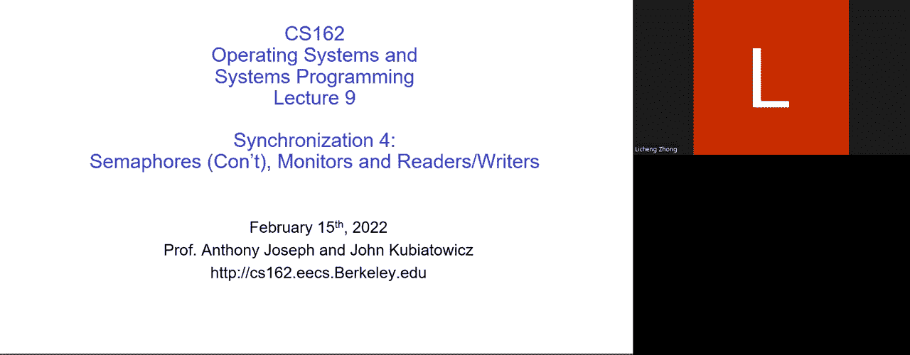
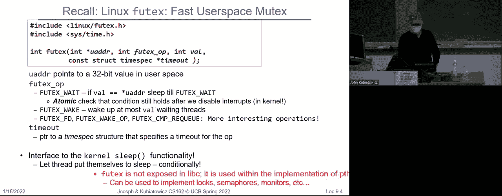
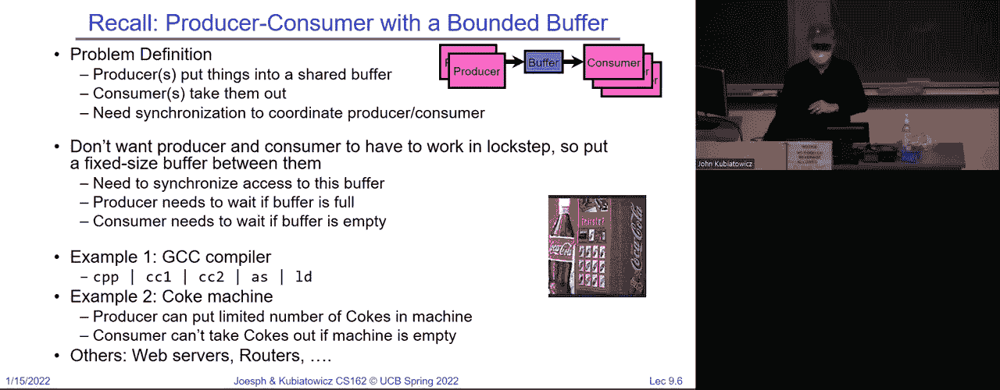
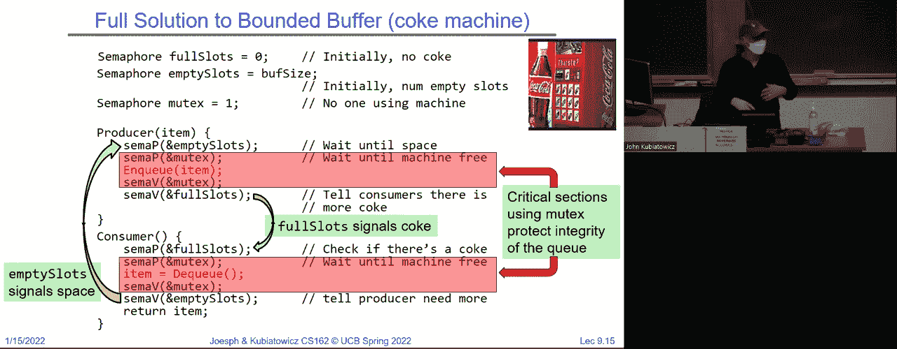
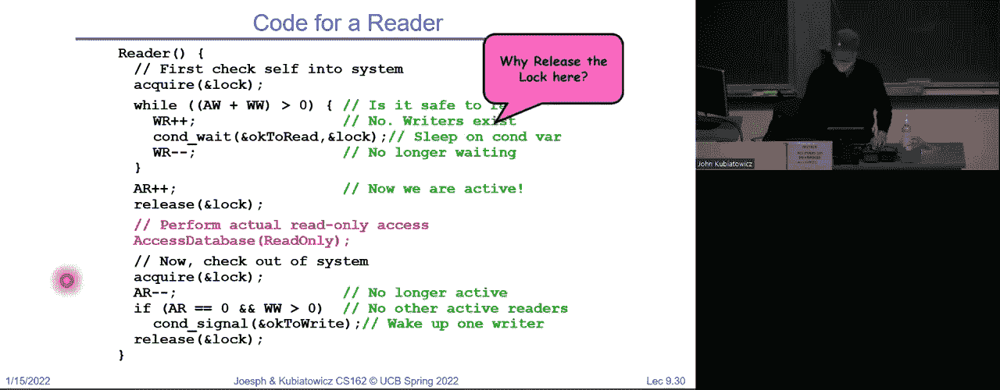
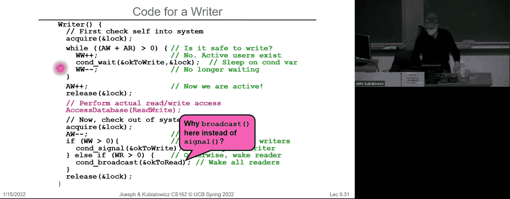
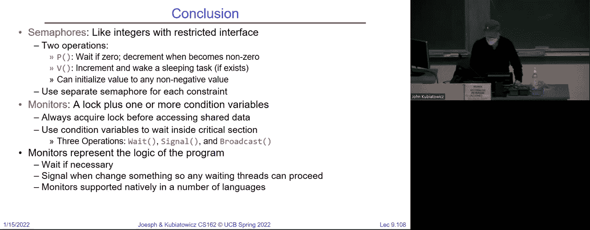

# P9：Lecture 9： Semaphores (Con't), Monitors, and Readers Writers - RubatoTheEmber - BV1L541117gr

 All right。

 Welcome everybody。 Today is the last synchronization lecture and we want to make sure we get through some good material so you're ready for the exam。 So this is going to be a lot of the same material in that extra lecture that I updated but put up there on Thursday but it's going to be。

 live and in person， so you'll like that。 So if you remember from last time we've been talking about synchronization。 And one of the things that we did was we introduced this idea of atomic instruction sequences。 And this is really what's going to make synchronization work well for user mode because otherwise the best we have is interrupt disable and enable or loads and stores and neither of those are terribly great solutions that we saw right so we have test and set is one of the atomic instruction。

 sequences that you should become very comfortable with because that shows up on pretty much any architecture these days。 Some other more interesting ones are things like swap。 Where swap basically takes a register and a memory location and swap some chess and set。 Takes a memory location put the one there right。 And then when swap takes two registers checks and sees whether the first register matches what's in memory and if it does then it stores the second register into memory。

 Okay， and then this link load link store conditional is another more risk RIC style of atomic instruction sequence that that I talked about briefly but we're going to hold off on talking more about that later。 So， what are the options on these atomic sequences。 Yes。 Yeah。

 so there's a swap instruction and then there's the wrapping of swap。 So that you can use it in code or whatever so the swap the simple instruction just takes a register and memory and swaps them。 And when you're done there's something in a register in C code that's not terribly helpful because you don't have visibility into registers。 So oftentimes a swap macro or whatever returns the value in the register。

 And that's why that's kind of why I show it here。 Actually。 I don't show a return here but the idea is if you return the value in the register then it would be。 you know， when you do swap you get back to thing that wasn't memory。 And you can use it。 And I'll show you that slide you're thinking of it just a second。 Okay。 Yeah。 So。

 all of these things are atomic。 Okay， so in this particular compare and swap is in x86 it's also in the 68。000。 But what it means to be atomic is all the things I said and that I show here all happen in a way that can't be interleaved or interrupted by any other threat。

 So it's a single instruction。 So in the case of the compare and swap。 which again is on x86 to registers a memory location check the first register against the memory if they match you store the second register into memory。 And what term comes back is a successor failure so in the case of compare and swap。 If you did do that store you get success if you didn't do the store because the first didn't match then you get a failure。

 Okay。 Yep， each of these first three are single assembly instruction。 Yes。 Okay。 Good。 And the reason these are helpful to us to build all sorts of complex synchronization is we need the ability to do both a store and a load in order to really synchronize and so that's kind of why we need to tie them together in some way。

 Okay。 So， and then we started building better lock so here's an example of using test and set。 Where the test and set stores a one in memory gets back what was in memory before and returns it in this case in C。 So then I can say something like well test and set。 Well。 so then we looked at using test and set as a native synchronizing operation decided that was a little too complicated so this was our better lock。

 which we spent a lot of time talking about where we actually have both a guard and a series of locks in memory。 And the idea here is you quickly check the guard。 And if the guard is free。 then you go ahead and do your lock otherwise go to sleep。 And if it was for you get it in return and so we're using the guard kind of like interrupt disabled and enable。

 And so we talked a bunch about that。 We also talked a bit about few texts。 So few texts is a hidden lib C or the hidden system call that helps you do synchronizing。 Okay。 and it's the libraries that you've been using like the p thread new texts and so on use few texts。 And so the basic you text system call takes a memory location of value in an operation。 And it。

 it basically， depending on what the operation is either goes and wake somebody up。 or says that if the what's in the memory location doesn't match。 And so if you're not going to do that， but if you're not going to do that， you can't do that。 And so if you're not going to do that， you can't do that。 And so if you're not going to do that。

 you can't do that。 And so if you're not going to do that， you can't do that。 And so if you're not going to do that， you can't do that。 And so if you're not going to do that。 you can't do that。 Yeah， you got a disabled interrupts， got a mess with the scheduler queue。 So going to sleep is not a user level operation。 So you have to do something like going to the kernel to do that。

 Few texts is an interface that cleanly lets you go into the kernel without having to do that all the time。 Okay， and in fact， there was this， which we're not going to talk about further。 I did talk about last time， where this was what was being done。

 This was what was being referenced earlier， but the key aspects of this is at user level。 It quickly grabs the lock if it's available and releases the lock。 And if there's no contention。 so you're the only thread grabbing and releasing this particular implementation has a really nice property that you never go into the kernel。 So if you do a quick grab of a lock， do something， release a lock， and you're the only thread。

 This implementation will never go into the kernel。 So this is a really nice one for users。 It also doesn't spin away。 Okay。 And so that's， that's basically what you get when you get the p thread kind of synchronizing operation。 Okay， so I don't want to get up on this one because I want to get back to talking about more powerful synchronizing than locks。 Okay， so， oh， go ahead question。 Nope。 All right。 So， um， go ahead， you can ask your question。 Yeah。

 so what， what happens when you do atomic operations。 but you run run them from C is typically you make it look like a。 Make it look like a function call and contested is a value。 but that gets put into a register and my lock is a location and then when you do a swap contested was in the register gets put in memory。

 So that's kind of what this， this syntax means and it compiles out to some assembly of instructions。 And those of you who are really looking in your code might have actually seen some assembly instructions embedded in C。 Okay， so the G， the GCC compiler， etc， has a clean way of taking something which interacts with registers and memory and wrapping what looks like a function call around it so that's what's going on here。 All right， good。 Now。 So we were looking at the Coke machine example so that's this bounded buffer。

 where the buffer has a finite size， and you have in consumers that are drinking the Coke and end producers that are producing the coffee。 And that doesn't matter how many so you could have M and N whatever， but there are many。 and the buffer is fixed size and we want to have really clean semantics so that if there's no space left in the buffer。 And a producer comes along and the producer tries to put something in the buffer goes to sleep。

 And then it'll get woken up later when there's space and the same for consumer if a consumer tries to grab something out of the buffer。 And if there's nothing in there， then the consumer will go to sleep until somebody produces。 Okay。 And the analogy here was with the Coke machine， which is really well。 you can only put so many cans in a Coke machine so when the delivery guy comes by and the Coke machine's full。

 He falls asleep。 Okay， so maybe the analogy is a little bit strained but， and furthermore。 when you're desperate for that caffeine fix and you go to the machine and it's empty。 And if I fall asleep， that one seems more realistic。 The guy comes by puts cans in their wakes up you get your can and go on。 Okay。

 so the Coke machine here is the bounded buffer。 All right。 Okay。 And there was a question previously in the chat about what atomic means atomic again means uninterruptible sequence that can't be interrupted。 So， we don't want the producer or consumer to have to work in lockstep so we want this to be a synchronous in the sense that producers can come at any time consumers can come at any time。 And we want the right waiting conditions。 And I gave example like the GCC compiler with pipes。

 of which you guys are now very comfortable with is， you know。 see the C pre processor goes to standard out something that then is pulled in the standard in by the first phase。 of the C compiler， second phase decompiler assembler loader。 That pipe is a bounded buffer。 Okay。 so that's exactly what we're talking about。 And then the Coke machine example and then web servers and routers and all of them have these bounded buffers so this is a extremely useful kind of idea here。

 And now when we start thinking about what to do， we have to start by thinking about the data structures underneath so 61 B。 you learned all sorts of cool data structures。 Okay， this is the most boring of them。

 One， I'm sure that you learned about this is a circular buffer of finite size。 There's a head and a tail pointer or a right pointer and a read pointer。 And the idea is that when you go off one end you wrap around and depending on the relationship between the right and the read pointer。 there's either nothing in there or it's full， etc。 Okay， and that's all 61 B kind of material。

 But what you can see here is that in order to either insert or remove something from this buffer。 we actually have to look at the right index and the read index compared to each other。 And if two threads are doing that simultaneously for one of them is a right， for instance。 we're going to get screwed up。 Okay， so that's a synchronization problem。 Okay。 So。

 we can very easily ask ourselves questions like， what needs to be atomic here。 So what does need to be atomic and making this work properly。 Anybody。 Yeah， incrementing an index。 but that can't be the whole deal。 It's not just the incrementing right it's also got to be the comparing of the index with the other one before we increment so that's got to be atomic as a sequence。 Because if you do a comparison， and you get ready to increment but somebody else feels something out from under you and then you increment now the queue is all screwed up right so there are groups of instructions that have to be together atomic。

 So everybody with me on that it can't be just one thing。 And by the way。 incrementing is itself a problem because you got to read from memory。 add something or back so that clearly needs to be made atomic but also the comparisons do it well。 So that's the first thing to be thinking about when you're trying to synchronize。 Okay。 And。

 you know， so here might be our first cut， because we need to do synchronizing。 And across and between users， we might say let's put a lock。 Okay。 and so to produce something the producer grabs the lock on the on the queue。 and then it in queues an item and releases the lock。

 So from the standpoint of not screwing up the queue。 This seems pretty good。 Okay， because if two。 two producers or producer in a consumer come along。 and they both want to mess with the queue only one of them gets the lock。 So we want to be careful about that so for instance the consumer side again we acquire and release the lock。

 Okay， what's wrong with this code。 Yeah。 So this is really buggy code。 Okay。 This as soon as you hit one of the conditions you're basically going to lock up and white let's figure that out we acquire the lock。 We check the buffer condition。 And we say， oops the buffer is full。 Okay。 so I'm the delivery guy I got a fallen sleep in front of the coke machine。

 And then I'm going to wait until somebody empties the coke machine。 And then you have the lock。 So who can empty。 Well here's you guys right here are the students going after the coke。 They try to acquire the lock before they grab one but they acquire the lock they go to sleep。 because the lock is taken。 Okay， so the producers got the lock the producer is permanently spinning the consumer tries to grab the lock the consumer goes to sleep。

 And then you have a bunch of delivery， one or more delivery people just one actually standing in front of the machine and a bunch of sleeping students。 and no coke can pass anywhere。 Okay， so this seems like a bad solution。 And I want to make sure everybody's clear on why this is bad。 Okay， are there any questions on this。 As long as you never fill the machine or empty the machine this works fine。

 But that's not the point。 Right， we got it we're trying to make a bounded buffer。 We wanted to have an infinite buffer， where I guess you could walk away with an empty coke。 and maybe it would be okay to remove these wild， loops but that's not our goal right now。 Okay。 Questions before we move on。 So the root of the problem here is we're actually combining multiple things。

 kind of in a single lock， which is really what's causing us trouble here。 We're combining atomic operations on the queue in a way that the queue doesn't get screwed up if more than one producer or consumer is there。 At the same time we're trying to check resource conditions on whether the queue is fully full or empty。 And those two are being combined together in a single lock and that's really what's going to cause us the trouble。

 Okay， and we can not gracefully we could do this。 All right， so this is not graceful code。 It's okay code so it won't lock up but notice the thing I did that's different。 It's right here in the while loop I say well while the buffers fall。 Release the lock acquired again， etc over and over again and I spin release release acquire release acquire release acquire over and over again。

 And why does that prevent me from locking up。 You guys think that through in your brain yeah。 If you release you don't go to sleep。 But imagine that situation。 So the the coke man shows up。 The buffer is full。 Meanwhile a student comes by and they try to acquire the lock but the lock is taken so they go to sleep so the consumer is sitting here sleeping。 And the producer has the lock but we release it。 Okay。

 and when we release it it's not that we go to sleep。 It's that the other student the student there gets woken up。 So now we have two things。 Two threads that are both on the ready queue and can run。 And that means that we let you know we can let the student grab a coke。

 And then the and then the producer will acquire the lock again find that the buffer is not full and be able to do an item。 But this is this is not great for many reasons。 The first one is it's busy waiting。 Okay。 so this busy wait is problematic。 We've talked about that before but if you look at any either the producer or the consumer they're busy spinning over and over again。 Okay release the choir release the choir release the choir。 And so that's wasting instruction time。

 And the second thing is there's really no guarantee that if you release this lock and have both a consumer and a producer ready to run that you don't grab the lock again right away。 Okay， and then the consumer gets to run and check if something's empty whatever and then they go back to sleep immediately so there isn't any ordering on this either。

 So this is just， you know， they'll run and eventually it'll make progress but it's not a great solution。 Okay。 Yeah。 Okay。 So， it can。 So the question was so when we have led everybody on the ready queue。 Can it the ordering is there a live lock situation where they still don't make progress potentially。 Okay。 Now， there is a question in the chat saying， well。

 so this is not as bad of a busy wait as we have in the prior solution well the prior solution was just straight up locked up。 Anyway， that's just broken。 This one is not great。 Probably will make progress。 Okay。 but this is still not this is not good code right if you wrote this in anything other than PowerPoint slides for this class we might question it more than once。 Okay， so let's do something else。 And that is the pick the right abstraction。

 So the real problem here is that we're restricting ourselves to using locks。 which are really very primitive。 I mean they're， they're better than not having locks。 but we would like a higher level primitive that lets us express the。 parallelism we're expecting in a way that's more natural。 Okay， and that's going to be our goal。

 And so good primitives and practices are very important。 So， the execution。 I hope by now this point in the class you realize it's not really sequential all the time because we have threads around here and then they run here and they run here and they run here there's currency they're in early。

 et cetera。 And so it's really hard to find bugs when you have non determinism going on。 And so really。 The thing that we want by picking the right synchronization primitive is we want to make sure that we're likely to write code that's correct。 Okay， and we do that by picking a good synchronization primitive。 Right。 and so locks are going to be in the back of your pocket now。 But let's see if we can do better。

 And I pointed out before that you in Unix is pretty stable now but boy in the 80s。 And there were all sorts of weird synchronization bugs that people didn't really understand。 So synchronization is a way of coordinating multiple activities using shared state。 Okay。 so let's talk about semaphores now semaphores are a step up from locks。

 And they're kind of like a generalized lock and they were first defined by dyke string in the 60s so they've been around a long time。 And then the main synchronization primitive and a lot of versions of Unix。 Okay。 and so what is a semaphore so a semaphore is a non negative integer with two operations down or P and upper V。 Okay， and the P operation is an atomic operation that takes weights for the semaphore to become positive and decrements it by one。

 And the V operation increments by one and if there's somebody sleeping at that time。 they'll wake them up。 Okay， and so let's think about this a second。 It's a non negative integer。 You get it at the beginning and once you've said it， that's it。 It's initialized you can never read it again so the interface doesn't even allow you to look at the value。

 but you only have P and V。 Okay， and so， P says， decrement。 unless it's going to zero or lower and then put me to sleep。 And then it says increment and if you're going kind of from zero to one and somebody's sleep and you wake them up。 Okay， so it's it's a， it's an interesting type of integer。 Okay， now I showed you this。 So。

 I'm not going to do fun with animation。 So semaphores are like integers except no negative values。 The only operations allowed our P and V。 And by the way， you know， P and V were the original。 So names came from Dutch down and up or sem semi down and semi up。 These are all options here for the name for this， you'll have to have a little flexibility。

 but we'll make sure that you know， which one to use。 So， if it matters。 but let's talk about P and V for now we're going to be traditional。 but the only operations are P and V。 So you can't read or write the value and the operations have to be atomic。 So why is that important that says that if， if the semaphore is zero and somebody's trying to execute a P on it。

 it will notice that it's zero and put themselves to sleep simultaneously。 So。 if you're going to make operation V is also atomic。 If you're going to go from zero to one。 You look at the very time you go from zero to one you look and you see is there somebody wake up you wake them up atomically。 So it's important that those kind of two things are bound together atomically otherwise we don't get synchronization behavior once again if there's any interleaving we're going to be in trouble。

 Because we don't want a spread that executes a P and starts going to sleep。 And another thread executes V to somehow end up with a situation where you've decremented the semaphore to zero and V is incremented it to one but somehow this original thread is sleeping。

 Okay， that would be a failure with atomicity so we never want to have that happen。 Okay。 and so POSIX adds the ability by the way to read the value but technically not legal。 And the semaphore comes from a railway analogy which I showed you so here's a semaphore lighting system。 We initialize the value to two。 And now when trains come by they're going to try to execute the P operation on that value。

 It doesn't go below zero they'll be okay。 Okay， so here notice the train came through it executed the P or the down operation value went to one the train got through。 Second one value went to zero the train got through。 So now what happens when the third train comes by。 It's going to go to sleep because it's going to execute a P operation and it's going to notice well I can't do that because it would take value below zero。

 And therefore I'm going to sleep so this train is sleeping。 These trains are I don't know that thinking or whatever。 And now when the train leaves will increment will execute a V operation。 And so。 atomically this train is going to exit execute a V operation which will increment the value to one and wake up this thread to redo its P operation and notice。

 Did you see how value went to one and then back down to zero again。 And so that's that's the basic notion of this atomicity。 Okay， question。 Yeah， go ahead。 Oh， yeah。 go ahead。 I'm on the aisle。 Sure。 So， good question。 So I set my initial value to two。 Does that mean that only two will ever be able to be in there。 Okay。 No。

 What it means is that if I execute a bunch of V operations。 I could get the value way up and then a bunch of P operations could come through。 So really that initial value has more to do with how you're intending to use this。 So if I said V to one。 What do I have。 A lock。 Because if I said it to one。

 the first P operation that happens takes it to zero。 The second one puts it to sleep or the third or the fourth or the fifth one all go to sleep。 As soon as the person who's got the lock increments it with a V。 One of those sleeping ones will wake up and execute their P operation and keep going。 Yes。

 How does it choose which one to wake up。 Well， that's one of the big mysteries of the universe。 Undefined。 Okay， so unless your semaphore says will wake people up in FIFO order。 It won't wake them up in FIFO order。 Okay， in fact there's guaranteed it'll do whatever will break your algorithm。 Right。 That's the。 That's Cooby's bad scheduler， malicious scheduler rule number。

 whatever number I gave to it in a previous lecture。 Okay。 Now there's another question。 Go ahead。 Oh， okay。 So if I said it to one， I basically get a lock。 If I set it to zero， what do I get？ Yeah。 Yeah， you get a wait for somebody else。 Very good。 So， if I said it to zero。 the first thing comes along。 If I set it to zero， I get a something I can wake up somebody else with。

 What if I set it to two？ Well， you can see that we can start getting constraints on numbers of things。 Okay。 And I hope you're all thinking ahead。 Well， obviously this is got something to do with the Coke machine。 Right。 You can imagine that we have constraints on sort of number of cans of Coke and number of empty slots。 Okay。 So， if we re to this now。 Again， we have a couple of uses the semaphoreth one's mutual exclusion。

 That's often called a binary semaphore or a mutex。 Okay。 and that gives us something like a lock because we pair up a semi P with a semiv or scheduling constraint。 Okay， here we allow one thread to wait for a signal from thread to that would be setting it to zero。 Here's a way of doing thread join right so if you ask the join。

 you execute a semaphore on a semaphore started to zero and the thread you're waiting to finish executes the V and now you both get to go forward。 Now， let's revisit the bounded bounded buffer so I could practice constraints are threefold。 So one the consumer has to wait so that there's a full buffer one buffer， right entry。 And so if the if the buffer is completely empty the consumer needs to sleep。

 The producer has to wait for there to be some empty slots。 So if the if the bounded buffer is completely full， the producer has to go to sleep。 And the thing that we started all this mess with， we still need to do atomicity on the queue operation。 So we want to make sure that multiple threads don't mess with the queue at the same time and screw it up。

 So this actually leads us to wanting three semaphores to do a proper bounded buffer。 Okay。 one for the full condition one for the empty condition and one to serve as a lock essentially to make sure that the queue itself is not screwed up。 Okay。 And so why do we need the mutual exclusion， because computers basically are stupid and don't figure things out。 And of course in real life the delivery person probably figures it out when there's a student sleeping in front of the machine probably figures out that they probably want to buy a coat or something right。

 So the general rule of thumb for semaphores is use a separate semaphore for each constraint。 And here we have a full buffer empty buffer and mutex constraint， we have three buffers here。 And so the full solution of the bounded buffer looks like this semaphore full slots。 We started zero， said there's no coke empty slots we said at the buffer size and mutex we said it won so this mutex is going to be a lock for us。

 The other two are going to be constraints on the consumers and the producers。 Okay。 Now。 here's what our producer looks like。 It does a semaphore on the empty slot so it basically says。 If there are zero empty slots， then we need to put the producer to sleep。 And notice that they do that before they grab the mutex on the queue。 Okay， so we check first。

 Is there some place for the coke。 Or we actually enter any operations on the queue。 that makes sense everybody。 And then， assuming that this works so we don't go to sleep here or we get woken up one of the two。 We then grab the mutex and cue our coke release the mutex。 And then at the as a parting shot。 We increment the number of full slots because we put a Coke can in there。

 And the consumer is kind of like a mirror image of this right so the consumer first checks and set it sees if full slots is empty。 If there's if this is zero then there's no coke in the machine。 But if it's not zero I get through。 I grab the mutex I do my DQ。 I add the mutex or add back to unlock the mutex and then I as a parting shot。 Sort of tell the producer we might need more。 By incrementing the number of empty slots。 Okay。

 and so really。 The mutex is giving this these red critical sections on the queue to make sure that。 Multiple threads don't screw up the queue。 Okay， the other things。 The full slot here semaphore is signaling the consumer that there's a new coke in the coke machine。 And the empty slot is signaling the producer that there's a place for coke。 Question yes。 Okay。

 Good question so the question here says what if there are two producers one gets through fills up the whole machine。 So if you look at this。 That's not the way this code is written this code is the producer has to go through this for each item they're at it。

 So what happens with two producers is they each have a coke they're trying to put in the machine。 And the only way both of them would get past this semaphore is if that semaphore was at least two。 they both decremented it to zero。 They've sort of grabbed a slot each。 And now it doesn't matter what order they get the lock one of them gets the lock first as their coach in the machine the other one gets the lock next。

 As their coke the machine and on exit they both kind of increment the number of full slots by one。 And because these are atomic operation。 Those increments。 Don't get screwed up。 There's no interleaving。 So the one of them does the V first and then the other one or vice versa doesn't matter。 But when we're done the full slots have gone up by two。 And furthermore。

 if there are two students that happen to be sleeping。 they both get woken up because the first V goes from zero to one wakes up the student。 The next V wakes up the next student。 Okay。 Yes。 So because we have a double sided constraint can't go below zero and we can't go above the max we need to semaphores because semaphores are one sided things。 Right， they only go from zero up。 And so really one semaphore is going counting the number of coke cans from zero up but the other ones counting the number of full slots from zero or empty slots from zero down up whatever to the full amount。

 So we need to semaphores there for constraints。 Okay。 How many people think this is kind of a cool solution。 Okay。 Good。 We won't judge your coolness or lack of coolness。 How many people think this might be a little complicated。 Okay， it's maybe it's not terribly complicated because I've just described it to you but imagine that this code's been around for。

 you know， five years and you go look at it now you got to figure out what's going on with the semaphore constraints right。 So it's powerful， which is， it's a uniform。 Excuse me。 a unified solution to all sorts of synchronization that's why semaphores are popular in Unix。 Because you can use them for locks you can use them for constraints。

 I don't think you can use them to solve the whole thing problem but， you know， pretty much， you can。 you do all sorts of synchronization with them so they're very powerful。 And so somebody who wanted to implement one synchronization primitive probably would implement semaphores。 at least in the original way of thinking， because you can do lots of stuff with them。

 But let's look at this for a second。 So why is there an asymmetry here well the producer does some of P on the empty buffer and some of the on full bus buffer and the consumer does the opposite。 And really that's because producers produce and consumers consume and we're doing the opposite to the two things okay so maybe that isn't too surprising。

 What's kind of interesting is does the order of the P's matter here so what if we swap like this on the producer。 What happens。 Yes。 It's bad。 Okay， we don't do that。 Doctor it hurts when I swap my semaphore P operation don't do that。 Okay。 because this will this will lock it for exactly the same reason before we got into semaphores right because you lock the。

 you lock the queue。 And then you check the condition and go to sleep and now you got the lock on the queue and nobody can alter the queue so this is just bad。 What if I swap the V operations what happens。 Yeah， it's it'll work。 It might alter the scheduling efficiency because it might wake up one thread over the other and so on but really it's not going to deadlock anything。 Okay， because all we're doing is incrementing。 And that's a。

 you know you can swap increments without too much trouble。 So。 what if we have two producers and two consumers or five producers and a hundred consumers。 Does this code work。 Yes。 Okay， this code works perfectly well with many producers and many consumers。 Okay。 So， semaphores are good， but monitors which we're next going to talk about are even better。

 The semaphores are a huge step up。 Just think of trying to do the bounded buffer with only loads and stores。 Remember our got milk lecture。 A couple of a couple of lectures ago。 Imagine trying to do the bounded buffer with the got milk solution number three。 Okay。 that would have been just right out that's evil might have been something that we'd give you on a test。

 No， I'm just kidding。 We wouldn't do that to you。 So the problem here is really that semaphores are dual purpose。 They're actually both being used for mutex or mutex or locking and scheduling constraints and it depends on what you initialize them to and how you use them as to what happens。

 So it's great right now because you're sitting there you look at the code I've been explaining it to you。 But again， if you looked at your code five years from now， you'd have to re extract what's going on。 Right。 And it's sort of from a long term readability solution is probably not great。 Okay。 So much cleaner idea is let's go back to locks for mutual exclusion because that's what locks do。

 And let's pick something else for scheduling constraints and that's called a condition variable。 And the thing is that a monitor is a programming paradigm which has one lock and zero or more usually one or more condition variables。 Okay， and that's going to be what we're going to program with and some languages like Java actually provide this natively。 Most others use locks and condition variables kind of together。

 And they actually give you the idea of a monitor but they're all kind of programmed in the same idea。 And if we get there toward the end of the lecture I'll actually show you how monitors kind of show up in some languages will give you some code examples。

 Okay。 But what I want to do first is let's talk a little bit of Benestryvia。 So。 hopefully not a big surprise。 And then we'll be on Thursday that's two days from now。 We will be announcing kind of what rooms to go through because there's two because there's three rooms。 And we have to make sure that all is well on that front。

 And there's two rooms and a bunch of others。 Okay。 If you're sick， let us know。 Don't come to the test to the test if you have a positive COVID test。 Okay， just just say no。 Okay。 talk to us。 I'm not going to be in the office for office hours today but I will be there during class time on Thursday for office hours as well as tomorrow's normal office hours at one。 Okay， so， come by。 I also， except for this morning。

 Have been trying to answer lecture questions on Piazza as well。 So。 there's another venue there for asking questions。 Okay。 So。 let's ask ourselves what is a condition variable。 Okay， and。 So， how do we change， for instance。 the consumer routine to wait until something's on the queue。

 And we've already shown you how to do this by keeping counter the number of things with a semaphore but this is really pretty error prone。 So instead we're going to use this idea of a condition variable。 which at first blush is a little weird。 Okay， and let me tell you why it's weird。 That's weird is you grab a lock， you check a condition and the condition is not right。

 You go to sleep with the lock。 Okay， how many people think that that sounds bad。 Okay， yeah， good。 Sounds bad。 It turns out it's okay。 Only this one instance。 That's what condition variables are for。 They're made in a way that you go to sleep with the lock。 If the right conditions aren't present。 Okay， and under the covers， it'll take care of unlocking locks whether people can get in。

 but the paradigm， which I'm going to want to get you warp your brains。 That's my job， by the way。 warping brains is what I do is to understand the pattern this paradigm programming where you lock things。 check conditions， and go to sleep with them。 And the operations are some form of a weight operation where you give it the lock。 Okay， so wait says go to sleep。 But here's the lock， by the way， which I currently have locked。

 so you can imagine why this doesn't deadlock everything right。 And then you can see a signal which says wake up one waiter。 And broadcast which wakes up all the waiters。 Now。 if you look at this from a object oriented standpoint， you think of them this way。

 So that's what Java gives you。 If you're talking in C with P threads。 you're going to also have another pointer to the condition variable because obviously these operations are on the condition variable。 Okay。 You always have to hold the lock when you do any of these three things。 Holding the lock means you acquire it。 Okay。 So， so monitor with condition variables is really has a lock。

 which provides mutual exclusion。 You always acquire it kind of before accessing shared data structures。 so you might have a lot of people trying to get into the monitor。 So you can have many condition variables in your program and they all represent weight cues that you can sleep on。 So what we're really doing is we're taking that thing that the kernel can do so easily like have weight cues that you put yourself to sleep on。

 And we're exporting it up at the user level so you the user programmer can use it。 And that's kind of why this is such a cool idea。 And in contrast to semaphores。 where you can't grab a lock and go to sleep。 So remember when we swap the P operations we deadlocked our coke machine。 And heaven forbid it's four in the morning and never want to deadlock your coke machine。 Okay。

 With with condition variables。 And that's not going to happen。 Okay。 And so I want to give you an example of a buffer。 Okay。 this is an infinite synchronized queue so we can put an arbitrary number of things on here。 I'm only doing it one sided to show you。 But for instance， we have a lock。 That's the buffer lock。

 We have a condition variable and a queue。 Now that queue is an object with link lists or whatever。 Maybe it's using your list operation。 And that's a big bond of these days from from pit tops right。 So the producer。 What is the producer has to do the producer。 Basically， since it's an infinite。 We're not worried about filling it up， but we are making sure that when we put something on that cue。

 We don't screw the queue up。 And if anybody sleeping in front of the coke machine waiting for a coke we wake them up。 Okay， and that the way that looks is very simple we acquired the lock。 Hold on。 Let me just get my。 my magic laser pointer。 So we acquire the lock here。 And then because we have the lock。 we can in queue an item on the queue without worrying about somebody getting screwed up。 Okay。

 And then we do a signal to on that condition variable to wake up somebody waiting for the queue。 And then we release the lock and we're good to go。 And then we're going to get the producer here on this one sided cue is pretty simple。 It's just has to be able to wake up people that are sleeping。

 The interesting thing here is in the consumer， because the consumer。 when it goes to get an item off the queue needs to be put to sleep。 If there's nothing there。 Okay。 because if you go to DQ from a queue and there's nothing there you get back。 No， it's messy。 And then we have you wait until something shows up。 And so here's the pattern。

 We acquire the lock like we always do。 So now we're in the monitor。 And now we say while the queue is empty。 While the cubing empty is bad for us because we need something will do a weight。 Where we give it the condition variable in the lock。 That's we're doing C like syntax here。 And notice that we put this in a while loop。 If you're empty， go to sleep。 When you wake up。

 check again if the queue is empty。 If it's not empty anymore。 We pass through the while we deque the item。 We release the lock。 And we return the item。 And because we have checked to make sure the queue wasn't empty before we deque。 We know that this item that we're returning is non no。 This looks straightforward。

 But there's some really interesting things embedded in here that I want to talk about。 So one。 Yeah。 go ahead。 Ah。 So， because just use that as a rule。 you always are inside the lock whenever you do wait signal or broadcast。 Okay， call that a rule。 Yeah， call it a rule。 Go ahead。 Good。 So。 Question is when it wakes up from condition wait。

 does it have the lock acquired。 So here's what you need to do。 Remember brain warp。 Okay。 What do you see for this code？ I acquire a lock。 I do a bunch of stuff。 I released the lock。 That's what I see looking at this code， right？ Don't think hard。 Don't think too hard。 I acquire the lock。 I release the lock。 Well， I'm in here。 This is all about the lock。 Okay。

 don't get yourself hung up on the fact that you waited and， you know。 went to sleep and really to read this code at face value you grabbed the lock。 You do much of stuff。 You release it。 And then that's so powerful to think that way that all of this has a lock is I can say while empty。 And when I decide that this isn't empty anymore， I can go down here and DQ and I know for a fact that no other thread got in there and grabbed it out from under me because I have the lock。

 I mean， look， see， I grabbed the lock up here。 I released the lock down here。 Okay。 So we can talk about how to build this。 Maybe if you slide， but for now， if you think about this。 as I acquired the lock， I do all this stuff with the lock and then I release the lock。 It's a lot easier to understand what's going the code。 Okay。 So that because of that。

 you can say if I check that condition here and discover that it's not empty。 I can go ahead and DQ and I know for absolute fact that nobody stole an item out from under me because of concurrency because I have the lock。 And they had to grab the lock before they could do anything。 So therefore。 I am all powerful there for that little segment。 Yes。 So this is an infinite queue。 That's okay。

 I did double sided earlier。 Hopefully you can see how to make double sided really easily here。 but I wanted to start with a simple thing。 So there's no overflowing this queue just goes forever。 Yes。 Say again。 So this good question is this busy waiting。 No。 this is not busy waiting because I'm going to sleep most of the time。

 So I do a loop and I sleep until somebody signals。 So this is not wasting cycles。 This is really literally waiting for a signal condition。 So good question。 Question。 Yes。 Very good。 So， very good。 So you're determined to do implementation， which is a very admirable thing。 So how does this have to work， right？ This has to work that when I wait under the covers。

 The monitor condition variable runtime system， whatever that is。 puts me on a weight queue and releases the lock。 And it actually gives it to somebody else but releases the lock。 Automically， and before I wake up and come out of the way before I return from weight。 it real acquires the lock for me。 So as far as this code is concerned， I've always got the lock。

 And the only time I don't have the lock is sort of when I'm sleeping and don't， I'm not aware。 Good question。 Yes。 Yes。 Why do we have the wild loop？ Anybody want to take a stab？ Well。 you could say the producer， the producer is only woken up one because we do signal instead of broadcast。 Okay， but you're on it。 You're on a good path there。

 Just follow somebody else who else could steal this。 Yeah。 Yeah。 Remember we have multiple consumers， maybe one of them was sleeping。 But the producer wakes them up。 but the other one comes zooming in at just the wrong time and grabs the item out of the queue。 And so then we have to always check our condition double check our condition before we decide we've got the item。

 And in fact， that's a perfect intro into the next two slides。 So there are two types of scheduling that you see in condition variables and monitors。 One's called Mesa scheduling the other's called horror scheduling。 And notice that we're looking at this loop， which says， you know。

 we keep checking the condition and if it's not right yet going to sleep。 And then when we wake out of the condition we check it again。 And this is clearly what you were thinking when you ask your question。 Why don't we just say， well。 if the queue is not。 If the queue is basically empty， then we go to sleep。 Otherwise。

 we just fall through， right。 And the issue here is that it depends on what happens when you signal。 Because the simplest thing you could imagine， which is what's called Mesa scheduling is yeah you signal somebody and they just get put on the。 the ready queue and the scheduler is just doing its thing。 And if somebody else happens to get in there first， then they might steal it out from under you。

 Okay， but you can imagine so horror was actually a mathematician。 And he came up with a different way to look at this and I'll show you that on the next slide。 So this current weight while loop is kind of the simple thing which is called Mesa scheduling after the Xerox park Mesa operating system。 The other is named after a British logician。 And if you look at what his notion of a monitor is。

 is when you do signal。 You actually hand the lock to the sleeper。 And wake them up and let them run and then they'll eventually get back to you。 And thereby you guarantee that if I'm going to signal somebody they actually run right away and get the thing I signal them about。 Okay， so you can see why this might appeal to a logician right because it's nice and clean。

 So if we look at this sequence， where we have the signal or producer on the left。 and the consumer on the right， what we see here is that the producer grabs the lock。 because you always have the lock signals the consumer。 And immediately what happens is that thread gives the lock and the CPU over to the other thread。

 And let's it run condition weight， which then goes through release。 And presumably in the middle here is where we grab an item off the queue。 So we know for a fact that when we signal we are the ones that run。 And we are the champion。 we grab the guy off the queue。 And then it's when we release in our code is the point at which we say well atomicity is no longer required here let anybody run。

 And then what happens with the with the horse scheduling is we get the lock in the CPU back to the original guy。 And he gets to finish up what he's doing。 So on first grant plants this actually seems like really nice semantics because when you signal the person you're signaling gets what you asked them to。

 Okay， seems good。 Okay， but it turns out。 And most textbooks talk about this most operating systems do the other thing and can anybody tell me why you want to do the other thing。 Yes。 Well， you can give a lock， right， you just have to say okay you got the lock。

 And you know it's about it's about who comes out of a choir or condition weight in the right thing so handing a lock is not really a hard thing under the covers。 Okay。 Yes。 Good。 See， so all of you here are starting to get sophisticated enough that you can start asking questions about overheads。

 Right。 And if I go from this thread to this thread to this thread back again。 I've got context switching。 I got cash misses。 I've got all sorts of overheads in here。 And that may not actually be even necessary because we just put a while loop right in and it's not necessary。 And instead what most systems do is they just do the signal which all it does is takes this thread wakes it up puts it on the red。

 And then it just keeps going。 And that's the Mesa version。 So the signal just keeps the lock in the processor waiters placed on the red red acute no special priority。 And so on the same scenario signal。 Put the waiting thread on the red cue。 And we just keep going。 And we release and we run for a little while and sometime later the scheduler decides to put us to sleep and wake the other one up。

 And then that's not a conditional weight needs to check the condition again because it's been a little while since signal。 And if everything's good finishes。 Okay。 So that's called Mesa Scheduling and practically you need to check the condition again after weight。

 Okay。 Yeah。 Yep。 So， great question。 What we're worried about exiting the while loop and getting a contact switch in here and somebody gets in there and grabs it。 That's your worry。 Okay。 Anybody want to tell me why that won't happen that way。 Yes。 Yes。

 we have the lock。 Okay。 Remember， we're thinking about this as we've got the lock。 And so。 as long as we don't release the lock。 We have the lock。 And so no thread can get in there that's supposed to touch this cue because they all have to acquire that lock first。 And we've got the lock。 Great question though。 You see how that works。

 We got the lock we do our stuff we release the lock。 Now we can switch a bunch of threads。 You know threads xyzq can all run as long as they're not trying to touch this stuff。 But if they were they would have to grab that lock and then they'd be put asleep。 Yes， by all means。 So the， because the producer hasn't released the lock。

 There's no way for this guy to come out of condition weight。 And the reason for that is condition weight re acquires the lock first。 but it'll wait until the lock's free。 So， to the extent that I can encourage warping of brains。 Right。 You think about grabbing and releasing the lock and all that code in there really the lock is there and so no thread can get into your code。

 Okay。 Good。 Yes。 I'm sorry， can you speak up a little bit。 So there are you asking。 can they be done as single instruction type of atomic operations。 They're not really single instruction because they put people to sleep and so on。 So they interact with the schedule。 But what you can know the atomicity you crave comes from the fact that we have the lock。

 And so whatever condition weight and signal do they have to respect that。 So that if I ever come out of the condition weight。 And then I'm going to talk again because I'm respecting the notion that the programmer thinks of the lock there。 Good。 All right。 Once you kind of get this， once you wrap your brain around it this is incredibly powerful。

 Okay， and I'm going to show you readers writers。 Okay。 And most real operating systems， by the way。 do this because it's much easier just to signal somebody and take them off the way you and put them on the ready queue than it is to do this past the lock and all that stuff。

 So， any other questions here。 Are we doing we started getting it。 It's weird。 Yeah。 question the back。 No， just stretching。 Okay， sorry。 So， here is the circular buffer version three。 where it's， it's similar to what we did earlier， but you'll notice it's a little different。 We acquire the lock。 And now we say， well， as long as the buffer is full to a weight。

 And we'll just keep looping。 And， but this isn't a busy weight because we go to sleep。 And the only way we'll get woken up is by somebody signaling。 All right。 And then once we wake up the buffer is not full anymore because we have the lock。 We go ahead and cue the item。 We signal the consumer and we release the lock and then the consumer acquires the lock says。

 well， well， the buffer is empty。 Sleep， wait， right， go to sleep。 And when we get come out of that。 since we have the lock， by the way， I noticed that I'm missing an address here。 Sorry about that。 We deque the item。 We signal the producer to wake up。 We release the buffer lock。 We return。 So now I've got a double sided buffer that we did really complex was a really complicated。

 Semaphore thing that now I'm doing really simply with monitors because this condition can be as complicated as I like。 Okay， all it really says is while I can't proceed， go to sleep。 The signaler will signal me when I might be able to proceed and I can check that condition again and continue。 Yes。 So， if we do condition weight， it's absolutely possible that another consumer could get in there。

 Yes。 And if you think about it， but， but it's never the case that we come out of condition weight and we're running and somebody can get in there at that point。 The only time that we can get rearrangement is when we're sleeping。 Okay。 Sure。 Well。 the moment I go to sleep， I no longer have the lock because I'm sleeping。 And so the producer can absolutely get in there。 No problem。

 It's just that there are multiple consumers floating around， which of those consumers。 both the one sleeping and the ones that are floating around still running。 get the item from the producer that's undefined。 It's sort of， it's not five four or anything。 Okay。 you guys ready to do some more powerful complex thing here now。

 we might as well we got 15 minutes right。 So yeah， go ahead。 Not guaranteed to be。 If you want。 if you either have to get a special implementation that tells you it's。 but then it wouldn't even help you because there could be other consumers that weren't sleeping。 Right， so the， they could come in at any time。 So even if the。

 the condition variable were fully FIFO， you still might not for sure have an ordering there。 And in exams。 You know， if ordering might matter， we'll tell you what ordering to assume。 but you can in principle make a weight variable that's FIFO。 Even though that wouldn't help you with other folks that come in around the sleeping ones。

 but we'll tell you if you need to know。 All right。 And， and you got to look at the spec。 the spec doesn't say there's any special ordering on the weight variable assume there's no ordering on the weight。 Okay。 All right， let's look at why the while loop again， Mesa semantics。 Most operating systems。 Mesa semantics， when you signal it simply puts the thread on the ready queue。

 It may or may not require the lock immediately， but you know for a fact that when the code comes out of condition weight and it's running in the users code。 the lock is acquired。 Okay。 And is this busy waiting。 No， because we're sleeping， we only， you know。

 when we wake up and check a while condition that's actual computation that's helpful。 And we'll be waiting。 All right。 So let's look at the readers writers problem。 So the motivation here is a shared database。 Two classes of users readers and writers and readers never modify the database and the writers do。 They both read and modify。 And so we need to make sure that when a writer is writing the database。

 No other readers are looking because the writers going to do weird stuff， you know。 may modify a bunch of things inconsistently until they release and say they're done。 So we can never let readers look at the database。 Well。 the writers writing and we don't even want two writers to go at the same time in the simplest case。

 Okay。 So really， we could have many readers at once or one writer。 but never a reader and writer shall meet。 Okay。 Except in the database at different times。 We good。 So that's going to be what we try to do。 And remember， this is like a quick mnemonic here。 This is our typical structure of a monitor program。 The， you grab a lock。

 You check and see whether your conditions are good。 And if not。 you wait and you potentially check again and then when you're ready， you unlock。 And now。 what I've done in this loop is I've done something to reserve。 What I need。 Okay。 And then I can go ahead and do something without needing to wait because I've reserved or check conditions up here。

 And then when I'm done， I lock and I might signal somebody and unlock。 So this is going to be like a pattern for us。 Okay。 and if you think about what I mean by reserve in the case of the queue。 I check here and maybe I get you an item。 Right before I release the lock。

 but now I have that item and I can do whatever I want on the item because the item is mine。 Okay。 and it's going to be the database is going to be what we fit in here。 So we're going to check our readers writers conditions on the entry。 Then do the database。 assuming that we have， you know， only readers or one writer。 And then when we're done。

 we'll do some signaling in case people need to wake up。 Okay。 so that's going to be our basic pattern here。 And it's going to start out seeming complex。 but it's what's cool about what I'm going to show you is。 A， it's not really that complex， but B。 it'll show you that you can do so much more with monitors and you could ever conceive of doing with semaphores。

 Okay， because you can do something like what I'm about to show you with monitors。 but I'll leave it as an exercise to the reader to figure out how to do this with semaphores。 Okay。 so what do we have correct this constraint。 So readers can access the database as long as there's no writers writers can access the database when there's no readers or writers because we only want one writer at the time。 And only one thread can manipulate these state variables that are keeping track of the current state of the world at a time and we're going to do that with our monitor lock。

 So the basic structure looks like this a reader waits until there's no writers accesses the database and then wakes up a waiting writer。 if there are any。 Okay， and then a writer will wait until there are no readers or writers。 they'll access the database， and then at the end， they'll see well， I'm done。 but is there a waiting writer or readers that I need to wake up and they'll potentially wake them up at that point。

 Okay， and we're going to do that with a bunch of state variables。 Okay， so this is exciting。 So we got four state variables and two condition variables。 Okay。 so the state variables are for integers。 They have an A that number of active readers so AR。 the number of waiting readers， WR， the number of active writers。

 a W and the number of waiting writers， W。 So what is an active reader is somebody who has gone through that entry code and is now reading from the database。 searching， whatever they're going to do as a reader。 A waiting reader is somebody who's actually asleep on the read condition variable because something was not going to allow them to go forward like there was a writer。 Okay， and so the difference between the A and the W here is active readers are accessing the database。

 waiting readers are waiting for access to the database and the difference in active writers are accessing the database and waiting writers are waiting。 Can somebody tell me right off the bat， what's the biggest value that a W can ever be。 One， right。 good。 Okay， why is that because we'd only want one writer at a time。 Okay， and if a W is one。 What can you tell me for sure a R is。 Zero， right？ Okay。

 you can start to see how our constraints here fits in。 Okay。 So if you look。 here's what a reader looks like so the reader first checks themselves into the monitor so they acquire the lock。 And now they do this while loop。 And notice what it says here while there's either an active writer or a waiting writer。 So I add them together I get bigger than zero。 I can't run and so I increment waiting readers and I wait。

 And then when I come out of weight I'm no longer waiting so I decrement waiting readers and I go back and check my condition again。 And I'll just keep looping。 Until I know for a fact that the number of active writers and the number of waiting writers are both zero because the atom together you get zero。

 And only then do I exit。 This while loop。 And at that point I become an active reader so I increment it by one。 I release the lock。 And now， don't do them。 I read the database。 So the only way I get to read is if I've already made sure there are no writers either waiting or active in the system。 And I have incremented AR to say that I'm an active reader so that no writers will surprise me by showing up。

 And now I can access the database and then when I'm done。 I will check out of the system so I have to acquire the lock again。 I decrement number of active readers because I'm no longer an active reader。 And now I say， hey。 if there are no active readers。 And there happens to be a waiting writer。

 Go ahead and signal one writer to wake up because there's no longer any active readers and signal it and then release the lock。 Okay， and notice I never look at those integers。 A R W R A W W unless I have the lock。 I'm in a critical section。 So when I'm looking at those variables。 I know for a fact that nobody's going to get in there and sort of screw them up on me。

 I can just look at them。 Okay， and that's why， by the way， this thing I did here， W R plus plus。 You guys are all big fans of plus plus now I bet， right。 But that's really read， add one store。 which is three instructions。 Okay， and so if I don't have the lock。 that would be really bad because that's not an atomic sequence and different threads could really mess me up right we started this whole thing three lectures ago that way。

 Okay， so notice how every time I look at these variables I have the lock now。 The why release the lock here well that so that other threads can come into the entry section and classify themselves。 And I have to do that by releasing the law。 Okay， now the code for the writer， I acquire the lock。 And now I say well there's as long as there's an active writer or an active reader。

 I go to sleep as a waiting writer。 And then when I wake up I decrement waiting writer。 I exit this condition I now become an active writer。 Release the lock。 I'm now writing the database。 And I know for a fact if I get to read。 There aren't any right any writers in there already or any readers that are going to surprise me。 Okay， and now I check out of the system when I'm done by acquiring the lock I'm no longer an active writer。

 And I say hey if there's a waiting writer signal them to wake up。 Otherwise if there's a waiting reader。 Then we know that WR。 Without W W means that there are no writers there may be more than one reader and so I broadcast and wake them all up。 Because in principle， all of them if their readers could run。

 And so they all wake up and if you think about what's happening under the covers is after they wake up。 One at a time their condition wait gets the lock wakes up and。 Finds out there aren't any writers and does a plus plus and starts running。 And then it's released a lot and the next one goes on the next one so if there were 20 readers sleeping。

 They'll go boing boing boing boing boing boing boing boing boing boing boing。 And now we'll have 20 readers in the database。 Yes question。 Okay， let's。 So there are a lot of cases where you could wake them up because you always check the condition。 So let's let's see in a moment。 The thing we want to do though is we want to make sure that if there's a writer that we okay that we wake them up。

 Okay， and so you'll see if you look at this code very carefully that it biases writers over readers。 Okay， kind of the idea there would be well right rights represent keeping the database up to date so we're going to make sure that writers get to go forward。

 Yes。 No， when a signal when a writer is sleeping。 If you look at the writer here。

 If the writer decided there was a reader it was conflicting with。 It goes to sleep so there it's not looking at anything。 So it's sleeping on that okay to write condition variable not doing anything and so unless somebody signals them they won't wake up they'll just stay there forever。 And so really if we had a writer that went to sleep on condition weight。

 the way they get woken up is right here， they get signals to wake up or here they get signals。

 Okay。 Now let me go through a simulation here just briefly so you guys can see。 And we're going to have this sequence a reader a reader a writer a reader。 and initially of course everything starts out at a are equal zero w r zero a w zero w zero。 And if you look， our one comes along the room acquires the lock。

 So we know that no other thread is messing with these variables and the question is is。 is a w plus w w greater than zero。 Right， just look at these variables it's not。 So we increment a r plus plus you see how it's a one we release the lock。 And now the reason we released the lock is so that other threads that come in。

 get a chance to classify themselves and put themselves to sleep on the right cues if necessary。 Okay， so we're accessing the database。 Meanwhile。 Back later。 we acquired the another thread are two comes along acquires the lock。 checks the while still no writers in increments releases the lock and accesses the database so now we've got two readers in the database。

 which is fine。 Okay， similarly。 Now， soon the readers are busy taking a very long time。 W one's coming along。 It acquires the lock。 Now is a w plus a r greater than zero。 Yes。 because there's a their active readers。 Right。 And so， as a writer。 we can't conflict with active readers。 So， we go to sleep。

 And notice how we incremented w w because we're now awaiting writer。 All right。 Meanwhile。 our three comes along。 Now notice that this is where our policy comes into play because our three enters。 And now the question is， is a w plus w w greater than zero。 Yes。 So that third reader is considered after the writer。 So we're going to put them to sleep。

 So we give the writer a chance to write policy decision。 Okay。 And so we're going to go to sleep as a waiting reader。 Hey， our three can't start。 And so notice the status at this point is our one and our two are reading w one and our three are sleeping。 Okay。 And now some time later。 Two weeks later， our two finishes exits the database acquires the lock。

 Decimates AR so now they're going down to one。 And then it says， is a are zero。 No。 Okay。 so we can't really allow a writer to go forward because， you know， our friend。 our one is still reading。 So we'll just exit。 Meanwhile， back at the fort。 our one finishes does something similar but now notice that they are zero。 And at that point。

 we say， there are no active readers and there isn't a waiting writer。 So we're going to wake up。 W one。 Okay， so now we're in the writer code。 And in that case we wake up the writer code。 And it's decrements waiting writer。 And it's going to come around。 It's going to look again in the。 the conditions are right for it to go。 And it adds one active writer。 Here we go。

 We have one active writer and one waiting reader。 And then we acquire the lock when we're done。 We decrement active writer is there another waiting writer。 No。 Is there one or more rating readers。 Yes。 So we broadcast。 So if there were 12 waiting readers at that point， we'd wake them all up。 Meanwhile， back at the fort that one reader are three wakes up。

 So they're no longer waiting checks its conditional decrement， you know， does what it's doing。 And increments active reader that's in the database。 And it finishes， acquires the lock releases。 And at this point， we're all done。 The database is idle and we've properly got the readers writers action on the database。 Okay。 Now the question here again that I see in the chat。

 which I want to make sure to emphasize is why the while loop again。 because it seems like we have the lock。 Why do we have to check the condition again and the answer is when we wake up。 we might be sitting on the ready queue a while and some other threads could come in and mess up our condition。 So we always want to check the condition。 All right， so we'll finish up for here。

 semaphores we talked about today， they're like integers with a restricted interface。 They're very powerful for what they do。 There's two operations P which weights of zero and decrements when becoming non zero V increments and wakes up a sleeping task。

 You can initialize any value， value monitors or lock plus zero or one or more condition variables。 depending on when we look at it， wait signal broadcaster or options。 and monitors really represent the logic of the program。 And you saw hopefully that we can do a really complicated thing。 Fairly easily， right。

 we got a very interesting policy in there about readers that come after a writer go last and all of that was easy to do with monitors and I challenge you to try to do that with semaphores。 Okay， but do it when you're sleep deprived or something and maybe it'll help you go to sleep。

 All right， you guys good luck on the exam。 No class on Thursday， but I'll be having office hours。 (buzzing)。

 [Silence from the audience]。