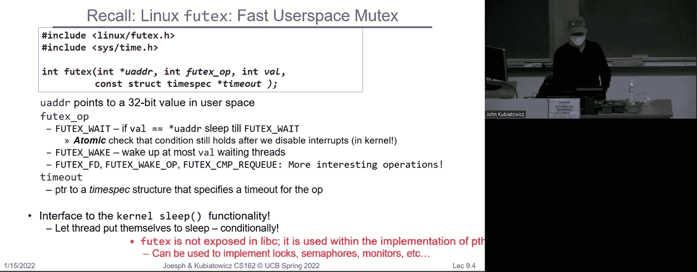
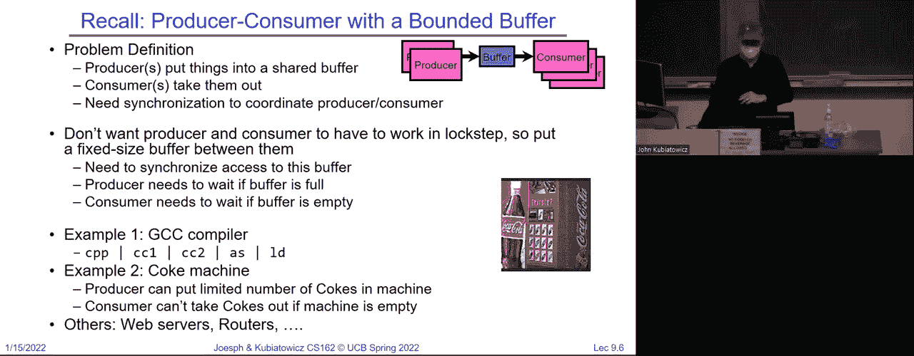
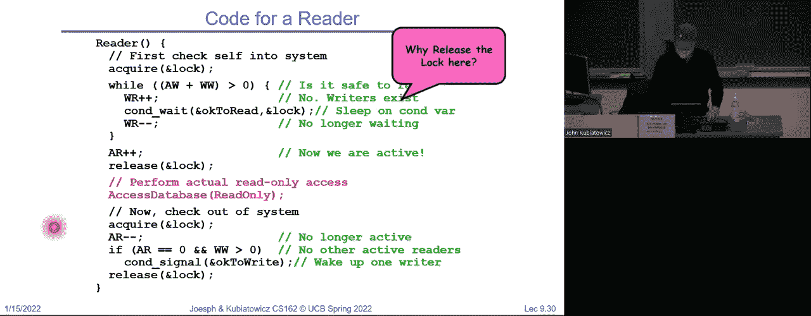

# 操作系统同步原语教程：信号量、监视器与读写者问题 🧠

在本教程中，我们将学习操作系统中的高级同步概念。我们将从原子指令开始，逐步深入到信号量（Semaphore）和监视器（Monitor），并最终探讨经典的读写者问题。这些知识对于理解多线程编程和并发控制至关重要。

---

## 1. 原子指令序列 ⚙️

上一节我们介绍了同步的基本需求。本节中，我们来看看实现同步的基础——原子指令序列。



原子操作意味着一个不可中断的操作序列。如果没有原子性，实现同步通常需要禁用中断或使用非理想的加载/存储指令。现代架构提供了原子指令来简化同步。

以下是几种常见的原子指令：

*   **测试与设置 (Test and Set)**：这是一个原子操作，它将一个内存位置设置为1，并返回该位置之前的值。其C语言伪代码形式如下：
    ```c
    int test_and_set(int *lock) {
        int old = *lock;
        *lock = 1;
        return old;
    }
    ```
*   **交换 (Swap)**：原子地交换一个寄存器和一个内存位置的值。
*   **比较与交换 (Compare and Swap, CAS)**：原子地比较一个内存位置的值与一个期望值，如果匹配，则用新值替换它。其逻辑如下：
    ```c
    int compare_and_swap(int *value, int expected, int new_value) {
        if (*value == expected) {
            *value = new_value;
            return 1; // 成功
        }
        return 0; // 失败
    }
    ```



这些指令是构建更复杂同步原语（如锁）的基石。

---

## 2. 从原子指令到锁 🔒

理解了原子指令后，我们可以利用它们来构建锁。锁是保证互斥（Mutual Exclusion）的基本工具。

一个简单的锁可以使用“测试与设置”指令来实现。线程通过循环执行`test_and_set`来尝试获取锁（忙等待）。然而，忙等待会浪费CPU资源。更高效的锁实现（如Linux中的Futex）会结合用户空间的快速路径和需要时的内核介入，从而在无竞争时避免系统调用开销。

---

## 3. 有界缓冲区问题与信号量 🥤

锁解决了互斥问题，但对于更复杂的同步约束（如“生产者-消费者”模型中的有界缓冲区）则显得力不从心。本节我们引入一个更强大的工具——信号量。

**有界缓冲区问题**描述如下：一个固定大小的缓冲区，生产者向其中放入数据，消费者从中取出数据。生产者不能在缓冲区满时放入，消费者不能在缓冲区空时取出。

最初尝试仅用锁来实现会导致死锁或忙等待。例如，生产者在持有锁时发现缓冲区满而进入睡眠，消费者因无法获取锁而不能消费，从而导致死锁。

**信号量**是一个非负整数，提供两个原子操作：
*   **P() 或 down()**：等待信号量值变为正数，然后将其减1。如果值为0，则调用线程休眠。
*   **V() 或 up()**：将信号量值加1。如果有线程在该信号量上休眠，则唤醒其中一个。

信号量可以用于多种同步场景：
*   **初始值为1的信号量**：相当于一个互斥锁（Mutex）。
*   **初始值为0的信号量**：可用于线程间等待/通知（类似`join`）。
*   **初始值为N的信号量**：可以控制对N个资源的访问。

---

### 3.1 用信号量实现有界缓冲区

以下是使用三个信号量实现有界缓冲区的方案：

1.  **`mutex`**：初始值为1的二进制信号量，用于保护对缓冲队列本身的访问（互斥）。
2.  **`empty`**：初始值为缓冲区大小N，表示当前空槽位的数量。
3.  **`full`**：初始值为0，表示当前已填充的槽位数量。


**生产者伪代码：**
```c
producer() {
    while (true) {
        item = produce_item();
        P(empty);  // 等待空槽位
        P(mutex);  // 获取缓冲区锁
        enqueue(item);
        V(mutex);  // 释放缓冲区锁
        V(full);   // 增加已填充计数，可能唤醒消费者
    }
}
```

**消费者伪代码：**
```c
consumer() {
    while (true) {
        P(full);   // 等待有数据
        P(mutex);  // 获取缓冲区锁
        item = dequeue();
        V(mutex);  // 释放缓冲区锁
        V(empty);  // 增加空槽位计数，可能唤醒生产者
        consume_item(item);
    }
}
```
**注意**：`P(empty)`和`P(mutex)`的顺序不能交换，否则可能再次引发持有锁入睡的死锁问题。

---

## 4. 监视器与条件变量 🏢

信号量功能强大但语义双重（既用于互斥又用于调度），代码可读性较差。本节我们介绍一种更结构化的同步范式——监视器。

**监视器**是一种编程语言构件，它封装了：
*   **一个锁**：用于提供互斥访问。
*   **一个或多个条件变量**：用于管理线程的等待与唤醒。

**条件变量**总是与一个锁关联，提供三个操作：
*   **`wait(lock)`**：原子地释放锁并使当前线程在该条件变量上休眠。线程被唤醒后，会**重新获取锁**再返回。
*   **`signal()`**：唤醒在该条件变量上等待的**一个**线程（如果有）。
*   **`broadcast()`**：唤醒在该条件变量上等待的**所有**线程。

使用监视器的关键模式是：**总是在持有锁的情况下检查条件、调用`wait`、`signal`或`broadcast`**。

---

### 4.1 用监视器实现有界缓冲区

使用一个锁（`lock`）和两个条件变量（`notFull`, `notEmpty`）可以更清晰地实现有界缓冲区。

**生产者伪代码：**
```c
producer() {
    lock.acquire();
    while (buffer.isFull()) {
        wait(notFull, lock); // 等待“不满”信号，释放锁入睡
    }
    buffer.enqueue(item);
    signal(notEmpty); // 通知消费者“不空”
    lock.release();
}
```

**消费者伪代码：**
```c
consumer() {
    lock.acquire();
    while (buffer.isEmpty()) {
        wait(notEmpty, lock); // 等待“不空”信号，释放锁入睡
    }
    item = buffer.dequeue();
    signal(notFull); // 通知生产者“不满”
    lock.release();
    return item;
}
```
**为什么是`while`循环而不是`if`？** 这涉及到**Mesa语义**与**Hoare语义**。大多数系统（如Pthreads, Java）采用Mesa语义：`signal()`只是将等待线程标记为可运行，并不保证它立即执行。在被调度执行前，可能有其他线程改变了条件。因此，被唤醒的线程必须**重新检查条件**，使用`while`循环是安全且必要的。

---

## 5. 读写者问题 📚✍️

最后，我们探讨一个经典的同步问题——读写者问题，它展示了监视器处理复杂策略的能力。

**问题描述**：一个共享数据资源（如数据库）可以被两类线程访问：
*   **读者**：只读取数据，不修改。
*   **写者**：读取并修改数据。

**要求**：
1.  允许多个读者同时读。
2.  任一时刻最多只能有一个写者。
3.  读者和写者不能同时访问资源。

我们需要在满足上述要求的同时，避免读者或写者饥饿。

---

### 5.1 使用监视器的解决方案

我们可以设计一个偏向写者的策略（写者优先）：一旦有写者等待，新到达的读者必须等待，直到所有等待的写者完成。

我们需要以下状态变量和条件变量：
*   `activeReaders`：正在读的读者数。
*   `waitingReaders`：等待读的读者数。
*   `activeWriters`：正在写的写者数（0或1）。
*   `waitingWriters`：等待写的写者数。
*   `okToRead`：读者可开始读的条件变量。
*   `okToWrite`：写者可开始写的条件变量。

**读者入口协议：**
```c
lock.acquire();
// 如果有活跃的写者或有写者在等待，则读者等待
while (activeWriters > 0 || waitingWriters > 0) {
    waitingReaders++;
    wait(okToRead, lock);
    waitingReaders--;
}
activeReaders++;
lock.release();
// ... 执行读操作 ...
```

**读者出口协议：**
```c
lock.acquire();
activeReaders--;
// 如果我是最后一个离开的读者，并且有写者在等待，则唤醒一个写者
if (activeReaders == 0 && waitingWriters > 0) {
    signal(okToWrite);
}
lock.release();
```

**写者入口协议：**
```c
lock.acquire();
// 如果有活跃的读者或写者，则写者等待
while (activeReaders > 0 || activeWriters > 0) {
    waitingWriters++;
    wait(okToWrite, lock);
    waitingWriters--;
}
activeWriters = 1;
lock.release();
// ... 执行写操作 ...
```

**写者出口协议：**
```c
lock.acquire();
activeWriters = 0;
// 优先唤醒等待的写者
if (waitingWriters > 0) {
    signal(okToWrite);
} else if (waitingReaders > 0) {
    // 没有写者等待，则唤醒所有等待的读者
    broadcast(okToRead);
}
lock.release();
```
这个方案确保了写者优先，并且使用`while`循环和状态变量清晰地管理了复杂的等待与唤醒逻辑。




---

## 总结 🎯

本节课中我们一起学习了操作系统同步的核心概念：

1.  **原子指令**（如Test-and-Set, CAS）是硬件提供的同步基础。
2.  **锁**利用原子指令实现互斥访问，但无法处理复杂的调度约束。
3.  **信号量**是一个通用的同步原语，通过P/V操作管理一个计数器，可用于实现互斥、资源计数和线程间信令。
4.  **监视器**提供了更结构化的同步方式，结合**锁**和**条件变量**，使同步代码更易编写和理解。关键模式是“获取锁 -> 检查条件（循环）-> 等待/操作 -> 发信号 -> 释放锁”。
5.  **读写者问题**是一个经典的同步案例，展示了如何使用监视器实现带有特定策略（如写者优先）的复杂访问控制。


掌握这些同步原语及其应用场景，是编写正确、高效并发程序的关键。