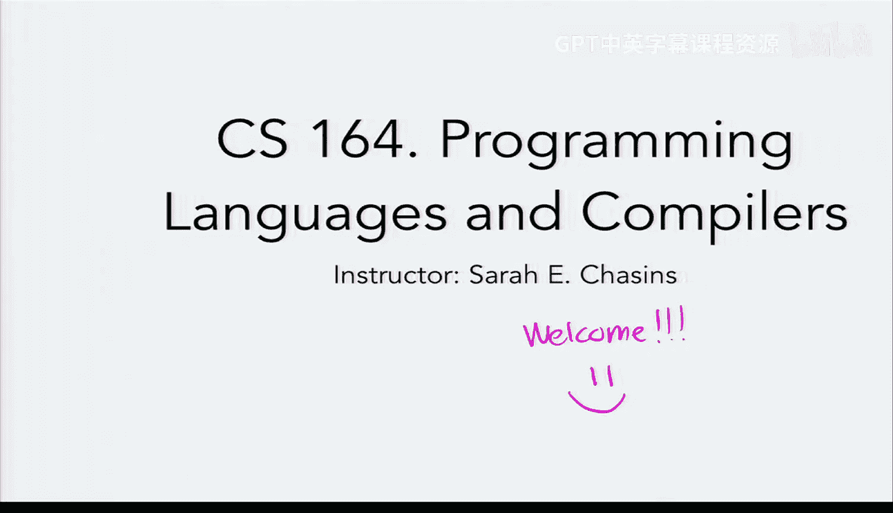
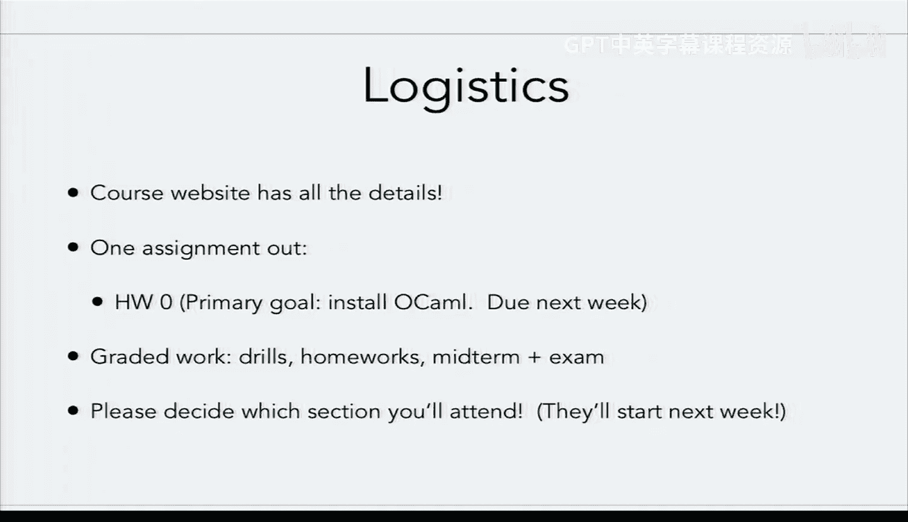
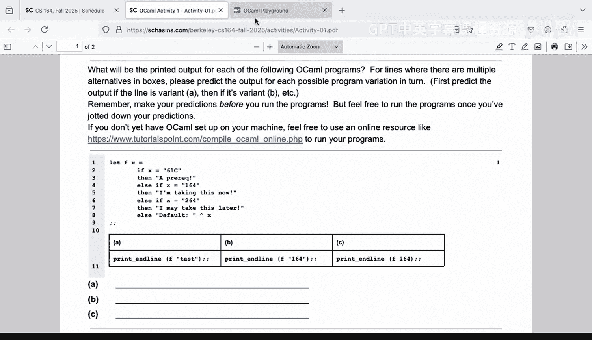
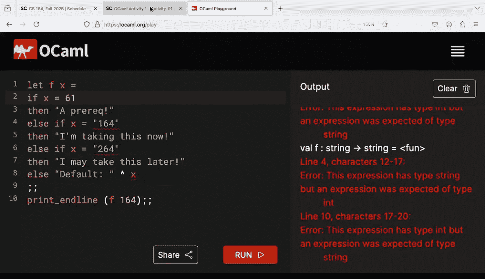
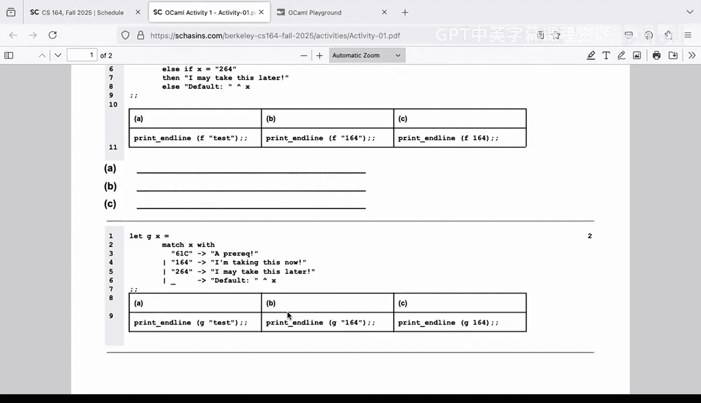
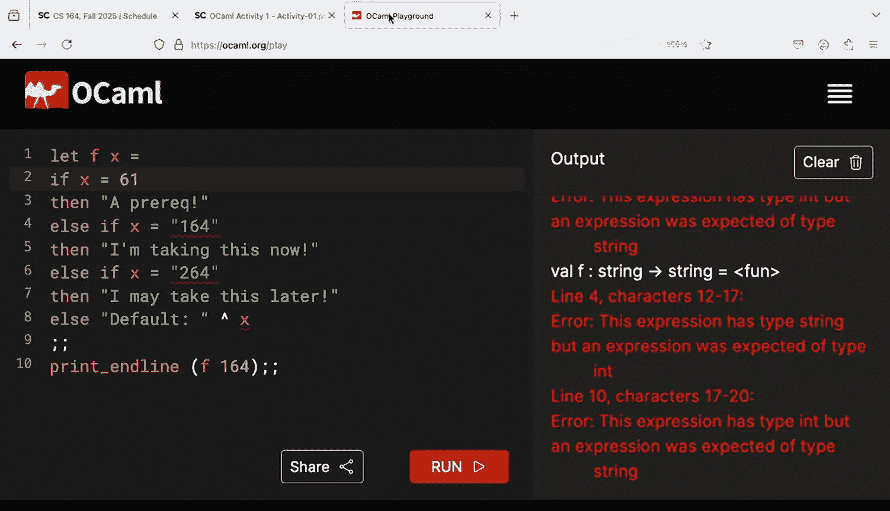
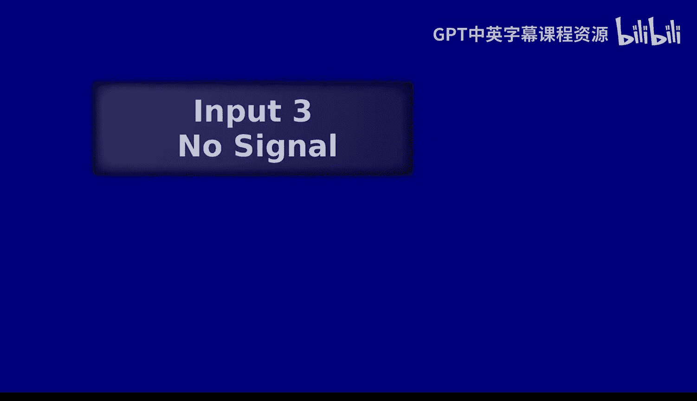

# 编程语言和编译器：1：什么是编译器？🚀




在本节课中，我们将要学习编译器的基本概念，并通过动手实践，构建一个极其简单的编译器。我们将从定义编译器开始，然后将其与解释器进行对比，最后实际编写一个能将数字转换为可执行机器代码的编译器。

---

## 编译器与解释器

首先，我们来探讨一个核心问题：什么是编译器？

简单来说，编译器是一个执行**转换**的工具。它将一种形式的程序（源程序）转换为另一种形式的程序（目标程序）。我们可以用以下类型签名来描述它：

**编译器类型：`source_program -> target_program`**

例如，编译器可以将高级语言（如C++）的源代码转换为低级的汇编语言或机器码。

上一节我们介绍了编译器的基本定义，本节中我们来看看它的“兄弟”——解释器。

解释器与编译器不同，它不产生新的程序，而是直接**执行**源程序并产生一个**值**。其类型签名如下：

**解释器类型：`source_program -> value`**

例如，Python解释器读取你的Python脚本，并直接计算出结果（如一个数字或字符串）。

那么，编译器产生的目标程序如何最终变成我们想要的值呢？这需要一个最终的“解释器”来执行它。在大多数现代计算机系统中，这个最终的“解释器”就是你的**处理器**。处理器将机器码解释为具体的计算操作，从而产生最终结果。

---

## 为什么学习编译器？🤔

在学习如何构建编译器之前，了解其意义很重要。以下是学习编译器的一些主要原因：

*   **有趣且有挑战性**：它像解谜一样，充满了智力上的挑战。
*   **理论与实践的结合**：你将同时接触到计算机科学的理论（如形式语言、类型系统）和实际的系统构建技能。
*   **更好地理解日常工具**：理解编译器的工作原理，能帮助你理解日常编程中遇到的晦涩错误信息从何而来。
*   **快速掌握新语言**：实现编译器和解释器的技能，能极大地帮助你未来自学任何新的编程语言。

---

## 动手实践：构建第一个编译器 🔨

现在，让我们开始构建本学期的第一个编译器。为了让事情足够简单，我们将实现一个功能极其有限的“语言”：它只包含**整数数字**。

这个编译器的任务是：将一个整数（如 `164`）转换为一小段x86-64汇编代码，这段代码能将该数字作为程序的返回值。

### 1. 理解运行时（Runtime）

在编写编译器之前，我们需要一个“运行时”环境来处理一些通用任务，比如打印输出。我们将使用一段简单的C程序作为运行时，它负责调用我们编译器生成的代码并打印结果。

以下是我们的C运行时核心部分（`runtime.c`）：
```c
#include <stdio.h>

// 声明一个外部函数 `entry`，它将由我们的编译器提供
extern int entry();

int main() {
    int result = entry(); // 调用编译器生成的代码
    printf("%d\n", result); // 打印结果
    return 0;
}
```
这段代码编译后，会等待与我们编译器生成的汇编代码链接。

### 2. 手写目标汇编代码

我们的编译器最终要生成汇编代码。对于输入数字 `5000`，我们需要生成类似下面的x86-64汇编代码（`program.s`）：
```assembly
global entry
entry:
    mov RAX, 5000  ; 将数字5000放入寄存器RAX（C运行时期望的返回值存放处）
    ret            ; 返回
```
将这段汇编代码与运行时链接并运行，程序就会输出 `5000`。

### 3. 用OCaml实现编译器

显然，我们不能为每个数字都手写汇编。我们需要一个程序来自动完成这个转换。我们将使用OCaml语言来编写这个编译器。

以下是我们的第一个OCaml编译器（`compile.ml`）的核心：
```ocaml
(* 编译器函数：将源程序（字符串形式的数字）转换为目标程序（汇编字符串） *)
let compile (program : string) : string =
  let lines = [
    "global entry";
    "entry:";
    "    mov RAX, " ^ program;  (* 关键：将输入的数字字符串插入到汇编指令中 *)
    "    ret"
  ] in
  String.concat "\n" lines      (* 将字符串列表用换行符连接成一个字符串 *)

(* 辅助函数：将编译结果写入文件 *)
let compile_to_file (program : string) : unit =
  let out_channel = open_out "program.s" in
  output_string out_channel (compile program);
  close_out out_channel

(* 辅助函数：编译、汇编、链接并运行 *)
let compile_and_run (program : string) : unit =
  compile_to_file program;
  (* 以下命令调用外部工具进行汇编、链接和运行 *)
  let _ = Sys.command "nasm -f elf64 program.s -o program.o" in
  let _ = Sys.command "gcc -no-pie runtime.o program.o -o program" in
  let _ = Sys.command "./program" in
  ()
```
现在，调用 `compile_and_run “164”`，我们的编译器就会自动生成汇编代码，与运行时链接，并最终运行输出 `164`。



---


## 活动：探索OCaml类型系统 🧪

为了更熟练地使用OCaml（我们本学期的主要实现语言），我们通过一个小活动来探索其类型系统。策略是：**预测、运行、验证**。



以下是第一个代码片段：
```ocaml
let x = “164” in
match x with
| “164” -> print_string “I’m taking 164 now”
| “test” -> print_string “default test”
| _ -> print_string “default”
```
**问题**：如果在程序末尾分别加上 `print_string x`、`print_endline x` 或 `print_int x`，输出会是什么？

通过讨论和测试，我们验证了OCaml的**静态类型检查**特性：它会在编译时确保类型使用的一致性（例如，不能将字符串 `x` 传递给期望整数的 `print_int` 函数）。



---



## 课程总结 📚

本节课中我们一起学习了：
1.  **编译器的定义**：它是一个将**源程序**转换为**目标程序**的工具。
2.  **解释器的定义**：它是一个直接执行源程序并产生**值**的工具。
3.  **两者的关系**：编译器链的末端通常需要一个解释器（如处理器）来最终执行代码并产生结果。
4.  **动手实践**：我们构建了一个最简单的编译器，它能将整数编译成可执行的汇编代码。
5.  **OCaml初探**：我们开始接触OCaml语言，并通过活动理解了其强大的静态类型系统，这能帮助我们在编写编译器时避免许多错误。





这只是编译器世界的入门。随着课程深入，我们将为我们的语言添加变量、函数、控制流等复杂特性，最终构建一个功能丰富的编译器。