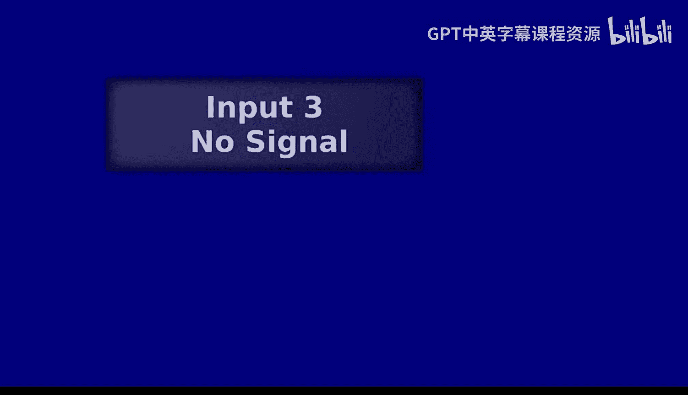
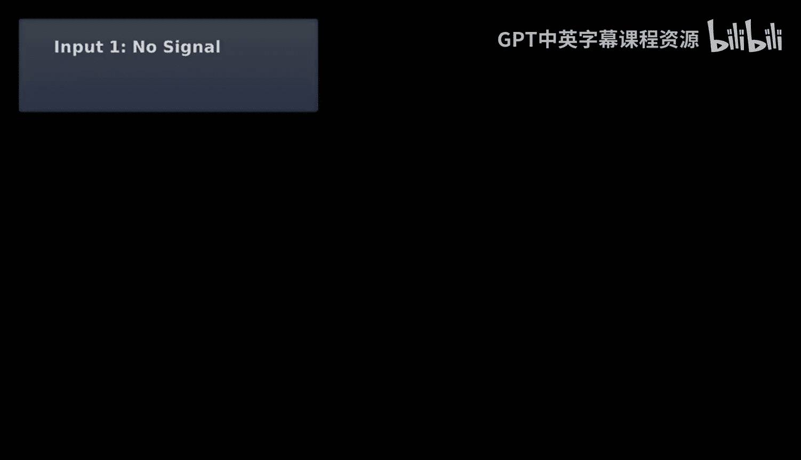
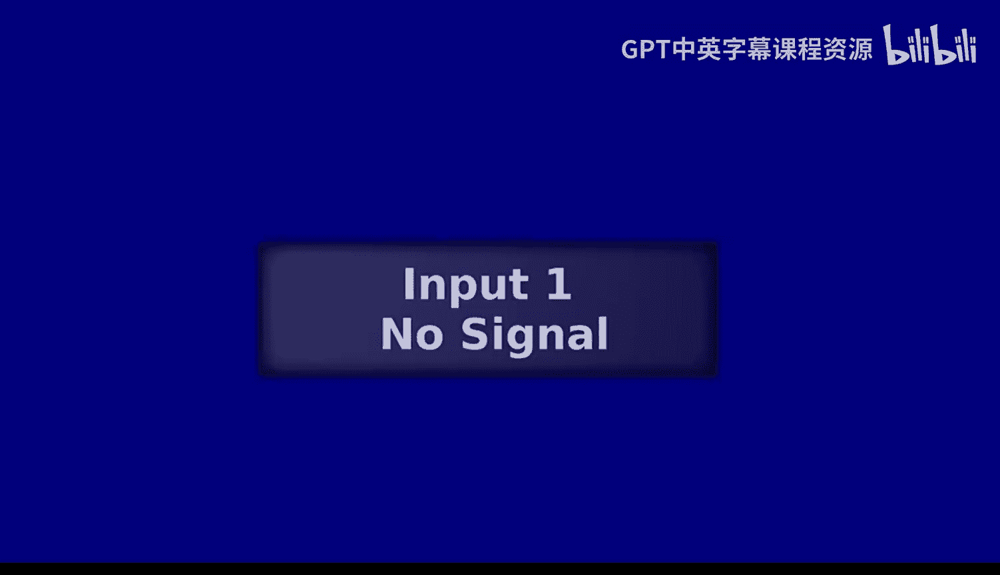
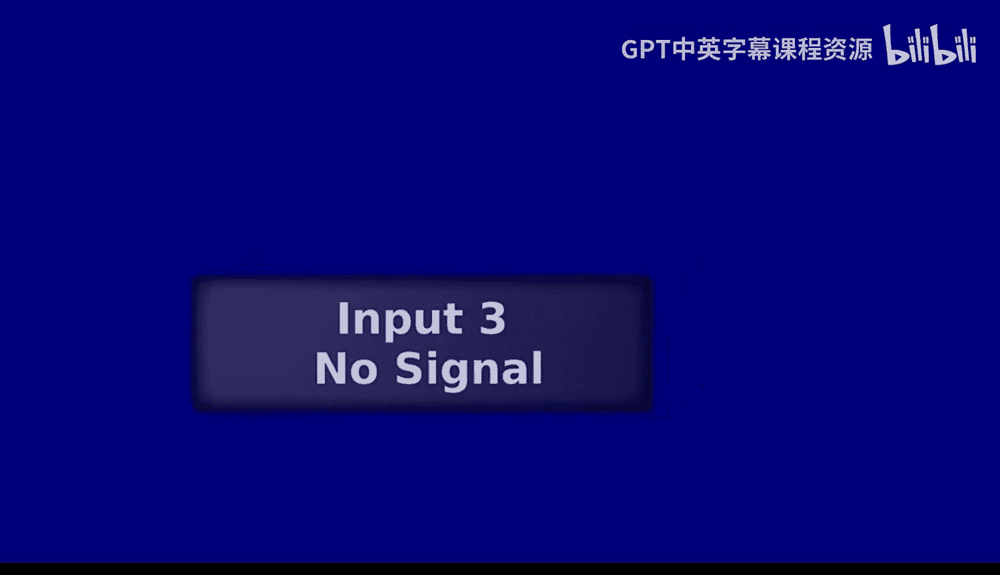
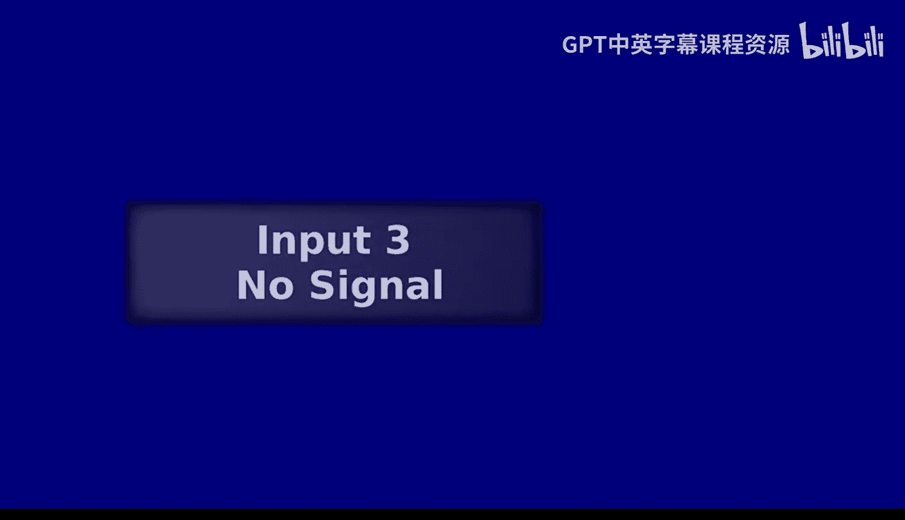

# UCB《编程语言和编译器｜CS 164 Programming Languages and Compilers 2025》中英字幕 p09 -P09-Lec 09 - Naming Expressions (Let).zh_en -BV1zQ27BeEfF_p9-

Testing， testing 1，2，3。 Thank you。All right， y'all， we've got a mic back。Alright。

 to anyone who is just catching up on the video version of this class。

 I have tried to write all the instructions on the the board。

 but basically we are currently doing the activity where we try to figure out what is the highest position on the stack that we will use for the program that you see written in pink at the top。

All right， and as we think about this， I think you might like to have a little refresher of what the compiler looks like for addition。

So I'm going to swap us over for a moment to looking at the compiler。

And hopefully you've already drawn this diagram， but if not， I'll show it again after。

 But for a moment， let's take a look。

At how we actually implemented edition for the compiler。

So here we are。This is sort of the portion that might be relevant to the thinking you are doing right now。

Let me know when you want to see that tree diagram again。Alright。

 now's a good time to either take a picture or write down anything you need to remember about this。

 I'm going to show us the tree again。Ready。Almost ready。

All right， let's look at the tree。

We'll give it another minute or so。So here's something I might write down。Alright。

 so I'm going to go ahead and talk us through how we might reason about this tree。 So in some ways。

 this tree is sort of a representation of the structure of the program itself。

But if we think about what we are doing when we traverse the tree in order to actually compile our programs。

 this is also a pretty good representation of how we are actually calling that function compile X。

We are basically going through， and for each of the nodes that we see in this tree。

 we will have one call to compile X that's handling something。

 whether that is a particular value that we're seeing。

 a particular number that we're seeing or a particular use of our addition operator。

So what I'm going to have us think about is when we are actually going through those compile X calls。

 let me actually pull that up real quick。

When we are going through。Sorry， were， in addition to our other technical difficulties。

 we don't have our normal thing of being able to switch back and forth between these two seamlessly。

 So when we are going through our calls to compile X。

 we are passing in a particular value representing the lowest index on the stack that we are allowed to use right So when we first start。

 that's going to be negative 8， because we are not allowed to use RP-0。

 we would overrite our callers frame address。 And so the lowest that we are allowed to use is negative 8。

 And so that's what we get when we start when we have our first call to compile X。

 And then we might do some。

Recursive calls， like right here。And in particular。

 the thing I want to call our attention to right here is when we are going ahead and doing a recursive call for the left child in our additions。

 we leave the stack index the same。In contrast， when we are doing our recursive call for figuring out what assembly we should generate for representing。

The child on the right， we go ahead and actually alter the stack index。 Now， why are we doing that。

 That's because between figuring out what is the value associated with the left child and figuring out the value associated with the right child。

 We actually use one of those slots， right， So we go ahead and get the value associated with E1 into R X。

 And then we store it somewhere on the stack。And at that point， we have to say。

 don't use that stack address anymore， because if we use it again。

 we're going to overwrite what we just saved there。And so that's why we do that update。

 So do we use the same stack index that we received as an input when we are doing the left child。

 Hum for， we use the same one。Humph， we use a different one。All right， we're not totally sure。

So here's what we got as input， right， stack index。

Here's what we provide as input for our recursive call， stack index。So hum。

 if you think we are using the same value。H if you think we are using a different value。Yeah。

 I agree。 We are not updating it for this sort of left child recursive call。

 What about for this right child recursive call， Are we using the same value。

Are we using a different value？

Yeah， I totally agree。 So let's now return to our tree representation and walk through what this means for the highest value。

 their highest position on the stack that we are going to end up using。

So the first thing I want us to notice is that we are going to go ahead and do sort of our left child first。

 right， So let's go down that path。And what we're going to leave there。

 because this is the leftmost trial。 And we just decided that we're not going to actually change the stack index when we are doing that left recursive call。

 Great。 We have negative 8 sitting at that node as well。So far so good。Still with me？Love it。 Okay。

 now let's get the， the leftmost call for that edition， great。Looks like we still keep it the same。

 That makes sense。 But now something changes， right， Because now we have a concrete value。

 This is one of our intermediate values that we want to store on the stack。

 And so now we're actually going to go ahead and put that in slot negative8。Everyone with me so far。

Cool， alright。 so now we're ready to go back to this spot in our node。

 And we're going to do that right most thing。😊，And remember， again。

 we have now actually used that slot。 So it makes sense that this is the position where we are。

 in fact， going to change what we are using as our stack index。 right， So this one。

 we're going to go ahead and put negative 16， because that is now the lowest spot on our stack that is available to us。

But now we're going do another month of those left calls， and we'll leave negative 16 down there。

 And here again， is a position where we're actually going to put something on the stack。

 because again， this is one of our， our intermediate values that we're actually going to need to save。

Questions on this so far， we're feeling good。Love it， okay。Now。

 let's go ahead and do that right recursive call。 And what are we going to get there Well we have to update again。

 right， so we've just saved something。 This is now the the position on the stack that is available to us。

 But do we actually bother to put this value 3 in the stack。Hum， if you think we do。H。

 if you think we don't。Yeah， I agree。 We are just going go ahead and directly add this to the value we had previously saved onto the stack。

 which is to say two。 And then， in fact， so when we go back here。

 we just go ahead and do that addition， then we have sort of value associated with this addition inside R X。

 we're ready to actually go ahead and add that together with this。 that's what's happening here。

 But now if we look at what role that plays relative to this node。

 this is sort of that leftmost intermediate value。 And so if we think about what's going to happen now。

 we're going to go ahead and rewrite that entire thing。Into the stack。

 the value associated with all of that。 Now， that's really weird， right。

 because suddenly it looks like were actually putting that in negative 8。

 but weren't we actually using that slot already， right。

 we already had written this value 1 into the slot at offset negative 8。

 So how are we able to reuse it。 Well， it's fine because we've actually already done the addition that uses that。

 right And so at this point， it is okay to reuse that same slot because we have already done the work we needed to do with that value。

😊，So far， so good。Yes。ない。系。先生はい。对。I think this question is what is the order in which we are going to visit these nodes and that is entirely dependent on sort of what we put in our compiled ML program right。

 what we chose to do was to visit the left node first and then once we have finished everything that happens recursively for that。

That's when we will visit the right node。 Right， And so what will happen in this specific tree is we'll go down this left branch。

 We'll go down this left branch。 Oop， there's nothing more past that。

 We're done with the recursive calls there。 We pop back one。 We do our right branch。 We do our left。

 We do our right。 We go back up。 We go back up。 We go right， we go right。

 Like if we think about what sort of this kind of traveral order looks like on the tree。

 That is sort of enforced。 Make sense。Other questions about what we've done so far。So far。

 we have sort of finished the， the final processing for this edition note。

Which involves saving off the value associated with this entire addition into slot negative 8。Cool。

 cool。 Let's carry on in that case。 So now we're ready to go down this branch。 right。

 we've pop back up to this。 And the value that we have in our stack index at that point is negative 8。

 But we have just saved something into negative 8 and we're traversing a right branch。

 And so what we're gonna go ahead and put here is the offset negative 16。

 And now this starts to look kind of wacky right， because if you look at this on the surface。

 this looks symmetrical。 But now suddenly we can see that oh。

 actually we are not using the stack in the same way on the left side and the right side of this。😊。

So okay， we've got negative 16 in there。Fantastic， but we're not ready to actually store anything。

 We'll go down our left branch。 We keep things the same because that's what we do when we go down the left branch。

 And then we do need to actually make a store。 Great， We've got negative 16 there。 And now。

 when we go down our right branch， when we go down our right branch。 remember that we update our。

 our value。 So we have negative 24 here。😊，Nothing to actually store there。

 Let's go down our left branch， Ne 24 there。 we do in fact， need to store something。

Let's go ahead and store that。And now， when we go back up to the addition note just above that。

 remember， we always update on a right branch。 And so we'll go ahead and have negative 32 there。

 but we don't actually need to store that。 So even though we did make a compile X call in which negative 32 was the value we used for stack index。

 the last one that actually gets used， right the highest position in our S that actually gets something stored in it is just going to be this one right here。

 So to those of you who said negative 24 awesome work。 That is what we saw。

Do we have questions about this？Would we like to actually see the assembly？Fantastic， yeah。

 So over here， when we were doing that recursive call for the right child， right。

 So when we were going ahead and figuring out what is going to be the right operaand for this edition。

😊，We did have to do a recursive call。And when we actually did that recursive call。

 the value that we actually used as a stack index was negative 32。However， we did not， in fact。

 need to store that value。 We are fine with just getting that into RA X。

 We didn't have to put it in the stack。So we were fine with just having that in RAX in order to do this edition。

 And so even though we had a recursive call in which this was the value associated with stack index。

 we never actually put anything in the stack that used that stack index。

And so if we actually look at how that information is baked into。

Assembly， let me real quick， actually run。Our compiler on this program。

Sorry。O。😔，For those of you who are trying to remember what was happening inside。Okay， it was plus。

Plus one。Plus，2，3。Plus 4。Plus，5，6。Oops， and I screwed up our。Quote marks。

That's going to be a problem， That's going to be a big problem。Let's fix that。All right。

 so now let's look at program dot S。And we can see that exactly what we just walked through in the tree is what's happening here。

 right， So every time we see those square brackets， that's a store into the stack。

 And we can see that we use that offset negative 8。 We use that offset negative 16。

 We go ahead and read from those。 We use that offset negative 8 again。 As we discussed。

 we overwrite what we had in there。 We use negative 16 again， and we use negative 24。

 And that's the highest slot that we actually use。😊。

So are there questions about this before we move on on our one other lingering topic from binary operations？

We feel okay with how we can sort of reason through how we are making our recursive calls。

 how that is affecting our use of the stack。So let me see if I can answer that question。

 So when we are putting together the assembly associated with doing an edition。

There are a couple of ways that we add into the assembly。 So one as we go ahead and say。

 get me all of the assembly， it might be a huge chunk associated with getting the value of E1 into R X。

 We also then have this particular move， which says whatever we got into R X by doing that。

 I want to now put it into an appropriate position on this stack。

And then we have another recursive call where we say。

 go ahead and do whatever you have to do to figure out the value associated with E2 and to get that into R X right So this is the equivalent of going down that right branch。

 And then we have， okay， whatever we had in the stack previously， get that into this register R8。

 and then I want to go ahead and add them together。Does that make sense， awesome？Okay， cool。Amazing。

 so I think we're in a pretty good spot now with our binary operations。

 The one thing I still want us to chat through real quick。

 And I dropped sort of a hint about this on Tuesday。 But I think it was a little too subtle。

 And this is actually relevant to Yaall's homework。 So one of the things we talked about。

 was what would happen if we did compile and run。😊，Plus， one false。Didn't like it， right， not happy。

And then okay， let's double check the interpreter too just to be sure。呃。Also， mad， cool。

 But then we talked about another program that we could also run。And so if we do plus one true。

Interpreter， still mad。 We like that。What about。Ohoops。Did I mess something up？

I was really expecting， oh， you know what？I think I did。 So let's see。 I wanted to do， sorry。

That's what I actually wanted to do。Okay。And so this is a situation where we are getting something back that probably most of us find unexpected。

 It's not super satisfying that because taking the。

 remember how we wrote out the representation of false。 It was 0 plus our booolean tag right。

 our Boolean tag was 7 B long。 And because of that。

 because of knowing that that's the representation we have for false and because of knowing that adding 32 to that。

 Well actually change it to the value 1。Followed by the Boolean tag and knowing that that's how we represent true。

 I was able to do this weird wacky program that doesn't produce any kind of exception。

And so what I want you to talk about now is one， do you like this output， but also two。

 is this a bug in our compiler？😡，Go ahead and discuss。All right。So。What I want us to go ahead and do。

Is start by humming with， do we like this， So hum， if you feel like this is fine。Hum。

 if you do not like this。Yeah， I would say I basically agree。Now， hum。

 if you think this is a bug in our compiler。Hum， if you think this is not a bug？Yeah， right。

 If we remember what I actually talked about right at the beginning of class last time。

 I said our binary operations are defined。For cases where we have for the the addition and the subtraction。

 for cases where we have number operas。And for less than also number opera brands， for equality。

 we didn't care。And so this is kind of this weird thing where we have fed our compiler。

 a program that is not in our language， right， plus 32 false is not a program that is actually allowed。

In our language。Now， we might choose to go ahead and do some smart stuff to try to catch things that a programmer might try to feed into our language that is not actually in our language。

 In fact， we have done that in the interpreter。 We went ahead and said， hey。

 I'm actually going check if the programmer has done something that's going to pass the parser。

 but I think is actually not in our language。 And then our compiler， we did not。

And that's actually totally fine because this is what is called undefined behavior。Right。

 so basically， when we are setting out the specification for our language。

 there are things that we specify， right， things for which we have a particular meaning。

 a particular behavior that we are going to enforce。And then。We have parts that。Unfined right。

 undefined behavior。 we give no guarantees about what our compiler or our interpreter are going to do if you try to feed that into there。

 And so for an example， dereferencing a null pointer and C， that's undefined behavior。

 right at that point， C is allowed to do anything it wants to you。

 It is allowed to just go through and nuke everything that's on your your directories like that's okay。

 right， that is an example of undefined behavior。In general。

Undefined behavior can be pretty dangerous， as you might imagine。 And so we usually， usually。

 usually want to try to avoid allowing undefined behavior in cases where we have good alternatives。

 And so， in fact， we are later in a couple of weeks going to get to the point where we do some nice type checking。

 In order to avoid situations like this。But。That does not mean that this is， in fact。

 a bug in the compiler， right， It's something we might be dissatisfied with。

 It's something we might not like， But because our specification doesn't say anything about what happens when we add a number and a boolean。

It's okay for our compiler to do this。And many of you will probably have noticed how this is relevant to your homework。

 hopefully。Questions on undefiieded behavior before we move on。Okay， cool。 In that case。

 let's move to our main topic for today。😊。

In fact， first， let's go to our big slide of everything and talk through。

The topics that are going to matter for us today。 So let's see。 what have we got today。

 Let me erase the things we had before。 We had our surprise new character on the cast of characters。

 Last time we added the stack。 We got introduced to the stack。 Today。

 we are going to be thinking about assembly。 We are going to be thinking about the stack。

 We are going to be thinking about lazy versus eager evaluation。

 We are going to be thinking about mutable versus mutable。

 we are going to be thinking about symbol tables environments and scope。

So far， so good。

Cool， all right。I don't think anyone is going to be super surprised at this point by our naming expressions。

 right， We are going to go ahead and have something that looks probably really a lot like what you've been seeing in O Camel。

 So let's go ahead。

And take a guess。 If I write out， let me write out a nice program for us to look at。 if I write out。

 let。X1。X。Would anyone like to shout out what you think that is going to be？I'm hearing one。 I agree。

 That looks like a program that should give us the value 1。 that would be satisfying to me。

 Let's go ahead and also take a look at one more。😊，Let's。What about that。

 go ahead and discuss with someone nearby。Sorry I think there's supposed to be an extra print in there。

All right。Does anyone want to yell out what you might like this to produce？I'm hearing 10。

 I totally agree。 Let's walk through real quick why that would happen。

 So here we have gone ahead and bound x to the value 3。 So now when we're actually using x over here。

 we should get the value 3。 And then we'll do our little addition。

 we'll go ahead and come up with the fact that this is 5。

 and that will actually cause us to bind x to 5。 So now when we use x down here。

 we're going to have it be 5 for both of those instances。Everyone feeling pretty comfy with that。Yes。

😊，These are two。I am not sure I understand the question。😀。Okay， there's， there's no white space。

 right， It's all just one big experiment。Does that that help Okay。

 great Other questions before we go look at our interpreter。

Or questions about what we're actually doing here。 or this all looks like kind of what we would expect。

Okay， cool， in that case， let's go look at our interpreter and let's start implementing。

So。Here we are in。Our interpreter that's so slow to show up。

Okay， there it is。 Great。 So here we are。 We're looking at this new line that I just added。

 This says Simva。 That's where we're going to go ahead and try to get the value associated with a name。

😊，What should we do， I want you to spend a minute brainstorming。Chat with Hol nearby。All right。

 what do we think？What might we like to do here？Say someone was maintaining something for us that might help us out。

Now we're seeing this use of X。I love it。 Let's store a map of our name to our value。

 That sounds great， right， So for now， let's just， let's pretend that someone has kept that for us and we can go ahead and access it here。

 And maybe something else that we're introducing is gonna go ahead and introduce it actually make that map for us。

 So I have given us something a little bit useful that will help us do exactly what you suggested。

 which is we now have something called a symbol table。 And this is in compilers's land。

 What we call the things that are actually mapping from a name to where we might find it。 right。

 So here we go。 We've got our symbol table。 It's just built on top of O camel's map。😊，Implementation。

 so it's not doing anything particularly exciting。 It is just keeping track of this mapping between names and whatever we choose to put in there。

 So I'm gonna give us some quick examples of actually using one of these and we'll see what that will do for us as we start implementing。

So I'm going to go ahead and make an int symbol table SIim tabab。

 which means that is going to go ahead and map from names to ins。

 we can go ahead and put whatever type we want in here。That one is empty。

 It's going to be pretty boring。 Let's add something。 So let S T prime。We'llSim tabab dot and X2。

 and we'll add it to ST。Great， now we've got S T and S T prime。

 If we do Sim tabab dot find X on S T prime。Fantastic， we've got two， but S T is still around。

 That still exists。 right， turns out maps and Ocamo immutable。

 The way that we get a new one is we go ahead， we add into the old one and we get back a new one that has the information that we want。

😊，Great， X is not found in S T。 So even though there we are an S T prime， it's found。 we've got it。

We can still access。The original S T。 and see that X is not in there。

 We can do the exact same thing for our member instead of find。 It's just gonna check if it's there。

 So if we do mem on S T prime， it says nope， not in there。 If we do M or sorry， if we do me on S T。

 It says nope， not in there。 If we do M on S T prime， it says yep， it's in there。

So this is going to turn out to be useful for us。Nothing really fancy here。

 We're just using Ocal maps。So okay， let's go ahead and start using one of these。

 Let's take a look inside our interpreter， again。And what are we going to want to do well。

Let's probably go ahead and open that nice little u thing。 That sounds good first。

 But we're also probably going to want to start passing around something that is going to represent。

That mapping。 And so in interpreter's land， traditionally， this is called the environment。Right。

 the environment is just all of the names that I currently have access to。

 And so this is what I'm going to go ahead and call it。 I'm going to call it n。

And what I want you to think about is what do like I just showed you some examples down here where what we were storing was actually mapping from strings to ins。

 Do we want to do that here， Do we want to store mapping to something else？

 What should be the thing right， Like when we go down here and we do you know。

 we're actually going have to go ahead and use our dot Me thing， Well let's say we do Sim tabab。

Dot find。There。In end， right， what should we get out？What should we get out。

 discuss for about a minute。Sorry， I'm just trying to make sure we're actually using this end thing everywhere we need to be doing it。

Here we'll just use our empty symbol table。O。So what would we like to have in that simple table？

I'm hearing value。 Anyone got anything else？I think there's something else we could put in。

As expression， absolutely， either of those could make sense。 right， So， in fact。

 we can change what O Camel thinks we're putting in there just based on how we actually change this。

 right， So if we go ahead and hover over it right now。

 because what we're actually doing with it is directly。Sorry。

 do you see the low battery thing because what we're doing is actually directly going ahead and using it。

 using it as sort of the return。And because what we expect to have is our return is a value。

 it's saying， okay， it looks like what you've got here。Is， in fact， a value。 But if instead。

 we did something like interpret X N。Let's put Pars around that， so it's not confused。Oh， no problem。

 We've got a Sim tab with S expressions。 So which of these do we like。

 Go ahead and discuss 30 seconds。Al right， let me specialize this question for us。

 Say I'm a programmer。 I've mapped X to this really big， expensive computation。But then。

 I never use X。Do I prefer if I'm storing an S expression in here or a value in here。

 which would I prefer。Chat for 20 seconds。All right， I'm a programmer。I've mapped X to some big。

 expensive computation。Do we prefer that this be mapped to a value， Hum for value。

DoWe prefer this be map to an S expression。 H for S expression。Yeah， I totally agree， right。

 If Ive gone ahead and mapped it to a value， that means that as soon as that name is actually appearing in the program。

 I have gone ahead and done that computation at that time。 Even though it turns out later on。

 I'm never actually going to use X。 So that's pretty frustrating。 That seems like a waste。

 This is called eager evaluation。Now say I'm a programmer。And I've gone ahead and map X to some big。

 expensive computation。And now I use X a dozen times。

Do I prefer to have a value in there or an S expression， Go ahead and chat for 20 seconds。All right。

 If I'm that programmer， I'm Ma X to a big expensive computation。 I use X a bunch of times。

 Do I prefer that we are having our simple table map to values， H for values。Map to S expression。

 H S expression。Yeah， I totally agree， right。 Obviously， we could do some kind of caching scheme。

 but actually it gets pretty complex because say this is something that's actually gonna go out and ask the user for input。

 You would better make sure that your programmer really。

 really understand your programming model before you could start doing fancy wacky stuff with caching。

 And so typically what we are gonna to see is either what we talked about where we are storing the value in there or what we talked about when we are storing the S expression in there。

 And that's the only two options。 So these are lazy versus eager evaluation So if we store the S expression。

 right， we don't bother it like when we introduce the name we don't bother to actually executed at that time。

 we just keep track of what that expression was， that is lazy evaluation。

 right we only find the value once we actually use it。 So at the time that we're using it。

 that's when we go ahead and execute the S expression。On the other hand。

 if what we are storing in this environment is a value， we are doing eager evaluation。

 So as soon as we give it a name， we get the value right at that moment。

Were pretty comfy with the idea， yes。Yes。Retor。So。This is a very interesting question。This does。

Change the behavior Right now， we don't actually have side effects。

 And so it's not going be changed in a way that is going to be visible to the user。

 but say that instead we had something happening where even if it's just sort of printing， right。

 As soon as we change whether that evaluation is happening at the time that we do the binding versus at the time that we do the using of the name。

 Abutely， right， Absly， this is a change of behavior。 This is changing what the program does。

 This is a decision about our languages semantics。Other questions。Okay， cool。So。

We are going go ahead and match what we would have in our standard list style situation。

 So let's take back out what I added here where we do that。

 meaningan we are going go ahead and treat this as a mapping from our names to values。

 So we are going go ahead and have that be our expectation。

 So real quick confer with a friend I that lazy or eager that we are going be doing。Hum for lazy。

Home for eager。Fantastic， great work。 y'all。 Okay， let's take a slightly abbreviated because we started a little bit late brief three minute break for our stretches in our water。

 And then we will wrap up real quick in the interpreter。 And then honestly。

 it's gonna be pretty fast in the compiler， too。😊。

B you。All right， let's go ahead and come back together。

 I don't think youll be surprised by the things I've run at Utah。

 but let's talk them through real quick。I went ahead and just started testing whether we are correctly accessing our environment。

 right so obviously we don't yet have a way implemented for us to write programs that add things into the environment。

 but we can already interact with our symbol table directly and so I'm going ahead and calling Interx。

 which is to say this function on the empty symbol table and then trying to run the program that just uses the name X and it fails right I use the empty symbol table。

 There's no X mapping in there。 On the other hand， if I go ahead and add X。

 and I map it to number one fantastic no problem we can use this this is name X。

 same deal here we can use X we'll get to。 We can do addition。 we can do all of the normal stuff。

So far so good。Fantastic， let's go ahead and figure out what to do here in this match case associated with actually making one of those bindings。

 So what do we want to actually have happen here。 Well， let's make a smart guess and say。

 probably we're going go ahead and actually figure out the value associated with this expression。

 right， That's what we talked about。 We figured out that we want to actually get that value。

 So let's call that let E value。😊，Equal interp X。And E， right。

 remember that now we always take in that environment as one of our arguments。Fantastic。

 we've got that in。 Well， what shall we actually do there。 Let's say interpret X。

 And maybe let's call it on M。 And let's go ahead and use the body。😊，Great， oops。

 I didn't spell that， right？Now， we're getting some warnings here。

 O Camel is telling us something that might be wrong with this。

 but I want you to discuss with folks nearby for about a minute。 What did I do wrong here。

 because this is wrong。I'll scroll up so we can see the top of interbs。All right， so what's wrong。

 Why is this not actually going to work， Like in some ways， this looks really good， right？

 We've gone ahead and figured out what is the value associated with E， right。

 We've gone ahead and actually interpreted the body of the lead expression。

 That's what we expect to have happen， right， The value of the lead expression is the value of actually interpreting the body。

What's wrong？Fantastic， that is exactly what's wrong， right。

 So when we go ahead and interpret the body， we still didn't give it access to this new name。

 It was supposed to have access to， right， We went ahead and just passed along that same environment that we had before。

 which is why it's complaining， hey， you're not using this name that I gave you。 Hey。

 you're not actually using the value that we got here。 So let's go ahead and actually update that。

 So Simtab dot add。 And we're gonna go ahead and map there to e value。😊。

While extending what we previously had， the symbol table that we previously had。

 So we'll still have access to all the same things we had before。

 but we're also gonna have access to this new mapping between there and E value。

 And I need to get my spacing right。Do we feel pretty comfy with what's happening there that we are extending that previous thing with one more mapping。

How does this handle if you have conflicting variable names？

 So what do you mean by conflicting variable names。I'm so glad you asked。

 do you remember what we the program that we went through？At the beginning of。

Our naming expressions activity。

So here we are in。This program。We have this mapping x to 3。

 and then later we go ahead and we map x to 5。It's going to handle it exactly like that， right。

 so we can go ahead and just have some later let binding than the body of which we use X to mean something else。

等则。2。Other questions here。

Okay， amazing。 Let's see it in action。 Let's think through if it is doing。What we like。

嗯嗯。Let's。Utop。And let's interpret something that uses this。We'll map x to2。Sorry。

 I won't too many pars。Looks good to me。 We are able to use that value。So far， so good。Now。

Are we getting any advantages from the immutability of the maps that O Camel gives us。

I want you to think about like， say we have。诶。This program。Is that going to work and should it work？

Go ahead and discuss for a minute。All right， how if you think this should run？

we want this program to run， hum if you think yes。Hum if you think no。Yeah， I totally agree， right。

 Like we're very clear about where we should be allowed to actually use this name X and is within the let body。

 right， so we have this let binding， this let expression inside the body。

 we should be allowed to use X anywhere else， we should not be allowed to use X。

 And so this X appearing outside of that let binding， that should cause a failure。

 And so now I want you to go ahead and hum， if you think this is going to run in our current implementation。

 hum， if you think it will run。How if you think it will not run？Okay， we're a little uncertain。

 but overall， we lean no。 Yeah， I totally agree， right？

 So if we take a look at what is actually happening。

 the only place where we have this symbol table that has this name。

 actually has the symbol table extended to map from this name to this value is for this recursive call to interex which we only use for evaluating the body And remember。

 we have these nice immutable maps。 And so even though you might you might be thinking like oh Python map。

 okay， like once I update， it's like that forever， No， right so once we're back out of this。

 we'll have some other environment， we don't have to do the thing because okay's just giving us these immutable maps where we have to like copy out the entire dictionary and be like passing around different versions。

 we can go ahead and just sort of get that for free。

 but we are gonna only have the version that is extended with this name when we're actually evaluating the body。

 So now if I actually run this no， thank you。 that's not in our symbol table。 That's not allowed。

So far， so good。Or do we have questions about why that works out for us？Awesome， okay。

 I promised it was going to be relatively simple in the compiler。 I think， honestly。

 we're probably going to get through compiler today。 Very exciting。 So let's copy this over。😊。

Head into our compiler。And I want you to start brainstorming。Here we go。

We've got sort of this let binding。What do we do。What do we do。Go ahead and discuss。All right。

 what do we think？What might we want to do？I love it。

 We want to remember the value associated with this name。

 It's almost like we might want to put it in memory， absolutelyutely。

 And we got introduced to the stack last time。 So maybe that's the spot for us。

 Let's go ahead and do compile X。 Let's do stack index。 We'll use our current stack index。

 We've gone ahead and gotten the value associated with E into R X。😊，So okay， I think we're getting。

 getting close。 What， what next， we think we might like to store it， maybe store it on the stack。

So what do we do， what do we do？Right， discuss for another 20 seconds。 What's next。Alright。

 so we've done what we've just talked about， right， We've gone ahead and said。

 let's go ahead and take whatever is the next available value on the stack。

 I made us this little stack address helper for just like turning that into a mem offset for us。

 This is just a little helper functions so we don't have to keep writing out this whole me offset thing and remembering about RP。

 So okay， we've gone ahead and put what we have inside R E X。

 which is to say the value associated with E inside。

Inside RA X and then into the next available slot on the stack。What next？

This is what y'all have just been brainstorming about。What ideas do we have？

We saw something just recently that might help us。Not quite there yet， okay。

 let's keep brainstorming。Alright， we've saved something onto the stack。 How will we find it again。

How are we going to find it again？I love it。 Okay， so we've just seen that we might have this symbol table idea that is helping us keep track of our name and the mapping from that name to some information that we can use to actually access the value。

 I love it。 Let's do that。 So let's go ahead and add。😊，A symbol table that we use here。

 So in interpreter land， we call it the environment。

 That's the standard terminology you use for an interpreter In a compiler。

 you call it the symbol table。 So let's go ahead and make sure that we are using that in all the places where we actually use compile X。

So， yes。Why can't they be the is this maybe the question about what should we store in in this symbol table。

 Is that the question。Yeah， so do we have a value type in the compiler？Not so much。 So， yeah。

 this is a great question。 What should we be storing in this symbol table。

 I think we're gonna to have the mapping from names， but what should come out the other side。

 Go ahead and discuss with folks nearby。Alright， Who thinks S expression， Home for S expression。

Who thinks value Home for value？Who thinks something else？Oh interestinging， we like value。

 This is fascinating。 Okay， so we are not going to be able to do value。

Why are we not going be able to do value。 Think about in another week or two。

 I don't actually remember when we introduce this when we add the read construct into our language。

 right， We are gonna go ahead and have the ability for the user to provide input。Right。

 it's gonna go ahead and just ask the user。 like， give me a number， give me whatever， right。So。

 all of a sudden。If we have the the necessity to at compile time， be able to figure out。

What value this is going to have， This is so weird。

 Are we asking the user for input while we're doing the compilation， We can't do that， right。

 Like we only know that value that we're gonna to get from the user。 We only know that at runtime。

 So we can't actually figure out that representation of the value。

 we can't have this value at compile time。 And in fact， if we look through here。

 We don't even have access to that value type。 We have that value type in our interpreter。😡。

But not in our compiler。 So what else could we do do another 30 seconds of brainstorm。Yeah。

 I'm giving you a fill in the blank there that's not actually going to be in there。All right。

 what do we think， what will we pop in there that willll make sure that we can keep accessing the value associated with this name。

I am hearing stack index。 I totally agree， right， So that is totally fine because we already have this exact information about where on the stack we are going to store the value associated with this expression E。

 right， We are going store it at this stack index， which is just an int， right。

 So we can go ahead and have this B。😊，Basically， just a mapping between names and the stack index where we know we are going store it。

 So let's go ahead and put stack index there。 And so we're gonna go ahead and say give our additional table。

 let's go ahead and put in that table a mapping from the name to the stack index where we know we are going to store the value associated with that name And now we can go ahead and go down here and we can say okay when we are ready to put that inside RAX。

 what are we going do what are we going to do we are going go ahead and say from the stack address associated with Sim tabab do find there tab right so go in there。

 find me the offset that I previously stored that I associated with this name。Okay。

 so we're getting really， really close。 but there actually is a bug in this implementation。

 And I will give you a hint about where it is。It is in。This line。

So I want you to go ahead and reflect for a moment with people nearby。

 Why is this not going to work quite yet。Maybe these examples will help us figure out what is going wrong。

We can go ahead and do something where the body is just X。 No problem。 We can do plus x1， no problem。

 whoa oh， plus 1 x， not looking so good。Another 30 seconds of brainstorming。

Or we feel like we've got it， do we know？All right，3 more seconds。All right， what we got。

 what's wrong with it？Yeah， we've gone ahead and overwritten what we had on the stack。

 We have to remember。 We have to remember to update our stack index。

 And The reason I'm drawing our attention to this is because y'all are going to do this when you're writing your homework。

 So remember to catch cases where you are overr what you've already put in memory。

 So let's go ahead and do our -8 so that we make sure that once we have added this at that particular spot。

 we don't go ahead and overrite it as we are doing whatever it is that we need to do in the body of the lead expression。

 So now let's make sure that everything is looking good。I sure hope it is。 oops， actually。

 I should have done just to be clear。 I want to make clear that that is the subtraction。

So does this still work， still work， Does this still work， still work。Does this work now。

 and it does。 So we've gone ahead and fixed our issue。O。I'm gonna。

 I'm gonna to give us a little bit of a test now。 So we had played around with this。

EWhich program was it？ Yeah， this program before。Where we were going ahead and we were binding x to 2 and then in the body。

 we did add one， applied to X right， and that was all good。

 But we figured out that the interpreter was going to be mad。

 if we then tried to use X outside of the body。 And so now I want us to think about what's going to happen if we compile and run this。

 will we get any issues， will it run correctly。If it is going to have an issue。

 is that going to happen at compile time or run time， Go ahead and discuss with folks nearby。

All right。 hum， if you think this is going to run。How if you think this is going to error out？

I agree。 if you think this is going to have an error at compile time。

H if you think this is going to have an error at runtime。Cool， we have some disagreements。

 So we can just find out。 So let's go ahead and instead of compile and run， let's do compile to file。

 Let's see if we can even make the assembly for this。Looks like， no。

 we can't even generate assembly for this。 This is a compile time error。

 So why is this a compile time error。What I want you to think about。Is what's happening here？

And the way I'm going to ask you to think about this is to tell me。

 does the symbol table exist at compile time at runtime， both。Neither。

Go ahead and chat it through for our last one minute， and then we'll finish up。All right， hum。

 if you think the symbol table exists at runtime。How if you think it exists at compile time？

How if you think both？H if you think neither。Okay， I completely agree。 y'all landed on it。 right。

 This only exists at compile time。 This is just something that this like file that we've written。

 That's an O Caml file has represented right here as this tab thing。

 All of the information gets baked into the assembly by the time we're at runtime。 Allright。

 I will see y'all next week。 I hope you have an awesome rest of your weeks。😊。

