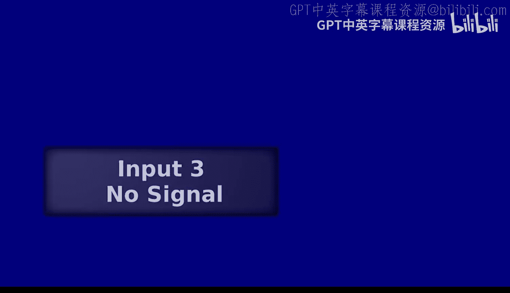
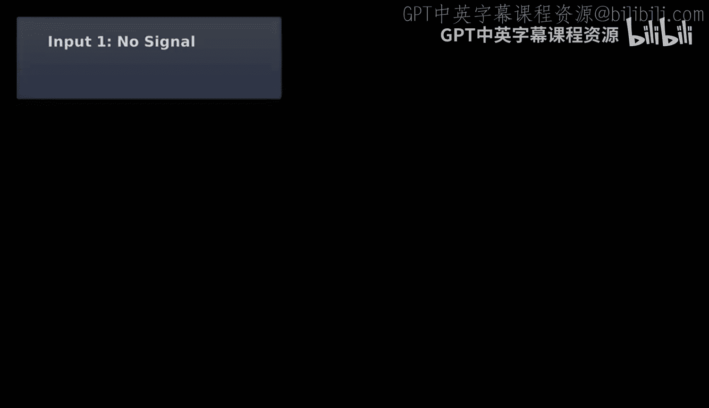
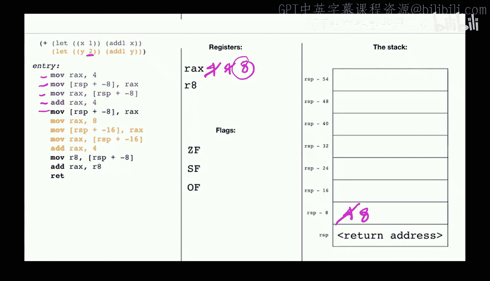
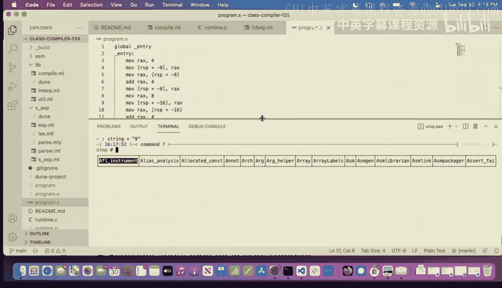
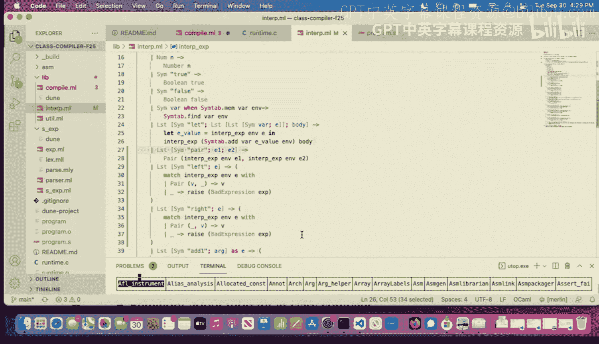
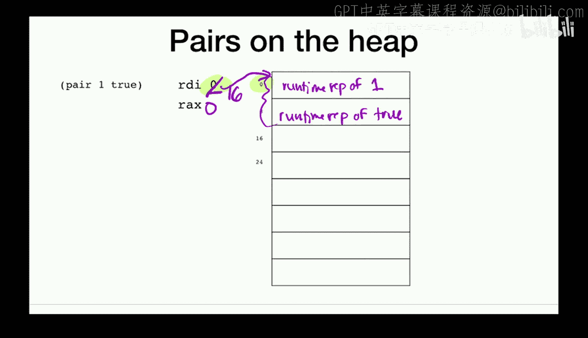
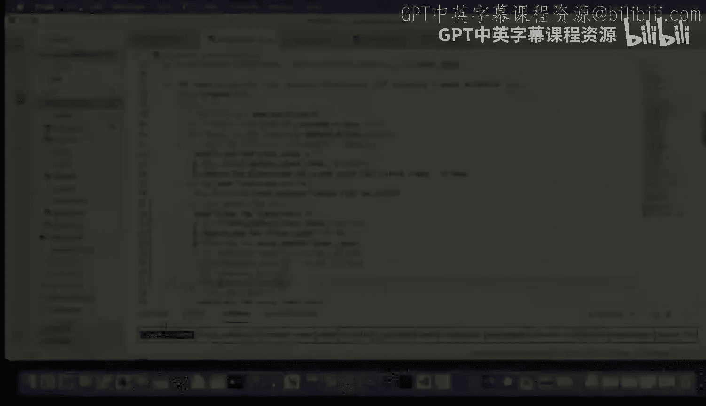
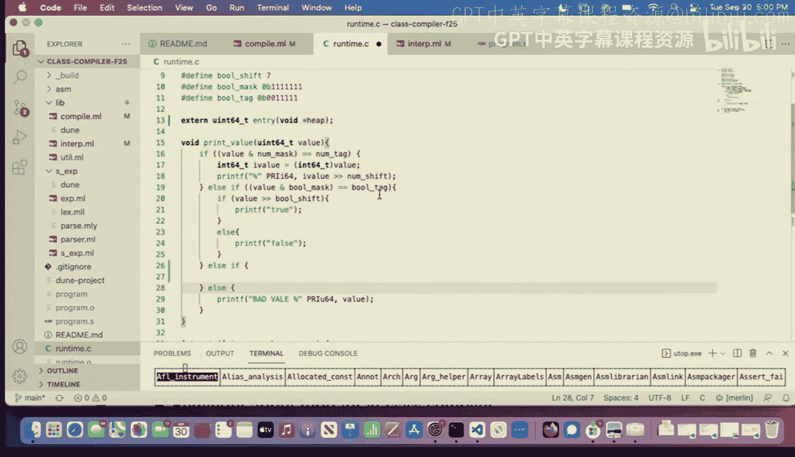

# 编程语言和编译器：第10讲：Let表达式续讲；对（Pairs）





在本节课中，我们将继续学习Let表达式，并引入一个重要的新概念：对（Pairs）。我们将探讨如何在编译器中实现它们，以及如何利用堆（Heap）来存储更复杂、生命周期更长的数据结构。

---

## 概述

上一节我们介绍了Let表达式，它允许我们为表达式命名并在其作用域内重复使用。本节中，我们将首先通过几个例子巩固对Let表达式实现的理解，然后重点学习如何为我们的语言添加对（Pairs）这一新特性。对是构建更复杂数据结构（如列表）的基础。

---

## Let表达式回顾与示例分析

在深入新内容之前，让我们回顾一下编译器中Let表达式的实现。核心在于我们引入了一个符号表（Symbol Table），它是一个从名称到整数的映射。

**核心概念：符号表映射**
这个整数代表该名称对应的值在运行时栈（Stack）上的偏移量（Offset）。例如，如果名称 `x` 映射到整数 `-8`，那么在生成的汇编代码中，我们通过 `[rbp - 8]` 这样的地址来访问 `x` 的值。

以下是编译Let表达式的关键步骤：
1.  计算Let绑定表达式 `e1` 的值，结果存入 `rax`。
2.  将该值存入栈上下一个可用的槽位（slot），例如 `[rbp - 8]`。
3.  更新符号表，将名称 `x` 映射到这个栈偏移量（例如 `-8`）。
4.  在这个新的符号表环境下，编译Let表达式的主体部分 `e2`。
5.  当在主体中遇到变量 `x` 时，编译器查询符号表，生成从对应栈偏移量（如 `[rbp - 8]`）加载值到 `rax` 的代码。

**重要讨论：编译时错误 vs. 运行时错误**
考虑一个使用了未绑定名称的程序，例如 `(let (x 1) y)`。这个错误是在编译时被发现的，因为编译器在处理到 `y` 时，会在当前的符号表中查找，发现 `y` 不存在，从而立即引发一个错误。符号表本身是编译器在编译时使用的数据结构，并不存在于最终生成的机器码中。

---

## 对（Pairs）的引入

现在，我们为语言添加三个新的构造：
*   `(pair e1 e2)`：构造一个对，包含 `e1` 和 `e2` 两个值。
*   `(left e)`：获取对 `e` 的左元素。
*   `(right e)`：获取对 `e` 的右元素。




在其他语言（如Lisp）中，这些操作通常被称为 `cons`、`car` 和 `cdr`。对是构建链表的基础，例如 `(pair 1 (pair 2 false))` 可以表示列表 `[1, 2]`。


---

## 在解释器中实现对

在解释器中实现相对直接。我们扩展值的类型定义，增加一个 `Pair` 构造器。




**代码：解释器中的值类型扩展**
```ocaml
type value =
  | Num of int
  | Bool of bool
  | Pair of value * value
```

对应的求值规则也很直观：
*   `(pair e1 e2)`：先求值 `e1` 得到 `v1`，再求值 `e2` 得到 `v2`，然后返回 `Pair(v1, v2)`。
*   `(left e)`：求值 `e`，如果结果是 `Pair(v1, _)`，则返回 `v1`，否则报错。
*   `(right e)`：求值 `e`，如果结果是 `Pair(_, v2)`，则返回 `v2`，否则报错。

---

## 在编译器中实现对的挑战

在编译器中实现对面临一个核心挑战：表示问题。一个对包含两个值，每个值在机器中占用64位（8字节）。而我们的约定是，任何表达式的最终结果都必须存放在64位的 `rax` 寄存器中。




我们无法简单地将两个64位值塞进一个64位寄存器。因此，我们需要一种间接表示法。

**为什么不能只用栈？**
考虑以下程序：
```lisp
(let (x 1) (pair (add1 x) (add1 x)))
```
对 `(pair ...)` 的结果需要作为整个Let表达式的返回值。如果将对的两个部分存储在栈上（例如 `[rbp-8]` 和 `[rbp-16]`），那么当Let表达式结束时，这些栈槽位可能被后续操作覆盖，导致返回的对“损坏”。栈更适合存储短期、生命周期明确（由作用域控制）的中间值。

**解决方案：使用堆（Heap）**
堆是一块我们可以动态分配的内存区域，适合存储生命周期较长或大小不确定的数据。我们将使用寄存器 `rdi` 作为“堆指针”，指向堆中下一个可用的地址。

**对的运行时表示**
1.  在堆上连续分配16个字节（两个8字节槽位）。
2.  将对左元素的值存入 `[rdi + 0]`。
3.  将对右元素的值存入 `[rdi + 8]`。
4.  将 `rdi` 的值（即这个对在堆上的起始地址）存入 `rax`，作为整个 `pair` 表达式的“值”。
5.  将堆指针 `rdi` 增加16，指向新的可用位置，防止后续分配覆盖当前对。

**关键细节：标记位（Tagging）**
我们之前用 `rax` 的最后两个比特来标记值的类型（如00表示整数）。现在，`rax` 中存储的是一个内存地址。幸运的是，由于我们按8字节对齐分配堆内存，任何堆地址的最后三位都是0。我们可以利用其中两位来标记这是一个“对”类型，例如使用标记 `01`。

**公式：对值的最终表示**
因此，一个对在 `rax` 中的最终表示是：
`rax = <堆内存地址> | <对标记位>`
例如，如果对存储在地址 `0x10`，对标记是 `0b01`，那么 `rax` 中的值就是 `0x11`。



---



## 编译器实现步骤

1.  **修改运行时系统**：在程序启动时（通常在C启动代码中），分配一块内存作为堆，并将其起始地址通过 `rdi` 寄存器传递给我们的汇编入口点 `entry`。
2.  **编译 `(pair e1 e2)`**：
    *   编译 `e1`，结果在 `rax`。保存到栈。
    *   编译 `e2`，结果在 `rax`。
    *   从栈恢复 `e1` 的值到另一个寄存器（如 `r8`）。
    *   生成汇编，将 `r8` 的值存入 `[rdi + 0]`。
    *   生成汇编，将 `rax` 的值存入 `[rdi + 8]`。
    *   将 `rdi` 的值（当前堆地址）复制到 `rax`。
    *   对 `rax` 应用“对”标记位（如 `or rax, 1`）。
    *   将堆指针 `rdi` 增加 `16`。
3.  **编译 `(left e)` 和 `(right e)`**：
    *   编译 `e`，结果在 `rax`。
    *   清除 `rax` 中的类型标记位，得到原始堆地址。
    *   生成汇编，从 `[rax + 0]` 加载值到 `rax`（对于 `left`），或从 `[rax + 8]` 加载（对于 `right`）。
4.  **修改打印函数**：扩展 `print_value` 函数，使其能够识别 `rax` 中的对标记，并递归地打印堆中对的左元素和右元素。

---

## 总结

本节课中我们一起学习了：
1.  **Let表达式的深入理解**：通过分析汇编代码，我们明确了符号表如何将变量名映射到栈偏移量，以及变量的作用域如何决定栈空间的复用。
2.  **引入对（Pairs）**：我们认识了这一构建复杂数据结构的基石。
3.  **堆内存管理**：我们了解了为何对需要存储在堆而非栈上，并学习了使用堆指针（`rdi`）进行动态分配的基本模型。
4.  **对的运行时表示**：我们掌握了将对表示为堆地址并添加类型标记的关键技术。



通过实现对，我们的语言表达能力得到了显著增强，为后续实现链表等数据结构打下了基础。在下一讲中，我们将看到这一切如何运作，并完善相关的运行时支持。