# 编程语言和编译器：第13讲：与环境交互（输出）📝

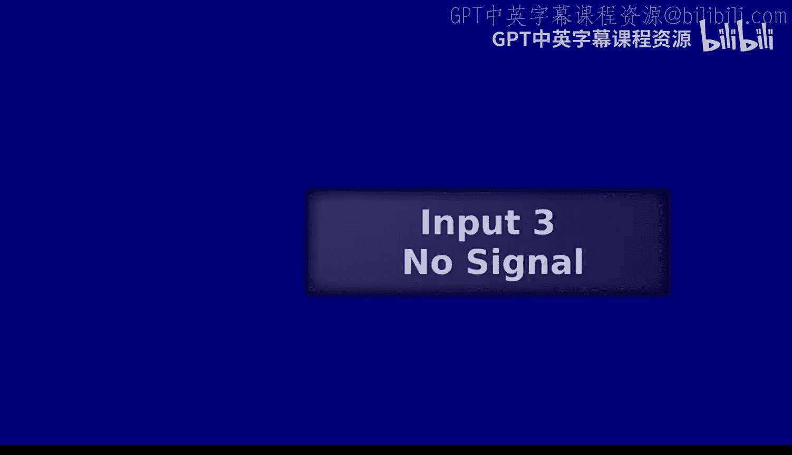

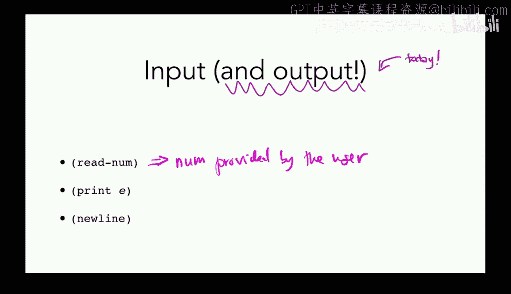

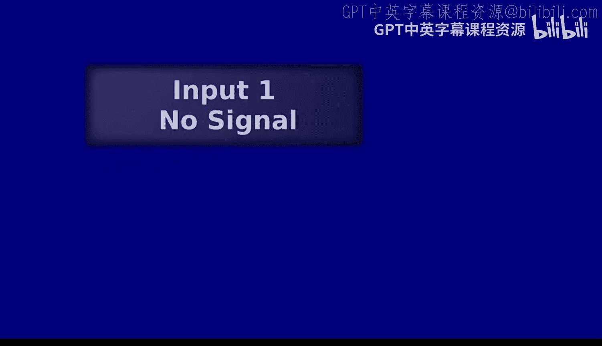

在本节课中，我们将学习如何让程序向用户输出信息。上一节我们介绍了如何从用户那里获取输入，本节中我们来看看如何将结果打印出来。我们将从回顾调用外部函数时栈指针的变化开始，然后实现 `print` 和 `newline` 功能，并引入 `do` 表达式来处理多个有副作用的表达式。

## 回顾：调用外部函数与栈指针

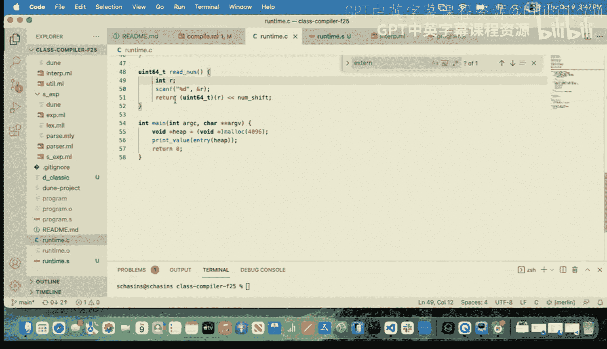

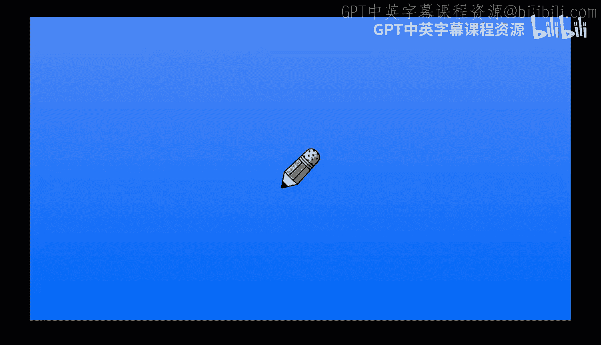

上一节我们介绍了如何调用 `readnum` 函数来获取用户输入。这是我们的编译器第一次生成会改变栈指针 `RSP` 值的汇编代码。

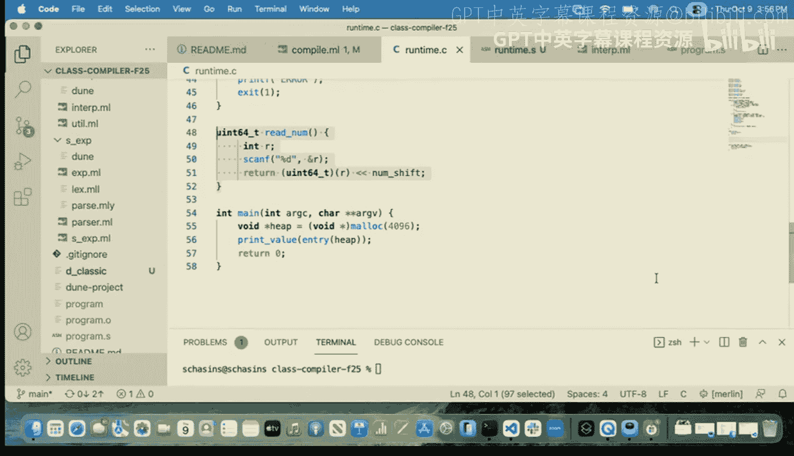


在此之前，我们之所以不需要改变 `RSP`，是因为我们完全控制着自己生成的汇编代码，清楚知道栈上发生了什么。然而，当我们调用像 `readnum` 这样的外部函数（由C编译器生成）时，情况就不同了。我们不知道这段外部代码会对栈做什么，因此必须调整 `RSP`，为它提供一个独立的栈帧空间，以保护我们自己的数据不被覆盖。

调用结束后，我们还需要将 `RSP` 恢复原状，以便后续代码能正确访问栈上的数据。

## 实现输出功能

现在，让我们来实现向用户输出的功能。我们将从解释器开始，因为它通常更直观。

### 在解释器中实现

首先，我们实现 `newline` 功能，它只是输出一个换行符。

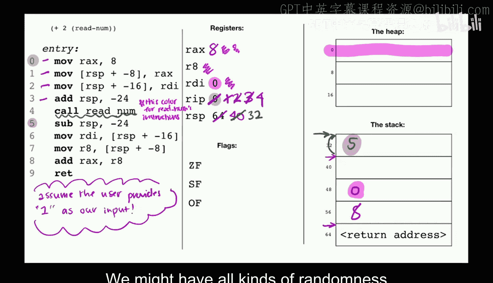


```ocaml
let interp_newline env =
  output_string stdout "\n";
  Bool true
```

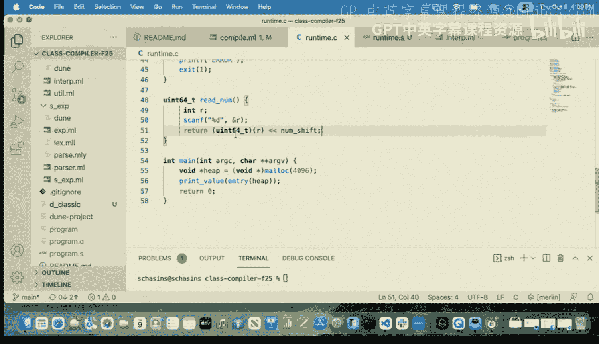


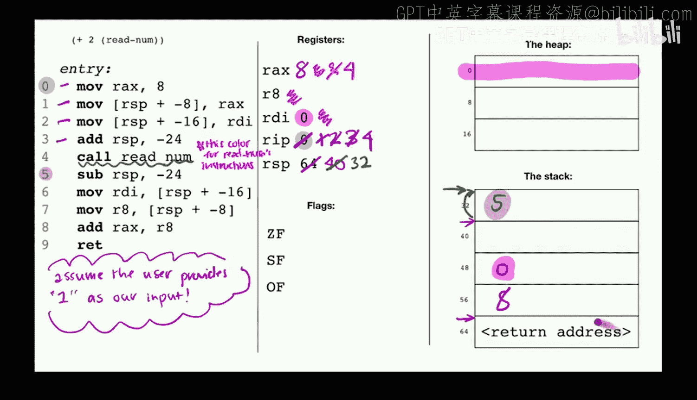

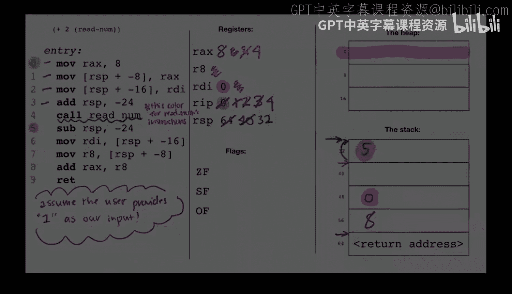

接下来实现 `print` 功能，它需要计算一个表达式的值，并将其转换为字符串输出。

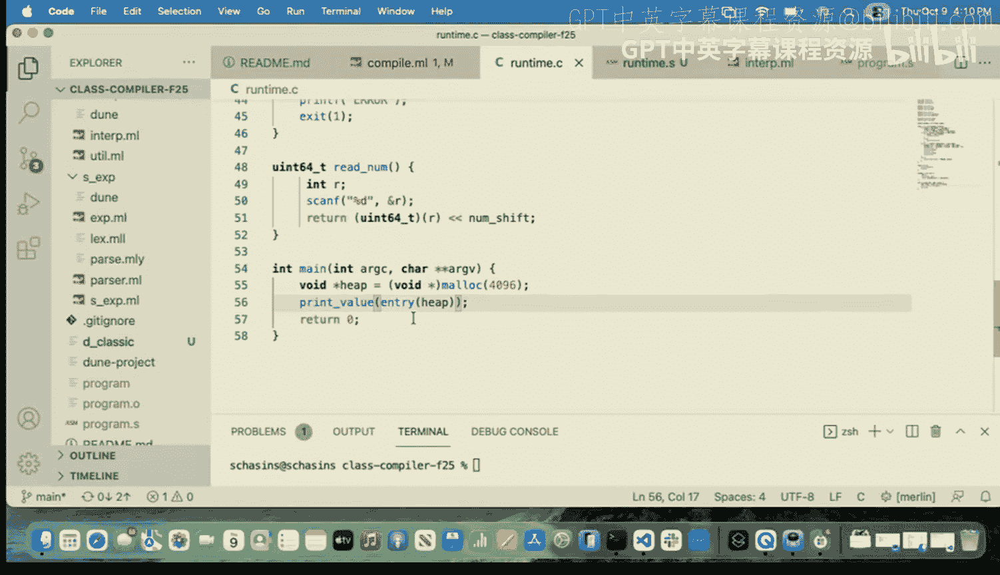


```ocaml
let interp_print env e =
  let v = interp_exp env e in
  output_string stdout (string_of_value v);
  Bool true
```

注意，这两个函数在执行了打印的“副作用”后，都返回了布尔值 `true` 作为表达式的结果值。

### 引入 `do` 表达式

现在我们的语言有了副作用（输入/输出），我们可能需要按顺序执行多个操作。例如，先打印一个数字，然后换行。因此，我们需要引入一个序列表达式 `do`。

`do` 表达式接收一个表达式列表，按顺序执行它们，并返回最后一个表达式的结果。

```ocaml
let interp_do env es =
  let values = List.rev_map (interp_exp env) (List.rev es) in
  List.hd values
```

这里使用 `List.rev` 是为了在映射后能方便地取到最后一个值作为结果。

## 在编译器中实现

现在，我们将同样的功能添加到编译器中。

### 实现 `newline`

在编译器中，调用运行时函数 `print_newline` 的汇编代码与调用 `readnum` 非常相似，但最后需要将布尔值 `true` 的运行时表示（即 `1`）放入 `RAX` 寄存器作为返回值。

```assembly
; 假设 RAX 已保存，RDI（堆指针）已保存
sub RSP, 24          ; 为C函数调用对齐栈
call print_newline   ; 调用运行时函数
mov RAX, 1           ; 将 true 的运行时值放入 RAX
add RSP, 24          ; 恢复栈指针
; ... 恢复 RDI 等寄存器
```

### 实现 `print`

对于 `print`，我们需要先编译其参数表达式，将结果值放入 `RAX`。然后，根据C调用约定，第一个参数应通过 `RDI` 寄存器传递，所以我们需要将 `RAX` 的值移动到 `RDI`。当然，在这样做之前，必须先将原来的 `RDI`（堆指针）保存到栈上。

```assembly
; 编译表达式 e，结果在 RAX 中
; 保存当前 RDI 到栈上
mov [RSP - 16], RDI
; 将参数移动到 RDI
mov RDI, RAX
; 调整栈并调用
sub RSP, 24
call print_value
mov RAX, 1           ; 返回值 true
add RSP, 24
; 恢复 RDI
mov RDI, [RSP - 16]
```

### 实现 `do`

在编译器中实现 `do` 序列反而比解释器更简单。我们只需要按顺序编译列表中的每个表达式，并将产生的指令列表连接起来即可。因为每个表达式编译后的代码都会将结果存入 `RAX`，执行下一个表达式时会覆盖它，所以序列执行完后，`RAX` 中自然就是最后一个表达式的结果。

```ocaml
let compile_do si es =
  List.concat_map (compile_exp si) es
```

## 更新运行时与测试

为了让这些新功能工作，我们需要在运行时库中声明相应的外部函数，并确保链接器能找到它们。同时，我们修改了测试框架，允许为需要输入的程序提供预设的输入字符串，并移除了程序结束后自动打印结果的默认行为。现在，程序员必须显式使用 `print` 才能看到输出。

## 有用的列表函数小练习

在课程最后，我们快速回顾了几个OCaml列表处理函数，它们对完成作业很有帮助：

*   `List.mapi`：它会在映射过程中同时提供元素索引。
*   `List.map`：经典的映射函数。
*   `List.fold_left`：从左到右的折叠操作，功能强大。

尝试用 `fold_left` 来实现 `map` 函数，是一个很好的练习，能帮助你深入理解这些核心概念。

---

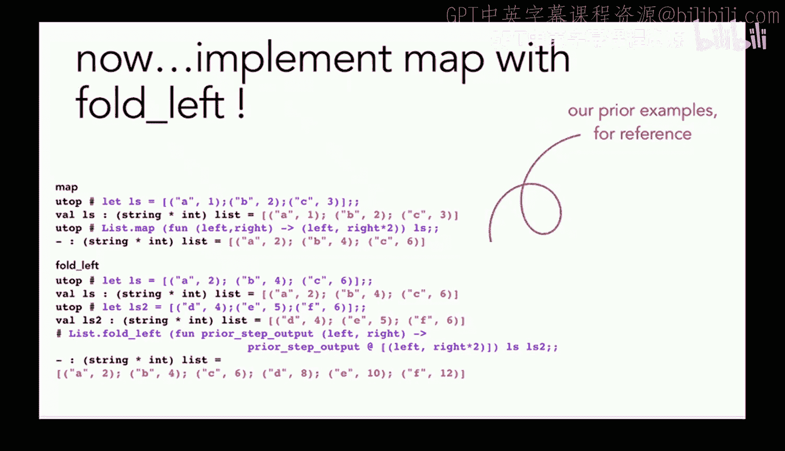

本节课中我们一起学习了如何为语言添加输出功能。我们实现了 `print` 和 `newline` 操作，并引入了 `do` 表达式来组合多个带有副作用的操作。我们还看到了在编译器中与外部函数交互时需要遵守调用约定并妥善管理栈指针。现在，我们的语言已经能够与用户进行基本的输入输出交互了。