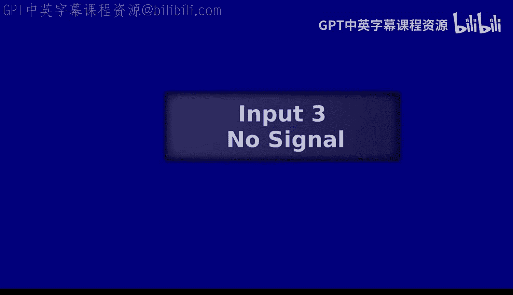
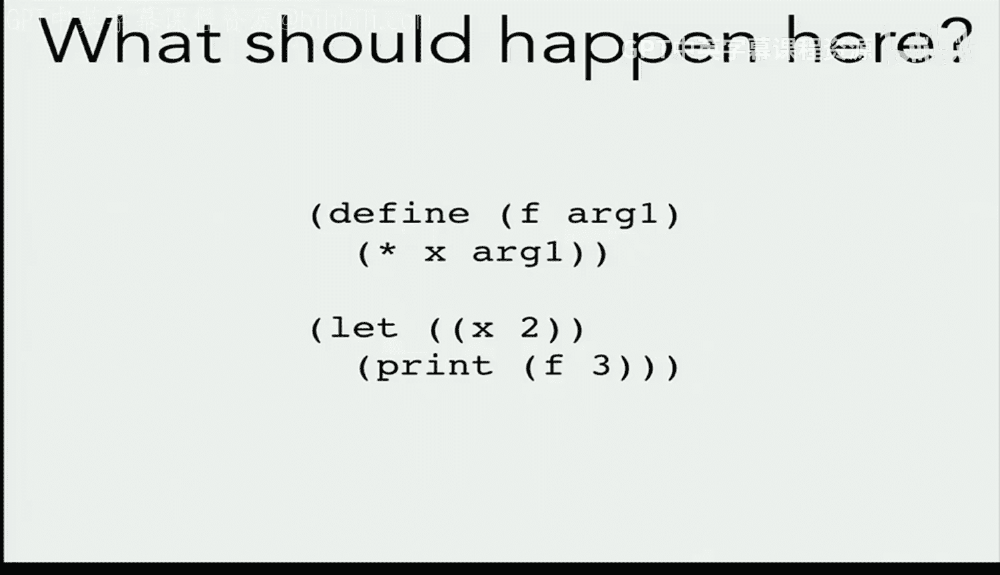
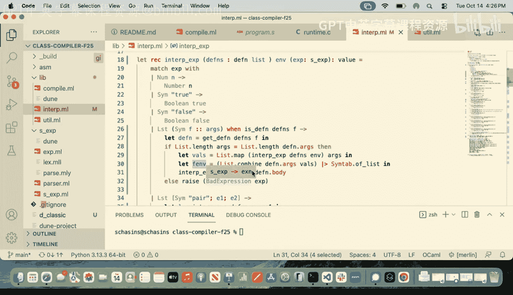
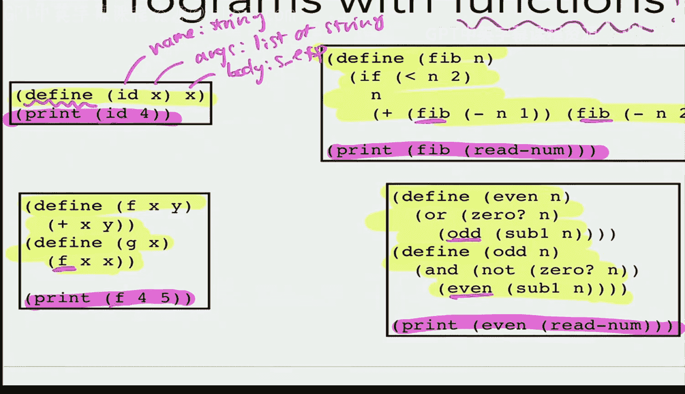
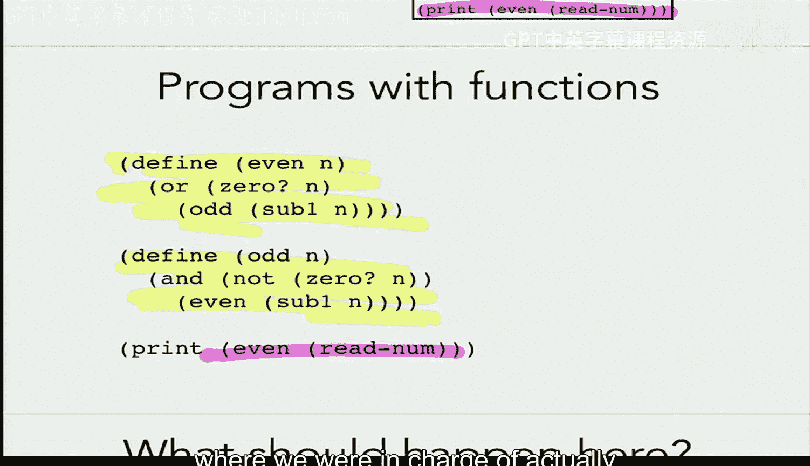
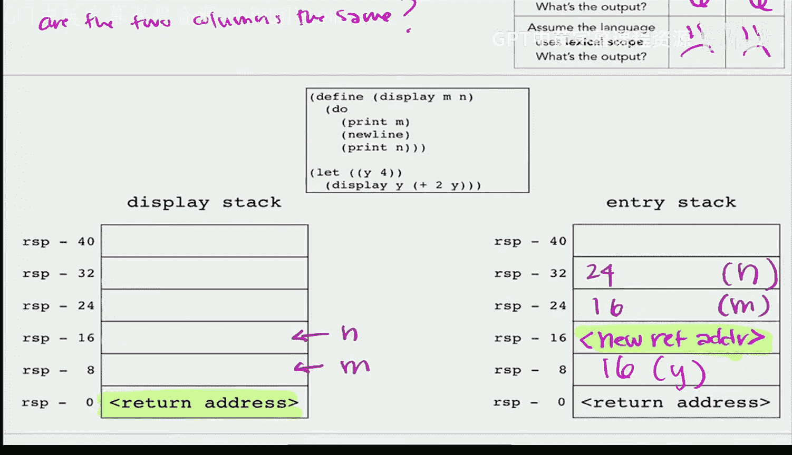
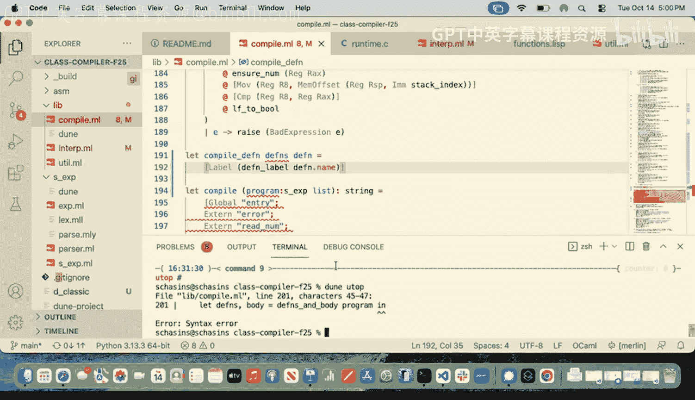

# 编程语言和编译器：第14讲：函数！🚀




在本节课中，我们将学习如何在我们的解释器中实现函数。我们将探讨函数定义、函数调用、递归，以及一个非常重要的概念：词法作用域与动态作用域的区别。通过本节课，你将能够运行包含函数的程序，并理解函数执行时环境的管理方式。

---

## 解释器的初步调整

首先，我们需要调整解释器以处理包含函数定义的程序。之前，我们的程序只包含一个表达式。现在，程序由一系列函数定义和一个最终的主体表达式组成。

为了实现这一点，我们引入了一个新的数据类型 `definition`，用于存储函数定义的信息。

```ocaml
type definition = {
  name : string;
  args : string list;
  body : s_expr;
}
```

这个类型包含函数名、参数列表（字符串形式）和函数体（一个S表达式）。我们还提供了一些辅助函数来解析程序，分离出定义列表和主体表达式。

接下来，我们修改解释器的入口点。不再将整个程序解析为单个表达式，而是解析出多个S表达式，然后分离出定义和主体。

```ocaml
let defns, body = parse_many program |> defns_and_body in
interp_expr defns body
```

我们还需要修改 `interp_expr` 函数，使其接收一个定义列表作为额外参数，以便在解释过程中可以查询可用的函数。

---

## 处理函数调用

当解释器遇到一个符号（可能代表函数调用）时，我们需要判断它是否是一个有效的函数调用。

以下是检查函数调用有效性的两个关键步骤：
1.  **检查函数是否存在**：确认调用的函数名是否在提供的定义列表中。
2.  **检查参数数量**：确认调用时提供的参数数量是否与函数定义期望的参数数量一致。

如果这些检查通过，我们就可以准备执行函数体。这涉及到计算实际参数的值，并为函数体创建一个新的执行环境。

---

## 关键决策：词法作用域 vs. 动态作用域



在准备执行函数体时，我们必须决定哪些变量名在函数体内是可见的。这引出了编程语言设计中一个核心概念：作用域。


考虑以下程序：
```lisp
(let ((x 2))
  (define (f arg1) (+ arg1 x))
  (f 4))
```

函数 `f` 在其函数体内引用了变量 `x`。`x` 的值应该是什么？这取决于语言采用的作用域规则。

*   **词法作用域（静态作用域）**：函数体内可见的变量由函数在**源代码文本中**的位置决定。在上面的例子中，函数 `f` 定义在 `(let ((x 2)) ...)` 的内部，因此在 `f` 的函数体内，`x` 应该绑定为 `2`。大多数现代编程语言（如Python、Java、OCaml）都使用词法作用域。
*   **动态作用域**：函数体内可见的变量由函数**被调用时**的运行时环境决定。如果采用动态作用域，上面例子中 `x` 的值将取决于调用 `f` 时，当前环境中 `x` 绑定的值。这会使程序的行为难以预测和理解。







在我们的解释器实现中，我们选择了实现词法作用域。这意味着当进入一个函数体时，我们创建一个全新的环境，其中只包含该函数的形参与实参的绑定。我们**不**将调用点的环境传递进去。

```ocaml
(* 为函数调用创建新环境：仅包含形参到实参的映射 *)
let new_env = List.combine defn.args arg_vals in
interp_expr defns new_env defn.body
```

这个决定使得函数的行为仅依赖于其定义处的代码结构，而不是其调用历史，从而提高了程序的可读性和可维护性。

---

## 递归与相互递归

由于我们将所有顶层函数定义都传递给了每个函数的执行环境，因此函数可以轻松地调用自身（递归）或调用其他已定义的函数（相互递归）。例如，判断奇偶性的函数可以这样定义：

```lisp
(define (odd n)
  (if (= n 0)
      false
      (even (- n 1))))

(define (even n)
  (if (= n 0)
      true
      (odd (- n 1))))
```

因为 `even` 的函数体在执行时，其环境中的定义列表包含了 `odd` 的定义，所以它可以调用 `odd`，反之亦然。



---


## 向编译器迈进

在解释器中，实现函数调用相对直接：遇到调用时，找到函数体，然后解释执行它。然而，在编译器中，我们不能采用同样的“内联展开”策略。考虑一个递归函数（如斐波那契数列），如果每次调用都将其函数体的汇编代码复制一份，将会生成无限大的汇编程序，这是不可行的。

编译器需要一种不同的机制：**函数调用指令（call）和返回指令（ret）**。我们需要生成两部分代码：
1.  **调用点代码**：负责计算参数值，将其放置到约定好的位置（例如栈上），然后使用 `call` 指令跳转到函数代码的入口标签。
2.  **函数定义代码**：函数入口处有一个标签，函数体汇编代码负责从约定位置获取参数，执行计算，最后使用 `ret` 指令返回到调用点。



这要求调用方和被调用方对参数的传递位置（调用约定）有精确的共识。此外，为函数生成的标签名必须是确定性的，以便调用方能够引用，而不能使用每次生成唯一名称的 `gensym` 函数。


---

## 总结



本节课中我们一起学习了如何在解释器中实现函数。我们调整了解释器结构以处理函数定义和调用，实现了对递归和相互递归的支持，并深入理解了**词法作用域**与**动态作用域**这一关键区别及其实现方式。我们还探讨了将函数功能移植到编译器时将面临的挑战，即需要利用 `call`/`ret` 机制和确定的标签来管理代码的跳转与返回，而不是简单地在调用点内联函数体。这为后续在编译器中实现函数奠定了基础。